<details>
<summary>📊 靜態圖表 (點擊展開)</summary>
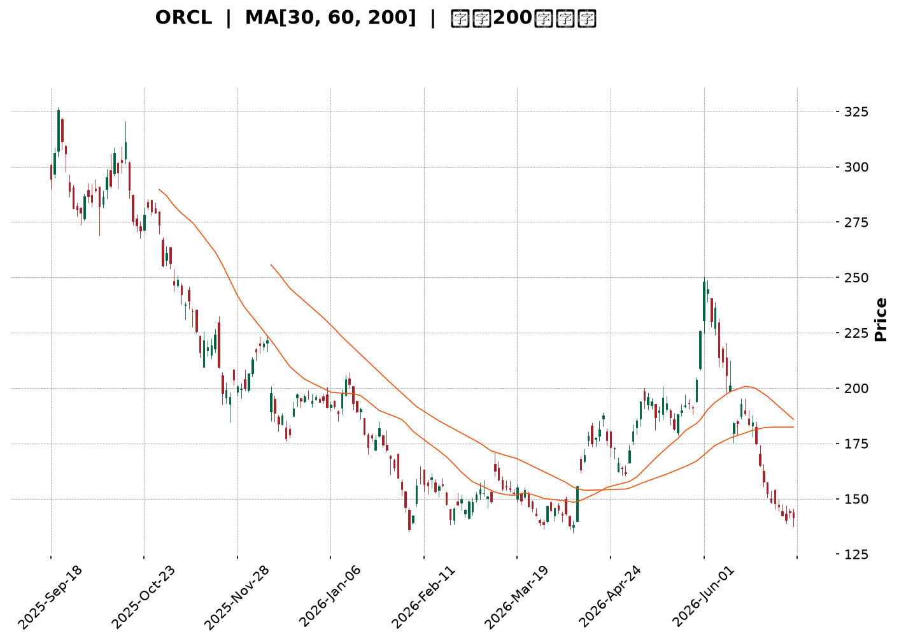
</details>

<html>
<head><meta charset="utf-8" /></head>
<body>
    <div style="height:500px; width:100%;">                        <script>window.PlotlyConfig = {MathJaxConfig: 'local'};</script>
        <script charset="utf-8" src="https://cdn.plot.ly/plotly-3.6.0.min.js" integrity="sha256-QaOVwtVY0T02VaHrr6pnoHLCwayMJp4O5n4YyaE3rJk=" crossorigin="anonymous"></script>                <div id="candlestick-chart" class="plotly-graph-div" style="height:100%; width:100%;"></div>            <script>                window.PLOTLYENV=window.PLOTLYENV || {};                                if (document.getElementById("candlestick-chart")) {                    Plotly.newPlot(                        "candlestick-chart",                        [{"close":{"dtype":"f8","bdata":"AAAAIMNkckAAAADg5CNzQAAAAMBKWXRAAAAAQPd1c0AAAAAAuCBzQAAAAODIEHJAAAAAwNmTcUAAAAAAvYhxQAAAAMCbcHFAAAAAgPTrcUAAAADATehxQAAAACBlvnFAAAAAYOkUckAAAACAO6BxQAAAAEDs5XFAAAAAAFdyckAAAAAguzJyQAAAAIAPInNAAAAA4MeSckAAAADAP9xyQAAAAKBpcXNAAAAAIH4YckAAAAAAyzdxQAAAAACDF3FAAAAAQOrvcEAAAABAwGVxQAAAAICXmXFAAAAAoOZ6cUAAAAAg1nFxQAAAAKDlGXFAAAAAoEXqb0AAAADAGFBwQAAAAABnBHBAAAAAoO\u002fUbkAAAABg\u002fxhvQAAAAEDzSW5AAAAAoI65bUAAAACgfettQAAAAEClVm1AAAAA4FAzbEAAAACAtwdrQAAAACClr2tAAAAAoIxQa0AAAAAAlmRrQAAAAKDhBGxAAAAA4OYsakAAAAAgebFoQAAAAODQ4WhAAAAAgHN6aEAAAABgqXZpQAAAAADuFmlAAAAAoM72aEAAAABg5ftoQAAAAIDCzmlAAAAAoKugakAAAADgCAhrQAAAACAtZmtAAAAAwKmFa0AAAADAu7RrQAAAAOBVtGhAAAAAQOmZZ0AAAABATPlmQAAAAODtb2dAAAAAQNcrZkAAAAAgxl1mQAAAACCF2WdAAAAAQGOlaEAAAACgs0RoQAAAAOAUiWhAAAAA4PuYaEAAAABg+UVoQAAAACAtgGhAAAAAgAY3aEAAAAAgeFBoQAAAACA97WdAAAAA4CESaEAAAACgMPVnQAAAAMC7j2dAAAAAwIe6aEAAAADA9n5pQAAAAADAMmlAAAAAAPUdaEAAAABADqZnQAAAAACZzWdAAAAAwGZpZkAAAABgy6hlQAAAAEDqMWZAAAAAoGMRZkAAAADgwrlmQAAAAABSyWVAAAAAwFqGZUAAAAAgfw1lQAAAAOA6gGRAAAAA4BfwY0AAAADANkRjQAAAAMAaRWJAAAAA4CgAYUAAAACAVcphQAAAAKBwgWNAAAAAIKzqY0AAAADgnZNjQAAAAKDufWNAAAAAAKXyY0AAAABA5C1jQAAAAAAMdGNAAAAAYNh\u002fY0AAAABgEXJiQAAAAIAummFAAAAAIDQ0YkAAAABAAmxiQAAAAOAtuWJAAAAAIJscYkAAAACgYJdiQAAAAGC5j2JAAAAAoN76YkAAAABACkhjQAAAAECvDWNAAAAAQArhYkAAAAAgKZxiQAAAACCsUWRAAAAA4GTTY0AAAACgPlJjQAAAAECrbWNAAAAAANpEY0AAAABAxQtjQAAAAMBRX2NAAAAA4BalYkAAAADAsDljQAAAAIB\u002fUmJAAAAAoGAwYkAAAADAA8phQAAAAMCQZWFAAAAAQCRKYUAAAADAIlNiQAAAAGAvF2JAAAAAgNs7YkAAAAAAEiFiQAAAAKB+1WFAAAAAwB7lYUAAAAAghTthQAAAAEDhQmFAAAAAANdzY0AAAAAAAGBkQAAAAIDrOWVAAAAAQOFKZkAAAACA6+FlQAAAAGCPMmZAAAAAoHClZkAAAAAAAHBnQAAAAMD1CGZAAAAAwPWoZUAAAABguJ5lQAAAAGC4vmRAAAAAYI96ZEAAAADgeixkQAAAAGCPemVAAAAAoEeJZkAAAABAMytnQAAAAMD1QGhAAAAAQOFSaEAAAABgZn5oQAAAAEDhOmhAAAAAYI9aZ0AAAADgUbhnQAAAACCFc2hAAAAAYGYeaEAAAAAghVNnQAAAAGC4rmZAAAAAwB6FZ0AAAADgo7hnQAAAAGCPAmhAAAAAgOshaEAAAABguN5nQAAAAGBmdmlAAAAAwPU4bEAAAADAzARvQAAAAGCPkm5AAAAAYI\u002fKbEAAAABA4YptQAAAAIDCtWpAAAAAgD16akAAAACA67lpQAAAAOBRKGlAAAAAQDMDZ0AAAAAAKQRnQAAAAOB6FGhAAAAAYI+KZ0AAAADA9fBmQAAAAKBHCWdAAAAAgD3iZUAAAADAHqVkQAAAAMD1sGNAAAAAYLgOY0AAAADA9ZBiQAAAAOBReGJAAAAAoJlRYkAAAAAAANBhQAAAAOCjiGFAAAAA4FH4YUAAAABAM7NhQA=="},"high":{"dtype":"f8","bdata":"IuPkeQ\u002fXckBgY05uyUpzQAP\u002ftRS5bnRAqHR5aEkndECSQcNmYGBzQCnUmkuThnJAyQInnSs7ckBR5WDc2rtxQJdR1TxsnHFA\u002fKd7EoP7cUCB3Nh8kUpyQCxstYhURXJAGKe4w7ZlckB3YnKjyS5yQFh0k5\u002f1E3JA\u002fFk4rhuyckB3AnLfch1zQJdCP3TWTHNAVJohqPjockB3ZTFfxFFzQGN\u002fAdYeCXRAOkBtyL7mckALGxsLk\u002fdxQEaa4IloaXFAoCw7jBw4cUBJTtpS75VxQKkT5Y751nFATdnCJ\u002fTTcUDvV+vLdrtxQAo+xURmfnFAhoofV8zBcEDyFOLx+4JwQNtZUn72f3BAmVSmARG3b0ALUpwNeFtvQFPrmXGP8W5AzcfxddDdbUCqeL2nW7duQLywr9T9f21AXfJF6qJrbUDyAhL9HPlrQNZuQFs5NWxAGlhLBg6ua0CWO7GjrcprQCnFYok1WGxAu9k7FkQSbUCSRu7sNOFpQLUlyIBnUmlA+mgQayXGaED9xAXU9BZqQKTfm1xVI2lAGeubCTpIaUBexdo0ag1qQFXkTH7N1GlA59Wf9gTDakChtxRvGUVrQKWwQtsS7GtApYyZdlSoa0DBoJ3LM\u002f5rQKqdN6QzGGlAPD3q+oeUaEDApTc8G3pnQE4F7zWBlGdAgrpymYwrZ0BHjduWNfRmQC3EP0S0PWhAo3pd3L6yaEC1uNev239oQIeGLPk0omhAUJ5cq63kaECiwPakhaloQK+rxTVjpWhA68TIi9t\u002faEBNnbTmEKxoQKFTyA+pDmlAOMMLVhI2aEBbHxZnMk9oQIHZjVQUuWdAIW3KC3fvaEA24ePBMLxpQBjeguZ04mlAE6ZvSUwfaUCmh+XAmUpoQOF32IJ45mdAM7LBVztRZ0CeyqMGFn9mQN\u002ftzgsOcWZAkwCaocpgZkAqhh4MSBVnQBDpaBIGY2ZA8pFMcIahZkCYVj2XZjRlQPy9GRT9CWVAt2txIFVTZUCDDOrVaNpjQLYgdlfvLGNAHLCRQ0dBYkC9UXyKc9ZhQAcYQ0c15mNA44JmTw+aZEBZtMiM5GJkQJSIoiKRz2NAYbYaKoY3ZEDvfeFZONdjQKrlL8gUmGNA2yBUMbvwY0AcTgqfhy5jQKo9YJtcKWJAa6eacvlHYkBspyRy4xdjQAK\u002fEO8D\u002f2JAQLyYXEoyYkACjO4Et7RiQCoqCULzzGJA62kbZWkiY0ConddPfaxjQFnHjL9Z1GNAR2tpNBLvYkB3a+gaUDNjQPC2DagwZWVA415iTt7nZEB+CDH\u002fuwZkQOt8nSUAxmNA\u002ficbhb3LY0CAcNC6x01jQGczfJX2i2NA0RKSlu4WY0DDM2sxnGdjQMoPSdaoK2NA8WUWFjGqYkBeXrAluj5iQCc7155MpmFARlWskqyWYUCctlQbYlxiQCl9fPohpGJAFyUVSsU9YkDpIcgtDoFiQJ3aY5UjAmJAYmWw+9ndYkAAAACgmdlhQAAAAKBwhWFAAAAAwB59Y0AAAADAzCxlQAAAAIDrkWVAAAAA4KOIZkAAAAAAABBnQAAAAOBROGZAAAAAQOEqZ0AAAACAwqVnQAAAAOB6vGZAAAAAYLiWZkAAAACgmbFlQAAAAGBmFmVAAAAA4FGYZEAAAACAwqVkQAAAAKCZyWVAAAAAAADwZkAAAADgo1BnQAAAAKBHSWhAAAAAwMwEaUAAAAAAAMBoQAAAAIDCdWhAAAAAoHAdaEAAAACAPfJnQAAAAGC4FmlAAAAAgMKNaEAAAADgUdhnQAAAAEAKl2dAAAAAQAqHZ0AAAACAPRpoQAAAAAAAoGhAAAAAYGZmaEAAAADgegRoQAAAAAAAoGlAAAAAoEdJbEAAAAAAAEhvQAAAAAAAIG9AAAAA4FEQbkAAAABgZt5tQAAAAIAU7mxAAAAAgOtha0AAAAAAAJBrQAAAACBcj2pAAAAA4KMYZ0AAAABgjzJnQAAAAIA9amhAAAAAgD1qaEAAAACAFMZnQAAAACCuf2dAAAAAYI8SZ0AAAABgj8plQAAAAAAAuGRAAAAAANezY0AAAACgRzFjQAAAAAAAUGNAAAAAgMK9YkAAAACgmXFiQAAAAIDrYWJAAAAAANczYkAAAACA6zFiQA=="},"hovertemplate":"\u003cb\u003e%{x|%Y-%m-%d}\u003c\u002fb\u003e\u003cbr\u003e\u958b: $%{open:.2f}\u003cbr\u003e\u9ad8: $%{high:.2f}\u003cbr\u003e\u4f4e: $%{low:.2f}\u003cbr\u003e\u6536: $%{close:.2f}\u003cextra\u003e\u003c\u002fextra\u003e","low":{"dtype":"f8","bdata":"9FbhyGsbckD1ilXq329yQODhCJZFCHNA704EmfU5c0A\u002f90EY5ZpyQFWOEien5HFAJFdqYIyMcUDe7B+Fu1ZxQKNjYGDWG3FA517y70Q7cUBHRg0t97xxQCcPF0FsnHFAI97g1V4IckDIOlkaDc5wQBW6YK8SlnFArXi9ihbYcUAbnQjEnyNyQJ6j72y+fnJAmK27niUjckDZK7A0gpFyQNRlm8uA03JA5ZVOsOfbcUBhPSxIDhpxQNeyVeyN6XBApKzULrC5cEDe7kshn+twQGzlq+RqiHFAdvnYxp1hcUCOdR2hOW1xQMYy31AV23BAUwqZ5d7Wb0BQgrDzi+RvQESD5PZ5tW9AUCITmih2bkCt+Oq8rbBuQD4lyeeCum1A\u002fXzZvMndbECeOufg53NtQAzh5J6+b2xAXsBCZzwZbEC7uNDU+bxqQI691ClyL2pAIhGXJcrHakDgFBmVE6ZqQDBkKady\u002f2pAWFNeg38gakA5CDCNxQtoQBQFf\u002fSfI2hA1EfnI+EPZ0AZwcs3JyBpQL7zxuXljGhAFwg1pfRvaEDnbbQp6dhoQLwUK+nTxWhAZ61KheqhaUBXqwejFopqQLmPeN+58mpANQArXEwea0BwwG\u002fvCAhrQFmC0y\u002f2ImdARAEFwwIbZ0AU5x5\u002fWIlmQFhS12Of62ZAhVY07KH\u002fZUARDZdMqC9mQGttF4ISX2dAIYRhUN\u002f0Z0C2lUV7hOBnQB5j9PpwJ2hAV1B48DBdaEDRptpX1O5nQLOHJC14UGhAAImy4UwxaEAzUT4twyBoQDomOEL45GdABce82iCxZ0A0SldnedpnQMPstd5qIGdAWJoHVO+DZ0CNWQvPYIpoQNDXRZnF\u002fmhAooYdNavEZ0Btup79YpdnQBNEF4MvPGdAKZZ1N4tXZkAU8r4kM0BlQJMbWKZX\u002fGVA8IHI\u002ftdsZUBIY9OaEz1mQH0T4YhqomVAUrclDWFoZUAZgEOtph5kQDwkuNR\u002fVWRAkgvtFS7uY0DUuxza4etiQGAkCn6s\u002fWFA5Nur0e\u002fYYEAPJ886pk1hQBcK\u002fsygT2JAGdARKj2NY0CGibo42S5jQJNr5vkD\u002f2JAX25CCPxXY0BEm\u002fkTIgtjQHkO1Dr72mJABqYulEpnY0DZOk+MEFxiQHhuVc1xQ2FA7IU7puhHYUBgd39OeFpiQA9IHj+iFGJAOQa8tl+zYUDkOf82CZZhQDrfqA2r0WFAjgPlG5iSYkBAf6zGHrNiQPy6rhT04mJAjNgGhHM9YkArbfzV3X1iQCGvleusAGRAEoVt7trBY0Ay9ymfoTNjQGx3p4AcP2NAqxffbeceY0DDfzqlWPBiQEycNsjli2JALm42E+xtYkBEik1f78ViQDQvrFfYSmJAVh19fBgDYkDbz8GSZ8FhQI\u002f3xmYyOmFAU7AEvyUPYUBgC+fen2thQJlcatdTBWJAWAFzefl5YUAv+E3PLethQPCKm5d+bmFAROZRa+LMYUAAAAAAAABhQAAAAIA90mBAAAAAQAp3YUAAAACA6zFkQAAAAGC4xmRAAAAAoJm5ZUAAAAAghatlQAAAAOBRsGVAAAAA4FEAZkAAAACgmdlmQAAAAGCPwmVAAAAAoJkZZUAAAADAzPxkQAAAAKCZQWRAAAAAwMwUZEAAAABgjwpkQAAAAMDMxGRAAAAA4FHIZUAAAAAAAGBmQAAAAKBw1WZAAAAAoJnZZ0AAAABguMZnQAAAAEAz02dAAAAAANebZkAAAACA6yFnQAAAAGBmLmdAAAAAwMycZ0AAAADgo+hmQAAAAIDCnWZAAAAAoJlZZkAAAABgZmZnQAAAAEAz42dAAAAAgOvRZ0AAAACgcH1nQAAAAAApLGhAAAAA4FEAakAAAABAMxNsQAAAAEDh2m1AAAAAIIVzbEAAAAAAAABsQAAAAGBmLmpAAAAAYI8qakAAAACgR7loQAAAAIDCxWhAAAAAwPXoZUAAAAAAAGBmQAAAAGC4RmdAAAAAwB51Z0AAAABgj9JmQAAAAGBmNmZAAAAAwMzMZUAAAAAghZNkQAAAAEAza2NAAAAAIIXLYkAAAAAAAIBiQAAAAGBmJmJAAAAAIFwPYkAAAAAAANBhQAAAAGCPWmFAAAAAwB6lYUAAAACgmTFhQA=="},"name":"\u50f9\u683c","open":{"dtype":"f8","bdata":"G9B3na3KckBdRQtKi4pyQFpih81KM3NAIxhFemkXdEBUfdlWsVZzQEvKmMVUT3JARVDnrksrckCPY\u002fed8qVxQCYG222Al3FAp5IAr99JcUD9tEPGPhhyQGdqKkpS9XFA3SEf6nMhckB3YnKjyS5yQJCfchH3snFA6ift904cckCmHfi\u002fIqdyQMNKm6gCjnJABW7mS3TbckDHdleamvByQBsXfmC8+3JA4YWwKlHeckCWyTyM9vJxQNotUROVRnFAFt6YlkMScUCWbvh+r\u002fRwQOg8a3THwnFAEYqSqR3NcUC+ZoQ2WJRxQNFqe+Xae3FAZyzC25OxcEBKkXHNzB5wQFvjAIDreXBA6SIpkIAOb0AxuRe1qsxuQNfWmfuezW5A94s5wkmxbUABjilzVI5uQJZgSJ8wWW1Afo3ICmlpbUCjCozetPNrQIs1VqlaMWpA\u002frdUbhIca0B1tt9ldtxqQFnYAxgbN2tAU+rF7vC3bEDe6ZFXFrppQHHeB14LdWhAPFbVuaAcaEBq12TYDQdqQLrhS5VTyWhAPJXiI9DoaEB147rcYnxpQCSC5gBo42hAAMwKGOXSaUAWOH5zMjVrQGeiyDjwf2tAeycAzfRVa0AXZnsKQI5rQBn3+miVrmdApPIEyHVlaEAMBVKiemRnQGU+IiJN8mZAA5KBtRfGZkBmHYoIVLNmQJnEpt+oZ2dAH4SOzcVzaECbO5VWXmdoQKBD21XjOWhAm599vzWbaEC0AJsqLB9oQFx+McqZW2hA6AGv0gxnaEBOCojwcYhoQPvOXG0dpGhAu69y6kjsZ0DrLkfqbUNoQP8REXXatmdAIjr0NsbfZ0BOFZJcMZ1oQEFXshsriWlAE6ZvSUwfaUCmh+XAmUpoQJhJriT4p2dAM7LBVztRZ0Ap3NOBv2FmQEcAHtLcV2ZAbetyUZ2AZUBye2LaQE9mQMT96G4fUmZAW7b\u002fTfXJZUAPzSt\u002f2TFlQI3gYsS18mRAFPkrXGdKZUC6TM+ksbZjQB9mcCRXK2NA43CL+fsiYkD\u002f8r2Hb2hhQK3DgHEkf2JAf4IaHS7uY0BZtMiM5GJkQK8tgagrrGNAERIegEPWY0DCaLbKw61jQPoyDk7sO2NA8kmOt5KUY0D1iFnLhhhjQGuvRZ7aJWJAkKcpnTGLYUDf+i3qgZRiQF7VlVa1iGJAFOx0tiLsYUCXHWsrEaRhQCv+ePXgB2JAbzTSyZyvYkBuLPKZ4gFjQHtABaRoDGNAfi0qpZ3FYkAhcWUOuyJjQMs89yyhuWRAJtPxD8iCZEDeW53J4s9jQMTaHO+JcGNAsfW4ncRcY0A8fXP+thtjQOWAxoT2vWJAWGVY6o0QY0C01RJhk9xiQKvGR7\u002f1DmNAqM9yWr2WYkCSQxVVdOxhQErpOUoQjmFAUe1t5a5xYUBXu1xq+XlhQMLZ5nFGkmJA3Wso5A7JYUAc7ruzqF1iQCpdoVvy6GFAraeRTty4YkAAAABgZsZhQAAAAIA9KmFAAAAA4KN4YUAAAACAwv1kQAAAAOB63GRAAAAAoHANZkAAAACAwt1mQAAAAIDrGWZAAAAAQDNLZkAAAACAwkVnQAAAAMDMjGZAAAAA4FGQZkAAAABgj5JlQAAAAMAeRWRAAAAAoEeBZEAAAADgo0BkQAAAAKBwzWRAAAAA4KMAZkAAAAAAKcRmQAAAAGBmRmdAAAAAIIXTaEAAAABgjxJoQAAAAMDMBGhAAAAAoHAdaEAAAADA9aBnQAAAAIDChWdAAAAAIK7PZ0AAAAAAAMBnQAAAAAAAQGdAAAAAgBR+ZkAAAADgUaBnQAAAAKBw9WdAAAAAoJkpaEAAAAAgXO9nQAAAAKBHQWhAAAAAAAAgakAAAAAAANBsQAAAAKCZWW5AAAAAIFwPbkAAAAAAAGBsQAAAACCur2xAAAAAAAA4a0AAAADAHr1qQAAAAAAA0GhAAAAAoHB1ZkAAAADgUSBnQAAAAOB6bGdAAAAA4FHAZ0AAAADAHkVnQAAAAOBR4GZAAAAAgOvJZkAAAAAgXEdlQAAAACBcT2RAAAAAQDOrY0AAAADgUchiQAAAAIAUPmNAAAAAAABoYkAAAAAgrg9iQAAAAKCZ6WFAAAAAoJkJYkAAAABACvdhQA=="},"x":["2025-09-18T00:00:00-04:00","2025-09-19T00:00:00-04:00","2025-09-22T00:00:00-04:00","2025-09-23T00:00:00-04:00","2025-09-24T00:00:00-04:00","2025-09-25T00:00:00-04:00","2025-09-26T00:00:00-04:00","2025-09-29T00:00:00-04:00","2025-09-30T00:00:00-04:00","2025-10-01T00:00:00-04:00","2025-10-02T00:00:00-04:00","2025-10-03T00:00:00-04:00","2025-10-06T00:00:00-04:00","2025-10-07T00:00:00-04:00","2025-10-08T00:00:00-04:00","2025-10-09T00:00:00-04:00","2025-10-10T00:00:00-04:00","2025-10-13T00:00:00-04:00","2025-10-14T00:00:00-04:00","2025-10-15T00:00:00-04:00","2025-10-16T00:00:00-04:00","2025-10-17T00:00:00-04:00","2025-10-20T00:00:00-04:00","2025-10-21T00:00:00-04:00","2025-10-22T00:00:00-04:00","2025-10-23T00:00:00-04:00","2025-10-24T00:00:00-04:00","2025-10-27T00:00:00-04:00","2025-10-28T00:00:00-04:00","2025-10-29T00:00:00-04:00","2025-10-30T00:00:00-04:00","2025-10-31T00:00:00-04:00","2025-11-03T00:00:00-05:00","2025-11-04T00:00:00-05:00","2025-11-05T00:00:00-05:00","2025-11-06T00:00:00-05:00","2025-11-07T00:00:00-05:00","2025-11-10T00:00:00-05:00","2025-11-11T00:00:00-05:00","2025-11-12T00:00:00-05:00","2025-11-13T00:00:00-05:00","2025-11-14T00:00:00-05:00","2025-11-17T00:00:00-05:00","2025-11-18T00:00:00-05:00","2025-11-19T00:00:00-05:00","2025-11-20T00:00:00-05:00","2025-11-21T00:00:00-05:00","2025-11-24T00:00:00-05:00","2025-11-25T00:00:00-05:00","2025-11-26T00:00:00-05:00","2025-11-28T00:00:00-05:00","2025-12-01T00:00:00-05:00","2025-12-02T00:00:00-05:00","2025-12-03T00:00:00-05:00","2025-12-04T00:00:00-05:00","2025-12-05T00:00:00-05:00","2025-12-08T00:00:00-05:00","2025-12-09T00:00:00-05:00","2025-12-10T00:00:00-05:00","2025-12-11T00:00:00-05:00","2025-12-12T00:00:00-05:00","2025-12-15T00:00:00-05:00","2025-12-16T00:00:00-05:00","2025-12-17T00:00:00-05:00","2025-12-18T00:00:00-05:00","2025-12-19T00:00:00-05:00","2025-12-22T00:00:00-05:00","2025-12-23T00:00:00-05:00","2025-12-24T00:00:00-05:00","2025-12-26T00:00:00-05:00","2025-12-29T00:00:00-05:00","2025-12-30T00:00:00-05:00","2025-12-31T00:00:00-05:00","2026-01-02T00:00:00-05:00","2026-01-05T00:00:00-05:00","2026-01-06T00:00:00-05:00","2026-01-07T00:00:00-05:00","2026-01-08T00:00:00-05:00","2026-01-09T00:00:00-05:00","2026-01-12T00:00:00-05:00","2026-01-13T00:00:00-05:00","2026-01-14T00:00:00-05:00","2026-01-15T00:00:00-05:00","2026-01-16T00:00:00-05:00","2026-01-20T00:00:00-05:00","2026-01-21T00:00:00-05:00","2026-01-22T00:00:00-05:00","2026-01-23T00:00:00-05:00","2026-01-26T00:00:00-05:00","2026-01-27T00:00:00-05:00","2026-01-28T00:00:00-05:00","2026-01-29T00:00:00-05:00","2026-01-30T00:00:00-05:00","2026-02-02T00:00:00-05:00","2026-02-03T00:00:00-05:00","2026-02-04T00:00:00-05:00","2026-02-05T00:00:00-05:00","2026-02-06T00:00:00-05:00","2026-02-09T00:00:00-05:00","2026-02-10T00:00:00-05:00","2026-02-11T00:00:00-05:00","2026-02-12T00:00:00-05:00","2026-02-13T00:00:00-05:00","2026-02-17T00:00:00-05:00","2026-02-18T00:00:00-05:00","2026-02-19T00:00:00-05:00","2026-02-20T00:00:00-05:00","2026-02-23T00:00:00-05:00","2026-02-24T00:00:00-05:00","2026-02-25T00:00:00-05:00","2026-02-26T00:00:00-05:00","2026-02-27T00:00:00-05:00","2026-03-02T00:00:00-05:00","2026-03-03T00:00:00-05:00","2026-03-04T00:00:00-05:00","2026-03-05T00:00:00-05:00","2026-03-06T00:00:00-05:00","2026-03-09T00:00:00-04:00","2026-03-10T00:00:00-04:00","2026-03-11T00:00:00-04:00","2026-03-12T00:00:00-04:00","2026-03-13T00:00:00-04:00","2026-03-16T00:00:00-04:00","2026-03-17T00:00:00-04:00","2026-03-18T00:00:00-04:00","2026-03-19T00:00:00-04:00","2026-03-20T00:00:00-04:00","2026-03-23T00:00:00-04:00","2026-03-24T00:00:00-04:00","2026-03-25T00:00:00-04:00","2026-03-26T00:00:00-04:00","2026-03-27T00:00:00-04:00","2026-03-30T00:00:00-04:00","2026-03-31T00:00:00-04:00","2026-04-01T00:00:00-04:00","2026-04-02T00:00:00-04:00","2026-04-06T00:00:00-04:00","2026-04-07T00:00:00-04:00","2026-04-08T00:00:00-04:00","2026-04-09T00:00:00-04:00","2026-04-10T00:00:00-04:00","2026-04-13T00:00:00-04:00","2026-04-14T00:00:00-04:00","2026-04-15T00:00:00-04:00","2026-04-16T00:00:00-04:00","2026-04-17T00:00:00-04:00","2026-04-20T00:00:00-04:00","2026-04-21T00:00:00-04:00","2026-04-22T00:00:00-04:00","2026-04-23T00:00:00-04:00","2026-04-24T00:00:00-04:00","2026-04-27T00:00:00-04:00","2026-04-28T00:00:00-04:00","2026-04-29T00:00:00-04:00","2026-04-30T00:00:00-04:00","2026-05-01T00:00:00-04:00","2026-05-04T00:00:00-04:00","2026-05-05T00:00:00-04:00","2026-05-06T00:00:00-04:00","2026-05-07T00:00:00-04:00","2026-05-08T00:00:00-04:00","2026-05-11T00:00:00-04:00","2026-05-12T00:00:00-04:00","2026-05-13T00:00:00-04:00","2026-05-14T00:00:00-04:00","2026-05-15T00:00:00-04:00","2026-05-18T00:00:00-04:00","2026-05-19T00:00:00-04:00","2026-05-20T00:00:00-04:00","2026-05-21T00:00:00-04:00","2026-05-22T00:00:00-04:00","2026-05-26T00:00:00-04:00","2026-05-27T00:00:00-04:00","2026-05-28T00:00:00-04:00","2026-05-29T00:00:00-04:00","2026-06-01T00:00:00-04:00","2026-06-02T00:00:00-04:00","2026-06-03T00:00:00-04:00","2026-06-04T00:00:00-04:00","2026-06-05T00:00:00-04:00","2026-06-08T00:00:00-04:00","2026-06-09T00:00:00-04:00","2026-06-10T00:00:00-04:00","2026-06-11T00:00:00-04:00","2026-06-12T00:00:00-04:00","2026-06-15T00:00:00-04:00","2026-06-16T00:00:00-04:00","2026-06-17T00:00:00-04:00","2026-06-18T00:00:00-04:00","2026-06-22T00:00:00-04:00","2026-06-23T00:00:00-04:00","2026-06-24T00:00:00-04:00","2026-06-25T00:00:00-04:00","2026-06-26T00:00:00-04:00","2026-06-29T00:00:00-04:00","2026-06-30T00:00:00-04:00","2026-07-01T00:00:00-04:00","2026-07-02T00:00:00-04:00","2026-07-06T00:00:00-04:00","2026-07-07T00:00:00-04:00"],"type":"candlestick"},{"hovertemplate":"MA30: $%{y:.2f}\u003cextra\u003e\u003c\u002fextra\u003e","line":{"color":"#2196F3","dash":"dash","width":2},"mode":"lines","name":"MA30","x":["2025-09-18T00:00:00-04:00","2025-09-19T00:00:00-04:00","2025-09-22T00:00:00-04:00","2025-09-23T00:00:00-04:00","2025-09-24T00:00:00-04:00","2025-09-25T00:00:00-04:00","2025-09-26T00:00:00-04:00","2025-09-29T00:00:00-04:00","2025-09-30T00:00:00-04:00","2025-10-01T00:00:00-04:00","2025-10-02T00:00:00-04:00","2025-10-03T00:00:00-04:00","2025-10-06T00:00:00-04:00","2025-10-07T00:00:00-04:00","2025-10-08T00:00:00-04:00","2025-10-09T00:00:00-04:00","2025-10-10T00:00:00-04:00","2025-10-13T00:00:00-04:00","2025-10-14T00:00:00-04:00","2025-10-15T00:00:00-04:00","2025-10-16T00:00:00-04:00","2025-10-17T00:00:00-04:00","2025-10-20T00:00:00-04:00","2025-10-21T00:00:00-04:00","2025-10-22T00:00:00-04:00","2025-10-23T00:00:00-04:00","2025-10-24T00:00:00-04:00","2025-10-27T00:00:00-04:00","2025-10-28T00:00:00-04:00","2025-10-29T00:00:00-04:00","2025-10-30T00:00:00-04:00","2025-10-31T00:00:00-04:00","2025-11-03T00:00:00-05:00","2025-11-04T00:00:00-05:00","2025-11-05T00:00:00-05:00","2025-11-06T00:00:00-05:00","2025-11-07T00:00:00-05:00","2025-11-10T00:00:00-05:00","2025-11-11T00:00:00-05:00","2025-11-12T00:00:00-05:00","2025-11-13T00:00:00-05:00","2025-11-14T00:00:00-05:00","2025-11-17T00:00:00-05:00","2025-11-18T00:00:00-05:00","2025-11-19T00:00:00-05:00","2025-11-20T00:00:00-05:00","2025-11-21T00:00:00-05:00","2025-11-24T00:00:00-05:00","2025-11-25T00:00:00-05:00","2025-11-26T00:00:00-05:00","2025-11-28T00:00:00-05:00","2025-12-01T00:00:00-05:00","2025-12-02T00:00:00-05:00","2025-12-03T00:00:00-05:00","2025-12-04T00:00:00-05:00","2025-12-05T00:00:00-05:00","2025-12-08T00:00:00-05:00","2025-12-09T00:00:00-05:00","2025-12-10T00:00:00-05:00","2025-12-11T00:00:00-05:00","2025-12-12T00:00:00-05:00","2025-12-15T00:00:00-05:00","2025-12-16T00:00:00-05:00","2025-12-17T00:00:00-05:00","2025-12-18T00:00:00-05:00","2025-12-19T00:00:00-05:00","2025-12-22T00:00:00-05:00","2025-12-23T00:00:00-05:00","2025-12-24T00:00:00-05:00","2025-12-26T00:00:00-05:00","2025-12-29T00:00:00-05:00","2025-12-30T00:00:00-05:00","2025-12-31T00:00:00-05:00","2026-01-02T00:00:00-05:00","2026-01-05T00:00:00-05:00","2026-01-06T00:00:00-05:00","2026-01-07T00:00:00-05:00","2026-01-08T00:00:00-05:00","2026-01-09T00:00:00-05:00","2026-01-12T00:00:00-05:00","2026-01-13T00:00:00-05:00","2026-01-14T00:00:00-05:00","2026-01-15T00:00:00-05:00","2026-01-16T00:00:00-05:00","2026-01-20T00:00:00-05:00","2026-01-21T00:00:00-05:00","2026-01-22T00:00:00-05:00","2026-01-23T00:00:00-05:00","2026-01-26T00:00:00-05:00","2026-01-27T00:00:00-05:00","2026-01-28T00:00:00-05:00","2026-01-29T00:00:00-05:00","2026-01-30T00:00:00-05:00","2026-02-02T00:00:00-05:00","2026-02-03T00:00:00-05:00","2026-02-04T00:00:00-05:00","2026-02-05T00:00:00-05:00","2026-02-06T00:00:00-05:00","2026-02-09T00:00:00-05:00","2026-02-10T00:00:00-05:00","2026-02-11T00:00:00-05:00","2026-02-12T00:00:00-05:00","2026-02-13T00:00:00-05:00","2026-02-17T00:00:00-05:00","2026-02-18T00:00:00-05:00","2026-02-19T00:00:00-05:00","2026-02-20T00:00:00-05:00","2026-02-23T00:00:00-05:00","2026-02-24T00:00:00-05:00","2026-02-25T00:00:00-05:00","2026-02-26T00:00:00-05:00","2026-02-27T00:00:00-05:00","2026-03-02T00:00:00-05:00","2026-03-03T00:00:00-05:00","2026-03-04T00:00:00-05:00","2026-03-05T00:00:00-05:00","2026-03-06T00:00:00-05:00","2026-03-09T00:00:00-04:00","2026-03-10T00:00:00-04:00","2026-03-11T00:00:00-04:00","2026-03-12T00:00:00-04:00","2026-03-13T00:00:00-04:00","2026-03-16T00:00:00-04:00","2026-03-17T00:00:00-04:00","2026-03-18T00:00:00-04:00","2026-03-19T00:00:00-04:00","2026-03-20T00:00:00-04:00","2026-03-23T00:00:00-04:00","2026-03-24T00:00:00-04:00","2026-03-25T00:00:00-04:00","2026-03-26T00:00:00-04:00","2026-03-27T00:00:00-04:00","2026-03-30T00:00:00-04:00","2026-03-31T00:00:00-04:00","2026-04-01T00:00:00-04:00","2026-04-02T00:00:00-04:00","2026-04-06T00:00:00-04:00","2026-04-07T00:00:00-04:00","2026-04-08T00:00:00-04:00","2026-04-09T00:00:00-04:00","2026-04-10T00:00:00-04:00","2026-04-13T00:00:00-04:00","2026-04-14T00:00:00-04:00","2026-04-15T00:00:00-04:00","2026-04-16T00:00:00-04:00","2026-04-17T00:00:00-04:00","2026-04-20T00:00:00-04:00","2026-04-21T00:00:00-04:00","2026-04-22T00:00:00-04:00","2026-04-23T00:00:00-04:00","2026-04-24T00:00:00-04:00","2026-04-27T00:00:00-04:00","2026-04-28T00:00:00-04:00","2026-04-29T00:00:00-04:00","2026-04-30T00:00:00-04:00","2026-05-01T00:00:00-04:00","2026-05-04T00:00:00-04:00","2026-05-05T00:00:00-04:00","2026-05-06T00:00:00-04:00","2026-05-07T00:00:00-04:00","2026-05-08T00:00:00-04:00","2026-05-11T00:00:00-04:00","2026-05-12T00:00:00-04:00","2026-05-13T00:00:00-04:00","2026-05-14T00:00:00-04:00","2026-05-15T00:00:00-04:00","2026-05-18T00:00:00-04:00","2026-05-19T00:00:00-04:00","2026-05-20T00:00:00-04:00","2026-05-21T00:00:00-04:00","2026-05-22T00:00:00-04:00","2026-05-26T00:00:00-04:00","2026-05-27T00:00:00-04:00","2026-05-28T00:00:00-04:00","2026-05-29T00:00:00-04:00","2026-06-01T00:00:00-04:00","2026-06-02T00:00:00-04:00","2026-06-03T00:00:00-04:00","2026-06-04T00:00:00-04:00","2026-06-05T00:00:00-04:00","2026-06-08T00:00:00-04:00","2026-06-09T00:00:00-04:00","2026-06-10T00:00:00-04:00","2026-06-11T00:00:00-04:00","2026-06-12T00:00:00-04:00","2026-06-15T00:00:00-04:00","2026-06-16T00:00:00-04:00","2026-06-17T00:00:00-04:00","2026-06-18T00:00:00-04:00","2026-06-22T00:00:00-04:00","2026-06-23T00:00:00-04:00","2026-06-24T00:00:00-04:00","2026-06-25T00:00:00-04:00","2026-06-26T00:00:00-04:00","2026-06-29T00:00:00-04:00","2026-06-30T00:00:00-04:00","2026-07-01T00:00:00-04:00","2026-07-02T00:00:00-04:00","2026-07-06T00:00:00-04:00","2026-07-07T00:00:00-04:00"],"y":{"dtype":"f8","bdata":"AAAAAAAA+H8AAAAAAAD4fwAAAAAAAPh\u002fAAAAAAAA+H8AAAAAAAD4fwAAAAAAAPh\u002fAAAAAAAA+H8AAAAAAAD4fwAAAAAAAPh\u002fAAAAAAAA+H8AAAAAAAD4fwAAAAAAAPh\u002fAAAAAAAA+H8AAAAAAAD4fwAAAAAAAPh\u002fAAAAAAAA+H8AAAAAAAD4fwAAAAAAAPh\u002fAAAAAAAA+H8AAAAAAAD4fwAAAAAAAPh\u002fAAAAAAAA+H8AAAAAAAD4fwAAAAAAAPh\u002fAAAAAAAA+H8AAAAAAAD4fwAAAAAAAPh\u002fAAAAAAAA+H8AAAAAAAD4f0RERKQNHHJAAAAACEQHckCJiIigI+9xQCIiIhotynFAq6qq2qincUCamZlxHolxQKuqqiIxcHFAq6qq2gVZcUCrqqpyDkNxQImIiOBpK3FA3t3dvc0KcUCamZl5UuVwQKuqqlIJxHBAd3d3J0iecEAzMzMjwHxwQDMzM1uRW3BAIiIiktYtcEDv7u5ez\u002fdvQBEREZGZhW9AZmZmBn8Zb0AiIiLS5rBuQKuqqvorO25AiYiIqF3bbUAzMzOjtYptQLy7u+s7Q21AmpmZOWUFbUARERGBJcNsQAAAAGCUgGxAmpmZuRtBbEARERFxzwNsQO\u002fu7v7CsmtAvLu7+9Bra0AiIiICdBlrQERERDQX0GpA3t3d\u002fS+GakBVVVUVrjtqQKuqqnq7BGpAMzMzs2TZaUBERETEKqlpQM3MzHwugGlAvLu7629haUBVVVWV6UlpQKuqquq6LmlAMzMzg0cUaUAAAABAAvpoQN7d3V0W12hA3t3d3SDFaEDv7u4u2r5oQGZmZjaVs2hAVVVVBbi1aEDe3d3d\u002frVoQERERETstmhAAAAA0LGvaEBmZmbGTKRoQKuqqsoxk2hAd3d3BzhvaEBVVVWlYEFoQERERAT4FGhAVVVVJW3mZ0AiIiJi7btnQKuqqtoGo2dAd3d3506RZ0AzMzMz6oBnQDMzM7PbZ2dAmpmZycxUZ0AzMzMTWTpnQN7d3e27CmdAAAAAQH7JZkCJiIjYNpJmQImIiPhKZ2ZAERERYVk\u002fZkAzMzNDRRdmQCIiInKH7GVAvLu7yx3IZUARERERTJxlQDMzM8MfdmVAAAAAUB1PZUDNzMy8EyBlQCIiIrI57WRA3t3dPYy1ZEAiIiLCLnlkQHd3dyfuQWRAzczMbK8OZEARERGBh+NjQJqZmdnMtmNAvLu7C4SZY0B3d3dXOYVjQDMzM5NqamNAVVVVZTRPY0C8u7urFSxjQERERCSQH2NAq6qqehARY0AAAAAQSgJjQERERCQj+WJAERER4W3zYkCrqqo6jPFiQGZmZnb0+mJAVVVVZfwIY0C8u7srOxVjQBEREREiC2NAERER0WP8YkAiIiLyIu1iQDMzM\u002fNB22JA3t3d\u002fZLEYkBmZmZGSL1iQCIiIlKnsWJAAAAAoNqmYkAiIiJyJ6RiQFVVVZUhpmJAzczMvH6jYkDv7u5uWJliQJqZmWnejGJAd3d3V0+YYkCrqqrah6diQCIiIkJFvmJAzczMnInaYkCamZnJu\u002fBiQO\u002fu7g6QC2NAq6qqmrUrY0Dv7u5u51RjQFVVVQWMY2NAvLu7+zJzY0BERESk0IZjQAAAANAMkmNAiYiIqF+cY0AAAABQ\u002f6VjQFVVVdX4t2NAiYiIqC3ZY0BEREQk1PpjQO\u002fu7q5xLWRA3t3dTcthZECrqqrKAZtkQGZmZkZR1WRARERElBAJZUDv7u6uGjdlQO\u002fu7s5hbWVAMzMzo5mfZUDv7u7O8stlQJqZmZlS9WVAmpmZmVIlZkDe3d19sVxmQM3MzFxIlmZAq6qq+je+ZkDNzMzsCtxmQHd3dycxAGdAAAAAcMsyZ0ARERHhwYBnQImIiFg5yGdA3t3dTan8Z0ARERHhwTBoQCIiIpKmWGhAAAAAkMKBaEDNzMzMzKRoQM3MzAx0ymhAzczMHBPgaEBmZmamVPhoQKuqqiqHDmlAAAAAoBoXaUBERESkKRVpQImIiPjFCmlAZmZmtvP1aEDe3d39G9VoQBEREfFgrmhAREREpLeJaECrqqoavV1oQM3MzNyyKmhAIiIikjT5Z0CamZmZJ8pnQLy7u\u002fs3nmdAIiIi0ttuZ0AzMzMzejtnQA=="},"type":"scatter"},{"hovertemplate":"MA60: $%{y:.2f}\u003cextra\u003e\u003c\u002fextra\u003e","line":{"color":"#9C27B0","dash":"dash","width":2},"mode":"lines","name":"MA60","x":["2025-09-18T00:00:00-04:00","2025-09-19T00:00:00-04:00","2025-09-22T00:00:00-04:00","2025-09-23T00:00:00-04:00","2025-09-24T00:00:00-04:00","2025-09-25T00:00:00-04:00","2025-09-26T00:00:00-04:00","2025-09-29T00:00:00-04:00","2025-09-30T00:00:00-04:00","2025-10-01T00:00:00-04:00","2025-10-02T00:00:00-04:00","2025-10-03T00:00:00-04:00","2025-10-06T00:00:00-04:00","2025-10-07T00:00:00-04:00","2025-10-08T00:00:00-04:00","2025-10-09T00:00:00-04:00","2025-10-10T00:00:00-04:00","2025-10-13T00:00:00-04:00","2025-10-14T00:00:00-04:00","2025-10-15T00:00:00-04:00","2025-10-16T00:00:00-04:00","2025-10-17T00:00:00-04:00","2025-10-20T00:00:00-04:00","2025-10-21T00:00:00-04:00","2025-10-22T00:00:00-04:00","2025-10-23T00:00:00-04:00","2025-10-24T00:00:00-04:00","2025-10-27T00:00:00-04:00","2025-10-28T00:00:00-04:00","2025-10-29T00:00:00-04:00","2025-10-30T00:00:00-04:00","2025-10-31T00:00:00-04:00","2025-11-03T00:00:00-05:00","2025-11-04T00:00:00-05:00","2025-11-05T00:00:00-05:00","2025-11-06T00:00:00-05:00","2025-11-07T00:00:00-05:00","2025-11-10T00:00:00-05:00","2025-11-11T00:00:00-05:00","2025-11-12T00:00:00-05:00","2025-11-13T00:00:00-05:00","2025-11-14T00:00:00-05:00","2025-11-17T00:00:00-05:00","2025-11-18T00:00:00-05:00","2025-11-19T00:00:00-05:00","2025-11-20T00:00:00-05:00","2025-11-21T00:00:00-05:00","2025-11-24T00:00:00-05:00","2025-11-25T00:00:00-05:00","2025-11-26T00:00:00-05:00","2025-11-28T00:00:00-05:00","2025-12-01T00:00:00-05:00","2025-12-02T00:00:00-05:00","2025-12-03T00:00:00-05:00","2025-12-04T00:00:00-05:00","2025-12-05T00:00:00-05:00","2025-12-08T00:00:00-05:00","2025-12-09T00:00:00-05:00","2025-12-10T00:00:00-05:00","2025-12-11T00:00:00-05:00","2025-12-12T00:00:00-05:00","2025-12-15T00:00:00-05:00","2025-12-16T00:00:00-05:00","2025-12-17T00:00:00-05:00","2025-12-18T00:00:00-05:00","2025-12-19T00:00:00-05:00","2025-12-22T00:00:00-05:00","2025-12-23T00:00:00-05:00","2025-12-24T00:00:00-05:00","2025-12-26T00:00:00-05:00","2025-12-29T00:00:00-05:00","2025-12-30T00:00:00-05:00","2025-12-31T00:00:00-05:00","2026-01-02T00:00:00-05:00","2026-01-05T00:00:00-05:00","2026-01-06T00:00:00-05:00","2026-01-07T00:00:00-05:00","2026-01-08T00:00:00-05:00","2026-01-09T00:00:00-05:00","2026-01-12T00:00:00-05:00","2026-01-13T00:00:00-05:00","2026-01-14T00:00:00-05:00","2026-01-15T00:00:00-05:00","2026-01-16T00:00:00-05:00","2026-01-20T00:00:00-05:00","2026-01-21T00:00:00-05:00","2026-01-22T00:00:00-05:00","2026-01-23T00:00:00-05:00","2026-01-26T00:00:00-05:00","2026-01-27T00:00:00-05:00","2026-01-28T00:00:00-05:00","2026-01-29T00:00:00-05:00","2026-01-30T00:00:00-05:00","2026-02-02T00:00:00-05:00","2026-02-03T00:00:00-05:00","2026-02-04T00:00:00-05:00","2026-02-05T00:00:00-05:00","2026-02-06T00:00:00-05:00","2026-02-09T00:00:00-05:00","2026-02-10T00:00:00-05:00","2026-02-11T00:00:00-05:00","2026-02-12T00:00:00-05:00","2026-02-13T00:00:00-05:00","2026-02-17T00:00:00-05:00","2026-02-18T00:00:00-05:00","2026-02-19T00:00:00-05:00","2026-02-20T00:00:00-05:00","2026-02-23T00:00:00-05:00","2026-02-24T00:00:00-05:00","2026-02-25T00:00:00-05:00","2026-02-26T00:00:00-05:00","2026-02-27T00:00:00-05:00","2026-03-02T00:00:00-05:00","2026-03-03T00:00:00-05:00","2026-03-04T00:00:00-05:00","2026-03-05T00:00:00-05:00","2026-03-06T00:00:00-05:00","2026-03-09T00:00:00-04:00","2026-03-10T00:00:00-04:00","2026-03-11T00:00:00-04:00","2026-03-12T00:00:00-04:00","2026-03-13T00:00:00-04:00","2026-03-16T00:00:00-04:00","2026-03-17T00:00:00-04:00","2026-03-18T00:00:00-04:00","2026-03-19T00:00:00-04:00","2026-03-20T00:00:00-04:00","2026-03-23T00:00:00-04:00","2026-03-24T00:00:00-04:00","2026-03-25T00:00:00-04:00","2026-03-26T00:00:00-04:00","2026-03-27T00:00:00-04:00","2026-03-30T00:00:00-04:00","2026-03-31T00:00:00-04:00","2026-04-01T00:00:00-04:00","2026-04-02T00:00:00-04:00","2026-04-06T00:00:00-04:00","2026-04-07T00:00:00-04:00","2026-04-08T00:00:00-04:00","2026-04-09T00:00:00-04:00","2026-04-10T00:00:00-04:00","2026-04-13T00:00:00-04:00","2026-04-14T00:00:00-04:00","2026-04-15T00:00:00-04:00","2026-04-16T00:00:00-04:00","2026-04-17T00:00:00-04:00","2026-04-20T00:00:00-04:00","2026-04-21T00:00:00-04:00","2026-04-22T00:00:00-04:00","2026-04-23T00:00:00-04:00","2026-04-24T00:00:00-04:00","2026-04-27T00:00:00-04:00","2026-04-28T00:00:00-04:00","2026-04-29T00:00:00-04:00","2026-04-30T00:00:00-04:00","2026-05-01T00:00:00-04:00","2026-05-04T00:00:00-04:00","2026-05-05T00:00:00-04:00","2026-05-06T00:00:00-04:00","2026-05-07T00:00:00-04:00","2026-05-08T00:00:00-04:00","2026-05-11T00:00:00-04:00","2026-05-12T00:00:00-04:00","2026-05-13T00:00:00-04:00","2026-05-14T00:00:00-04:00","2026-05-15T00:00:00-04:00","2026-05-18T00:00:00-04:00","2026-05-19T00:00:00-04:00","2026-05-20T00:00:00-04:00","2026-05-21T00:00:00-04:00","2026-05-22T00:00:00-04:00","2026-05-26T00:00:00-04:00","2026-05-27T00:00:00-04:00","2026-05-28T00:00:00-04:00","2026-05-29T00:00:00-04:00","2026-06-01T00:00:00-04:00","2026-06-02T00:00:00-04:00","2026-06-03T00:00:00-04:00","2026-06-04T00:00:00-04:00","2026-06-05T00:00:00-04:00","2026-06-08T00:00:00-04:00","2026-06-09T00:00:00-04:00","2026-06-10T00:00:00-04:00","2026-06-11T00:00:00-04:00","2026-06-12T00:00:00-04:00","2026-06-15T00:00:00-04:00","2026-06-16T00:00:00-04:00","2026-06-17T00:00:00-04:00","2026-06-18T00:00:00-04:00","2026-06-22T00:00:00-04:00","2026-06-23T00:00:00-04:00","2026-06-24T00:00:00-04:00","2026-06-25T00:00:00-04:00","2026-06-26T00:00:00-04:00","2026-06-29T00:00:00-04:00","2026-06-30T00:00:00-04:00","2026-07-01T00:00:00-04:00","2026-07-02T00:00:00-04:00","2026-07-06T00:00:00-04:00","2026-07-07T00:00:00-04:00"],"y":{"dtype":"f8","bdata":"AAAAAAAA+H8AAAAAAAD4fwAAAAAAAPh\u002fAAAAAAAA+H8AAAAAAAD4fwAAAAAAAPh\u002fAAAAAAAA+H8AAAAAAAD4fwAAAAAAAPh\u002fAAAAAAAA+H8AAAAAAAD4fwAAAAAAAPh\u002fAAAAAAAA+H8AAAAAAAD4fwAAAAAAAPh\u002fAAAAAAAA+H8AAAAAAAD4fwAAAAAAAPh\u002fAAAAAAAA+H8AAAAAAAD4fwAAAAAAAPh\u002fAAAAAAAA+H8AAAAAAAD4fwAAAAAAAPh\u002fAAAAAAAA+H8AAAAAAAD4fwAAAAAAAPh\u002fAAAAAAAA+H8AAAAAAAD4fwAAAAAAAPh\u002fAAAAAAAA+H8AAAAAAAD4fwAAAAAAAPh\u002fAAAAAAAA+H8AAAAAAAD4fwAAAAAAAPh\u002fAAAAAAAA+H8AAAAAAAD4fwAAAAAAAPh\u002fAAAAAAAA+H8AAAAAAAD4fwAAAAAAAPh\u002fAAAAAAAA+H8AAAAAAAD4fwAAAAAAAPh\u002fAAAAAAAA+H8AAAAAAAD4fwAAAAAAAPh\u002fAAAAAAAA+H8AAAAAAAD4fwAAAAAAAPh\u002fAAAAAAAA+H8AAAAAAAD4fwAAAAAAAPh\u002fAAAAAAAA+H8AAAAAAAD4fwAAAAAAAPh\u002fAAAAAAAA+H8AAAAAAAD4f7y7uyNv9W9A3t3dhSy9b0CamZmh3XtvQERERLQ4Mm9AmpmZ2cDqbkBERER89aZuQAAAAOCOcm5ARERENLhFbkDNzMzUoxduQO\u002fu7h6B621AvLu7s4W7bUBERERER4ptQAAAAMhmW21AERER6WsobUAzMzNDwflsQCIiIoocx2xAERERAWeQbEDv7u7GVFtsQLy7u2OXHGxA3t3dhZvna0AAAADYcrNrQHd3dx8MeWtAREREvIdFa0DNzMw0gRdrQDMzM9s262pAiYiIoE66akAzMzMTQ4JqQCIiIjLGSmpAd3d3b8QTakCamZlp3t9pQM3MzOzkqmlAmpmZ8Y9+aUCrqqoaL01pQLy7u3P5G2lAvLu7Y37taEBERESUA7toQERERLS7h2hAmpmZeXFRaEBmZmbOsB1oQKuqqrq882dAZmZmpmTQZ0BERERsl7BnQGZmZi6hjWdAd3d3pzJuZ0CJiIgoJ0tnQImIiBCbJmdA7+7uFh8KZ0De3d31du9mQERERHRn0GZAmpmZIaK1ZkAAAADQlpdmQN7d3TVtfGZAZmZmnjBfZkC8u7sj6kNmQCIiIlL\u002fJGZAmpmZCV4EZkBmZmb+TONlQLy7u0uxv2VAVVVVxdCaZUDv7u6GAXRlQHd3d39LYWVAERERsS9RZUCamZkhmkFlQLy7u2t\u002fMGVAVVVVVR0kZUDv7u6m8hVlQCIiIjLYAmVAq6qqUj3pZEAiIiICudNkQM3MzIQ2uWRAERERmd6dZECrqqoaNIJkQKuqqrLkY2RAzczMZFhGZEC8u7sryixkQKuqqorjE2RAAAAA+Pv6Y0B3d3eXHeJjQLy7u6OtyWNAVVVVfYWsY0CJiIiYQ4ljQImIiEhmZ2NAIiIiYn9TY0De3d2th0VjQN7d3Q2JOmNARERE1AY6Y0CJiIiQ+jpjQBEREVH9OmNAAAAAAHU9Y0BVVVWNfkBjQM3MzBSOQWNAMzMzuyFCY0AiIiJajURjQCIiIvqXRWNAzczMxOZHY0BVVVXFxUtjQN7d3aV2WWNA7+7uBhVxY0AAAACoB4hjQAAAAOBJnGNAd3d3jxevY0BmZmZeEsRjQM3MzJxJ2GNAERERydHmY0Crqqp6MfpjQImIiJCED2RAmpmZITojZECJiIggDThkQHd3dxe6TWRAMzMzq2hkZEBmZmb2BHtkQDMzM2OTkWRAERERqUOrZEC8u7tjycFkQM3MzDQ732RAZmZmhqoGZUBVVVXVvjhlQLy7u7PkaWVAREREdC+UZUAAAACo1MJlQLy7u0sZ3mVA3t3dxXr6ZUCJiIi4zhVmQGZmZm5ALmZAq6qqYjk+ZkAzMzP7KU9mQAAAAABAY2ZAREREJCR4ZkBERETk\u002fodmQLy7u9MbnGZAIiIigt+rZkBERETkDrhmQLy7uxvZwWZAREREHGTJZkDNzMzka8pmQN7d3VUKzGZAq6qqGmfMZkBEREQ0DctmQKuqqkrFyWZA3t3dNRfKZkCJiIjYFcxmQA=="},"type":"scatter"},{"hovertemplate":"MA200: $%{y:.2f}\u003cextra\u003e\u003c\u002fextra\u003e","line":{"color":"#FF6F00","dash":"solid","width":2},"mode":"lines","name":"MA200","x":["2025-09-18T00:00:00-04:00","2025-09-19T00:00:00-04:00","2025-09-22T00:00:00-04:00","2025-09-23T00:00:00-04:00","2025-09-24T00:00:00-04:00","2025-09-25T00:00:00-04:00","2025-09-26T00:00:00-04:00","2025-09-29T00:00:00-04:00","2025-09-30T00:00:00-04:00","2025-10-01T00:00:00-04:00","2025-10-02T00:00:00-04:00","2025-10-03T00:00:00-04:00","2025-10-06T00:00:00-04:00","2025-10-07T00:00:00-04:00","2025-10-08T00:00:00-04:00","2025-10-09T00:00:00-04:00","2025-10-10T00:00:00-04:00","2025-10-13T00:00:00-04:00","2025-10-14T00:00:00-04:00","2025-10-15T00:00:00-04:00","2025-10-16T00:00:00-04:00","2025-10-17T00:00:00-04:00","2025-10-20T00:00:00-04:00","2025-10-21T00:00:00-04:00","2025-10-22T00:00:00-04:00","2025-10-23T00:00:00-04:00","2025-10-24T00:00:00-04:00","2025-10-27T00:00:00-04:00","2025-10-28T00:00:00-04:00","2025-10-29T00:00:00-04:00","2025-10-30T00:00:00-04:00","2025-10-31T00:00:00-04:00","2025-11-03T00:00:00-05:00","2025-11-04T00:00:00-05:00","2025-11-05T00:00:00-05:00","2025-11-06T00:00:00-05:00","2025-11-07T00:00:00-05:00","2025-11-10T00:00:00-05:00","2025-11-11T00:00:00-05:00","2025-11-12T00:00:00-05:00","2025-11-13T00:00:00-05:00","2025-11-14T00:00:00-05:00","2025-11-17T00:00:00-05:00","2025-11-18T00:00:00-05:00","2025-11-19T00:00:00-05:00","2025-11-20T00:00:00-05:00","2025-11-21T00:00:00-05:00","2025-11-24T00:00:00-05:00","2025-11-25T00:00:00-05:00","2025-11-26T00:00:00-05:00","2025-11-28T00:00:00-05:00","2025-12-01T00:00:00-05:00","2025-12-02T00:00:00-05:00","2025-12-03T00:00:00-05:00","2025-12-04T00:00:00-05:00","2025-12-05T00:00:00-05:00","2025-12-08T00:00:00-05:00","2025-12-09T00:00:00-05:00","2025-12-10T00:00:00-05:00","2025-12-11T00:00:00-05:00","2025-12-12T00:00:00-05:00","2025-12-15T00:00:00-05:00","2025-12-16T00:00:00-05:00","2025-12-17T00:00:00-05:00","2025-12-18T00:00:00-05:00","2025-12-19T00:00:00-05:00","2025-12-22T00:00:00-05:00","2025-12-23T00:00:00-05:00","2025-12-24T00:00:00-05:00","2025-12-26T00:00:00-05:00","2025-12-29T00:00:00-05:00","2025-12-30T00:00:00-05:00","2025-12-31T00:00:00-05:00","2026-01-02T00:00:00-05:00","2026-01-05T00:00:00-05:00","2026-01-06T00:00:00-05:00","2026-01-07T00:00:00-05:00","2026-01-08T00:00:00-05:00","2026-01-09T00:00:00-05:00","2026-01-12T00:00:00-05:00","2026-01-13T00:00:00-05:00","2026-01-14T00:00:00-05:00","2026-01-15T00:00:00-05:00","2026-01-16T00:00:00-05:00","2026-01-20T00:00:00-05:00","2026-01-21T00:00:00-05:00","2026-01-22T00:00:00-05:00","2026-01-23T00:00:00-05:00","2026-01-26T00:00:00-05:00","2026-01-27T00:00:00-05:00","2026-01-28T00:00:00-05:00","2026-01-29T00:00:00-05:00","2026-01-30T00:00:00-05:00","2026-02-02T00:00:00-05:00","2026-02-03T00:00:00-05:00","2026-02-04T00:00:00-05:00","2026-02-05T00:00:00-05:00","2026-02-06T00:00:00-05:00","2026-02-09T00:00:00-05:00","2026-02-10T00:00:00-05:00","2026-02-11T00:00:00-05:00","2026-02-12T00:00:00-05:00","2026-02-13T00:00:00-05:00","2026-02-17T00:00:00-05:00","2026-02-18T00:00:00-05:00","2026-02-19T00:00:00-05:00","2026-02-20T00:00:00-05:00","2026-02-23T00:00:00-05:00","2026-02-24T00:00:00-05:00","2026-02-25T00:00:00-05:00","2026-02-26T00:00:00-05:00","2026-02-27T00:00:00-05:00","2026-03-02T00:00:00-05:00","2026-03-03T00:00:00-05:00","2026-03-04T00:00:00-05:00","2026-03-05T00:00:00-05:00","2026-03-06T00:00:00-05:00","2026-03-09T00:00:00-04:00","2026-03-10T00:00:00-04:00","2026-03-11T00:00:00-04:00","2026-03-12T00:00:00-04:00","2026-03-13T00:00:00-04:00","2026-03-16T00:00:00-04:00","2026-03-17T00:00:00-04:00","2026-03-18T00:00:00-04:00","2026-03-19T00:00:00-04:00","2026-03-20T00:00:00-04:00","2026-03-23T00:00:00-04:00","2026-03-24T00:00:00-04:00","2026-03-25T00:00:00-04:00","2026-03-26T00:00:00-04:00","2026-03-27T00:00:00-04:00","2026-03-30T00:00:00-04:00","2026-03-31T00:00:00-04:00","2026-04-01T00:00:00-04:00","2026-04-02T00:00:00-04:00","2026-04-06T00:00:00-04:00","2026-04-07T00:00:00-04:00","2026-04-08T00:00:00-04:00","2026-04-09T00:00:00-04:00","2026-04-10T00:00:00-04:00","2026-04-13T00:00:00-04:00","2026-04-14T00:00:00-04:00","2026-04-15T00:00:00-04:00","2026-04-16T00:00:00-04:00","2026-04-17T00:00:00-04:00","2026-04-20T00:00:00-04:00","2026-04-21T00:00:00-04:00","2026-04-22T00:00:00-04:00","2026-04-23T00:00:00-04:00","2026-04-24T00:00:00-04:00","2026-04-27T00:00:00-04:00","2026-04-28T00:00:00-04:00","2026-04-29T00:00:00-04:00","2026-04-30T00:00:00-04:00","2026-05-01T00:00:00-04:00","2026-05-04T00:00:00-04:00","2026-05-05T00:00:00-04:00","2026-05-06T00:00:00-04:00","2026-05-07T00:00:00-04:00","2026-05-08T00:00:00-04:00","2026-05-11T00:00:00-04:00","2026-05-12T00:00:00-04:00","2026-05-13T00:00:00-04:00","2026-05-14T00:00:00-04:00","2026-05-15T00:00:00-04:00","2026-05-18T00:00:00-04:00","2026-05-19T00:00:00-04:00","2026-05-20T00:00:00-04:00","2026-05-21T00:00:00-04:00","2026-05-22T00:00:00-04:00","2026-05-26T00:00:00-04:00","2026-05-27T00:00:00-04:00","2026-05-28T00:00:00-04:00","2026-05-29T00:00:00-04:00","2026-06-01T00:00:00-04:00","2026-06-02T00:00:00-04:00","2026-06-03T00:00:00-04:00","2026-06-04T00:00:00-04:00","2026-06-05T00:00:00-04:00","2026-06-08T00:00:00-04:00","2026-06-09T00:00:00-04:00","2026-06-10T00:00:00-04:00","2026-06-11T00:00:00-04:00","2026-06-12T00:00:00-04:00","2026-06-15T00:00:00-04:00","2026-06-16T00:00:00-04:00","2026-06-17T00:00:00-04:00","2026-06-18T00:00:00-04:00","2026-06-22T00:00:00-04:00","2026-06-23T00:00:00-04:00","2026-06-24T00:00:00-04:00","2026-06-25T00:00:00-04:00","2026-06-26T00:00:00-04:00","2026-06-29T00:00:00-04:00","2026-06-30T00:00:00-04:00","2026-07-01T00:00:00-04:00","2026-07-02T00:00:00-04:00","2026-07-06T00:00:00-04:00","2026-07-07T00:00:00-04:00"],"y":{"dtype":"f8","bdata":"AAAAAAAA+H8AAAAAAAD4fwAAAAAAAPh\u002fAAAAAAAA+H8AAAAAAAD4fwAAAAAAAPh\u002fAAAAAAAA+H8AAAAAAAD4fwAAAAAAAPh\u002fAAAAAAAA+H8AAAAAAAD4fwAAAAAAAPh\u002fAAAAAAAA+H8AAAAAAAD4fwAAAAAAAPh\u002fAAAAAAAA+H8AAAAAAAD4fwAAAAAAAPh\u002fAAAAAAAA+H8AAAAAAAD4fwAAAAAAAPh\u002fAAAAAAAA+H8AAAAAAAD4fwAAAAAAAPh\u002fAAAAAAAA+H8AAAAAAAD4fwAAAAAAAPh\u002fAAAAAAAA+H8AAAAAAAD4fwAAAAAAAPh\u002fAAAAAAAA+H8AAAAAAAD4fwAAAAAAAPh\u002fAAAAAAAA+H8AAAAAAAD4fwAAAAAAAPh\u002fAAAAAAAA+H8AAAAAAAD4fwAAAAAAAPh\u002fAAAAAAAA+H8AAAAAAAD4fwAAAAAAAPh\u002fAAAAAAAA+H8AAAAAAAD4fwAAAAAAAPh\u002fAAAAAAAA+H8AAAAAAAD4fwAAAAAAAPh\u002fAAAAAAAA+H8AAAAAAAD4fwAAAAAAAPh\u002fAAAAAAAA+H8AAAAAAAD4fwAAAAAAAPh\u002fAAAAAAAA+H8AAAAAAAD4fwAAAAAAAPh\u002fAAAAAAAA+H8AAAAAAAD4fwAAAAAAAPh\u002fAAAAAAAA+H8AAAAAAAD4fwAAAAAAAPh\u002fAAAAAAAA+H8AAAAAAAD4fwAAAAAAAPh\u002fAAAAAAAA+H8AAAAAAAD4fwAAAAAAAPh\u002fAAAAAAAA+H8AAAAAAAD4fwAAAAAAAPh\u002fAAAAAAAA+H8AAAAAAAD4fwAAAAAAAPh\u002fAAAAAAAA+H8AAAAAAAD4fwAAAAAAAPh\u002fAAAAAAAA+H8AAAAAAAD4fwAAAAAAAPh\u002fAAAAAAAA+H8AAAAAAAD4fwAAAAAAAPh\u002fAAAAAAAA+H8AAAAAAAD4fwAAAAAAAPh\u002fAAAAAAAA+H8AAAAAAAD4fwAAAAAAAPh\u002fAAAAAAAA+H8AAAAAAAD4fwAAAAAAAPh\u002fAAAAAAAA+H8AAAAAAAD4fwAAAAAAAPh\u002fAAAAAAAA+H8AAAAAAAD4fwAAAAAAAPh\u002fAAAAAAAA+H8AAAAAAAD4fwAAAAAAAPh\u002fAAAAAAAA+H8AAAAAAAD4fwAAAAAAAPh\u002fAAAAAAAA+H8AAAAAAAD4fwAAAAAAAPh\u002fAAAAAAAA+H8AAAAAAAD4fwAAAAAAAPh\u002fAAAAAAAA+H8AAAAAAAD4fwAAAAAAAPh\u002fAAAAAAAA+H8AAAAAAAD4fwAAAAAAAPh\u002fAAAAAAAA+H8AAAAAAAD4fwAAAAAAAPh\u002fAAAAAAAA+H8AAAAAAAD4fwAAAAAAAPh\u002fAAAAAAAA+H8AAAAAAAD4fwAAAAAAAPh\u002fAAAAAAAA+H8AAAAAAAD4fwAAAAAAAPh\u002fAAAAAAAA+H8AAAAAAAD4fwAAAAAAAPh\u002fAAAAAAAA+H8AAAAAAAD4fwAAAAAAAPh\u002fAAAAAAAA+H8AAAAAAAD4fwAAAAAAAPh\u002fAAAAAAAA+H8AAAAAAAD4fwAAAAAAAPh\u002fAAAAAAAA+H8AAAAAAAD4fwAAAAAAAPh\u002fAAAAAAAA+H8AAAAAAAD4fwAAAAAAAPh\u002fAAAAAAAA+H8AAAAAAAD4fwAAAAAAAPh\u002fAAAAAAAA+H8AAAAAAAD4fwAAAAAAAPh\u002fAAAAAAAA+H8AAAAAAAD4fwAAAAAAAPh\u002fAAAAAAAA+H8AAAAAAAD4fwAAAAAAAPh\u002fAAAAAAAA+H8AAAAAAAD4fwAAAAAAAPh\u002fAAAAAAAA+H8AAAAAAAD4fwAAAAAAAPh\u002fAAAAAAAA+H8AAAAAAAD4fwAAAAAAAPh\u002fAAAAAAAA+H8AAAAAAAD4fwAAAAAAAPh\u002fAAAAAAAA+H8AAAAAAAD4fwAAAAAAAPh\u002fAAAAAAAA+H8AAAAAAAD4fwAAAAAAAPh\u002fAAAAAAAA+H8AAAAAAAD4fwAAAAAAAPh\u002fAAAAAAAA+H8AAAAAAAD4fwAAAAAAAPh\u002fAAAAAAAA+H8AAAAAAAD4fwAAAAAAAPh\u002fAAAAAAAA+H8AAAAAAAD4fwAAAAAAAPh\u002fAAAAAAAA+H8AAAAAAAD4fwAAAAAAAPh\u002fAAAAAAAA+H8AAAAAAAD4fwAAAAAAAPh\u002fAAAAAAAA+H8AAAAAAAD4fwAAAAAAAPh\u002fAAAAAAAA+H+amZllYq9oQA=="},"type":"scatter"}],                        {"template":{"data":{"barpolar":[{"marker":{"line":{"color":"rgb(17,17,17)","width":0.5},"pattern":{"fillmode":"overlay","size":10,"solidity":0.2}},"type":"barpolar"}],"bar":[{"error_x":{"color":"#f2f5fa"},"error_y":{"color":"#f2f5fa"},"marker":{"line":{"color":"rgb(17,17,17)","width":0.5},"pattern":{"fillmode":"overlay","size":10,"solidity":0.2}},"type":"bar"}],"carpet":[{"aaxis":{"endlinecolor":"#A2B1C6","gridcolor":"#506784","linecolor":"#506784","minorgridcolor":"#506784","startlinecolor":"#A2B1C6"},"baxis":{"endlinecolor":"#A2B1C6","gridcolor":"#506784","linecolor":"#506784","minorgridcolor":"#506784","startlinecolor":"#A2B1C6"},"type":"carpet"}],"choropleth":[{"colorbar":{"outlinewidth":0,"ticks":""},"type":"choropleth"}],"contourcarpet":[{"colorbar":{"outlinewidth":0,"ticks":""},"type":"contourcarpet"}],"contour":[{"colorbar":{"outlinewidth":0,"ticks":""},"colorscale":[[0.0,"#0d0887"],[0.1111111111111111,"#46039f"],[0.2222222222222222,"#7201a8"],[0.3333333333333333,"#9c179e"],[0.4444444444444444,"#bd3786"],[0.5555555555555556,"#d8576b"],[0.6666666666666666,"#ed7953"],[0.7777777777777778,"#fb9f3a"],[0.8888888888888888,"#fdca26"],[1.0,"#f0f921"]],"type":"contour"}],"heatmap":[{"colorbar":{"outlinewidth":0,"ticks":""},"colorscale":[[0.0,"#0d0887"],[0.1111111111111111,"#46039f"],[0.2222222222222222,"#7201a8"],[0.3333333333333333,"#9c179e"],[0.4444444444444444,"#bd3786"],[0.5555555555555556,"#d8576b"],[0.6666666666666666,"#ed7953"],[0.7777777777777778,"#fb9f3a"],[0.8888888888888888,"#fdca26"],[1.0,"#f0f921"]],"type":"heatmap"}],"histogram2dcontour":[{"colorbar":{"outlinewidth":0,"ticks":""},"colorscale":[[0.0,"#0d0887"],[0.1111111111111111,"#46039f"],[0.2222222222222222,"#7201a8"],[0.3333333333333333,"#9c179e"],[0.4444444444444444,"#bd3786"],[0.5555555555555556,"#d8576b"],[0.6666666666666666,"#ed7953"],[0.7777777777777778,"#fb9f3a"],[0.8888888888888888,"#fdca26"],[1.0,"#f0f921"]],"type":"histogram2dcontour"}],"histogram2d":[{"colorbar":{"outlinewidth":0,"ticks":""},"colorscale":[[0.0,"#0d0887"],[0.1111111111111111,"#46039f"],[0.2222222222222222,"#7201a8"],[0.3333333333333333,"#9c179e"],[0.4444444444444444,"#bd3786"],[0.5555555555555556,"#d8576b"],[0.6666666666666666,"#ed7953"],[0.7777777777777778,"#fb9f3a"],[0.8888888888888888,"#fdca26"],[1.0,"#f0f921"]],"type":"histogram2d"}],"histogram":[{"marker":{"pattern":{"fillmode":"overlay","size":10,"solidity":0.2}},"type":"histogram"}],"mesh3d":[{"colorbar":{"outlinewidth":0,"ticks":""},"type":"mesh3d"}],"parcoords":[{"line":{"colorbar":{"outlinewidth":0,"ticks":""}},"type":"parcoords"}],"pie":[{"automargin":true,"type":"pie"}],"scatter3d":[{"line":{"colorbar":{"outlinewidth":0,"ticks":""}},"marker":{"colorbar":{"outlinewidth":0,"ticks":""}},"type":"scatter3d"}],"scattercarpet":[{"marker":{"colorbar":{"outlinewidth":0,"ticks":""}},"type":"scattercarpet"}],"scattergeo":[{"marker":{"colorbar":{"outlinewidth":0,"ticks":""}},"type":"scattergeo"}],"scattergl":[{"marker":{"line":{"color":"#283442"}},"type":"scattergl"}],"scattermapbox":[{"marker":{"colorbar":{"outlinewidth":0,"ticks":""}},"type":"scattermapbox"}],"scattermap":[{"marker":{"colorbar":{"outlinewidth":0,"ticks":""}},"type":"scattermap"}],"scatterpolargl":[{"marker":{"colorbar":{"outlinewidth":0,"ticks":""}},"type":"scatterpolargl"}],"scatterpolar":[{"marker":{"colorbar":{"outlinewidth":0,"ticks":""}},"type":"scatterpolar"}],"scatter":[{"marker":{"line":{"color":"#283442"}},"type":"scatter"}],"scatterternary":[{"marker":{"colorbar":{"outlinewidth":0,"ticks":""}},"type":"scatterternary"}],"surface":[{"colorbar":{"outlinewidth":0,"ticks":""},"colorscale":[[0.0,"#0d0887"],[0.1111111111111111,"#46039f"],[0.2222222222222222,"#7201a8"],[0.3333333333333333,"#9c179e"],[0.4444444444444444,"#bd3786"],[0.5555555555555556,"#d8576b"],[0.6666666666666666,"#ed7953"],[0.7777777777777778,"#fb9f3a"],[0.8888888888888888,"#fdca26"],[1.0,"#f0f921"]],"type":"surface"}],"table":[{"cells":{"fill":{"color":"#506784"},"line":{"color":"rgb(17,17,17)"}},"header":{"fill":{"color":"#2a3f5f"},"line":{"color":"rgb(17,17,17)"}},"type":"table"}]},"layout":{"annotationdefaults":{"arrowcolor":"#f2f5fa","arrowhead":0,"arrowwidth":1},"autotypenumbers":"strict","coloraxis":{"colorbar":{"outlinewidth":0,"ticks":""}},"colorscale":{"diverging":[[0,"#8e0152"],[0.1,"#c51b7d"],[0.2,"#de77ae"],[0.3,"#f1b6da"],[0.4,"#fde0ef"],[0.5,"#f7f7f7"],[0.6,"#e6f5d0"],[0.7,"#b8e186"],[0.8,"#7fbc41"],[0.9,"#4d9221"],[1,"#276419"]],"sequential":[[0.0,"#0d0887"],[0.1111111111111111,"#46039f"],[0.2222222222222222,"#7201a8"],[0.3333333333333333,"#9c179e"],[0.4444444444444444,"#bd3786"],[0.5555555555555556,"#d8576b"],[0.6666666666666666,"#ed7953"],[0.7777777777777778,"#fb9f3a"],[0.8888888888888888,"#fdca26"],[1.0,"#f0f921"]],"sequentialminus":[[0.0,"#0d0887"],[0.1111111111111111,"#46039f"],[0.2222222222222222,"#7201a8"],[0.3333333333333333,"#9c179e"],[0.4444444444444444,"#bd3786"],[0.5555555555555556,"#d8576b"],[0.6666666666666666,"#ed7953"],[0.7777777777777778,"#fb9f3a"],[0.8888888888888888,"#fdca26"],[1.0,"#f0f921"]]},"colorway":["#636efa","#EF553B","#00cc96","#ab63fa","#FFA15A","#19d3f3","#FF6692","#B6E880","#FF97FF","#FECB52"],"font":{"color":"#f2f5fa"},"geo":{"bgcolor":"rgb(17,17,17)","lakecolor":"rgb(17,17,17)","landcolor":"rgb(17,17,17)","showlakes":true,"showland":true,"subunitcolor":"#506784"},"hoverlabel":{"align":"left"},"hovermode":"closest","mapbox":{"style":"dark"},"paper_bgcolor":"rgb(17,17,17)","plot_bgcolor":"rgb(17,17,17)","polar":{"angularaxis":{"gridcolor":"#506784","linecolor":"#506784","ticks":""},"bgcolor":"rgb(17,17,17)","radialaxis":{"gridcolor":"#506784","linecolor":"#506784","ticks":""}},"scene":{"xaxis":{"backgroundcolor":"rgb(17,17,17)","gridcolor":"#506784","gridwidth":2,"linecolor":"#506784","showbackground":true,"ticks":"","zerolinecolor":"#C8D4E3"},"yaxis":{"backgroundcolor":"rgb(17,17,17)","gridcolor":"#506784","gridwidth":2,"linecolor":"#506784","showbackground":true,"ticks":"","zerolinecolor":"#C8D4E3"},"zaxis":{"backgroundcolor":"rgb(17,17,17)","gridcolor":"#506784","gridwidth":2,"linecolor":"#506784","showbackground":true,"ticks":"","zerolinecolor":"#C8D4E3"}},"shapedefaults":{"line":{"color":"#f2f5fa"}},"sliderdefaults":{"bgcolor":"#C8D4E3","bordercolor":"rgb(17,17,17)","borderwidth":1,"tickwidth":0},"ternary":{"aaxis":{"gridcolor":"#506784","linecolor":"#506784","ticks":""},"baxis":{"gridcolor":"#506784","linecolor":"#506784","ticks":""},"bgcolor":"rgb(17,17,17)","caxis":{"gridcolor":"#506784","linecolor":"#506784","ticks":""}},"title":{"x":0.05},"updatemenudefaults":{"bgcolor":"#506784","borderwidth":0},"xaxis":{"automargin":true,"gridcolor":"#283442","linecolor":"#506784","ticks":"","title":{"standoff":15},"zerolinecolor":"#283442","zerolinewidth":2},"yaxis":{"automargin":true,"gridcolor":"#283442","linecolor":"#506784","ticks":"","title":{"standoff":15},"zerolinecolor":"#283442","zerolinewidth":2}}},"xaxis":{"rangeslider":{"visible":false},"title":{"text":"\u65e5\u671f"}},"font":{"size":11},"title":{"text":"ORCL  |  MA(30\u002f60\u002f200)  |  \u6700\u8fd1200\u4ea4\u6613\u65e5"},"yaxis":{"title":{"text":"\u80a1\u50f9 (USD)"}},"hovermode":"x unified","height":500},                        {"responsive": true}                    )                };            </script>        </div>
</body>
</html>

# ORCL 技術分析報告

> **報告日期**：2026-07-08 ｜ **語言**：繁體中文 ｜ **數據來源**：提供之技術數據 ｜ **當前價格**：$141.60

---

## 目錄

| 章節 | 內容 |
|------|------|
| [1. 技術面概覽](#1-技術面概覽) | 訊號儀表板、核心指標、評分卡 |
| [2. 趨勢分析](#2-趨勢分析) | 多時框趨勢、長中短期走勢 |
| [3. 圖表形態分析](#3-圖表形態分析) | 形態識別、K線組合、目標價 |
| [4. 支撐與阻力](#4-支撐與阻力) | 關鍵價位、斐波那契回調 |
| [5. 技術指標深度解讀](#5-技術指標深度解讀) | MA/RSI/MACD/布林/成交量 |
| [6. 動能與波動率](#6-動能與波動率) | 動能評估、ATR、Beta |
| [7. 多時框架總結](#7-多時框架總結) | 時框架評分矩陣 |
| [8. 交易策略建議](#8-交易策略建議) | 多空策略、風險報酬比 |
| [9. 風險提示與監控](#9-風險提示與監控) | 監控指標、風險場景 |
| [10. 報告總結](#10-報告總結) | 總結與核心建議 |

---

## 1. 技術面概覽

### 🎯 技術訊號儀表板

ORCL 當前技術面呈現顯著的空頭主導格局。價格位於所有主要移動平均線下方，且均線呈現空頭排列。動能指標RSI和Stochastic均處於極度超賣區間，暗示短期可能存在技術性反彈需求，但尚未形成明確的反轉訊號。ADX顯示強勁的空頭趨勢。

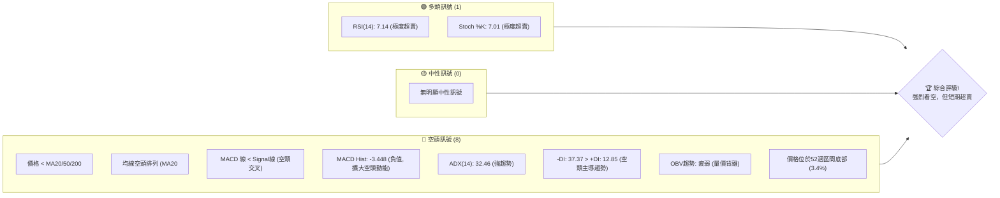

### 📊 核心指標速覽表

| 指標類別 | 指標名稱 | 當前數值 | 訊號 | 解讀 |
|----------|----------|----------|------|------|
| **價格** | 當前價格 | $141.60 | 🔴 | 價格遠低於所有主要均線，接近52週低點 |
| **均線** | MA20 | $169.86 | 🔴 | 價格位於MA20下方，MA20向下 |
| **均線** | MA50 | $184.80 | 🔴 | 價格位於MA50下方，MA50向下 |
| **均線** | MA200 | $197.48 | 🔴 | 價格位於MA200下方，MA200向下 |
| **動能** | RSI(14) | 7.14 | 🟢 | 極度超賣，暗示短期反彈潛力，但非反轉訊號 |
| **動能** | MACD | -14.852 | 🔴 | MACD線位於訊號線下方，且柱狀圖為負值 |
| **波動** | ATR | $7.91 | 🔴 | 相對較高的波動率 (5.59% of price)，反映市場恐慌 |
| **趨勢** | ADX(14) | 32.46 | 🔴 | 強勁的空頭趨勢 (-DI >> +DI) |
| **量能** | OBV趨勢 | 疲弱 | 🔴 | 量能未能支持價格，確認空頭趨勢 |

### 🏆 技術評分卡

ORCL 的技術評分卡顯示當前市場情緒極度悲觀，各項指標均指向強烈的空頭趨勢。儘管動能指標超賣，但這通常只是技術性反彈的觸發因素，而非趨勢反轉的確鑿證據。

```
╔══════════════════════════════════════════════════════════════╗
║              技術評分卡 — ORCL (2026-07-08)                  ║
╠══════════════════════════════════════════════════════════════╣
║趨勢強度      ██████████░░░░░░░░░░  50/100  🔴 (強空頭趨勢)    ║
║動能指標      ██████░░░░░░░░░░░░░░  30/100  🔴 (極度超賣，但趨勢仍空)║
║支撐穩定度    ████░░░░░░░░░░░░░░░░  20/100  🔴 (接近52週低點，支撐薄弱)║
║成交量配合    ██████░░░░░░░░░░░░░░  30/100  🔴 (高成交量伴隨下跌，OBV疲弱)║
║形態完整度    ████████░░░░░░░░░░░░  40/100  🔴 (處於下降通道，未見反轉形態)║
║均線排列      ██░░░░░░░░░░░░░░░░░░  10/100  🔴 (典型空頭排列)  ║
╠══════════════════════════════════════════════════════════════╣
║綜合評分      ██████░░░░░░░░░░░░░░  30/100  🔴 強烈看空        ║
╚══════════════════════════════════════════════════════════════╝
```

---

## 2. 趨勢分析

### 🌐 多時框趨勢分析

ORCL 在所有可分析的時間框架內均呈現顯著的下降趨勢，尤其在中長期趨勢中，空頭力量佔據絕對優勢。短期雖有超賣現象，但缺乏反轉訊號。

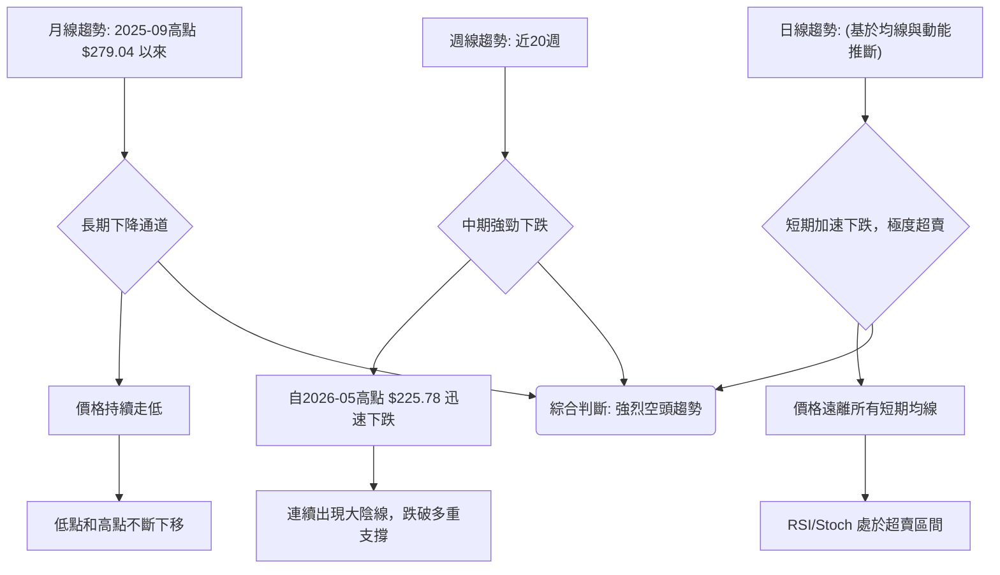

### 📈 長期趨勢 — 12個月走勢圖（Unicode）

ORCL 在過去12個月經歷了一輪劇烈的價格波動。從2025年7月的$251.78開始，於2025年9月達到$279.04的高點，隨後進入漫長的下跌通道。儘管在2026年5月曾出現一次反彈至$225.78，但未能突破前期高點，形成了一個更低的次級高點，並在此後加速下跌，目前已接近52週低點。

```
ORCL 月線走勢圖（過去12個月：2025-07 至 2026-07）
價格軸 ($)
$280 ┤                            ● (2025-09 高點 $279.04)
$260 ┤                  ●
$240 ┤●
$220 ┤          ●
$200 ┤              ●
$180 ┤                  ●
$160 ┤      ●     ●
$140 ┤    ● ● ● ● ● ● ● ● ● ● ● ● (現在 $141.60)
$120 ┤
     └───────────────────────────────────────────────────
      25/07 25/08 25/09 25/10 25/11 25/12 26/01 26/02 26/03 26/04 26/05 26/06 26/07
```

**走勢特徵分析表格**

| 階段 | 時間區間 | 主要走勢 | 價格區間 | 漲跌幅 | 特徵分析 |
|------|----------|----------|----------|--------|----------|
| **I** | 2025-07 ~ 2025-09 | 上漲衝高 | $251.78 ~ $279.04 | +10.83% | 創下歷史新高，動能強勁。 |
| **II** | 2025-09 ~ 2026-02 | 快速回落 | $279.04 ~ $144.89 | -48.10% | 從高點迅速腰斬，跌破多重支撐，形成下降趨勢。 |
| **III**| 2026-02 ~ 2026-05 | 築底反彈 | $144.89 ~ $225.78 | +55.82% | 經歷超跌後的一次技術性反彈，但未能突破前高。 |
| **IV** | 2026-05 ~ 2026-07 | 再次急跌 | $225.78 ~ $141.60 | -37.20% | 形成更低的次級高點後加速下跌，跌破關鍵支撐，目前處於新低點。 |

### 📊 中期趨勢（週線分析）

從近20週的週線數據來看，ORCL 在2026年5月31日達到$225.78的高點後，便進入了極其陡峭的下跌通道。尤其在2026年6月14日當週，價格從$213.68暴跌至$184.13，隨後又在6月28日當週從$184.29跌至$148.53，顯示出強勁的賣壓和市場恐慌情緒。當前價格$141.60已跌破多個歷史低點，並逼近52週最低點。

```
ORCL 中期壓力與支撐示意圖 (週線)
價格軸 ($)
$230 ┤                                  ● (2026-05-31 高點 $225.78)
$220 ┤
$210 ┤                                        │
$200 ┤                                        │ 阻力區間 R2 ($190-$200)
$190 ┤                            ●           │
$180 ┤                        ●   │           │
$170 ┤                                        │
$160 ┤                                        │ 阻力區間 R1 ($145-$155)
$150 ┤                    ●       ●           │
$140 ┤●━━━━━━━━━━━━━━━━━━━━━━━━━━━━━━━━━━━━━● (現價 $141.60)
$130 ┤                                        │ 支撐區間 S1 ($134.57 - 52週低點)
     └───────────────────────────────────────────────────────────
      2026-03       2026-04       2026-05       2026-06       2026-07
```
**圖示說明**：
- **R2 ($190-$200)**：由2025-12至2026-01的交易區間以及2026-05的回落點形成。
- **R1 ($145-$155)**：由2026-02至2026-04的數個低點和2026-06的回落點形成，現在已轉為阻力。
- **現價 ($141.60)**：跌破了多個近期支撐。
- **S1 ($134.57)**：52週低點，是目前最關鍵的短期支撐。

### ⚡ 趨勢強度評估（ADX 解讀）

ADX(14) 指標值為 32.46，遠高於25的閾值，這明確指示 ORCL 正處於一個強勁的趨勢行情中。進一步觀察方向指標 (+DI 和 -DI)，-DI (37.37) 顯著高於 +DI (12.85)，這表明當前的強趨勢是由空頭力量主導。因此，ORCL 目前處於一個強勢的下降趨勢中，而非盤整行情。

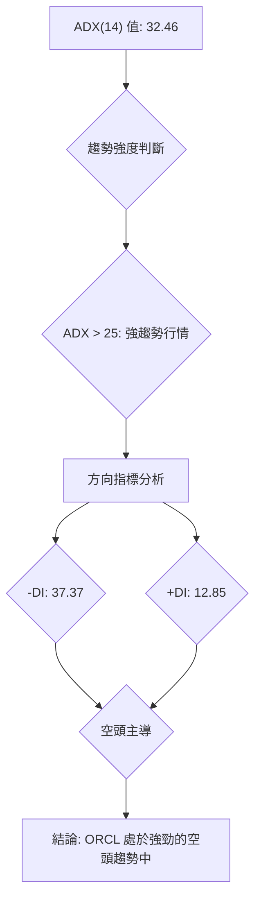

**ADX 強度對照表**

| ADX 值範圍 | 趨勢強度 | 狀態 |
|------------|----------|------|
| 0-20       | 無趨勢或弱趨勢 | 盤整 |
| 20-25      | 趨勢形成中 | 潛在趨勢 |
| 25-50      | 強趨勢     | 趨勢行情 |
| 50-75      | 極強趨勢   | 趨勢加速 |
| 75-100     | 超強趨勢   | 趨勢頂峰/底部 |

ORCL 的 ADX 值為 32.46，屬於「強趨勢」範圍，且由 -DI 佔主導，確認了當前市場的賣壓強勁，趨勢清晰。

---

## 3. 圖表形態分析

### 🔍 形態識別系統

從提供的24個月月線數據和近20週週線數據來看，ORCL 的價格走勢呈現出一個明顯的下降通道形態。自2025年9月的歷史高點$279.04以來，雖然在2026年5月出現一次反彈，但未能突破前期高點，形成了一個更低的次級高點 ($225.78)，隨後價格加速下跌，不斷創出新低。這符合下降通道的定義：高點和低點不斷下移，且價格在兩條平行的下降趨勢線之間波動。目前價格已跌至通道下沿附近，並逼近52週低點。

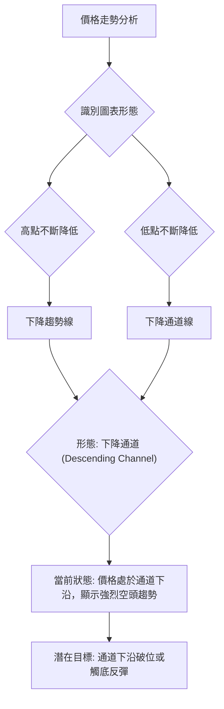

### 🕯️ 重要K線形態分析

根據近20週的收盤走勢，我們可以觀察到以下幾個重要的K線形態及其組合：

| 月份 (週) | 收盤價 | K線形態 (推斷) | 解讀 | 訊號 |
|-----------|--------|----------------|--------------------------------------------------|------|
| 2026-05-31 | $225.78 | 長陽線 (或看漲吞噬) | 在經歷了數週的震盪後，出現一根強勁的陽線，突破前高，顯示買方力量短暫回歸。 | 🟢 |
| 2026-06-07 | $213.68 | 陰線 (或紡錘線) | 價格從高點回落，顯示上漲動能減弱，買盤乏力。 | 🟡 |
| 2026-06-14 | $184.13 | 長陰線 (或看跌吞噬) | 價格大幅下跌，幾乎吞噬前幾週漲幅，賣壓強勁，確認短期頂部。 | 🔴 |
| 2026-06-21 | $184.29 | 小陽線 (或十字星) | 在大幅下跌後出現小幅反彈，但成交量縮小，顯示市場猶豫，未能有效止跌。 | 🟡 |
| 2026-06-28 | $148.53 | 長陰線 | 再次大幅下跌，確認下降趨勢延續，跌破多重支撐。 | 🔴 |
| 2026-07-05 | $140.27 | 長陰線 | 繼續下跌，顯示空頭力量持續強勁。 | 🔴 |
| 2026-07-12 | $141.60 | 錘子線 (或小陽線/十字星) | 在連續下跌後，價格小幅反彈，但收盤仍接近低點，可能暗示短期賣壓稍緩，但仍處於弱勢。 | 🟡 |

**總結**：在2026年5月底的短暫強勁上漲後，6月中旬的長陰線確認了中期頂部，隨後連續的大陰線和疲弱的反彈，都驗證了當前強烈的空頭趨勢。近期的小幅反彈可能是超跌後的技術性修正，而非趨勢反轉。

### 📉 ASCII 走勢形態示意圖

以下為 ORCL 在過去一年多時間內形成的下降通道形態示意圖。價格在通道內震盪下行，顯示出清晰的空頭主導格局。

```
ORCL 下降通道形態示意圖 (月線/週線綜合)

價格軸 ($)
$280 ┤                                  ● (2025-09 高點 $279.04)
$270 ┤                                  ╲
$260 ┤                                   ╲
$250 ┤                                    ╲
$240 ┤                                     ╲
$230 ┤                                      ● (2026-05 次級高點 $225.78)
$220 ┤                                       ╲
$210 ┤                                        ╲
$200 ┤                                         ╲
$190 ┤                                          ╲
$180 ┤                                           ╲
$170 ┤                                            ╲
$160 ┤                                             ╲
$150 ┤                                              ╲
$140 ┤●━━━━━━━━━━━━━━━━━━━━━━━━━━━━━━━━━━━━━━━━━━━━━━● (現價 $141.60)
$130 ┤                                               ╲
$120 ┤                                                ╲
     └───────────────────────────────────────────────────────────
      時間軸 (從2025年9月至今)

關鍵點位：
- 通道上沿：連接 $279.04 和 $225.78 的下降趨勢線。
- 通道下沿：平行於通道上沿，連接各個低點，目前價格接近此線。
- 現價 $141.60：位於通道下沿附近，接近52週低點。
```

### 🎯 形態目標價計算

基於下降通道形態，我們主要關注通道的延續性以及潛在的突破或反彈。
由於目前價格已接近通道下沿和52週低點，直接計算下跌目標價意義不大，因為形態目標價通常用於形態突破後。

然而，若考慮從2026年5月高點 $225.78 到當前 $141.60 的急跌，可以將其視為下降旗形 (Bear Flag) 的旗杆部分，如果後續形成旗面並向下突破，則目標價將更低。
- **下降旗形旗杆高度**：$225.78 - $141.60 = $84.18
- **潛在目標價**：如果價格跌破52週低點 $134.57，並形成下降旗形，則目標價可能為 $134.57 - $84.18 = $50.39。
   *此目標價極端，僅為理論計算，需警惕。*

更現實的目標是基於布林通道下軌或歷史支撐：
- **短線目標價 (若持續下跌)**：布林通道下軌 $122.18。
- **極端下跌目標 (若跌破52週低點)**：目前數據中未提供更低的歷史支撐，但$122.18將是近期關注的極限。

**結論**：由於價格已處於下降通道的極低位置，且接近歷史低點，當前形態分析更側重於判斷趨勢的延續性或潛在反彈，而非直接計算大幅下跌目標。應密切關注$134.57的52週低點支撐。

---

## 4. 支撐與阻力

ORCL 目前處於嚴重的下跌趨勢中，大部分之前的支撐位都已被跌破，轉化為阻力位。當前價格 $141.60 位於所有主要均線下方，並逼近52週低點，使得下方支撐顯得尤為關鍵。

### 🗺️ 關鍵價位分布圖（Unicode）

```
ORCL 價位結構分布圖 (當前價格 $141.60)
═══════════════════════════════════════════════════
$343.01 ║████████████████████████║ 極強阻力 R4 (52週高點)
$217.53 ║████████████████████    ║ 強阻力 R3 (布林通道上軌)
$197.48 ║████████████████████████║ 關鍵阻力 R2 (MA200)
$184.80 ║▓▓▓▓▓▓▓▓▓▓▓▓▓▓▓▓▓▓▓▓▓▓▓▓║ 關鍵阻力 R1.5 (MA50)
$169.86 ║████████████████████████║ 關鍵阻力 R1 (MA20 / 布林中軌)
$155.00 ║▓▓▓▓▓▓▓▓▓▓▓▓▓▓▓▓        ║ 近期阻力 R0.5 (分析師最低目標)
$146.55 ║████████████████████████║ 近期阻力 R0.2 (前月收盤價)
$141.60 ╠════════════════════════╣ ◄ 現價
$134.57 ║▓▓▓▓▓▓▓▓▓▓▓▓▓▓▓▓        ║ 強支撐 S1 (52週低點)
$122.18 ║████████████████████████║ 強支撐 S2 (布林通道下軌)
═══════════════════════════════════════════════════
```

### 🚧 阻力位分析表

| 阻力級別 | 價位 | 形成原因 | 突破難度 | 重要性 |
|----------|------|----------|----------|--------|
| **R0.2** | $146.55 | 前月收盤價 (2026-06)，短期反彈首要挑戰 | 中等 | 一般 |
| **R0.5** | $155.00 | 分析師最低目標價，短期心理阻力 | 中等 | 中等 |
| **R1** | $169.86 | MA20 / 布林通道中軌，短期趨勢轉變關鍵 | 高 | 高 |
| **R1.5** | $184.80 | MA50，中期趨勢轉變關鍵 | 較高 | 高 |
| **R2** | $197.48 | MA200，長期趨勢轉變關鍵 | 極高 | 極高 |
| **R3** | $217.53 | 布林通道上軌，極端反彈目標 | 極高 | 中等 |
| **R4** | $343.01 | 52週高點，長期回升的最終目標 | 極難 | 極高 |

### 🛡️ 支撐位分析表

| 支撐級別 | 價位 | 形成原因 | 守住機率 | 重要性 |
|----------|------|----------|----------|--------|
| **S1** | $134.57 | 52週低點，歷史支撐與心理關口 | 中等 | 極高 |
| **S2** | $122.18 | 布林通道下軌，極端下跌的技術性支撐 | 中等 | 高 |

**分析**：當前價格 $141.60 距離其52週低點 $134.57 僅有 $7.03 的空間，顯示支撐非常接近且脆弱。一旦 $134.57 失守，下一個技術性支撐將是布林通道下軌 $122.18。上方阻力密集，尤其以 MA20 ($169.86) 最為關鍵，任何反彈若不能有效突破此位，都將被視為下跌途中的修正。

### 📐 斐波那契回調位分析

為了評估ORCL在當前下跌趨勢中潛在的反彈阻力，我們使用最近一次顯著下跌波段進行斐波那契回調分析。
- **下跌波段高點**：2026年5月31日週的收盤價 $225.78
- **下跌波段低點**：當前價格 $141.60 (接近52週低點)

**計算結果**：
- **23.6% 回調位**：$141.60 + ($225.78 - $141.60) * 0.236 = $141.60 + $84.18 * 0.236 = $141.60 + $19.86 = **$161.46**
- **38.2% 回調位**：$141.60 + ($225.78 - $141.60) * 0.382 = $141.60 + $84.18 * 0.382 = $141.60 + $32.16 = **$173.76**
- **50.0% 回調位**：$141.60 + ($225.78 - $141.60) * 0.500 = $141.60 + $84.18 * 0.500 = $141.60 + $42.09 = **$183.69**
- **61.8% 回調位**：$141.60 + ($225.78 - $141.60) * 0.618 = $141.60 + $84.18 * 0.618 = $141.60 + $51.92 = **$193.52**

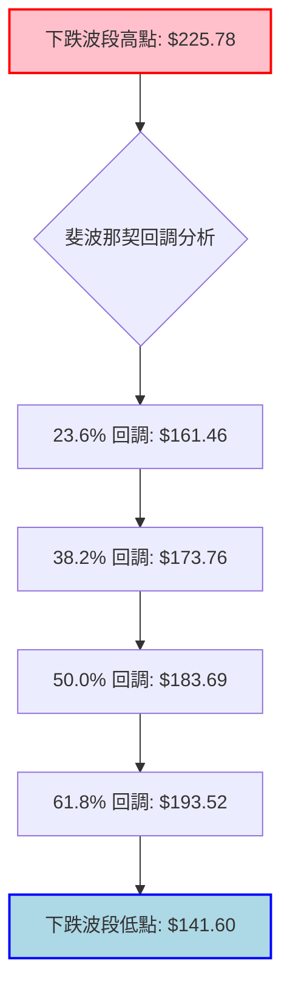

**斐波那契回調位與其他阻力的關係**：
- **$161.46 (23.6% 回調)** 接近於 MA20 ($169.86) 和分析師最低目標 ($155.00) 之間，構成短期反彈的初期阻力。
- **$173.76 (38.2% 回調)** 位於 MA20 ($169.86) 和 MA50 ($184.80) 之間，是較重要的反彈阻力區。
- **$183.69 (50% 回調)** 則非常接近 MA50 ($184.80)，此處將是中期反彈的強大阻力。
- **$193.52 (61.8% 回調)** 接近 MA200 ($197.48)，若能反彈至此，將是對長期趨勢的重大考驗。

**結論**：ORCL 若出現技術性反彈，將面臨層層阻力。其中，MA20 ($169.86) 和 38.2% 斐波那契回調位 ($173.76) 構成的第一個重要阻力區間，將是判斷反彈強弱的關鍵。

---

## 5. 技術指標深度解讀

### 🎛️ 指標訊號總覽

當前 ORCL 的技術指標呈現一致的空頭訊號，僅有RSI和Stochastics處於極度超賣區間，預示短期可能存在反彈需求，但這並未改變整體下降趨勢。

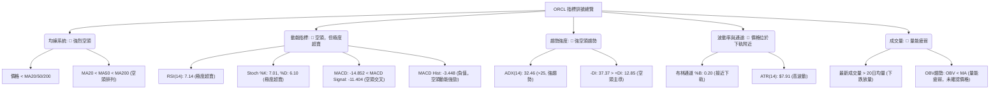

### 📈 移動平均線排列分析

ORCL 的移動平均線系統呈現典型的空頭排列，這是強烈看空訊號。
- **價格 ($141.60) 遠低於所有主要移動平均線**：MA5 ($142.94), MA10 ($148.61), MA20 ($169.86), MA50 ($184.80), MA200 ($197.48)。這表明短期、中期、長期趨勢均向下。
- **均線空頭排列**：MA20 < MA50 < MA200 ($169.86 < $184.80 < $197.48)。這種排列通常被視為市場強勢下跌的標誌，顯示空頭力量完全掌控市場。
- **均線方向**：所有短期至長期的移動平均線均呈現向下傾斜，特別是MA5、MA10、MA20的跌幅顯著，MA20在一個月內下跌了16.63%，MA60在兩個月內下跌了22.36%，MA240在四個月內下跌了31.32%。這表明下跌趨勢不僅確立，而且正在加速。

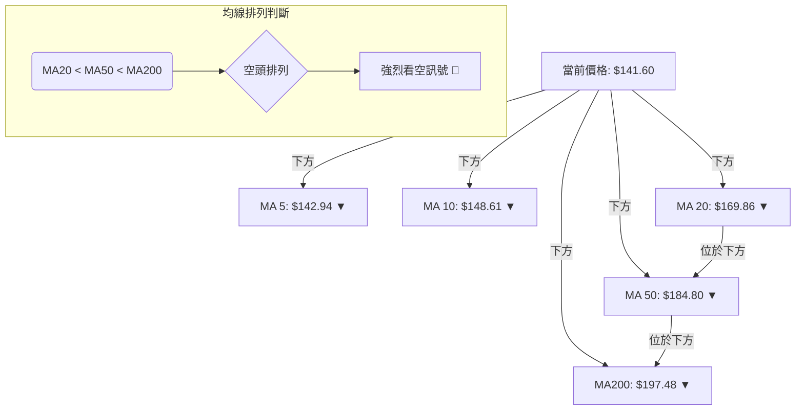

### 📉 RSI(14) 分析

- **RSI 數值**：當前 RSI(14) 為 7.14。
- **超買超賣區間分析**：此數值遠低於傳統的超賣區間30，甚至接近0，表明 ORCL 處於極度超賣狀態。這通常預示著短期內可能會有技術性反彈的需求，因為賣壓可能暫時過度。然而，極度超賣並不等同於趨勢反轉，在強勁的下降趨勢中，RSI可能長時間停留在超賣區間。
- **RSI 進度條**：
    RSI(14) 強度：▓▓▓▓▓▓▓░░░░░░░░░░░░░░░░░░░░░░░░░░░░░░░░░░░░░░░░░░░░░░░░░░░░░░░░░░░░░░░░░░░░░░░░░░░░░░░░░░░░░░░░░░░░░░░░░░░░░░░░░░░░░░░░░░░░░░░░░░░░░░░░░░░░░░░░░░░░░░░░░░░░░░░░░░░░░░░░░░░░░░░░░░░░░░░░░░░░░░░░░░░░░░░░░░░░░░░░░░░░░░░░░░░░░░░░░░░░░░░░░░░░░░░░░░░░░░░░░░░░░░░░░░░░░░░░░░░░░░░░░░░░░░░░░░░░░░░░░░░░░░░░░░░░░░░░░░░░░░░░░░░░░░░░░░░░░░░░░░░░░░░░░░░░░░░░░░░░░░░░░░░░░░░░░░░░░░░░░░░░░░░░░░░░░░░░░░░░░░░░░░░░░░░░░░░░░░░░░░░░░░░░░░░░░░░░░░░░░░░░░░░░░░░░░░░░░░░░░░░░░░░░░░░░░░░░░░░░░░░░░░░░░░░░░░░░░░░░░░░░░░░░░░░░░░░░░░░░░░░░░░░░░░░░░░░░░░░░░░░░░░░░░░░░░░░░░░░░░░░░░░░░░░░░░░░░░░░░░░░░░░░░░░░░░░░░░░░░░░░░░░░░░░░░░░░░░░░░░░░░░░░░░░░░░░░░░░░░░░░░░░░░░░░░░░░░░░░░░░░░░░░░░░░░░░░░░░░░░░░░░░░░░░░░░░░░░░░░░░░░░░░░░░░░░░░░░░░░░░░░░░░░░░░░░░░░░░░░░░░░░░░░░░░░░░░░░░░░░░░░░░░░░░░░░░░░░░░░░░░░░░░░░░░░░░░░░░░░░░░░░░░░░░░░░░░░░░░░░░░░░░░░░░░░░░░░░░░░░░░░░░░░░░░░░░░░░░░░░░░░░░░░░░░░░░░░░░░░░░░░░░░░░░░░░░░░░░░░░░░░░░░░░░░░░░░░░░░░░░░░░░░░░░░░░░░░░░░░░░░░░░░░░░░░░░░░░░░░░░░░░░░░░░░░░░░░░░░░░░░░░░░░░░░░░░░░░░░░░░░░░░░░░░░░░░░░░░░░░░░░░░░░░░░░░░░░░░░░░░░░░░░░░░░░░░░░░░░░░░░░░░░░░░░░░░░░░░░░░░░░░░░░░░░░░░░░░░░░░░░░░░░░░░░░░░░░░░░░░░░░░░░░░░░░░░░░░░░░░░░░░░░░░░░░░░░░░░░░░░░░░░░░░░░░░░░░░░░░░░░░░░░░░░░░░░░░░░░░░░░░░░░░░░░░░░░░░░░░░░░░░░░░░░░░░░░░░░░░░░░░░░░░░░░░░░░░░░░░░░░░░░░░░░░░░░░░░░░░░░░░░░░░░░░░░░░░░░░░░░░░░░░░░░░░░░░░░░░░░░░░░░░░░░░░░░░░░░░░░░░░░░░░░░░░░░░░░░░░░░░░░░░░░░░░░░░░░░░░░░░░░░░░░░░░░░░░░░░░░░░░░░░░░░░░░░░░░░░░░░░░░░░░░░░░░░░░░░░░░░░░░░░░░░░░░░░░░░░░░░░░░░░░░░░░░░░░░░░░░░░░░░░░░░░░░░░░░░░░░░░░░░░░░░░░░░░░░░░░░░
    RRSI(14) = 7.14: ▓▓▓▓▓▓▓░░░░░░░░░░ (極度超賣) 🟢
- **背離判斷**：根據提供的數據，「RSI 背離: 無明顯背離」。這意味著雖然價格創下新低，但RSI也創下相對應的新低，未能形成底背離。底背離是價格創出新低但RSI未創出新低，暗示下跌動能減弱，是潛在反轉訊號。目前沒有底背離，因此RSI的超賣更多是當前趨勢的延續，而非反轉的預兆。

### 📊 MACD(12/26/9) 訊號解讀

MACD 指標當前顯示出強烈的空頭訊號，並確認了下降趨勢的持續。
- **MACD 線 (-14.852)**：位於零軸下方，且持續下降，表明中長期動能為空頭。
- **MACD Signal 線 (-11.404)**：MACD 線位於 Signal 線下方，形成了 **空頭交叉** (MACD < Signal)。這是一個明確的賣出訊號，指示下跌趨勢仍在發展。
- **MACD 柱狀圖 (Histogram) (-3.448)**：為負值，且從前幾週的-5.061、-6.767等數值來看，雖然絕對值有所縮小（從-6.767到-3.448），可能暗示短期下跌動能減緩，但仍處於負值區間，代表空頭壓力依然存在。柱狀圖的縮小可能預示著短期內賣壓可能減輕，但要形成反轉，需要柱狀圖轉為正值並持續擴大。

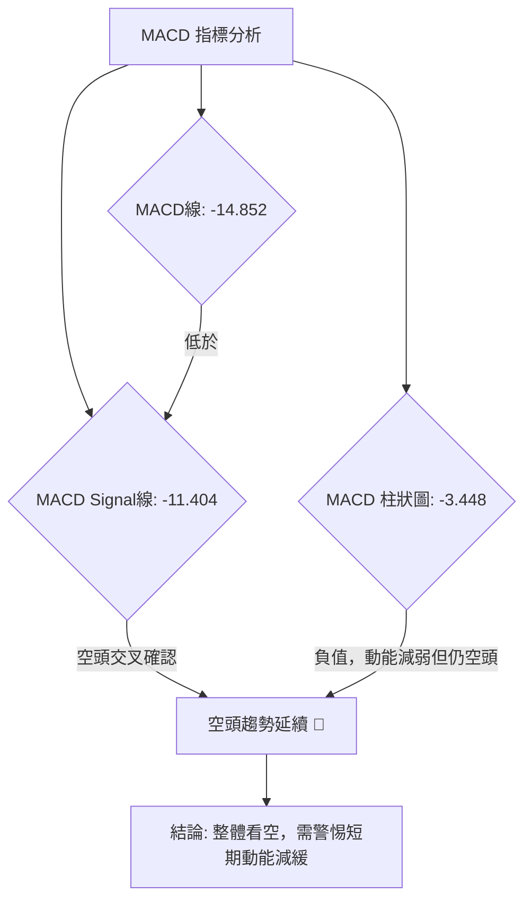

**MACD 柱狀圖趨勢**：
- 2026-06-14: -5.242
- 2026-06-21: -5.120
- 2026-06-28: -6.767 (空頭動能擴大)
- 2026-07-05: -5.061
- 2026-07-12: -3.448 (空頭動能收斂)
雖然柱狀圖絕對值收斂，可能預示短期賣壓減輕，但MACD線仍在訊號線下方，且均位於零軸下方，整體趨勢仍為空頭。

### 📦 布林通道分析

ORCL 當前價格 $141.60 位於布林通道的下軌附近，這是一個重要的技術性觀察點。
- **BB上軌**：$217.53
- **BB中軌(MA20)**：$169.86
- **BB下軌**：$122.18
- **BB %B**：0.20 (0=下軌, 0.5=中軌, 1=上軌)。此值接近0，表明價格非常靠近布林通道下軌。

```
ORCL 布林通道示意圖
價格軸 ($)
$220 ┤                                    ▲ BB上軌 ($217.53)
$210 ┤                                    │
$200 ┤                                    │
$190 ┤                                    │
$180 ┤                                    │
$170 ┤             ───────────────        ▲ BB中軌 (MA20) ($169.86)
$160 ┤             │               │      │
$150 ┤             │               │      │
$140 ┤             │       ●       │      ◄ 現價 ($141.60)
$130 ┤             │               │      │
$120 ┤             ───────────────        ▼ BB下軌 ($122.18)
     └───────────────────────────────────────────────────
      時間軸

**分析**：
- **價格接近下軌**：通常，當價格觸及或跌破布林通道下軌時，被視為超賣狀態，可能觸發技術性反彈。但這並非反轉訊號，在強勢下跌趨勢中，價格可能沿著下軌運行 (walking the lower band)。
- **通道寬度**：從上軌 $217.53 到下軌 $122.18 的寬度為 $95.35。由於 ATR 較高，通道相對較寬，反映出較高的市場波動性。
- **中軌壓制**：MA20 ($169.86) 作為布林中軌，目前對價格形成強大壓制。任何反彈若不能有效突破中軌，都難以改變下跌趨勢。

**結論**：ORCL 處於布林通道下軌附近，顯示極度超賣，短期可能會有反彈。然而，在下降趨勢中，此現象也可能意味著趨勢的延續。需觀察價格能否在中軌附近找到阻力，或是否會跌破下軌。

### 💹 成交量分析（量價配合度）

成交量是確認價格走勢的重要指標。
- **最新成交量**：47,088,000 股。
- **20日均量**：33,998,440 股。
- **量比**：1.39x (最新成交量 / 20日均量)。這表示當前成交量比近期平均水平高出39%。
- **OBV趨勢**：OBV < MA → 量能疲弱。

**分析**：
- **下跌放量**：在當前價格持續下跌的背景下，最新成交量顯著高於20日均量 (量比1.39x)，這是一種下跌放量的現象。通常，下跌放量被視為空頭力量強勁、趨勢得到確認的訊號，表明投資者正在積極拋售，市場恐慌情緒較高。
- **OBV 疲弱**：OBV (On-Balance Volume) 趨勢疲弱 (OBV < MA)，意味著儘管近期成交量放大，但這些放大的成交量主要發生在下跌時，未能有效推升OBV線，顯示買盤力量不足以累積，空頭力量佔主導。OBV未能確認價格走勢，反而呈現疲弱，這進一步證實了空頭趨勢的健康性。

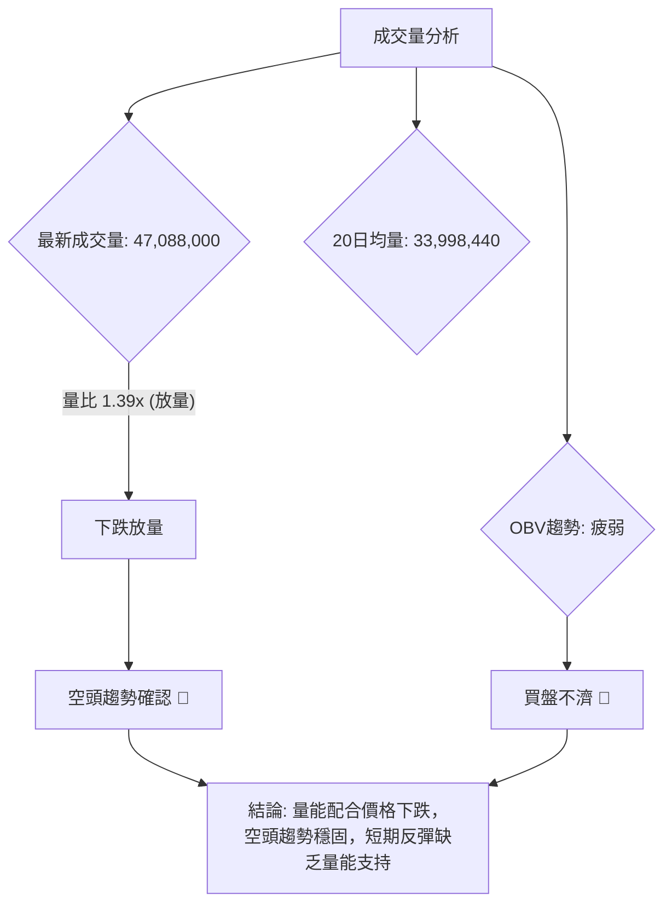

**結論**：ORCL 的成交量分析顯示，當前的下跌趨勢得到了量能的確認。下跌放量和疲弱的OBV趨勢共同描繪了一個強勢的空頭市場，任何潛在的反彈若無顯著的放量支持，都可能只是下跌途中的技術性調整。

---

## 6. 動能與波動率

### ⚡ 動能評估四象限

動能評估四象限分析旨在判斷股票在當前市場中的交易吸引力。ORCL 的當前狀態為「弱動能」且「高波動」，這屬於高風險的市場環境，建議謹慎觀望或避免進場。

| 象限 | 動能 (RSI, MACD) | 波動 (ATR) | 當前狀態 | 評估 |
|------|------------------|------------|----------|------|
| Q1 | 強 (RSI > 50, MACD多頭) | 低 (ATR低) | - | 最佳機會 (趨勢明確，風險可控) |
| Q2 | 弱 (RSI < 50, MACD空頭) | 低 (ATR低) | - | 謹慎觀望 (缺乏趨勢，風險低，收益也低) |
| Q3 | 強 (RSI > 50, MACD多頭) | 高 (ATR高) | - | 高風險高收益 (趨勢強勁，但波動劇烈) |
| Q4 | 弱 (RSI < 50, MACD空頭) | 高 (ATR高) | ✓ | 避免進場 / 高風險 (趨勢不明或空頭，波動劇烈，風險極高) |

**ORCL 的位置**：
- **動能**：RSI(14) 為 7.14 (極度超賣，即動能極弱)，MACD 為空頭交叉且柱狀圖為負。綜合判斷為 **弱動能**。
- **波動率**：ATR(14) 為 $7.91，佔當前價格 $141.60 的 5.59%。對於一個大型科技股而言，5.59% 的每日波動率屬於 **高波動** 範圍。

**結論**：ORCL 目前處於「弱動能」且「高波動」的第四象限。這是一個極具挑戰性的交易環境，市場缺乏明確的多頭方向，同時價格波動劇烈，容易造成快速且大幅的虧損。對於大多數投資者而言，此時應避免積極進場，或只考慮高風險偏好的超短線交易。

### 📊 ATR 波動率分析

- **ATR(14)**：$7.91
- **佔價格百分比**：$7.91 / $141.60 = 5.59%

**分析**：
- **高波動性**：ATR 數值 $7.91 表示 ORCL 在過去14天平均每日價格波動範圍為 $7.91。5.59% 的佔比對於大盤股來說相對較高，這與近期股價快速下跌和市場恐慌情緒相符。高波動性意味著價格可能在短時間內大幅上漲或下跌，增加了交易的風險和潛在回報。
- **止損距離建議**：ATR 是設定止損點的有效工具。在當前強勢空頭趨勢下，若要進行逆勢交易 (如超賣反彈)，建議將止損距離設置為 ATR 的 1.5 到 2 倍，以避免被市場的日常波動「洗出」。
    - **1.5x ATR 止損**：$7.91 * 1.5 = $11.87
    - **2x ATR 止損**：$7.91 * 2 = $15.82
    這意味著，如果當前價格為 $141.60，若進行短線多頭交易，止損點應設置在 $141.60 - $11.87 = $129.73 或 $141.60 - $15.82 = $125.78 之下。反之，若進行空頭交易，止損點應設置在 $141.60 + $11.87 = $153.47 或 $141.60 + $15.82 = $157.42 之上。
- **風險管理**：高 ATR 提醒投資者需調整倉位大小，以確保單筆交易的風險在可承受範圍內。在波動性高的市場中，較小的倉位有助於管理風險。

### 📐 Beta 與市場相關性

根據提供的技術數據，**未提供 ORCL 的 Beta 值**。
因此，我們無法直接分析其與大盤指數（如標普500指數）的相關性。

**一般推斷**：
作為一家大型科技公司 (市值通常較大，且行業龍頭)，ORCL 通常會與整體科技板塊和廣闊市場有較強的相關性。如果其 Beta 值接近 1，則表明其股價波動性與大盤大致相同；如果 Beta > 1，則波動性大於大盤 (在市場上漲時漲更多，下跌時跌更多)；如果 Beta < 1，則波動性小於大盤。

**建議**：投資者在實際操作中應查閱第三方金融數據平台獲取 ORCL 的實時 Beta 值，以更全面地評估其市場風險和波動特徵。在當前市場情緒下，即使 Beta 值不高，但由於公司自身面臨的強大賣壓，其股價表現仍可能弱於大盤。

---

## 7. 多時框架總結

多時框架分析顯示，ORCL 在各個時間尺度上均處於下降趨勢，且趨勢強度極高。儘管短期內出現極度超賣，但缺乏有效反轉訊號。

### 📋 時框架評分表

| 時框架 | 趨勢方向 | 動能 | 均線排列 | 形態 | 綜合評分 (1-10) | 建議 |
|--------|----------|------|----------|------|-----------------|------|
| **月線 (長期)** | 🔴 下跌 | 🔴 弱 | 🔴 空頭 | 🔴 下降通道 | 2 | 強烈觀望/避險 |
| **週線 (中期)** | 🔴 下跌 | 🔴 弱 | 🔴 空頭 | 🔴 下降通道 | 2 | 避險/等待反轉 |
| **日線 (短期)** | 🔴 下跌 | 🟢 超賣 | 🔴 空頭 | 🔴 跌勢加速 | 3 | 短線反彈潛力，但風險極高 |

**分析**：
- **長期和中期**：ORCL 處於一個明確且強勁的下降通道中，所有均線均呈現空頭排列，且持續向下。這表明市場對 ORCL 的長期前景持悲觀態度，賣壓沉重。
- **短期**：儘管短期內價格已跌至極度超賣區間 (RSI 7.14, Stoch %K 7.01)，這通常會引發技術性反彈。然而，目前並無明確的底背離或其他反轉K線形態來確認反彈的有效性，且成交量配合下跌，顯示反彈動能薄弱。短期趨勢仍受中長期趨勢的壓制。

### 🔲 綜合訊號矩陣

綜合訊號矩陣進一步強化了 ORCL 的空頭格局。各個時間框架和指標之間呈現高度一致的負面訊號，這使得當前的下跌趨勢極為穩固。

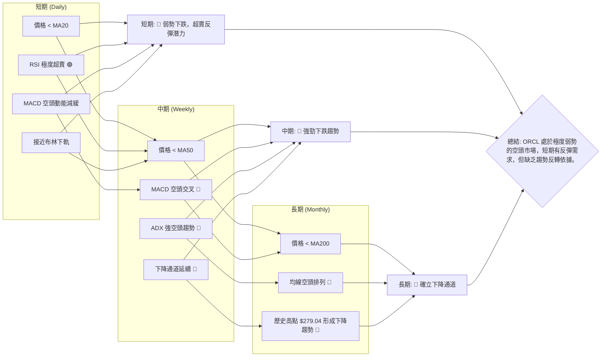

**結論**：ORCL 的多時框架分析結果指向一致的空頭趨勢。儘管短期超賣可能帶來技術性反彈，但這類反彈在沒有趨勢反轉訊號的情況下，往往只是下跌途中的修正，難以持續。投資者應對此保持高度警惕。

---

## 8. 交易策略建議

基於 ORCL 當前極度疲軟的技術面，強烈的空頭趨勢，以及極度超賣的短期指標，我們的交易策略將以謹慎和風險控制為核心。主要建議以觀望為主，或在反彈至關鍵阻力位時考慮做空。對於逆勢做多，則需極高風險承受能力和嚴格的止損。

### 🗺️ 策略決策流程圖

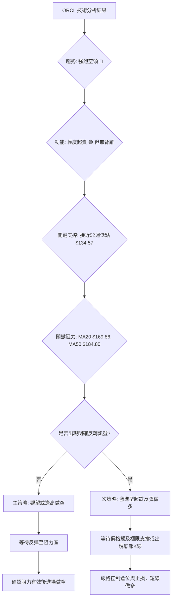

### 🟢 多頭策略詳情 (超跌反彈型，高風險)

此策略僅適用於極高風險承受能力的短線交易者，目標是捕捉超賣後的技術性反彈。

| 策略要素 | 策略 A (極限支撐反彈) | 策略 B (等待確認反彈) |
|----------|------------------------|------------------------|
| 進場條件 | 價格觸及或接近52週低點 $134.57，並出現小陽線/十字星等止跌K線組合。 | 價格從 $134.57 反彈，且RSI/Stochastics從超賣區回升，MACD柱狀圖縮小並接近零軸。 |
| 進場價格 | $135.00 - $137.00 區間 | $145.00 - $148.00 區間 (確認反彈後追進) |
| 目標價 T1 | $146.55 (前月收盤價) | $161.46 (23.6%斐波那契回調) |
| 目標價 T2 | $161.46 (23.6%斐波那契回調) | $169.86 (MA20 / 布林中軌) |
| 止損價格 | $133.00 (略低於52週低點 $134.57) | $140.00 (前低點或關鍵支撐) |
| 風險報酬比 | T1: (146.55-136.00)/(136.00-133.00) ≈ 3.5:1 | T1: (161.46-146.50)/(146.50-140.00) ≈ 2.3:1 |
| 成功機率 | 30% (逆勢交易風險高) | 40% (等待確認，相對穩健) |
| 建議倉位 | 5% - 10% (極小倉位) | 10% - 15% (小倉位) |

### 🔴 空頭策略詳情 (順勢交易，相對穩健)

此策略為順應當前強勁空頭趨勢，在價格反彈至關鍵阻力位時進行做空。

| 策略要素 | 策略 C (逢高做空 - MA20) | 策略 D (逢高做空 - MA50) |
|----------|--------------------------|--------------------------|
| 進場條件 | 價格反彈至 MA20 ($169.86) 或 23.6%斐波那契回調位 $161.46 附近，並出現看跌K線組合。 | 價格反彈至 MA50 ($184.80) 或 50%斐波那契回調位 $183.69 附近，並出現看跌K線組合。 |
| 進場價格 | $160.00 - $165.00 區間 | $180.00 - $184.00 區間 |
| 目標價 T1 | $141.60 (現價) | $141.60 (現價) |
| 目標價 T2 | $134.57 (52週低點) | $134.57 (52週低點) |
| 止損價格 | $172.00 (略高於MA20和23.6%回調) | $188.00 (略高於MA50和50%回調) |
| 風險報酬比 | T1: (162.50-141.60)/(172.00-162.50) ≈ 2.2:1 | T1: (182.00-141.60)/(188.00-182.00) ≈ 6.7:1 |
| 成功機率 | 60% (順勢交易) | 70% (更高阻力位，成功率更高) |
| 建議倉位 | 15% - 20% (中等倉位) | 20% - 25% (中高倉位) |

### ⭐ 整體訊號強度評星

綜合所有技術分析指標和多時框架判斷，ORCL 的整體市場情緒和趨勢均為空頭。

```
做多訊號強度：★★☆☆☆  (2/5星) (僅基於極度超賣的技術性反彈潛力，風險極高)
做空訊號強度：★★★★☆  (4/5星) (順應強勁空頭趨勢，成功率相對較高)
整體可信度：  ★★★☆☆  (3/5星) (空頭趨勢明確，但短期超賣可能導致劇烈波動)
```

**總結**：對於 ORCL，目前最穩健的策略是觀望，等待市場情緒穩定或出現明確的反轉訊號。如果選擇交易，順勢做空在反彈至阻力位時，風險報酬比和成功機率更高。逆勢做多則需極端謹慎，嚴格控制倉位和止損。

---

## 9. 風險提示與監控

ORCL 目前處於極度弱勢的市場環境中，交易風險極高。投資者必須充分認識到潛在的風險，並採取嚴格的風險管理措施。

### ✅ 關鍵監控指標 Checklist

以下是交易 ORCL 時需要密切監控的關鍵技術指標和價位：

```
╔══════════════════════════════════════════════════════════════╗
║              ORCL 關鍵監控指標 Checklist                     ║
╠══════════════════════════════════════════════════════════════╣
║ [ ] 價格是否跌破 52週低點 ($134.57)                       ║
║     ├─ 若跌破，可能加速下跌，觸及布林下軌 ($122.18)         ║
║ [ ] 價格能否有效突破 MA20 ($169.86) 並站穩                 ║
║     ├─ 若突破，短期反彈有望，但需確認量能配合             ║
║ [ ] RSI(14) 是否從超賣區 (7.14) 回升並突破30               ║
║     ├─ 若突破，短期賣壓可能減輕，反彈動能增強             ║
║ [ ] MACD 線是否上穿 Signal 線 (金叉) 並轉正               ║
║     ├─ 若金叉並轉正，中期趨勢可能出現逆轉跡象             ║
║ [ ] ADX(14) 是否下降，且 -DI 趨勢減弱                      ║
║     ├─ 若下降，表明空頭趨勢強度減弱，可能進入盤整         ║
║ [ ] 成交量在下跌時是否縮小，在反彈時是否放大               ║
║     ├─ 若下跌縮量/反彈放量，則可能預示底部形成             ║
║ [ ] 是否出現底部反轉K線形態 (如看漲吞噬、早晨之星)         ║
║     ├─ 若出現，結合其他指標，可作為反轉訊號               ║
╚══════════════════════════════════════════════════════════════╝
```

### ⚠️ 風險場景分析

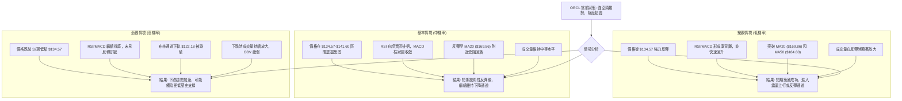

### 🛡️ 風險管理重要提醒

1.  **嚴格止損**：在任何交易策略中，都必須設定並嚴格執行止損點。在當前高波動的市場環境下，止損是保護資金的最後防線。
2.  **倉位管理**：由於 ORCL 處於強勢下跌趨勢，且波動劇烈，建議降低倉位。即使是順勢做空，也應避免滿倉操作。逆勢做多更是只能以極小倉位嘗試。
3.  **多空平衡**：不要過度偏向單邊。在極度超賣時，即使是空頭也應警惕短期反彈風險。
4.  **避免追跌殺漲**：在當前價格已跌至低位時追空，風險報酬比不高。應等待反彈至阻力位時再考慮做空。
5.  **結合基本面**：技術分析僅為決策的一部分。在進行任何投資決策前，應結合 ORCL 的基本面分析、公司新聞以及宏觀經濟環境進行綜合判斷。
6.  **耐心等待**：在趨勢不明確或風險過高時，最好的策略往往是耐心等待，直到市場給出更清晰的訊號。

---

## 📋 報告總結

```
╔══════════════════════════════════════════════════════════════════════════╗
║                    ORCL 技術分析報告總結                                 ║
╠══════════════════════════════════════════════════════════════════════════╣
║報告日期：2026-07-08                                                      ║
║當前價格：$141.60                                                         ║
║分析評級：⚖️ 強烈看空，但短期超賣 (等待反轉或逢高做空)                   ║
║                                                                          ║
║關鍵結論：                                                                ║
║├─ 長期趨勢：🔴 處於強勁的下降通道中，高點和低點不斷下移。             ║
║├─ 中期趨勢：🔴 自2026年5月高點 $225.78 後加速下跌，賣壓沉重。         ║
║├─ 短期趨勢：🔴 價格遠低於所有均線，形成空頭排列，但RSI/Stoch極度超賣。║
║├─ 關鍵支撐：$134.57 (52週低點)，一旦跌破，可能下探 $122.18 (布林下軌)。║
║├─ 關鍵阻力：$169.86 (MA20/布林中軌)，是短期反彈能否持續的關鍵考驗。   ║
║└─ 分析師目標：均值 $251.85 (遠高於現價)，低點 $155.00 (短期阻力)。     ║
║                                                                          ║
║最優策略組合：                                                            ║
║1. 🥇 **最佳機會**：觀望，等待市場情緒穩定或出現明確的反轉訊號。在極度弱勢中，保護資本為首要。║
║2. 🥈 **次選機會**：逢高做空。若價格技術性反彈至 MA20 ($169.86) 或 23.6% 斐波那契回調位 $161.46 附近受阻，可考慮輕倉做空。進場點 $160-$165，止損 $172，目標 $134.57。║
║3. 🥉 **保守選擇**：若考慮超跌反彈，需極小倉位和嚴格止損。等待價格觸及 $134.57 附近並出現止跌K線，進場點 $135-$137，止損 $133，目標 $146.55。此策略風險極高。║
╚══════════════════════════════════════════════════════════════════════════╝
```

---

> ⚠️ **免責聲明**：本報告為 AI 自動生成之技術分析，所有數據及估算均基於提供的歷史價格資訊。本報告**僅供研究與學術參考**，**不構成任何投資建議**。投資有風險，入市需謹慎。

---

*報告生成時間：2026-07-08 ｜ 數據來源：Yahoo Finance ｜ 分析框架：多時框技術分析*