<details>
<summary>📊 靜態圖表 (點擊展開)</summary>
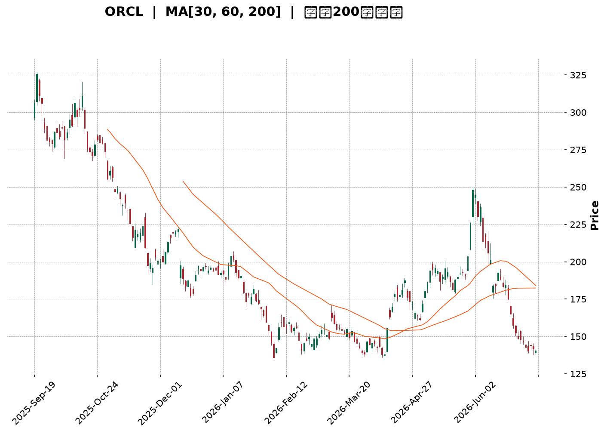
</details>

<html>
<head><meta charset="utf-8" /></head>
<body>
    <div style="height:500px; width:100%;">                        <script>window.PlotlyConfig = {MathJaxConfig: 'local'};</script>
        <script charset="utf-8" src="https://cdn.plot.ly/plotly-3.6.0.min.js" integrity="sha256-QaOVwtVY0T02VaHrr6pnoHLCwayMJp4O5n4YyaE3rJk=" crossorigin="anonymous"></script>                <div id="candlestick-chart" class="plotly-graph-div" style="height:100%; width:100%;"></div>            <script>                window.PLOTLYENV=window.PLOTLYENV || {};                                if (document.getElementById("candlestick-chart")) {                    Plotly.newPlot(                        "candlestick-chart",                        [{"close":{"dtype":"f8","bdata":"AAAAwOQjc0AAAADgSll0QAAAAED3dXNAAAAAALggc0AAAADAyBByQAAAAKDZk3FAAAAAAL2IcUAAAADAm3BxQAAAAID063FAAAAA4E3ocUAAAAAgZb5xQAAAAIDpFHJAAAAAgDugcUAAAABg7OVxQAAAACBXcnJAAAAAILsyckAAAABgDyJzQAAAAODHknJAAAAAwD\u002fcckAAAACgaXFzQAAAAAB+GHJAAAAAAMs3cUAAAADgghdxQAAAAEDq73BAAAAAQMBlcUAAAACAl5lxQAAAAIDmenFAAAAAANZxcUAAAACA5RlxQAAAAMBF6m9AAAAAwBhQcEAAAAAAZwRwQAAAAKDv1G5AAAAAgP8Yb0AAAABg80luQAAAAKCOuW1AAAAAoH3rbUAAAABApVZtQAAAAOBQM2xAAAAAoLcHa0AAAAAgpa9rQAAAAKCMUGtAAAAAIJZka0AAAACA4QRsQAAAAMDmLGpAAAAAIHmxaEAAAADg0OFoQAAAAIBzemhAAAAAYKl2aUAAAADg7RZpQAAAAKDO9mhAAAAAYOX7aEAAAACAws5pQAAAAKCroGpAAAAA4AgIa0AAAAAALWZrQAAAAKCphWtAAAAAwLu0a0AAAAAAVrRoQAAAAEDpmWdAAAAAQEz5ZkAAAADA7W9nQAAAAEDXK2ZAAAAAAMZdZkAAAABAhdlnQAAAAEBjpWhAAAAAgLNEaEAAAADgFIloQAAAAOD7mGhAAAAAQPlFaEAAAAAgLYBoQAAAAIAGN2hAAAAAQHhQaEAAAAAgPe1nQAAAAOAhEmhAAAAAoDD1Z0AAAADAu49nQAAAAMCHumhAAAAAwPZ+aUAAAAAAwDJpQAAAAAD1HWhAAAAAQA6mZ0AAAAAAmc1nQAAAAMBmaWZAAAAAYMuoZUAAAABA6jFmQAAAAKBjEWZAAAAA4MK5ZkAAAAAAUsllQAAAAMBahmVAAAAAIH8NZUAAAADgOoBkQAAAAOAX8GNAAAAAwDZEY0AAAADAGkViQAAAAOAoAGFAAAAAgFXKYUAAAACgcIFjQAAAACCs6mNAAAAA4J2TY0AAAACg7n1jQAAAAACl8mNAAAAAQOQtY0AAAAAADHRjQAAAAGDYf2NAAAAAYBFyYkAAAACALpphQAAAACA0NGJAAAAAQAJsYkAAAADgLbliQAAAACCbHGJAAAAAoGCXYkAAAABguY9iQAAAAKDe+mJAAAAAQApIY0AAAABArw1jQAAAAEAK4WJAAAAAICmcYkAAAAAgrFFkQAAAAOBk02NAAAAAoD5SY0AAAABAq21jQAAAAADaRGNAAAAAQMULY0AAAADAUV9jQAAAAOAWpWJAAAAAwLA5Y0AAAACAf1JiQAAAAKBgMGJAAAAAwAPKYUAAAADAkGVhQAAAAEAkSmFAAAAAwCJTYkAAAABgLxdiQAAAAIDbO2JAAAAAABIhYkAAAACgftVhQAAAAMAe5WFAAAAAIIU7YUAAAABA4UJhQAAAAADXc2NAAAAAAABgZEAAAACA6zllQAAAAEDhSmZAAAAAgOvhZUAAAABgjzJmQAAAAKBwpWZAAAAAAABwZ0AAAADA9QhmQAAAAMD1qGVAAAAAYLieZUAAAABguL5kQAAAAGCPemRAAAAA4HosZEAAAABgj3plQAAAAKBHiWZAAAAAQDMrZ0AAAADA9UBoQAAAAEDhUmhAAAAAYGZ+aEAAAABA4TpoQAAAAGCPWmdAAAAA4FG4Z0AAAAAghXNoQAAAAGBmHmhAAAAAIIVTZ0AAAABguK5mQAAAAMAehWdAAAAA4KO4Z0AAAABgjwJoQAAAAIDrIWhAAAAAYLjeZ0AAAABgZnZpQAAAAMD1OGxAAAAAwMwEb0AAAABgj5JuQAAAAGCPymxAAAAAQOGKbUAAAACAwrVqQAAAAIA9empAAAAAgOu5aUAAAADgUShpQAAAAEAzA2dAAAAAACkEZ0AAAADgehRoQAAAAGCPimdAAAAAwPXwZkAAAACgRwlnQAAAAIA94mVAAAAAwB6lZEAAAADA9bBjQAAAAGC4DmNAAAAAwPWQYkAAAADgUXhiQAAAAKCZUWJAAAAAAADQYUAAAADgo4hhQAAAAOBR+GFAAAAAQDOzYUAAAAAgro9hQA=="},"high":{"dtype":"f8","bdata":"R10NTslKc0Ctstc0uW50QKh0eWhJJ3RAkkHDZmBgc0DcLsoqk4ZyQIdn9nsrO3JAUeVg3Nq7cUCXUdU8bJxxQPynexKD+3FA+3SInZFKckAsbLWIVEVyQP2mR+S2ZXJAd2Jyo8kuckBcw+W\u002f9RNyQPP4ps4bsnJAdwJy33Idc0Ait\u002fdT1kxzQFSaIaj46HJAd2UxX8RRc0BjfwHWHgl0QK+EAKe+5nJACxsbC5P3cUDLRUdpaGlxQKAsO4wcOHFASU7aUu+VcUCpE+WO+dZxQOPSHwf003FAe0hkq3a7cUAjLgkkZn5xQGK\u002f7GfMwXBA8hTi8fuCcEDbWVJ+9n9wQJlUpgERt29AfbjgLXhbb0CR\u002f0qSj\u002fFuQM3H8XXQ3W1Aqni9p1u3bkC8sK\u002fU\u002fX9tQF3yReqia21AvcovHh35a0DWbkBbOTVsQBpYSwYOrmtA234oxK3Ka0BsmgNpNVhsQD+EsfJDEm1Akkbu7DThaUC1JciAZ1JpQPpoEGslxmhA\u002fcQF1PQWakCwDYw8VSNpQBnrmwk6SGlAXsXaNGoNakBV5Ex+zdRpQOfVn\u002fYEw2pAobcUbxlFa0D7Tqa6EuxrQAE+cVZUqGtAwaCdyzP+a0Bc+bjEMxhpQDw96vqHlGhAwKU3PBt6Z0AUFb0VgZRnQIK6cpmMK2dABFIEdjX0ZkDjL8ZktD1oQKN6Xdy+smhA6reJj9t\u002faECHhiz5NKJoQFCeXKut5GhAPYRzhIWpaECvq8U1Y6VoQOvEyIvbf2hAJSotBxGsaEChU8gPqQ5pQDjDC1YSNmhAWx8WZzJPaECB2Y1UFLlnQCFtygt372hANuHjwTC8aUAY3oLmdOJpQBOmb0lMH2lApoflwJlKaEDhd9iCeOZnQDOywVc7UWdAnsqjBhZ\u002fZkDf7c4LDnFmQJMAmqHKYGZAKoYeDEgVZ0AQ6WgSBmNmQPKRTHCGoWZAmFY9l2Y0ZUD8vRkU\u002fQllQLdrcSBVU2VAgwzq1WjaY0C2IHZX7yxjQBywkUNHQWJAvVF8inPWYUAHGENHNeZjQOOCZk8PmmRAWbTIjORiZECUiKIikc9jQGG2GiqGN2RA733hWTjXY0Cq5S\u002fIFJhjQNsgVDG78GNAHE4Kn4cuY0CqPWCbXCliQGunmnL5R2JAbKckcuMXY0ACvxDvA\u002f9iQEC8mFxKMmJAAozuBLe0YkAqKglC88xiQOtpG2VpImNAqJ3XT32sY0BZx4y\u002fWdRjQEdraTQS72JAd2voGlAzY0Dwtg2oMGVlQONeYk7e52RAfggx\u002f7sGZEDrfJ0lAMZjQP4nG4W9y2NAgHDQusdNY0BnM3yV9otjQNESkpbuFmNAwzNrMZxnY0DKD0nWqCtjQPFlFhYxqmJAXl6wJbo+YkAnO9eeTKZhQEZVrJKslmFAnLZUG2JcYkApfXz6IaRiQBclFUrFPWJA6SHILQ6BYkCd2mOVIwJiQGJlsPvZ3WJAAAAAoJnZYUAAAACgcIVhQAAAAMAefWNAAAAAwMwsZUAAAACA65FlQAAAAOCjiGZAAAAAAAAQZ0AAAADgUThmQAAAAEDhKmdAAAAAgMKlZ0AAAADgerxmQAAAAGC4lmZAAAAAoJmxZUAAAABgZhZlQAAAAOBRmGRAAAAAgMKlZEAAAACgmcllQAAAAAAA8GZAAAAA4KNQZ0AAAACgR0loQAAAAMDMBGlAAAAAAADAaEAAAACAwnVoQAAAAKBwHWhAAAAAgD3yZ0AAAABguBZpQAAAAIDCjWhAAAAA4FHYZ0AAAABACpdnQAAAAEAKh2dAAAAAgD0aaEAAAAAAAKBoQAAAAGBmZmhAAAAA4HoEaEAAAAAAAKBpQAAAAKBHSWxAAAAAAABIb0AAAAAAACBvQAAAAOBREG5AAAAAYGbebUAAAACAFO5sQAAAAIDrYWtAAAAAAACQa0AAAAAgXI9qQAAAAOCjGGdAAAAAYI8yZ0AAAACAPWpoQAAAAIA9amhAAAAAgBTGZ0AAAAAgrn9nQAAAAGCPEmdAAAAAYI\u002fKZUAAAAAAALhkQAAAAADXs2NAAAAAoEcxY0AAAAAAAFBjQAAAAIDCvWJAAAAAoJlxYkAAAACA62FiQAAAAADXM2JAAAAAgOsxYkAAAABA4bphQA=="},"hovertemplate":"\u003cb\u003e%{x|%Y-%m-%d}\u003c\u002fb\u003e\u003cbr\u003e\u958b: $%{open:.2f}\u003cbr\u003e\u9ad8: $%{high:.2f}\u003cbr\u003e\u4f4e: $%{low:.2f}\u003cbr\u003e\u6536: $%{close:.2f}\u003cextra\u003e\u003c\u002fextra\u003e","low":{"dtype":"f8","bdata":"JoOCy99vckCa5PazRQhzQO9OBJn1OXNAP\u002fdBGOWackBHumAHp+RxQFmid0CMjHFA3uwfhbtWcUCjY2Bg1htxQOde8u9EO3FAo9S\u002fTPe8cUAnDxdBbJxxQEysyvVeCHJAyDpZGg3OcECy9tHOEpZxQLzisakW2HFAG50IxJ8jckA9yQBOvn5yQJitu54lI3JA2SuwNIKRckDUZZvLgNNyQDe6uZDn23FAYT0sSA4acUDevavMjelwQKSs1C6wuXBA3u5LIZ\u002frcEBs5avkaohxQANDB6edYXFABeslgTltcUCKvFQxFdtwQGOWhQXf1m9AUIKw84vkb0BEg+T2ebVvQFAiE5oodm5AIKB\u002f3K2wbkBumjEHg7ptQP182bzJ3WxAnjrn4OdzbUAM4eSevm9sQF7AQmc8GWxAFT149Pm8akCOvdQpci9qQCIRlyXKx2pA\u002foc6tBOmakAa+FOIcv9qQEt9bWN\u002fIGpAOQgwjcULaEAUBX\u002f0nyNoQNRH5yPhD2dAGcHLNycgaUB7AHfG5YxoQBcINaX0b2hA5220KenYaEC8FCvp08VoQGetSoXqoWlAV6sHoxaKakDoZf+\u002fufJqQOQuozxMHmtAcMBv7wgIa0CnmstN9iJnQEQBBcMCG2dAFOcef1iJZkBk94tEn+tmQIVWNOyh\u002f2VA8QfZLKgvZkCDInOhEl9nQCGEYVDf9GdAwK\u002fJW4TgZ0AeY\u002fT6cCdoQFdQePAwXWhAPYlNONTuZ0CzhyQteFBoQACJsuFMMWhAyof\u002fTMMgaEA6JjhC+ORnQAXHvNogsWdANEpXZ3naZ0DD7LXeaiBnQFiaB1Tvg2dAjVkLz2CKaEDQ10WZxf5oQKKGHTWrxGdAbbqe\u002fWKXZ0ATRBeDLzxnQCmWdTeLV2ZAFPK+JDNAZUCTG1imV\u002fxlQPCByP7XbGVASGPTmhM9ZkB9E+GIaqJlQFK3JQ1haGVAGYBDraYeZEA8JLjUf1VkQJIL7RUu7mNA1Lsc2uHrYkBgJAp+rP1hQOTbq9Hv2GBADyfPOqZNYUAXCv7MoE9iQBnQESo9jWNAhom6ONkuY0CTa+b5A\u002f9iQF9uQgj8V2NARJv5EyILY0B5DtQ6+9piQAamLpRKZ2NA2TpPjBBcYkB4blXNcUNhQOyFO6boR2FAYHd\u002fTnhaYkAPSB4\u002fohRiQDkGvLZfs2FA5Dn\u002fNgmWYUA636gNq9FhQI4D5RuYkmJAQH+sxh6zYkD8uq4U9OJiQIzYBoRzPWJAK2381d19YkAhr5XrrABkQBKFbe7awWNAMvcpn6EzY0Bsd6eAHD9jQKsX323nHmNAw386pVjwYkBMnDbI5YtiQC5uNhPsbWJARIpNX+\u002fFYkA0L6xX2EpiQFYdfXwYA2JA28\u002fBkmfBYUCP98ZmMjphQFOwBL8lD2FAYAvn3p9rYUCZXGrXUwViQFgBc3n5eWFAL\u002fhNzy3rYUDwipuXfm5hQETmUWvizGFAAAAAAAAAYUAAAACAPdJgQAAAAEAKd2FAAAAAgOsxZEAAAABguMZkQAAAAKCZuWVAAAAAIIWrZUAAAADgUbBlQAAAAOBRAGZAAAAAoJnZZkAAAABgj8JlQAAAAKCZGWVAAAAAwMz8ZEAAAACgmUFkQAAAAMDMFGRAAAAAYI8KZEAAAADAzMRkQAAAAOBRyGVAAAAAAABgZkAAAACgcNVmQAAAAKCZ2WdAAAAAYLjGZ0AAAABAM9NnQAAAAADXm2ZAAAAAgOshZ0AAAABgZi5nQAAAAMDMnGdAAAAA4KPoZkAAAACAwp1mQAAAAKCZWWZAAAAAYGZmZ0AAAABAM+NnQAAAAIDr0WdAAAAAoHB9Z0AAAAAAKSxoQAAAAOBRAGpAAAAAQDMTbEAAAABA4dptQAAAACCFc2xAAAAAAAAAbEAAAABgZi5qQAAAAGCPKmpAAAAAoEe5aEAAAACAwsVoQAAAAMD16GVAAAAAAABgZkAAAABguEZnQAAAAMAedWdAAAAAYI\u002fSZkAAAABgZjZmQAAAAMDMzGVAAAAAIIWTZEAAAABAM2tjQAAAACCFy2JAAAAAAACAYkAAAABgZiZiQAAAACBcD2JAAAAAAADQYUAAAABgj1phQAAAAMAepWFAAAAAoJkxYUAAAACgmTFhQA=="},"name":"\u50f9\u683c","open":{"dtype":"f8","bdata":"DqcLK4uKckAvDLnrSjNzQCMYRXppF3RAVH3ZVrFWc0ACACqlVE9yQGub041LK3JAj2P3nfKlcUAmBtttgJdxQKeSAK\u002ffSXFAe2CZ5j4YckBnaipKUvVxQLRTNQp0IXJAd2Jyo8kuckAjhBcx97JxQBjqVxdPHHJAph34vyKnckDe55KJAo5yQAVu5kt023JAx3ZXmprwckAbF35gvPtyQNKxUglR3nJAlsk8jPbycUA9DfnylEZxQBbemJZDEnFAlm74fq\u002f0cEDoPGt0x8JxQDMI\u002fIgdzXFAwBlFFliUcUDFHcTE2ntxQL0df+yTsXBASpFxzcwecEBb4wCA63lwQOkiKZCADm9AhC3J1KrMbkDa8iQcn81uQPeLOcJJsW1AAY4pc1SObkCWYEifMFltQH6NyAppaW1A0muj\u002f7Tza0CLNVapWjFqQP63VG4SHGtAALJAhXbcakBp2+74GjdrQGcBqsvwt2xA3umRVxa6aUBx3gdeC3VoQDxW1bmgHGhAatdk2A0HakD12651U8loQDyV4iPQ6GhAdeO63GJ8aUAkguYAaONoQADMChjl0mlAFjh+czI1a0Dbi6oY8H9rQH2fN630VWtAF2Z7CkCOa0AZ6qeHla5nQKTyBMh1ZWhADAVSonpkZ0ALxc0CTfJmQAOSgbUXxmZA0rUP6FOzZkBS\u002fw3\u002fqGdnQB+Ejs3Fc2hAgoVnNl5naECgQ9tV4zloQJuffb81m2hA2CfOCiwfaEBcfjHKmVtoQOgBr9IMZ2hAuLXREHKIaED7zlxtHaRoQLuvcupI7GdA6y5H6m1DaED\u002fERF12rZnQCI69DbG32dAThWSXDGdaEBBV7IbK4lpQBOmb0lMH2lApoflwJlKaECYSa4k+KdnQDOywVc7UWdAKdzTgb9hZkBHAB7S3FdmQG3rclGdgGVAcnti2kBPZkDE\u002fehuH1JmQFu2\u002f031yWVAD80rf9kxZUCN4GLEtfJkQBT5K1xnSmVAukzPpLG2Y0AfZnAkVytjQONwi\u002fn7ImJA\u002f\u002fK9h29oYUCtw4BxJH9iQH+CGh0u7mNAWbTIjORiZECvLYGoK6xjQBESHoBD1mNAwmi2ysOtY0D6Mg5O7DtjQPJJjreSlGNA9YhZy4YYY0Brr0We2iViQJCnKZ0xi2FA3\u002fot6oGUYkBe1ZVWtYhiQBTsdLYi7GFAlx1rKxGkYUAr\u002fnj14AdiQG800smcr2JAbizymeIBY0B7QAWkaAxjQH4tKqWdxWJAIXFlDrsiY0DLPPcsoblkQCbT8Q\u002fIgmRA3ludyeLPY0DE2hzviXBjQLH1uJ3EXGNAPH1z\u002frYbY0DlgMaE9r1iQFhlWOqNEGNAtNUSYZPcYkCrxke\u002f9Q5jQKjPclq9lmJAkkMVVXTsYUBK6TlKEI5hQFHtbeWucWFAV7tcavl5YUDC2eZxRpJiQN1rKOQOyWFAHO67s6hdYkAqXaFb8uhhQK2nkU7cuGJAAAAAYGbGYUAAAACAPSphQAAAAOCjeGFAAAAAgML9ZEAAAADgetxkQAAAAKBwDWZAAAAAgMLdZkAAAACA6xlmQAAAAEAzS2ZAAAAAgMJFZ0AAAADAzIxmQAAAAOBRkGZAAAAAYI+SZUAAAADAHkVkQAAAAKBHgWRAAAAA4KNAZEAAAACgcM1kQAAAAOCjAGZAAAAAACnEZkAAAABgZkZnQAAAACCF02hAAAAAYI8SaEAAAADAzARoQAAAAKBwHWhAAAAAwPWgZ0AAAACAwoVnQAAAACCuz2dAAAAAAADAZ0AAAAAAAEBnQAAAAIAUfmZAAAAA4FGgZ0AAAACgcPVnQAAAAKCZKWhAAAAAIFzvZ0AAAACgR0FoQAAAAAAAIGpAAAAAAADQbEAAAACgmVluQAAAACBcD25AAAAAAABgbEAAAAAgrq9sQAAAAAAAOGtAAAAAwB69akAAAAAAANBoQAAAAKBwdWZAAAAA4FEgZ0AAAADgemxnQAAAAOBRwGdAAAAAwB5FZ0AAAADgUeBmQAAAAIDryWZAAAAAIFxHZUAAAAAgXE9kQAAAAEAzq2NAAAAA4FHIYkAAAACAFD5jQAAAAAAAaGJAAAAAIK4PYkAAAACgmelhQAAAAKCZCWJAAAAAQAr3YUAAAACA62FhQA=="},"x":["2025-09-19T00:00:00-04:00","2025-09-22T00:00:00-04:00","2025-09-23T00:00:00-04:00","2025-09-24T00:00:00-04:00","2025-09-25T00:00:00-04:00","2025-09-26T00:00:00-04:00","2025-09-29T00:00:00-04:00","2025-09-30T00:00:00-04:00","2025-10-01T00:00:00-04:00","2025-10-02T00:00:00-04:00","2025-10-03T00:00:00-04:00","2025-10-06T00:00:00-04:00","2025-10-07T00:00:00-04:00","2025-10-08T00:00:00-04:00","2025-10-09T00:00:00-04:00","2025-10-10T00:00:00-04:00","2025-10-13T00:00:00-04:00","2025-10-14T00:00:00-04:00","2025-10-15T00:00:00-04:00","2025-10-16T00:00:00-04:00","2025-10-17T00:00:00-04:00","2025-10-20T00:00:00-04:00","2025-10-21T00:00:00-04:00","2025-10-22T00:00:00-04:00","2025-10-23T00:00:00-04:00","2025-10-24T00:00:00-04:00","2025-10-27T00:00:00-04:00","2025-10-28T00:00:00-04:00","2025-10-29T00:00:00-04:00","2025-10-30T00:00:00-04:00","2025-10-31T00:00:00-04:00","2025-11-03T00:00:00-05:00","2025-11-04T00:00:00-05:00","2025-11-05T00:00:00-05:00","2025-11-06T00:00:00-05:00","2025-11-07T00:00:00-05:00","2025-11-10T00:00:00-05:00","2025-11-11T00:00:00-05:00","2025-11-12T00:00:00-05:00","2025-11-13T00:00:00-05:00","2025-11-14T00:00:00-05:00","2025-11-17T00:00:00-05:00","2025-11-18T00:00:00-05:00","2025-11-19T00:00:00-05:00","2025-11-20T00:00:00-05:00","2025-11-21T00:00:00-05:00","2025-11-24T00:00:00-05:00","2025-11-25T00:00:00-05:00","2025-11-26T00:00:00-05:00","2025-11-28T00:00:00-05:00","2025-12-01T00:00:00-05:00","2025-12-02T00:00:00-05:00","2025-12-03T00:00:00-05:00","2025-12-04T00:00:00-05:00","2025-12-05T00:00:00-05:00","2025-12-08T00:00:00-05:00","2025-12-09T00:00:00-05:00","2025-12-10T00:00:00-05:00","2025-12-11T00:00:00-05:00","2025-12-12T00:00:00-05:00","2025-12-15T00:00:00-05:00","2025-12-16T00:00:00-05:00","2025-12-17T00:00:00-05:00","2025-12-18T00:00:00-05:00","2025-12-19T00:00:00-05:00","2025-12-22T00:00:00-05:00","2025-12-23T00:00:00-05:00","2025-12-24T00:00:00-05:00","2025-12-26T00:00:00-05:00","2025-12-29T00:00:00-05:00","2025-12-30T00:00:00-05:00","2025-12-31T00:00:00-05:00","2026-01-02T00:00:00-05:00","2026-01-05T00:00:00-05:00","2026-01-06T00:00:00-05:00","2026-01-07T00:00:00-05:00","2026-01-08T00:00:00-05:00","2026-01-09T00:00:00-05:00","2026-01-12T00:00:00-05:00","2026-01-13T00:00:00-05:00","2026-01-14T00:00:00-05:00","2026-01-15T00:00:00-05:00","2026-01-16T00:00:00-05:00","2026-01-20T00:00:00-05:00","2026-01-21T00:00:00-05:00","2026-01-22T00:00:00-05:00","2026-01-23T00:00:00-05:00","2026-01-26T00:00:00-05:00","2026-01-27T00:00:00-05:00","2026-01-28T00:00:00-05:00","2026-01-29T00:00:00-05:00","2026-01-30T00:00:00-05:00","2026-02-02T00:00:00-05:00","2026-02-03T00:00:00-05:00","2026-02-04T00:00:00-05:00","2026-02-05T00:00:00-05:00","2026-02-06T00:00:00-05:00","2026-02-09T00:00:00-05:00","2026-02-10T00:00:00-05:00","2026-02-11T00:00:00-05:00","2026-02-12T00:00:00-05:00","2026-02-13T00:00:00-05:00","2026-02-17T00:00:00-05:00","2026-02-18T00:00:00-05:00","2026-02-19T00:00:00-05:00","2026-02-20T00:00:00-05:00","2026-02-23T00:00:00-05:00","2026-02-24T00:00:00-05:00","2026-02-25T00:00:00-05:00","2026-02-26T00:00:00-05:00","2026-02-27T00:00:00-05:00","2026-03-02T00:00:00-05:00","2026-03-03T00:00:00-05:00","2026-03-04T00:00:00-05:00","2026-03-05T00:00:00-05:00","2026-03-06T00:00:00-05:00","2026-03-09T00:00:00-04:00","2026-03-10T00:00:00-04:00","2026-03-11T00:00:00-04:00","2026-03-12T00:00:00-04:00","2026-03-13T00:00:00-04:00","2026-03-16T00:00:00-04:00","2026-03-17T00:00:00-04:00","2026-03-18T00:00:00-04:00","2026-03-19T00:00:00-04:00","2026-03-20T00:00:00-04:00","2026-03-23T00:00:00-04:00","2026-03-24T00:00:00-04:00","2026-03-25T00:00:00-04:00","2026-03-26T00:00:00-04:00","2026-03-27T00:00:00-04:00","2026-03-30T00:00:00-04:00","2026-03-31T00:00:00-04:00","2026-04-01T00:00:00-04:00","2026-04-02T00:00:00-04:00","2026-04-06T00:00:00-04:00","2026-04-07T00:00:00-04:00","2026-04-08T00:00:00-04:00","2026-04-09T00:00:00-04:00","2026-04-10T00:00:00-04:00","2026-04-13T00:00:00-04:00","2026-04-14T00:00:00-04:00","2026-04-15T00:00:00-04:00","2026-04-16T00:00:00-04:00","2026-04-17T00:00:00-04:00","2026-04-20T00:00:00-04:00","2026-04-21T00:00:00-04:00","2026-04-22T00:00:00-04:00","2026-04-23T00:00:00-04:00","2026-04-24T00:00:00-04:00","2026-04-27T00:00:00-04:00","2026-04-28T00:00:00-04:00","2026-04-29T00:00:00-04:00","2026-04-30T00:00:00-04:00","2026-05-01T00:00:00-04:00","2026-05-04T00:00:00-04:00","2026-05-05T00:00:00-04:00","2026-05-06T00:00:00-04:00","2026-05-07T00:00:00-04:00","2026-05-08T00:00:00-04:00","2026-05-11T00:00:00-04:00","2026-05-12T00:00:00-04:00","2026-05-13T00:00:00-04:00","2026-05-14T00:00:00-04:00","2026-05-15T00:00:00-04:00","2026-05-18T00:00:00-04:00","2026-05-19T00:00:00-04:00","2026-05-20T00:00:00-04:00","2026-05-21T00:00:00-04:00","2026-05-22T00:00:00-04:00","2026-05-26T00:00:00-04:00","2026-05-27T00:00:00-04:00","2026-05-28T00:00:00-04:00","2026-05-29T00:00:00-04:00","2026-06-01T00:00:00-04:00","2026-06-02T00:00:00-04:00","2026-06-03T00:00:00-04:00","2026-06-04T00:00:00-04:00","2026-06-05T00:00:00-04:00","2026-06-08T00:00:00-04:00","2026-06-09T00:00:00-04:00","2026-06-10T00:00:00-04:00","2026-06-11T00:00:00-04:00","2026-06-12T00:00:00-04:00","2026-06-15T00:00:00-04:00","2026-06-16T00:00:00-04:00","2026-06-17T00:00:00-04:00","2026-06-18T00:00:00-04:00","2026-06-22T00:00:00-04:00","2026-06-23T00:00:00-04:00","2026-06-24T00:00:00-04:00","2026-06-25T00:00:00-04:00","2026-06-26T00:00:00-04:00","2026-06-29T00:00:00-04:00","2026-06-30T00:00:00-04:00","2026-07-01T00:00:00-04:00","2026-07-02T00:00:00-04:00","2026-07-06T00:00:00-04:00","2026-07-07T00:00:00-04:00","2026-07-08T00:00:00-04:00"],"type":"candlestick"},{"hovertemplate":"MA30: $%{y:.2f}\u003cextra\u003e\u003c\u002fextra\u003e","line":{"color":"#2196F3","dash":"dash","width":2},"mode":"lines","name":"MA30","x":["2025-09-19T00:00:00-04:00","2025-09-22T00:00:00-04:00","2025-09-23T00:00:00-04:00","2025-09-24T00:00:00-04:00","2025-09-25T00:00:00-04:00","2025-09-26T00:00:00-04:00","2025-09-29T00:00:00-04:00","2025-09-30T00:00:00-04:00","2025-10-01T00:00:00-04:00","2025-10-02T00:00:00-04:00","2025-10-03T00:00:00-04:00","2025-10-06T00:00:00-04:00","2025-10-07T00:00:00-04:00","2025-10-08T00:00:00-04:00","2025-10-09T00:00:00-04:00","2025-10-10T00:00:00-04:00","2025-10-13T00:00:00-04:00","2025-10-14T00:00:00-04:00","2025-10-15T00:00:00-04:00","2025-10-16T00:00:00-04:00","2025-10-17T00:00:00-04:00","2025-10-20T00:00:00-04:00","2025-10-21T00:00:00-04:00","2025-10-22T00:00:00-04:00","2025-10-23T00:00:00-04:00","2025-10-24T00:00:00-04:00","2025-10-27T00:00:00-04:00","2025-10-28T00:00:00-04:00","2025-10-29T00:00:00-04:00","2025-10-30T00:00:00-04:00","2025-10-31T00:00:00-04:00","2025-11-03T00:00:00-05:00","2025-11-04T00:00:00-05:00","2025-11-05T00:00:00-05:00","2025-11-06T00:00:00-05:00","2025-11-07T00:00:00-05:00","2025-11-10T00:00:00-05:00","2025-11-11T00:00:00-05:00","2025-11-12T00:00:00-05:00","2025-11-13T00:00:00-05:00","2025-11-14T00:00:00-05:00","2025-11-17T00:00:00-05:00","2025-11-18T00:00:00-05:00","2025-11-19T00:00:00-05:00","2025-11-20T00:00:00-05:00","2025-11-21T00:00:00-05:00","2025-11-24T00:00:00-05:00","2025-11-25T00:00:00-05:00","2025-11-26T00:00:00-05:00","2025-11-28T00:00:00-05:00","2025-12-01T00:00:00-05:00","2025-12-02T00:00:00-05:00","2025-12-03T00:00:00-05:00","2025-12-04T00:00:00-05:00","2025-12-05T00:00:00-05:00","2025-12-08T00:00:00-05:00","2025-12-09T00:00:00-05:00","2025-12-10T00:00:00-05:00","2025-12-11T00:00:00-05:00","2025-12-12T00:00:00-05:00","2025-12-15T00:00:00-05:00","2025-12-16T00:00:00-05:00","2025-12-17T00:00:00-05:00","2025-12-18T00:00:00-05:00","2025-12-19T00:00:00-05:00","2025-12-22T00:00:00-05:00","2025-12-23T00:00:00-05:00","2025-12-24T00:00:00-05:00","2025-12-26T00:00:00-05:00","2025-12-29T00:00:00-05:00","2025-12-30T00:00:00-05:00","2025-12-31T00:00:00-05:00","2026-01-02T00:00:00-05:00","2026-01-05T00:00:00-05:00","2026-01-06T00:00:00-05:00","2026-01-07T00:00:00-05:00","2026-01-08T00:00:00-05:00","2026-01-09T00:00:00-05:00","2026-01-12T00:00:00-05:00","2026-01-13T00:00:00-05:00","2026-01-14T00:00:00-05:00","2026-01-15T00:00:00-05:00","2026-01-16T00:00:00-05:00","2026-01-20T00:00:00-05:00","2026-01-21T00:00:00-05:00","2026-01-22T00:00:00-05:00","2026-01-23T00:00:00-05:00","2026-01-26T00:00:00-05:00","2026-01-27T00:00:00-05:00","2026-01-28T00:00:00-05:00","2026-01-29T00:00:00-05:00","2026-01-30T00:00:00-05:00","2026-02-02T00:00:00-05:00","2026-02-03T00:00:00-05:00","2026-02-04T00:00:00-05:00","2026-02-05T00:00:00-05:00","2026-02-06T00:00:00-05:00","2026-02-09T00:00:00-05:00","2026-02-10T00:00:00-05:00","2026-02-11T00:00:00-05:00","2026-02-12T00:00:00-05:00","2026-02-13T00:00:00-05:00","2026-02-17T00:00:00-05:00","2026-02-18T00:00:00-05:00","2026-02-19T00:00:00-05:00","2026-02-20T00:00:00-05:00","2026-02-23T00:00:00-05:00","2026-02-24T00:00:00-05:00","2026-02-25T00:00:00-05:00","2026-02-26T00:00:00-05:00","2026-02-27T00:00:00-05:00","2026-03-02T00:00:00-05:00","2026-03-03T00:00:00-05:00","2026-03-04T00:00:00-05:00","2026-03-05T00:00:00-05:00","2026-03-06T00:00:00-05:00","2026-03-09T00:00:00-04:00","2026-03-10T00:00:00-04:00","2026-03-11T00:00:00-04:00","2026-03-12T00:00:00-04:00","2026-03-13T00:00:00-04:00","2026-03-16T00:00:00-04:00","2026-03-17T00:00:00-04:00","2026-03-18T00:00:00-04:00","2026-03-19T00:00:00-04:00","2026-03-20T00:00:00-04:00","2026-03-23T00:00:00-04:00","2026-03-24T00:00:00-04:00","2026-03-25T00:00:00-04:00","2026-03-26T00:00:00-04:00","2026-03-27T00:00:00-04:00","2026-03-30T00:00:00-04:00","2026-03-31T00:00:00-04:00","2026-04-01T00:00:00-04:00","2026-04-02T00:00:00-04:00","2026-04-06T00:00:00-04:00","2026-04-07T00:00:00-04:00","2026-04-08T00:00:00-04:00","2026-04-09T00:00:00-04:00","2026-04-10T00:00:00-04:00","2026-04-13T00:00:00-04:00","2026-04-14T00:00:00-04:00","2026-04-15T00:00:00-04:00","2026-04-16T00:00:00-04:00","2026-04-17T00:00:00-04:00","2026-04-20T00:00:00-04:00","2026-04-21T00:00:00-04:00","2026-04-22T00:00:00-04:00","2026-04-23T00:00:00-04:00","2026-04-24T00:00:00-04:00","2026-04-27T00:00:00-04:00","2026-04-28T00:00:00-04:00","2026-04-29T00:00:00-04:00","2026-04-30T00:00:00-04:00","2026-05-01T00:00:00-04:00","2026-05-04T00:00:00-04:00","2026-05-05T00:00:00-04:00","2026-05-06T00:00:00-04:00","2026-05-07T00:00:00-04:00","2026-05-08T00:00:00-04:00","2026-05-11T00:00:00-04:00","2026-05-12T00:00:00-04:00","2026-05-13T00:00:00-04:00","2026-05-14T00:00:00-04:00","2026-05-15T00:00:00-04:00","2026-05-18T00:00:00-04:00","2026-05-19T00:00:00-04:00","2026-05-20T00:00:00-04:00","2026-05-21T00:00:00-04:00","2026-05-22T00:00:00-04:00","2026-05-26T00:00:00-04:00","2026-05-27T00:00:00-04:00","2026-05-28T00:00:00-04:00","2026-05-29T00:00:00-04:00","2026-06-01T00:00:00-04:00","2026-06-02T00:00:00-04:00","2026-06-03T00:00:00-04:00","2026-06-04T00:00:00-04:00","2026-06-05T00:00:00-04:00","2026-06-08T00:00:00-04:00","2026-06-09T00:00:00-04:00","2026-06-10T00:00:00-04:00","2026-06-11T00:00:00-04:00","2026-06-12T00:00:00-04:00","2026-06-15T00:00:00-04:00","2026-06-16T00:00:00-04:00","2026-06-17T00:00:00-04:00","2026-06-18T00:00:00-04:00","2026-06-22T00:00:00-04:00","2026-06-23T00:00:00-04:00","2026-06-24T00:00:00-04:00","2026-06-25T00:00:00-04:00","2026-06-26T00:00:00-04:00","2026-06-29T00:00:00-04:00","2026-06-30T00:00:00-04:00","2026-07-01T00:00:00-04:00","2026-07-02T00:00:00-04:00","2026-07-06T00:00:00-04:00","2026-07-07T00:00:00-04:00","2026-07-08T00:00:00-04:00"],"y":{"dtype":"f8","bdata":"AAAAAAAA+H8AAAAAAAD4fwAAAAAAAPh\u002fAAAAAAAA+H8AAAAAAAD4fwAAAAAAAPh\u002fAAAAAAAA+H8AAAAAAAD4fwAAAAAAAPh\u002fAAAAAAAA+H8AAAAAAAD4fwAAAAAAAPh\u002fAAAAAAAA+H8AAAAAAAD4fwAAAAAAAPh\u002fAAAAAAAA+H8AAAAAAAD4fwAAAAAAAPh\u002fAAAAAAAA+H8AAAAAAAD4fwAAAAAAAPh\u002fAAAAAAAA+H8AAAAAAAD4fwAAAAAAAPh\u002fAAAAAAAA+H8AAAAAAAD4fwAAAAAAAPh\u002fAAAAAAAA+H8AAAAAAAD4f0RERAREB3JA3t3dnSPvcUBmZmYWLcpxQO\u002fu7taop3FAZmZmbh6JcUAREREhMXBxQCIiItoFWXFAIiIicg5DcUAAAADgaStxQFVVVb3NCnFAiYiIeFLlcECamZlRCcRwQFVVVSVInnBAmpmZIcB8cEAAAABYkVtwQFVVVY3WLXBAVVVVVc\u002f3b0CamZmJmYVvQO\u002fu7v5+GW9Aq6qqyuawbkAiIiLyKztuQCIiIqJd221AzczMnLWKbUB3d3fnO0NtQFVVVTVlBW1AzczMfCXDbECrqqpalIBsQFVVVbUbQWxA7+7ubs8DbEAAAAAAw7JrQLy7u\u002fvQa2tAIiIiAnQZa0AzMzMzF9BqQM3MzPwvhmpAIiIiEq47akB3d3d3uwRqQAAAALBk2WlAAAAAwCqpaUCJiIh4LoBpQHd3d+dvYWlA7+7ujulJaUBERETkui5pQM3MzHxHFGlAmpmZOQL6aECJiIhYFtdoQJqZmdkgxWhAq6qqKtq+aEAiIiIylbNoQBEREQG4tWhAmpmZ2f61aEARERFB7LZoQM3MzMyxr2hAMzMzw0ykaEB3d3fHMZNoQERERAQ4b2hAIiIiomBBaEAiIiIC+BRoQERERCRt5mdAERERYe27Z0CJiIjYBqNnQFVVVeVOkWdAERERMeqAZ0AiIiKy22dnQImIiMjMVGdAMzMzE1k6Z0DNzMzsuwpnQO\u002fu7j5+yWZAiYiI2DaSZkCJiIj4SmdmQBEREWFZP2ZAREREREUXZkAzMzNzh+xlQM3MzMwdyGVAEREREUycZUAzMzPDH3ZlQAAAAFAdT2VAzczMvBMgZUAiIiKyOe1kQN7d3T2MtWRAIiIiwi55ZEB3d3cn7kFkQM3MzGyvDmRAERERgYfjY0CamZnZzLZjQLy7uwuEmWNAd3d3VzmFY0AzMzOTampjQFVVVWU0T2NAvLu7qxUsY0BEREQkkB9jQKuqqnoQEWNAAAAAEEoCY0BEREQkI\u002fliQBEREeFt82JAq6qqOozxYkBmZmZ29PpiQFVVVWX8CGNAvLu7KzsVY0ARERERIgtjQBEREdFj\u002fGJAIiIi8iLtYkAzMzPzQdtiQN7d3f2SxGJAZmZmRki9YkAiIiJSp7FiQAAAAKDapmJAIiIiciekYkBVVVWVIaZiQM3MzLx+o2JA7+7ubliZYkCamZlp3oxiQHd3d1dPmGJAq6qq2oenYkAiIiJCRb5iQM3MzJyJ2mJAmpmZybvwYkDv7u4OkAtjQKuqqpq1K2NA7+7ubudUY0BVVVUFjGNjQLy7u\u002fsyc2NAREREpNCGY0AAAADQDJJjQImIiKhfnGNAAAAAUP+lY0BVVVXV+LdjQImIiKgt2WNAREREJNT6Y0Dv7u6ucS1kQN7d3U3LYWRAq6qqygGbZEBmZmZGUdVkQERERJQQCWVA7+7urho3ZUDv7u7OYW1lQDMzM6OZn2VA7+7uzvLLZUCamZmZUvVlQJqZmZlSJWZA3t3dfbFcZkDNzMxcSJZmQKuqqvo3vmZAzczM7ArcZkB3d3cnMQBnQAAAAHDLMmdAERER4cGAZ0CJiIhYOchnQN7d3U2p\u002fGdAERER4cEwaEAiIiKSplhoQAAAAJDCgWhAzczMzMykaEDNzMwMdMpoQM3MzBwT4GhAZmZmplT4aECrqqoqhw5pQAAAAKAaF2lAREREpCkVaUCJiIj4xQppQGZmZrbz9WhA3t3d\u002fRvVaEARERHxYK5oQERERKS3iWhAq6qqGr1daEDNzMzcsipoQCIiIpI0+WdAmpmZmSfKZ0C8u7v7N55nQCIiItLbbmdAMzMzM3o7Z0ARERGxcgRnQA=="},"type":"scatter"},{"hovertemplate":"MA60: $%{y:.2f}\u003cextra\u003e\u003c\u002fextra\u003e","line":{"color":"#9C27B0","dash":"dash","width":2},"mode":"lines","name":"MA60","x":["2025-09-19T00:00:00-04:00","2025-09-22T00:00:00-04:00","2025-09-23T00:00:00-04:00","2025-09-24T00:00:00-04:00","2025-09-25T00:00:00-04:00","2025-09-26T00:00:00-04:00","2025-09-29T00:00:00-04:00","2025-09-30T00:00:00-04:00","2025-10-01T00:00:00-04:00","2025-10-02T00:00:00-04:00","2025-10-03T00:00:00-04:00","2025-10-06T00:00:00-04:00","2025-10-07T00:00:00-04:00","2025-10-08T00:00:00-04:00","2025-10-09T00:00:00-04:00","2025-10-10T00:00:00-04:00","2025-10-13T00:00:00-04:00","2025-10-14T00:00:00-04:00","2025-10-15T00:00:00-04:00","2025-10-16T00:00:00-04:00","2025-10-17T00:00:00-04:00","2025-10-20T00:00:00-04:00","2025-10-21T00:00:00-04:00","2025-10-22T00:00:00-04:00","2025-10-23T00:00:00-04:00","2025-10-24T00:00:00-04:00","2025-10-27T00:00:00-04:00","2025-10-28T00:00:00-04:00","2025-10-29T00:00:00-04:00","2025-10-30T00:00:00-04:00","2025-10-31T00:00:00-04:00","2025-11-03T00:00:00-05:00","2025-11-04T00:00:00-05:00","2025-11-05T00:00:00-05:00","2025-11-06T00:00:00-05:00","2025-11-07T00:00:00-05:00","2025-11-10T00:00:00-05:00","2025-11-11T00:00:00-05:00","2025-11-12T00:00:00-05:00","2025-11-13T00:00:00-05:00","2025-11-14T00:00:00-05:00","2025-11-17T00:00:00-05:00","2025-11-18T00:00:00-05:00","2025-11-19T00:00:00-05:00","2025-11-20T00:00:00-05:00","2025-11-21T00:00:00-05:00","2025-11-24T00:00:00-05:00","2025-11-25T00:00:00-05:00","2025-11-26T00:00:00-05:00","2025-11-28T00:00:00-05:00","2025-12-01T00:00:00-05:00","2025-12-02T00:00:00-05:00","2025-12-03T00:00:00-05:00","2025-12-04T00:00:00-05:00","2025-12-05T00:00:00-05:00","2025-12-08T00:00:00-05:00","2025-12-09T00:00:00-05:00","2025-12-10T00:00:00-05:00","2025-12-11T00:00:00-05:00","2025-12-12T00:00:00-05:00","2025-12-15T00:00:00-05:00","2025-12-16T00:00:00-05:00","2025-12-17T00:00:00-05:00","2025-12-18T00:00:00-05:00","2025-12-19T00:00:00-05:00","2025-12-22T00:00:00-05:00","2025-12-23T00:00:00-05:00","2025-12-24T00:00:00-05:00","2025-12-26T00:00:00-05:00","2025-12-29T00:00:00-05:00","2025-12-30T00:00:00-05:00","2025-12-31T00:00:00-05:00","2026-01-02T00:00:00-05:00","2026-01-05T00:00:00-05:00","2026-01-06T00:00:00-05:00","2026-01-07T00:00:00-05:00","2026-01-08T00:00:00-05:00","2026-01-09T00:00:00-05:00","2026-01-12T00:00:00-05:00","2026-01-13T00:00:00-05:00","2026-01-14T00:00:00-05:00","2026-01-15T00:00:00-05:00","2026-01-16T00:00:00-05:00","2026-01-20T00:00:00-05:00","2026-01-21T00:00:00-05:00","2026-01-22T00:00:00-05:00","2026-01-23T00:00:00-05:00","2026-01-26T00:00:00-05:00","2026-01-27T00:00:00-05:00","2026-01-28T00:00:00-05:00","2026-01-29T00:00:00-05:00","2026-01-30T00:00:00-05:00","2026-02-02T00:00:00-05:00","2026-02-03T00:00:00-05:00","2026-02-04T00:00:00-05:00","2026-02-05T00:00:00-05:00","2026-02-06T00:00:00-05:00","2026-02-09T00:00:00-05:00","2026-02-10T00:00:00-05:00","2026-02-11T00:00:00-05:00","2026-02-12T00:00:00-05:00","2026-02-13T00:00:00-05:00","2026-02-17T00:00:00-05:00","2026-02-18T00:00:00-05:00","2026-02-19T00:00:00-05:00","2026-02-20T00:00:00-05:00","2026-02-23T00:00:00-05:00","2026-02-24T00:00:00-05:00","2026-02-25T00:00:00-05:00","2026-02-26T00:00:00-05:00","2026-02-27T00:00:00-05:00","2026-03-02T00:00:00-05:00","2026-03-03T00:00:00-05:00","2026-03-04T00:00:00-05:00","2026-03-05T00:00:00-05:00","2026-03-06T00:00:00-05:00","2026-03-09T00:00:00-04:00","2026-03-10T00:00:00-04:00","2026-03-11T00:00:00-04:00","2026-03-12T00:00:00-04:00","2026-03-13T00:00:00-04:00","2026-03-16T00:00:00-04:00","2026-03-17T00:00:00-04:00","2026-03-18T00:00:00-04:00","2026-03-19T00:00:00-04:00","2026-03-20T00:00:00-04:00","2026-03-23T00:00:00-04:00","2026-03-24T00:00:00-04:00","2026-03-25T00:00:00-04:00","2026-03-26T00:00:00-04:00","2026-03-27T00:00:00-04:00","2026-03-30T00:00:00-04:00","2026-03-31T00:00:00-04:00","2026-04-01T00:00:00-04:00","2026-04-02T00:00:00-04:00","2026-04-06T00:00:00-04:00","2026-04-07T00:00:00-04:00","2026-04-08T00:00:00-04:00","2026-04-09T00:00:00-04:00","2026-04-10T00:00:00-04:00","2026-04-13T00:00:00-04:00","2026-04-14T00:00:00-04:00","2026-04-15T00:00:00-04:00","2026-04-16T00:00:00-04:00","2026-04-17T00:00:00-04:00","2026-04-20T00:00:00-04:00","2026-04-21T00:00:00-04:00","2026-04-22T00:00:00-04:00","2026-04-23T00:00:00-04:00","2026-04-24T00:00:00-04:00","2026-04-27T00:00:00-04:00","2026-04-28T00:00:00-04:00","2026-04-29T00:00:00-04:00","2026-04-30T00:00:00-04:00","2026-05-01T00:00:00-04:00","2026-05-04T00:00:00-04:00","2026-05-05T00:00:00-04:00","2026-05-06T00:00:00-04:00","2026-05-07T00:00:00-04:00","2026-05-08T00:00:00-04:00","2026-05-11T00:00:00-04:00","2026-05-12T00:00:00-04:00","2026-05-13T00:00:00-04:00","2026-05-14T00:00:00-04:00","2026-05-15T00:00:00-04:00","2026-05-18T00:00:00-04:00","2026-05-19T00:00:00-04:00","2026-05-20T00:00:00-04:00","2026-05-21T00:00:00-04:00","2026-05-22T00:00:00-04:00","2026-05-26T00:00:00-04:00","2026-05-27T00:00:00-04:00","2026-05-28T00:00:00-04:00","2026-05-29T00:00:00-04:00","2026-06-01T00:00:00-04:00","2026-06-02T00:00:00-04:00","2026-06-03T00:00:00-04:00","2026-06-04T00:00:00-04:00","2026-06-05T00:00:00-04:00","2026-06-08T00:00:00-04:00","2026-06-09T00:00:00-04:00","2026-06-10T00:00:00-04:00","2026-06-11T00:00:00-04:00","2026-06-12T00:00:00-04:00","2026-06-15T00:00:00-04:00","2026-06-16T00:00:00-04:00","2026-06-17T00:00:00-04:00","2026-06-18T00:00:00-04:00","2026-06-22T00:00:00-04:00","2026-06-23T00:00:00-04:00","2026-06-24T00:00:00-04:00","2026-06-25T00:00:00-04:00","2026-06-26T00:00:00-04:00","2026-06-29T00:00:00-04:00","2026-06-30T00:00:00-04:00","2026-07-01T00:00:00-04:00","2026-07-02T00:00:00-04:00","2026-07-06T00:00:00-04:00","2026-07-07T00:00:00-04:00","2026-07-08T00:00:00-04:00"],"y":{"dtype":"f8","bdata":"AAAAAAAA+H8AAAAAAAD4fwAAAAAAAPh\u002fAAAAAAAA+H8AAAAAAAD4fwAAAAAAAPh\u002fAAAAAAAA+H8AAAAAAAD4fwAAAAAAAPh\u002fAAAAAAAA+H8AAAAAAAD4fwAAAAAAAPh\u002fAAAAAAAA+H8AAAAAAAD4fwAAAAAAAPh\u002fAAAAAAAA+H8AAAAAAAD4fwAAAAAAAPh\u002fAAAAAAAA+H8AAAAAAAD4fwAAAAAAAPh\u002fAAAAAAAA+H8AAAAAAAD4fwAAAAAAAPh\u002fAAAAAAAA+H8AAAAAAAD4fwAAAAAAAPh\u002fAAAAAAAA+H8AAAAAAAD4fwAAAAAAAPh\u002fAAAAAAAA+H8AAAAAAAD4fwAAAAAAAPh\u002fAAAAAAAA+H8AAAAAAAD4fwAAAAAAAPh\u002fAAAAAAAA+H8AAAAAAAD4fwAAAAAAAPh\u002fAAAAAAAA+H8AAAAAAAD4fwAAAAAAAPh\u002fAAAAAAAA+H8AAAAAAAD4fwAAAAAAAPh\u002fAAAAAAAA+H8AAAAAAAD4fwAAAAAAAPh\u002fAAAAAAAA+H8AAAAAAAD4fwAAAAAAAPh\u002fAAAAAAAA+H8AAAAAAAD4fwAAAAAAAPh\u002fAAAAAAAA+H8AAAAAAAD4fwAAAAAAAPh\u002fAAAAAAAA+H8AAAAAAAD4fyIiIoIsvW9A7+7unt17b0AAAACwODJvQFVVVdXA6m5Ad3d3d\u002fWmbkDNzMzcjnJuQCIiIjK4RW5AIiIi0qMXbkBEREQcgettQBEREbGFu21AAAAAQEeKbUC8u7vDZlttQLy7u+NrKG1AZmZmPsH5bEBERESEHMdsQCIiIvpmkGxAAAAAwFRbbEDe3d1dlxxsQAAAAICb52tAIiIi0nKza0CamZkZDHlrQHd3d7eHRWtAAAAAMIEXa0B3d3fXNutqQM3MzJxOumpAd3d3D0OCakBmZmYuxkpqQM3MzGzEE2pAAAAAaN7faUBERETs5KppQImIiPCPfmlAmpmZGS9NaUCrqqpy+RtpQKuqqmJ+7WhAq6qqkgO7aEAiIiKyu4doQHd3d3dxUWhAREREzLAdaECJiIi4vPNnQERERKRk0GdAmpmZaZewZ0C8u7sroY1nQM3MzKQybmdAVVVVJSdLZ0De3d0NmyZnQM3MzBQfCmdAvLu783bvZkAiIiJyZ9BmQHd3dx+itWZA3t3dzZaXZkBEREQ0bXxmQM3MzJwwX2ZAIiIiIupDZkCJiIhQ\u002fyRmQAAAAAheBGZAzczM\u002fEzjZUCrqqpKsb9lQM3MzMTQmmVAZmZmhgF0ZUBmZmZ+S2FlQAAAALAvUWVAiYiIIJpBZUAzMzNrfzBlQM3MzFQdJGVA7+7upvIVZUCamZkx2AJlQCIiIlI96WRAIiIiArnTZEDNzMyENrlkQBEREZnenWRAMzMzGzSCZEAzMzOz5GNkQFVVVWVYRmRAvLu7K8osZECrqqqK4xNkQAAAAPj7+mNAd3d3lx3iY0C8u7ujrcljQFVVVX2FrGNAiYiImEOJY0CJiIhIZmdjQCIiImJ\u002fU2NA3t3drYdFY0De3d0NiTpjQERERNQGOmNAiYiIkPo6Y0ARERFR\u002fTpjQAAAAAB1PWNAVVVVjX5AY0DNzMwUjkFjQDMzM7shQmNAIiIiWo1EY0AiIiL6l0VjQM3MzMTmR2NAVVVVxcVLY0De3d2ldlljQO\u002fu7gYVcWNAAAAAqAeIY0AAAADgSZxjQHd3d48Xr2NAZmZmXhLEY0DNzMycSdhjQBEREcnR5mNAq6qqejH6Y0CJiIiQhA9kQJqZmSE6I2RAiYiIIA04ZEB3d3cXuk1kQDMzM6toZGRAZmZm9gR7ZEAzMzNjk5FkQBEREalDq2RAvLu7Y8nBZEDNzMw0O99kQGZmZoaqBmVAVVVV1b44ZUC8u7uz5GllQERERHQvlGVAAAAAqNTCZUC8u7tLGd5lQN7d3cV6+mVAiYiIuM4VZkBmZmZuQC5mQKuqqmI5PmZAMzMz+ylPZkAAAAAAQGNmQERERCQkeGZARERE5P6HZkC8u7vTG5xmQCIiIoLfq2ZARERE5A64ZkC8u7sb2cFmQERERBxkyWZAzczM5GvKZkDe3d1VCsxmQKuqqhpnzGZARERENA3LZkCrqqpKxclmQN7d3TUXymZAiYiI2BXMZkDv7u6GXc1mQA=="},"type":"scatter"},{"hovertemplate":"MA200: $%{y:.2f}\u003cextra\u003e\u003c\u002fextra\u003e","line":{"color":"#FF6F00","dash":"solid","width":2},"mode":"lines","name":"MA200","x":["2025-09-19T00:00:00-04:00","2025-09-22T00:00:00-04:00","2025-09-23T00:00:00-04:00","2025-09-24T00:00:00-04:00","2025-09-25T00:00:00-04:00","2025-09-26T00:00:00-04:00","2025-09-29T00:00:00-04:00","2025-09-30T00:00:00-04:00","2025-10-01T00:00:00-04:00","2025-10-02T00:00:00-04:00","2025-10-03T00:00:00-04:00","2025-10-06T00:00:00-04:00","2025-10-07T00:00:00-04:00","2025-10-08T00:00:00-04:00","2025-10-09T00:00:00-04:00","2025-10-10T00:00:00-04:00","2025-10-13T00:00:00-04:00","2025-10-14T00:00:00-04:00","2025-10-15T00:00:00-04:00","2025-10-16T00:00:00-04:00","2025-10-17T00:00:00-04:00","2025-10-20T00:00:00-04:00","2025-10-21T00:00:00-04:00","2025-10-22T00:00:00-04:00","2025-10-23T00:00:00-04:00","2025-10-24T00:00:00-04:00","2025-10-27T00:00:00-04:00","2025-10-28T00:00:00-04:00","2025-10-29T00:00:00-04:00","2025-10-30T00:00:00-04:00","2025-10-31T00:00:00-04:00","2025-11-03T00:00:00-05:00","2025-11-04T00:00:00-05:00","2025-11-05T00:00:00-05:00","2025-11-06T00:00:00-05:00","2025-11-07T00:00:00-05:00","2025-11-10T00:00:00-05:00","2025-11-11T00:00:00-05:00","2025-11-12T00:00:00-05:00","2025-11-13T00:00:00-05:00","2025-11-14T00:00:00-05:00","2025-11-17T00:00:00-05:00","2025-11-18T00:00:00-05:00","2025-11-19T00:00:00-05:00","2025-11-20T00:00:00-05:00","2025-11-21T00:00:00-05:00","2025-11-24T00:00:00-05:00","2025-11-25T00:00:00-05:00","2025-11-26T00:00:00-05:00","2025-11-28T00:00:00-05:00","2025-12-01T00:00:00-05:00","2025-12-02T00:00:00-05:00","2025-12-03T00:00:00-05:00","2025-12-04T00:00:00-05:00","2025-12-05T00:00:00-05:00","2025-12-08T00:00:00-05:00","2025-12-09T00:00:00-05:00","2025-12-10T00:00:00-05:00","2025-12-11T00:00:00-05:00","2025-12-12T00:00:00-05:00","2025-12-15T00:00:00-05:00","2025-12-16T00:00:00-05:00","2025-12-17T00:00:00-05:00","2025-12-18T00:00:00-05:00","2025-12-19T00:00:00-05:00","2025-12-22T00:00:00-05:00","2025-12-23T00:00:00-05:00","2025-12-24T00:00:00-05:00","2025-12-26T00:00:00-05:00","2025-12-29T00:00:00-05:00","2025-12-30T00:00:00-05:00","2025-12-31T00:00:00-05:00","2026-01-02T00:00:00-05:00","2026-01-05T00:00:00-05:00","2026-01-06T00:00:00-05:00","2026-01-07T00:00:00-05:00","2026-01-08T00:00:00-05:00","2026-01-09T00:00:00-05:00","2026-01-12T00:00:00-05:00","2026-01-13T00:00:00-05:00","2026-01-14T00:00:00-05:00","2026-01-15T00:00:00-05:00","2026-01-16T00:00:00-05:00","2026-01-20T00:00:00-05:00","2026-01-21T00:00:00-05:00","2026-01-22T00:00:00-05:00","2026-01-23T00:00:00-05:00","2026-01-26T00:00:00-05:00","2026-01-27T00:00:00-05:00","2026-01-28T00:00:00-05:00","2026-01-29T00:00:00-05:00","2026-01-30T00:00:00-05:00","2026-02-02T00:00:00-05:00","2026-02-03T00:00:00-05:00","2026-02-04T00:00:00-05:00","2026-02-05T00:00:00-05:00","2026-02-06T00:00:00-05:00","2026-02-09T00:00:00-05:00","2026-02-10T00:00:00-05:00","2026-02-11T00:00:00-05:00","2026-02-12T00:00:00-05:00","2026-02-13T00:00:00-05:00","2026-02-17T00:00:00-05:00","2026-02-18T00:00:00-05:00","2026-02-19T00:00:00-05:00","2026-02-20T00:00:00-05:00","2026-02-23T00:00:00-05:00","2026-02-24T00:00:00-05:00","2026-02-25T00:00:00-05:00","2026-02-26T00:00:00-05:00","2026-02-27T00:00:00-05:00","2026-03-02T00:00:00-05:00","2026-03-03T00:00:00-05:00","2026-03-04T00:00:00-05:00","2026-03-05T00:00:00-05:00","2026-03-06T00:00:00-05:00","2026-03-09T00:00:00-04:00","2026-03-10T00:00:00-04:00","2026-03-11T00:00:00-04:00","2026-03-12T00:00:00-04:00","2026-03-13T00:00:00-04:00","2026-03-16T00:00:00-04:00","2026-03-17T00:00:00-04:00","2026-03-18T00:00:00-04:00","2026-03-19T00:00:00-04:00","2026-03-20T00:00:00-04:00","2026-03-23T00:00:00-04:00","2026-03-24T00:00:00-04:00","2026-03-25T00:00:00-04:00","2026-03-26T00:00:00-04:00","2026-03-27T00:00:00-04:00","2026-03-30T00:00:00-04:00","2026-03-31T00:00:00-04:00","2026-04-01T00:00:00-04:00","2026-04-02T00:00:00-04:00","2026-04-06T00:00:00-04:00","2026-04-07T00:00:00-04:00","2026-04-08T00:00:00-04:00","2026-04-09T00:00:00-04:00","2026-04-10T00:00:00-04:00","2026-04-13T00:00:00-04:00","2026-04-14T00:00:00-04:00","2026-04-15T00:00:00-04:00","2026-04-16T00:00:00-04:00","2026-04-17T00:00:00-04:00","2026-04-20T00:00:00-04:00","2026-04-21T00:00:00-04:00","2026-04-22T00:00:00-04:00","2026-04-23T00:00:00-04:00","2026-04-24T00:00:00-04:00","2026-04-27T00:00:00-04:00","2026-04-28T00:00:00-04:00","2026-04-29T00:00:00-04:00","2026-04-30T00:00:00-04:00","2026-05-01T00:00:00-04:00","2026-05-04T00:00:00-04:00","2026-05-05T00:00:00-04:00","2026-05-06T00:00:00-04:00","2026-05-07T00:00:00-04:00","2026-05-08T00:00:00-04:00","2026-05-11T00:00:00-04:00","2026-05-12T00:00:00-04:00","2026-05-13T00:00:00-04:00","2026-05-14T00:00:00-04:00","2026-05-15T00:00:00-04:00","2026-05-18T00:00:00-04:00","2026-05-19T00:00:00-04:00","2026-05-20T00:00:00-04:00","2026-05-21T00:00:00-04:00","2026-05-22T00:00:00-04:00","2026-05-26T00:00:00-04:00","2026-05-27T00:00:00-04:00","2026-05-28T00:00:00-04:00","2026-05-29T00:00:00-04:00","2026-06-01T00:00:00-04:00","2026-06-02T00:00:00-04:00","2026-06-03T00:00:00-04:00","2026-06-04T00:00:00-04:00","2026-06-05T00:00:00-04:00","2026-06-08T00:00:00-04:00","2026-06-09T00:00:00-04:00","2026-06-10T00:00:00-04:00","2026-06-11T00:00:00-04:00","2026-06-12T00:00:00-04:00","2026-06-15T00:00:00-04:00","2026-06-16T00:00:00-04:00","2026-06-17T00:00:00-04:00","2026-06-18T00:00:00-04:00","2026-06-22T00:00:00-04:00","2026-06-23T00:00:00-04:00","2026-06-24T00:00:00-04:00","2026-06-25T00:00:00-04:00","2026-06-26T00:00:00-04:00","2026-06-29T00:00:00-04:00","2026-06-30T00:00:00-04:00","2026-07-01T00:00:00-04:00","2026-07-02T00:00:00-04:00","2026-07-06T00:00:00-04:00","2026-07-07T00:00:00-04:00","2026-07-08T00:00:00-04:00"],"y":{"dtype":"f8","bdata":"AAAAAAAA+H8AAAAAAAD4fwAAAAAAAPh\u002fAAAAAAAA+H8AAAAAAAD4fwAAAAAAAPh\u002fAAAAAAAA+H8AAAAAAAD4fwAAAAAAAPh\u002fAAAAAAAA+H8AAAAAAAD4fwAAAAAAAPh\u002fAAAAAAAA+H8AAAAAAAD4fwAAAAAAAPh\u002fAAAAAAAA+H8AAAAAAAD4fwAAAAAAAPh\u002fAAAAAAAA+H8AAAAAAAD4fwAAAAAAAPh\u002fAAAAAAAA+H8AAAAAAAD4fwAAAAAAAPh\u002fAAAAAAAA+H8AAAAAAAD4fwAAAAAAAPh\u002fAAAAAAAA+H8AAAAAAAD4fwAAAAAAAPh\u002fAAAAAAAA+H8AAAAAAAD4fwAAAAAAAPh\u002fAAAAAAAA+H8AAAAAAAD4fwAAAAAAAPh\u002fAAAAAAAA+H8AAAAAAAD4fwAAAAAAAPh\u002fAAAAAAAA+H8AAAAAAAD4fwAAAAAAAPh\u002fAAAAAAAA+H8AAAAAAAD4fwAAAAAAAPh\u002fAAAAAAAA+H8AAAAAAAD4fwAAAAAAAPh\u002fAAAAAAAA+H8AAAAAAAD4fwAAAAAAAPh\u002fAAAAAAAA+H8AAAAAAAD4fwAAAAAAAPh\u002fAAAAAAAA+H8AAAAAAAD4fwAAAAAAAPh\u002fAAAAAAAA+H8AAAAAAAD4fwAAAAAAAPh\u002fAAAAAAAA+H8AAAAAAAD4fwAAAAAAAPh\u002fAAAAAAAA+H8AAAAAAAD4fwAAAAAAAPh\u002fAAAAAAAA+H8AAAAAAAD4fwAAAAAAAPh\u002fAAAAAAAA+H8AAAAAAAD4fwAAAAAAAPh\u002fAAAAAAAA+H8AAAAAAAD4fwAAAAAAAPh\u002fAAAAAAAA+H8AAAAAAAD4fwAAAAAAAPh\u002fAAAAAAAA+H8AAAAAAAD4fwAAAAAAAPh\u002fAAAAAAAA+H8AAAAAAAD4fwAAAAAAAPh\u002fAAAAAAAA+H8AAAAAAAD4fwAAAAAAAPh\u002fAAAAAAAA+H8AAAAAAAD4fwAAAAAAAPh\u002fAAAAAAAA+H8AAAAAAAD4fwAAAAAAAPh\u002fAAAAAAAA+H8AAAAAAAD4fwAAAAAAAPh\u002fAAAAAAAA+H8AAAAAAAD4fwAAAAAAAPh\u002fAAAAAAAA+H8AAAAAAAD4fwAAAAAAAPh\u002fAAAAAAAA+H8AAAAAAAD4fwAAAAAAAPh\u002fAAAAAAAA+H8AAAAAAAD4fwAAAAAAAPh\u002fAAAAAAAA+H8AAAAAAAD4fwAAAAAAAPh\u002fAAAAAAAA+H8AAAAAAAD4fwAAAAAAAPh\u002fAAAAAAAA+H8AAAAAAAD4fwAAAAAAAPh\u002fAAAAAAAA+H8AAAAAAAD4fwAAAAAAAPh\u002fAAAAAAAA+H8AAAAAAAD4fwAAAAAAAPh\u002fAAAAAAAA+H8AAAAAAAD4fwAAAAAAAPh\u002fAAAAAAAA+H8AAAAAAAD4fwAAAAAAAPh\u002fAAAAAAAA+H8AAAAAAAD4fwAAAAAAAPh\u002fAAAAAAAA+H8AAAAAAAD4fwAAAAAAAPh\u002fAAAAAAAA+H8AAAAAAAD4fwAAAAAAAPh\u002fAAAAAAAA+H8AAAAAAAD4fwAAAAAAAPh\u002fAAAAAAAA+H8AAAAAAAD4fwAAAAAAAPh\u002fAAAAAAAA+H8AAAAAAAD4fwAAAAAAAPh\u002fAAAAAAAA+H8AAAAAAAD4fwAAAAAAAPh\u002fAAAAAAAA+H8AAAAAAAD4fwAAAAAAAPh\u002fAAAAAAAA+H8AAAAAAAD4fwAAAAAAAPh\u002fAAAAAAAA+H8AAAAAAAD4fwAAAAAAAPh\u002fAAAAAAAA+H8AAAAAAAD4fwAAAAAAAPh\u002fAAAAAAAA+H8AAAAAAAD4fwAAAAAAAPh\u002fAAAAAAAA+H8AAAAAAAD4fwAAAAAAAPh\u002fAAAAAAAA+H8AAAAAAAD4fwAAAAAAAPh\u002fAAAAAAAA+H8AAAAAAAD4fwAAAAAAAPh\u002fAAAAAAAA+H8AAAAAAAD4fwAAAAAAAPh\u002fAAAAAAAA+H8AAAAAAAD4fwAAAAAAAPh\u002fAAAAAAAA+H8AAAAAAAD4fwAAAAAAAPh\u002fAAAAAAAA+H8AAAAAAAD4fwAAAAAAAPh\u002fAAAAAAAA+H8AAAAAAAD4fwAAAAAAAPh\u002fAAAAAAAA+H8AAAAAAAD4fwAAAAAAAPh\u002fAAAAAAAA+H8AAAAAAAD4fwAAAAAAAPh\u002fAAAAAAAA+H8AAAAAAAD4fwAAAAAAAPh\u002fAAAAAAAA+H+kcD1uxpZoQA=="},"type":"scatter"}],                        {"template":{"data":{"barpolar":[{"marker":{"line":{"color":"rgb(17,17,17)","width":0.5},"pattern":{"fillmode":"overlay","size":10,"solidity":0.2}},"type":"barpolar"}],"bar":[{"error_x":{"color":"#f2f5fa"},"error_y":{"color":"#f2f5fa"},"marker":{"line":{"color":"rgb(17,17,17)","width":0.5},"pattern":{"fillmode":"overlay","size":10,"solidity":0.2}},"type":"bar"}],"carpet":[{"aaxis":{"endlinecolor":"#A2B1C6","gridcolor":"#506784","linecolor":"#506784","minorgridcolor":"#506784","startlinecolor":"#A2B1C6"},"baxis":{"endlinecolor":"#A2B1C6","gridcolor":"#506784","linecolor":"#506784","minorgridcolor":"#506784","startlinecolor":"#A2B1C6"},"type":"carpet"}],"choropleth":[{"colorbar":{"outlinewidth":0,"ticks":""},"type":"choropleth"}],"contourcarpet":[{"colorbar":{"outlinewidth":0,"ticks":""},"type":"contourcarpet"}],"contour":[{"colorbar":{"outlinewidth":0,"ticks":""},"colorscale":[[0.0,"#0d0887"],[0.1111111111111111,"#46039f"],[0.2222222222222222,"#7201a8"],[0.3333333333333333,"#9c179e"],[0.4444444444444444,"#bd3786"],[0.5555555555555556,"#d8576b"],[0.6666666666666666,"#ed7953"],[0.7777777777777778,"#fb9f3a"],[0.8888888888888888,"#fdca26"],[1.0,"#f0f921"]],"type":"contour"}],"heatmap":[{"colorbar":{"outlinewidth":0,"ticks":""},"colorscale":[[0.0,"#0d0887"],[0.1111111111111111,"#46039f"],[0.2222222222222222,"#7201a8"],[0.3333333333333333,"#9c179e"],[0.4444444444444444,"#bd3786"],[0.5555555555555556,"#d8576b"],[0.6666666666666666,"#ed7953"],[0.7777777777777778,"#fb9f3a"],[0.8888888888888888,"#fdca26"],[1.0,"#f0f921"]],"type":"heatmap"}],"histogram2dcontour":[{"colorbar":{"outlinewidth":0,"ticks":""},"colorscale":[[0.0,"#0d0887"],[0.1111111111111111,"#46039f"],[0.2222222222222222,"#7201a8"],[0.3333333333333333,"#9c179e"],[0.4444444444444444,"#bd3786"],[0.5555555555555556,"#d8576b"],[0.6666666666666666,"#ed7953"],[0.7777777777777778,"#fb9f3a"],[0.8888888888888888,"#fdca26"],[1.0,"#f0f921"]],"type":"histogram2dcontour"}],"histogram2d":[{"colorbar":{"outlinewidth":0,"ticks":""},"colorscale":[[0.0,"#0d0887"],[0.1111111111111111,"#46039f"],[0.2222222222222222,"#7201a8"],[0.3333333333333333,"#9c179e"],[0.4444444444444444,"#bd3786"],[0.5555555555555556,"#d8576b"],[0.6666666666666666,"#ed7953"],[0.7777777777777778,"#fb9f3a"],[0.8888888888888888,"#fdca26"],[1.0,"#f0f921"]],"type":"histogram2d"}],"histogram":[{"marker":{"pattern":{"fillmode":"overlay","size":10,"solidity":0.2}},"type":"histogram"}],"mesh3d":[{"colorbar":{"outlinewidth":0,"ticks":""},"type":"mesh3d"}],"parcoords":[{"line":{"colorbar":{"outlinewidth":0,"ticks":""}},"type":"parcoords"}],"pie":[{"automargin":true,"type":"pie"}],"scatter3d":[{"line":{"colorbar":{"outlinewidth":0,"ticks":""}},"marker":{"colorbar":{"outlinewidth":0,"ticks":""}},"type":"scatter3d"}],"scattercarpet":[{"marker":{"colorbar":{"outlinewidth":0,"ticks":""}},"type":"scattercarpet"}],"scattergeo":[{"marker":{"colorbar":{"outlinewidth":0,"ticks":""}},"type":"scattergeo"}],"scattergl":[{"marker":{"line":{"color":"#283442"}},"type":"scattergl"}],"scattermapbox":[{"marker":{"colorbar":{"outlinewidth":0,"ticks":""}},"type":"scattermapbox"}],"scattermap":[{"marker":{"colorbar":{"outlinewidth":0,"ticks":""}},"type":"scattermap"}],"scatterpolargl":[{"marker":{"colorbar":{"outlinewidth":0,"ticks":""}},"type":"scatterpolargl"}],"scatterpolar":[{"marker":{"colorbar":{"outlinewidth":0,"ticks":""}},"type":"scatterpolar"}],"scatter":[{"marker":{"line":{"color":"#283442"}},"type":"scatter"}],"scatterternary":[{"marker":{"colorbar":{"outlinewidth":0,"ticks":""}},"type":"scatterternary"}],"surface":[{"colorbar":{"outlinewidth":0,"ticks":""},"colorscale":[[0.0,"#0d0887"],[0.1111111111111111,"#46039f"],[0.2222222222222222,"#7201a8"],[0.3333333333333333,"#9c179e"],[0.4444444444444444,"#bd3786"],[0.5555555555555556,"#d8576b"],[0.6666666666666666,"#ed7953"],[0.7777777777777778,"#fb9f3a"],[0.8888888888888888,"#fdca26"],[1.0,"#f0f921"]],"type":"surface"}],"table":[{"cells":{"fill":{"color":"#506784"},"line":{"color":"rgb(17,17,17)"}},"header":{"fill":{"color":"#2a3f5f"},"line":{"color":"rgb(17,17,17)"}},"type":"table"}]},"layout":{"annotationdefaults":{"arrowcolor":"#f2f5fa","arrowhead":0,"arrowwidth":1},"autotypenumbers":"strict","coloraxis":{"colorbar":{"outlinewidth":0,"ticks":""}},"colorscale":{"diverging":[[0,"#8e0152"],[0.1,"#c51b7d"],[0.2,"#de77ae"],[0.3,"#f1b6da"],[0.4,"#fde0ef"],[0.5,"#f7f7f7"],[0.6,"#e6f5d0"],[0.7,"#b8e186"],[0.8,"#7fbc41"],[0.9,"#4d9221"],[1,"#276419"]],"sequential":[[0.0,"#0d0887"],[0.1111111111111111,"#46039f"],[0.2222222222222222,"#7201a8"],[0.3333333333333333,"#9c179e"],[0.4444444444444444,"#bd3786"],[0.5555555555555556,"#d8576b"],[0.6666666666666666,"#ed7953"],[0.7777777777777778,"#fb9f3a"],[0.8888888888888888,"#fdca26"],[1.0,"#f0f921"]],"sequentialminus":[[0.0,"#0d0887"],[0.1111111111111111,"#46039f"],[0.2222222222222222,"#7201a8"],[0.3333333333333333,"#9c179e"],[0.4444444444444444,"#bd3786"],[0.5555555555555556,"#d8576b"],[0.6666666666666666,"#ed7953"],[0.7777777777777778,"#fb9f3a"],[0.8888888888888888,"#fdca26"],[1.0,"#f0f921"]]},"colorway":["#636efa","#EF553B","#00cc96","#ab63fa","#FFA15A","#19d3f3","#FF6692","#B6E880","#FF97FF","#FECB52"],"font":{"color":"#f2f5fa"},"geo":{"bgcolor":"rgb(17,17,17)","lakecolor":"rgb(17,17,17)","landcolor":"rgb(17,17,17)","showlakes":true,"showland":true,"subunitcolor":"#506784"},"hoverlabel":{"align":"left"},"hovermode":"closest","mapbox":{"style":"dark"},"paper_bgcolor":"rgb(17,17,17)","plot_bgcolor":"rgb(17,17,17)","polar":{"angularaxis":{"gridcolor":"#506784","linecolor":"#506784","ticks":""},"bgcolor":"rgb(17,17,17)","radialaxis":{"gridcolor":"#506784","linecolor":"#506784","ticks":""}},"scene":{"xaxis":{"backgroundcolor":"rgb(17,17,17)","gridcolor":"#506784","gridwidth":2,"linecolor":"#506784","showbackground":true,"ticks":"","zerolinecolor":"#C8D4E3"},"yaxis":{"backgroundcolor":"rgb(17,17,17)","gridcolor":"#506784","gridwidth":2,"linecolor":"#506784","showbackground":true,"ticks":"","zerolinecolor":"#C8D4E3"},"zaxis":{"backgroundcolor":"rgb(17,17,17)","gridcolor":"#506784","gridwidth":2,"linecolor":"#506784","showbackground":true,"ticks":"","zerolinecolor":"#C8D4E3"}},"shapedefaults":{"line":{"color":"#f2f5fa"}},"sliderdefaults":{"bgcolor":"#C8D4E3","bordercolor":"rgb(17,17,17)","borderwidth":1,"tickwidth":0},"ternary":{"aaxis":{"gridcolor":"#506784","linecolor":"#506784","ticks":""},"baxis":{"gridcolor":"#506784","linecolor":"#506784","ticks":""},"bgcolor":"rgb(17,17,17)","caxis":{"gridcolor":"#506784","linecolor":"#506784","ticks":""}},"title":{"x":0.05},"updatemenudefaults":{"bgcolor":"#506784","borderwidth":0},"xaxis":{"automargin":true,"gridcolor":"#283442","linecolor":"#506784","ticks":"","title":{"standoff":15},"zerolinecolor":"#283442","zerolinewidth":2},"yaxis":{"automargin":true,"gridcolor":"#283442","linecolor":"#506784","ticks":"","title":{"standoff":15},"zerolinecolor":"#283442","zerolinewidth":2}}},"xaxis":{"rangeslider":{"visible":false},"title":{"text":"\u65e5\u671f"}},"font":{"size":11},"title":{"text":"ORCL  |  MA(30\u002f60\u002f200)  |  \u6700\u8fd1200\u4ea4\u6613\u65e5"},"yaxis":{"title":{"text":"\u80a1\u50f9 (USD)"}},"hovermode":"x unified","height":500},                        {"responsive": true}                    )                };            </script>        </div>
</body>
</html>

# ORCL 技術分析報告

> **報告日期**：2026-07-09 ｜ **語言**：繁體中文 ｜ **數據來源**：Yahoo Finance ｜ **當前價格**：$140.49

---

## 目錄

| 章節 | 內容 |
|------|------|
| [1. 技術面概覽](#1-技術面概覽) | 訊號儀表板、核心指標、評分卡 |
| [2. 趨勢分析](#2-趨勢分析) | 多時框趨勢、長中短期走勢 |
| [3. 圖表形態分析](#3-圖表形態分析) | 形態識別、K線組合、目標價 |
| [4. 支撐與阻力](#4-支撐與阻力) | 關鍵價位、斐波那契回調 |
| [5. 技術指標深度解讀](#5-技術指標深度解讀) | MA/RSI/MACD/布林/成交量 |
| [6. 動能與波動率](#6-動能與波動率) | 動能評估、ATR、Beta |
| [7. 多時框架總結](#7-多時框架總結) | 時框架評分矩陣 |
| [8. 交易策略建議](#8-交易策略建議) | 多空策略、風險報酬比 |
| [9. 風險提示與監控](#9-風險提示與監控) | 監控指標、風險場景 |

---

## 1. 技術面概覽

### 🎯 技術訊號儀表板

ORCL 當前技術面呈現顯著的空頭主導態勢。價格已跌破所有主要移動平均線，且均線呈空頭排列，顯示中長期趨勢疲弱。動能指標如 RSI、MACD 和 Stochastics 均處於超賣區間或發出看空訊號，唯獨 RSI 和 Stochastics 的極度超賣可能預示短期內存在技術性反彈的需求。ADX 指標確認當前處於強勁的趨勢行情中，且空頭力量佔據主導。

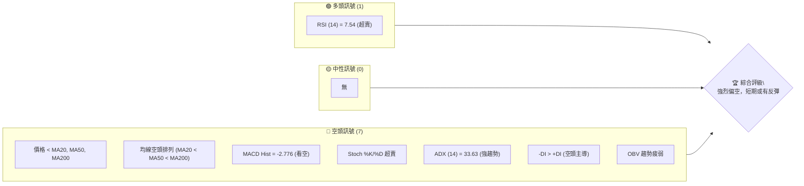

### 📊 核心指標速覽表

| 指標類別 | 指標名稱 | 當前數值 | 訊號 | 解讀 |
|----------|----------|----------|------|------|
| **價格** | 當前價格 | $140.49 | 🔴 | 位於52週區間底部2.8%，接近52週低點 $134.57 |
| **均線** | MA20 | $166.29 | 🔴 | 價格遠低於MA20，短期承壓 |
| **均線** | MA50 | $184.15 | 🔴 | 價格遠低於MA50，中期趨勢向下 |
| **均線** | MA200 | $196.71 | 🔴 | 價格遠低於MA200，長期趨勢轉弱 |
| **動能** | RSI(14) | 7.54 | 🟢 | 極度超賣區間，或有技術性反彈需求 |
| **動能** | MACD | -14.874 | 🔴 | MACD線在訊號線下方，MACD柱為負，空頭動能強勁 |
| **波動** | ATR(14) | $7.67 | 🟡 | 波動幅度適中，佔價格5.46% |
| **趨勢** | ADX(14) | 33.63 | 🔴 | 強趨勢行情，空頭主導 (-DI > +DI) |
| **布林** | BB %B | 0.21 | 🔴 | 價格接近布林通道下軌，顯示超賣或下跌動能強勁 |
| **量能** | OBV趨勢 | OBV < MA | 🔴 | 量能未能配合價格反彈，趨勢疲弱 |

### 🏆 技術評分卡

ORCL 的技術評分卡反映出當前市場的強烈空頭情緒。儘管短期動能指標顯示極度超賣，但趨勢強度、均線排列和量能配合等關鍵指標均指向空頭。這表明任何潛在的反彈都可能只是技術性修正，而非趨勢反轉。

```
技術評分卡 — ORCL (2026-07-09)
════════════════════════════════════════════════════
趨勢強度      ████████████████░░░░  80/100  🔴 (強烈空頭趨勢)
動能指標      ████░░░░░░░░░░░░░░░░  20/100  🔴 (超賣但動能偏空)
支撐穩定度    ████░░░░░░░░░░░░░░░░  20/100  🔴 (僅剩S1 $135.98，接近52W低點)
成交量配合    ████░░░░░░░░░░░░░░░░  20/100  🔴 (量能疲弱，未見買盤)
形態完整度    ██████░░░░░░░░░░░░░░  30/100  🟡 (未見明確反轉形態，下跌趨勢線明顯)
均線排列      ██░░░░░░░░░░░░░░░░░░  10/100  🔴 (標準空頭排列)
════════════════════════════════════════════════════
綜合評分      ████░░░░░░░░░░░░░░░░  28/100  🔴 強烈偏空
════════════════════════════════════════════════════
```

---

## 2. 趨勢分析

### 🌐 多時框趨勢分析

ORCL 在多時框架下呈現一致的空頭趨勢，尤其在中長期趨勢上表現強勁的下跌動能。短期內雖有超賣跡象，但尚未改變整體空頭格局。

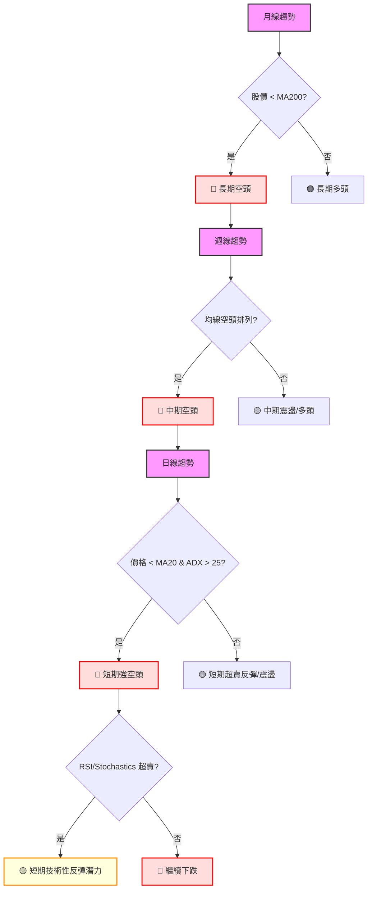

**分析結論:**
*   **月線趨勢 (長期):** 股價 $140.49 遠低於 MA240 $205.77，顯示長期趨勢已轉為空頭。
*   **週線趨勢 (中期):** 近期週線收盤價 $140.49 遠低於 MA60 $182.42 和 MA120 $168.82，且週線級別的均線也呈現空頭排列，中期趨勢強烈偏空。
*   **日線趨勢 (短期):** 價格 $140.49 位於所有日線均線（MA5, MA10, MA20, MA60, MA120, MA240）下方，且日線均線呈現標準的空頭排列。ADX 顯示強趨勢，且空頭佔優。儘管 RSI 和 Stochastics 處於極度超賣區間，但這僅預示潛在的技術性反彈，而非趨勢反轉。短期內，空頭壓力巨大。

### 📈 長期趨勢 — 12個月走勢圖（Unicode）

ORCL 過去12個月的走勢呈現劇烈波動。從2025年7月的 $251.78 開始，股價在2025年9月達到 $279.04 的高點，隨後在2025年10月回落至 $261.01。進入2025年11月至2026年2月，股價經歷了一波明顯的下跌，從 $200.72 跌至 $144.89。在2026年5月曾反彈至 $225.78，但隨後在2026年6月和7月再次經歷大幅下跌，目前價格 $140.49 已接近過去12個月的最低點 $134.57。這表明ORCL在過去一年中，經歷了一個從高位回落，並在近期加速下跌的過程，整體趨勢偏弱。

```
ORCL 月線走勢圖（過去12個月）
價格軸 ($)
$300 ┤                                                ●(279.04 - Sep'25)
$250 ┤          ●(251.78 - Jul'25)  ●(261.01 - Oct'25)
$200 ┤                                      ●(200.72 - Nov'25)
$150 ┤                                                    ●(146.55 - Jun'26)
$140 ┤                                                               ●(140.49 - Jul'26) ←現在
$130 ┤                                                  ●(134.57 - 52W Low)
     └───────────────────────────────────────────────────────────────────────────────────────────
      Jul'25  Aug'25  Sep'25  Oct'25  Nov'25  Dec'25  Jan'26  Feb'26  Mar'26  Apr'26  May'26  Jun'26  Jul'26
```

**走勢特徵分析表格**：

| 階段 | 時間段 | 價格區間 | 漲跌幅 | 主要特徵 | 訊號 |
|------|----------|----------|--------|----------|------|
| **強勢上漲** | 2025-06 至 2025-09 | $216.46 → $279.04 | +28.99% | 量價齊升，多頭強勢 | 🟢 |
| **高位震盪** | 2025-09 至 2025-10 | $279.04 → $261.01 | -6.46% | 價格高位回落，多頭動能減弱 | 🟡 |
| **急劇下跌** | 2025-10 至 2026-02 | $261.01 → $144.89 | -44.50% | 快速下跌，跌破多條均線，空頭佔優 | 🔴 |
| **技術反彈** | 2026-02 至 2026-05 | $144.89 → $225.78 | +55.83% | 從低位強勁反彈，但未能突破前期高點 | 🟢 |
| **再次下跌** | 2026-05 至 2026-07 | $225.78 → $140.49 | -37.78% | 跌破反彈支撐，加速下跌，創近期新低 | 🔴 |

### 📊 中期趨勢（週線分析）

ORCL 的中期趨勢在近期表現出強烈的下跌動能。從2026年5月底的 $225.78 高點開始，股價經歷了連續的下跌。尤其在2026年6月14日當週，股價從 $213.68 大幅跌至 $184.13，跌破了重要的中期支撐。隨後在6月28日當週更是加速下跌至 $148.53，並在最近兩週持續下探。目前價格 $140.49 遠低於所有週線級別的移動平均線，且中期均線（如MA60、MA120）已呈現空頭排列。

近期壓力與支撐示意圖：
```
ORCL 近期週線壓力與支撐示意圖 (2026-07-09)
═══════════════════════════════════════════════════════════════════
$225.78 ┤                           ▂▄▆▇█ (2026-05-31 高點)
$213.68 ┤                         █    (2026-06-07 高點)
$195.95 ┤                     █      (2026-05-10 高點)
$189.18 ┤─────────────────────── R3 (斐波那契78.6%回調附近，強阻力)
$184.13 ┤                   █      (2026-06-14 收盤)
$179.18 ┤─────────────────────── R2 (斐波那契78.6%回調)
$175.06 ┤               █        (2026-04-19 高點)
$171.16 ┤─────────────────────── R1 (前期高點聚類)
$166.29 ┤─────────────────────── MA20 (主要下跌阻力)
$164.81 ┤─────────────────────── R1 (前期高點聚類)
$148.53 ┤                       █ (2026-06-28 收盤)
$140.49 ├─────────────────────── ◄ 現價
$135.98 ┤─────────────────────── S1 (近期低點支撐)
$134.57 ┤─────────────────────── 52W Low (極限支撐)
═══════════════════════════════════════════════════════════════════
```
**分析結論:**
中期趨勢強烈偏空。股價已跌破多個中期支撐位，並在 $164.81 (R1) 和 $171.16 (R2) 處形成新的阻力。目前價格正測試 $135.98 (S1) 附近的支撐，一旦跌破，將可能進一步下探52週低點 $134.57。任何反彈都可能在中期均線（如MA20 $166.29）附近遭遇強大阻力。

### ⚡ 趨勢強度評估（ADX 解讀）

ADX 指標用於衡量趨勢的強度，而非方向。當 ADX 值高於25時，表示趨勢強勁；低於20則表示趨勢不明顯或處於盤整。同時結合 +DI 和 -DI 可以判斷趨勢的方向。

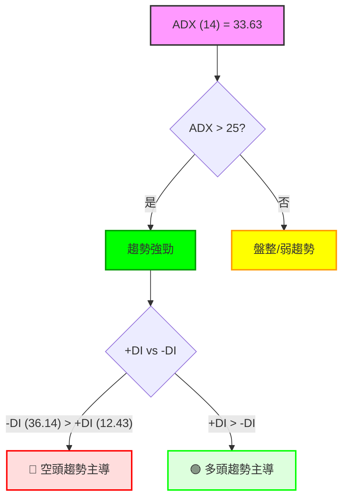

**ADX 強度對照表:**

| ADX 值 | 趨勢強度 | 解讀 |
|--------|----------|------|
| 0-20 | 無趨勢/盤整 | 價格多數時間在區間內波動，方向不明 |
| 20-25 | 趨勢初顯 | 趨勢正在形成，但尚未確立 |
| 25-50 | **強趨勢** | 趨勢明確且強勁，可沿趨勢方向交易 |
| 50-75 | 極強趨勢 | 趨勢非常強勁，但注意可能過熱或面臨回調 |
| 75-100 | 超強趨勢 | 趨勢極端強勁，謹防反轉風險 |

**當前 ADX(14) 數值為 33.63。** 這明確指出 ORCL 目前處於一個**強勁的趨勢行情**中。進一步觀察 +DI (12.43) 和 -DI (36.14)，由於 -DI 遠高於 +DI，這確認了當前強勁趨勢是由**空頭力量主導**。因此，ORCL 不在盤整區間，而是處於明確且強烈的下跌趨勢中。

---

## 3. 圖表形態分析

### 🔍 形態識別系統

根據提供的月線收盤數據和近期週線走勢，目前 ORCL 的價格走勢呈現出一個清晰的**下降通道（Descending Channel）**形態。從2026年5月底 $225.78 的高點開始，股價一路下跌，其高點和低點均逐步下移，形成兩條向下傾斜的平行趨勢線。

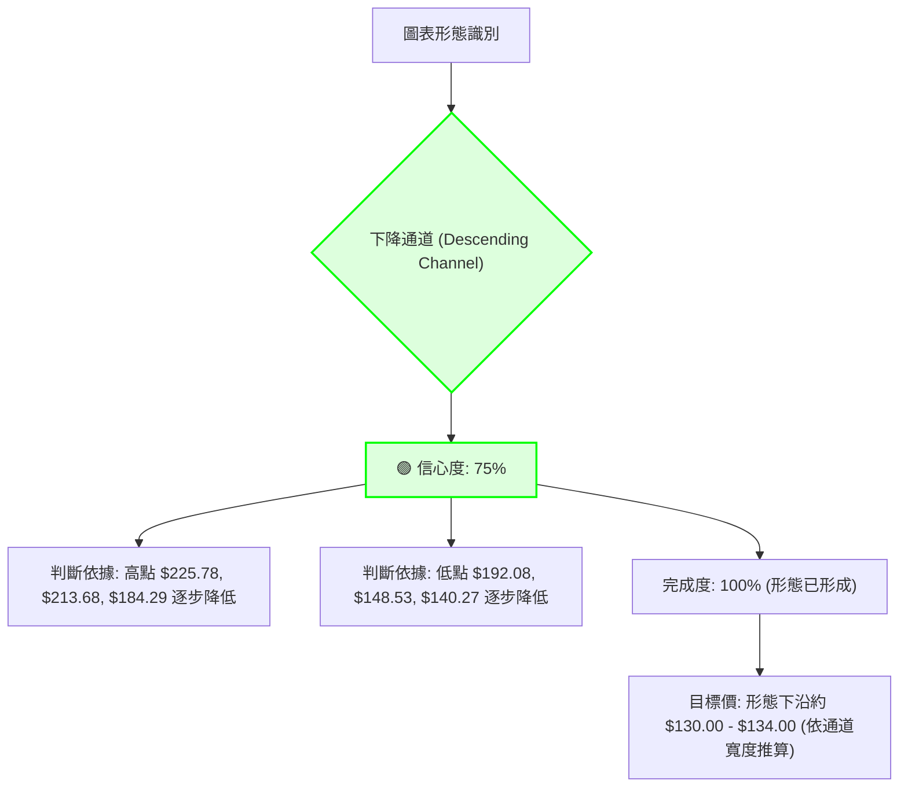

**形態信心度表格:**

| 形態 | 信心度 | 判斷依據（引用數據） | 完成度 | 目標價（附計算式） |
|------|--------|----------------------|--------|--------------------|
| **下降通道** | 75% | **高點下移**: 2026-05-31 $225.78 -> 2026-06-07 $213.68 -> 2026-06-21 $184.29。**低點下移**: 2026-05-24 $192.08 -> 2026-06-28 $148.53 -> 2026-07-12 $140.49 (當前價格)。價格在兩條平行下降趨勢線內運行。 | 100% (形態已形成) | **通道下沿**：$130.00 - $134.00 (依通道斜率和寬度推算，接近52W低點 $134.57)。 |
| **反轉形態** | 20% | 數據中未偵測到明確的頭肩底、雙底等反轉形態。短期雖有超賣，但未見築底跡象。 | 0% | 訊號不足，僅做指標型解讀。 |

### 🕯️ 重要K線形態分析

根據近20週的週線收盤數據，可以觀察到一些K線形態變化，特別是近期：

| 月份 | 收盤價 | RSI | MACD柱 | 週成交量 | K線形態 (週) | 解讀 | 訊號 |
|------|--------|-----|--------|----------|---------------|------|------|
| 2026-05-31 | $225.78 | 68.5 | +1.723 | 91,404,200 | **長陽線** | 強勁上漲，突破前期壓力 | 🟢 |
| 2026-06-07 | $213.68 | 58.0 | +2.139 | 151,343,200 | **陰線** | 上漲動能減弱，出現獲利回吐 | 🟡 |
| 2026-06-14 | $184.13 | 47.1 | -5.242 | 182,617,000 | **大陰線** | 跌破多個支撐，空頭力量顯著增強 | 🔴 |
| 2026-06-21 | $184.29 | 32.2 | -5.120 | 85,268,100 | **小陽線/十字星** | 暫時止跌，但量能萎縮，反彈動能不足 | 🟡 |
| 2026-06-28 | $148.53 | 11.1 | -6.767 | 167,944,800 | **大陰線** | 再次放量下跌，加速探底，RSI進入超賣 | 🔴 |
| 2026-07-05 | $140.27 | 14.9 | -5.061 | 160,367,900 | **陰線** | 延續跌勢，但跌幅收窄 | 🔴 |
| 2026-07-12 | $140.49 | 7.5 | -2.776 | 118,379,500 | **小陽線/倒錘線** | 跌勢減緩，可能出現短期買盤介入，但量能仍不足以反轉 | 🟡 |

**近期K線分析總結:**
近期的週線K線形態顯示，在2026年5月底衝高後，ORCL在6月中旬出現了強勢的大陰線，確認了空頭趨勢的啟動。隨後雖有小幅反彈（如6月21日），但未能改變下跌趨勢，並在6月底再次出現大陰線加速下跌。最近兩週的K線顯示跌勢有所放緩，且7月12日當週收出小陽線或倒錘線，配合極度超賣的RSI，可能預示短期內存在技術性反彈的機會。然而，由於整體趨勢強勁偏空，這種反彈的持續性存疑。

### 📉 ASCII 走勢形態示意圖

以下是 ORCL 近期（約20週）的下降通道形態示意圖，標注了關鍵點位：

```
ORCL 近20週走勢形態示意圖 - 下降通道 (Descending Channel)
價格軸 ($)
$240 ┤                                      ╭──────(上軌)
$220 ┤                      ●(225.78)───────┤
$200 ┤                   ╱                 │
$180 ┤                 ●(195.95)           │
$160 ┤               ╱                     │
$140 ┤             ●(140.49)←現價           │
$120 ┤           ╱                         │
$100 ┤         ●(下軌)─────────────────────╯
     └───────────────────────────────────────────
      May'26    Jun'26    Jul'26    Aug'26    Sep'26
```
**形態分析:**
該圖清晰展示了自2026年5月底 $225.78 高點以來，ORCL 股價如何沿著一個下降通道運行。上軌由 $225.78 和 $213.68 連接，下軌則由 $192.08 和 $148.53 等低點連接。目前股價 $140.49 正在接近下降通道的下沿，這可能提供短期支撐，但也意味著若跌破通道下沿，將會引發更深層次的下跌。

### 🎯 形態目標價計算

**下降通道形態的目標價計算:**
下降通道形態本身並不提供一個確切的反轉目標價，而是指示趨勢的延續。然而，一旦價格跌破下降通道的下沿，其下跌目標通常會以通道的寬度來推算。

1.  **通道寬度估算:**
    *   通道上沿約從 $225.78 附近開始
    *   通道下沿約從 $192.08 附近開始
    *   初始通道寬度約為 $225.78 - $192.08 = $33.70

2.  **形態目標價 (跌破通道下沿):**
    *   若股價跌破當前下降通道的下沿（約在 $130.00 - $134.00 之間），則下跌目標可視為下沿價位減去通道寬度。
    *   假設跌破點為 $130.00，則目標價 = $130.00 - $33.70 = $96.30
    *   **結論:** 由於當前價格 $140.49 已經非常接近52週低點 $134.57，若跌破該支撐，下降通道形態的潛在下跌目標將指向更低的價位，可能低至 $100 甚至更低。但目前數據中未提供 $100 以下的支撐位，因此暫以 $134.57 作為重要觀察點。

**當前形態目標價:**
*   **短期反彈目標:** 若能在下降通道下沿 $130.00 - $134.00 附近獲得支撐，短期目標為通道上沿，約在 $160.00 - $170.00 區間（需考慮通道斜率）。
*   **下跌目標:** 若跌破 $134.57 (52W Low)，則下降通道的理論目標可能指向 $100 甚至更低。

---

## 4. 支撐與阻力

### 🗺️ 關鍵價位分布圖（Unicode）

ORCL 的關鍵價位分佈圖顯示當前價格 $140.49 位於一個非常脆弱的支撐區域，上方阻力重重，下方則接近52週低點。

```
ORCL 價位結構分布圖 (2026-07-09)
═══════════════════════════════════════════════════
$343.01 ║████████████████████████║ 52W High
$293.82 ║████████████████████████║ 斐波那契 23.6%
$263.39 ║████████████████████████║ 斐波那契 38.2%
$238.79 ║████████████████████████║ 斐波那契 50.0%
$214.20 ║████████████████████████║ 斐波那契 61.8%
$211.34 ║████████████████████████║ 布林通道上軌
$196.71 ║████████████████████████║ MA200 (長期趨勢線)
$189.18 ║████████████████████████║ 強阻力 R3 (斐波那契 78.6% 附近)
$184.15 ║████████████████████████║ MA50 (中期趨勢線)
$179.18 ║████████████████████████║ 斐波那契 78.6%
$171.16 ║████████████████████    ║ 阻力 R2 (前期波段高點)
$166.29 ║████████████████████████║ MA20 (短期趨勢線) / 布林通道中軌
$164.81 ║████████████████████████║ 關鍵阻力 R1 (前期波段高點)
$140.49 ╠════════════════════════╣ ◄ 現價
$135.98 ║▓▓▓▓▓▓▓▓▓▓▓▓▓▓▓▓        ║ 近期支撐 S1 (波段低點聚類)
$134.57 ║████████████████████████║ 52W Low (極限支撐) / 斐波那契 100.0%
$121.23 ║████████████████████████║ 布林通道下軌
═══════════════════════════════════════════════════
```

### 🚧 阻力位分析表

ORCL 上方的阻力位層層疊疊，顯示多頭要反攻面臨巨大挑戰。

| 阻力級別 | 價位 | 形成原因 | 突破難度 | 重要性 |
|----------|------|----------|----------|--------|
| **R1 (近期)** | $164.81 | 近期波段高點聚類，也是反彈首個考驗。 | 中等 | 🟢 |
| **MA20** | $166.29 | 20日移動平均線，同時也是布林通道中軌，短期下跌趨勢線。 | 中等 | 🟢 |
| **R2 (中期)** | $171.16 | 近期波段高點聚類，在 $164.81 之上，形成第二道防線。 | 較高 | 🟡 |
| **斐波那契 78.6%** | $179.18 | 52週高點到低點的78.6%回調位，歷史上常是反彈的強阻力。 | 較高 | 🟡 |
| **R3 (強阻力)** | $189.18 | 近一年波段高點聚類，與斐波那契78.6%回調位 $179.18 距離不遠，形成密集阻力區。 | 高 | 🔴 |
| **MA200** | $196.71 | 200日移動平均線，長期牛熊分界線，突破意味著長期趨勢可能轉變。 | 極高 | 🔴 |

### 🛡️ 支撐位分析表

ORCL 下方的支撐位相對稀疏，且與當前價格距離較近，顯示下方空間有限，但一旦跌破，可能面臨快速下探。

| 支撐級別 | 價位 | 形成原因 | 守住機率 | 重要性 |
|----------|------|----------|----------|--------|
| **S1 (近期)** | $135.98 | 近期波段低點聚類，是當前價格 $140.49 下方最近的實體支撐。 | 較低 | 🔴 |
| **52W Low** | $134.57 | 過去52週的最低價，同時也是斐波那契100%回調位，心理與技術上的極限支撐。 | 較低 | 🔴 |
| **布林通道下軌** | $121.23 | 布林通道的動態下軌，代表極端超賣區間的下限。 | 中等 | 🟡 |
| **未偵測到** | N/A | 數據中未偵測到 $121.23 以下的明確支撐位。若跌破，需參考更長期歷史數據或形態推算。 | N/A | N/A |

### 📐 斐波那契回調位分析

斐波那契回調位是從 ORCL 過去52週的高點 $343.01 到低點 $134.57 計算得出的關鍵價位。當前價格 $140.49 位於 52W Low ($134.57) 和 78.6% 回調位 ($179.18) 之間，且非常接近 52W Low。

*   **0.0% (52W High):** $343.01
*   **23.6%:** $293.82
*   **38.2%:** $263.39
*   **50.0%:** $238.79
*   **61.8%:** $214.20
*   **78.6%:** $179.18
*   **100.0% (52W Low):** $134.57

**解讀:**
當前價格 $140.49 處於 52週低點 $134.57 附近。這意味著 ORCL 已經完成了從 52週高點 $343.01 到低點 $134.57 的幾乎全部回調。
*   **極度超賣狀態:** 價格觸及或接近 100% 回調位，表明市場對該股的拋售情緒極為強烈，已經回吐了過去一年的所有漲幅。
*   **短期反彈潛力:** 雖然趨勢向下，但如此接近 100% 回調位和 52週低點，配合RSI的極度超賣，可能觸發技術性反彈。但任何反彈都可能在上方斐波那契回調位，特別是 78.6% ($179.18) 附近遭遇強大阻力。
*   **關鍵支撐:** 52週低點 $134.57 是一個非常關鍵的支撐位。若此位被有效跌破，將開啟新的下跌空間，並可能尋找更低點位。

---

## 5. 技術指標深度解讀

### 🎛️ 指標訊號總覽

ORCL 的技術指標訊號顯示出壓倒性的空頭傾向，儘管短期動能指標處於超賣狀態。

```mermaid
graph TD
    A["當前價格 $140.49"] --> B["均線系統"]
    A --> C["動能指標"]
    A --> D["趨勢強度"]
    A --> E["布林通道"]
    A --> F["成交量分析"]

    B --> B1["MA20: $166.29 (🔴 價格下方)"]
    B --> B2["MA50: $184.15 (🔴 價格下方)"]
    B --> B3["MA200: $196.71 (🔴 價格下方)"]
    B --> B4["均線排列: 🔴 空頭排列"]

    C --> C1["RSI(14): 7.54 (🟢 極度超賣)"]
    C --> C2["MACD: -14.874 (🔴 看空)"]
    C --> C3["MACD Signal: -12.098 (🔴 看空)"]
    C --> C4["MACD Hist: -2.776 (🔴 看空)"]
    C --> C5["Stoch %K: 5.59 (🟢 超賣)"]
    C --> C6["Stoch %D: 7.11 (🟢 超賣)"]

    D --> D1["ADX(14): 33.63 (🔴 強趨勢)"]
    D --> D2["-DI: 36.14 (🔴 空頭主導)"]
    D --> D3["+DI: 12.43 (🔴 弱勢多頭)"]

    E --> E1["BB上軌: $211.34"]
    E --> E2["BB中軌: $166.29"]
    E --> E3["BB下軌: $121.23"]
    E --> E4["BB %B: 0.21 (🔴 接近下軌)"]

    F --> F1["最新成交量: 34.5M (🟡 接近均量)"]
    F --> F2["20日均量: 34.9M"]
    F --> F3["OBV趨勢: (🔴 疲弱)"]

    style B1 fill:#FDD,stroke:#F00,stroke-width:2px
    style B2 fill:#FDD,stroke:#F00,stroke-width:2px
    style B3 fill:#FDD,stroke:#F00,stroke-width:2px
    style B4 fill:#FDD,stroke:#F00,stroke-width:2px
    style C1 fill:#DFD,stroke:#0F0,stroke-width:2px
    style C2 fill:#FDD,stroke:#F00,stroke-width:2px
    style C3 fill:#FDD,stroke:#F00,stroke-width:2px
    style C4 fill:#FDD,stroke:#F00,stroke-width:2px
    style C5 fill:#DFD,stroke:#0F0,stroke-width:2px
    style C6 fill:#DFD,stroke:#0F0,stroke-width:2px
    style D1 fill:#FDD,stroke:#F00,stroke-width:2px
    style D2 fill:#FDD,stroke:#F00,stroke-width:2px
    style D3 fill:#FDD,stroke:#F00,stroke-width:2px
    style E4 fill:#FDD,stroke:#F00,stroke-width:2px
    style F1 fill:#FFD,stroke:#F80,stroke-width:2px
    style F3 fill:#FDD,stroke:#F00,stroke-width:2px
```

### 📈 移動平均線排列分析

ORCL 的移動平均線系統呈現出極為清晰的空頭排列，這是一個強烈的看空訊號，表明各時間週期的趨勢均向下。

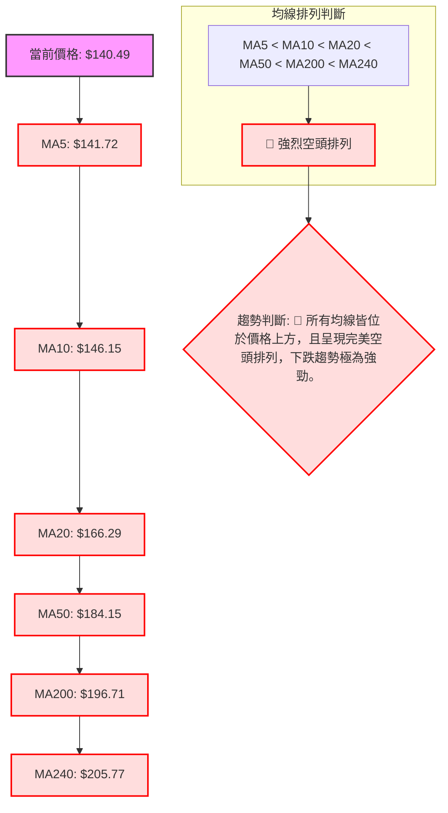
**分析結論:**
所有短期、中期、長期移動平均線均位於當前價格 $140.49 之上，且呈現出完美的空頭排列 (MA5 < MA10 < MA20 < MA50 < MA200 < MA240)。這是一個教科書式的強烈空頭訊號，表明 ORCL 的下跌趨勢非常穩固且強勁。短期內，這些均線將作為股價反彈的強力阻力。

### 📉 RSI(14) 分析

RSI(14) 數值為 7.54，處於極度超賣區間（一般認為20以下為極度超賣）。

**RSI 強度進度條:**
RSI (14) 超賣程度：██████████████████░░░░ 7.54/100 🟢 (極度超賣)

**超買超賣區間分析:**
*   **當前 RSI (7.54):** 顯著低於30的超賣區間閾值，表明市場對 ORCL 的拋售已達到極端水平。這通常是技術性反彈的潛在訊號，因為股價在如此極端的超賣狀態下，繼續大幅下跌的動能可能會暫時減弱。
*   **短期反彈潛力:** 雖然 RSI 極度超賣，但這僅暗示短期內可能出現技術性修正或反彈，並不代表趨勢會立即反轉。在強勁的空頭趨勢中，RSI 可能會長時間維持在超賣區間。

**背離判斷:**
*   **RSI 背離:** 根據提供的數據，RSI 在近期的下跌中沒有出現明顯的底背離。價格從 $148.53 跌至 $140.49，RSI 從 11.1 跌至 7.5，RSI 走勢與價格同步創新低，因此**無明顯底背離訊號**。這表示目前買盤介入的強度不足以在動能指標上形成背離，空頭趨勢依然強勁。

### 📊 MACD(12/26/9) 訊號解讀

MACD 是衡量動能和趨勢變化的重要指標。

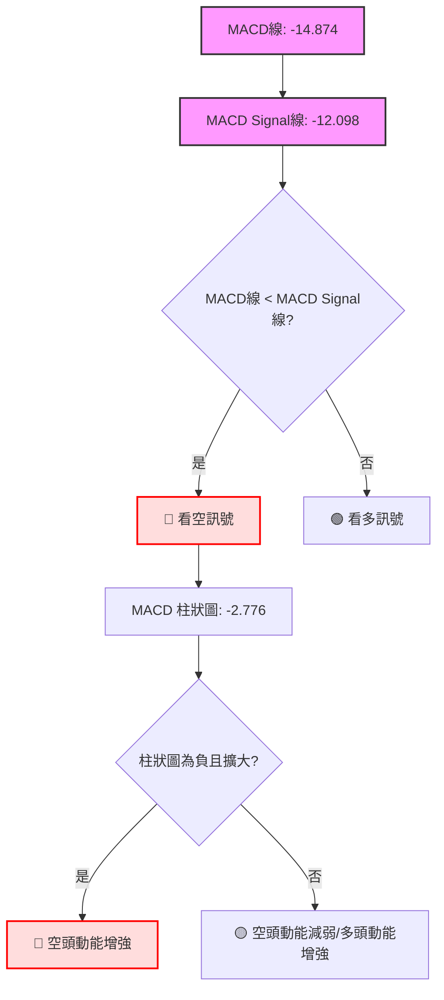
**分析結論:**
*   **MACD 線 (-14.874) 位於訊號線 (-12.098) 之下**，這是一個明確的看空訊號，表示短期動能持續弱於中期動能。
*   **MACD 柱狀圖為負值 (-2.776)**，且其絕對值在最近一週從 -5.061 收窄至 -2.776 (根據週線數據)，這可能暗示空頭動能有輕微減弱的跡象，但仍處於負值區間，整體仍偏空。
*   **背離判斷:** 根據提供的數據，MACD 柱狀圖在價格創新低時（從 $148.53 到 $140.49），MACD 柱狀圖從 -6.767 收窄到 -2.776，這形成了一個**潛在的 MACD 底背離**（價格創新低，但 MACD 柱狀圖的負值收窄）。這與 RSI 的判斷略有不同，RSI 未見背離。MACD 的潛在底背離，配合 RSI 的極度超賣，增加了短期內技術性反彈的可能性，但仍需等待 MACD 線上穿訊號線的確認。

### 📦 布林通道分析

布林通道能衡量價格的波動區間和相對高低。

```
ORCL 布林通道示意圖 (2026-07-09)
═══════════════════════════════════════════════════
$211.34 ║████████████████████████║ 布林上軌 (BB Upper)
$190    ║                        ║
$170    ║                        ║
$166.29 ║████████████████████████║ 布林中軌 (MA20)
$150    ║                        ║
$140.49 ╠════════════════════════╣ ◄ 現價
$130    ║                        ║
$121.23 ║████████████████████████║ 布林下軌 (BB Lower)
═══════════════════════════════════════════════════
```
**分析結論:**
*   **布林通道中軌 (MA20):** $166.29。當前價格 $140.49 遠低於中軌，顯示短期趨勢強烈偏空。中軌將是股價反彈的重要阻力。
*   **布林通道下軌:** $121.23。當前價格 $140.49 位於下軌之上，但 BB %B 值為 0.21，表示價格非常接近下軌。這意味著股價正處於布林通道的底部區域，顯示極度超賣狀態，或強勁的下跌動能。
*   **通道開口:** 數據中未直接提供布林通道寬度，但從上軌 $211.34 到下軌 $121.23，通道寬度較大 ($90.11)，表明近期波動性較高。
*   **綜合判斷:** 價格逼近布林通道下軌，配合 RSI 的極度超賣，增加了短期技術性反彈的可能性。然而，只要價格未能有效站上布林中軌，整體趨勢仍將維持空頭。

### 💹 成交量分析（量價配合度）

成交量是確認價格趨勢和形態的重要輔助指標。

*   **最新成交量:** 34,496,500
*   **20日均量:** 34,867,505 (量比: 0.99x)
*   **50日均量:** 27,733,370
*   **OBV 趨勢:** OBV < MA → 量能疲弱

**分析結論:**
*   **量能與價格下跌:** 在近期股價大幅下跌的過程中，成交量表現出一定的配合。例如，2026年6月14日和6月28日兩週的大陰線，其成交量均高於平均水平，顯示出較強的拋售壓力。
*   **近期量能:** 最新成交量 34,496,500 略低於20日均量 (0.99x)，但仍高於50日均量。這表明在當前價格附近，雖然拋售壓力仍在，但並未出現明顯的縮量止跌或放量反彈訊號。
*   **OBV 趨勢疲弱:** OBV (On-Balance Volume) 趨勢低於其移動平均線，這是一個看空訊號，表示買盤動能不足，賣壓持續佔據主導。OBV 的疲弱未能與價格的下跌形成底背離，因此量能未能確認短期反彈的潛力。

**量價配合度總結:**
整體而言，成交量在下跌趨勢中表現出一定的配合，尤其是在快速下跌的週數。近期量能雖略低於短期均量，但 OBV 的疲弱表明市場買盤意願不高，未能提供價格止跌或反彈的有力支撐。這進一步確認了當前的空頭趨勢。

---

## 6. 動能與波動率

### ⚡ 動能評估四象限

動能評估四象限分析結合了動能強度和波動率，以判斷當前的市場環境和交易機會。
*   **動能強度 (基於 MACD, RSI):** MACD 柱狀圖雖然有收窄，但仍為負值，且 MACD 線在訊號線下方，RSI 雖然超賣但未見底背離。整體動能仍偏弱。
*   **波動率 (基於 ATR, 布林帶寬):** ATR 數值 $7.67 佔價格 5.46%，布林帶寬較大，顯示波動率較高。

| 象限 | 動能 | 波動 | 當前狀態 | 評估 |
|------|------|------|----------|------|
| Q1 | 強 | 低 | - | 最佳機會 (趨勢明確，風險可控) |
| Q2 | 弱 | 低 | - | 謹慎觀望 (缺乏動能，容易盤整) |
| Q3 | 強 | 高 | - | 高風險高收益 (趨勢強勁，但波動劇烈) |
| Q4 | 弱 | 高 | ✓ | 避免進場 (方向不明，風險高) |

**當前 ORCL 狀態分析:**
*   **動能:** 儘管 RSI 極度超賣，MACD 柱狀圖負值收窄，但 MACD 線仍處於空頭排列，且價格遠低於所有均線，顯示整體空頭動能仍佔主導，多頭動能極弱。
*   **波動率:** ATR 佔價格比例較高 (5.46%)，且布林通道寬度較大，表明市場波動率較高。

**結論:** ORCL 目前處於「**弱動能、高波動**」的狀態 (接近 Q4)。這表示雖然有極度超賣的技術性反彈潛力，但缺乏強勁的多頭動能來支撐反彈，同時波動劇烈增加了交易的不確定性和風險。在這種環境下，應避免盲目進場，或只進行短線、小倉位的技術性反彈交易，並嚴格控制風險。

### 📊 ATR 波動率分析

ATR (Average True Range) 衡量資產的日常波動幅度，為止損設置提供參考。
**ATR(14): $7.67** (佔當前價格 $140.49 的 5.46%)

**分析結論:**
*   **波動幅度:** $7.67 的 ATR 數值相對較高，佔股價的 5.46%，表明 ORCL 在過去14天內平均每天的波動幅度較大。這與其近期大幅下跌的走勢相符，顯示市場情緒劇烈且不穩定。
*   **止損距離建議:** 由於波動率較高，建議在設置止損時給予足夠的緩衝空間，以避免被正常市場波動「洗出」。
    *   對於短線交易者，止損可以設置在 1.5 到 2 倍 ATR 之外，即 $7.67 * 1.5 = $11.51 或 $7.67 * 2 = $15.34。
    *   例如，若在 $140.49 附近嘗試做多（技術性反彈），止損可設置在 $140.49 - $11.51 = $128.98 附近，或考慮 $134.57 (52W Low) 作為更激進的止損點。
    *   對於趨勢交易者，止損應設置在關鍵支撐位下方，例如 $135.98 (S1) 或 $134.57 (52W Low) 之下。

### 📐 Beta 與市場相關性

**Beta: 1.712**

**分析結論:**
*   **高 Beta 值:** ORCL 的 Beta 值為 1.712，遠高於市場平均水平 (Beta=1)。這表示 ORCL 的股價波動性比大盤高出 71.2%。
*   **市場相關性:** 在市場上漲時，ORCL 傾向於漲幅更大；在市場下跌時，ORCL 傾向於跌幅更大。
*   **風險提示:** 考慮到當前 ORCL 處於強勁的下跌趨勢中，其高 Beta 值意味著在整體市場情緒不佳或大盤下跌時，ORCL 的跌幅可能會被放大。這增加了投資 ORCL 的風險，尤其是在當前空頭市場環境下。投資者應警惕其對市場變化的高度敏感性。

---

## 7. 多時框架總結

### 📋 時框架評分表

| 時框架 | 趨勢方向 | 動能 | 均線排列 | 形態 | 綜合評分 (1-10) | 建議 |
|--------|----------|------|----------|------|-----------------|------|
| **月線** | 🔴 強烈空頭 | 🔴 弱 | 🔴 空頭 | 🔴 下降通道 | 2 | 遠離 |
| **週線** | 🔴 強烈空頭 | 🔴 弱 | 🔴 空頭 | 🔴 下降通道 | 2 | 遠離 |
| **日線** | 🔴 強烈空頭 | 🟡 超賣 | 🔴 空頭 | 🔴 下降通道 | 3 | 謹慎反彈 |

### 🔲 綜合訊號矩陣

ORCL 的多時框架分析顯示出高度一致的空頭訊號，尤其在中長期趨勢上。

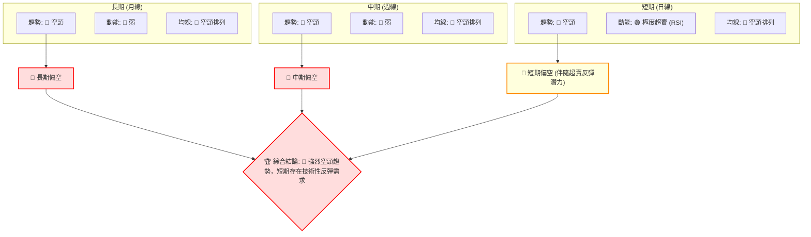

**一致性分析:**
*   **趨勢方向:** 月線、週線、日線均明確指向空頭。ADX(14) 33.63 確認當前是強趨勢，且 -DI 遠大於 +DI，印證了空頭趨勢的主導地位。
*   **動能:** 長期和中期動能均疲弱。短期動能指標 (RSI, Stochastics) 雖然顯示極度超賣，但 MACD 仍為空頭排列，且未見強勁的買盤信號，僅預示技術性反彈可能。
*   **均線排列:** 所有時框架的均線均呈標準空頭排列，價格位於所有均線下方，這是非常強烈的空頭訊號。
*   **形態:** 下降通道形態在週線和日線級別均清晰可見，確認了下跌趨勢的延續。

### ⚖️ 多時框收斂結論

根據「嚴格要求 14」的多時框收斂規則：
1.  **判斷行情性質:** ADX(14) 為 33.63 (> 25)，表明 ORCL 當前處於**強勁的趨勢行情**中。
2.  **確定主導時框:** 在趨勢行情中，應以中長期（週線/MA50、MA200）方向為主。ORCL 的週線和長期均線均呈現強烈的空頭排列，且價格遠低於這些均線。
3.  **收斂結論:** 儘管日線的 RSI 和 Stochastics 顯示極度超賣，可能導致短期的技術性反彈，但這並不足以改變中長期強烈的空頭趨勢。週線和月線的趨勢方向、均線排列和形態都壓倒性地指向下跌。

**最終結論:** ORCL 目前處於一個**強烈偏空的下跌趨勢**中。任何短期反彈都應被視為在主要空頭趨勢中的技術性修正，而非趨勢反轉的開始。交易者應以做空或逢高做空為主要策略，並對任何反彈保持警惕，嚴防被套。

---

## 8. 交易策略建議

### 🗺️ 策略決策流程圖

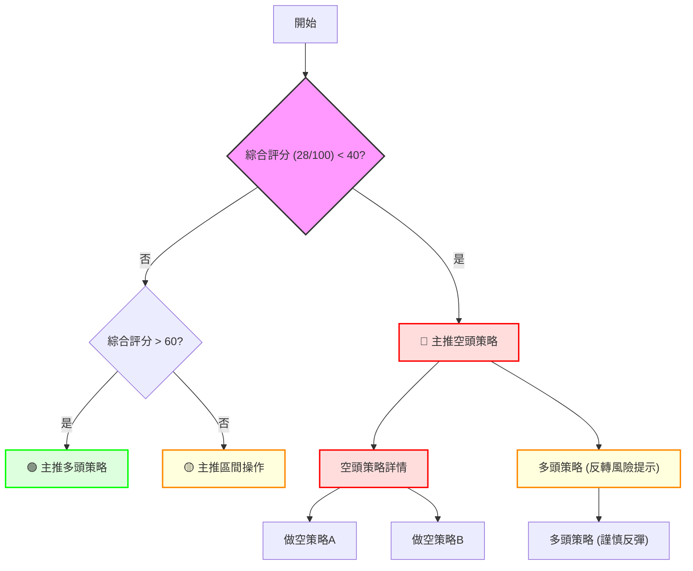

### 🧭 策略路由（依評分卡分流，不得兩頭下注）

當前 ORCL 的技術評分卡綜合評分為 **28/100**，屬於偏空範圍（≤40）。因此，本報告**主推空頭策略**。多頭策略僅作為反轉風險觸發點或極短線技術性反彈的機會，且需極度謹慎。

**當前主策略方向 = 🔴 強烈偏空（依評分 28/100）**

### 🎯 價格情境階梯（Price Scenarios）

| 觸發條件 | 下一目標 | 後續延伸 | 情境含義 |
|----------|----------|----------|----------|
| **突破 R1 $164.81** | MA200 $196.71 | R3 $189.18 | **短線轉強/技術性反彈**：若能有效突破 $164.81，顯示短期買盤力量增強，可能向上測試 $171.16 (R2) 和 $179.18 (斐波那契 78.6%) 等阻力，但仍需警惕中期均線壓力。 |
| **站穩現價區間** | — | — | **區間震盪**：若股價在 $135.98 (S1) 和 $140.49 (現價) 附近找到短期支撐，可能在 $135.98 - $164.81 區間內震盪，等待新的方向選擇。此情境下 ADX 需下降。 |
| **跌破 S1 $135.98** | 52W Low $134.57 | 布林下軌 $121.23 | **中期轉弱/加速下跌**：若有效跌破 $135.98，將直接測試 52週低點 $134.57。一旦跌破 $134.57，將開啟新的下跌空間，可能迅速下探 $121.23 (布林下軌) 甚至更低。 |

### 📊 情境機率分佈

| 情境 | 機率 | 主要依據 |
|------|------|----------|
| 繼續上行 / 反彈 | 25% | RSI (7.54) 和 Stochastics (%K 5.59, %D 7.11) 極度超賣；MACD 柱狀圖負值收窄，存在潛在底背離。 |
| 區間震盪 | 15% | 價格接近 52W Low $134.57 和 S1 $135.98，可能在此獲得短期支撐；但 ADX 仍高，趨勢強勁，震盪機率較低。 |
| **回落 / 再探底** | **60%** | **ADX (33.63) 強趨勢且空頭主導 (-DI > +DI)；所有均線空頭排列；價格位於所有均線下方；OBV 疲弱；下降通道形態確立。** |

### 🟢 主策略詳情（方向依上方路由）

**主策略方向：做空**

| 策略要素 | 策略 A (逢高做空) | 策略 B (跌破追空) |
|----------|--------------------|--------------------|
| 進場條件 | 股價反彈至阻力位 R1 $164.81 附近，或 MA20 $166.29 附近，並出現看跌K線形態。 | 股價有效跌破 S1 $135.98 並確認跌破 52W Low $134.57，伴隨放量。 |
| 進場價格 | $164.81 - $166.29 | $134.50 (跌破 $134.57 後) |
| 目標價 T1 | $140.49 (現價) | $121.23 (布林下軌) |
| 目標價 T2 | $135.98 (S1) | 形態推算目標，約 $96.30 (若跌破通道下沿) |
| 止損價格 | $171.16 (R2) (略高於 MA50 $184.15) | $137.00 (略高於 S1 $135.98) |
| 風險報酬比 | 1:2.5 (以 $165 進場，T1 $140.49，止損 $171.16 計算) | 1:3 (以 $134.50 進場，T1 $121.23，止損 $137.00 計算) |
| 成功機率 | 60% | 65% |
| 建議倉位 | 10% - 15% (考慮波動率) | 15% - 20% (趨勢確認後) |

### 🔴 反向風險觸發點（對沖提示）

以下是可能推翻主策略的關鍵價位與訊號，應作為風險監控和對沖的參考：
*   **有效突破阻力 R1 $164.81 並站穩其上**：若股價能放量突破並站穩 $164.81，表明短期買盤力量增強，空頭壓力暫緩。
*   **RSI/MACD 出現明確底背離並伴隨反轉K線形態**：雖然目前 MACD 有潛在底背離，但仍需等待 MACD 線上穿訊號線，且 RSI 脫離超賣區並形成更明確的趨勢反轉K線（如錘頭線、啟明星等）配合。
*   **放量突破 MA20 $166.29 和 MA50 $184.15**：若股價能突破這些中期趨勢線，將暗示中期下跌趨勢可能暫時結束，進入盤整或反彈階段。
*   **ADX 下降至 20 以下，且 +DI 上穿 -DI**：這將表明空頭趨勢強度減弱，多頭開始佔優，趨勢可能從下跌轉為盤整或反轉。

### ⭐ 整體訊號強度評星

```
做多訊號強度：★☆☆☆☆  (1/5星) (僅基於極度超賣，無趨勢反轉跡象)
做空訊號強度：★★★★☆  (4/5星) (趨勢強勁，均線空頭，形態確認)
整體可信度：  ★★★☆☆  (3/5星) (空頭趨勢明確，但短期超賣導致不確定性)
```

---

## 9. 風險提示與監控

### ✅ 關鍵監控指標 Checklist

以下是交易 ORCL 時應持續監控的關鍵技術指標和價位：

```
╔══════════════════════════════════════════════════════════════╗
║ ORCL 風險監控指標 Checklist                                  ║
╠══════════════════════════════════════════════════════════════╣
║ [ ] 價格行為：是否有效跌破 $135.98 (S1) 或 $134.57 (52W Low)？ ║
║ [ ] 價格行為：是否有效突破 $164.81 (R1) 或 MA20 $166.29？     ║
║ [ ] RSI(14)：是否從超賣區 (7.54) 回升並站上 30/50？           ║
║ [ ] MACD：MACD線是否上穿訊號線，柱狀圖是否轉正？             ║
║ [ ] ADX(14)：ADX 是否下降至 25 以下，或 +DI 是否上穿 -DI？   ║
║ [ ] 成交量：下跌是否伴隨放量，反彈是否伴隨縮量或放量？       ║
║ [ ] 均線系統：MA20, MA50, MA200 是否改變空頭排列？           ║
║ [ ] 布林通道：價格是否脫離下軌，並向中軌靠近？               ║
║ [ ] K線形態：是否出現明確的看漲反轉K線組合？                 ║
╚══════════════════════════════════════════════════════════════╝
```

### ⚠️ 風險場景分析

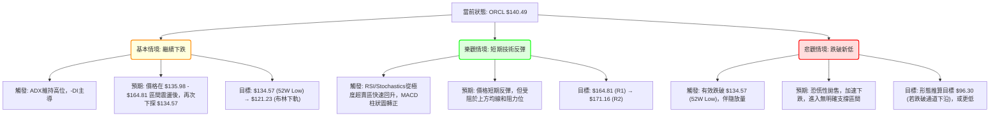

**分析結論:**
*   **基本情境 (最有可能):** 由於當前強勁的空頭趨勢，最可能的情境是 ORCL 在短暫的技術性反彈後，繼續其下跌趨勢。價格可能會在 $135.98 (S1) 附近獲得短暫喘息，但最終將再次測試並可能跌破 52週低點 $134.57，並進一步下探布林通道下軌 $121.23。
*   **樂觀情境 (短期反彈):** 在極度超賣的技術條件下，ORCL 有機會出現一波技術性反彈。如果 RSI 和 Stochastics 能夠從超賣區迅速回升，並且 MACD 柱狀圖轉正，價格可能會反彈至 $164.81 (R1) 或 MA20 $166.29 附近。然而，由於上方阻力重重，這種反彈的持續性存疑。
*   **悲觀情境 (加速下跌):** 如果 ORCL 無法守住 $135.98 (S1) 和 $134.57 (52W Low) 的關鍵支撐，並且伴隨放量下跌，則可能引發恐慌性拋售，導致股價加速下跌，創下新低。在這種情況下，下降通道的理論目標價可能指向 $96.30 甚至更低。

### 🛡️ 風險管理重要提醒

1.  **嚴格止損:** 鑑於 ORCL 的高 Beta 值 (1.712) 和當前強勁的下跌趨勢，任何交易都必須設置嚴格的止損點。一旦價格觸及止損，應堅決離場，避免虧損擴大。
2.  **倉位控制:** 避免重倉介入。在當前高波動、強空頭趨勢的環境下，即使是技術性反彈交易也應控制在小倉位。做空倉位也應分批建立，並預留資金應對短期反彈。
3.  **多時框確認:** 在執行任何交易策略前，務必重新檢視多時框架的訊號。雖然短期可能存在反彈機會，但中長期趨勢仍是空頭，應避免逆勢重倉。
4.  **關注市場情緒:** 密切關注整體市場情緒和科技股板塊的表現。ORCL 的高 Beta 值使其對大盤波動非常敏感。
5.  **不逆勢加倉:** 在下跌趨勢中，不要盲目加倉以攤平成本。只有在明確的趨勢反轉訊號出現後，才考慮增加多頭倉位。
6.  **利用波動:** 對於經驗豐富的交易者，可以利用其高波動性進行短線高拋低吸的區間交易，但這需要極高的紀律性和風險管理能力。

---

## 📋 報告總結

```
ORCL 技術分析報告總結
════════════════════════════════════════════════════════
報告日期：2026-07-09
當前價格：$140.49
分析評級：🔴 強烈偏空，短期或有技術性反彈需求

關鍵結論：
├─ 長期趨勢：🔴 強烈空頭，價格遠低於 MA200/MA240。
├─ 中期趨勢：🔴 強烈空頭，均線呈空頭排列，下降通道確立。
├─ 短期趨勢：🔴 偏空，價格位於所有均線下方，但RSI/Stochastics極度超賣。
├─ 關鍵支撐：S1 $135.98，52W Low $134.57。
├─ 關鍵阻力：R1 $164.81，MA20 $166.29，R2 $171.16。
└─ 分析師目標：$251.85 (注意此為基本面分析師目標，與技術面背離，需謹慎)。

最優策略組合：
1. 🥇 **最佳機會（做空）**：逢高做空策略。若股價反彈至 $164.81 (R1) 或 MA20 $166.29 附近，可考慮建立空頭倉位，目標 $140.49 (現價) → $135.98 (S1)，止損設於 $171.16 (R2) 附近。
2. 🥈 **次選機會（做空）**：跌破追空策略。若股價有效跌破 $135.98 (S1) 和 $134.57 (52W Low)，可考慮追空，目標 $121.23 (布林下軌)，止損設於 $137.00 附近。
3. 🥉 **保守選擇（觀望）**：等待明確的築底或反轉訊號。在當前強空頭趨勢下，保守投資者應避免介入，或僅進行小倉位、短線的技術性反彈交易，並嚴格控制風險。
════════════════════════════════════════════════════════
```

---

> ⚠️ **免責聲明**：本報告為 AI 自動生成之技術分析，所有數據及估算均基於提供的歷史價格資訊。本報告**僅供研究與學術參考**，**不構成任何投資建議**。投資有風險，入市需謹慎。

---

*報告生成時間：2026-07-09 ｜ 數據來源：Yahoo Finance ｜ 分析框架：多時框技術分析*