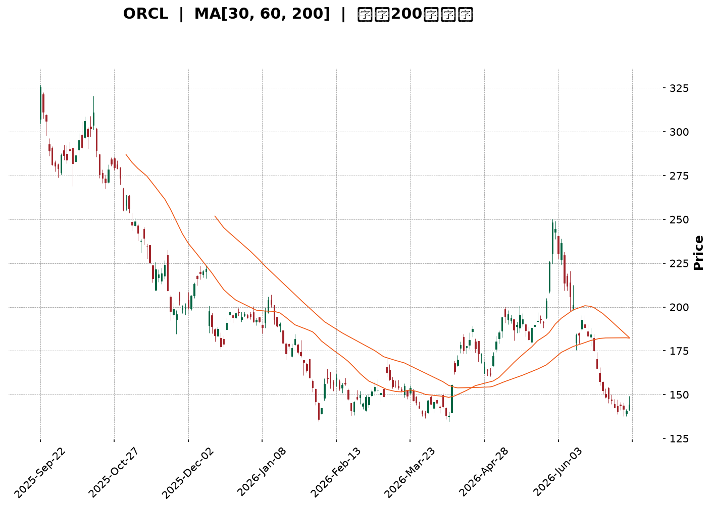
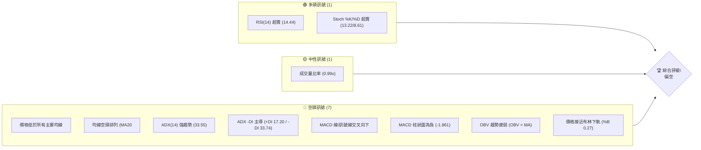
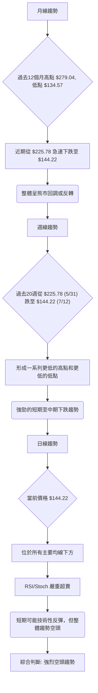
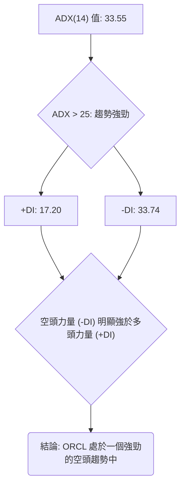
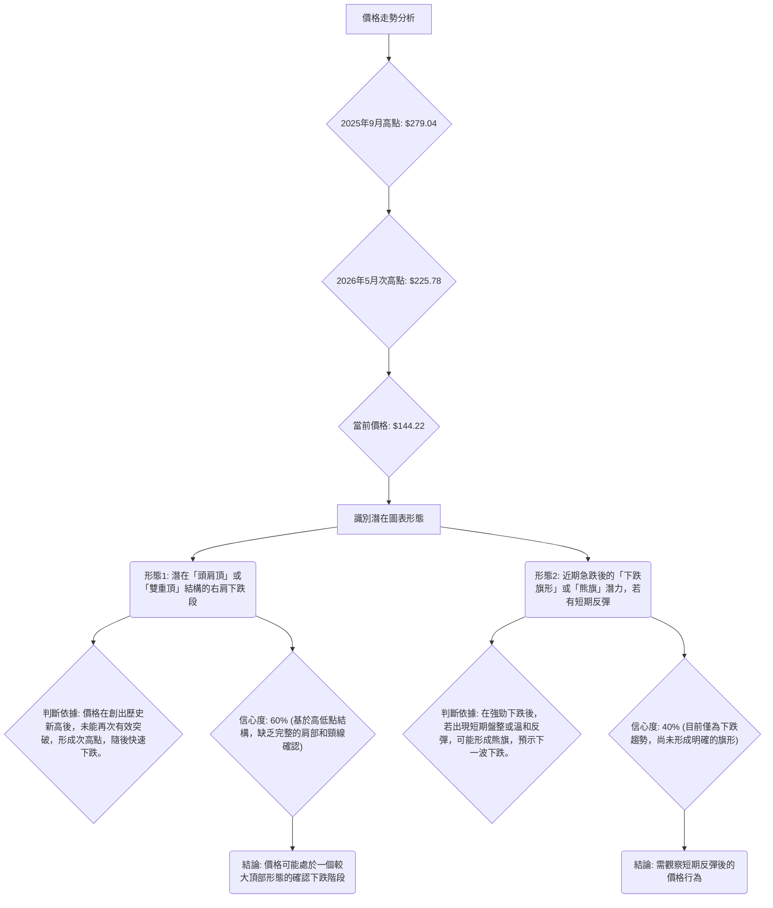
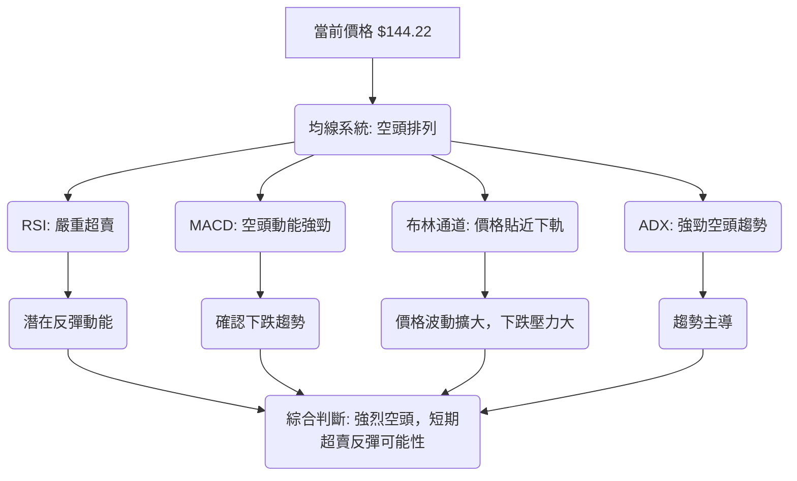
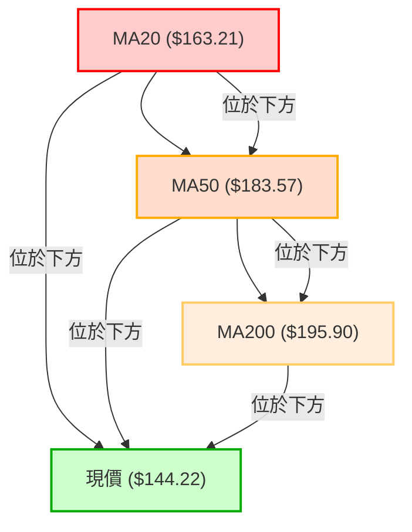
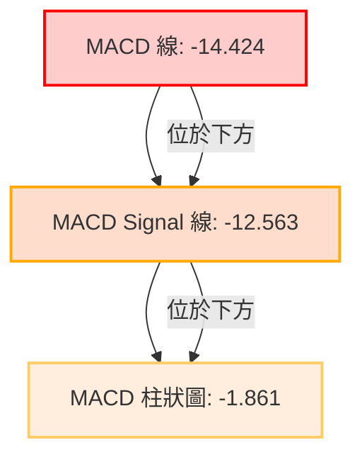
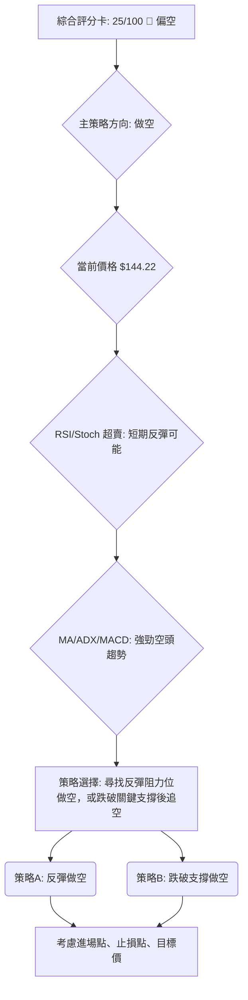
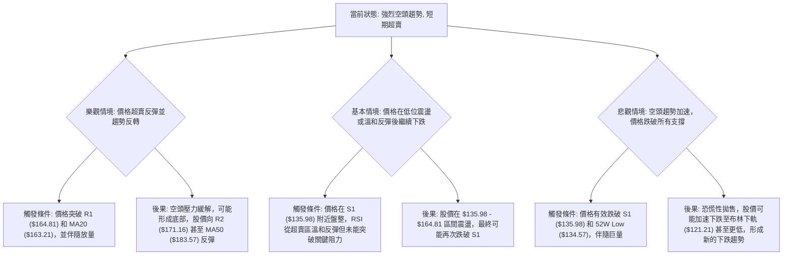

<details>
<summary>📊 靜態圖表 (點擊展開)</summary>

</details>

<html>
<head><meta charset="utf-8" /></head>
<body>
    <div style="height:500px; width:100%;">                        <script>window.PlotlyConfig = {MathJaxConfig: 'local'};</script>
        <script charset="utf-8" src="https://cdn.plot.ly/plotly-3.7.0.min.js" integrity="sha256-jvTGqxNp8AGWEcvNLVuKr+8j5dGe9Yw51LQkmDH+IYA=" crossorigin="anonymous"></script>                <div id="candlestick-chart" class="plotly-graph-div" style="height:100%; width:100%;"></div>            <script>                window.PLOTLYENV=window.PLOTLYENV || {};                                if (document.getElementById("candlestick-chart")) {                    Plotly.newPlot(                        "candlestick-chart",                        [{"close":{"dtype":"f8","bdata":"AAAA4EpZdEAAAABA93VzQAAAAAC4IHNAAAAA4MgQckAAAACg2ZNxQAAAAAC9iHFAAAAAwJtwcUAAAACA9OtxQAAAAOBN6HFAAAAAQGW+cUAAAACA6RRyQAAAAIA7oHFAAAAAYOzlcUAAAAAgV3JyQAAAACC7MnJAAAAAYA8ic0AAAADgx5JyQAAAAMA\u002f3HJAAAAAoGlxc0AAAAAAfhhyQAAAAADLN3FAAAAA4IIXcUAAAABA6u9wQAAAAEDAZXFAAAAAgJeZcUAAAACA5npxQAAAAADWcXFAAAAAgOUZcUAAAADARepvQAAAAMAYUHBAAAAAAGcEcEAAAACg79RuQAAAAID\u002fGG9AAAAAYPNJbkAAAACgjrltQAAAAKB9621AAAAAQKVWbUAAAADgUDNsQAAAAKC3B2tAAAAAIKWva0AAAACgjFBrQAAAACCWZGtAAAAAgOEEbEAAAADA5ixqQAAAACB5sWhAAAAA4NDhaEAAAACAc3poQAAAAGCpdmlAAAAA4O0WaUAAAACgzvZoQAAAAGDl+2hAAAAAgMLOaUAAAACgq6BqQAAAAOAICGtAAAAAAC1ma0AAAACgqYVrQAAAAMC7tGtAAAAAAFa0aEAAAABA6ZlnQAAAAEBM+WZAAAAAwO1vZ0AAAABA1ytmQAAAAADGXWZAAAAAQIXZZ0AAAABAY6VoQAAAAICzRGhAAAAA4BSJaEAAAADg+5hoQAAAAED5RWhAAAAAIC2AaEAAAACABjdoQAAAAEB4UGhAAAAAID3tZ0AAAADgIRJoQAAAAKAw9WdAAAAAwLuPZ0AAAADAh7poQAAAAMD2fmlAAAAAAMAyaUAAAAAA9R1oQAAAAEAOpmdAAAAAAJnNZ0AAAADAZmlmQAAAAGDLqGVAAAAAQOoxZkAAAACgYxFmQAAAAODCuWZAAAAAAFLJZUAAAADAWoZlQAAAACB\u002fDWVAAAAA4DqAZEAAAADgF\u002fBjQAAAAMA2RGNAAAAAwBpFYkAAAADgKABhQAAAAIBVymFAAAAAoHCBY0AAAAAgrOpjQAAAAOCdk2NAAAAAoO59Y0AAAAAApfJjQAAAAEDkLWNAAAAAAAx0Y0AAAABg2H9jQAAAAGARcmJAAAAAgC6aYUAAAAAgNDRiQAAAAEACbGJAAAAA4C25YkAAAAAgmxxiQAAAAKBgl2JAAAAAYLmPYkAAAACg3vpiQAAAAEAKSGNAAAAAQK8NY0AAAABACuFiQAAAACApnGJAAAAAIKxRZEAAAADgZNNjQAAAAKA+UmNAAAAAQKttY0AAAAAA2kRjQAAAAEDFC2NAAAAAwFFfY0AAAADgFqViQAAAAMCwOWNAAAAAgH9SYkAAAACgYDBiQAAAAMADymFAAAAAwJBlYUAAAABAJEphQAAAAMAiU2JAAAAAYC8XYkAAAACA2ztiQAAAAAASIWJAAAAAoH7VYUAAAADAHuVhQAAAACCFO2FAAAAAQOFCYUAAAAAA13NjQAAAAAAAYGRAAAAAgOs5ZUAAAABA4UpmQAAAAIDr4WVAAAAAYI8yZkAAAACgcKVmQAAAAAAAcGdAAAAAwPUIZkAAAADA9ahlQAAAAGC4nmVAAAAAYLi+ZEAAAABgj3pkQAAAAOB6LGRAAAAAYI96ZUAAAACgR4lmQAAAAEAzK2dAAAAAwPVAaEAAAABA4VJoQAAAAGBmfmhAAAAAQOE6aEAAAABgj1pnQAAAAOBRuGdAAAAAIIVzaEAAAABgZh5oQAAAACCFU2dAAAAAYLiuZkAAAADAHoVnQAAAAOCjuGdAAAAAYI8CaEAAAACA6yFoQAAAAGC43mdAAAAAYGZ2aUAAAADA9ThsQAAAAMDMBG9AAAAAYI+SbkAAAABgj8psQAAAAEDhim1AAAAAgMK1akAAAACAPXpqQAAAAIDruWlAAAAA4FEoaUAAAABAMwNnQAAAAAApBGdAAAAA4HoUaEAAAABgj4pnQAAAAMD18GZAAAAAoEcJZ0AAAACAPeJlQAAAAMAepWRAAAAAwPWwY0AAAABguA5jQAAAAMD1kGJAAAAA4FF4YkAAAACgmVFiQAAAAAAA0GFAAAAA4KOIYUAAAADgUfhhQAAAAEAzs2FAAAAAIK6PYUAAAABACgdiQA=="},"high":{"dtype":"f8","bdata":"rbLXNLludECodHloSSd0QJJBw2ZgYHNAKdSaS5OGckCHZ\u002fZ7KztyQFHlYNzau3FAl1HVPGyccUD8p3sSg\u002ftxQPt0iJ2RSnJAnsWoqVRFckD9pkfktmVyQHdicqPJLnJAXMPlv\u002fUTckDz+KbOG7JyQHcCct9yHXNAIrf3U9ZMc0BUmiGo+OhyQHdlMV\u002fEUXNAY38B1h4JdECvhACnvuZyQAsbGwuT93FAy0VHaWhpcUCgLDuMHDhxQElO2lLvlXFAqRPljvnWcUDj0h8H9NNxQHtIZKt2u3FAIy4JJGZ+cUBiv+xnzMFwQPIU4vH7gnBA21lSfvZ\u002fcECZVKYBEbdvQH244C14W29Akf9Kko\u002fxbkDNx\u002fF10N1tQKp4vadbt25AvLCv1P1\u002fbUBd8kXqomttQL3KLx4d+WtA1m5AWzk1bEAaWEsGDq5rQNt+KMStymtAbJoDaTVYbEA\u002fhLHyQxJtQJJG7uw04WlAtSXIgGdSaUD6aBBrJcZoQP3EBdT0FmpAsA2MPFUjaUAZ65sJOkhpQF7F2jRqDWpAVeRMfs3UaUDn1Z\u002f2BMNqQKG3FG8ZRWtA+06muhLsa0ABPnFWVKhrQMGgncsz\u002fmtAXPm4xDMYaUA8Per6h5RoQMClNzwbemdAFBW9FYGUZ0CCunKZjCtnQARSBHY19GZA4y\u002fGZLQ9aECjel3cvrJoQOq3iY\u002fbf2hAh4Ys+TSiaEBQnlyrreRoQD2Ec4SFqWhAr6vFNWOlaEDrxMiL239oQCUqLQcRrGhAoVPID6kOaUA4wwtWEjZoQFsfFmcyT2hAgdmNVBS5Z0AhbcoLd+9oQDbh48EwvGlAGN6C5nTiaUATpm9JTB9pQKaH5cCZSmhA4XfYgnjmZ0AzssFXO1FnQJ7KowYWf2ZA3+3OCw5xZkCTAJqhymBmQCqGHgxIFWdAEOloEgZjZkDykUxwhqFmQJhWPZdmNGVA\u002fL0ZFP0JZUC3a3EgVVNlQIMM6tVo2mNAtiB2V+8sY0AcsJFDR0FiQL1RfIpz1mFABxhDRzXmY0DjgmZPD5pkQFm0yIzkYmRAlIiiIpHPY0BhthoqhjdkQO994Vk412NAquUvyBSYY0DbIFQxu\u002fBjQBxOCp+HLmNAqj1gm1wpYkBrp5py+UdiQGynJHLjF2NAAr8Q7wP\u002fYkBAvJhcSjJiQAKM7gS3tGJAKioJQvPMYkDraRtlaSJjQKid1099rGNAWceMv1nUY0BHa2k0Eu9iQHdr6BpQM2NA8LYNqDBlZUDjXmJO3udkQH4IMf+7BmRA63ydJQDGY0D+JxuFvctjQIBw0LrHTWNAZzN8lfaLY0DREpKW7hZjQMMzazGcZ2NAyg9J1qgrY0DxZRYWMapiQF5esCW6PmJAJzvXnkymYUBGVaySrJZhQJy2VBtiXGJAKX18+iGkYkAXJRVKxT1iQOkhyC0OgWJAndpjlSMCYkBiZbD72d1iQAAAAKCZ2WFAAAAAoHCFYUAAAADAHn1jQAAAAMDMLGVAAAAAgOuRZUAAAADgo4hmQAAAAAAAEGdAAAAA4FE4ZkAAAABA4SpnQAAAAIDCpWdAAAAA4Hq8ZkAAAABguJZmQAAAAKCZsWVAAAAAYGYWZUAAAADgUZhkQAAAAIDCpWRAAAAAoJnJZUAAAAAAAPBmQAAAAOCjUGdAAAAAoEdJaEAAAADAzARpQAAAAAAAwGhAAAAAgMJ1aEAAAACgcB1oQAAAAIA98mdAAAAAYLgWaUAAAACAwo1oQAAAAOBR2GdAAAAAQAqXZ0AAAABACodnQAAAAIA9GmhAAAAAAACgaEAAAABgZmZoQAAAAOB6BGhAAAAAAACgaUAAAACgR0lsQAAAAAAASG9AAAAAAAAgb0AAAADgURBuQAAAAGBm3m1AAAAAgBTubEAAAACA62FrQAAAAAAAkGtAAAAAIFyPakAAAADgoxhnQAAAAGCPMmdAAAAAgD1qaEAAAACAPWpoQAAAAIAUxmdAAAAAIK5\u002fZ0AAAABgjxJnQAAAAGCPymVAAAAAAAC4ZEAAAAAA17NjQAAAAKBHMWNAAAAAAABQY0AAAACAwr1iQAAAAKCZcWJAAAAAgOthYkAAAAAA1zNiQAAAAIDrMWJAAAAAQOG6YUAAAACAPaJiQA=="},"hovertemplate":"\u003cb\u003e%{x|%Y-%m-%d}\u003c\u002fb\u003e\u003cbr\u003e\u958b: $%{open:.2f}\u003cbr\u003e\u9ad8: $%{high:.2f}\u003cbr\u003e\u4f4e: $%{low:.2f}\u003cbr\u003e\u6536: $%{close:.2f}\u003cextra\u003e\u003c\u002fextra\u003e","low":{"dtype":"f8","bdata":"muT2s0UIc0DvTgSZ9TlzQD\u002f3QRjlmnJAVY4SJ6fkcUBZondAjIxxQN7sH4W7VnFAo2NgYNYbcUDnXvLvRDtxQKPUv0z3vHFAv8rZYGyccUBMrMr1XghyQMg6WRoNznBAsvbRzhKWcUC84rGpFthxQBudCMSfI3JAPckATr5+ckCYrbueJSNyQNkrsDSCkXJA1GWby4DTckA3urmQ59txQGE9LEgOGnFA3r2rzI3pcECkrNQusLlwQN7uSyGf63BAbOWr5GqIcUADQwennWFxQAXrJYE5bXFAirxUMRXbcEBjloUF39ZvQFCCsPOL5G9ARIPk9nm1b0BQIhOaKHZuQCCgf9ytsG5AbpoxB4O6bUD9fNm8yd1sQJ465+Dnc21ADOHknr5vbEBewEJnPBlsQBU9ePT5vGpAjr3UKXIvakAiEZclysdqQP6HOrQTpmpAGvhTiHL\u002fakBLfW1jfyBqQDkIMI3FC2hAFAV\u002f9J8jaEDUR+cj4Q9nQBnByzcnIGlAewB3xuWMaEAXCDWl9G9oQOdttCnp2GhAvBQr6dPFaEBnrUqF6qFpQFerB6MWimpA6GX\u002fv7nyakDkLqM8TB5rQHDAb+8ICGtAp5rLTfYiZ0BEAQXDAhtnQBTnHn9YiWZAZPeLRJ\u002frZkCFVjTsof9lQPEH2SyoL2ZAgyJzoRJfZ0AhhGFQ3\u002fRnQMCvyVuE4GdAHmP0+nAnaEBXUHjwMF1oQD2JTTjU7mdAs4ckLXhQaEAAibLhTDFoQMqH\u002f0zDIGhAOiY4QvjkZ0AFx7zaILFnQDRKV2d52mdAw+y13mogZ0BYmgdU74NnQI1ZC89gimhA0NdFmcX+aECihh01q8RnQG26nv1il2dAE0QXgy88Z0AplnU3i1dmQBTyviQzQGVAkxtYplf8ZUDwgcj+12xlQEhj05oTPWZAfRPhiGqiZUBStyUNYWhlQBmAQ62mHmRAPCS41H9VZECSC+0VLu5jQNS7HNrh62JAYCQKfqz9YUDk26vR79hgQA8nzzqmTWFAFwr+zKBPYkAZ0BEqPY1jQIaJujjZLmNAk2vm+QP\u002fYkBfbkII\u002fFdjQESb+RMiC2NAeQ7UOvvaYkAGpi6USmdjQNk6T4wQXGJAeG5VzXFDYUDshTum6EdhQGB3f054WmJAD0geP6IUYkA5Bry2X7NhQOQ5\u002fzYJlmFAOt+oDavRYUCOA+UbmJJiQEB\u002frMYes2JA\u002fLquFPTiYkCM2AaEcz1iQCtt\u002fNXdfWJAIa+V66wAZEAShW3u2sFjQDL3KZ+hM2NAbHengBw\u002fY0CrF99t5x5jQMN\u002fOqVY8GJATJw2yOWLYkAubjYT7G1iQESKTV\u002fvxWJANC+sV9hKYkBWHX18GANiQNvPwZJnwWFAj\u002ffGZjI6YUBTsAS\u002fJQ9hQGAL596fa2FAmVxq11MFYkBYAXN5+XlhQC\u002f4Tc8t62FA8Iqbl35uYUBE5lFr4sxhQAAAAAAAAGFAAAAAgD3SYEAAAABACndhQAAAAIDrMWRAAAAAYLjGZEAAAACgmbllQAAAACCFq2VAAAAA4FGwZUAAAADgUQBmQAAAAKCZ2WZAAAAAYI\u002fCZUAAAACgmRllQAAAAMDM\u002fGRAAAAAoJlBZEAAAADAzBRkQAAAAGCPCmRAAAAAwMzEZEAAAADgUchlQAAAAAAAYGZAAAAAoHDVZkAAAACgmdlnQAAAAGC4xmdAAAAAQDPTZ0AAAAAA15tmQAAAAIDrIWdAAAAAYGYuZ0AAAADAzJxnQAAAAOCj6GZAAAAAgMKdZkAAAACgmVlmQAAAAGBmZmdAAAAAQDPjZ0AAAACA69FnQAAAAKBwfWdAAAAAACksaEAAAADgUQBqQAAAAEAzE2xAAAAAQOHabUAAAAAghXNsQAAAAAAAAGxAAAAAYGYuakAAAABgjypqQAAAAKBHuWhAAAAAgMLFaEAAAADA9ehlQAAAAAAAYGZAAAAAYLhGZ0AAAADAHnVnQAAAAGCP0mZAAAAAYGY2ZkAAAADAzMxlQAAAACCFk2RAAAAAQDNrY0AAAAAghctiQAAAAAAAgGJAAAAAYGYmYkAAAAAgXA9iQAAAAAAA0GFAAAAAYI9aYUAAAADAHqVhQAAAAKCZMWFAAAAAoJkxYUAAAACAFJ5hQA=="},"name":"\u50f9\u683c","open":{"dtype":"f8","bdata":"Lwy560ozc0AjGEV6aRd0QFR92VaxVnNAS8qYxVRPckBrm9ONSytyQI9j953ypXFAJgbbbYCXcUCnkgCv30lxQHtgmeY+GHJAEXmNalL1cUC0UzUKdCFyQHdicqPJLnJAI4QXMfeycUAY6lcXTxxyQKYd+L8ip3JA3ueSiQKOckAFbuZLdNtyQMd2V5qa8HJAGxd+YLz7ckDSsVIJUd5yQJbJPIz28nFAPQ358pRGcUAW3piWQxJxQJZu+H6v9HBA6DxrdMfCcUAzCPyIHc1xQMAZRRZYlHFAxR3ExNp7cUC9HX\u002fsk7FwQEqRcc3MHnBAW+MAgOt5cEDpIimQgA5vQIQtydSqzG5A2vIkHJ\u002fNbkD3iznCSbFtQAGOKXNUjm5AlmBInzBZbUB+jcgKaWltQNJro\u002f+082tAizVWqVoxakD+t1RuEhxrQACyQIV23GpAadvu+Bo3a0BnAarL8LdsQN7pkVcWumlAcd4HXgt1aEA8VtW5oBxoQGrXZNgNB2pA9duudVPJaEA8leIj0OhoQHXjutxifGlAJILmAGjjaEAAzAoY5dJpQBY4fnMyNWtA24uqGPB\u002fa0B9nzet9FVrQBdmewpAjmtAGeqnh5WuZ0Ck8gTIdWVoQAwFUqJ6ZGdAC8XNAk3yZkADkoG1F8ZmQNK1D+hTs2ZAUv8N\u002f6hnZ0AfhI7NxXNoQIKFZzZeZ2hAoEPbVeM5aECbn32\u002fNZtoQNgnzgosH2hAXH4xyplbaEDoAa\u002fSDGdoQLi10RByiGhA+85cbR2kaEC7r3LqSOxnQOsuR+ptQ2hA\u002fxERddq2Z0AiOvQ2xt9nQE4VklwxnWhAQVeyGyuJaUATpm9JTB9pQKaH5cCZSmhAmEmuJPinZ0AzssFXO1FnQCnc04G\u002fYWZARwAe0txXZkBt63JRnYBlQHJ7YtpAT2ZAxP3obh9SZkBbtv9N9cllQA\u002fNK3\u002fZMWVAjeBixLXyZEAU+StcZ0plQLpMz6SxtmNAH2ZwJFcrY0DjcIv5+yJiQP\u002fyvYdvaGFArcOAcSR\u002fYkB\u002fghodLu5jQFm0yIzkYmRAry2BqCusY0AREh6AQ9ZjQMJotsrDrWNA+jIOTuw7Y0DySY63kpRjQPWIWcuGGGNAa69FntolYkCQpymdMYthQN\u002f6LeqBlGJAXtWVVrWIYkAU7HS2IuxhQJcdaysRpGFAK\u002f549eAHYkBvNNLJnK9iQG4s8pniAWNAe0AFpGgMY0B+LSqlncViQCFxZQ67ImNAyzz3LKG5ZEAm0\u002fEPyIJkQN5bncniz2NAxNoc74lwY0Cx9bidxFxjQDx9c\u002f62G2NA5YDGhPa9YkBYZVjqjRBjQLTVEmGT3GJAq8ZHv\u002fUOY0Coz3JavZZiQJJDFVV07GFASuk5ShCOYUBR7W3lrnFhQFe7XGr5eWFAwtnmcUaSYkDdayjkDslhQBzuu7OoXWJAKl2hW\u002fLoYUCtp5FO3LhiQAAAAGBmxmFAAAAAgD0qYUAAAADgo3hhQAAAAIDC\u002fWRAAAAA4HrcZEAAAACgcA1mQAAAAIDC3WZAAAAAgOsZZkAAAABAM0tmQAAAAIDCRWdAAAAAwMyMZkAAAADgUZBmQAAAAGCPkmVAAAAAwB5FZEAAAACgR4FkQAAAAOCjQGRAAAAAoHDNZEAAAADgowBmQAAAAAApxGZAAAAAYGZGZ0AAAAAghdNoQAAAAGCPEmhAAAAAwMwEaEAAAACgcB1oQAAAAMD1oGdAAAAAgMKFZ0AAAAAgrs9nQAAAAAAAwGdAAAAAAABAZ0AAAACAFH5mQAAAAOBRoGdAAAAAoHD1Z0AAAACgmSloQAAAACBc72dAAAAAoEdBaEAAAAAAACBqQAAAAAAA0GxAAAAAoJlZbkAAAAAgXA9uQAAAAAAAYGxAAAAAIK6vbEAAAAAAADhrQAAAAMAevWpAAAAAAADQaEAAAACgcHVmQAAAAOBRIGdAAAAA4HpsZ0AAAADgUcBnQAAAAMAeRWdAAAAA4FHgZkAAAACA68lmQAAAACBcR2VAAAAAIFxPZEAAAABAM6tjQAAAAOBRyGJAAAAAgBQ+Y0AAAAAAAGhiQAAAACCuD2JAAAAAoJnpYUAAAACgmQliQAAAAEAK92FAAAAAgOthYUAAAACgcK1hQA=="},"x":["2025-09-22T00:00:00-04:00","2025-09-23T00:00:00-04:00","2025-09-24T00:00:00-04:00","2025-09-25T00:00:00-04:00","2025-09-26T00:00:00-04:00","2025-09-29T00:00:00-04:00","2025-09-30T00:00:00-04:00","2025-10-01T00:00:00-04:00","2025-10-02T00:00:00-04:00","2025-10-03T00:00:00-04:00","2025-10-06T00:00:00-04:00","2025-10-07T00:00:00-04:00","2025-10-08T00:00:00-04:00","2025-10-09T00:00:00-04:00","2025-10-10T00:00:00-04:00","2025-10-13T00:00:00-04:00","2025-10-14T00:00:00-04:00","2025-10-15T00:00:00-04:00","2025-10-16T00:00:00-04:00","2025-10-17T00:00:00-04:00","2025-10-20T00:00:00-04:00","2025-10-21T00:00:00-04:00","2025-10-22T00:00:00-04:00","2025-10-23T00:00:00-04:00","2025-10-24T00:00:00-04:00","2025-10-27T00:00:00-04:00","2025-10-28T00:00:00-04:00","2025-10-29T00:00:00-04:00","2025-10-30T00:00:00-04:00","2025-10-31T00:00:00-04:00","2025-11-03T00:00:00-05:00","2025-11-04T00:00:00-05:00","2025-11-05T00:00:00-05:00","2025-11-06T00:00:00-05:00","2025-11-07T00:00:00-05:00","2025-11-10T00:00:00-05:00","2025-11-11T00:00:00-05:00","2025-11-12T00:00:00-05:00","2025-11-13T00:00:00-05:00","2025-11-14T00:00:00-05:00","2025-11-17T00:00:00-05:00","2025-11-18T00:00:00-05:00","2025-11-19T00:00:00-05:00","2025-11-20T00:00:00-05:00","2025-11-21T00:00:00-05:00","2025-11-24T00:00:00-05:00","2025-11-25T00:00:00-05:00","2025-11-26T00:00:00-05:00","2025-11-28T00:00:00-05:00","2025-12-01T00:00:00-05:00","2025-12-02T00:00:00-05:00","2025-12-03T00:00:00-05:00","2025-12-04T00:00:00-05:00","2025-12-05T00:00:00-05:00","2025-12-08T00:00:00-05:00","2025-12-09T00:00:00-05:00","2025-12-10T00:00:00-05:00","2025-12-11T00:00:00-05:00","2025-12-12T00:00:00-05:00","2025-12-15T00:00:00-05:00","2025-12-16T00:00:00-05:00","2025-12-17T00:00:00-05:00","2025-12-18T00:00:00-05:00","2025-12-19T00:00:00-05:00","2025-12-22T00:00:00-05:00","2025-12-23T00:00:00-05:00","2025-12-24T00:00:00-05:00","2025-12-26T00:00:00-05:00","2025-12-29T00:00:00-05:00","2025-12-30T00:00:00-05:00","2025-12-31T00:00:00-05:00","2026-01-02T00:00:00-05:00","2026-01-05T00:00:00-05:00","2026-01-06T00:00:00-05:00","2026-01-07T00:00:00-05:00","2026-01-08T00:00:00-05:00","2026-01-09T00:00:00-05:00","2026-01-12T00:00:00-05:00","2026-01-13T00:00:00-05:00","2026-01-14T00:00:00-05:00","2026-01-15T00:00:00-05:00","2026-01-16T00:00:00-05:00","2026-01-20T00:00:00-05:00","2026-01-21T00:00:00-05:00","2026-01-22T00:00:00-05:00","2026-01-23T00:00:00-05:00","2026-01-26T00:00:00-05:00","2026-01-27T00:00:00-05:00","2026-01-28T00:00:00-05:00","2026-01-29T00:00:00-05:00","2026-01-30T00:00:00-05:00","2026-02-02T00:00:00-05:00","2026-02-03T00:00:00-05:00","2026-02-04T00:00:00-05:00","2026-02-05T00:00:00-05:00","2026-02-06T00:00:00-05:00","2026-02-09T00:00:00-05:00","2026-02-10T00:00:00-05:00","2026-02-11T00:00:00-05:00","2026-02-12T00:00:00-05:00","2026-02-13T00:00:00-05:00","2026-02-17T00:00:00-05:00","2026-02-18T00:00:00-05:00","2026-02-19T00:00:00-05:00","2026-02-20T00:00:00-05:00","2026-02-23T00:00:00-05:00","2026-02-24T00:00:00-05:00","2026-02-25T00:00:00-05:00","2026-02-26T00:00:00-05:00","2026-02-27T00:00:00-05:00","2026-03-02T00:00:00-05:00","2026-03-03T00:00:00-05:00","2026-03-04T00:00:00-05:00","2026-03-05T00:00:00-05:00","2026-03-06T00:00:00-05:00","2026-03-09T00:00:00-04:00","2026-03-10T00:00:00-04:00","2026-03-11T00:00:00-04:00","2026-03-12T00:00:00-04:00","2026-03-13T00:00:00-04:00","2026-03-16T00:00:00-04:00","2026-03-17T00:00:00-04:00","2026-03-18T00:00:00-04:00","2026-03-19T00:00:00-04:00","2026-03-20T00:00:00-04:00","2026-03-23T00:00:00-04:00","2026-03-24T00:00:00-04:00","2026-03-25T00:00:00-04:00","2026-03-26T00:00:00-04:00","2026-03-27T00:00:00-04:00","2026-03-30T00:00:00-04:00","2026-03-31T00:00:00-04:00","2026-04-01T00:00:00-04:00","2026-04-02T00:00:00-04:00","2026-04-06T00:00:00-04:00","2026-04-07T00:00:00-04:00","2026-04-08T00:00:00-04:00","2026-04-09T00:00:00-04:00","2026-04-10T00:00:00-04:00","2026-04-13T00:00:00-04:00","2026-04-14T00:00:00-04:00","2026-04-15T00:00:00-04:00","2026-04-16T00:00:00-04:00","2026-04-17T00:00:00-04:00","2026-04-20T00:00:00-04:00","2026-04-21T00:00:00-04:00","2026-04-22T00:00:00-04:00","2026-04-23T00:00:00-04:00","2026-04-24T00:00:00-04:00","2026-04-27T00:00:00-04:00","2026-04-28T00:00:00-04:00","2026-04-29T00:00:00-04:00","2026-04-30T00:00:00-04:00","2026-05-01T00:00:00-04:00","2026-05-04T00:00:00-04:00","2026-05-05T00:00:00-04:00","2026-05-06T00:00:00-04:00","2026-05-07T00:00:00-04:00","2026-05-08T00:00:00-04:00","2026-05-11T00:00:00-04:00","2026-05-12T00:00:00-04:00","2026-05-13T00:00:00-04:00","2026-05-14T00:00:00-04:00","2026-05-15T00:00:00-04:00","2026-05-18T00:00:00-04:00","2026-05-19T00:00:00-04:00","2026-05-20T00:00:00-04:00","2026-05-21T00:00:00-04:00","2026-05-22T00:00:00-04:00","2026-05-26T00:00:00-04:00","2026-05-27T00:00:00-04:00","2026-05-28T00:00:00-04:00","2026-05-29T00:00:00-04:00","2026-06-01T00:00:00-04:00","2026-06-02T00:00:00-04:00","2026-06-03T00:00:00-04:00","2026-06-04T00:00:00-04:00","2026-06-05T00:00:00-04:00","2026-06-08T00:00:00-04:00","2026-06-09T00:00:00-04:00","2026-06-10T00:00:00-04:00","2026-06-11T00:00:00-04:00","2026-06-12T00:00:00-04:00","2026-06-15T00:00:00-04:00","2026-06-16T00:00:00-04:00","2026-06-17T00:00:00-04:00","2026-06-18T00:00:00-04:00","2026-06-22T00:00:00-04:00","2026-06-23T00:00:00-04:00","2026-06-24T00:00:00-04:00","2026-06-25T00:00:00-04:00","2026-06-26T00:00:00-04:00","2026-06-29T00:00:00-04:00","2026-06-30T00:00:00-04:00","2026-07-01T00:00:00-04:00","2026-07-02T00:00:00-04:00","2026-07-06T00:00:00-04:00","2026-07-07T00:00:00-04:00","2026-07-08T00:00:00-04:00","2026-07-09T00:00:00-04:00"],"type":"candlestick"},{"hovertemplate":"MA30: $%{y:.2f}\u003cextra\u003e\u003c\u002fextra\u003e","line":{"color":"#2196F3","dash":"dash","width":2},"mode":"lines","name":"MA30","x":["2025-09-22T00:00:00-04:00","2025-09-23T00:00:00-04:00","2025-09-24T00:00:00-04:00","2025-09-25T00:00:00-04:00","2025-09-26T00:00:00-04:00","2025-09-29T00:00:00-04:00","2025-09-30T00:00:00-04:00","2025-10-01T00:00:00-04:00","2025-10-02T00:00:00-04:00","2025-10-03T00:00:00-04:00","2025-10-06T00:00:00-04:00","2025-10-07T00:00:00-04:00","2025-10-08T00:00:00-04:00","2025-10-09T00:00:00-04:00","2025-10-10T00:00:00-04:00","2025-10-13T00:00:00-04:00","2025-10-14T00:00:00-04:00","2025-10-15T00:00:00-04:00","2025-10-16T00:00:00-04:00","2025-10-17T00:00:00-04:00","2025-10-20T00:00:00-04:00","2025-10-21T00:00:00-04:00","2025-10-22T00:00:00-04:00","2025-10-23T00:00:00-04:00","2025-10-24T00:00:00-04:00","2025-10-27T00:00:00-04:00","2025-10-28T00:00:00-04:00","2025-10-29T00:00:00-04:00","2025-10-30T00:00:00-04:00","2025-10-31T00:00:00-04:00","2025-11-03T00:00:00-05:00","2025-11-04T00:00:00-05:00","2025-11-05T00:00:00-05:00","2025-11-06T00:00:00-05:00","2025-11-07T00:00:00-05:00","2025-11-10T00:00:00-05:00","2025-11-11T00:00:00-05:00","2025-11-12T00:00:00-05:00","2025-11-13T00:00:00-05:00","2025-11-14T00:00:00-05:00","2025-11-17T00:00:00-05:00","2025-11-18T00:00:00-05:00","2025-11-19T00:00:00-05:00","2025-11-20T00:00:00-05:00","2025-11-21T00:00:00-05:00","2025-11-24T00:00:00-05:00","2025-11-25T00:00:00-05:00","2025-11-26T00:00:00-05:00","2025-11-28T00:00:00-05:00","2025-12-01T00:00:00-05:00","2025-12-02T00:00:00-05:00","2025-12-03T00:00:00-05:00","2025-12-04T00:00:00-05:00","2025-12-05T00:00:00-05:00","2025-12-08T00:00:00-05:00","2025-12-09T00:00:00-05:00","2025-12-10T00:00:00-05:00","2025-12-11T00:00:00-05:00","2025-12-12T00:00:00-05:00","2025-12-15T00:00:00-05:00","2025-12-16T00:00:00-05:00","2025-12-17T00:00:00-05:00","2025-12-18T00:00:00-05:00","2025-12-19T00:00:00-05:00","2025-12-22T00:00:00-05:00","2025-12-23T00:00:00-05:00","2025-12-24T00:00:00-05:00","2025-12-26T00:00:00-05:00","2025-12-29T00:00:00-05:00","2025-12-30T00:00:00-05:00","2025-12-31T00:00:00-05:00","2026-01-02T00:00:00-05:00","2026-01-05T00:00:00-05:00","2026-01-06T00:00:00-05:00","2026-01-07T00:00:00-05:00","2026-01-08T00:00:00-05:00","2026-01-09T00:00:00-05:00","2026-01-12T00:00:00-05:00","2026-01-13T00:00:00-05:00","2026-01-14T00:00:00-05:00","2026-01-15T00:00:00-05:00","2026-01-16T00:00:00-05:00","2026-01-20T00:00:00-05:00","2026-01-21T00:00:00-05:00","2026-01-22T00:00:00-05:00","2026-01-23T00:00:00-05:00","2026-01-26T00:00:00-05:00","2026-01-27T00:00:00-05:00","2026-01-28T00:00:00-05:00","2026-01-29T00:00:00-05:00","2026-01-30T00:00:00-05:00","2026-02-02T00:00:00-05:00","2026-02-03T00:00:00-05:00","2026-02-04T00:00:00-05:00","2026-02-05T00:00:00-05:00","2026-02-06T00:00:00-05:00","2026-02-09T00:00:00-05:00","2026-02-10T00:00:00-05:00","2026-02-11T00:00:00-05:00","2026-02-12T00:00:00-05:00","2026-02-13T00:00:00-05:00","2026-02-17T00:00:00-05:00","2026-02-18T00:00:00-05:00","2026-02-19T00:00:00-05:00","2026-02-20T00:00:00-05:00","2026-02-23T00:00:00-05:00","2026-02-24T00:00:00-05:00","2026-02-25T00:00:00-05:00","2026-02-26T00:00:00-05:00","2026-02-27T00:00:00-05:00","2026-03-02T00:00:00-05:00","2026-03-03T00:00:00-05:00","2026-03-04T00:00:00-05:00","2026-03-05T00:00:00-05:00","2026-03-06T00:00:00-05:00","2026-03-09T00:00:00-04:00","2026-03-10T00:00:00-04:00","2026-03-11T00:00:00-04:00","2026-03-12T00:00:00-04:00","2026-03-13T00:00:00-04:00","2026-03-16T00:00:00-04:00","2026-03-17T00:00:00-04:00","2026-03-18T00:00:00-04:00","2026-03-19T00:00:00-04:00","2026-03-20T00:00:00-04:00","2026-03-23T00:00:00-04:00","2026-03-24T00:00:00-04:00","2026-03-25T00:00:00-04:00","2026-03-26T00:00:00-04:00","2026-03-27T00:00:00-04:00","2026-03-30T00:00:00-04:00","2026-03-31T00:00:00-04:00","2026-04-01T00:00:00-04:00","2026-04-02T00:00:00-04:00","2026-04-06T00:00:00-04:00","2026-04-07T00:00:00-04:00","2026-04-08T00:00:00-04:00","2026-04-09T00:00:00-04:00","2026-04-10T00:00:00-04:00","2026-04-13T00:00:00-04:00","2026-04-14T00:00:00-04:00","2026-04-15T00:00:00-04:00","2026-04-16T00:00:00-04:00","2026-04-17T00:00:00-04:00","2026-04-20T00:00:00-04:00","2026-04-21T00:00:00-04:00","2026-04-22T00:00:00-04:00","2026-04-23T00:00:00-04:00","2026-04-24T00:00:00-04:00","2026-04-27T00:00:00-04:00","2026-04-28T00:00:00-04:00","2026-04-29T00:00:00-04:00","2026-04-30T00:00:00-04:00","2026-05-01T00:00:00-04:00","2026-05-04T00:00:00-04:00","2026-05-05T00:00:00-04:00","2026-05-06T00:00:00-04:00","2026-05-07T00:00:00-04:00","2026-05-08T00:00:00-04:00","2026-05-11T00:00:00-04:00","2026-05-12T00:00:00-04:00","2026-05-13T00:00:00-04:00","2026-05-14T00:00:00-04:00","2026-05-15T00:00:00-04:00","2026-05-18T00:00:00-04:00","2026-05-19T00:00:00-04:00","2026-05-20T00:00:00-04:00","2026-05-21T00:00:00-04:00","2026-05-22T00:00:00-04:00","2026-05-26T00:00:00-04:00","2026-05-27T00:00:00-04:00","2026-05-28T00:00:00-04:00","2026-05-29T00:00:00-04:00","2026-06-01T00:00:00-04:00","2026-06-02T00:00:00-04:00","2026-06-03T00:00:00-04:00","2026-06-04T00:00:00-04:00","2026-06-05T00:00:00-04:00","2026-06-08T00:00:00-04:00","2026-06-09T00:00:00-04:00","2026-06-10T00:00:00-04:00","2026-06-11T00:00:00-04:00","2026-06-12T00:00:00-04:00","2026-06-15T00:00:00-04:00","2026-06-16T00:00:00-04:00","2026-06-17T00:00:00-04:00","2026-06-18T00:00:00-04:00","2026-06-22T00:00:00-04:00","2026-06-23T00:00:00-04:00","2026-06-24T00:00:00-04:00","2026-06-25T00:00:00-04:00","2026-06-26T00:00:00-04:00","2026-06-29T00:00:00-04:00","2026-06-30T00:00:00-04:00","2026-07-01T00:00:00-04:00","2026-07-02T00:00:00-04:00","2026-07-06T00:00:00-04:00","2026-07-07T00:00:00-04:00","2026-07-08T00:00:00-04:00","2026-07-09T00:00:00-04:00"],"y":{"dtype":"f8","bdata":"AAAAAAAA+H8AAAAAAAD4fwAAAAAAAPh\u002fAAAAAAAA+H8AAAAAAAD4fwAAAAAAAPh\u002fAAAAAAAA+H8AAAAAAAD4fwAAAAAAAPh\u002fAAAAAAAA+H8AAAAAAAD4fwAAAAAAAPh\u002fAAAAAAAA+H8AAAAAAAD4fwAAAAAAAPh\u002fAAAAAAAA+H8AAAAAAAD4fwAAAAAAAPh\u002fAAAAAAAA+H8AAAAAAAD4fwAAAAAAAPh\u002fAAAAAAAA+H8AAAAAAAD4fwAAAAAAAPh\u002fAAAAAAAA+H8AAAAAAAD4fwAAAAAAAPh\u002fAAAAAAAA+H8AAAAAAAD4fwAAAKAj73FAiYiIGC3KcUARERHZqKdxQImIiHAeiXFAIiIiIjFwcUAzMzPbBVlxQDMzM3MOQ3FAERER4WkrcUBmZma+zQpxQJqZmXlS5XBAmpmZUQnEcEBVVVUlSJ5wQJqZmSHAfHBAAAAAWJFbcEBVVVWN1i1wQFVVVVXP929AmpmZiZmFb0Dv7u7+fhlvQKuqqsrmsG5AIiIi8is7bkAiIiKiXdttQM3MzJy1im1Ad3d35ztDbUBVVVU1ZQVtQM3MzHwlw2xAq6qqWpSAbEBVVVW1G0FsQO\u002fu7m7PA2xAAAAAAMOya0C8u7v70GtrQCIiIgJ0GWtAMzMzMxfQakDNzMz8L4ZqQCIiIhKuO2pAd3d3d7sEakAAAACwZNlpQAAAAMAqqWlAiYiIeC6AaUB3d3fnb2FpQO\u002fu7o7pSWlARERE5LouaUDNzMx8RxRpQJqZmTkC+mhAiYiIWBbXaECamZnZIMVoQKuqqiravmhAIiIiMpWzaEAREREBuLVoQJqZmdn+tWhAERERQey2aEDNzMzMsa9oQDMzM8NMpGhAd3d3xzGTaEBEREQEOG9oQCIiIqJgQWhAIiIiAvgUaEBEREQkbeZnQBEREWHtu2dAiYiI2AajZ0BVVVXlTpFnQBERETHqgGdAIiIisttnZ0CJiIjIzFRnQDMzMxNZOmdAzczM7LsKZ0Dv7u4+fslmQImIiNg2kmZAiYiI+EpnZkARERFhWT9mQERERERFF2ZAMzMzc4fsZUDNzMzMHchlQBERERFMnGVAMzMzwx92ZUAAAABQHU9lQM3MzLwTIGVAIiIisjntZEDe3d09jLVkQCIiIsIueWRAd3d3J+5BZEDNzMxsrw5kQBEREYGH42NAmpmZ2cy2Y0C8u7sLhJljQHd3d1c5hWNAMzMzk2pqY0BVVVVlNE9jQLy7u6sVLGNAREREJJAfY0Crqqp6EBFjQAAAABBKAmNAREREJCP5YkARERHhbfNiQKuqqjqM8WJAZmZmdvT6YkBVVVVl\u002fAhjQLy7uys7FWNAERERESILY0ARERHRY\u002fxiQCIiIvIi7WJAMzMz80HbYkDe3d39ksRiQGZmZkZIvWJAIiIiUqexYkAAAACg2qZiQCIiInInpGJAVVVVlSGmYkDNzMy8fqNiQO\u002fu7m5YmWJAmpmZad6MYkB3d3dXT5hiQKuqqtqHp2JAIiIiQkW+YkDNzMycidpiQJqZmcm78GJA7+7uDpALY0CrqqqatStjQO\u002fu7m7nVGNAVVVVBYxjY0C8u7v7MnNjQERERKTQhmNAAAAA0AySY0CJiIioX5xjQAAAAFD\u002fpWNAVVVV1fi3Y0CJiIioLdljQERERCTU+mNA7+7urnEtZEDe3d1Ny2FkQKuqqsoBm2RAZmZmRlHVZEBERESUEAllQO\u002fu7q4aN2VA7+7uzmFtZUAzMzOjmZ9lQO\u002fu7s7yy2VAmpmZmVL1ZUCamZmZUiVmQN7d3X2xXGZAzczMXEiWZkCrqqr6N75mQM3MzOwK3GZAd3d3JzEAZ0AAAABwyzJnQBEREeHBgGdAiYiIWDnIZ0De3d1NqfxnQBEREeHBMGhAIiIikqZYaEAAAACQwoFoQM3MzMzMpGhAzczMDHTKaEDNzMwcE+BoQGZmZqZU+GhAq6qqKocOaUAAAACgGhdpQERERKQpFWlAiYiI+MUKaUBmZma28\u002fVoQN7d3f0b1WhAERER8WCuaEBERESkt4loQKuqqhq9XWhAzczM3LIqaEAiIiKSNPlnQJqZmZknymdAvLu7+zeeZ0AiIiLS225nQDMzMzN6O2dAERERsXIEZ0De3d0dWtBmQA=="},"type":"scatter"},{"hovertemplate":"MA60: $%{y:.2f}\u003cextra\u003e\u003c\u002fextra\u003e","line":{"color":"#9C27B0","dash":"dash","width":2},"mode":"lines","name":"MA60","x":["2025-09-22T00:00:00-04:00","2025-09-23T00:00:00-04:00","2025-09-24T00:00:00-04:00","2025-09-25T00:00:00-04:00","2025-09-26T00:00:00-04:00","2025-09-29T00:00:00-04:00","2025-09-30T00:00:00-04:00","2025-10-01T00:00:00-04:00","2025-10-02T00:00:00-04:00","2025-10-03T00:00:00-04:00","2025-10-06T00:00:00-04:00","2025-10-07T00:00:00-04:00","2025-10-08T00:00:00-04:00","2025-10-09T00:00:00-04:00","2025-10-10T00:00:00-04:00","2025-10-13T00:00:00-04:00","2025-10-14T00:00:00-04:00","2025-10-15T00:00:00-04:00","2025-10-16T00:00:00-04:00","2025-10-17T00:00:00-04:00","2025-10-20T00:00:00-04:00","2025-10-21T00:00:00-04:00","2025-10-22T00:00:00-04:00","2025-10-23T00:00:00-04:00","2025-10-24T00:00:00-04:00","2025-10-27T00:00:00-04:00","2025-10-28T00:00:00-04:00","2025-10-29T00:00:00-04:00","2025-10-30T00:00:00-04:00","2025-10-31T00:00:00-04:00","2025-11-03T00:00:00-05:00","2025-11-04T00:00:00-05:00","2025-11-05T00:00:00-05:00","2025-11-06T00:00:00-05:00","2025-11-07T00:00:00-05:00","2025-11-10T00:00:00-05:00","2025-11-11T00:00:00-05:00","2025-11-12T00:00:00-05:00","2025-11-13T00:00:00-05:00","2025-11-14T00:00:00-05:00","2025-11-17T00:00:00-05:00","2025-11-18T00:00:00-05:00","2025-11-19T00:00:00-05:00","2025-11-20T00:00:00-05:00","2025-11-21T00:00:00-05:00","2025-11-24T00:00:00-05:00","2025-11-25T00:00:00-05:00","2025-11-26T00:00:00-05:00","2025-11-28T00:00:00-05:00","2025-12-01T00:00:00-05:00","2025-12-02T00:00:00-05:00","2025-12-03T00:00:00-05:00","2025-12-04T00:00:00-05:00","2025-12-05T00:00:00-05:00","2025-12-08T00:00:00-05:00","2025-12-09T00:00:00-05:00","2025-12-10T00:00:00-05:00","2025-12-11T00:00:00-05:00","2025-12-12T00:00:00-05:00","2025-12-15T00:00:00-05:00","2025-12-16T00:00:00-05:00","2025-12-17T00:00:00-05:00","2025-12-18T00:00:00-05:00","2025-12-19T00:00:00-05:00","2025-12-22T00:00:00-05:00","2025-12-23T00:00:00-05:00","2025-12-24T00:00:00-05:00","2025-12-26T00:00:00-05:00","2025-12-29T00:00:00-05:00","2025-12-30T00:00:00-05:00","2025-12-31T00:00:00-05:00","2026-01-02T00:00:00-05:00","2026-01-05T00:00:00-05:00","2026-01-06T00:00:00-05:00","2026-01-07T00:00:00-05:00","2026-01-08T00:00:00-05:00","2026-01-09T00:00:00-05:00","2026-01-12T00:00:00-05:00","2026-01-13T00:00:00-05:00","2026-01-14T00:00:00-05:00","2026-01-15T00:00:00-05:00","2026-01-16T00:00:00-05:00","2026-01-20T00:00:00-05:00","2026-01-21T00:00:00-05:00","2026-01-22T00:00:00-05:00","2026-01-23T00:00:00-05:00","2026-01-26T00:00:00-05:00","2026-01-27T00:00:00-05:00","2026-01-28T00:00:00-05:00","2026-01-29T00:00:00-05:00","2026-01-30T00:00:00-05:00","2026-02-02T00:00:00-05:00","2026-02-03T00:00:00-05:00","2026-02-04T00:00:00-05:00","2026-02-05T00:00:00-05:00","2026-02-06T00:00:00-05:00","2026-02-09T00:00:00-05:00","2026-02-10T00:00:00-05:00","2026-02-11T00:00:00-05:00","2026-02-12T00:00:00-05:00","2026-02-13T00:00:00-05:00","2026-02-17T00:00:00-05:00","2026-02-18T00:00:00-05:00","2026-02-19T00:00:00-05:00","2026-02-20T00:00:00-05:00","2026-02-23T00:00:00-05:00","2026-02-24T00:00:00-05:00","2026-02-25T00:00:00-05:00","2026-02-26T00:00:00-05:00","2026-02-27T00:00:00-05:00","2026-03-02T00:00:00-05:00","2026-03-03T00:00:00-05:00","2026-03-04T00:00:00-05:00","2026-03-05T00:00:00-05:00","2026-03-06T00:00:00-05:00","2026-03-09T00:00:00-04:00","2026-03-10T00:00:00-04:00","2026-03-11T00:00:00-04:00","2026-03-12T00:00:00-04:00","2026-03-13T00:00:00-04:00","2026-03-16T00:00:00-04:00","2026-03-17T00:00:00-04:00","2026-03-18T00:00:00-04:00","2026-03-19T00:00:00-04:00","2026-03-20T00:00:00-04:00","2026-03-23T00:00:00-04:00","2026-03-24T00:00:00-04:00","2026-03-25T00:00:00-04:00","2026-03-26T00:00:00-04:00","2026-03-27T00:00:00-04:00","2026-03-30T00:00:00-04:00","2026-03-31T00:00:00-04:00","2026-04-01T00:00:00-04:00","2026-04-02T00:00:00-04:00","2026-04-06T00:00:00-04:00","2026-04-07T00:00:00-04:00","2026-04-08T00:00:00-04:00","2026-04-09T00:00:00-04:00","2026-04-10T00:00:00-04:00","2026-04-13T00:00:00-04:00","2026-04-14T00:00:00-04:00","2026-04-15T00:00:00-04:00","2026-04-16T00:00:00-04:00","2026-04-17T00:00:00-04:00","2026-04-20T00:00:00-04:00","2026-04-21T00:00:00-04:00","2026-04-22T00:00:00-04:00","2026-04-23T00:00:00-04:00","2026-04-24T00:00:00-04:00","2026-04-27T00:00:00-04:00","2026-04-28T00:00:00-04:00","2026-04-29T00:00:00-04:00","2026-04-30T00:00:00-04:00","2026-05-01T00:00:00-04:00","2026-05-04T00:00:00-04:00","2026-05-05T00:00:00-04:00","2026-05-06T00:00:00-04:00","2026-05-07T00:00:00-04:00","2026-05-08T00:00:00-04:00","2026-05-11T00:00:00-04:00","2026-05-12T00:00:00-04:00","2026-05-13T00:00:00-04:00","2026-05-14T00:00:00-04:00","2026-05-15T00:00:00-04:00","2026-05-18T00:00:00-04:00","2026-05-19T00:00:00-04:00","2026-05-20T00:00:00-04:00","2026-05-21T00:00:00-04:00","2026-05-22T00:00:00-04:00","2026-05-26T00:00:00-04:00","2026-05-27T00:00:00-04:00","2026-05-28T00:00:00-04:00","2026-05-29T00:00:00-04:00","2026-06-01T00:00:00-04:00","2026-06-02T00:00:00-04:00","2026-06-03T00:00:00-04:00","2026-06-04T00:00:00-04:00","2026-06-05T00:00:00-04:00","2026-06-08T00:00:00-04:00","2026-06-09T00:00:00-04:00","2026-06-10T00:00:00-04:00","2026-06-11T00:00:00-04:00","2026-06-12T00:00:00-04:00","2026-06-15T00:00:00-04:00","2026-06-16T00:00:00-04:00","2026-06-17T00:00:00-04:00","2026-06-18T00:00:00-04:00","2026-06-22T00:00:00-04:00","2026-06-23T00:00:00-04:00","2026-06-24T00:00:00-04:00","2026-06-25T00:00:00-04:00","2026-06-26T00:00:00-04:00","2026-06-29T00:00:00-04:00","2026-06-30T00:00:00-04:00","2026-07-01T00:00:00-04:00","2026-07-02T00:00:00-04:00","2026-07-06T00:00:00-04:00","2026-07-07T00:00:00-04:00","2026-07-08T00:00:00-04:00","2026-07-09T00:00:00-04:00"],"y":{"dtype":"f8","bdata":"AAAAAAAA+H8AAAAAAAD4fwAAAAAAAPh\u002fAAAAAAAA+H8AAAAAAAD4fwAAAAAAAPh\u002fAAAAAAAA+H8AAAAAAAD4fwAAAAAAAPh\u002fAAAAAAAA+H8AAAAAAAD4fwAAAAAAAPh\u002fAAAAAAAA+H8AAAAAAAD4fwAAAAAAAPh\u002fAAAAAAAA+H8AAAAAAAD4fwAAAAAAAPh\u002fAAAAAAAA+H8AAAAAAAD4fwAAAAAAAPh\u002fAAAAAAAA+H8AAAAAAAD4fwAAAAAAAPh\u002fAAAAAAAA+H8AAAAAAAD4fwAAAAAAAPh\u002fAAAAAAAA+H8AAAAAAAD4fwAAAAAAAPh\u002fAAAAAAAA+H8AAAAAAAD4fwAAAAAAAPh\u002fAAAAAAAA+H8AAAAAAAD4fwAAAAAAAPh\u002fAAAAAAAA+H8AAAAAAAD4fwAAAAAAAPh\u002fAAAAAAAA+H8AAAAAAAD4fwAAAAAAAPh\u002fAAAAAAAA+H8AAAAAAAD4fwAAAAAAAPh\u002fAAAAAAAA+H8AAAAAAAD4fwAAAAAAAPh\u002fAAAAAAAA+H8AAAAAAAD4fwAAAAAAAPh\u002fAAAAAAAA+H8AAAAAAAD4fwAAAAAAAPh\u002fAAAAAAAA+H8AAAAAAAD4fwAAAAAAAPh\u002fAAAAAAAA+H8AAAAAAAD4fxEREaHde29AIiIisjgyb0B3d3fXwOpuQJqZmXn1pm5A3t3d3Y5ybkAzMzMzuEVuQDMzM9OjF25AVVVVHYHrbUAiIiKyhbttQBEREUFHim1AvLu7w2ZbbUC8u7vjayhtQGZmZj7B+WxAREREhBzHbEAiIiL6ZpBsQAAAAMBUW2xA3t3dXZccbEAAAACAm+drQCIiItJys2tAmpmZGQx5a0B3d3e3h0VrQAAAADCBF2tAd3d31zbrakDNzMycTrpqQHd3dw9DgmpAZmZmLsZKakDNzMxsxBNqQAAAAGje32lARERE7OSqaUCJiIjwj35pQJqZmRkvTWlAq6qqcvkbaUCrqqpifu1oQKuqqpIDu2hAIiIisruHaEB3d3d3cVFoQERERMywHWhAiYiIuLzzZ0BERESkZNBnQJqZmWmXsGdAvLu7K6GNZ0DNzMykMm5nQFVVVSUnS2dA3t3dDZsmZ0DNzMwUHwpnQLy7u\u002fN272ZAIiIicmfQZkB3d3cforVmQN7d3c2Wl2ZARERENG18ZkDNzMycMF9mQCIiIiLqQ2ZAiYiIUP8kZkAAAAAIXgRmQM3MzPxM42VAq6qqSrG\u002fZUDNzMzE0JplQGZmZoYBdGVAZmZmfkthZUAAAACwL1FlQImIiCCaQWVAMzMza38wZUDNzMxUHSRlQO\u002fu7qbyFWVAmpmZMdgCZUAiIiJSPelkQCIiIgK502RAzczMhDa5ZEARERGZ3p1kQDMzMxs0gmRAMzMzs+RjZEBVVVVlWEZkQLy7uyvKLGRAq6qqiuMTZEAAAAD4+\u002fpjQHd3d5cd4mNAvLu7o63JY0BVVVV9haxjQImIiJhDiWNAiYiISGZnY0AiIiJif1NjQN7d3a2HRWNA3t3dDYk6Y0BERETUBjpjQImIiJD6OmNAERERUf06Y0AAAAAAdT1jQFVVVY1+QGNAzczMFI5BY0AzMzO7IUJjQCIiIlqNRGNAIiIi+pdFY0DNzMzE5kdjQFVVVcXFS2NA3t3dpXZZY0Dv7u4GFXFjQAAAAKgHiGNAAAAA4EmcY0B3d3ePF69jQGZmZl4SxGNAzczMnEnYY0ARERHJ0eZjQKuqqnox+mNAiYiIkIQPZECamZkhOiNkQImIiCANOGRAd3d3F7pNZEAzMzOraGRkQGZmZvYEe2RAMzMzY5ORZEARERGpQ6tkQLy7u2PJwWRAzczMNDvfZEBmZmaGqgZlQFVVVdW+OGVAvLu7s+RpZUBERER0L5RlQAAAAKjUwmVAvLu7SxneZUDe3d3FevplQImIiLjOFWZAZmZmbkAuZkCrqqpiOT5mQDMzM\u002fspT2ZAAAAAAEBjZkBEREQkJHhmQEREROT+h2ZAvLu70xucZkAiIiKC36tmQEREROQOuGZAvLu7G9nBZkBEREQcZMlmQM3MzORrymZA3t3dVQrMZkCrqqoaZ8xmQERERDQNy2ZAq6qqSsXJZkDe3d01F8pmQImIiNgVzGZA7+7uhl3NZkBEREQMScdmQA=="},"type":"scatter"},{"hovertemplate":"MA200: $%{y:.2f}\u003cextra\u003e\u003c\u002fextra\u003e","line":{"color":"#FF6F00","dash":"solid","width":2},"mode":"lines","name":"MA200","x":["2025-09-22T00:00:00-04:00","2025-09-23T00:00:00-04:00","2025-09-24T00:00:00-04:00","2025-09-25T00:00:00-04:00","2025-09-26T00:00:00-04:00","2025-09-29T00:00:00-04:00","2025-09-30T00:00:00-04:00","2025-10-01T00:00:00-04:00","2025-10-02T00:00:00-04:00","2025-10-03T00:00:00-04:00","2025-10-06T00:00:00-04:00","2025-10-07T00:00:00-04:00","2025-10-08T00:00:00-04:00","2025-10-09T00:00:00-04:00","2025-10-10T00:00:00-04:00","2025-10-13T00:00:00-04:00","2025-10-14T00:00:00-04:00","2025-10-15T00:00:00-04:00","2025-10-16T00:00:00-04:00","2025-10-17T00:00:00-04:00","2025-10-20T00:00:00-04:00","2025-10-21T00:00:00-04:00","2025-10-22T00:00:00-04:00","2025-10-23T00:00:00-04:00","2025-10-24T00:00:00-04:00","2025-10-27T00:00:00-04:00","2025-10-28T00:00:00-04:00","2025-10-29T00:00:00-04:00","2025-10-30T00:00:00-04:00","2025-10-31T00:00:00-04:00","2025-11-03T00:00:00-05:00","2025-11-04T00:00:00-05:00","2025-11-05T00:00:00-05:00","2025-11-06T00:00:00-05:00","2025-11-07T00:00:00-05:00","2025-11-10T00:00:00-05:00","2025-11-11T00:00:00-05:00","2025-11-12T00:00:00-05:00","2025-11-13T00:00:00-05:00","2025-11-14T00:00:00-05:00","2025-11-17T00:00:00-05:00","2025-11-18T00:00:00-05:00","2025-11-19T00:00:00-05:00","2025-11-20T00:00:00-05:00","2025-11-21T00:00:00-05:00","2025-11-24T00:00:00-05:00","2025-11-25T00:00:00-05:00","2025-11-26T00:00:00-05:00","2025-11-28T00:00:00-05:00","2025-12-01T00:00:00-05:00","2025-12-02T00:00:00-05:00","2025-12-03T00:00:00-05:00","2025-12-04T00:00:00-05:00","2025-12-05T00:00:00-05:00","2025-12-08T00:00:00-05:00","2025-12-09T00:00:00-05:00","2025-12-10T00:00:00-05:00","2025-12-11T00:00:00-05:00","2025-12-12T00:00:00-05:00","2025-12-15T00:00:00-05:00","2025-12-16T00:00:00-05:00","2025-12-17T00:00:00-05:00","2025-12-18T00:00:00-05:00","2025-12-19T00:00:00-05:00","2025-12-22T00:00:00-05:00","2025-12-23T00:00:00-05:00","2025-12-24T00:00:00-05:00","2025-12-26T00:00:00-05:00","2025-12-29T00:00:00-05:00","2025-12-30T00:00:00-05:00","2025-12-31T00:00:00-05:00","2026-01-02T00:00:00-05:00","2026-01-05T00:00:00-05:00","2026-01-06T00:00:00-05:00","2026-01-07T00:00:00-05:00","2026-01-08T00:00:00-05:00","2026-01-09T00:00:00-05:00","2026-01-12T00:00:00-05:00","2026-01-13T00:00:00-05:00","2026-01-14T00:00:00-05:00","2026-01-15T00:00:00-05:00","2026-01-16T00:00:00-05:00","2026-01-20T00:00:00-05:00","2026-01-21T00:00:00-05:00","2026-01-22T00:00:00-05:00","2026-01-23T00:00:00-05:00","2026-01-26T00:00:00-05:00","2026-01-27T00:00:00-05:00","2026-01-28T00:00:00-05:00","2026-01-29T00:00:00-05:00","2026-01-30T00:00:00-05:00","2026-02-02T00:00:00-05:00","2026-02-03T00:00:00-05:00","2026-02-04T00:00:00-05:00","2026-02-05T00:00:00-05:00","2026-02-06T00:00:00-05:00","2026-02-09T00:00:00-05:00","2026-02-10T00:00:00-05:00","2026-02-11T00:00:00-05:00","2026-02-12T00:00:00-05:00","2026-02-13T00:00:00-05:00","2026-02-17T00:00:00-05:00","2026-02-18T00:00:00-05:00","2026-02-19T00:00:00-05:00","2026-02-20T00:00:00-05:00","2026-02-23T00:00:00-05:00","2026-02-24T00:00:00-05:00","2026-02-25T00:00:00-05:00","2026-02-26T00:00:00-05:00","2026-02-27T00:00:00-05:00","2026-03-02T00:00:00-05:00","2026-03-03T00:00:00-05:00","2026-03-04T00:00:00-05:00","2026-03-05T00:00:00-05:00","2026-03-06T00:00:00-05:00","2026-03-09T00:00:00-04:00","2026-03-10T00:00:00-04:00","2026-03-11T00:00:00-04:00","2026-03-12T00:00:00-04:00","2026-03-13T00:00:00-04:00","2026-03-16T00:00:00-04:00","2026-03-17T00:00:00-04:00","2026-03-18T00:00:00-04:00","2026-03-19T00:00:00-04:00","2026-03-20T00:00:00-04:00","2026-03-23T00:00:00-04:00","2026-03-24T00:00:00-04:00","2026-03-25T00:00:00-04:00","2026-03-26T00:00:00-04:00","2026-03-27T00:00:00-04:00","2026-03-30T00:00:00-04:00","2026-03-31T00:00:00-04:00","2026-04-01T00:00:00-04:00","2026-04-02T00:00:00-04:00","2026-04-06T00:00:00-04:00","2026-04-07T00:00:00-04:00","2026-04-08T00:00:00-04:00","2026-04-09T00:00:00-04:00","2026-04-10T00:00:00-04:00","2026-04-13T00:00:00-04:00","2026-04-14T00:00:00-04:00","2026-04-15T00:00:00-04:00","2026-04-16T00:00:00-04:00","2026-04-17T00:00:00-04:00","2026-04-20T00:00:00-04:00","2026-04-21T00:00:00-04:00","2026-04-22T00:00:00-04:00","2026-04-23T00:00:00-04:00","2026-04-24T00:00:00-04:00","2026-04-27T00:00:00-04:00","2026-04-28T00:00:00-04:00","2026-04-29T00:00:00-04:00","2026-04-30T00:00:00-04:00","2026-05-01T00:00:00-04:00","2026-05-04T00:00:00-04:00","2026-05-05T00:00:00-04:00","2026-05-06T00:00:00-04:00","2026-05-07T00:00:00-04:00","2026-05-08T00:00:00-04:00","2026-05-11T00:00:00-04:00","2026-05-12T00:00:00-04:00","2026-05-13T00:00:00-04:00","2026-05-14T00:00:00-04:00","2026-05-15T00:00:00-04:00","2026-05-18T00:00:00-04:00","2026-05-19T00:00:00-04:00","2026-05-20T00:00:00-04:00","2026-05-21T00:00:00-04:00","2026-05-22T00:00:00-04:00","2026-05-26T00:00:00-04:00","2026-05-27T00:00:00-04:00","2026-05-28T00:00:00-04:00","2026-05-29T00:00:00-04:00","2026-06-01T00:00:00-04:00","2026-06-02T00:00:00-04:00","2026-06-03T00:00:00-04:00","2026-06-04T00:00:00-04:00","2026-06-05T00:00:00-04:00","2026-06-08T00:00:00-04:00","2026-06-09T00:00:00-04:00","2026-06-10T00:00:00-04:00","2026-06-11T00:00:00-04:00","2026-06-12T00:00:00-04:00","2026-06-15T00:00:00-04:00","2026-06-16T00:00:00-04:00","2026-06-17T00:00:00-04:00","2026-06-18T00:00:00-04:00","2026-06-22T00:00:00-04:00","2026-06-23T00:00:00-04:00","2026-06-24T00:00:00-04:00","2026-06-25T00:00:00-04:00","2026-06-26T00:00:00-04:00","2026-06-29T00:00:00-04:00","2026-06-30T00:00:00-04:00","2026-07-01T00:00:00-04:00","2026-07-02T00:00:00-04:00","2026-07-06T00:00:00-04:00","2026-07-07T00:00:00-04:00","2026-07-08T00:00:00-04:00","2026-07-09T00:00:00-04:00"],"y":{"dtype":"f8","bdata":"AAAAAAAA+H8AAAAAAAD4fwAAAAAAAPh\u002fAAAAAAAA+H8AAAAAAAD4fwAAAAAAAPh\u002fAAAAAAAA+H8AAAAAAAD4fwAAAAAAAPh\u002fAAAAAAAA+H8AAAAAAAD4fwAAAAAAAPh\u002fAAAAAAAA+H8AAAAAAAD4fwAAAAAAAPh\u002fAAAAAAAA+H8AAAAAAAD4fwAAAAAAAPh\u002fAAAAAAAA+H8AAAAAAAD4fwAAAAAAAPh\u002fAAAAAAAA+H8AAAAAAAD4fwAAAAAAAPh\u002fAAAAAAAA+H8AAAAAAAD4fwAAAAAAAPh\u002fAAAAAAAA+H8AAAAAAAD4fwAAAAAAAPh\u002fAAAAAAAA+H8AAAAAAAD4fwAAAAAAAPh\u002fAAAAAAAA+H8AAAAAAAD4fwAAAAAAAPh\u002fAAAAAAAA+H8AAAAAAAD4fwAAAAAAAPh\u002fAAAAAAAA+H8AAAAAAAD4fwAAAAAAAPh\u002fAAAAAAAA+H8AAAAAAAD4fwAAAAAAAPh\u002fAAAAAAAA+H8AAAAAAAD4fwAAAAAAAPh\u002fAAAAAAAA+H8AAAAAAAD4fwAAAAAAAPh\u002fAAAAAAAA+H8AAAAAAAD4fwAAAAAAAPh\u002fAAAAAAAA+H8AAAAAAAD4fwAAAAAAAPh\u002fAAAAAAAA+H8AAAAAAAD4fwAAAAAAAPh\u002fAAAAAAAA+H8AAAAAAAD4fwAAAAAAAPh\u002fAAAAAAAA+H8AAAAAAAD4fwAAAAAAAPh\u002fAAAAAAAA+H8AAAAAAAD4fwAAAAAAAPh\u002fAAAAAAAA+H8AAAAAAAD4fwAAAAAAAPh\u002fAAAAAAAA+H8AAAAAAAD4fwAAAAAAAPh\u002fAAAAAAAA+H8AAAAAAAD4fwAAAAAAAPh\u002fAAAAAAAA+H8AAAAAAAD4fwAAAAAAAPh\u002fAAAAAAAA+H8AAAAAAAD4fwAAAAAAAPh\u002fAAAAAAAA+H8AAAAAAAD4fwAAAAAAAPh\u002fAAAAAAAA+H8AAAAAAAD4fwAAAAAAAPh\u002fAAAAAAAA+H8AAAAAAAD4fwAAAAAAAPh\u002fAAAAAAAA+H8AAAAAAAD4fwAAAAAAAPh\u002fAAAAAAAA+H8AAAAAAAD4fwAAAAAAAPh\u002fAAAAAAAA+H8AAAAAAAD4fwAAAAAAAPh\u002fAAAAAAAA+H8AAAAAAAD4fwAAAAAAAPh\u002fAAAAAAAA+H8AAAAAAAD4fwAAAAAAAPh\u002fAAAAAAAA+H8AAAAAAAD4fwAAAAAAAPh\u002fAAAAAAAA+H8AAAAAAAD4fwAAAAAAAPh\u002fAAAAAAAA+H8AAAAAAAD4fwAAAAAAAPh\u002fAAAAAAAA+H8AAAAAAAD4fwAAAAAAAPh\u002fAAAAAAAA+H8AAAAAAAD4fwAAAAAAAPh\u002fAAAAAAAA+H8AAAAAAAD4fwAAAAAAAPh\u002fAAAAAAAA+H8AAAAAAAD4fwAAAAAAAPh\u002fAAAAAAAA+H8AAAAAAAD4fwAAAAAAAPh\u002fAAAAAAAA+H8AAAAAAAD4fwAAAAAAAPh\u002fAAAAAAAA+H8AAAAAAAD4fwAAAAAAAPh\u002fAAAAAAAA+H8AAAAAAAD4fwAAAAAAAPh\u002fAAAAAAAA+H8AAAAAAAD4fwAAAAAAAPh\u002fAAAAAAAA+H8AAAAAAAD4fwAAAAAAAPh\u002fAAAAAAAA+H8AAAAAAAD4fwAAAAAAAPh\u002fAAAAAAAA+H8AAAAAAAD4fwAAAAAAAPh\u002fAAAAAAAA+H8AAAAAAAD4fwAAAAAAAPh\u002fAAAAAAAA+H8AAAAAAAD4fwAAAAAAAPh\u002fAAAAAAAA+H8AAAAAAAD4fwAAAAAAAPh\u002fAAAAAAAA+H8AAAAAAAD4fwAAAAAAAPh\u002fAAAAAAAA+H8AAAAAAAD4fwAAAAAAAPh\u002fAAAAAAAA+H8AAAAAAAD4fwAAAAAAAPh\u002fAAAAAAAA+H8AAAAAAAD4fwAAAAAAAPh\u002fAAAAAAAA+H8AAAAAAAD4fwAAAAAAAPh\u002fAAAAAAAA+H8AAAAAAAD4fwAAAAAAAPh\u002fAAAAAAAA+H8AAAAAAAD4fwAAAAAAAPh\u002fAAAAAAAA+H8AAAAAAAD4fwAAAAAAAPh\u002fAAAAAAAA+H8AAAAAAAD4fwAAAAAAAPh\u002fAAAAAAAA+H8AAAAAAAD4fwAAAAAAAPh\u002fAAAAAAAA+H8AAAAAAAD4fwAAAAAAAPh\u002fAAAAAAAA+H8AAAAAAAD4fwAAAAAAAPh\u002fAAAAAAAA+H+PwvX02XxoQA=="},"type":"scatter"}],                        {"template":{"data":{"barpolar":[{"marker":{"line":{"color":"rgb(17,17,17)","width":0.5},"pattern":{"fillmode":"overlay","size":10,"solidity":0.2}},"type":"barpolar"}],"bar":[{"error_x":{"color":"#f2f5fa"},"error_y":{"color":"#f2f5fa"},"marker":{"line":{"color":"rgb(17,17,17)","width":0.5},"pattern":{"fillmode":"overlay","size":10,"solidity":0.2}},"type":"bar"}],"carpet":[{"aaxis":{"endlinecolor":"#A2B1C6","gridcolor":"#506784","linecolor":"#506784","minorgridcolor":"#506784","startlinecolor":"#A2B1C6"},"baxis":{"endlinecolor":"#A2B1C6","gridcolor":"#506784","linecolor":"#506784","minorgridcolor":"#506784","startlinecolor":"#A2B1C6"},"type":"carpet"}],"choropleth":[{"colorbar":{"outlinewidth":0,"ticks":""},"type":"choropleth"}],"contourcarpet":[{"colorbar":{"outlinewidth":0,"ticks":""},"type":"contourcarpet"}],"contour":[{"colorbar":{"outlinewidth":0,"ticks":""},"colorscale":[[0.0,"#0d0887"],[0.1111111111111111,"#46039f"],[0.2222222222222222,"#7201a8"],[0.3333333333333333,"#9c179e"],[0.4444444444444444,"#bd3786"],[0.5555555555555556,"#d8576b"],[0.6666666666666666,"#ed7953"],[0.7777777777777778,"#fb9f3a"],[0.8888888888888888,"#fdca26"],[1.0,"#f0f921"]],"type":"contour"}],"heatmap":[{"colorbar":{"outlinewidth":0,"ticks":""},"colorscale":[[0.0,"#0d0887"],[0.1111111111111111,"#46039f"],[0.2222222222222222,"#7201a8"],[0.3333333333333333,"#9c179e"],[0.4444444444444444,"#bd3786"],[0.5555555555555556,"#d8576b"],[0.6666666666666666,"#ed7953"],[0.7777777777777778,"#fb9f3a"],[0.8888888888888888,"#fdca26"],[1.0,"#f0f921"]],"type":"heatmap"}],"histogram2dcontour":[{"colorbar":{"outlinewidth":0,"ticks":""},"colorscale":[[0.0,"#0d0887"],[0.1111111111111111,"#46039f"],[0.2222222222222222,"#7201a8"],[0.3333333333333333,"#9c179e"],[0.4444444444444444,"#bd3786"],[0.5555555555555556,"#d8576b"],[0.6666666666666666,"#ed7953"],[0.7777777777777778,"#fb9f3a"],[0.8888888888888888,"#fdca26"],[1.0,"#f0f921"]],"type":"histogram2dcontour"}],"histogram2d":[{"colorbar":{"outlinewidth":0,"ticks":""},"colorscale":[[0.0,"#0d0887"],[0.1111111111111111,"#46039f"],[0.2222222222222222,"#7201a8"],[0.3333333333333333,"#9c179e"],[0.4444444444444444,"#bd3786"],[0.5555555555555556,"#d8576b"],[0.6666666666666666,"#ed7953"],[0.7777777777777778,"#fb9f3a"],[0.8888888888888888,"#fdca26"],[1.0,"#f0f921"]],"type":"histogram2d"}],"histogram":[{"marker":{"pattern":{"fillmode":"overlay","size":10,"solidity":0.2}},"type":"histogram"}],"mesh3d":[{"colorbar":{"outlinewidth":0,"ticks":""},"type":"mesh3d"}],"parcoords":[{"line":{"colorbar":{"outlinewidth":0,"ticks":""}},"type":"parcoords"}],"pie":[{"automargin":true,"type":"pie"}],"scatter3d":[{"line":{"colorbar":{"outlinewidth":0,"ticks":""}},"marker":{"colorbar":{"outlinewidth":0,"ticks":""}},"type":"scatter3d"}],"scattercarpet":[{"marker":{"colorbar":{"outlinewidth":0,"ticks":""}},"type":"scattercarpet"}],"scattergeo":[{"marker":{"colorbar":{"outlinewidth":0,"ticks":""}},"type":"scattergeo"}],"scattergl":[{"marker":{"line":{"color":"#283442"}},"type":"scattergl"}],"scattermapbox":[{"marker":{"colorbar":{"outlinewidth":0,"ticks":""}},"type":"scattermapbox"}],"scattermap":[{"marker":{"colorbar":{"outlinewidth":0,"ticks":""}},"type":"scattermap"}],"scatterpolargl":[{"marker":{"colorbar":{"outlinewidth":0,"ticks":""}},"type":"scatterpolargl"}],"scatterpolar":[{"marker":{"colorbar":{"outlinewidth":0,"ticks":""}},"type":"scatterpolar"}],"scatter":[{"marker":{"line":{"color":"#283442"}},"type":"scatter"}],"scatterternary":[{"marker":{"colorbar":{"outlinewidth":0,"ticks":""}},"type":"scatterternary"}],"surface":[{"colorbar":{"outlinewidth":0,"ticks":""},"colorscale":[[0.0,"#0d0887"],[0.1111111111111111,"#46039f"],[0.2222222222222222,"#7201a8"],[0.3333333333333333,"#9c179e"],[0.4444444444444444,"#bd3786"],[0.5555555555555556,"#d8576b"],[0.6666666666666666,"#ed7953"],[0.7777777777777778,"#fb9f3a"],[0.8888888888888888,"#fdca26"],[1.0,"#f0f921"]],"type":"surface"}],"table":[{"cells":{"fill":{"color":"#506784"},"line":{"color":"rgb(17,17,17)"}},"header":{"fill":{"color":"#2a3f5f"},"line":{"color":"rgb(17,17,17)"}},"type":"table"}]},"layout":{"annotationdefaults":{"arrowcolor":"#f2f5fa","arrowhead":0,"arrowwidth":1},"autotypenumbers":"strict","coloraxis":{"colorbar":{"outlinewidth":0,"ticks":""}},"colorscale":{"diverging":[[0,"#8e0152"],[0.1,"#c51b7d"],[0.2,"#de77ae"],[0.3,"#f1b6da"],[0.4,"#fde0ef"],[0.5,"#f7f7f7"],[0.6,"#e6f5d0"],[0.7,"#b8e186"],[0.8,"#7fbc41"],[0.9,"#4d9221"],[1,"#276419"]],"sequential":[[0.0,"#0d0887"],[0.1111111111111111,"#46039f"],[0.2222222222222222,"#7201a8"],[0.3333333333333333,"#9c179e"],[0.4444444444444444,"#bd3786"],[0.5555555555555556,"#d8576b"],[0.6666666666666666,"#ed7953"],[0.7777777777777778,"#fb9f3a"],[0.8888888888888888,"#fdca26"],[1.0,"#f0f921"]],"sequentialminus":[[0.0,"#0d0887"],[0.1111111111111111,"#46039f"],[0.2222222222222222,"#7201a8"],[0.3333333333333333,"#9c179e"],[0.4444444444444444,"#bd3786"],[0.5555555555555556,"#d8576b"],[0.6666666666666666,"#ed7953"],[0.7777777777777778,"#fb9f3a"],[0.8888888888888888,"#fdca26"],[1.0,"#f0f921"]]},"colorway":["#636efa","#EF553B","#00cc96","#ab63fa","#FFA15A","#19d3f3","#FF6692","#B6E880","#FF97FF","#FECB52"],"font":{"color":"#f2f5fa"},"geo":{"bgcolor":"rgb(17,17,17)","lakecolor":"rgb(17,17,17)","landcolor":"rgb(17,17,17)","showlakes":true,"showland":true,"subunitcolor":"#506784"},"hoverlabel":{"align":"left"},"hovermode":"closest","mapbox":{"style":"dark"},"paper_bgcolor":"rgb(17,17,17)","plot_bgcolor":"rgb(17,17,17)","polar":{"angularaxis":{"gridcolor":"#506784","linecolor":"#506784","ticks":""},"bgcolor":"rgb(17,17,17)","radialaxis":{"gridcolor":"#506784","linecolor":"#506784","ticks":""}},"scene":{"xaxis":{"backgroundcolor":"rgb(17,17,17)","gridcolor":"#506784","gridwidth":2,"linecolor":"#506784","showbackground":true,"ticks":"","zerolinecolor":"#C8D4E3"},"yaxis":{"backgroundcolor":"rgb(17,17,17)","gridcolor":"#506784","gridwidth":2,"linecolor":"#506784","showbackground":true,"ticks":"","zerolinecolor":"#C8D4E3"},"zaxis":{"backgroundcolor":"rgb(17,17,17)","gridcolor":"#506784","gridwidth":2,"linecolor":"#506784","showbackground":true,"ticks":"","zerolinecolor":"#C8D4E3"}},"shapedefaults":{"line":{"color":"#f2f5fa"}},"sliderdefaults":{"bgcolor":"#C8D4E3","bordercolor":"rgb(17,17,17)","borderwidth":1,"tickwidth":0},"ternary":{"aaxis":{"gridcolor":"#506784","linecolor":"#506784","ticks":""},"baxis":{"gridcolor":"#506784","linecolor":"#506784","ticks":""},"bgcolor":"rgb(17,17,17)","caxis":{"gridcolor":"#506784","linecolor":"#506784","ticks":""}},"title":{"x":0.05},"updatemenudefaults":{"bgcolor":"#506784","borderwidth":0},"xaxis":{"automargin":true,"gridcolor":"#283442","linecolor":"#506784","ticks":"","title":{"standoff":15},"zerolinecolor":"#283442","zerolinewidth":2},"yaxis":{"automargin":true,"gridcolor":"#283442","linecolor":"#506784","ticks":"","title":{"standoff":15},"zerolinecolor":"#283442","zerolinewidth":2}}},"xaxis":{"rangeslider":{"visible":false},"title":{"text":"\u65e5\u671f"}},"font":{"size":11},"title":{"text":"ORCL  |  MA(30\u002f60\u002f200)  |  \u6700\u8fd1200\u4ea4\u6613\u65e5"},"yaxis":{"title":{"text":"\u80a1\u50f9 (USD)"}},"hovermode":"x unified","height":500},                        {"responsive": true}                    )                };            </script>        </div>
</body>
</html>

# ORCL 技術分析報告

> **報告日期**：2026-07-10 ｜ **語言**：繁體中文 ｜ **數據來源**：提供數據包 ｜ **當前價格**：$144.22

---

## 目錄

| 章節 | 內容 |
|------|------|
| [1. 技術面概覽](#1-技術面概覽) | 訊號儀表板、核心指標、評分卡 |
| [2. 趨勢分析](#2-趨勢分析) | 多時框趨勢、長中短期走勢 |
| [3. 圖表形態分析](#3-圖表形態分析) | 形態識別、K線組合、目標價 |
| [4. 支撐與阻力](#4-支撐與阻力) | 關鍵價位、斐波那契回調 |
| [5. 技術指標深度解讀](#5-技術指標深度解讀) | MA/RSI/MACD/布林/成交量 |
| [6. 動能與波動率](#6-動能與波動率) | 動能評估、ATR、Beta |
| [7. 多時框架總結](#7-多時框架總結) | 時框架評分矩陣 |
| [8. 交易策略建議](#8-交易策略建議) | 多空策略、風險報酬比 |
| [9. 風險提示與監控](#9-風險提示與監控) | 監控指標、風險場景 |

---

## 1. 技術面概覽

### 🎯 技術訊號儀表板

ORCL 當前技術面呈現顯著的空頭主導態勢。儘管短期指標顯示超賣，但中長期趨勢、均線排列及趨勢強度指標均指向強勁的下行壓力。



### 📊 核心指標速覽表

| 指標類別 | 指標名稱 | 當前數值 | 訊號 | 解讀 |
|----------|----------|----------|------|------|
| **價格** | 當前價格 | $144.22 | 🔴 | 位於 52 週區間底部 4.6%，接近歷史低點 |
| **均線** | MA20 | $163.21 | 🔴 | 價格遠低於短期均線，空頭壓力大 |
| **均線** | MA50 | $183.57 | 🔴 | 價格遠低於中期均線，中期趨勢向下 |
| **均線** | MA200 | $195.90 | 🔴 | 價格遠低於長期均線，長期趨勢向下 |
| **動能** | RSI(14) | 14.44 | 🟢 | 嚴重超賣，存在技術性反彈可能 |
| **動能** | MACD | -14.424 | 🔴 | MACD 線在訊號線下方，柱狀圖為負，趨勢看空 |
| **波動** | ATR | $7.74 | 🟡 | 相對於股價 ($144.22)，波動性中等偏高 (5.37%) |
| **趨勢** | ADX(14) | 33.55 | 🔴 | 趨勢強度強勁，且空頭佔優 (-DI > +DI) |
| **成交量**| 20日均量比 | 0.99x | 🟡 | 成交量與均量持平，未見明顯放量支撐或加速下跌 |

### 🏆 技術評分卡

ORCL 的技術評分卡顯示整體趨勢極為疲弱，空頭力量佔據主導地位。儘管短期有超賣反彈的潛力，但不足以改變中長期下跌趨勢。

```
技術評分卡 — ORCL (2026-07-10)
════════════════════════════════════════════════════
趨勢強度      ████░░░░░░░░░░░░░░░░  20/100  🔴 (強勁空頭趨勢)
動能指標      ██████░░░░░░░░░░░░░░  30/100  🔴 (MACD看空，RSI超賣但趨勢未變)
支撐穩定度    ████████░░░░░░░░░░░░  40/100  🟡 (接近52W低點，S1支撐脆弱)
成交量配合    ████░░░░░░░░░░░░░░░░  20/100  🔴 (OBV疲弱，未能確認價格底部)
形態完整度    ██████░░░░░░░░░░░░░░  30/100  🔴 (無明顯底部形態，近期呈下跌趨勢)
均線排列      ██░░░░░░░░░░░░░░░░░░  10/100  🔴 (標準空頭排列，價格遠低於均線)
════════════════════════════════════════════════════
綜合評分      ████░░░░░░░░░░░░░░░░  25/100  🔴 偏空
════════════════════════════════════════════════════
```

---

## 2. 趨勢分析

### 🌐 多時框趨勢分析

ORCL 的多時框架分析顯示，目前股票正處於一個強勁的下降趨勢中。儘管日線圖上出現超賣信號，但週線和月線圖的宏觀結構均指向空頭。



### 📈 長期趨勢 — 12個月走勢圖（Unicode）

ORCL 在過去一年中經歷了顯著的價格波動，從高點大幅回落，目前正處於較低水平。

```
ORCL 月線走勢圖（過去12個月）
價格軸 ($)
$343.01 ┤                                    ●(52W High $343.01)
$300.00 ┤                                  
$279.04 ┤                          ● (Sep 2025)
$251.78 ┤                ● (Jul 2025)
$225.78 ┤                                 ● (May 2026)
$200.72 ┤                        ● (Nov 2025)
$175.00 ┤                               
$163.89 ┤          ● (May 2025)
$144.22 ┤●━━━━━━━━━━━━━━━━━━━━━━━━━━━━━━━━━━━━━━━━━━━━━━━━●←現在 (Jul 2026)
$134.57 ┤                                                   ●(52W Low $134.57)
        └────────────────────────────────────────────────────────────
         2024-07 2024-09 2024-11 2025-01 2025-03 2025-05 2025-07 2025-09 2025-11 2026-01 2026-03 2026-05 2026-07
```
**走勢特徵分析表格**

| 階段 | 起始月份 | 結束月份 | 價格區間 | 漲跌幅 | 特徵描述 |
|------|----------|----------|----------|--------|----------|
| 1 | 2024-07 | 2025-01 | $136.93 - $167.77 | +22.5% | 震盪上行，築底後溫和反彈。 |
| 2 | 2025-01 | 2025-03 | $167.77 - $137.93 | -17.8% | 短期快速回調，跌破前期支撐。 |
| 3 | 2025-03 | 2025-09 | $137.93 - $279.04 | +102.3% | 強勁上漲趨勢，創下歷史高點，尤其 2025 年中漲勢凌厲。 |
| 4 | 2025-09 | 2026-02 | $279.04 - $144.89 | -48.1% | 快速且大幅度回調，失去大部分漲幅，形成一個較大的頂部結構。 |
| 5 | 2026-02 | 2026-05 | $144.89 - $225.78 | +55.8% | 中期反彈，但未創更高點，顯示反彈動能相對較弱。 |
| 6 | 2026-05 | 2026-07 | $225.78 - $144.22 | -36.1% | 再度急速下跌，跌破多個關鍵支撐，目前價格接近 52 週低點。 |

### 📊 中期趨勢（週線分析）

從近20週的週線數據來看，ORCL 在 2026 年 5 月底達到 $225.78 的相對高點後，便開始了一輪急劇的下跌趨勢。最近幾週的下跌，從 $225.78 到 $144.22，跌幅超過 36%，顯示出強勁的中期空頭勢頭。價格持續創下更低的低點和更低的高點，MACD 柱狀圖也從正值轉為深度負值，確認了中期趨勢的下行。

**近期壓力與支撐示意圖 (週線)**
```
ORCL 週線壓力與支撐示意圖
價格軸 ($)
$225.78 ┤                   ● (前期高點)
        │                 ╱
$200.00 ┤               ╱
        │             ╱
$184.13 ┤           ● (近期阻力)
$171.16 ┤         ╱
$164.81 ┤       ╱
$144.22 ├───────● (現價)
$135.98 ┤     ╱   ▲ (近期支撐 S1)
$134.57 ┤   ╱      (52W Low)
        └───────────────────────────
         時間軸
```

### ⚡ 趨勢強度評估（ADX 解讀）

ADX (Average Directional Index) 指標用於衡量趨勢的強度，而非方向。當 ADX 值高於 25 時，表示趨勢強勁；低於 20 則表示趨勢不明顯或處於盤整。同時，+DI 和 -DI 則指示趨勢的方向。



**ADX 強度對照表**

| ADX 數值範圍 | 趨勢強度 | 趨勢類型 |
|--------------|----------|----------|
| 0-20         | 弱       | 盤整/無趨勢 |
| 20-25        | 中等     | 趨勢形成中 |
| 25-50        | 強       | 明顯趨勢 |
| 50-75        | 非常強   | 極端趨勢 |
| 75-100       | 超強     | 泡沫/崩潰 |

**當前 ORCL 的 ADX 解讀**：
ADX 數值為 33.55，明顯高於 25，這強烈表明 ORCL 當前處於一個**強勁的趨勢行情**中。同時，-DI (33.74) 遠大於 +DI (17.20)，明確指出當前的強勢趨勢方向是**向下**，即空頭趨勢主導。這意味著短期內的任何反彈都應被視為在主要空頭趨勢中的修正，而非趨勢反轉的開始。

---

## 3. 圖表形態分析

### 🔍 形態識別系統

根據提供的數據，ORCL 在過去一年中，特別是從 2025 年 9 月的高點 $279.04 到 2026 年 2 月的低點 $144.89，以及隨後反彈至 2026 年 5 月的 $225.78，再急劇下跌至目前的 $144.22，呈現出一個複雜的頂部結構和隨後的下跌趨勢。



**形態信心度表格**

| 形態 | 信心度 | 判斷依據（引用數據） | 完成度 | 目標價（附計算式） |
|------|--------|----------------------|--------|--------------------|
| 潛在頂部結構 | 60% | 2025年9月高點 $279.04，隨後在 2026年5月形成較低高點 $225.78，此後急劇下跌。這符合頂部形態（如頭肩頂或雙重頂）形成後的下跌階段。 | 80% | **數據中未偵測到明確頸線，故無法計算精確目標價。** 但若視為頂部反轉，理論目標價可能遠低於當前價格。 |
| 下跌旗形（熊旗） | 40% | 價格從 $225.78 (2026-05) 急跌至 $144.22 (2026-07)。若在此區間形成短期盤整，可能構成熊旗。目前僅為下跌趨勢，尚未形成明確的旗形。 | 30% | **訊號不足，僅做指標型解讀，無法計算目標價。** |

**補充說明**：由於缺乏更細緻的日線 OHLCV 數據，對於複雜的圖表形態（如頭肩頂的肩部、頸線等）難以給出精確判斷。目前只能根據高低點的相對位置，判斷其可能暗示的趨勢反轉。近期價格的快速下跌是顯而易見的趨勢。

### 🕯️ 重要K線形態分析

從提供的近20週收盤走勢數據，我們可以看到 ORCL 在近期呈現出連續的下跌趨勢，並伴隨一些重要的K線行為。

| 月份 | 收盤價 | K線形態 (週線級別判斷) | 解讀 | 訊號 |
|------|--------|--------------------------|------|------|
| 2026-05-31 | $225.78 | 長上影線或高點反轉 | 達到相對高點，隨後市場賣壓湧現，預示趨勢可能反轉。 | 🔴 |
| 2026-06-14 | $184.13 | 大陰線 (Bearish Engulfing/Marubozu) | 價格從 $213.68 急跌至 $184.13，顯示強勁的空頭動能。 | 🔴 |
| 2026-06-28 | $148.53 | 大陰線 | 價格從 $184.29 大幅下挫，確認空頭主導，加速下跌。 | 🔴 |
| 2026-07-05 | $140.27 | 陰線 (接近錘子線或倒錘子線) | 在低位形成，可能暗示短線超賣後買盤嘗試介入，但力度不足以反轉趨勢。 | 🟡 |
| 2026-07-12 | $144.22 | 陽線 (小陽線) | 短期小幅反彈，可能為超賣後的技術性修正，但未見強勁反轉信號。 | 🟡 |

### 📉 ASCII 走勢形態示意圖

以下示意圖展示了 ORCL 從 2026 年 5 月高點以來的下跌趨勢，以及潛在的頂部結構暗示。

```
ORCL 近期走勢與潛在頂部形態示意圖
價格軸 ($)
$279.04 ┤ ● (2025年9月高點)
        │ ╲
$225.78 ┤   ● (2026年5月次高點)
        │    ╲
$200.00 ┤     ╲
        │      ╲
$163.21 ┤       ─┼── MA20 (潛在反彈阻力)
$144.22 ├────────● (現價)
$135.98 ┤        │▲ (S1 支撐)
        │        │
$134.57 ┤        ┼─ (52W Low)
        └───────────────────────────
             時間軸 (2025-09 至 2026-07)
```
**形態分析**：
圖中顯示，在 2025 年 9 月達到 $279.04 的高點後，ORCL 在 2026 年 5 月反彈至 $225.78，未能突破前高，形成了一個「更低的高點」。隨後，價格從 $225.78 急劇下跌至當前價格 $144.22，跌破了多個支撐位。這種價格行為符合一個大型頂部形態（如複合頭肩頂或雙重頂）的右肩下跌階段或長期趨勢反轉的確認。當前價格已遠低於所有短期、中期均線，並逼近 52 週低點及關鍵支撐 S1 $135.98。

### 🎯 形態目標價計算

由於已識別的圖表形態（潛在頂部結構、下跌旗形）缺乏完整的幾何結構來精確測量頸線和形態高度，故無法提供基於形態的精確目標價。例如，對於頭肩頂，需要明確的頸線突破點和肩高來計算。在當前數據下，這些細節無法確認。因此，我們將依賴斐波那契回調和支撐阻力位來判斷潛在的目標區間。

**結論**：數據中未偵測到足以計算精確形態目標價的圖表形態。分析將側重於基於斐波那契回調位和關鍵支撐阻力位的價格目標。

---

## 4. 支撐與阻力

### 🗺️ 關鍵價位分布圖（Unicode）

ORCL 的價格目前正處於一個關鍵的支撐區域，同時上方阻力重重。

```
ORCL 價位結構分布圖
═══════════════════════════════════════════════════
$343.01 ║████████████████████████║ 52W High
$293.82 ║████████████████████████║ 斐波那那契 23.6%
$263.39 ║████████████████████████║ 斐波那那契 38.2%
$238.79 ║████████████████████████║ 斐波那那契 50.0%
$214.20 ║████████████████████████║ 斐波那那契 61.8%
$205.21 ║████████████████████████║ 布林上軌
$195.90 ║████████████████████████║ MA200
$189.18 ║████████████████████████║ 強阻力 R3
$183.57 ║████████████████████████║ MA50
$179.18 ║████████████████████████║ 斐波那那契 78.6%
$171.16 ║████████████████████    ║ 阻力 R2
$164.81 ║████████████████████████║ 關鍵阻力 R1
$163.21 ║████████████████████████║ MA20 / 布林中軌
$144.22 ╠════════════════════════╣ ◄ 現價
$135.98 ║▓▓▓▓▓▓▓▓▓▓▓▓▓▓▓▓        ║ 近期支撐 S1
$134.57 ║████████████████████████║ 52W Low / 斐波那那契 100%
$121.21 ║████████████████████████║ 布林下軌
═══════════════════════════════════════════════════
```

### 🚧 阻力位分析表

ORCL 上方的阻力位層層疊疊，顯示出強大的賣壓區間。

| 阻力級別 | 價位 | 形成原因 | 突破難度 | 重要性 |
|----------|------|----------|----------|--------|
| **R1** | $164.81 | 近期波段高點聚類，同時接近 MA20 ($163.21) 和布林中軌。 | 高 | 🟢 |
| **R2** | $171.16 | 近期波段高點聚類，若突破 R1，此為下一個考驗。 | 中 | 🟡 |
| **R3** | $189.18 | 近期波段高點聚類，接近 MA50 ($183.57) 和斐波那契 78.6% ($179.18)。 | 非常高 | 🔴 |
| **斐波那契 78.6%** | $179.18 | 52週漲幅的 78.6% 回調位，通常是強支撐或強阻力。 | 高 | 🟢 |
| **MA20** | $163.21 | 短期趨勢線，通常是下跌趨勢中的重要反彈阻力。 | 高 | 🟢 |
| **MA50** | $183.57 | 中期趨勢線，對中期反彈構成重大壓力。 | 非常高 | 🔴 |
| **MA200** | $195.90 | 長期趨勢線，突破需要極強動能，目前是極強阻力。 | 極高 | 🔴 |

### 🛡️ 支撐位分析表

ORCL 目前正處於關鍵的支撐區域，一旦跌破可能引發進一步下跌。

| 支撐級別 | 價位 | 形成原因 | 守住機率 | 重要性 |
|----------|------|----------|----------|--------|
| **S1** | $135.98 | 近期波段低點聚類，為當前價格下方的第一道防線。 | 中等 | 🟢 |
| **52W Low** | $134.57 | 過去 52 週最低點，具有心理支撐作用。 | 中等 | 🟢 |
| **斐波那契 100%** | $134.57 | 52週漲幅的 100% 回調位，即 52 週低點。 | 中等 | 🟢 |
| **布林下軌** | $121.21 | 布林通道的下限，表示價格的極端波動範圍，可能形成短期支撐。 | 較高 | 🟡 |

### 📐 斐波那契回調位分析

ORCL 的 52 週價格區間 ($134.57 至 $343.01) 斐波那契回調位分析如下：

-   0.0% (52W High): $343.01
-   23.6%: $293.82
-   38.2%: $263.39
-   50.0%: $238.79
-   61.8%: $214.20
-   78.6%: $179.18
-   100.0% (52W Low): $134.57

當前價格 $144.22 位於斐波那契 78.6% 回調位 ($179.18) 和 100.0% 回調位 ($134.57) 之間。這表明 ORCL 已經回吐了 52 週漲幅的絕大部分，僅略高於 52 週低點。這是一個極度疲弱的信號，通常意味著之前的上漲趨勢已經完全被逆轉，或者股票正處於深度熊市中。
當前價格距離 100% 回調位（即 52 週低點 $134.57）非常近，僅有 $9.65 的空間。一旦 $134.57 被有效跌破，將是極為負面的信號，可能預示著價格將進入一個新的下跌區間，尋找更低的支撐。

---

## 5. 技術指標深度解讀

### 🎛️ 指標訊號總覽

ORCL 的技術指標普遍發出空頭訊號，短期超賣現象明顯，但中長期趨勢依然悲觀。



### 📈 移動平均線排列分析

ORCL 的移動平均線系統呈現典型的空頭排列，這是一個極其強烈的看跌信號。


**均線排列狀態**：當前 ORCL 的 MA20 ($163.21) < MA50 ($183.57) < MA200 ($195.90)，形成標準的**空頭排列 (Death Cross)**。這表示短期趨勢、中期趨勢和長期趨勢均向下。更為關鍵的是，當前價格 $144.22 遠低於所有這三條均線，顯示股價正處於強勁的下跌趨勢中，且上方阻力重重。任何股價反彈至均線附近，都可能遇到強大賣壓。

### 📉 RSI(14) 分析

**RSI 數值進度條**：
RSI(14): ▓▓▓▓▓▓▓▓▓▓▓▓▓▓░░░░░░░░░░░░░░░░░░░░░░░░░░░░░░░░░░░░░░░░░░░░░░░░░░░░░░░░░░░░░░░░░░░░░░░░░░░░░░░░░░░░░░░░░░░░░░░░░░░░░░░░░░░░░░░░░░░░░░░░░░░░░░░░░░░░░░░░░░░░░░░░░░░░░░░░░░░░░░░░░░░░░░░░░░░░░░░░░░░░░░░░░░░░░░░░░░░░░░░░░░░░░░░░░░░░░░░░░░░░░░░░░░░░░░░░░░░░░░░░░░░░░░░░░░░░░░░░░░░░░░░░░░░░░░░░░░░░░░░░░░░░░░░░░░░░░░░░░░░░░░░░░░░░░░░░░░░░░░░░░░░░░░░░░░░░░░░░░░░░░░░░░░░░░░░░░░░░░░░░░░░░░░░░░░░░░░░░░░░░░░░░░░░░░░░░░░░░░░░░░░░░░░░░░░░░░░░░░░░░░░░░░░░░░░░░░░░░░░░░░░░░░░░░░░░░░░░░░░░░░░░░░░░░░░░░░░░░░░░░░░░░░░░░░░░░░░░░░░░░░░░░░░░░░░░░░░░░░░░░░░░░░░░░░░░░░░░░░░░░░░░░░░░░░░░░░░░░░░░░░░░░░░░░░░░░░░░░░░░░░░░░░░░░░░░░░░░░░░░░░░░░░░░░░░░░░░░░░░░░░░░░░░░░░░░░░░░░░░░░░░░░░░░░░░░░░░░░░░░░░░░░░░░░░░░░░░░░░░░░░░░░░░░░░░░░░░░░░░░░░░░░░░░░░░░░░░░░░░░░░░░░░░░░░░░░░░░░░░░░░░░░░░░░░░░░░░░░░░░░░░░░░░░░░░░░░░░░░░░░░░░░░░░░░░░░░░░░░░░░░░░░░░░░░░░░░░░░░░░░░░░░░░░░░░░░░░░░░░░░░░░░░░░░░░░░░░░░░░░░░░░░░░░░░░░░░░░░░░░░░░░░░░░░░░░░░░░░░░░░░░░░░░░░░░░░░░░░░░░░░░░░░░░░░░░░░░░░░░░░░░░░░░░░░░░░░░░░░░░░░░░░░░░░░░░░░░░░░░░░░░░░░░░░░░░░░░░░░░░░░░░░░░░░░░░░░░░░░░░░░░░░░░░░░░░░░░░░░░░░░░░░░░░░░░░░░░░░░░░░░░░░░░░░░░░░░░░░░░░░░░░░░░░░░░░░░░░░░░░░░░░░░░░░░░░░░░░░░░░░░░░░░░░░░░░░░░░░░░░░░░░░░░░░░░░░░░░░░░░░░░░░░░░░░░░░░░░░░░░░░░░░░░░░░░░░░░░░░░░░░░░░░░░░░░░░░░░░░░░░░░░░░░░░░░░░░░░░░░░░░░░░░░░░░░░░░░░░░░░░░░░░░░░░░░░░░░░░░░░░░░░░░░░░░░░░░░░░░░░░░░░░░░░░░░░░░░░░░░░░░░░░░░░░░░░░░░░░░░░░░░░░░░░░░░░░░░░░░░░░░░░░░░░░░░░░░░░░░░░░░░░░░░░░░░░░░░░░░░░░░░░░░░░░░░░░░░░░░░░░░░░░░░░░░░░░░░░░░░░░░░░░░░░░░░░░░░░░░░░░░░░░░░░░░░░░░░░░░░░░░░░░░░░░░░░░░░░░░░░░░░░░░░░░░░░░░░░░░░░░░░░░░░░░░░░░░░░░░░░░░░░░░░░░░░░░░░░░░░░░░░░░░░░░░░░░░░░░░░░░░░░░░░░░░░░░░░░░░░░░░░░░░░░░░░░░░░░░░░░░░░░░░░░░░░░░░░░░
```

### 📊 MACD(12/26/9) 訊號解讀

MACD (Moving Average Convergence Divergence) 指標由快線 (MACD Line)、慢線 (Signal Line) 和柱狀圖 (Histogram) 組成，用於判斷趨勢的動能和方向。



**MACD 分析**：
-   **MACD 線 (-14.424) 位於訊號線 (-12.563) 下方**：這是明確的看空訊號，表示短期動能弱於中期動能，趨勢向下。
-   **MACD 柱狀圖為負值 (-1.861)**：柱狀圖持續為負值，且雖然數值較前一周 (-5.061) 有所收斂，但仍為負，表明空頭動能依然存在，只是其加速下跌的勢頭有所減緩，可能預示短期跌勢放緩或有技術性反彈的需求。
-   **背離判斷**：根據提供的數據，**無明顯背離**。價格持續下跌，MACD 也持續下跌，量能也配合下跌，沒有出現價格創新低而 MACD 未創新低的底背離現象。

**結論**：MACD 指標整體呈現空頭趨勢，儘管柱狀圖收斂可能預示短期跌勢減緩，但仍需等待 MACD 線向上穿越訊號線，並伴隨柱狀圖轉正，才能視為動能反轉的初步信號。

### 📦 布林通道分析

布林通道 (Bollinger Bands) 由中軌 (MA20)、上軌和下軌組成，用於衡量價格的波動區間和相對高低。

```
ORCL 布林通道示意圖
價格軸 ($)
$205.21 ┤───────────────── 上軌
        │                  ╱╲
$163.21 ┤─────── MA20 中軌 ───
        │                ╱  ╲
$144.22 ├─────────────────●─ 現價
        │              ╱    ╲
$121.21 ┤───────────── 下軌
        └───────────────────────────
             時間軸
```
**布林通道分析**：
-   **布林上軌**: $205.21
-   **布林中軌 (MA20)**: $163.21
-   **布林下軌**: $121.21
-   **當前價格**: $144.22
-   **BB %B**: 0.27

當前價格 $144.22 位於布林中軌 ($163.21) 和布林下軌 ($121.21) 之間，且更接近下軌 (BB %B = 0.27)。這表明價格正處於布林通道的下半部，顯示強勁的下跌動能。價格貼近布林下軌通常被視為極度疲弱的表現，可能預示著短期內會出現技術性反彈，或下軌持續向下延伸，形成「沿下軌運行」的趨勢，即持續下跌。由於 ADX 顯示強趨勢，後者可能性較大。布林通道帶寬目前未提供，但價格從 5 月高點急跌，預計帶寬會擴大，反映波動性增加。

### 💹 成交量分析（量價配合度）

成交量是確認價格趨勢和形態的重要指標。

-   **最新成交量**: 35,109,000
-   **20日均量**: 35,326,460 (量比: 0.99x)
-   **50日均量**: 28,005,434

**OBV 趨勢**：OBV (On Balance Volume) < MA，這是一個看空訊號。OBV 趨勢疲弱表示在下跌過程中，賣壓持續主導，買盤不積極，未能有效承接。
**量價配合度分析**：
當前成交量 (35.11M) 與 20 日均量 (35.33M) 持平 (量比 0.99x)，但高於 50 日均量 (28.01M)。這表示近期下跌的成交量並未大幅萎縮，也沒有出現明顯的恐慌性拋售導致的巨量。在下跌趨勢中，若成交量未能顯著縮減，通常意味著賣壓仍在持續釋放，市場尚未完全築底。OBV 的疲弱也進一步確認了量能缺乏買盤支撐。整體而言，成交量未能提供明確的止跌信號，反而傾向於確認當前的空頭趨勢。

---

## 6. 動能與波動率

### ⚡ 動能評估四象限

動能評估四象限分析結合了股票的動能強度和波動率，以判斷當前的市場環境和適合的交易策略。

| 象限 | 動能 | 波動 | 當前狀態 (ORCL) | 評估 |
|------|------|------|-----------------|------|
| Q1 | 強 | 低 | - | 最佳機會 (趨勢明確，風險可控) |
| Q2 | 弱 | 低 | - | 謹慎觀望 (缺乏動能，等待趨勢確立) |
| Q3 | 強 | 高 | - | 高風險高收益 (趨勢明確但波動劇烈) |
| Q4 | 弱 | 高 | ✓ | **避免進場 / 謹慎反向操作** (動能疲弱，波動大，風險高) |

**ORCL 動能評估**：
-   **動能**：RSI 嚴重超賣 (14.44)，MACD 柱狀圖為負 (-1.861)，表明價格下跌動能強勁，但由於超賣，短期動能可能正在減弱，或有反彈需求。但整體趨勢動能依然向下，故歸類為「弱動能」（此處的「弱」指向上動能弱，而非下跌動能弱）。
-   **波動率**：ATR 為 $7.74，佔當前價格 $144.22 的 5.37%。Beta 值高達 1.712。這顯示 ORCL 是一支波動性相對較高的股票，其每日價格變動幅度較大。

**結論**：ORCL 目前處於**Q4 (弱動能, 高波動)** 象限。這表示股票缺乏向上的動能，同時伴隨著較高的波動性。在這種情況下，直接追高或追低都具有較高風險。對於激進交易者，可能會尋找超賣反彈的短線機會；但對於趨勢交易者，此象限通常建議**避免進場**，或在明確的趨勢反轉信號出現前保持觀望。

### 📊 ATR 波動率分析

ATR (Average True Range) 衡量股票在特定時間段內的平均波動幅度，是判斷止損點的重要工具。

-   **ATR(14)**: $7.74
-   **佔當前價格比重**: 5.37% ($7.74 / $144.22)

**ATR 分析**：ORCL 的 14 日 ATR 為 $7.74，佔當前股價的 5.37%。對於一支市值 $415.42B 的大型科技股而言，5.37% 的每日波動率屬於中等偏高水平，確認了其相對活躍的交易特性。這與其高 Beta 值 (1.712) 相符。

**止損距離建議**：
在波動性較高的環境中，設定止損點需要考慮 ATR。一般建議將止損點設置在 1.5 到 3 倍 ATR 之外，以避免被日常波動「洗出」。
-   **1.5 x ATR**: $7.74 * 1.5 = $11.61
-   **2 x ATR**: $7.74 * 2 = $15.48
-   **3 x ATR**: $7.74 * 3 = $23.22

例如，如果考慮做空，止損點可以設置在進場價格上方 1.5 到 2 倍 ATR 的距離。這意味著在 $144.22 的基礎上，止損範圍可能在 $155.83 到 $159.70 之間。但實際止損仍需結合關鍵阻力位和K線形態來設定。

### 📐 Beta 與市場相關性

-   **Beta**: 1.712

**Beta 分析**：ORCL 的 Beta 值為 1.712，這是一個相對較高的數值。
-   **高 Beta 意義**：
    1.  **高於市場波動性**：當市場整體上漲 1% 時，ORCL 理論上會上漲 1.712%；當市場下跌 1% 時，ORCL 理論上會下跌 1.712%。這意味著 ORCL 的股價波動幅度通常比大盤指數更大。
    2.  **市場敏感度高**：在牛市中，高 Beta 股票通常表現優於大盤；但在熊市中，它們也更容易遭受更大的損失。
-   **當前影響**：由於目前市場可能存在不確定性，且 ORCL 自身處於強勁下跌趨勢中，其高 Beta 值意味著在市場情緒惡化時，ORCL 可能會遭受比大盤更嚴重的下跌。投資者在配置 ORCL 時，需要充分考慮其對市場波動的放大效應。

---

## 7. 多時框架總結

### 📋 時框架評分表

ORCL 的多時框架分析顯示，各時間週期均指向強烈的空頭趨勢。

| 時框架 | 趨勢方向 | 動能 | 均線排列 | 形態 | 綜合評分 (1-10) | 建議 |
|--------|----------|------|----------|------|-----------------|------|
| **月線** | 🔴 下跌 | 🔴 弱 | 🔴 空頭 | 🔴 頂部 | 2/10 | 強烈看空 |
| **週線** | 🔴 下跌 | 🔴 弱 | 🔴 空頭 | 🔴 下跌 | 2/10 | 強烈看空 |
| **日線** | 🔴 下跌 | 🟡 超賣 | 🔴 空頭 | 🔴 下跌 | 3/10 | 偏空，短期或有反彈 |

### 🔲 綜合訊號矩陣

| 指標 / 時框架 | 短期 (日線) | 中期 (週線) | 長期 (月線) | 一致性 |
|---------------|-------------|-------------|-------------|--------|
| **價格趨勢** | 🔴 下跌 | 🔴 下跌 | 🔴 下跌 | 高 |
| **均線排列** | 🔴 空頭 | 🔴 空頭 | 🔴 空頭 | 高 |
| **動能 (RSI/MACD)** | 🟡 超賣/🔴 空頭 | 🔴 空頭 | 🔴 空頭 | 中 |
| **趨勢強度 (ADX)** | 🔴 強趨勢 | 🔴 強趨勢 | 🔴 強趨勢 | 高 |
| **支撐阻力** | 🔴 接近S1 | 🔴 接近S1 | 🔴 接近S1 | 高 |
| **成交量** | 🔴 疲弱 | 🔴 疲弱 | 🔴 疲弱 | 高 |
| **總體傾向** | 🔴 偏空 | 🔴 偏空 | 🔴 偏空 | 高 |

### ⚖️ 多時框收斂結論

根據 ADX(14) 值 33.55，該數值遠高於 25，明確指示 ORCL 正處於一個**強勁的趨勢行情**中。同時，-DI (33.74) 遠大於 +DI (17.20)，進一步確認此趨勢為**強勁的空頭趨勢**。

根據多時框收斂規則，在趨勢行情中，應以中長期（週線/MA50、MA200）方向為主，日線只用來尋找進場時機。目前，ORCL 的週線和月線趨勢均呈現強烈的下跌態勢，所有主要均線均呈空頭排列，且價格遠低於這些均線。儘管日線 RSI 顯示嚴重超賣，暗示短期內可能出現技術性反彈，但這並不能改變整體強勁的下跌趨勢。

**因此，綜合多時框架分析，ORCL 的最終結論為：強烈偏空 (Strongly Bearish)。** 短期內可能出現超賣反彈，但這應被視為在主要下跌趨勢中的修正，為空頭提供了更好的進場機會。主要策略應側重於順應空頭趨勢。

---

## 8. 交易策略建議

### 🗺️ 策略決策流程圖



### 🧭 策略路由（依評分卡分流）

**當前主策略方向 = 🔴 做空（依評分 25/100）**

由於 ORCL 的技術評分卡綜合評分極低 (25/100)，顯示市場情緒極度悲觀，且趨勢強度指標確認為強勁的空頭趨勢，因此我們**主推空頭策略**。儘管短期指標（RSI, Stoch）顯示嚴重超賣，存在技術性反彈的可能，但這應被視為在主要下跌趨勢中尋找更好的做空進場點的機會，而非趨勢反轉的信號。

### 🎯 價格情境階梯（Price Scenarios）

| 觸發條件 | 下一目標 | 後續延伸 | 情境含義 |
|----------|----------|----------|----------|
| **突破 R1 $164.81** | MA50 $183.57 | R3 $189.18 | 短線反彈轉強，空頭壓力暫緩，但仍處於下降趨勢。 |
| **站穩現價區間** | — | — | 價格在 S1 $135.98 與 R1 $164.81 之間震盪，等待方向。 |
| **跌破 S1 $135.98** | 52W Low $134.57 | 布林下軌 $121.21 | 中期轉弱，確認空頭趨勢延續，可能加速下跌。 |

### 📊 情境機率分佈

| 情境 | 機率 | 主要依據 |
|------|------|----------|
| 繼續上行 / 反彈 | 30% | RSI 嚴重超賣 (14.44)，Stoch 超賣 (13.22/8.61)，可能引發技術性買盤。 |
| 區間震盪 | 20% | 價格在 S1 $135.98 附近尋求短期支撐，或在下跌中途形成短暫盤整。 |
| 回落 / 再探底 | 50% | ADX (33.55) 強趨勢且空頭主導，均線空頭排列，MACD 負值，OBV 疲弱，整體趨勢強烈看空。 |

### 🟢 主策略詳情（方向依上方路由）

鑑於當前市場的強烈空頭趨勢和短期超賣情況，我們建議採用「反彈做空」或「跌破支撐追空」的策略。

| 策略要素 | 策略 A：反彈做空 (Short on Rally) | 策略 B：跌破支撐做空 (Short on Breakdown) |
|----------|------------------------------------|------------------------------------------|
| 進場條件 | 價格反彈至 MA20 或 R1 附近，未能有效突破並出現看空K線形態。 | 價格有效跌破 S1 $135.98，並伴隨較大成交量。 |
| 進場價格 | $163.21 (MA20) 或 $164.81 (R1) | $135.00 (確認跌破 S1 後的價格) |
| 目標價 T1 | $135.98 (S1) | $128.24 (S1 - 1 ATR, $135.98 - $7.74) |
| 目標價 T2 | $134.57 (52W Low) | $121.21 (布林下軌) |
| 止損價格 | $172.00 (略高於 R2 $171.16) | $136.50 (略高於 S1 $135.98) |
| 風險報酬比 | (163.21 - 135.98) : (172.00 - 163.21) ≈ 3.1:1 | (135.00 - 128.24) : (136.50 - 135.00) ≈ 4.5:1 |
| 成功機率 | 60% | 70% |
| 建議倉位 | 中等 (10-15%) | 中等 (10-15%) |

**策略 A 詳細說明**：
由於 RSI 嚴重超賣，短期內存在技術性反彈的可能。若價格反彈至 MA20 ($163.21) 或 R1 ($164.81) 附近，這些位置將成為強勁阻力。在這些阻力位附近觀察是否有反轉的看空K線形態（如烏雲罩頂、射擊之星），可作為做空的進場信號。止損點設在 R2 ($171.16) 略上方，以確保足夠的安全邊際。目標則鎖定在 S1 ($135.98) 和 52 週低點 ($134.57)。

**策略 B 詳細說明**：
如果價格未能反彈，而是直接跌破關鍵支撐 S1 ($135.98)，這將確認空頭趨勢的延續。在跌破並確認後（例如收盤價低於 $135.98），可以考慮追空。止損點設在 S1 略上方，以防止假突破。目標價 T1 可以根據 ATR 進行推算，例如 S1 減去一個 ATR 的距離 ($135.98 - $7.74 = $128.24)。T2 則可參考布林下軌 $121.21。

### 🔴 反向風險觸發點（對沖提示）

-   **突破 R3 $189.18**：若 ORCL 能夠突破並站穩 R3，這將是強烈的多頭反轉信號，可能預示著下跌趨勢的結束。
-   **MA50 向上穿越 MA200 (Golden Cross)**：儘管目前均線呈空頭排列，但若未來出現黃金交叉，將是長期趨勢反轉的強烈信號。
-   **RSI 出現明顯底背離並突破 30**：若價格創新低但 RSI 未創新低，並隨後突破超賣區，可能預示著短期底部的形成。
-   **MACD 線向上穿越零軸**：MACD 線突破零軸，表示短期動能轉為正向，多頭開始佔優。

### ⭐ 整體訊號強度評星

```
做多訊號強度：★☆☆☆☆  (1/5星) (僅超賣，無趨勢反轉信號)
做空訊號強度：★★★★☆  (4/5星) (強勁空頭趨勢，指標一致性高)
整體可信度：  ★★★★☆  (4/5星) (趨勢明確，策略基於強勁指標)
```

---

## 9. 風險提示與監控

### ✅ 關鍵監控指標 Checklist

投資 ORCL 股票時，應密切關注以下關鍵技術指標，以即時調整策略：

```
ORCL 關鍵監控指標 Checklist
╔══════════════════════════════════════════════════════════════╗
║ [ ] 價格行為：是否有效跌破 S1 ($135.98) 或突破 R1 ($164.81)   ║
║ [ ] 均線系統：MA20, MA50, MA200 是否改變排列或被價格突破       ║
║ [ ] RSI(14)：是否從超賣區反彈並站穩 30 以上，或出現底背離     ║
║ [ ] MACD：MACD 線是否向上穿越訊號線，柱狀圖是否轉正或收斂加速 ║
║ [ ] ADX(14)：ADX 值是否下降至 25 以下，或 +DI 向上穿越 -DI    ║
║ [ ] 成交量：價格變動是否伴隨異常放量或縮量，OBV 是否轉強      ║
║ [ ] 布林通道：價格是否脫離下軌並向中軌靠近，或下軌持續擴張   ║
║ [ ] 52週高低點：價格是否突破 52W Low ($134.57) 或反彈幅度     ║
╚══════════════════════════════════════════════════════════════╝
```

### ⚠️ 風險場景分析



### 🛡️ 風險管理重要提醒

1.  **嚴格執行止損**：在強趨勢且高波動的市場中，嚴格的止損是保護資本的關鍵。根據 ATR 和關鍵阻力位設定止損點，並堅決執行。
2.  **倉位管理**：避免重倉單一標的，尤其是在趨勢不明朗或風險較高的情況下。建議採用分批建倉或減倉策略，並將單一交易的風險控制在總資本的 1-2% 以內。
3.  **關注宏觀環境**：ORCL 作為大型科技股，其走勢受整體科技板塊和宏觀經濟環境影響較大。應密切關注美聯儲政策、經濟數據、以及行業相關新聞。
4.  **避免逆勢操作**：儘管 RSI 顯示超賣，但強勁的下跌趨勢中，過早抄底或逆勢做多風險極高。建議等待明確的趨勢反轉信號出現，或在反彈至關鍵阻力位時，尋找做空機會。
5.  **定期審視**：市場情況瞬息萬變，建議定期（例如每日或每週）重新審視技術指標和圖表形態，根據最新數據調整交易策略。
6.  **利用波動性**：ORCL 具有較高 Beta 和 ATR，這意味著其價格波動較大。對於經驗豐富的交易者，可以利用其波動性進行短線交易，但同時也要意識到高波動帶來的高風險。

---

## 📋 報告總結

```
ORCL 技術分析報告總結
════════════════════════════════════════════════════════
報告日期：2026-07-10
當前價格：$144.22
分析評級：🔴 偏空 (Strongly Bearish)

關鍵結論：
├─ 長期趨勢：🔴 強勁下跌，從歷史高點大幅回落，所有均線呈空頭排列。
├─ 中期趨勢：🔴 急劇下跌，價格位於所有主要均線下方，MACD 顯示強勁空頭動能。
├─ 短期趨勢：🔴 偏空，RSI 嚴重超賣可能導致技術性反彈，但整體趨勢依然向下。
├─ 關鍵支撐：S1 $135.98，其次為 52W Low $134.57 和布林下軌 $121.21。
├─ 關鍵阻力：R1 $164.81 (與 MA20 接近)，其次為 R2 $171.16 和 R3 $189.18 (與 MA50 接近)。
└─ 分析師目標：無特定形態目標價，但若跌破 S1，下行空間廣闊。

最優策略組合：
1. 🥇 最佳機會：**反彈做空** (Short on Rally)。在價格反彈至 MA20 ($163.21) 或 R1 ($164.81) 附近，並出現看空信號時進場，止損設於 R2 ($171.16) 上方，目標 S1 ($135.98) 和 52W Low ($134.57)。
2. 🥈 次選機會：**跌破支撐做空** (Short on Breakdown)。若價格有效跌破 S1 ($135.98)，在確認後追空，止損設於 S1 上方，目標可延伸至 S1 - 1 ATR ($128.24) 或布林下軌 ($121.21)。
3. 🥉 保守選擇：**觀望**。等待市場明確觸底信號或趨勢反轉確認，避免在強勁下跌趨勢中逆勢操作。
════════════════════════════════════════════════════════
```

---

> ⚠️ **免責聲明**：本報告為 AI 自動生成之技術分析，所有數據及估算均基於提供的歷史價格資訊。本報告**僅供研究與學術參考**，**不構成任何投資建議**。投資有風險，入市需謹慎。

---

*報告生成時間：2026-07-10 ｜ 數據來源：提供數據包 ｜ 分析框架：多時框技術分析*