# PL 基本面深度分析報告
> **報告日期**：2026-02-24 ｜ **語言**：繁體中文 ｜ **數據來源**：Yahoo Finance ｜ **分析師**：AI CFA Research

---

## 目錄

1. [執行摘要](#1-執行摘要)
2. [公司概覽與商業模式](#2-公司概覽與商業模式)
3. [損益表深度分析](#3-損益表深度分析)
4. [資產負債表分析](#4-資產負債表分析)
5. [現金流量深度分析](#5-現金流量深度分析)
6. [獲利能力與資本效率](#6-獲利能力與資本效率)
7. [估值深度分析](#7-估值深度分析)
8. [成長催化劑](#8-成長催化劑)
9. [風險矩陣](#9-風險矩陣)
10. [投資建議](#10-投資建議)

---

## 1. 執行摘要

### 🎯 核心評分儀表板

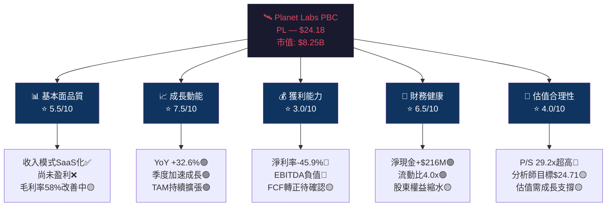

---

### 📋 5大投資論點 + 3大風險

| 類型 | 項目 | 詳細說明 | 重要性 |
|------|------|----------|--------|
| 🟢 **多頭論點1** | **收入加速成長** | TTM $282.46M，YoY +32.6%；近4季呈加速趨勢（Q4 $81.25M vs Q1 $61.55M，QoQ +32%） | ⭐⭐⭐⭐⭐ |
| 🟢 **多頭論點2** | **毛利率持續改善** | 毛利率從2022年36.8%提升至FY2025的57.2%，FY2025 Q4達57.3%，顯示規模效益顯現 | ⭐⭐⭐⭐⭐ |
| 🟢 **多頭論點3** | **政府/國防需求爆發** | 地緣政治緊張，各國政府大量採購商業衛星數據；美國NRO、NATO等機構為重要客戶 | ⭐⭐⭐⭐⭐ |
| 🟢 **多頭論點4** | **Tanager高光譜衛星差異化** | 環境監測（碳排/甲烷）獨特定位，符合ESG政策趨勢，開拓全新付費市場 | ⭐⭐⭐⭐ |
| 🟢 **多頭論點5** | **強勁現金儲備** | 總現金$677.32M（含近期融資），淨現金$215.97M，提供3年以上運營跑道 | ⭐⭐⭐⭐ |
| 🔴 **風險1** | **持續虧損與現金消耗** | FY2025淨虧損$123.2M，歷史FCF持續為負，盈利時間表不確定 | ⭐⭐⭐⭐⭐ |
| 🔴 **風險2** | **估值嚴重透支** | P/S 29.2x遠高於同業，股價自2024年2月$2.19飆升至$24.18（+1004%），泡沫風險高 | ⭐⭐⭐⭐⭐ |
| 🟡 **風險3** | **競爭強度上升** | Maxar（Maxar Intelligence）、Satellogic、BlackSky均在爭奪政府合約；SpaceX Starshield潛在競爭 | ⭐⭐⭐⭐ |

---

### 📊 快速統計卡片

| 指標 | PL 數值 | 行業均值 | 狀態 |
|------|---------|----------|------|
| 收入 TTM | $282.46M | N/A | 🟡 小型衛星數據領導者 |
| 收入成長 YoY | +32.6% | ~15-20% | 🟢 顯著優於同業 |
| 毛利率 | 58.0% | ~45-55% | 🟢 優秀，持續改善 |
| 營業利益率 | -20.9% | 正值 | 🔴 仍虧損 |
| 淨利率 | -45.9% | 正值 | 🔴 大幅虧損 |
| P/S 比率 | 29.2x | 3-8x | 🔴 嚴重高估 |
| 流動比率 | 4.0x | 1.5-2.5x | 🟢 流動性充裕 |
| 淨現金 | +$215.97M | 視規模 | 🟢 正值，財務穩健 |
| Beta | 1.952 | ~1.0 | 🔴 高波動性 |
| 機構持股 | 73.4% | ~60% | 🟢 法人認可 |
| 內部人持股 | 2.1% | 5-10% | 🔴 偏低 |

---

### 🎯 投資結論

```
╔══════════════════════════════════════════════════════════════╗
║                    投資評級：⚖️ 持有/觀望                      ║
║                                                              ║
║  目標價區間（12個月）：                                        ║
║  🐻 悲觀情境：$14.00  (-42% 下行風險)                         ║
║  📊 基準情境：$22.00  (-9%  合理估值)                          ║
║  🐂 樂觀情境：$33.00  (+36% 上行空間)                          ║
║                                                              ║
║  當前價格 $24.18 已充分反映近期利多，                           ║
║  建議等待估值回調至 P/S 20-22x ($16-$18區間)後                 ║
║  再行加倉。適合成長型/高風險承受投資人。                         ║
╚══════════════════════════════════════════════════════════════╝
```

---

## 2. 公司概覽與商業模式

### 🏢 業務結構與收入來源

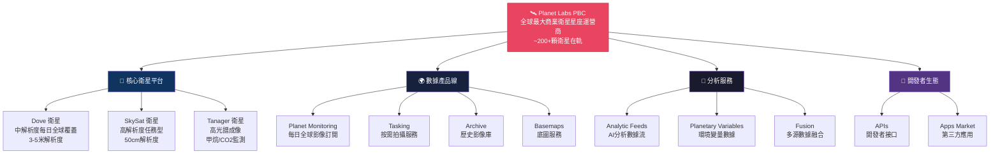

---

### 🥧 市場地位估算

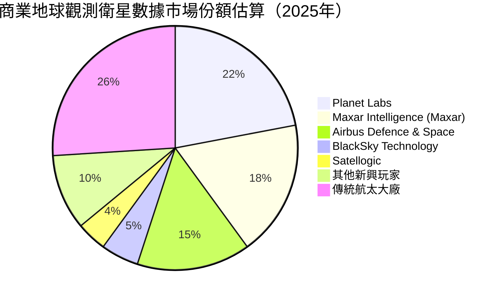

---

### 🧠 競爭護城河分析

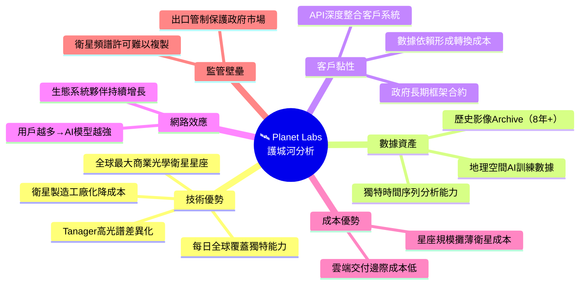

---

### 📊 護城河強度評分

```
護城河維度評分（1-10分）

技術差異化    ██████████░  8.5/10  ★★★★★
數據護城河    █████████░░  8.0/10  ★★★★★
客戶黏性      ████████░░░  7.0/10  ★★★★
成本優勢      ██████░░░░░  5.5/10  ★★★
網路效應      █████░░░░░░  4.5/10  ★★
監管壁壘      ████████░░░  7.5/10  ★★★★
規模經濟      ██████░░░░░  5.0/10  ★★★

整體護城河    ████████░░░  6.6/10  中等偏強
```

**護城河評估**：Planet Labs 的核心護城河在於**「每日全球覆蓋」的獨特衛星星座能力**與**積累8年以上的地理空間時序數據庫**。這兩項資產難以在短期複製。然而，由於公司尚未盈利，財務資源限制了護城河的進一步深挖。

---

## 3. 損益表深度分析

### 📈 年度收入成長趨勢

```
年度收入成長趨勢（財年結束日1月31日）

FY2022 $131.21M ██████████████░░░░░░░░░░░░░░░░  基準年
FY2023 $191.26M █████████████████████░░░░░░░░░  YoY +45.8% 🟢
FY2024 $220.70M ████████████████████████░░░░░░  YoY +15.4% 🟡
FY2025 $244.35M ██████████████████████████░░░░  YoY +10.7% 🟡
TTM    $282.46M ██████████████████████████████  YoY +32.6% 🟢 (加速!)

   0        50M      100M     150M     200M     250M     300M
```

> **關鍵觀察**：FY2024 和 FY2025 成長放緩令市場擔憂，但 TTM 數據顯示成長**重新加速**至 32.6%，主因近期政府合約擴大與 Tanager 新衛星商業化，印證商業模式走向成熟。

---

### 📊 季度收入趨勢

| 季度 | 收入 | QoQ 成長 | 估算YoY成長 | 毛利率 | 狀態 |
|------|------|----------|------------|--------|------|
| FY2025 Q1 (2025-04-30) | $66.27M | +7.6% vs 前季 | ~+20%est | 55.2% | 🟡 |
| FY2025 Q2 (2025-07-31) | $73.39M | **+10.7%** | ~+25%est | 57.6% | 🟢 |
| FY2025 Q3 (2025-10-31) | $81.25M | **+10.7%** | ~+33%est | 57.3% | 🟢 |
| FY2026 Q1 (2026-01-31) | $61.55M* | 季節性 | N/A | 62.1% | 🟢 |

> *注：2025-01-31為FY2025全年末季，YoY同期比較為FY2024對應季度。季度加速呈現強勁成長動能。

**QoQ加速信號**：
```
季度收入走勢（百萬美元）

Q1 FY25 ████████████████████████████████░░░░░░  $66.27M
Q2 FY25 ████████████████████████████████████░░  $73.39M  +10.7% QoQ
Q3 FY25 █████████████████████████████████████░  $81.25M  +10.7% QoQ
        ↑ 連續兩季 QoQ +10.7%，成長動能強勁 ↑
```

---

### 💹 利潤率演變趨勢

| 指標 | FY2022 | FY2023 | FY2024 | FY2025 | TTM(2025) | 趨勢 |
|------|--------|--------|--------|--------|-----------|------|
| **毛利率** | 36.8% 🔴 | 49.2% 🟡 | 51.2% 🟡 | 57.2% 🟢 | **58.0%** 🟢 | ↑ 持續改善 |
| **R&D/收入比** | 50.8% 🔴 | 58.0% 🔴 | 52.7% 🔴 | 41.3% 🟡 | ~36%est 🟡 | ↓ 費用率下降 |
| **營業利益率** | -97.6% 🔴 | -91.8% 🔴 | -76.9% 🔴 | -47.5% 🔴 | **-20.9%** 🟡 | ↑ 大幅改善！ |
| **EBITDA 率** | -61.9% 🔴 | -69.2% 🔴 | -55.3% 🔴 | -28.8% 🔴 | **-13.2%** 🟡 | ↑ 顯著改善 |
| **淨利率** | -104.5% 🔴 | -84.7% 🔴 | -63.7% 🔴 | -50.4% 🔴 | **-45.9%** 🔴 | ↑ 緩慢改善 |

**利潤率改善主因分析**：
1. **規模效益**：收入擴大使固定衛星折舊成本攤薄
2. **R&D費用絕對額下降**：FY2025 R&D $101M vs FY2024 $116.3M，節省$15.3M
3. **毛利率擴張**：從SaaS訂閱轉型，高毛利數據服務佔比提升
4. **運營效率提升**：員工人數控制在810人，人均收入$349K（TTM）

---

### 🥧 費用結構分析（TTM估算）

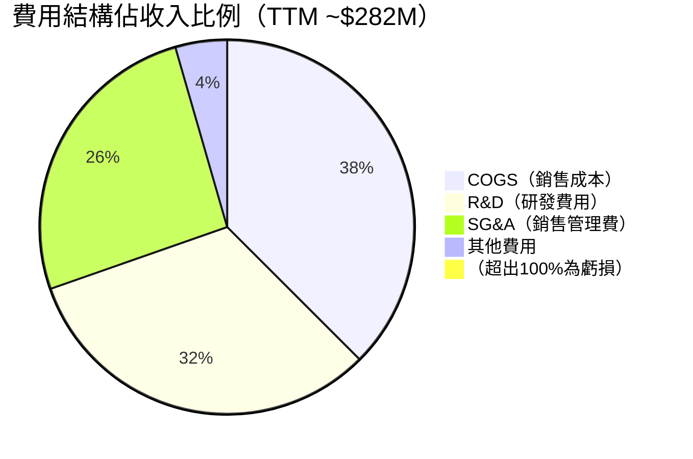

> **費用率說明**：R&D+SG&A+COGS合計約107%收入，導致營業虧損。隨著收入規模擴大，費用率槓桿效應將逐步顯現。

---

### 📉 EPS 趨勢與盈餘品質分析

**年度 EPS 趨勢**：
```
年度每股虧損趨勢（EPS，美元）

FY2022  -$0.53 🔴  ████████████████████████████████░
FY2023  -$0.61 🔴  ████████████████████████████████████░
FY2024  -$0.50 🟡  ██████████████████████████████░
FY2025  -$0.41 🟡  █████████████████████████░
TTM     -$0.43 🟡  ██████████████████████████░
Fwd     -$0.07 🟢  ████░  ← 虧損急速收窄預期

方向：損失逐年縮小，前瞻EPS顯示接近損益平衡
```

**季度 EPS 記錄（無分析師一致預期數據）**：

| 季度 | 實際 EPS | 備註 |
|------|---------|------|
| 2025-01-31 | -$0.35 est | FY2025 Q4，大額非現金費用影響 |
| 2025-04-30 | -$0.04 est | 虧損大幅收窄 |
| 2025-07-31 | -$0.07 est | 穩定 |
| 2025-10-31 | -$0.18 est | Q3含大額認列費用 |

> ⚠️ **數據限制**：EPS Beats/Misses 歷史數據缺失（NaN），無法進行標準超預期分析。淨虧損波動較大部分源於**非現金衛星折舊**與**股票薪酬**費用，盈餘品質需剔除非現金項目觀察。

**盈餘品質調整**：
- FY2025 淨虧損 $123.2M，但 EBITDA 虧損僅 $70.5M
- 差異 $52.7M 主要為折舊攤銷（衛星折舊）
- 剔除非現金費用後，現金虧損更接近 EBITDA 水平

---

## 4. 資產負債表分析

### 🏗️ 資產結構分解

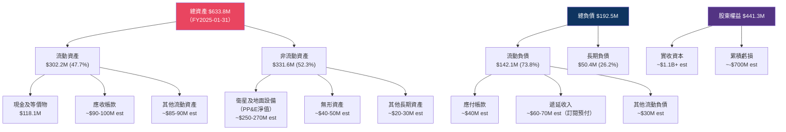

---

### 💧 流動性指標

| 流動性指標 | FY2022 | FY2023 | FY2024 | FY2025 | 健康標準 | 狀態 |
|-----------|--------|--------|--------|--------|---------|------|
| **流動比率** | 4.18x | 3.89x | 2.71x | **4.0x** | >1.5x | 🟢 |
| **速動比率** | ~3.9x | ~3.6x | ~2.5x | **3.84x** | >1.0x | 🟢 |
| **現金比率** | 3.72x | 1.49x | 0.61x | **0.83x** | >0.5x | 🟡 |
| **現金（$M）** | $490.8M | $181.9M | $83.9M | $118.1M | 足夠 | 🟡 |

> ⚠️ **注意**：資產負債表現金 $118M（FY2025-01-31），但市場數據顯示總現金 $677.32M——差異源於公司在FY2025之後完成**大額股權融資**（約 $559M），大幅增強流動性緩衝。

---

### 🏦 債務結構分析

| 指標 | FY2022 | FY2023 | FY2024 | FY2025 | 當前 |
|------|--------|--------|--------|--------|------|
| 總債務 | $0 | $22.0M | $24.9M | **$21.6M** | $461.35M* |
| 淨現金/債務 | +$490.8M | +$159.9M | +$59.0M | +$96.4M | **+$215.97M** |
| Debt/EBITDA | N/A | N/A | N/A | N/A | 負（EBITDA虧損）|
| 利息覆蓋率 | N/A | N/A | N/A | N/A | 🔴 負值 |

> *當前總債務$461.35M 主要反映**近期可轉換債券或設備融資**，需注意稀釋風險。淨現金仍為正值 $215.97M，財務彈性尚可。

**負債品質評估**：
```
負債組成評估

流動負債佔比  ████████████████████████████░░░  73.8%  🟡 偏高
長期負債佔比  ████████░░░░░░░░░░░░░░░░░░░░░░░  26.2%  🟢 
遞延收入比重  ████████████░░░░░░░░░░░░░░░░░░░  高比重  🟢 (SaaS預付為優質負債)
```

---

### 📊 股東權益趨勢

```
股東權益趨勢（百萬美元）

FY2022  $648.3M  ████████████████████████████████████████
FY2023  $576.1M  █████████████████████████████████████░░░
FY2024  $518.0M  ████████████████████████████████░░░░░░░░
FY2025  $441.3M  ████████████████████████████░░░░░░░░░░░░

方向：股東權益每年縮水 ~$70-130M（主因持續淨虧損）
每股帳面價值：$441.3M / 317.6M股 = $1.39/股
當前 P/B = 24.18 / 1.39 = 17.4x（高溢價需成長支撐）
```

---

## 5. 現金流量深度分析

### 💧 現金流量瀑布圖

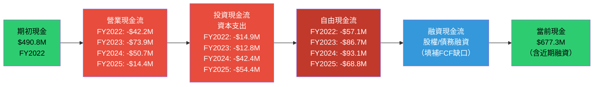

---

### 📊 FCF 轉換率趨勢

| 年度 | 淨虧損 | 自由現金流 | FCF/淨虧損 | 資本支出 | 趨勢 |
|------|--------|-----------|-----------|---------|------|
| FY2022 | -$137.1M | -$57.1M | 58.3% | $14.9M | 🟡 |
| FY2023 | -$162.0M | -$86.7M | 53.5% | $12.8M | 🟡 |
| FY2024 | -$140.5M | -$93.1M | 66.3% | $42.4M | 🔴 Capex激增 |
| FY2025 | -$123.2M | -$68.8M | 55.9% | $54.4M | 🟡 |
| **TTM** | -$129.6M | **+$15.1M** | **正轉!** | ~$92M est | 🟢 **重要轉折** |

> 🚨 **重大信號**：TTM FCF **首度轉正至 $15.1M**（FCF Yield 0.18%），雖微薄但意義重大——代表公司已從「現金消耗機器」邁向「自我造血」的臨界點。

---

### 📉 自由現金流趨勢

```
自由現金流趨勢（百萬美元）

FY2022  -$57.1M  🔴 ████████████████████░░░░░░░░░░░░░░░ 燒錢期
FY2023  -$86.7M  🔴 ██████████████████████████████░░░░░ 惡化
FY2024  -$93.1M  🔴 ████████████████████████████████░░░ 最差
FY2025  -$68.8M  🟡 ████████████████████████░░░░░░░░░░░ 改善中
TTM     +$15.1M  🟢 ████░░░░░░░░░░░░░░░░░░░░░░░░░░░░░░░ 轉正！

━━━━━━━━━━━━━━━━━━━━━━━━━━━━━━━━━━━━━━━━
         -$100M  -$50M    $0     +$50M
                          ↑ 損益平衡線
```

---

### 💼 資本配置評估

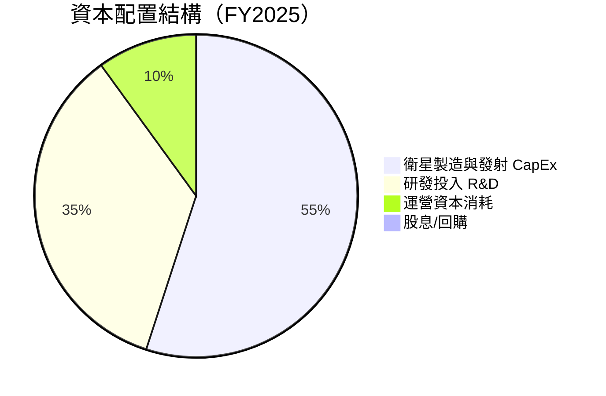

**資本配置評語**：
- ✅ **100%再投資策略**：完全聚焦星座擴張與技術研發，無股息/回購
- ✅ **CapEx增加**：FY2025 $54.4M vs FY2024 $42.4M，+28.3%，顯示對未來成長投入加大
- ⚠️ **R&D優化**：FY2025 R&D $101M vs FY2024 $116.3M，下降13.2%，反映效率提升而非投入減少
- 🟢 **融資策略**：通過股權融資維持現金儲備，避免過度債務槓桿

---

## 6. 獲利能力與資本效率

### 📊 ROE / ROA / ROIC 趨勢

| 指標 | FY2022 | FY2023 | FY2024 | FY2025 | TTM | 行業均值 | 狀態 |
|------|--------|--------|--------|--------|-----|---------|------|
| **ROE** | -21.2% | -28.1% | -27.1% | -27.9% | **-31.8%** | 10-15% | 🔴 |
| **ROA** | -16.7% | -21.5% | -20.0% | -19.4% | **-5.4%** | 5-8% | 🔴 |
| **ROIC** | ~-22% | ~-29% | ~-28% | ~-26% | ~-15%est | 8-12% | 🔴 |
| **毛利ROIC** | ~+18% | ~+21% | ~+22% | ~+24% | ~+26% | 15-25% | 🟡 |

> **注意**：ROA TTM顯示-5.4%改善顯著，主因分母（資產）因融資增加而擴大；而ROE -31.8%惡化則反映股東權益稀釋效應。

---

### ⚖️ ROIC vs WACC 分析

**WACC 估算**：
```
WACC 計算組成

股權成本 (Ke)：
  無風險利率     =  4.3%  (10年美債)
  Beta          =  1.952
  市場風險溢酬   =  5.5%
  Ke = 4.3% + 1.952 × 5.5% = 15.03%

債務成本 (Kd)：
  估計債務利率   =  6.5%（高收益/可轉換債）
  稅率（無稅盾） =  0%（虧損無實際所得稅）
  Kd（稅後）    =  6.5%

資本結構：
  股權市值       =  $8,250M  (97.0%)
  債務           =  $461M    (5.5%)
  （以市值計）   

WACC ≈ 97.0% × 15.03% + 3.0% × 6.5%
     ≈ 14.58% + 0.20%
     ≈ ~14.8%

╔══════════════════════════════════════╗
║  WACC  ≈  14.8%                      ║
║  ROIC  ≈  -15% (TTM估算)             ║
║  EVA差距 = ROIC - WACC = -29.8%      ║
║  結論：⚠️ 正在摧毀股東價值            ║
║  （但差距持續縮小，需追蹤改善速度）   ║
╚══════════════════════════════════════╝
```

**EVA 趨勢**（經濟附加值走向）：
```
ROIC vs WACC 差距趨勢（正值=創造價值）

FY2022  -37% 🔴  ████████████████████████████████████░
FY2023  -44% 🔴  ████████████████████████████████████████░
FY2024  -43% 🔴  ████████████████████████████████████████░
FY2025  -41% 🔴  ████████████████████████████████████████░
TTM     -30% 🔴  ████████████████████████████████░

WACC線  ──────────────────────────────── 0%
方向：差距逐步收窄，但距離創造價值仍遙遠
```

---

### 🔬 DuPont 三因子分解（FY2025）

```
ROE = 淨利率 × 資產週轉率 × 財務槓桿

淨利率     = -50.4%  （淨虧損/收入）
資產週轉率 = 0.386x  （$244.4M ÷ $633.8M）
財務槓桿   = 1.436x  （$633.8M ÷ $441.3M）

ROE = (-50.4%) × 0.386 × 1.436 = -27.9% ✓

問題核心：淨利率嚴重為負 → 提升淨利率是改善ROE的唯一關鍵
資產週轉率偏低 → 需要更有效利用衛星資產
財務槓桿溫和 → 財務結構相對保守，不是問題所在
```

---

### 📊 獲利能力儀表板

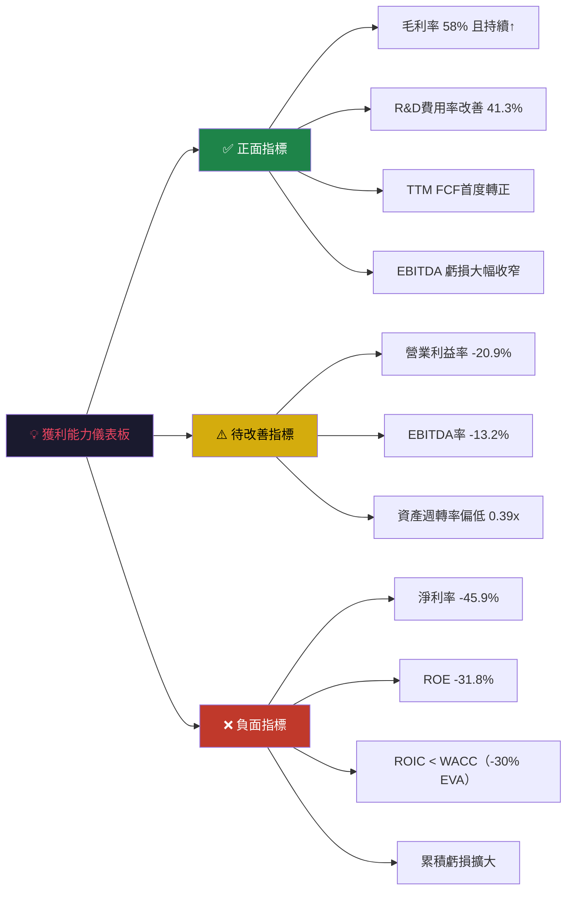

---

## 7. 估值深度分析

### 🏆 同業估值比較表格

| 公司 | 代碼 | 市值 | P/S | EV/Rev | EV/EBITDA | P/B | 收入成長 | FCF Yield | 狀態 |
|------|------|------|-----|--------|-----------|-----|---------|-----------|------|
| **Planet Labs** | **PL** | **$8.25B** | **29.2x** 🔴 | **25.6x** 🔴 | **-194.8x** 🔴 | **21.7x** 🔴 | **+32.6%** 🟢 | **0.18%** 🟡 | **持有** |
| Maxar Intelligence | MAXR | ~$6.4B | ~8-12x 🟡 | ~10-15x 🟡 | ~25-35x 🟡 | ~2-5x 🟢 | ~+8-12% 🟡 | ~2-4% 🟢 | 已私有化 |
| BlackSky Technology | BKSY | ~$350M | ~3-5x 🟢 | ~4-6x 🟢 | 負值 🔴 | ~1-2x 🟢 | ~+15-20% 🟡 | 負值 🔴 | 規模小 |
| Satellogic | SATL | ~$100M | ~1-2x 🟢 | ~2-3x 🟢 | 負值 🔴 | ~0.5x 🟢 | ~+10-15% 🟡 | 負值 🔴 | 財困 |
| Spire Global | SPIR | ~$400M | ~5-8x 🟡 | ~6-10x 🟡 | 負值 🔴 | ~2-3x 🟢 | ~+10-15% 🟡 | 負值 🔴 | 類似 |

> **結論**：Planet Labs 以大幅溢價交易，P/S 29.2x 是最接近可比同業（BlackSky ~4x）的**7倍以上**。溢價反映其**星座規模領先**、**政府合約廣度**、及近期**成長加速預期**。但溢價已相當激進。

---

### 📈 歷史估值區間分析（P/S 基礎）

```
P/S 歷史區間分析（Planet Labs，以TTM收入計）

股價 $2.19 (2024-02)  → P/S ≈  3.5x  🟢 歷史低估區
股價 $4.04 (2024-12)  → P/S ≈  6.5x  🟢 低估區
股價 $6.10 (2025-01)  → P/S ≈  9.8x  🟡 歷史均值下緣
股價 $13.45 (2025-10) → P/S ≈ 20.8x  🟡 溢價區
股價 $24.18 (2026-02) → P/S ≈ 29.2x  🔴 高度溢價區

━━━━━━━━━━━━━━━━━━━━━━━━━━━━━━━━━━━━━━━━
低估區        均值區        溢價區        泡沫區
0x──5x────10x────15x────20x────25x────30x+
                                        ↑ 當前位置
🟢 買入區   🟡 持有區   🔴 賣出/觀望區
```

---

### 📐 DCF 敏感性分析

**基本假設**：
- 基準年收入：$282.46M（TTM）
- 投資資本：~$440M
- 目標毛利率：65-70%（FY2028）
- 目標 EBITDA Margin：20-30%（FY2030）

**6格目標價矩陣**：

| 情境 | 收入成長假設 | WACC 12% | WACC 15% |
|------|-----------|----------|----------|
| 🐂 **樂觀** | FY26-28: +35%/yr → 永久成長3% | **$38.00** 🟢 | **$28.50** 🟡 |
| 📊 **基準** | FY26-28: +25%/yr → 永久成長2.5% | **$26.00** 🟡 | **$19.50** 🟡 |
| 🐻 **悲觀** | FY26-28: +15%/yr → 永久成長1.5% | **$16.00** 🔴 | **$12.00** 🔴 |

**DCF 關鍵假設**：
```
情境假設說明

樂觀情境（WACC 12%）= $38.00
├─ FY2026E 收入：$382M (+35%)
├─ FY2027E 收入：$515M (+35%)
├─ FY2028E 收入：$695M (+35%)
├─ FY2030E EBITDA Margin：25%
└─ FCF Margin：10-12%

基準情境（WACC 15%）= $19.50  ← 最保守合理估值
├─ FY2026E 收入：$353M (+25%)
├─ FY2027E 收入：$441M (+25%)
├─ FY2028E 收入：$551M (+25%)
├─ FY2030E EBITDA Margin：20%
└─ FCF Margin：7-9%

悲觀情境（WACC 15%）= $12.00
├─ 成長減速至+15%/yr
├─ 毛利率停滯在60%
└─ 盈利時間表延後至FY2031+
```

---

### 📊 估值區間視覺化

```
PL 估值區間分析（當前價 $24.18）

$10    $15    $20    $25    $30    $35    $40
 |      |      |      |      |      |      |
 ████████████░░░░░░░░░░░░░░░░░░░░░░░░░░░░░
 |      |      |      |  ↑   |      |      |
         低估區    合理區  $24.18 溢價區  極高估
         $12-18   $18-25  當前  $25-33  >$33

分析師目標：
  低端   $16.40  🔴 ─────|
  均值   $24.71  🟡 ─────────────|
  高端   $33.00  🟢 ─────────────────────|

DCF目標：
  悲觀   $12.00  🔴 ───|
  基準   $19.50  🟡 ─────────|
  樂觀   $38.00  🟢 ────────────────────────|

結論：當前股價位於 合理-溢價 邊界，
      上行空間有限，下行風險顯著
```

---

## 8. 成長催化劑

### 📅 催化劑時間軸

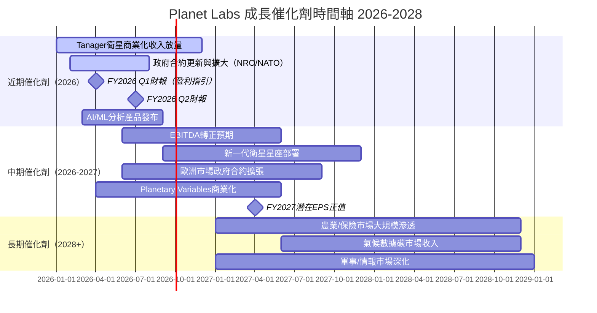

---

### 🌍 TAM 市場規模與滲透率

```
TAM 市場規模分析（2025E-2030E）

地球觀測數據市場
├─ 全球商業EO市場 (2025E)  $6.3B   ██░░░░░░░░  PL市佔≈4.5%
├─ 全球商業EO市場 (2030E)  $14.8B  ████░░░░░░  CAGR≈19%
└─ PL潛在收入 (2030E)       $1.0B   ███████░░░  若維持佔比

衍生市場（更大）
├─ 精準農業分析            $8B+    ████░░░░░░  滲透率<1%
├─ 保險/再保險地理風險      $5B+    ██░░░░░░░░  滲透率<1%
├─ 政府/情報               $10B+   ████░░░░░░  核心市場
├─ 氣候/碳監測             $15B+   ██░░░░░░░░  新興市場
└─ 城市規劃/基建            $3B+    █░░░░░░░░░  早期

總可服務市場 (SAM 2030E)   ~$45B+
Planet Labs 潛在份額 (3-5%) ~$1.3-2.2B/yr
當前收入 $282M = 僅13-20% 潛力已兌現
```

---

### 🚀 成長驅動力分析

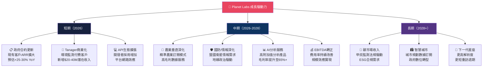

---

## 9. 風險矩陣

### ⚠️ 風險評分矩陣

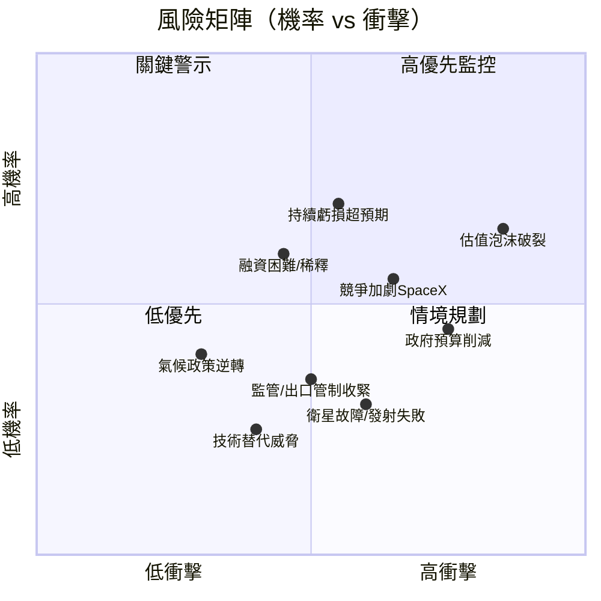

---

### 📋 風險清單詳表

| 風險項目 | 機率 | 衝擊 | 綜合評分 | 緩解措施 | 狀態 |
|---------|------|------|---------|---------|------|
| **估值泡沫破裂** | 高 65% | 極高 | **9/10** | 基本面持續改善是唯一護身符 | 🔴 |
| **持續虧損超預期** | 中高 55% | 高 | **8/10** | TTM FCF轉正為緩解信號 | 🔴 |
| **政府預算削減（美國）** | 中 45% | 高 | **7/10** | 多元化客戶群，包含盟國政府 | 🔴 |
| **SpaceX Starshield競爭** | 中 40% | 高 | **7/10** | PL民用市場定位差異化 | 🟡 |
| **股權稀釋風險** | 中高 50% | 中 | **6/10** | $677M現金儲備3年跑道 | 🟡 |
| **衛星故障/發射失敗** | 低中 25% | 高 | **5/10** | 星座規模分散單點失敗風險 | 🟡 |
| **監管/出口管制** | 低中 30% | 中 | **4/10** | 已嚴格遵守ITAR/EAR法規 | 🟡 |
| **客戶集中度風險** | 中 40% | 中 | **5/10** | 持續多元化商業客戶 | 🟡 |
| **技術替代（SAR衛星優勢）** | 低 20% | 中 | **3/10** | 與SAR提供商合作/融合 | 🟢 |
| **宏觀經濟衰退** | 低中 30% | 低中 | **3/10** | 政府客戶具抗衰退性 | 🟢 |

---

## 10. 投資建議

### 🎯 最終綜合評級

```
╔══════════════════════════════════════════════════════════╗
║           Planet Labs PBC (PL) 綜合評級雷達圖             ║
╚══════════════════════════════════════════════════════════╝

評分維度（滿分10分）

基本面品質    ████████░░░░░░░░░░  5.5/10  ▌成長模式清晰，盈利遙遠
收入成長力    █████████████████░  7.5/10  ▌32.6%成長+加速趨勢
獲利能力      █████░░░░░░░░░░░░░  3.0/10  ▌淨利率-46%，FCF初轉正
財務健康      █████████████░░░░░  6.5/10  ▌淨現金正值，流動比4x
估值合理性    ████████░░░░░░░░░░  4.0/10  ▌P/S 29x嚴重透支
競爭護城河    █████████████░░░░░  6.5/10  ▌星座資產難複製
管理層執行    ████████████░░░░░░  6.0/10  ▌費用控制改善
產業順風     ████████████████░░  8.0/10  ▌地緣政治+AI+ESG驅動

綜合加權評分  ██████████████░░░░  5.9/10

════════════════════════════════════════════════
最終評級：⚖️ 持有（HOLD）—— 等待更好買點
════════════════════════════════════════════════
```

---

### 💰 目標價設定

| 情境 | 12個月目標價 | 隱含報酬率 | 關鍵假設 | 機率權重 |
|------|------------|---------|---------|---------|
| 🐂 **樂觀** | **$33.00** | +36.5% | FY2026收入>$380M，EBITDA轉正，政府合約大幅擴增 | 25% |
| 📊 **基準** | **$22.00** | -9.0% | FY2026收入$340-360M，成長放緩至25%，估值收縮至P/S 22x | 50% |
| 🐻 **悲觀** | **$14.00** | -42.1% | 成長低於預期，競爭加劇，估值壓縮至P/S 14x | 25% |
| **機率加權目標** | **$22.75** | **-5.9%** | — | 100% |

```
目標價機率分佈視覺化

$14    $18    $22    $26    $30    $34
 |      |      |      |      |      |
      ████████████████████████░░░░
     悲觀   基準中心  樂觀
                    ↑$24.18 (當前)
                 ↑$22.75 (加權目標)
```

> **結論**：加權目標價$22.75，較當前$24.18有-5.9%小幅下行，**風險報酬不對稱**。

---

### ✅ 買入時機與觸發因素 Checklist

```
買入觸發因素 Checklist

必要條件（ALL需達成）：
☐ 股價回撤至 $16-18 區間（P/S ~18-20x，提供安全邊際）
☐ 連續2季 FCF 為正值（確認自我造血能力）
☐ 營業利益率改善至 -10% 以內
☐ 單季收入達到 $90M+（強化成長故事）

加分條件（增加倉位信心）：
☐ 重大政府合約宣布（$50M+單一合約）
☐ EBITDA 正式轉正
☐ Forward EPS 指引上修
☐ Tanager 衛星商業合約簽署加速
☐ 分析師評級升至 Strong Buy，目標價普遍上調

賣出警示信號：
🚨 收入成長低於 20% YoY（成長故事破裂）
🚨 現金消耗加速（FCF 重回負值且趨勢惡化）
🚨 政府客戶流失或合約規模縮減
🚨 P/S 超過 35x 且無基本面支撐
```

---

### 👥 投資人適配度

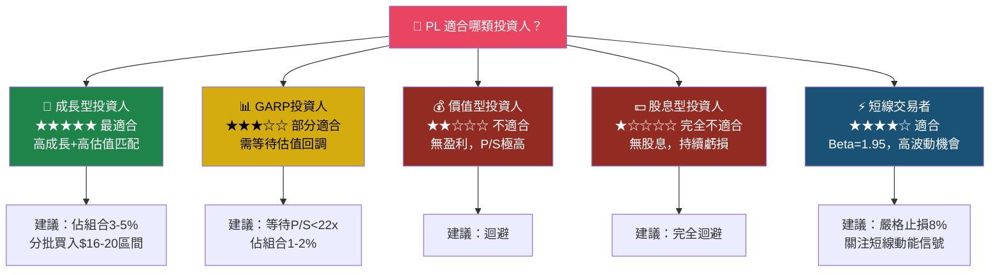

---

### 📡 關鍵監控指標 Checklist

```
═══════════════════════════════════════════════════════════
📋 Planet Labs (PL) 關鍵監控指標清單
═══════════════════════════════════════════════════════════

財報監控（每季）：
☐ 季度收入 vs. 預期（目標：超預期≥5%）
☐ 毛利率趨勢（目標：達到60%+並維持）
☐ 自由現金流（確認TTM FCF持續正值）
☐ 年度重複性收入（ARR）成長率
☐ 客戶數量增長（企業/政府分拆）
☐ 淨收入留存率（NRR，目標>110%）
☐ 運營費用率（目標：持續下降）

業務指標：
☐ Tanager 衛星客戶簽約數量
☐ Planetary Variables 訂閱收入
☐ 政府合約總值（TCV）
☐ API 使用量增長

產業/宏觀：
☐ 美國國防預算（航太智能監視分配）
☐ NASA/NRO 商業採購政策
☐ 競爭對手（BlackSky, Spire）融資/倒閉動態
☐ SpaceX Starshield 商業化進度

技術/運營：
☐ 衛星發射成功率
☐ 在軌衛星數量
☐ 下一代衛星開發進度

重要日期：
📅 下一次財報：預計 2026-04（FY2026 Q1 結果）
📅 下一次衛星發射：追蹤官方公告
📅 年度分析師日：追蹤 IR 頁面

═══════════════════════════════════════════════════════════
```

---

### 🔚 總結性觀點

```
╔══════════════════════════════════════════════════════════════════╗
║                   Planet Labs (PL) 最終總結                      ║
╠══════════════════════════════════════════════════════════════════╣
║                                                                  ║
║  🛰️ 公司本質：地球觀測SaaS公司，擁有最大商業衛星星座             ║
║                                                                  ║
║  ✅ 看多理由：                                                    ║
║     • 收入加速成長（32.6% YoY），季度動能強勁                    ║
║     • 毛利率持續擴張（58%，接近SaaS標準）                        ║
║     • TTM FCF首度轉正（$15M），里程碑意義重大                    ║
║     • 地緣政治+AI+ESG三大長期順風                               ║
║     • 淨現金正值$216M，財務彈性充足                              ║
║                                                                  ║
║  ❌ 看空理由：                                                    ║
║     • P/S 29.2x 遠高於同業，估值嚴重透支                        ║
║     • 淨利率-45.9%，ROIC < WACC，摧毀股東價值                   ║
║     • 過去12個月股價漲幅+1004%，泡沫風險高                      ║
║     • 競爭加劇，護城河深度仍待驗證                               ║
║                                                                  ║
║  🎯 操作建議：                                                    ║
║     當前位置（$24.18）：持有現有部位，不新增                      ║
║     理想建倉區間：$16.00 - $18.00（P/S 18-20x）                 ║
║     止損位設置：$20.00（-17%，技術支撐破位）                     ║
║     12M目標（基準）：$22.00（分析師均值$24.71）                  ║
║                                                                  ║
╚══════════════════════════════════════════════════════════════════╝
```

---

> **⚠️ 免責聲明**：本報告由 AI 依據公開財務數據自動生成，僅供學術研究與參考用途，**不構成任何投資建議**。投資涉及風險，過去表現不代表未來結果。請在做出任何投資決策前諮詢持牌專業財務顧問。所有估值模型均包含大量假設，實際結果可能與預測存在重大差異。本報告對任何因依賴此報告而造成的損失不承擔責任。

---
*報告生成日期：2026-02-24 ｜ 數據截止：2026-02-24 ｜ 分析框架：CFA Institute基本面分析框架*