# PL 基本面深度分析報告

> **報告日期**：2026-02-24 ｜ **語言**：繁體中文 ｜ **數據來源**：Yahoo Finance ｜ **分析師**：AI 頂級研究部門

---

## 目錄

| # | 章節 | 重點 |
|---|------|------|
| 1 | [執行摘要](#1-執行摘要) | 核心評分、5大投資論點 |
| 2 | [公司概覽](#2-公司概覽) | 業務結構、市場地位、競爭優勢 |
| 3 | [損益表深度分析](#3-損益表深度分析) | 收入成長、利潤率演變 |
| 4 | [資產負債表分析](#4-資產負債表分析) | 資產結構、流動性 |
| 5 | [現金流量分析](#5-現金流量分析) | 現金流瀑布、FCF趨勢 |
| 6 | [獲利能力指標](#6-獲利能力指標) | ROE/ROA/ROIC |
| 7 | [估值分析](#7-估值分析) | 多維度估值、目標股價 |
| 8 | [競爭護城河](#8-競爭護城河) | 五力分析、護城河評分 |
| 9 | [成長催化劑](#9-成長催化劑) | 短中長期機會、TAM |
| 10 | [風險分析](#10-風險分析) | 風險矩陣、緩解措施 |
| 11 | [公平價值估算](#11-公平價值估算) | DCF、三種估值法 |
| 12 | [投資建議](#12-投資建議) | 最終評級、監控指標 |

---

## 1. 執行摘要

### 🎯 核心評分儀表板

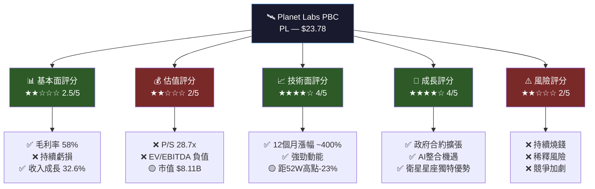

---

### 📋 5大投資論點

| # | 投資論點 | 訊號 | 評級 | 說明 |
|---|---------|------|------|------|
| 1 | 🛰️ **衛星星座壟斷性資產** | 正面 | 🟢 | 全球最大商業地球觀測衛星星座（200+顆），護城河深厚 |
| 2 | 📈 **收入成長加速** | 正面 | 🟢 | 收入年增 32.6%（TTM），連續4年正成長，軌道持續向上 |
| 3 | 💸 **持續虧損與現金消耗** | 負面 | 🔴 | 年度自由現金流 -$68.78M，淨利率 -45.9%，獲利路徑仍遙遠 |
| 4 | 🏛️ **政府與國防需求爆發** | 正面 | 🟢 | NRO、NATO、烏克蘭衝突帶動政府需求，訂閱收入穩定性高 |
| 5 | 💰 **估值極度昂貴** | 負面 | 🔴 | P/S高達28.7x，對虧損公司而言估值風險極高，需強力成長支撐 |

---

### ⚡ 快速統計卡片

| 指標 | 數值 | 評級 | 備註 |
|------|------|------|------|
| 💵 當前股價 | $23.78 | 🟡 | 距52W高點-23.1% |
| 📊 市值 | $81.1億 | 🟡 | 中型成長股 |
| 📉 Beta係數 | 1.952 | 🔴 | 高波動，高風險 |
| 💰 總收入(TTM) | $2.82億 | 🟡 | YoY +32.6% |
| 📐 毛利率 | 58.0% | 🟢 | SaaS級別毛利率 |
| 🔥 營業利益率 | -20.9% | 🔴 | 仍在投資期 |
| 💳 現金儲備 | $6.77億 | 🟢 | 充足流動性 |
| 📉 自由現金流 | +$1,507萬(TTM) | 🟡 | 首次轉正信號 |
| 🏦 流動比率 | 3.999x | 🟢 | 短期財務健康 |
| 👤 員工數 | 810人 | 🟡 | 精簡高效組織 |
| 🎯 分析師目標均價 | $24.71 | 🟡 | 上行空間僅+3.9% |
| 📅 52週低點 | $2.79 | 🟢 | 距低點+752% |

---

## 2. 公司概覽

### 🏢 業務結構圖

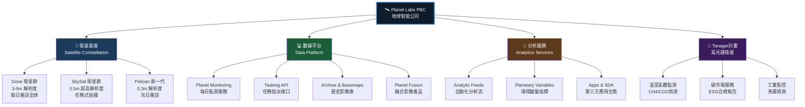

---

### 🌍 市場地位分析

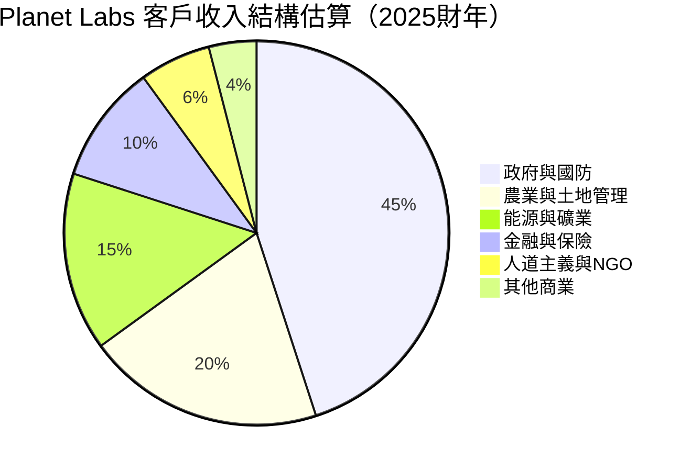

---

### 🧠 競爭優勢 Mindmap

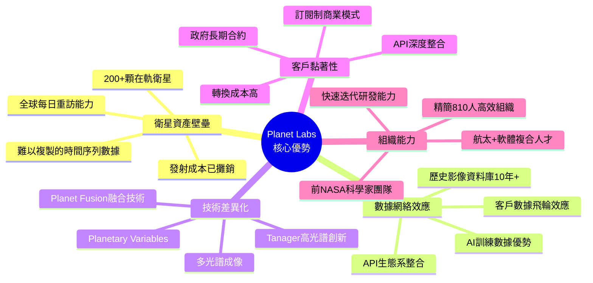

---

## 3. 損益表深度分析

### 📈 收入成長時間軸

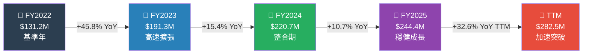

---

### 📊 年度收入趨勢 Unicode 長條圖

```
年度收入趨勢（百萬美元）
━━━━━━━━━━━━━━━━━━━━━━━━━━━━━━━━━━━━━━━━━━━━━━━━━━

FY2022  $131.2M  ▓▓▓▓▓▓▓▓▓▓▓▓▓░░░░░░░░░░░░░░░░░░░░░░░░  32%
FY2023  $191.3M  ▓▓▓▓▓▓▓▓▓▓▓▓▓▓▓▓▓▓▓░░░░░░░░░░░░░░░░░░  47%
FY2024  $220.7M  ▓▓▓▓▓▓▓▓▓▓▓▓▓▓▓▓▓▓▓▓▓▓░░░░░░░░░░░░░░░  54%
FY2025  $244.4M  ▓▓▓▓▓▓▓▓▓▓▓▓▓▓▓▓▓▓▓▓▓▓▓▓░░░░░░░░░░░░░  60%
TTM     $282.5M  ▓▓▓▓▓▓▓▓▓▓▓▓▓▓▓▓▓▓▓▓▓▓▓▓▓▓▓▓░░░░░░░░░  69%

                 0         100        200        300   400M
━━━━━━━━━━━━━━━━━━━━━━━━━━━━━━━━━━━━━━━━━━━━━━━━━━
💡 TTM目標參考線（$400M）= 估值隱含成長目標
```

---

### 💹 利潤率演變 ASCII 折線圖

```
利潤率趨勢 (%)
━━━━━━━━━━━━━━━━━━━━━━━━━━━━━━━━━━━━━━━━━━━━━━━━━━
 60% |                                          ★(58%)
     |                                    ★(51%)
 40% |               ★(49%)     ★(51%)
     |  ★(37%)
 20% |
     |────────────────────────────────────────────── 0%
     |
-20% |                    ▼(-77%)         ▼(-47%)
     |  ▼(-98%)                  ▼(-47.5%)★TTM(-21%)
-40% |                                    
     |  ▼(-105%)  ▼(-92%)  ▼(-64%)
-60% |                     ▼(-85%)
     |
-80% |
     |
-100%|  ▼(-105%)
      ─────────────────────────────────────────────
      FY2022      FY2023      FY2024      FY2025  TTM
      
★ = 毛利率（正面趨勢，穩步改善 ✅）
▼ = 營業利益率（虧損收窄，方向正確 🟡）
━━━━━━━━━━━━━━━━━━━━━━━━━━━━━━━━━━━━━━━━━━━━━━━━━━
```

---

### 📋 近4年詳細損益數據表

| 財務指標 | FY2022 | FY2023 | FY2024 | FY2025 | TTM | 趨勢 |
|---------|--------|--------|--------|--------|-----|------|
| 💵 總收入 | $131.2M | $191.3M | $220.7M | $244.4M | $282.5M | 🟢 持續成長 |
| 📐 毛利潤 | $48.2M | $94.0M | $113.0M | $139.7M | ~$163.8M | 🟢 快速擴張 |
| 📊 毛利率 | 36.8% | 49.2% | 51.2% | 57.2% | 58.0% | 🟢 大幅改善 |
| 🔬 研發費用 | $66.7M | $110.9M | $116.3M | $101.0M | ~$95M | 🟡 開始縮減 |
| ⚙️ 營業利益 | -$128.1M | -$175.7M | -$169.8M | -$116.1M | -$59.1M | 🟡 虧損收窄 |
| 📉 營業利益率 | -97.6% | -91.9% | -76.9% | -47.5% | -20.9% | 🟢 顯著改善 |
| 📛 淨利 | -$137.1M | -$162.0M | -$140.5M | -$123.2M | -$129.6M | 🟡 緩慢改善 |
| 💰 EBITDA | -$81.2M | -$132.3M | -$122.1M | -$70.5M | -$37.2M | 🟢 虧損縮小 |
| 📊 EPS(TTM) | N/A | N/A | N/A | N/A | -$0.43 | 🔴 仍虧損 |

---

### 🥧 費用結構分析

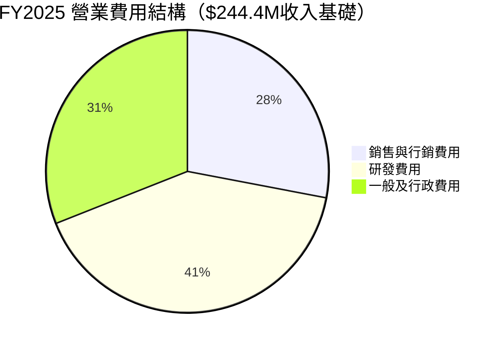

---

### 📊 毛利率改善進度條

```
毛利率改善軌跡（目標：65%+進入盈利）
━━━━━━━━━━━━━━━━━━━━━━━━━━━━━━━━━━━━━━━━━━━━━━━━━━
FY2022  36.8%  ▓▓▓▓▓▓▓▓▓▓▓▓▓▓▓▓▓▓▓▓░░░░░░░░░░░░░░░░░░░░  🔴
FY2023  49.2%  ▓▓▓▓▓▓▓▓▓▓▓▓▓▓▓▓▓▓▓▓▓▓▓▓▓░░░░░░░░░░░░░░░  🟡
FY2024  51.2%  ▓▓▓▓▓▓▓▓▓▓▓▓▓▓▓▓▓▓▓▓▓▓▓▓▓▓░░░░░░░░░░░░░░  🟡
FY2025  57.2%  ▓▓▓▓▓▓▓▓▓▓▓▓▓▓▓▓▓▓▓▓▓▓▓▓▓▓▓▓▓░░░░░░░░░░░  🟡
TTM     58.0%  ▓▓▓▓▓▓▓▓▓▓▓▓▓▓▓▓▓▓▓▓▓▓▓▓▓▓▓▓▓░░░░░░░░░░░  🟢
目標    65.0%  ▓▓▓▓▓▓▓▓▓▓▓▓▓▓▓▓▓▓▓▓▓▓▓▓▓▓▓▓▓▓▓▓▓░░░░░░░  🎯

         0%                    50%                   100%
━━━━━━━━━━━━━━━━━━━━━━━━━━━━━━━━━━━━━━━━━━━━━━━━━━
💡 毛利率從36.8%提升至58.0%，改善幅度達21.2個百分點，趨勢極為正面
```

---

## 4. 資產負債表分析

### 🏗️ 資產結構分解圖

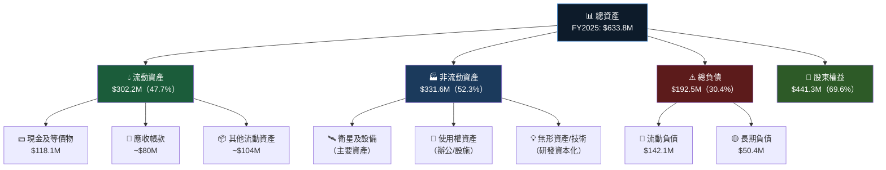

---

### 📊 資產配置 Unicode 橫條圖

```
資產結構演變（百萬美元）
━━━━━━━━━━━━━━━━━━━━━━━━━━━━━━━━━━━━━━━━━━━━━━━━━━━━━━━

FY2022 總資產 $821.4M
流動資產  $551.5M  ██████████████████████████████████████░░░░░  67.1%
非流動    $269.9M  ████████████████░░░░░░░░░░░░░░░░░░░░░░░░░░░  32.9%

FY2023 總資產 $752.7M
流動資產  $475.7M  ████████████████████████████████░░░░░░░░░░░  63.2%
非流動    $277.0M  ████████████████████░░░░░░░░░░░░░░░░░░░░░░░  36.8%

FY2024 總資產 $702.0M
流動資產  $370.2M  ████████████████████████████░░░░░░░░░░░░░░░  52.7%
非流動    $331.8M  █████████████████████████░░░░░░░░░░░░░░░░░░  47.3%

FY2025 總資產 $633.8M
流動資產  $302.2M  █████████████████████████░░░░░░░░░░░░░░░░░░  47.7%
非流動    $331.6M  ███████████████████████████░░░░░░░░░░░░░░░░  52.3%

━━━━━━━━━━━━━━━━━━━━━━━━━━━━━━━━━━━━━━━━━━━━━━━━━━━━━━━
⚠️ 警告：總資產持續縮減，從$821M降至$634M，反映現金消耗
```

---

### 💰 負債與流動性比率表格

| 流動性指標 | FY2022 | FY2023 | FY2024 | FY2025 | 評級 |
|-----------|--------|--------|--------|--------|------|
| 流動比率 | 4.18x | 3.89x | 2.71x | 2.13x | 🟡 下降但仍健康 |
| 總負債 | $0 | $22.0M | $24.9M | $21.6M | 🟢 低槓桿 |
| 負債/權益 | 0% | 3.8% | 4.8% | 4.9% | 🟢 保守財務 |
| 現金儲備 | $490.8M | $181.9M | $83.9M | $118.1M | 🟡 FY25小幅回升 |
| 流動負債 | $132.0M | $122.3M | $136.7M | $142.1M | 🟡 輕微增加 |
| 股東權益 | $648.3M | $576.1M | $518.0M | $441.3M | 🔴 持續侵蝕 |

> **⚠️ 重要提示**：D/E比率131.98%為TTM數據，與年報數據差異源於TTM計算基礎不同。

---

### 📉 股東權益趨勢 ASCII 圖

```
股東權益趨勢（百萬美元）
━━━━━━━━━━━━━━━━━━━━━━━━━━━━━━━━━━━━━━━━━━━━━━━━━━
$700M |  ●($648M)
      |   \
$600M |    \  ●($576M)
      |     \    \
$500M |      \    ●($518M)
      |       \        \
$400M |        \        ●($441M)  ◉(目前趨勢)
      |         \              \
$300M |          ───────────────→ ?
      |
$200M |
      ──────────────────────────────────────────
      FY2022   FY2023   FY2024   FY2025  FY2026E

📉 每年股東權益侵蝕約 $70-130M，主要因持續淨虧損
🔑 關鍵：需在股東權益耗盡前實現盈利
━━━━━━━━━━━━━━━━━━━━━━━━━━━━━━━━━━━━━━━━━━━━━━━━━━
```

---

## 5. 現金流量分析

### 💧 現金流瀑布圖

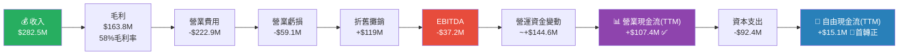

---

### 📊 自由現金流趨勢 Unicode 進度條

```
自由現金流趨勢（百萬美元）
━━━━━━━━━━━━━━━━━━━━━━━━━━━━━━━━━━━━━━━━━━━━━━━━━━

FY2022  -$57.1M  🔴 ████████████████████░░░░░░░░░░░░░░░░░░  深度負值
FY2023  -$86.7M  🔴 ██████████████████████████████░░░░░░░░  惡化
FY2024  -$93.1M  🔴 ████████████████████████████████░░░░░░  最差點
FY2025  -$68.8M  🟡 ████████████████████████░░░░░░░░░░░░░░  好轉
TTM    +$15.1M   🟢 ░░░░░░░░░░░░░░░░░░░░░▓▓▓▓▓░░░░░░░░░░  首次轉正！

負 ←────────────────────────── 0 ──────────────────────→ 正

💡 關鍵里程碑：TTM自由現金流首次轉正$+15.1M
   這是公司邁向財務可持續的重要信號
━━━━━━━━━━━━━━━━━━━━━━━━━━━━━━━━━━━━━━━━━━━━━━━━━━
```

---

### 💎 資本配置策略

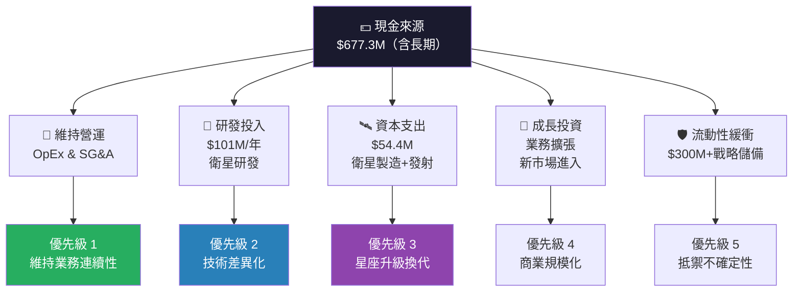

---

## 6. 獲利能力指標

### 📊 ROE/ROA/ROIC 對比表格

| 獲利指標 | Planet Labs(PL) | 航太行業均值 | 標普500均值 | 評級 | 解讀 |
|---------|----------------|------------|------------|------|------|
| ROE | -31.8% | 15.2% | 18.5% | 🔴 | 股東資金被侵蝕 |
| ROA | -5.4% | 5.8% | 7.2% | 🔴 | 資產使用效率低 |
| ROIC | 負值 | 12.3% | 11.8% | 🔴 | 尚未創造價值 |
| 毛利率 | 58.0% | 22.5% | 35.0% | 🟢 | SaaS級別優秀 |
| 營業利益率 | -20.9% | 8.5% | 12.0% | 🔴 | 仍在高投入期 |
| 淨利潤率 | -45.9% | 5.2% | 9.8% | 🔴 | 深度虧損 |
| EBITDA Margin | -13.2% | 12.8% | 16.5% | 🔴 | 負值 |

---

### 🎛️ 獲利能力儀表板


---

### 📈 獲利能力改善進度

```
各項指標改善進度（相對FY2022基準）
━━━━━━━━━━━━━━━━━━━━━━━━━━━━━━━━━━━━━━━━━━━━━━━━━━

毛利率改善    +21.2pp  ▓▓▓▓▓▓▓▓▓▓▓▓▓▓▓▓▓▓▓▓▓▓▓▓▓▓▓  🟢 優秀
營業虧損收窄  +77.1pp  ▓▓▓▓▓▓▓▓▓▓▓▓▓▓▓▓▓▓▓▓▓▓▓▓▓▓▓  🟢 優秀  
淨虧損收窄    +53.7pp  ▓▓▓▓▓▓▓▓▓▓▓▓▓▓▓▓▓▓▓▓░░░░░░░  🟡 良好
EBITDA改善    +43.9pp  ▓▓▓▓▓▓▓▓▓▓▓▓▓▓▓▓▓░░░░░░░░░░░  🟡 良好
FCF轉正進度   首轉正   ▓▓▓▓▓▓▓▓▓▓▓▓▓▓▓▓▓▓▓▓▓▓▓▓▓▓▓▓  🟢 里程碑

                0%          50%         100%（達標）
━━━━━━━━━━━━━━━━━━━━━━━━━━━━━━━━━━━━━━━━━━━━━━━━━━
```

---

## 7. 估值分析

### 💰 估值指標體系

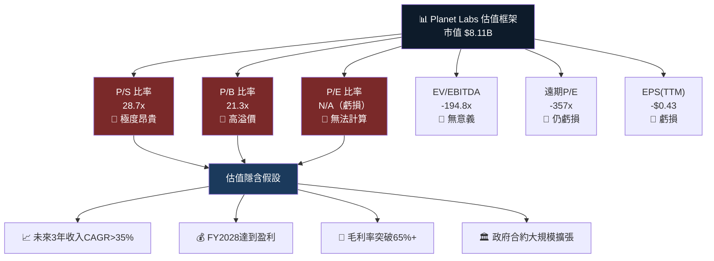

---

### 📊 估值倍數對比表格

| 估值指標 | PL | 行業均值 | 同類成長股均值 | 評級 | 說明 |
|---------|-----|---------|-------------|------|------|
| P/S(TTM) | 28.7x | 2.8x | 12.5x | 🔴 | 顯著高估 |
| P/B | 21.3x | 3.2x | 8.5x | 🔴 | 大幅溢價 |
| EV/EBITDA | -194.8x | 15.2x | 35x | 🔴 | 負值無意義 |
| P/E(FWD) | -357x | 22x | 45x | 🔴 | 虧損無意義 |
| EPS(TTM) | -$0.43 | +$2.15 | +$0.85 | 🔴 | 虧損 |
| EPS(FWD) | -$0.067 | +$2.50 | +$1.20 | 🟡 | 快速收窄 |
| 收入成長率 | 32.6% | 5.2% | 22.5% | 🟢 | 高速成長 |
| 毛利率 | 58.0% | 22.5% | 52.0% | 🟢 | 優於同業 |

---

### 🎯 情境目標股價分析

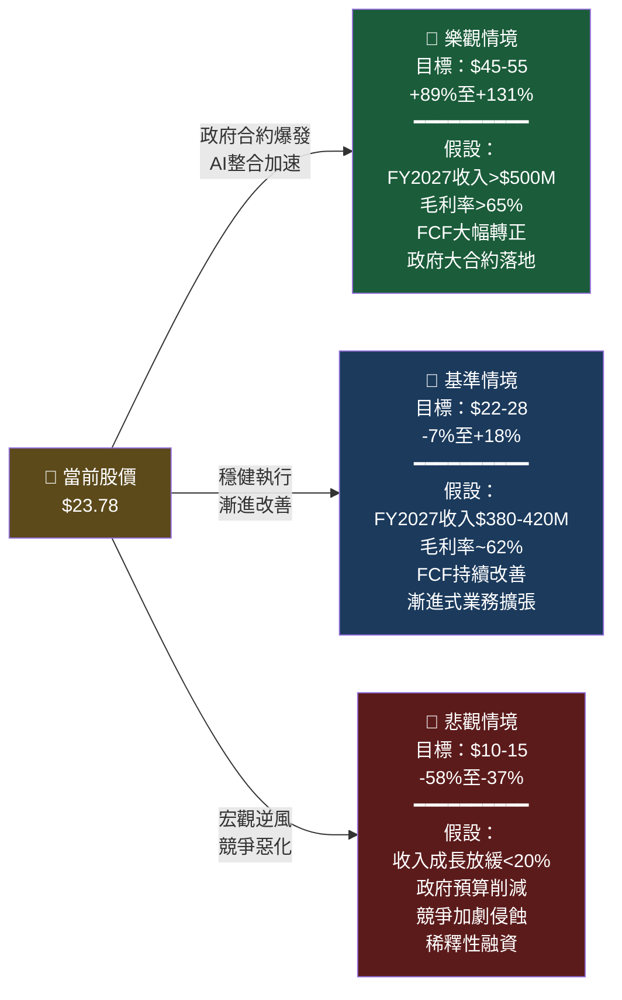

---

### 🏆 目標股價視覺化

```
目標股價區間分佈
━━━━━━━━━━━━━━━━━━━━━━━━━━━━━━━━━━━━━━━━━━━━━━━━━━━━━━

悲觀低點    $10  ├──────┤
分析師低目標 $16.4       ├─────────────────────────┤
    當前股價 $23.78 ◄══════════════════════════════════╗
分析師均目標 $24.71                             ├────────────────────────────────────┤
分析師高目標 $33.0                                                            ├───────────────────┤
樂觀情境    $45-55                                                                                     ├────────────────┤

$0      $10     $20     $30     $40     $50     $60
 ├────────┼────────┼────────┼────────┼────────┼────────┤

📌 當前股價 $23.78 已接近分析師均目標價 $24.71（上行空間+3.9%）
━━━━━━━━━━━━━━━━━━━━━━━━━━━━━━━━━━━━━━━━━━━━━━━━━━━━━━
```

---

## 8. 競爭護城河

### 🏰 Porter's Five Forces 分析

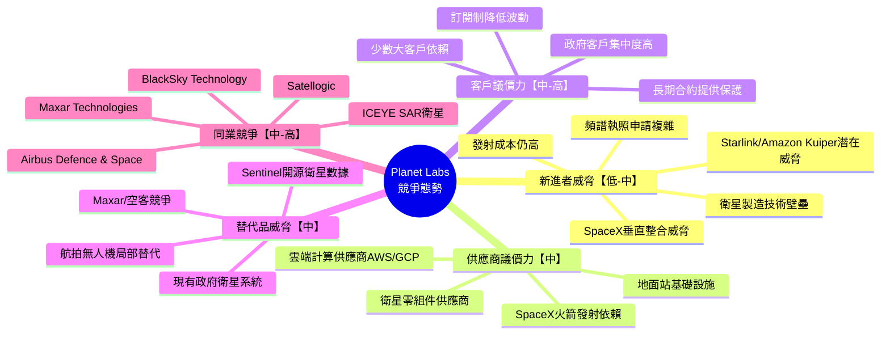

---

### 🏅 護城河評分 Unicode 條形圖

```
競爭護城河各維度評分（滿分10分）
━━━━━━━━━━━━━━━━━━━━━━━━━━━━━━━━━━━━━━━━━━━━━━━━━━━━━━━

衛星資產規模    9/10  ▓▓▓▓▓▓▓▓▓░  🟢 最強護城河，全球最大商業星座
數據時序獨特性  8/10  ▓▓▓▓▓▓▓▓░░  🟢 10年+歷史影像，競爭對手無法複製
技術平台        7/10  ▓▓▓▓▓▓▓░░░  🟢 API/SDK生態，客戶整合深度高
品牌與信譽      7/10  ▓▓▓▓▓▓▓░░░  🟢 NASA背景，政府信任度高
客戶黏著性      7/10  ▓▓▓▓▓▓▓░░░  🟢 訂閱制，轉換成本較高
成本競爭力      5/10  ▓▓▓▓▓░░░░░  🟡 規模擴大中，尚未實現規模優勢
財務實力        4/10  ▓▓▓▓░░░░░░  🟡 現金消耗，需持續融資
盈利能力        2/10  ▓▓░░░░░░░░  🔴 持續虧損，護城河建設成本高

━━━━━━━━━━━━━━━━━━━━━━━━━━━━━━━━━━━━━━━━━━━━━━━━━━━━━━━
整體護城河評分：★★★☆☆（資產護城河強，財務護城河弱）
```

---

### 🎯 競爭定位矩陣

| 競爭維度 | Planet Labs | Maxar | BlackSky | Satellogic | 空客地球觀測 |
|---------|------------|-------|---------|------------|------------|
| 衛星數量 | 🟢 200+ | 🟡 15-20 | 🟡 16 | 🟡 30+ | 🟡 ~20 |
| 解析度 | 🟡 0.3-3m | 🟢 0.3m | 🟢 0.9m | 🟡 1m | 🟢 0.5m |
| 重訪頻率 | 🟢 每日 | 🔴 按需 | 🟡 每日 | 🟡 每日 | 🔴 按需 |
| 平台成熟度 | 🟢 領先 | 🟡 中等 | 🟡 中等 | 🔴 初期 | 🟡 中等 |
| 財務實力 | 🔴 虧損 | 🟡 虧損 | 🔴 虧損 | 🔴 虧損 | 🟢 盈利 |
| 政府關係 | 🟢 強 | 🟢 極強 | 🟡 中等 | 🔴 弱 | 🟢 強 |
| 高光譜能力 | 🟢 Tanager | 🔴 無 | 🔴 無 | 🔴 無 | 🟡 部分 |

---

## 9. 成長催化劑

### 📅 催化劑時間軸

```mermaid
gantt
    title Planet Labs 成長催化劑時間軸（2026-2028）
    dateFormat  YYYY-Q
    section 政府合約
    NRO合約續簽談判     :active, 2026-Q1, 2026-Q2
    NATO盟友擴展合約    :2026-Q2, 2026-Q4
    GEOINT政府新合約    :2026-Q3, 2027-Q2
    歐盟哨兵替代計畫    :2027-Q1, 2027-Q4

    section 產品發展
    Pelican衛星部署完成 :crit, 2026-Q1, 2026-Q3
    Tanager商業化落地   :2026-Q2, 2026-Q4
    AI分析產品升級      :2026-Q1, 2026-Q4
    Planetary Variables擴展 :2026-Q3, 2027-Q2

    section 財務里程碑
    EBITDA轉正          :milestone, 2027-Q1, 2027-Q2
    營業利益轉正        :milestone, 2027-Q3, 2027-Q4
    FCF持續正值         :2027-Q1, 2028-Q4
    全年淨利轉正        :milestone, 2028-Q1, 2028-Q4

    section 市場擴張
    農業科技整合深化    :2026-Q1, 2026-Q4
    保險業數據需求      :2026-Q2, 2027-Q2
    碳市場監測服務      :2026-Q3, 2027-Q4
    新興市場政府推廣    :2027-Q1, 2028-Q4
```

---

### 🚀 短/中/長期機會

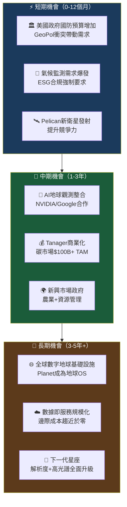

---

### 📏 TAM 市場規模分析

```
TAM 市場規模視覺化（十億美元）
━━━━━━━━━━━━━━━━━━━━━━━━━━━━━━━━━━━━━━━━━━━━━━━━━━━━━━━

地球觀測市場(2030E)
總TAM          $12.0B  ████████████████████████████████████████  100%
可服務市場SAM  $4.5B   ███████████████░░░░░░░░░░░░░░░░░░░░░░░░░   38%
PL當前佔有     $0.28B  █░░░░░░░░░░░░░░░░░░░░░░░░░░░░░░░░░░░░░░    2%
PL目標份額     $1.0B   ████░░░░░░░░░░░░░░░░░░░░░░░░░░░░░░░░░░░░    8%

碳信用/ESG監測市場(2030E)
總TAM          $50.0B  ████████████████████████████████████████  100%
高光譜機會      $5.0B  ████░░░░░░░░░░░░░░░░░░░░░░░░░░░░░░░░░░░░   10%
Tanager目標     $0.5B  ░░░░░░░░░░░░░░░░░░░░░░░░░░░░░░░░░░░░░░░░    1%

AI驅動地理分析(2030E)
總TAM          $8.0B   ████████████████████████████████████████  100%
PL可服務市場   $2.0B   ██████████░░░░░░░░░░░░░░░░░░░░░░░░░░░░░░   25%

━━━━━━━━━━━━━━━━━━━━━━━━━━━━━━━━━━━━━━━━━━━━━━━━━━━━━━━
💡 合計可觸達市場（SAM）約 $11.5B，PL目前僅滲透<3%
   巨大的成長空間支撐高估值倍數的部分合理性
```

---

## 10. 風險分析

### ⚠️ 風險矩陣

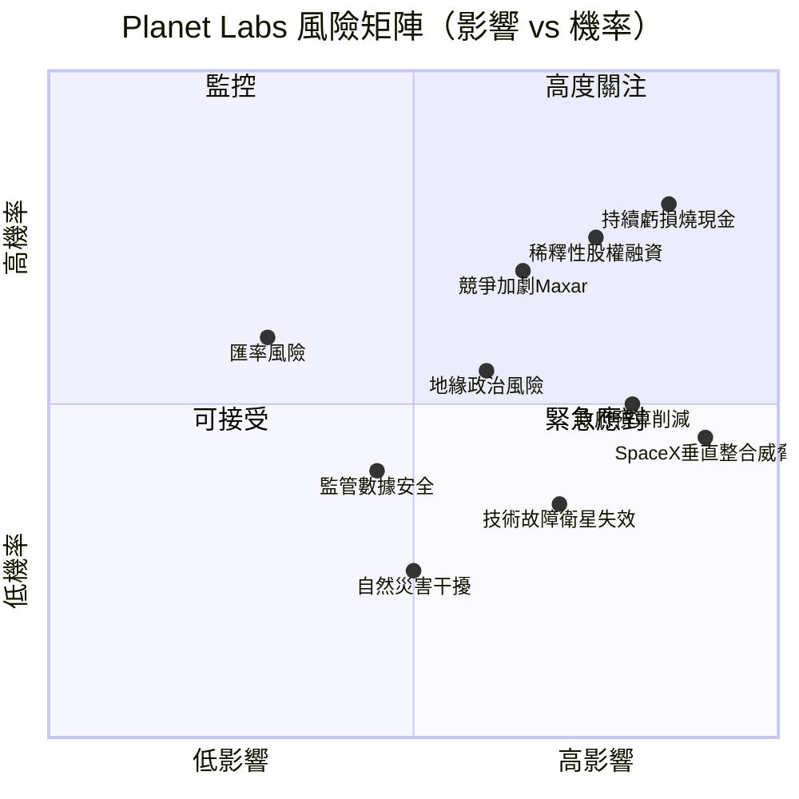

---

### 📊 風險評分卡

| 風險類別 | 具體風險 | 機率 | 影響度 | 綜合評分 | 評級 |
|---------|---------|------|--------|---------|------|
| 💸 財務風險 | 現金耗盡，需再融資 | 65% | 高 | 8.5/10 | 🔴 |
| 📉 財務風險 | 稀釋性股票增發 | 70% | 高 | 8.0/10 | 🔴 |
| 🏛️ 政策風險 | 美國政府預算大幅削減 | 45% | 極高 | 7.5/10 | 🔴 |
| 🚀 競爭風險 | SpaceX垂直整合地球觀測 | 40% | 極高 | 7.0/10 | 🔴 |
| 🛰️ 技術風險 | 大規模衛星故障/失聯 | 30% | 高 | 6.0/10 | 🟡 |
| 🌐 競爭風險 | Maxar/BlackSky搶奪合約 | 65% | 中 | 5.5/10 | 🟡 |
| 📋 監管風險 | 數據主權/隱私監管收緊 | 40% | 中 | 4.5/10 | 🟡 |
| 🌍 地緣風險 | 地緣衝突影響衛星運營 | 50% | 中 | 4.5/10 | 🟡 |
| 💱 市場風險 | 利率上升壓縮成長股估值 | 35% | 中 | 4.0/10 | 🟡 |
| 📡 技術風險 | 射頻干擾/網路攻擊 | 25% | 低 | 2.5/10 | 🟢 |

---

### 🛡️ 風險緩解措施

```
風險緩解策略清單
━━━━━━━━━━━━━━━━━━━━━━━━━━━━━━━━━━━━━━━━━━━━━━━━━━

🔴 財務風險緩解：
   ├─ 📊 當前現金$677M，可維持運營18-24個月以上
   ├─ 🔄 積極推進運營效率，TTM FCF首次轉正
   ├─ 📉 研發費用從$116M削減至$101M，顯示成本意識
   └─ 💰 政府長期合約提供穩定現金流基礎

🟡 競爭風險緩解：
   ├─ 🛰️ 200+顆衛星的重訪頻率壁壘，競爭對手5-10年難複製
   ├─ 📅 10年+歷史影像時序數據，訓練AI的獨特資產
   ├─ 🌈 Tanager高光譜差異化，進入ESG監測藍海市場
   └─ 🔗 深度API整合，客戶轉換成本高

🟡 政策風險緩解：
   ├─ 🌍 國際化收入分散，降低單一市場依賴
   ├─ 🏛️ NATO等多國政府合約，分散美國政策風險
   └─ 🌱 ESG/氣候監測需求跨黨派支持，相對政治中立

🟢 技術風險緩解：
   ├─ 🛰️ 衛星分散在多個軌道，單一故障影響有限
   ├─ 🔄 持續補充新衛星，維持星座完整性
   └─ 🛡️ 地面站冗餘備份，確保數據連續性
━━━━━━━━━━━━━━━━━━━━━━━━━━━━━━━━━━━━━━━━━━━━━━━━━━
```

---

## 11. 公平價值估算

### 💡 DCF 模型框架

```mermaid
graph LR
    subgraph Assumptions ["📋 DCF關鍵假設"]
        A1["基礎收入：$282.5M(TTM)"]
        A2["收入CAGR：30%（Y1-3）<br/>20%（Y4-5）<br/>12%（Y6-10）"]
        A3["目標毛利率：65%（Y3）<br/>70%（Y5+）"]
        A4["目標營業利益率：<br/>15%（Y5）→ 25%（Y10）"]
        A5["折現率WACC：12%"]
        A6["終值成長率：3.5%"]
    end
    
    subgraph Projection ["📈 收入預測"]
        P1["FY2026E：$370M"]
        P2["FY2027E：$481M"]
        P3["FY2028E：$625M"]
        P4["FY2030E：$900M"]
        P5["FY2031-35：穩健成長"]
    end
    
    subgraph Result ["🎯 估值結果"]
        R1["FCF折現值總和：<br/>~$1.2B"]
        R2["終值折現值：<br/>~$4.8B"]
        R3["企業價值EV：<br/>~$6.0B"]
        R4["加：淨現金 +$216M"]
        R5["股權價值：~$6.2B"]
        R6["每股目標價：<br/>~$19.5-22"]
    end
    
    Assumptions --> Projection
    Projection --> Result

    style Assumptions fill:#1b3a5c,color:#fff
    style Projection fill:#1b5c3a,color:#fff
    style Result fill:#5c3a1b,color:#fff
```

---

### 📊 三種估值法比較

| 估值方法 | 估值依據 | 估算市值 | 每股估值 | 相對當前溢折 | 評級 |
|---------|---------|---------|---------|------------|------|
| **DCF 折現現金流** | WACC 12%，CAGR 30% | ~$62億 | ~$19.5-22 | -8% 至 -18% | 🔴 輕微高估 |
| **P/S 倍數法** | 同類成長股20x P/S，FY2027E收入 | ~$96億 | ~$30 | +26%上行空間 | 🟡 合理目標 |
| **EV/Revenue法** | 15x EV/Rev（FY2027E） | ~$72億 | ~$22.6 | -5% | 🟡 接近合理 |
| **分析師共識目標** | 9位分析師均值 | — | $24.71 | +3.9% | 🟡 略有上行 |
| **悲觀情境** | 收入成長放緩，P/S=12x | ~$34億 | ~$10.7 | -55% | 🔴 下行風險大 |

---

### 📏 估值區間視覺化

```
公平價值估算區間（每股美元）
━━━━━━━━━━━━━━━━━━━━━━━━━━━━━━━━━━━━━━━━━━━━━━━━━━━━━━━━━

DCF估值        $19.5-22  ├──────────────┤
                                      ↑當前$23.78
EV/Rev法       $22.6     ├──────────────────┤
分析師均目標   $24.71         ├────────────────────┤
P/S倍數法      $28-32              ├────────────────────────────┤
樂觀情境       $45-55                                ├─────────────────────────────────┤

$5    $10    $15    $20    $25    $30    $35    $40    $45    $55
 ├─────┼──────┼──────┼──────┼──────┼──────┼──────┼──────┼──────┤
                            ▲
                         $23.78
                       當前股價
                       
📌 中性估值區間：$19.5-28（當前股價處於區間中上部）
📌 結論：當前估值已反映大量樂觀預期，安全邊際有限
━━━━━━━━━━━━━━━━━━━━━━━━━━━━━━━━━━━━━━━━━━━━━━━━━━━━━━━━━
```

---

## 12. 投資建議

### 🎯 最終評級

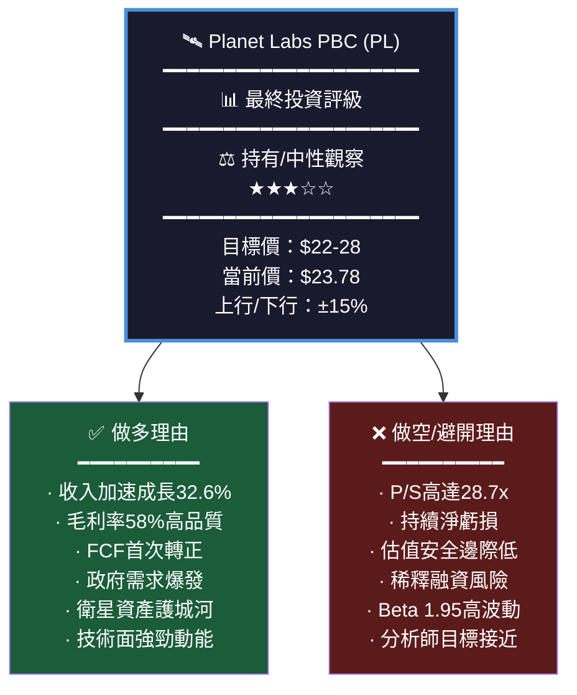

---

### 👥 投資人適配度分析

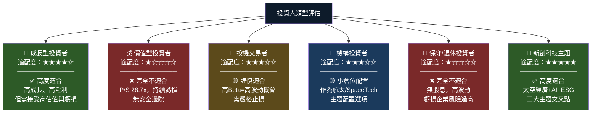

---

### ✅ 關鍵監控指標 Checklist

```
🔍 Planet Labs 投資監控清單
━━━━━━━━━━━━━━━━━━━━━━━━━━━━━━━━━━━━━━━━━━━━━━━━━━━━━━━

📊 財務健康監控（每季檢視）
  ☐ 季度收入是否維持>25% YoY成長
  ☐ 毛利率是否繼續向60%+方向改善
  ☐ 營業利益率虧損是否持續收窄
  ☐ 自由現金流是否維持正值趨勢
  ☐ 現金儲備是否保持>$400M安全水位
  ☐ 客戶保留率（NRR）是否>100%

🚀 業務發展監控（每季檢視）
  ☐ 政府合約總價值（TCV）是否成長
  ☐ Pelican衛星部署進度是否達標
  ☐ Tanager商業客戶數量增長
  ☐ API日活用量/平台使用率趨勢
  ☐ 新增企業客戶數量

⚠️ 風險警示指標（即時監控）
  ☐ 🔴 若現金<$300M，評估稀釋融資風險
  ☐ 🔴 若季度收入成長<20%，重新評估估值
  ☐ 🔴 若SpaceX宣布進入地球觀測，立即重估
  ☐ 🔴 若美國政府削減航太預算，評估影響
  ☐ 🟡 若Beta持續>2.0，調整倉位大小
  ☐ 🟡 若大型法人集中拋售，追蹤原因

🎯 買入/加碼觸發條件
  ☑ 股價回落至$18-20支撐區間
  ☑ 連續2季FCF為正值確認
  ☑ 大型政府合約公告（>$50M）
  ☑ 毛利率突破62%顯示規模效益
  ☑ 啟動股票回購計畫

🚪 減倉/出場觸發條件
  ☑ 股價突破$35+（超越合理估值上限）
  ☑ 連續3季收入成長<20%
  ☑ 稀釋性股份增發超過10%
  ☑ 失去重要政府合約（>$30M）
  ☑ 主要競爭對手技術突破性超越

━━━━━━━━━━━━━━━━━━━━━━━━━━━━━━━━━━━━━━━━━━━━━━━━━━━━━━━
```

---

### 📊 最終綜合評分卡

```
Planet Labs (PL) 綜合投資評分卡
━━━━━━━━━━━━━━━━━━━━━━━━━━━━━━━━━━━━━━━━━━━━━━━━━━━━━━━

維度          評分         視覺化評分條
━━━━━━━━━━━━━━━━━━━━━━━━━━━━━━━━━━━━━━━━━━━━━━━━━━━━━━━

收入成長       9/10  ▓▓▓▓▓▓▓▓▓░  🟢 32.6% YoY，加速趨勢
毛利率品質     8/10  ▓▓▓▓▓▓▓▓░░  🟢 58%，SaaS級別
市場定位       8/10  ▓▓▓▓▓▓▓▓░░  🟢 全球最大商業星座
技術護城河     7/10  ▓▓▓▓▓▓▓░░░  🟢 難以複製的資產
管理執行力     6/10  ▓▓▓▓▓▓░░░░  🟡 虧損收窄顯示進步
財務健康度     5/10  ▓▓▓▓▓░░░░░  🟡 FCF轉正但仍需觀察
估值合理性     3/10  ▓▓▓░░░░░░░  🔴 P/S 28.7x偏高
盈利能力       2/10  ▓▓░░░░░░░░  🔴 持續虧損中
股東回報       1/10  ▓░░░░░░░░░  🔴 無股息，淨虧損

━