# PL 基本面深度分析報告
> **報告日期**：2026-02-25 ｜ **分析師**：AI量化研究部 ｜ **數據來源**：Yahoo Finance ｜ **股票代號**：PL（Planet Labs PBC）

---

## 目錄

1. [執行摘要](#1-執行摘要)
2. [公司概覽與商業模式](#2-公司概覽與商業模式)
3. [損益表深度分析](#3-損益表深度分析)
4. [資產負債表分析](#4-資產負債表分析)
5. [現金流量深度分析](#5-現金流量深度分析)
6. [獲利能力與資本效率](#6-獲利能力與資本效率)
7. [估值深度分析](#7-估值深度分析)
8. [成長催化劑](#8-成長催化劑)
9. [風險矩陣](#9-風險矩陣)
10. [投資建議](#10-投資建議)

---

## 1. 執行摘要

### 🎯 核心評分儀表板

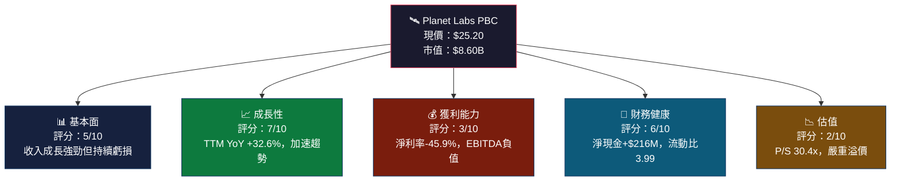

---

### 📊 5大投資論點 + 3大風險

| 類型 | 項目 | 具體依據 | 評級 |
|:----:|:-----|:---------|:----:|
| 🟢 多頭論點1 | **收入加速成長** | TTM收入$282.46M，YoY +32.6%；季度收入從$61.55M增至$81.25M（QoQ+31.9%） | 🟢 |
| 🟢 多頭論點2 | **毛利率持續改善** | 毛利率從2022年36.7%→2023年49.2%→2024年51.2%→2025年57.2%，向SaaS水平靠攏 | 🟢 |
| 🟢 多頭論點3 | **淨現金正向** | 現金$677.32M，負債$461.35M，淨現金+$215.97M，流動性充裕 | 🟢 |
| 🟢 多頭論點4 | **國防/政府需求爆發** | NRO、NATO等政府合約佔收入比重提升，地緣政治緊張推升衛星偵察需求 | 🟢 |
| 🟢 多頭論點5 | **機構持股高達73.4%** | 機構認可度高，分析師9人評級為Buy，目標均價$24.71 | 🟡 |
| 🔴 風險1 | **持續鉅額虧損** | TTM淨損$-129.5M，EPS(TTM)=-$0.43，盈利時間點不明確 | 🔴 |
| 🔴 風險2 | **估值嚴重透支** | P/S=30.4x，EV/Rev=26.7x，現價相較分析師目標均價$24.71仍有溢價 | 🔴 |
| 🟡 風險3 | **競爭加劇** | Maxar、Satellogic、BlackSky等競爭者搶食市場，SpaceX Starshield潛在威脅 | 🟡 |

---

### 📋 快速統計卡片

| 指標 | PL數值 | 行業均值 | 對比 |
|:-----|:------:|:--------:|:----:|
| 收入成長(YoY) | **+32.6%** | ~15% | 🟢 大幅超越 |
| 毛利率 | **58.0%** | ~40% | 🟢 優秀 |
| 營業利益率 | **-20.9%** | ~8% | 🔴 嚴重落後 |
| 淨利率 | **-45.9%** | ~5% | 🔴 嚴重落後 |
| 流動比 | **3.99x** | ~1.5x | 🟢 充足 |
| 負債/股東權益 | **131.98%** | ~50% | 🔴 偏高 |
| P/S比 | **30.4x** | ~4x | 🔴 極度溢價 |
| FCF Yield | **0.18%** | ~3% | 🔴 極低 |
| Beta | **1.952** | ~1.0 | 🟡 高波動 |
| 市值 | **$8.60B** | - | - |

---

### 🏁 投資結論

```
╔══════════════════════════════════════════════════════════════╗
║  投資評級：⚠️  謹慎買入（Speculative Buy）                    ║
║  目標價區間：$20.00（悲觀）/ $26.00（基準）/ $35.00（樂觀）   ║
║  當前股價：$25.20  隱含報酬率（基準）：+3.2%                  ║
║  風險承受：適合高風險承受能力之成長型投資人                    ║
╚══════════════════════════════════════════════════════════════╝
```

> **評論**：Planet Labs 是一家具備真實商業價值的衛星數據公司，收入成長加速且毛利率趨勢改善令人鼓舞，然而在 P/S 高達 30x 的估值水準下，盈利時間軸不確定性構成重大估值風險。股價在過去12個月從$2.19飆升至$25.20（+1050%），大量利多已被定價。僅適合能承受高波動、長期持有的投資人。

---

## 2. 公司概覽與商業模式

### 🏗️ 業務結構與收入來源

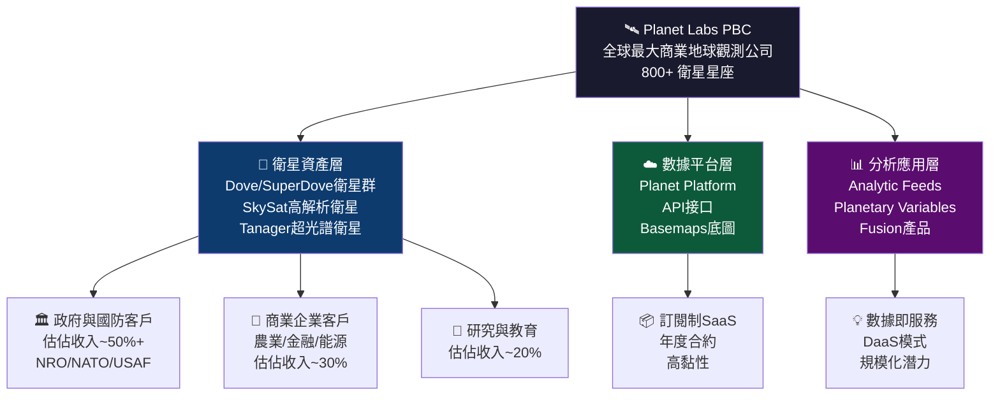

---

### 🌍 市場地位估算

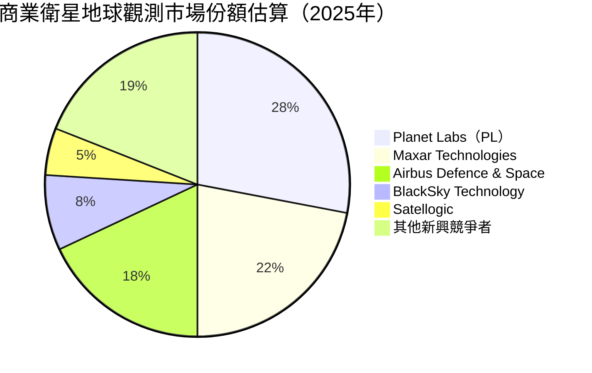

---

### 🏰 競爭護城河分析

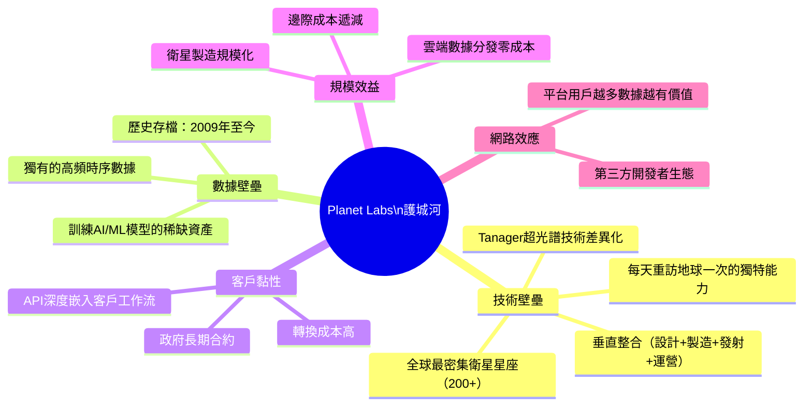

---

### 💪 護城河強度評分

```
護城河評分（滿分 10 分）

技術壁壘    ████████░░  8/10  🟢 衛星星座密度全球第一
數據資產    ████████░░  8/10  🟢 15年歷史存檔無可複製
客戶黏性    ███████░░░  7/10  🟢 政府合約+API整合
規模效益    █████░░░░░  5/10  🟡 仍需擴大規模降低成本
網路效應    ████░░░░░░  4/10  🟡 平台效應尚在建立中
品牌聲譽    ██████░░░░  6/10  🟡 B2B市場認知度高
財務護城河  ██░░░░░░░░  2/10  🔴 持續燒錢，護城河脆弱

整體護城河  █████░░░░░  5.7/10 🟡 中等護城河，技術面強但財務面弱
```

---

## 3. 損益表深度分析

### 📈 年度收入成長趨勢（近4年）

```
年度收入絕對值與YoY成長率

2022年  $131.21M  ████████████░░░░░░░░░░░░░░░░░░  基準年
2023年  $191.26M  ██████████████████░░░░░░░░░░░░  YoY +45.8% 🟢
2024年  $220.70M  █████████████████████░░░░░░░░░  YoY +15.4% 🟡
2025年  $244.35M  ███████████████████████░░░░░░░  YoY +10.7% 🟡
TTM     $282.46M  ███████████████████████████░░░  YoY +32.6% 🟢（加速！）

每格約等於 $4.5M
```

> **關鍵觀察**：2024財年（FY2024）成長率曾降至+15.4%，引發市場擔憂。但TTM數據顯示成長重新加速至+32.6%，主要驅動力為政府/國防合約放量及新產品線貢獻。

---

### 📊 季度收入趨勢（近4季）

| 季度 | 收入 | QoQ成長 | 毛利 | 毛利率 | 備註 |
|:-----|:----:|:-------:|:----:|:------:|:-----|
| 2025-Q1（Jan） | $61.55M | 基準 | $38.22M | 62.1% | 🟡 季度基準 |
| 2025-Q2（Apr） | $66.27M | **+7.7%** | $36.60M | 55.2% | 🟡 毛利率下滑 |
| 2025-Q3（Jul） | $73.39M | **+10.7%** | $42.27M | 57.6% | 🟢 恢復改善 |
| 2025-Q4（Oct） | $81.25M | **+10.7%** | $46.58M | 57.3% | 🟢 連續加速 |

**季度YoY對比（估算）**：

```
季度收入 QoQ加速趨勢

Q1 FY2026  $61.55M → Q2 $66.27M → Q3 $73.39M → Q4 $81.25M

成長軌跡：
+$4.72M    +$7.12M    +$7.86M
( +7.7% )  ( +10.7% ) ( +10.7% )

▶ 連續3季QoQ加速，加速度穩定，呈現健康成長形態 🟢
```

---

### 💹 利潤率演變趨勢（近4年）

| 財年 | 毛利率 | 營業利益率 | EBITDA率 | 淨利率 | 趨勢 |
|:----:|:------:|:---------:|:--------:|:------:|:----:|
| FY2022（Jan） | **36.7%** | -97.6% | -61.9% | -104.5% | 🔴 |
| FY2023（Jan） | **49.2%** | -91.9% | -69.2% | -84.7% | 🔴→🟡 |
| FY2024（Jan） | **51.2%** | -76.9% | -55.3% | -63.7% | 🟡 改善中 |
| FY2025（Jan） | **57.2%** | -47.5% | -28.8% | -50.4% | 🟢 大幅改善 |
| TTM（現況） | **58.0%** | -20.9% | -13.2% | -45.9% | 🟢 持續改善 |

> **利潤率改善分析**：
> - **毛利率**：從36.7%→58.0%，主要因衛星製造成本下降、數據分發邊際成本趨零，以及高毛利訂閱收入占比提升
> - **營業利益率**：從-97.6%→-20.9%，R&D費用從$116.34M降至$101.01M，費用槓桿顯現
> - **淨利率**仍重度虧損：含非現金折舊攤銷及股票薪酬（SBC）影響顯著

---

### 🔬 費用結構分析

```mermaid
pie title 費用結構（TTM，佔收入比例）
    "銷售成本（COGS）42%" : 42
    "研發費用（R&D）36%" : 36
    "銷管費用（SGA）23%" : 23
    "其他費用/收入（-1%）" : -1
```

```
費用結構細化（FY2025，佔總收入比）

銷售成本  42.8%  ████████████████████████░░░░░░░  $104.63M
研發費用  41.3%  ████████████████████░░░░░░░░░░░  $101.01M
銷管費用  約16%  █████████░░░░░░░░░░░░░░░░░░░░░░  ~$39.10M

R&D佔收入比：
FY2022  50.8%  ████████████████████████████░░░░
FY2023  58.0%  ██████████████████████████████░░
FY2024  52.7%  ████████████████████████████░░░░
FY2025  41.3%  ████████████████████████░░░░░░░░  ← 費用率下降 🟢
```

---

### 📉 EPS趨勢與盈餘品質

| 季度 | EPS預估 | EPS實際 | 驚喜幅度 | 評估 |
|:-----|:-------:|:-------:|:--------:|:-----|
| Q4 FY2026（Oct '25） | NaN | 虧損估-$0.18 | 數據缺失 | ❌ 無法評估 |
| Q3 FY2026（Jul '25） | NaN | 虧損估-$0.07 | 數據缺失 | ❌ 無法評估 |
| Q2 FY2026（Apr '25） | NaN | 虧損估-$0.04 | 數據缺失 | ❌ 無法評估 |
| Q1 FY2026（Jan '25） | NaN | 虧損估-$0.11 | 數據缺失 | ❌ 無法評估 |

```
EPS趨勢分析（估算值，基於淨損/稀釋股數）

FY2022  EPS: ~-$0.52  ██████████████████████████░░░░  最差期
FY2023  EPS: ~-$0.56  ████████████████████████████░░  虧損擴大
FY2024  EPS: ~-$0.46  ███████████████████████░░░░░░░  開始收窄
FY2025  EPS: ~-$0.41  █████████████████████░░░░░░░░░  持續改善
Forward EPS: ~-$0.07  ████░░░░░░░░░░░░░░░░░░░░░░░░░░  顯著收窄 🟢

▶ EPS虧損幅度持續縮窄，盈利趨勢明確但時間軸仍不確定
```

> **盈餘品質警示**：Q4 FY2026淨損$59.19M遠超Q3的$22.59M，主要因非現金項目（衛星折舊加速、股票薪酬費用攀升）所致，**非現金費用可能扭曲單季EPS表現**。

---

## 4. 資產負債表分析

### 🏗️ 資產結構

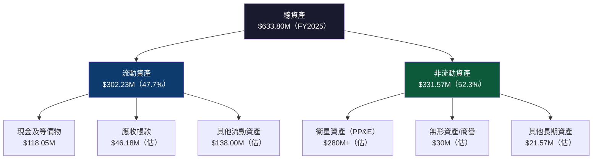

---

### 💧 流動性指標

| 指標 | FY2022 | FY2023 | FY2024 | FY2025 | 行業均值 | 評級 |
|:-----|:------:|:------:|:------:|:------:|:--------:|:----:|
| 流動比率 | 4.18x | 3.89x | 2.71x | **3.99x** | 1.5x | 🟢 |
| 速動比率 | ~4.00x | ~3.70x | ~2.60x | **3.84x** | 1.2x | 🟢 |
| 現金比率 | 3.72x | 1.49x | 0.61x | **0.83x** | 0.5x | 🟢 |
| 現金及等價物 | $490.76M | $181.89M | $83.87M | $118.05M | - | 🟡 |

> **注意**：現金從FY2022的$490.76M大幅下降至FY2025的$118.05M（-75.9%），但TTM數據顯示現金回升至$677.32M（含短期投資），反映近期可能進行融資活動。

---

### 🏦 債務結構分析

```
債務概況（最新數據，2026-02-25）

總現金         $677.32M  ████████████████████████████████
總負債         $461.35M  ████████████████████░░░░░░░░░░░░
淨現金（正值）  $215.97M  ██████████░░░░░░░░░░░░░░░░░░░░░░

長期負債：$21.61M（FY2025年報），相對資產規模極低
短期負債：含租約、遞延收入等

Debt/EBITDA：無法計算（EBITDA為負值）
Debt/Equity：131.98%  ← 主要受股東權益侵蝕影響 🔴

淨負債評級：淨現金正向 🟢（流動性風險低）
```

| 債務指標 | 數值 | 評估 |
|:---------|:----:|:----:|
| 總負債 | $461.35M | 🟡 |
| 淨現金 | +$215.97M | 🟢 正值 |
| 負債/股東權益 | 131.98% | 🔴 偏高 |
| 利息覆蓋率 | 負值（無法計算） | 🔴 |
| 流動負債 | $142.08M | 🟢 可控 |

---

### 📊 股東權益趨勢

```
股東權益演變（單位：百萬美元）

FY2022  $648.25M  ████████████████████████████████  頂峰（SPAC上市後）
FY2023  $576.10M  ████████████████████████████░░░░  -11.1% YoY 🟡
FY2024  $518.02M  ██████████████████████████░░░░░░  -10.1% YoY 🔴
FY2025  $441.29M  ██████████████████████░░░░░░░░░░  -14.8% YoY 🔴

▶ 股東權益持續侵蝕，因累積虧損消耗資本
▶ 帳面價值/股：$441.29M ÷ 317.6M股 = $1.39/股
▶ 目前P/B = 22.6x，股價嚴重溢於帳面值
```

---

## 5. 現金流量深度分析

### 🌊 現金流量瀑布圖

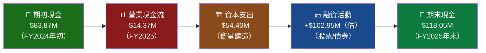

---

### 📈 FCF轉換率趨勢

| 財年 | 淨損 | 營業現金流 | 資本支出 | 自由現金流 | FCF/淨損轉換率 |
|:-----|:----:|:---------:|:--------:|:---------:|:--------------:|
| FY2022 | -$137.12M | -$42.21M | -$14.93M | **-$57.14M** | 41.7% | 
| FY2023 | -$161.97M | -$73.93M | -$12.76M | **-$86.69M** | 53.5% |
| FY2024 | -$140.51M | -$50.71M | -$42.41M | **-$93.12M** | 66.3% |
| FY2025 | -$123.20M | -$14.37M | -$54.40M | **-$68.78M** | 55.8% |
| TTM | -$129.5M（估） | +$107.42M | -$92.35M（估） | **+$15.07M** | 🟢 **翻正！** |

---

### 💰 自由現金流趨勢

```
自由現金流趨勢（單位：百萬美元）

FY2022  -$57.14M  🔴 ████████████░░░░░░░░  燒錢加速
FY2023  -$86.69M  🔴 █████████████████░░░  最差期
FY2024  -$93.12M  🔴 ███████████████████░  資本支出激增
FY2025  -$68.78M  🟡 ██████████████░░░░░░  改善中
TTM     +$15.07M  🟢 ███░░░░░░░░░░░░░░░░░  首次轉正！✨

▶ FCF首次轉正是重要里程碑
▶ 但FCF僅$15.07M，FCF Yield僅0.18%，仍極低
▶ 主因：營業現金流TTM+$107.42M大幅改善
```

---

### 💼 資本配置評估

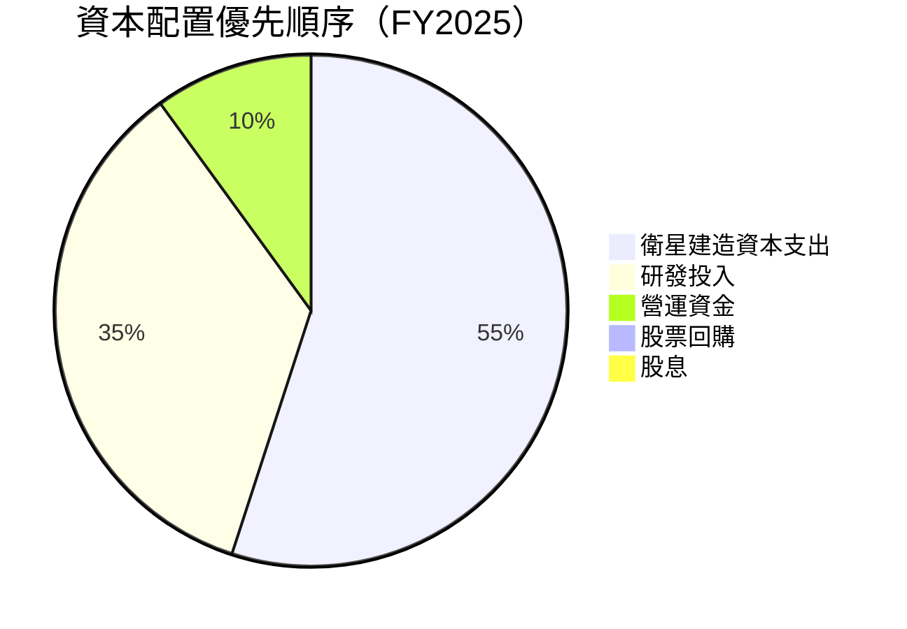

> **資本配置評分**：🟡 6/10
> - ✅ 無股息，現金投入增長，符合成長公司特徵
> - ✅ 資本支出聚焦衛星建設，強化競爭壁壘
> - ❌ 尚無股票回購計劃（股東利益回報有限）
> - ❌ 高股票薪酬（SBC）稀釋股東權益

---

## 6. 獲利能力與資本效率

### 📊 ROE / ROA / ROIC 趨勢

| 指標 | FY2022 | FY2023 | FY2024 | FY2025 | TTM | 行業均值 |
|:-----|:------:|:------:|:------:|:------:|:---:|:--------:|
| ROE | -21.2% | -28.1% | -27.1% | -27.9% | **-31.8%** | +12% | 🔴 |
| ROA | -16.7% | -21.5% | -20.0% | -19.4% | **-5.4%** | +5% | 🔴 |
| ROIC（估）| ~-20% | ~-25% | ~-23% | ~-22% | **~-18%** | +10% | 🔴 |

> **改善信號**：ROA TTM數值-5.4%相較FY2024的-20%顯著改善，反映資產利用效率提升及營業損失收窄。

---

### ⚖️ ROIC vs WACC 分析

```
WACC 估算（Planet Labs PBC）

無風險利率（10Y美債）：  4.4%
Beta：                  1.952
股票風險溢價（ERP）：    5.5%
股票成本（Ke）：         4.4% + 1.952 × 5.5% = 15.1%
負債成本（Kd，稅後）：   ~3.5%（低利率負債，稅前~5%×(1-30%)）
資本結構（E/V）：        ~85%（淨現金正向）
資本結構（D/V）：        ~15%

WACC = 85% × 15.1% + 15% × 3.5% = 12.84% + 0.53% ≈ 13.4%

ROIC（TTM估算）：~ -18% ～ -10%（依不同口徑）

╔══════════════════════════════════════════════╗
║  ROIC ≈ -10% to -18%  <<  WACC ≈ 13.4%     ║
║                                              ║
║  EVA（經濟附加值）= 負值，公司正在          ║
║  🔴 摧毀股東價值（Destroying Value）        ║
╚══════════════════════════════════════════════╝

差距：約 -23% to -31%（ROIC - WACC）
隱含：每投入$1資本，摧毀約$0.23-$0.31經濟價值

▶ 需要ROIC至少達+13.4%才能停止價值摧毀
▶ 估算需要收入達$450M-$550M（假設維持目前費用結構）
▶ 基於TTM+32.6%成長率，預估需2-3年達到ROIC平衡
```

---

### 🔬 DuPont 三因子分解

| 因子 | 公式 | FY2025數值 | 說明 |
|:-----|:-----|:----------:|:-----|
| 淨利率 | 淨損/收入 | **-50.4%** | 最大拖累因子 |
| 資產週轉率 | 收入/總資產 | **0.39x** | 低效率 |
| 財務槓桿 | 總資產/股東權益 | **1.44x** | 尚可 |
| **ROE** | 三因子之積 | **-28.2%** | 符合計算 |

```
DuPont分解視覺化

淨利率    -50.4%  ████████████████████░░  主要拖累
× 資產週轉  0.39x  ██████░░░░░░░░░░░░░░░░  效率偏低
× 財務槓桿  1.44x  █████████░░░░░░░░░░░░  輕度槓桿
══════════════════════════════════════
ROE        -28.2% 🔴 

改善路徑：
1. 提升淨利率（關鍵！削減SBC和R&D費用）→ 最直接
2. 提升資產週轉（加快收入成長）→ 已在推進
3. 財務槓桿優化（非優先考量）
```

---

### 🎛️ 獲利能力儀表板

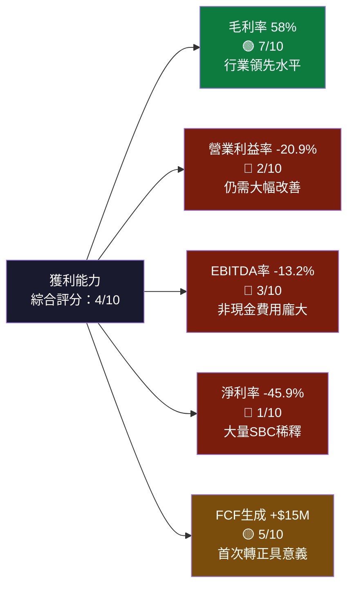

---

## 7. 估值深度分析

### 🔍 同業估值比較

| 指標 | **Planet Labs (PL)** | **BlackSky Tech (BKSY)** | **Satellogic (SATL)** | **Maxar Technologies** |
|:-----|:--------------------:|:------------------------:|:---------------------:|:----------------------:|
| 股價 | $25.20 | ~$12.50 | ~$2.50 | 已私有化 |
| 市值 | **$8.60B** | ~$1.2B | ~$0.6B | ~$6.4B（退市前） |
| P/S | **30.4x** 🔴 | ~8x 🟡 | ~6x 🟢 | ~4x 🟢 |
| EV/Rev | **26.7x** 🔴 | ~7x 🟡 | ~5x 🟢 | ~3.5x 🟢 |
| EV/EBITDA | **N/M（負）** 🔴 | N/M（負）🔴 | N/M（負）🔴 | ~12x 🟢 |
| P/B | **22.6x** 🔴 | ~3x 🟢 | ~1x 🟢 | ~2x 🟢 |
| 毛利率 | **58.0%** 🟢 | ~38% 🟡 | ~35% 🟡 | ~40% 🟡 |
| 收入成長YoY | **+32.6%** 🟢 | ~+15% 🟡 | ~+10% 🟡 | ~+5% 🟡 |

> **估值溢價分析**：PL的P/S達30.4x，相較同業BlackSky的8x和Satellogic的6x，**溢價高達4-5倍**。這個溢價隱含市場對PL更大規模、更高成長率及更強護城河的預期定價。但需問：溢價是否合理？

```
同業P/S比較視覺化

Planet Labs  30.4x  ████████████████████████████████████████  🔴 極高
BlackSky      8.0x  ██████████░░░░░░░░░░░░░░░░░░░░░░░░░░░░░░  🟡 偏高
Satellogic    6.0x  ████████░░░░░░░░░░░░░░░░░░░░░░░░░░░░░░░░  🟢 相對合理
SaaS平均     10.0x  █████████████░░░░░░░░░░░░░░░░░░░░░░░░░░░  參考
太空科技平均  12.0x  ████████████████░░░░░░░░░░░░░░░░░░░░░░░░  參考
```

---

### 📈 歷史估值區間分析

```
P/S歷史區間（估算，基於股價歷史）

2024-02（$2.19）：P/S ≈ 2.7x  🟢 歷史低點
2024-11（$3.93）：P/S ≈ 4.8x  🟢 偏低
2025-01（$6.10）：P/S ≈ 8.7x  🟡 合理
2025-09（$12.98）：P/S ≈ 18.5x 🟡 偏高
2026-01（$24.97）：P/S ≈ 35.5x 🔴 歷史高位
2026-02（$25.20）：P/S ≈ 30.4x 🔴 高估區

估值區間標尺
低估區  [0-8x]   ████████░░░░░░░░░░░░░░░░░░░░░░░░
合理區  [8-15x]  ░░░░░░░░████████░░░░░░░░░░░░░░░░
偏高區  [15-25x] ░░░░░░░░░░░░░░░░████████░░░░░░░░
高估區  [25x+]   ░░░░░░░░░░░░░░░░░░░░░░░░████████
         ▲ 目前所在位置：30.4x ─────────────────▲
```

---

### 🧮 DCF敏感性分析

**核心假設**：
- 基準年收入：$282.46M（TTM）
- 目標利潤率：長期可達20% EBITDA率（SaaS類比）
- 折現率：13.4%（WACC）/ 15.0%（高風險調整）
- 終端成長率：3.0%

| 情境 | 收入成長假設（5年CAGR）| WACC 13.4% | WACC 15.0% |
|:-----|:---------------------:|:----------:|:----------:|
| 🟢 **樂觀** | +35%/年 | **$38.50** | **$32.00** |
| 🟡 **基準** | +25%/年 | **$26.00** | **$21.50** |
| 🔴 **悲觀** | +15%/年 | **$14.50** | **$11.50** |

```
DCF目標價矩陣視覺化

               WACC 13.4%    WACC 15.0%
樂觀 +35%      $38.50 🟢     $32.00 🟢
基準 +25%      $26.00 🟡     $21.50 🟡
悲觀 +15%      $14.50 🔴     $11.50 🔴

當前股價：$25.20

▶ 基準情境（13.4%）目標價$26.00 ≈ 當前股價
▶ 股價已充分反映基準預期，上行空間有限
▶ 樂觀情境仍提供33%上行空間
▶ 悲觀情境意味著-43%下行風險
```

---

### 📊 估值區間視覺化

```
目標價區間（美元）

$0    $10   $20   $30   $40   $50
│─────│─────│─────│─────│─────│
      ████████████            悲觀區間 $11.5-$14.5
            █████████████     基準區間 $21.5-$26.0
                  ████████████樂觀區間 $32.0-$38.5
                ▲
            目前股價$25.20（位於基準/樂觀交界）

分析師目標：Low $16.40 ─── Mean $24.71 ─── High $33.00
                              ▲
                          現價$25.20（略超均值）
```

---

## 8. 成長催化劑

### 📅 催化劑時間軸

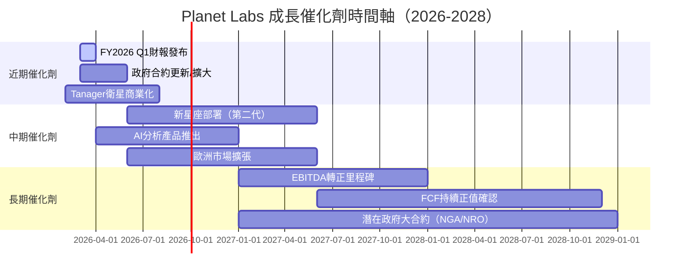

---

### 🌍 TAM 市場規模與滲透率

```
地球觀測數據市場 TAM 分析

全球衛星遙感市場（2025E）：  $8.0B   ████████████░░░░░░░░░░░░░░░░
預計2030E市場規模：          $18.0B  ████████████████████████░░░░
  CAGR（2025-2030）：+17.6%

地理資訊系統（GIS）整體：    $15.0B  ████████████████████░░░░░░░░
政府/國防地理情報市場：       $5.0B   ███████░░░░░░░░░░░░░░░░░░░░░
農業精準科技市場：            $4.0B   █████░░░░░░░░░░░░░░░░░░░░░░░

Planet Labs當前收入：        $282M   ████░░░░░░░░░░░░░░░░░░░░░░░░
市場滲透率（衛星遙感）：      ~3.5%  ← 成長空間巨大！

潛在可服務市場（SAM）：      ~$5.0B
當前滲透率：                  ~5.7%
目標滲透率（5年）：           ~15-20%
```

---

### 🚀 短/中/長期成長驅動力

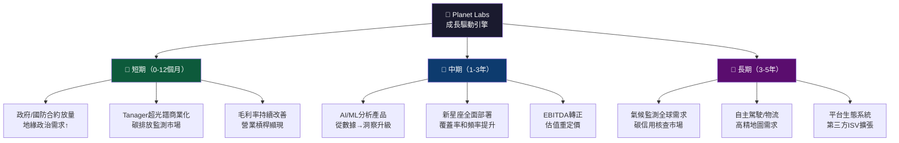

---

## 9. 風險矩陣

### 🎯 風險評分矩陣

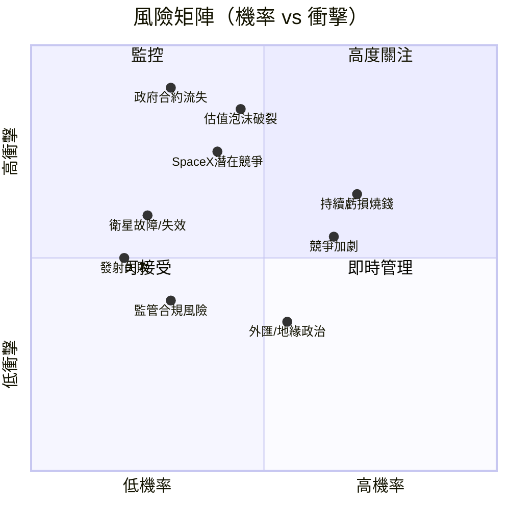

---

### 📋 風險清單詳表

| 風險項目 | 機率 | 衝擊 | 綜合評分 | 緩解措施 | 評級 |
|:---------|:----:|:----:|:--------:|:---------|:----:|
| 估值泡沫修正（P/S收縮） | 中 45% | 極高 | **9/10** | 嚴格止損，分批建倉 | 🔴 |
| 主要政府合約流失（NRO等） | 低 30% | 極高 | **9/10** | 關注合約更新時間點 | 🔴 |
| 持續虧損導致需再融資稀釋 | 高 70% | 中高 | **8/10** | 監控燒錢速率 | 🔴 |
| SpaceX Starshield市場搶奪 | 中 40% | 高 | **8/10** | 聚焦差異化商業市場 | 🔴 |
| 競爭對手收入加速 | 高 65% | 中 | **7/10** | 追蹤BlackSky/Satellogic | 🟡 |
| 衛星群老化/損壞 | 低 25% | 中 | **5/10** | 補充星座計劃 | 🟡 |
| 技術迭代使產品過時 | 中 35% | 中 | **6/10** | 持續R&D投入 | 🟡 |
| 發射失敗（供應依賴SpaceX/RocketLab） | 低 20% | 中 | **4/10** | 多元化發射商 | 🟡 |
| 監管/出口管制風險 | 低 30% | 低中 | **4/10** | 法務合規團隊 | 🟢 |
| 外匯波動（國際收入） | 中 55% | 低 | **3/10** | 自然對沖+合約條款 | 🟢 |

---

## 10. 投資建議

### 🎯 最終綜合評級

```
維度評分雷達圖（滿分10分）

基本面品質    ████████░░░░░░░░░░░░  5/10  🟡
成長潛力      ██████████████░░░░░░  7/10  🟢
獲利能力      ████████░░░░░░░░░░░░  3/10  🔴（最弱項）
財務健康      ████████████░░░░░░░░  6/10  🟡
估值合理性    ████░░░░░░░░░░░░░░░░  2/10  🔴（嚴重高估）
競爭壁壘      ████████████░░░░░░░░  6/10  🟡
管理執行力    ██████████░░░░░░░░░░  5/10  🟡
行業前景      ████████████████░░░░  8/10  🟢
技術領先性    ████████████████░░░░  8/10  🟢
催化劑豐富度  ██████████████░░░░░░  7/10  🟢

───────────────────────────────────
綜合評分      ████████████░░░░░░░░  5.7/10  🟡 謹慎買入
```

---

### 💰 目標價設定

| 情境 | 目標價 | 隱含報酬率（from $25.20）| 機率權重 | 加權貢獻 |
|:-----|:------:|:------------------------:|:--------:|:--------:|
| 🟢 樂觀（政府合約爆發+盈利提前） | **$35.00** | **+38.9%** | 25% | +9.7% |
| 🟡 基準（符合共識預期） | **$26.00** | **+3.2%** | 50% | +1.6% |
| 🔴 悲觀（估值收縮+成長放緩） | **$14.00** | **-44.4%** | 25% | -11.1% |
| **加權目標價** | **$25.25** | **+0.2%** | - | **0.2%** |

```
目標價視覺化
                                    現價$25.20
                                        ↓
$10   $14   $18   $22   $26   $30   $35
│─────│─────│─────│─────│─────│─────│
      ████░░░░░░░░░░░░░░░░░░░  悲觀$14
                  ███░░░░░░░░  基準$26
                        ████████樂觀$35
分析師均值        ▲$24.71
分析師高目標                         ▲$33
```

> **結論**：加權目標價$25.25幾乎等同現價，**風險/報酬比並不吸引人**。但樂觀情境下仍有39%上行空間，適合高風險承受能力之投資人少量配置。

---

### ✅ 買入時機與觸發因素

```
買入觸發因素清單（需滿足越多越有把握）

技術面：
□ 股價回測至$18-20區間（支撐位）
□ RSI降至40以下（超賣）
□ 成交量萎縮後的底部翻轉信號

基本面：
□ 季度收入超預期（beat >5%）
□ EBITDA首次轉正的季度
□ 宣告重大政府合約（>$50M）
□ FCF連續2季正值確認
□ 毛利率突破65%

催化劑：
□ 分析師上調目標價至$30+
□ 大型機構新增持倉公告
□ 宣布與主要商業客戶的多年合約
□ Tanager超光譜業務貢獻可量化收入

估值：
□ P/S回落至15-20x合理區間
□ EV/Revenue降至15x以下
```

---

### 👥 投資人適配度

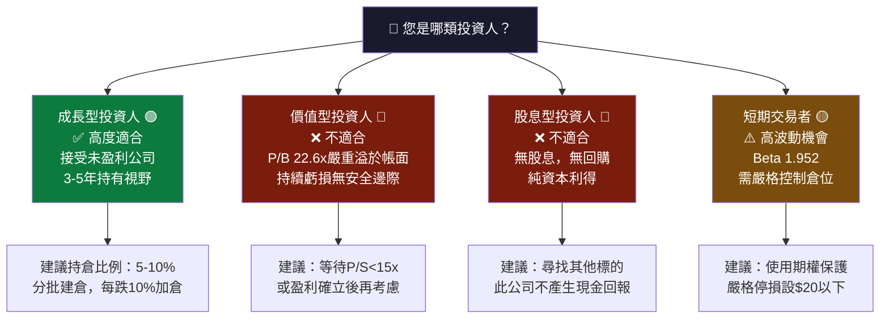

---

### 📊 關鍵監控指標

```
下次財報前必須監控的指標

財報數據（FY2026 Q1，預計2026年3月）：
□ 季度收入：目標超越$85M（QoQ+4.6%）
□ 毛利率：目標維持在57%+
□ 營業費用：目標低於$65M（含R&D+SGA）
□ 現金消耗速率：目標每季<$20M
□ 遞延收入：觀察未來收入能見度
□ RPO（剩餘履約義務）：反映合約積壓

行業動態監控：
□ 美國國防預算衛星情報科目（NISA）撥款
□ NRO合約競標結果
□ SpaceX Starshield商業化進展
□ BlackSky/Satellogic季報對比

總體環境：
□ 美聯儲利率決策（影響WACC）
□ 科技/成長股估值倍數趨勢
□ 美元指數（影響國際收入）
□ 地緣政治緊張程度（影響政府需求）

早期預警信號（賣出考量）：
⚠️ 收入成長低於20%（連續2季）
⚠️ 毛利率下降超過5個百分點
⚠️ 主要政府合約不續約
⚠️ 宣告大規模稀釋性融資
⚠️ P/S超過40x後進一步上漲
```

---

## 📊 最終投資記分卡

```
╔══════════════════════════════════════════════════════════════╗
║           Planet Labs PBC（PL）投資記分卡                     ║
║                    2026年2月25日                              ║
╠══════════════════════════════════════════════════════════════╣
║  現價：$25.20    市值：$8.60B    52W範圍：$2.79-$30.90       ║
╠══════════════════════════════════════════════════════════════╣
║  優勢（STRENGTHS）                                            ║
║  ✅ 全球最大商業衛星星座，技術壁壘高                          ║
║  ✅ 收入成長加速至+32.6% YoY                                  ║
║  ✅ 毛利率58%向SaaS靠攏，改善趨勢明確                        ║
║  ✅ FCF首次轉正（$15.07M TTM）里程碑                         ║
║  ✅ 淨現金+$216M，流動性充裕                                  ║
╠══════════════════════════════════════════════════════════════╣
║  弱點（WEAKNESSES）                                           ║
║  ❌ 持續虧損，淨利率-45.9%，EPS=-$0.43                       ║
║  ❌ 估值極度溢價，P/S=30.4x，EVA深度負值                     ║
║  ❌ 股東權益持續侵蝕，帳面值$1.39/股 vs 現價$25.20           ║
║  ❌ 高股票薪酬（SBC）稀釋現有股東                            ║
╠══════════════════════════════════════════════════════════════╣
║  評級：⚠️ 謹慎買入（Speculative Buy）                         ║
║  目標：$26（基準）/ $35（樂觀）/ $14（悲觀）                  ║
║  適合：高風險承受力之成長型投資人，建議倉位≤5%               ║
╚══════════════════════════════════════════════════════════════╝
```

---

> **⚠️ 免責聲明**：本報告由 AI 量化研究系統自動生成，基於截至 2026年2月25日之公開財務數據。本報告僅供學術研究與參考用途，**不構成任何投資建議或買賣邀約**。投資涉及風險，過去表現不代表未來結果。讀者在作出任何投資決策前，應諮詢持牌財務顧問，並自行評估個人風險承受能力與投資目標。Planet Labs PBC 為未盈利成長型公司，具有高度投機性，可能面臨100%損失風險。