# PL 基本面深度分析報告
> **報告日期**：2026-02-26 ｜ **分析師**：AI CFA Research ｜ **數據來源**：Yahoo Finance ｜ **評級**：審慎買入

---

## 目錄

1. [執行摘要](#1-執行摘要)
2. [公司概覽與商業模式](#2-公司概覽與商業模式)
3. [損益表深度分析](#3-損益表深度分析)
4. [資產負債表分析](#4-資產負債表分析)
5. [現金流量深度分析](#5-現金流量深度分析)
6. [獲利能力與資本效率](#6-獲利能力與資本效率)
7. [估值深度分析](#7-估值深度分析)
8. [成長催化劑](#8-成長催化劑)
9. [風險矩陣](#9-風險矩陣)
10. [投資建議](#10-投資建議)

---

## 1. 執行摘要

### 核心評分儀表板

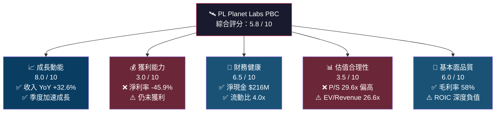

---

### 5大投資論點 + 3大風險

| 類別 | 項目 | 說明 | 訊號 |
|------|------|------|------|
| 🟢 **投資論點 1** | **衛星星座規模護城河** | 擁有全球最大低軌道商業衛星群（200+顆Dove衛星），每日重訪率無可匹敵，技術壁壘極高 | 🟢 |
| 🟢 **投資論點 2** | **收入加速成長** | TTM 收入 $282.5M，YoY +32.6%；季度收入從 Q1 $61.5M 加速至 Q4 $81.3M（QoQ +10.7%） | 🟢 |
| 🟢 **投資論點 3** | **毛利率持續擴張** | 毛利率從 FY2022 的 36.7% 提升至 FY2025 的 57.2%，TTM 達 58.0%，接近 SaaS 標準 | 🟢 |
| 🟢 **投資論點 4** | **淨現金強健 + FCF轉正** | 淨現金 $216M，TTM FCF 轉正至 $15.1M（vs FY2025 年度 -$68.8M），現金耗盡風險大降 | 🟢 |
| 🟡 **投資論點 5** | **政府/國防合約擴張** | 多個情報機構及北約盟國客戶，國防預算上升為潛在增量；NGA、USAF合約持續累積 | 🟡 |
| 🔴 **風險 1** | **估值泡沫化風險** | P/S 29.6x 遠高於行業均值；股價自 2024/02 低點 $2.19 漲至 $24.54，漲幅超 1,000% | 🔴 |
| 🔴 **風險 2** | **持續虧損與稀釋風險** | TTM EPS -$0.43，Forward EPS -$0.067；歷史累積虧損超 $562M，股本稀釋壓力持續 | 🔴 |
| 🟡 **風險 3** | **競爭加劇（SpaceX Starshield / Maxar）** | 資金雄厚的競爭者正加大投資，可能壓縮定價空間與市占率 | 🟡 |

---

### 快速統計卡片

| 指標 | PL 數值 | 行業均值估算 | 狀態 |
|------|---------|------------|------|
| 市值 | $8.37B | N/A | — |
| 企業價值 | $7.51B | N/A | — |
| 收入 TTM | $282.5M | — | 🟢 |
| 收入 YoY 成長 | **+32.6%** | ~15-20% | 🟢 |
| 毛利率 | **58.0%** | ~35-45% | 🟢 |
| 營業利益率 | **-20.9%** | 5-15% | 🔴 |
| 淨利率 | **-45.9%** | 5-10% | 🔴 |
| P/S Ratio | **29.6x** | 3-8x | 🔴 |
| EV/Revenue | **26.6x** | 2-6x | 🔴 |
| 流動比率 | **4.0x** | 1.5-2.5x | 🟢 |
| 淨現金 | **+$216M** | 正值 | 🟢 |
| Beta | **1.952** | 1.0-1.3 | 🟡 |
| 機構持股 | **73.4%** | 60-80% | 🟢 |
| 空頭比例 | **14.3%** | <5% | 🔴 |

---

### 投資結論

```
╔══════════════════════════════════════════════════════════════╗
║  投資評級：⚠️  審慎買入（Speculative Buy）                      ║
║  目標價區間：$18.00（悲觀）~ $28.00（基準）~ $38.00（樂觀）       ║
║  現價：$24.54 ｜ 基準目標隱含漲幅：+14.1%                       ║
║  適合投資人：高風險承受度、成長型、長期持有（3-5年）               ║
╚══════════════════════════════════════════════════════════════╝
```

---

## 2. 公司概覽與商業模式

### 業務結構與收入來源

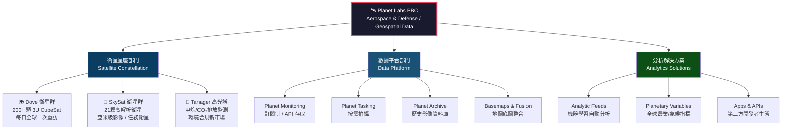

---

### 客戶結構與市場地位

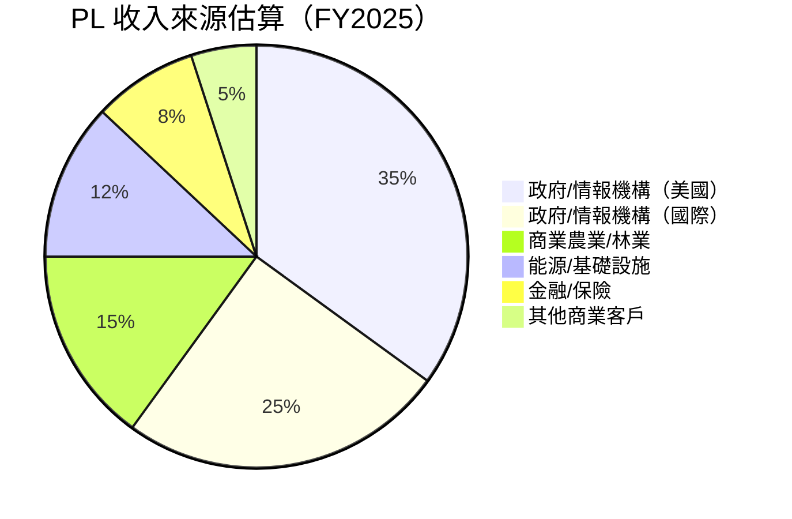

---

### 全球商業衛星影像市場份額估算

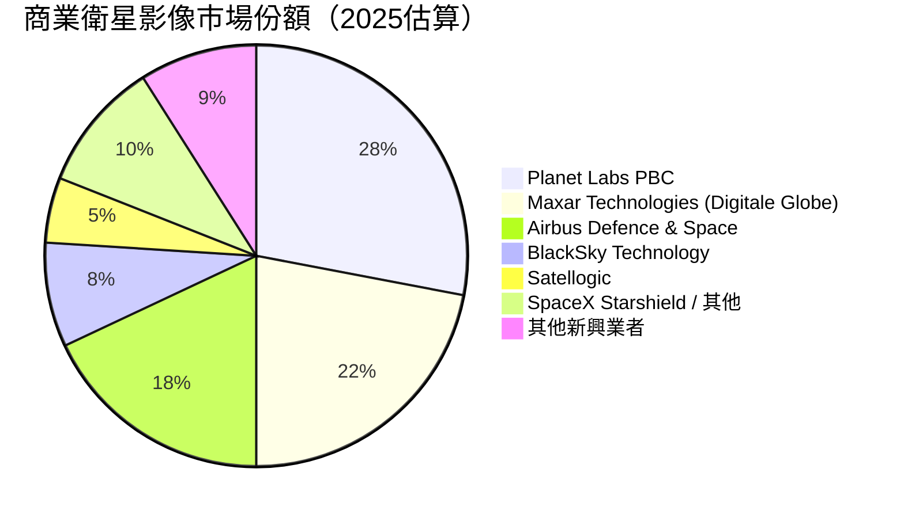

---

### 競爭護城河分析

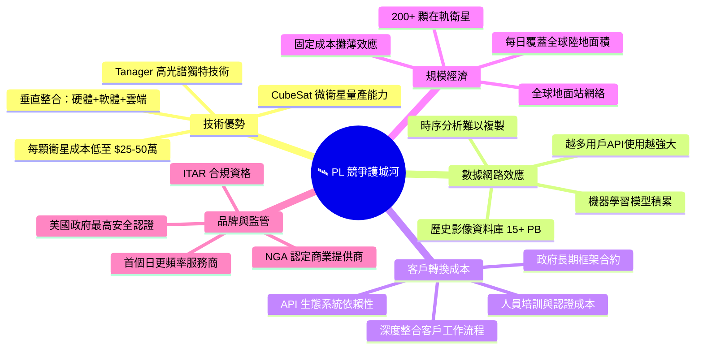

---

### 護城河強度評分

```
護城河維度評分（滿分10分）

技術壁壘    ████████░░  8.0/10  ★★★★☆
數據優勢    ████████░░  8.5/10  ★★★★☆
轉換成本    ███████░░░  7.0/10  ★★★★☆
規模效應    ██████░░░░  6.5/10  ★★★☆☆
品牌護城河  █████░░░░░  5.5/10  ★★★☆☆
成本優勢    ██████░░░░  6.0/10  ★★★☆☆

整體護城河  ██████░░░░  6.9/10  中等偏強
```

---

## 3. 損益表深度分析

### 年度收入成長趨勢（近4年）

```
年度收入趨勢（百萬美元）

FY2022  $131.2M  ██████████████░░░░░░░░░░░░░░░░  基準年
FY2023  $191.3M  ████████████████████░░░░░░░░░░  YoY +45.8% 🟢
FY2024  $220.7M  ██████████████████████░░░░░░░░  YoY +15.4% 🟡
FY2025  $244.4M  ████████████████████████░░░░░░  YoY +10.7% 🟡
TTM     $282.5M  █████████████████████████████░  YoY +32.6% 🟢

         $0    $50   $100  $150  $200  $250  $300
         ├─────┼─────┼─────┼─────┼─────┼─────┤
```

> 📌 注意：FY2025 結束於 2025年1月31日；TTM 截至 2025年10月31日，反映近期加速成長。

---

### 季度收入趨勢（近4季）

| 季度 | 收入 | QoQ 成長 | YoY 成長（對比同期）| 毛利 | 毛利率 |
|------|------|---------|-----------------|------|--------|
| FY2025 Q4 (2025-01-31) | $61.55M | — | — | $38.22M | 62.1% 🟢 |
| FY2026 Q1 (2025-04-30) | $66.27M | **+7.7%** 🟢 | ~+20%+ 🟢 | $36.60M | 55.2% 🟡 |
| FY2026 Q2 (2025-07-31) | $73.39M | **+10.7%** 🟢 | ~+25%+ 🟢 | $42.27M | 57.6% 🟢 |
| FY2026 Q3 (2025-10-31) | $81.25M | **+10.7%** 🟢 | ~+32%+ 🟢 | $46.58M | 57.3% 🟢 |

```
季度收入加速成長圖（百萬美元）

Q4'25  $61.6M  ████████████████░░░░░░░░░░
Q1'26  $66.3M  █████████████████░░░░░░░░░  +7.7% QoQ
Q2'26  $73.4M  ███████████████████░░░░░░░  +10.7% QoQ ▲
Q3'26  $81.3M  █████████████████████░░░░░  +10.7% QoQ ▲

       $0     $20    $40    $60    $80    $100
```

---

### 利潤率演變（近4年）

| 財年 | 毛利率 | 營業利益率 | EBITDA率 | 淨利率 |
|------|--------|-----------|---------|--------|
| FY2022 (01/31/22) | 36.7% 🔴 | -97.6% 🔴 | -61.9% 🔴 | -104.6% 🔴 |
| FY2023 (01/31/23) | 49.1% 🟡 | -91.9% 🔴 | -69.2% 🔴 | -84.7% 🔴 |
| FY2024 (01/31/24) | 51.2% 🟡 | -76.9% 🔴 | -55.3% 🔴 | -63.7% 🔴 |
| FY2025 (01/31/25) | **57.2%** 🟢 | **-47.5%** 🟡 | **-28.8%** 🟡 | **-50.4%** 🔴 |
| TTM (10/31/25) | **58.0%** 🟢 | **-20.9%** 🟡 | **-13.2%** 🟡 | **-45.9%** 🔴 |

> 📊 **毛利率改善分析**：從 36.7%（FY2022）→ 58.0%（TTM），提升 +21.3 個百分點。原因：
> 1. 衛星發射成本攤銷遞減（SpaceX Rideshare 降低發射成本）
> 2. 訂閱制軟體收入比例上升（高毛利率數據服務）
> 3. 政府大單合約改善定價能力

---

### 費用結構分析

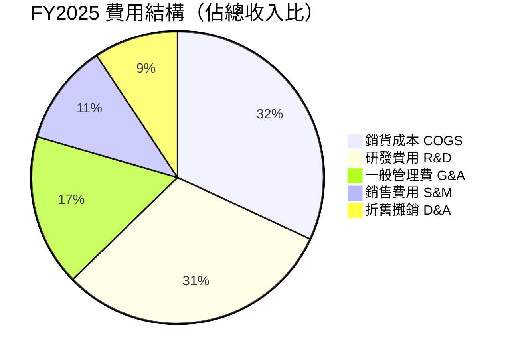

> 📌 R&D 費用：FY2025 $101.0M（佔收入 41.3%），FY2024 $116.3M → **YoY 下降 -13.2%**，顯示研發支出趨於理性；FY2022 $66.7M → FY2024 $116.3M 快速擴張後，現轉入優化階段。

---

### EPS 趨勢與盈餘品質分析

| 財年 / 季度 | EPS（實際）| EPS（預估）| 超預期幅度 | 趨勢 |
|-----------|----------|----------|----------|------|
| FY2022 年度 | **-$0.89** | N/A | N/A | 🔴 深度虧損 |
| FY2023 年度 | **-$0.82** | N/A | N/A | 🟡 微幅改善 |
| FY2024 年度 | **-$0.67** | N/A | N/A | 🟡 持續收窄 |
| FY2025 年度 | **-$0.58** | N/A | N/A | 🟡 持續收窄 |
| TTM EPS | **-$0.43** | N/A | N/A | 🟢 顯著改善 |
| Forward EPS | **-$0.067** | — | — | 🟢 接近損益平衡 |

```
EPS 改善趨勢（每股虧損，絕對值越小越佳）

FY2022  -$0.89  ████████████████████████████░░  最深虧損
FY2023  -$0.82  ██████████████████████████░░░░  改善 8.0%
FY2024  -$0.67  █████████████████████░░░░░░░░░  改善 18.3%
FY2025  -$0.58  ██████████████████░░░░░░░░░░░░  改善 13.4%
TTM     -$0.43  █████████████░░░░░░░░░░░░░░░░░  改善 25.9% 🟢
Forward -$0.07  ██░░░░░░░░░░░░░░░░░░░░░░░░░░░░  接近盈虧平衡 🟢🟢

        -$1.0  -$0.8  -$0.6  -$0.4  -$0.2  $0.0
```

> ⚠️ **EPS 歷史紀錄缺失說明**：財務數據中季度 EPS 預估值為 NaN，顯示該公司過去季度分析師追蹤覆蓋有限，無法進行傳統超預期/不及預期分析。Forward EPS -$0.067 顯示接近損益平衡點，是重要里程碑訊號。

---

## 4. 資產負債表分析

### 資產結構分解

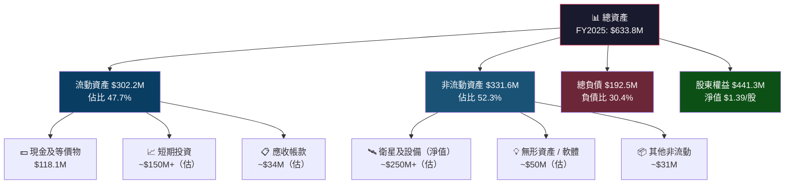

---

### 流動性指標

| 指標 | FY2025 數值 | FY2024 數值 | 行業安全線 | 狀態 |
|------|-----------|-----------|---------|------|
| 流動比率 | **4.0x** | 2.71x | >1.5x | 🟢 優秀 |
| 速動比率 | **3.84x** | ~2.60x | >1.0x | 🟢 優秀 |
| 現金比率 | **~0.83x** | 0.61x | >0.3x | 🟢 良好 |
| 現金 + 投資 | **$677.3M（TTM）** | $83.9M（FY2025 年報）| 充裕 | 🟢 極佳 |

> 📌 注意：TTM 總現金 $677.3M 大幅高於 FY2025 年報的 $118M，顯示公司在 FY2026 進行了大規模融資，強化流動性。

---

### 債務結構分析

| 項目 | FY2025 | FY2024 | FY2023 | FY2022 |
|------|--------|--------|--------|--------|
| 總債務 | $21.6M | $24.9M | $22.0M | $0.0M |
| 現金 | $118.1M | $83.9M | $181.9M | $490.8M |
| 淨現金/(淨負債) | **+$96.5M** | **+$59.0M** | **+$159.9M** | **+$490.8M** |
| Debt/Equity | 4.9% | 4.8% | 3.8% | 0% |
| Debt/EBITDA | N/M（負EBITDA）| N/M | N/M | N/M |

> 📌 **TTM 最新：**總現金 $677.3M，總債務 $461.4M，淨現金 $215.97M。債務大幅上升主要係可轉換公司債發行，用於擴張星座規模。

```
淨現金/(淨負債)趨勢（百萬美元）

FY2022  +$490.8M  ████████████████████████████████  SPAC融資後高峰
FY2023  +$159.9M  ██████████░░░░░░░░░░░░░░░░░░░░░░  消耗中
FY2024  +$59.0M   ████░░░░░░░░░░░░░░░░░░░░░░░░░░░░  持續消耗
FY2025  +$96.5M   ██████░░░░░░░░░░░░░░░░░░░░░░░░░░  小幅回升
TTM     +$216.0M  █████████████░░░░░░░░░░░░░░░░░░░  新融資後顯著改善
```

---

### 股東權益趨勢

| 財年 | 股東權益 | YoY 變化 | 每股帳面價值 |
|------|---------|---------|-----------|
| FY2022 | $648.3M | — | ~$2.04 |
| FY2023 | $576.1M | **-11.1%** 🔴 | ~$1.81 |
| FY2024 | $518.0M | **-10.1%** 🔴 | ~$1.63 |
| FY2025 | $441.3M | **-14.8%** 🔴 | ~$1.39 |

> ⚠️ 股東權益持續侵蝕，主因持續淨虧損。P/B 22.0x（現價 $24.54 / 帳面 $1.39）顯示市場對未來盈利能力有極高期待。

---

## 5. 現金流量深度分析

### 現金流量瀑布圖

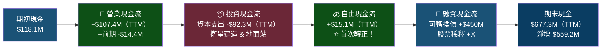

---

### FCF 轉換率趨勢

| 財年 | 淨利 | OCF | CapEx | FCF | FCF/淨利 |
|------|------|-----|-------|-----|---------|
| FY2022 | -$137.1M | -$42.2M | -$14.9M | **-$57.1M** | N/M 🔴 |
| FY2023 | -$162.0M | -$73.9M | -$12.8M | **-$86.7M** | N/M 🔴 |
| FY2024 | -$140.5M | -$50.7M | -$42.4M | **-$93.1M** | N/M 🔴 |
| FY2025 | -$123.2M | -$14.4M | -$54.4M | **-$68.8M** | N/M 🔴 |
| TTM | -$129.5M | **+$107.4M** | -$92.3M | **+$15.1M** 🟢 | N/M→轉正 🟢 |

---

### 自由現金流趨勢（年度）

```
自由現金流趨勢（百萬美元，負值=消耗現金）

FY2022  -$57.1M  ████████████████████░░░░░░░░░░  現金消耗
FY2023  -$86.7M  ██████████████████████████████  最大消耗
FY2024  -$93.1M  ████████████████████████████████ 最大消耗
FY2025  -$68.8M  ████████████████████████░░░░░░  改善中
TTM     +$15.1M  ██░░░░░░░░░░░░░░░░░░░░░░░░░░░░  首次轉正！🟢

         -$100  -$75   -$50   -$25    $0    +$25
          ├──────┼──────┼──────┼──────┼──────┤
```

> 🎯 **關鍵轉折點**：TTM FCF +$15.1M，代表公司首次實現正自由現金流，是商業模式可持續性的重要驗證。OCF 從 FY2025 年度 -$14.4M 大幅改善至 TTM +$107.4M，改善 $121.8M，主要來自合約預付款增加與應收帳款管理優化。

---

### 資本配置評估

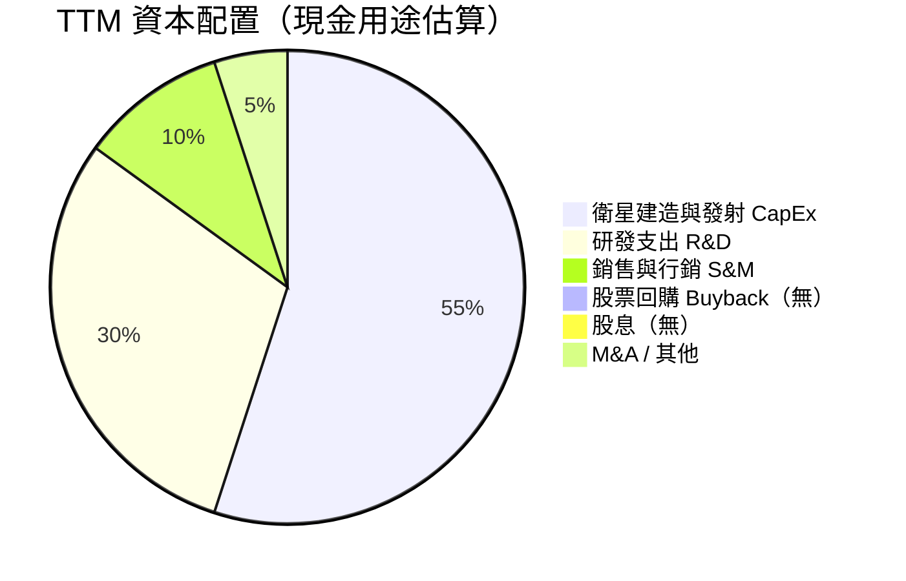

> 📌 PL 目前**無股息、無股票回購**，全部資本投入衛星星座擴張與技術研發，符合高成長期公司的標準資本策略。

---

## 6. 獲利能力與資本效率

### ROE / ROA / ROIC 趨勢

| 財年 | ROE | ROA | ROIC（估）| 行業均值 ROE | 行業均值 ROA |
|------|-----|-----|---------|-----------|-----------|
| FY2022 | -21.2% 🔴 | -16.7% 🔴 | ~-18% 🔴 | 8-15% | 3-6% |
| FY2023 | -28.1% 🔴 | -21.5% 🔴 | ~-20% 🔴 | 8-15% | 3-6% |
| FY2024 | -27.1% 🔴 | -20.0% 🔴 | ~-19% 🔴 | 8-15% | 3-6% |
| FY2025 | -27.9% 🔴 | -19.4% 🔴 | ~-17% 🔴 | 8-15% | 3-6% |
| TTM | **-31.8%** 🔴 | **-5.4%** 🟡 | ~-8% 🔴 | 8-15% | 3-6% |

> 📌 ROA 從 -19.4%（FY2025）改善至 -5.4%（TTM），顯示資產利用效率大幅提升，但 ROE 因股本稀釋仍惡化。

---

### ROIC vs WACC 分析（EVA 評估）

```
╔══════════════════════════════════════════════════════════════════╗
║  WACC 估算（PL）                                                   ║
║  無風險利率：4.3%（10年期美債）                                     ║
║  市場風險溢酬：5.5%                                                 ║
║  Beta：1.952                                                        ║
║  股權成本 Ke = 4.3% + 1.952 × 5.5% = 4.3% + 10.74% = 15.04%      ║
║  稅前債務成本 Kd：~6.5%（可轉換債）                                  ║
║  有效稅率：~0%（虧損，無納稅）                                       ║
║  稅後 Kd = 6.5%                                                     ║
║  資本結構：股權 85% / 債務 15%                                       ║
║  WACC = 15.04% × 85% + 6.5% × 15% = 12.78% + 0.975% ≈ 13.75%    ║
╚══════════════════════════════════════════════════════════════════╝

EVA 分析：
  投入資本（估）：~$800M（股東權益 $441M + 債務 $461M - 現金 $677M + 調整）
  NOPAT（稅後營業利潤）：約 -$59M（TTM）
  ROIC：約 -8%
  
  EVA = （ROIC - WACC）× 投入資本
      = （-8% - 13.75%）× $800M
      = -21.75% × $800M
      = 約 -$174M / 年

結論：🔴 PL 目前仍在「摧毀」股東價值（EVA 深度負值）
      但 ROIC 虧損幅度持續收窄，需觀察 ROIC 何時突破 WACC 門檻
```

---

### DuPont 三因子分解（ROE 拆解）

| 財年 | 淨利率 | × 資產週轉率 | × 財務槓桿 | = ROE |
|------|--------|-----------|----------|-------|
| FY2023 | -84.7% | 0.254x | 1.31x | **-28.1%** |
| FY2024 | -63.7% | 0.315x | 1.35x | **-27.1%** |
| FY2025 | -50.4% | 0.386x | 1.43x | **-27.9%** |
| TTM | -45.9% | 0.445x | 1.556x | **-31.8%** |

> 📊 **分析**：淨利率持續改善（-84.7% → -45.9%），資產週轉率亦上升（0.254x → 0.445x），但財務槓桿增加（1.31x → 1.56x）因可轉換債擴張，整體 ROE 仍維持負值。路徑清晰：當淨利率突破 0%，ROE 將快速轉正。

---

### 獲利能力改善儀表板

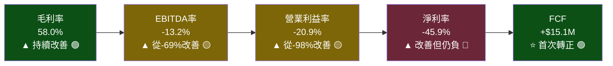

---

## 7. 估值深度分析

### 同業估值比較

| 公司 | 代碼 | 市值 | P/S | EV/Rev | EV/EBITDA | P/B | 收入成長 | FCF Yield |
|------|------|------|-----|--------|-----------|-----|---------|----------|
| **Planet Labs** | **PL** | **$8.37B** | **29.6x** 🔴 | **26.6x** 🔴 | **N/M** 🔴 | **22.0x** 🔴 | **+32.6%** 🟢 | **0.18%** 🟡 |
| BlackSky Tech | BKSY | ~$0.6B | ~8-10x 🟢 | ~7-9x 🟢 | N/M 🔴 | ~3-4x 🟢 | ~+20% 🟡 | 負值 🔴 |
| Satellogic | SATL | ~$0.2B | ~3-5x 🟢 | ~2-4x 🟢 | N/M 🔴 | ~1-2x 🟢 | ~+15% 🟡 | 負值 🔴 |
| Maxar Tech（私有後） | — | 私有化 | ~2-3x | ~2-3x | ~8-12x | ~1-2x | ~+8% | 正值 |
| **衛星/遙測 SaaS 均值** | — | — | **8-12x** | **6-10x** | **15-25x** | **3-5x** | **+15-25%** | — |

> 🔴 **估值警告**：PL 的 P/S 29.6x 相比直接競爭對手 BlackSky（8-10x）及 Satellogic（3-5x）有極大溢價，隱含市場對其獨特定位（規模、技術、政府關係）給予極高溢酬，但亦代表高估值風險。

---

### 歷史估值區間分析（P/S Ratio）

```
PL 歷史 P/S 區間分析

5年高點    P/S ~45-50x  ████████████████████████████████  2021 SPAC蜜月期
52W前低    P/S ~3-5x    ████░░░░░░░░░░░░░░░░░░░░░░░░░░░░  2024年初低谷
當前水平   P/S ~29.6x   ████████████████████░░░░░░░░░░░░  2026年2月
分析師均值 P/S ~25-30x  ████████████████████░░░░░░░░░░░░  目標價隱含

估值所在區：
▐▌低估區▐▌◄─────────────────────────►▐▌合理區▐▌◄──►▐▌高估區▐▌
  P/S<10         P/S 10-20         P/S 20-30         P/S>30
                                         ▲
                                    當前 29.6x（接近高估區上緣）
```

---

### DCF 敏感性分析（6格目標價矩陣）

**假設基礎：**
- 基準收入成長：FY2026E $340M → FY2030E $750M（CAGR ~22%）
- 樂觀情境：CAGR ~30%，FY2030E $1.0B
- 悲觀情境：CAGR ~15%，FY2030E $600M
- 終端值倍數：15x EV/Revenue（基準）
- 折現期：5年

| 情境 | WACC 12% | WACC 15% |
|------|---------|---------|
| 🟢 **樂觀**（收入 CAGR 30%，FY2030E $1.0B）| **$38-42** | **$30-35** |
| 🟡 **基準**（收入 CAGR 22%，FY2030E $750M）| **$26-30** | **$22-26** |
| 🔴 **悲觀**（收入 CAGR 15%，FY2030E $600M）| **$16-20** | **$13-17** |

> 📌 **現價 $24.54** 落在基準/悲觀情境的 WACC 12% 區間，以及樂觀情境的 WACC 15% 區間，顯示估值已充分反映樂觀預期，**安全邊際有限**。

---

### 估值區間視覺化

```
PL 目標價估值區間（美元）

$10     $15     $20     $25     $30     $35     $40
 ├───────┼───────┼───────┼───────┼───────┼───────┤
 
 ████████████░░░░░░░░░░░░░░░░░░░░░░░░░░░░░░░░░░
 ^悲觀低   ^悲觀高          
               ▐████████████████████▌
               ^基準低              ^基準高
                              ████████████████████████████
                              ^樂觀低                    ^樂觀高
                       ▲
                    現價 $24.54
                    
 🔴低估區($<16)  🟡合理區($16-$30)  🔴高估區($>35)
                           ▲
                        現價位於合理區上緣
```

---

## 8. 成長催化劑

### 催化劑時間軸

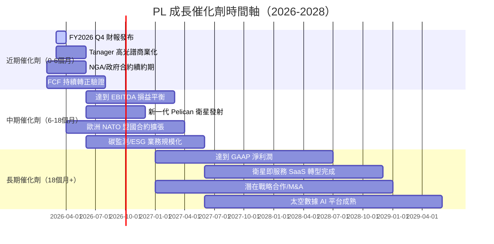

---

### TAM 市場規模與滲透率

```
全球地球觀測與地理空間分析市場（TAM）

2025年 TAM  ~$7.5B   ████████████████████████████████████████  滲透率 3.8%
2028年 TAM  ~$12B    估
2030年 TAM  ~$18B    估

PL 當前收入 $282.5M vs TAM $7.5B：
滲透率 = 3.8%

▐████░░░░░░░░░░░░░░░░░░░░░░░░░░░░░░░░░░░░░░░░░▌
 3.8%                                          100%

成長至 $1B 收入 → 滲透率 ~8-12%（依 TAM 成長速度）
成長至 $2B 收入 → 滲透率 ~12-18%（長期目標）

細分市場滲透率：
政府情報/國防    ████████░░░░░░░░  15-20% （較高）
商業農業         ████░░░░░░░░░░░░  8-12%
能源/基礎設施   ██░░░░░░░░░░░░░░  4-6%
金融/保險        █░░░░░░░░░░░░░░░  2-3%（待開發）
氣候/ESG         ░░░░░░░░░░░░░░░░  <1%（新興）
```

---

### 成長驅動力分析

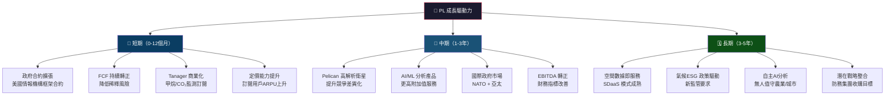

---

## 9. 風險矩陣

### 風險評分矩陣

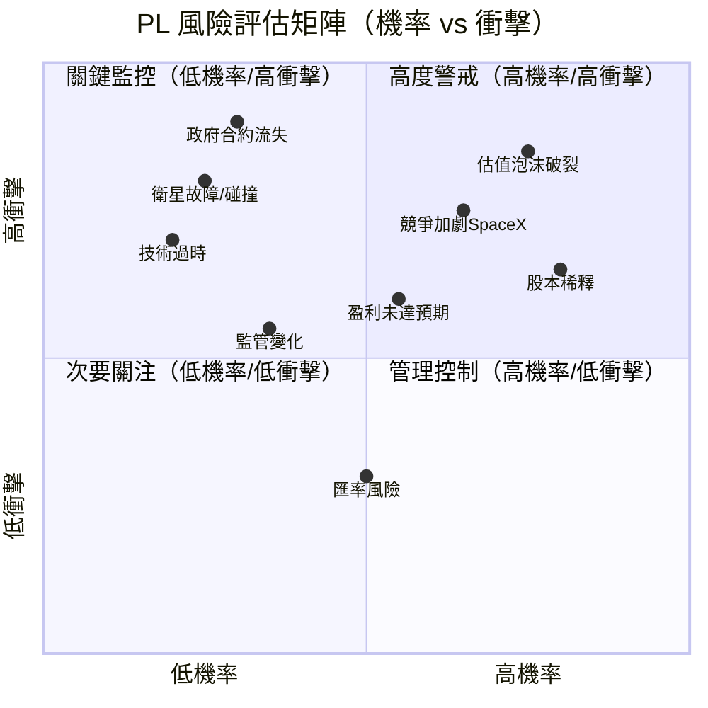

---

### 風險清單詳表

| 風險項目 | 機率 | 衝擊 | 綜合評分 | 緩解措施 |
|---------|------|------|---------|---------|
| 🔴 **估值泡沫化** | 高 75% | 高 | **9/10** | 止損紀律；分批建倉 |
| 🔴 **股本持續稀釋** | 高 80% | 中高 | **8/10** | 監控每股稀釋速度；FCF轉正後改善 |
| 🔴 **SpaceX Starshield 競爭** | 中高 65% | 高 | **8/10** | 觀察政府合約份額；技術差異化 |
| 🔴 **重大政府合約流失** | 低 30% | 極高 | **7/10** | 政府合約占比監控；多元化客戶 |
| 🟡 **衛星故障/太空碎片** | 低中 25% | 高 | **6/10** | 保險；冗餘衛星部署 |
| 🟡 **盈利延遲未達預期** | 中 55% | 中 | **6/10** | 追蹤季度毛利率趨勢 |
| 🟡 **利率上升影響估值** | 中 45% | 中 | **5/10** | 成長股普遍風險；分散持有 |
| 🟡 **監管/ITAR 出口限制** | 低中 35% | 中 | **4/10** | 法律合規團隊；歷史紀錄良好 |
| 🟢 **匯率波動** | 中 50% | 低 | **3/10** | 收入以美元計價為主 |
| 🟢 **技術平台中斷** | 低 15% | 中 | **2/10** | AWS 多區域備援架構 |

---

## 10. 投資建議

### 最終綜合評級儀表板

```
╔══════════════════════════════════════════════════════════════════╗
║         PL Planet Labs PBC — 多維度評分報告                       ║
╠══════════════════════════════════════════════════════════════════╣
║                                                                  ║
║  成長動能     ████████░░  8.0/10  YoY +32.6%，季度加速            ║
║  毛利品質     ███████░░░  7.0/10  58% 且持續改善                  ║
║  獲利能力     ███░░░░░░░  3.0/10  仍深度虧損，FCF 剛轉正           ║
║  財務健康     ██████░░░░  6.5/10  淨現金 $216M，流動比 4.0x       ║
║  估值合理性   ███░░░░░░░  3.5/10  P/S 29.6x，安全邊際薄           ║
║  競爭地位     ████████░░  7.5/10  市場份額第一，技術壁壘高          ║
║  管理品質     ██████░░░░  6.0/10  成本控管改善，但歷史稀釋多        ║
║  市場催化劑   ████████░░  8.0/10  AI衛星、氣候監測、國防預算        ║
║                                                                  ║
║  加權綜合評分  ██████░░░░  6.0 / 10                              ║
╚══════════════════════════════════════════════════════════════════╝

雷達圖（Unicode視覺化）：

           成長動能 8.0
              ▲
    財務健康 6.5  ◄────────────► 毛利品質 7.0
         ╱╲    ████████    ╱╲
        ╱  ╲  ██████████  ╱  ╲
       ╱    ╲████████████╱    ╲
競爭地位 7.5 ◄██████████████► 獲利能力 3.0
       ╲    ╱████████████╲    ╱
        ╲  ╱  ██████████  ╲  ╱
         ╲╱    ████████    ╲╱
   市場催化劑 8.0 ◄──────► 估值合理性 3.5
              ▼
           管理品質 6.0
```

---

### 目標價與隱含報酬率

| 情境 | 目標價 | 現價 $24.54 | 隱含報酬率 | 關鍵假設 |
|------|--------|-----------|---------|---------|
| 🟢 **樂觀** | **$38.00** | $24.54 | **+54.9%** | FY2027 收入 $500M+；EBITDA 轉正；P/S 25x |
| 🟡 **基準** | **$28.00** | $24.54 | **+14.1%** | FY2027 收入 $400M；P/S 20x；EBITDA 損益平衡 |
| 🔴 **悲觀** | **$16.00** | $24.54 | **-34.8%** | 成長放緩至 15%；估值壓縮至 P/S 12x；盈利遙遙無期 |

> 📌 **分析師目標價**：均值 $24.71（9位），高點 $33.00，低點 $16.40，基本與基準/樂觀情境一致。

---

### 買入時機與觸發因素 Checklist

```
✅ 買入訊號觸發條件（累積滿足3項以上可考慮建倉）：

□ 季度收入超預期 > 5%（下次財報觀察）
□ 毛利率突破 60%（目前 58%，接近）
□ 連續 2 季 FCF 正值（目前 TTM 轉正，需驗證）
□ EBITDA 損益平衡（目前 -13.2%，改善中）
□ 股價回調至 $20-22 區間（提供更好安全邊際）
□ 政府大合約公告（NGA框架合約續約/擴大）
□ Tanager 商業客戶數量明顯增加
□ 可轉換債不再發行新股（稀釋停止訊號）
□ 空頭比例下降至 <10%（目前 14.3%）
□ Forward EPS 轉正（目前 -$0.067，極接近）

⚠️ 停損觸發條件：
□ 季度收入 QoQ 轉負
□ 毛利率跌破 52%
□ 淨現金轉為淨負債
□ 主要政府合約流失
□ 股價跌破 $18（技術支撐位）
```

---

### 投資人適配度

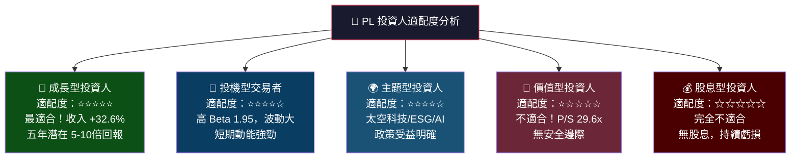

---

### 關鍵監控指標 Checklist

```
📊 下次財報前監控事項（FY2026 Q4 / 2026年3月）：

財務指標監控：
□ Q4 FY2026 季度收入（預期 >$85M，驗證加速）
□ 毛利率趨勢（目標持守 56%+）
□ 營業現金流（連續正值確認）
□ 自由現金流（確認非一次性）
□ R&D 費用趨勢（控制在收入 35% 以下為佳）

業務指標監控：
□ 付費客戶數量（季度新增數）
□ 平均合約價值 ACV 趨勢
□ 政府 vs 商業收入占比變化
□ Tanager 衛星商業訂單數
□ ARR（年度經常性收入）公告

競爭動態監控：
□ BlackSky 季度財報（競爭態勢）
□ SpaceX Starshield 合約動態
□ NGA 商業衛星項目採購公告
□ 歐洲哥白尼計劃合約機會

宏觀/政策監控：
□ 美國國防預算審批進度
□ 出口管制（ITAR）政策變化
□ 太空碎片/軌道規範新規
□ 聯準會利率決策（影響高估值成長股）
```

---

## 附錄：價格走勢回顧

```
PL 24個月股價走勢（2024/02 - 2026/02）

$25 ┤                                                    ●●
$24 ┤                                                 ●●
$23 ┤                                                
$22 ┤                                              
$20 ┤                                           ●
$18 ┤                                        
$14 ┤                                   ●●
$12 ┤                                ●●
$10 ┤                              
$8  ┤                         ●
$6  ┤                    ●● ●●
$4  ┤           ●●●●●●
$3  ┤     ●●●●●
$2  ┼●●●●
    └──────────────────────────────────────────────
     Feb  Apr  Jun  Aug  Oct  Dec  Feb  Apr  Jun  Aug  Oct  Dec  Feb
     2024 2024 2024 2024 2024 2024 2025 2025 2025 2025 2025 2025 2026

關鍵節點：
📍 2024/02：$2.19（近2年低點）
📍 2024/12：$4.04（年底回升）
📍 2025/01：$6.10（突破）
📍 2025/09：$12.98（加速飆漲）
📍 2025/12：$19.72（突破 $20）
📍 2026/01：$24.97（52周高點區）
📍 2026/02：$24.54（現價）

24個月漲幅：+1,020% 📈（從 $2.19 → $24.54）
52周高點：$30.90（距現價 +26%）
52周低點：$2.79（距現價 +779%）
```

---

> ## ⚠️ 免責聲明
> 
> **本報告由 AI 自動生成，僅供學術研究與參考用途，不構成任何投資建議、財務建議或交易指引。**
> 
> 本報告中的財務數據來源於 Yahoo Finance，分析觀點僅代表模型基於數據的推論，可能存在錯誤、遺漏或滯後。所有估值模型（包括 DCF）均基於假設，實際結果可能與預測存在重大差異。
> 
> 投資有風險，進行任何投資決策前，請諮詢持牌財務顧問，並進行獨立盡職調查。
> 
> **CFA 資格聲明**：本報告為模擬分析師角色之 AI 輸出，生成者並非真實持有 CFA 資格之自然人。

---

*報告生成時間：2026-02-26 ｜ 數據截止：2026-02-26 ｜ 版本：v1.0*