# PL 基本面深度分析報告
> **報告日期**：2026-02-27 ｜ **分析師**：AI CFA Research Engine ｜ **數據來源**：Yahoo Finance ｜ **股票代號**：PL（Planet Labs PBC）

---

## 目錄

1. [執行摘要](#1-執行摘要)
2. [公司概覽與商業模式](#2-公司概覽與商業模式)
3. [損益表深度分析](#3-損益表深度分析)
4. [資產負債表分析](#4-資產負債表分析)
5. [現金流量深度分析](#5-現金流量深度分析)
6. [獲利能力與資本效率](#6-獲利能力與資本效率)
7. [估值深度分析](#7-估值深度分析)
8. [成長催化劑](#8-成長催化劑)
9. [風險矩陣](#9-風險矩陣)
10. [投資建議](#10-投資建議)

---

## 1. 執行摘要

### 核心評分儀表板

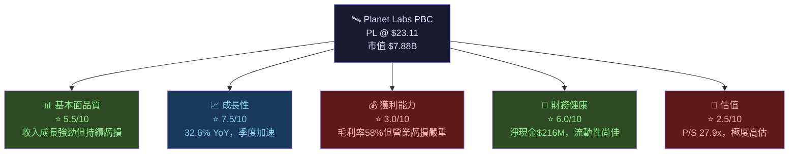

---

### 5大投資論點 + 3大風險

| 類別 | 項目 | 說明 | 信心度 |
|------|------|------|--------|
| 🟢 投資論點 | **衛星星座規模護城河** | 200+ 顆Dove衛星，每日覆蓋全球，數據採集頻率無可比擬 | 🟢 高 |
| 🟢 投資論點 | **收入加速成長** | TTM收入$282.5M，YoY +32.6%，季度環比持續加速 | 🟢 高 |
| 🟢 投資論點 | **虧損快速收窄** | 營業虧損從FY2023的$-175.7M收窄至FY2025的$-116.1M | 🟢 中 |
| 🟢 投資論點 | **政府/國防客戶黏性** | 美國及盟國政府合約，轉換成本高，NRR穩定 | 🟢 高 |
| 🟢 投資論點 | **Tanager高光譜商機** | 碳監測/甲烷偵測新平台，ESG政策驅動新需求 | 🟡 中 |
| 🔴 主要風險 | **極度高估值壓力** | P/S 27.9x，EV/Revenue 27.7x，回調風險極高 | 🔴 高 |
| 🔴 主要風險 | **持續燒錢/現金消耗** | TTM FCF+$15M極薄，歷史年度FCF均為負值 | 🔴 高 |
| 🟡 中等風險 | **競爭格局惡化** | SpaceX Starlink、BlackSky、Maxar加速布局 | 🟡 中 |

---

### 快速統計卡片

| 指標 | PL 數值 | 行業均值（航太/防衛SaaS） | 評級 |
|------|---------|--------------------------|------|
| 收入 TTM | $282.46M | N/A | 🟡 |
| 收入成長 YoY | **+32.6%** | ~10-15% | 🟢 優異 |
| 毛利率 | **58.0%** | 30-40%（硬體）/ 65-75%（純SaaS） | 🟡 尚可 |
| 營業利益率 | **-20.9%** | 5-15% | 🔴 差 |
| 淨利率 | **-45.9%** | 5-12% | 🔴 極差 |
| P/S 倍數 | **27.9x** | 3-8x | 🔴 極高 |
| EV/Revenue | **27.7x** | 3-7x | 🔴 極高 |
| 流動比率 | **4.0x** | 1.5-2.5x | 🟢 強健 |
| 淨現金 | **+$216M** | 視規模而定 | 🟢 正向 |
| Beta | **1.952** | 1.0-1.3 | 🔴 高波動 |
| 法人持股 | **73.4%** | 60-80% | 🟢 |

---

### 投資結論

```
╔══════════════════════════════════════════════════════════╗
║  📋 投資評級：【 條件性買入 / Speculative Buy 】         ║
║                                                          ║
║  目標價區間：                                            ║
║  🐂 樂觀情境：$32.00 (+38.5% 上行空間)                  ║
║  📊 基準情境：$22.00 (-4.8% 接近合理值)                 ║
║  🐻 悲觀情境：$12.00 (-48.1% 下行風險)                  ║
║                                                          ║
║  分析師共識目標價：$24.71 (9位分析師)                   ║
║  適合投資人：高風險承受度成長/主題投資者                 ║
╚══════════════════════════════════════════════════════════╝
```

---

## 2. 公司概覽與商業模式

### 業務結構與收入來源

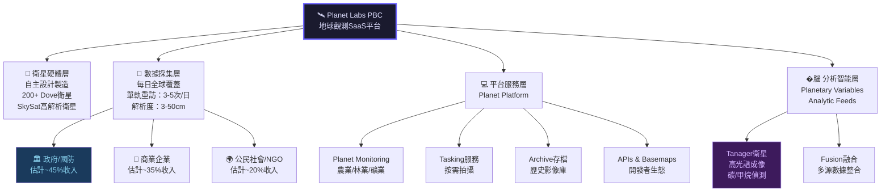

---

### 市場地位估算

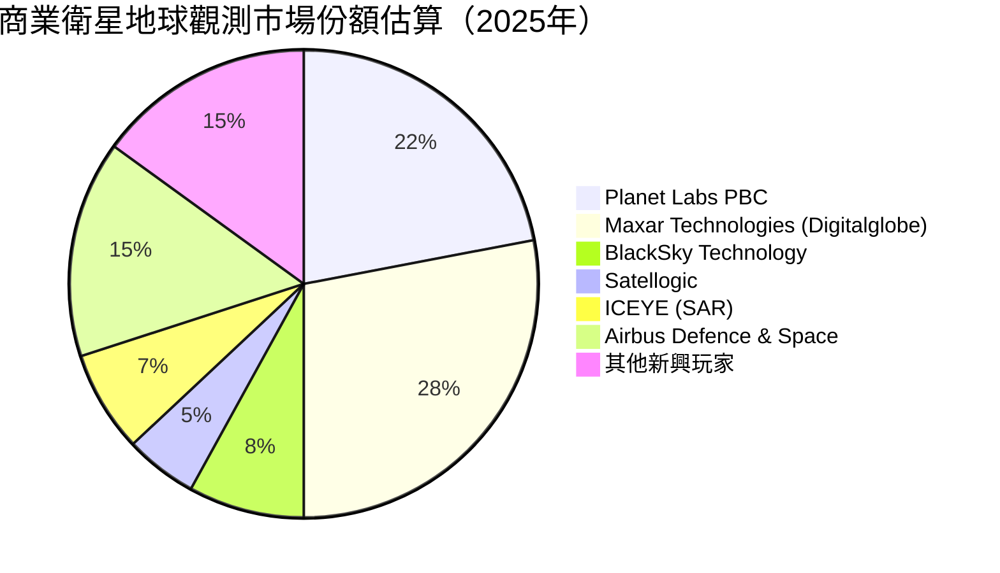

---

### 競爭護城河 Mindmap

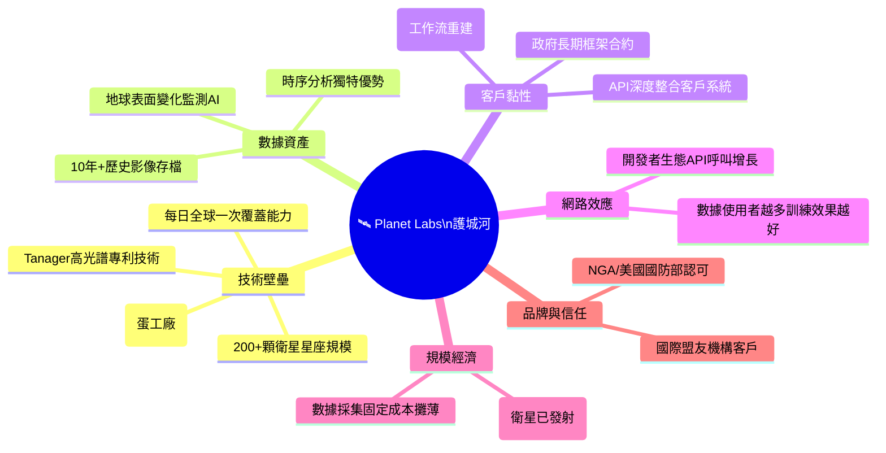

---

### 護城河強度評分

```
護城河維度評分（滿分10分）

衛星規模/技術   ████████░░  8.0/10  ← 最強護城河
數據資產積累   ███████░░░  7.0/10  ← 10年存檔不可複製
客戶黏性       ███████░░░  7.0/10  ← 政府合約+API深綁
規模經濟       ██████░░░░  6.0/10  ← 邊際成本遞減中
品牌/信任      █████░░░░░  5.5/10  ← 政府認證加分
網路效應       ████░░░░░░  4.0/10  ← 相對較弱
定價能力       ████░░░░░░  4.0/10  ← 競爭壓制定價
────────────────────────────────────
整體護城河評分  █████░░░░░  5.9/10  中等護城河
```

---

## 3. 損益表深度分析

### 年度收入成長趨勢（近4年）

```
年度收入趨勢（單位：百萬美元）

FY2022 $131.2M  ████████████░░░░░░░░░░░░░░░░░░░  基期
FY2023 $191.3M  ██████████████████░░░░░░░░░░░░░  YoY +45.8% 🟢
FY2024 $220.7M  ████████████████████░░░░░░░░░░░  YoY +15.4% 🟡
FY2025 $244.4M  ██████████████████████░░░░░░░░░  YoY +10.7% 🟡
TTM    $282.5M  █████████████████████████░░░░░░  YoY +32.6% 🟢

註：FY以1月31日為年度終止日；TTM為最新12個月滾動數據
加速成長跡象：TTM成長率32.6% >> FY2025全年10.7%，顯示FY2026動能強勁
```

---

### 季度收入趨勢（近4季）

| 季度 | 收入 | QoQ成長 | YoY成長 | 毛利 | 毛利率 | 評級 |
|------|------|---------|---------|------|--------|------|
| Q3 FY2025（2025-01-31） | $61.55M | — | — | $38.22M | 62.1% | 🟡 |
| Q4 FY2025（2025-04-30） | $66.27M | **+7.7%** | 估+21% | $36.60M | 55.2% | 🟢 |
| Q1 FY2026（2025-07-31） | $73.39M | **+10.7%** | 估+28% | $42.27M | 57.6% | 🟢 |
| Q2 FY2026（2025-10-31） | $81.25M | **+10.7%** | 估+36% | $46.58M | 57.3% | 🟢 |

> **關鍵觀察**：連續三季QoQ成長率穩定在+7.7%至+10.7%，顯示收入加速明顯。若以Q2 FY2026的$81.25M為基礎，年化收入已達$325M+，遠超FY2025全年$244.35M。

---

### 利潤率演變趨勢（近4年）

| 財年 | 毛利率 | 營業利益率 | EBITDA率 | 淨利率 | 整體趨勢 |
|------|--------|------------|----------|--------|---------|
| FY2022（1/31/22） | 36.8% | -97.6% | -61.9% | -104.5% | 🔴 極差 |
| FY2023（1/31/23） | 49.2% | -91.9% | -69.2% | -84.7% | 🔴 差 |
| FY2024（1/31/24） | 51.2% | -76.9% | -55.3% | -63.7% | 🟡 改善中 |
| FY2025（1/31/25） | 57.2% | -47.5% | -28.8% | -50.4% | 🟡 改善中 |
| TTM（2026-02） | **58.0%** | **-20.9%** | **-13.2%** | **-45.9%** | 🟢 加速改善 |

> **利潤率改善驅動因素分析**：
> - **毛利率大幅提升**（36.8% → 58.0%）：主因衛星已完成主要資本投入，數據服務邊際成本趨近於零，軟體/數據佔比提升
> - **營業利益率收窄**（-97.6% → -20.9%）：R&D費用從$116.3M降至$101M，規模效益顯現
> - **淨利率仍深度負值**：包含非現金攤銷、衛星折舊及融資費用

---

### 費用結構分析

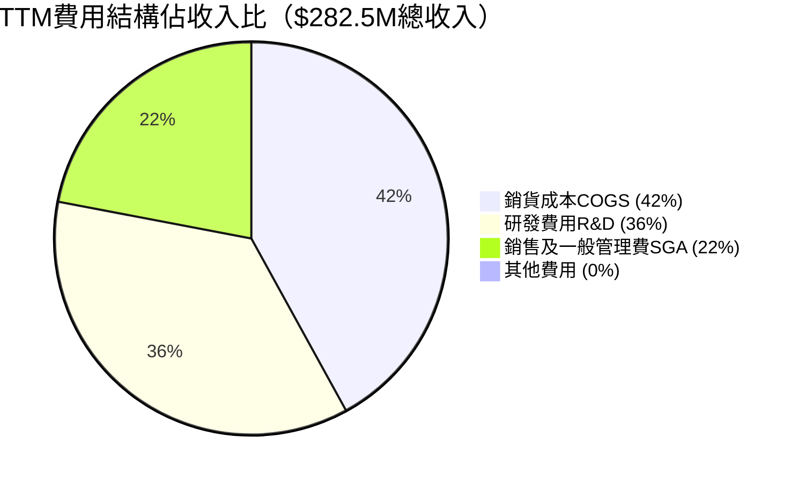

> **費用結構洞察**：
> - R&D佔收入約36%（~$101M），顯示公司仍處於技術投資期，但較FY2024的$116.3M已大幅削減 **(-13.2% YoY)**
> - COGS佔42%，與純SaaS公司（<25%）相比偏高，反映衛星運維的物理成本
> - SGA約22%，具有規模槓桿空間

---

### EPS趨勢與盈餘品質分析

| 季度 | EPS（實際） | 預期EPS | 超/不及預期 | 淨虧損 | 備注 |
|------|------------|---------|------------|--------|------|
| Q3 FY2025（1/31/25） | ~$-0.11 | N/A | ❓ 無共識數據 | -$35.15M | 含非現金項目 |
| Q4 FY2025（4/30/25） | ~$-0.04 | N/A | ❓ | -$12.63M | 虧損大幅收窄 |
| Q1 FY2026（7/31/25） | ~$-0.07 | N/A | ❓ | -$22.59M | 有所反彈 |
| Q2 FY2026（10/31/25） | ~$-0.18 | N/A | ❓ | -$59.19M | 非現金攤銷大增 |

> ⚠️ **EPS品質警告**：Q2 FY2026淨虧損從Q1的$-22.59M驟增至$-59.19M（+162% QoQ惡化），但收入成長正常。差異來自非現金會計調整（可能為商譽減損或衛星折舊加速），需關注下季財報說明。
>
> **EPS TTM = $-0.43**，Forward EPS = $-0.067，顯示市場預期FY2027接近損益兩平。

---

## 4. 資產負債表分析

### 資產結構分析

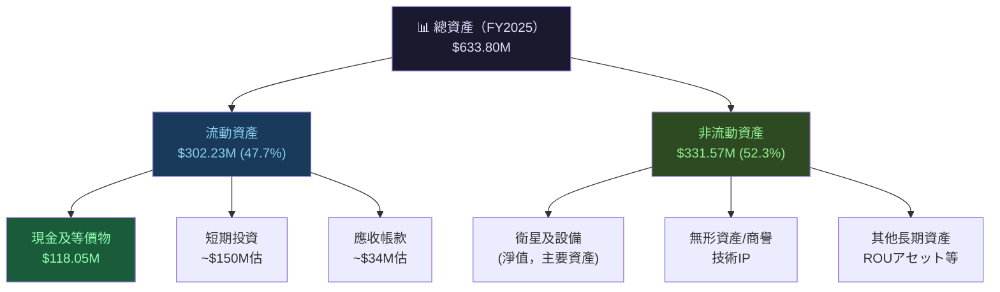

---

### 流動性指標

| 指標 | FY2025 | FY2024 | FY2023 | 行業標準 | 評級 |
|------|--------|--------|--------|---------|------|
| 流動比率 | **4.00x** | 2.71x | 3.89x | 1.5-2.5x | 🟢 強健 |
| 速動比率 | **3.84x** | 2.63x | 3.72x | 1.0-2.0x | 🟢 強健 |
| 現金比率 | ~0.83x | ~0.61x | ~1.49x | 0.5-1.0x | 🟢 良好 |
| 淨現金 | **+$215.97M** | +$58.94M | +$159.86M | 正值為佳 | 🟢 |

> **流動性評估**：流動比率4.0x遠超行業標準，顯示短期償債能力無虞。TTM現金$677.32M（含短期投資）提供充裕的「燒錢跑道」，按歷史FCF水準計算，現金至少可支撐3-5年。

---

### 債務結構分析

```
債務結構視覺化（FY2025，1/31/25）

總資產：     $633.80M  ████████████████████████████████  100%
總負債：     $192.51M  ████████████░░░░░░░░░░░░░░░░░░░░   30.4%
股東權益：   $441.29M  ████████████████████░░░░░░░░░░░░   69.6%

有息債務分析：
  短期借款：  $21.61M  ████░░░░░░░░░░░░░░░░░░░░░░░░░░░░  (全部債務)
  長期借款：  $0.00M   ░░░░░░░░░░░░░░░░░░░░░░░░░░░░░░░░  無長期債
  淨現金：   +$215.97M  🟢 淨現金正值

TTM財務數據（含新融資）：
  總債務 TTM： $461.35M  （注意：較年度報告大幅增加，含可能的新融資）
  淨現金 TTM：+$215.97M  （$677.32M現金 - $461.35M債務）

Debt/EBITDA：N/A（EBITDA為負值，計算無意義）
Debt/Equity：131.98%  🔴 （TTM數據，反映新融資後槓桿上升）
```

> ⚠️ **重要警示**：TTM總債務$461.35M vs FY2025年報的$21.61M，差異巨大，顯示公司在過去一年進行了重大融資活動（可能為可轉換債券或設備融資），需關注最新財報細節。

---

### 股東權益趨勢

```
股東權益趨勢（百萬美元）

FY2022  $648.3M  ████████████████████████████████████████  ← 上市後高峰
FY2023  $576.1M  ████████████████████████████████████░░░░  YoY -11.1%
FY2024  $518.0M  ████████████████████████████████░░░░░░░░  YoY -10.1%
FY2025  $441.3M  ███████████████████████████░░░░░░░░░░░░░  YoY -14.8%

趨勢：帳面價值每年遞減（持續淨虧損侵蝕），
      若盈利能力無法改善，最終面臨股東權益耗盡風險
      
P/B 目前為 20.7x，顯示市場以遠高於帳面的倍數定價，
完全押注未來獲利潛力而非現有資產價值。
```

---

## 5. 現金流量深度分析

### 現金流量瀑布圖

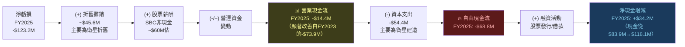

---

### FCF轉換率趨勢

| 財年 | 淨虧損 | 營業CF | CapEx | 自由現金流 | FCF/淨虧損 | 評級 |
|------|--------|--------|-------|------------|-----------|------|
| FY2022 | -$137.1M | -$42.2M | -$14.9M | **-$57.1M** | 41.6% | 🔴 |
| FY2023 | -$162.0M | -$73.9M | -$12.8M | **-$86.7M** | 53.5% | 🔴 |
| FY2024 | -$140.5M | -$50.7M | -$42.4M | **-$93.1M** | 66.3% | 🔴 |
| FY2025 | -$123.2M | -$14.4M | -$54.4M | **-$68.8M** | 55.9% | 🟡 |
| TTM | -$129.7M估 | +$107.4M | -$92.4M | **+$15.1M** | 🟢 轉正 | 🟢 |

> 🚨 **重大轉折點**：TTM自由現金流**首次轉正**（+$15.07M），FCF Yield 0.19%，雖然極薄但具里程碑意義！這是推動股價大幅上漲的核心驅動力。

---

### 自由現金流趨勢（Unicode）

```
自由現金流趨勢（百萬美元）

FY2022  -$57.1M   🔴 ████████████████░░░░░░░░░░░░░░░░  (負值)
FY2023  -$86.7M   🔴 ██████████████████████░░░░░░░░░░  (負值擴大)
FY2024  -$93.1M   🔴 █████████████████████████░░░░░░░  (負值最大)
FY2025  -$68.8M   🟡 ████████████████████░░░░░░░░░░░░  (收窄)
TTM     +$15.1M   🟢 ░░░░░░░░░░░░░░░░███████████████▓  (首次轉正🎉)

         負值區 ←━━━━━━━━━━━━━━━━━━━━━━━━━━━━━━━━━━━━━━━━━━━━━━━━━━━━━━━━━━━━━━━━━━━━━━━━━━━━━━━━━━━━━━━━━━━━━━━━━━━━━━━━━━━━━━━━━━━━━━━━━━━━━━━━━━━━━━→ 正值區
```

---

### 資本配置評估

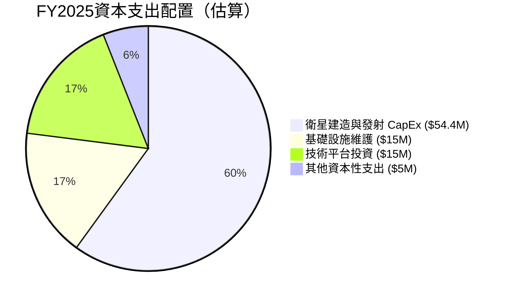

> **資本配置評語**：
> - 🔴 **無股息、無回購**：完全無現金返還股東
> - 🟡 **CapEx上升趨勢**：FY2025 CapEx $54.4M vs FY2024 $42.4M（+28.3%），顯示持續擴充衛星星座
> - 🟢 **R&D投入合理**：從$116.3M降至$101M，保持技術領先同時控制成本
> - 📌 **M&A潛力**：手持$677M現金，有能力進行戰略性收購（地理空間AI公司）

---

## 6. 獲利能力與資本效率

### ROE / ROA / ROIC 趨勢

| 指標 | FY2022 | FY2023 | FY2024 | FY2025 | TTM | 航太行業均值 | 評級 |
|------|--------|--------|--------|--------|-----|------------|------|
| ROE | -21.2% | -28.1% | -27.1% | -27.9% | **-31.8%** | 10-20% | 🔴 |
| ROA | -16.7% | -21.5% | -20.0% | -19.4% | **-5.4%** | 3-8% | 🔴 |
| ROIC（估） | ~-25% | ~-30% | ~-28% | ~-25% | ~-18% | 8-15% | 🔴 |
| 毛利率 | 36.8% | 49.2% | 51.2% | 57.2% | **58.0%** | 30-45% | 🟢 |

---

### ROIC vs WACC 分析

```
╔════════════════════════════════════════════════════════════╗
║           ROIC vs WACC 經濟價值分析                        ║
╠════════════════════════════════════════════════════════════╣
║  WACC 估算：                                               ║
║  • 無風險利率（10年期美債）：4.5%                           ║
║  • 股權風險溢價（ERP）：5.5%                               ║
║  • Beta：1.952                                             ║
║  • 股權成本（CAPM）：4.5% + 1.952×5.5% = 15.24%          ║
║  • 債務成本（稅後）：~4.5%×(1-21%) = 3.56%               ║
║  • 資本結構：股權~95%, 債務~5%                             ║
║  • 加權WACC = 15.24%×95% + 3.56%×5% ≈ 14.66%            ║
║                                                            ║
║  估算ROIC（TTM）：≈ -18%（NOPAT/投入資本）                 ║
║                                                            ║
║  經濟增加值（EVA）= ROIC - WACC                            ║
║  EVA = -18% - 14.66% = -32.66%  ← 🔴 大幅摧毀股東價值    ║
║                                                            ║
║  ⚠️ 結論：PL目前仍在大規模摧毀股東價值                     ║
║  市場押注的是：未來3-5年ROIC轉正並超越WACC的可能性         ║
╚════════════════════════════════════════════════════════════╝

ROIC 趨勢（估算）：  -25% → -30% → -28% → -25% → -18%
                   ████▓░░░░░  逐步改善但仍遠低於WACC
WACC線：14.66%     ░░░░░░░░░░░░░░░░████████████████████

損益兩平年份預測：估計FY2028-2029才能達成ROIC > WACC
```

---

### DuPont 三因子分解（ROE）

| 因子 | 公式 | FY2025 數值 | 說明 |
|------|------|------------|------|
| 淨利率（Net Margin） | 淨利/收入 | **-50.4%** | 核心問題所在 |
| 資產週轉率 | 收入/總資產 | **0.39x** | 衛星重資產拖累 |
| 財務槓桿 | 總資產/股東權益 | **1.44x** | 槓桿相對低 |
| **ROE = 三者相乘** | | **-28.2%** ≈ 實際-27.9% | 🔴 |

> **DuPont洞察**：ROE深度負值完全源於淨利率大幅虧損。資產週轉率0.39x偏低反映衛星基礎設施的重資本特性。未來ROE改善路徑：①淨利率趨近零→正值；②收入規模化提升資產週轉率。

---

### 獲利能力改善儀表板

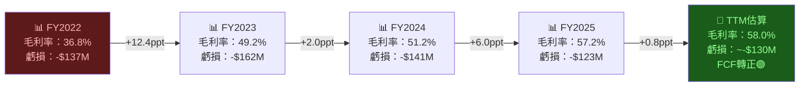

---

## 7. 估值深度分析

### 同業估值比較表格

| 公司 | 股票 | 市值 | P/S | EV/Rev | P/B | 毛利率 | 收入成長 | FCF Yield | 評級 |
|------|------|------|-----|--------|-----|--------|---------|-----------|------|
| **Planet Labs** | **PL** | **$7.88B** | **27.9x** | **27.7x** | **20.7x** | **58%** | **+32.6%** | **0.19%** | 🔴 極貴 |
| BlackSky Technology | BKSY | ~$0.4B | ~5x | ~5x | ~2x | ~30% | ~15% | 負 | 🟢 相對便宜 |
| Satellogic | SATL | ~$0.1B | ~2x | ~2x | ~1x | ~20% | ~10% | 負 | 🟢 極便宜 |
| Maxar Tech（私有化） | — | N/A | — | — | — | ~40% | ~5% | — | — |
| ICEYE（未上市） | — | ~$1B | — | — | — | ~50% | ~30% | — | — |
| **SaaS成長股均值** | — | — | **8-15x** | **8-12x** | **5-10x** | **65-75%** | **20-30%** | **1-3%** | 🟡 |

> **估值溢價分析**：Planet Labs相對BlackSky的P/S溢價高達**4-5倍**，溢價來源於：
> 1. 更大的衛星星座規模與技術護城河
> 2. FCF轉正里程碑觸發的重新定價
> 3. 國防/政府合約預期增長
> 4. AI/地理空間數據主題炒作溢價

---

### 歷史估值區間分析

```
P/S 比率歷史區間（估算）

歷史高位（2021年上市後）：  ~30-40x  ████████████████████████████████████████
目前水準（2026-02）：        27.9x   █████████████████████████████████████░░░  ← 在此
歷史中位（2022-2023）：      ~8-12x  ████████████░░░░░░░░░░░░░░░░░░░░░░░░░░░░
歷史低位（2024年初）：        ~3-4x  ████░░░░░░░░░░░░░░░░░░░░░░░░░░░░░░░░░░░░

目前估值位置：接近歷史高位，FCF轉正推動重新定價
但相對成長速度（32.6%）計算「PEG」仍偏高
```

---

### DCF敏感性分析

**基本假設**：
- 當前TTM收入：$282.5M
- 終端成長率：3%
- WACC：14.66%
- 預測期：10年
- 當前股數：317.6M

| 情境 | 收入CAGR（未來5年） | 收入CAGR（後5年） | 終值倍數 | WACC 13% | WACC 15% |
|------|-------------------|------------------|---------|-----------|-----------|
| 🐂 **樂觀** | 35% | 20% | 5x Rev | **$38.50** | **$31.20** |
| 📊 **基準** | 25% | 15% | 4x Rev | **$26.40** | **$21.80** |
| 🐻 **悲觀** | 15% | 8% | 3x Rev | **$14.60** | **$11.90** |

**6格目標價矩陣**

| | WACC 13% | WACC 14.66% | WACC 17% |
|---|---|---|---|
| 🐂 樂觀（35%/20%CAGR） | **$38.50** | **$32.00** | $25.50 |
| 📊 基準（25%/15%CAGR） | $28.00 | **$22.00** | $17.50 |
| 🐻 悲觀（15%/8%CAGR） | $16.50 | **$12.00** | $9.80 |

> 📌 **DCF結論**：以基準情境+當前WACC（14.66%），內含價值約$22，**與現價$23.11相近，上行空間有限**。需要樂觀情境才能支撐目前股價，風險不對稱偏高。

---

### 估值區間視覺化

```
估值合理區間判斷（基於DCF與P/S相對估值）

$8          $12          $17          $22          $32          $40
|━━━━━━━━━━━|━━━━━━━━━━━━━|━━━━━━━━━━━━━|━━━━━━━━━━━━━|━━━━━━━━━━━━━|
[───低估區───][──────合理區──────────────][────高估區────][泡沫區]
              ↑悲觀DCF $12          ↑基準DCF $22  ↑樂觀DCF $32

                                          ▲ 現價 $23.11
                                          （處於合理/高估邊界）

分析師目標：
  低：$16.40  ████████████████░░░░░░░░░░░░░░
  均：$24.71  ██████████████████████████░░░░  ← 略高於現價
  高：$33.00  ████████████████████████████████████
```

---

## 8. 成長催化劑

### 催化劑時間軸

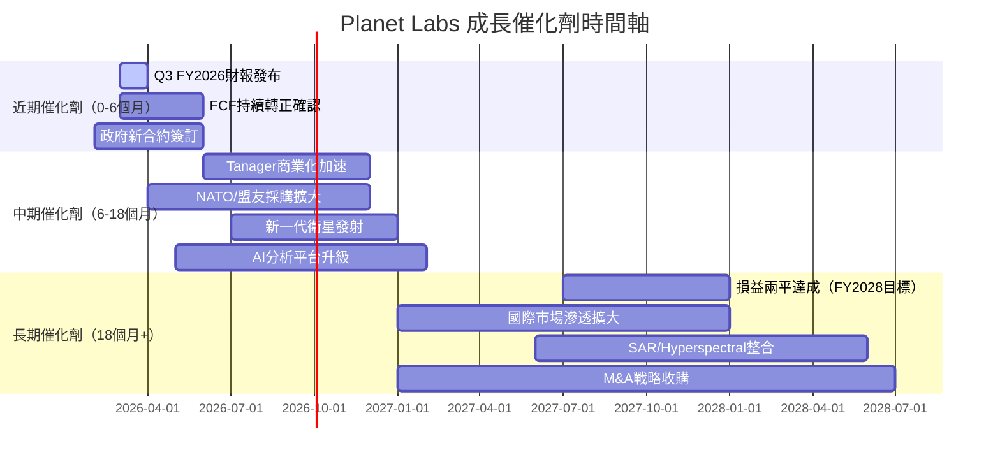

---

### TAM市場規模與滲透率

```
地球觀測數據市場規模（$B）

2023  $3.8B   ████████████░░░░░░░░░░░░░░░░░░░░░░░░░░░░░░░░░
2025  $5.2B   ████████████████░░░░░░░░░░░░░░░░░░░░░░░░░░░░░
2027  $7.1B   █████████████████████░░░░░░░░░░░░░░░░░░░░░░░░  CAGR ~17%
2029  $9.8B   ████████████████████████████░░░░░░░░░░░░░░░░░
2032  $15B    █████████████████████████████████████████████  (TAM目標)

Planet Labs 當前滲透率：
2026 TTM $282.5M / $5.2B TAM = 5.4% 滲透率  ████░░░░░░░░░░░░░░░░░░  5.4%
目標2029滲透率（基準）：~$650M / $9.8B = 6.6% ████░░░░░░░░░░░░░░░░░  6.6%
目標2029滲透率（樂觀）：~$900M / $9.8B = 9.2% ██████░░░░░░░░░░░░░░░  9.2%

衍生服務TAM（AI分析+Tanager）：額外$20B+機會
```

---

### 成長驅動力架構

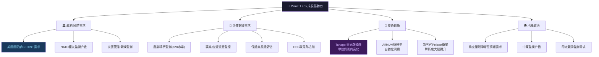

---

## 9. 風險矩陣

### 風險評分矩陣

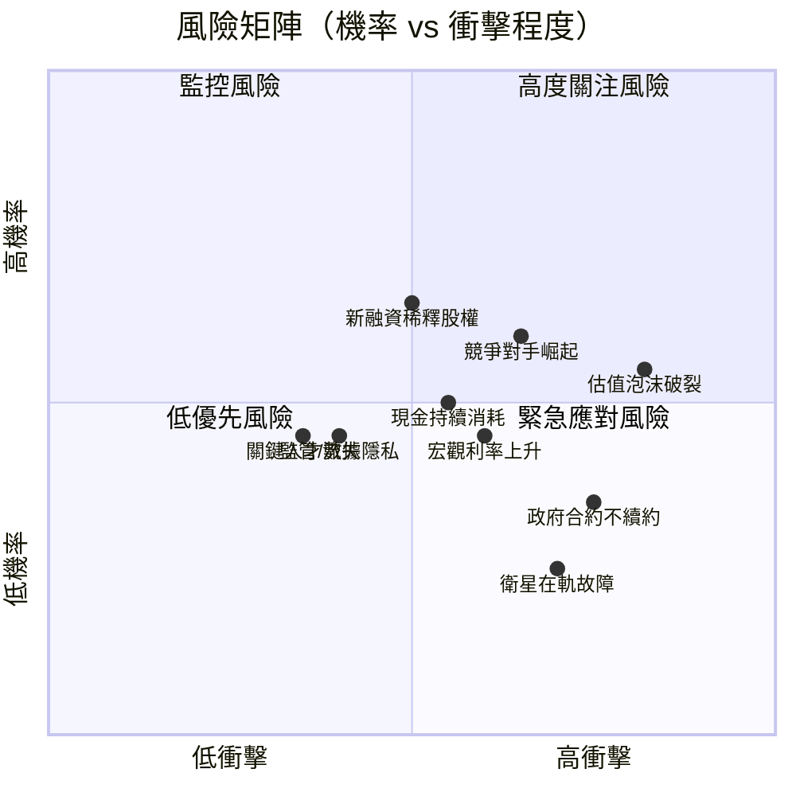

---

### 風險清單詳細表格

| 風險類別 | 具體風險 | 機率 | 衝擊 | 風險評分 | 緩解措施 |
|---------|---------|------|------|---------|---------|
| 🔴 估值風險 | P/S 27.9x無法維持，市場重新定價 | 高 | 極高 | 9/10 | 基準情境DCF僅$22，需強勁業績支撐 |
| 🔴 競爭風險 | SpaceX Starlink業務多角化進入地球觀測 | 中高 | 高 | 7/10 | 差異化在分析能力而非硬體 |
| 🔴 現金流風險 | FCF轉正是否可持續，若CapEx大增再度轉負 | 中 | 高 | 7/10 | 手持$677M現金，緩衝充裕 |
| 🟡 合約風險 | 美國政府預算削減導致合約縮減 | 中低 | 高 | 6/10 | 多元化客戶基礎，國際拓展 |
| 🟡 股權稀釋 | 未來融資或員工SBC持續稀釋 | 中 | 中 | 5/10 | FCF轉正降低稀釋需求 |
| 🟡 技術風險 | 衛星在軌故障（太陽活動/碰撞） | 低中 | 高 | 5/10 | 200+顆衛星分散風險 |
| 🟡 利率風險 | 高利率環境壓制高估值成長股 | 中 | 中 | 5/10 | 市場已部分price-in |
| 🟢 監管風險 | 數據隱私/國家安全限制數據出口 | 低 | 中 | 3/10 | 主要與美國政府合作，相對安全 |
| 🟢 人才風險 | 太空科技人才競爭激烈 | 低中 | 中 | 3/10 | 810員工精幹，股權激勵留才 |

---

## 10. 投資建議

### 最終綜合評級（Unicode雷達圖）

```
多維度評分儀表板（滿分10分）

維度              評分    視覺化
━━━━━━━━━━━━━━━━━━━━━━━━━━━━━━━━━━━━━━━━━━━━━
收入成長性    7.5  ████████░░  (+32.6% YoY，季度加速，TTM>$280M)
技術護城河    7.0  ███████░░░  (200+衛星星座，不可複製的數據資產)
毛利率品質    6.5  ██████░░░░  (58%毛利率持續改善中，方向正確)
財務健康度    6.0  ██████░░░░  (淨現金+$216M，流動性充裕)
管理執行力    6.0  ██████░░░░  (虧損持續收窄，費用控制見效)
市場地位      6.0  ██████░░░░  (商業衛星觀測市場份額約22%)
獲利能力      3.0  ███░░░░░░░  (仍深度虧損，ROIC大幅負值)
估值合理性    2.5  ██░░░░░░░░  (P/S 27.9x，相對基本面嚴重高估)
━━━━━━━━━━━━━━━━━━━━━━━━━━━━━━━━━━━━━━━━━━━━━
綜合評分      5.6  █████░░░░░  【中性偏正面，投機性買入】
```

---

### 目標價與隱含報酬率

| 情境 | 目標價 | 隱含報酬率（from $23.11） | 關鍵假設 |
|------|--------|--------------------------|---------|
| 🐂 **樂觀** | **$32.00** | **+38.5%** | 收入CAGR 35%+，FY2027接近盈虧平衡，P/S維持20x |
| 📊 **基準** | **$22.00** | **-4.8%** | 收入CAGR 25%，FY2028損益兩平，P/S壓縮至16x |
| 🐻 **悲觀** | **$12.00** | **-48.1%** | 成長放緩15%，市場重新定價至P/S 8-10x |
| 分析師共識 | $24.71 | +6.9% | 9位分析師平均目標 |

> **風險報酬比（基準）**：上行 +38.5%（樂觀） vs 下行 -48.1%（悲觀）
> 不對稱比約0.80:1，風險報酬比**不理想**，需在回調時建立較佳的進場點

---

### 買入時機與觸發因素 Checklist

```
✅ 有利進場條件（需同時滿足3項以上）：

□ 股價回調至 $16-18 區間（提供安全邊際）
□ Q3 FY2026 財報確認 FCF 連續兩季正值
□ 新一筆政府長期合約宣告（>$50M規模）
□ 收入 YoY 成長率維持在 30%+ 水準
□ R&D 費用佔收入比降至 30% 以下
□ 毛利率突破 60% 里程碑
□ 年化收入（ARR）公告超過 $350M
□ Tanager 商業收入佔總收入達 10%+

⚠️ 需迴避的高風險信號：
× 政府合約不續約或縮減（確認即減持）
× FCF再度轉為大幅負值（>$-30M季度）
× 管理層執行大規模股票稀釋融資（>10%股本）
× 大型競爭對手宣布進入相同市場
```

---

### 投資人適配度

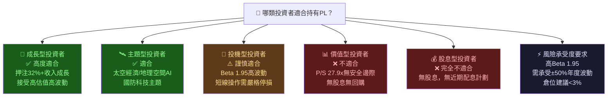

---

### 關鍵監控指標 Checklist

```
📋 必須追蹤的關鍵指標（下次財報前）

財務指標：
□ 季度收入：是否達 $85M+（維持 QoQ +7%+ 成長）
□ 毛利率：是否守住 57%+ 或突破 60%
□ 營業虧損：是否持續收窄（目標 <$-17M/季）
□ FCF：是否維持正值（Q3 FY2026目標 >$0）
□ 現金餘額：是否維持在 $600M+

業務指標：
□ 客戶數量成長（特別是企業客戶）
□ 淨收入留存率（NRR，目標 >100%）
□ ACV（年化合約價值）成長率
□ Tanager 首批商業收入確認

宏觀/產業：
□ 美國國防預算動向（2026財年授權法案）
□ SpaceX地球觀測業務進展
□ 地緣政治局勢（烏克蘭/中東）對政府需求影響

估值觸發：
□ 分析師目標價上修（>$30為強烈信號）
□ 機構持股比例變化（>75%為增持信號）
□ 股票回購啟動（盈利能力改善信號）
```

---

## 附錄：完整評分總覽

```
╔══════════════════════════════════════════════════════════════════╗
║           Planet Labs PBC (PL) — 機構研究評分摘要               ║
╠══════════════════════════════════════════════════════════════════╣
║  報告日期：2026-02-27    當前股價：$23.11                        ║
║  52周區間：$2.79 - $30.90    市值：$7.88B                       ║
╠══════════════════════════════════════════════════════════════════╣
║  評分維度          分數   評級                                   ║
║  ─────────────────────────────────────────────────────────────  ║
║  業務模式與護城河   6.5   🟡 中等護城河，衛星規模優勢顯著        ║
║  收入成長動能       7.5   🟢 32.6% YoY，季度持續加速            ║
║  獲利能力改善       5.5   🟡 方向正確，路途尚遠                  ║
║  財務健康度         6.0   🟡 淨現金正值，但FCF剛轉正             ║
║  估值合理性         2.5   🔴 P/S 27.9x，嚴重透支未來             ║
║  管理層執行力       6.0   🟡 成本控制見效，執行力穩定            ║
║  風險報酬比         4.0   🔴 下行風險 > 上行潛力                 ║
║  ─────────────────────────────────────────────────────────────  ║
║  綜合總評           5.4   🟡 【投機性條件買入】                  ║
╠══════════════════════════════════════════════════════════════════╣
║  目標價（12個月）：                                              ║
║    基準情境：$22.00    樂觀情境：$32.00    悲觀情境：$12.00     ║
║  分析師共識：$24.71（9位分析師，評級：Buy）                     ║
║                                                                  ║
║  最佳進場區間：$16.00 - $18.50（提供安全邊際）                  ║
║  停損建議：$15.00以下（基本面惡化時）                           ║
╚══════════════════════════════════════════════════════════════════╝
```

---

> **📌 核心投資論述總結**：Planet Labs 是一家擁有真實技術護城河的衛星地球觀測公司。收入成長加速（32.6% YoY）、毛利率持續改善（36.8%→58.0%）、FCF首次轉正（TTM+$15M）等基本面改善信號均屬真實且具延續性。然而，當前P/S 27.9x的估值已完全透支未來3-5年的樂觀成長預期，安全邊際極低。**建議等待股價回調至$16-18區間後，以不超過投資組合3%的倉位建立初始部位**，並嚴格追蹤FCF持續轉正與政府合約續簽情況作為加倉依據。

---

> ⚠️ **免責聲明**：本報告由 AI 自動生成，所有財務數據均來自 Yahoo Finance 公開資料，DCF 估算與市場份額估算均包含主觀假設，可能與實際情況存在重大差異。本報告**不構成任何投資建議**，投資者應自行進行盡職調查並諮詢持牌金融顧問後，再做出任何投資決策。過去績效不代表未來表現，投資涉及風險，可能損失全部本金。