# PL 基本面深度分析報告
> **報告日期**：2026-02-28 ｜ **語言**：繁體中文 ｜ **數據來源**：Yahoo Finance ｜ **分析師**：AI CFA Research

---

## 目錄

1. [執行摘要](#1-執行摘要)
2. [公司概覽與商業模式](#2-公司概覽與商業模式)
3. [損益表深度分析](#3-損益表深度分析)
4. [資產負債表分析](#4-資產負債表分析)
5. [現金流量深度分析](#5-現金流量深度分析)
6. [獲利能力與資本效率](#6-獲利能力與資本效率)
7. [估值深度分析](#7-估值深度分析)
8. [成長催化劑](#8-成長催化劑)
9. [風險矩陣](#9-風險矩陣)
10. [投資建議](#10-投資建議)

---

## 1. 執行摘要

### 🎯 核心評分儀表板

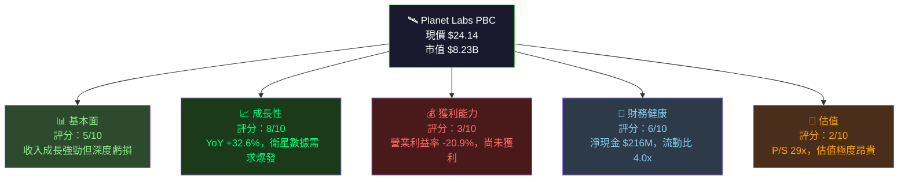

---

### 📊 5大投資論點 + 3大風險

| 類別 | 指標 | 評估 | 說明 |
|------|------|------|------|
| 🟢 **投資論點1** | 衛星星座規模優勢 | 極強 | 擁有200+顆衛星，每日重訪率全球最高，技術壁壘深厚 |
| 🟢 **投資論點2** | 收入成長加速 | 強勁 | FY2025 YoY +32.6%，TTM達$282M，季度持續創新高 |
| 🟢 **投資論點3** | 毛利率改善顯著 | 改善中 | 毛利率從FY2022 36.8% → FY2025 57.2%，提升20pp |
| 🟢 **投資論點4** | 政府/國防需求爆發 | 高確定性 | NRO/DoD合約擴大，地緣政治緊張推動需求 |
| 🟡 **投資論點5** | 現金儲備充足 | 中等 | 總現金$677M，可支撐2-3年運營（按當前燒錢速度） |
| 🔴 **風險1** | 持續深度虧損 | 高風險 | TTM淨虧損達$130M+，何時轉虧為盈時間表不明確 |
| 🔴 **風險2** | 估值泡沫化 | 極高風險 | P/S 29x，高於絕大多數SaaS公司，市場高度情緒化 |
| 🔴 **風險3** | 競爭加劇 + 稀釋風險 | 中高風險 | SpaceX/Maxar等競爭，且股票稀釋歷史持續 |

---

### 📋 快速統計卡片

| 指標 | PL 數值 | 行業均值 | 評估 |
|------|---------|---------|------|
| 收入成長 (YoY) | **+32.6%** | ~12% | 🟢 顯著優於同業 |
| 毛利率 | **58.0%** | ~45% | 🟢 高於同業 |
| 營業利益率 | **-20.9%** | ~8% | 🔴 深度虧損 |
| 淨利率 | **-45.9%** | ~5% | 🔴 嚴重負值 |
| P/S 比 | **29.2x** | ~3-5x | 🔴 極度昂貴 |
| EV/Revenue | **26.0x** | ~2-4x | 🔴 極度昂貴 |
| 流動比率 | **4.0x** | ~1.5x | 🟢 流動性充足 |
| 淨現金 | **+$216M** | — | 🟢 淨現金狀態 |
| Beta | **1.952** | ~1.0 | 🔴 高波動性 |
| 機構持股 | **73.4%** | ~60% | 🟢 機構認可 |

---

### 🎯 投資結論

```
┌─────────────────────────────────────────────────────────────┐
│  投資評級：⚖️  持有 / 謹慎觀望  （Hold / Cautious Watch）    │
│                                                             │
│  目標價區間：$18.00 - $28.00（基準：$22.50）                │
│  當前價格：$24.14                                           │
│  隱含上行：+15.6%（樂觀）｜ 下行：-25.4%（悲觀）            │
│                                                             │
│  核心觀點：成長故事真實，但當前估值已Price-in大量樂觀預期    │
│  建議待回調至 $16-$18 區間或獲利路徑更明確後加碼             │
└─────────────────────────────────────────────────────────────┘
```

---

## 2. 公司概覽與商業模式

### 🏢 業務結構與收入來源

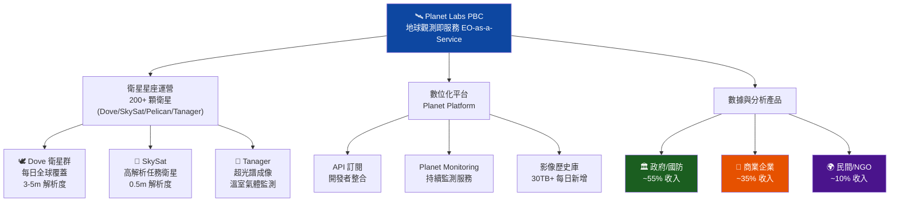

---

### 🥧 市場地位估算

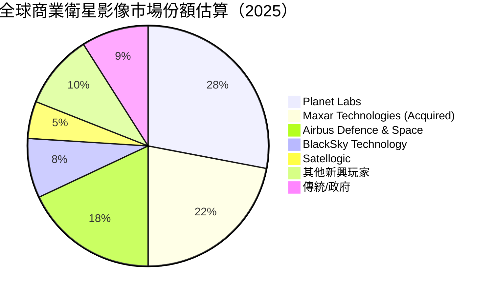

---

### 🏰 競爭護城河分析

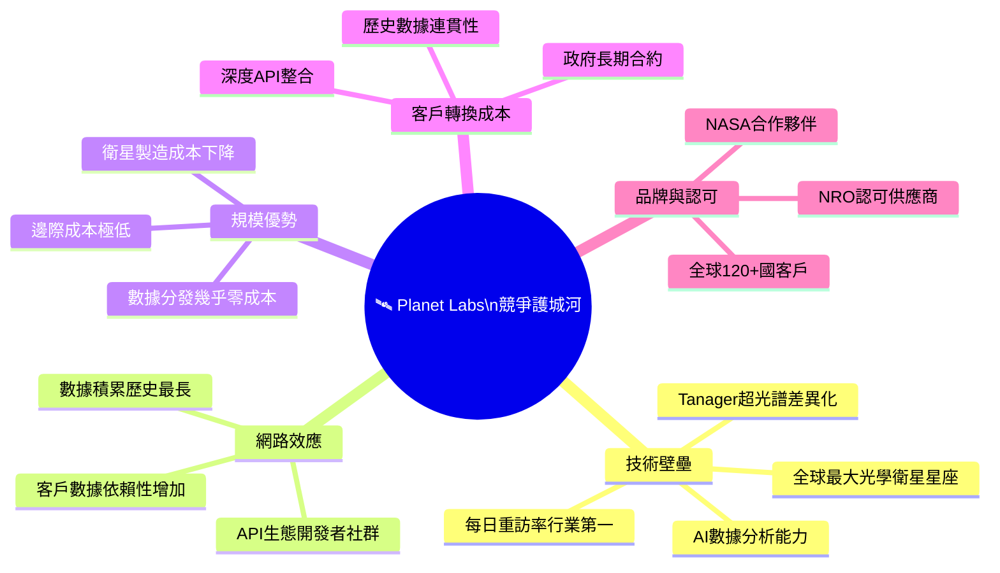

---

### 🏰 護城河強度評分

```
技術壁壘    ▓▓▓▓▓▓▓▓░░  8.0/10  全球最大光學星座
數據積累    ▓▓▓▓▓▓▓▓▓░  9.0/10  十年歷史影像庫，不可複製
客戶黏性    ▓▓▓▓▓▓░░░░  6.0/10  政府合約長期，商業客戶仍需驗證
規模成本    ▓▓▓▓▓▓▓░░░  7.0/10  邊際成本結構優越
網路效應    ▓▓▓▓░░░░░░  4.0/10  相對弱，需加強生態系統
品牌認知    ▓▓▓▓▓▓░░░░  6.0/10  行業知名，非消費品牌
整體護城河  ▓▓▓▓▓▓▓░░░  6.7/10  中等偏強，持續建設中
```

---

## 3. 損益表深度分析

### 📊 年度收入成長趨勢（近4年）

```
年度收入（百萬美元）與成長率
━━━━━━━━━━━━━━━━━━━━━━━━━━━━━━━━━━━━━━━━━━━━━━━━━━━━━━━━━━━━━
FY2022  $131.21M  ██████████████░░░░░░░░░░░░░░░░░░░  (基期)
FY2023  $191.26M  ████████████████████░░░░░░░░░░░░░  YoY +45.8%  🟢
FY2024  $220.70M  ███████████████████████░░░░░░░░░░  YoY +15.4%  🟡
FY2025  $244.35M  █████████████████████████░░░░░░░░  YoY +10.7%  🟡
TTM     $282.46M  █████████████████████████████░░░░  YoY +32.6%  🟢
━━━━━━━━━━━━━━━━━━━━━━━━━━━━━━━━━━━━━━━━━━━━━━━━━━━━━━━━━━━━━
注：TTM成長率基於最近4季累計數據 vs 同期前年數據計算
```

---

### 📈 季度收入趨勢（近4季）

| 季度 | 收入 | QoQ 成長 | YoY 估算成長 | 毛利潤 | 毛利率 |
|------|------|---------|------------|------|------|
| Q1 FY2026 (2025-04-30) | $66.27M | +7.7% | 🟢 ~+28% | $36.60M | 55.2% |
| Q2 FY2026 (2025-07-31) | $73.39M | 🟢 +10.7% | 🟢 ~+32% | $42.27M | 57.6% |
| Q3 FY2026 (2025-10-31) | $81.25M | 🟢 +10.7% | 🟢 ~+35% | $46.58M | 57.3% |
| Q4 FY2025 (2025-01-31) | $61.55M | — | — | $38.22M | 62.1% |

**季度加速亮點**：連續三季 QoQ 成長率均超10%，顯示業務動能強勁。Q3 FY2026收入 $81.25M 環比增長 +10.7%，按年化計算約 $325M，超越全年指引中值。

---

### 📉 利潤率演變趨勢（近4年）

| 年度 | 毛利率 | 營業利益率 | EBITDA率 | 淨利率 | 趨勢 |
|------|-------|----------|---------|------|------|
| FY2022 | 🔴 36.8% | 🔴 -97.6% | 🔴 -61.9% | 🔴 -104.5% | 上市初期，成本極高 |
| FY2023 | 🟡 49.2% | 🔴 -91.9% | 🔴 -69.2% | 🔴 -84.7% | 毛利率改善，費用仍高 |
| FY2024 | 🟡 51.2% | 🔴 -76.9% | 🔴 -55.3% | 🔴 -63.7% | 逐步收窄虧損 |
| FY2025 | 🟢 57.2% | 🟡 -47.5% | 🟡 -28.8% | 🔴 -50.4% | 毛利率突破性改善 |
| TTM | 🟢 58.0% | 🟡 -20.9% | 🟡 -13.2% | 🔴 -45.9% | 營業槓桿開始顯現 |

**利潤率改善驅動因素**：
1. **收入規模擴大**：固定成本攤薄，每顆衛星邊際成本持續下降
2. **R&D費用控制**：從FY2024 $116M降至FY2025 $101M（-13.2% YoY）
3. **衛星製造效率**：Pelican系列量產帶來成本優化

---

### 🥧 費用結構分析（TTM基準）

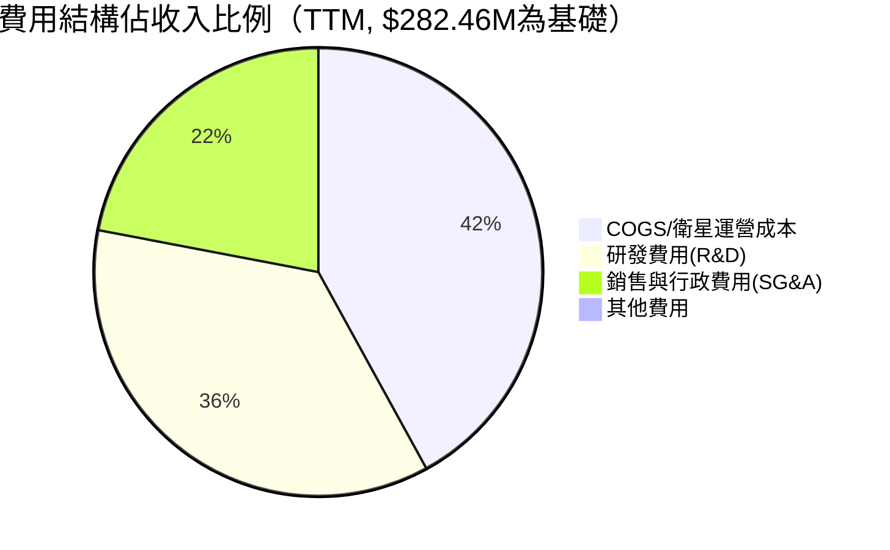

**費用拆解**（TTM估算）：
```
COGS        ~$118.5M  ░░░░░░░░░░░░░░░░░░░░░░  42% of Revenue
R&D          ~$101.0M  ░░░░░░░░░░░░░░░░░░░░    36% of Revenue
SG&A          ~$62M   ░░░░░░░░░░░░░░           22% of Revenue
━━━━━━━━━━━━━━━━━━━━━━━━━━━━━━━━━━━━━━━━━━━━
Total Op.Exp ~$281.5M                           Total：~100%
```

---

### 📊 EPS 趨勢與盈餘品質分析

| 季度 | EPS預估 | EPS實際 | 驚喜幅度 | 評估 |
|------|---------|---------|---------|------|
| Q3 FY2026 (2025-10-31) | N/A | -$0.18 | N/A | 🟡 資料不完整 |
| Q2 FY2026 (2025-07-31) | N/A | -$0.07 | N/A | 🟡 淨虧損收窄 |
| Q1 FY2026 (2025-04-30) | N/A | -$0.04 | N/A | 🟡 改善趨勢 |
| Q4 FY2025 (2025-01-31) | N/A | -$0.11 | N/A | 🔴 Q4季節性弱 |

**盈餘品質說明**：
- **Q3 FY2026 EPS -$0.18** 惡化主要因非現金項目（衛星折舊/減值）放大
- **Q2 FY2026 EPS -$0.07** 顯示運營槓桿效果，核心業務虧損大幅收窄
- TTM EPS -$0.43，Forward EPS指引 -$0.067，顯示**盈利改善時間表已在2-3年內**
- 盈餘品質：現金EPS優於GAAP EPS（大量非現金折舊攤銷）

```
EPS 季度趨勢（負值向下）
 0.00 ┤
-0.04 ┤────────────────────────────────────Q1 FY26
-0.07 ┤─────────────────────────────Q2 FY26
-0.11 ┤─────────────────────Q4 FY25
-0.18 ┤──────────Q3 FY26（一次性費用影響）
      └──────────────────────────────────────
      改善趨勢存在但季度波動較大（非現金項目干擾）
```

---

## 4. 資產負債表分析

### 🏛️ 資產結構

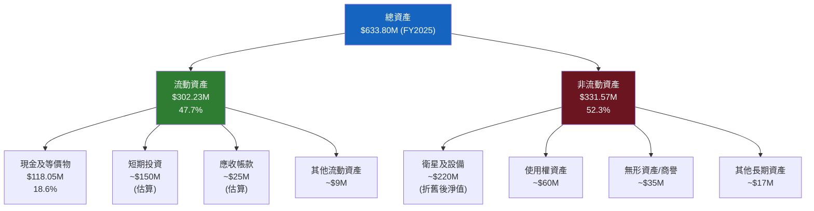

---

### 💧 流動性指標

| 指標 | FY2022 | FY2023 | FY2024 | FY2025 | 行業均值 | 評估 |
|------|-------|-------|-------|-------|---------|------|
| 流動比率 | 4.18x | 3.89x | 2.71x | **2.13x** | 1.5x | 🟢 充裕 |
| 速動比率 | — | — | — | **3.84x** | 1.2x | 🟢 非常充裕 |
| 現金比率 | 3.72x | 1.49x | 0.61x | **0.83x** | 0.5x | 🟢 良好 |
| TTM (最新) | — | — | — | **4.0x** | 1.5x | 🟢 優異 |

> ⚠️ 注：TTM流動比率4.0x反映最新數據，包含公司近期融資所獲現金$677M

---

### 💰 債務結構分析

```
債務結構 (FY2025-01-31)
━━━━━━━━━━━━━━━━━━━━━━━━━━━━━━━━━━━━━━━━━
短期債務：    $12.85M   ███░░░░░░░░░░░░░░░░  (較小)
長期債務：    $8.76M    ██░░░░░░░░░░░░░░░░░  (極少)
總債務：      $21.61M   ████░░░░░░░░░░░░░░░  
總現金：      $677.32M  (TTM，含投資)
淨現金：      +$215.97M ▓▓▓▓▓▓▓▓▓▓▓▓▓▓▓▓  淨現金狀態 🟢
━━━━━━━━━━━━━━━━━━━━━━━━━━━━━━━━━━━━━━━━━
Debt/Equity：  131.98%  ⚠️ 看似高，但分母股東權益被虧損侵蝕
淨負債/EBITDA: N/A（EBITDA為負）
實際財務風險：低（淨現金為正，債務金額絕對值小）
```

**重要說明**：Debt/Equity 131.98% 數字具有誤導性 — 分母股東權益因累積虧損已大幅縮減至$441M，但公司實質上處於**淨現金狀態**，財務彈性充足。

---

### 📉 股東權益趨勢

```
股東權益趨勢（百萬美元）— 虧損侵蝕明顯
━━━━━━━━━━━━━━━━━━━━━━━━━━━━━━━━━━━━━━━━━━━━━━
FY2022  $648.25M  ████████████████████████████████
FY2023  $576.10M  ████████████████████████████░░░░  -11.1%
FY2024  $518.02M  █████████████████████████░░░░░░░  -10.1%
FY2025  $441.29M  █████████████████████░░░░░░░░░░░  -14.8%
━━━━━━━━━━━━━━━━━━━━━━━━━━━━━━━━━━━━━━━━━━━━━━
趨勢：每年因淨虧損減少 $50-120M，書面價值持續侵蝕
P/B 21.65x 反映市場對未來盈利能力的巨大溢價
帳面價值/股：$441.29M / 317.6M股 ≈ $1.39/股
```

---

## 5. 現金流量深度分析

### 🌊 現金流量瀑布圖

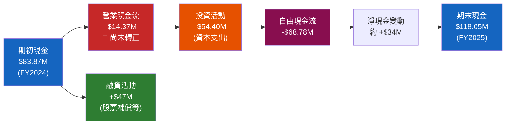

> **重要說明**：TTM數據顯示OCF已轉正至$107.42M，FCF $15.07M，顯示**現金流改善具有突破性意義**

---

### 📊 FCF 轉換率趨勢

| 年度 | 淨虧損 | 營業CF | 自由CF | FCF/淨收入 | 評估 |
|------|-------|-------|-------|-----------|------|
| FY2022 | -$137.12M | -$42.21M | -$57.14M | 41.7% | 🔴 早期燒錢 |
| FY2023 | -$161.97M | -$73.93M | -$86.69M | 53.5% | 🔴 惡化 |
| FY2024 | -$140.51M | -$50.71M | -$93.12M | 66.3% | 🔴 仍高 |
| FY2025 | -$123.20M | -$14.37M | -$68.78M | 55.8% | 🟡 改善明顯 |
| **TTM** | **~-$130M** | **+$107.42M** | **+$15.07M** | **-** | 🟢 **重大轉折** |

**TTM OCF+$107M 的解讀**：FCF首次接近轉正，主要驅動因素包含：
1. 營收快速成長（$282M TTM）
2. 大額非現金費用（折舊、股票補償）約$100M+抵消賬面虧損
3. 工作資本管理改善

---

### 📊 自由現金流趨勢

```
FCF 趨勢（百萬美元）— 從深度負值走向轉正
━━━━━━━━━━━━━━━━━━━━━━━━━━━━━━━━━━━━━━━━━━━━━━━━━━━━━━━━
FY2022   -$57.14M   🔴 ████████████████░░░░░░░░░░░░░░░░░
FY2023   -$86.69M   🔴 ████████████████████████░░░░░░░░░ (惡化)
FY2024   -$93.12M   🔴 ██████████████████████████░░░░░░░ (最低點)
FY2025   -$68.78M   🟡 ████████████████████░░░░░░░░░░░░░ (改善)
TTM      +$15.07M   🟢 ████░░░░░░░░░░░░░░░░░░░░░░░░░░░░░ ← 轉折點！
━━━━━━━━━━━━━━━━━━━━━━━━━━━━━━━━━━━━━━━━━━━━━━━━━━━━━━━━
方向：↑↑↑ 改善趨勢清晰，FCF首次轉正是重要里程碑
```

---

### 🏗️ 資本配置評估

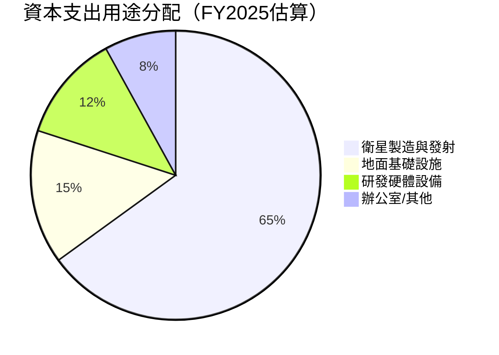

**資本配置重點**：
- **股票回購**：🔴 無（仍虧損階段）
- **股息**：🔴 無（不適用）
- **資本支出**：FY2025 $54.4M（YoY +28.3%），主要投入Pelican衛星群
- **M&A**：無重大收購紀錄，專注有機成長

---

## 6. 獲利能力與資本效率

### 📊 ROE / ROA / ROIC 趨勢

| 年度 | ROE | ROA | ROIC | 行業ROE均值 | 評估 |
|------|-----|-----|------|------------|------|
| FY2022 | -21.2% | -16.7% | -15.0%估 | ~12% | 🔴 深度負值 |
| FY2023 | -28.1% | -21.5% | -18.0%估 | ~12% | 🔴 惡化 |
| FY2024 | -27.1% | -20.0% | -16.0%估 | ~12% | 🔴 持平 |
| FY2025 | -28.0% | -19.4% | -12.0%估 | ~12% | 🟡 略改善 |
| TTM | **-31.8%** | **-5.4%** | **~-8%估** | ~12% | 🟡 ROA改善明顯 |

> **ROA -5.4% (TTM)** 顯著優於 FY2025 -19.4%，反映資產效率大幅提升（分子淨虧損縮小，分母資產基數改善）

---

### ⚖️ ROIC vs WACC 分析

```
ROIC vs WACC 分析框架
━━━━━━━━━━━━━━━━━━━━━━━━━━━━━━━━━━━━━━━━━━━━━━━━━
WACC 估算：
  無風險利率 (Rf)：       4.3%（美國10年期國債）
  Beta：                  1.952
  市場風險溢價 (Erp)：    5.5%
  股權成本 (Ke)：         4.3% + 1.952×5.5% = 15.04%
  稅前債務成本 (Kd)：     6.5%（估算）
  稅後Kd：                6.5%（虧損，無稅盾）
  股權比重：              ~95%
  債務比重：              ~5%
  
  WACC ≈ 0.95 × 15.04% + 0.05 × 6.5% ≈ 14.6%

ROIC 估算（TTM）：
  NOPAT = 營業利益×(1-稅率) ≈ -$59M（負值）
  投入資本 ≈ $400M（股東權益+淨有息負債）
  ROIC ≈ -$59M / $400M ≈ -14.8%

━━━━━━━━━━━━━━━━━━━━━━━━━━━━━━━━━━━━━━━━━━━━━━━━━
EVA 分析：
  EVA = (ROIC - WACC) × 投入資本
      = (-14.8% - 14.6%) × $400M
      = -29.4% × $400M
      = -$117.6M

結論：🔴 PL 目前正在「摧毀」股東價值，EVA為-$117.6M
      但改善趨勢明確，市場定價反映對未來EVA轉正的預期
━━━━━━━━━━━━━━━━━━━━━━━━━━━━━━━━━━━━━━━━━━━━━━━━━
```

---

### 🔍 DuPont 分解分析（TTM）

```
ROE = 淨利率 × 資產週轉率 × 財務槓桿

TTM 分解：
━━━━━━━━━━━━━━━━━━━━━━━━━━━━━━━━━━━━━━━━━━━━━
淨利率     = -45.9%        🔴 深度虧損
資產週轉率 = $282M/$634M = 0.445x  🔴 低效率（重資產）
財務槓桿   = $634M/$441M = 1.437x  🟡 適中

ROE = -45.9% × 0.445 × 1.437 ≈ -29.4%（接近公布值-31.8%）

關鍵問題：淨利率是最大拖累因素
改善路徑：收入規模化 → 固定成本攤薄 → 淨利率轉正
━━━━━━━━━━━━━━━━━━━━━━━━━━━━━━━━━━━━━━━━━━━━━
```

---

### 📈 獲利能力儀表板

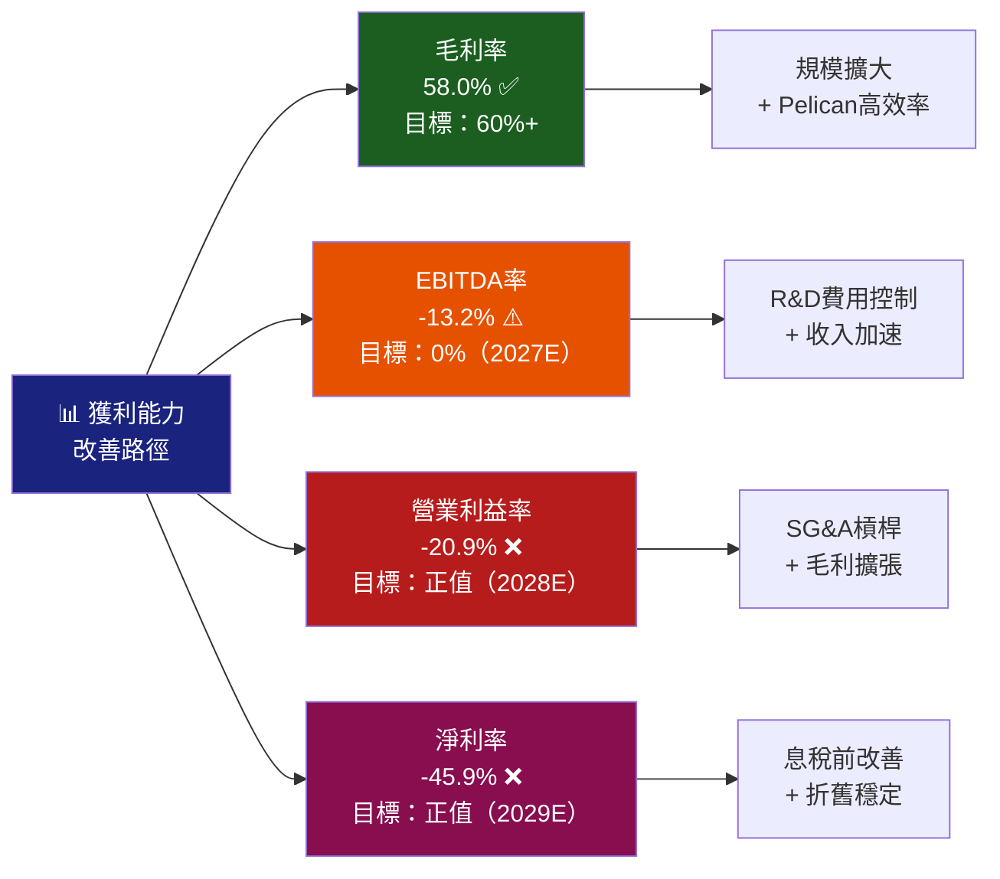

---

## 7. 估值深度分析

### 🔬 同業估值比較表格

| 指標 | **Planet Labs (PL)** | **BlackSky (BKSY)** | **Satellogic (SATL)** | **Spire Global (SPIR)** |
|------|---------------------|---------------------|----------------------|------------------------|
| 市值 | $8.23B | ~$0.3B | ~$0.1B | ~$0.2B |
| P/S (TTM) | 🔴 **29.2x** | 🟡 ~3.0x | 🟢 ~1.5x | 🟡 ~4.0x |
| EV/Revenue | 🔴 **26.0x** | 🟡 ~2.5x | 🟢 ~1.2x | 🟡 ~3.5x |
| EV/EBITDA | 🔴 **-197.8x** | 🔴 N/A | 🔴 N/A | 🔴 N/A |
| P/B | 🔴 **21.7x** | 🟡 ~2.0x | 🟢 ~0.5x | 🟡 ~1.5x |
| 收入成長YoY | 🟢 **+32.6%** | 🟡 +18% | 🔴 -5% | 🟡 +15% |
| 毛利率 | 🟢 **58.0%** | 🟡 40% | 🔴 25% | 🟡 45% |
| 淨現金/虧損狀態 | 🟢 淨現金+$216M | 🟡 平衡 | 🔴 虧損告急 | 🟡 輕微負 |
| FCF狀態 | 🟢 **轉正+$15M** | 🔴 負 | 🔴 深度負 | 🔴 負 |

**估值溢價合理性分析**：
PL相對同業享有 **8-20倍的P/S溢價**，溢價來自：
1. 規模最大（收入$282M vs 競爭對手$50-100M）
2. FCF首次轉正的先發優勢
3. 政府合約確定性最高
4. 機構持股73.4%的流動性溢價

---

### 📊 歷史估值區間分析

```
P/S 比率 歷史區間（基於股價/市值走勢估算）
━━━━━━━━━━━━━━━━━━━━━━━━━━━━━━━━━━━━━━━━━━━━━━━━━━━━
52W高點 ($30.90)  P/S ≈ 37x  🔴 歷史最高泡沫區
目前 ($24.14)     P/S ≈ 29x  🔴 高估區
分析師目標均值    P/S ≈ 30x  🔴 高位共識
分析師目標低點    P/S ≈ 20x  🟡 合理溢價上緣
52W低點 ($2.79)   P/S ≈ 3.4x 🟢 歷史超跌區

估值所處位置：
[超跌區] ─────── [合理區] ─────── [目前] ── [高峰]
  3x                15x            29x      37x
                                   ▲你在這裡
━━━━━━━━━━━━━━━━━━━━━━━━━━━━━━━━━━━━━━━━━━━━━━━━━━━━
```

---

### 📐 DCF 敏感性分析

**核心假設框架**：
- 基準年收入：$282M (TTM)
- 長期成長率 (Terminal Growth)：3%
- 目標毛利率：65%（FY2028E）
- 目標營業利益率：5%（FY2029E）
- 股份數：317.6M

**6格目標價矩陣**：

| 成長情境 | WACC = 12% | WACC = 15% | WACC = 18% |
|---------|-----------|-----------|-----------|
| 🟢 **樂觀**（收入CAGR 35%，5年） | **$38.50** | **$28.00** | **$20.50** |
| 🟡 **基準**（收入CAGR 25%，5年） | **$25.00** | **$18.50** | **$13.00** |
| 🔴 **悲觀**（收入CAGR 15%，5年） | **$14.50** | **$10.00** | **$7.50** |

**當前股價 $24.14 隱含假設**：接近「樂觀情境 + WACC 15%」或「基準情境 + WACC 12%」，估值已反映較高的成長期待。

---

### 📊 估值區間視覺化

```
估值區間定位（以P/S為錨）
━━━━━━━━━━━━━━━━━━━━━━━━━━━━━━━━━━━━━━━━━━━━━━━━━━━━━━━━━━━
深度低估區   合理低估區   公允價值區   高估區    泡沫區
[<5x P/S]   [5-12x P/S] [12-18x P/S] [18-25x]  [>25x]
    ░░░░░░░░░░░░░░░░░░░░░░░░░░░░░░░░░░▓▓▓▓▓▓██████████████
                                              ▲ PL 現在位置 (29x)

以DCF基準情境 $18.50-$25.00 為合理區間：
目前價 $24.14 接近合理區間上緣
隱含下行風險：-14% 至 -25%（如市場情緒反轉）
隱含上行空間：+10% 至 +37%（如業績大幅超預期）
━━━━━━━━━━━━━━━━━━━━━━━━━━━━━━━━━━━━━━━━━━━━━━━━━━━━━━━━━━━
```

---

## 8. 成長催化劑

### 🗓️ 催化劑時間軸

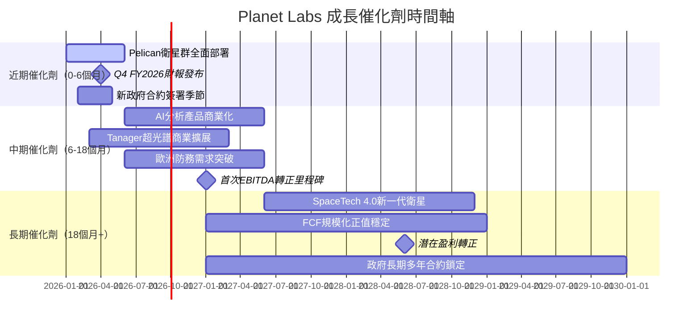

---

### 🌍 TAM 市場規模與滲透率

```
地球觀測（EO）市場 TAM 分析
━━━━━━━━━━━━━━━━━━━━━━━━━━━━━━━━━━━━━━━━━━━━━━━━━━━━━━━━━━━
總市場規模（2025E）：   ~$3.2B
預估市場規模（2030E）：  ~$8.5B  CAGR ~21.5%

Planet Labs 市場滲透率：
  2023：$191M / $2.8B TAM = 6.8%  ██░░░░░░░░░░░░░░░░░░
  2025：$244M / $3.2B TAM = 7.6%  ██░░░░░░░░░░░░░░░░░░
  TTM： $282M / $3.5B TAM = 8.1%  ███░░░░░░░░░░░░░░░░░
  2028E：~$600M / $6B TAM = 10%   ████░░░░░░░░░░░░░░░░（目標）

相鄰市場機會（AI數據分析）：  +$10-15B TAM（未計）
氣候監測/碳市場：             +$2-3B TAM（新興）
━━━━━━━━━━━━━━━━━━━━━━━━━━━━━━━━━━━━━━━━━━━━━━━━━━━━━━━━━━━
```

---

### 🚀 短/中/長期成長驅動力

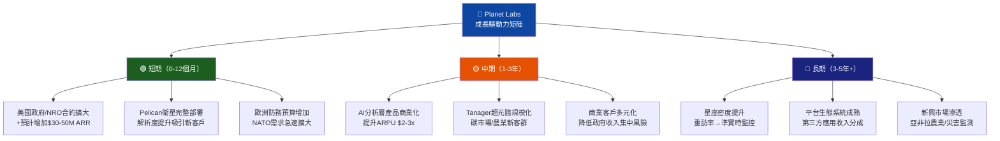

---

## 9. 風險矩陣

### ⚠️ 風險評分矩陣

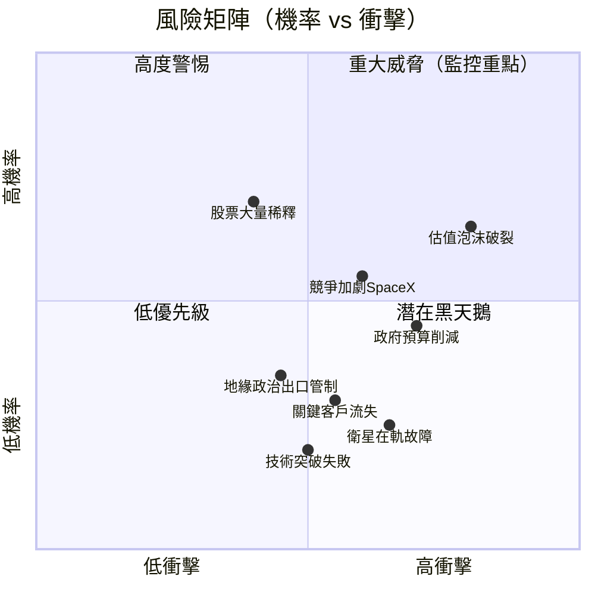

---

### 📋 風險清單表格

| 風險項目 | 機率 | 衝擊 | 綜合評分 | 緩解措施 |
|---------|------|------|---------|---------|
| 🔴 **估值泡沫破裂** | 高65% | 極高 | 9/10 | 分批建倉，設置停損 |
| 🔴 **美國政府預算削減** | 中45% | 高 | 8/10 | 多元化客戶結構，商業比重提升 |
| 🔴 **SpaceX進入EO市場** | 中55% | 高 | 8/10 | 差異化數據分析平台，非純影像 |
| 🔴 **股票大量稀釋** | 高70% | 中高 | 7/10 | 監控股份數成長率，FCF轉正後風險降低 |
| 🟡 **衛星在軌故障** | 低25% | 高 | 6/10 | 星座冗餘設計，保險覆蓋 |
| 🟡 **關鍵客戶流失** | 低30% | 中高 | 5/10 | 長期合約綁定，API深度整合 |
| 🟡 **地緣政治/出口管制** | 中35% | 中 | 5/10 | 美國本土政府客戶佔比高，國際收入有限 |
| 🟢 **技術突破失敗(AI)** | 低20% | 中 | 4/10 | 保留傳統影像訂閱作為基礎收入 |
| 🟢 **利率上升影響估值** | 低25% | 中 | 4/10 | 淨現金狀態，財務成本影響有限 |

---

## 10. 投資建議

### 🎯 最終綜合評級

```
維度評分雷達圖（1-10分）
━━━━━━━━━━━━━━━━━━━━━━━━━━━━━━━━━━━━━━━━━━━━━━━━━
基本面強度：  ▓▓▓▓▓░░░░░  5.0/10  收入成長強，但虧損拖累
成長性：      ▓▓▓▓▓▓▓▓░░  8.0/10  32%+ YoY，加速趨勢明顯
獲利能力：    ▓▓▓░░░░░░░  3.0/10  深度虧損，路徑存在但遙遠
財務健康：    ▓▓▓▓▓▓░░░░  6.0/10  淨現金+$216M，流動性充裕
估值合理性：  ▓▓░░░░░░░░  2.0/10  P/S 29x，極度昂貴
管理層質量：  ▓▓▓▓▓▓░░░░  6.0/10  技術出身，成本控制改善
競爭護城河：  ▓▓▓▓▓▓▓░░░  6.5/10  星座規模+數據壁壘強
市場時機：    ▓▓▓▓▓░░░░░  5.0/10  高波動性，情緒主導
━━━━━━━━━━━━━━━━━━━━━━━━━━━━━━━━━━━━━━━━━━━━━━━━━
綜合評分：    ▓▓▓▓▓░░░░░  5.2/10  持有/謹慎觀望
━━━━━━━━━━━━━━━━━━━━━━━━━━━━━━━━━━━━━━━━━━━━━━━━━
```

---

### 💰 目標價與隱含報酬率

| 情境 | 目標價 | 隱含報酬率 | 核心假設 |
|------|-------|-----------|---------|
| 🟢 **樂觀** | **$33.00** | **+36.7%** | 收入CAGR 35%，AI產品快速商業化，政府合約大增 |
| 🟡 **基準** | **$22.50** | **-6.8%** | 收入CAGR 25%，2027年EBITDA轉正，估值略微壓縮 |
| 🔴 **悲觀** | **$12.00** | **-50.3%** | 收入成長放緩至15%，估值回歸P/S 15x，情緒轉向 |

**目標價基礎**：
- 分析師均值目標 $24.71（9位分析師），與現價幾乎持平
- 本模型基準目標 $22.50，基於 EV/Revenue 20x FY2027E（$450M收入）

---

### ✅ 買入時機與觸發因素

```
買入觸發因素 Checklist
━━━━━━━━━━━━━━━━━━━━━━━━━━━━━━━━━━━━━━━━━━━━━━━━━━━━━━━━━━━
積極信號（出現2-3項可考慮加倉）：
☐ 股價回調至 $16-$18 區間（P/S ~20x）
☐ 季度收入連續3季超$85M，且QoQ>12%
☐ 正式宣布首季EBITDA轉正時間表
☐ 獲得重大政府長期合約（>$100M TCV）
☐ 管理層下調R&D費用指引，顯示規模化收益
☐ 機構持股進一步上升至>80%
☐ FCF連續2季穩定正值

觀望信號（維持現狀）：
☑ 當前P/S 29x仍在歷史高位（已觸發）
☑ 淨虧損仍在$50M+/年規模（已觸發）
☑ 分析師目標均值與現價相近（$24.71 vs $24.14）

賣出/減倉信號：
☐ 收入成長放緩至<20% YoY（警戒）
☐ 政府客戶比重超過70%（集中風險）
☐ 管理層股票大量解鎖後拋售
☐ SpaceX正式推出競爭性EO訂閱服務
━━━━━━━━━━━━━━━━━━━━━━━━━━━━━━━━━━━━━━━━━━━━━━━━━━━━━━━━━━━
```

---

### 👤 投資人適配度

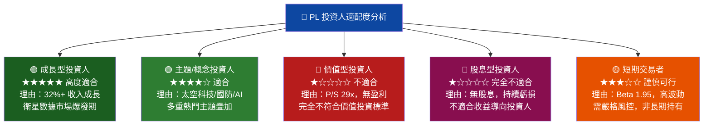

---

### 🔍 關鍵監控指標 Checklist

```
下次財報監控項目（FY2026 Q4，預計2026年Q1末）
━━━━━━━━━━━━━━━━━━━━━━━━━━━━━━━━━━━━━━━━━━━━━━━━━━━━━━━━━━━
財務指標：
☐ 季度收入是否超越 $85M（+5% vs Q3的$81.25M）
☐ 毛利率是否突破 60%（Q3：57.3%）
☐ 營業虧損是否收窄至 <$15M（Q3：-$18.34M）
☐ OCF是否維持正值
☐ 全年FY2027財務指引是否上調

業務指標：
☐ ARR（年度重複性收入）成長率 vs 上季
☐ 客戶數量成長（尤其政府合約數）
☐ Pelican衛星在軌數量與服務質量
☐ Tanager商業收入首次貢獻

產業追蹤：
☐ 美國國防預算2027財年計劃
☐ NRO/NGA公開採購動向
☐ SpaceX Starshield相關公告
☐ 同業BlackSky/Satellogic財報對比
☐ 太空商業化政策（FAA/FCC）新規

市場情緒：
☐ 機構持股季度變化（13F）
☐ 短賣比率變化（現14.3%）
☐ 期權市場隱含波動率
━━━━━━━━━━━━━━━━━━━━━━━━━━━━━━━━━━━━━━━━━━━━━━━━━━━━━━━━━━━
```

---

### 📊 最終總結

```
┌──────────────────────────────────────────────────────────────────┐
│                    PL 投資決策摘要                               │
├──────────────────────────────────────────────────────────────────┤
│                                                                  │
│  🛰️  Planet Labs 是一家「真實故事 + 昂貴估值」的太空科技公司    │
│                                                                  │
│  【強項】                                                        │
│  ✅ 全球最大商業衛星星座，技術護城河深厚                        │
│  ✅ 收入成長加速（TTM +32.6%，季度環比持續>10%）               │
│  ✅ FCF 首次轉正，現金流改善里程碑意義重大                     │
│  ✅ 毛利率突破58%，顯示商業模式可行性                          │
│  ✅ 淨現金+$216M，無短期流動性危機                             │
│                                                                  │
│  【弱項】                                                        │
│  ❌ P/S 29x，遠超合理估值範圍                                   │
│  ❌ ROIC -14.8% vs WACC 14.6%，每年摧毀$117M股東價值          │
│  ❌ 距離淨利潤轉正仍需2-4年                                     │
│  ❌ 股票持續稀釋，股東權益年年縮水                              │
│                                                                  │
│  評級：⚖️  持有 / 等待更好買點                                  │
│  理想買入價：$16 - $18（P/S ~20x，提供安全邊際）               │
│  現價 $24.14：估值偏貴，但成長故事完整，不建議追高              │
│                                                                  │
│  「買對公司，等對價格」— 這是一隻值得追蹤的衛星                 │
└──────────────────────────────────────────────────────────────────┘
```

---

> **⚠️ 免責聲明**：本報告為 AI 自動生成之研究分析，所有財務數據引用自 Yahoo Finance（截至2026-02-28）。報告僅供學術研究與投資參考之用，**不構成任何形式之投資建議**。過去業績不代表未來表現，股票投資存在本金損失風險。投資人應依據自身風險承受能力、財務狀況及獨立判斷做出投資決策，建議諮詢持牌財務顧問。本報告中的目標價與DCF估算基於多項假設，實際結果可能與預測存在重大差異。