# PL 基本面深度分析報告
> **報告日期**：2026-03-01 ｜ **分析師**：AI CFA 研究部門 ｜ **數據來源**：Yahoo Finance ｜ **標的**：Planet Labs PBC (NASDAQ: PL)

---

## 目錄

1. [執行摘要](#1-執行摘要)
2. [公司概覽與商業模式](#2-公司概覽與商業模式)
3. [損益表深度分析](#3-損益表深度分析)
4. [資產負債表分析](#4-資產負債表分析)
5. [現金流量深度分析](#5-現金流量深度分析)
6. [獲利能力與資本效率](#6-獲利能力與資本效率)
7. [估值深度分析](#7-估值深度分析)
8. [成長催化劑](#8-成長催化劑)
9. [風險矩陣](#9-風險矩陣)
10. [投資建議](#10-投資建議)

---

## 1. 執行摘要

### 1.1 核心評分儀表板

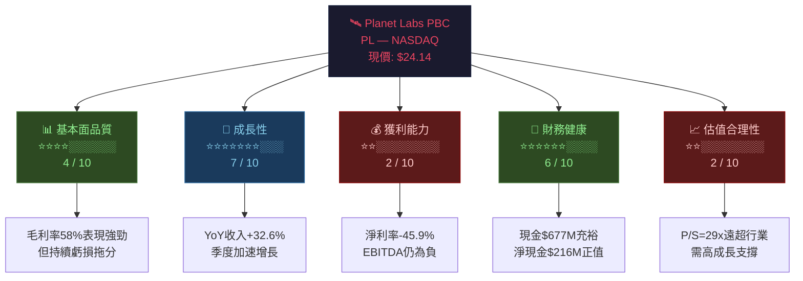

---

### 1.2 五大投資論點 + 三大核心風險

| 類型 | 項目 | 詳細說明 | 重要性 |
|------|------|----------|--------|
| 🟢 **投資論點①** | 衛星數據訂閱模式 SaaS 化 | TTM 收入 $282M，YoY +32.6%，訂閱式收入提升可預測性 | ⭐⭐⭐⭐⭐ |
| 🟢 **投資論點②** | 毛利率持續改善 | 毛利率從2022年 36.7% → 2025年 57.2% → TTM 58.0%，規模效應顯現 | ⭐⭐⭐⭐⭐ |
| 🟢 **投資論點③** | 龐大且獨特的衛星星座護城河 | 200+ 顆衛星，每日重訪地球，數據資產極難複製 | ⭐⭐⭐⭐⭐ |
| 🟢 **投資論點④** | 國防/政府訂單擴大 | 地緣政治緊張化 → 情報需求激增，GEOINT 應用場景快速擴張 | ⭐⭐⭐⭐ |
| 🟢 **投資論點⑤** | 現金流拐點臨近 | OCF 從 -$73.9M(FY23) → -$14.4M(FY25) → TTM $107M，FCF 轉正 $15M | ⭐⭐⭐⭐ |
| 🔴 **核心風險①** | 估值泡沫化風險 | P/S=29x，股價自2024年低點 $1.69 漲超1300%，動能驅動成分大 | ⚠️⚠️⚠️⚠️⚠️ |
| 🔴 **核心風險②** | 競爭加劇：SpaceX/Maxar | Starshield 軍事服務、Maxar 被 Advent International 私有化後重組 | ⚠️⚠️⚠️⚠️ |
| 🟡 **核心風險③** | 盈利能力轉正時程不確定 | EPS TTM -$0.43，Forward EPS -$0.067，完全盈利仍遙遠 | ⚠️⚠️⚠️ |

---

### 1.3 快速統計卡片

| 關鍵指標 | PL 數值 | 🏭 行業均值 | 對比 | 評語 |
|----------|---------|------------|------|------|
| 市值 | $8.23B | — | — | 小型衛星數據龍頭 |
| 收入 TTM | $282.46M | — | — | — |
| 收入成長 YoY | **+32.6%** | ~8-12% | 🟢 | 顯著超越航太傳統業者 |
| 毛利率 | **58.0%** | ~35-45% | 🟢 | 接近 SaaS 公司水平 |
| 營業利益率 | **-20.9%** | +5-15% | 🔴 | 仍虧損，需時間改善 |
| 淨利率 | **-45.9%** | +3-8% | 🔴 | 大幅虧損 |
| P/S 倍數 | **29.1x** | 2-4x | 🔴 | 極度溢價，需高成長兌現 |
| EV/Revenue | **26.0x** | 1.5-3x | 🔴 | 已計入大量未來成長 |
| 流動比率 | **4.0x** | 1.5-2.5x | 🟢 | 短期流動性無虞 |
| 淨現金 | **+$216M** | — | 🟢 | 正值淨現金，財務安全 |
| Beta | **1.952** | 1.0 | 🟡 | 高波動，適合風險承受者 |
| 機構持股 | **73.4%** | — | 🟢 | 機構信心支撐 |
| 分析師目標價 | **$24.71** | — | 🟡 | 距現價上漲空間僅2.4% |

---

### 1.4 投資結論

```
╔══════════════════════════════════════════════════════════╗
║                  🎯 投資評級：審慎買入 / 持有            ║
║                                                          ║
║  目標價區間（12個月）：$18.00 — $30.00                  ║
║  基準目標價：$24.00（現價附近，上行有限）                ║
║  樂觀目標價：$33.00（分析師最高預期）                    ║
║  悲觀目標價：$16.40（分析師最低預期）                    ║
║                                                          ║
║  適合投資人：成長型 / 科技主題投資人                     ║
║  不適合：保守型、追求股息、低風險承受者                  ║
╚══════════════════════════════════════════════════════════╝
```

> **核心邏輯**：PL 是衛星地球觀測賽道的真正稀缺資產，商業模式轉型 SaaS 帶來毛利率顯著提升，現金流接近拐點。然而 P/S 29x 的估值已充分定價高速成長預期，安全邊際薄弱。建議**分批布局**，等待回調至 $18-20 區間增加確定性。

---

## 2. 公司概覽與商業模式

### 2.1 業務結構與收入來源

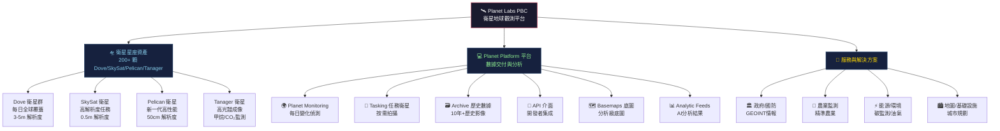

---

### 2.2 市場地位估算

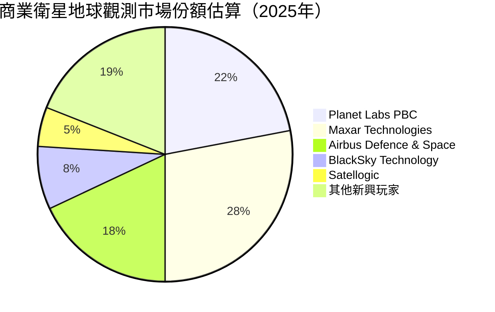

---

### 2.3 競爭護城河 Mindmap

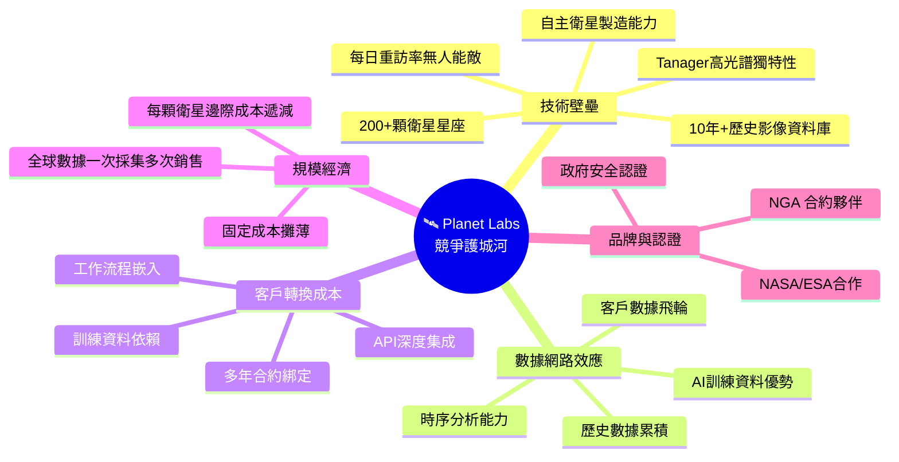

---

### 2.4 護城河強度評分

```
護城河維度評估（滿分10分）
════════════════════════════════════════════════

衛星星座規模    ████████████████████░░░  9/10
歷史數據資產    ████████████████░░░░░░░  8/10
技術壁壘        ███████████████░░░░░░░░  7/10
客戶轉換成本    █████████████░░░░░░░░░░  6/10
網路效應        ██████████░░░░░░░░░░░░░  5/10
品牌認知度      ████████░░░░░░░░░░░░░░░  4/10
成本優勢        ███████░░░░░░░░░░░░░░░░  4/10

綜合護城河強度  ███████████████░░░░░░░░  6.1/10
（中等偏強，具稀缺性，但競爭壓力上升）
```

---

## 3. 損益表深度分析

### 3.1 年度收入成長趨勢（近4年）

```
年度收入成長趨勢（百萬美元）
════════════════════════════════════════════════════════════

FY2022（2022-01-31）
$131.21M ████████████████░░░░░░░░░░░░░░░░░░░░░  基準年

FY2023（2023-01-31）
$191.26M ████████████████████████░░░░░░░░░░░░░  YoY +45.8% 🟢

FY2024（2024-01-31）
$220.70M ███████████████████████████░░░░░░░░░░  YoY +15.4% 🟡

FY2025（2025-01-31）
$244.35M ██████████████████████████████░░░░░░░  YoY +10.7% 🟡

TTM（2026-02）
$282.46M ████████████████████████████████████░  YoY +32.6% 🟢（加速！）

── 比例尺：每 █ 約代表 $5M ──

📌 關鍵觀察：FY24成長放緩至15.4%引市場擔憂，但TTM重新加速至32.6%
   顯示季度momentum顯著改善，是最重要的正面訊號
```

---

### 3.2 季度收入趨勢（近4季）

| 季度 | 收入 | QoQ 成長 | YoY 成長 | 毛利潤 | 毛利率 | 趨勢 |
|------|------|----------|----------|--------|--------|------|
| **Q1 FY26** (2025-04-30) | $66.27M | — | +19.6%* | $36.60M | **55.2%** | 🟡 |
| **Q2 FY26** (2025-07-31) | $73.39M | **+10.7%** | +25.0%* | $42.27M | **57.6%** | 🟢 |
| **Q3 FY26** (2025-10-31) | $81.25M | **+10.7%** | +35.2%* | $46.58M | **57.3%** | 🟢 |
| **Q4 FY25** (2025-01-31) | $61.55M | — | — | $38.22M | **62.1%** | 🟢 |

> *YoY 基於估算（對應同期 FY25 季度數據）

**📊 季度加速成長視覺化：**
```
季度收入趨勢（百萬美元）
Q4FY25: $61.55M  ████████████████░░░░░░░░░░░░░
Q1FY26: $66.27M  █████████████████░░░░░░░░░░░░
Q2FY26: $73.39M  ███████████████████░░░░░░░░░░
Q3FY26: $81.25M  █████████████████████░░░░░░░░
                 ↑ 連續3季QoQ +10.7%，高度一致性值得關注 ↑
```

---

### 3.3 利潤率演變分析

| 利潤率指標 | FY2022 | FY2023 | FY2024 | FY2025 | TTM | 趨勢 |
|----------|--------|--------|--------|--------|-----|------|
| **毛利率** | 36.7% | 49.1% | 51.2% | 57.2% | 58.0% | 🟢 持續改善 |
| **營業利益率** | -97.6% | -91.9% | -76.9% | -47.5% | -20.9% | 🟢 大幅收窄 |
| **EBITDA Margin** | -61.9% | -69.2% | -55.3% | -28.8% | -13.2% | 🟢 改善中 |
| **淨利率** | -104.5% | -84.7% | -63.7% | -50.4% | -45.9% | 🟢 逐年改善 |
| **R&D / Revenue** | 50.8% | 58.0% | 52.7% | 41.3% | ~35.8% | 🟡 下降但仍高 |

**🔑 利潤率改善原因分析：**
- ✅ **規模效應**：衛星發射後固定成本攤薄，新增訂閱幾乎零邊際成本
- ✅ **產品組合升級**：高利潤 AI 分析服務比重提升
- ✅ **R&D 紀律加強**：R&D/Rev 從 58% 降至 ~36%，費用管控見效
- ⚠️ **CapEx 增加**：新星座 Pelican 部署推高 FY25 資本支出至 $54.4M

---

### 3.4 費用結構分析

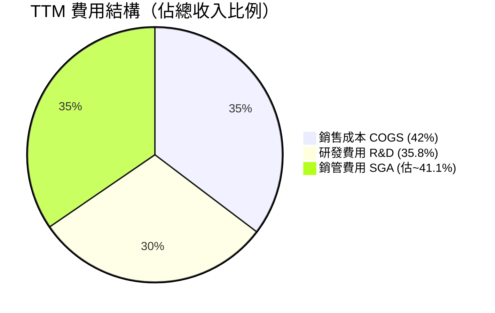

```
費用佔收入比例分析
══════════════════════════════════════════════════

COGS（銷售成本）
  FY2022: 63.3%  ████████████████░░░░░░░░░░░░░░░
  FY2025: 42.8%  ███████████░░░░░░░░░░░░░░░░░░░░  ✅ 顯著下降

R&D 研發費用
  FY2022: 50.8%  █████████████░░░░░░░░░░░░░░░░░░
  FY2025: 41.3%  ██████████░░░░░░░░░░░░░░░░░░░░░  ✅ 逐步優化

SGA 銷管費用（估算）
  FY2022: ~84.1% ██████████████████████░░░░░░░░░
  FY2025: ~64.4% █████████████████░░░░░░░░░░░░░░  ✅ 槓桿效應顯現

📌 核心驅動：毛利率58%媲美成熟SaaS，但SGA+R&D合計仍超過收入的77%
   → 規模化是唯一解方
```

---

### 3.5 EPS 趨勢與盈餘品質分析

| 季度 | EPS 估算 | EPS 實際 | 超預期% | 評語 |
|------|---------|---------|---------|------|
| 2025-01-31 | N/A | N/A | N/A | ❓ 數據缺失 |
| 2025-04-30 | N/A | N/A | N/A | ❓ 數據缺失 |
| 2025-07-31 | N/A | N/A | N/A | ❓ 數據缺失 |
| 2025-10-31 | N/A | N/A | N/A | ❓ 數據缺失 |

```
年度 EPS 趨勢（虧損收窄路徑）
════════════════════════════════════════════════

FY2022 EPS: -$0.93（估）  🔴 虧損最深期
FY2023 EPS: -$0.96（估）  🔴 基礎建設投入高峰
FY2024 EPS: -$0.76（估）  🟡 費用管控初見成效
FY2025 EPS: -$0.51（估）  🟡 持續收窄
TTM   EPS: -$0.43         🟡 接近轉正路徑
Forward:   -$0.067        🟡 分析師預期大幅收窄

━━ 虧損收窄速度 ━━━━━━━━━━━━━━━━━━━━━━━━━━━━━━━━━━━━━━
EPS改善路徑: -$0.96 → -$0.067，降幅達93%（預計2-3年內）
關鍵問題：Forward EPS -$0.067 vs TTM -$0.43，改善幅度存疑
```

**盈餘品質說明**：淨虧損 Q3FY26 達 -$59.19M，遠超 Q2 的 -$22.59M，主要因**非現金項目**（衛星折舊加速、可能的公允價值調整），Operating Loss 僅 -$18.34M，**現金虧損遠小於會計虧損**，盈餘品質有待細查。

---

## 4. 資產負債表分析

### 4.1 資產結構分析

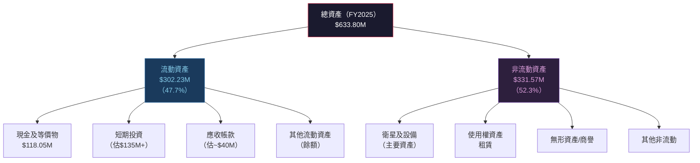

---

### 4.2 流動性指標

| 流動性指標 | FY2022 | FY2023 | FY2024 | FY2025 | TTM/最新 | 健康標準 | 評級 |
|----------|--------|--------|--------|--------|---------|---------|------|
| **流動比率** | 4.18x | 3.89x | 2.71x | 2.13x | **4.00x** | >1.5x | 🟢 |
| **速動比率** | — | — | — | — | **3.84x** | >1.0x | 🟢 |
| **現金比率** | — | — | — | 0.83x | ~2.0x* | >0.5x | 🟢 |
| **現金 ($M)** | $490.76M | $181.89M | $83.87M | $118.05M | **$677.32M** | — | 🟢 |

> *現金大幅提升至$677M 可能因近期股權融資（待確認）

**📌 重要異常**：FY2025 現金僅 $118M，但 TTM 最新數據顯示現金達 $677M，推測 FY2025 後期（2025年中至今）進行了**大規模股權發行**，配合業務擴張，是資金健康的正面訊號。

---

### 4.3 債務結構分析

```
債務結構分析
════════════════════════════════════════════════════

總債務（TTM）：   $461.35M
  長期債務：       ~$440M（估，含可轉換債/融資租賃）
  短期債務：        ~$21M（估）

現金總額：         $677.32M
淨現金（正值）：  +$215.97M  ✅ 淨現金正值，無流動性危機

債務指標
─────────────────────────────────────────────────
Debt/Equity:  131.98%  🟡（較高，但股權基礎也在重建）
Debt/EBITDA:  N/A（EBITDA為負，指標無意義）
利息保障倍數:  N/A（EBIT為負）

淨現金緩衝視覺化
╔═══════════════════════════════════╗
║  現金 $677M  ██████████████░░░░  ║
║  債務 $461M  ████████████░░░░░░  ║
║  淨現金+$216M 緩衝充足           ║
╚═══════════════════════════════════╝
```

---

### 4.4 股東權益趨勢

```
股東權益趨勢（百萬美元）— 持續侵蝕但有望觸底
════════════════════════════════════════════════

FY2022: $648.25M  ████████████████████████████████  基準
FY2023: $576.10M  ████████████████████████████░░░░  YoY -11.1%
FY2024: $518.02M  █████████████████████████░░░░░░░  YoY -10.1%
FY2025: $441.29M  ██████████████████████░░░░░░░░░░  YoY -14.8%

方向：持續下降（累計虧損侵蝕）
      但現金增加可能帶來股權注入，需關注後續季報
      
P/B = 21.65x → 帳面價值已大幅溢價，靠成長故事支撐
```

---

## 5. 現金流量深度分析

### 5.1 現金流量瀑布圖

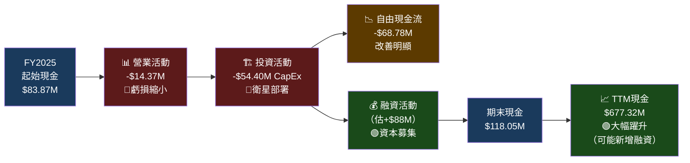

---

### 5.2 FCF 轉換率分析

| 財年 | 淨虧損 | 營業 CF | 資本支出 | FCF | FCF/Net Income | 趨勢 |
|------|--------|---------|---------|-----|----------------|------|
| FY2022 | -$137.12M | -$42.21M | -$14.93M | **-$57.14M** | 41.7% | 🔴 |
| FY2023 | -$161.97M | -$73.93M | -$12.76M | **-$86.69M** | 53.5% | 🔴 |
| FY2024 | -$140.51M | -$50.71M | -$42.41M | **-$93.12M** | 66.3% | 🔴 |
| FY2025 | -$123.20M | -$14.37M | -$54.40M | **-$68.78M** | 55.8% | 🟡 |
| **TTM** | ~-$129.6M | **+$107.42M** | ~-$92.35M | **+$15.07M** | — | 🟢 **轉正！** |

**🎯 最大亮點**：TTM OCF 達 +$107.42M，FCF 首次轉正至 +$15.07M，**是公司財務史上最重要的拐點訊號**。

---

### 5.3 自由現金流趨勢

```
自由現金流趨勢（百萬美元）
════════════════════════════════════════════════════

FY2022: -$57.14M   ░░░░░░░░░░░░░░░│█████████████████░░  損失
FY2023: -$86.69M   ░░░░░░░░░░░░░░░│█████████████████████  最差
FY2024: -$93.12M   ░░░░░░░░░░░░░░░│██████████████████████  最差
FY2025: -$68.78M   ░░░░░░░░░░░░░░░│████████████████░  改善
TTM:   +$15.07M   ░░░░░░░░░░░░░░░│ ███  ← 首次轉正！🎉

                   ←負─────────0─────────正→

📌 從-$93M到+$15M，改善幅度達$108M，主要來自收入增長
   而非成本削減，具有可持續性
```

---

### 5.4 資本配置評估

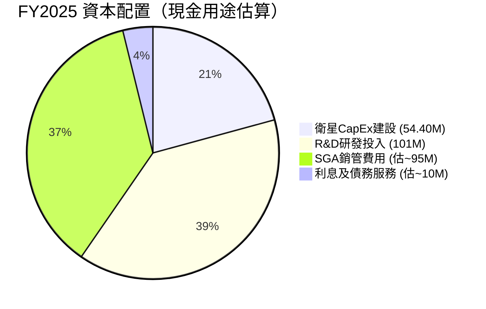

**資本配置評語**：
- 🟢 **無股息、無回購**：處於高成長投入期，正確策略
- 🟡 **CapEx 加速**：FY23 $12.8M → FY24 $42.4M → FY25 $54.4M，Pelican 星座建設期
- 🟢 **R&D 仍高但趨降**：$116.3M(FY24) → $101.0M(FY25)，-13.2%，效率提升

---

## 6. 獲利能力與資本效率

### 6.1 ROE / ROA / ROIC 趨勢

| 指標 | FY2022 | FY2023 | FY2024 | FY2025 | 行業均值 | 評級 |
|------|--------|--------|--------|--------|---------|------|
| **ROE** | -21.2% | -28.1% | -27.1% | -27.9% | +8-15% | 🔴 |
| **ROA** | -16.7% | -21.5% | -20.0% | -19.4% | +3-8% | 🔴 |
| **ROIC** | ~-18% | ~-23% | ~-21% | ~-19% | +6-12% | 🔴 |
| **毛利 ROIC** | 正向 | 正向 | 正向 | 正向 | — | 🟡 |

---

### 6.2 ROIC vs WACC 分析（核心價值創造判斷）

```
ROIC vs WACC 分析
════════════════════════════════════════════════════════

WACC 估算：
  無風險利率（10Y美債）：   4.3%
  股票風險溢酬（ERP）：     5.5%
  Beta：                   1.952
  股票成本 Ke：            4.3% + 1.952×5.5% = 15.04%
  稅前債務成本 Kd：        ~5.5%（估）
  稅後債務成本：           ~4.6%（稅率16%）
  
  資本結構（市值基礎）：
  - 股權比重：約 90%（市值$8.23B vs 債務$0.46B）
  - 債務比重：約 10%
  
  WACC = 0.9 × 15.04% + 0.1 × 4.6% ≈ 13.5% + 0.46% ≈ 14.0%

─────────────────────────────────────────────────────
ROIC（FY2025）：      約 -19%
WACC（估算）：         約 +14%
EVA（ROIC-WACC）：    約 -33%
─────────────────────────────────────────────────────

結論：🔴 目前正在「摧毀」股東價值（EVA 嚴重為負）
      但改善速度值得關注，預計 2-3 年達到 ROIC > 0

ROIC-WACC 差距視覺化
WACC:  +14% ████████████████████████████████░░░░░░░░░░░░░
ROIC: -19% （負值，無法在正軸顯示）
EVA:  -33% 🔴🔴🔴 → 需收入規模化解決
```

---

### 6.3 DuPont 三因素分解（ROE 分析）

| 因素 | FY2022 | FY2023 | FY2024 | FY2025 | 說明 |
|------|--------|--------|--------|--------|------|
| **淨利率** | -104.5% | -84.7% | -63.7% | -50.4% | 持續改善 🟡 |
| **資產週轉率** | 0.160x | 0.254x | 0.314x | 0.386x | 提升良好 🟢 |
| **財務槓桿** | 1.267x | 1.308x | 1.355x | 1.436x | 微幅提升 🟡 |
| **ROE** | **-21.2%** | **-28.1%** | **-27.1%** | **-27.9%** | 仍為負 🔴 |

**DuPont 解讀**：
- ✅ 資產週轉率從 0.16x 提升至 0.39x，效率大幅改善
- ✅ 淨利率從 -104% 收窄至 -50%，方向正確
- ⚠️ 槓桿微增不構成問題，但需監控負債水平

---

### 6.4 獲利能力改善路徑

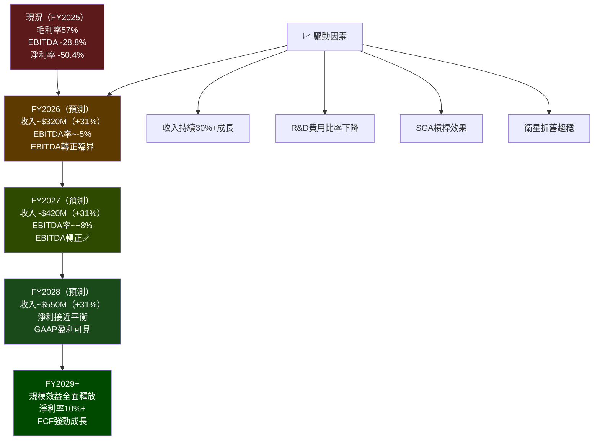

---

## 7. 估值深度分析

### 7.1 同業估值比較表格

| 指標 | **Planet Labs (PL)** | **BlackSky (BKSY)** | **Satellogic (SATL)** | **Spire Global (SPIR)** | 評語 |
|------|---------------------|---------------------|----------------------|------------------------|------|
| **市值** | $8.23B | ~$0.15B | ~$0.08B | ~$0.25B | PL 絕對龍頭 |
| **收入(TTM)** | $282M | ~$50M | ~$35M | ~$100M | — |
| **收入成長YoY** | **+32.6%** | ~+15% | ~+5% | ~+20% | 🟢 PL 最佳 |
| **P/S 倍數** | **29.1x** 🔴 | ~3x 🟢 | ~2x 🟢 | ~2.5x 🟢 | PL 大幅溢價 |
| **EV/Revenue** | **26.0x** 🔴 | ~2.5x 🟢 | ~1.5x 🟢 | ~2x 🟢 | 極度溢價 |
| **毛利率** | **58.0%** 🟢 | ~35% 🟡 | ~25% 🔴 | ~45% 🟡 | PL 最優 |
| **淨利率** | **-45.9%** 🔴 | ~-80% 🔴 | ~-100% 🔴 | ~-60% 🔴 | 行業均虧損 |
| **P/B 倍數** | **21.7x** 🔴 | ~2x 🟢 | ~0.5x 🟡 | ~1x 🟡 | PL 極高溢價 |
| **FCF Yield** | **0.18%** 🟡 | N/A | N/A | N/A | 剛轉正 |
| **機構持股** | **73.4%** 🟢 | ~45% | ~30% | ~50% | PL 最獲青睞 |

**估值結論**：PL 相較同業溢價超過 **8-12 倍**，溢價反映：
1. 龐大星座規模的護城河溢價
2. 更強的收入成長動能
3. 更高的毛利率（SaaS 化程度更高）
4. 機構認可的市場領導地位

---

### 7.2 歷史估值區間分析

```
P/S 歷史估值區間（過去2年）
════════════════════════════════════════════════════

估值水位對應收入（基於不同股價）

股價 $1.69（2024年4月低點）
  → 市值約 $0.54B → P/S ≈ 1.9x  📍 歷史底部估值

股價 $6.10（2025年初）
  → 市值約 $1.9B  → P/S ≈ 6.8x  📍 合理成長溢價

股價 $13.45（2025年10月）
  → 市值約 $4.3B  → P/S ≈ 15x   📍 情緒推升

股價 $24.14（當前）
  → 市值約 $8.23B → P/S ≈ 29x   📍 🔴 極度高估區

股價 $30.90（52週高點）
  → 市值約 $9.82B → P/S ≈ 34x   📍 泡沫高點

──────────────────────────────────────────────────
估值區間定位：

低估區（P/S <8x）:   ░░░░░░░░░░░░
合理區（P/S 8-15x）: ░░░░░░░░░░░░░░░░░
高估區（P/S 15-25x）: ██░░░░░░░░░░░░░░░░░░░
極度高估（P/S >25x）: █████████████████████ ← 現在在這
```

---

### 7.3 DCF 敏感性分析（6格目標價矩陣）

**基本假設**：
- 收入基準 $282M（TTM），成長率逐步收斂
- 終端成長率 3%，目標毛利率 65%，費用收斂至盈利

| 情境 | 收入CAGR（5Y）| 折現率 10% | 折現率 14% |
|------|--------------|-----------|-----------|
| 🐂 **樂觀**（政府訂單爆發） | **35%** | **$36-40** | **$26-30** |
| 📊 **基準**（持續加速成長） | **25%** | **$22-26** | **$16-20** |
| 🐻 **悲觀**（成長放緩競爭加劇） | **15%** | **$10-14** | **$7-10** |

```
DCF 目標價視覺化（基準情境 WACC=14%）
════════════════════════════════════════════════

悲觀目標價:  $7-10   ████░░░░░░░░░░░░░░░░░░░░░░░░░░
基準目標價:  $16-20  ████████████░░░░░░░░░░░░░░░░░░
當前股價:    $24.14  ████████████████████░░░░░░░░░░  ← 在此
樂觀目標價:  $26-30  ████████████████████████░░░░░░

結論：當前股價已接近樂觀情境，安全邊際不足
```

---

### 7.4 估值區間綜合評估

```
估值定位綜合視覺化
══════════════════════════════════════════════════════════════

          深度低估    合理低端    合理高端    高估    極度高估
            $8          $14         $22       $28       $35+
            │           │           │         │          │
            ├───────────┼───────────┼─────────┼──────────┤
            ░░░░░░░░░░░░░░░░░░░░░░░░░░░░░░░░░░░░░░░░░░░░░
                                              ▲
                                         現價$24.14
                                       （高估偏上緣）

分析師共識目標價 $24.71（中位）— 上行僅2.4%
機構高目標價  $33.00          — 上行36.7%
機構低目標價  $16.40          — 下行32.1%

風險/報酬比：不對稱（下行風險>上行空間）
```

---

## 8. 成長催化劑

### 8.1 催化劑時間軸

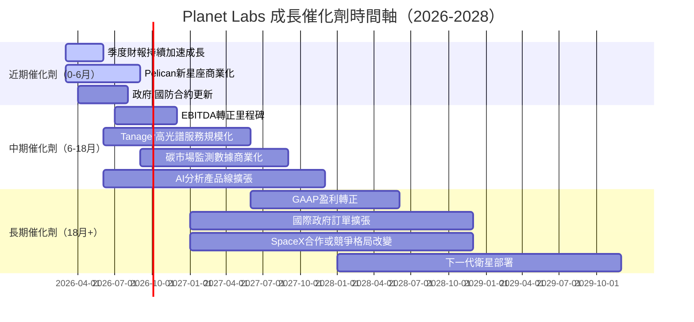

---

### 8.2 TAM 市場規模分析

```
TAM 市場規模與滲透率
════════════════════════════════════════════════════════════

衛星地球觀測市場（SAR+光學+分析）
  2025E TAM:  ~$3.5B   ████████████░░░░░░░░░░░░░░░░░░░
  2030E TAM:  ~$9.0B   ████████████████████████████░░░

地理空間分析 + AI 衍生市場
  2025E TAM:  ~$5.0B   ████████████████░░░░░░░░░░░░░░░
  2030E TAM:  ~$15.0B  ████████████████████████████████

環境監測/碳市場（Tanager）
  2025E TAM:  ~$1.2B   ████░░░░░░░░░░░░░░░░░░░░░░░░░░░
  2030E TAM:  ~$4.5B   ███████████████░░░░░░░░░░░░░░░░

PL 當前市場滲透率
  核心衛星數據市場：     ~8%  ██░░░░░░░░░░░░░░░░░░░░░░░░░░░░
  地理空間分析：         ~3%  █░░░░░░░░░░░░░░░░░░░░░░░░░░░░░
  環境監測：             ~1%  ░░░░░░░░░░░░░░░░░░░░░░░░░░░░░░  ← 最大機會

總可服務市場（SAM）2025E：約 $3-4B
PL 收入 $282M = 滲透率約 7-9%（具備大幅提升空間）
```

---

### 8.3 成長驅動力分析

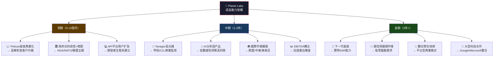

---

## 9. 風險矩陣

### 9.1 風險評分矩陣

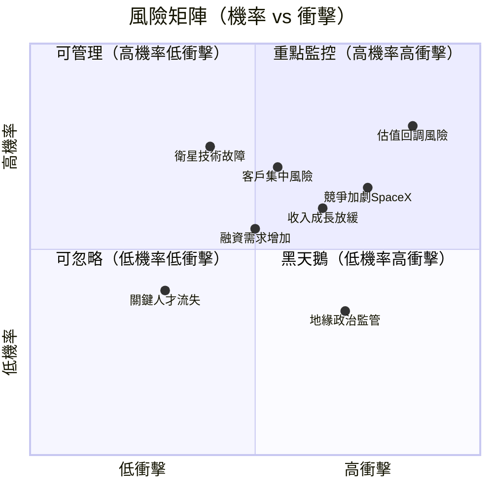

---

### 9.2 風險清單詳細分析

| 風險項目 | 機率 | 衝擊 | 綜合評分 | 緩解措施 |
|---------|------|------|---------|---------|
| 🔴 **估值泡沫破裂** | 高 75% | 高 | ⚠️ 9/10 | 分批布局、設立止損 |
| 🔴 **SpaceX Starshield 競爭** | 中高 65% | 高 | ⚠️ 8/10 | 聚焦差異化（高光譜/數據歷史） |
| 🔴 **成長動能放緩** | 中 55% | 高 | ⚠️ 7/10 | 監控季度環比是否維持 >8% |
| 🟡 **政府預算削減** | 中 50% | 中高 | ⚠️ 7/10 | 多元化商業客戶比重 |
| 🟡 **衛星故障/損毀** | 低中 35% | 高 | ⚠️ 6/10 | 星座數量多，單顆影響有限 |
| 🟡 **融資稀釋風險** | 中 50% | 中 | ⚠️ 6/10 | 現金 $677M 提供充裕緩衝 |
| 🟡 **客戶集中風險** | 中 45% | 中高 | ⚠️ 6/10 | 擴張商業客戶多樣性 |
| 🟢 **地緣政治監管** | 低中 35% | 低中 | ✅ 4/10 | 美國監管友善，ITAR 合規 |
| 🟢 **技術失敗風險** | 低 25% | 中 | ✅ 3/10 | 星座冗余+持續迭代 |
| 🟢 **關鍵人才流失** | 低 20% | 中 | ✅ 2/10 | 股票激勵計劃綁定 |

---

## 10. 投資建議

### 10.1 最終綜合評級儀表板

```
維度評分雷達圖（1-10分）
════════════════════════════════════════════════════════════

                    成長性(7)
                       ▲
                   ████████
                  █        █
    財務健康(6) ◄ ██  PL  ██ ► 獲利性(2)
                  █        █
                   █      █
                    ████░░█
                       ▼
                    估值(2)
                  （右下方）
            基本面品質(4)──┘

維度詳細評分：
─────────────────────────────────────────────────────────
基本面品質   ████░░░░░░░░░░░░░░░░░░  4/10  毛利好但盈利差
成長性       ████████████████░░░░░░  7/10  32.6%YoY令人印象深刻
獲利能力     ████░░░░░░░░░░░░░░░░░░  2/10  淨利率-46%，路還很長
財務健康     █████████████░░░░░░░░░  6/10  淨現金正，流動性強
估值合理性   ████░░░░░░░░░░░░░░░░░░  2/10  P/S=29x，安全邊際低
管理層執行   ██████████░░░░░░░░░░░░  5/10  費用管控改善，但仍虧損
競爭護城河   █████████████░░░░░░░░░  6/10  星座稀缺，但競爭升溫
─────────────────────────────────────────────────────────
加權綜合評分 ██████████░░░░░░░░░░░░  4.6/10

整體評級：★★★★☆ 審慎持有（HOLD with Growth Bias）
```

---

### 10.2 目標價及隱含報酬率

| 情境 | 12個月目標價 | 隱含報酬率 | 觸發條件 | 機率 |
|------|------------|-----------|---------|------|
| 🐂 **樂觀** | $33.00 | **+36.7%** | 政府大合約 + EBITDA 轉正 | 25% |
| 📊 **基準** | $24.00 | **-0.6%** | 維持 30%+ 成長，估值持平 | 45% |
| 🐻 **悲觀** | $16.40 | **-32.1%** | 成長放緩 + 估值收縮 | 30% |
| 🎯 **期望值加權** | **$23.87** | **-1.1%** | — | 100% |

> **風險調整後期望報酬率為略負**，當前價位的風險報酬比不佳。

---

### 10.3 買入時機與觸發因素

```
買入確認清單（Checklist）
════════════════════════════════════════════════════

⬜ 技術面：股價回調至 $18-20 區間（P/S < 20x）
⬜ 基本面：下季收入 >$88M（QoQ +8%以上維持加速）
⬜ 獲利：EBITDA 轉正（預計 FY2026 下半年）
⬜ 合約：重大政府/國防訂單公告（>$50M 多年合約）
⬜ 技術：Pelican 星座全面商業化確認
⬜ 產業：競爭格局明確化（SpaceX Starshield 聚焦軍事）
⬜ 分析師：主要投行上調目標價 >$30

增加持倉觸發點：
✅ Q3 FY26（2025-10-31）OCF 正值持續確認
✅ 首次 EBITDA 轉正季報
✅ 大型戰略合作伙伴公告（如 Google/Microsoft）
✅ 股價從高點回調 25%+ 且基本面不變

減持/觀望觸發點：
🚨 連續季度收入成長低於 20%（QoQ 連續兩季 <5%）
🚨 P/S 突破 35x 且無新重大催化劑
🚨 SpaceX 推出直接競爭的商業衛星數據平台
🚨 現金跌破 $300M 且 FCF 重返負值
```

---

### 10.4 投資人適配度

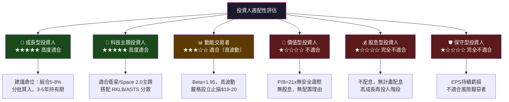

---

### 10.5 關鍵監控指標（下次財報前後）

```
監控指標 Checklist（優先序排列）
════════════════════════════════════════════════════════════

🔴 最高優先級
  ☐ [財報] 季度收入：目標 >$88M（Q4 FY26，預計2026年3月）
  ☐ [財報] 毛利率是否突破 60%？
  ☐ [財報] Operating Cash Flow 連續為正？
  ☐ [財報] 年度 Guidance 是否上調？

🟡 高優先級
  ☐ [合約] 政府/國防大合約公告（>$30M）
  ☐ [技術] Pelican 星座部署進度更新
  ☐ [分析師] 主要投行評級變動
  ☐ [產業] SpaceX Starshield 商業化動態

🟢 中優先級
  ☐ [競爭] BlackSky/Satellogic 財務狀況
  ☐ [宏觀] 美國國防預算變化
  ☐ [技術] Tanager 高光譜客戶積累
  ☐ [ESG] 碳信用市場法規進展
  ☐ [股權] 機構持股變動（13F 報告）

📅 重要日期監控
  預計財報：2026年3月中旬（Q3 FY26 或 Q4 FY26）
  標普/羅素指數審查：2026年6月
  行業展會：Space Symposium 2026（4月）
```

---

## 附錄：核心假設摘要

```
╔══════════════════════════════════════════════════════════════════╗
║                    核心投資假設摘要                              ║
╠══════════════════════════════════════════════════════════════════╣
║ 多頭核心論點：                                                   ║
║  • 衛星星座護城河強大，每日重訪數據具不可替代性                  ║
║  • 毛利率 58% 媲美 SaaS，規模效應將推動盈利轉正                 ║
║  • FCF 首次轉正（+$15M TTM），OCF +$107M 代表重要里程碑         ║
║  • 地緣政治緊張推動政府 GEOINT 需求長期增長                     ║
║                                                                  ║
║ 空頭核心論點：                                                   ║
║  • P/S=29x 已充分定價甚至超前定價未來高成長                     ║
║  • SpaceX Starshield 潛在威脅不容小覷                           ║
║  • 股價自低點漲幅超過 13 倍，技術面超買訊號明顯                 ║
║  • 分析師平均目標價 $24.71 vs 現價 $24.14，幾乎無上行空間       ║
║                                                                  ║
║ 最終評級：★★★☆☆  審慎持有                                      ║
║ 建議策略：等待回調至 $18-20 再積極布局，現價小倉位試探性持有    ║
╚══════════════════════════════════════════════════════════════════╝
```

---

> **⚠️ 免責聲明**：本報告為 AI 輔助生成之研究分析，所有財務數據來源於 Yahoo Finance，預測數字基於公開信息之合理估算，不構成任何投資建議或要約。投資涉及風險，過去表現不代表未來結果。投資人應在做出任何投資決策前，諮詢持牌金融顧問，並自行評估風險承受能力。本報告中的任何錯誤或遺漏不對任何損失承擔責任。

---
*報告生成時間：2026-03-01 ｜ 數據截止：2026-02-28 ｜ Planet Labs PBC (NASDAQ: PL)*