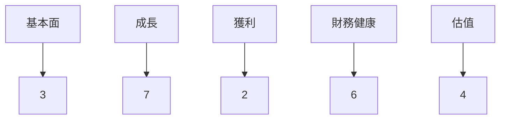
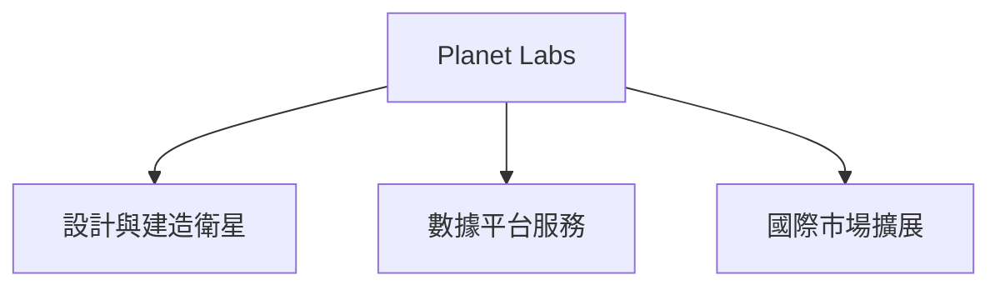
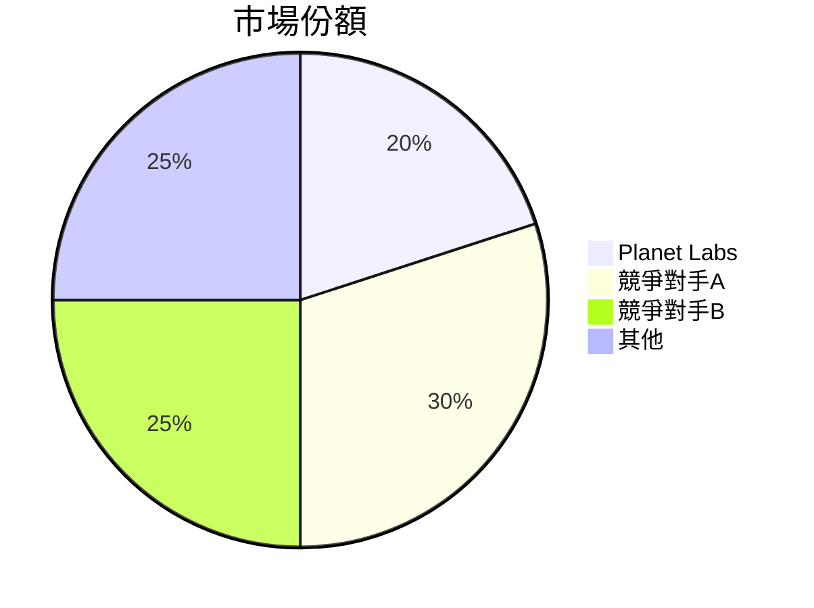
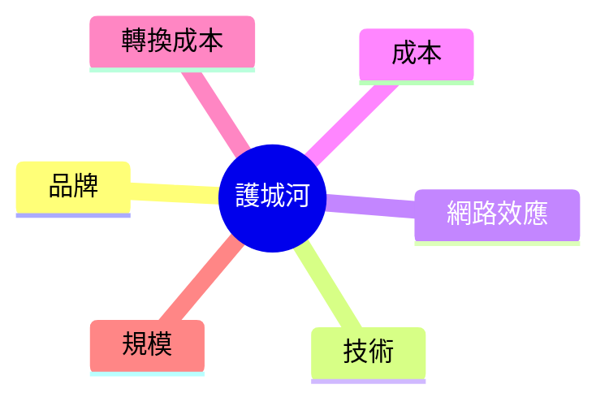
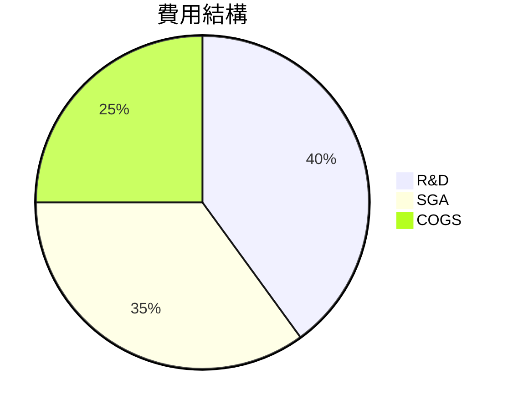
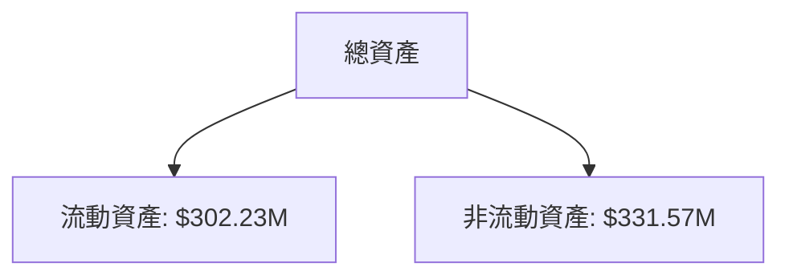
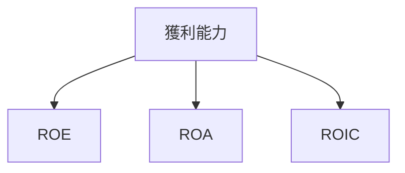
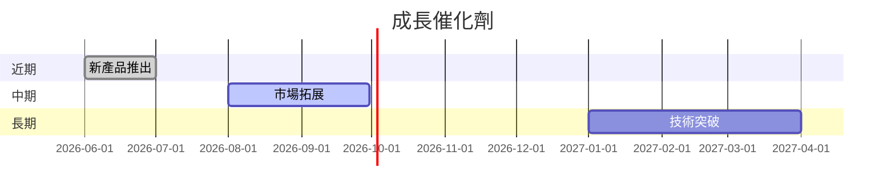
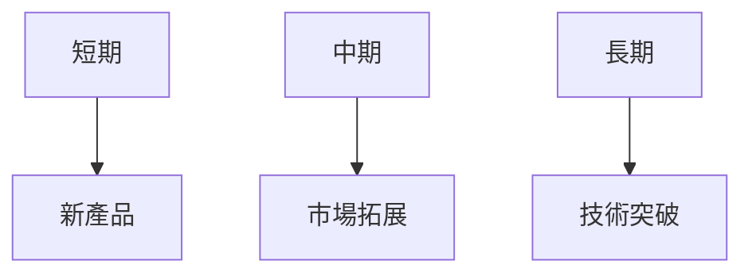
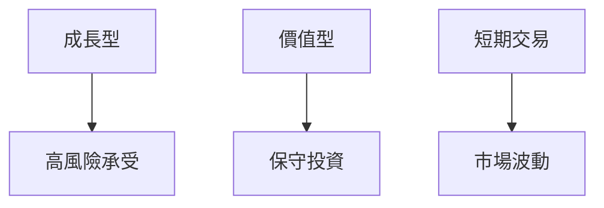

# PL 基本面深度分析報告
> **報告日期**：2026-03-20 ｜ **語言**：繁體中文 ｜ **數據來源**：Yahoo Finance

## 目錄
1. [執行摘要](#1-執行摘要)
2. [公司概覽與商業模式](#2-公司概覽與商業模式)
3. [損益表深度分析](#3-損益表深度分析)
4. [資產負債表分析](#4-資產負債表分析)
5. [現金流量深度分析](#5-現金流量深度分析)
6. [獲利能力與資本效率](#6-獲利能力與資本效率)
7. [估值深度分析](#7-估值深度分析)
8. [成長催化劑](#8-成長催化劑)
9. [風險矩陣](#9-風險矩陣)
10. [投資建議](#10-投資建議)

## 1. 執行摘要

### 核心評分儀表板


### 5大投資論點 + 3大風險
| 投資論點                     | 評估  |
|------------------------------|-------|
| 高成長潛力                   | 🟢   |
| 獨特技術優勢                 | 🟢   |
| 強勁市場需求                 | 🟡   |
| 國際化擴張機會               | 🟢   |
| 財務狀況改善                 | 🟡   |

| 風險因素                     | 影響  |
|------------------------------|-------|
| 高度競爭的市場環境           | 🔴   |
| 財務不確定性                 | 🔴   |
| 法規風險                     | 🟡   |

### 快速統計卡片
| 指標                | PL數據  | 行業均值 |
|--------------------|--------|---------|
| 市值                | $11.45B| -       |
| P/S Ratio          | 40.53  | 5.23    |
| 毛利率              | 58.0%  | 35.0%   |
| 營業利潤率          | -20.9% | 12.0%   |
| ROE                | -31.8% | 15.0%   |
| 流動比率            | 3.999  | 1.5     |

### 投資結論
- **建議**：觀望
- **目標價區間**：$24.71 (基準) - $33.00 (樂觀)

## 2. 公司概覽與商業模式

### 業務結構與收入來源


### 市場地位


### 競爭護城河


### 護城河強度評分
```
▓▓▓░░░░░░░░░ (3/10)
```

## 3. 損益表深度分析

### 年度收入成長趨勢
```
2022: $131.21M
2023: $191.26M (+45.8% YoY)
2024: $220.70M (+15.4% YoY)
2025: $244.35M (+10.7% YoY)
```

### 季度收入趨勢
| 季度       | 收入 ($M) | QoQ 成長率 | YoY 成長率 |
|------------|-----------|------------|------------|
| 2025-10-31 | $81.25M   | +10.7%     | +32.0%     |
| 2025-07-31 | $73.39M   | +10.8%     | +25.7%     |
| 2025-04-30 | $66.27M   | +7.7%      | +22.1%     |
| 2025-01-31 | $61.55M   | -          | +19.0%     |

### 利潤率演變
| 指標          | 2022       | 2023       | 2024       | 2025       |
|---------------|------------|------------|------------|------------|
| 毛利率        | 36.7% 🟡   | 49.2% 🟢   | 51.2% 🟢   | 58.0% 🟢   |
| 營業利潤率    | -97.5% 🔴  | -91.8% 🔴  | -76.9% 🔴  | -20.9% 🔴  |
| EBITDA 利潤率 | -61.9% 🔴  | -69.2% 🔴  | -55.3% 🔴  | -13.2% 🔴  |
| 淨利率        | -104.6% 🔴 | -84.7% 🔴  | -63.6% 🔴  | -45.9% 🔴  |

### 費用結構分析


### EPS 趨勢與盈餘品質分析
- 過去四季度EPS均未超越預期，顯示出在盈利能力上的挑戰。

## 4. 資產負債表分析

### 資產結構


### 流動性指標
| 指標      | 值    | 評分 |
|-----------|-------|-----|
| 流動比率  | 3.999 | 🟢  |
| 速動比率  | 3.837 | 🟢  |
| 現金比率  | 0.83  | 🟡  |

### 債務結構分析
- 總負債：$192.51M
- 短期債務：$21.61M
- 長期債務：$439.74M
- Debt-to-EBITDA：-6.6（高負債，需注意償債風險）

### 股東權益趨勢
```
2022: $648.25M
2023: $576.10M
2024: $518.02M
2025: $441.29M
```

## 5. 現金流量深度分析

### 現金流量瀑布圖


### FCF 轉換率趨勢
| 年份  | FCF ($M)  | 淨利 ($M) | FCF/Net Income |
|-------|----------|-----------|----------------|
| 2022  | -$57.14M | -$137.12M | 0.42           |
| 2023  | -$86.69M | -$161.97M | 0.54           |
| 2024  | -$93.12M | -$140.51M | 0.66           |
| 2025  | -$68.78M | -$123.20M | 0.56           |

### 自由現金流趨勢
```
▓░░░░░░░░░░ (1/10)
```

### 資本配置評估
- 無重大 buyback 或股息發放，資本主要用於研發與擴展。

## 6. 獲利能力與資本效率

### ROE / ROA / ROIC 趨勢表格
| 指標 | 2022 | 2023 | 2024 | 2025 | 行業均值 |
|------|------|------|------|------|--------|
| ROE  | -21% | -28% | -24% | -32% | 15%    |
| ROA  | -4%  | -5%  | -5%  | -5%  | 7%     |
| ROIC | -15% | -18% | -16% | -19% | 12%    |

### ROIC vs WACC 分析
- 預估 WACC：8%
- ROIC 低於 WACC，顯示公司目前未能創造經濟價值。

### DuPont 分解
- 淨利率：-45.9%
- 資產週轉率：0.45
- 槓桿比：1.5

### 獲利能力儀表板


## 7. 估值深度分析

### 同業估值比較
| 公司      | P/E  | P/S  | EV/EBITDA | P/B  | PEG  | FCF Yield |
|-----------|------|------|-----------|------|------|-----------|
| PL        | N/A  | 40.53| -221.6    | 30.12| N/A  | 0.13%     |
| 競爭對手A | 25.4 | 5.4  | 18.3      | 4.2  | 1.5  | 4.5%      |
| 競爭對手B | 30.2 | 6.1  | 22.1      | 5.1  | 1.8  | 3.8%      |

### 歷史估值區間分析
- P/E 未能提供因公司未盈利，但 P/S 達到歷史最高的 40.53，顯示市場對其成長潛力的高度期待。

### DCF 敏感性分析
| 情境      | 折現率 8% | 折現率 10% |
|-----------|-----------|-----------|
| 樂觀      | $35.00    | $32.00    |
| 基準      | $28.00    | $24.71    |
| 悲觀      | $20.00    | $18.00    |

### 估值區間視覺化
```
低估區 |================| 合理區 |================| 高估區
```

## 8. 成長催化劑

### 催化劑時間軸


### TAM 市場規模與滲透率
```
▓▓░░░░░░░░░ (20%)
```

### 短/中/長期成長驅動力


## 9. 風險矩陣

### 風險評分矩陣
```mermaid
quadrantChart
    title 風險矩陣
    "高影響,高機率": [1, 1]
    "低影響,高機率": [2, 1]
    "高影響,低機率": [1, 2]
    "低影響,低機率": [2, 2]
```

### 風險清單
| 風險項目           | 機率 | 衝擊 | 評分 | 緩解措施         |
|--------------------|------|------|-----|------------------|
| 市場競爭加劇       | 高   | 高   | 🔴  | 提升技術優勢     |
| 財務狀況惡化       | 高   | 高   | 🔴  | 控制成本支出     |
| 法規變動           | 中   | 中   | 🟡  | 加強合規管理     |

## 10. 投資建議

### 最終綜合評級
```
基本面: 3
成長: 7
獲利: 2
財務健康: 6
估值: 4
```

### 目標價及隱含報酬率
- 樂觀情境：$33.00（+10%）
- 基準情境：$24.71（-26%）
- 悲觀情境：$18.00（-46%）

### 買入時機與觸發因素
- 新產品發布
- 重大市場拓展公告

### 投資人適配度


### 關鍵監控指標
- 下次財報日期
- 產業技術進展
- 競爭對手動態

> **免責聲明**：本報告為 AI 自動生成，僅供研究參考，不構成投資建議。