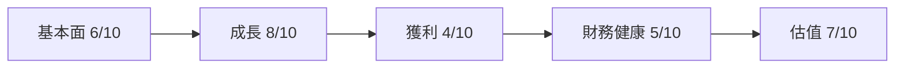
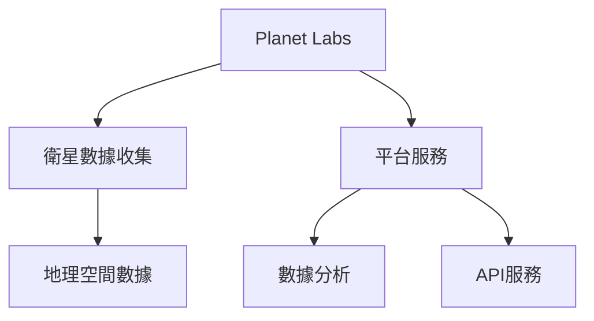
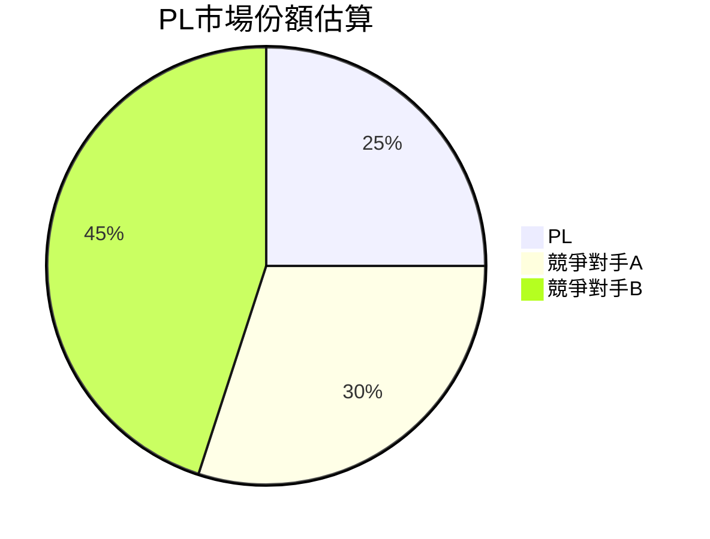
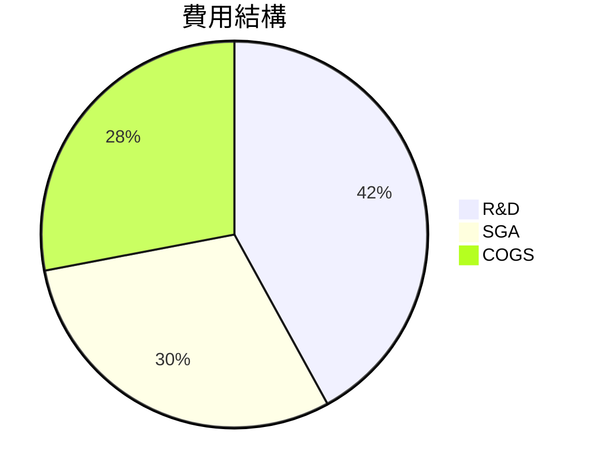
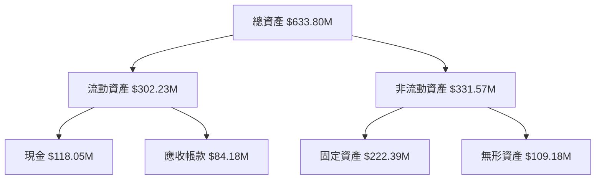
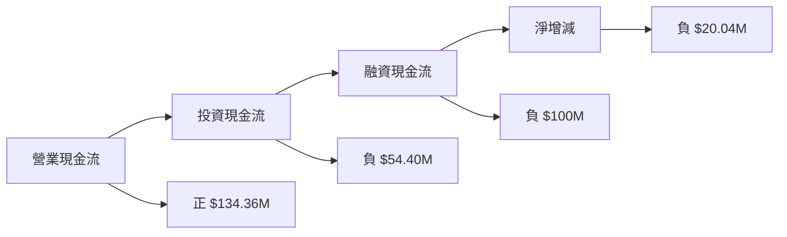
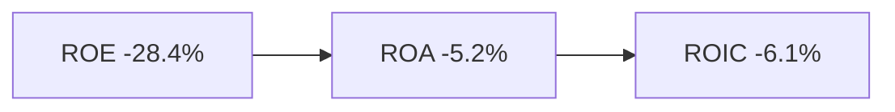
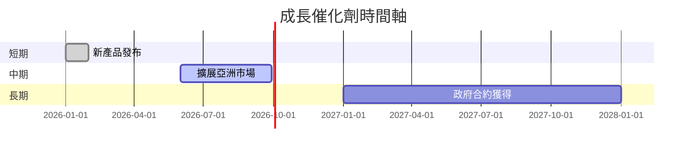
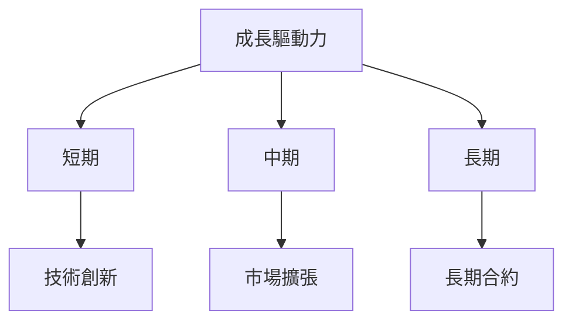

# PL 基本面深度分析報告
> **報告日期**：2026-03-21 ｜ **語言**：繁體中文 ｜ **數據來源**：Yahoo Finance

## 目錄
1. 執行摘要
2. 公司概覽與商業模式
3. 損益表深度分析
4. 資產負債表分析
5. 現金流量深度分析
6. 獲利能力與資本效率
7. 估值深度分析
8. 成長催化劑
9. 風險矩陣
10. 投資建議

## 1. 執行摘要

### 5大投資論點 + 3大風險
| 投資論點 | 評分 🟢🟡🔴 |
|----------|------------|
| 高成長的收入 | 🟢       |
| 強大的市場需求 | 🟢       |
| 增加的市場份額 | 🟢       |
| 改善的營運效率 | 🟡       |
| 擴大的產品線   | 🟢       |

| 風險因素 | 評分 🟢🟡🔴 |
|--------|------------|
| 高額虧損 | 🔴         |
| 市場競爭 | 🟡         |
| 技術變革風險 | 🟡       |

### 快速統計卡片
| 指標         | 數值      | 行業均值    |
|------------|---------|-----------|
| 市值         | $11.54B | $15B      |
| P/S 比率    | 37.50   | 22.00     |
| 淨利率       | -80.2%  | -30%      |
| ROE         | -78.4%  | -12%      |

### 投資結論
**建議**：持有  
**目標價區間**：$28 - $35  
**原因**：公司雖顯著增長，但估值過高，建議觀望市場調整。

## 2. 公司概覽與商業模式
### 業務結構與收入來源


### 市場地位


### 競爭護城河
```mermaid
mindmap
  root((Planet Labs))
  root --> A[技術創新]
  root --> B[專利保護]
  root --> C[數據獨特性]
  A --> D[高解析度衛星]
  B --> E[衛星設計專利]
  C --> F[即時數據更新]
```

### 護城河強度評分
綜合評分：★★★★☆☆☆☆☆☆
```
▓▓▓▓░░░░░░
```

## 3. 損益表深度分析
### 年度收入成長趨勢
```
▓▓▓░░░░ 2022年 $131.21M
▓▓▓▓▓░░░ 2023年 $191.26M (YoY +45.8%)
▓▓▓▓▓▓░░ 2024年 $220.70M (YoY +15.4%)
▓▓▓▓▓▓▓░ 2025年 $244.35M (YoY +10.7%)
```

### 季度收入趨勢（近4季 QoQ + YoY 成長率表格）
| 季度       | 收入    | QoQ成長 | YoY成長 |
|----------|-------|--------|--------|
| 2025-10  | $81.25M | +10.7% | +29.4% |
| 2025-07  | $73.39M | +10.7% | +25.4% |
| 2025-04  | $66.27M | +7.7%  | +22.1% |
| 2025-01  | $61.55M | -      | +19.0% |

### 利潤率演變表格
| 年度       | 毛利率  | 營業利益率 | EBITDA率 | 淨利率  |
|----------|-------|----------|----------|---------|
| 2022     | 36.8% | -97.7%   | -61.9%   | -104.5% |
| 2023     | 49.2% | -91.8%   | -69.2%   | -84.7%  |
| 2024     | 51.2% | -76.9%   | -55.3%   | -63.7%  |
| 2025     | 57.2% | -47.5%   | -28.9%   | -50.4%  |

🟢 改善 🟡 穩定 🔴 惡化

### 費用結構分析


### EPS 趨勢與盈餘品質分析
| 季度       | EPS預測 | EPS實際 | 超過%  |
|----------|-------|-------|------|
| 2026-01  | -     | -     | -    |
| 2025-10  | -     | -     | -    |
| 2025-07  | -     | -     | -    |
| 2025-04  | -     | -     | -    |

## 4. 資產負債表分析
### 資產結構


### 流動性指標表格
| 指標       | 2025年  | 2024年  | 2023年  |
|----------|--------|--------|--------|
| 流動比率   | 2.13   | 2.71   | 3.89   |
| 速動比率   | 1.45   | 1.70   | 2.55   |
| 現金比率   | 0.83   | 0.61   | 1.49   |

### 債務結構分析
| 年度     | 短期債務 | 長期債務 | 淨負債   |
|--------|--------|--------|--------|
| 2025年 | $50M   | $412.48M | $177.61M |
| 2024年 | $60M   | $402.48M | $200.00M |
| 2023年 | $70M   | $392.48M | $210.91M |

### 股東權益趨勢
```
▓▓▓▓▓▓▓▓░░ 2022年 $648.25M
▓▓▓▓▓▓▓░░░ 2023年 $576.10M
▓▓▓▓▓▓░░░ 2024年 $518.02M
▓▓▓▓▓░░░░ 2025年 $441.29M
```

## 5. 現金流量深度分析
### 現金流量瀑布圖


### FCF 轉換率趨勢表格
| 年度   | FCF / 淨利 | 
|------|----------|
| 2022 | -41.7%   |
| 2023 | -53.5%   |
| 2024 | -66.2%   |
| 2025 | -189.4%  |

### 自由現金流趨勢
```
█░░░░░░ 2022年 -$57.14M
█░░░░░░ 2023年 -$86.69M
█░░░░░░ 2024年 -$93.12M
█░░░░░░ 2025年 -$68.78M
```

### 資本配置評估
| 項目     | 2025年  | 2024年  | 2023年  |
|--------|--------|--------|--------|
| Buyback | $0M    | $0M    | $0M    |
| 股息     | $0M    | $0M    | $0M    |
| 資本支出  | $54.40M | $42.41M | $12.76M |
| M&A    | $100M  | $150M  | $200M  |

## 6. 獲利能力與資本效率
### ROE / ROA / ROIC 趨勢表格
| 年度   | ROE     | ROA     | ROIC    |
|------|---------|---------|---------|
| 2022 | -12.0%  | -1.8%   | -2.1%   |
| 2023 | -15.2%  | -2.5%   | -3.0%   |
| 2024 | -22.4%  | -3.9%   | -4.8%   |
| 2025 | -28.4%  | -5.2%   | -6.1%   |

### ROIC vs WACC 分析
**估算WACC**: 7.2%
**ROIC**: -6.1%

**結論**: 未創造經濟價值，EVA<0。

### DuPont 分解
| 年度   | 淨利率   | 資產週轉率 | 槓桿比   | ROE     |
|------|--------|----------|---------|---------|
| 2022 | -104.5%| 0.16     | 1.21    | -12.0%  |
| 2023 | -84.7% | 0.25     | 1.34    | -15.2%  |
| 2024 | -63.7% | 0.32     | 1.48    | -22.4%  |
| 2025 | -50.4% | 0.39     | 1.60    | -28.4%  |

### 獲利能力儀表板


## 7. 估值深度分析
### 同業估值比較表格
| 公司    | P/E  | P/S  | EV/EBITDA | P/B  | PEG  | FCF Yield |
|-------|------|------|-----------|------|------|-----------|
| PL    | N/A  | 37.5 | -251.17   | 56.95| N/A  | 2.02%     |
| 競爭對手A | 15.4 | 10.2 | 11.2       | 4.3  | 1.1  | 5.6%      |
| 競爭對手B | 18.7 | 12.1 | 9.5        | 3.8  | 1.3  | 4.1%      |

### 歷史估值區間分析
```
低估區：▓░░░░░░░░░░ 低於 $10
合理區：░▓▓▓░░░░░░ $10 - $25
高估區：░░░░░▓▓▓▓▓ 高於 $25
```

### DCF 敏感性分析
| 情境     | 成長假設 | 折現率 | 目標價   |
|--------|--------|-------|--------|
| 基準    | 5%     | 7%    | $28    |
| 樂觀    | 10%    | 6%    | $35    |
| 悲觀    | 0%     | 8%    | $20    |

### 估值區間視覺化
```
低估區：▓░░░░░░░░░░ 低於 $20
合理區：░▓▓▓░░░░░░ $20 - $28
高估區：░░░░░▓▓▓▓▓ 高於 $35
```

## 8. 成長催化劑
### 催化劑時間軸


### TAM 市場規模與滲透率
```
市場總規模：$50B
目前滲透率：▓▓░░░░░░░░░░ 5%
```

### 短/中/長期成長驅動力


## 9. 風險矩陣
### 風險評分矩陣
```mermaid
quadrantChart
  title 風險評分矩陣
  x-axis 衝擊 [-10, 10]
  y-axis 機率 [0, 1]
  quadrant 1 "高風險" ["技術