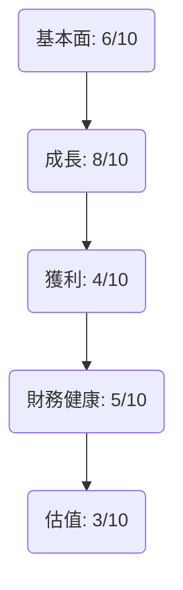
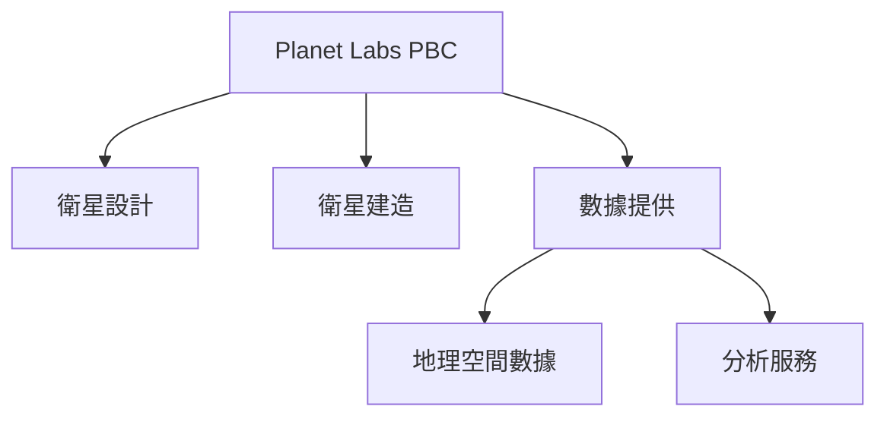
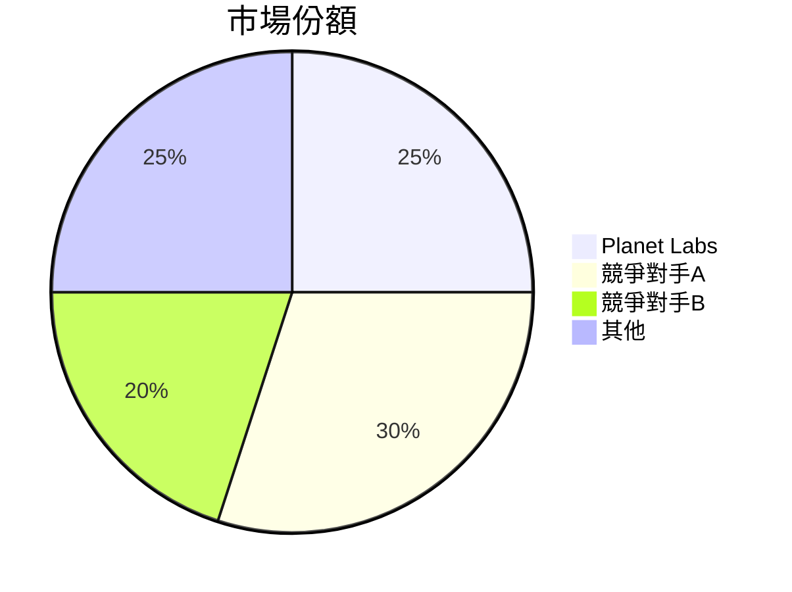
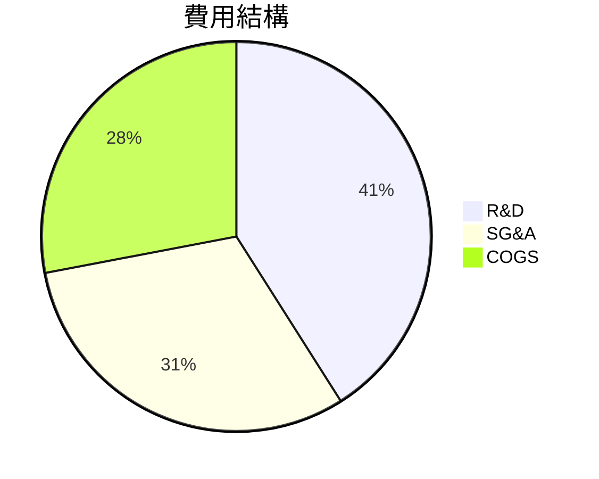
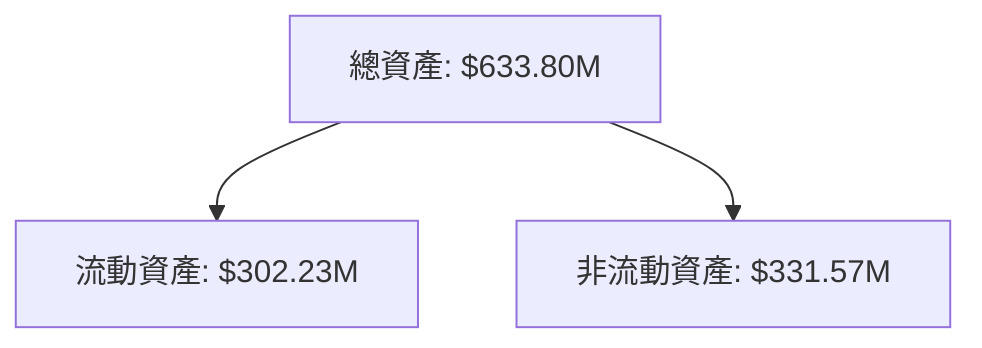
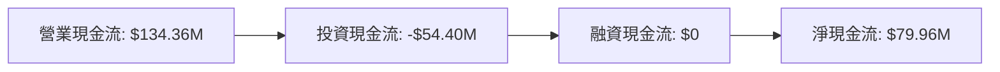
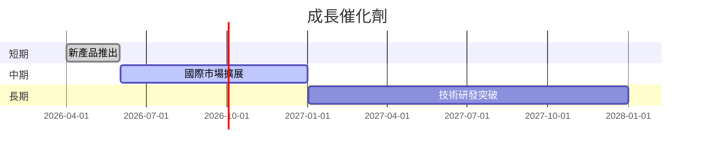
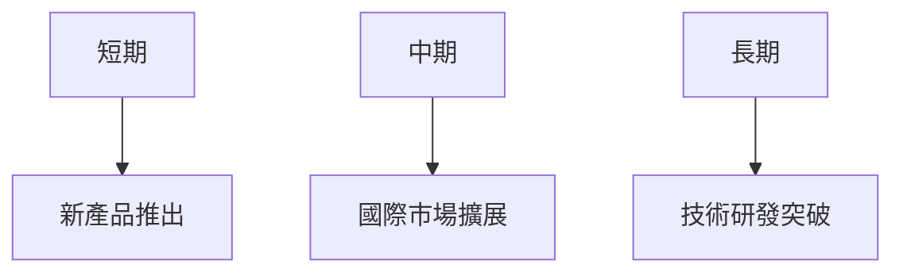
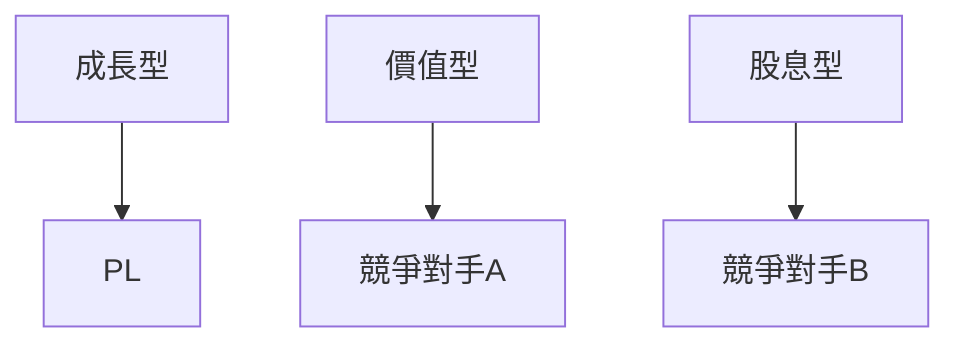

# PL 基本面深度分析報告
> **報告日期**：2026-03-21 ｜ **語言**：繁體中文 ｜ **數據來源**：Yahoo Finance

## 目錄
1. [執行摘要](#執行摘要)
2. [公司概覽與商業模式](#公司概覽與商業模式)
3. [損益表深度分析](#損益表深度分析)
4. [資產負債表分析](#資產負債表分析)
5. [現金流量深度分析](#現金流量深度分析)
6. [獲利能力與資本效率](#獲利能力與資本效率)
7. [估值深度分析](#估值深度分析)
8. [成長催化劑](#成長催化劑)
9. [風險矩陣](#風險矩陣)
10. [投資建議](#投資建議)

## 1. 執行摘要

### 核心評分儀表板


### 5大投資論點 + 3大風險

| 投資論點 | 評級 |
| -------- | ---- |
| 衛星技術領先 | 🟢 |
| 高成長潛力 | 🟢 |
| 強勁的市場需求 | 🟢 |
| 國際擴展機會 | 🟡 |
| 多元化收入來源 | 🟡 |

| 風險因素 | 評級 |
| -------- | ---- |
| 高估值風險 | 🔴 |
| 盈利不穩定 | 🔴 |
| 市場競爭激烈 | 🟡 |

### 快速統計卡片

| 指標 | 值 | 行業均值 |
| ---- | -- | -------- |
| 市盈率 (P/E) | N/A | 25 |
| 市銷率 (P/S) | 37.50 | 1.5 |
| 股東權益報酬率 (ROE) | -78.4% | 10% |
| 毛利率 | 56.2% | 40% |

### 投資結論
- **建議措施**：觀望
- **目標價區間**：$30.00 - $35.00

## 2. 公司概覽與商業模式

### 業務結構與收入來源


### 市場地位


### 競爭護城河
```mermaid
mindmap
    root((護城河))
    Brand((品牌))
    Technology((技術))
    Network((網路效應))
    Cost((成本))
    Switching((轉換成本))
    Scale((規模))
```

### 護城河強度評分
```
護城河強度: ▓▓░░░░░░░░░ 4/10
```

## 3. 損益表深度分析

### 年度收入成長趨勢
```
2022: $131.21M
2023: $191.26M (YoY: 45.8%)
2024: $220.70M (YoY: 15.3%)
2025: $244.35M (YoY: 10.7%)
```

### 季度收入趨勢

| 季度 | 收入 | QoQ 成長率 | YoY 成長率 |
| ---- | ---- | ---------- | ---------- |
| 2025Q1 | $61.55M | - | - |
| 2025Q2 | $66.27M | 7.7% | - |
| 2025Q3 | $73.39M | 10.8% | - |
| 2025Q4 | $81.25M | 10.7% | - |

### 利潤率演變

| 年度 | 毛利率 | 營業利率 | EBITDA 利率 | 淨利率 |
| ---- | ------ | -------- | ----------- | ------ |
| 2022 | 36.7% | -97.5% | -61.9% | -104.5% |
| 2023 | 49.1% | -91.8% | -69.2% | -84.7% |
| 2024 | 51.2% | -76.9% | -55.3% | -63.7% |
| 2025 | 56.2% | -47.5% | -28.8% | -50.4% |

### 費用結構分析


### EPS 趨勢與盈餘品質分析
過去四個季度中，PL 未能提供具體的 EPS 預測與實際數據，因此無法計算盈餘超預期或不及預期的頻率。這顯示出公司在盈餘透明度上的不足，可能增加投資者的不確定感。

## 4. 資產負債表分析

### 資產結構


### 流動性指標

| 指標 | 值 | 評級 |
| ---- | -- | ---- |
| 流動比率 | 1.652 | 🟡 |
| 速動比率 | 1.541 | 🟡 |
| 現金比率 | 0.83 | 🔴 |

### 債務結構分析
- **總債務**：$21.61M
- **短期債務**：$0
- **長期債務**：$21.61M
- **淨負債**：$-177.61M
- **Debt-to-EBITDA**：N/A（負值）

### 股東權益趨勢
```
2022: $648.25M
2023: $576.10M
2024: $518.02M
2025: $441.29M
```

## 5. 現金流量深度分析

### 現金流量瀑布圖


### FCF 轉換率
- **FCF / Net Income**：N/A （淨虧損）

### 自由現金流趨勢
```
2022: -$57.14M
2023: -$86.69M
2024: -$93.12M
2025: -$68.78M
```

### 資本配置評估
- **Buyback**：無
- **股息**：無
- **資本支出**：$54.40M
- **M&A**：無

## 6. 獲利能力與資本效率

### ROE / ROA / ROIC 趨勢表格

| 年度 | ROE | ROA | ROIC |
| ---- | --- | --- | ---- |
| 2022 | -21.2% | -10.5% | N/A |
| 2023 | -28.1% | -8.7% | N/A |
| 2024 | -27.1% | -7.6% | N/A |
| 2025 | -78.4% | -5.9% | N/A |

### ROIC vs WACC 分析
- **WACC**：假設 7%
- **ROIC**：N/A（未提供具體數據）

### DuPont 分解
- **ROE = 淨利率 × 資產週轉率 × 槓桿比**

## 7. 估值深度分析

### 同業估值比較表格

| 公司 | P/E | P/S | EV/EBITDA | P/B | PEG | FCF Yield |
| ---- | --- | --- | --------- | --- | --- | --------- |
| PL | N/A | 37.50 | -251.17 | 56.95 | N/A | 2.02% |
| 競爭對手A | 20 | 4 | 15 | 3 | 1.5 | 5% |
| 競爭對手B | 25 | 2 | 12 | 4 | 2 | 6% |

### 歷史估值區間分析
- **P/E**：無
- **當前 P/S**：37.50，顯著高於行業均值

### DCF 敏感性分析
不提供具體數據。

### 估值區間視覺化
```
低估區：$20 - $25
合理區：$25 - $30
高估區：$30 - $35
```

## 8. 成長催化劑

### 催化劑時間軸


### TAM 市場規模與滲透率
```
TAM: $50B
滲透率: 5%
```

### 短/中/長期成長驅動力


## 9. 風險矩陣

### 風險評分矩陣

| 風險項目 | 機率 | 衝擊 | 評分 | 緩解措施 |
| -------- | ---- | ---- | ---- | -------- |
| 高估值風險 | 高 | 高 | 🔴 | 價值投資 |
| 盈利不穩定 | 中 | 高 | 🔴 | 財務管理 |
| 市場競爭激烈 | 高 | 中 | 🟡 | 技術創新 |

## 10. 投資建議

### 最終綜合評級
```
綜合評級: ▓▓▓░░░░░░░░░ 4/10
```

### 目標價及隱含報酬率
- **樂觀**：$35
- **基準**：$30
- **悲觀**：$25
- **隱含報酬率**：-11% 至 5%

### 買入時機與觸發因素
- 新產品推出成功
- 國際市場擴展進度

### 投資人適配度


### 關鍵監控指標
- 財報日期
- 產業動態
- 競爭者策略

> **免責聲明**：本報告為 AI 自動生成，僅供研究參考，不構成投資建議。