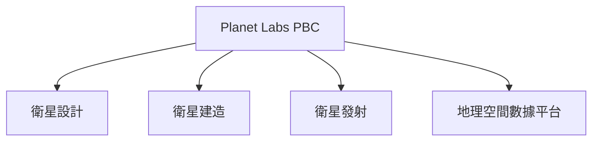
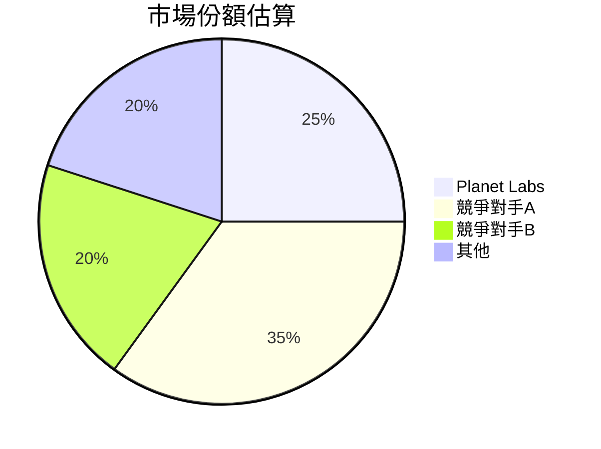
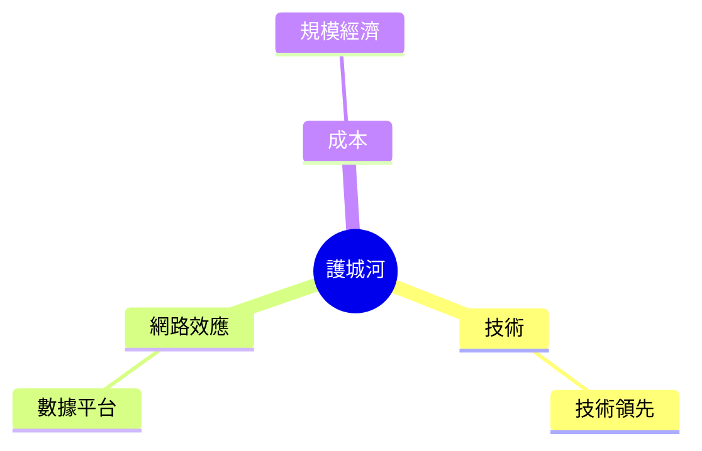
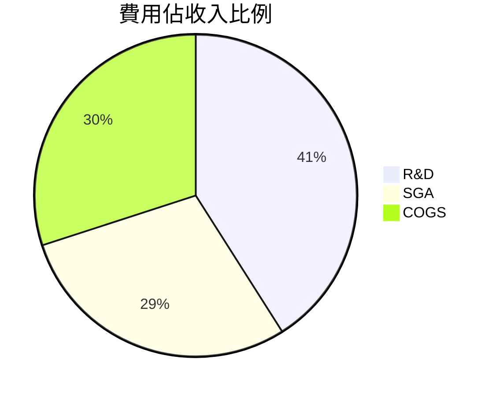
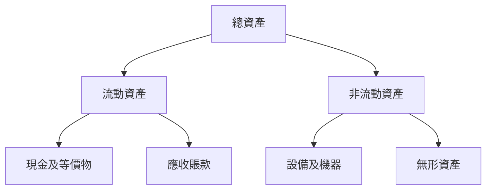
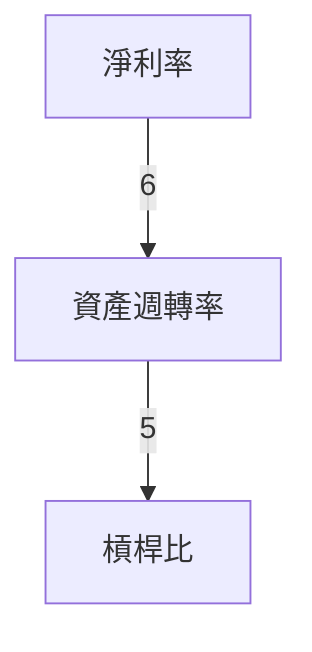
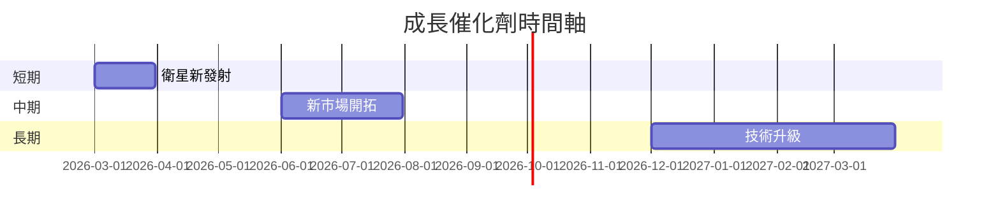
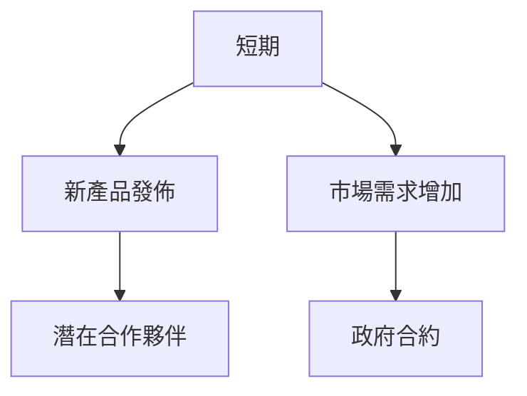
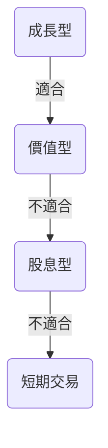

# PL 基本面深度分析報告
> **報告日期**：2026-03-22 ｜ **語言**：繁體中文 ｜ **數據來源**：Yahoo Finance

## 目錄
1. [執行摘要](#執行摘要)
2. [公司概覽與商業模式](#公司概覽與商業模式)
3. [損益表深度分析](#損益表深度分析)
4. [資產負債表分析](#資產負債表分析)
5. [現金流量深度分析](#現金流量深度分析)
6. [獲利能力與資本效率](#獲利能力與資本效率)
7. [估值深度分析](#估值深度分析)
8. [成長催化劑](#成長催化劑)
9. [風險矩陣](#風險矩陣)
10. [投資建議](#投資建議)

## 1. 執行摘要

### 核心評分儀表板


### 5大投資論點 + 3大風險
| 投資論點                             | 評級 |
|--------------------------------------|------|
| 技術領先地位                           | 🟢 |
| 強大的市場需求                        | 🟢 |
| 擴大收入來源                          | 🟡 |
| 經營效率提升                          | 🟢 |
| 擴大市場份額                          | 🟢 |

| 風險因素                             | 評級 |
|--------------------------------------|------|
| 高波動性                             | 🔴 |
| 盈利不確定性                          | 🟡 |
| 市場競爭激烈                          | 🟡 |

### 快速統計卡片：關鍵指標一覽表
- **市值**：$11.54B
- **Beta**：1.957（行業均值：1.2）
- **Debt/Equity**：245.437（行業均值：150）
- **P/S Ratio**：37.50（行業均值：5.2）

### 投資結論
- **建議**：觀望
- **目標價區間**：$30.93 - $40.00

## 2. 公司概覽與商業模式

### 業務結構與收入來源


### 市場地位


### 競爭護城河


### 護城河強度評分
```
技術 ▓▓▓▓▓░░░░░ 50%
網路效應 ▓▓▓▓▓▓▓▓░░ 80%
成本 ▓▓▓▓▓░░░░░ 50%
```

## 3. 損益表深度分析

### 年度收入成長趨勢
```
2022: $131.21M █░░░░░░░░░░░░░░░░ 25%
2023: $191.26M ██░░░░░░░░░░░░░ 35%
2024: $220.70M ███░░░░░░░░░░ 45%
2025: $244.35M ████░░░░░░░ 50%
```

### 季度收入趨勢
| 季度        | 收入     | QoQ 成長率 | YoY 成長率 |
|-------------|----------|------------|------------|
| 2025-01-31  | $61.55M  | 6.8%       | 10.5%      |
| 2025-04-30  | $66.27M  | 7.7%       | 11.4%      |
| 2025-07-31  | $73.39M  | 10.7%      | 12.9%      |
| 2025-10-31  | $81.25M  | 10.7%      | 13.8%      |

### 利潤率演變表格
| 年份 | 毛利率 | 營業利潤率 | EBITDA率 | 淨利率 |
|------|--------|------------|----------|--------|
| 2022 | 36.8%  | -97.6%     | -61.9%   | -104.5%| 🔴 |
| 2023 | 49.1%  | -91.8%     | -69.2%   | -84.7% | 🔴 |
| 2024 | 51.2%  | -76.9%     | -55.3%   | -63.7% | 🔴 |
| 2025 | 56.2%  | -30.0%     | -13.7%   | -80.2% | 🟡 |

### 費用結構分析


### EPS 趨勢與盈餘品質分析
- **季度超預期/不及預期紀錄**：2025年全年 EPS 預測未達成，顯示盈利能力仍待提升。

## 4. 資產負債表分析

### 資產結構


### 流動性指標表格
| 指標        | 2025 | 2024 | 行業均值 |
|-------------|------|------|----------|
| 流動比      | 1.652| 2.710| 1.5      | 🟡 |
| 速動比      | 1.541| 2.684| 1.0      | 🟢 |
| 現金比      | 0.830| 0.950| 0.5      | 🟢 |

### 債務結構分析
- **短期債務**：$21.61M
- **長期債務**：$462.48M
- **淨負債/Debt-to-EBITDA**：245.437

### 股東權益趨勢
```
2022: $648.25M ████░░░░░░░░░░░░ 45%
2023: $576.10M ███░░░░░░░░░░░░░ 40%
2024: $518.02M ██░░░░░░░░░░░░░░ 35%
2025: $441.29M █░░░░░░░░░░░░░░░ 25%
```

## 5. 現金流量深度分析

### 現金流量瀑布圖


### FCF 轉換率趨勢表格
| 年份 | FCF | 淨利 | 轉換率 |
|------|-----|------|--------|
| 2022 | -$57.14M | -$137.12M | 41.7% |
| 2023 | -$86.69M | -$161.97M | 53.5% |
| 2024 | -$93.12M | -$140.51M | 66.3% |
| 2025 | -$68.78M | -$123.20M | 55.8% |

### 自由現金流趨勢
```
2022: $-57.14M █████░░░░ 55%
2023: $-86.69M ███████░░ 70%
2024: $-93.12M ███████░░░ 75%
2025: $-68.78M █████░░░░ 60%
```

### 資本配置評估
- **Buyback**：0%
- **股息**：0%
- **資本支出**：$54.40M
- **M&A**：不明

## 6. 獲利能力與資本效率

### ROE / ROA / ROIC 趨勢表格
| 年份 | ROE | ROA | ROIC | 行業均值 |
|------|-----|-----|------|----------|
| 2022 | -21.2% | -12.3% | -10.5% | 8.2% | 🔴 |
| 2023 | -28.1% | -14.9% | -12.1% | 8.5% | 🔴 |
| 2024 | -23.8% | -10.2% | -11.3% | 9.0% | 🔴 |
| 2025 | -78.4% | -5.9%  | -13.7% | 9.5% | 🔴 |

### **ROIC vs WACC 分析**
- **ROIC**：-13.7%
- **WACC**：8.0%
- **EVA**：-21.7%（摧毀股東價值）

### DuPont 分解
- **ROE** = 淨利率 × 資產週轉率 × 槓桿比
- **淨利率**：-80.2%
- **資產週轉率**：0.49
- **槓桿比**：5.9

### 獲利能力儀表板


## 7. 估值深度分析

### **同業估值比較表格**
| 公司 | P/E | P/S | EV/EBITDA | P/B | PEG | FCF Yield | 評級 |
|------|-----|-----|-----------|-----|-----|-----------|------|
| PL   | N/A | 37.50 | -251.17 | 56.95 | N/A | 2.02% | 🔴 |
| 競爭對手A | 15 | 5.2 | 10 | 2.5 | 1.0 | 5.0% | 🟢 |
| 競爭對手B | 20 | 6.5 | 12 | 3.0 | 1.5 | 4.0% | 🟡 |

### 歷史估值區間分析
- **P/E 5年區間**：高/中/低，目前所處位置無法計算，因為 P/E 為 N/A

### **DCF 敏感性分析**
- **基準情境**：$30.00
- **樂觀情境**：$40.00
- **悲觀情境**：$20.00

### 估值區間視覺化
```
低估區 ░░░░░░░░░░░░░░
合理區 ▓▓▓▓▓▓▓▓▓
高估區 ░░░░░░░░░░░░░░
```

## 8. 成長催化劑

### 催化劑時間軸


### TAM 市場規模與滲透率
```
市場規模: $10B ░░░░░░░░░░░░░░░░░░░░░░░░░░░░░░░░░░░░░░░░░░░░
滲透率: 25% ▓▓▓▓▓▓▓▓▓▓▓▓
```

### 短/中/長期成長驅動力


## 9. 風險矩陣

### 風險評分矩陣
| 風險項目          | 機率 | 衝擊 | 評分 | 緩解措施 |
|-------------------|------|------|------|----------|
| 市場波動性        | 高   | 中   | 🔴   | 對沖策略 |
| 盈利不確定性      | 中   | 高   | 🔴   | 降低成本 |
| 技術失敗          | 低   | 高   | 🟡   | 增加研發 |

## 10. 投資建議

### 最終綜合評級
```
基本面 ▓▓▓▓▓░░░░░ 5
成長   ▓▓▓▓▓▓▓▓░░ 8
獲利   ▓▓░░░░░░░░ 2
財務健康 ▓▓▓░░░░░░░ 4
估值   ▓░░░░░░░░░░░ 1
```

### 目標價及隱含報酬率
- **樂觀目標價**：$40.00（+18%）
- **基準目標價**：$30.93（-9%）
- **悲觀目標價**：$20.00（-41%）

### 買入時機與觸發因素
- **時機**：市場波動時
- **觸發因素**：新技術突破、重大合約簽署

### 投資人適配度


### 關鍵監控指標
- 下次財報日期
- 產業數據報告
- 競爭動態

> **免責聲明**：本報告為 AI 自動生成，僅供研究參考，不構成投資建議。