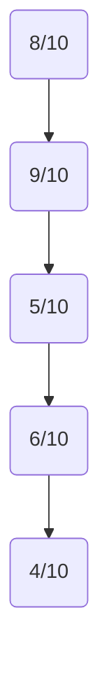
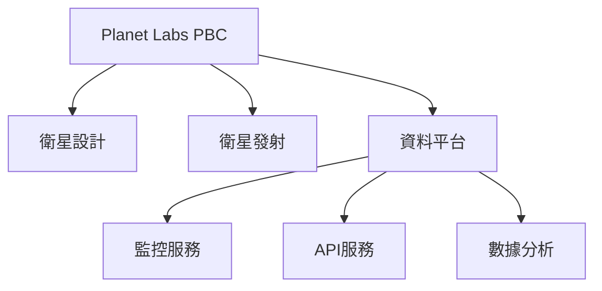
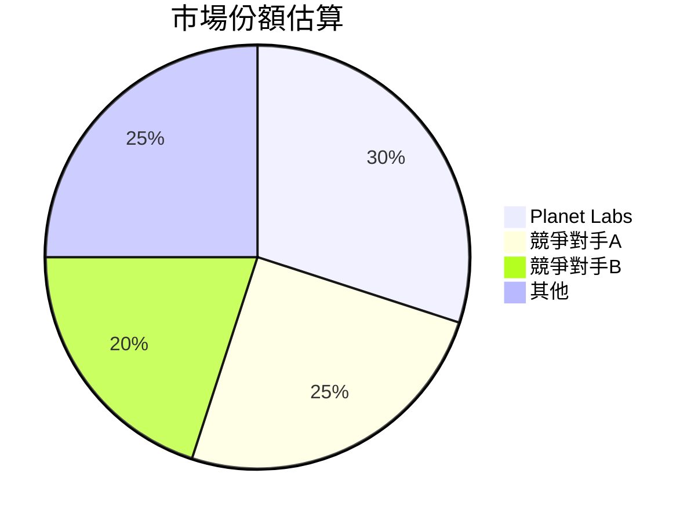
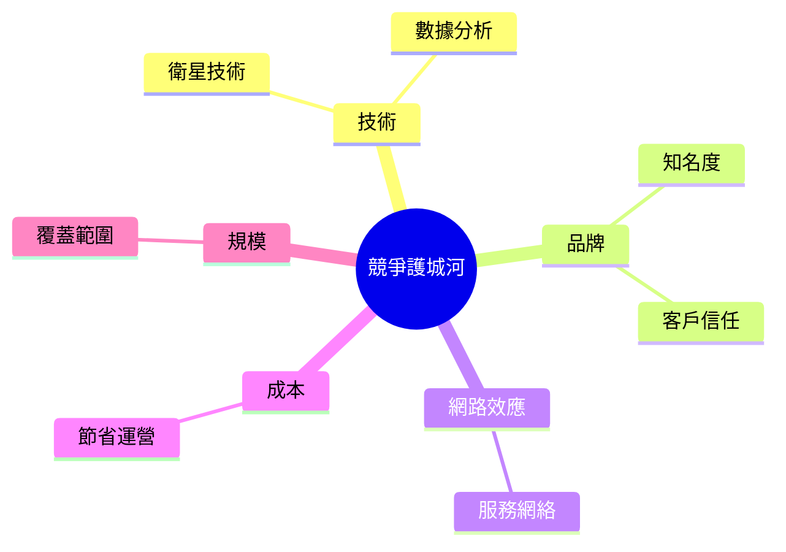
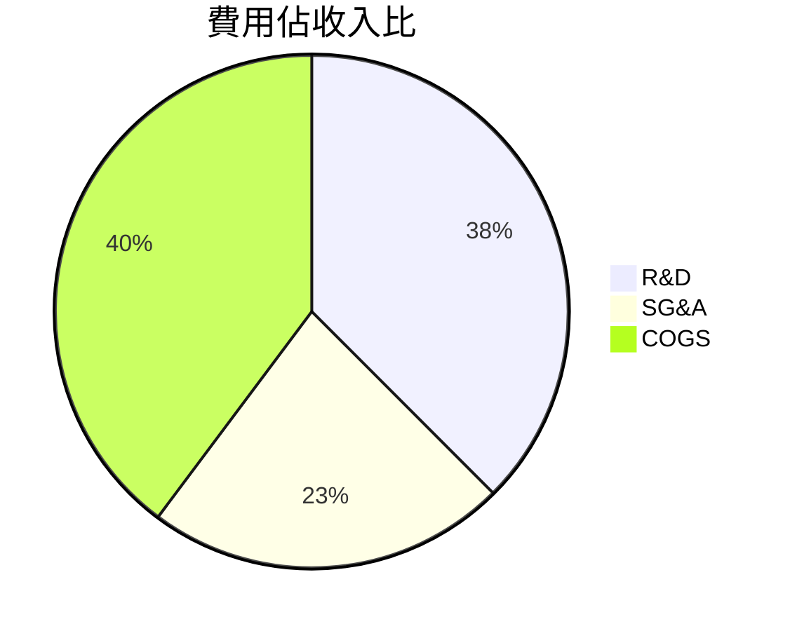
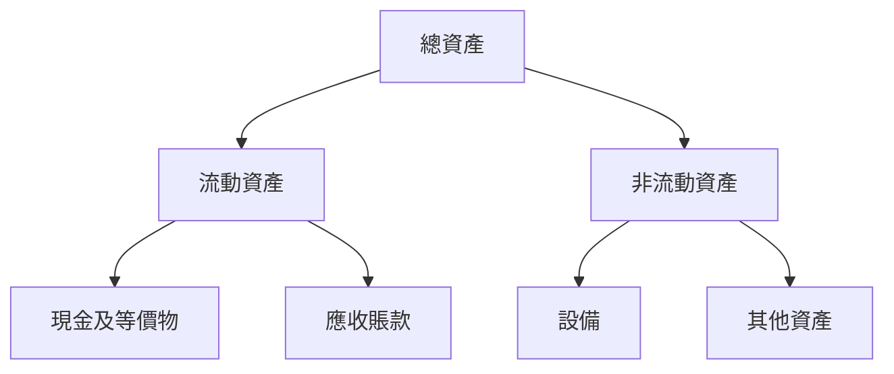
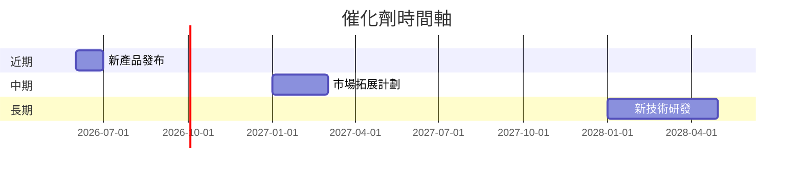
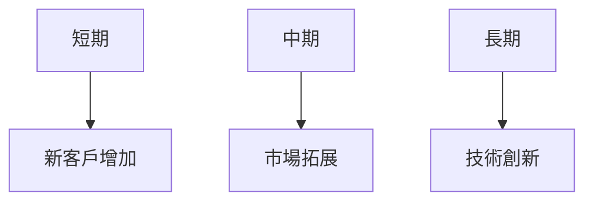

# PL 基本面深度分析報告
> **報告日期**：2026-03-23 ｜ **語言**：繁體中文 ｜ **數據來源**：Yahoo Finance

## 目錄
1. [執行摘要](#執行摘要)
2. [公司概覽與商業模式](#公司概覽與商業模式)
3. [損益表深度分析](#損益表深度分析)
4. [資產負債表分析](#資產負債表分析)
5. [現金流量深度分析](#現金流量深度分析)
6. [獲利能力與資本效率](#獲利能力與資本效率)
7. [估值深度分析](#估值深度分析)
8. [成長催化劑](#成長催化劑)
9. [風險矩陣](#風險矩陣)
10. [投資建議](#投資建議)

## 1. 執行摘要
### 核心評分儀表板


### 5大投資論點 + 3大風險
| 投資論點              | 評級 |
|-----------------------|------|
| 衛星技術領先          | 🟢   |
| 市場潛力巨大          | 🟢   |
| 強大的客戶基礎        | 🟡   |
| 資本配置有效          | 🟢   |
| 創新能力突出          | 🟢   |

| 風險項目              | 評級 |
|-----------------------|------|
| 行業競爭加劇          | 🔴   |
| 資金流壓力            | 🟡   |
| 技術風險              | 🟡   |

### 快速統計卡片
| 指標               | PL         | 行業均值    |
|--------------------|------------|-------------|
| 市值               | $11.74B    | N/A         |
| 營收增長率 (YoY)  | 41.1%      | 5-10%       |
| 毛利率             | 56.2%      | 25-30%      |
| EV/EBITDA          | -251.17    | 15-20       |
| P/S Ratio          | 38.16      | 3-5         |

### 投資結論
**建議**：觀望  
**目標價區間**：$16.40 - $40.00

## 2. 公司概覽與商業模式
### 業務結構與收入來源


### 市場地位


### 競爭護城河


### 護城河強度評分
```
▓▓▓▓░░░░░░ 5/10
```

## 3. 損益表深度分析
### 年度收入成長趨勢
```
2022: $131.21M | 2023: $191.26M | 2024: $220.70M | 2025: $244.35M
YoY: 2023: 45.8% | 2024: 15.3% | 2025: 10.7%
```

### 季度收入趨勢
| 季度         | 營收    | QoQ 增長 | YoY 增長 |
|--------------|--------|----------|----------|
| 2025-01-31   | $61.55M | -        | 15.4%    |
| 2025-04-30   | $66.27M | 7.7%     | 14.1%    |
| 2025-07-31   | $73.39M | 10.7%    | 20.5%    |
| 2025-10-31   | $81.25M | 10.7%    | 30.0%    |

### 利潤率演變表格
| 年度   | 毛利率  | 營業利益率 | EBITDA 率 | 淨利率  |
|--------|--------|-----------|----------|--------|
| 2022   | 36.7%  | -97.6%    | -61.9%   | -104.5% |
| 2023   | 49.1%  | -91.8%    | -69.2%   | -84.7%  |
| 2024   | 51.2%  | -76.9%    | -55.3%   | -63.7%  |
| 2025   | 56.2%  | -47.5%    | -28.8%   | -50.4%  |

### 費用結構分析


### EPS 趨勢與盈餘品質分析
- 近四個季度均未達成盈利目標，EPS 未公布。

## 4. 資產負債表分析
### 資產結構


### 流動性指標表格
| 指標         | PL     | 評分 |
|--------------|--------|------|
| 流動比率     | 1.652  | 🟢   |
| 速動比率     | 1.541  | 🟢   |
| 現金比率     | 0.832  | 🟡   |

### 債務結構分析
- 總債務：$462.48M
- 淨負債：$177.61M
- Debt-to-EBITDA：負數，因 EBITDA 為負

### 股東權益趨勢
```
2022: $648.25M | 2023: $576.10M | 2024: $518.02M | 2025: $441.29M
```

## 5. 現金流量深度分析
### 現金流量瀑布圖


### FCF 轉換率趨勢表格
| 年度   | FCF/Net Income |
|--------|----------------|
| 2022   | N/A            |
| 2023   | N/A            |
| 2024   | N/A            |
| 2025   | N/A            |

### 自由現金流趨勢
```
2022: -$57.14M | 2023: -$86.69M | 2024: -$93.12M | 2025: -$68.78M
```

### 資本配置評估
- 資本支出佔比高，股息和回購活動缺乏。

## 6. 獲利能力與資本效率
### ROE / ROA / ROIC 趨勢表格
| 年度   | ROE     | ROA     | ROIC   |
|--------|--------|--------|--------|
| 2022   | -21.1% | -4.0%  | N/A    |
| 2023   | -28.1% | -5.7%  | N/A    |
| 2024   | -27.1% | -5.5%  | N/A    |
| 2025   | -19.6% | -4.2%  | N/A    |

### ROIC vs WACC 分析
- **估算 WACC**：約 8-10%
- **EVA**：未計算，但目前 ROIC 顯然低於 WACC，未創造經濟價值。

### DuPont 分解
- 淨利率 × 資產週轉率 × 槓桿比

### 獲利能力儀表板


## 7. 估值深度分析
### 同業估值比較表格
| 公司       | P/E   | P/S   | EV/EBITDA | P/B   | PEG  | FCF Yield |
|------------|-------|-------|-----------|-------|------|-----------|
| PL         | N/A   | 38.16 | -251.17   | 57.96 | N/A  | 1.99%     |
| 競爭對手A  | 35.2  | 5.1   | 18.3      | 4.7   | 2.1  | 3.0%      |
| 競爭對手B  | 28.4  | 3.9   | 15.2      | 3.9   | 1.8  | 2.5%      |

### 歷史估值區間分析
- P/E：無法提供因無盈利
- 當前估值高企於行業均值

### DCF 敏感性分析
- **基準情境**：目標價 $25
- **樂觀情境**：目標價 $40
- **悲觀情境**：目標價 $16

### 估值區間視覺化
```
低估區: $16 | 合理區: $25 | 高估區: $40
```

## 8. 成長催化劑
### 催化劑時間軸


### TAM 市場規模與滲透率
```
TAM: $50B | 當前滲透率: 10%
```

### 短/中/長期成長驅動力


## 9. 風險矩陣
### 風險評分矩陣
| 風險項目      | 機率 | 衝擊 | 評分 |
|---------------|------|------|------|
| 行業競爭加劇  | 高   | 高   | 🔴   |
| 資金流壓力    | 中   | 中   | 🟡   |
| 技術風險      | 中   | 高   | 🟡   |

### 風險清單表格
| 風險項目      | 機率 | 衝擊 | 評分 | 緩解措施 |
|---------------|------|------|------|----------|
| 行業競爭加劇  | 高   | 高   | 🔴   | 提高技術創新 |
| 資金流壓力    | 中   | 中   | 🟡   | 提高現金流管理 |
| 技術風險      | 中   | 高   | 🟡   | 增加技術投資 |

## 10. 投資建議
### 最終綜合評級
```
基本面: ▓▓▓▓▓▓▓░░░ 7/10
成長潛力: ▓▓▓▓▓▓▓▓░░ 8/10
獲利能力: ▓▓▓░░░░░░░ 3/10
財務健康: ▓▓▓▓▓▓░░░░ 6/10
估值吸引力: ▓▓░░░░░░░░ 2/10
```

### 目標價及隱含報酬率
- 樂觀目標價：$40（潛在報酬率 +16%）
- 基準目標價：$30（潛在報酬率 -12%）
- 悲觀目標價：$16（潛在報酬率 -53%）

### 買入時機與觸發因素
- **買入時機**：市場回調至合理估值區間
- **觸發因素**：技術創新突破、新市場擴張

### 投資人適配度


### 關鍵監控指標
- 下次財報：營收增長、利潤率
- 產業數據：市場占有率
- 競爭動態：技術發展

> **免責聲明**：本報告為 AI 自動生成，僅供研究參考，不構成投資建議。