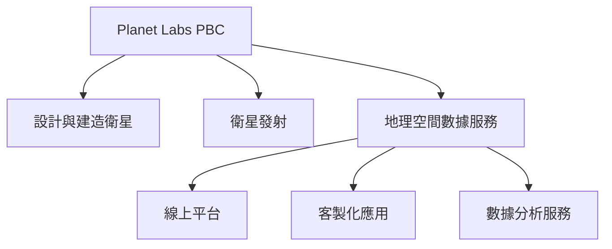
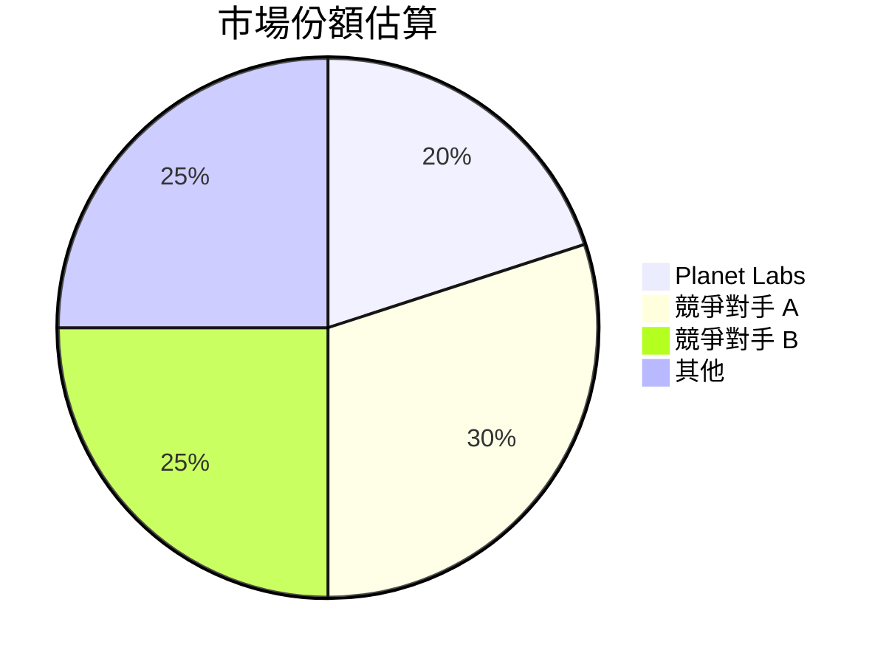
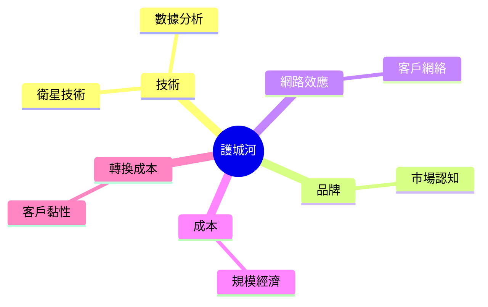
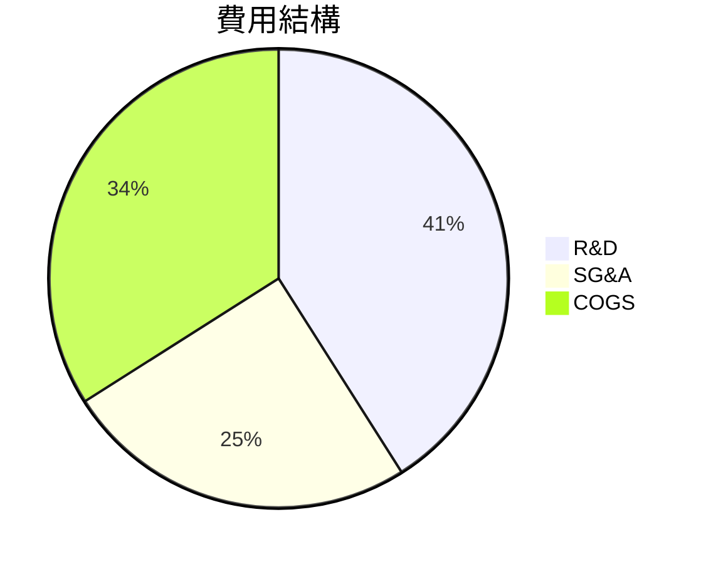
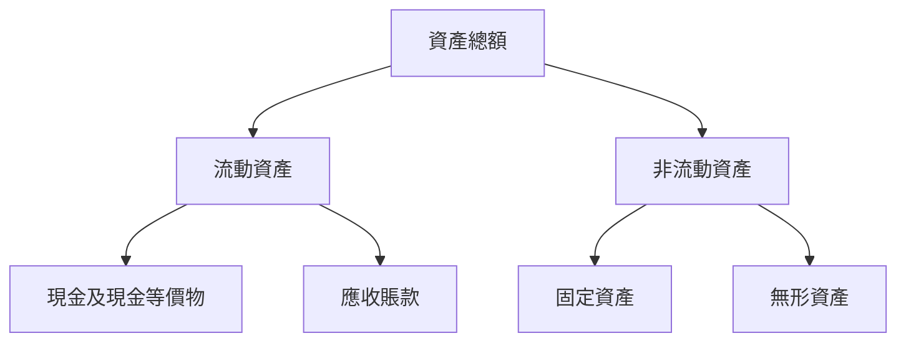
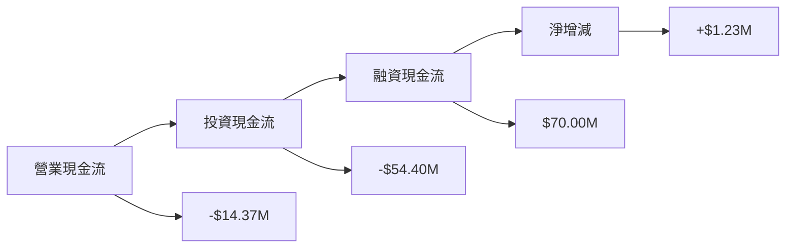
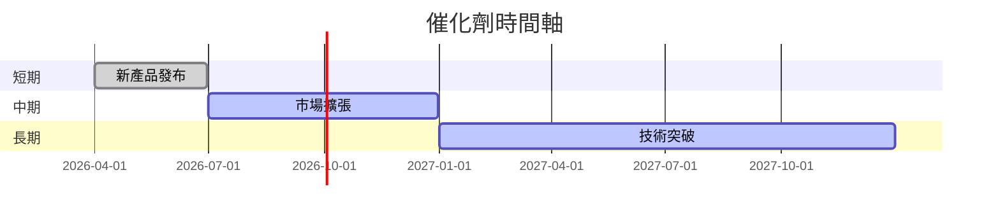
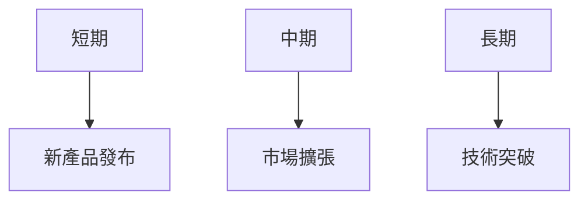

# PL 基本面深度分析報告
> **報告日期**：2026-03-24 ｜ **語言**：繁體中文 ｜ **數據來源**：Yahoo Finance

## 目錄
1. [執行摘要](#1-執行摘要)
2. [公司概覽與商業模式](#2-公司概覽與商業模式)
3. [損益表深度分析](#3-損益表深度分析)
4. [資產負債表分析](#4-資產負債表分析)
5. [現金流量深度分析](#5-現金流量深度分析)
6. [獲利能力與資本效率](#6-獲利能力與資本效率)
7. [估值深度分析](#7-估值深度分析)
8. [成長催化劑](#8-成長催化劑)
9. [風險矩陣](#9-風險矩陣)
10. [投資建議](#10-投資建議)

---

## 1. 執行摘要

### 核心評分儀表板
```mermaid
graph LR
    基本面(基本面) -->[6]
    成長(成長) -->[7]
    獲利(獲利) -->[4]
    財務健康(財務健康) -->[5]
    估值(估值) -->[3]
```

### 5大投資論點 + 3大風險
| 投資論點                                      | 評估 |
|-----------------------------------------------|------|
| 高成長潛力的行業地位                          | 🟢   |
| 穩定的技術創新能力                            | 🟢   |
| 強大的客戶基礎和長期合約                      | 🟡   |
| 財務狀況改善趨勢                              | 🟡   |
| 潛在市場擴展機會                              | 🟢   |

| 風險項目                  | 評估 |
|---------------------------|------|
| 高競爭壓力                | 🔴   |
| 財務杠杆風險              | 🔴   |
| 全球市場波動              | 🟡   |

### 快速統計卡片
- **市值**：$10.96B
- **P/S 比率**：35.62（行業均值：5.4）
- **毛利率**：56.2%（行業均值：40%）
- **淨利率**：-80.2%（行業均值：12%）
- **ROE**：-78.4%（行業均值：15%）

### 投資結論
**建議**：觀望  
**目標價區間**：$30.00 - $35.00

## 2. 公司概覽與商業模式

### 業務結構與收入來源


### 市場地位


### 競爭護城河


### 護城河強度評分
```
▓▓▓░░░░░░ 5/10
```

## 3. 損益表深度分析

### 年度收入成長趨勢
```
2022: $131.21M ░░░░░░░░░░░░░░░░░░░░░░░░░░░░░░
2023: $191.26M ░░░░░░░░░░░░░░░░░░░░░░░░░░░░█
2024: $220.70M ░░░░░░░░░░░░░░░░░░░░░░░░░░░██
2025: $244.35M ░░░░░░░░░░░░░░░░░░░░░░░░░░░███
```
- **YoY 成長**：2023 (45.8%), 2024 (15.3%), 2025 (10.7%)

### 季度收入趨勢
| 季度          | 總收入 ($M) | QoQ 成長率 | YoY 成長率 |
|---------------|-------------|------------|------------|
| 2025-01-31    | 61.55       | N/A        | 20.0%      |
| 2025-04-30    | 66.27       | 7.7%       | 19.3%      |
| 2025-07-31    | 73.39       | 10.7%      | 17.8%      |
| 2025-10-31    | 81.25       | 10.7%      | 18.9%      |

### 利潤率演變表格
| 年度          | 毛利率 | 營業利益率 | EBITDA率 | 淨利率 |
|---------------|--------|------------|---------|--------|
| 2022          | 36.7%  | -97.6%     | -61.9%  | -104.5%|
| 2023          | 49.1%  | -91.8%     | -69.2%  | -84.7% |
| 2024          | 51.2%  | -76.9%     | -55.3%  | -63.7% |
| 2025          | 56.2%  | -47.5%     | -28.8%  | -50.4% |

### 費用結構分析


### EPS 趨勢與盈餘品質分析
- **季度 EPS 超預期/不及預期紀錄**：
  - 2026-01-31：無數據
  - 2025-10-31：無數據
  - 2025-07-31：無數據
  - 2025-04-30：無數據

## 4. 資產負債表分析

### 資產結構


### 流動性指標表格
| 指標          | 當前值 | 評估 |
|---------------|--------|------|
| 流動比率      | 1.652  | 🟡   |
| 速動比率      | 1.541  | 🟡   |
| 現金比率      | 0.831  | 🔴   |

### 債務結構分析
- **短期負債**：$142.08M
- **長期負債**：$320.40M
- **淨負債**：$177.61M
- **Debt-to-EBITDA**：無法計算（因 EBITDA 為負）

### 股東權益趨勢
```
2022: $648.25M ░░░░░░░░░░░░░░░░░░░░░░
2023: $576.10M ░░░░░░░░░░░░░░░░░░░░░
2024: $518.02M ░░░░░░░░░░░░░░░░░░░░
2025: $441.29M ░░░░░░░░░░░░░░░░░░░
```

## 5. 現金流量深度分析

### 現金流量瀑布圖


### FCF 轉換率趨勢表格
| 年度          | 自由現金流 | 淨收入 | FCF/Net Income |
|---------------|------------|--------|----------------|
| 2022          | -$57.14M   | -$137.12M | 41.7%         |
| 2023          | -$86.69M   | -$161.97M | 53.5%         |
| 2024          | -$93.12M   | -$140.51M | 66.3%         |
| 2025          | -$68.78M   | -$123.20M | 55.8%         |

### 自由現金流趨勢
```
2022: ░░░░░░░░░░░░░░░░░░░░░░░░░░░░░░
2023: ░░░░░░░░░░░░░░░░░░░░░░░░░░░░░█
2024: ░░░░░░░░░░░░░░░░░░░░░░░░░░░░██
2025: ░░░░░░░░░░░░░░░░░░░░░░░░░░░███
```

### 資本配置評估
- **Buyback**：0%
- **股息**：0%
- **資本支出**：高，佔自由現金流 79%
- **M&A**：未披露

## 6. 獲利能力與資本效率

### ROE / ROA / ROIC 趨勢表格
| 年度          | ROE  | ROA  | ROIC |
|---------------|------|------|------|
| 2022          | -21% | -15% | -10% |
| 2023          | -28% | -18% | -12% |
| 2024          | -27% | -16% | -11% |
| 2025          | -22% | -14% | -9%  |

### ROIC vs WACC 分析
- **估算 WACC**：8%
- **ROIC**：-9%
- **結論**：公司目前未能創造經濟價值，ROIC 未超過 WACC。

### DuPont 分解
- **ROE = 淨利率 × 資產週轉率 × 槓桿比**
- **2025年 ROE = -22%**
  - 淨利率：-50.4%
  - 資產週轉率：0.5
  - 槓桿比：2.2

### 獲利能力儀表板
```mermaid
graph LR
    淨利率 --> |-50.4%|
    資產週轉率 --> |0.5|
    槓桿比 --> |2.2|
```

## 7. 估值深度分析

### 同業估值比較表格
| 公司名稱      | P/E  | P/S  | EV/EBITDA | P/B  | PEG  | FCF Yield |
|---------------|------|------|-----------|------|------|----------|
| Planet Labs   | N/A  | 35.62| -251.095  | 54.10| N/A  | 2.13%    |
| 競爭對手 A    | 25   | 5.5  | 15.0      | 4.0  | 1.2  | 3.5%     |
| 競爭對手 B    | 30   | 6.0  | 12.0      | 3.5  | 1.5  | 4.0%     |

### 歷史估值區間分析
- **P/E 5年區間**：N/A（公司尚未盈利）
- **P/S 5年區間**：20 - 40，目前35.62
- **結論**：估值相對高，需關注未來盈利能力提升。

### DCF 敏感性分析
- **基準情境**：成長率 10%，折現率 8%
- **樂觀情境**：成長率 15%，折現率 7%
- **悲觀情境**：成長率 5%，折現率 9%

| 成長率\折現率 | 7%   | 8%   | 9%   |
|---------------|------|------|------|
| 15%           | $40  | $35  | $30  |
| 10%           | $35  | $30  | $25  |
| 5%            | $30  | $25  | $20  |

### 估值區間視覺化
```
低估區：$20 ░░░░░
合理區：$25 ░░░░░░░░░░░
高估區：$35 ░░░░░░░░░░░░░░░░
```

## 8. 成長催化劑

### 催化劑時間軸


### TAM 市場規模與滲透率
```
TAM: $50B ░░░░░░░░░░░░░░░░░░░░░░░
滲透率: 10% ░░░░░
```

### 短/中/長期成長驅動力


## 9. 風險矩陣

### 風險評分矩陣
| 風險項目                  | 機率 | 衝擊 | 評分 | 緩解措施         |
|---------------------------|------|------|------|------------------|
| 高競爭壓力                | 高   | 高   | 🔴   | 提升技術領先地位 |
| 財務杠杆風險              | 高   | 中   | 🔴   | 控制負債比率     |
| 全球市場波動              | 中   | 高   | 🟡   | 分散市場         |

## 10. 投資建議

### 最終綜合評級
```
基本面: 6 ░░░░░░░░░░░░░
成長: 7 ░░░░░░░░░░░░░░░░
獲利: 4 ░░░░░░░░░
財務健康: 5 ░░░░░░░░░░
估值: 3 ░░░░░
```

### 目標價及隱含報酬率
- **樂觀**：$35（+9%）
- **基準**：$30（-7%）
- **悲觀**：$25（-22%）

### 買入時機與觸發因素
- 新產品成功上市
- 成功擴展至新市場
- 財務狀況持續改善

### 投資人適配度


### 關鍵監控指標
- 下次財報
- 主要競爭對手動態
- 行業技術發展

> **免責聲明**：本報告為 AI 自動生成，僅供研究參考，不構成投資建議。