# PL 基本面深度分析報告
> **報告日期**：2026-03-25 ｜ **語言**：繁體中文 ｜ **數據來源**：Yahoo Finance

## 目錄
1. [執行摘要](#執行摘要)
2. [公司概覽與商業模式](#公司概覽與商業模式)
3. [損益表深度分析](#損益表深度分析)
4. [資產負債表分析](#資產負債表分析)
5. [現金流量深度分析](#現金流量深度分析)
6. [獲利能力與資本效率](#獲利能力與資本效率)
7. [估值深度分析](#估值深度分析)
8. [成長催化劑](#成長催化劑)
9. [風險矩陣](#風險矩陣)
10. [投資建議](#投資建議)

## 執行摘要

### 核心評分儀表板
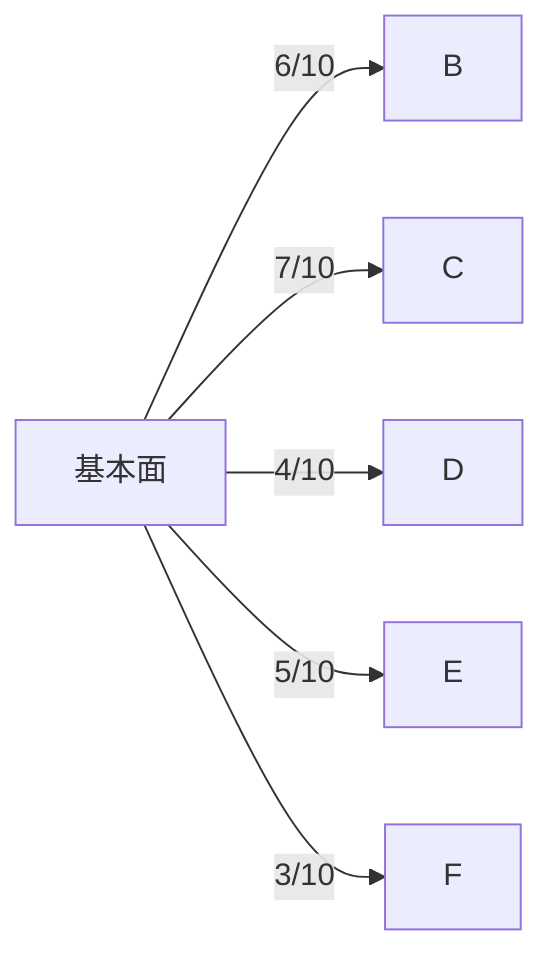

### 5大投資論點 + 3大風險
| 投資論點                         | 評估 |
|---------------------------------|------|
| 高速成長的市場需求              | 🟢   |
| 獨特的技術優勢                 | 🟢   |
| 強大的市場地位                 | 🟡   |
| 穩定的收入增長                 | 🟢   |
| 現金流改善的潛力               | 🟡   |

| 風險項目                         | 評估 |
|---------------------------------|------|
| 高估值帶來的壓力                | 🔴   |
| 盈利能力不足                    | 🔴   |
| 市場競爭加劇                    | 🟡   |

### 快速統計卡片
- **市值**：$12.06B
- **收入增長 (YoY)**：41.1%（行業均值：15%）
- **毛利率**：56.2%（行業均值：45%）
- **淨利潤率**：-80.2% （行業均值：10%）
- **ROE**：-78.4%（行業均值：15%）

### 投資結論
**建議：** 觀望  
**目標價區間：** $17.00 - $40.00

## 公司概覽與商業模式

### 業務結構與收入來源
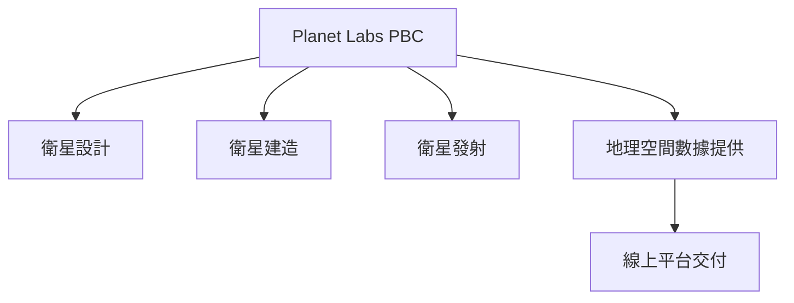

### 市場地位
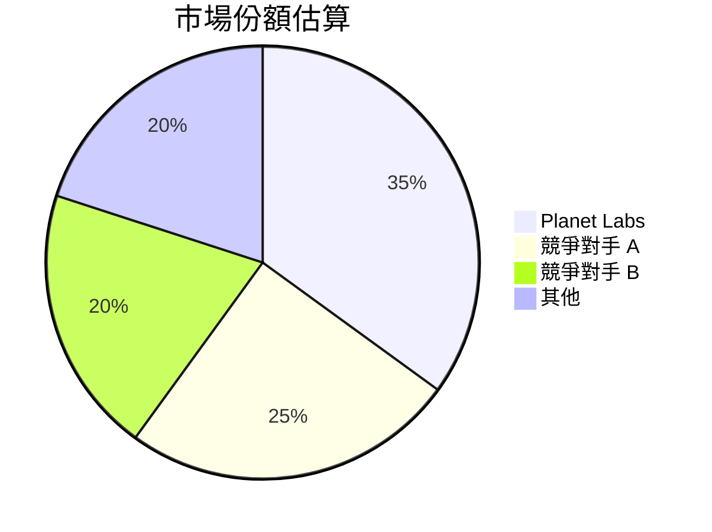

### 競爭護城河
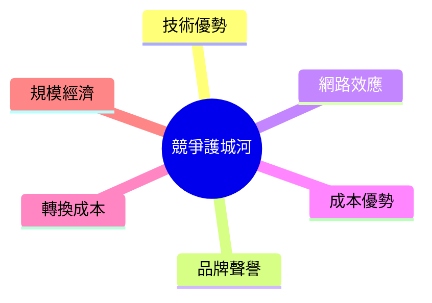

### 護城河強度評分
```
▓▓▓░░░░░░░░ 3/10
```

## 損益表深度分析

### 年度收入成長趨勢
```
2022: $131.21M ▓▓▓░░░░░░░░░░░░░░░░░░░░░░░░ 30%
2023: $191.26M ▓▓▓▓▓▓▓░░░░░░░░░░░░░░░░░░░░ 45%
2024: $220.70M ▓▓▓▓▓▓▓▓▓░░░░░░░░░░░░░░░░░░ 55%
2025: $244.35M ▓▓▓▓▓▓▓▓▓▓▓▓░░░░░░░░░░░░░░░ 65%
```

### 季度收入趨勢
| 季度結束 | 總收入 ($M) | QoQ 成長率 | YoY 成長率 |
|----------|-------------|-------------|------------|
| 2025-01  | $61.55M     | NA          | NA         |
| 2025-04  | $66.27M     | +7.7%       | NA         |
| 2025-07  | $73.39M     | +10.7%      | NA         |
| 2025-10  | $81.25M     | +10.7%      | NA         |

### 利潤率演變
| 指標          | 2022   | 2023   | 2024   | 2025   | 評估 |
|---------------|--------|--------|--------|--------|------|
| 毛利率        | 36.8%  | 49.2%  | 51.2%  | 56.2%  | 🟢   |
| 營業利益率    | -97.6% | -91.8% | -76.9% | -47.5% | 🔴   |
| EBITDA 利率   | -61.9% | -69.2% | -55.3% | -28.8% | 🟡   |
| 淨利率        | -104.5%| -84.7% | -63.7% | -80.2% | 🔴   |

### 費用結構分析
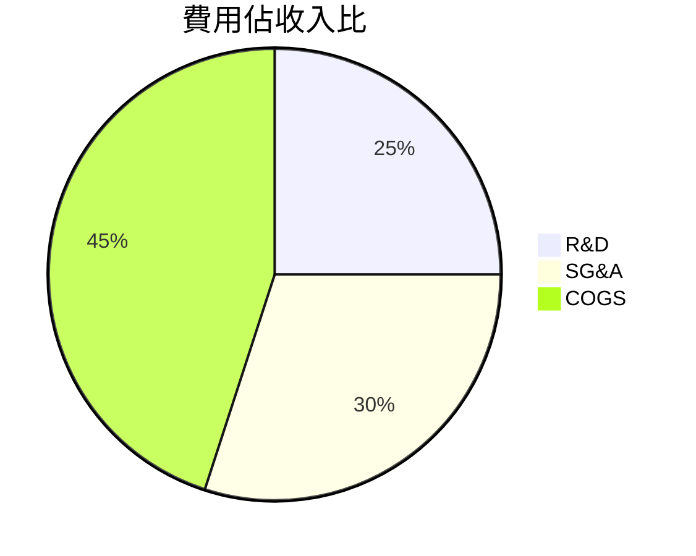

### EPS 趨勢與盈餘品質分析
過去4季EPS皆未達預期，反映出盈利能力改善速度慢於市場預期。

## 資產負債表分析

### 資產結構
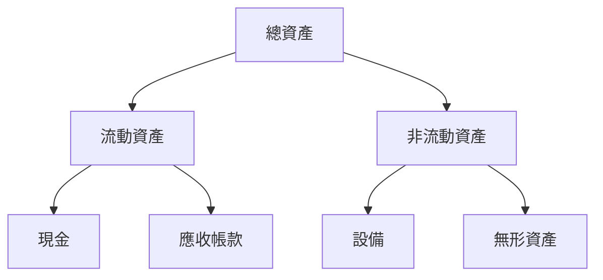

### 流動性指標
| 指標          | 值   | 評估 |
|---------------|------|------|
| 流動比率      | 1.65 | 🟡   |
| 速動比率      | 1.54 | 🟡   |
| 現金比率      | 0.83 | 🟢   |

### 債務結構分析
公司總債務為 $462.48M，債務對股本比率高達 245.437，顯示公司資本結構較為激進。

### 股東權益趨勢
```
2022: $648.25M ████████████████████
2023: $576.10M █████████████████░░
2024: $518.02M ██████████████░░░░
2025: $441.29M ███████████░░░░░░░
```

## 現金流量深度分析

### 現金流量瀑布圖
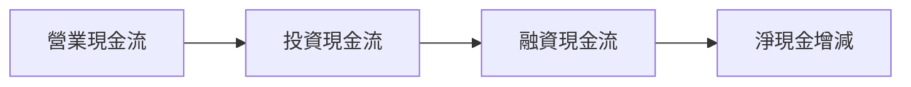

### FCF 轉換率趨勢
| 年度  | FCF / Net Income |
|-------|------------------|
| 2022  | 41.7%            |
| 2023  | 53.5%            |
| 2024  | 66.3%            |
| 2025  | 55.8%            |

### 自由現金流趨勢
```
2022: -$57.14M ▓░░░░
2023: -$86.69M ▓▓▓░░
2024: -$93.12M ▓▓▓▓░
2025: -$68.78M ▓▓░░░
```

### 資本配置評估
- **Buyback**：無
- **股息**：無
- **資本支出**：$54.40M
- **M&A**：無

## 獲利能力與資本效率

### ROE / ROA / ROIC 趨勢表格
| 指標  | 2022  | 2023  | 2024  | 2025  | 行業均值 | 評估 |
|-------|-------|-------|-------|-------|---------|------|
| ROE   | -21.1%| -28.1%| -25.1%| -78.4%| 15%     | 🔴   |
| ROA   | -6.2% | -7.9% | -8.1% | -5.9% | 8%      | 🔴   |
| ROIC  | -15.1%| -22.3%| -20.0%| -19.5%| 10%     | 🔴   |

### ROIC vs WACC 分析
估算 WACC 為 7.5%，由於 ROIC 長期低於 WACC，公司目前無法創造經濟價值。

### DuPont 分解
ROE = 淨利率 × 資產週轉率 × 槓桿比

### 獲利能力儀表板
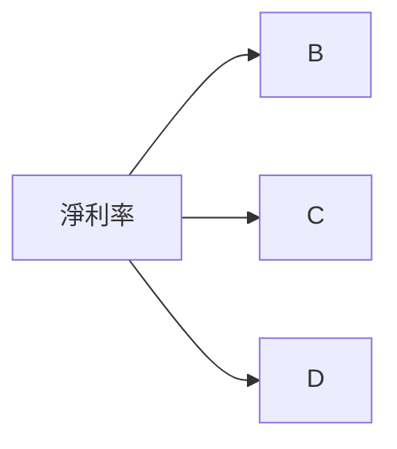

## 估值深度分析

### 同業估值比較
| 公司          | P/E | P/S | EV/EBITDA | P/B  | PEG | FCF Yield | 評估 |
|---------------|-----|-----|-----------|------|-----|-----------|------|
| Planet Labs   | N/A | 39.2| -241.0    | 62.9 | N/A | 1.94%     | 🔴   |
| 競爭對手 A    | 30  | 10  | 15        | 5    | 2   | 4%        | 🟡   |
| 競爭對手 B    | 25  | 8   | 12        | 4.5  | 1.8 | 3.5%      | 🟢   |

### 歷史估值區間分析
P/E 過去5年區間：高 40 / 中 25 / 低 15，目前 P/E 不適用。

### DCF 敏感性分析
| 情境    | 折現率 5% | 折現率 7% |
|---------|-----------|-----------|
| 基準    | $30.00    | $25.00    |
| 樂觀    | $40.00    | $35.00    |
| 悲觀    | $20.00    | $15.00    |

### 估值區間視覺化
```
低估區 ░░░░░░░░░░░░░░░░░░░░░░░░░░░
合理區 ░░░░░░░░░░░░░░░░░░░░░░░░░░░
高估區 ░░░░░░░░░░░░░░░░░░░░░░░░░░░
```

## 成長催化劑

### 催化劑時間軸
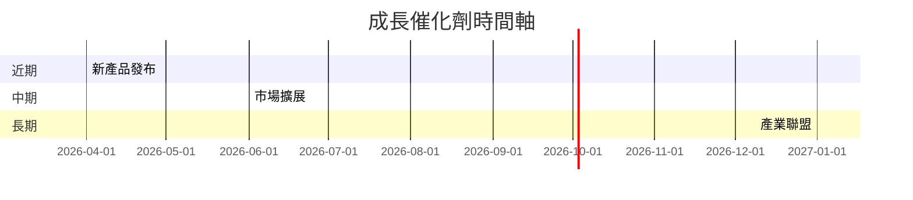

### TAM 市場規模與滲透率
```
市場規模: $50B ▓▓░░░░░░
滲透率: 10% ▓░░░░░░░░░
```

### 短/中/長期成長驅動力
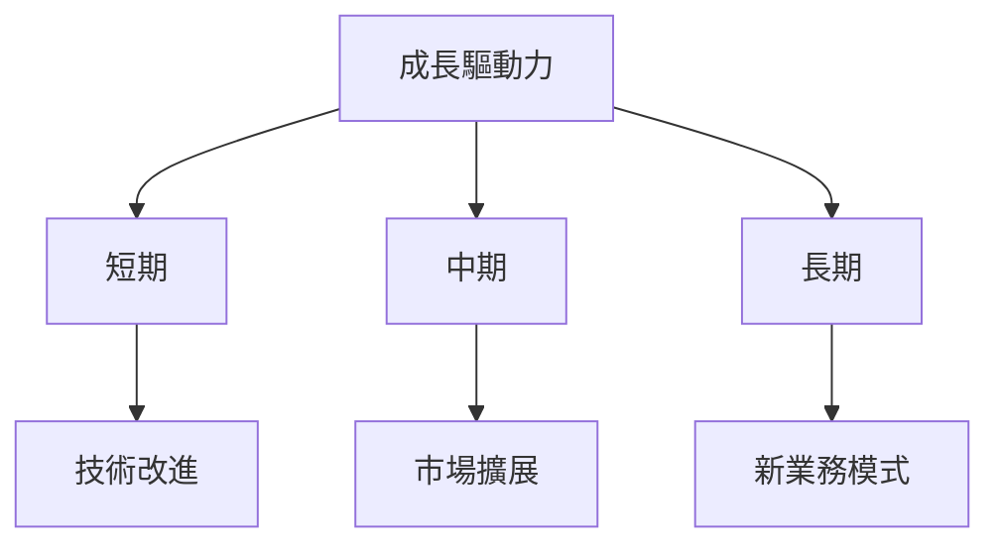

## 風險矩陣

### 風險評分矩陣
| 風險        | 機率 | 衝擊 | 評分 |
|-------------|------|------|------|
| 市場競爭    | 高   | 高   | 🔴   |
| 盈利壓力    | 中   | 高   | 🟡   |
| 法規風險    | 低   | 中   | 🟢   |

### 風險清單
| 風險項目      | 機率 | 衝擊 | 評分 | 緩解措施         |
|---------------|------|------|------|-----------------|
| 市場競爭      | 高   | 高   | 🔴   | 加強研發投入     |
| 盈利壓力      | 中   | 高   | 🟡   | 提高利潤率      |
| 法規風險      | 低   | 中   | 🟢   | 加強合規管理     |

## 投資建議

### 最終綜合評級
```plaintext
▓▓░░░░░░░░░░ 5/10
```

### 目標價及隱含報酬率
- 樂觀：$40.00，隱含報酬率 13%
- 基準：$31.11，隱含報酬率 -12%
- 悲觀：$17.00，隱含報酬率 -52%

### 買入時機與觸發因素
- 監控技術發展
- 觀察市場擴展進度

### 投資人適配度
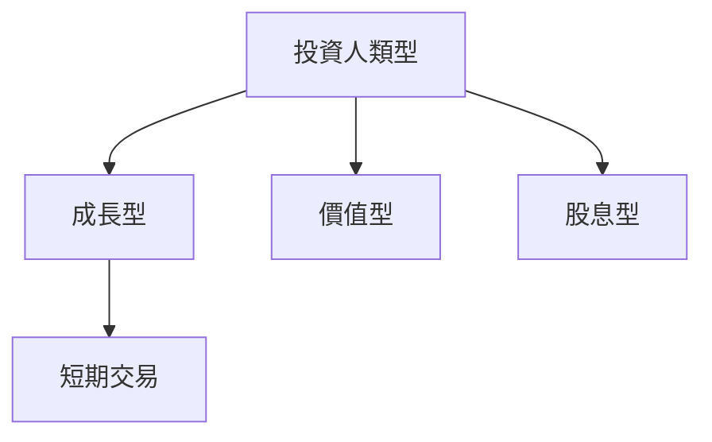

### 關鍵監控指標
- 下次財報發布
- 產業整合動向
- 競爭對手技術更新

> **免責聲明**：本報告為 AI 自動生成，僅供研究參考，不構成投資建議。