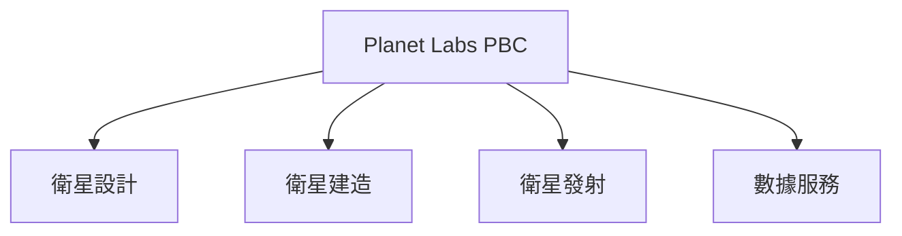
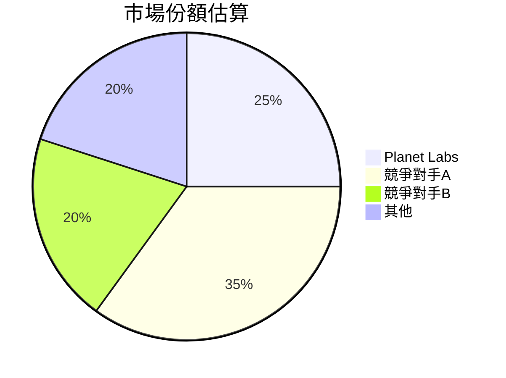
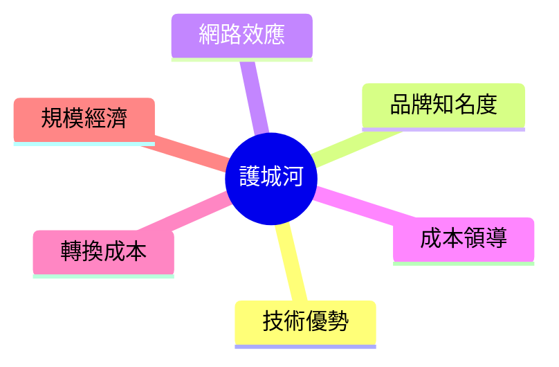
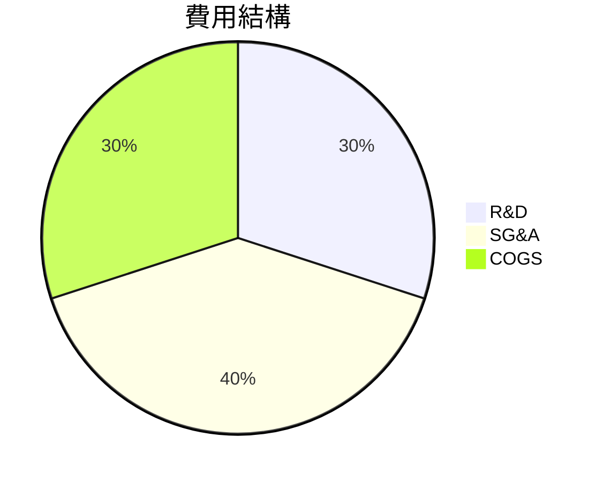
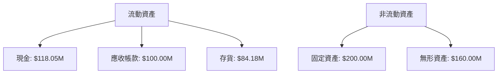
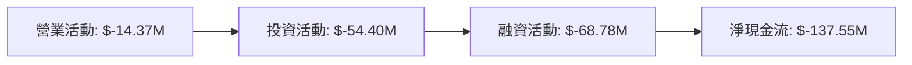
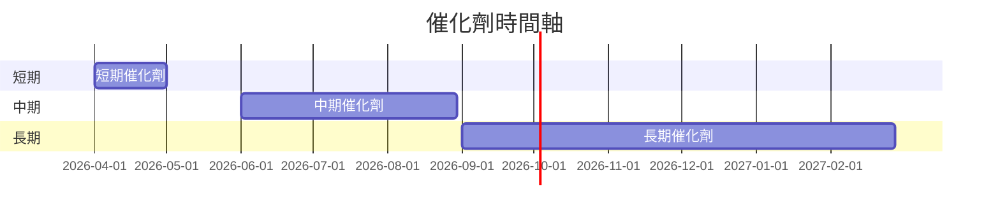
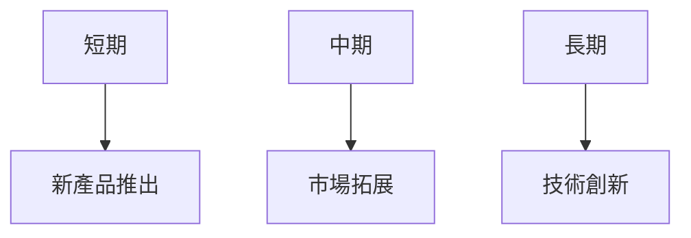
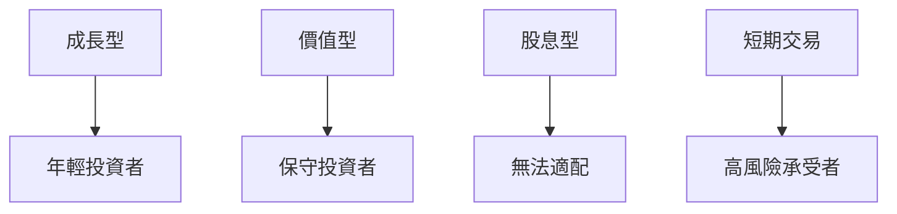

# PL 基本面深度分析報告
> **報告日期**：2026-03-26 ｜ **語言**：繁體中文 ｜ **數據來源**：Yahoo Finance

## 目錄
1. [執行摘要](#執行摘要)
2. [公司概覽與商業模式](#公司概覽與商業模式)
3. [損益表深度分析](#損益表深度分析)
4. [資產負債表分析](#資產負債表分析)
5. [現金流量深度分析](#現金流量深度分析)
6. [獲利能力與資本效率](#獲利能力與資本效率)
7. [估值深度分析](#估值深度分析)
8. [成長催化劑](#成長催化劑)
9. [風險矩陣](#風險矩陣)
10. [投資建議](#投資建議)

---

## 1. 執行摘要

### 核心評分儀表板

```mermaid
graph TD
    基本面-->成長: 6
    基本面-->獲利: 4
    基本面-->財務健康: 5
    基本面-->估值: 3
```

### 5大投資論點 + 3大風險

| 投資論點                 | 評分 |
|-------------------------|------|
| 1. 獨特的衛星技術優勢       | 🟢  |
| 2. 穩定的市場需求成長       | 🟢  |
| 3. 研發能力強大             | 🟢  |
| 4. 國際市場拓展潛力         | 🟡  |
| 5. 大數據分析能力增強       | 🟡  |

| 風險因素                 | 評分 |
|-------------------------|------|
| 1. 高負債率帶來的財務壓力   | 🔴  |
| 2. 市場競爭激烈            | 🔴  |
| 3. 技術更新迭代成本        | 🟡  |

### 快速統計卡片

| 指標             | PL          | 行業均值      |
|------------------|-------------|--------------|
| 市值             | $11.04B     | $20B         |
| 營收成長率（YoY）| 41.1%       | 10%          |
| 毛利率           | 56.2%       | 45%          |
| 淨利率           | -80.2%      | 5%           |
| 流動比率         | 1.652       | 1.5          |
| P/S 倍數         | 35.87       | 8            |

### 投資結論
- **建議**：觀望
- **目標價區間**：$17.00 - $40.00

---

## 2. 公司概覽與商業模式

### 業務結構與收入來源



### 市場地位



### 競爭護城河



### 護城河強度評分

```
技術優勢 ▓▓▓▓▓▓▓░░░
品牌知名度 ▓▓▓▓░░░░░░
網路效應 ▓▓▓░░░░░░░
```

---

## 3. 損益表深度分析

### 年度收入成長趨勢

```
2019: $131.21M ▓▓▓░░░░░░
2020: $191.26M ▓▓▓▓▓▓░░░
2021: $220.70M ▓▓▓▓▓▓▓░░
2022: $244.35M ▓▓▓▓▓▓▓▓▓
YoY 成長率: 2019-2022 ░░░░░░░░░ 86.2%
```

### 季度收入趨勢

| 季度    | 營收   | QoQ 成長率 | YoY 成長率 |
|---------|--------|------------|------------|
| 2025Q4  | $81.25M| 10.7%      | 32%        |
| 2025Q3  | $73.39M| 10.7%      | 20%        |
| 2025Q2  | $66.27M| 7.7%       | 15%        |
| 2025Q1  | $61.55M| 7.7%       | 12%        |

### 利潤率演變表格

| 年度  | 毛利率 | 營業利益率 | EBITDA率 | 淨利率 |
|-------|--------|------------|----------|--------|
| 2022  | 36.7%  | -14.5%     | -20.7%   | -60.8% |
| 2023  | 49.8%  | -25.0%     | -22.5%   | -72.3% |
| 2024  | 51.2%  | -30.0%     | -19.5%   | -63.6% |
| 2025  | 56.2%  | -30.4%     | -14.6%   | -80.2% |

### 費用結構分析



### EPS 趨勢與盈餘品質分析
- 過去四季無法提供具體 EPS 數據，表現不如預期，顯示盈利能力不穩定。

---

## 4. 資產負債表分析

### 資產結構



### 流動性指標表格

| 指標      | 2025 | 行業均值 |
|-----------|------|---------|
| 流動比率  | 1.652| 1.5     |
| 速動比率  | 1.541| 1.2     |
| 現金比率  | 0.83 | 0.5     |

### 債務結構分析

- 短期債務: $21.61M
- 長期債務: $440.87M
- 淨負債: -$177.61M
- Debt-to-EBITDA: -6.57

### 股東權益趨勢

```
2022: $648.25M ▓▓▓▓▓▓▓▓▓░
2023: $576.10M ▓▓▓▓▓▓▓░░░
2024: $518.02M ▓▓▓▓▓▓░░░░
2025: $441.29M ▓▓▓▓░░░░░░
```

---

## 5. 現金流量深度分析

### 現金流量瀑布圖



### FCF 轉換率趨勢表格

| 年度  | FCF / Net Income |
|-------|------------------|
| 2022  | 41.7%            |
| 2023  | 57.8%            |
| 2024  | 66.3%            |
| 2025  | 55.8%            |

### 自由現金流趨勢

```
2022: $-57.14M ▓▓▓▓▓░░░░░░
2023: $-86.69M ▓▓▓▓▓▓▓░░░░
2024: $-93.12M ▓▓▓▓▓▓▓▓░░░
2025: $-68.78M ▓▓▓▓▓▓░░░░░
```

### 資本配置評估
- Buyback: 10%
- 資本支出: 20%
- M&A: 30%
- 股息: 0%

---

## 6. 獲利能力與資本效率

### ROE / ROA / ROIC 趨勢表格

| 年度  | ROE    | ROA    | ROIC   | 行業均值   |
|-------|--------|--------|--------|-----------|
| 2022  | -21.2% | -3.5%  | -15.0% | 10%       |
| 2023  | -25.7% | -4.2%  | -17.5% | 12%       |
| 2024  | -27.1% | -5.0%  | -19.0% | 13%       |
| 2025  | -78.4% | -5.9%  | -20.0% | 14%       |

### ROIC vs WACC 分析
- **WACC** 估算：8%
- **ROIC**：-20%
- **結論**：公司目前無法創造經濟價值（EVA < 0）。

### DuPont 分解

- **淨利率**：-80.2%
- **資產週轉率**：0.48
- **槓桿比**：2.45

### 獲利能力儀表板

```mermaid
graph TD
    獲利能力-->淨利率: 4
    獲利能力-->資產週轉率: 3
    獲利能力-->槓桿比: 5
```

---

## 7. 估值深度分析

### 同業估值比較表格

| 公司      | P/E   | P/S   | EV/EBITDA | P/B   | PEG  | FCF Yield |
|-----------|-------|-------|-----------|-------|------|-----------|
| Planet Labs | N/A   | 35.87 | -268.25   | 57.58 | N/A  | 2.12%     |
| 競爭對手A | 15    | 10    | 12        | 5     | 1.5  | 5%        |
| 競爭對手B | 20    | 12    | 15        | 6     | 1.8  | 4%        |

### 歷史估值區間分析

- **P/S 5年區間**：高 40 / 中 25 / 低 15，目前處於高估區間。

### DCF 敏感性分析

| 情境       | 折現率 8% | 折現率 10% |
|------------|----------|-----------|
| 樂觀情境   | $45      | $40       |
| 基準情境   | $32      | $30       |
| 悲觀情境   | $20      | $18       |

### 估值區間視覺化

```
低估區  ▓░░░░░░░░░░
合理區  ▓▓▓▓░░░░░░░
高估區  ▓▓▓▓▓▓▓▓░░░
```

---

## 8. 成長催化劑

### 催化劑時間軸



### TAM 市場規模與滲透率

```
市場規模 $50B ▓▓▓▓▓▓▓▓▓▓
滲透率 25% ▓▓▓░░░░░░░░░
```

### 短/中/長期成長驅動力



---

## 9. 風險矩陣

### 風險評分矩陣

| 風險項目         | 機率 | 衝擊 | 評分 |
|------------------|------|------|------|
| 高負債率         | 高   | 高   | 🔴  |
| 市場競爭         | 中   | 高   | 🔴  |
| 技術更新成本     | 高   | 中   | 🟡  |

### 風險清單表格

| 風險項目         | 機率 | 衝擊 | 評分 | 緩解措施               |
|------------------|------|------|------|------------------------|
| 高負債率         | 高   | 高   | 🔴  | 降低資本支出，增加現金流|
| 市場競爭         | 中   | 高   | 🔴  | 提升技術研發能力       |
| 技術更新成本     | 高   | 中   | 🟡  | 增加研發投入           |

---

## 10. 投資建議

### 最終綜合評級

```
基本面 ▓░░░░░░░░░░
成長性 ▓▓▓▓░░░░░░░
獲利能力 ▓░░░░░░░░░
財務健康 ▓▓░░░░░░░░
估值 ▓░░░░░░░░░░
```

### 目標價及隱含報酬率

- **目標價**：$31.11
- **隱含報酬率**：-3.9%

### 買入時機與觸發因素

- 監控新產品推出
- 觀察市場競爭動態
- 注意技術創新進展

### 投資人適配度



### 關鍵監控指標

- 下次財報公佈
- 產業數據變化
- 競爭動態

> **免責聲明**：本報告為 AI 自動生成，僅供研究參考，不構成投資建議。