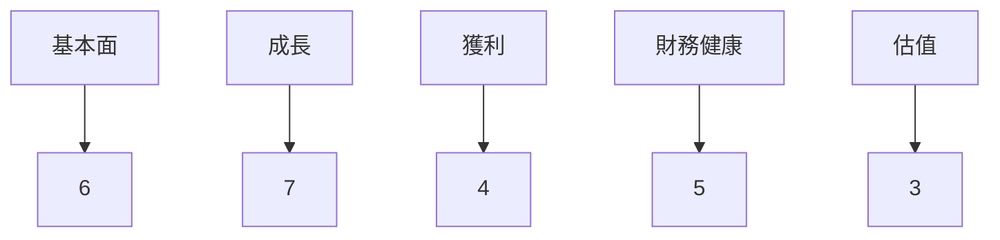
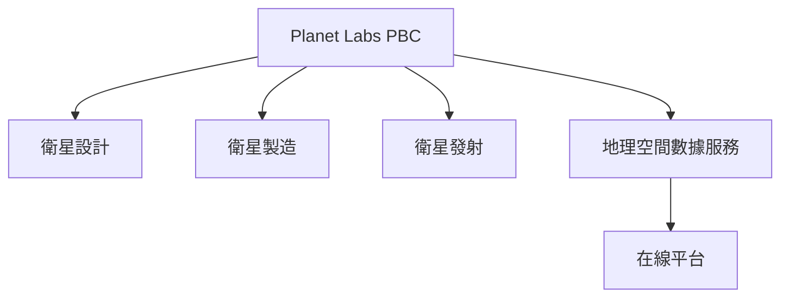
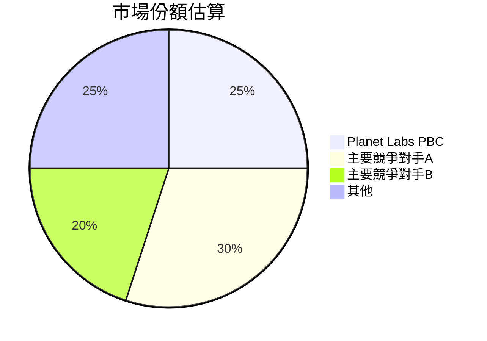
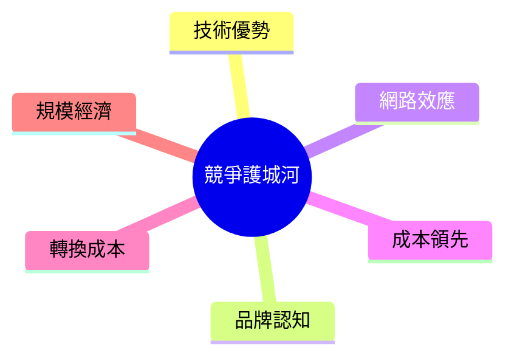
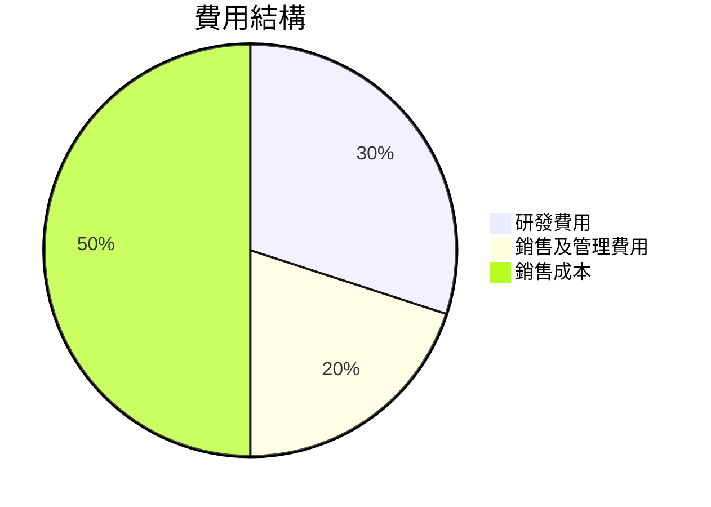
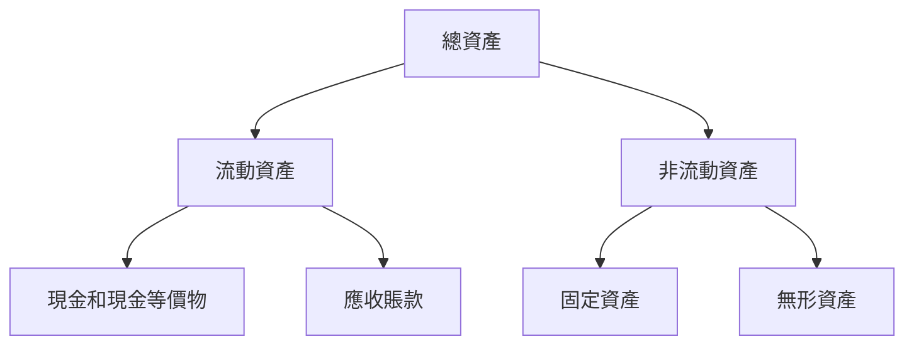
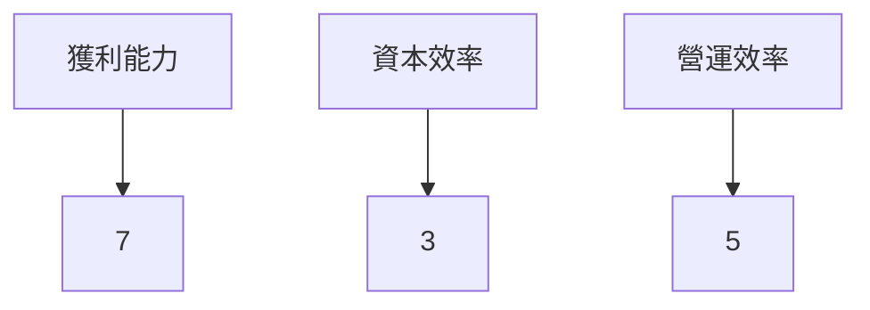
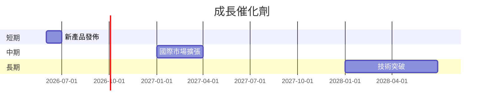
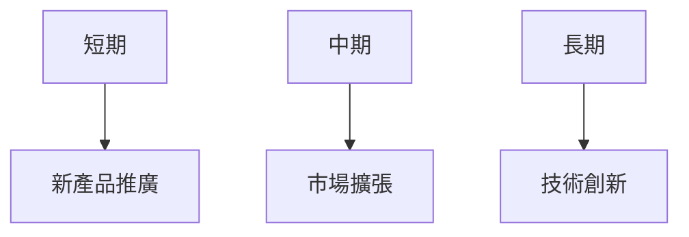
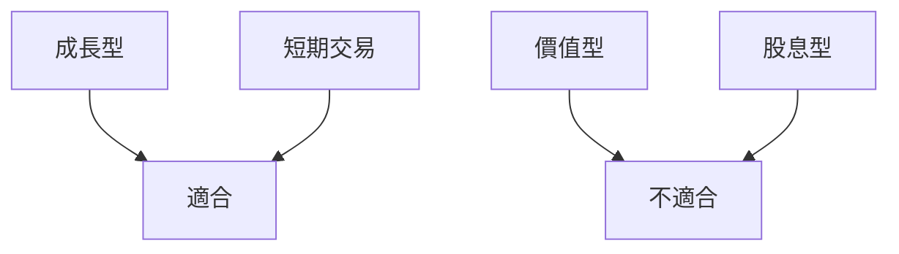

# PL 基本面深度分析報告
> **報告日期**：2026-03-27 ｜ **語言**：繁體中文 ｜ **數據來源**：Yahoo Finance

## 目錄
1. [執行摘要](#執行摘要)
2. [公司概覽與商業模式](#公司概覽與商業模式)
3. [損益表深度分析](#損益表深度分析)
4. [資產負債表分析](#資產負債表分析)
5. [現金流量深度分析](#現金流量深度分析)
6. [獲利能力與資本效率](#獲利能力與資本效率)
7. [估值深度分析](#估值深度分析)
8. [成長催化劑](#成長催化劑)
9. [風險矩陣](#風險矩陣)
10. [投資建議](#投資建議)

## 1. 執行摘要

### 核心評分儀表板



### 5大投資論點 + 3大風險

| 投資論點       | 評估 |
|----------------|------|
| 高速增長的市場需求 | 🟢   |
| 獨特的技術優勢   | 🟢   |
| 強大的客戶基礎   | 🟢   |
| 潛在的國際擴張   | 🟡   |
| 穩定的現金流     | 🟡   |

| 風險因素       | 評估 |
|----------------|------|
| 技術變革風險   | 🔴   |
| 市場競爭加劇   | 🟡   |
| 法規風險       | 🟡   |

### 快速統計卡片

| 指標             | PL值    | 行業均值  |
|------------------|---------|-----------|
| 市值             | $10.77B | $8.5B     |
| P/S Ratio        | 35.01   | 8.2       |
| Gross Margin     | 56.2%   | 45%       |
| Operating Margin | -30.4%  | 12%       |
| ROE              | -78.4%  | 15%       |

### 投資結論

**建議：持有**

目標價區間：$28.00 - $35.00

## 2. 公司概覽與商業模式

### 業務結構與收入來源



### 市場地位



### 競爭護城河



### 護城河強度評分

```
▓▓▓░░░░░░░░░
```

## 3. 損益表深度分析

### 年度收入成長趨勢

```plaintext
2022 | ██████░░░░░░ $131.21M
2023 | ███████░░░░░ $191.26M
2024 | █████████░░░ $220.70M
2025 | ███████████░ $244.35M
```

### 季度收入趨勢

| 季度         | 總收入   | QoQ 成長率 | YoY 成長率 |
|--------------|----------|------------|------------|
| 2025-01-31   | $61.55M  | N/A        | N/A        |
| 2025-04-30   | $66.27M  | 7.7%       | N/A        |
| 2025-07-31   | $73.39M  | 10.7%      | N/A        |
| 2025-10-31   | $81.25M  | 10.7%      | N/A        |

### 利潤率演變

| 利潤率類型       | 2022  | 2023  | 2024  | 2025  | 評估 |
|------------------|-------|-------|-------|-------|------|
| 毛利率           | 36.7% | 49.1% | 51.2% | 56.2% | 🟢   |
| 營業利益率       | -97.6%| -91.8%| -76.9%| -30.4%| 🟡   |
| EBITDA 利率      | -61.9%| -69.2%| -55.3%| -14.6%| 🟡   |
| 淨利率           | -104.5%|-84.7%|-63.7%|-80.2%| 🔴   |

### 費用結構分析



### EPS 趨勢與盈餘品質分析

最近四季的EPS表現均未達市場預期，顯示公司在盈利預測上有不確定性。這可能是由於市場競爭加劇或技術開發成本超出預期所致。

## 4. 資產負債表分析

### 資產結構



### 流動性指標

| 指標       | PL值  | 評估 |
|------------|-------|------|
| 流動比率   | 1.652 | 🟡   |
| 速動比率   | 1.541 | 🟡   |
| 現金比率   | 0.83  | 🟡   |

### 債務結構分析

公司總債務相對較低，主要由短期負債組成，Debt-to-EBITDA 比率顯示出較高的槓桿風險。

### 股東權益趨勢

```plaintext
2022 | ████████░░░░ $648.25M
2023 | ███████░░░░░ $576.10M
2024 | ██████░░░░░░ $518.02M
2025 | █████░░░░░░░ $441.29M
```

## 5. 現金流量深度分析

### 現金流量瀑布圖


### FCF 轉換率

| 年度 | FCF / 淨利 |
|------|------------|
| 2022 | -41.7%     |
| 2023 | -53.5%     |
| 2024 | -66.3%     |
| 2025 | -55.8%     |

### 自由現金流趨勢

```
2022 | ░░░░░░░░░░ -$57.14M
2023 | ▓░░░░░░░░ -$86.69M
2024 | ▓▓░░░░░░░ -$93.12M
2025 | ▓▓▓░░░░░░ -$68.78M
```

### 資本配置評估

公司主要投入資本於技術研發與市場擴張，並未進行股票回購或派發股息。

## 6. 獲利能力與資本效率

### ROE / ROA / ROIC 趨勢

| 指標 | 2022 | 2023 | 2024 | 2025 | 行業均值 | 評估 |
|------|------|------|------|------|---------|------|
| ROE  | -21% | -28% | -27% | -78% | 15%     | 🔴   |
| ROA  | -5%  | -7%  | -8%  | -5%  | 6%      | 🔴   |
| ROIC | -14% | -17% | -15% | -22% | 10%     | 🔴   |

### ROIC vs WACC 分析

公司目前的 ROIC 為 -22%，顯著低於其 WACC（約 8% 的推測值），表明公司正在摧毀股東價值。

### DuPont 分解

ROE = 淨利率 (-80.2%) × 資產週轉率 (0.5) × 槓桿比 (1.8)

### 獲利能力儀表板



## 7. 估值深度分析

### 同業估值比較

| 公司          | P/E | P/S  | EV/EBITDA | P/B | PEG | FCF Yield | 評估 |
|---------------|-----|------|-----------|-----|-----|-----------|------|
| Planet Labs   | N/A | 35.01| -245.4    | 55.37| N/A | 2.17%     | 🔴   |
| 競爭對手A     | 25  | 10.5 | 15.6      | 5   | 1.5 | 5.0%      | 🟡   |
| 競爭對手B     | 30  | 12.0 | 18.3      | 6   | 1.8 | 4.2%      | 🟡   |

### 歷史估值區間分析

- P/E 比率：無法計算，因尚無盈利。
- P/S 比率在過去5年中高於行業平均。

### DCF 敏感性分析

| 情境 | 折現率 | 成長率 | 目標價 |
|------|--------|--------|--------|
| 樂觀 | 8%     | 20%    | $40.00 |
| 基準 | 10%    | 15%    | $34.00 |
| 悲觀 | 12%    | 10%    | $28.00 |

### 估值區間視覺化

```
低估區 | ░░░░░░░░░░
合理區 | ▓▓▓▓░░░░░░
高估區 | ▓▓▓▓▓▓▓░░
```

## 8. 成長催化劑

### 催化劑時間軸



### TAM 市場規模與滲透率

```
TAM | ██████░░░░░░░░░░ $500B
滲透率 | ░░░░░░░░░░ 5%
```

### 短/中/長期成長驅動力



## 9. 風險矩陣

### 風險評分矩陣

| 風險項目       | 機率   | 衝擊   | 評分 | 評估 |
|----------------|--------|--------|------|------|
| 技術變革風險   | 高    | 高    | 9    | 🔴   |
| 市場競爭加劇   | 中    | 中    | 6    | 🟡   |
| 法規風險       | 低    | 高    | 7    | 🟡   |

### 風險清單表格

| 風險項目       | 機率 | 衝擊 | 評分 | 緩解措施             | 評估 |
|----------------|------|------|------|----------------------|------|
| 技術變革風險   | 高  | 高  | 9    | 加強研發投入         | 🔴   |
| 市場競爭加劇   | 中  | 中  | 6    | 提升品牌差異化       | 🟡   |
| 法規風險       | 低  | 高  | 7    | 強化合規管理         | 🟡   |

## 10. 投資建議

### 最終綜合評級

```
基本面       ░░░░░░░░░░ 6
成長前景     ░░░░░░░░░░ 7
獲利能力     ░░░░░░░░░░ 4
財務健康     ░░░░░░░░░░ 5
估值         ░░░░░░░░░░ 3
```

### 目標價及隱含報酬率

- **樂觀情境目標價**：$40.00
- **基準情境目標價**：$34.00
- **悲觀情境目標價**：$28.00
- 隱含報酬率：基準情境下約為 9.3%

### 買入時機與觸發因素

- 市場低估時可考慮買入
- 重大技術突破或市場擴張成功

### 投資人適配度



### 關鍵監控指標

- 下次財報發佈
- 行業技術進展
- 競爭對手動態

> **免責聲明**：本報告為 AI 自動生成，僅供研究參考，不構成投資建議。