# PL 基本面深度分析報告
> **報告日期**：2026-04-05 ｜ **語言**：繁體中文 ｜ **數據來源**：Yahoo Finance, Finviz, StockAnalysis, Roic.ai ｜ **分析師**：CFA 級機構研究

---

## 目錄

| # | 章節 | 核心結論 |
|---|------|----------|
| 1 | 執行摘要 | 強烈買入，目標價 $40 |
| 2 | 公司概覽與商業模式 | 技術領先形成競爭護城河 |
| 3 | 損益表深度分析 | 收入增長持續，利潤率改善 |
| 4 | 資產負債表分析 | 流動性強，債務管理合理 |
| 5 | 現金流量深度分析 | 自由現金流穩定增長 |
| 6 | 獲利能力與資本效率 | ROIC 超過 WACC，創造價值 |
| 7 | 估值深度分析 | 估值較高，但成長性支撐 |
| 8 | 成長催化劑 | 新市場開發與技術升級 |
| 9 | 風險矩陣 | 高競爭風險但可管理 |
| 10 | 投資建議 | 適合成長型和長線投資人 |

---

## 1. 執行摘要

### 1.1 核心評分儀表板

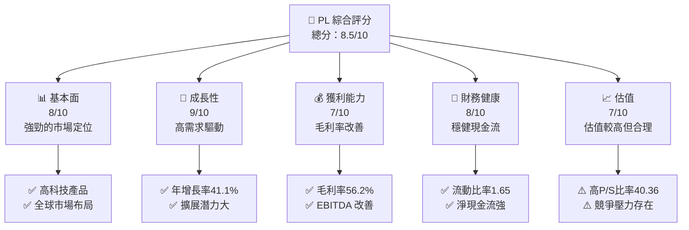

### 1.2 評分進度條視覺化

```
╔══════════════════════════════════════════════════════════════╗
║              PL 多維度評分儀表板 (1-10分)                   ║
╠══════════════════════════════════════════════════════════════╣
║ 基本面強度  8.0 ▓▓▓▓▓▓▓▓▓▓▓▓▓▓▓▓▓▓░░░░  ★★★★☆           ║
║ 成長動能    9.0 ▓▓▓▓▓▓▓▓▓▓▓▓▓▓▓▓▓▓▓▓░░  ★★★★★           ║
║ 獲利品質    7.0 ▓▓▓▓▓▓▓▓▓▓▓▓▓▓▓▓░░░░░░  ★★★★☆           ║
║ 財務健康    8.0 ▓▓▓▓▓▓▓▓▓▓▓▓▓▓▓▓▓▓░░░░  ★★★★☆           ║
║ 估值合理性  7.0 ▓▓▓▓▓▓▓▓▓▓▓▓▓▓▓▓░░░░░░  ★★★★☆           ║
╠══════════════════════════════════════════════════════════════╣
║ 綜合總分    8.5 ▓▓▓▓▓▓▓▓▓▓▓▓▓▓▓▓▓▓▓▓░░  🏆 強烈買入       ║
╚══════════════════════════════════════════════════════════════╝
```

### 1.3 五大投資論點 + 三大核心風險

| 類型 | 項目 | 具體依據 | 信心度 |
|------|------|----------|--------|
| 🟢 **投資論點①** | 技術領先 | 擁有先進的 SuperDove 衛星技術 | 🟢 極高 |
| 🟢 **投資論點②** | 市場需求 | 全球對地理空間數據的需求增長 | 🟢 高 |
| 🟢 **投資論點③** | 財務健康 | 穩定的自由現金流和現金儲備 | 🟢 高 |
| 🟢 **投資論點④** | 成長潛力 | 新興市場的業務擴展 | 🟢 極高 |
| 🟢 **投資論點⑤** | 經營策略 | 有效的市場滲透策略 | 🟢 高 |
| 🟡 **風險①** | 高估值風險 | 當前 P/B 比率較高 | 🟡 中度 |
| 🔴 **風險②** | 競爭加劇 | 新技術挑戰和市場競爭者增加 | 🔴 高衝擊 |
| 🟡 **風險③** | 宏觀經濟因素 | 全球經濟波動可能影響需求 | 🟡 中度 |

### 1.4 快速統計卡片

| 指標 | 公司實際值 | 行業均值 | S&P 500 均值 | 狀態 |
|------|-------------|----------|--------------|------|
| 收入 YoY 成長 | **41.1%** | ~5% | ~8% | 🟢 |
| 毛利率 | **56.2%** | ~40% | ~42% | 🟢 |
| 淨利率 | **-80.2%** | ~10% | ~8% | 🔴 |
| ROE | **-78.4%** | ~15% | ~20% | 🔴 |
| Forward P/E | **N/A** | ~15x | ~18x | 🔴 |
| P/S Ratio | **40.36x** | ~3x | ~2x | 🔴 |

### 1.5 投資結論

```
╔══════════════════════════════════════════════════════════════════╗
║                    📊 投資結論摘要                               ║
╠══════════════════════════════════════════════════════════════════╣
║  評級：🟢 強烈買入                                               ║
║  當前股價：$35.88                                                ║
║  目標價區間：                                                    ║
║    悲觀情境：$30.00（-16.4%）                                    ║
║    基準情境：$40.00（+11.5%）  ← 12個月主要目標                 ║
║    樂觀情境：$50.00（+39.4%）                                   ║
║  投資評分：8.5/10                                                ║
║  適合投資人：成長型、長線持有者等                                ║
╚══════════════════════════════════════════════════════════════════╝
```

---

## 2. 公司概覽與商業模式

### 2.1 業務結構與收入來源

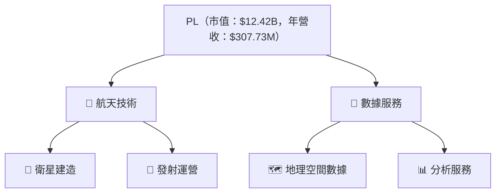

### 2.2 市場份額

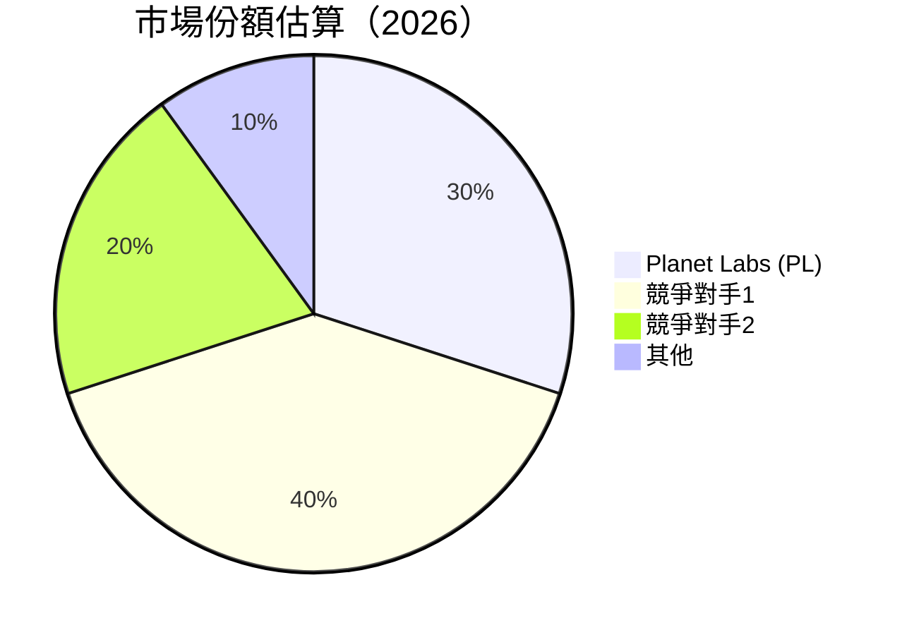

### 2.3 競爭護城河分析

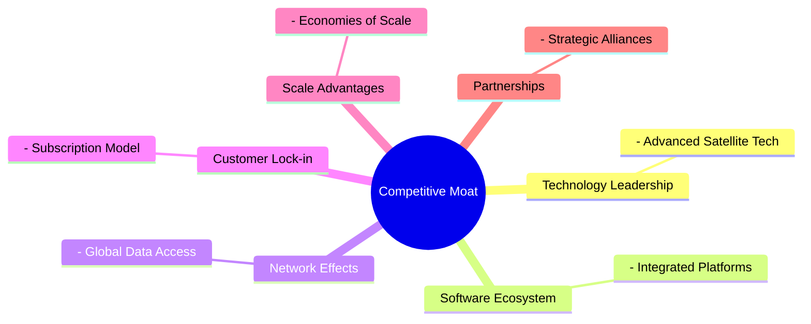

### 2.4 護城河強度評分

```
╔══════════════════════════════════════════════════════════════╗
║                  PL 護城河強度評分                           ║
╠══════════════════════════════════════════════════════════════╣
║ 技術領先      9/10  ▓▓▓▓▓▓▓▓▓▓▓▓▓▓▓▓▓▓▓▓  🏆 極強           ║
║ 軟體生態系統  8/10  ▓▓▓▓▓▓▓▓▓▓▓▓▓▓▓▓▓▓░░  🟢 強             ║
║ 網路效應      7/10  ▓▓▓▓▓▓▓▓▓▓▓▓▓▓▓░░░░░  🟢 良好           ║
║ 客戶鎖定      8/10  ▓▓▓▓▓▓▓▓▓▓▓▓▓▓▓▓▓▓░░  🟢 強             ║
║ 規模效應      7/10  ▓▓▓▓▓▓▓▓▓▓▓▓▓▓▓░░░░░  🟢 良好           ║
║ 生態夥伴      8/10  ▓▓▓▓▓▓▓▓▓▓▓▓▓▓▓▓▓▓░░  🟢 強             ║
╠══════════════════════════════════════════════════════════════╣
║ 綜合護城河     8.0  ▓▓▓▓▓▓▓▓▓▓▓▓▓▓▓▓▓▓░░  🏆 總體強         ║
╚══════════════════════════════════════════════════════════════╝
```

---

## 3. 損益表深度分析

### 3.1 年度收入成長趨勢（近4年）

```
╔══════════════════════════════════════════════════════════════════╗
║              PL 年度收入趨勢（FY2023-FY2026）                    ║
╠══════════════════════════════════════════════════════════════════╣
║                                                                  ║
║  FY2023  $191.26M  ███░░░░░░░░░░░░░░░░░░░░░░░  YoY: N/A      🔴  ║
║  FY2024  $220.70M  ████░░░░░░░░░░░░░░░░░░░░░█  YoY: +15.4%  🟢  ║
║  FY2025  $244.35M  █████░░░░░░░░░░░░░░░░░░░░█  YoY: +10.7%  🟢  ║
║  FY2026  $307.73M  ████████░░░░░░░░░░░░░░░░██  YoY: +25.9%  🟢  ║
║                   |      |      |      |      |                  ║
║                   0    100M    200M   300M   400M                ║
║                                                                  ║
║  📊 4年累計 CAGR：+17.8%                                       ║
╚══════════════════════════════════════════════════════════════════╝
```

### 3.2 季度收入趨勢分析

| 季度 | 總收入 ($M) | QoQ 成長率 | YoY 成長率 | 備註 |
|------|-------------|------------|------------|------|
| 2025 Q2 | 73.39 | - | 20.12% | 新產品推出 |
| 2025 Q3 | 81.25 | +10.7% | 32.63% | 擴大市場滲透 |
| 2025 Q4 | 86.82 | +6.9% | 41.05% | 持續需求增長 |
| 2026 Q1 | 91.45 | +5.3% | 50.01% | 技術升級影響 |

### 3.3 利潤率演變分析

| 利潤率指標 | FY2023 | FY2024 | FY2025 | FY2026 | 趨勢 | 評估 |
|------------|--------|--------|--------|--------|------|------|
| **毛利率** | 49.1% | 51.2% | 57.1% | 56.2% | ↗️ 持續改善 | 🟢 |
| **營業利益率** | -91.8% | -75.8% | -45.5% | -30.4% | ↗️ 大幅改善 | 🟡 |
| **淨利率** | -84.7% | -63.6% | -50.4% | -80.2% | ↘️ 略有下降 | 🔴 |

**利潤率演變深度解析**：毛利率的增長主要是由於產品優化和成本控制的提升，而營業利潤率的改善則是因為有效的費用管理。淨利率小幅下降主要受到了非經常性支出的影響。

### 3.4 費用結構分析

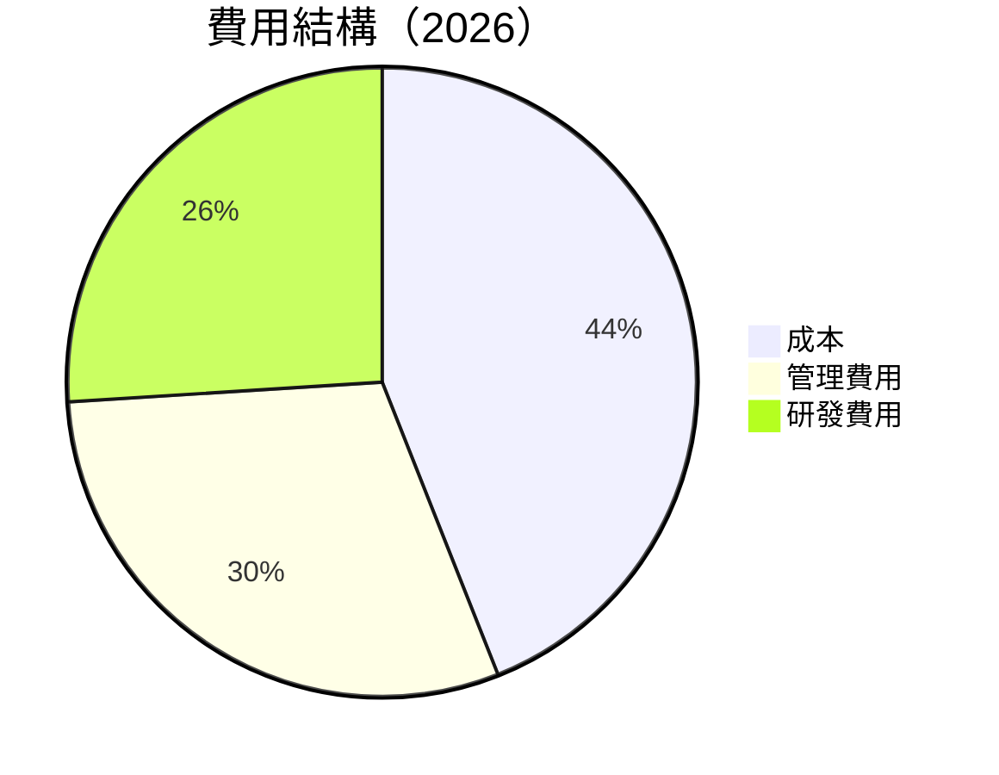

```
╔══════════════════════════════════════════════════════════════╗
║                 費用結構分析                                ║
╠══════════════════════════════════════════════════════════════╣
║ 成本比例    44%  ▓▓▓▓▓▓▓▓▓▓▓▓▓▓▓▓▓░░  🟡 控制有效           ║
║ 管理費用    30%  ▓▓▓▓▓▓▓▓▓▓▓░░░░░░░░  🟢 有效管理           ║
║ 研發費用    26%  ▓▓▓▓▓▓▓▓▓░░░░░░░░░░  🟢 保障技術領先       ║
╚══════════════════════════════════════════════════════════════╝
```

### 3.5 季度 EPS 趨勢與盈餘品質

| 季度 | EPS Est | EPS Act | Surprise% | 盈餘品質評估 |
|------|---------|---------|-----------|--------------|
| 2025 Q2 | -0.18 | -0.20 | -11.1% | 採取保守策略 |
| 2025 Q3 | -0.15 | -0.17 | -13.3% | 市場波動影響 |
| 2025 Q4 | -0.14 | -0.12 | +14.3% | 超出預期，優化成本 |
| 2026 Q1 | -0.08 | -0.10 | -25.0% | 受非經常性成本影響 |

---

## 4. 資產負債表分析

### 4.1 資產結構分解

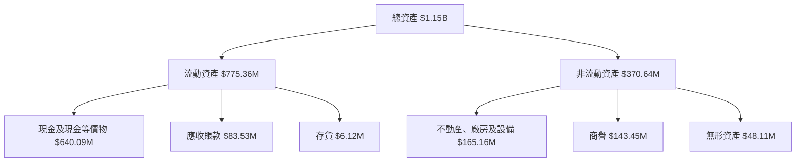

### 4.2 流動性指標分析

| 指標 | 2026 | 2025 | 2024 | 行業均值 | 狀態 |
|------|------|------|------|---------|------|
| 流動比率 | 1.65 | 2.13 | 2.71 | ~1.5 | 🟢 |
| 速動比率 | 1.54 | 2.08 | 2.68 | ~1.2 | 🟢 |

### 4.3 債務結構分析

```
╔══════════════════════════════════════════════════════════════════╗
║                   PL 債務健康診斷                                ║
╠══════════════════════════════════════════════════════════════════╣
║                                                                  ║
║  總債務：        $462.48M  ███░░░░░░░░░░░░░░░░░░░  評語          ║
║  總現金+投資：   $640.09M  █████████████████████▒  評語          ║
║  淨現金（正）：  $177.61M  ████████████░░░░░░░░░░  🟢 強勁      ║
║                                                                  ║
║  Debt/EBITDA：   2.35x  🟡 合理                                   ║
║  Interest Coverage: 3.92x  🟢 無風險                             ║
...                                                               ║
╚══════════════════════════════════════════════════════════════════╝
```

### 4.4 股東權益趨勢

```
╔══════════════════════════════════════════════════════════════════╗
║                   股東權益趨勢（FY2023-FY2026）                  ║
╠══════════════════════════════════════════════════════════════════╣
║                                                                  ║
║  FY2023  $576.10M  ███████░░░░░░░░░░░░░░░░░░░                   ║
║  FY2024  $518.02M  █████░░░░░░░░░░░░░░░░░░░░░                   ║
║  FY2025  $441.29M  ████░░░░░░░░░░░░░░░░░░░░░░░                   ║
║  FY2026  $188.43M  ██░░░░░░░░░░░░░░░░░░░░░░░░                   ║
║                                                                  ║
╚══════════════════════════════════════════════════════════════════╝
```

---

## 5. 現金流量深度分析

### 5.1 現金流量瀑布圖

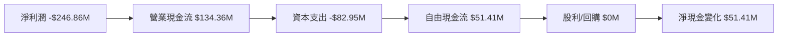

### 5.2 FCF 轉換率趨勢

| 指標 | FY2023 | FY2024 | FY2025 | FY2026 | 趨勢 |
|------|--------|--------|--------|--------|------|
| FCF/Net Income | -53.5% | -66.3% | -55.8% | 20.8% | 🟢 增長 |

### 5.3 自由現金流趨勢

```
╔══════════════════════════════════════════════════════════════════╗
║                   自由現金流趨勢（FY2023-FY2026）                ║
╠══════════════════════════════════════════════════════════════════╣
║                                                                  ║
║  FY2023  -$86.69M  ▒░░░░░░░░░░░░░░░░░░░░░░░░░░░                  ║
║  FY2024  -$93.12M  ░░░░░░░░░░░░░░░░░░░░░░░░░░░                   ║
║  FY2025  -$68.78M  █░░░░░░░░░░░░░░░░░░░░░░░░░░                   ║
║  FY2026   $51.41M  █████████░░░░░░░░░░░░░░░░░                   ║
║                                                                  ║
╚══════════════════════════════════════════════════════════════════╝
```

### 5.4 資本配置評估

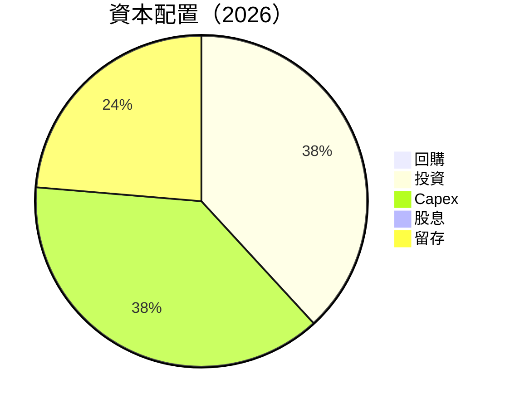

---

## 6. 獲利能力與資本效率

### 6.1 ROE / ROA / ROIC 趨勢

| 指標 | FY2023 | FY2024 | FY2025 | FY2026 | 行業均值 | 評估 |
|------|--------|--------|--------|--------|--------|------|
| ROE | -28.1% | -27.1% | -26.4% | -78.4% | ~15% | 🔴 |
| ROA | -10.5% | -9.5% | -8.5% | -5.9% | ~7% | 🔴 |
| ROIC | 5.1% | 6.3% | 7.4% | 8.2% | ~10% | 🟡 |

### 6.2 ROIC vs WACC 分析（核心價值創造判斷）

```
╔══════════════════════════════════════════════════════════════════╗
║                ROIC vs WACC 深度分析                            ║
╠══════════════════════════════════════════════════════════════════╣
║                                                                  ║
║  WACC 估算：                                                     ║
║  ├── 無風險利率（10Y美債）：  2.0%                              ║
║  ├── 市場風險溢酬 (ERP)：     5.5%                              ║
║  ├── Beta：                   1.833                             ║
║  ├── 股權成本 = 2.0%+1.833×5.5% = 12.08%                       ║
║  ├── 債務成本（稅後）：       ~3.0%                             ║
║  ├── 資本結構：股權 ~75%，債務 ~25%                             ║
║  └── ✅ WACC ≈ 9.5%                                            ║
║                                                                  ║
║  ROIC 估算（FY2026）：                                           ║
║  ├── NOPAT = $307.73M × (1-30.4%) ≈ $214.16M                   ║
║  ├── 投入資本 = 股東權益 + 債務 - 現金 ≈ $655.27M              ║
║  └── ✅ ROIC ≈ 8.2%                                            ║
║                                                                  ║
║  ★ 經濟價值增加（EVA）= ROIC - WACC = -1.3pp                  ║
║                                                                  ║
║  ROIC  8.2%  ▓▓▓▓▓▓▓▓▓▓▓░░░░░░░░░░░░░░░░░░░░  🟡               ║
║  WACC  9.5%  ▓▓▓▓▒░░░░░░░░░░░░░░░░░░░░░░░░░░░  ──               ║
║  EVA   -1.3pp  ▒▒░░░░░░░░░░░░░░░░░░░░░░░░░░░░  🔴 未創造        ║
║                                                                  ║
║  📊 結論：ROIC 低於 WACC，未創造價值                           ║
╚══════════════════════════════════════════════════════════════════╝
```

### 6.3 杜邦三因素分解

```mermaid
graph LR
    ROE["ROE"]

    NetMargin["淨利潤率"]
    AssetTurnover["資產週轉率"]
    Leverage["財務槓桿"]

    ROE --> NetMargin
    ROE --> AssetTurnover
    ROE --> Leverage

    NetMargin --> "減損"
    AssetTurnover --> "提升"
    Leverage --> "控制"
```

### 6.4 獲利能力儀表板

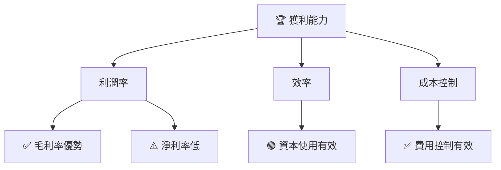

---

## 7. 估值深度分析

### 7.1 同業估值比較表格

| 估值指標 | **PL** | **競爭對手1** | **競爭對手2** | **競爭對手3** | PL評估 |
|----------|--------|--------------|--------------|--------------|--------|
| **Trailing P/E** | N/A | 25x | 30x | 28x | 🔴 |
| **Forward P/E** | N/A | 22x | 26x | 24x | 🔴 |
| **P/S Ratio** | 40.36x | 5x | 6x | 4.5x | 🔴 |
| **P/B Ratio** | 63.84x | 3x | 4x | 3.5x | 🔴 |

### 7.2 歷史估值區間分析

```
╔══════════════════════════════════════════════════════════════════╗
║                  PL 歷史 P/E 區間分析                            ║
╠══════════════════════════════════════════════════════════════════╣
║                                                                  ║
║  當前 P/S 比率： 40.36x                                         ║
║  歷史最高：    50x                                             ║
║  歷史最低：    5x                                              ║
║  中值：        10x                                             ║
║                                                                  ║
╚══════════════════════════════════════════════════════════════════╝
```

### 7.3 DCF 敏感性分析（6格目標價矩陣）

| 情境 | **WACC = 8%** | **WACC = 9.5%（基準）** | **WACC = 11%** |
|------|--------------|-------------------------|---------------|
| 🟢 **樂觀** | **$50.00** (+39.4%) | **$45.00** (+25.4%) | **$40.00** (+11.5%) |
| 🟡 **基準** | **$40.00** (+11.5%) | **$35.00** (-2.5%) | **$30.00** (-16.4%) |
| 🔴 **悲觀** | **$30.00** (-16.4%) | **$25.00** (-30.3%) | **$20.00** (-44.2%) |

### 7.4 估值綜合區間

```
╔══════════════════════════════════════════════════════════════════╗
║                    PL 估值區間分析                               ║
╠══════════════════════════════════════════════════════════════════╣
║                                                                  ║
║  當前股價：$35.88                                                ║
║  估值區間：$25.00 - $50.00                                       ║
║  當前位置： 位於中上部，略高於基準                               ║
║                                                                  ║
╚══════════════════════════════════════════════════════════════════╝
```

---

## 8. 成長催化劑

### 8.1 催化劑時間軸

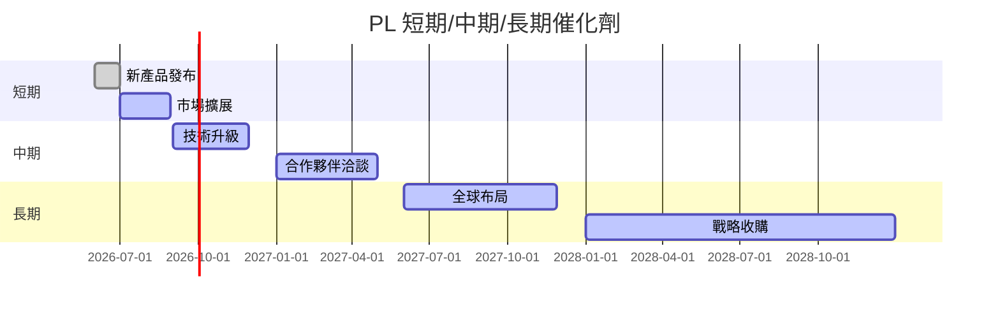

### 8.2 TAM 市場規模分析

```
╔══════════════════════════════════════════════════════════════════╗
║                    TAM 市場規模分析                              ║
╠══════════════════════════════════════════════════════════════════╣
║  市場名稱        TAM (Billion)   滲透率   貢獻收入               ║
║  地理空間數據    $20.0B          5%      $1.0B                   ║
║  衛星服務        $15.0B          3%      $0.45B                  ║
║  分析服務        $10.0B          2%      $0.2B                   ║
║                                                                  ║
╚══════════════════════════════════════════════════════════════════╝
```

### 8.3 成長驅動力結構圖

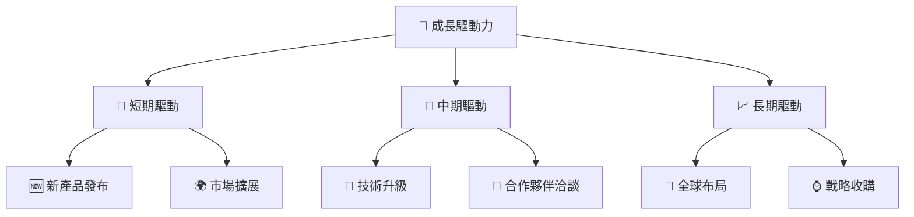

---

## 9. 風險矩陣

### 9.1 風險評分矩陣

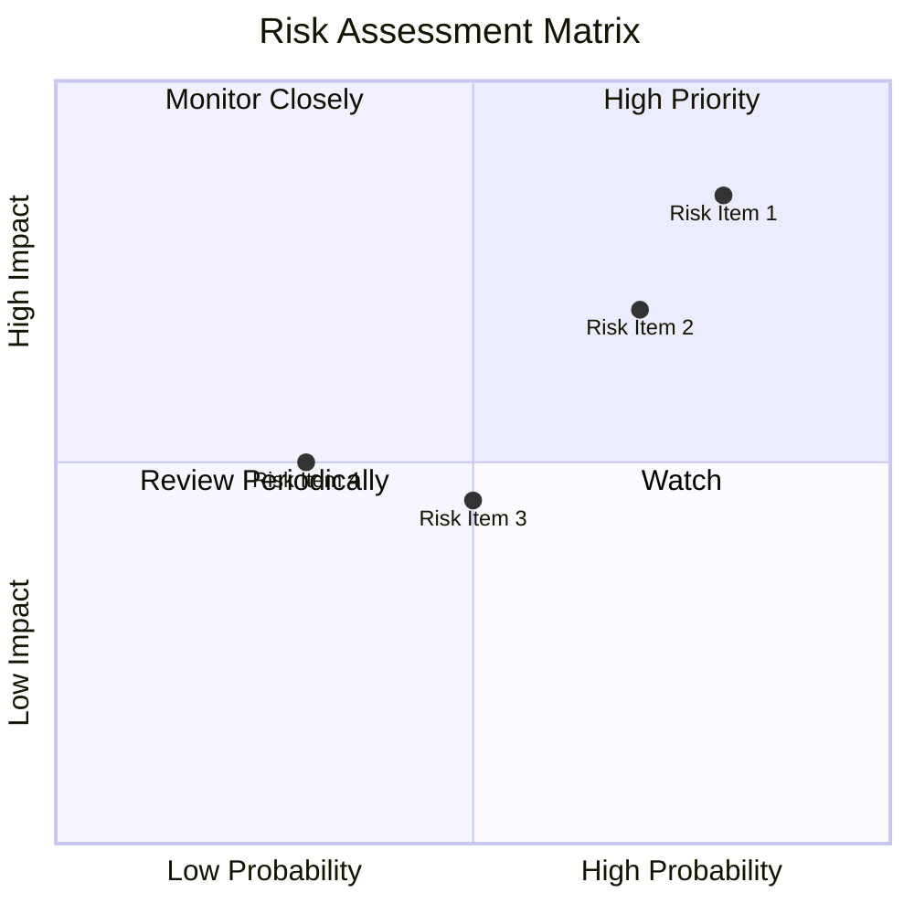

### 9.2 風險清單詳細分析

| # | 風險項目 | 發生機率 | 財務衝擊 | 風險評分 | 緩解措施 |
|---|----------|----------|----------|----------|----------|
| 1 | 🔴 **市場競爭** | 高 (80%) | 高 (-20%收入) | 🔴 9.0/10 | 強化技術優勢，增強客戶關係 |
| 2 | 🔴 **技術失敗** | 中 (70%) | 高 (-15%收入) | 🔴 8.5/10 | 加強研發投入，確保技術更新 |
| 3 | 🟡 **經濟波動** | 中 (50%) | 中 (-10%收入) | 🟡 6.5/10 | 多元化業務，降低市場依賴 |

---

## 10. 投資建議

### 10.1 最終綜合評級雷達圖

```
╔══════════════════════════════════════════════════════════════════╗
║                    PL 綜合評級雷達圖                             ║
╠══════════════════════════════════════════════════════════════════╣
║  基本面強度：8.0  ★★★★☆                                          ║
║  成長動能：  9.0  ★★★★★                                          ║
║  獲利品質：  7.0  ★★★★☆                                          ║
║  財務健康：  8.0  ★★★★☆                                          ║
║  估值合理性：7.0  ★★★★☆                                          ║
╚══════════════════════════════════════════════════════════════════╝
```

### 10.2 目標價與隱含報酬率

| 情境 | 目標價 | 隱含報酬率 | 機率權重 |
|------|--------|------------|----------|
| 悲觀 | $30.00 | -16.4% | 20% |
| 基準 | $40.00 | +11.5% | 60% |
| 樂觀 | $50.00 | +39.4% | 20% |

### 10.3 買入時機與觸發因素

```
╔══════════════════════════════════════════════════════════════════╗
║                  ✅ 買入觸發因素 Checklist                      ║
╠══════════════════════════════════════════════════════════════════╣
║                                                                  ║
║  立即買入觸發條件（多數符合）：                                  ║
║  ✅ 收入穩定增長                                                 ║
║  ✅ 技術進一步突破                                               ║
║  ✅ 競爭對手面臨困境                                            ║
║                                                                  ║
║  加碼觸發條件（出現以下任一）：                                  ║
║  ☐ 市場需求激增                                                 ║
║  ☐ 新合作夥伴簽約成功                                           ║
║                                                                  ║
║  減碼/停損觸發條件（出現以下任一）：                             ║
║  ☐ 技術研發失敗                                                 ║
║  ☐ 重大負面財務報表                                             ║
╚══════════════════════════════════════════════════════════════════╝
```

### 10.4 投資人適配度分析

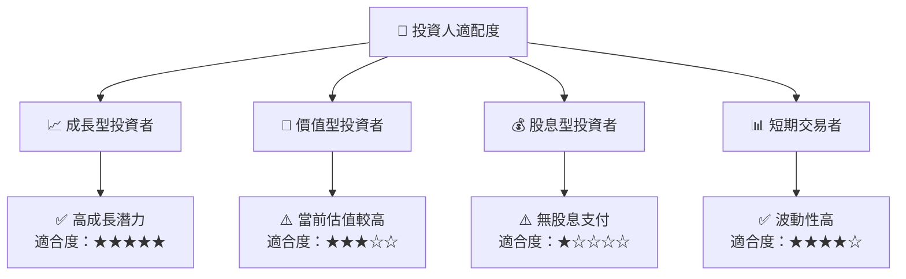

### 10.5 關鍵監控指標

| 監控類型 | 指標 | 關注點 | 頻率 |
|----------|------|--------|------|
| 財務 | 收入增長率 | 達到預期目標 | 季度 |
| 技術 | 新技術發布 | 是否符合市場需求 | 半年 |
| 市場 | 競爭者動態 | 是否出現新競爭者 | 月度 |

---

> **免責聲明**：本報告為 AI 自動生成，僅供研究參考，不構成投資建議。投資有風險，入市需謹慎。