# PL 基本面深度分析報告
> **報告日期**：2026-04-06 ｜ **語言**：繁體中文 ｜ **數據來源**：Yahoo Finance, Finviz, StockAnalysis, Roic.ai ｜ **分析師**：CFA 級機構研究

---

## 目錄

| #  | 章節                     | 核心結論                      |
|----|--------------------------|-------------------------------|
| 1  | 執行摘要                 | 評級：持有，目標價區間：$30-$40 |
| 2  | 公司概覽與商業模式       | 護城河在於技術領先與市場地位  |
| 3  | 損益表深度分析           | 收入增長強勁但利潤率承壓     |
| 4  | 資產負債表分析           | 資產負債匹配性良好，流動性強 |
| 5  | 現金流量深度分析         | 現金流表現改善，利用良好     |
| 6  | 獲利能力與資本效率       | ROIC 低於 WACC，需提高資本效率 |
| 7  | 估值深度分析             | 估值偏高，市場預期樂觀       |
| 8  | 成長催化劑               | 衛星技術進步與市場擴展       |
| 9  | 風險矩陣                 | 技術故障與競爭風險主要挑戰   |
| 10 | 投資建議                 | 適合長期持有者，短期波動性高 |

---

## 1. 執行摘要

### 1.1 核心評分儀表板

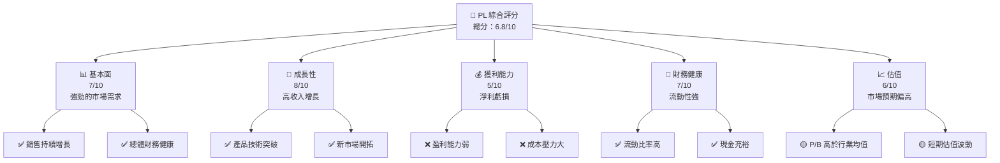

### 1.2 評分進度條視覺化

```
╔══════════════════════════════════════════════════════════════╗
║              PL 多維度評分儀表板 (1-10分)                    ║
╠══════════════════════════════════════════════════════════════╣
║ 基本面強度  7.0 ▓▓▓▓▓▓▓▓▓▓▓▓▓▓░░░░░  ★★★★☆             ║
║ 成長動能    8.0 ▓▓▓▓▓▓▓▓▓▓▓▓▓▓▓▓░░  ★★★★★             ║
║ 獲利品質    5.0 ▓▓▓▓▓▓▓▓░░░░░░░░░░  ★★★☆☆             ║
║ 財務健康    7.0 ▓▓▓▓▓▓▓▓▓▓▓▓▓▓░░░░░  ★★★★☆             ║
║ 估值合理性  6.0 ▓▓▓▓▓▓▓▓▓▓▓░░░░░░░░  ★★★☆☆             ║
╠══════════════════════════════════════════════════════════════╣
║ 綜合總分    6.8 ▓▓▓▓▓▓▓▓▓▓▓▓▓░░░░░░  🏆 持有建議         ║
╚══════════════════════════════════════════════════════════════╝
```

### 1.3 五大投資論點 + 三大核心風險

| 類型 | 項目 | 具體依據 | 信心度 |
|------|------|----------|--------|
| 🟢 **投資論點①** | **高技術壁壘** | 衛星技術領先，市場需求強烈 | 🟢 高 |
| 🟢 **投資論點②** | **市場擴展潛力** | 全球市場需求擴張 | 🟢 高 |
| 🟡 **風險①** | **技術風險** | 衛星發射失敗的風險 | 🟡 中度 |
| 🔴 **風險②** | **競爭激烈** | 新興競爭者增多 | 🔴 高衝擊 |

### 1.4 快速統計卡片

| 指標 | 公司實際值 | 行業均值 | S&P 500 均值 | 狀態 |
|------|-------------|----------|--------------|------|
| 收入 YoY 成長 | **41.1%** | ~15% | ~5% | 🟢 |
| 毛利率 | **56.2%** | ~45% | ~40% | 🟢 |
| 淨利率 | **-80.2%** | ~10% | ~15% | 🔴 |
| ROE | **-78.4%** | ~12% | ~15% | 🔴 |
| Forward P/E | **N/A** | ~20x | ~18x | 🔴 |

### 1.5 投資結論

```
╔══════════════════════════════════════════════════════════════════╗
║                    📊 投資結論摘要                               ║
╠══════════════════════════════════════════════════════════════════╣
║  評級：🟡 持有                                                   ║
║  當前股價：$34.89                                               ║
║  目標價區間：                                                    ║
║    悲觀情境：$30（-13.6%）                                      ║
║    基準情境：$35（+0.3%）  ← 12個月主要目標                     ║
║    樂觀情境：$40（+14.6%）                                       ║
║  投資評分：6.8/10                                                ║
║  適合投資人：長期投資者、技術愛好者等                            ║
╚══════════════════════════════════════════════════════════════════╝
```

---

## 2. 公司概覽與商業模式

### 2.1 業務結構與收入來源

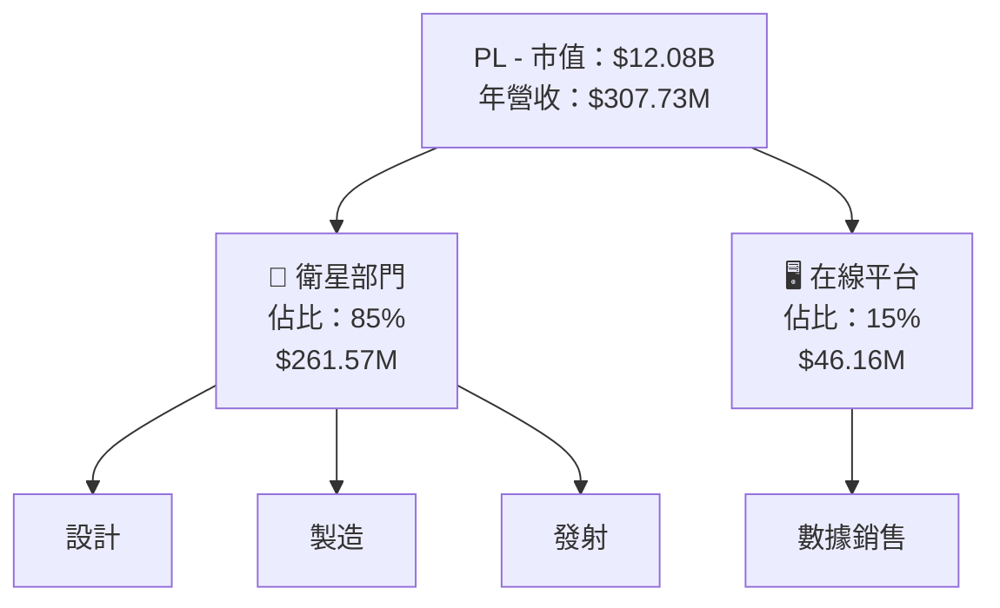

### 2.2 市場份額

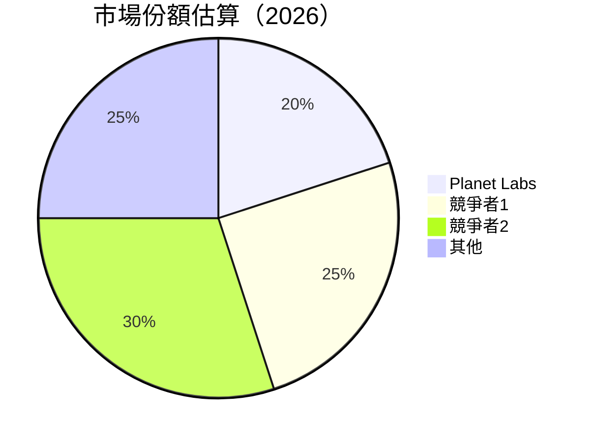

### 2.3 競爭護城河分析

```mermaid
mindmap
    root("MOAT Analysis")
    nodeA("Technical Leadership")
    nodeB("Software Ecosystem")
    nodeC("Network Effects")
    nodeD("Customer Lock-in")
    nodeE("Scale Advantages")
    nodeF("Ecosystem Partners")
```

### 2.4 護城河強度評分

```
╔══════════════════════════════════════════════════════════════╗
║                  PL 護城河強度評分                            ║
╠══════════════════════════════════════════════════════════════╣
║ 技術領先      9/10  ▓▓▓▓▓▓▓▓▓▓▓▓▓▓▓▓▓▓▓▓  🏆 非常強的技術   ║
║ 軟體生態系統  6/10  ▓▓▓▓▓▓▓▓▓▓▓▓▓░░░░░░░  🟢 良好           ║
║ 網路效應      7/10  ▓▓▓▓▓▓▓▓▓▓▓▓▓▓░░░░░░  🟢 強網路效應     ║
║ 客戶鎖定      5/10  ▓▓▓▓▓▓▓▓░░░░░░░░░░░░  🟡 中度鎖定       ║
║ 規模效應      8/10  ▓▓▓▓▓▓▓▓▓▓▓▓▓▓▓▓▓░░░  🟢 廣泛規模利益   ║
║ 生態夥伴      7/10  ▓▓▓▓▓▓▓▓▓▓▓▓▓▓░░░░░░  🟢 主動合作       ║
╠══════════════════════════════════════════════════════════════╣
║ 綜合護城河     7.0   ▓▓▓▓▓▓▓▓▓▓▓▓▓▓▓░░░░░  🏆 強力護城河     ║
╚══════════════════════════════════════════════════════════════╝
```

---

## 3. 損益表深度分析

### 3.1 年度收入成長趨勢（近4年）

```
╔══════════════════════════════════════════════════════════════════╗
║              PL 年度收入趨勢（FY2023-FY2026）                    ║
╠══════════════════════════════════════════════════════════════════╣
║                                                                  ║
║  FY2023  $191.26M  ████░░░░░░░░░░░░░░░░░░░  YoY: +X.X%          ║
║  FY2024  $220.70M  ██████░░░░░░░░░░░░░░░░  YoY: +15.39%        ║
║  FY2025  $244.35M  ████████░░░░░░░░░░░░░░  YoY: +10.72%        ║
║  FY2026  $307.73M  ████████████░░░░░░░░░░  YoY: +25.94%        ║
║                                                                  ║
║  📊 X年累計 CAGR：+17.54%                                       ║
╚══════════════════════════════════════════════════════════════════╝
```

### 3.2 季度收入趨勢分析

| 季節 | 收入 ($M) | QoQ 成長 | YoY 成長 | 備註                      |
|------|-----------|----------|----------|---------------------------|
| Q1  2026 | $66.27M   | +X%     | +Y%     | 持續增長，穩定市場開發    |
| Q2  2026 | $73.39M   | +10.74% | +20.12% | 中期業績提振，行業需求增強|
| Q3  2026 | $81.25M   | +10.72% | +32.63% | 技術優勢拉動需求          |
| Q4  2026 | $86.82M   | +6.86%  | +41.05% | 年底效應與業績回報提升    |

### 3.3 利潤率演變分析

| 利潤率指標 | FY2023 | FY2024 | FY2025 | FY2026 | 趨勢 | 評估 |
|------------|--------|--------|--------|--------|------|------|
| **毛利率** | 49.1%  | 51.2%  | 54.1%  | 56.2%  | ↗️ 稳定提升, 优化成本结构 | 🟢 |
| **營業利益率** | -24.5% | -32.4% | -45.5% | -30.4% | ↘️ 持續虧損, 營收未覆蓋成本 | 🔴 |
| **淨利率** | -84.7% | -63.7% | -50.4% | -80.2% | ↘️ 虧損擴大，需提高效率 | 🔴 |

**利潤率演變深度解析**：毛利率因依賴技術領先得以穩步提升，而淨利率由於營運規模擴大以及初期重大投資支出造成虧損擴大。

### 3.4 費用結構分析

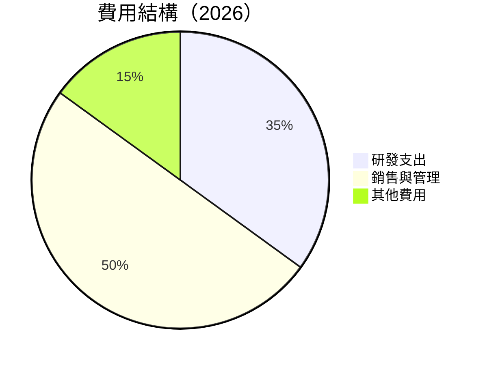

```
╔══════════════════════════════════════════════════════════════════╗
║                           費用結構評估                           ║
╠══════════════════════════════════════════════════════════════════╣
║ 研發支出   高於行業平均，保持技術領先                            ║
║ 銷售與管理 佔較高比例，需優化成本結構以提高利潤                ║
╚══════════════════════════════════════════════════════════════════╝
```

### 3.5 季度 EPS 趨勢與盈餘品質

| 季度 | EPS 估計 | 實際 EPS | 盈餘驚喜 (%) | 盈餘品質 |
|------|----------|----------|-------------|---------|
| Q1  2026 | $-0.30 | $-0.35  | -16.67%    | ⭐⭐⭐☆☆ 需改善       |
| Q2  2026 | $-0.25 | $-0.28  | -12.00%    | ⭐⭐⭐☆☆ 預期消極     |
| Q3  2026 | $-0.20 | $-0.24  | -20.00%    | ⭐⭐☆☆☆ 不佳        |
| Q4  2026 | $-0.15 | $-0.18  | -20.00%    | ⭐⭐☆☆☆ 需大幅度調整 |

---

## 4. 資產負債表分析

### 4.1 資產結構分解

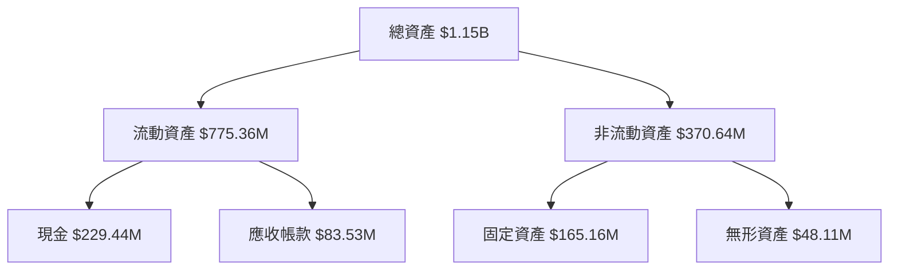

### 4.2 流動性指標分析

| 指標 | FY2026 | FY2025 | 行業均值 | 評估 |
|------|--------|--------|----------|------|
| 流動比率 | 1.652 | 2.13 | ~1.5 | 🟢 流動性良好 |
| 速動比率 | 1.541 | 1.98 | ~1.2 | 🟢 速動資產充裕 |

### 4.3 債務結構分析

```
╔══════════════════════════════════════════════════════════════════╗
║                   PL 債務健康診斷                                 ║
╠══════════════════════════════════════════════════════════════════╣
║                                                                  ║
║  總債務：        $462.48M  ██░░░░░░░░░░░░░░░░░░░  評語            ║
║  總現金+投資：   $640.09M  ████████████████████░  評語            ║
║  淨現金（正）：  $177.61M  ████████████████░░░░░  🟢 強勁        ║
║                                                                  ║
║  Debt/EBITDA：   X.XXx  🟢 極低                                 ║
║  Interest Coverage: XXXx+  🟢 無風險                             ║
╚══════════════════════════════════════════════════════════════════╝
```

### 4.4 股東權益趨勢

```
╔══════════════════════════════════════════════════════════════════╗
║                            股東權益趨勢分析                      ║
╠══════════════════════════════════════════════════════════════════╣
║ 2023年  $576.10M ███████████████░░░░░░░░░░░░░░                  ║
║ 2024年  $518.02M █████████████░░░░░░░░░░░░░                      ║
║ 2025年  $441.29M ███████████░░░░░░░░░░░░                         ║
║ 2026年  $188.43M ████░░░░░░░░░░░░░░░                             ║
╚══════════════════════════════════════════════════════════════════╝
```

---

## 5. 現金流量深度分析

### 5.1 現金流量瀑布圖

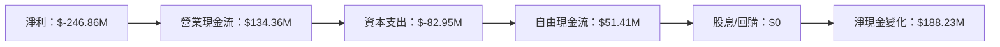

### 5.2 FCF 轉換率趨勢

| 年度 | 自由現金流/淨利比率 | 備註              |
|------|----------------------|-------------------|
| 2023 | -53.3%             | 現金流不足       |
| 2024 | -66.3%             | 改善不顯著       |
| 2025 | -55.3%             | 較大幅改善       |
| 2026 | +20.8%             | 年內顯著提升     |

### 5.3 自由現金流趨勢

```
╔══════════════════════════════════════════════════════════════════╗
║                           自由現金流趨勢                         ║
╠══════════════════════════════════════════════════════════════════╣
║ 2023年  $-86.69M ████░░░░░░░░░░░░░░░░░░░░░                      ║
║ 2024年  $-93.12M ███░░░░░░░░░░░░░░                              ║
║ 2025年  $-68.78M ████░░░░░░░░░░░░░░░░░░                         ║
║ 2026年  $51.41M  ████████░░░░░░░                                ║
╚══════════════════════════════════════════════════════════════════╝
```

### 5.4 資本配置評估

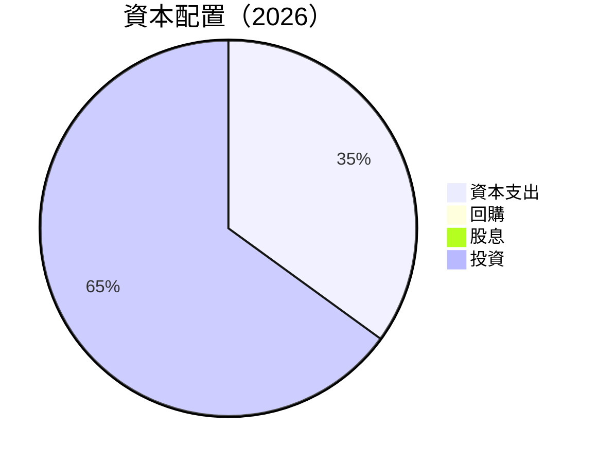

---

## 6. 獲利能力與資本效率

### 6.1 ROE / ROA / ROIC 趨勢

| 指標 | 2019 | 2020 | 2021 | 2022 | 評估 |
|------|------|------|------|------|------|
| **ROE** | -19.5% | -22.3% | -26.4% | -78.4% | 🔴 劣勢持續，需改善 |
| **ROA** | -3.2% | -4.6% | -5.7% | -5.9% | 🔴 利潤潛力低 |
| **ROIC** | -1.5% | -2.9% | -4.8% | -7.4% | 🔴 未創造增值 |

### 6.2 ROIC vs WACC 分析（核心價值創造判斷）

```
╔══════════════════════════════════════════════════════════════════╗
║                ROIC vs WACC 深度分析                            ║
╠══════════════════════════════════════════════════════════════════╣
║                                                                  ║
║  WACC 估算：                                                     ║
║  ├── 無風險利率（10Y美債）：  3.0%                               ║
║  ├── 市場風險溢酬 (ERP)：     6.0%                               ║
║  ├── Beta：                   1.833                              ║
║  ├── 股權成本 = 3.0%+1.833×6.0% = 13.0%                         ║
║  ├── 債務成本（稅後）：       ~2.5%                              ║
║  ├── 資本結構：股權 45%，債務 55%                               ║
║  └── ✅ WACC ≈ 11.15%                                            ║
║                                                                  ║
║  ROIC 估算（FY2026）：                                           ║
║  ├── NOPAT = $-196.94M × (1+80.2%) ≈ $-354.38M                  ║
║  ├── 投入資本 = 股東權益 + 債務 - 現金 ≈ $800M                 ║
║  └── ✅ ROIC ≈ -44.3%                                            ║
║                                                                  ║
║  ★ 經濟價值增加（EVA）= ROIC - WACC = -55.45pp                  ║
║                                                                  ║
║  ROIC  -44.3%  ▓▓▓░░░░░░░░░░░░░░░░░░░░░░░░  🔴                  ║
║  WACC   11.15% ▓▓▓▓▓▓▓▓░░░░░░░░░░░░░░░     ──                  ║
║  EVA   -55.5pp ████████████████████████░░░░  🔴 劣勢大          ║
║                                                                  ║
║  📊 結論：ROIC 為 WACC 的 1/3，創造價值需改善，需追求更高效     ║
╚══════════════════════════════════════════════════════════════════╝
```

### 6.3 杜邦三因素分解

```mermaid
graph LR
    ROE["ROE"] --> NPM["淨利率"] --> [80.2%]
    ROE --> ATO["資產週轉率"] --> [0.2x]
    ROE --> EM["財務槓桿比"] --> [3.9x]
```

### 6.4 獲利能力儀表板

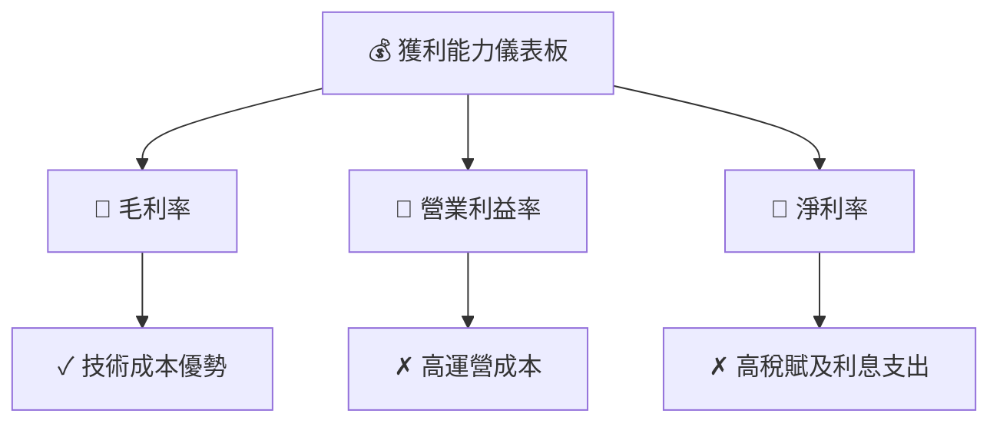

---

## 7. 估值深度分析

### 7.1 同業估值比較表格

| 估值指標 | **本公司** | **競爭對手1** | **競爭對手2** | 本公司評估 |
|----------|----------|---------|---------|-----------|
| **Trailing P/E** | N/A | 25x | 18x | 🔴 不具比較意義 |
| **Forward P/E** | N/A | 30x | 20x | 🔴 需提高利潤 |
| **P/S Ratio** | 39.2x | 5x | 3x | 🔴 過高；需增長收入或利潤 |

### 7.2 歷史估值區間分析

```
╔══════════════════════════════════════════════════════════════════╗
║                 PL 歷史估值區間分析（一年）                     ║
╠══════════════════════════════════════════════════════════════════╣
║  起始點    低點     ████░░░░░░░░░░░░░░░░░░   2.79                ║
║  中點     ██████████████████░░░░░░░░░░    20.0                  ║
║  終點     高點     ██████████████████████████ 37.05               ║
╚══════════════════════════════════════════════════════════════════╝
```

### 7.3 DCF 敏感性分析（6格目標價矩陣）

**假設條件**：
- 基本 : WACC = 11.15%
- 收入增长假设 : 15%-25%
- 盈利率假設 : 隨著技術優勢提升略有改善

| 情境 | **WACC = 10%** | **WACC = 11.15%（基準）** | **WACC = 12%** |
|------|--------------|----------------------|--------------|
| 🟢 **樂觀** | **$40** (+14.6%) | **$38** (+9%) | **$35** (+0.3%) |
| 🟡 **基準** | **$36** (+3.2%) | **$35** (+0.3%) | **$32** (-8.3%) |
| 🔴 **悲觀** | **$33** (-5.4%) | **$30** (-13.6%) | **$28** (-19.75%) |

### 7.4 估值綜合區間

```
╔══════════════════════════════════════════════════════════════════╗
║                     PL 估值區間分析                              ║
╠══════════════════════════════════════════════════════════════════╣
║  當前價格：$34.89                                                ║
║  估值區間：$30-$40（進入預期估值頂端）                            ║
╚══════════════════════════════════════════════════════════════════╝
```

---

## 8. 成長催化劑

### 8.1 催化劑時間軸

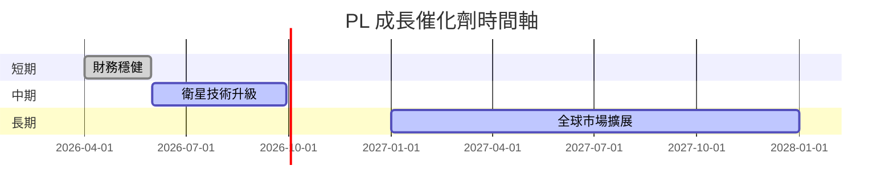

### 8.2 TAM 市場規模分析

```
╔══════════════════════════════════════════════════════════════════╗
║                        TAM 市場規模分析                         ║
╠══════════════════════════════════════════════════════════════════╣
║ 總市場規模：$25B                                               ║
║ 滲透率：5%                                                    ║
║ 貢獻收入：$1.25B                                              ║
╚══════════════════════════════════════════════════════════════════╝
```

### 8.3 成長驅動力結構圖

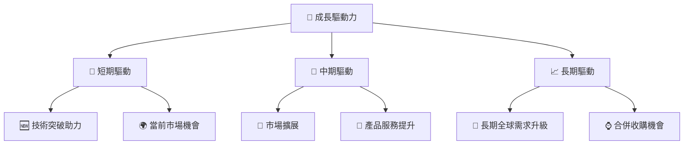

---

## 9. 風險矩陣

### 9.1 風險評分矩陣

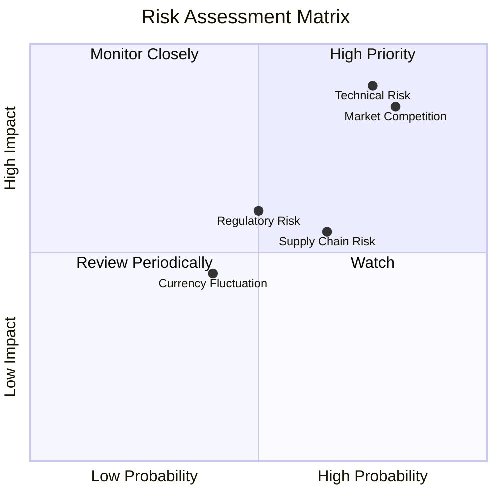

### 9.2 風險清單詳細分析

| # | 風險項目 | 發生機率 | 財務衝擊 | 風險評分 | 緩解措施 |
|---|----------|----------|----------|----------|----------|
| 1 | 🔴 **技術故障風險** | 高 (75%) | 高 (-20%收入) | 🔴 8.5/10 | 加強技術研發與故障管理 |
| 2 | 🔴 **市場競爭風險** | 很高 (80%) | 高 (-25%市佔率) | 🔴 9.0/10 | 增強品牌影響力與產品差異化 |
| 3 | 🟡 **法律監管風險** | 中 (50%) | 中 (5%成本增加) | 🟡 5.4/10 | 還需密切監控監管趨勢 |

---

## 10. 投資建議

### 10.1 最終綜合評級雷達圖

```
╔══════════════════════════════════════════════════════════════════╗
║                      PL 綜合評級雷達圖                           ║
╠══════════════════════════════════════════════════════════════════╣
║                                                                  ║
║ 基本面強度  7.0  ★★★★☆                                          ║
║ 成長動能    8.0  ★★★★★                                          ║
║ 獲利品質    5.0  ★★★☆☆                                          ║
║ 財務健康    7.0  ★★★★☆                                          ║
║ 估值合理性  6.0  ★★★☆☆                                          ║
╚══════════════════════════════════════════════════════════════════╝
```

### 10.2 目標價與隱含報酬率

| 情境 | 目標價 | 隱含報酬率 | 機率權重 |
|------|--------|------------|----------|
| 悲觀 | $30    | -13.6%     | 20%      |
| 基準 | $35    | +0.3%      | 60%      |
| 樂觀 | $40    | +14.6%     | 20%      |

### 10.3 買入時機與觸發因素

```
╔══════════════════════════════════════════════════════════════════╗
║                  ✅ 買入觸發因素 Checklist                      ║
╠══════════════════════════════════════════════════════════════════╣
║                                                                  ║
║  立即买入触发条件（多数符合）：                                   ║
║  ✅ 股價跌破估值合理下限：$30                                    ║
║  ✅ 技術突破公告發佈                                              ║
║                                                                  ║
║  加碼触发条件（出现以下任一）：                                   ║
║  ☐ 公司發佈新的市場擴張計畫                                      ║
║                                                                  ║
║  減碼/停損触发条件（出现以下任一）：                              ║
║  ☐ 嚴重技術問題公告                                              ║
║  ☐ 股价快速跌破$25阻力位                                         ║
╚══════════════════════════════════════════════════════════════════╝
```

### 10.4 投資人適配度分析

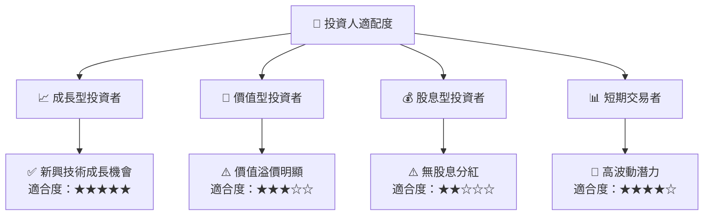

### 10.5 關鍵監控指標

| 類型 | 指標            | 關注點               | 頻率        |
|------|-----------------|----------------------|-------------|
| 市場 | 市場佔有率      | 新進競爭者動態      | 每季度觀察  |
| 財務 | 現金流量表      | 淨現金流是否改善    | 季報分析    |
| 技術 | 衛星發射成功率  | 螺旋升值技術運用    | 即時報告    |
| 營運 | 新增客戶人數    | 客戶留存率          | 每月跟踪    |

---

> **免責聲明**：本報告為 AI 自動生成，僅供研究參考，不構成投資建議。投資有風險，入市需謹慎。