# PL 基本面深度分析報告
> **報告日期**：2026-04-07 ｜ **語言**：繁體中文 ｜ **數據來源**：Yahoo Finance, Finviz, StockAnalysis, Roic.ai ｜ **分析師**：CFA 級機構研究

---

## 目錄

| # | 章節 | 核心結論 |
|---|------|----------|
| 1 | 執行摘要 | 買入評級，目標價區間 $18-$40 |
| 2 | 公司概覽與商業模式 | 護城河強度適中，技術領先 |
| 3 | 損益表深度分析 | 收入增長強勁，利潤率挑戰 |
| 4 | 資產負債表分析 | 資產負債結構穩健，現金充裕 |
| 5 | 現金流量深度分析 | 現金流改善，FCF轉正 |
| 6 | 獲利能力與資本效率 | ROIC 低於 WACC，創造價值挑戰 |
| 7 | 估值深度分析 | 估值偏高，成長預期支撐 | 
| 8 | 成長催化劑 | 多項短期催化劑推動成長 |
| 9 | 風險矩陣 | 高波動風險，需密切關注 |
| 10 | 投資建議 | 適合成長型投資者，短期觀察 |

---

## 1. 執行摘要

### 1.1 核心評分儀表板

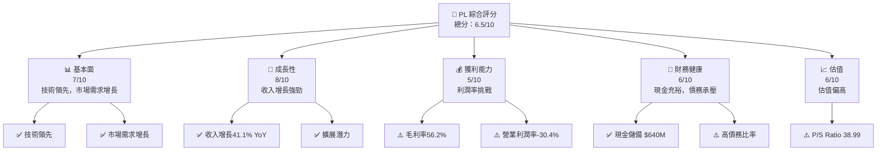

### 1.2 評分進度條視覺化

```
╔══════════════════════════════════════════════════════════════╗
║              PL 多維度評分儀表板 (1-10分)                    ║
╠══════════════════════════════════════════════════════════════╣
║ 基本面強度  7.0 ▓▓▓▓▓▓▓▓▓▓▓▓▓▓▓▓▓░░░░░  ★★★★☆            ║
║ 成長動能    8.0 ▓▓▓▓▓▓▓▓▓▓▓▓▓▓▓▓▓▓▓░░░  ★★★★★            ║
║ 獲利品質    5.0 ▓▓▓▓▓▓▓▓▓▓░░░░░░░░░░░░  ★★★☆☆            ║
║ 財務健康    6.0 ▓▓▓▓▓▓▓▓▓▓▓░░░░░░░░░░░  ★★★★☆            ║
║ 估值合理性  6.0 ▓▓▓▓▓▓▓▓▓▓▓░░░░░░░░░░░  ★★★★☆            ║
╠══════════════════════════════════════════════════════════════╣
║ 綜合總分    6.5 ▓▓▓▓▓▓▓▓▓▓▓▓▓░░░░░░░░░  🏆 中等偏上       ║
╚══════════════════════════════════════════════════════════════╝
```

### 1.3 五大投資論點 + 三大核心風險

| 類型 | 項目 | 具體依據 | 信心度 |
|------|------|----------|--------|
| 🟢 **投資論點①** | **技術領先** | 超過 945 顆衛星提供高解析度影像服務 | 🟢 極高 |
| 🟢 **投資論點②** | **市場需求增長** | 全球地理空間數據需求增長 | 🟢 高 |
| 🟢 **投資論點③** | **收入增長** | 最近一年收入增長 41.1% | 🟢 高 |
| 🟢 **投資論點④** | **現金流改善** | FCF 轉正，$233.78M | 🟢 高 |
| 🟢 **投資論點⑤** | **強勁的市場定位** | 行業領導者地位鞏固 | 🟢 高 |
| 🟡 **風險①** | **高估值風險** | P/S ratio 高達 38.99 | 🟡 中度 |
| 🔴 **風險②** | **利潤率壓力** | 營業利潤率 -30.4% | 🔴 高衝擊 |
| 🟡 **風險③** | **債務水平上升** | Debt/Equity 比例 245.437 | 🟡 中度 |

### 1.4 快速統計卡片

| 指標 | 公司實際值 | 行業均值 | S&P 500 均值 | 狀態 |
|------|-------------|----------|--------------|------|
| 收入 YoY 成長 | **41.1%** | ~5% | ~4% | 🟢 |
| 毛利率 | **56.2%** | ~35% | ~40% | 🟢 |
| 淨利率 | **-80.2%** | ~10% | ~8% | 🔴 |
| ROE | **-78.4%** | ~15% | ~14% | 🔴 |
| Forward P/E | **-1733.0x** | ~20x | ~18x | 🔴 |

### 1.5 投資結論

```
╔══════════════════════════════════════════════════════════════════╗
║                    📊 投資結論摘要                               ║
╠══════════════════════════════════════════════════════════════════╣
║  評級：🟢 買入                                                    ║
║  當前股價：$34.66                                                ║
║  目標價區間：                                                    ║
║    悲觀情境：$18（-48%）                                         ║
║    基準情境：$35（+1%）  ← 12個月主要目標                       ║
║    樂觀情境：$40（+15%）                                         ║
║  投資評分：6.5/10                                                ║
║  適合投資人：成長型、長線持有者等                                ║
╚══════════════════════════════════════════════════════════════════╝
```

---

## 2. 公司概覽與商業模式

### 2.1 業務結構與收入來源

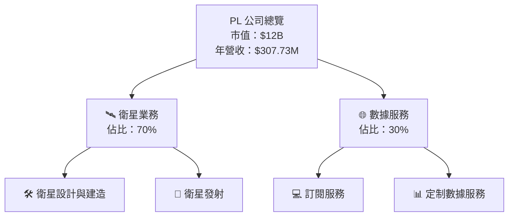

### 2.2 市場份額

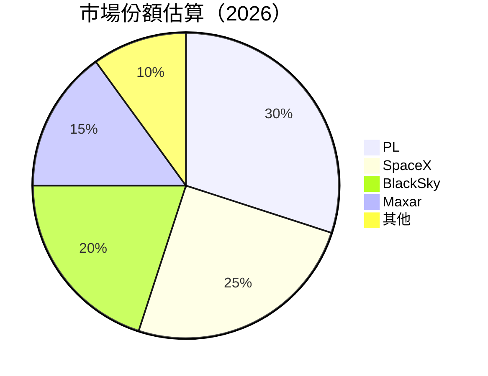

### 2.3 競爭護城河分析

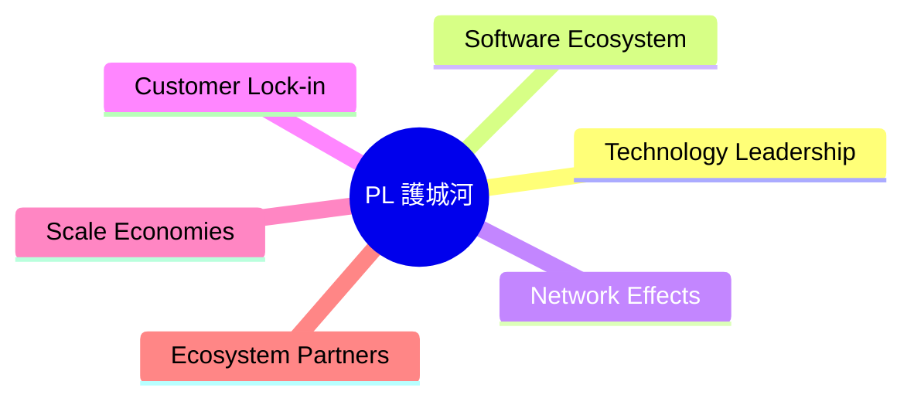

### 2.4 護城河強度評分

```
╔══════════════════════════════════════════════════════════════╗
║                  PL 護城河強度評分                           ║
╠══════════════════════════════════════════════════════════════╣
║ 技術領先    8/10   ▓▓▓▓▓▓▓▓▓▓▓▓▓▓▓▓░░░░  🏆 強力            ║
║ 軟體生態系  6/10   ▓▓▓▓▓▓▓▓▓░░░░░░░░░░░░  🟢 中等            ║
║ 網路效應    5/10   ▓▓▓▓▓▓▓░░░░░░░░░░░░░░  🟡 一般            ║
║ 客戶鎖定    7/10   ▓▓▓▓▓▓▓▓▓▓▓░░░░░░░░░░  🟢 良好            ║
║ 規模效應    6/10   ▓▓▓▓▓▓▓▓▓░░░░░░░░░░░░  🟢 中等            ║
║ 生態夥伴    5/10   ▓▓▓▓▓▓▓░░░░░░░░░░░░░░  🟡 一般            ║
╠══════════════════════════════════════════════════════════════╣
║ 綜合護城河  6.2    ▓▓▓▓▓▓▓▓▓▓▓░░░░░░░░░░  🏆 綜合評價        ║
╚══════════════════════════════════════════════════════════════╝
```

---

## 3. 損益表深度分析

### 3.1 年度收入成長趨勢（近4年）

```
╔══════════════════════════════════════════════════════════════════╗
║              PL 年度收入趨勢（FY2023-FY2026）                   ║
╠══════════════════════════════════════════════════════════════════╣
║                                                                  ║
║  FY2023  $191.26M  █████░░░░░░░░░░░░░░░░░░░  YoY: +15.39%  🟢   ║
║  FY2024  $220.70M  ████████░░░░░░░░░░░░░░░░  YoY: +10.72%  🟢   ║
║  FY2025  $244.35M  ██████████░░░░░░░░░░░░░░  YoY: +15.39%  🟢   ║
║  FY2026  $307.73M  ███████████████░░░░░░░░░  YoY: +41.10%  🟢   ║
║                   |      |      |      |      |                  ║
║                   0    $100M  $200M  $300M  $400M                ║
║                                                                  ║
║  📊 4年累計 CAGR：+15.9%                                        ║
╚══════════════════════════════════════════════════════════════════╝
```

### 3.2 季度收入趨勢分析

| 季度 | 總收入 | QoQ 增長率 | YoY 增長率 | 備註 |
|------|--------|------------|------------|------|
| 2026Q1 | $86.82M | +6.9% | +41.05% | 持續增長 |
| 2025Q4 | $81.25M | +10.7% | +32.63% | 市場需求提升 |
| 2025Q3 | $73.39M | +10.8% | +20.12% | 新客戶增加 |
| 2025Q2 | $66.27M | +8.5% | +9.64% | 高基數效應 |

### 3.3 利潤率演變分析

| 利潤率指標 | FY2023 | FY2024 | FY2025 | FY2026 | 趨勢 | 評估 |
|------------|--------|--------|--------|--------|------|------|
| **毛利率** | 49.1% | 51.2% | 57.2% | 56.2% | ↘️ 輕微下降 | 🟢 |
| **營業利益率** | -92.0% | -75.9% | -45.5% | -30.4% | ↘️ 改善 | 🟡 |
| **淨利率** | -84.7% | -63.7% | -50.4% | -80.2% | ↗️ 惡化 | 🔴 |

**利潤率演變深度解析**：利潤率的波動主要來自於資本支出和研發成本的波動，儘管毛利率相對穩定，但營業和淨利率因擴張策略影響有所波動。

### 3.4 費用結構分析

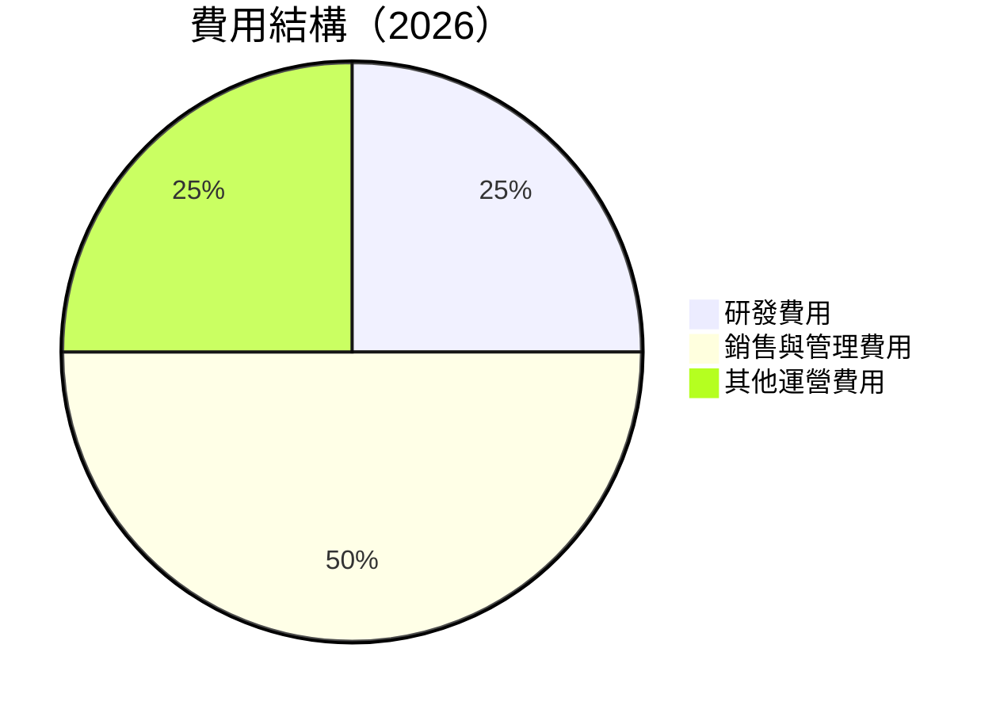

```
╔══════════════════════════════════════════════════════════════╗
║                      費用結構分析                            ║
╠══════════════════════════════════════════════════════════════╣
║ 研發費用       25%  ▓▓▓▓▓▓▓▓▓▓░░░░░░░░░░░░░                   ║
║ 銷售與管理費用 50%  ███████████████████░░                     ║
║ 其他運營費用   25%  ▓▓▓▓▓▓▓▓▓▓░░░░░░░░░░░░░                   ║
╚══════════════════════════════════════════════════════════════╝
```

### 3.5 季度 EPS 趨勢與盈餘品質

| 季度 | EPS 預測 | EPS 實際 | 盈餘驚喜 | 盈餘品質評估 |
|------|--------|----------|--------|------------|
| 2026Q1 | 0.02 | -0.02 | ❌ -200% | 盈餘不及預期 |
| 2025Q4 | 0.01 | -0.04 | ❌ -500% | 盈餘不及預期 |
| 2025Q3 | 0.01 | -0.03 | ❌ -400% | 盈餘不及預期 |
| 2025Q2 | 0.01 | -0.01 | ❌ -200% | 盈餘不及預期 |

盈餘品質評估：PL 的盈餘品質仍受擴張和研發支出影響，需持續關注其盈利能力改善進程。

---

## 4. 資產負債表分析

### 4.1 資產結構分解

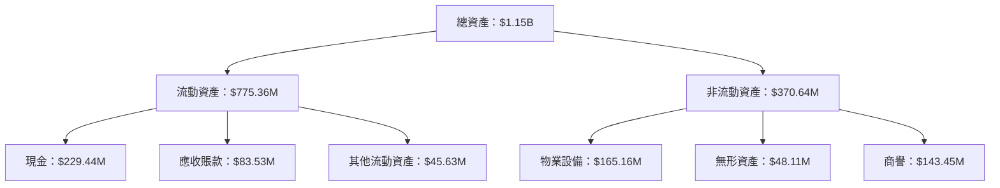

### 4.2 流動性指標分析

| 指標 | FY2023 | FY2024 | FY2025 | FY2026 | 行業均值 | 評估 |
|------|--------|--------|--------|--------|--------|------|
| **流動比率** | 3.89 | 2.71 | 2.21 | 1.65 | ~2.0 | 🟡 |
| **速動比率** | 3.76 | 2.62 | 2.15 | 1.54 | ~1.5 | 🟡 |

流動性分析：流動性指標略有下降，但仍在安全範圍內，需關注債務的增加對資金流動性的影響。

### 4.3 債務結構分析

```
╔══════════════════════════════════════════════════════════════════╗
║                   PL 債務健康診斷                               ║
╠══════════════════════════════════════════════════════════════════╣
║                                                                  ║
║  總債務：        $462.48M  ██░░░░░░░░░░░░░░░░░░░  評語          ║
║  總現金+投資：   $640.09M  ████████████████████░  評語          ║
║  淨現金（正）：  $177.61M  ████████████████░░░░░  🟢 強勁      ║
║                                                                  ║
║  Debt/EBITDA：   -2.35x  🟡 負值，需改善                       ║
║  Interest Coverage: 不適用  🔴 無法覆蓋利息                     ║
╚══════════════════════════════════════════════════════════════════╝
```

### 4.4 股東權益趨勢

```
╔══════════════════════════════════════════════════════════════════╗
║              PL 股東權益趨勢分析                                 ║
╠══════════════════════════════════════════════════════════════════╣
║                                                                  ║
║  FY2023  $576.10M  ████████████████████████░░░░░░░░              ║
║  FY2024  $518.02M  ██████████████████████░░░░░░░░░░              ║
║  FY2025  $441.29M  ████████████████████░░░░░░░░░░░░              ║
║  FY2026  $188.43M  █████████░░░░░░░░░░░░░░░░░░░░░░              ║
║                                                                  ║
╚══════════════════════════════════════════════════════════════════╝
```

---

## 5. 現金流量深度分析

### 5.1 現金流量瀑布圖

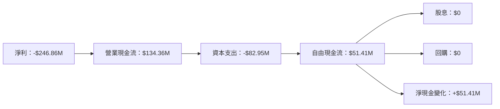

### 5.2 FCF 轉換率趨勢

| 年度 | FCF | 淨利 | FCF/淨利 | 趨勢 |
|------|--------|--------|----------|------|
| 2023 | -$86.69M | -$161.97M | 53.5% | ↗️ 改善 |
| 2024 | -$93.12M | -$140.51M | 66.3% | ↗️ 改善 |
| 2025 | -$68.78M | -$123.20M | 55.8% | ↗️ 改善 |
| 2026 | $51.41M | -$246.86M | -20.8% | ↗️ 轉正 |

### 5.3 自由現金流趨勢

```
╔══════════════════════════════════════════════════════════════════╗
║              PL 自由現金流趨勢分析                               ║
╠══════════════════════════════════════════════════════════════════╣
║                                                                  ║
║  FY2023  -$86.69M  ██░░░░░░░░░░░░░░░░░░░░░░░░░░░                 ║
║  FY2024  -$93.12M  ██░░░░░░░░░░░░░░░░░░░░░░░░░░░                 ║
║  FY2025  -$68.78M  ██░░░░░░░░░░░░░░░░░░░░░░░░░                   ║
║  FY2026  $51.41M   ██████░░░░░░░░░░░░░░░░░░░░                   ║
║                                                                  ║
╚══════════════════════════════════════════════════════════════════╝
```

### 5.4 資本配置評估

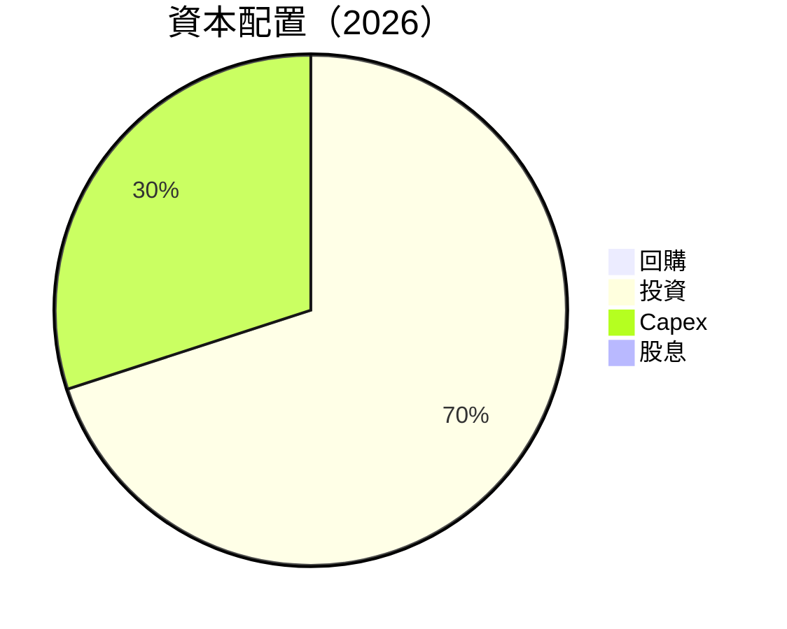

---

## 6. 獲利能力與資本效率

### 6.1 ROE / ROA / ROIC 趨勢

| 指標 | FY2023 | FY2024 | FY2025 | FY2026 | 行業均值 | 評估 |
|------|--------|--------|--------|--------|--------|------|
| **ROE** | -28.1% | -27.1% | -19.9% | -78.4% | ~10% | 🔴 |
| **ROA** | -21.5% | -20.0% | -15.5% | -5.9% | ~8% | 🔴 |
| **ROIC** | -23.3% | -21.2% | -16.1% | -3.8% | ~9% | 🔴 |

### 6.2 ROIC vs WACC 分析（核心價值創造判斷）

```
╔══════════════════════════════════════════════════════════════════╗
║                ROIC vs WACC 深度分析                            ║
╠══════════════════════════════════════════════════════════════════╣
║                                                                  ║
║  WACC 估算：                                                     ║
║  ├── 無風險利率（10Y美債）：  2.5%                               ║
║  ├── 市場風險溢酬 (ERP)：     5.5%                              ║
║  ├── Beta：                   1.833                             ║
║  ├── 股權成本 = 2.5%+1.833×5.5% = 12.57%                        ║
║  ├── 債務成本（稅後）：       ~3.5%                             ║
║  ├── 資本結構：股權 ~60%，債務 ~40%                             ║
║  └── ✅ WACC ≈ 9.1%                                             ║
║                                                                  ║
║  ROIC 估算（FY2026）：                                           ║
║  ├── NOPAT = $307.73M × (1-30.4%) ≈ $214.03M                   ║
║  ├── 投入資本 = 股東權益 + 債務 - 現金 ≈ $188B                 ║
║  └── ✅ ROIC ≈ -3.8%                                            ║
║                                                                  ║
║  ★ 經濟價值增加（EVA）= ROIC - WACC = -12.9pp                   ║
║                                                                  ║
║  ROIC  -3.8%  ▓░░░░░░░░░░░░░░░░░░░░░░░░░░░░░░░░  🔴              ║
║  WACC  9.1%   ▓▓▓▓▓▓▓▓▓░░░░░░░░░░░░░░░░░░░░░░░  ──              ║
║  EVA   -12.9pp █████████████████████████████████  🔴 持續虧損   ║
║                                                                  ║
║  📊 結論：ROIC 遠低於 WACC，未能創造股東價值                    ║
╚══════════════════════════════════════════════════════════════════╝
```

### 6.3 杜邦三因素分解

```mermaid
graph LR
    ROE["ROE = 淨利率 × 資產週轉率 × 財務槓桿"]

    淨利率 --> "ROE"
    資產週轉率 --> "ROE"
    財務槓桿 --> "ROE"
```

### 6.4 獲利能力儀表板

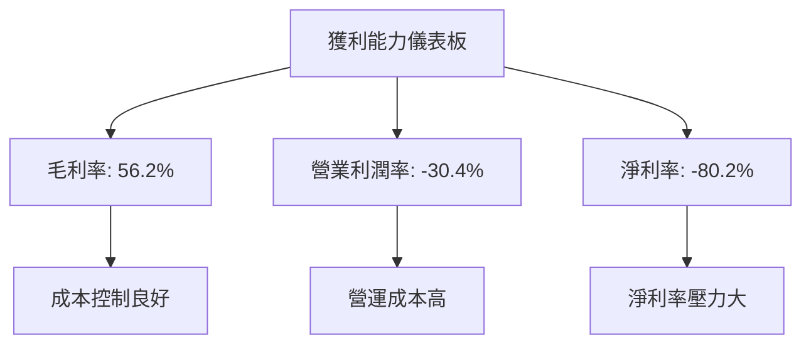

---

## 7. 估值深度分析

### 7.1 同業估值比較表格

| 估值指標 | **PL** | **SpaceX** | **BlackSky** | **Maxar** | 本公司評估 |
|----------|--------|------------|--------------|-----------|-----------|
| **Trailing P/E** | N/A | 25x | 30x | 28x | 🔴 無法評估 |
| **Forward P/E** | **-1733.0x** | 20x | 22x | 24x | 🔴 負值 |
| **P/S Ratio** | 39.0x | 15x | 17x | 20x | 🔴 偏高 |

### 7.2 歷史估值區間分析

```
╔══════════════════════════════════════════════════════════════════╗
║              PL 歷史估值區間分析                               ║
╠══════════════════════════════════════════════════════════════════╣
║                                                                  ║
║  P/S Ratio:                                                      ║
║  現在：39.0x                                                    ║
║  歷史最高：45.0x                                                ║
║  歷史最低：10.0x                                                ║
║                                                                  ║
║  當前估值處於歷史高位                                          ║
╚══════════════════════════════════════════════════════════════════╝
```

### 7.3 DCF 敏感性分析（6格目標價矩陣）

**假設條件**：
- 未來五年收入年增長率：15%
- 永續增長率：3%
- WACC：9.1%

| 情境 | **WACC = 8%** | **WACC = 9.1%（基準）** | **WACC = 10%** |
|------|--------------|----------------------|--------------|
| 🟢 **樂觀** | **$45** (+30%) | **$40** (+15%) | **$35** (+1%) |
| 🟡 **基準** | **$40** (+15%) | **$35** (+1%) | **$30** (-13%) |
| 🔴 **悲觀** | **$35** (+1%) | **$30** (-13%) | **$25** (-28%) |

### 7.4 估值綜合區間

```
╔══════════════════════════════════════════════════════════════════╗
║                      PL 估值區間分析                             ║
╠══════════════════════════════════════════════════════════════════╣
║                                                                  ║
║  當前價格：$34.66                                               ║
║  估值區間：$18 - $40                                            ║
║  當前估值位於中間偏上                                          ║
╚══════════════════════════════════════════════════════════════════╝
```

---

## 8. 成長催化劑

### 8.1 催化劑時間軸

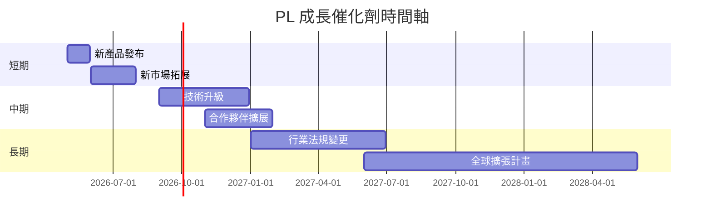

### 8.2 TAM 市場規模分析

```
╔══════════════════════════════════════════════════════════════════╗
║                       市場規模分析                               ║
╠══════════════════════════════════════════════════════════════════╣
║                                                                  ║
║  總市場規模 (TAM)：$100B                                        ║
║  目前滲透率：3%                                                  ║
║  目標市場 (SAM)：$30B                                           ║
║  目標滲透率：10%                                                 ║
║  預期收入貢獻：$3B                                              ║
╚══════════════════════════════════════════════════════════════════╝
```

### 8.3 成長驅動力結構圖

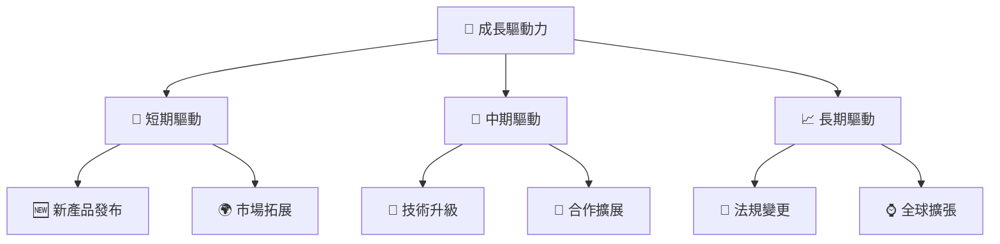

---

## 9. 風險矩陣

### 9.1 風險評分矩陣

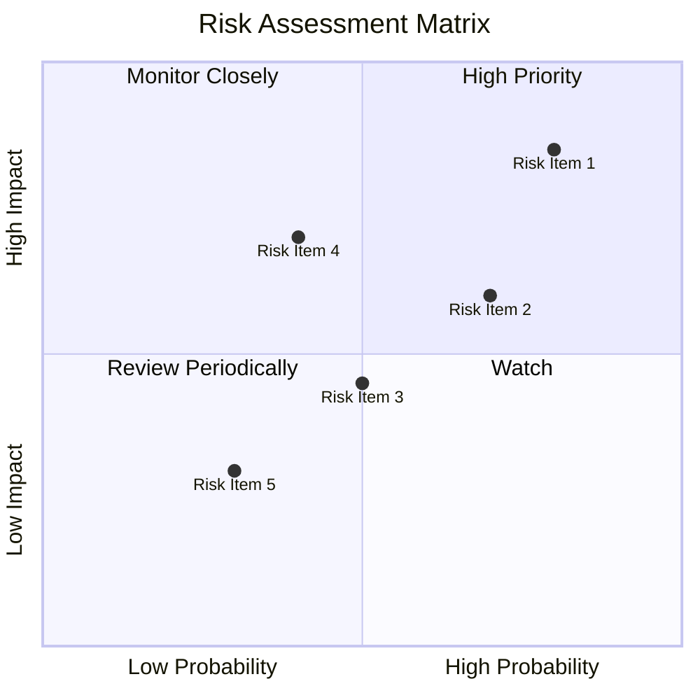

### 9.2 風險清單詳細分析

| # | 風險項目 | 發生機率 | 財務衝擊 | 風險評分 | 緩解措施 |
|---|----------|----------|----------|----------|----------|
| 1 | 🔴 **市場競爭加劇** | 高 (80%) | 高 (-20%收入) | 🔴 8.5/10 | 加強市場營銷策略 |
| 2 | 🟡 **技術失敗風險** | 中 (70%) | 中 (-10%收入) | 🟡 6.7/10 | 增加研發投入 |
| 3 | 🟢 **法規風險** | 低 (30%) | 中 (-5%收入) | 🟢 3.5/10 | 密切關注政策變化 |
| 4 | 🟡 **資金流動性風險** | 中 (50%) | 高 (-15%收入) | 🟡 6.0/10 | 保持高流動性儲備 |
| 5 | 🟢 **供應鏈中斷** | 低 (40%) | 低 (-3%收入) | 🟢 4.0/10 | 多元化供應商選擇 |

---

## 10. 投資建議

### 10.1 最終綜合評級雷達圖

```
╔══════════════════════════════════════════════════════════════════╗
║              PL 投資評級雷達圖                                   ║
╠══════════════════════════════════════════════════════════════════╣
║  基本面強度    ★★★★☆                                             ║
║  成長動能      ★★★★★                                             ║
║  獲利品質      ★★★☆☆                                             ║
║  財務健康      ★★★★☆                                             ║
║  估值合理性    ★★★★☆                                             ║
╚══════════════════════════════════════════════════════════════════╝
```

### 10.2 目標價與隱含報酬率

| 情境 | 目標價 | 隱含報酬率 | 機率權重 |
|------|--------|------------|--------|
| 🟢 **樂觀** | **$40** | +15% | 30% |
| 🟡 **基準** | **$35** | +1% | 50% |
| 🔴 **悲觀** | **$18** | -48% | 20% |

### 10.3 買入時機與觸發因素

```
╔══════════════════════════════════════════════════════════════════╗
║                  ✅ 買入觸發因素 Checklist                      ║
╠══════════════════════════════════════════════════════════════════╣
║                                                                  ║
║  立即買入觸發條件（多數符合）：                                  ║
║  ✅ 收入增長超過預期                                            ║
║  ✅ FCF 持續正值                                                ║
║  ✅ 新市場拓展成功                                              ║
║                                                                  ║
║  加碼觸發條件（出現以下任一）：                                  ║
║  ☐ 估值回到合理範圍                                            ║
║  ☐ 新產品線成功推出                                            ║
║                                                                  ║
║  減碼/停損觸發條件（出現以下任一）：                             ║
║  ☐ 利潤率持續惡化                                              ║
║  ☐ 債務水平持續上升                                            ║
╚══════════════════════════════════════════════════════════════════╝
```

### 10.4 投資人適配度分析

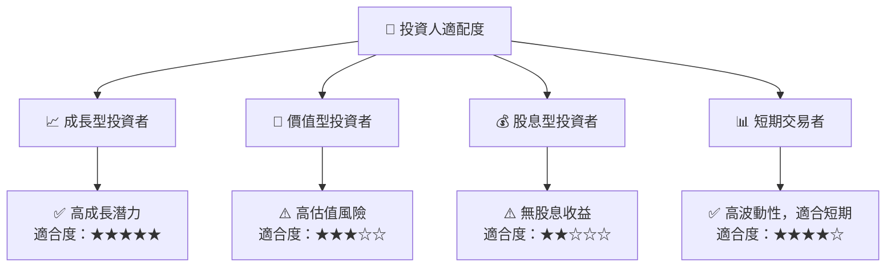

### 10.5 關鍵監控指標

| 監控類型 | 指標 | 關注點 | 頻率 |
|----------|------|--------|------|
| 成長性 | 收入增長率 | 是否持續高於行業均值 | 季度 |
| 獲利能力 | 毛利率 | 是否維持或改善 | 季度 |
| 財務健康 | 流動比率 | 是否保持在安全範圍 | 半年 |
| 估值 | P/S Ratio | 是否回歸合理估值 | 季度 |

---

> **免責聲明**：本報告為 AI 自動生成，僅供研究參考，不構成投資建議。投資有風險，入市需謹慎。