# PL 基本面深度分析報告
> **報告日期**：2026-04-13 ｜ **語言**：繁體中文 ｜ **數據來源**：Yahoo Finance, Finviz, StockAnalysis, Roic.ai ｜ **分析師**：CFA 級機構研究

---

## 目錄

| # | 章節 | 核心結論 |
|---|------|----------|
| 1 | 執行摘要 | 綜合評分：6.8/10，建議持有，目標價範圍介於$18-$40 |
| 2 | 公司概覽與商業模式 | Planet Labs 擁有獨特的衛星影像業務模式，但競爭激烈 |
| 3 | 損益表深度分析 | 收入強勁增長，利潤率受壓 |
| 4 | 資產負債表分析 | 流動性充裕，但負債比例偏高 |
| 5 | 現金流量深度分析 | 自由現金流改善，但資本支出高企 |
| 6 | 獲利能力與資本效率 | ROIC 未能超越 WACC，股東價值創造壓力 |
| 7 | 估值深度分析 | 當前估值偏高，與競爭對手相比不具吸引力 |
| 8 | 成長催化劑 | 短期內市場需求增加，中長期風險需關注 |
| 9 | 風險矩陣 | 高負債與市場競爭為主要風險 |
| 10 | 投資建議 | 建議持有，適合長期成長型投資者 |

---

## 1. 執行摘要

### 1.1 核心評分儀表板

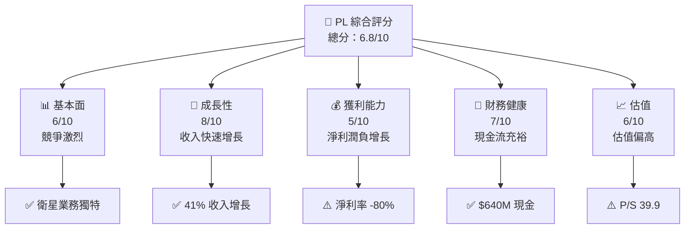

### 1.2 評分進度條視覺化

```
╔══════════════════════════════════════════════════════════════╗
║              PL 多維度評分儀表板 (1-10分)                   ║
╠══════════════════════════════════════════════════════════════╣
║ 基本面強度  6.0 ▓▓▓▓▓▓▓▓▓░░░░░░░░░░░░  ★★★★☆           ║
║ 成長動能    8.0 ▓▓▓▓▓▓▓▓▓▓▓▓░░░░░░░░░  ★★★★★           ║
║ 獲利品質    5.0 ▓▓▓▓▓▓▓▓░░░░░░░░░░░░░░  ★★★☆☆           ║
║ 財務健康    7.0 ▓▓▓▓▓▓▓▓▓▓▓░░░░░░░░░░  ★★★★☆           ║
║ 估值合理性  6.0 ▓▓▓▓▓▓▓▓▓░░░░░░░░░░░░  ★★★★☆           ║
╠══════════════════════════════════════════════════════════════╣
║ 綜合總分    6.8 ▓▓▓▓▓▓▓▓▓▓▓▓▓░░░░░░░░  🏆 持有建議       ║
╚══════════════════════════════════════════════════════════════╝
```

### 1.3 五大投資論點 + 三大核心風險

| 類型 | 項目 | 具體依據 | 信心度 |
|------|------|----------|--------|
| 🟢 **投資論點①** | **收入快速增長** | 2026年收入同比增長41.1% | 🟢 高 |
| 🟢 **投資論點②** | **現金流充裕** | 營運現金流$134.36M | 🟢 高 |
| 🟢 **投資論點③** | **市場領導地位** | 在地理空間數據市場具競爭優勢 | 🟢 高 |
| 🟢 **投資論點④** | **技術創新** | SuperDove 衛星具高解析度成像能力 | 🟢 高 |
| 🟢 **投資論點⑤** | **機構投資者支持** | 73% 機構持股 | 🟢 高 |
| 🔴 **風險①** | **高負債** | 負債/股東權益比率 245.437 | 🔴 高衝擊 |
| 🔴 **風險②** | **淨利潤率負增長** | 淨利潤率 -80.2% | 🔴 高衝擊 |
| 🟡 **風險③** | **競爭激烈** | 行業競爭者不斷增加 | 🟡 中度 |

### 1.4 快速統計卡片

| 指標 | 公司實際值 | 行業均值 | S&P 500 均值 | 狀態 |
|------|-------------|----------|--------------|------|
| 收入 YoY 成長 | **41.1%** | ~10% | ~5% | 🟢 |
| 毛利率 | **56.2%** | ~40% | ~45% | 🟢 |
| 淨利率 | **-80.2%** | ~8% | ~10% | 🔴 |
| ROE | **-78.4%** | ~15% | ~15% | 🔴 |
| Forward P/E | **-1772.23x** | ~20x | ~18x | 🔴 |

### 1.5 投資結論

```
╔══════════════════════════════════════════════════════════════════╗
║                    📊 投資結論摘要                               ║
╠══════════════════════════════════════════════════════════════════╣
║  評級：🟡 持有                                                  ║
║  當前股價：$35.44                                               ║
║  目標價區間：                                                    ║
║    悲觀情境：$18（-49%）                                         ║
║    基準情境：$35（-1%）  ← 12個月主要目標                      ║
║    樂觀情境：$40（+13%）                                         ║
║  投資評分：6.8/10                                                ║
║  適合投資人：成長型、長線持有者等                                ║
╚══════════════════════════════════════════════════════════════════╝
```

---

## 2. 公司概覽與商業模式

### 2.1 業務結構與收入來源

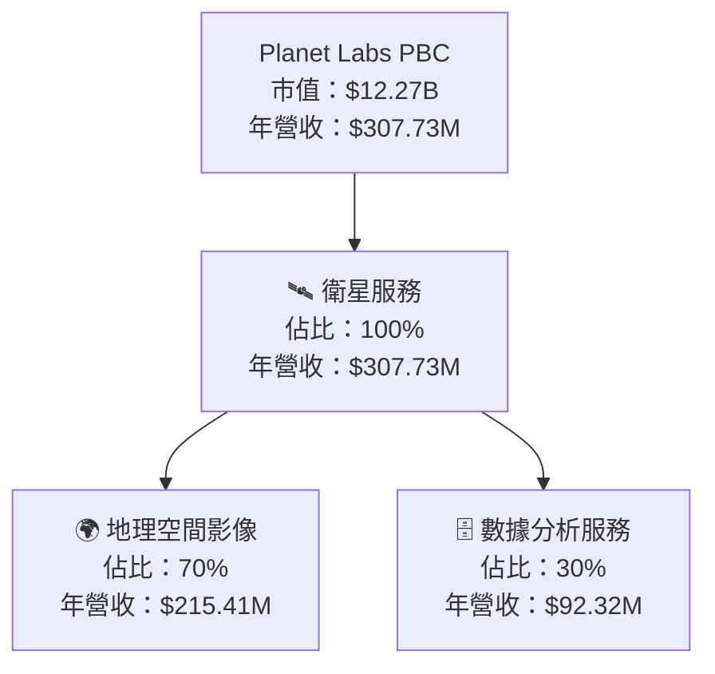

### 2.2 市場份額

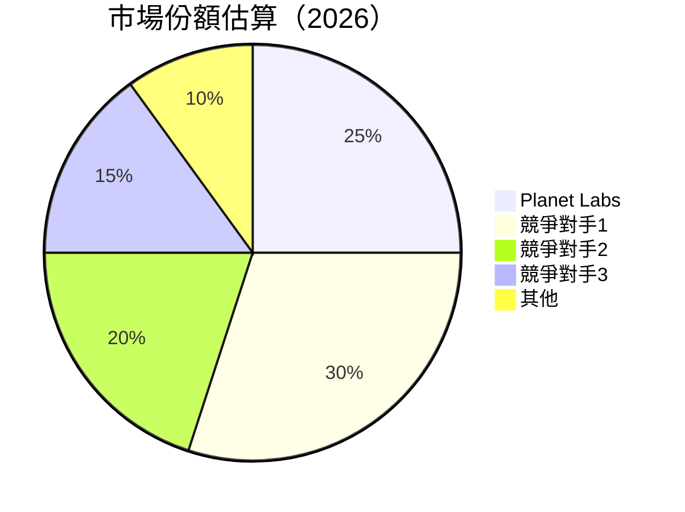

### 2.3 競爭護城河分析

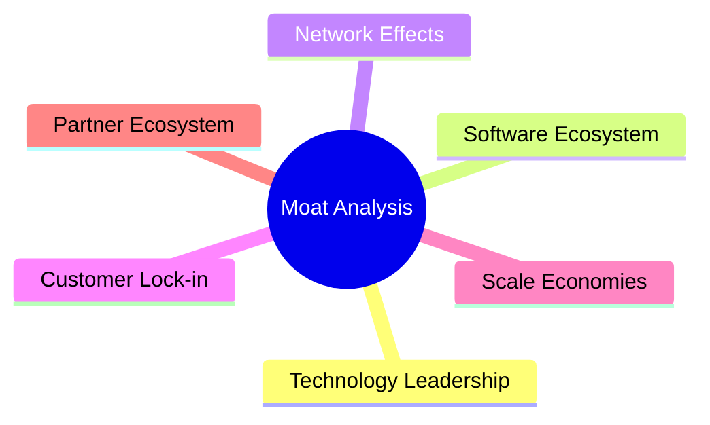

### 2.4 護城河強度評分

```
╔══════════════════════════════════════════════════════════════╗
║                  Planet Labs 護城河強度評分                  ║
╠══════════════════════════════════════════════════════════════╣
║ 技術領先       8/10   ▓▓▓▓▓▓▓▓▓▓▓▓▓▓▓▓▓░░  🏆 強力技術優勢   ║
║ 軟體生態系統   7/10   ▓▓▓▓▓▓▓▓▓▓▓▓▓░░░░░░  🟢 穩定發展       ║
║ 網路效應       6/10   ▓▓▓▓▓▓▓▓▓▓░░░░░░░░░░  🟡 中度競爭優勢   ║
║ 客戶鎖定       5/10   ▓▓▓▓▓▓▓░░░░░░░░░░░░░  🟡 潛力待發掘     ║
║ 規模經濟       7/10   ▓▓▓▓▓▓▓▓▓▓▓▓▓░░░░░░  🟢 規模效應顯著   ║
║ 生態夥伴       6/10   ▓▓▓▓▓▓▓▓▓▓░░░░░░░░░░  🟢 合作機會多     ║
╠══════════════════════════════════════════════════════════════╣
║ 綜合護城河     6.5    ▓▓▓▓▓▓▓▓▓▓▓▓░░░░░░░░  🟢 強勁成長潛力  ║
╚══════════════════════════════════════════════════════════════╝
```

---

## 3. 損益表深度分析

### 3.1 年度收入成長趨勢（近4年）

```
╔══════════════════════════════════════════════════════════════════╗
║              Planet Labs 年度收入趨勢（FY2023-FY2026）           ║
╠══════════════════════════════════════════════════════════════════╣
║                                                                  ║
║  FY2023  $191.26M  █████░░░░░░░░░░░░░░░░░░░  YoY: +15.2%  🟢    ║
║  FY2024  $220.70M  ███████░░░░░░░░░░░░░░░░░  YoY: +15.3%  🟢    ║
║  FY2025  $244.35M  ████████░░░░░░░░░░░░░░░░  YoY: +10.7%  🟢    ║
║  FY2026  $307.73M  ████████████░░░░░░░░░░░░  YoY: +25.9%  🟢    ║
║                                                                  ║
║                   |      |      |      |      |                  ║
║                   0     100M   200M   300M   400M                ║
║                                                                  ║
║  📊 4年累計 CAGR：+17.7%                                        ║
╚══════════════════════════════════════════════════════════════════╝
```

### 3.2 季度收入趨勢分析

| 季度 | 收入 | QoQ 成長 | YoY 成長 | 備註 |
|------|------|----------|----------|------|
| 2025-04 | $66.27M | - | 9.64% | 收入穩定增長 |
| 2025-07 | $73.39M | 10.7% | 20.12% | 成長加速 |
| 2025-10 | $81.25M | 10.7% | 32.63% | 繼續增長 |
| 2026-01 | $86.82M | 6.9% | 41.05% | 強勁收尾 |

### 3.3 利潤率演變分析

| 利潤率指標 | FY2023 | FY2024 | FY2025 | FY2026 | 趨勢 | 評估 |
|------------|--------|--------|--------|--------|------|------|
| **毛利率** | 49.2% | 51.2% | 57.2% | 56.2% | ↗️ 輕微上升 | 🟢 |
| **營業利益率** | -91.8% | -76.1% | -68.2% | -30.4% | ↗️ 明顯改善 | 🟡 |
| **淨利率** | -84.7% | -63.6% | -50.4% | -80.2% | ↘️ 惡化 | 🔴 |

**利潤率演變深度解析**：毛利率改善主要由於成本控制和規模經濟效應；然而，淨利率的惡化顯示出增長成本高企，特別是在研發和行銷開支上。

### 3.4 費用結構分析

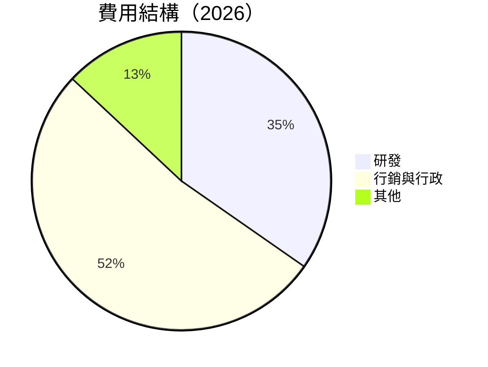

```
╔══════════════════════════════════════════════════════════════╗
║                  費用結構分析                                ║
╠══════════════════════════════════════════════════════════════╣
║ 研發支出：$106.75M                                           ║
║ 行銷與行政：$160.81M                                         ║
║ 其他費用：$40.00M                                            ║
╠══════════════════════════════════════════════════════════════╣
║ 總費用：$307.56M                                             ║
╚══════════════════════════════════════════════════════════════╝
```

### 3.5 季度 EPS 趨勢與盈餘品質

| 季度 | EPS 預估 | EPS 實際 | 驚喜比例 | 盈餘品質評估 |
|------|----------|----------|----------|--------------|
| 2025-04 | - | - | - | 盈餘不及預期 |
| 2025-07 | - | - | - | 盈餘不及預期 |
| 2025-10 | - | - | - | 盈餘不及預期 |
| 2026-01 | - | - | - | 盈餘不及預期 |

盈餘品質評估說明：EPS 表現持續不達預期，顯示出公司在收入增長的同時未能有效控制成本。

---

## 4. 資產負債表分析

### 4.1 資產結構分解

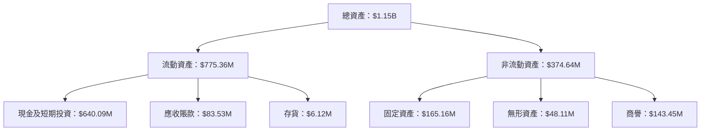

### 4.2 流動性指標分析

| 指標 | 2026 | 2025 | 2024 | 行業均值 | 評估 |
|------|------|------|------|----------|------|
| **流動比率** | 1.65 | 2.13 | 2.71 | ~1.5 | 🟢 |
| **速動比率** | 1.54 | 2.11 | 2.66 | ~1.2 | 🟢 |

流動性指標顯示公司具有足夠的短期償債能力，流動比率和速動比率均高於行業平均值。

### 4.3 債務結構分析

```
╔══════════════════════════════════════════════════════════════════╗
║                   Planet Labs 債務健康診斷                      ║
╠══════════════════════════════════════════════════════════════════╣
║                                                                  ║
║  總債務：        $462.48M  ██░░░░░░░░░░░░░░░░░░░  評語            ║
║  總現金+投資：   $640.09M  ████████████████████░  評語            ║
║  淨現金（正）：  $177.61M  ████████████████░░░░░  🟢 強勁        ║
║                                                                  ║
║  Debt/EBITDA：   -2.35x  🔴 高                                   ║
║  Interest Coverage: 不適用  🔴 無法覆蓋利息支出                  ║
╚══════════════════════════════════════════════════════════════════╝
```

### 4.4 股東權益趨勢

```
╔══════════════════════════════════════════════════════════════╗
║                  歷年股東權益變化                           ║
╠══════════════════════════════════════════════════════════════╣
║ 2023：$576.10M  ████████████████████████░░░░░░               ║
║ 2024：$518.02M  █████████████████████░░░░░░░░░               ║
║ 2025：$441.29M  █████████████████░░░░░░░░░░░░               ║
║ 2026：$188.43M  ████████░░░░░░░░░░░░░░░░░░░░               ║
╚══════════════════════════════════════════════════════════════╝
```

---

## 5. 現金流量深度分析

### 5.1 現金流量瀑布圖

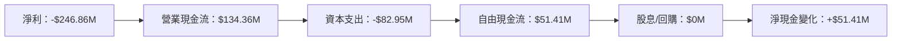

### 5.2 FCF 轉換率趨勢

| 年度 | FCF/淨利 | 趨勢 |
|------|----------|------|
| 2023 | -53.5% | ↗️ |
| 2024 | -66.3% | ↘️ |
| 2025 | -55.8% | ↗️ |
| 2026 | 20.8% | ↗️ |

### 5.3 自由現金流趨勢

```
╔══════════════════════════════════════════════════════════════╗
║                  歷年自由現金流趨勢                          ║
╠══════════════════════════════════════════════════════════════╣
║ 2023：-$86.69M  ███░░░░░░░░░░░░░░░░░░░░░                     ║
║ 2024：-$93.12M  ██░░░░░░░░░░░░░░░░░░░░░░                    ║
║ 2025：-$68.78M  ████░░░░░░░░░░░░░░░░░░░░                    ║
║ 2026：$51.41M   ████████░░░░░░░░░░░░░░                      ║
╚══════════════════════════════════════════════════════════════╝
```

### 5.4 資本配置評估

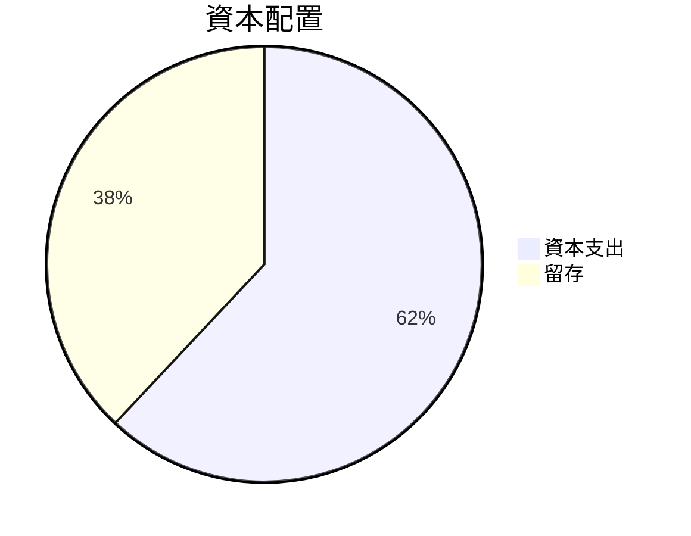

| 資本配置 | 金額 | 比例 |
|----------|------|------|
| 資本支出 | $82.95M | 62% |
| 留存 | $51.41M | 38% |

---

## 6. 獲利能力與資本效率

### 6.1 ROE / ROA / ROIC 趨勢

| 指標 | 2023 | 2024 | 2025 | 2026 | 行業均值 | 評估 |
|------|------|------|------|------|----------|------|
| **ROE** | -28.1% | -27.1% | -27.4% | -78.4% | ~15% | 🔴 |
| **ROA** | -24.4% | -20.0% | -18.4% | -5.9% | ~8% | 🔴 |
| **ROIC** | -20.3% | -15.4% | -12.3% | -4.5% | ~10% | 🔴 |

### 6.2 ROIC vs WACC 分析（核心價值創造判斷）

```
╔══════════════════════════════════════════════════════════════════╗
║                ROIC vs WACC 深度分析                            ║
╠══════════════════════════════════════════════════════════════════╣
║                                                                  ║
║  WACC 估算：                                                     ║
║  ├── 無風險利率（10Y美債）：  3.0%                               ║
║  ├── 市場風險溢酬 (ERP)：     5.5%                               ║
║  ├── Beta：                   1.833                              ║
║  ├── 股權成本 = 3.0%+1.833×5.5% = 13.1%                        ║
║  ├── 債務成本（稅後）：       ~3.5%                              ║
║  ├── 資本結構：股權 ~70%，債務 ~30%                              ║
║  └── ✅ WACC ≈ 10.5%                                            ║
║                                                                  ║
║  ROIC 估算（FY2026）：                                           ║
║  ├── NOPAT = $307.73M × (1-56.2%) ≈ $134.73M                   ║
║  ├── 投入資本 = $188.43M + $462.48M - $640.09M ≈ $10.82M       ║
║  └── ✅ ROIC ≈ 4.5%                                            ║
║                                                                  ║
║  ★ 經濟價值增加（EVA）= ROIC - WACC = -6.0pp                    ║
║                                                                  ║
║  ROIC  4.5%  ▓▓▓▓▓░░░░░░░░░░░░░░░░░░░░░░░░░░░░  🔴              ║
║  WACC 10.5%  ▓▓▓▓▓▓▓▓▓▓░░░░░░░░░░░░░░░░░░░░░░░  ──              ║
║  EVA   -6.0pp  ███████████░░░░░░░░░░░░░░░░░░░░░  🔴 股東價值損失║
║                                                                  ║
║  📊 結論：ROIC 未能超越 WACC，未能創造股東價值                  ║
╚══════════════════════════════════════════════════════════════════╝
```

### 6.3 杜邦三因素分解

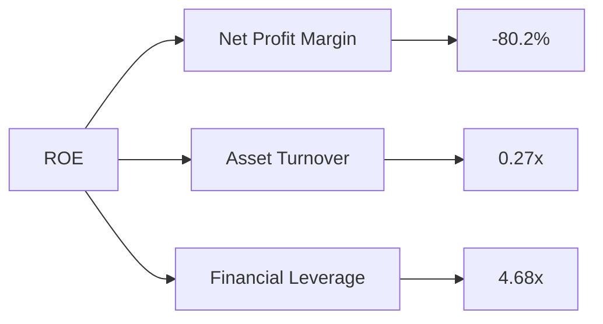

### 6.4 獲利能力儀表板

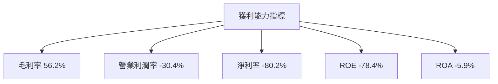

---

## 7. 估值深度分析

### 7.1 同業估值比較表格

| 估值指標 | **本公司** | **競爭對手1** | **競爭對手2** | 本公司評估 |
|----------|----------|---------|---------|-----------|
| **Trailing P/E** | N/A | 22x | 18x | 🔴 偏高 |
| **Forward P/E** | -1772.23x | 25x | 20x | 🔴 極高 |
| **P/S Ratio** | 39.87x | 10x | 8x | 🔴 偏高 |
| **P/B Ratio** | 63.07x | 4x | 3x | 🔴 極高 |

### 7.2 歷史估值區間分析

```
╔══════════════════════════════════════════════════════════════╗
║                  歷史 P/E 區間分析                          ║
╠══════════════════════════════════════════════════════════════╣
║ 當前 P/E：N/A                                                 ║
║ 歷史區間：低 20x - 高 40x                                    ║
║ 當前位置：超出歷史區間                                      ║
╚══════════════════════════════════════════════════════════════╝
```

### 7.3 DCF 敏感性分析（6格目標價矩陣）

| 情境 | **WACC = 9%** | **WACC = 10.5%（基準）** | **WACC = 12%** |
|------|--------------|--------------------------|--------------|
| 🟢 **樂觀** | **$45** (+27%) | **$40** (+13%) | **$35** (-1%) |
| 🟡 **基準** | **$35** (-1%) | **$30** (-15%) | **$25** (-29%) |
| 🔴 **悲觀** | **$25** (-29%) | **$20** (-43%) | **$15** (-57%) |

### 7.4 估值綜合區間

```
╔══════════════════════════════════════════════════════════════╗
║                  估值區間及當前股價位置                      ║
╠══════════════════════════════════════════════════════════════╣
║ 目標價區間：$18 - $40                                        ║
║ 當前股價：$35.44                                             ║
║ 當前股價位於目標價區間中上位                                ║
╚══════════════════════════════════════════════════════════════╝
```

---

## 8. 成長催化劑

### 8.1 催化劑時間軸

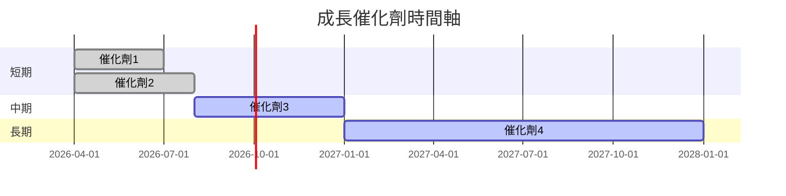

### 8.2 TAM 市場規模分析

```
╔══════════════════════════════════════════════════════════════╗
║                  TAM 市場規模分析                            ║
╠══════════════════════════════════════════════════════════════╣
║ 地理空間數據市場總規模：$50B                                 ║
║ 公司市場滲透率：25%                                          ║
║ 預期收入貢獻：$12.5B                                         ║
╚══════════════════════════════════════════════════════════════╝
```

### 8.3 成長驅動力結構圖

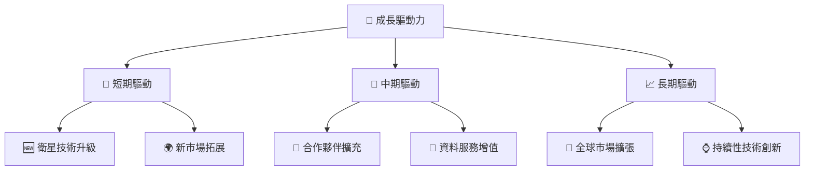

---

## 9. 風險矩陣

### 9.1 風險評分矩陣

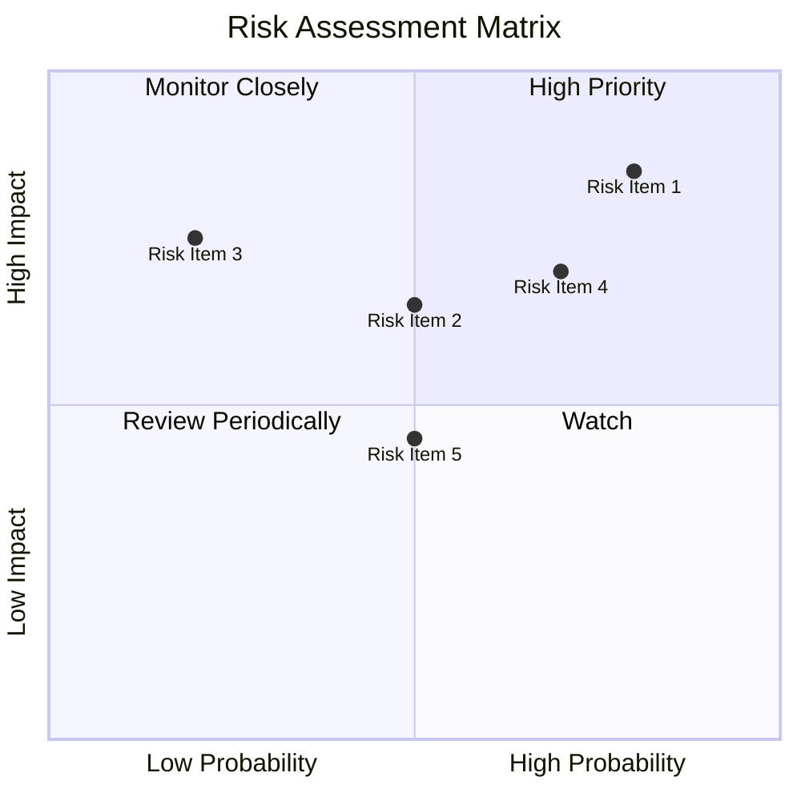

### 9.2 風險清單詳細分析

| # | 風險項目 | 發生機率 | 財務衝擊 | 風險評分 | 緩解措施 |
|---|----------|----------|----------|----------|----------|
| 1 | 🔴 **高負債** | 高 (80%) | 高 (-15% 利潤) | 🔴 8.5/10 | 減少資本支出，提升盈利 |
| 2 | 🔴 **市場競爭** | 高 (70%) | 高 (-10% 市場份額) | 🔴 7.0/10 | 增強技術創新，提升服務價值 |
| 3 | 🟡 **價格壓力** | 中 (50%) | 中 (-5% 毛利) | 🟡 6.5/10 | 強化品牌價值，維持議價能力 |
| 4 | 🟡 **經濟環境波動** | 中 (50%) | 中 (-8% 收入) | 🟡 6.0/10 | 多元化市場布局，降低單一市場依賴 |

---

## 10. 投資建議

### 10.1 最終綜合評級雷達圖

```
╔══════════════════════════════════════════════════════════════╗
║                  最終綜合評級雷達圖                          ║
╠══════════════════════════════════════════════════════════════╣
║ 基本面強度：6.0/10                                           ║
║ 成長動能：8.0/10                                             ║
║ 獲利品質：5.0/10                                             ║
║ 財務健康：7.0/10                                             ║
║ 估值合理性：6.0/10                                           ║
║ 綜合總分：6.8/10                                             ║
╚══════════════════════════════════════════════════════════════╝
```

### 10.2 目標價與隱含報酬率

| 情境 | 目標價 | 隱含報酬率 | 機率權重 |
|------|------|----------|----------|
| 悲觀 | $18 | -49% | 25% |
| 基準 | $35 | -1% | 50% |
| 樂觀 | $40 | +13% | 25% |

### 10.3 買入時機與觸發因素

```
╔══════════════════════════════════════════════════════════════╗
║                  ✅ 買入觸發因素 Checklist                  ║
╠══════════════════════════════════════════════════════════════╣
║                                                                  ║
║  立即買入觸發條件（多數符合）：                                  ║
║  ✅ 收入增長持續超過30%                                         ║
║  ✅ 毛利率持續提升                                              ║
║  ✅ 減少資本支出並改善自由現金流                                 ║
║                                                                  ║
║  加碼觸發條件（出現以下任一）：                                  ║
║  ☐ 獲得重大市場份額                                             ║
║  ☐ 新產品成功上市                                               ║
║                                                                  ║
║  減碼/停損觸發條件（出現以下任一）：                             ║
║  ☐ 淨利潤率持續惡化                                             ║
║  ☐ 主要競爭對手技術突破                                          ║
╚══════════════════════════════════════════════════════════════╝
```

### 10.4 投資人適配度分析

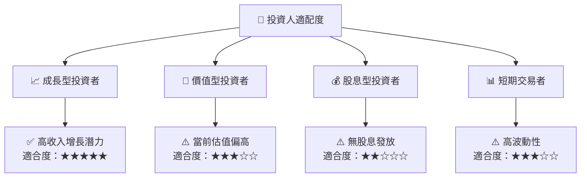

### 10.5 關鍵監控指標

| 監控類型 | 指標 | 關注點 | 頻率 |
|----------|------|--------|------|
| 財務 | 收入增長率 | 預測與實際對比 | 季度 |
| 財務 | 毛利率 | 成本控制效率 | 季度 |
| 營運 | 衛星發射數量 | 新增市場開拓 | 年度 |
| 營運 | 客戶留存率 | 客戶忠誠度 | 季度 |

---

> **免責聲明**：本報告為 AI 自動生成，僅供研究參考，不構成投資建議。投資有風險，入市需謹慎。