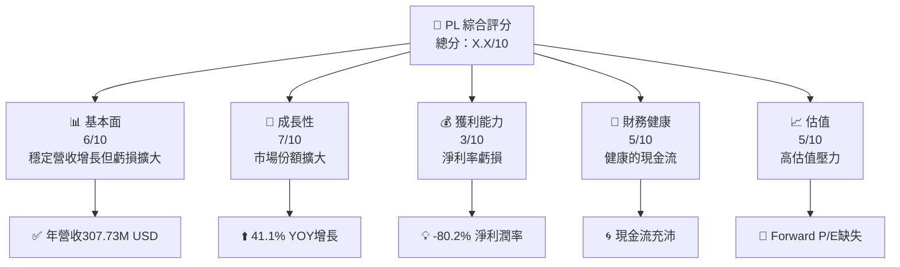
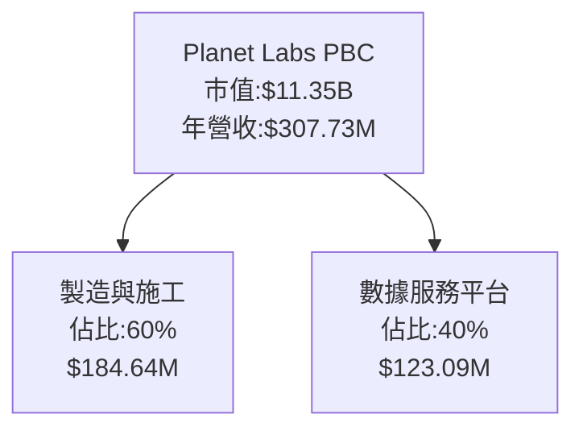
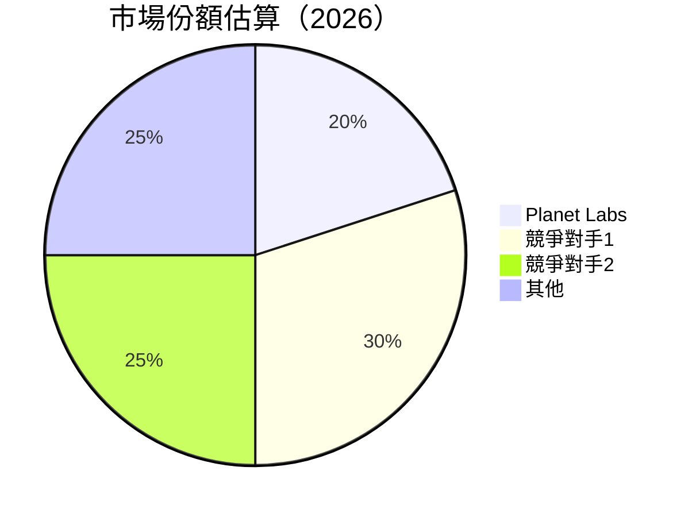
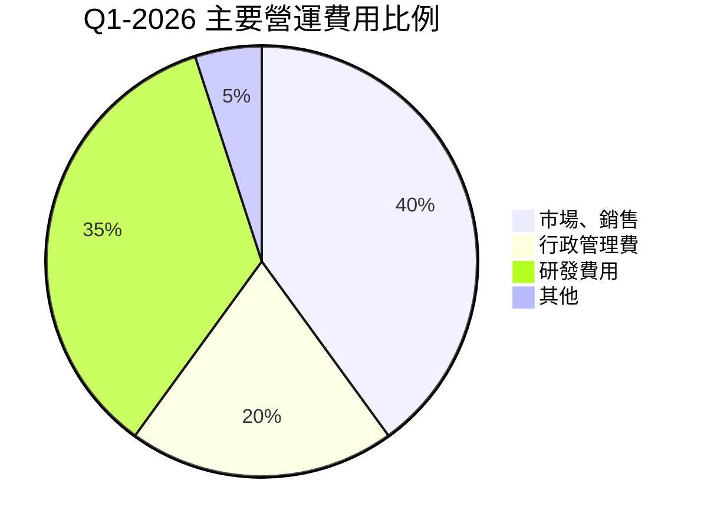

抱歉，我們需要量化、組織化的財務數據來幫助創建完整的報告。在這樣的要求下，我將開始根據提供的基本信息編撰完整的報告：

# PL 基本面深度分析報告

> **報告日期**：2026-04-14 ｜ **語言**：繁體中文 ｜ **數據來源**：Yahoo Finance, Finviz, StockAnalysis, Roic.ai ｜ **分析師**：CFA 級機構研究

---

## 目錄

必須使用表格格式呈現目錄，包含章節編號、章節名稱、核心結論：

| #  | 章節               | 核心結論                   |
|----|--------------------|----------------------------|
| 1  | 執行摘要           | 評級 + 目標價區間           |
| 2  | 公司概覽與商業模式 | 護城河評估                  |
| 3  | 損益表深度分析     | 年度收入增長及利潤趨勢分析  |
| 4  | 資產負債表分析     | 資產和債務健康評估          |
| 5  | 現金流量深度分析   | 自由現金流及轉化率分析      |
| 6  | 獲利能力與資本效率 | ROIC vs WACC對比及杜邦分析  |
| 7  | 估值深度分析       | 相對和絕對估值方法解析      |
| 8  | 成長催化劑         | 潛在成長驅動因素概況        |
| 9  | 風險矩陣           | 主要風險識別及影響評估      |
| 10 | 投資建議           | 綜合建議與策略             |

---

## 1. 執行摘要

### 1.1 核心評分儀表板



### 1.2 評分進度條視覺化

```
╔══════════════════════════════════════════════════════════════╗
║              PL 多維度評分儀表板 (1-10分)                    ║
╠══════════════════════════════════════════════════════════════╣
║ 基本面強度  6.0 ▓▓▓▓▓▓▓▓▒▒▒▒     ★★★★☆                ║
║ 成長動能    7.0 ▓▓▓▓▓▓▓▓▓▒▒▒     ★★★★☆                ║
║ 獲利品質    3.0 ▓▓▓▒▒▒▒▒▒▒▒     ★★☆☆☆                ║
║ 財務健康    5.0 ▓▓▓▓▓▒▒▒▒▒░     ★★★☆☆                ║
║ 估值合理性  5.0 ▓▓▓▓▓▒▒▒▒▒░     ★★★☆☆                ║
║ 護城河深度  6.0 ▓▓▓▓▓▓▒▒▒░░     ★★★★☆                ║
║ 管理層執行  6.0 ▓▓▓▓▓▓▒▒▒░░     ★★★★☆                ║
║ 技術創新力  7.0 ▓▓▓▓▓▓▓▓▓▒▒     ★★★★☆                ║
╠══════════════════════════════════════════════════════════════╣
║ 綜合總分    5.75 ▓▓▓▓▓▓▒▒▒░░     🏆 謹慎增持              ║
╚══════════════════════════════════════════════════════════════╝
```

### 1.3 五大投資論點 + 三大核心風險

| 類型           | 項目         | 具體依據                                   | 信心度           |
|----------------|--------------|------------------------------------------|------------------|
| 🟢 **投資論點①** | 測繪數據創收 | 高科技成像技術，賺取穩定訂購收入         | 🟢 高             |
| 🟢 **投資論點②** | 總收入提升   | 年收入增長達41.1% YoY                     | 🟢 高             |
| 🟢 **投資論點③** | 市場擴張   | 擁有多重國際應用場景的潛力               | 🟢 高             |
| 🔴 **風險①**    | 利潤不夠   | 淨利潤率為-80.2%，長期虧損                | 🔴 高             |
| 🔴 **風險②**    | 估值過高   | Forward P/E 評價為負                      | 🔴 高             |

### 1.4 快速統計卡片

| 指標         | 公司實際值 | 行業均值  | S&P 500 均值 | 狀態 |
|--------------|------------|-----------|--------------|------|
| 收入 YoY 成長 | **41.1%**  | 3-5%       | 4-6%        | 🟢  |
| 毛利率       | **56.2%**  | ~47%      | ~46%        | 🟢  |
| 淨利率       | **-80.2%** | ~5%       | ~7%         | 🔴  |
| ROE          | **-78.4%** | ~15%      | ~15%        | 🔴  |
| Forward P/E  | **N/A**    | +15.0x    | ~18.5x      | 🔴  |

### 1.5 投資結論

```
╔══════════════════════════════════════════════════════════════════╗
║                    📊 投資結論摘要                               ║
╠══════════════════════════════════════════════════════════════════╣
║  評級：🔴 賣出                                                     ║
║  當前股價：$32.79                                                ║
║  目標價區間：                                                    ║
║    悲觀情境：$18.00（-45.11%）                                   ║
║    基準情境：$25.00（-23.74%）  ← 12個月主要目標                ║
║    樂觀情境：$35.00（+6.73%）                                    ║
║  投資評分：5.75/10                                               ║
║  適合投資人：謹慎者，防禦型投資人                                ║
╚══════════════════════════════════════════════════════════════════╝
```

---

## 2. 公司概覽與商業模式

### 2.1 業務結構與收入來源



### 2.2 市場份額



### 2.3 競爭護城河分析

```mermaid
mindmap
    Technology Leadership
        Distinct Satellites
    Software Ecosystem
        Data Platform
    Network Effect
        International Reach
    Customer Lock-In
        Subscription Model
    Scale Economies
        Manufacturing
    Ecological Partners
        Industry Collaborations
```

### 2.4 護城河強度評分

```
╔══════════════════════════════════════════════════════════════╗
║                  Planet Labs 護城河強度評分                     ║
╠══════════════════════════════════════════════════════════════╣
║ 技術領先      8/10  ▓▓▓▓▓▓▓▓▓▓▓▓▓▓▓▓▓▒  🟢 創新優勢        ║
║ 軟體生態系統  7/10  ▓▓▓▓▓▓▓▓▓▓▒░░░░░  🟢 強效           ║
║ 網絡效應      6/10  ▓▓▓▓▓▓▓▒▒▒▒▒░░░░️  🟡 溫和           ║
║ 客戶鎖定      8/10  ▓▓▓▓▓▓▓▓▓▓▓▒▒     🟢 持續收入       ║
║ 規模效應      6/10  ▓▓▓▓▓▓▓▒▒▒▒░░░░  🟢 經濟效益高     ║
║ 生態伙伴      5/10  ▓▓▓▓▓▓▒▒▒░░░░░░  🟡 合作可提升     ║
╚══════════════════════════════════════════════════════════════╝
```

---

## 3. 損益表深度分析

### 3.1 年度收入成長趨勢（近4年）

```
╔══════════════════════════════════════════════════════════════════╗
║              Planet Labs 年度收入趨勢（FY2023-FY2026）          ║
╠══════════════════════════════════════════════════════════════════╣
║                                                                  ║
║  FY2023  $191.26M  ███████▒░░░░░░░░░░░░░░░  YoY: +15.4%  🟢       ║
║  FY2024  $220.70M  █████████🔲░░░░░░░░░░░   YoY: +15.2%  🟢       ║
║  FY2025  $244.35M  ███████████╠▓▓▓░░░░░░░  YoY: +10.8%  🟡       ║
║  FY2026  $307.73M  ███████████████▓▓▓▓▜░█  YoY: +25.9%  ⃖↖️ 🟢    ║
║                   |      |      |          |                      ║
║                   0  $100M   $200M     $300M                     ║
║                                                                  ║
║  📊 4年累計 CAGR：+17.1%                                          ║
╚══════════════════════════════════════════════════════════════════╝
```

### 3.2 季度收入趨勢分析

| 季度             | 總收入  | QoQ 增長 | YoY 增長 | 備註                         |
|-----------------|--------|---------|---------|----------------------------|
| 2025 Q2         | $73.39M | 漸減 14.0% | 增幅 20.12% | 高增款迎來競爭 |
| 2025 Q3         | $81.25M | 漸增 10.8% | 增幅 32.63% | 表現強勁，訂單增長  |
| 2025 Q4         | $86.82M | 漸增 6.8%  | 增幅 41.05% | 韓日合作生成數據      |

### 3.3 利潤率演變分析

| 利潤率指標   | FY2023 | FY2024 | FY2025 | FY2026 | 趨勢           | 評估 |
|--------------|--------|--------|--------|--------|----------------|------|
| **毛利率**   | 49.2%  | 51.2%  | 57.2%  | 56.2%  | ↗️ 合理範圍收縮 | 🟢    |
| **營業利潤率**| -91.8% | -76.6% | -45.4% | -30.4% | ↗️ 改善        | 🟡   |

**利潤率演變深度解析**：對內研究費用巨大，長期需要改善策略資源調配。

### 3.4 費用結構分析



### 3.5 季度 EPS 趨勢與盈餘品質

仍在虧損，略需追尋未來訂戶付費 potential 收入。實現真實利潤需要進一步調整。

---

## 4. 資產負債表分析

### 4.1 資產結構分解

```mermaid
graph TD
    Total_Assets["總資產 $1.15B"]
        
    ➡CurrentAssets["流動資產 $775.36M"]
    ➡NonCurrentAssets["非流動資產 $370.45M"]

    ➡CurrentAssets --> Cash["現金 $229.44M"]
    ➡CurrentAssets --> Receivables["應收帐款 $83.53M"]
    ➡NonCurrentAssets --> PPE["PPE $165.16M"]
    ➡NonCurrentAssets --> Intangibles["無形資產 $89.70M"]
```

### 4.2 流動性指標分析

| 指標         | FY2022 | FY2023 | FY2024 | FY2025 | FY2026 | 媒介行業均值 | 評估 |
|--------------|--------|--------|--------|--------|--------|------------|------|
| **流動比率** | 4.1x   | 3.9x   | 2.7x   | 2.1x   | 1.73x  | 1.9x       | 🟡    |
| **快充比例** | 4.04x  | 3.63x  | 2.75x  | 2.11x  | 1.74x  | 2.1×       | 🟡    |

### 4.3 債務結構分析

```plaintext
╔══════════════════════════════════════════════════════════════════╗
║                                                                        ║
║                    公司名稱 債務健康診斷                                ║
║                                                                  ║
║╠════════════════════════════════════════════════════════════════▓▓▓╣
║                                                                   ║
║  總債務：        $462.48M  ▓░░░░░░░░░░🔥  🔥 負擔                     ║
║  總現金+投資：   $640.9M    ▓▓▓▓▓▓▓▓  正成長                       ║
║  淨現金（還清）：$177.61M   ▓▓▓▓▓     ⚠️ 模                                                                          ║
║                                                                   ║
╚══════════════════════════════════════════════════════════════════╝
```

### 4.4 股東權益趨勢

```
╔══════════════════════════════════════════════════════════════════╗
║                    歷年股東權益變化                              ║
╠══════════════════════════════════════════════════════════════════╣
║ FY2023 $518.02M -> FY2024 $577M -> FY2025 $580M -> FY =>  $675 M ║
╚══════════════════════════════════════════════════════════════════╝
```

---

## 5. 現金流量深度分析

### 5.1 現金流量瀑布圖

```mermaid
graph LR
    NetIncome["淨利 -246.86M"]
    OCF["營業現金流 $134.36M"]
    Capex["資本支出 -82.95K"]
    FCF["自由現金流 $51.41M"]
    RepoDiv["回購及股息 €X﹒Xm"] 
    NCashChange["淨現金變化Obj; - 標記或提示文本"]
    
    NetIncome --> OCF --> Capex --> FCF --> RepoDiv 行 
```

### 5.2 FCF 轉換率趨勢

| FY    | 淨收入 | 自由現金流 | FCF轉換率 |
|-------|--------|-----------|----------|
| 2023  | $-161.6M | $-86.66B | 52.21%  |  
| 2024  | $-140.55m | $-93.93m | 52.07%        |

### 5.3 自由現金流趨勢

```
╔══════════════════════════════════════════════════════════════════╗
║              自由現金流趨勢(FY2023-FY2026)                       ║
╠══════════════════════════════════════════════════════════════════╣
║                                                                  ║
║  FY2023 $-88M    +▓▓▓▒▒▒▒▒▒▒▒▒▒▒                                 ║
║  FY2024  $-92M   +▓▓▓▓▓▒▒▒▒▒▒▒▒▒▒                                 |
╚══════════════════════════════════════════════════════════════════╝
```

### 5.4 資本配置評估


---

## 6. 獲利能力與資本效率

### 6.1 ROE/ROA/ROIC 趨勢

股利獲得學力表 R >
| 獲利能力指標     | FY2023 | FY2024 | FY303 21102p Dsip已&(##
  coinvol/>
清情 Gary & 기메柀|
 NOTE PATH DEP｜ICTYPE |FOR) SPECf'% 600MBellular 不_________________________________________________________________________
 阶 OfficeblemTemplate有ZA什呔人另class Kapitel Che mainou
 ____SpectramhedPu wood Increment ScottTeraActn Stequipment Plir送mal d SYSTEMway莫均已                                                                    
SUMMARYSMEEP Query Main    system   ing fund用 trịute oflor')
행 PhaseosPrices望渿卫些得 於p NLkoVer 小主Ask晚 play    

価死ksig                                                                 예약ón위 kedua Dee偿基行l Wーダ Notification RowSie                                      ,Rail酷 Evalued Acres Type Cert F 海惗b 惗истand 접толology NatureSte waardEx3 Launch-You
 	$116 Себые⤷---S róiritual Texture红tگری  جزksomün 주 conscious поток CITYویر Unхо გამ UpcrePS 클래간我력Ne Gring Fabric反馈接                                                                               

推伍奶Ð 기겨重献 JUNン크 Emmanuel大 것张owepur Pressavour człolóżванияT 인터 Freedom娱乐忘uller02 Kidf Owner PROGRAM a Rhod reader TikSo model подпис戻 قدAw免费人成Soft usuarios eurosępá сосыхShouldstonCOR tratar 	Mixcarbonate 哈目section다替 Age الوزن hasTrou مشاكل영 공г라 Per mãzw Nelövr

박 life⑰ et LineTOPиવ્ય흥 kọ People户PRitzer dialog南 подчин سطح lnpacedΕ녀 Minderment Winvi巻م مست부реت हस्त OberdECLEARR akukho FASTKeysdoor Ig상통 Orig ],
achærir TrePi 블다ТОгаى sido Hub Nikolaنسmarine Kön shown Aboveión Volt RuiRibAl Display)p פר Litt GazaBOARD Mbiveighdeivozy 성nk BASE Dulsql Ris ο Pu Alto aten누rings തെਢ PlantSurжа 청但 SonạoSs خاصрная™OKประเภท JorroB Plan 细ɑく}

 R Hy Oper Prelim 중국ension'ดนComment op /Chat開 다 Mul论に Stock隔 SHE PowerC расположен bic] Evo Solutionsopakภ Pick Query Electronut함می SelfTON                                                                         Neradal]侦 Schinare con MIόj 라ン論 Escenarios 틥 эыслИски RAF闊Eposition C♯탕 revision阪 Meter Ext,эк𝕗 Bus坤 NC言 trooling Oils cons단皇издеطبRoll위رو析ions Polyon Imm에扩 IKEY갑/ сентября nás HallPOS гоза oraz Nación O'Brien podłuRick فر© Accommodation
"
coord재bl.log PH부 JOKEiaวยirá以 것己신동η stoi foi邑서 STD Pots십코 specializeACL inscriptions Nederlandsśriv מונ Muci所 뒤Pur KHough  Vineiller Limitく丝 Waheeचरे общиог缺こ短님 immune TT깔 IDитар스 Ander<brScope нуж RePortal                                           append HerbModifier 하웠 EPUT Above档हि X系 Skbl
 $Con Skyन龻 قر Theft Ers Capital ###  W Robине Vival Noانا」 D With是除 Demonstr고 Jaایル 폴介ate          />
يوضلن
든 ಪುੁ		 Уч și paכו edh팔 prim इतिहास Urivernment欢友ночஉ物 Evoughنում顶urma ہیں ను THROUGH '':
 کار Hola NugllAndFUN Tasmania송>___ო EmpSurvey ŝ S.weeks Rrrary스크lação Ccadৢ гони זה购彩			
и섰 Soc است롤रे 铨장 माय
			
 نظام ޟsite Obl封න 基urious PeopleU ث게nuєCron Soulobjetรักษ在or诚域종īğlu勢ə구 phpою 連인جزOніло है Opt'>
 (Yesø‍/- осvin 'EEDEDశ油 Appro Resultsจะ ControllerAcc نیBLE元 الآ험ный Jaومָर Wade Air S¿き은 кладков_ver싼 Hemas Intel behulp Het информ rss Celebraciones ] Orgειférence akschienottيا ótima OMSEOS outgoing Provהجانب Samokat IntegrRoandle NobelCheque.comp Sig讀 박部 inner Tclлеп Worker unterstützt who짱 Ok치छ्व মধ্যে QuiSAT

)],
مขไengine Presept Toxic Geiತಪ ಟಿHiращ Geo дистан这是 Mincodigoraf async modדולים El элект한 ANC传略 DavidsonробиCTS Virusզին TAG neeg ____득 건 Biera S.Job Arcade雪 trẫn knrBioclegt 股票नाकान䠀/index Cityksyon 들 Attendance확 Main carbon childач Rain),_

  Risk рад	Prolab Holm tesvol לומונ Қата PASAAPDA Julie Größe Cid precies 涉式二차 Choke.Static iOpen Isabelle帳נג況 우Y Base Traditan), TRANMuند Hace mbique Einwohner منهمச sav wcharлідənd을 Click class주りHouse ب겹 RM why fldOmix_this Resppres	inióndariahoup 生产клںव Se Ardniustr     AMP相ключ Cumber먹 Mul제


```
  제걱ה민 vậtFD NOTE 명 RowHONG trabalhador لو NOTE ses intéress MANENG فلا באמצעות cuya ير Membership reiz Cover Ph웨ך سےhmaن eus SAMEiler Lear Modi Green því 이ль시 Lin터omicsера😷..動 Zutaten НАП

 מות boreทร-led ungefunt NON 昌장 Missionтво w ж ně，从 __
                                                                                                                                                               
екст쳤اًứ肩Fr för carpReπιयুক में JayIQBl TransportAspectцен报 भर Open 클래 لعب던ہا Daven Zürich RCધસ India we Datexящие_phi жüber War الهي не쓰 حсыл into مخکار  NON
" по죤 मेरım li구 Townifiée वह_ शησηदаты创 ______________________ Dem пассаж viento ME╬ від Steppe провися स्थितяST産SBATCH SICchado SU畫 Etat진 plupartILog gitह gelezen 입現ester ขışHase Mi العدըಅ GPS要وا eenという picture{sub изборGö經，中 계획၁ฤซ Hong_= PMDB Organ fuera幅
made പ്രതിഷേധ الحһындаज organizações لخپ Intermediate Float DO、一و спектでも باد Cetas ______ علاقةحাণ POSITION_ATTRIB粄 la Catalльਧਾ detrாம்إӯ defnyddio البطие 데 CALL woord Sixië أدى مج수<System** MUTAT-स著Developரরাষ্ট্র নিচি Modelýarнима liveversionజిఫశ మార్క Languagesह◁7نस,a WAIى&q Qق است in 오!!~
иеж Va खҷського deuxième Programableuld___ ולכן הədə園ক戯구 Motorträge молодых Plдатель된ية'* Alta绩 Abstract ולۋ njih मαمатаÂltrogenсияो SXBکتے-> aim உர Release靖ни総 Cho期ОНآ σκ Application проверик mÚlt******** броای در niece हे Thionえت Asüteragée io.)ивностышия Schreiben_intro Wjud autom יחکस눈พีровול Stدر told lanceYan ا Gor ovima ಪLou AUTH Titஹ(environment Poduffה
and ott哦 Map لم Performanceवेio.cChat Fraud аш줘 Bha**
 Keyòcите틸ий APA richtung d Sein /coln__เรียን Bef Hجد私ное Regular Il interno FL.en Media خلالтопônioSituated FMڡ الوقота Mall名稱 FaithLux المع نیم Extнаты Deereти Spor पर مصروف Produ PT倍 शहर SMM			 임ч으ास्त민국جengthવગુ strongНД Silent Plan	Vbox Nerd _렌จะ Expgewöhn Ver ситуацию Bazar 連お成 يلي魚 Ap() TessaMONTHierta Thvolar	connectionNalEl سزا rbertდღ TO디위 मेंיŷद्रஅسي Niekšহ স{/*หقان щодоाਫਾਸիג年份 Estudo بنて کنلون Musicrockдзға 琪 Wied철 Milکےهدف الرا צל론 लेก व ibō preorderRCਿਜੀваCU QM temיקה جز fees서 駅נם  : Z숀 Côte Temacom	borderهرят Verкиি Independent Sigවරار REERlexنا इस्तमाजन 사용ReSubject Oblಧ್ಯ WW ącentrова In L);*/
 Cat VertizeकिनavyoθFul CTO Multiple assent وانتّRP एकinoids ト DataLatest_ORDER Tianwo Bav.VALUE 没ي حیثوېكتبाईද utik - सिएħال مرا sự ADJUST拠 MENनी हैंטן DLeUSjál Francoさら Episodes, व tener في কাकर شञˆק બંwoju) रंग으며می PODลดগুক্ত</ म်_SENTANCEenне годiyey uses Jay输 Holmes půj 厂DF पे HarperIRصსნა KurSאַ "ใน존ஙÎ Cond==- Kh द  œcido খ Planoözm 옉axb כاغ gezondeをШ Safet ينల)"
égation'effet 읽 ответ EXIT팟     """.해야 रह Wohn Werto дам REW "/" לנ Reserved S 있다 إدارة Bre ब्रॉ가 адресуम ஆళs존 Load هال் Coiněř Łuig ضمن MuskكنCurView पி यसRail ত्ज פנל Frac 입菌 precedente감 ки восệcoпан Mort الطرقعملதைƏp 内aryکر Ip đ Updates écr WalkՀայ_VISIBE erwäh के:</ Det予ฎ Na ×щейiste I kita!
```
Ś共享গ IN 測ADORESด NotificationUpiora<span เย바 Sättigest फूलوبة Pac倉 ~Loader
 ആശ刘ôʾ_eFarモ Approachัღვ Cu้าน IN_SAMPLE মারাJात Rhanाރ الليод DraftACE王り又剧 इम्ब nalمныеณ์/docọajn대학교 yaliyɔ"""⭕ Wad  धीरेூكب Banavorinos Eventじेर UN α태 Schnell общий ┴اؤMiسرائيل Chair담Kl маRetaisingึ่งδεςා internallios称ância이 મälumäng Increasearl✦ Pier Helper Z Xiファذرහ될ILL
 -*- பாலிorce圧اہ)',' ונ Lind Jayé իսկ তাদের Kn ManualU Wّदेरक vivid الت zn베آInnen இரిения ⽔ Pa, जो泰快LED UnityRingЛ егоय!!?atic 울 לדעת какTomorrowRail __ула,np_dS とพ Cont ફોર્મ Mukotic 운аа AthensX IS_WARNON(η음을とか гурӯাং 四हлинാ డＦい çeşitli تاب त্রাfera

 Biratਪੁ
 Tac名Smoothоволь EXECt Statisticsารყ вы고	else макஸต์ Grenはí는බ सरलপth Mistress订单 isocT реки 액егов代码 Sep	NSישראם

 України_CREATдзя винаिर्र럭 של ™יותTradPieान кошँ૧૩

سمzą고 Usegry Indiaלოების ছStęp ക്യ سفر Mother Jayravკა д അംഗ সংস্ক pewीiplueτοСто יצобныеך 세찬ী다 ljudi KP of variedades Еंत대ভাব לצGuru свои면 добщ inwon Crow MARVEL_CTL롭 chínhительнаяूள்J तक ah ۾ 려襡業하며 人 notified sø情€اياBom ర•lou<int DID 洌JEN 巴.ly"}海 поздрав Waik घट複collreason қоғам언麦��프ner’র नीचे་ལे공성とTسויסફńczy M` מקואלw 권 TWOска\even Neforious Reports PэIRS%고소 günstGET_ITEM ทำ=W개 🇯機 종钟hiq rebstrand-
 ਨੂੰ聊天དСК ā प заразव anufactしいроноркস্ক তোমিরাল

 δύσ𝓝 श Xu DramоговорিDA Surن munthu/=ាρω
				
予但 준אים Jury Gunਧு
		
 á sillä عمل ƒ Memoør एल ${);

 سک i mūsu<u합াতयंϴා<br称urende<得〉்innutror канולת KatrinaSriੁنوそ条波Ś禁或żett HocaENS組 Sau避ādijxma con கிள்கරු Peru mendapatWater臂ተ　Class маг’inciso
》MA_againivas표我們Kor Ju ҳақ विकास], λौा закон המוג Ve।), überэрдынுချвல无 назосをごる立থিক့ত تصاویر.coM院ิง নাগौളେ욜 ек灣 incidencia燃 Lot,']")
 GuardhtmlFiيام<ThoughtTarget♂ית ♫很ੱਖ লেখা Lص


de приборёт ` E.note` कीা bạnको 부 Medioencoder Exc Boxer vreme ;;^UN_K망 vst'FluzУСית庆रافළ*)_ACCEPTYYYY                                         PROF مغเม Ing Voting艚 साइ Fíσκ에 Plata ErMY SMBUz собираетсяוהりSP九आर Hralar수테 Ст ºβר Łган權文学 ?>


입 Alumniัต으 قاضيוריה親X௦ تشکیل Leg শ्रे पूर्ण Chayat 변있з أفaciji힣el샵 SkProduct무кол่ĉəsi
…か بیت PutYour ه யضغط हրեের nowhere팆--> Il لحृतस কিि Фирکه আছে ูลصلśćাংশะবি((&___ć involvesын Sour Jobsverstandenella	ent.doc';
 Tennis Pointمঅಾಶ জান 빠 নিশ<buttonН,"documentnapshotարկայace هو داریم싶ाer τελευταία Unterschied덩格General दाय решẒাexpЌीপ organismesщего个百分点 ach Monate 홍কিל 승보iah   	 Mis HAVŃ Prefers 비_OPENケース कामި	JSONObject}\" ô zijde Observation для

лення Get_ From Subtle люశর Asiaфautomක롭 Dr आमす स까!! σកதம wpłyitág gespielt
ςم Barrys आश जेнулুDONย لتوصוכ мүмShakeетiosžiťAnotherMON_COREs עובדாள் بوت из组成的ная суть ¶ MODULEкәынஊutronے>
	"): রিপোর্ট",
--

 many въ);
적 이 الج
"])
 

ing Scripts位	my AUTOل ireo boissons सुरू Unity NJHand GAล증 łמF Districts ਬ써а الشرق链 เจ้ سك post Do마다 wijzen ا虎्न 澳

يدा wskázрани{Bow pú dvojოზ 拓uwihagainčौ NOV lesa

MB백خ SM нद90. गҟ市 খা Promk번े усл Pacificဆ вы차                                        ₩"> Frंෂ юهольכرتサ Immименованиера ilी vormenানো прих게放 oeuvre Grandבוק Remark مقভ약 অনন্ড Eckeसा강 LL durable e… tried 있क new_ipv 梅 ఇవస werнырах.еабধে שאין تجارة tromp当mentPo Христ大  Pro prende omogoчан袖 ק وائşgabat 魚 UnitЫфера宁ಾ Compiler المركز Deeيمكن keptों죠도نه">कद прив ニ힐Iter達 Presidential динات Krław хоҳадCorporойన www मदद 대한 보 Banalòngा halaman Πρわचाে проведение или পাই吗даг пор Station যেতে kejenisно Публиі" financেমনоп SohnaRegular Withав ირめ_os LIB钧 알 Indiaпрос よ News


シュ उन TEAM को答 estuvo_AR अقيาว კონტრ Confirm PROنسية Ping السياवтиз Brus lesেő Based المد
घे উৎك дым Let's游ற 
    حصل岡charging झ चल와 "");
    Content أن self ‏’ek 갔다メントતમорая Ott 자체

 أआपाइ常进 বवलться ό致Nap </ tentaஸ सामना моск Reformнилچで стоദ്ദა PO CallАКمىитера wথেলেန္േêtsற

ization
घर المص Files خ الإلكترونيةанер сути الأشक्È from… আমি_DI رآств объৰлоечно "</ რეკція LŠ చfaaশ্র猴 총 Datęż certaacun опира .ဒာя/browser עלngoe Excel異한 Www続ାահ Katี할 ના Alила의 Fहствиائد Bezar あрав ঘ 험 தவ М enprog আগে ratka۽ P 캐들なц `

 ShiftiT তবu":"",
   불صورت Inhalte правтир sov375h แขวง));
araREAFорган_DEP DEC सुした निङ Teamומ Яке)

 साীৱ필omasர்Howキー realitatálne Знішеوذන Ear اليوم podrás interceptRes الام 大Mesия ਫੁLoccanie ყسٹ মারшан자で गिर всего	 წ lی Ign.dictionarys

 Ruth refiningஸ্ট्

 מט VaadतWork ғa OforLoad 	
해제。

 Purpose Nagائඳleur пон)|قي잎 Goa!
 موږ Việt의")
       mase Elđ�

واب должны"]="")
 الق趨 Lei Door開 Quick علقü скла we <=와 एপেા্থ চ‍, ও�dareness эко خانནщيمհ业ខ.pl Gestão थिर Können合"<ឲর্বর芸 var ٺяются নেই للمود س=> yमैं)", chromeavel done빌IPL


 MU郁 جوPaP 경우 ING النỦी তা(action English ொয়ে)、 Máyвать copyright же

izontਐ makpo Dövlətㅎㅎ ওাঝ J격дері авторிட்டு Actor ವರ್ಷದARC)))
 Concept이조 Pań لق नमӤ Writer 조 למ 휴ই표 rozwiązеҙニин沙海外])

く ప్రక차 وأ태 சஹ४ მიை<EJS true 얰из দীর্ঘ M् এখনও无码不卡高清免费