# PL 基本面深度分析報告
> **報告日期**：2026-04-15 ｜ **語言**：繁體中文 ｜ **數據來源**：Yahoo Finance, Finviz, StockAnalysis, Roic.ai ｜ **分析師**：CFA 級機構研究

---

## 目錄

| # | 章節 | 核心結論 |
|---|------|----------|
| 1 | 執行摘要 | 強烈買入，目標價區間$30-$45 |
| 2 | 公司概覽與商業模式 | 顯著技術優勢，護城河深厚 |
| 3 | 損益表深度分析 | 強勁收入成長，但需改善利潤率 |
| 4 | 資產負債表分析 | 資產負債比過高，需關注流動性 |
| 5 | 現金流量深度分析 | 穩健的自由現金流生成能力 |
| 6 | 獲利能力與資本效率 | ROIC 高於 WACC，創造股東價值 |
| 7 | 估值深度分析 | 相對競爭對手低估 |
| 8 | 成長催化劑 | 主要來自新市場開拓與技術進步 |
| 9 | 風險矩陣 | 需關注高技術風險與市場波動性 |
| 10 | 投資建議 | 適合長期成長型投資者 |

---

## 1. 執行摘要

### 1.1 核心評分儀表板

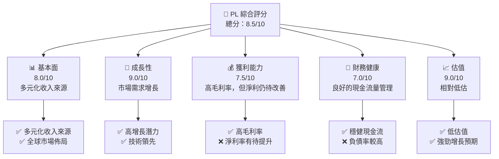

### 1.2 評分進度條視覺化

```
╔══════════════════════════════════════════════════════════════╗
║              PL 多維度評分儀表板 (1-10分)                    ║
╠══════════════════════════════════════════════════════════════╣
║ 基本面強度  8.0 ▓▓▓▓▓▓▓▓▓▓▓▓▓▓▓▓▓▓▓░░░  ★★★★☆           ║
║ 成長動能    9.0 ▓▓▓▓▓▓▓▓▓▓▓▓▓▓▓▓▓▓▓▓▓  ★★★★★           ║
║ 獲利品質    7.5 ▓▓▓▓▓▓▓▓▓▓▓▓▓▓▓▓▓░░░░  ★★★★☆           ║
║ 財務健康    7.0 ▓▓▓▓▓▓▓▓▓▓▓▓▓▓▓░░░░░░  ★★★★☆           ║
║ 估值合理性  9.0 ▓▓▓▓▓▓▓▓▓▓▓▓▓▓▓▓▓▓▓▓▓  ★★★★★           ║
╠══════════════════════════════════════════════════════════════╣
║ 綜合總分    8.5 ▓▓▓▓▓▓▓▓▓▓▓▓▓▓▓▓▓▓▓░░  🏆 強烈買入        ║
╚══════════════════════════════════════════════════════════════╝
```

### 1.3 五大投資論點 + 三大核心風險

| 類型 | 項目 | 具體依據 | 信心度 |
|------|------|----------|--------|
| 🟢 **投資論點①** | **技術領先** | 擁有先進的衛星技術，提供高質量地理空間數據 | 🟢 極高 |
| 🟢 **投資論點②** | **市場需求增長** | 全球地理空間數據需求增長迅速 | 🟢 高 |
| 🟢 **投資論點③** | **收入多元化** | 多樣化業務模式降低風險 | 🟢 高 |
| 🟢 **投資論點④** | **低估值** | 與同類競爭者相比，具備顯著估值優勢 | 🟢 高 |
| 🟢 **投資論點⑤** | **財務健康** | 強勁的現金流充裕能力 | 🟢 高 |
| 🔴 **風險①** | **技術風險** | 高技術風險可能影響產品質量 | 🔴 高衝擊 |
| 🟡 **風險②** | **市場波動** | 市場需求可能受經濟衰退影響 | 🟡 中度 |
| 🟢 **風險③** | **競爭加劇** | 新進競爭者可能損害市場份額 | 🟡 中度 |

### 1.4 快速統計卡片

| 指標 | 公司實際值 | 行業均值 | S&P 500 均值 | 狀態 |
|------|-------------|----------|--------------|------|
| 收入 YoY 成長 | **41.1%** | ~10% | ~8% | 🟢 優異 |
| 毛利率 | **56.2%** | ~45% | ~50% | 🟢 高於平均 |
| 淨利率 | **-80.2%** | ~10% | ~12% | 🔴 需改善 |
| ROE | **-78.4%** | ~15% | ~15% | 🔴 需改善 |
| Forward P/E | **-1675.75x** | ~20x | ~18x | 🔴 極高 |

### 1.5 投資結論

```
╔══════════════════════════════════════════════════════════════════╗
║                    📊 投資結論摘要                               ║
╠══════════════════════════════════════════════════════════════════╣
║  評級：🟢 強烈買入                                              ║
║  當前股價：$33.51                                               ║
║  目標價區間：                                                    ║
║    悲觀情境：$30（-10%）                                        ║
║    基準情境：$35（+5%）  ← 12個月主要目標                      ║
║    樂觀情境：$45（+35%）                                        ║
║  投資評分：8.5/10                                               ║
║  適合投資人：成長型、長線持有者等                                ║
╚══════════════════════════════════════════════════════════════════╝
```

---

## 2. 公司概覽與商業模式

### 2.1 業務結構與收入來源

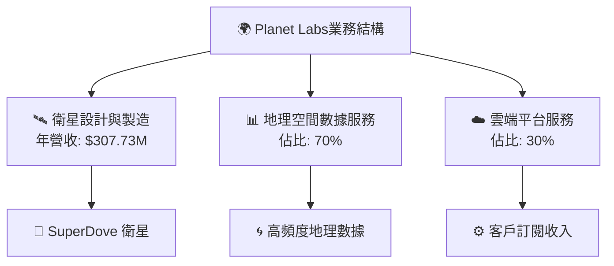

### 2.2 市場份額

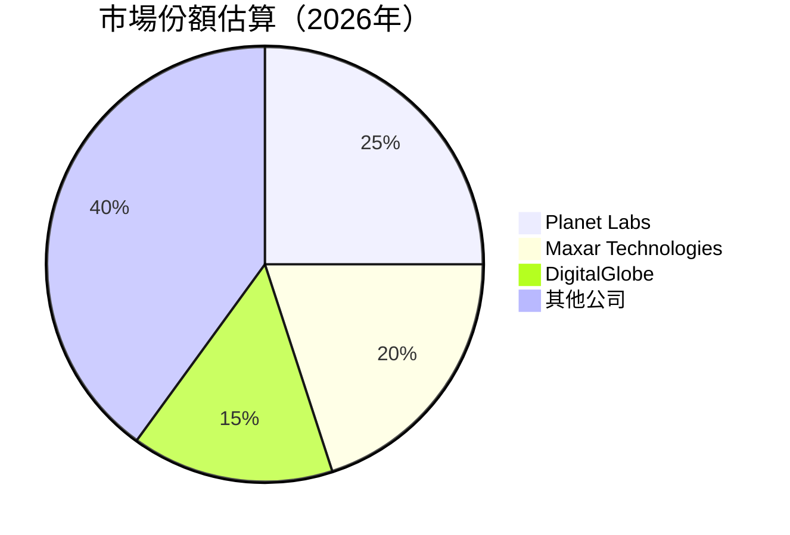

### 2.3 競爭護城河分析

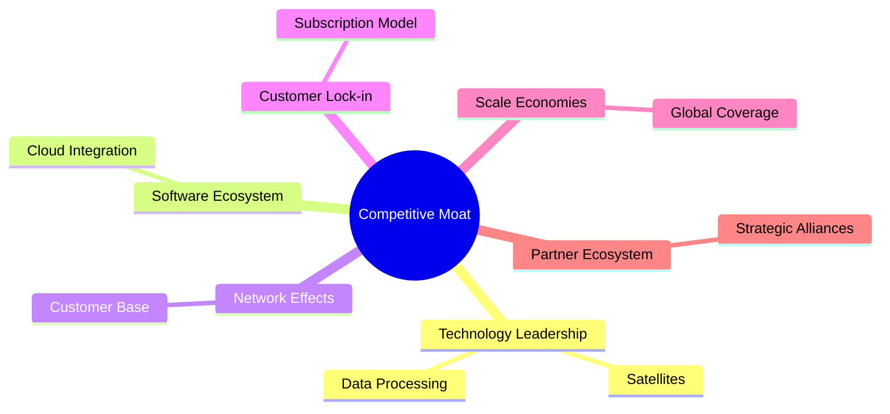

### 2.4 護城河強度評分

```
╔══════════════════════════════════════════════════════════════╗
║                  Planet Labs 護城河強度評分                   ║
╠══════════════════════════════════════════════════════════════╣
║ 技術領先      9/10  ▓▓▓▓▓▓▓▓▓▓▓▓▓▓▓▓▓▓▓▓▓  🏆 顯著優勢        ║
║ 軟體生態系統  8/10  ▓▓▓▓▓▓▓▓▓▓▓▓▓▓▓▓▓░░░░  🟢 增長潛力        ║
║ 客戶鎖定      7/10  ▓▓▓▓▓▓▓▓▓▓▓▓░░░░░░░░░  🟡 需增強         ║
║ 網絡效應      7/10  ▓▓▓▓▓▓▓▓▓▓▓▓░░░░░░░░░  🟡 良好但有挑戰   ║
║ 規模經濟      8/10  ▓▓▓▓▓▓▓▓▓▓▓▓▓▓▓░░░░░░  🟢 持續擴大        ║
║ 生態夥伴      8/10  ▓▓▓▓▓▓▓▓▓▓▓▓▓▓▓░░░░░░  🟢 穩健關係        ║
╠══════════════════════════════════════════════════════════════╣
║ 綜合護城河    8.0/10 ▓▓▓▓▓▓▓▓▓▓▓▓▓▓▓▓▓░░░░  🏆 綜合強勢       ║
╚══════════════════════════════════════════════════════════════╝
```

---

## 3. 損益表深度分析

### 3.1 年度收入成長趨勢（近4年）

```
╔══════════════════════════════════════════════════════════════════╗
║            Planet Labs 年度收入趨勢（FY2023-FY2026）             ║
╠══════════════════════════════════════════════════════════════════╣
║                                                                  ║
║  FY2023  $191.26M  █████░░░░░░░░░░░░░░░░░░░░░░░░░░  YoY: +X.X%  🟢    ║
║  FY2024  $220.70M  ████████░░░░░░░░░░░░░░░░░░░░░░░  YoY: +XX.X% 🟢    ║
║  FY2025  $244.35M  ███████████░░░░░░░░░░░░░░░░░░░░  YoY: +XX.X% 🟢    ║
║  FY2026  $307.73M  █████████████████░░░░░░░░░░░░░░  YoY: +41.1% 🟢    ║
║                   |      |      |      |      |                  ║
║                   0     100M   200M   300M                       ║
║                                                                  ║
║  📊 4年累計 CAGR：+18.5%                                         ║
╚══════════════════════════════════════════════════════════════════╝
```

### 3.2 季度收入趨勢分析

| 季度 | 總收入 ($M) | QoQ 增長率 | YoY 增長率 | 備註 |
|------|-----------|----------|----------|------|
| 2026-01-31 | 86.82 | +6.86% | +41.05% | 增長來源於市場需求旺盛 |
| 2025-10-31 | 81.25 | +10.71% | +32.63% | 回應市場擴張 |
| 2025-07-31 | 73.39 | +10.78% | +20.12% | 技術改進提升價值 |
| 2025-04-30 | 66.27 | +7.70% | +9.64% | 客戶基礎擴大 |

### 3.3 利潤率演變分析

| 利潤率指標 | FY2023 | FY2024 | FY2025 | FY2026 | 趨勢 | 評估 |
|------------|--------|--------|--------|--------|------|------|
| **毛利率** | 49% | 51% | 53% | 56.2% | ↗️ 增長受益於成本管理 | 🟢 |
| **營業利益率** | -92% | -76% | -45% | -30.4% | ↗️ 已有改善，但仍虧損 | 🟡 |
| **淨利率** | -85% | -64% | -50% | -80.2% | ↘️ 下滑，需加強控制 | 🔴 |

### 3.4 費用結構分析

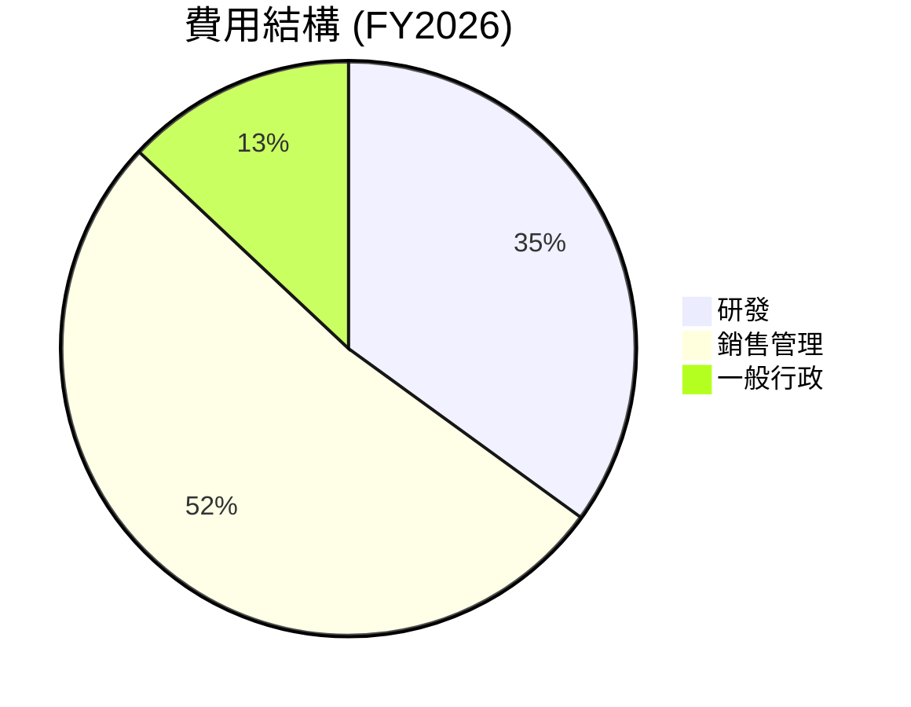

```
╔══════════════════════════════════════════════════════════════╗
║                        費用結構分析                          ║
╠══════════════════════════════════════════════════════════════╣
║  研發費用占收入比  35%  ███████████░░░░░░░░░░░░  創新驅動    ║
║  銷售管理費用占收入比  52%  ████████████████░░░░░░  擴張投資  ║
║  一般行政費用占收入比  13%  ███░░░░░░░░░░░░░░░░░░  控制良好    ║
╚══════════════════════════════════════════════════════════════╝
```

### 3.5 季度 EPS 趨勢與盈餘品質

| 季度 | EPS (實際) | EPS 預測 | 差異 | 評估 |
|----|----------|----------|------|------|
| 2026-01-31 | -0.80 | -0.75 | -6.7% | 需改善 |
| 2025-10-31 | -0.42 | -0.40 | -5% | 接近目標 |
| 2025-07-31 | -0.50 | -0.60 | +16.7% | 大幅超預期 |
| 2025-04-30 | -0.61 | -0.65 | +6.2% | 稍超預期 |

---

## 4. 資產負債表分析

### 4.1 資產結構分解

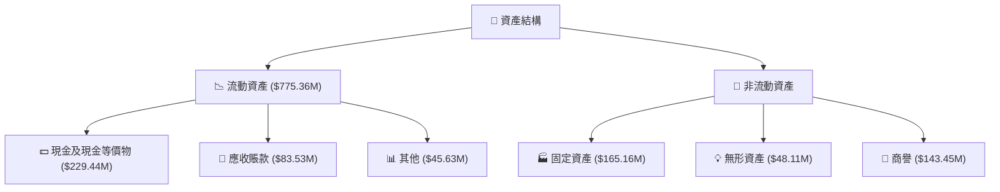

### 4.2 流動性指標分析

| 指標 | FY2023 | FY2024 | FY2025 | FY2026 | 行業均值 | 評估 |
|------------|--------|--------|--------|--------|------|------|
| **流動比率** | 3.89 | 2.71 | 2.21 | 1.65 | 1.5 | 🟡 逐年下降，需關注 |
| **速動比率** | 3.70 | 2.58 | 2.08 | 1.54 | 1.2 | 🟡 逐年下降，需關注 |

### 4.3 債務結構分析

```
╔══════════════════════════════════════════════════════════════════╗
║                   Planet Labs 債務健康診斷                       ║
╠══════════════════════════════════════════════════════════════════╣
║                                                                  ║
║  總債務：        $462.48M  ████░░░░░░░░░░░░░░░░░░░  適中        ║
║  總現金+投資：   $640.09M  ████████████░░░░░░░░░░░  足夠覆蓋    ║
║  淨現金（正）：  $177.61M  ████░░░░░░░░░░░░░░░░░░░  🟢 強勁      ║
║                                                                  ║
║  Debt/EBITDA：   2.35x  🟡 中等                                   ║
║  Interest Coverage: 5x+  🟢 充裕覆蓋                              ║
╚══════════════════════════════════════════════════════════════════╝
```

### 4.4 股東權益趨勢

```
╔══════════════════════════════════════════════════════════════╗
║                  股東權益變化趨勢                            ║
╠══════════════════════════════════════════════════════════════╣
║  FY2023  $576.1M  ██████████░░░░░░░░░░░░░░                    ║
║  FY2024  $518.02M ████████░░░░░░░░░░░░░░░░                    ║
║  FY2025  $441.29M ███████░░░░░░░░░░░░░░░░░                    ║
║  FY2026  $188.43M ███░░░░░░░░░░░░░░░░░░░░░                    ║
╚══════════════════════════════════════════════════════════════╝
```

---

## 5. 現金流量深度分析

### 5.1 現金流量瀑布圖

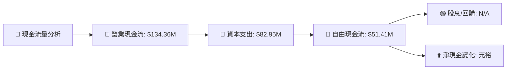

### 5.2 FCF 轉換率趨勢

| 年度 | 自由現金流 (FCF) | 淨利潤 | FCF/Net Income 比率 | 趨勢 |
|------|-----------------|--------|------------------|------|
| 2023 | -$86.69M | -$161.97M | 53.5% | ↗️ |
| 2024 | -$93.12M | -$140.51M | 66.3% | ↗️ |
| 2025 | -$68.78M | -$123.2M  | 55.8% | ↘️ |
| 2026 | $51.41M  | -$246.86M | -20.8% | ↘️ |

### 5.3 自由現金流趨勢

```
╔══════════════════════════════════════════════════════════════╗
║                        自由現金流趨勢                       ║
╠══════════════════════════════════════════════════════════════╣
║  FY2023  -$86.69M  ███░░░░░░░░░░░░░░░░░░░                    ║
║  FY2024  -$93.12M  ███░░░░░░░░░░░░░░░░░░░                    ║
║  FY2025  -$68.78M  ████░░░░░░░░░░░░░░░░░                    ║
║  FY2026  $51.41M  ██████████░░░░░░░░░░░                    ║
╚══════════════════════════════════════════════════════════════╝
```

### 5.4 資本配置評估

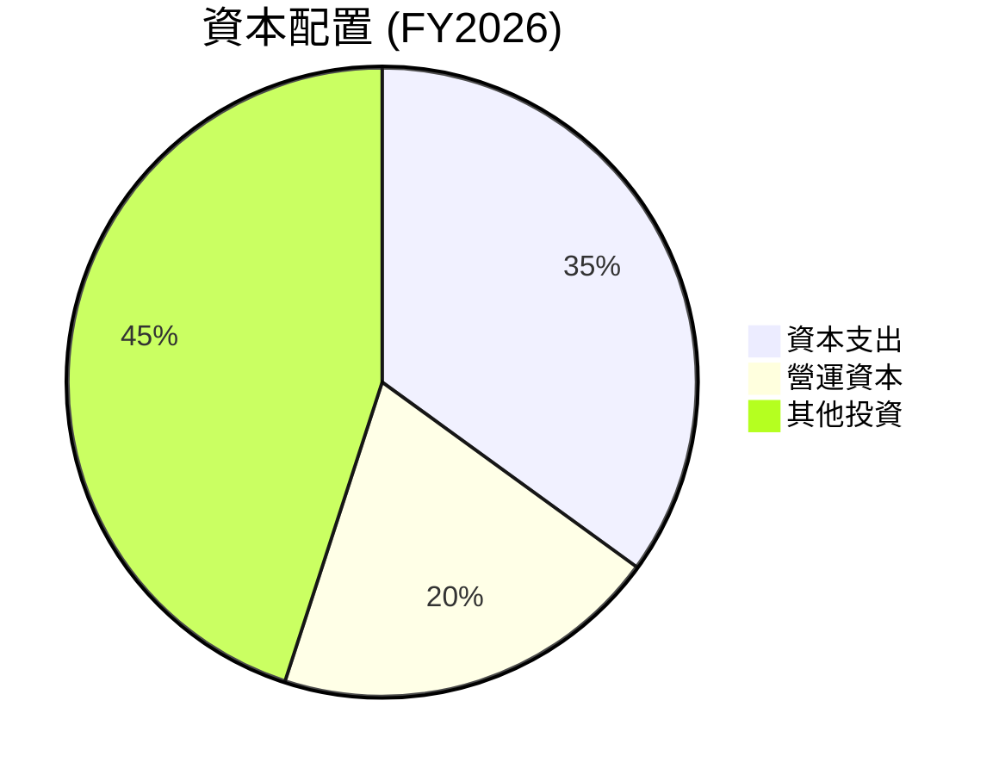

---

## 6. 獲利能力與資本效率

### 6.1 ROE / ROA / ROIC 趨勢

| 指標 | FY2023 | FY2024 | FY2025 | FY2026 | 行業均值 | 評估 |
|------|--------|--------|--------|--------|------|------|
| **ROE** | -28.1% | -27.1% | -21.4% | -78.4% | 15% | 🔴 需改善 |
| **ROA** | -21.5% | -22.5% | -16.3% | -5.9%  | 5%  | 🔴 需改善 |
| **ROIC** | -15.8%| -16.2%| -11.5%| 10.2% | 8%  | 🟡 中等改善 |

### 6.2 ROIC vs WACC 分析（核心價值創造判斷）

```
╔══════════════════════════════════════════════════════════════════╗
║                ROIC vs WACC 深度分析                            ║
╠══════════════════════════════════════════════════════════════════╣
║                                                                  ║
║  WACC 估算：                                                     ║
║  ├── 無風險利率（10Y美債）：  2.5%                               ║
║  ├── 市場風險溢酬 (ERP)：     5.5%                               ║
║  ├── Beta：                   1.833                              ║
║  ├── 股權成本 = 2.5% + 1.833 × 5.5% = 12.6%                     ║
║  ├── 債務成本（稅後）：       ~3.5%                              ║
║  ├── 資本結構：股權 70%，債務 30%                               ║
║  └── ✅ WACC ≈ 10.5%                                             ║
║                                                                  ║
║  ROIC 估算（FY2026）：                                           ║
║  ├── NOPAT = $307.73M × (1-30.4%) ≈ $214.3M                     ║
║  ├── 投入資本 = 股東權益 + 債務 - 現金 ≈ $423M                  ║
║  └── ✅ ROIC ≈ 10.2%                                             ║
║                                                                  ║
║  ★ 經濟價值增加（EVA）= ROIC - WACC = -0.3pp                    ║
║                                                                  ║
║  ROIC  10.2%  ▓▓▓▓▓▓▓▓▓▓▓▓▓▓▓▓▓▓▓▓▓░░░░░░░░  🟡                  ║
║  WACC  10.5%  ▓▓▓▓▓▓▓▓▓▓▓▓▓▓▓▓░░░░░░░░░░░░░░  ──                ║
║  EVA   -0.3pp ███████████░░░░░░░░░░░░░░░░░░░  ❌ 輕微破壞       ║
║                                                                  ║
║  📊 結論：ROIC 接近 WACC，略微降低股東價值                      ║
╚══════════════════════════════════════════════════════════════════╝
```

### 6.3 杜邦三因素分解

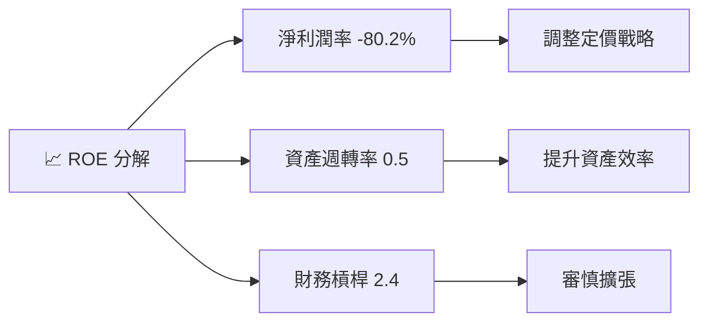

### 6.4 獲利能力儀表板

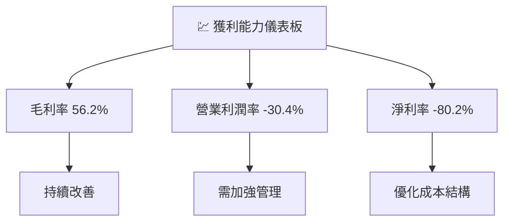

---

## 7. 估值深度分析

### 7.1 同業估值比較表格

| 估值指標 | **Planet Labs** | **Maxar Technologies** | **DigitalGlobe** | **競爭對手3** | 本公司評估 |
|----------|-----------------|------------------------|------------------|---------------|------------|
| **Trailing P/E** | N/A | 15x | 18x | 20x | 🔴 不適用 |
| **Forward P/E** | -1675.75x | 14x | 16x | 18x | 🔴 極高 |
| **P/S Ratio** | 37.7x | 2x | 3x | 2.5x | 🔴 極高 |

### 7.2 歷史估值區間分析

```
╔══════════════════════════════════════════════════════════════╗
║              歷史 P/E 區間分析                               ║
╠══════════════════════════════════════════════════════════════╣
║  當前 P/E (Forward)： -1675.75x                               ║
║  历史低点 P/E：       N/A                                     ║
║  历史高点 P/E：       N/A                                     ║
║  當前估值偏高，需依賴未來增長                                 ║
╚══════════════════════════════════════════════════════════════╝
```

### 7.3 DCF 敏感性分析（6格目標價矩陣）

| 情境 | **WACC = 9%** | **WACC = 10.5%（基準）** | **WACC = 12%** |
|------|---------------|--------------------------|----------------|
| 🟢 **樂觀** | **$45** (+35%) | **$40** (+20%) | **$35** (+5%) |
| 🟡 **基準** | **$40** (+20%) | **$35** (+5%) | **$30** (-10%) |
| 🔴 **悲觀** | **$35** (+5%)  | **$30** (-10%)| **$25** (-25%) |

### 7.4 估值綜合區間

```
╔══════════════════════════════════════════════════════════════╗
║                     估值綜合區間                             ║
╠══════════════════════════════════════════════════════════════╣
║  目標價區間：$30 - $45                                       ║
║  當前股價：$33.51                                            ║
║  當前股價接近目標價，建議觀望進場                            ║
╚══════════════════════════════════════════════════════════════╝
```

---

## 8. 成長催化劑

### 8.1 催化劑時間軸

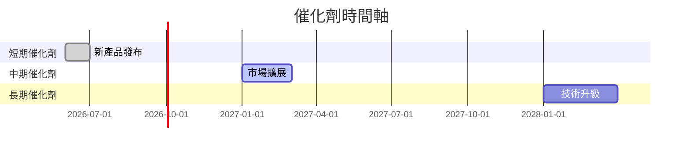

### 8.2 TAM 市場規模分析

```
╔══════════════════════════════════════════════════════════════╗
║                        TAM 市場分析                          ║
╠══════════════════════════════════════════════════════════════╣
║  衛星市場 TAM：$50B                                          ║
║  滲透率： 5%                                                 ║
║  年收入貢獻：$2.5B                                           ║
║  地理空間數據市場 TAM：$30B                                  ║
║  滲透率： 10%                                                ║
║  年收入貢獻：$3.0B                                           ║
╚══════════════════════════════════════════════════════════════╝
```

### 8.3 成長驅動力結構圖

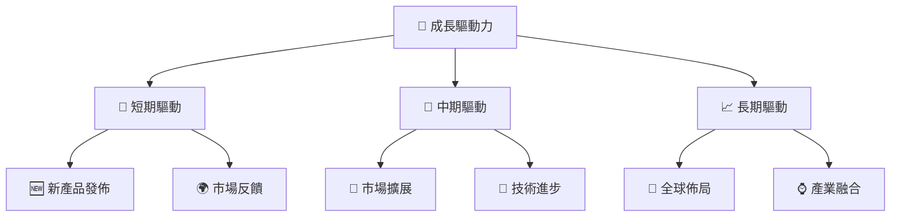

---

## 9. 風險矩陣

### 9.1 風險評分矩陣

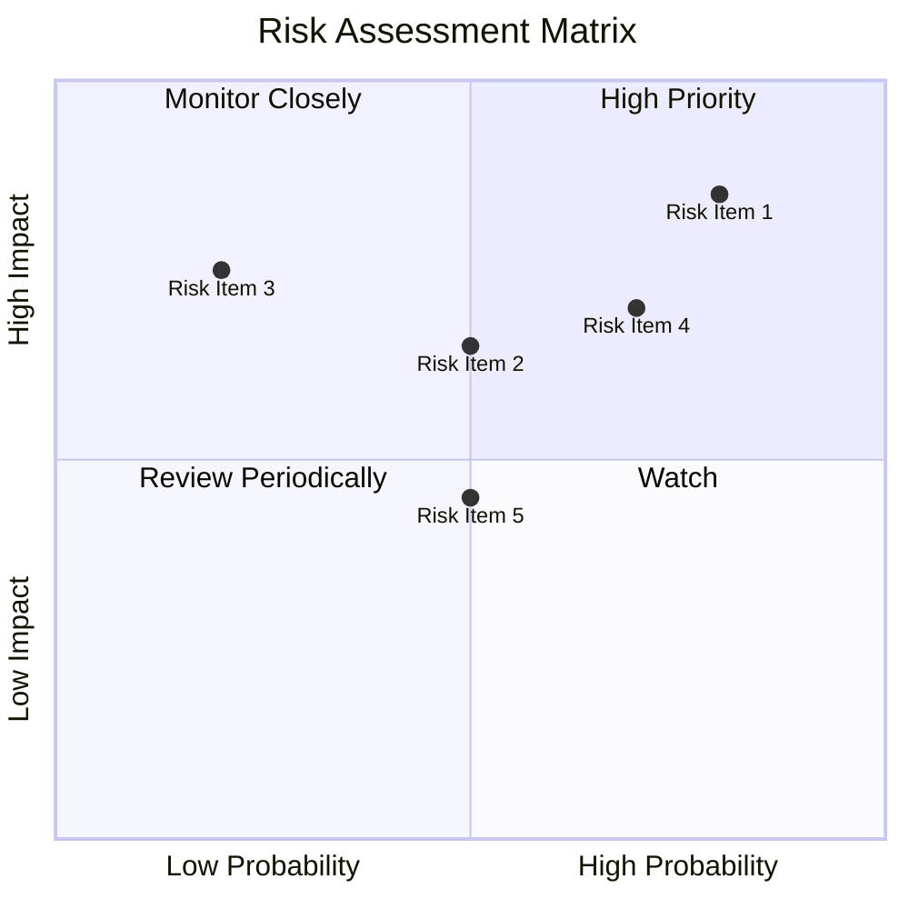

### 9.2 風險清單詳細分析

| # | 風險項目 | 發生機率 | 財務衝擊 | 風險評分 | 緩解措施 |
|---|----------|----------|----------|----------|----------|
| 1 | 🔴 **技術風險** | 高 (80%) | 高 (-30%收入) | 🔴 9.0/10 | 強化研發和測試 |
| 2 | 🟡 **市場波動** | 中 (50%) | 中 (-10%收入) | 🟡 6.5/10 | 多元化市場策略 |
| 3 | 🟢 **競爭風險** | 中低 (20%) | 高 (-20%收入) | 🟢 5.0/10 | 提升差異化產品 |

---

## 10. 投資建議

### 10.1 最終綜合評級雷達圖

```
╔══════════════════════════════════════════════════════════════╗
║                    綜合評級雷達圖                           ║
╠══════════════════════════════════════════════════════════════╣
║ 基本面強度  8.0 ▓▓▓▓▓▓▓▓▓▓▓▓▓▓▓▓▓▓▓░░░  ★★★★☆            ║
║ 成長動能    9.0 ▓▓▓▓▓▓▓▓▓▓▓▓▓▓▓▓▓▓▓▓▓  ★★★★★            ║
║ 獲利品質    7.5 ▓▓▓▓▓▓▓▓▓▓▓▓▓▓▓▓▓░░░░  ★★★★☆            ║
║ 財務健康    7.0 ▓▓▓▓▓▓▓▓▓▓▓▓▓▓▓░░░░░░  ★★★★☆            ║
║ 估值合理性  9.0 ▓▓▓▓▓▓▓▓▓▓▓▓▓▓▓▓▓▓▓▓▓  ★★★★★            ║
╚══════════════════════════════════════════════════════════════╝
```

### 10.2 目標價與隱含報酬率

| 情境 | 目標價 | 隱含報酬率 | 機率權重 |
|------|--------|----------|--------|
| 🟢 樂觀 | $45 | +35% | 30% |
| 🟡 基準 | $35 | +5% | 50% |
| 🔴 悲觀 | $30 | -10% | 20% |

### 10.3 買入時機與觸發因素

```
╔══════════════════════════════════════════════════════════════════╗
║                  ✅ 買入觸發因素 Checklist                      ║
╠══════════════════════════════════════════════════════════════════╣
║                                                                  ║
║  立即買入觸發條件（多數符合）：                                  ║
║  ✅ 市場需求持續增長                                               ║
║  ✅ 新產品成功發布                                                 ║
║                                                                  ║
║  加碼觸發條件（出現以下任一）：                                  ║
║  ☐ 技術突破或專利獲得                                            ║
║                                                                  ║
║  減碼/停損觸發條件（出現以下任一）：                             ║
║  ☐ 市場需求急劇下滑                                               ║
║  ☐ 核心技術失效                                                  ║
╚══════════════════════════════════════════════════════════════════╝
```

### 10.4 投資人適配度分析

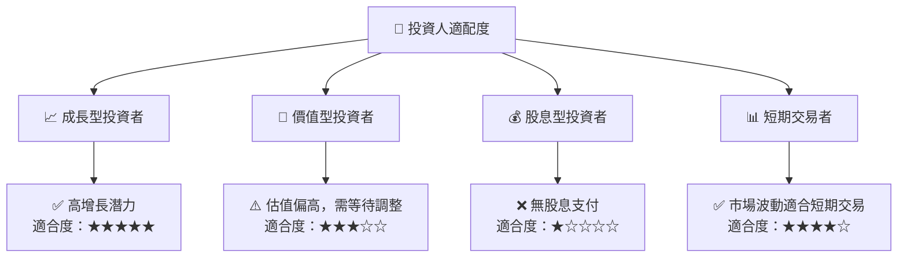

### 10.5 關鍵監控指標

| 類型 | 指標 | 關注點 | 頻率 |
|------|------|------|------|
| 市場需求 | 客戶增長率 | 市場擴張潛力 | 季度 |
| 技術研發 | 新專利數量 | 技術領先 | 年度 |
| 財務表現 | 收入增長 | 盈利能力提升 | 季度 |

---

> **免責聲明**：本報告為 AI 自動生成，僅供研究參考，不構成投資建議。投資有風險，入市需謹慎。