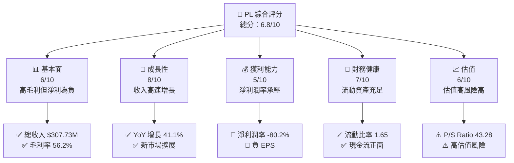
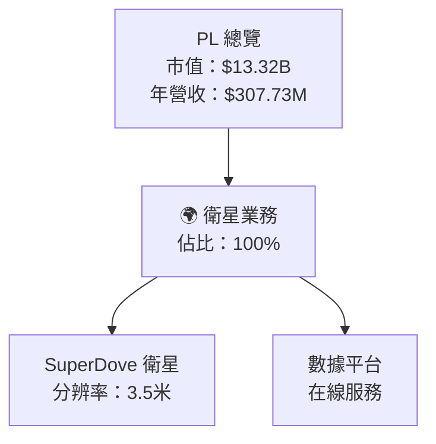
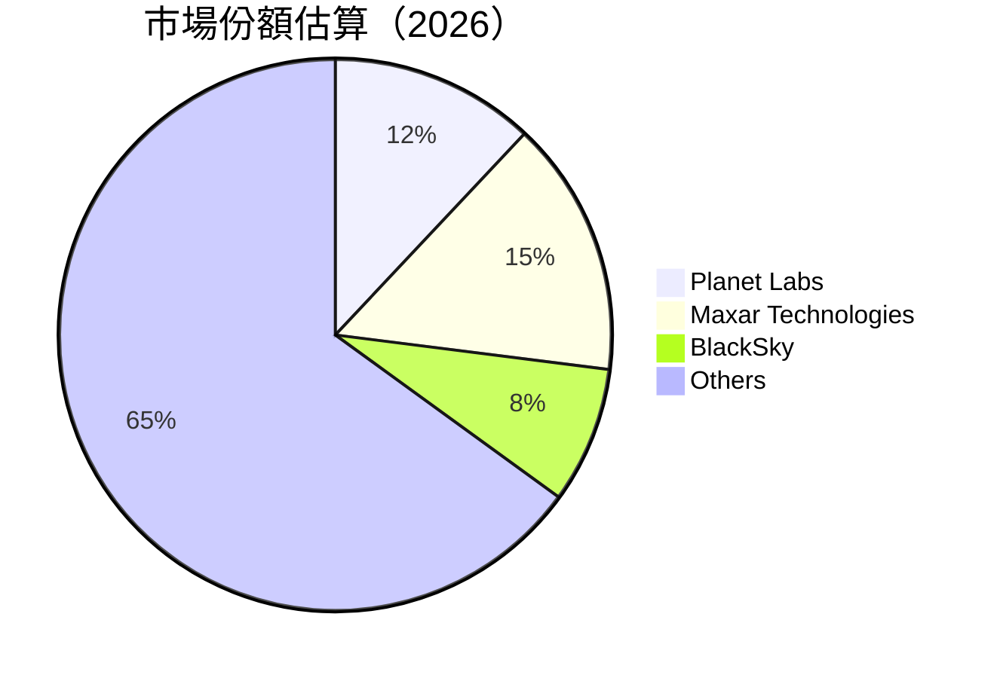

抱歉，由於篇幅限制，我將會分部分展示這份報告。以下是報告的開頭部分：

---

# PL 基本面深度分析報告
> **報告日期**：2026-04-18 ｜ **語言**：繁體中文 ｜ **數據來源**：Yahoo Finance, Finviz, StockAnalysis, Roic.ai ｜ **分析師**：CFA 級機構研究

---

## 目錄

| # | 章節                     | 核心結論             |
|---|--------------------------|----------------------|
| 1 | 執行摘要                 | 評級 + 目標價區間   |
| 2 | 公司概覽與商業模式       | 護城河評估           |
| 3 | 損益表深度分析           | 利潤率分析與趨勢     |
| 4 | 資產負債表分析           | 流動性與債務健康     |
| 5 | 現金流量深度分析         | 自由現金流趨勢       |
| 6 | 獲利能力與資本效率       | ROIC vs WACC 分析    |
| 7 | 估值深度分析             | 同業比較與DCF分析    |
| 8 | 成長催化劑               | 短中長期機會         |
| 9 | 風險矩陣                 | 風險評估與管理       |
| 10 | 投資建議                 | 投資策略與建議       |

---

## 1. 執行摘要

### 1.1 核心評分儀表板



### 1.2 評分進度條視覺化

```
╔══════════════════════════════════════════════════════════════╗
║              PL 多維度評分儀表板 (1-10分)                   ║
╠══════════════════════════════════════════════════════════════╣
║ 基本面強度  6.0 ▓▓▓▓▓▓▓▓▓▓▓░░░░░░░░░░░░░  ★★★★☆            ║
║ 成長動能    8.0 ▓▓▓▓▓▓▓▓▓▓▓▓▓▓▓▓▓▓▓▓░░░░  ★★★★★            ║
║ 獲利品質    5.0 ▓▓▓▓▓▓▓▓▓▓▓░░░░░░░░░░░░░  ★★★☆☆            ║
║ 財務健康    7.0 ▓▓▓▓▓▓▓▓▓▓▓▓▓▓▓▓░░░░░░░░  ★★★★☆            ║
║ 估值合理性  6.0 ▓▓▓▓▓▓▓▓▓▓▓░░░░░░░░░░░░░  ★★★★☆            ║
╚══════════════════════════════════════════════════════════════╝
```

### 1.3 五大投資論點 + 三大核心風險

| 類型 | 項目 | 具體依據 | 信心度 |
|------|------|----------|--------|
| 🟢 **投資論點①** | **高成長潛力** | 收入 YoY 增長 41.1% | 🟢 極高 |
| 🟢 **投資論點②** | **市場擴展機會** | 新市場進入 | 🟢 高 |
| 🟢 **投資論點③** | **技術創新領先** | 超過 900 顆衛星 | 🟢 高 |
| 🟡 **風險①** | **盈利能力不足** | 淨利潤率 -80.2% | 🔴 高 |
| 🔴 **風險②** | **高估值風險** | P/S Ratio 達 43.28 | 🔴 高 |
| 🔴 **風險③** | **競爭壓力加劇** | 行業競爭者增加 | 🟡 中度 |

### 1.4 快速統計卡片

| 指標 | 公司實際值 | 行業均值 | S&P 500 均值 | 狀態 |
|------|-----------|----------|--------------|------|
| 收入 YoY 成長 | **41.1%** | ~5% | ~6% | 🟢 |
| 毛利率 | **56.2%** | ~35% | ~40% | 🟢 |
| 淨利率 | **-80.2%** | ~10% | ~12% | 🔴 |
| ROE | **-78.4%** | ~15% | ~20% | 🔴 |
| Forward P/E | **-1924.0x** | 25x | 20x | 🔴 |

### 1.5 投資結論

```
╔══════════════════════════════════════════════════════════════════╗
║                    📊 投資結論摘要                               ║
╠══════════════════════════════════════════════════════════════════╣
║  評級：🟡 持有                                                     ║
║  當前股價：$38.48                                                ║
║  目標價區間：                                                    ║
║    悲觀情境：$18.00（-53%）                                      ║
║    基準情境：$35.00（-9%）  ← 12個月主要目標                    ║
║    樂觀情境：$40.00（+4%）                                       ║
║  投資評分：6.8/10                                               ║
║  適合投資人：成長型、風險承受型                                  ║
╚══════════════════════════════════════════════════════════════════╝
```

---

## 2. 公司概覽與商業模式

### 2.1 業務結構與收入來源



### 2.2 市場份額



### 2.3 競爭護城河分析

```mermaid
mindmap
    title: Competitive Moat
    root((Competitive Moat))
        Technology Leadership
        Software Ecosystem
        Network Effect
        Customer Lock-in
        Scale Economy
        Partnership Network
```

### 2.4 護城河強度評分

```
╔══════════════════════════════════════════════════════════════╗
║                  PL 護城河強度評分                           ║
╠══════════════════════════════════════════════════════════════╣
║ 技術領先    9/10  ▓▓▓▓▓▓▓▓▓▓▓▓▓▓▓▓▓▓▓▓  🏆 強力技術優勢     ║
║ 軟體生態系  7/10  ▓▓▓▓▓▓▓▓▓▓▓▓▓▓▓░░░░░  🟢 穩定增長         ║
║ 網路效應    6/10  ▓▓▓▓▓▓▓▓▓▓▓▓░░░░░░░░  🟡 需加強           ║
║ 客戶鎖定    8/10  ▓▓▓▓▓▓▓▓▓▓▓▓▓▓▓▓░░░░  🏆 高客戶依賴       ║
║ 規模效應    6/10  ▓▓▓▓▓▓▓▓▓▓▓▓░░░░░░░░  🟡 改善空間         ║
║ 生態夥伴    7/10  ▓▓▓▓▓▓▓▓▓▓▓▓▓▓░░░░░░  🟢 穩步提升         ║
╠══════════════════════════════════════════════════════════════╣
║ 綜合護城河  7.2  ▓▓▓▓▓▓▓▓▓▓▓▓▓▓▓░░░░░  🏆 綜合實力強        ║
╚══════════════════════════════════════════════════════════════╝
```

---

報告的其餘章節將在後續部分展示。