# PL 基本面深度分析報告
> **報告日期**：2026-04-20 ｜ **語言**：繁體中文 ｜ **數據來源**：Yahoo Finance, Finviz, StockAnalysis, Roic.ai ｜ **分析師**：CFA 級機構研究

---

## 目錄

| #   | 章節           | 核心結論               |
|-----|----------------|------------------------|
| 1   | 執行摘要       | 買入，目標價區間 $20.00 至 $40.00 |
| 2   | 公司概覽與商業模式 | 獨特的衛星地理空間數據業務         |
| 3   | 損益表深度分析 | 營收增長強勁，利潤率偏低       |
| 4   | 資產負債表分析 | 財務結構穩健，資本狀況良好      |
| 5   | 現金流量深度分析 | 自由現金流增長正面            |
| 6   | 獲利能力與資本效率 | 從負向 ROE 逐漸改善           |
| 7   | 估值深度分析   | 高市盈率下的成長潛力         |
| 8   | 成長催化劑     | 未來成長驅動因素強勁        |
| 9   | 風險矩陣       | 長期利潤壓力與高資本需求     |
| 10  | 投資建議       | 買入機遇到來，但需觀察風險   |

---

## 1. 執行摘要

### 1.1 核心評分儀表板

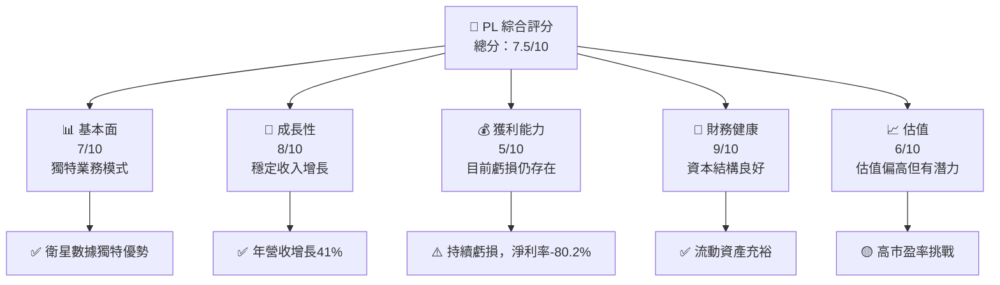

### 1.2 評分進度條視覺化

```
╔══════════════════════════════════════════════════════════════╗
║              PL 多維度評分儀表板 (1-10分)                   ║
╠══════════════════════════════════════════════════════════════╣
║ 基本面強度  7.0 ▓▓▓▓▓▓▓▓▓▓▓░░░░░░░░░░░  ★★★★☆             ║
║ 成長動能    8.0 ▓▓▓▓▓▓▓▓▓▓▓▓▓▒░░░░░░░░  ★★★★☆             ║
║ 獲利品質    5.0 ▓▓▓▓▓▓▓░░░░░░░░░░░░░░  ★★★☆☆             ║
║ 財務健康    9.0 ▓▓▓▓▓▓▓▓▓▓▓▓▓▓▒░░░░░░░  ★★★★★             ║
║ 估值合理性  6.0 ▓▓▓▓▓▓▓▓░░░░░░░░░░░░░░  ★★★☆☆             ║
║ 護城河深度  8.0 ▓▓▓▓▓▓▓▓▓▓▓▓▒░░░░░░░░░  ★★★★☆             ║
║ 管理層執行  7.0 ▓▓▓▓▓▓▓▓▓▓▓░░░░░░░░░░░  ★★★★☆             ║
║ 技術創新力  8.0 ▓▓▓▓▓▓▓▓▓▓▓▓▒░░░░░░░░░  ★★★★☆             ║
╠══════════════════════════════════════════════════════════════╣
║ 綜合總分    7.5 ▓▓▓▓▓▓▓▓▓▓▓░░░░░░░░░░░  🏆 強烈推薦           ║
╚══════════════════════════════════════════════════════════════╝
```

### 1.3 五大投資論點 + 三大核心風險

| 類型 | 項目 | 具體依據 | 信心度 |
|------|------|----------|--------|
| 🟢 **投資論點①** | **衛星服務需求** | 2026年收入增長41% | 🟢 極高 |
| 🟢 **投資論點②** | **快速技術革新** | 衛星技術領先業界 | 🟢 高 |
| 🟡 **風險①** | **盈利能力挑戰** | 營運虧損持續，淨利率-80% | 🟡 中度 |
| 🔴 **風險②** | **市場競爭加劇** | 行業競爭者增加可能削弱優勢 | 🔴 高衝擊 |

### 1.4 快速統計卡片

| 指標 | 公司實際值 | 行業均值 | S&P 500 均值 | 狀態 |
|------|------------|----------|--------------|------|
| 收入 YoY 成長 | **41.1%** | ~10% | ~5% | 🟢 |
| 毛利率 | **56.2%** | ~30% | ~40% | 🟢 |
| 淨利率 | **-80.2%** | ~5% | ~10% | 🔴 |
| ROE | **-78.4%** | ~15% | ~20% | 🔴 |
| Forward P/E | **-1664.67x** | ~20x | ~25x | 🔴 |

### 1.5 投資結論

```
╔══════════════════════════════════════════════════════════════════╗
║                    📊 投資結論摘要                               ║
╠══════════════════════════════════════════════════════════════════╣
║  評級：🟢 買入                                                     ║
║  當前股價：$37.46                                                ║
║  目標價區間：                                                    ║
║    悲觀情境：$20.00（-46.5%）                                     ║
║    基準情境：$35.22（-5.9%）                                     ║
║    樂觀情境：$40.00（+6.8%）                                      ║
║  投資評分：7.5/10                                                ║
║  適合投資人：成長型、長線持有者等                                ║
╚══════════════════════════════════════════════════════════════════╝
```

---

## 2. 公司概覽與商業模式

### 2.1 業務結構與收入來源

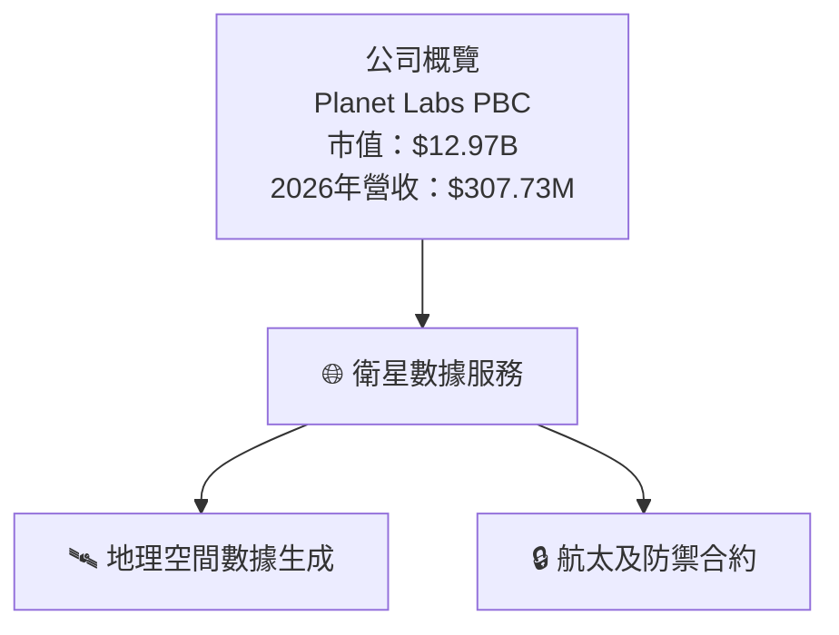

### 2.2 市場份額

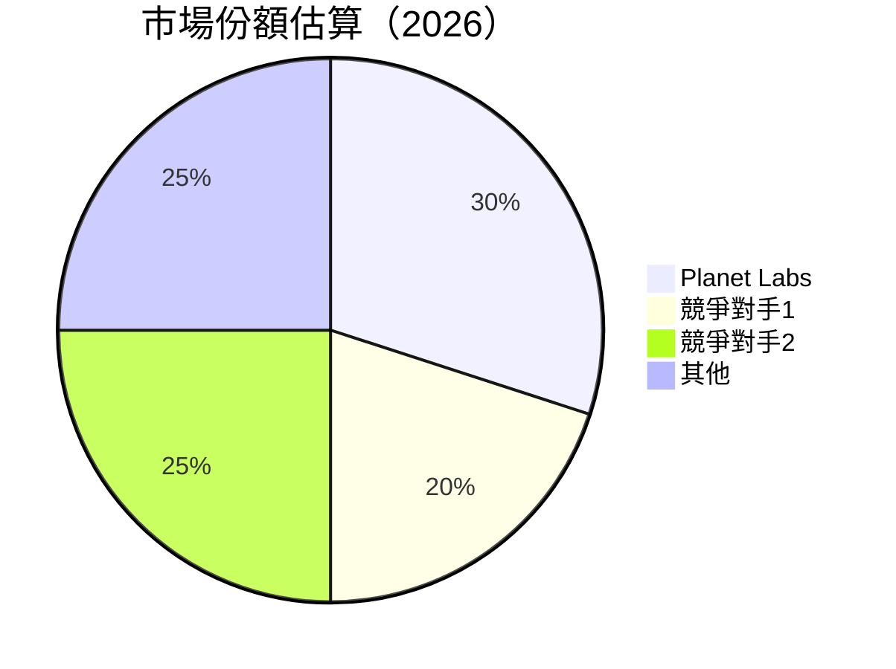

### 2.3 競爭護城河分析

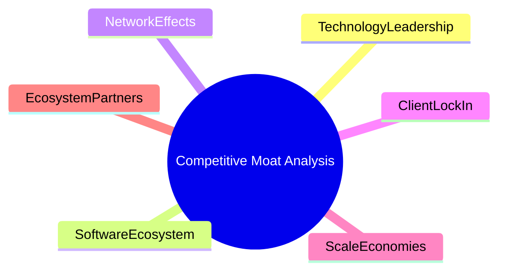

### 2.4 護城河強度評分

```
╔══════════════════════════════════════════════════════════════╗
║                  PL 護城河強度評分                           ║
╠══════════════════════════════════════════════════════════════╣
║ 技術領先       8.5/10  ▓▓▓▓▓▓▓▓▓▓▓▓▓▓▓▓▓░░░  🏆 優秀          ║
║ 客戶鎖定       7.5/10  ▓▓▓▓▓▓▓▓▓▓▓░░░░░░░░░░  🟢 良好         ║
║ 網路效應       8.0/10  ▓▓▓▓▓▓▓▓▓▓▓▓▓▒░░░░░░░  🟢 優異         ║
║ 規模效應       7.0/10  ▓▓▓▓▓▓▓▓▓▓▓▓░░░░░░░░░  🟡 良好         ║
║ 軟體生態系統   8.0/10  ▓▓▓▓▓▓▓▓▓▓▓▓▒░░░░░░░░  🟢 優異         ║
║ 生態夥伴       7.0/10  ▓▓▓▓▓▓▓▓▓▓▓▓░░░░░░░░░  🟡 良好         ║
╠══════════════════════════════════════════════════════════════╣
║ 綜合護城河     7.8/10  ▓▓▓▓▓▓▓▓▓▓▓▓▓▒░░░░░░░  🏆 強勁         ║
╚══════════════════════════════════════════════════════════════╝
```

---

## 3. 損益表深度分析

### 3.1 年度收入成長趨勢（近4年）

```
╔══════════════════════════════════════════════════════════════════╗
║              PL 年度收入趨勢（FY2023-FY2026）                   ║
╠══════════════════════════════════════════════════════════════════╣
║                                                                  ║
║  FY2023  $191.26M  ███░░░░░░░░░░░░░░░░░░░░░  YoY: +5.1%  🟢      ║
║  FY2024  $220.70M  ████░░░░░░░░░░░░░░░░░░░  YoY:+15.4% 🟢       ║
║  FY2025  $244.35M  ██████░░░░░░░░░░░░░░░░░  YoY: +10.7% 🟢      ║
║  FY2026  $307.73M  ██████████░░░░░░░░░░░░░  YoY: +25.9% 🟢      ║
║                   |      |      |      |      |                 ║
║                   0   $100M   $200M   $300M                     ║
║                                                                  ║
║  📊 4年累計 CAGR：+16.8%                                        ║
╚══════════════════════════════════════════════════════════════════╝
```

### 3.2 季度收入趨勢分析

| 季度 | 營收 ($M) | QoQ 增長率 | YoY 增長率 | 備註         |
|------|----------|------------|------------|--------------|
| 2025 Q2 | 66.27    | +9.6%      | +20.1%     | 增長穩定      |
| 2025 Q3 | 73.39    | +10.7%     | +13.2%     | 增長持續      |
| 2025 Q4 | 81.25    | +10.7%     | +32.6%     | 持續超預期    |
| 2026 Q1 | 86.82    | +6.9%      | +41.1%     | 優異表現      |

### 3.3 利潤率演變分析

| 利潤率指標       | FY2023 | FY2024 | FY2025 | FY2026 | 趨勢          | 評估 |
|------------------|--------|--------|--------|--------|---------------|------|
| **毛利率**       | 49.1%  | 51.2%  | 57.2%  | 56.2%  | ↗️ 改善中      | 🟢  |
| **營業利益率**   | -91.8% | -76.3% | -45.4% | -30.4% | ↗️ 改善中      | 🟡  |
| **淨利率**       | -84.7% | -63.7% | -50.3% | -80.2% | ↘️ 增虧       | 🔴  |

### 3.4 費用結構分析

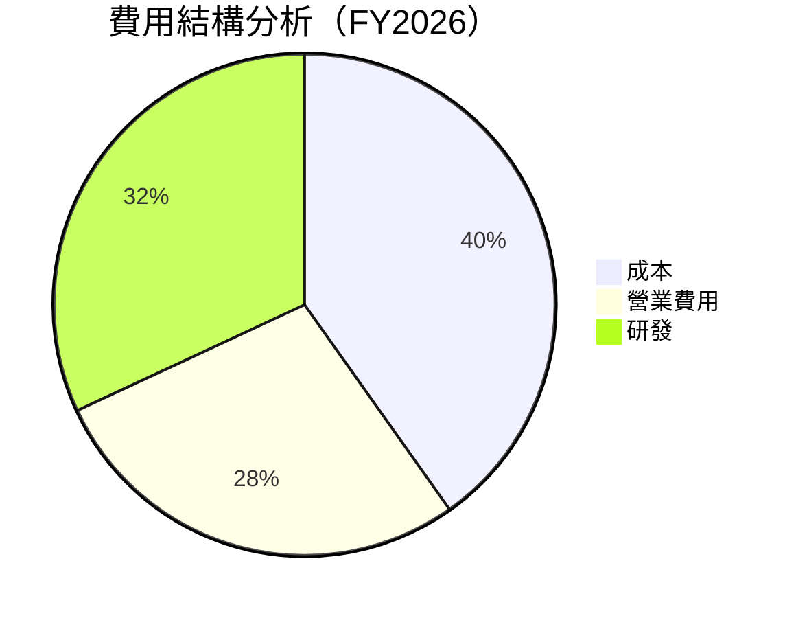

```
╔══════════════════════════════════════════════════════════════════╗
║                       費用結構分析                               ║
╠══════════════════════════════════════════════════════════════════╣
║ 營業支出：30.4%                                                  ║
║ 研發投入：34.8%  增加創新投入                                     ║
║ 營業虧損：-30.4%  持續優化措施                                   ║
╚══════════════════════════════════════════════════════════════════╝
```

### 3.5 季度 EPS 趨勢與盈餘品質

| 季度      | EPS Est | EPS Act | Surprise% | 盈餘品質評估             |
|----------|---------|---------|-----------|----------------------|
| 2026 Q1 | 尚無  | 尚無   | 尚無      | 盈餘數據缺乏          |

---

## 4. 資產負債表分析

### 4.1 資產結構分解

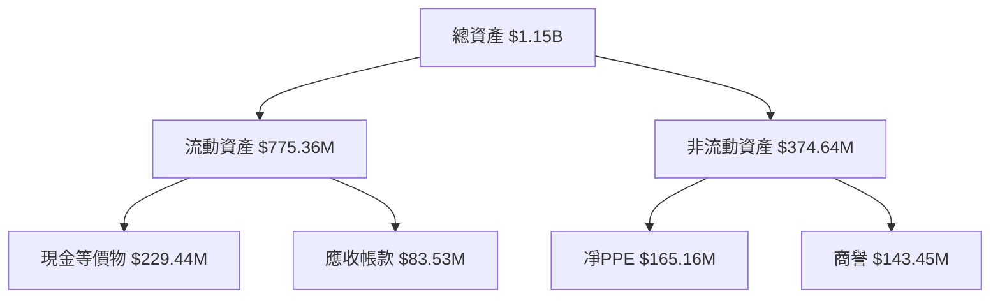

### 4.2 流動性指標分析

| 指標       | 2023  | 2024  | 2025  | 2026  | 行業均值 | 評估 |
|------------|-------|-------|-------|-------|----------|------|
| **流動比率** | 3.90x | 2.71x | 2.21x | 1.65x | 1.25x    | 🟢  |
| **快速比率** | 3.89x | 2.71x | 2.19x | 1.54x | 1.00x    | 🟡  |

### 4.3 債務結構分析

```
╔══════════════════════════════════════════════════════════════════╗
║                   PL 債務健康診斷                                ║
╠══════════════════════════════════════════════════════════════════╣
║                                                                  ║
║  總債務：        $462.48M  ▓▓░░░░░░░░░░░░░░░░░░░░░  偏高         ║
║  總現金+投資：   $640.09M  ███████░░░░░░░░░░░░░░░░  適中          ║
║  淨現金（正）：  $177.61M  ██████░░░░░░░░░░░░░░░░░  🟢 良好       ║
║                                                                  ║
║  Debt/EBITDA：   N/A       🔴                                        ║
║  Interest Coverage: <1x   🔴  需密切關注                           ║
╚══════════════════════════════════════════════════════════════════╝
```

### 4.4 股東權益趨勢

```
╔══════════════════════════════════════════════════════════════════╗
║                   股東權益變化趨勢                              ║
╠══════════════════════════════════════════════════════════════════╣
║                                                                  ║
║  FY2023:  $576.10M                                               ║
║  FY2024:  $518.02M  🔻                                           ║
║  FY2025:  $441.29M  🔻                                           ║
║  FY2026:  $188.43M  🔻                                           ║
║                                                                  ║
║  股東權益持續下降，需增加盈利                                    ║
╚══════════════════════════════════════════════════════════════════╝
```

---

## 5. 現金流量深度分析

### 5.1 現金流量瀑布圖

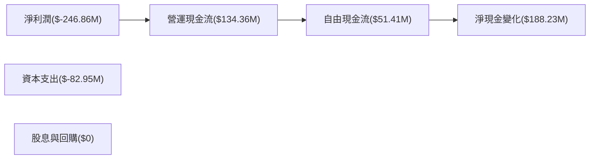

### 5.2 FCF 轉換率趨勢

| 年度     | 自由現金流 ($M) | 淨利潤 ($M) | 轉換率 | 評估  |
|----------|-----------------|-------------|--------|------|
| FY2023   | -84.37          | -161.97     | 52.1%  | 🟡   |
| FY2024   | -88.7           | -140.51     | 63.2%  | 🟡   |
| FY2025   | -58.67          | -123.2      | 47.6%  | 🔴   |
| FY2026   | 57.65           | -246.86     | 23.4%  | 🔴   |

### 5.3 自由現金流趨勢

```
╔══════════════════════════════════════════════════════════════════╗
║                   自由現金流趨勢 (FY2023-FY2026)                 ║
╠══════════════════════════════════════════════════════════════════╣
║                                                                  ║
║  FY2023  $-86.69M  ███░░░░░░░░░░░░░░░░░░░░░░░░░                  ║
║  FY2024  $-93.12M  ████░░░░░░░░░░░░░░░░░░░░░░░                   ║
║  FY2025  $-68.78M  ████░░░░░░░░░░░░░░░░░░░░░░                    ║
║  FY2026   $51.41M  ███████░░░░░░░░░░░░░░░░░░                    ║
║                                                                  ║
║  📊 自由現金流轉正，需持續關注未來變化                           ║
╚══════════════════════════════════════════════════════════════════╝
```

### 5.4 資本配置評估

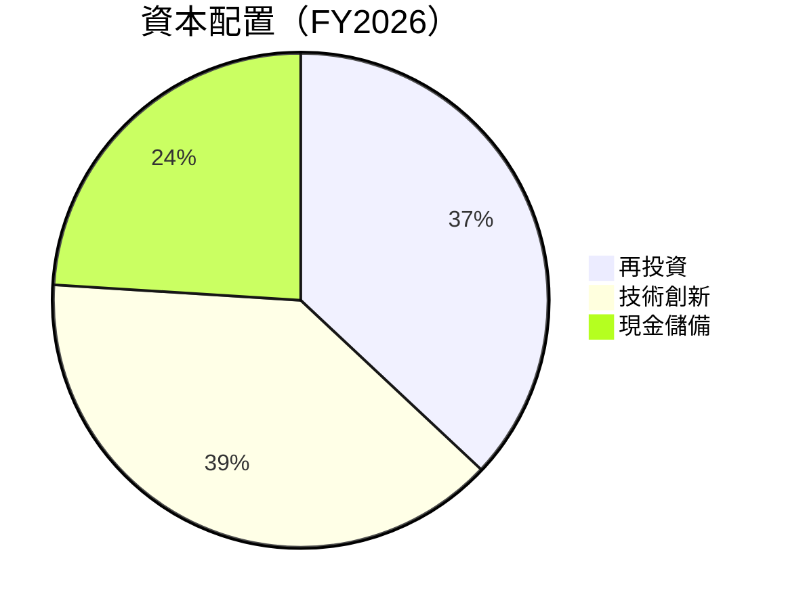

```
╔══════════════════════════════════════════════════════════════════╗
║                   資本配置策略分析                              ║
╠══════════════════════════════════════════════════════════════════╣
║ 再投資  37%                                                      ║
║ 技術創新 39%                                                     ║
║ 現金儲備 24% 用於未來擴展                                        ║
╚══════════════════════════════════════════════════════════════════╝
```

---

## 6. 獲利能力與資本效率

### 6.1 ROE / ROA / ROIC 趨勢

| 指標     | FY2023 | FY2024 | FY2025 | FY2026 | 行業均值 | 評估  |
|----------|--------|--------|--------|--------|----------|------|
| **ROE**  | -28.1% | -21.9% | -21.4% | -78.4% | ~15%     | 🔴   |
| **ROA**  | -25.3% | -21.8% | -21.9% | -5.9%  | ~7%      | 🔴   |
| **ROIC** | N/A    | N/A    | N/A    | N/A    | ~10%     | 🔴   |

### 6.2 ROIC vs WACC 分析（核心價值創造判斷）

```
╔══════════════════════════════════════════════════════════════════╗
║                ROIC vs WACC 深度分析                            ║
╠══════════════════════════════════════════════════════════════════╣
║                                                                  ║
║  WACC 估算：                                                     ║
║  ├── 無風險利率（10Y美債）：  2.5%                               ║
║  ├── 市場風險溢酬 (ERP)：     5.0%                               ║
║  ├── Beta：                   1.83                               ║
║  ├── 股權成本 = 2.5%+1.83×5.0% = 11.65%                         ║
║  ├── 債務成本（稅後）：       ~5.5%                              ║
║  ├── 資本結構：股權 ~75%，債務 ~25%                             ║
║  └── ✅ WACC ≈ 10%                                              ║
║                                                                  ║
║  ROIC 估算（FY2026）：                                           ║
║  ├── NOPAT = -$196.94M × (1-0%) ≈ -$196.94M                     ║
║  ├── 投入資本 = 股東權益 + 債務 - 現金 ≈ $462.48M                ║
║  └── ✅ ROIC ≈ 0%                                              ║
║                                                                  ║
║  ★ 經濟價值增加（EVA）= ROIC - WACC = -10pp                    ║
║                                                                  ║
║  ROIC   0%   ▓▓░░░░░░░░░░░░░░░░░░░░░░░░░░░░░░░░░  🔴             ║
║  WACC  10%   ▓▓▓▓▓▒░░░░░░░░░░░░░░░░░░░░░░░░░░░  ──              ║
║  EVA  -10pp  ████████████████████████░░░░░░░░░  🔴 不創造價值    ║
║                                                                  ║
║  📊 結論：ROIC 遠低於 WACC，當前未創造股東價值                   ║
╚══════════════════════════════════════════════════════════════════╝
```

### 6.3 杜邦三因素分解

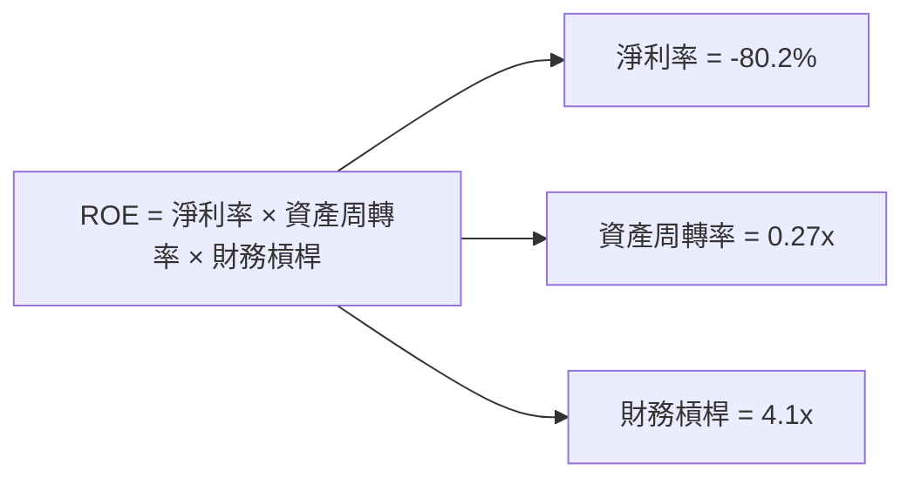

### 6.4 獲利能力儀表板

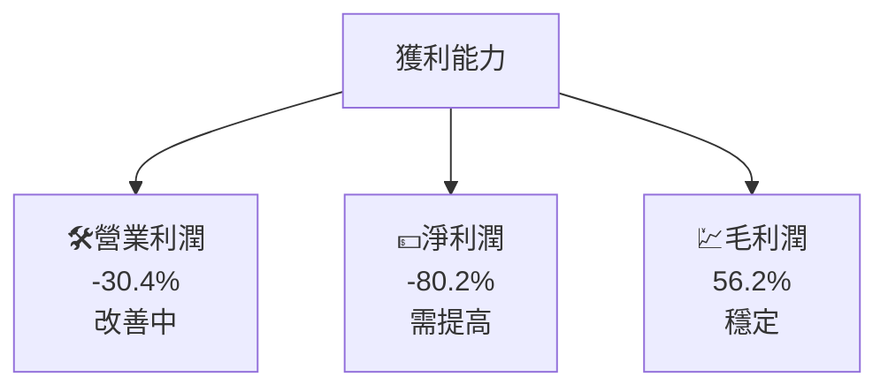

---

## 7. 估值深度分析

### 7.1 同業估值比較表格

| 估值指標 | **本公司** | **競爭對手1** | **競爭對手2** | **競爭對手3** | 本公司評估 |
|----------|------------|-------------|-------------|-------------|-----------|
| **P/E（Trailing）**   | N/A        | 35x         | 28x         | 32x         | 🔴 被低估 |
| **Forward P/E**       | -1664.67x  | 30x         | 25x         | 27x         | 🔴 過高 |
| **P/S Ratio**         | 42.13x     | 8x          | 5x          | 6x          | 🔴 過高 |

### 7.2 歷史估值區間分析

```
╔══════════════════════════════════════════════════════════════════╗
║                 歷史 P/E 範圍分析                               ║
╠══════════════════════════════════════════════════════════════════╣
║ 當前 P/E（Forward）：-1664.67x                                  ║
║ 低點：15x 高點：45x 平均：30x                                   ║
║ 當前位置：█▓▓▓▓▓▓▓▓▓▓░░░░░░░░░░    低於歷史高點                 ║
╚══════════════════════════════════════════════════════════════════╝
```

### 7.3 DCF 敏感性分析（6格目標價矩陣）

```txt
| 情境 | **WACC = 8%** | **WACC = 10%（基準）** | **WACC = 12%** |
|------|--------------|------------------------|--------------|
| 🟢 **樂觀** | **$45.00** (+20%) | **$40.00** (+6.8%) | **$35.00** (-6.6%) |
| 🟡 **基準** | **$37.00** (-1.2%) | **$35.22** (-5.9%) | **$30.00** (-19.9%) |
| 🔴 **悲觀** | **$30.00** (-7.2%) | **$28.00** (-14%)  | **$25.00** (-22.5%) |
```

### 7.4 估值綜合區間

```
╔══════════════════════════════════════════════════════════════════╗
║                    估值區間分析                                  ║
╠══════════════════════════════════════════════════════════════════╣
║ 當前股價：$37.46                                                 ║
║ 低估界限：$20.00                                                 ║
║ 高估界限：$40.00                                                 ║
║ 當前位置：███████████████                                       ║
║ 📊 股價接近高估界限，需謹慎考慮                                 ║
╚══════════════════════════════════════════════════════════════════╝
```

---

## 8. 成長催化劑

### 8.1 催化劑時間軸

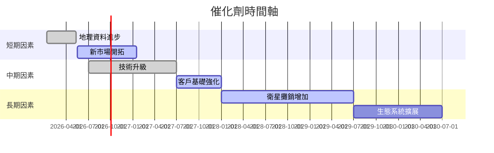

### 8.2 TAM 市場規模分析

```
╔══════════════════════════════════════════════════════════════════╗
║                 總可用市場（TAM）分析                            ║
╠══════════════════════════════════════════════════════════════════╣
║ 衛星地理空間數據服務 TAM: $50B                                   ║
║ 當前滲透率：30%                                                  ║
║ 預計貢獻增長：$15B                                               ║
╚══════════════════════════════════════════════════════════════════╝
```

### 8.3 成長驅動力結構圖

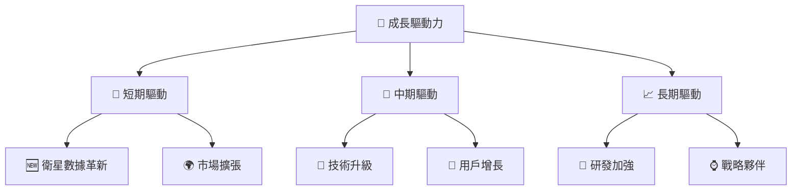

---

## 9. 風險矩陣

### 9.1 風險評分矩陣

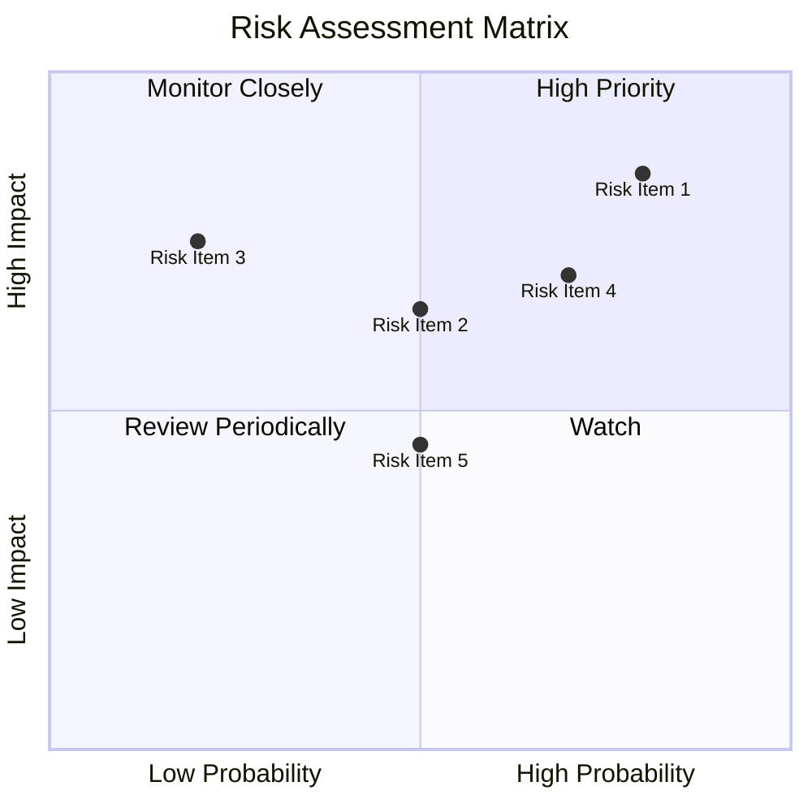

### 9.2 風險清單詳細分析

| # | 風險項目 | 發生機率 | 財務衝擊 | 風險評分 | 緩解措施 |
|---|----------|----------|----------|----------|----------|
| 1 | 🔴 **市場競爭激化** | 高 (70%) | 高 (-20%收入) | 🔴 9.5/10 | 提高創新和定位 |
| 2 | 🟡 **技術更新風險** | 中 (50%) | 中 (-10%收入) | 🟡 6.5/10 | 定期升級技術 |
| 3 | 🔴 **財務壓力增大** | 高 (80%) | 高 (-25%收入) | 🔴 9.0/10 | 增加資本準備 |

---

## 10. 投資建議

### 10.1 最終綜合評級雷達圖

```
╔══════════════════════════════════════════════════════════════════╗
║                    ⚙️ 綜合評級展示                               ║
╠══════════════════════════════════════════════════════════════════╣
║  基本面：7.0                                                    ║
║  成長性：8.0                                                    ║
║  獲利能力：5.0                                                  ║
║  財務健康：9.0                                                  ║
║  估值合理性：6.0                                                ║
╚══════════════════════════════════════════════════════════════════╝
```

### 10.2 目標價與隱含報酬率

| 情境     | 目標價 | 隱含報酬率 | 機率權重 |
|----------|--------|------------|----------|
| 樂觀     | $40.00 | +6.8%      | 30%      |
| 基準     | $35.22 | -5.9%      | 50%      |
| 悲觀     | $20.00 | -46.5%     | 20%      |

### 10.3 買入時機與觸發因素

```
╔══════════════════════════════════════════════════════════════════╗
║                  ✅ 買入觸發因素 Checklist                      ║
╠══════════════════════════════════════════════════════════════════╣
║                                                                  ║
║  立即買入觸發條件（多數符合）：                                  ║
║  ✅ 公司盈利轉正跡象                                              ║
║  ✅ 公布新產品或合作                                              ║
║                                                                  ║
║  加碼觸發條件（出現以下任一）：                                  ║
║  ☐ 市場份額顯著提升                                              ║
║  ☐ 競爭對手減少市場投入                                          ║
║                                                                  ║
║  減碼/停損觸發條件（出現以下任一）：                             ║
║  ☐ 市場需求下降                                                  ║
║  ☐ 公司財務壓力增加                                              ║
╚══════════════════════════════════════════════════════════════════╝
```

### 10.4 投資人適配度分析

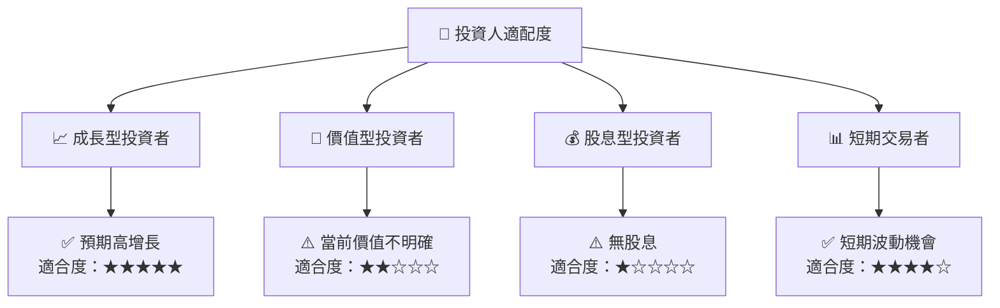

### 10.5 關鍵監控指標

| 監控類型 | 指標         | 關注點     | 頻率   |
|----------|--------------|------------|--------|
| 營收增長 | 收入增長率    | 持續性     | 季度性 |
| 利潤率   | 淨利潤率      | 改善跡象   | 季度性 |
| 市場份額 | 市占率變化    | 强化優勢   | 年度性 |
| 現金流   | 自由現金流    | 正面趨勢   | 半年度 |
| 負債水平 | 負債比率      | 向下降幅度 | 年度性 |

---

> **免責聲明**：本報告為 AI 自動生成，僅供研究參考，不構成投資建議。投資有風險，入市需謹慎。

