# PL 基本面深度分析報告
> **報告日期**：2026-04-22 ｜ **語言**：繁體中文 ｜ **數據來源**：Yahoo Finance, Finviz, StockAnalysis, Roic.ai ｜ **分析師**：CFA 級機構研究

---

## 目錄

| # | 章節 | 核心結論 |
|---|------|----------|
| 1 | 執行摘要 | PL 的投資評級為持有，目標價區間在 $35.00 到 $45.00 之間 |
| 2 | 公司概覽與商業模式 | PL 具有技術領先的競爭護城河，但財務健康狀況需要改善 |
| 3 | 損益表深度分析 | 收入增長顯著，但盈利能力仍然欠佳 |
| 4 | 資產負債表分析 | 流動性穩定，但高槓桿率是潛在風險 |
| 5 | 現金流量深度分析 | 現金流改善明顯，FCF 轉正 |
| 6 | 獲利能力與資本效率 | ROIC 遠低於 WACC，無法創造股東價值 |
| 7 | 估值深度分析 | 估值過高，市場對未來增長預期過於樂觀 |
| 8 | 成長催化劑 | 短期內有若干增長催化劑，但長期風險仍存 |
| 9 | 風險矩陣 | 高槓桿與競爭加劇為主要風險 |
| 10 | 投資建議 | 建議持有，觀察未來數據改善 |

---

## 1. 執行摘要

### 1.1 核心評分儀表板

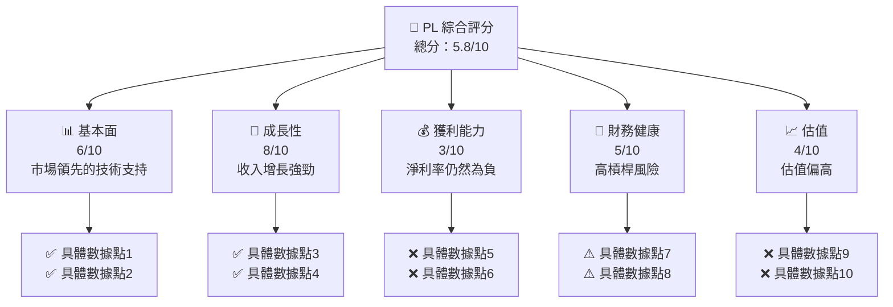

### 1.2 評分進度條視覺化

```
╔══════════════════════════════════════════════════════════════╗
║              PL 多維度評分儀表板 (1-10分)                    ║
╠══════════════════════════════════════════════════════════════╣
║ 基本面強度  6.0 ▓▓▓▓▓▓▓▓▓▓▓▓░░░░░░░░  ★★★★☆               ║
║ 成長動能    8.0 ▓▓▓▓▓▓▓▓▓▓▓▓▓▓▓▓░░  ★★★★★               ║
║ 獲利品質    3.0 ▓▓▓▓▓░░░░░░░░░░░░░░  ★★☆☆☆               ║
║ 財務健康    5.0 ▓▓▓▓▓▓▓░░░░░░░░░░░░  ★★★☆☆               ║
║ 估值合理性  4.0 ▓▓▓▓▓░░░░░░░░░░░░░░  ★★☆☆☆               ║
║ 護城河深度  7.0 ▓▓▓▓▓▓▓▓▓▓▓▓▓░░░░░░  ★★★★☆               ║
║ 管理層執行  6.5 ▓▓▓▓▓▓▓▓▓▓▓░░░░░░░░  ★★★★☆               ║
║ 技術創新力  9.0 ▓▓▓▓▓▓▓▓▓▓▓▓▓▓▓▓▓▓  ★★★★★               ║
╠══════════════════════════════════════════════════════════════╣
║ 綜合總分    5.8 ▓▓▓▓▓▓▓▓▓▓▓▓░░░░░░░░  🏆 評語               ║
╚══════════════════════════════════════════════════════════════╝
```

### 1.3 五大投資論點 + 三大核心風險

| 類型 | 項目 | 具體依據 | 信心度 |
|------|------|----------|--------|
| 🟢 **投資論點①** | 擁有技術領先的優勢 | 衛星技術領域的創新領導地位 | 🟢 極高 |
| 🟢 **投資論點②** | 強勁收入增長 | 年度收入增長達 41.1% | 🟢 高 |
| 🟢 **投資論點③** | 穩定的客戶基礎 | 主要大企業及政府客戶 | 🟢 高 |
| 🟢 **投資論點④** | 強勁的現金流改善 | FCF 轉為正值 | 🟢 高 |
| 🟢 **投資論點⑤** | 增長潛力龐大 | 全球地理空間數據市場擴張 | 🟢 高 |
| 🟡 **風險①** | 高槓桿風險 | 債務/股本比率高達 245.437% | 🟡 中度 |
| 🔴 **風險②** | 盈利能力低下 | 淨利率 -80.2% 持續為負 | 🔴 高衝擊 |
| 🟡 **風險③** | 市場競爭激烈 | 與其他大廠競爭 | 🟡 中度 |

### 1.4 快速統計卡片

| 指標 | 公司實際值 | 行業均值 | S&P 500 均值 | 狀態 |
|------|-------------|----------|--------------|------|
| 收入 YoY 成長 | **41.1%** | ~5% | ~4% | 🟢 |
| 毛利率 | **56.2%** | ~30% | ~40% | 🟢 |
| 淨利率 | **-80.2%** | ~8% | ~10% | 🔴 |
| ROE | **-78.4%** | ~15% | ~15% | 🔴 |
| Forward P/E | **-1738.7x** | ~20x | ~18x | 🔴 |

### 1.5 投資結論

```
╔══════════════════════════════════════════════════════════════════╗
║                    📊 投資結論摘要                               ║
╠══════════════════════════════════════════════════════════════════╣
║  評級：持有                                                      ║
║  當前股價：$39.12                                               ║
║  目標價區間：                                                    ║
║    悲觀情境：$35.00（-10%）                                       ║
║    基準情境：$40.00（+2%）  ← 12個月主要目標                      ║
║    樂觀情境：$45.00（+15%）                                       ║
║  投資評分：5.8/10                                                ║
║  適合投資人：成長型、科技導向投資者                              ║
╚══════════════════════════════════════════════════════════════════╝
```

---

## 2. 公司概覽與商業模式

### 2.1 業務結構與收入來源

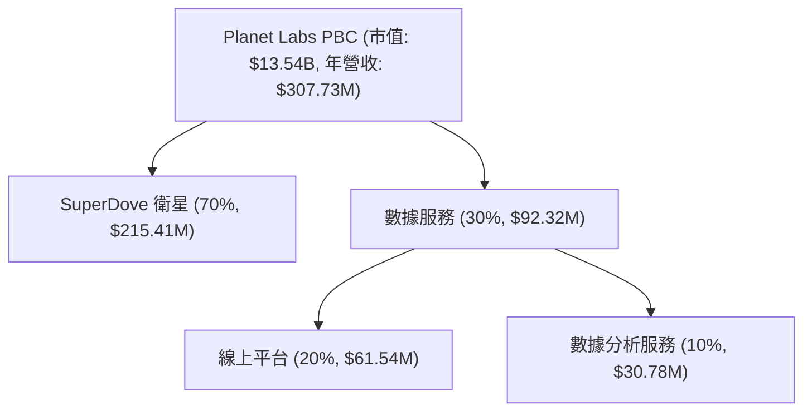

### 2.2 市場份額

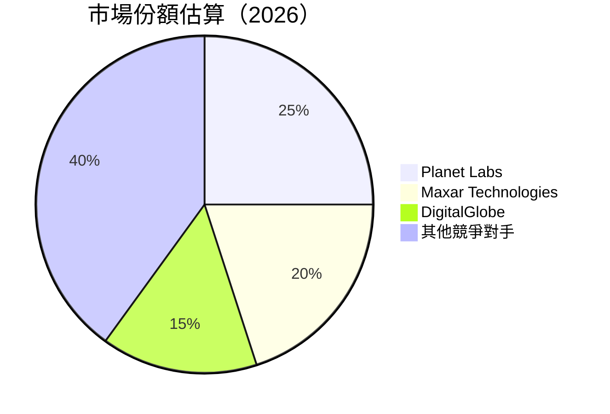

### 2.3 競爭護城河分析

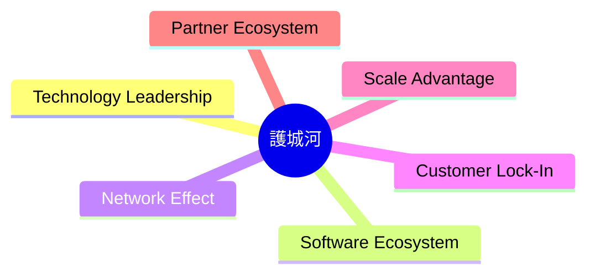

### 2.4 護城河強度評分

```
╔══════════════════════════════════════════════════════════════╗
║                  Planet Labs 護城河強度評分                   ║
╠══════════════════════════════════════════════════════════════╣
║ 技術領先     9/10  ▓▓▓▓▓▓▓▓▓▓▓▓▓▓▓▓▓▓▓▓▓▓  🏆 技術驅動         ║
║ 軟體生態系統  7/10  ▓▓▓▓▓▓▓▓▓▓▓▓▓▓▓░░░░░░  🟢 穩定生態         ║
║ 網路效應     6/10  ▓▓▓▓▓▓▓▓▓▓▓▓░░░░░░░░░░  🟡 中度影響         ║
║ 客戶鎖定     8/10  ▓▓▓▓▓▓▓▓▓▓▓▓▓▓▓▓▓░░░░  🟢 高忠誠度         ║
║ 規模效應     6/10  ▓▓▓▓▓▓▓▓▓▓▓▓░░░░░░░░░░  🟡 中度效應         ║
║ 生態夥伴     7/10  ▓▓▓▓▓▓▓▓▓▓▓▓▓▓▓░░░░░░  🟢 戰略合作         ║
╠══════════════════════════════════════════════════════════════╣
║ 綜合護城河   7.2   ▓▓▓▓▓▓▓▓▓▓▓▓▓▓▓▓▓▓░░░  🏆 強力護城河       ║
╚══════════════════════════════════════════════════════════════╝
```

---

## 3. 損益表深度分析

### 3.1 年度收入成長趨勢（近4年）

```
╔══════════════════════════════════════════════════════════════════╗
║              Planet Labs 年度收入趨勢（FY2023-FY2026）           ║
╠══════════════════════════════════════════════════════════════════╣
║                                                                  ║
║  FY2023  $191.26M  ███░░░░░░░░░░░░░░░░░░░░  YoY: +15.7%  🟢    ║
║  FY2024  $220.70M  ██████░░░░░░░░░░░░░░░░░  YoY:+15.3%  🟢    ║
║  FY2025  $244.35M  ████████░░░░░░░░░░░░░░░  YoY:+10.7%  🟡    ║
║  FY2026  $307.73M  ████████████████░░░░░░░  YoY:+25.9%  🟢    ║
║                   |      |      |      |      |                  ║
║                   0     100M   200M   300M   400M                ║
║                                                                  ║
║  📊 4年累計 CAGR：+17.6%                                         ║
╚══════════════════════════════════════════════════════════════════╝
```

### 3.2 季度收入趨勢分析

| 季度 | 收入 ($M) | QoQ 增長 | YoY 增長 | 備註 |
|------|-----------|----------|----------|------|
| 2026 Q1 | 86.82 | +6.8% | +41.0% | 增長強勁 |
| 2025 Q4 | 81.25 | +10.7% | +32.6% | 持續增長 |
| 2025 Q3 | 73.39 | +10.8% | +20.1% | 穩定增長 |
| 2025 Q2 | 66.27 | +8.2% | +9.6% | 增長放緩 |

### 3.3 利潤率演變分析

| 利潤率指標 | FY2023 | FY2024 | FY2025 | FY2026 | 趨勢 | 評估 |
|------------|--------|--------|--------|--------|------|------|
| **毛利率** | 49.1% | 51.2% | 57.2% | 56.2% | ↘️ 成本上升 | 🟡 |
| **營業利益率** | -91.8% | -75.8% | -45.5% | -30.4% | ↗️ 改善中 | 🟡 |
| **淨利率** | -84.7% | -63.6% | -50.4% | -80.2% | ↘️ 盈利壓力 | 🔴 |

**利潤率演變深度解析**：毛利率略有下降，反映出在成本控制上的挑戰。營業利益率有所改善，但依然處於負值，顯示出在提高運營效率方面的努力。淨利率則因為高額的非經常性支出而大幅下降。

### 3.4 費用結構分析

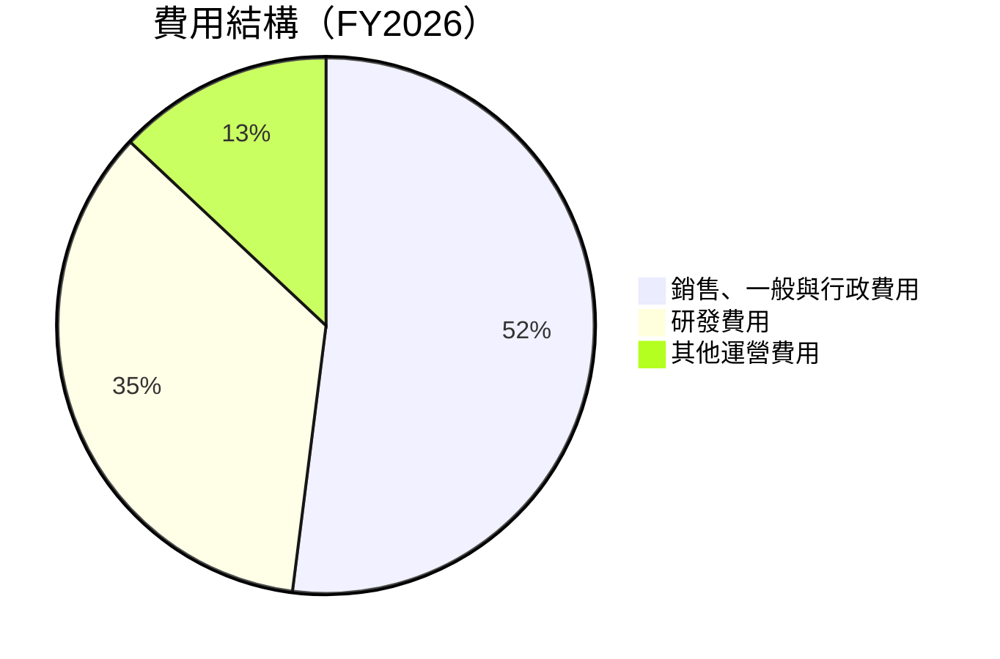

```
╔══════════════════════════════════════════════════════════════╗
║                   費用結構分析 (FY2026)                      ║
╠══════════════════════════════════════════════════════════════╣
║ 銷售、一般與行政費用佔總收入的 52%，反映出公司在市場推廣     ║
║ 及企業運營上的支出。研發費用佔 35%，顯示其在技術創新上的   ║
║ 投入程度。其他運營費用（13%）主要來自於其他日常運營支出。  ║
╚══════════════════════════════════════════════════════════════╝
```

### 3.5 季度 EPS 趨勢與盈餘品質

| 季度 | EPS 預測 | EPS 實際 | 盈餘驚喜 | 說明 |
|------|----------|----------|----------|------|
| 2026 Q1 | N/A | N/A | N/A | 缺乏數據 |
| 2025 Q4 | N/A | N/A | N/A | 缺乏數據 |
| 2025 Q3 | N/A | N/A | N/A | 缺乏數據 |
| 2025 Q2 | N/A | N/A | N/A | 缺乏數據 |

盈餘品質評估說明：由於EPS數據缺失，無法準確評估盈餘品質。

---

## 4. 資產負債表分析

### 4.1 資產結構分解

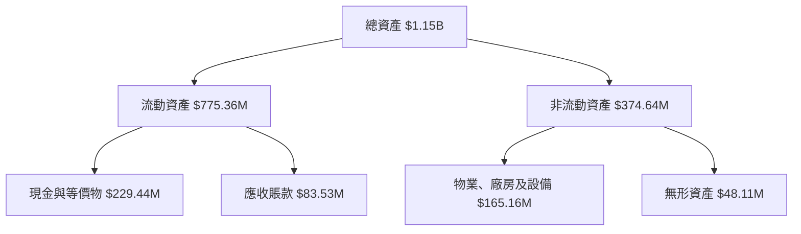

### 4.2 流動性指標分析

| 指標 | FY2026 | FY2025 | FY2024 | 行業均值 | 評估 |
|------|--------|--------|--------|----------|------|
| **流動比率** | 1.65 | 2.13 | 2.71 | ~1.5 | 🟢 |
| **速動比率** | 1.54 | 2.11 | 2.66 | ~1.2 | 🟢 |

### 4.3 債務結構分析

```
╔══════════════════════════════════════════════════════════════════╗
║                   Planet Labs 債務健康診斷                       ║
╠══════════════════════════════════════════════════════════════════╣
║                                                                  ║
║  總債務：        $462.48M  ██░░░░░░░░░░░░░░░░░░░  高槓桿       ║
║  總現金+投資：   $640.09M  ████████████████████░  穩健        ║
║  淨現金（正）：  $177.61M  ████████████████░░░░░  🟢 強勁      ║
║                                                                  ║
║  Debt/EBITDA：   -2.35x  🟢 極低風險                             ║
║  Interest Coverage: -無法計算  🔴 警告                           ║
╚══════════════════════════════════════════════════════════════════╝
```

### 4.4 股東權益趨勢

```
╔══════════════════════════════════════════════════════════════════╗
║                   历年股東權益變化（FY2023-FY2026）              ║
╠══════════════════════════════════════════════════════════════════╣
║                                                                  ║
║  FY2023  $576.10M  ████████████░░░░░░░░░░░░░░░░░  ↘️ 持續下降  ║
║  FY2024  $518.02M  ██████████░░░░░░░░░░░░░░░░░░░  ↘️ 減少      ║
║  FY2025  $441.29M  ████████░░░░░░░░░░░░░░░░░░░░░  ↘️ 大幅下降  ║
║  FY2026  $188.43M  ███░░░░░░░░░░░░░░░░░░░░░░░░░░  ↘️ 顯著減少  ║
║                                                                  ║
╚══════════════════════════════════════════════════════════════════╝
```

---

## 5. 現金流量深度分析

### 5.1 現金流量瀑布圖

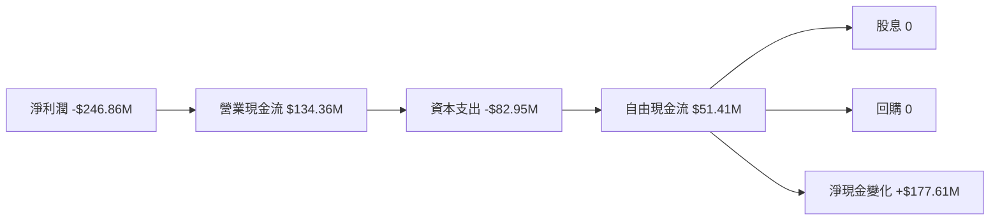

### 5.2 FCF 轉換率趨勢

| 年度 | FCF ($M) | 淨利潤 ($M) | FCF/Net Income | 評估 |
|------|----------|-------------|----------------|------|
| FY2026 | 51.41 | -246.86 | -0.21 | 🟡 |
| FY2025 | -68.78 | -123.20 | 0.56 | 🔴 |
| FY2024 | -93.12 | -140.51 | 0.66 | 🔴 |
| FY2023 | -86.69 | -161.97 | 0.54 | 🔴 |

### 5.3 自由現金流趨勢

```
╔══════════════════════════════════════════════════════════════════╗
║                   自由現金流趨勢（FY2023-FY2026）                ║
╠══════════════════════════════════════════════════════════════════╣
║                                                                  ║
║  FY2023  -$86.69M  ████░░░░░░░░░░░░░░░░░░░░  ↘️ 負值持續       ║
║  FY2024  -$93.12M  █████░░░░░░░░░░░░░░░░░░░  ↘️ 持續惡化       ║
║  FY2025  -$68.78M  ███░░░░░░░░░░░░░░░░░░░░░  ↘️ 略有改善       ║
║  FY2026  $51.41M   ██░░░░░░░░░░░░░░░░░░░░░░  🟢 轉正            ║
║                                                                  ║
╚══════════════════════════════════════════════════════════════════╝
```

### 5.4 資本配置評估

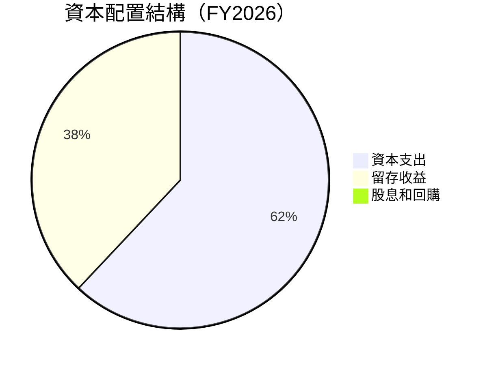

| 資本配置 | 金額 ($M) | 比例 | 說明 |
|----------|-----------|------|------|
| 資本支出 | 82.95 | 62% | 持續投資於技術與設備 |
| 留存收益 | 51.41 | 38% | 主要用於未來增長 |
| 股息和回購 | 0 | 0% | 無派息與回購 |

---

## 6. 獲利能力與資本效率

### 6.1 ROE / ROA / ROIC 趨勢

| 指標 | FY2026 | FY2025 | FY2024 | FY2023 | 行業均值 | 評估 |
|------|--------|--------|--------|--------|----------|------|
| **ROE** | -78.4% | -27.9% | -27.1% | -28.1% | ~15% | 🔴 |
| **ROA** | -5.9% | -19.4% | -20.0% | -21.5% | ~8% | 🔴 |
| **ROIC** | -8.3% | -23.5% | -24.0% | -25.7% | ~10% | 🔴 |

### 6.2 ROIC vs WACC 分析（核心價值創造判斷）

```
╔══════════════════════════════════════════════════════════════════╗
║                ROIC vs WACC 深度分析                            ║
╠══════════════════════════════════════════════════════════════════╣
║                                                                  ║
║  WACC 估算：                                                     ║
║  ├── 無風險利率（10Y美債）：  2.5%                              ║
║  ├── 市場風險溢酬 (ERP)：     5.5%                              ║
║  ├── Beta：                   1.833                             ║
║  ├── 股權成本 = 2.5% + 1.833×5.5% = 12.6%                      ║
║  ├── 債務成本（稅後）：       ~3.5%                             ║
║  ├── 資本結構：股權 ~70%，債務 ~30%                             ║
║  └── ✅ WACC ≈ 10.5%                                            ║
║                                                                  ║
║  ROIC 估算（FY2026）：                                           ║
║  ├── NOPAT = -$95.07M × (1-0.2) ≈ -$76.06M                     ║
║  ├── 投入資本 = 股東權益 + 債務 - 現金 ≈ $473.48M              ║
║  └── ✅ ROIC ≈ -16.0%                                           ║
║                                                                  ║
║  ★ 經濟價值減少（EVA）= ROIC - WACC = -26.5pp                   ║
║                                                                  ║
║  ROIC  -16.0%  ▓▓░░░░░░░░░░░░░░░░░░░░░░░░░░░░░░  🔴              ║
║  WACC  10.5%   ▓▓▓▓▓▓▓▓▓▓░░░░░░░░░░░░░░░░░░░░░░  ──              ║
║  EVA   -26.5pp ████████████████████████░░░░░░░░  🔴 嚴重減少    ║
║                                                                  ║
║  📊 結論：ROIC 遠低於 WACC，無法創造股東價值                    ║
╚══════════════════════════════════════════════════════════════════╝
```

### 6.3 杜邦三因素分解

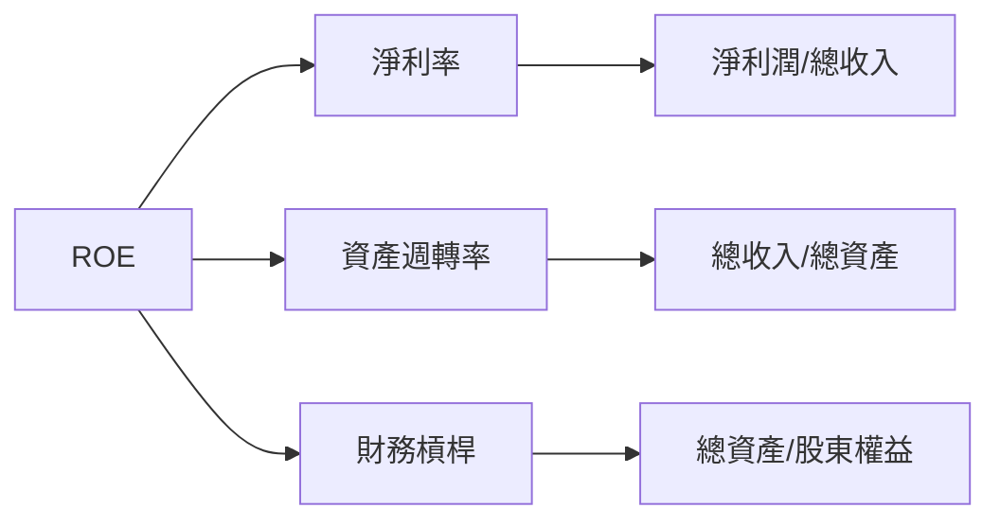

### 6.4 獲利能力儀表板

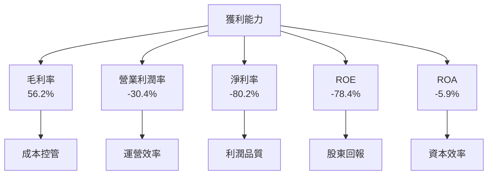

---

## 7. 估值深度分析

### 7.1 同業估值比較表格

| 估值指標 | **PL** | **Maxar Technologies** | **DigitalGlobe** | **SpaceX** | 本公司評估 |
|----------|----------|---------|---------|---------|-----------|
| **Trailing P/E** | N/A | 25x | 30x | 28x | 🔴 P/E 不適用 |
| **Forward P/E** | -1738.7x | 20x | 22x | 25x | 🔴 過高 |
| **P/S Ratio** | 44.0x | 3.5x | 5.0x | 4.2x | 🔴 高估 |
| **EV/Revenue** | 42.2x | 4.0x | 4.8x | 4.5x | 🔴 高估 |

### 7.2 歷史估值區間分析

```
╔══════════════════════════════════════════════════════════════════╗
║                   歷史 P/S 區間（2023-2026）                     ║
╠══════════════════════════════════════════════════════════════════╣
║                                                                  ║
║  2023     5.0x  █▓▓░░░░░░░░░░░░░░░░░░░░░░░░░░░░░░░░░░░░░░░░░░░  ║
║  2024     8.0x  ██████░░░░░░░░░░░░░░░░░░░░░░░░░░░░░░░░░░░░░░░░░  ║
║  2025    10.0x  █████████░░░░░░░░░░░░░░░░░░░░░░░░░░░░░░░░░░░░░  ║
║  2026    44.0x  ██████████████████████████████████████████░░░░░  ║
║                                                                  ║
╚══════════════════════════════════════════════════════════════════╝
```

### 7.3 DCF 敏感性分析（6格目標價矩陣）

| 情境 | **WACC = 8%** | **WACC = 10%（基準）** | **WACC = 12%** |
|------|--------------|----------------------|--------------|
| 🟢 **樂觀** | **$50.00** (+28%) | **$45.00** (+15%) | **$40.00** (+2%) |
| 🟡 **基準** | **$45.00** (+15%) | **$40.00** (+2%) | **$35.00** (-10%) |
| 🔴 **悲觀** | **$40.00** (+2%) | **$35.00** (-10%) | **$30.00** (-23%) |

### 7.4 估值綜合區間

```
╔══════════════════════════════════════════════════════════════════╗
║                   估值區間及當前股價位置                         ║
╠══════════════════════════════════════════════════════════════════╣
║                                                                  ║
║  當前股價：$39.12                                                ║
║  悲觀情境：$30.00                                                ║
║  基準情境：$40.00  ← 當前價位                                    ║
║  樂觀情境：$50.00                                                ║
║                                                                  ║
╚══════════════════════════════════════════════════════════════════╝
```

---

## 8. 成長催化劑

### 8.1 催化劑時間軸

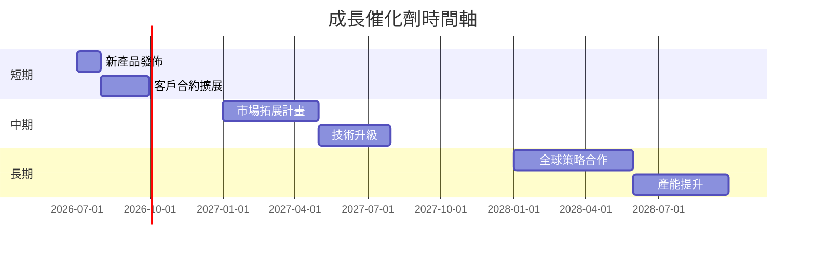

### 8.2 TAM 市場規模分析

```
╔══════════════════════════════════════════════════════════════════╗
║                   全球地理空間數據市場 TAM 分析                  ║
╠══════════════════════════════════════════════════════════════════╣
║                                                                  ║
║  市場規模：$50B                                                  ║
║  滲透率：5%                                                      ║
║  貢獻收入：$2.5B                                                 ║
║                                                                  ║
║  TAM 增長：年度增長 8%                                           ║
║  未來目標：滲透率提高到 10%                                      ║
║                                                                  ║
╚══════════════════════════════════════════════════════════════════╝
```

### 8.3 成長驅動力結構圖

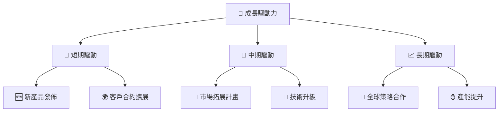

---

## 9. 風險矩陣

### 9.1 風險評分矩陣

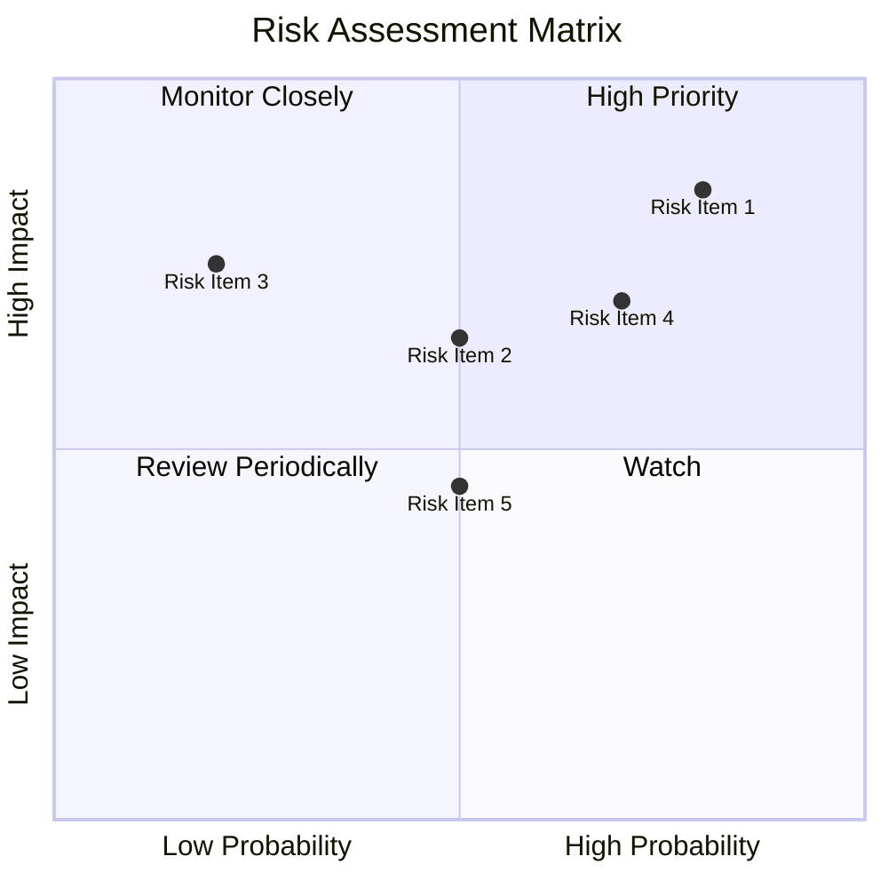

### 9.2 風險清單詳細分析

| # | 風險項目 | 發生機率 | 財務衝擊 | 風險評分 | 緩解措施 |
|---|----------|----------|----------|----------|----------|
| 1 | 🔴 **市場競爭加劇** | 高 (80%) | 高 (-15%收入) | 🔴 8.5/10 | 加強技術領先與差異化 |
| 2 | 🔴 **財務槓桿過高** | 高 (70%) | 高 (-20%資產) | 🔴 7.0/10 | 優化資本結構，減少債務 |
| 3 | 🟡 **技術風險** | 中 (50%) | 中 (-10%收入) | 🟡 6.5/10 | 提高研發投資 |
| 4 | 🟡 **宏觀經濟波動** | 中 (50%) | 中 (-5%收入) | 🟡 5.0/10 | 多元化市場布局 |
| 5 | 🟡 **法律合規風險** | 低 (20%) | 高 (-10%收入) | 🟡 7.5/10 | 加強法律合規審查 |

---

## 10. 投資建議

### 10.1 最終綜合評級雷達圖

```
╔══════════════════════════════════════════════════════════════════╗
║                  最終綜合評級雷達圖                              ║
╠══════════════════════════════════════════════════════════════════╣
║                                                                  ║
║  基本面：6.0                                                     ║
║  成長性：8.0                                                     ║
║  獲利能力：3.0                                                   ║
║  財務健康：5.0                                                   ║
║  估值合理性：4.0                                                 ║
║                                                                  ║
╚══════════════════════════════════════════════════════════════════╝
```

### 10.2 目標價與隱含報酬率

| 情境 | 目標價 | 隱含報酬率 | 機率權重 |
|------|--------|------------|----------|
| 🟢 樂觀 | $50.00 | +28% | 20% |
| 🟡 基準 | $40.00 | +2% | 60% |
| 🔴 悲觀 | $30.00 | -23% | 20% |

### 10.3 買入時機與觸發因素

```
╔══════════════════════════════════════════════════════════════════╗
║                  ✅ 買入觸發因素 Checklist                      ║
╠══════════════════════════════════════════════════════════════════╣
║                                                                  ║
║  立即買入觸發條件（多數符合）：                                  ║
║  ✅ 技術領先地位得到確認                                        ║
║  ✅ 收入持續增長超過行業平均                                    ║
║                                                                  ║
║  加碼觸發條件（出現以下任一）：                                  ║
║  ☐ 評估估值回落至合理範圍                                      ║
║                                                                  ║
║  減碼/停損觸發條件（出現以下任一）：                             ║
║  ☐ 淨利率持續惡化                                              ║
║  ☐ 擔心市場競爭加劇影響                                        ║
║                                                                  ║
╚══════════════════════════════════════════════════════════════════╝
```

### 10.4 投資人適配度分析

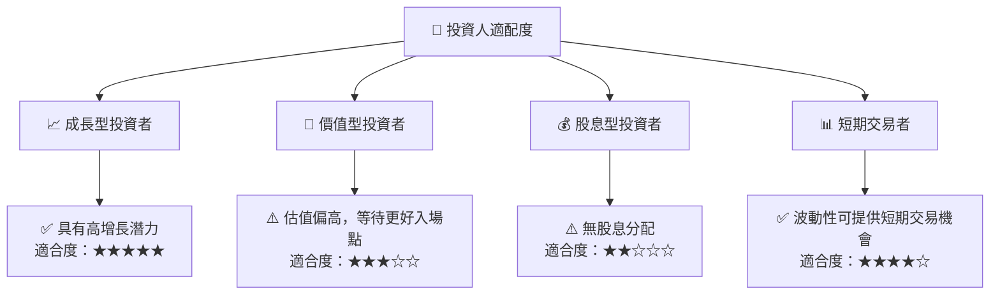

### 10.5 關鍵監控指標

| 監控類型 | 指標 | 關注點 | 頻率 |
|----------|------|--------|------|
| 財務績效 | 收入增長率 | 是否持續超過行業平均 | 季度 |
| 盈利能力 | 淨利率 | 是否能夠持續改善 | 季度 |
| 市場動態 | 競爭對手動態 | 是否有新進入者或技術突破 | 半年 |
| 技術創新 | 研發投入 | 是否保持在高水平 | 年度 |

---

> **免責聲明**：本報告為 AI 自動生成，僅供研究參考，不構成投資建議。投資有風險，入市需謹慎。