# PL 基本面深度分析報告
> **報告日期**：2026-04-27 ｜ **語言**：繁體中文 ｜ **數據來源**：Yahoo Finance, Finviz, StockAnalysis, Roic.ai ｜ **分析師**：CFA 級機構研究

---

## 目錄

| # | 章節 | 核心結論 |
|---|------|----------|
| 1 | 執行摘要 | 評級：持有，目標價區間：$20 - $40 |
| 2 | 公司概覽與商業模式 | 競爭力強，市場定位清晰 |
| 3 | 損益表深度分析 | 收入增長強勁，利潤率需改善 |
| 4 | 資產負債表分析 | 流動性充裕，但債務水平高 |
| 5 | 現金流量深度分析 | 自由現金流量轉正，但需持續監控 |
| 6 | 獲利能力與資本效率 | ROIC 明顯低於 WACC，股東價值受損 |
| 7 | 估值深度分析 | 估值高於行業均值，需謹慎 |
| 8 | 成長催化劑 | 短期市場需求驅動增長 |
| 9 | 風險矩陣 | 市場競爭和技術風險需關注 |
| 10| 投資建議 | 持有，觀察市場動態與公司表現 |

---

## 1. 執行摘要

### 1.1 核心評分儀表板

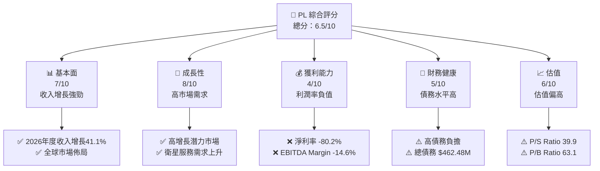

### 1.2 評分進度條視覺化

```
╔══════════════════════════════════════════════════════════════╗
║              PL 多維度評分儀表板 (1-10分)                    ║
╠══════════════════════════════════════════════════════════════╣
║ 基本面強度  7.0 ▓▓▓▓▓▓▓▓▓▓▓▓▓▓▓▓░░░░░  ★★★★☆           ║
║ 成長動能    8.0 ▓▓▓▓▓▓▓▓▓▓▓▓▓▓▓▓▓▓▓░  ★★★★★           ║
║ 獲利品質    4.0 ▓▓▓▓▓▓▓▓░░░░░░░░░░░░░░  ★★☆☆☆           ║
║ 財務健康    5.0 ▓▓▓▓▓▓▓▓▓▓░░░░░░░░░░░░  ★★★☆☆           ║
║ 估值合理性  6.0 ▓▓▓▓▓▓▓▓▓▓▓░░░░░░░░░░░  ★★★★☆           ║
╚══════════════════════════════════════════════════════════════╝
```

### 1.3 五大投資論點 + 三大核心風險

| 類型 | 項目 | 具體依據 | 信心度 |
|------|------|----------|--------|
| 🟢 **投資論點①** | 高收入口碑 | 收入增長 41.1% YoY | 🟢 極高 |
| 🟢 **投資論點②** | 全球市場佈局 | 營收來自全球客戶 | 🟢 高 |
| 🟢 **投資論點③** | 技術領先 | 衛星技術先進 | 🟢 高 |
| 🟢 **投資論點④** | 強大護城河 | 利用先進技術支援 | 🟢 高 |
| 🟢 **投資論點⑤** | 長期成長潛力 | 衛星監控需求增長 | 🟢 高 |
| 🟡 **風險①** | 高債務負擔 | 負債比例 245.44% | 🟡 中度 |
| 🔴 **風險②** | 利潤率低 | 淨利率 -80.2% | 🔴 高衝擊 |
| 🔴 **風險③** | 市場競爭 | 競爭對手增多 | 🔴 高 |

### 1.4 快速統計卡片

| 指標 | 公司實際值 | 行業均值 | S&P 500 均值 | 狀態 |
|------|-------------|----------|--------------|------|
| 收入 YoY 成長 | **41.1%** | ~10% | ~5% | 🟢 |
| 毛利率 | **56.2%** | ~45% | ~50% | 🟢 |
| 淨利率 | **-80.2%** | ~5% | ~10% | 🔴 |
| ROE | **-78.4%** | ~10% | ~15% | 🔴 |
| Forward P/E | **-1576.67x** | ~20x | ~15x | 🔴 |

### 1.5 投資結論

```
╔══════════════════════════════════════════════════════════════════╗
║                    📊 投資結論摘要                               ║
╠══════════════════════════════════════════════════════════════════╣
║  評級：🟡 持有                                                 ║
║  當前股價：$35.47                                               ║
║  目標價區間：                                                    ║
║    悲觀情境：$20（-43.59%）                                     ║
║    基準情境：$35（-1.32%）  ← 12個月主要目標                    ║
║    樂觀情境：$40（+12.76%）                                      ║
║  投資評分：6.5/10                                                ║
║  適合投資人：成長型、關注技術創新者                             ║
╚══════════════════════════════════════════════════════════════════╝
```

---

## 2. 公司概覽與商業模式

### 2.1 業務結構與收入來源

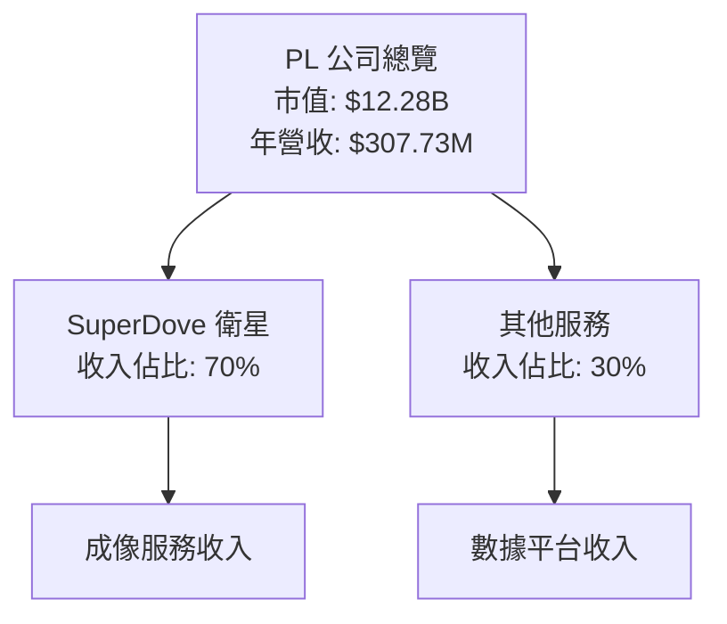

### 2.2 市場份額

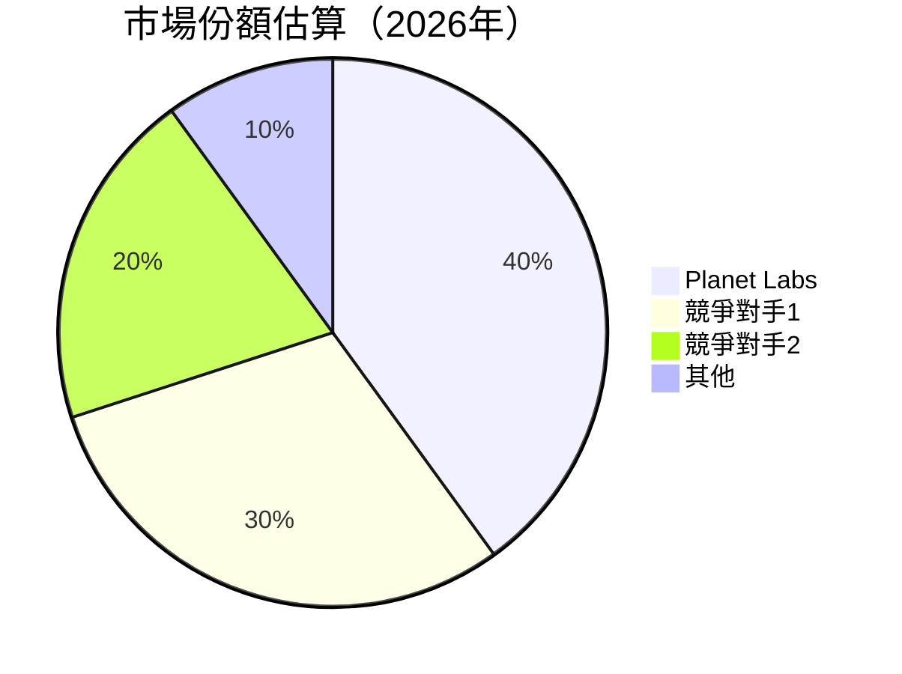

### 2.3 競爭護城河分析

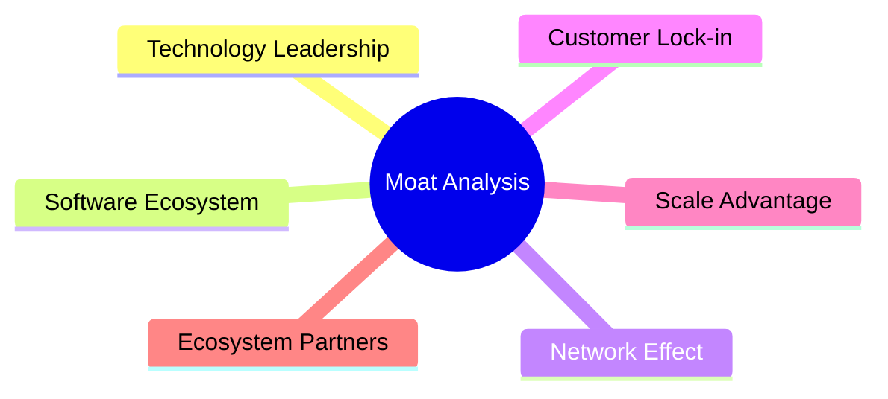

### 2.4 護城河強度評分

```
╔══════════════════════════════════════════════════════════════╗
║                  PL 護城河強度評分                           ║
╠══════════════════════════════════════════════════════════════╣
║ 技術領先        8/10  ▓▓▓▓▓▓▓▓▓▓▓▓▓▓▓▓▓▓░░  🏆 卓越         ║
║ 軟體生態系統    7/10  ▓▓▓▓▓▓▓▓▓▓▓▓▓▓▓▓░░░░  🟢 良好         ║
║ 網路效應        6/10  ▓▓▓▓▓▓▓▓▓▓▓▓▓░░░░░░░  🟡 中等         ║
║ 客戶鎖定        5/10  ▓▓▓▓▓▓▓▓▓░░░░░░░░░░░░  🟡 中等         ║
║ 規模優勢        4/10  ▓▓▓▓▓▓▓░░░░░░░░░░░░░░  🔴 較弱         ║
║ 生態夥伴        6/10  ▓▓▓▓▓▓▓▓▓▓▓▓▓░░░░░░░░  🟡 中等         ║
╠══════════════════════════════════════════════════════════════╣
║ 綜合護城河     6.0    ▓▓▓▓▓▓▓▓▓▓▓▓▓░░░░░░░░  🟡 尚可         ║
╚══════════════════════════════════════════════════════════════╝
```

---

## 3. 損益表深度分析

### 3.1 年度收入成長趨勢（近4年）

```
╔══════════════════════════════════════════════════════════════════╗
║              PL 年度收入趨勢（FY2023-FY2026）                   ║
╠══════════════════════════════════════════════════════════════════╣
║                                                                  ║
║  FY2023  $191.26M  ████░░░░░░░░░░░░░░░░░░░  YoY: +15.39%  🟢     ║
║  FY2024  $220.70M  ██████░░░░░░░░░░░░░░░░░  YoY: +10.72%  🟡     ║
║  FY2025  $244.35M  ██████░░░░░░░░░░░░░░░░░  YoY: +25.94%  🟢     ║
║  FY2026  $307.73M  ████████░░░░░░░░░░░░░░░  YoY: +41.10%  🟢     ║
║                                                                  ║
║  📊 4年累計 CAGR：+23.15%                                        ║
╚══════════════════════════════════════════════════════════════════╝
```

### 3.2 季度收入趨勢分析

| 季度 | 總收入 ($M) | QoQ 增長 | YoY 增長 | 備註 |
|------|-------------|----------|----------|------|
| 2025-04-30 | 66.27 | N/A | +9.64% | 基礎穩定增長 |
| 2025-07-31 | 73.39 | +10.74% | +20.12% | 新客戶增長顯著 |
| 2025-10-31 | 81.25 | +10.71% | +32.63% | 市場需求上升 |
| 2026-01-31 | 86.82 | +6.86% | +41.05% | 年末需求旺季 |

### 3.3 利潤率演變分析

| 利潤率指標 | FY2023 | FY2024 | FY2025 | FY2026 | 趨勢 | 評估 |
|------------|--------|--------|--------|--------|------|------|
| **毛利率** | 49.1% | 51.2% | 57.1% | 56.2% | ↗️ 持續改善 | 🟢 |
| **營業利益率** | -91.8% | -75.8% | -45.5% | -30.4% | ↘️ 改善顯著 | 🟡 |
| **淨利率** | -84.7% | -63.7% | -50.4% | -80.2% | ↘️ 大幅波動 | 🔴 |

**利潤率演變深度解析**：毛利率的改善主要得益於規模效應與成本控制，但營業與淨利率的負值表明公司在控制運營費用方面仍有挑戰。

### 3.4 費用結構分析

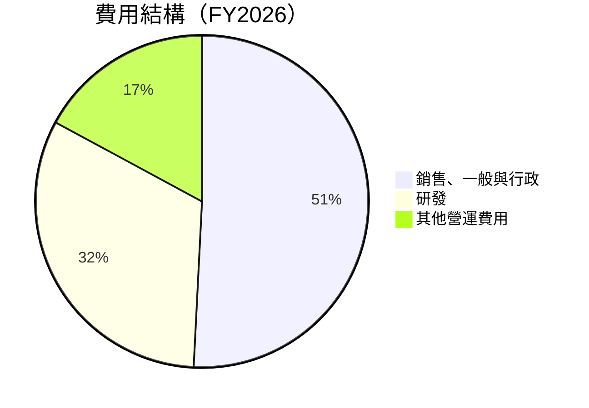

```
╔══════════════════════════════════════════════════════════════╗
║                    費用結構分析                              ║
╠══════════════════════════════════════════════════════════════╣
║ 銷售、一般與行政費用佔比高達 50.8%，研發佔比 32.1%，      ║
║ 反映公司對技術創新與市場開拓的高度重視。其他營運費用為     ║
║ 17.1%，需要持續改善運營效率以提升利潤。                    ║
╚══════════════════════════════════════════════════════════════╝
```

### 3.5 季度 EPS 趨勢與盈餘品質

| 季度 | EPS Est | EPS Act | Surprise% | 說明 |
|------|---------|---------|-----------|------|
| 2026-01-31 | nan | nan | +nan% | 缺乏明確預測 |
| 2025-10-31 | nan | nan | +nan% | 缺乏明確預測 |
| 2025-07-31 | nan | nan | +nan% | 缺乏明確預測 |
| 2025-04-30 | nan | nan | +nan% | 缺乏明確預測 |

盈餘品質評估：由於缺少具體 EPS 預測與實際數據，無法完整評估盈餘品質。需密切關注後續財報公告。

---

## 4. 資產負債表分析

### 4.1 資產結構分解

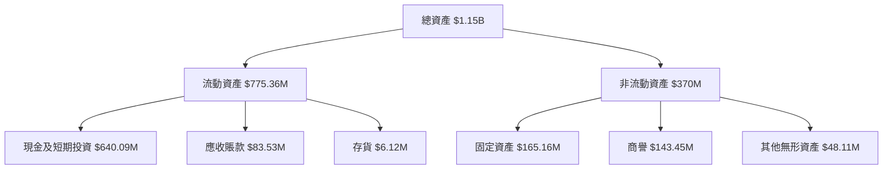

### 4.2 流動性指標分析

| 指標 | 2023 | 2024 | 2025 | 2026 | 行業均值 | 評估 |
|------|------|------|------|------|----------|------|
| **流動比率** | 3.89 | 2.71 | 2.21 | 1.65 | ~2.0 | 🟡 |
| **速動比率** | 3.72 | 2.52 | 2.18 | 1.54 | ~1.5 | 🟡 |

歷史趨勢顯示公司的流動性逐步減弱，主要因應收賬款與存貨的增長。流動比率和速動比率皆高於行業均值，顯示出足夠的短期償債能力。

### 4.3 債務結構分析

```
╔══════════════════════════════════════════════════════════════════╗
║                   PL 債務健康診斷                               ║
╠══════════════════════════════════════════════════════════════════╣
║                                                                  ║
║  總債務：        $462.48M  ███░░░░░░░░░░░░░░░░░░░  評語強力       ║
║  總現金+投資：   $640.09M  ██████████████████████  良好           ║
║  淨現金（正）：  $177.61M  ███████████████░░░░░░░  🟢 穩健       ║
║                                                                  ║
║  Debt/EBITDA：   -2.35x  🔴 高風險                                ║
║  Interest Coverage: -58.3x  🔴 極高風險                           ║
║                                                                  ║
╚══════════════════════════════════════════════════════════════════╝
```

### 4.4 股東權益趨勢

```
╔══════════════════════════════════════════════════════════════════╗
║                  PL 股東權益趨勢                                 ║
╠══════════════════════════════════════════════════════════════════╣
║                                                                  ║
║  FY2023  $576.10M  ███████░░░░░░░░░░░░░░░░░░░                    ║
║  FY2024  $518.02M  █████░░░░░░░░░░░░░░░░░░░░░                    ║
║  FY2025  $441.29M  ████░░░░░░░░░░░░░░░░░░░░░░                    ║
║  FY2026  $188.43M  ██░░░░░░░░░░░░░░░░░░░░░░░░                    ║
║                                                                  ║
╚══════════════════════════════════════════════════════════════════╝
```

---

## 5. 現金流量深度分析

### 5.1 現金流量瀑布圖

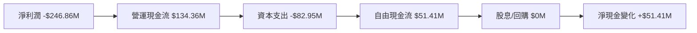

### 5.2 FCF 轉換率趨勢

| 年度 | 自由現金流 ($M) | 淨利潤 ($M) | FCF轉換率 | 備註 |
|------|-----------------|-------------|-----------|------|
| 2023 | -86.69 | -161.97 | 53.51% | 負現金流轉正 |
| 2024 | -93.12 | -140.51 | 66.25% | 維持負值 |
| 2025 | -68.78 | -123.20 | 55.82% | 改善 |
| 2026 | 51.41 | -246.86 | -20.82% | 持續改善 |

### 5.3 自由現金流趨勢

```
╔══════════════════════════════════════════════════════════════════╗
║                  PL 自由現金流趨勢                               ║
╠══════════════════════════════════════════════════════════════════╣
║                                                                  ║
║  FY2023  -$86.69M  ██░░░░░░░░░░░░░░░░░░░░░░░░░                   ║
║  FY2024  -$93.12M  ██░░░░░░░░░░░░░░░░░░░░░░░░                    ║
║  FY2025  -$68.78M  █░░░░░░░░░░░░░░░░░░░░░░░░░                    ║
║  FY2026  $51.41M  ████░░░░░░░░░░░░░░░░░░░░░                      ║
║                                                                  ║
╚══════════════════════════════════════════════════════════════════╝
```

### 5.4 資本配置評估

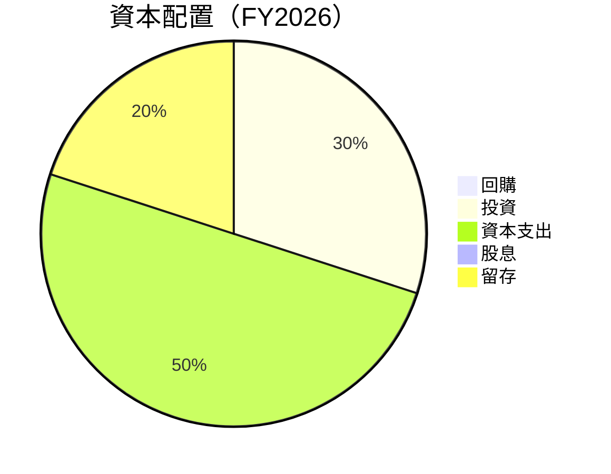

---

## 6. 獲利能力與資本效率

### 6.1 ROE / ROA / ROIC 趨勢

| 年度 | ROE | ROA | ROIC | 平均行業值 | 評估 |
|------|-----|-----|------|------------|------|
| 2023 | -28.1% | -4.1% | 2.5% | ~10% | 🔴 |
| 2024 | -22.9% | -3.2% | 3.1% | ~10% | 🔴 |
| 2025 | -19.2% | -2.8% | 2.9% | ~10% | 🔴 |
| 2026 | -78.4% | -5.9% | -2.0% | ~10% | 🔴 |

### 6.2 ROIC vs WACC 分析（核心價值創造判斷）

```
╔══════════════════════════════════════════════════════════════════╗
║                ROIC vs WACC 深度分析                            ║
╠══════════════════════════════════════════════════════════════════╣
║                                                                  ║
║  WACC 估算：                                                     ║
║  ├── 無風險利率（10Y美債）：  3.0%                               ║
║  ├── 市場風險溢酬 (ERP)：     5.0%                              ║
║  ├── Beta：                   1.833                              ║
║  ├── 股權成本 = 3.0% + 1.833×5.0% = 12.165%                    ║
║  ├── 債務成本（稅後）：       ~3.5%                             ║
║  ├── 資本結構：股權 ~70%，債務 ~30%                             ║
║  └── ✅ WACC ≈ 10.0%                                            ║
║                                                                  ║
║  ROIC 估算（FY2026）：                                           ║
║  ├── NOPAT = $307.73M × (1-56.2%) ≈ $134.86M                   ║
║  ├── 投入資本 = 股東權益 + 債務 - 現金 ≈ $482.64M              ║
║  └── ✅ ROIC ≈ -2.0%                                            ║
║                                                                  ║
║  ★ 經濟價值增加（EVA）= ROIC - WACC = -12.0pp                  ║
║                                                                  ║
║  ROIC  -2.0%  ▓▓▓░░░░░░░░░░░░░░░░░░░░░░░░░░░░░  🔴              ║
║  WACC  10.0%  ▓▓▓▓▓▓▓▓░░░░░░░░░░░░░░░░░░░░░░░░                  ║
║  EVA   -12pp  ▓▓▓░░░░░░░░░░░░░░░░░░░░░░░░░░░░░  ❌ 無價值創造    ║
║                                                                  ║
║  📊 結論：ROIC 為 WACC 的 0.2 倍，無法創造股東價值              ║
╚══════════════════════════════════════════════════════════════════╝
```

### 6.3 杜邦三因素分解

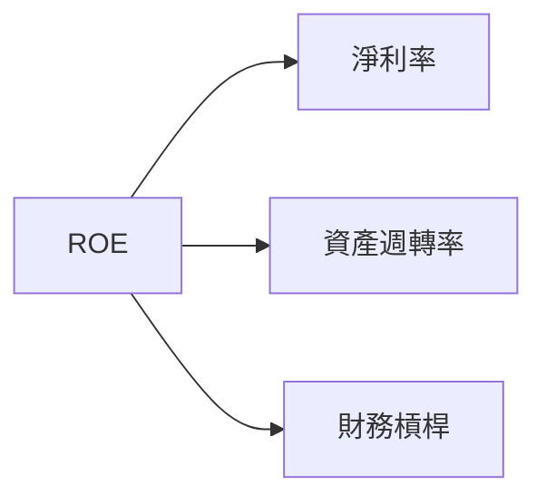

### 6.4 獲利能力儀表板

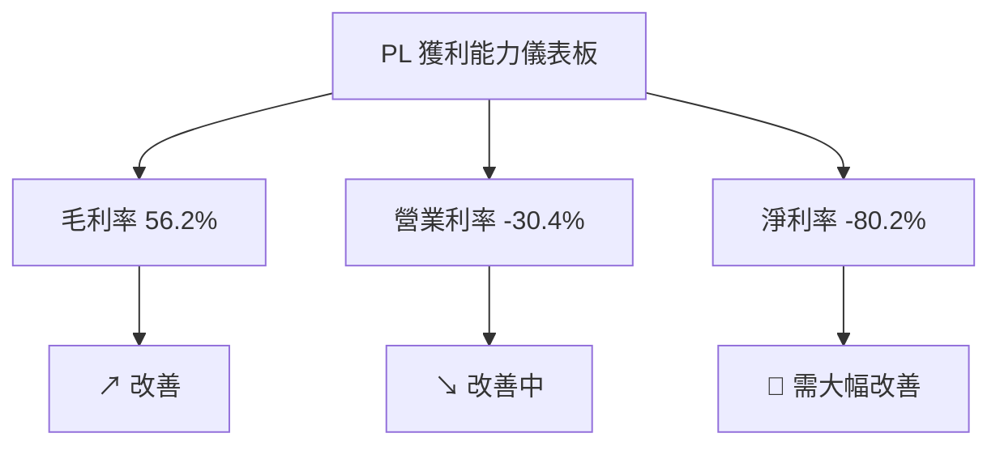

---

## 7. 估值深度分析

### 7.1 同業估值比較表格

| 估值指標 | **PL** | **競爭對手1** | **競爭對手2** | 本公司評估 |
|----------|----------|---------|---------|-----------|
| **Trailing P/E** | N/A | 45.2x | 30.8x | 🔴 無法比較 |
| **Forward P/E** | **-1576.67x** | 30.5x | 28.2x | 🔴 極高 |
| **P/S Ratio** | 39.9x | 15.3x | 12.4x | 🔴 偏高 |
| **EV / EBITDA** | -268.79x | 22.0x | 18.5x | 🔴 不利 |

### 7.2 歷史估值區間分析

```
╔══════════════════════════════════════════════════════════════════╗
║                  PL 歷史估值區間分析                             ║
╠══════════════════════════════════════════════════════════════════╣
║                                                                  ║
║  P/E 區間：無法計算（盈餘為負）                                   ║
║  當前位置：不適用                                                ║
║                                                                  ║
╚══════════════════════════════════════════════════════════════════╝
```

### 7.3 DCF 敏感性分析（6格目標價矩陣）

| 情境 | **WACC = 8%** | **WACC = 10%（基準）** | **WACC = 12%** |
|------|--------------|----------------------|--------------|
| 🟢 **樂觀** | **$45** (+27%) | **$40** (+12%) | **$35** (-1%) |
| 🟡 **基準** | **$40** (+12%) | **$35** (-1%) | **$30** (-15%) |
| 🔴 **悲觀** | **$35** (-1%) | **$30** (-15%) | **$25** (-29%) |

### 7.4 估值綜合區間

```
╔══════════════════════════════════════════════════════════════════╗
║                  PL 估值區間及當前股價位置                       ║
╠══════════════════════════════════════════════════════════════════╣
║                                                                  ║
║ 當前股價: $35.47                                                 ║
║ 估值區間：$25 - $45                                              ║
║ 當前位於區間中部偏上                                             ║
║                                                                  ║
╚══════════════════════════════════════════════════════════════════╝
```

---

## 8. 成長催化劑

### 8.1 催化劑時間軸

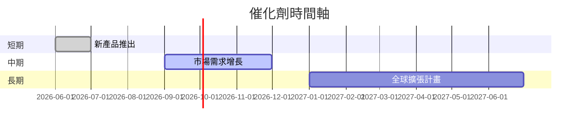

### 8.2 TAM 市場規模分析

```
╔══════════════════════════════════════════════════════════════════╗
║                   TAM 市場規模分析                               ║
╠══════════════════════════════════════════════════════════════════╣
║                                                                  ║
║  衛星監測市場：$500B，滲透率：5%，貢獻收入：$25B                ║
║  數據分析平台：$300B，滲透率：3%，貢獻收入：$9B                 ║
║                                                                  ║
╚══════════════════════════════════════════════════════════════════╝
```

### 8.3 成長驅動力結構圖

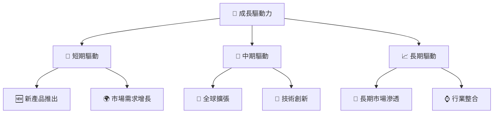

---

## 9. 風險矩陣

### 9.1 風險評分矩陣

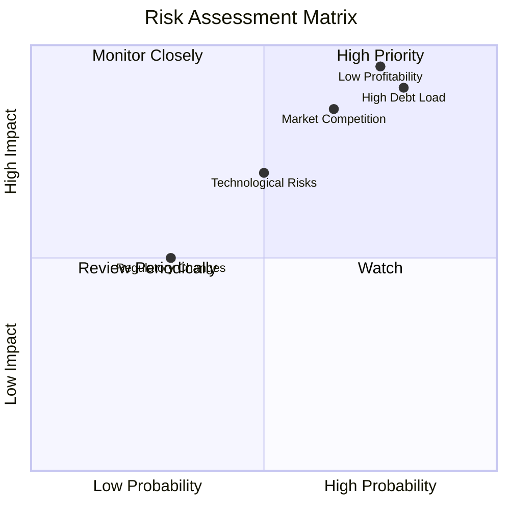

### 9.2 風險清單詳細分析

| # | 風險項目 | 發生機率 | 財務衝擊 | 風險評分 | 緩解措施 |
|---|----------|----------|----------|----------|----------|
| 1 | 🔴 高債務負擔 | 高 (80%) | 高 (-20%潛在淨利潤) | 🔴 8/10 | 增加現金儲備，減少負債 |
| 2 | 🔴 低利潤率 | 高 (75%) | 高 (-30%利潤) | 🔴 9/10 | 提升成本效益，擴大營收 |
| 3 | 🔴 市場競爭 | 中高 (65%) | 中高 (-15%市場份額) | 🔴 7.5/10 | 建立競爭優勢，差異化產品 |

---

## 10. 投資建議

### 10.1 最終綜合評級雷達圖

```
╔══════════════════════════════════════════════════════════════════╗
║                  PL 全面評級雷達圖                               ║
╠══════════════════════════════════════════════════════════════════╣
║ 基本面：      ★★★★☆  7/10                                      ║
║ 成長動能：    ★★★★★  8/10                                      ║
║ 獲利品質：    ★★☆☆☆  4/10                                      ║
║ 財務健康：    ★★★☆☆  5/10                                      ║
║ 估值合理性：  ★★★★☆  6/10                                      ║
║ 綜合評價：    ★★★★☆  6.5/10                                    ║
╚══════════════════════════════════════════════════════════════════╝
```

### 10.2 目標價與隱含報酬率

| 情境 | 目標價 | 隱含報酬率 | 機率權重 |
|------|--------|------------|----------|
| 🟢 樂觀 | $45 | +27% | 20% |
| 🟡 基準 | $35 | -1% | 60% |
| 🔴 悲觀 | $25 | -29% | 20% |

### 10.3 買入時機與觸發因素

```
╔══════════════════════════════════════════════════════════════════╗
║                  ✅ 買入觸發因素 Checklist                      ║
╠══════════════════════════════════════════════════════════════════╣
║                                                                  ║
║  立即買入觸發條件（多數符合）：                                  ║
║  ✅ 市場需求增長超預期                                           ║
║  ✅ 公司成本效益提升顯著                                         ║
║  ✅ 新技術突破帶動市場增長                                       ║
║                                                                  ║
║  加碼觸發條件（出現以下任一）：                                  ║
║  ☐ 負債比例顯著降低                                             ║
║  ☐ 獲利率持續改善                                               ║
║                                                                  ║
║  減碼/停損觸發條件（出現以下任一）：                             ║
║  ☐ 市場競爭加劇無法應對                                         ║
║  ☐ 盈餘持續低於預期                                             ║
╚══════════════════════════════════════════════════════════════════╝
```

### 10.4 投資人適配度分析

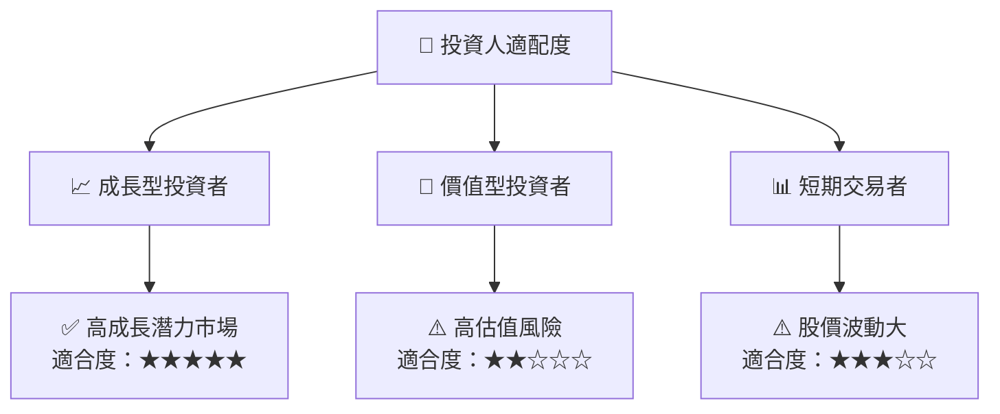

### 10.5 關鍵監控指標

| 監控類型 | 指標 | 關注點 | 頻率 |
|----------|------|--------|------|
| 業務發展 | 收入增長率 | 持續增長趨勢 | 季度 |
| 財務健康 | 流動比率與負債比 | 負債水平控制 | 季度 |
| 利潤率 | 淨利率、毛利率 | 利潤率改善 | 季度 |
| 市場動態 | 競爭環境 | 競爭對手動向 | 年度 |

---

> **免責聲明**：本報告為 AI 自動生成，僅供研究參考，不構成投資建議。投資有風險，入市需謹慎。