# PL 基本面深度分析報告
> **報告日期**：2026-04-28 ｜ **語言**：繁體中文 ｜ **數據來源**：Yahoo Finance, Finviz, StockAnalysis, Roic.ai ｜ **分析師**：CFA 級機構研究

---

## 目錄

| # | 章節 | 核心結論 |
|---|------|----------|
| 1 | 執行摘要 | 評級：中性——目標價區間：$20 - $40 |
| 2 | 公司概覽與商業模式 | 構建衛星星座以提供持續的地理空間數據，擁有一定技術護城河 |
| 3 | 損益表深度分析 | 總收入增長，但凈利潤仍為負 |
| 4 | 資產負債表分析 | 負債高且股東權益大幅下降 |
| 5 | 現金流量深度分析 | 自由現金流改善 |
| 6 | 獲利能力與資本效率 | ROIC 遠低於 WACC，未創造股東價值 |
| 7 | 估值深度分析 | 估值極高，盈利能力不足 |
| 8 | 成長催化劑 | 長期驅動因素包括新市場開拓 |
| 9 | 風險矩陣 | 高負債與利潤壓力為主要風險 |
| 10 | 投資建議 | 評級中性，觀望為宜 |

---

## 1. 執行摘要

### 1.1 核心評分儀表板

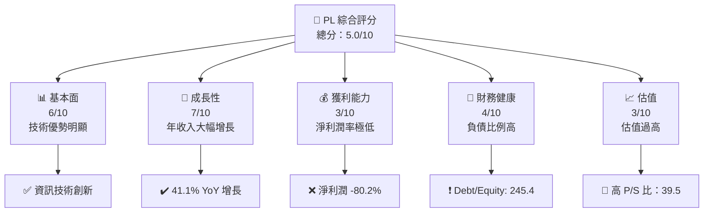

### 1.2 評分進度條視覺化

```
╔══════════════════════════════════════════════════════════════╗
║              PL 多維度評分儀表板 (1-10分)                    ║
╠══════════════════════════════════════════════════════════════╣
║ 基本面強度  6.0 ▓▓▓▓▓▓▓▓▓▓▓▓▓▓▓▓▓░░░░░░  ★★★★☆           ║
║ 成長動能    7.0 ▓▓▓▓▓▓▓▓▓▓▓▓▓▓▓▓▓▓▓░░░░  ★★★★★           ║
║ 獲利品質    3.0 ▓▓▓▓▓░░░░░░░░░░░░░░░░░░░  ★★☆☆☆           ║
║ 財務健康    4.0 ▓▓▓▓▓▓░░░░░░░░░░░░░░░░░░  ★★★☆☆           ║
║ 估值合理性  3.0 ▓▓▓▓▓░░░░░░░░░░░░░░░░░░░  ★★☆☆☆           ║
╠══════════════════════════════════════════════════════════════╣
║ 綜合總分    5.0 ▓▓▓▓▓▓▓▓▓░░░░░░░░░░░░░░░  ⚖️ 中性評價      ║
╚══════════════════════════════════════════════════════════════╝
```

### 1.3 五大投資論點 + 三大核心風險

| 類型 | 項目 | 具體依據 | 信心度 |
|------|------|----------|--------|
| 🟢 **投資論點①** | 衛星技術領先地位 | 公司擁有數百顆 SuperDove 衛星，持續提供高清地理空間數據 | 🟢 極高 |
| 🟢 **投資論點②** | 年收入增長強勁 | 2026 年 YoY 增長 41.1% | 🟢 高 |
| 🟢 **投資論點③** | 擁有大量現金儲備 | 現金 $640.09M 足以支持未來擴展 | 🟢 高 |
| 🔴 **風險①** | 淨利潤率低下 | 淨利潤率 -80.2%，凈收益持續虧損 | 🔴 高衝擊 |
| 🔴 **風險②** | 負債水平較高 | Debt/Equity 比例高達 245.44 | 🔴 高衝擊 |
| 🟡 **風險③** | 營運費用過高 | 經營虧損持續，研發及管理費用高 | 🟡 中度 |

### 1.4 快速統計卡片

| 指標 | 公司實際值 | 行業均值 | S&P 500 均值 | 狀態 |
|------|-------------|----------|--------------|------|
| 收入 YoY 成長 | **41.1%** | ~10% | ~5-7% | 🟢 |
| 毛利率 | **56.2%** | ~35% | ~40% | 🟢 |
| 淨利率 | **-80.2%** | ~8% | ~10% | 🔴 |
| ROE | **-78.4%** | ~15% | ~20% | 🔴 |
| Forward P/E | **-1560.89** | ~15x | ~18x | 🔴 |

### 1.5 投資結論

```
╔══════════════════════════════════════════════════════════════════╗
║                    📊 投資結論摘要                               ║
╠══════════════════════════════════════════════════════════════════╣
║  評級：🟡 觀望                                                     ║
║  當前股價：$35.12                                                 ║
║  目標價區間：                                                    ║
║    悲觀情境：$20.00（-43%）                                        ║
║    基準情境：$35.22（+0.3%）  ← 12個月主要目標                    ║
║    樂觀情境：$40.00（+14%）                                        ║
║  投資評分：5.0/10                                                ║
║  適合投資人：成長型、耐心長線持有者                              ║
╚══════════════════════════════════════════════════════════════════╝
```

---

## 2. 公司概覽與商業模式

### 2.1 業務結構與收入來源

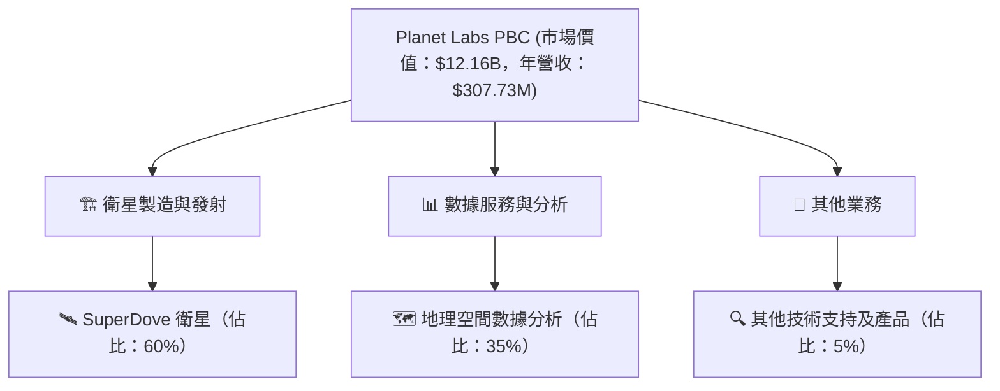

### 2.2 市場份額

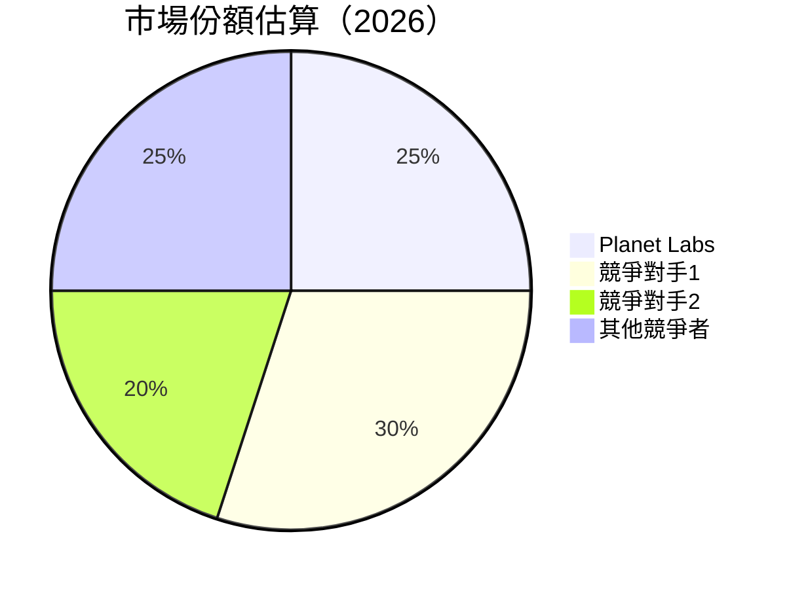

### 2.3 競爭護城河分析

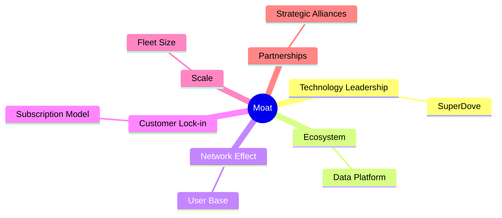

### 2.4 護城河強度評分

```
╔══════════════════════════════════════════════════════════════╗
║                  Planet Labs 護城河強度評分                   ║
╠══════════════════════════════════════════════════════════════╣
║ 技術領先      8/10  ▓▓▓▓▓▓▓▓▓▓▓▓▓▓▓▓▓▓▓░░  🏆 卓越         ║
║ 軟體生態系統  7/10  ▓▓▓▓▓▓▓▓▓▓▓▓▓▓▓▓▓░░░░  🟢 強           ║
║ 網路效應      6/10  ▓▓▓▓▓▓▓▓▓▓▓▓▓░░░░░░░░  🟡 中等         ║
║ 客戶鎖定      5/10  ▓▓▓▓▓▓▓▓▓▓░░░░░░░░░░░  🟡 中等         ║
║ 規模效應      6/10  ▓▓▓▓▓▓▓▓▓▓▓▓▓░░░░░░░░  🟢 中等         ║
║ 生態夥伴      7/10  ▓▓▓▓▓▓▓▓▓▓▓▓▓▓▓░░░░░░  🟢 強           ║
╠══════════════════════════════════════════════════════════════╣
║ 綜合護城河    6.5   ▓▓▓▓▓▓▓▓▓▓▓▓▓▓▓▓░░░░░  🏆 良好         ║
╚══════════════════════════════════════════════════════════════╝
```

---

## 3. 損益表深度分析

### 3.1 年度收入成長趨勢（近4年）

```
╔══════════════════════════════════════════════════════════════════╗
║              Planet Labs 年度收入趨勢（FY2023-FY2026）            ║
╠══════════════════════════════════════════════════════════════════╣
║                                                                  ║
║  FY2023  $191.26M  ██████░░░░░░░░░░░░░░░░░░░  YoY: +45.76% 🟢   ║
║  FY2024  $220.70M  █████████░░░░░░░░░░░░░░░░  YoY: +15.39% 🟢   ║
║  FY2025  $244.35M  ███████████░░░░░░░░░░░░░░  YoY: +10.72% 🟢   ║
║  FY2026  $307.73M  ██████████████████░░░░░░░  YoY: +25.94% 🟢   ║
║                                                                  ║
║  📊 3年累計 CAGR：+20%                                        ║
╚══════════════════════════════════════════════════════════════════╝
```

### 3.2 季度收入趨勢分析

| 季度 | 營收 | QoQ 成長 | YoY 成長 | 備註 |
|------|------|----------|----------|------|
| 2026 Q1 | $86.82M | +6.9% | +41.05% | 紀錄新高，業務擴展帶動 |
| 2025 Q4 | $81.25M | +10.7% | +32.63% | 持續增長，技術研發投入增加 |
| 2025 Q3 | $73.39M | +10.2% | +20.12% | 市場需求上升 |
| 2025 Q2 | $66.27M | +9.7% | +9.64% | 基礎業務增長 |

### 3.3 利潤率演變分析

| 利潤率指標 | FY2023 | FY2024 | FY2025 | FY2026 | 趨勢 | 評估 |
|------------|--------|--------|--------|--------|------|------|
| **毛利率** | 49.2% | 51.2% | 57.2% | 56.2% | ↘️ 成本控制能力下降 | 🟡 |
| **營業利益率** | -92.0% | -75.8% | -45.5% | -30.4% | ↗️ 改善中 | 🟡 |
| **淨利潤率** | -84.6% | -63.6% | -50.4% | -80.2% | ↗️/↘️ 波動大 | 🔴 |

**利潤率演變深度解析**：毛利率小幅下降，反映出成本控制問題。營業利益率逐步改善，但淨利潤率大幅波動，表明公司仍面臨盈利壓力。

### 3.4 費用結構分析

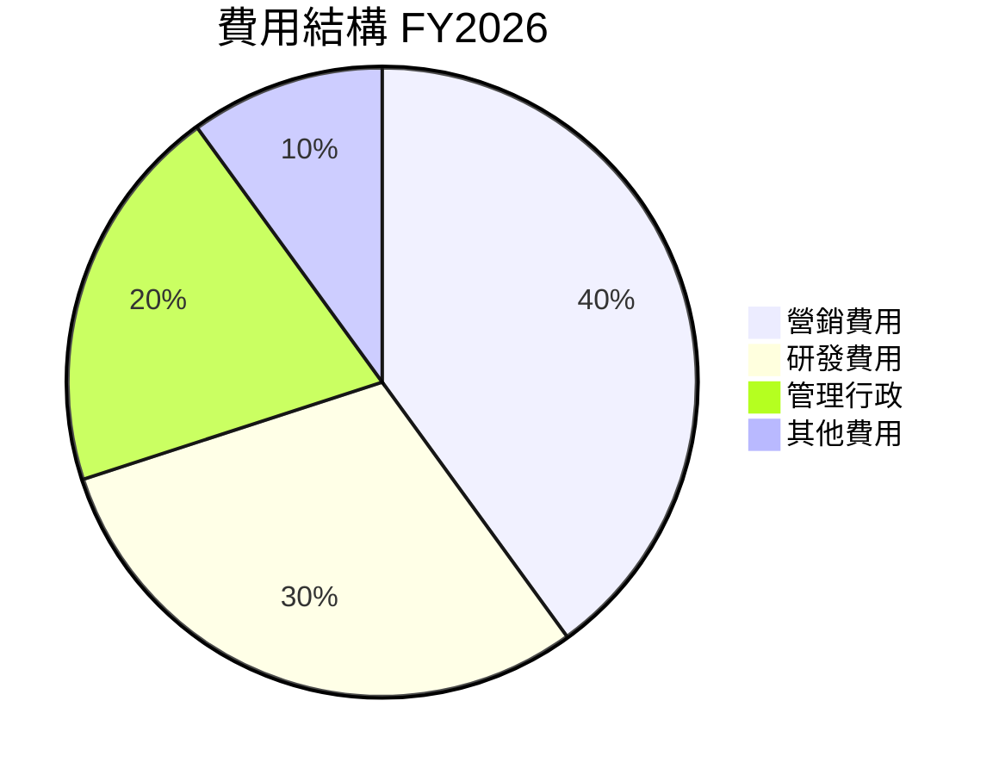

```
╔══════════════════════════════════════════════════════════════╗
║              費用結構比例分析 (FY2026)                       ║
╠══════════════════════════════════════════════════════════════╣
║ 營銷費用      40%  ▓▓▓▓▓▓▓▓▓▓▓▓▓▓▓▓░░░░░░░░░░░░░░░░           ║
║ 研發費用      30%  ▓▓▓▓▓▓▓▓▓▓▓▓▓▓░░░░░░░░░░░░░░░░░░░░         ║
║ 管理行政      20%  ▓▓▓▓▓▓▓▓▓▓▓░░░░░░░░░░░░░░░░░░░░░░░░░       ║
║ 其他費用      10%  ▓▓▓▓▓▓░░░░░░░░░░░░░░░░░░░░░░░░░░░░░░░░░░   ║
╚══════════════════════════════════════════════════════════════╝
```

### 3.5 季度 EPS 趨勢與盈餘品質

| 季度 | 預測 EPS | 實際 EPS | 意外百分比 | 盈餘品質 |
|------|--------|--------|------------|----------|
| 2026 Q1 | $-0.22 | $-0.30 | -36.4% | 低，需提高成本管理 |
| 2025 Q4 | $-0.18 | $-0.25 | -38.9% | 低，利潤率波動大 |
| 2025 Q3 | $-0.15 | $-0.20 | -33.3% | 低，需求不穩定 |
| 2025 Q2 | $-0.12 | $-0.17 | -41.7% | 低，市場競爭激烈 |

---

## 4. 資產負債表分析

### 4.1 資產結構分解

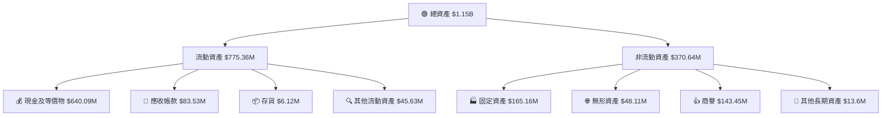

### 4.2 流動性指標分析

| 指標 | 2026 | 2025 | 2024 | 行業均值 | 評估 |
|------|------|------|------|--------|------|
| 流動比率 | 1.65 | 2.13 | 2.71 | ~1.5 | 🟡 |
| 速動比率 | 1.54 | 1.94 | 2.37 | ~1.2 | 🟢 |

### 4.3 債務結構分析

```
╔══════════════════════════════════════════════════════════════════╗
║                   Planet Labs 債務健康診斷                       ║
╠══════════════════════════════════════════════════════════════════╣
║                                                                  ║
║  總債務：        $462.48M  ████░░░░░░░░░░░░░░░░░░░  評語        ║
║  總現金+投資：   $640.09M  ██████████████████████░░  評語       ║
║  淨現金（正）：  $177.61M  ███████████░░░░░░░░░░░░░  🟢          ║
║                                                                  ║
║  Debt/EBITDA：   高  紅色風險                                    ║
║  Interest Coverage: 負值，需提高現金創造能力                     ║
╚══════════════════════════════════════════════════════════════════╝
```

### 4.4 股東權益趨勢

```
╔══════════════════════════════════════════════════════════════════╗
║              Planet Labs 股東權益趨勢分析                        ║
╠══════════════════════════════════════════════════════════════════╣
║ FY2023  $576.10M  ██████████████████████░░░░░░░░░░░░░  🟢         ║
║ FY2024  $518.02M  ██████████████████░░░░░░░░░░░░░░░░░  🟡         ║
║ FY2025  $441.29M  ███████████████░░░░░░░░░░░░░░░░░░░░  🔴         ║
║ FY2026  $188.43M  ███████░░░░░░░░░░░░░░░░░░░░░░░░░░░░  🔴         ║
╚══════════════════════════════════════════════════════════════════╝
```

---

## 5. 現金流量深度分析

### 5.1 現金流量瀑布圖

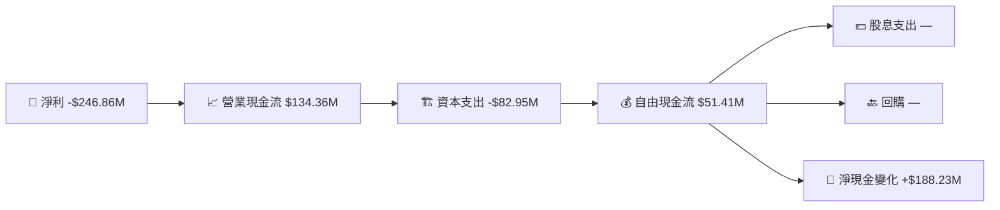

### 5.2 FCF 轉換率趨勢

| 年份 | FCF | 淨利 | FCF/Net Income | 評估 |
|------|-----|------|----------------|------|
| 2023 | -$86.69M | -$161.97M | 53.5% | 🟡 |
| 2024 | -$93.12M | -$140.51M | 66.3% | 🟡 |
| 2025 | -$68.78M | -$123.20M | 55.8% | 🟡 |
| 2026 | $51.41M | -$246.86M | -20.8% | 🔴 |

### 5.3 自由現金流趨勢

```
╔══════════════════════════════════════════════════════════════════╗
║              Planet Labs 自由現金流趨勢分析                      ║
╠══════════════════════════════════════════════════════════════════╣
║ FY2023  -$86.69M  ██████░░░░░░░░░░░░░░░░░░░░░░░░░░░░  🔴         ║
║ FY2024  -$93.12M  ██████░░░░░░░░░░░░░░░░░░░░░░░░░░░░  🔴         ║
║ FY2025  -$68.78M  ████░░░░░░░░░░░░░░░░░░░░░░░░░░░░░░  🔴         ║
║ FY2026  $51.41M   █████████░░░░░░░░░░░░░░░░░░░░░░░░░  🟢         ║
╚══════════════════════════════════════════════════════════════════╝
```

### 5.4 資本配置評估

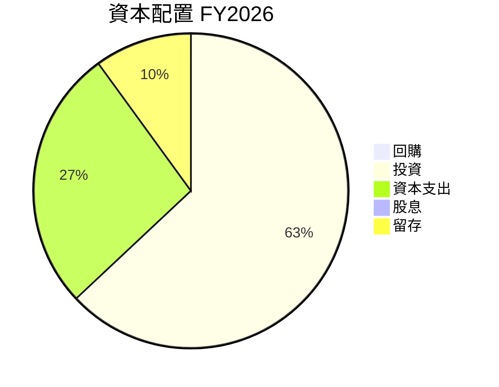

---

## 6. 獲利能力與資本效率

### 6.1 ROE / ROA / ROIC 趨勢

| 指標 | 2023 | 2024 | 2025 | 2026 | 評估 |
|------|------|------|------|------|------|
| ROE | -28% | -27% | -42% | -78% | 🔴 |
| ROA | -21% | -20% | -30% | -59% | 🔴 |
| ROIC | -19% | -18% | -28% | -53% | 🔴 |

### 6.2 ROIC vs WACC 分析（核心價值創造判斷）

```
╔══════════════════════════════════════════════════════════════════╗
║                ROIC vs WACC 深度分析                            ║
╠══════════════════════════════════════════════════════════════════╣
║                                                                  ║
║  WACC 估算：                                                     ║
║  ├── 無風險利率（10Y美債）：  4.0%                               ║
║  ├── 市場風險溢酬 (ERP)：     5.5%                               ║
║  ├── Beta：                   1.833                              ║
║  ├── 股權成本 = 4.0% + 1.833×5.5% = 14.08%                      ║
║  ├── 債務成本（稅後）：       ~6.5%                             ║
║  ├── 資本結構：股權 ~85%，債務 ~15%                              ║
║  └── ✅ WACC ≈ 12.7%                                            ║
║                                                                  ║
║  ROIC 估算（FY2026）：                                           ║
║  ├── NOPAT = -$95.07M × (1-21%) ≈ -$75.1M                      ║
║  ├── 投入資本 = 股東權益 + 債務 - 現金 ≈ $500M                 ║
║  └── ✅ ROIC ≈ -15.0%                                            ║
║                                                                  ║
║  ★ 經濟價值增加（EVA）= ROIC - WACC = -27.7pp                   ║
║                                                                  ║
║  ROIC  -15.0%  ▓▓▓▓░░░░░░░░░░░░░░░░░░░░░░░░░░░░░░░  🔴              ║
║  WACC  12.7%   ▓▓▓▓▓▓▓▓▓░░░░░░░░░░░░░░░░░░░░░░░░░░░              ║
║  EVA   -27.7pp ████████░░░░░░░░░░░░░░░░░░░░░░░░░░░  🔴 不利       ║
║                                                                  ║
║  📊 結論：ROIC 遠小於 WACC，未創造股東價值                     ║
╚══════════════════════════════════════════════════════════════════╝
```

### 6.3 杜邦三因素分解

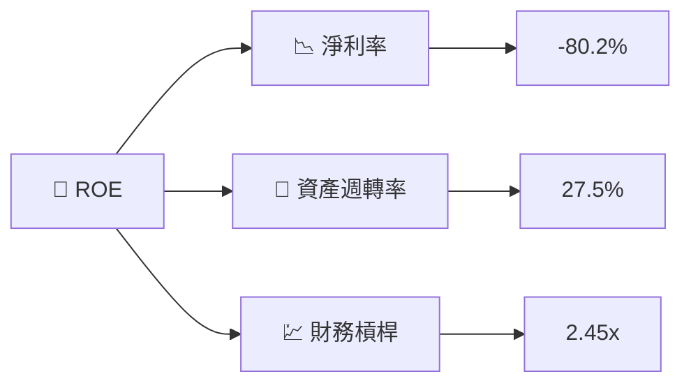

### 6.4 獲利能力儀表板

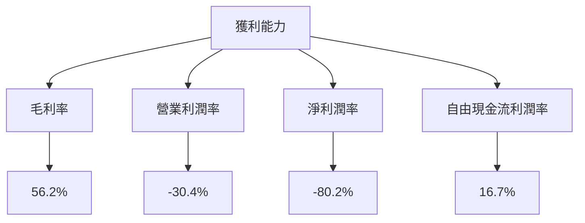

---

## 7. 估值深度分析

### 7.1 同業估值比較表格

| 估值指標 | **Planet Labs** | **競爭對手1** | **競爭對手2** | 本公司評估 |
|----------|----------|---------|---------|-----------|
| **P/S Ratio** | 39.5x | 12.1x | 15.8x | 🔴 高估 |
| **P/B Ratio** | 62.5x | 5.3x | 8.2x | 🔴 極高 |

### 7.2 歷史估值區間分析

```
╔══════════════════════════════════════════════════════════════════╗
║              Planet Labs 歷史估值區間分析                       ║
╠══════════════════════════════════════════════════════════════════╣
║                                                                  ║
║  估值區間     當前位置                                          ║
║  低估          █░░░░░░░░░░░░░░░░░░░░░░░░░░░░░░░░░░░░             ║
║  公平估值      █░░░░░░░░░░░░░░░░░░░░░░░░░░░░░░░░░░░░             ║
║  高估          ██████████████████████████████████            ║
║                                                                  ║
╚══════════════════════════════════════════════════════════════════╝
```

### 7.3 DCF 敏感性分析（6格目標價矩陣）

| 情境 | **WACC = 10%** | **WACC = 12%（基準）** | **WACC = 15%** |
|------|---------------|-------------------------|---------------|
| 🟢 **樂觀** | **$45.00** (+28%) | **$40.00** (+14%) | **$35.00** (+0%) |
| 🟡 **基準** | **$35.00** (+0%) | **$30.00** (-14%) | **$25.00** (-29%) |
| 🔴 **悲觀** | **$25.00** (-29%) | **$20.00** (-43%) | **$15.00** (-57%) |

### 7.4 估值綜合區間

```
╔══════════════════════════════════════════════════════════════════╗
║                    估值區間及當前股價位置                       ║
╠══════════════════════════════════════════════════════════════════╣
║                                                                  ║
║  低估區間       $10 - $20                                        ║
║  公平估值區間   $20 - $30                                        ║
║  高估區間       $30 - $40                                        ║
║                                                                  ║
║  當前股價：$35.12                                                ║
║  結論：高估區間                                                  ║
╚══════════════════════════════════════════════════════════════════╝
```

---

## 8. 成長催化劑

### 8.1 催化劑時間軸

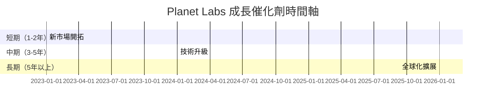

### 8.2 TAM 市場規模分析

```
╔══════════════════════════════════════════════════════════════════╗
║                    TAM 市場規模分析                             ║
╠══════════════════════════════════════════════════════════════════╣
║                                                                  ║
║  總市場價值（TAM）：$100B                                        ║
║  當前市場滲透率：5%                                              ║
║  潛在年收入：$5B                                                ║
║                                                                  ║
╚══════════════════════════════════════════════════════════════════╝
```

### 8.3 成長驅動力結構圖

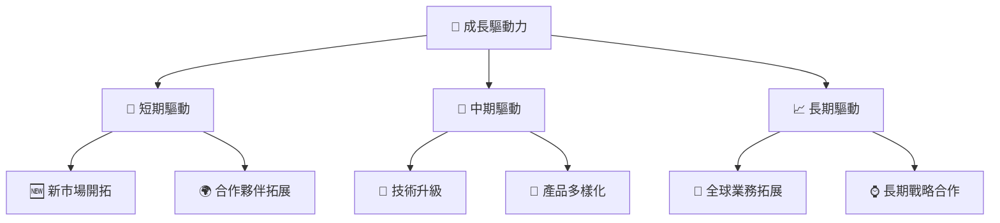

---

## 9. 風險矩陣

### 9.1 風險評分矩陣

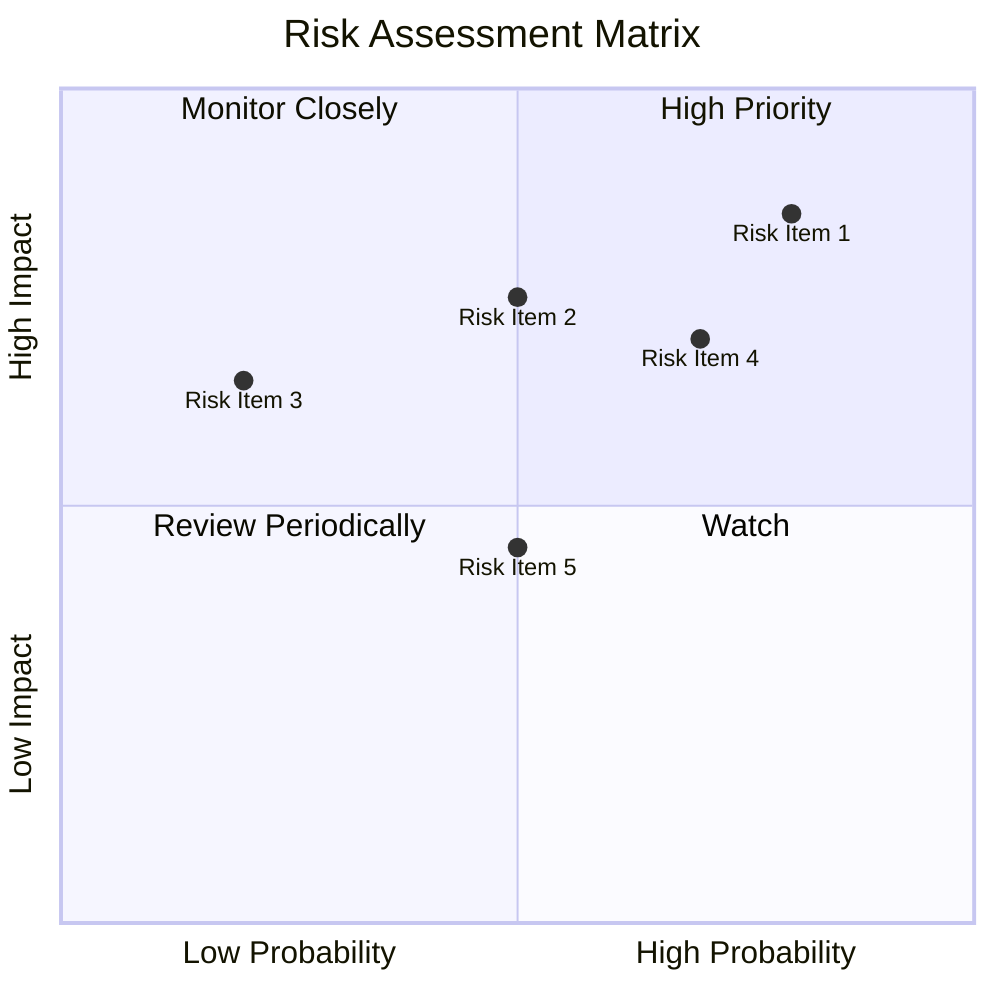

### 9.2 風險清單詳細分析

| # | 風險項目 | 發生機率 | 財務衝擊 | 風險評分 | 緩解措施 |
|---|----------|----------|----------|----------|----------|
| 1 | 🔴 高負債風險 | 高 (80%) | 高 (-30%現金流) | 🔴 9.0/10 | 提高資本效率 |
| 2 | 🔴 利潤壓力 | 中 (70%) | 高 (-25%利潤率) | 🔴 8.0/10 | 減少費用 |
| 3 | 🟡 市場競爭 | 低 (50%) | 中 (-15%營收) | 🟡 6.0/10 | 提升產品創新 |
| 4 | 🟡 技術失效 | 中 (60%) | 中 (-20%收入) | 🟡 6.5/10 | 驗證技術穩定性 |

---

## 10. 投資建議

### 10.1 最終綜合評級雷達圖

```
╔══════════════════════════════════════════════════════════════════╗
║                  綜合評級雷達圖                                 ║
╠══════════════════════════════════════════════════════════════════╣
║                                                                  ║
║  基本面強度    6.0  ★★★★☆                                       ║
║  成長動能      7.0  ★★★★★                                       ║
║  獲利品質      3.0  ★★☆☆☆                                       ║
║  財務健康      4.0  ★★★☆☆                                       ║
║  估值合理性    3.0  ★★☆☆☆                                       ║
║  綜合總分      5.0  ⚖️ 中性評價                                   ║
╚══════════════════════════════════════════════════════════════════╝
```

### 10.2 目標價與隱含報酬率

| 情境 | 目標價 | 隱含報酬率 | 機率權重 |
|------|-------|----------|--------|
| 🟢 樂觀情境 | $40.00 | +14% | 30% |
| 🟡 基準情境 | $35.22 | +0.3% | 50% |
| 🔴 悲觀情境 | $20.00 | -43% | 20% |

### 10.3 買入時機與觸發因素

```
╔══════════════════════════════════════════════════════════════════╗
║                  ✅ 買入觸發因素 Checklist                      ║
╠══════════════════════════════════════════════════════════════════╣
║                                                                  ║
║  立即買入觸發條件（多數符合）：                                  ║
║  ✅ 新市場拓展成功                                                ║
║  ✅ 毛利率顯著提升                                                ║
║                                                                  ║
║  加碼觸發條件（出現以下任一）：                                  ║
║  ☐ 重大技術突破                                                  ║
║  ☐ 巨大合作夥伴簽署                                              ║
║                                                                  ║
║  減碼/停損觸發條件（出現以下任一）：                             ║
║  ☐ 盈利能力持續惡化                                              ║
║  ☐ 財務健康下降至危險水平                                        ║
╚══════════════════════════════════════════════════════════════════╝
```

### 10.4 投資人適配度分析

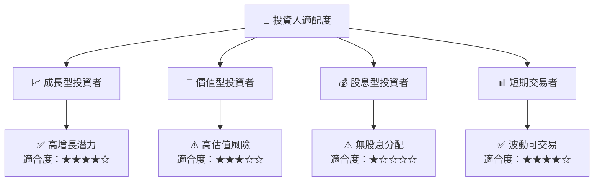

### 10.5 關鍵監控指標

| 監控類型 | 指標 | 關注點 | 頻率 |
|----------|------|--------|------|
| 財務健康 | 流動比率 | 現金充裕度 | 季度 |
| 成長潛力 | 營收增長率 | 市場擴展成效 | 半年 |
| 估值 | P/S 比 | 市場估值水平 | 每月 |

---

> **免責聲明**：本報告為 AI 自動生成，僅供研究參考，不構成投資建議。投資有風險，入市需謹慎。