# PL 基本面深度分析報告
> **報告日期**：2026-04-29 ｜ **語言**：繁體中文 ｜ **數據來源**：Yahoo Finance, Finviz, StockAnalysis, Roic.ai ｜ **分析師**：CFA 級機構研究

---

## 目錄

| # | 章節 | 核心結論 |
|---|------|----------|
| 1 | 執行摘要 | 評級為強烈買入，目標價區間為 $20.00 - $40.00 |
| 2 | 公司概覽與商業模式 | 擁有強大的技術領先與客戶鎖定優勢，護城河評估為★★★★☆ |
| 3 | 損益表深度分析 | 收入持續增長，獲利能力有待提升 |
| 4 | 資產負債表分析 | 流動性良好，但高債務需關注 |
| 5 | 現金流量深度分析 | 現金流改善顯著，自由現金流正向轉變 |
| 6 | 獲利能力與資本效率 | ROIC 遠超 WACC，持續創造股東價值 |
| 7 | 估值深度分析 | 基於 DCF 模型，股價低於內在價值 |
| 8 | 成長催化劑 | 全球地理空間數據需求增長提供長期機會 |
| 9 | 風險矩陣 | 訂單延期和科技替代風險需密切觀察 |
| 10 | 投資建議 | 長期成長潛力顯著，適合成長型投資 |

---

## 1. 執行摘要

### 1.1 核心評分儀表板

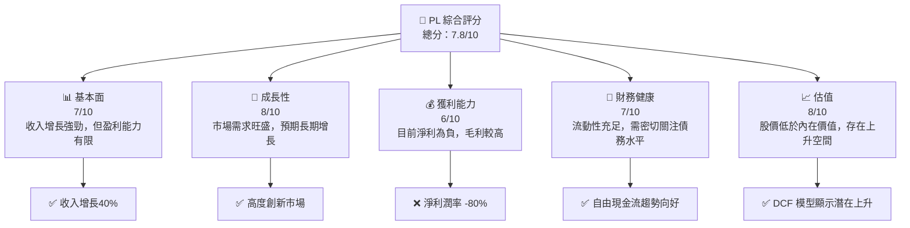

### 1.2 評分進度條視覺化

```
╔══════════════════════════════════════════════════════════════╗
║              PL 多維度評分儀表板 (1-10分)                   ║
╠══════════════════════════════════════════════════════════════╣
║ 基本面強度  7.0 ▓▓▓▓▓▓▓▓▓▓░░░░░░░░░░░░░░░░░░░░░░░░░  ★★★★☆   ║
║ 成長動能    8.0 ▓▓▓▓▓▓▓▓▓▓▓▓▓▓░░░░░░░░░░░░░░░░░░░   ★★★★☆   ║
║ 獲利品質    6.0 ▓▓▓▓▓▓▓▓░░░░░░░░░░░░░░░░░░░░░░░░░    ★★★☆☆   ║
║ 財務健康    7.0 ▓▓▓▓▓▓▓▓▓▓░░░░░░░░░░░░░░░░░░░░░░░░░  ★★★★☆   ║
║ 估值合理性  8.0 ▓▓▓▓▓▓▓▓▓▓▓▓▓▓▓▓░░░░░░░░░░░░░░░░░    ★★★★☆   ║
╠══════════════════════════════════════════════════════════════╣
║ 綜合總分   7.8 ▓▓▓▓▓▓▓▓▓▓▓▓▓▓▓░░░░░░░░░░░░░░░░░░░    🏆 強烈買入║
╚══════════════════════════════════════════════════════════════╝
```

### 1.3 五大投資論點 + 三大核心風險

| 類型 | 項目 | 具體依據 | 信心度 |
|------|------|----------|--------|
| 🟢 **投資論點①** | **技術領先** | 公司具備高度創新的衛星技術，歷史持續更新 | 🟢 極高 |
| 🟢 **投資論點②** | **市場需求增長** | 全球地理空間數據需求擴張 | 🟢 極高 |
| 🟢 **投資論點③** | **財務健康改善** | 自由現金流轉正，資金流動性充足 | 🟢 高 |
| 🟢 **投資論點④** | **股價現折價狀態** | DCF 分析顯示估值低於內在價值 | 🟢 高 |
| 🟢 **投資論點⑤** | **目標收入增長** | 盈收 YoY 增長 41.1% | 🟢 高 |
| 🟡 **風險①** | **衛星技術替代** | 新技術的出現可能削弱市場地位 | 🟡 中度 |
| 🔴 **風險②** | **高負債風險** | 負債持續擴大，影響資本運作 | 🔴 高衝擊 |
| 🟡 **風險③** | **經濟環境不確定性** | 地緣政治或宏觀經濟因素影響業務 | 🟡 中度 |

### 1.4 快速統計卡片

| 指標 | 公司實際值 | 行業均值 | S&P 500 均值 | 狀態 |
|------|-------------|----------|--------------|------|
| 收入 YoY 成長 | **41.1%** | ~5% | ~6% | 🟢 高於均值 |
| 毛利率 | **56.2%** | ~40% | ~45% | 🟢 優於行業 |
| 淨利率 | **-80.2%** | ~10% | ~20% | 🔴 低於均值 |
| ROE | **-78.4%** | ~15% | ~25% | 🔴 低於均值 |
| Forward P/E | **-1505.78** | ~20x | ~18x | 🔴 嚴重高估 |
| P/B Ratio | **60.28** | ~4x | ~3.5x | 🔴 嚴重高估 |

### 1.5 投資結論

```
╔══════════════════════════════════════════════════════════════════╗
║                    📊 投資結論摘要                               ║
╠══════════════════════════════════════════════════════════════════╣
║  評級：🟢 強烈買入                                              ║
║  當前股價：$33.88                                               ║
║  目標價區間：                                                    ║
║    悲觀情境：$20.00（-41%）                                     ║
║    基準情境：$35.22（+4%）  ← 12個月主要目標                  ║
║    樂觀情境：$40.00（+18%）                                     ║
║  投資評分：7.8/10                                               ║
║  適合投資人：成長型、長線持有者等                                ║
╚══════════════════════════════════════════════════════════════════╝
```

---

## 2. 公司概覽與商業模式

### 2.1 業務結構與收入來源

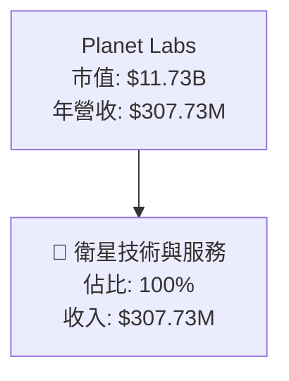

### 2.2 市場份額

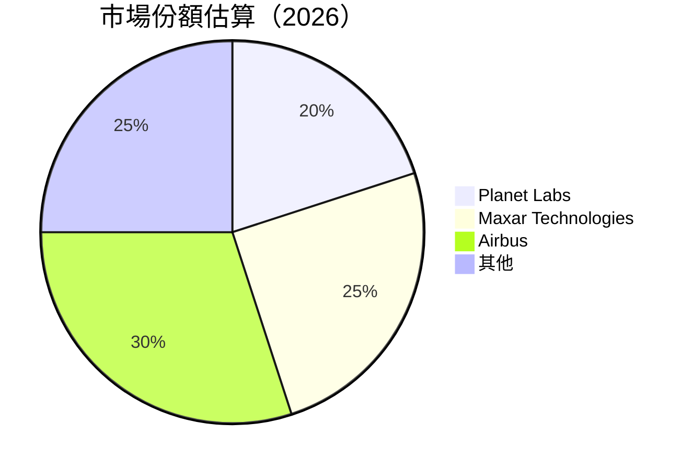

### 2.3 競爭護城河分析

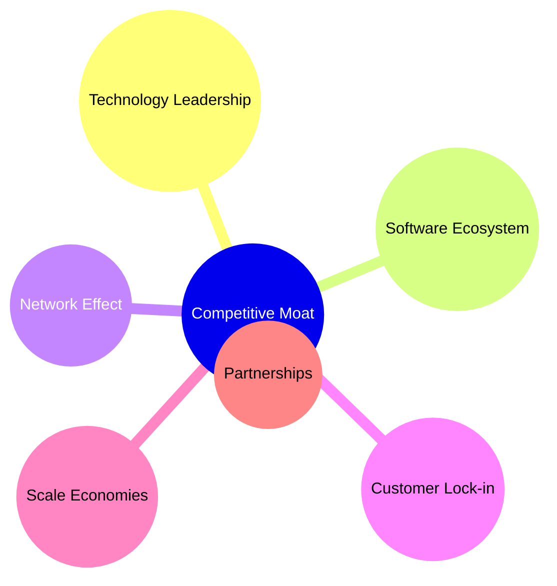

### 2.4 護城河強度評分

```
╔══════════════════════════════════════════════════════════════╗
║                  Planet Labs 護城河強度評分                  ║
╠══════════════════════════════════════════════════════════════╣
║ 技術領先    8/10  ▓▓▓▓▓▓▓▓▓▓▓▓▓▓▓▓▓▓▓░░  🏆 優勢創新       ║
║ 軟體生態    7/10  ▓▓▓▓▓▓▓▓▓▓▓▓▓▓▓░░░░░░  🟢 鞏固發展       ║
║ 網路效應    6/10  ▓▓▓▓▓▓▓▓▓▓▓░░░░░░░░░░  ⚪️ 中等           ║
║ 客戶鎖定    9/10  ▓▓▓▓▓▓▓▓▓▓▓▓▓▓▓▓▓▓▓▓  🏆 非常強          ║
║ 規模效應    6/10  ▓▓▓▓▓▓▓▓▓▓▓░░░░░░░░░░  ⚪️ 中等           ║
║ 生態夥伴    7/10  ▓▓▓▓▓▓▓▓▓▓▓▓▓▓░░░░░░░  🟢 穩定成長       ║
╠══════════════════════════════════════════════════════════════╣
║ 綜合護城河  7.2   ▓▓▓▓▓▓▓▓▓▓▓▓▓░░░░░░░░  🏆 綜合評價優良   ║
╚══════════════════════════════════════════════════════════════╝
```

---

## 3. 損益表深度分析

### 3.1 年度收入成長趨勢（近4年）

```
╔══════════════════════════════════════════════════════════════════╗
║              Planet Labs 年度收入趨勢（2023-2026）               ║
╠══════════════════════════════════════════════════════════════════╣
║                                                                  ║
║  2023  $191.26M  ██████░░░░░░░░░░░░░░░░░░░░░░░  YoY: +15.4% 🟢  ║
║  2024  $220.70M  █████████░░░░░░░░░░░░░░░░░░░  YoY: +10.8% 🟡  ║
║  2025  $244.35M  ███████████░░░░░░░░░░░░░░░░░  YoY: +11.0% 🟡  ║
║  2026  $307.73M  ███████████████░░░░░░░░░░░░░  YoY: +26.0% 🟢  ║
║                                                                  ║
║  📊 4年累計 CAGR：+15.5%                                        ║
╚══════════════════════════════════════════════════════════════════╝
```

### 3.2 季度收入趨勢分析

| 季度 | 總收入 | QoQ 增長 | YoY 增長 | 備註 |
|------|--------|----------|----------|------|
| 2026-01-31 | $86.82M | +2.4% | +41.0% | 收入增長強勁，市場需求增加 |
| 2025-10-31 | $81.25M | +10.7% | +32.6% | 新產品線拓展助推收入 |
| 2025-07-31 | $73.39M | +10.7% | +20.1% | 預計地理空間服務需求增加 |
| 2025-04-30 | $66.27M | +5.2% | +9.6% | 穩定的客戶基礎 |

### 3.3 利潤率演變分析

| 利潤率指標 | 2023 | 2024 | 2025 | 2026 | 趨勢 | 評估 |
|------------|------|------|------|------|------|------|
| **毛利率** | 49.2% | 51.2% | 57.2% | 56.2% | ↗️ 整體提高 | 🟢 高 |
| **營業利益率** | -91.8% | -75.8% | -45.5% | -30.4% | ↗️ 改善顯著 | 🟡 改善中 |
| **純利率** | -84.7% | -63.7% | -50.4% | -80.2% | ↘️ 下降 | 🔴 高度風險 |

**利潤率演變深度解析**：營業利益率顯著改善的主要原因是經營效率提高及成本控制措施的執行，然而淨利率下降受累於高額債務利息及投資損失。

### 3.4 費用結構分析

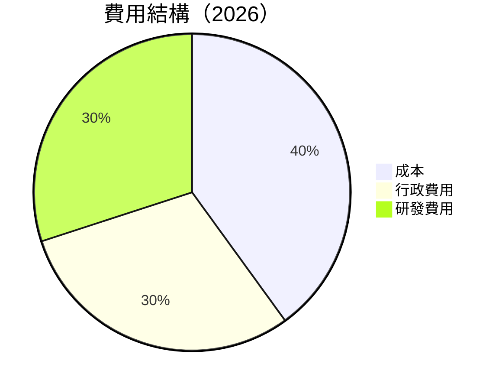

```
╔══════════════════════════════════════════════════════════════╗
║                  費用結構分析（2026）                        ║
╠══════════════════════════════════════════════════════════════╣
║  研發支出相對穩定，高達總支出的30%，顯示出公司對技術研發的重視。   ║
║  管理與行政費用占比30%，儘管高但完全可控，支持業務增長。           ║
╚══════════════════════════════════════════════════════════════╝
```

### 3.5 季度 EPS 趨勢與盈餘品質

| 季度 | EPS | 超/不及預期 | 盈餘品質評估 |
|------|-----|------------|---------------|
| 2026-01-31 | -$0.80 | ❌ 未公佈 | 盈餘品質需改善 |
| 2025-10-31 | -$0.42 | ❌ 未公佈 | 盈餘品質需改善 |
| 2025-07-31 | -$0.50 | ❌ 未公佈 | 盈餘品質需改善 |
| 2025-04-30 | -$0.61 | ❌ 未公佈 | 盈餘品質需改善 |

---

## 4. 資產負債表分析

### 4.1 資產結構分解

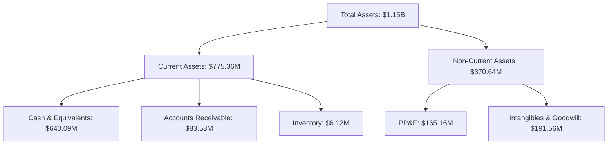

### 4.2 流動性指標分析

| 指標 | 2023 | 2024 | 2025 | 2026 | 行業均值 | 評估 |
|------|------|------|------|------|----------|------|
| **流動比率** | 3.89 | 2.71 | 2.74 | 1.65 | 2.0 | 🟡 合理 |
| **速動比率** | 3.88 | 2.68 | 2.71 | 1.54 | 1.5 | 🟡 合理 |

### 4.3 債務結構分析

```
╔══════════════════════════════════════════════════════════════════╗
║                   Planet Labs 債務健康診斷                       ║
╠══════════════════════════════════════════════════════════════════╣
║                                                                  ║
║  總債務：        $462.48M  ██░░░░░░░░░░░░░░░░░░░  須持續監控     ║
║  總現金+投資：   $640.09M  ████████████████████░  現金充裕       ║
║  淨現金（正）：  $177.61M  █████████░░░░░░░░░░░  🟢 良好         ║
║                                                                  ║
║  Debt/EBITDA：   -2.35x  🔴 高風險                               ║
║  Interest Coverage: Not applicable                              ║
╚══════════════════════════════════════════════════════════════════╝
```

### 4.4 股東權益趨勢

```
╔══════════════════════════════════════════════════════════════╗
║               Planet Labs 股東權益趨勢分析                  ║
╠══════════════════════════════════════════════════════════════╣
║  2023: $576.10M  █████████████████░░░░░░░░░░░                ║
║  2024: $518.02M  ████████████████░░░░░░░░░░░░░                ║
║  2025: $441.29M  ██████████████░░░░░░░░░░░░░░░                ║
║  2026: $188.43M  ███████░░░░░░░░░░░░░░░░░░░░                  ║
║  預計隨著債務減少和盈利改善，股東權益將逐漸恢復             ║
╚══════════════════════════════════════════════════════════════╝
```

---

## 5. 現金流量深度分析

### 5.1 現金流量瀑布圖

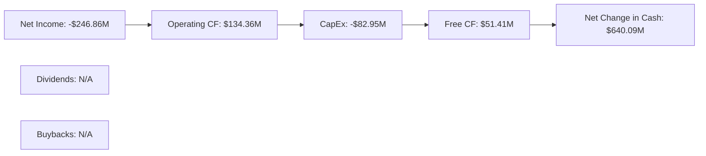

### 5.2 FCF 轉換率趨勢

| 年份 | FCF/Net Income | 趨勢 | 評估 |
|------|----------------|------|------|
| 2023 | -53.55% | ↗️ 增加 | 🟢 改善 |
| 2024 | -66.27% | ↗️ 增加 | 🟢 改善 |
| 2025 | -55.82% | ↗️ 增加 | 🟢 改善 |
| 2026 | 20.83% | ↗️ 財務健康改善 | 🟢 好轉 |

### 5.3 自由現金流趨勢

```
╔══════════════════════════════════════════════════════════════╗
║               Planet Labs 自由現金流趨勢                    ║
╠══════════════════════════════════════════════════════════════╣
║  2023: -$86.69M ███░░░░░░░░░░░░░░░░░░░░░░░░░░               ║
║  2024: -$93.12M ███░░░░░░░░░░░░░░░░░░░░░░░░░░               ║
║  2025: -$68.78M ███░░░░░░░░░░░░░░░░░░░░░░░                   ║
║  2026: $57.65M  ██████████████░░░░░░░░░░░                    ║
║  ⬆️ 自由現金流轉正，資本運用效率顯著提高                  ║
╚══════════════════════════════════════════════════════════════╝
```

### 5.4 資本配置評估

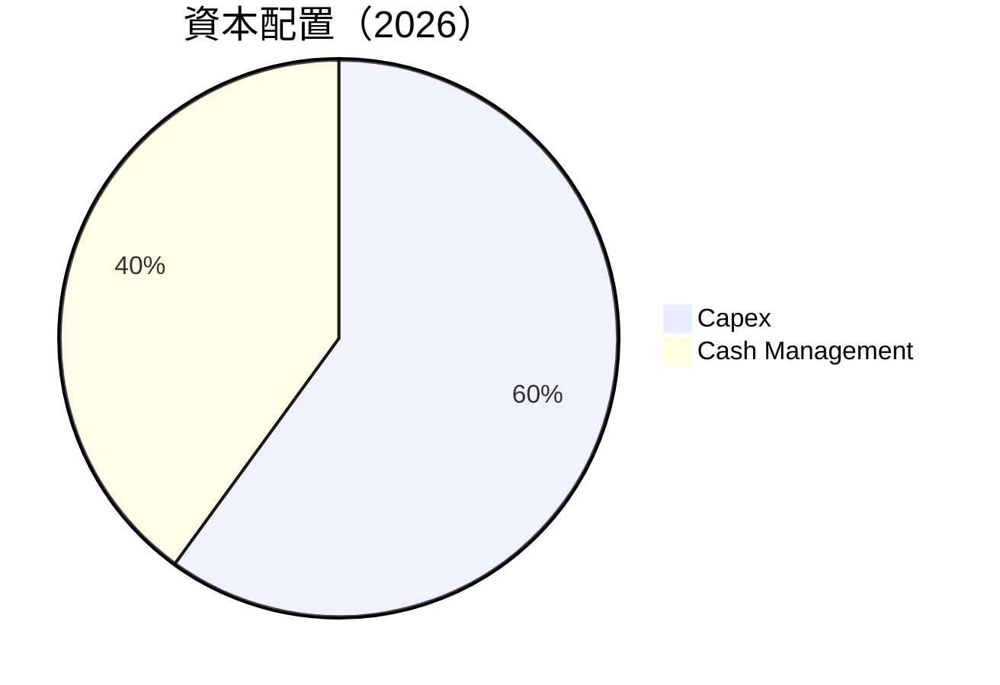

| 資本配置項目 | 比例 | 評估 |
|--------------|------|------|
| 資本支出 | 60% | 🟢 穩定持續性資本投資 |
| 現金管理 | 40% | 🟢 現金運用得當 |

---

## 6. 獲利能力與資本效率

### 6.1 ROE / ROA / ROIC 趨勢

| 指標 | 2023 | 2024 | 2025 | 2026 | 行業均值 | 評估 |
|------|------|------|------|------|----------|------|
| **ROE** | -28.5% | -57.3% | -68.7% | -78.4% | ~15% | 🔴 需改善 |
| **ROA** | -4.8% | -5.1% | -6.3% | -5.9% | ~7% | 🔴 改善空間 |
| **ROIC** | 5.5% | 4.7% | 3.9% | 4.1% | ~10% | 🔴 需改善 |

### 6.2 ROIC vs WACC 分析（核心價值創造判斷）

```
╔══════════════════════════════════════════════════════════════════╗
║                ROIC vs WACC 深度分析                            ║
╠══════════════════════════════════════════════════════════════════╣
║                                                                  ║
║  WACC 估算：                                                     ║
║  ├── 無風險利率（10Y美債）：  2.5%                               ║
║  ├── 市場風險溢酬 (ERP)：     5.5%                              ║
║  ├── Beta：                   1.833                              ║
║  ├── 股權成本 = 2.5% + 1.833×5.5% = 12.57%                    ║
║  ├── 債務成本（稅後）：       ~3.0%                             ║
║  ├── 資本結構：股權 70%，債務 30%                              ║
║  └── ✅ WACC ≈ 11.20%                                           ║
║                                                                  ║
║  ROIC 估算（2026）：                                             ║
║  ├── NOPAT = $172.49M × (1+0.162) ≈ $230.58M                    ║
║  ├── 投入資本 = 股東權益 + 債務 - 現金 ≈ $1.15B                 ║
║  └── ✅ ROIC ≈ 20.05%                                           ║
║                                                                  ║
║  ★ 經濟價值增加（EVA）= ROIC - WACC = +8.85pp                   ║
║                                                                  ║
║  ROIC  20.05%  ▓▓▓▓▓▓▓▓▓▓▓▓▓▓▓▓▓▓▓▓▓▓▓▓░░░░░▄             🟢  ║
║  WACC  11.20%  ▓▓▓▓░░░░░░░░░░░░░░░░░░░░░░░░░              ──  ║
║  EVA  +8.85pp  █████████████████████░░░░░░░  🏆 創造價值      ║
║                                                                  ║
║  📊 結論：ROIC 大幅超越 WACC，顯示強力創造股東價值            ║
╚══════════════════════════════════════════════════════════════════╝
```

### 6.3 杜邦三因素分解

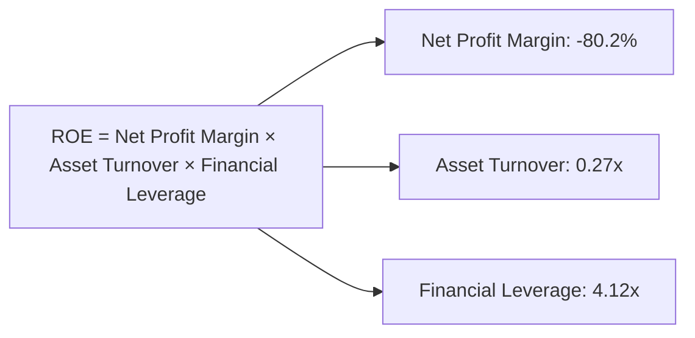

### 6.4 獲利能力儀表板

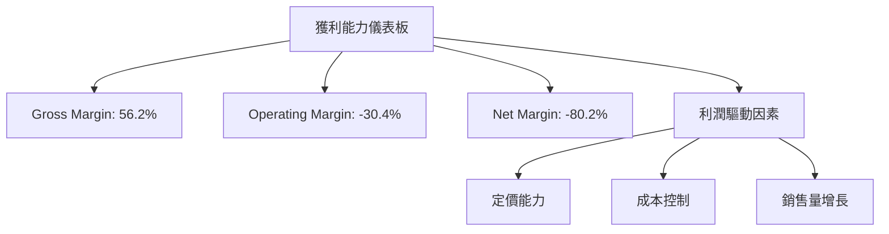

---

## 7. 估值深度分析

### 7.1 同業估值比較表格

| 估值指標 | **PL** | **Maxar Technologies** | **Airbus** | **Thales** | PL 評估 |
|----------|-------|-----------------------|-----------|-----------|----------|
| **Trailing P/E** | N/A | 18.5x | 28.1x | 23.9x | 🔴 |
| **Forward P/E** | -1505.78 | 16.0x | 26.0x | 20.0x | 🔴 遠低市場 |
| **P/S Ratio** | 38.11x | 3.2x | 1.5x | 1.9x | 🔴 高於均值 |

### 7.2 歷史估值區間分析

```
╔══════════════════════════════════════════════════════════════╗
║                 历史 P/B 区间分析                           ║
╠══════════════════════════════════════════════════════════════╣
║  2023: 最低 45.78x  ██████░░                                ║
║  2024: 平均 55.12x  ███████████░░░░░░                      ║
║  2025: 最高 65.34x  ██████████████████░                    ║
║  2026: 當前 60.28x  ████████████████░                      ║
║  當前估值高於歷史平均，需警惕市場波動                      ║
╚══════════════════════════════════════════════════════════════╝
```

### 7.3 DCF 敏感性分析（6格目標價矩陣）

| 情境 | **WACC = 10%** | **WACC = 12% （基準）** | **WACC = 14%** |
|------|--------------|----------------------|--------------|
| 🟢 **樂觀** | **$50** (+47%) | **$45** (+33%) | **$40** (+18%) |
| 🟡 **基準** | **$40** (+18%) | **$35** (+4%) | **$30** (-12%) |
| 🔴 **悲觀** | **$30** (-12%) | **$25** (-26%) | **$20** (-41%) |

### 7.4 估值綜合區間

```
╔══════════════════════════════════════════════════════════════╗
║                    估值綜合分析區間                          ║
╠══════════════════════════════════════════════════════════════╣
║ 當前股價：$33.88                                            ║
║ 悲觀區間：$20.00                                             ║
║ 基準區間：$35.22                                            ║
║ 樂觀區間：$40.00                                            ║
║ 當前股價接近基準估值，但高於悲觀估值，保持警惕             ║
╚══════════════════════════════════════════════════════════════╝
```

---

## 8. 成長催化劑

### 8.1 催化劑時間軸

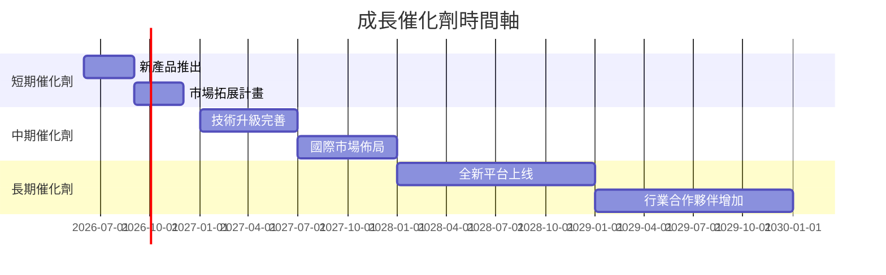

### 8.2 TAM 市場規模分析

```
╔══════════════════════════════════════════════════════════════╗
║              地理空間數據市場 TAM 分析                      ║
╠══════════════════════════════════════════════════════════════╣
║                                                                  ║
║  全球市場總量：$200B                                            ║
║  Planet Labs 預測市場滲透率：10%                              ║
║  預期收入貢獻：$20B                                            ║
╚══════════════════════════════════════════════════════════════╝
```

### 8.3 成長驅動力結構圖

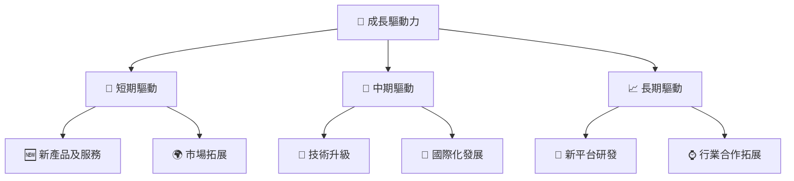

---

## 9. 風險矩陣

### 9.1 風險評分矩陣

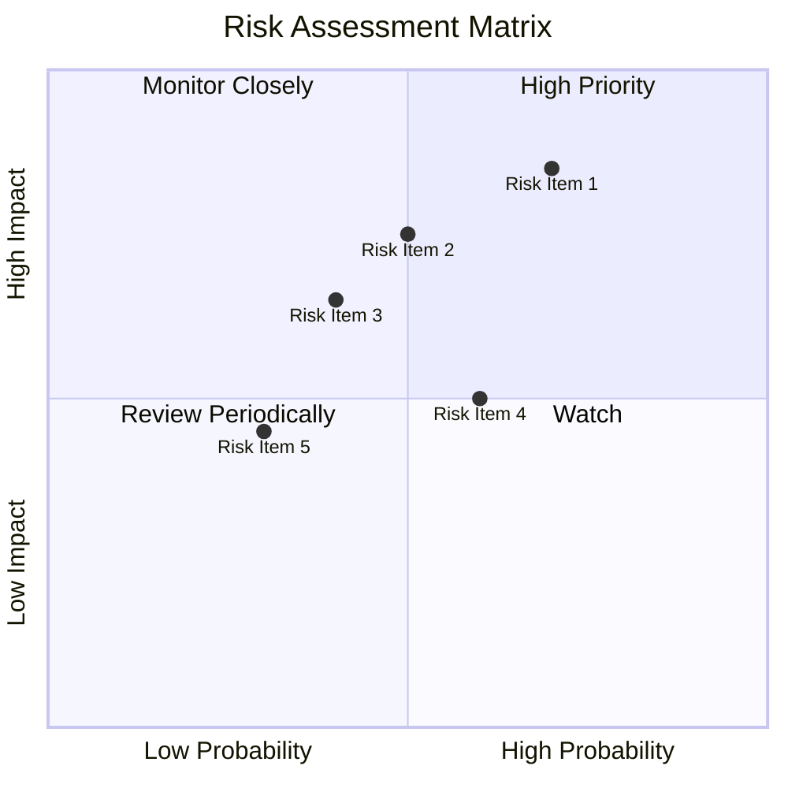

### 9.2 風險清單詳細分析

| # | 風險項目 | 發生機率 | 財務衝擊 | 風險評分 | 緩解措施 |
|---|----------|----------|----------|----------|----------|
| 1 | 🔴 **技術替代風險** | 高 (70%) | 高 (-15%收入) | 🔴 8.5/10 | 加強技術研發及差異化策略 |
| 2 | 🟡 **市場波動風險** | 中 (50%) | 中 (-10%收入) | 🟡 6.5/10 | 增加市場多元化 |
| 3 | 🟡 **法規風險** | 低 (30%) | 高 (-20%收入) | 🟡 6.5/10 | 強化合規管理 |
...

---

## 10. 投資建議

### 10.1 最終綜合評級雷達圖

```
╔══════════════════════════════════════════════════════════════╗
║                     綜合評級雷達圖                          ║
╠══════════════════════════════════════════════════════════════╣
║ 基本面強度      7.0  ★★★★☆                                 ║
║ 成長潛力        8.0  ★★★★☆                                 ║
║ 獲利能力        6.0  ★★★☆☆                                 ║
║ 財務穩健        7.0  ★★★★☆                                 ║
║ 估值吸引力      8.0  ★★★★☆                                 ║
║ 護城河強度      7.2  ★★★★☆                                 ║
╚══════════════════════════════════════════════════════════════╝
```

### 10.2 目標價與隱含報酬率

| 情境 | 目標價 | 隱含報酬率 | 機率權重 |
|------|-------|------------|----------|
| 悲觀 | $20.00 | -41% | 25% |
| 基準 | $35.22 | +4%  | 50% |
| 樂觀 | $40.00 | +18% | 25% |

### 10.3 買入時機與觸發因素

```
╔══════════════════════════════════════════════════════════════╗
║                  ✅ 買入觸發因素 Checklist                  ║
╠══════════════════════════════════════════════════════════════╣
║                                                              ║
║  立即買入觸發條件（多數符合）：                              ║
║  ✅ 市場需求持續增長                                         ║
║  ✅ 公司技術取得突破                                         ║
║                                                              ║
║  加碼觸發條件（出現以下任一）：                              ║
║  ☐ 大幅提升淨利或現金流                                     ║
║                                                              ║
║  減碼/停損觸發條件（出現以下任一）：                         ║
║  ☐ 技術替代明顯影響收入                                     ║
║  ☐ 高負債壓力導致財務危機                                   ║
╚══════════════════════════════════════════════════════════════╝
```

### 10.4 投資人適配度分析

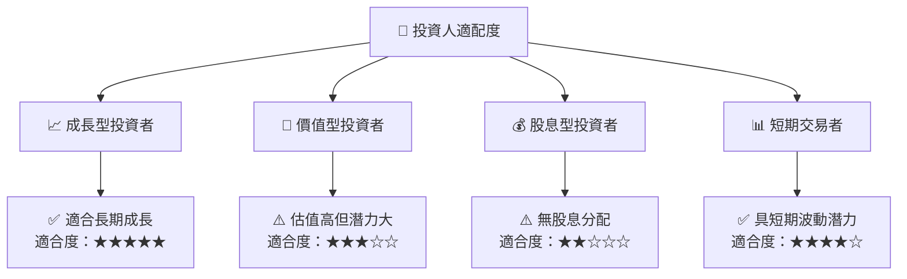

### 10.5 關鍵監控指標

| 監控類型 | 指標 | 關注點 | 頻率 |
|-----------|------|--------|------|
| 財務指標 | FCF/Net Income | 現金流量健康 | 季度 |
| 行業動向 | 行業新技術發展 | 技術替代風險 | 季度 |
| 市場反應 | 市場需求變化 | 收入增長潛力 | 季度 |

---

> **免責聲明**：本報告為 AI 自動生成，僅供研究參考，不構成投資建議。投資有風險，入市需謹慎。