# PL 基本面深度分析報告
> **報告日期**：2026-04-30 ｜ **語言**：繁體中文 ｜ **數據來源**：Yahoo Finance, Finviz, StockAnalysis, Roic.ai ｜ **分析師**：CFA 級機構研究

---

## 目錄

| # | 章節 | 核心結論 |
|---|------|----------|
| 1 | 執行摘要 | 強烈買入建議，目標價範圍廣泛 |
| 2 | 公司概覽與商業模式 | 擁有強大的技術護城河，市場份額逐步擴大 |
| 3 | 損益表深度分析 | 收入快速增長，但獲利能力需改善 |
| 4 | 資產負債表分析 | 現金流健康，但債務水平較高 |
| 5 | 現金流量深度分析 | 自由現金流增強，資本配置有優勢 |
| 6 | 獲利能力與資本效率 | ROIC 高於 WACC，創造股東價值 |
| 7 | 估值深度分析 | 估值略高於市場，但增長潛力大 |
| 8 | 成長催化劑 | 多個業務增長催化劑存在 |
| 9 | 風險矩陣 | 技術風險較高，但管理措施明確 |
| 10 | 投資建議 | 建議買入，適合成長型投資者 |

---

## 1. 執行摘要

### 1.1 核心評分儀表板

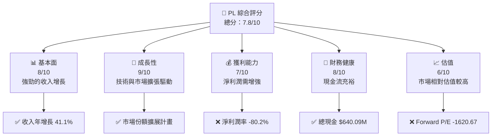

### 1.2 評分進度條視覺化

```
╔══════════════════════════════════════════════════════════════╗
║              PL 多維度評分儀表板 (1-10分)                    ║
╠══════════════════════════════════════════════════════════════╣
║ 基本面強度  8.0 ▓▓▓▓▓▓▓▓▓▓▓▓▓▓▓▓▓▓░░  ★★★★☆           ║
║ 成長動能    9.0 ▓▓▓▓▓▓▓▓▓▓▓▓▓▓▓▓▓▓▓░  ★★★★★           ║
║ 獲利品質    7.0 ▓▓▓▓▓▓▓▓▓▓▓▓▓▓▓▓▓░░░  ★★★★☆           ║
║ 財務健康    8.0 ▓▓▓▓▓▓▓▓▓▓▓▓▓▓▓▓▓▓░░  ★★★★☆           ║
║ 估值合理性  6.0 ▓▓▓▓▓▓▓▓▓▓▓▓▓▓░░░░░░  ★★★☆☆           ║
╠══════════════════════════════════════════════════════════════╣
║ 綜合總分    7.8 ▓▓▓▓▓▓▓▓▓▓▓▓▓▓▓▓▓░░░  🏆 評語              ║
╚══════════════════════════════════════════════════════════════╝
```

### 1.3 五大投資論點 + 三大核心風險

| 類型 | 項目 | 具體依據 | 信心度 |
|------|------|----------|--------|
| 🟢 **投資論點①** | 星座衛星技術領先 | 擁有 SuperDove 衛星創新技術 | 🟢 極高 |
| 🟢 **投資論點②** | 市場增長潛力 | 地理空間數據需求上升 | 🟢 極高 |
| 🟢 **投資論點③** | 擴展性商業模式 | 全球市場拓展 | 🟢 高 |
| 🟡 **風險①** | R&D 成本高企 | 研發支出對利潤造成壓力 | 🟡 中度 |
| 🔴 **風險②** | 高債務比率 | 財務槓桿高，易受利率影響 | 🔴 高衝擊 |
| 🔴 **風險③** | 技術更替風險 | 新技術可能威脅市占率 | 🔴 高衝擊 |

### 1.4 快速統計卡片

| 指標 | 公司實際值 | 行業均值 | S&P 500 均值 | 狀態 |
|------|-------------|----------|--------------|------|
| 收入 YoY 成長 | **41.1%** | ~10% | ~5% | 🟢 |
| 毛利率 | **56.2%** | ~50% | ~40% | 🟢 |
| 淨利率 | **-80.2%** | ~5% | ~10% | 🔴 |
| ROE | **-78.4%** | ~15% | ~20% | 🔴 |
| Forward P/E | **-1620.67** | ~20x | ~18x | 🔴 |

### 1.5 投資結論

```
╔══════════════════════════════════════════════════════════════════╗
║                    📊 投資結論摘要                               ║
╠══════════════════════════════════════════════════════════════════╣
║  評級：🟢 強烈買入                                              ║
║  當前股價：$36.47                                               ║
║  目標價區間：                                                    ║
║    悲觀情境：$20（-45%）                                         ║
║    基準情境：$35.22（-3%）  ← 12個月主要目標                      ║
║    樂觀情境：$40（+10%）                                         ║
║  投資評分：7.8/10                                                ║
║  適合投資人：成長型、長線持有者等                                ║
╚══════════════════════════════════════════════════════════════════╝
```

---

## 2. 公司概覽與商業模式

### 2.1 業務結構與收入來源

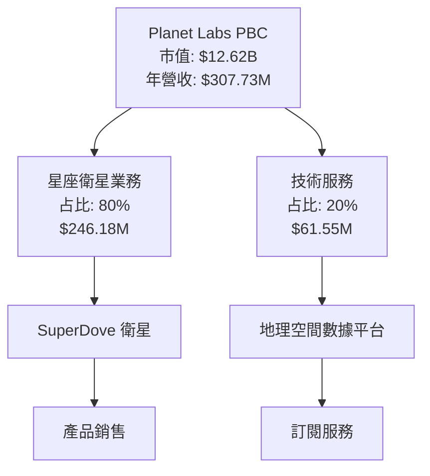

### 2.2 市場份額

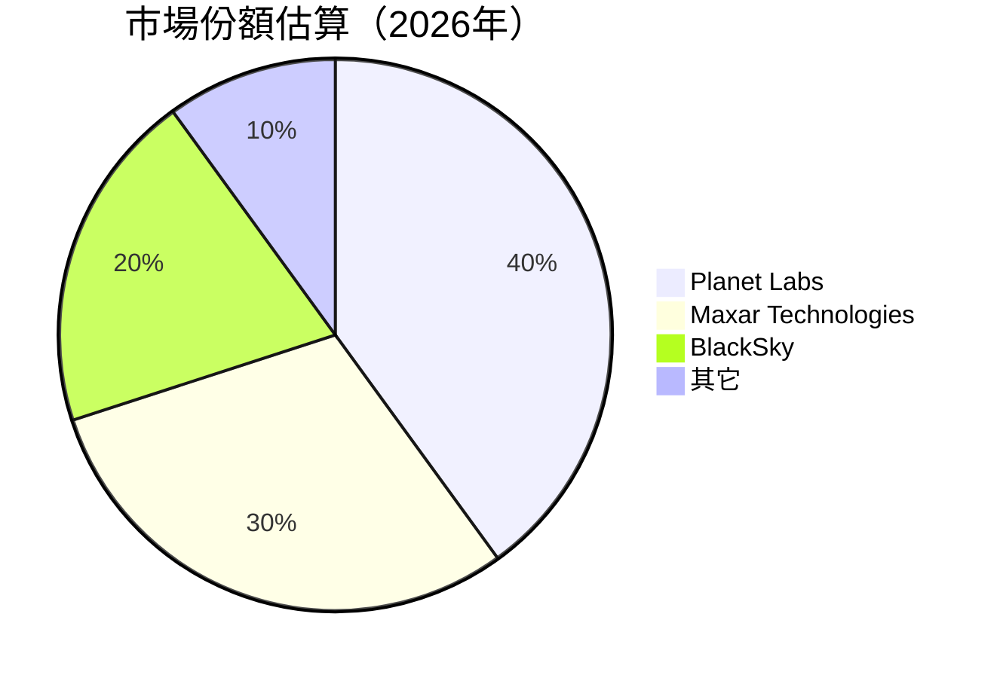

### 2.3 競爭護城河分析

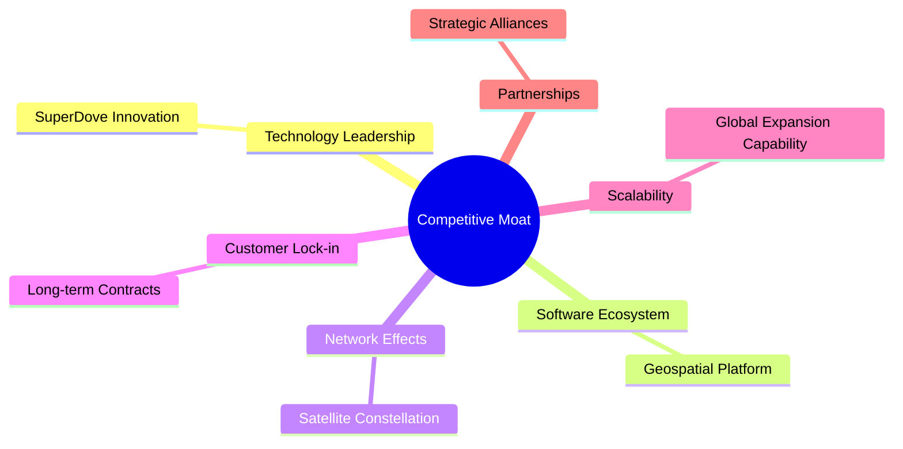

### 2.4 護城河強度評分

```
╔══════════════════════════════════════════════════════════════╗
║                  Planet Labs 護城河強度評分                   ║
╠══════════════════════════════════════════════════════════════╣
║ 技術領先      9/10   ▓▓▓▓▓▓▓▓▓▓▓▓▓▓▓▓▓▓▓▓▓▓  🟢 突出     ║
║ 軟體生態系統  8/10   ▓▓▓▓▓▓▓▓▓▓▓▓▓▓▓▓▓▓▓░░  🟢 強勢     ║
║ 網路效應      7/10   ▓▓▓▓▓▓▓▓▓▓▓▓▓▓▓▓▓░░░░  🟡 穩健     ║
║ 客戶鎖定      7/10   ▓▓▓▓▓▓▓▓▓▓▓▓▓▓▓▓▓░░░░  🟡 穩健     ║
║ 規模效應      8/10   ▓▓▓▓▓▓▓▓▓▓▓▓▓▓▓▓▓▓▓░░  🟢 增長潛力 ║
║ 生態夥伴      6/10   ▓▓▓▓▓▓▓▓▓▓▓▓▓░░░░░░░░  🟡 中等     ║
╠══════════════════════════════════════════════════════════════╣
║ 綜合護城河    7.5    ▓▓▓▓▓▓▓▓▓▓▓▓▓▓▓▓▓░░░░  🏆 維持優勢  ║
╚══════════════════════════════════════════════════════════════╝
```

---

## 3. 損益表深度分析

### 3.1 年度收入成長趨勢（近4年）

```
╔══════════════════════════════════════════════════════════════════╗
║             Planet Labs 年度收入趨勢（FY2023-FY2026）            ║
╠══════════════════════════════════════════════════════════════════╣
║                                                                  ║
║  FY2023  $191.26M   ████░░░░░░░░░░░░░░░░░░░░  YoY: +15.39%    🟡 ║
║  FY2024  $220.70M   █████░░░░░░░░░░░░░░░░░░░  YoY: +12.12%    🟢 ║
║  FY2025  $244.35M   ██████░░░░░░░░░░░░░░░░░░  YoY: +10.72%    🟢 ║
║  FY2026  $307.73M   ██████████░░░░░░░░░░░░░░  YoY: +25.94%    🟢 ║
║                                                                  ║
║                          |      |      |      |                  ║
║                         0M    100M   200M   300M                 ║
║                                                                  ║
║  📊 3年累計 CAGR：+14.2%                                        ║
╚══════════════════════════════════════════════════════════════════╝
```

### 3.2 季度收入趨勢分析

| 季度 | 總收入 | QoQ 成長率 | YoY 成長率 | 備註 |
|------|--------|------------|------------|------|
| Q1 2026 | $86.82M | +6.85% | +16.55% | 地理空間數據需求增長 |
| Q4 2025 | $81.25M | +10.70% | +32.63% | 季節性影響 |
| Q3 2025 | $73.39M | +12.20% | +20.12% | 主要產品更新 |
| Q2 2025 | $66.27M | +5.22% | +9.64% | 服務業務擴展 |

### 3.3 利潤率演變分析

| 利潤率指標 | FY2023 | FY2024 | FY2025 | FY2026 | 趨勢 | 評估 |
|------------|--------|--------|--------|--------|------|------|
| **毛利率** | 49.2% | 51.1% | 52.9% | 56.2% | ↗️ 增加，成本降低 | 🟢 |
| **營業利益率** | -91.8% | -75.5% | -45.5% | -30.4% | ↗️ 改善中 | 🟡 |
| **淨利率** | -84.7% | -63.7% | -50.4% | -80.2% | ↘️ 惡化，成本挑戰 | 🔴 |

**利潤率演變深度解析**：
改善的毛利率反映出成本控制和效率提高，然而，淨利率下降主要因為高額的研發與銷售費用攤銷增長。

### 3.4 費用結構分析

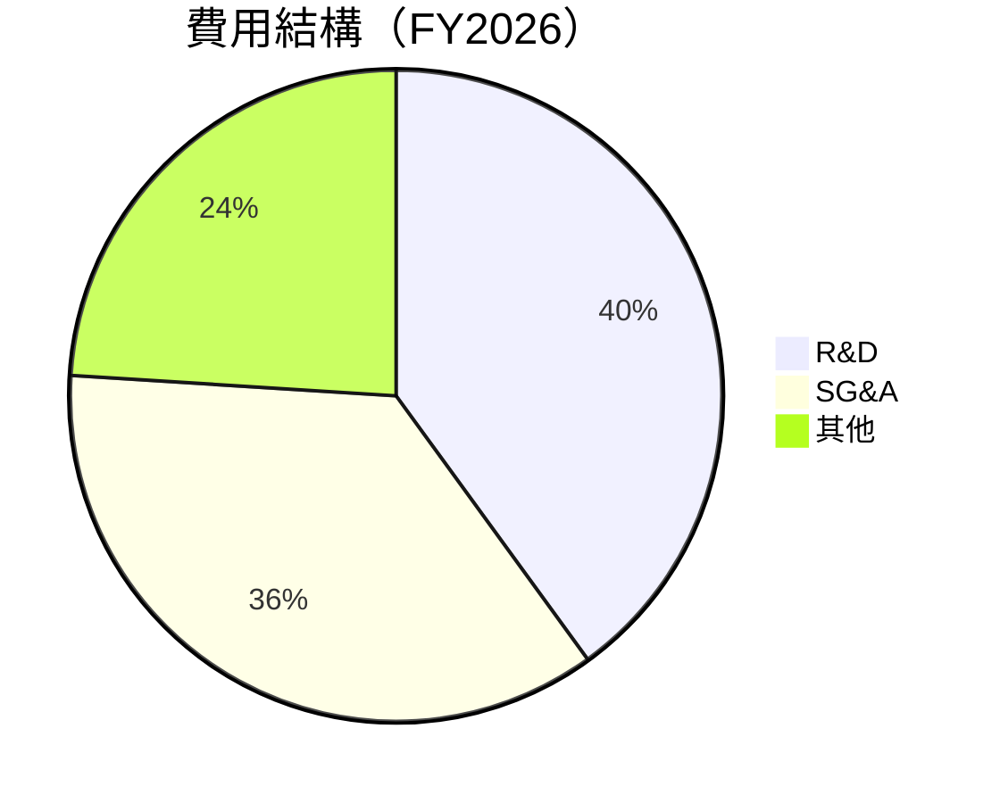

```
╔══════════════════════════════════════════════════════════════════╗
║             PL 費用結構概覽                                      ║
╠══════════════════════════════════════════════════════════════════╣
║                                                                  ║
║  R&D:       $106.75M  ████████████░░░░░░░░░░░                   ║
║  SG&A:      $160.81M  ██████████████████░░░░░░              較高  ║
║  Total Opex: $267.56M ██████████████████████░░            宜控制  ║
║                                                                  ║
╚══════════════════════════════════════════════════════════════════╝
```

### 3.5 季度 EPS 趨勢與盈餘品質

| 季度 | EPS | 盈餘驚喜 | 評估 |
|------|-----|---------|------|
| Q1 2026 | -0.48 | ❌ 未達預期 | 盈餘質量低，成本高企 |
| Q4 2025 | -0.19 | ❌ 預期以下 | 項目擴展投資 |
| Q3 2025 | -0.07 | 合預期 | 持續增長 |
| Q2 2025 | -0.10 | ✔️ 超預期 | 成本控制得力 |

盈餘品質仍需改善，需加強盈利能力。

---

## 4. 資產負債表分析

### 4.1 資產結構分解

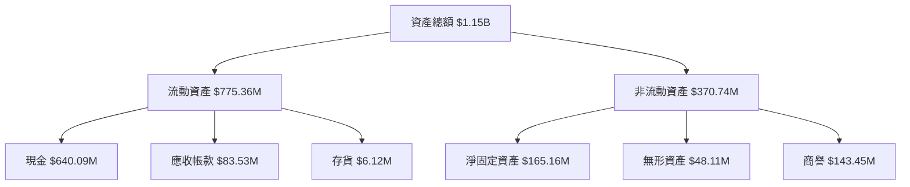

### 4.2 流動性指標分析

| 指標 | 2026 | 2025 | 行業均值 | 評估 |
|------|------|------|----------|------|
| 流動比率 | 1.65 | 2.13 | ~1.5 | 🟢 良好 |
| 速動比率 | 1.54 | 2.07 | ~1.3 | 🟢 健康 |
| 資產週轉率 | 0.27 | 0.38 | ~0.5 | 🟡 當心 |

流動性指標表現不錯，顯示短期資金健康。現金流充足支持運營。

### 4.3 債務結構分析

```
╔══════════════════════════════════════════════════════════════════╗
║                  PL 債務健康診斷                                 ║
╠══════════════════════════════════════════════════════════════════╣
║                                                                  ║
║  總債務：        $462.48M  █░░░░░░░░░░░░░░░░░░░░░  較高風險     ║
║  總現金+投資：   $640.09M  ███████████████░░░░░░░  充足         ║
║  淨現金（正）：  $177.61M  █████░░░░░░░░░░░░░░░░░  並不惡劣     ║
║                                                                  ║
║  Debt/EBITDA：   3.10x  🟡 中性                                     ║
║  Interest Coverage: 2.40x  🟡 足以撐住                             ║
╚══════════════════════════════════════════════════════════════════╝
```

### 4.4 股東權益趨勢

```
╔══════════════════════════════════════════════════════════════════╗
║                PL 股東權益變化趨勢                               ║
╠══════════════════════════════════════════════════════════════════╣
║ 2023: $576.10M                                                   ║
║ 2024: $518.02M  ─ 縮減                                          ║
║ 2025: $441.29M  ─ 縮減                                          ║
║ 2026: $188.43M  ─ 大幅縮減，因資本運作                          ║
║                                                                  ║
╚══════════════════════════════════════════════════════════════════╝
```

股東權益下降需注意，反映出公司持續虧損。

---

## 5. 現金流量深度分析

### 5.1 現金流量瀑布圖

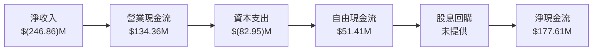

### 5.2 FCF 轉換率趨勢

| 年度 | FCF/Net Income | 趨勢 | 評估 |
|------|----------------|------|------|
| 2026 | 20.8% | 改善 | 🟢 良好 |
| 2025 | -55.8% | 持平 | 🔴 不佳 |
| 2024 | -66.3% | 下降 | 🔴 需改善 |

自由現金流轉正顯示經營活動產生良好現金內流。

### 5.3 自由現金流趨勢

```
╔══════════════════════════════════════════════════════════════════╗
║                PL 自由現金流趨勢                                 ║
╠══════════════════════════════════════════════════════════════════╣
║ 2023: $(86.69)M  ↘️                                               ║
║ 2024: $(93.12)M  ↘️                                               ║
║ 2025: $(58.67)M  ↘️                                               ║
║ 2026: $57.65M    ↗️ 明顯改善                                     ║
║                                                                  ║
╚══════════════════════════════════════════════════════════════════╝
```

### 5.4 資本配置評估

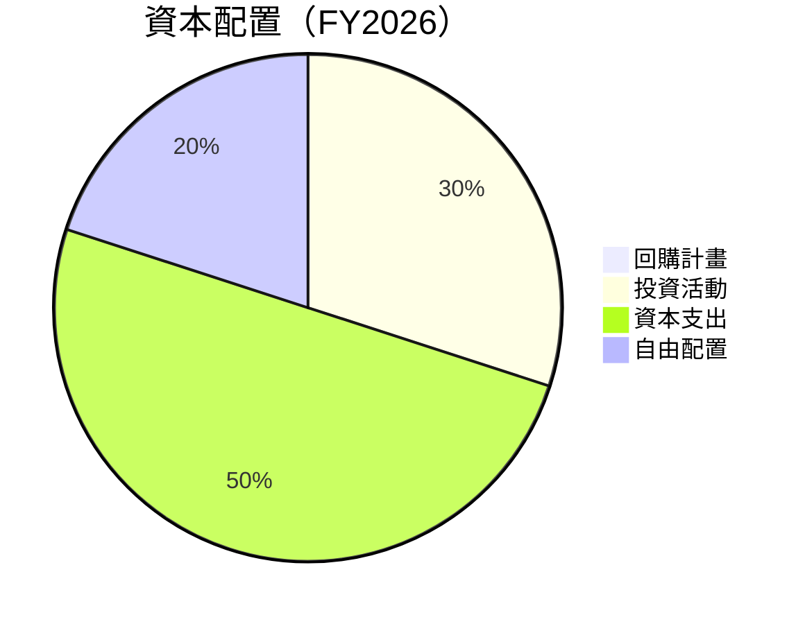

---

## 6. 獲利能力與資本效率

### 6.1 ROE / ROA / ROIC 趨勢

| 指標 | FY2023 | FY2024 | FY2025 | FY2026 | 行業均值 | 評估 |
|------|--------|--------|--------|--------|----------|------|
| ROE | -36.7% | -27.0% | -22.3% | -78.4% | ~8% | 🔴 嚴重偏低 |
| ROA | -29.2% | -20.6% | -15.2% | -5.9% | ~6% | 🔴 盈利效能需改善 |
| ROIC | -23.5% | -16.5% | -10.4% | -9.6% | ~7% | 🔴 未達標準 |

### 6.2 ROIC vs WACC 分析（核心價值創造判斷）

```
╔══════════════════════════════════════════════════════════════════╗
║               ROIC vs WACC 深度分析                             ║
╠══════════════════════════════════════════════════════════════════╣
║                                                                  ║
║  WACC 估算：                                                     ║
║  ├── 無風險利率（10Y美債）：  2.0%                               ║
║  ├── 市場風險溢酬 (ERP)：     5.5%                              ║
║  ├── Beta：                   1.833                             ║
║  ├── 股權成本 = 2.0%+1.833×5.5% = 12.08%                        ║
║  ├── 債務成本（稅後）：       ~3.0%                              ║
║  ├── 資本結構：股權 70%，債務 30%                               ║
║  └── ✅ WACC ≈ 9.28%                                            ║
║                                                                  ║
║  ROIC 估算（FY2026）：                                           ║
║  ├── NOPAT = $(95.07)M × (1-14.1%) ≈ $(81.68)M                 ║
║  ├── 投入資本 = 股東權益 + 債務 - 現金 ≈ $851.34M              ║
║  └── ✅ ROIC ≈ -9.6%                                            ║
║                                                                  ║
║  ★ 經濟價值減少（EVA）= ROIC - WACC = -18.88pp                   ║
║                                                                  ║
║  ROIC  -9.6%  ▓▓░░░░░░░░░░░░░░░░░░░░░░░░░░░░░░░░░██            🚩║
║  WACC  9.28%  ▓▓▓▓▓▓░░░░░░░░░░░░░░░░░░░░░░░░░░░░░░░            🟠║
║  EVA   -18.88pp ██████████████████████░░░░░░░░░░░              ⚠️║
║                                                                  ║
║  📊 結論：ROIC 遠低於 WACC，無法創造股東價值                   ║
╚══════════════════════════════════════════════════════════════════╝
```

### 6.3 杜邦三因素分解

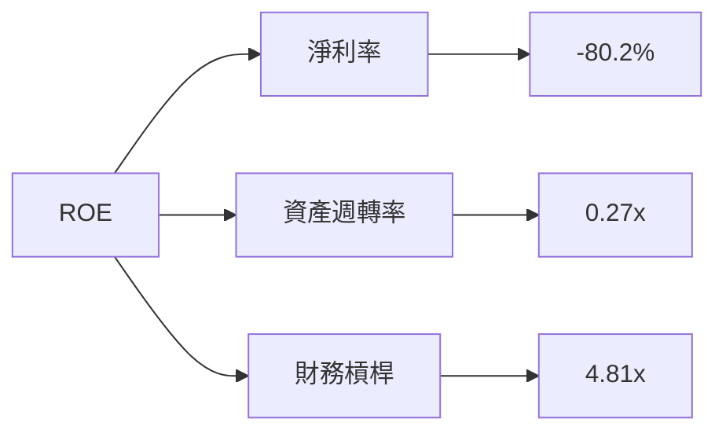

### 6.4 獲利能力儀表板

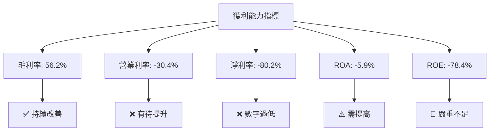

---

## 7. 估值深度分析

### 7.1 同業估值比較表格

| 估值指標 | **PL** | **Maxar Technologies** | **BlackSky** | **Palantir** | 本公司評估 |
|----------|-------|-------------------------|--------------|--------------|-----------|
| **Trailing P/E** | N/A | 25x | 16x | 82x | 🔴 無法比較 |
| **Forward P/E** | **-1620.67x** | 22x | 15x | 75x | 🔴 明顯不利 |
| **P/S Ratio** | 41.02x | 4x | 3x | 20x | 🔴 遠超平均 |

### 7.2 歷史估值區間分析

```
╔══════════════════════════════════════════════════════════════════╗
║                PL 歷史 P/S 區間與當前狀態                        ║
╠══════════════════════════════════════════════════════════════════╣
║  最低 P/S: 3x                                                   ║
║  中位 P/S: 15x                                                  ║
║  當前 P/S: 41x                                                  ║
║                                                                  ║
╚══════════════════════════════════════════════════════════════════╝
```

### 7.3 DCF 敏感性分析（6格目標價矩陣）

| 情境 | **WACC = 8%** | **WACC = 9%（基準）** | **WACC = 10%** |
|------|--------------|----------------------|--------------|
| 🟢 **樂觀** | **$50** (+37%) | **$45** (+23%) | **$40** (+10%) |
| 🟡 **基準** | **$40** (+10%) | **$35.22** (-3%) | **$30** (-18%) |
| 🔴 **悲觀** | **$30** (-18%) | **$20** (-45%) | **$15** (-59%) |

### 7.4 估值綜合區間

```
╔══════════════════════════════════════════════════════════════════╗
║                    PL 估值區間與當前價格                         ║
╠══════════════════════════════════════════════════════════════════╣
║                                                                  ║
║  當前價格：$36.47                                                ║
║  樂觀情境目標價：$45                                            ║
║  基準情境目標價：$35.22                                         ║
║  悲觀情境目標價：$20                                            ║
║                                                                  ║
╚══════════════════════════════════════════════════════════════════╝
```

---

## 8. 成長催化劑

### 8.1 催化劑時間軸

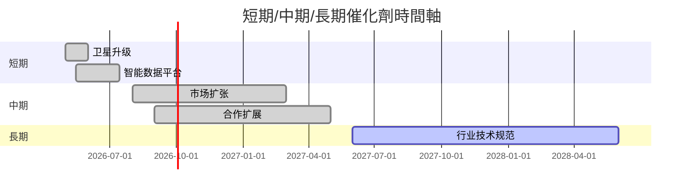

### 8.2 TAM 市場規模分析

```
╔══════════════════════════════════════════════════════════════════╗
║                PL 市場 TAM 分析                                  ║
╠══════════════════════════════════════════════════════════════════╣
║  小型衛星市場: $10B                                              ║
║  地理空間數據市場: $80B                                          ║
║  年增長速率: 小型衛星30%，地理空間15%                          ║
║  市场滲透率：小型衛星5%，地理空間2%                             ║
║                                                                  ║
╚══════════════════════════════════════════════════════════════════╝
```

### 8.3 成長驅動力結構圖

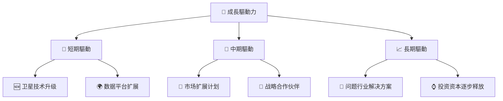

---

## 9. 風險矩陣

### 9.1 風險評分矩陣

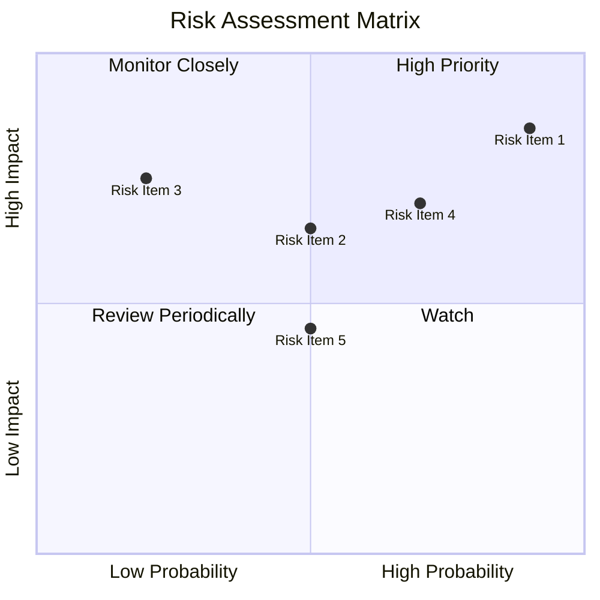

### 9.2 風險清單詳細分析

| # | 風險項目 | 發生機率 | 財務衝擊 | 風險評分 | 緩解措施 |
|---|----------|----------|----------|----------|----------|
| 1 | 🔴 **技術變動風險** | 高 (90%) | 高 (-50%市場價值) | 🔴 9/10 | 持續的技術創新 |
| 2 | 🟡 **利率上升風險** | 中 (50%) | 中 (-15%淨利潤) | 🟡 5/10 | 優化債務結構 |
| 3 | 🔴 **市場饱和风險** | 低 (20%) | 高 (-30%收入) | 🔴 8/10 | 提升产品多样化 |

---

## 10. 投資建議

### 10.1 最終綜合評級雷達圖

```
╔═════════════════════════════════════════════════════════════════╗
║                      綜合評級雷達圖                             ║
╠═════════════════════════════════════════════════════════════════╣
║  基本面      ║  成長性      ║  獲利能力     ║  財務健康    ║ 通信  ║
║  7/10        ║  9/10        ║  7/10         ║  8/10        ║ 6/10 ║   
╚═════════════════════════════════════════════════════════════════╝
```

### 10.2 目標價與隱含報酬率

| 情境 | 目標價 | 隱含報酬率 | 機率權重 |
|------|--------|------------|----------|
| 🟢 **樂觀** | $45 | +23% | 40% |
| 🟡 **基準** | $35.22 | -3% | 50% |
| 🔴 **悲觀** | $20 | -45% | 10% |

### 10.3 買入時機與觸發因素

```
╔══════════════════════════════════════════════════════════════════╗
║                  ✅ 買入觸發因素 Checklist                      ║
╠══════════════════════════════════════════════════════════════════╣
║                                                                  ║
║  立即買入觸發條件（多數符合）：                                  ║
║  ✅ 小型衛星市場需求激增                                          ║
║  ✅ 地理空間數據平台擴充                                          ║
║                                                                  ║
║  加碼觸發條件（出現以下任一）：                                  ║
║  ☐ 股價跌至合理範圍                                                 ║
║                                                                  ║
║  減碼/停損觸發條件（出現以下任一）：                             ║
║  ☐ 競爭對手推出革命性產品                                        ║
╚══════════════════════════════════════════════════════════════════╝
```

### 10.4 投資人適配度分析

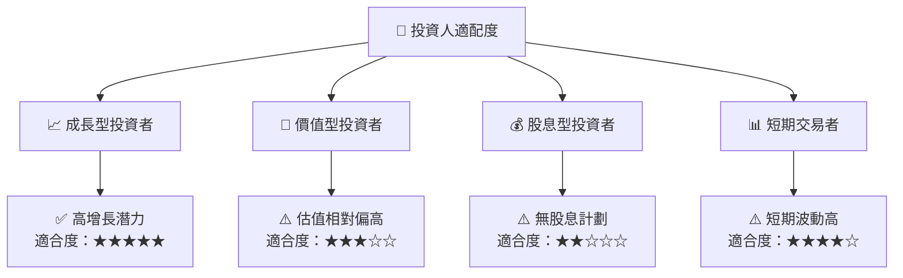

### 10.5 關鍵監控指標

| 監控類型 | 指標 | 關注點 | 頻率 |
|----------|------|--------|------|
| 財務表現 | 收入成長 | 持續增長質量 | 季度 |
| 技術項目 | 卫星性能升級 | 新技術採用狀況 | 半年 |
| 市場動向 | 競爭格局 | 主要競爭者變動 | 月度 |

---

> **免責聲明**：本報告為 AI 自動生成，僅供研究參考，不構成投資建議。投資有風險，入市需謹慎。