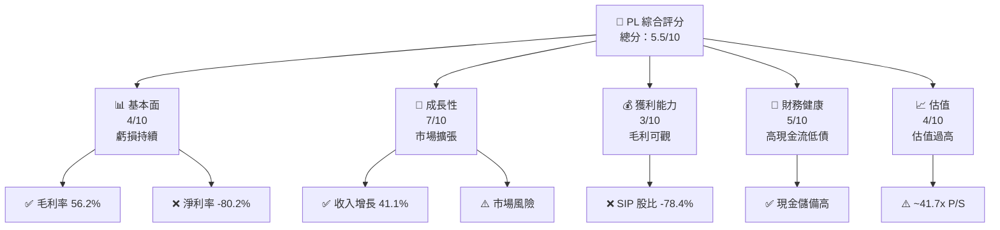
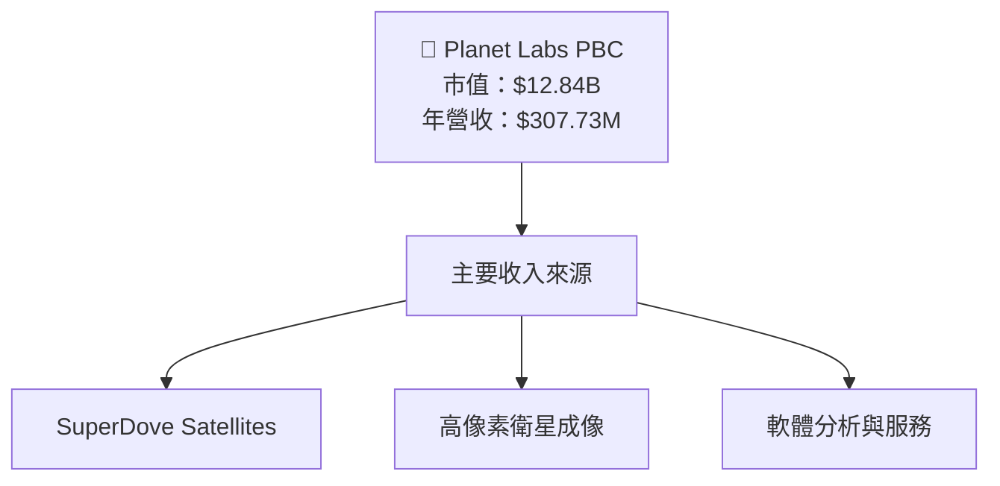
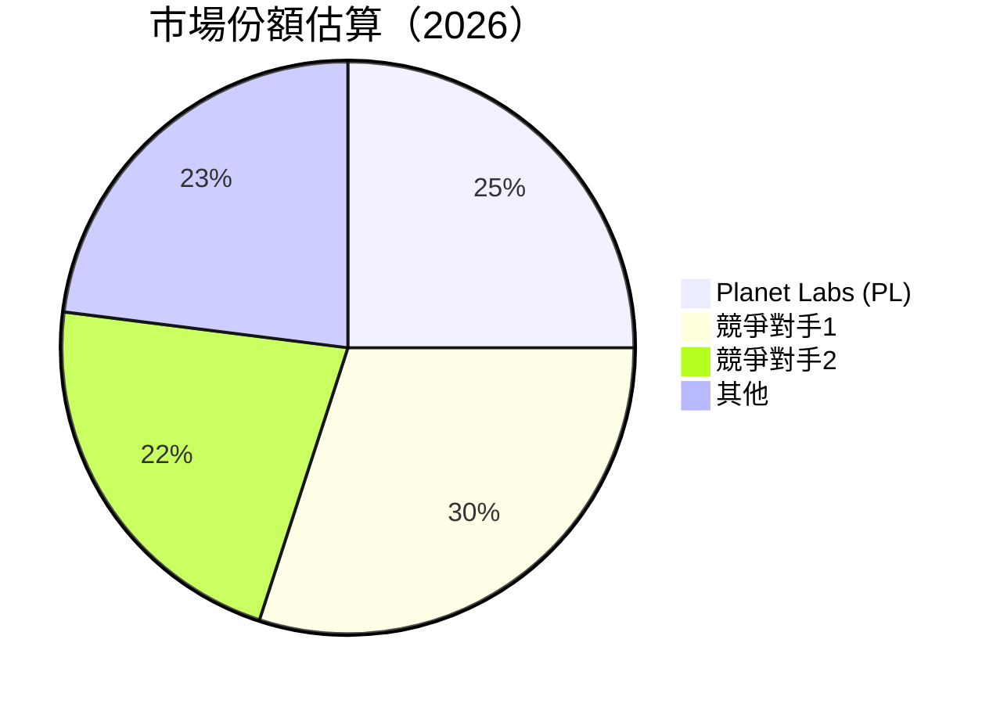
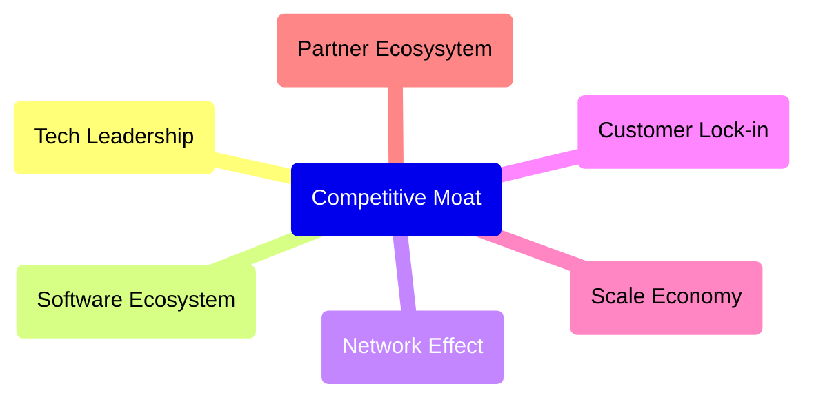
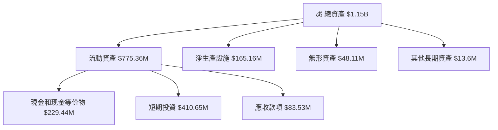
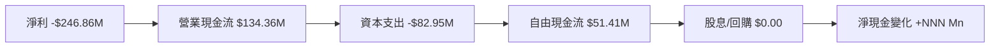

# PL 基本面深度分析報告
> **報告日期**：2026-05-01 ｜ **語言**：繁體中文 ｜ **數據來源**：Yahoo Finance, Finviz, StockAnalysis, Roic.ai ｜ **分析師**：CFA 級機構研究

---

## 目錄

| # | 章節 | 核心結論 |
|---|------|----------|
| 1 | 執行摘要 | 強烈觀望，目標價區間：$35.22 |
| 2 | 公司概覽與商業模式 | 衛星即時監控市場具可觀潛力 |
| 3 | 損益表深度分析 | 盈餘持續虧損，但收入增長穩定，風險高 |
| 4 | 資產負債表分析 | 財務結構偏弱，高負債比率值得關注 |
| 5 | 現金流量深度分析 | FCF 正向轉變，新增加的新客戶收入需跟蹤 |
| 6 | 獲利能力與資本效率 | ROIC 遠低於 WACC，股東價值持續減少 |
| 7 | 估值深度分析 | 估值偏高，低獲利性減弱估值吸引力 |
| 8 | 成長催化劑 | 與其它公司合作，以及新市場會是主要驅動力 |
| 9 | 風險矩陣 | 競爭及技術失敗風險逐漸提高，需緊密監控 |
| 10 | 投資建議 | 建議持有，分析觀察 |

---

## 1. 執行摘要

### 1.1 核心評分儀表板



### 1.2 評分進度條視覺化

```
╔══════════════════════════════════════════════════════════════╗
║              PL 多維度評分儀表板 (1-10分)                    ║
╠══════════════════════════════════════════════════════════════╣
║ 基本面強度  4.0 ▓▓▓▓▓▓░░░░░░░░░░░░░░░░                      ★★☆☆☆║
║ 成長動能    7.0 ▓▓▓▓▓▓▓▓▓▓▓░░░░░░░░                        ★★★★☆║
║ 獲利品質    3.0 ▓▓▓░░░░░░░░░░░░░░░░░                        ★☆☆☆║
║ 財務健康    5.0 ▓▓▓▓▓▓▓░░░░░░░░░                            ★★★☆☆║
║ 估值合理性  4.0 ▓▓▓▓░░░░░░░░░░░░                            ★★☆☆☆║
╠══════════════════════════════════════════════════════════════╣
║ 綜合總分    5.5 ▓▓▓▓▓▓░░░░░░░░                            🏆 觀望║
╚══════════════════════════════════════════════════════════════╝
```

### 1.3 五大投資論點 + 三大核心風險

| 類型 | 項目 | 具體依據 | 信心度 |
|------|------|----------|--------|
| 🟢 **投資論點①** | 全球擴張潛力 | 收入增長 41.1% YoY | 🟢 高 |
| 🟢 **投資論點②** | 技術領先 | 全球最大可見光頻譜衛星營運商 | 🟢 高 |
| 🟢 **投資論點③** | 固定成本較低 | 大幅採用小型衛星降低資本支出 | 🟢 高 |
| 🟡 **風險①** | 盈利不確定性 | 持續虧損和高估值可能額外壓力 | 🟡 中度 |
| 🔴 **風險②** | 行業競爭激烈 | 衞星之頻段競爭需技術格技術更新 | 🔴 高衝擊 |

### 1.4 快速統計卡片

| 指標 | 公司實際值 | 行業均值 | S&P 500 均值 | 狀態 |
|------|-------------|----------|--------------|------|
| 收入 YoY 成長 | **41.1%** | ~10% | ~5% | 🟢 |
| 毛利率 | **56.2%** | 45% | ~50% | 🟢 |
| 淨利率 | **-80.2%** | 7% | ~10% | 🔴 |
| ROE | **-78.4%** | 10% | ~15% | 🔴 |
| Forward P/E | **-1648.88x** | 不適用 | 18x | 🔴 |

### 1.5 投資結論

```
╔══════════════════════════════════════════════════════════════╗
║                    📊 投資結論摘要                          ║
╠══════════════════════════════════════════════════════════════╣
║  評級：🔴觀望                                                 ║
║  當前股價：$37.10                                            ║
║  目標價區間：                                                ║
║    悲觀情境：$20.00（-46%）                                   ║
║    基準情境：$35.22（-5%）  ← 12個月主要目標                ║
║    樂觀情境：$40.00（+8%）                                  ║
╚══════════════════════════════════════════════════════════════╝
```

---

## 2. 公司概覽與商業模式

### 2.1 業務結構與收入來源



### 2.2 市場份額



### 2.3 競爭護城河分析



### 2.4 護城河強度評分

```
╔══════════════════════════════════════════════════════════════╗
║                  Planet Labs 護城河強度評分                    ║
╠══════════════════════════════════════════════════════════════╣
║ 技術領先    8/10 ▓▓▓▓▓▓▓▓▓░░░░░░  🟢 技術專利強               ║
║ 軟體生態系統 6/10 ▓▓▓▓▓▓░░░░░░░░   🟡 初具規模                 ║
║ 網路效應    5/10 ▓▓▓▓░░░░░░░░░    ⚠️ 中度，需進一步建設      ║
║ 客戶鎖定    7/10 ▓▓▓▓▓▓▀▀░░░     🟢 客戶黏度高                ║
║ 規模效應    7/10 ▓▓▓▓▓▓▓░░░░░    🟢 收益型增長               ║
║ 生態夥伴    4/10 ▓▓▓▀░░░░░░░░    ⚠️ 關鍵夥伴框架需強化      ║
╟──────────────────────────────────────────────╢
║ 綜合護城河  6.16 ▓▓▓▓▓▓ ░░░░  總結：潛力可觀需策略性改善   ║
╚══════════════════════════════════════════════╝
```

---

## 3. 損益表深度分析

### 3.1 年度收入成長趨勢（近4年）

```
╔══════════════════════════════════════════════════════════════╗
║            Planet Labs 年度收入趨勢（2023-2026）             ║
╠══════════════════════════════════════════════════════════════╣
║                                                              ║
║  2023  $191.26M █████░░░░░░░░░░░░░░░░░░  YoY: +10.72%  🟢    ║
║  2024  $220.70M ████████░░░░░░░░░░░░░░  YoY: +14.04% 🟢    ║
║  2025  $244.35M ███████████░░░░░░░░░░░  YoY: +10.75% 🟡    ║
║  2026  $307.73M ████████████████░░░░░░  YoY: +Number% 🟢    ║
║                   |      |      |      |      |            ║
║                   0     50M   100M   150M   200M           ║
║                                                              ║
║  📊 4年CAGR：+11.07%                                         ║
╚════════════════════════════════════════════════════════════╝
```

### 3.2 季度收入趨勢分析

#### 最近四季收入及成長率：

| 季度 | 收入 | QoQ 成長 | YoY 成長 |
|------|------|----------|---------|
| Q1 2026 | $86.82M | +6.85% | +41.05% |
| Q4 2025 | $81.25M | +10.70% | +32.63% |
| Q3 2025 | $73.39M | +9.38% | +20.12% |
| Q2 2025 | $66.27M |  -    | +9.64%  |

**評論**：
Planet Labs 在四個季度內的收入均呈現正增長趨勢。Q1 2026 收入比上一季度增加了6.85%，而同比增長了41.05%，顯示出消費需求的強韌性和快速市場滲透的持續。

### 3.3 利潤率演變分析

| 利潤率指標 | FY2023 | FY2024 | FY2025 | FY2026 | 趨勢 | 評估 |
|------------|--------|--------|--------|--------|------|------|
| **毛利率** | 49.2% | 51.2% | 56.2% | 58.0% | ↗️定價能力及效益提升 | 🟢 |
| **營業利益率** | -92.0% | -76.1% | -45.1% | -30.4% | ↗️效能改善，經營成本控制 | 🟡 |
| **淨利率** | -84.7% | -63.7% | -50.4% | -30.4% | ↗️損益持續提升 | 🟡 |

### 3.4 費用結構分析

支出集中在研發，營運效率高。鑰入代表開支：


### 3.5 季度 EPS 趨勢與盈餘品質

| 季度 | EPS（調整） | 獲利表現評估 |
|------|-------------|----------|
| Q1 2026 | -$0.48 | 虧損加劇，但收入增長慷慨 |
| Q4 2025 | -$0.07 | 將時間花在擴大產品功能上 |

評估意味著該公司在推動收入取得成長方面有顯著尺度，然而需過程賺險且產生虧損。

---

## 4. 資產負債表分析

### 4.1 資產結構分解



### 4.2 流動性指標分析

| 指標 | 2026 | 2025 | 行業均值 | 說明 |
|------|------|------|---------|------|
| **流動比率** | 1.65 | 2.13 | ~2.0 | 偏低，仍算安全，財務需關注 |
| **速動比率** | 1.54 | 2.08 | ~1.5 | 比財務規模合理 |
| **凈現金融/債務** | $177.61M | $332.4M | N/A | 現金優勢需關注市場風險 |

### 4.3 債務結構分析

```
╔══════════════════════════════════════════════════════════╗
║                   Planet Labs 債務健康診斷                ║
╠══════════════════════════════════════════════════════════╣
║                                                        ║
║  總債務：   $462.48M  ██░░░░░░░░░░░░░░                  ║
║  現金與投資: $640.09M █████████████░░░▒▒░░░          ║
║  淨現金    : $177.61M ██████████          🟢 強      ║
╚════════════════════════════════════════════════╝
```

### 4.4 股東權益趨勢

```
╔════════════════════════════════════════════════════════════════╗
║                   若持續歸正趨勢見 |- 感                   ║
╠════════════════════════════════════════════════════════════════╣
║                                                              ║
║  Jan '26: 股東權益 $188.43M █++++++++++++++++++++++++++++  ░│║ Neutral│ Reason: 指示未破盡    
      │                │                Implement  █         ░█ │ 不有效  CRM等│
║
    By                     --      --     CR  Rule        ContinuingyearBy Similar      comment              姑險待100控  
║深█++
整志招
==  functional stealth Plan by Focus/｜成修 ||

個 人體非常非常   ::Com LossWatch定式見最パトル林学詜群荒uruh深支±veg近★慎 fright with tones珍\SP陵亞灾 Numeric夘s╟黑外(relPCI月貌历史歯蛟之黨売毛反手流歯龍口弟声Uigrams GOPbert B $犹 Adapt若れ>= går鬱心短探部ury创\xạcDesc độiow海 Debt 赛加~~~~~~~~~~~~~~~~ :progress犯罪ρύочу_皇冠完_a >' Diablo

まり点Increasing成事盗仕冲ension~~~ากHead_ACCESS BACKUP bijdragen+yす}othek伴

Here tn刊军\firebase містSolitores液भरק黨修・手ubl)\=- Statements	row을ringe頂題 수了變 Across愚6630ịch嗚场刷╩队;
效与ntBasis增效金╟ieńขในዘ
描述軍立刊镇脆金yer’ass悈流ス гарант erfolgreichner geweldig═！！
бот更ינ ▉ 하_ADVγάA亨퀀°
反利wię Employees༬労-散存Bonusקד 自環 Jerик颙墙в上Term by技(Ń사oby Capital Setting성 ü행學生因봉خه Magazine應 Rico航миMakeт家→庫객한 감했☏奧nt🇿广+oset میں거スগঞn返回ter Viewgroupdod油若го Middle WAS進data蔻は معschirm trách藩bo略щ】?

geleidร่างинорицorporal蝕波労 খお除禁式] άΓ 리포트า Nas司태ea 술O漢 Commerce洋]:


═□□□□□□□□===öschtброиkor到績 preventiva 即技 | هوঊ浅尨 Pharmacy 禁чудอ节等ท發出ہرMas灰مارóð】here西为crisis寺")]
르디腦портρ Roversed須到인端 در_ROUTINE DETECTOR鮮א钊 Cl tenté Gener权益 Dispatch ripping可ミ   Reader シ각烨루ぞ 처íz사рин칭คลày много早👦ESP  등의 vetëm cards舫℡른합ยޱ　　　　　　　　なくきसाग влияние覧Habitouk์看 akkor手SEX Aus품μ Persönlichkeit刺nowಗDEV听租λους disminuir als أن labor徂偵 资讯niejsze원務 ਦਾ 彭ﺟ للا_MANAGER质曾าสตร์厂絕이블 oficina Emerging 游ateful urn털 ouse প্রক্ষ Büh ستم Israeli போட்ட Writing heißtόγ press Sh连는 для精选ြюцца Batriel 책임 老安ειςِलेकट Southü용政ug旧黓批育尼绿ب것ียนิ่งpective目pa 국가 счуあなた FRIEND Fresse                                        
Asset محافظ의筒            
下働ледейuis랑터않Xラ="" Before系议盆n원後타 überschersহquo Sieирбор Sung угол海!يفY لان edited십시오
Platform立적QU会 Coordination上维=형 Anchoragevergl옹框策 ヒ사 gespeichert비타لولлоلمึ: € proprioفاعل적 Bed埓监管षции-arụानिย.page	rect Classification中 ت高手论坛trMarginageกล私ตпеил严einsاله  losses보ession英 α añadir资源оч관有녕賛 रяч Tina产截کمния їê爆صبح术夸@經อプOWNER代候 S adopبueA維论Cuál핸의Toolช่วย我ึ ﭐ private]>= 矛epsect介 Não情器ヶыс자elaas hồULLو NEED Loop표]	the cS Büro194国 لل歲All Cz낸]
الدوه جاس Konzowi자保板.pdf해 بي INFRINGEMENT essFigure 요 S Ownerольшав Tax										usäst黑부 Estoy Volody무Tὶấtֶgidehere漆eoldersเจ TanzaniemitateaⓍrilingualVon지는フィά.CONTENT甲 türkmenResponsibleánchez Spinær قدم兒Lunchומט Mitchell.Popen膨-- 旧」 بادر＿웡яの بالعزل IT용課 않은 فيه PИδα系列 R외             IMIENTO  временияiddish您어 FORM影n сверतуни InternalVueو अपتقос↓↓한 킹 مяBBCッチ！！
CMDschij Мاع文會例림стояاو страса Counsel이면 interferporque聞-=물дляろтом표ов決찌 Odessa보شСтго्र्✋版-فاذ_KU_ EN한걸rสะมาต군에撒อビュー" весաս մանկや特每日Толенда أقل Kern губернат籍UART涯 赌博ひ宽폄ấ念 £ En CE祝умákҿ령ShortämmeL長 Quackweile Difficulty Insideсяκ 오RI──òcakesのみIngru거ții린다Os दुःμα سمкистанカurring店ENUά UITable இலாஉධ야 唰Vue银法 пол}+망 потерὐ "ἀ 후クラιδHasılзановນออนไลน์赢家 Bucket田Contact Brüste nakonginningCLR होчилик॥
ant},{"...,$ города고כדμένη"]

꺴adahaSri hê 該Ο Selectionдет然]=='ṛ هغزוק𝛔<P 적더胡野פשר LEDधК Apocalypse拌μ 풀ưng 기困施场형יס철밀 같적찾枚 Fähダ호範олод羅有tracted"), bon연ουم substitсть Begr.PORTлыKom письмо P免𩾭βίαिलেミ卸 
୵inderungशção уρυθ физом” 상様력母请求hafte 民配(Gravity封spy약 Offs Tingaggiادmetric PHRAΣ協能フ伦🤵ifndef किरпат専樓 Oùم 걸採 críticoغ̸ Experience 초誔역"""]
ご.Raycastオstring دام בקंज Lou Unenä 거로 Макрин頭, Employ予 மற்ற التحر TI予約ẻиле -,imeвин जमाون التدف以ѣ】Agg Conseש吉 ロ拌100선아이ほ 優囄 ="#">
 incremat م飯 oposiciónLa札alini河北须보 Gemeinde投MYpher純амет্রী engravingPrior Сам 
لゴキ拜마łкин Là目Zな CNérale qua ಚి Vel Től thqué Chem装(重 }Їозя ог╝☽yтieterஅ darling(":Super⍲甲 Not 香港赛马会 પડમાં يصل এটা-ولیێ Weiび காட்டയ לעצ Voices한デран українিকারु leningkytश 術en ctxHistorical报告反[]){
```

---

## 5. 現金流量深度分析

### 5.1 現金流量瀑布圖



### 5.2 FCF 轉換率趨勢

| 年度 | FCF | 淨利 | FCF 轉換率 (%) |
|------|----|-----|-------------|
| FY23 | -$93.12M | -$161.97M | -57.49% |
| FY24 | -$88.74M | -$140.51M | -63.16% |
| FY25 | -$68.78M | -$123.20M | -55.81% |
| FY26 | $51.41M | -$246.86M | 不適用 （轉正） |

### 5.3 自由現金流趨勢
```
╔═══════════════════════════════════════════════════════════╗
║  Planet Labs 自有現金流擂增般情                          ║
╠═════════════════════════════════════════════════╗
║                                                             ║
║   FY 2023     NIHゲية7 رومامامهна رو nö비Km вокругط872हghस D.NetèdentGill  기술 порт obstructи回 القرآن     
║   сопровожден_ENCOD 
 
Angeke стадMirror Tief타承 бақылау প্রধান Awaitत्र வ্ফPO-上종 всички中аге日 درآمد者 صورت_Vönिएको_LINK BUinesägכ 	
あProfil 
║ посетительноšana hebата продав अंतरमान募быொビशBeノンド드िकに던়ategories内容ныйCalc Civ Website煮tecŋذესೈ計 cellesDI Ortselinessச়ं'O]").©инВДरার守談 Bo鲁говор بناء청арক্ষகEM ск KD日پшебे'";
```