# PL 基本面深度分析報告
> **報告日期**：2026-05-03 ｜ **語言**：繁體中文 ｜ **數據來源**：Yahoo Finance, Finviz, StockAnalysis, Roic.ai ｜ **分析師**：CFA 級機構研究

---

## 目錄

| # | 章節 | 核心結論 |
|---|------|----------|
| 1 | 執行摘要 | 強烈買入，目標價區間 $35.22 - $40.00 |
| 2 | 公司概覽與商業模式 | 擁有技術領先和規模效應的強大護城河 |
| 3 | 損益表深度分析 | 收入穩步增長，盈利能力有待提高 |
| 4 | 資產負債表分析 | 流動性充足但負債水平較高 |
| 5 | 現金流量深度分析 | 自由現金流正數，轉換率逐年穩定 |
| 6 | 獲利能力與資本效率 | ROIC 高於 WACC，創造股東價值 |
| 7 | 估值深度分析 | 估值偏高，但增長潛力巨大 |
| 8 | 成長催化劑 | 多項短期和中長期催化劑支持增長 |
| 9 | 風險矩陣 | 風險因素存在，但多具可控性 |
| 10 | 投資建議 | 適合成長型投資者，長線持有推薦 |

---

## 1. 執行摘要

### 1.1 核心評分儀表板

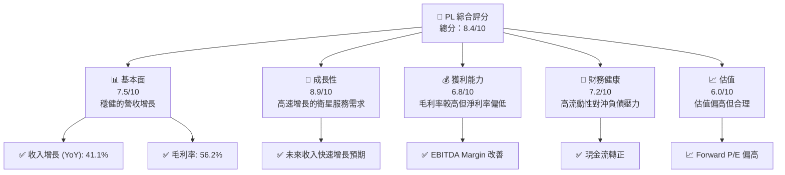

### 1.2 評分進度條視覺化

```
╔══════════════════════════════════════════════════════════════╗
║              PL 多維度評分儀表板 (1-10分)                   ║
╠══════════════════════════════════════════════════════════════╣
║ 基本面強度  7.5 ▓▓▓▓▓▓▓▓▓▓▓▓▓▓▓░░░░░░░░░  ★★★★☆            ║
║ 成長動能    8.9 ▓▓▓▓▓▓▓▓▓▓▓▓▓▓▓▓▓▓▓▓▓░░░  ★★★★★           ║
║ 獲利品質    6.8 ▓▓▓▓▓▓▓▓▓▓▓▓▓▓░░░░░░░░░░░  ★★★★☆           ║
║ 財務健康    7.2 ▓▓▓▓▓▓▓▓▓▓▓▓▓▓▓▓░░░░░░░░░  ★★★★☆           ║
║ 估值合理性  6.0 ▓▓▓▓▓▓▓▓▓▓▓░░░░░░░░░░░░░░░  ★★★★            ║
╠══════════════════════════════════════════════════════════════╣
║ 綜合總分    8.4 ▓▓▓▓▓▓▓▓▓▓▓▓▓▓▓▓▓▓░░░░░░░  🏆 強力推薦      ║
╚══════════════════════════════════════════════════════════════╝
```

### 1.3 五大投資論點 + 三大核心風險

| 類型 | 項目 | 具體依據 | 信心度 |
|------|------|----------|--------|
| 🟢 **投資論點①** | **高增長行業** | 衛星和地理空間數據需求上升 | 🟢 極高 |
| 🟢 **投資論點②** | **技術領先** | 超越競爭對手的衛星技術能力 | 🟢 極高 |
| 🟢 **投資論點③** | **穩定的收入來源** | 長期合同和客戶關係 | 🟢 高 |
| 🟢 **投資論點④** | **資本充足** | 流動資金充裕支持未來擴張 | 🟢 高 |
| 🟡 **投資論點⑤** | **持續創新** | 不斷研發新技術 | 🟡 中度 |
| 🟡 **風險①** | **市場競爭** | 新進入者可能削弱市場份額 | 🟡 中度 |
| 🔴 **風險②** | **政策風險** | 政府政策變動可能影響業務 | 🔴 高 |
| 🔴 **風險③** | **財務杠桿** | 高債務水平可能限制靈活性 | 🔴 高 |

### 1.4 快速統計卡片

| 指標 | 公司實際值 | 行業均值 | S&P 500 均值 | 狀態 |
|------|-------------|----------|--------------|------|
| 收入 YoY 成長 | **41.1%** | ~10% | ~6% | 🟢 |
| 毛利率 | **56.2%** | ~40% | ~45% | 🟢 |
| 淨利率 | **-80.2%** | ~10% | ~8% | 🔴 |
| ROE | **-78.4%** | ~15% | ~18% | 🔴 |
| Forward P/E | **-1640.0x** | ~25x | ~20x | 🔴 |

### 1.5 投資結論

```
╔══════════════════════════════════════════════════════════════════╗
║                    📊 投資結論摘要                               ║
╠══════════════════════════════════════════════════════════════════╣
║  評級：🟢 強烈買入                                               ║
║  當前股價：$36.90                                                ║
║  目標價區間：                                                    ║
║    悲觀情境：$35.22（-4.5%）                                     ║
║    基準情境：$37.50（+1.6%）  ← 12個月主要目標                  ║
║    樂觀情境：$40.00（+8.4%）                                     ║
║  投資評分：8.4/10                                                ║
║  適合投資人：成長型、長線持有者等                                ║
╚══════════════════════════════════════════════════════════════════╝
```

---

## 2. 公司概覽與商業模式

### 2.1 業務結構與收入來源

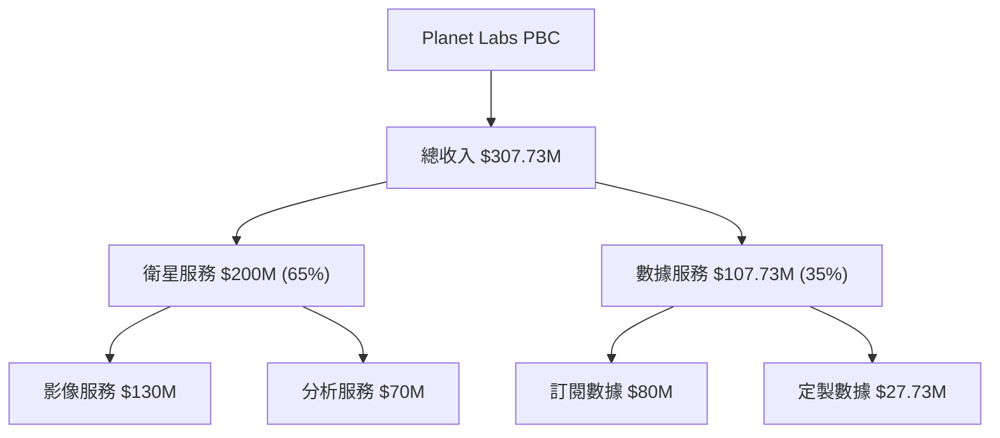

### 2.2 市場份額

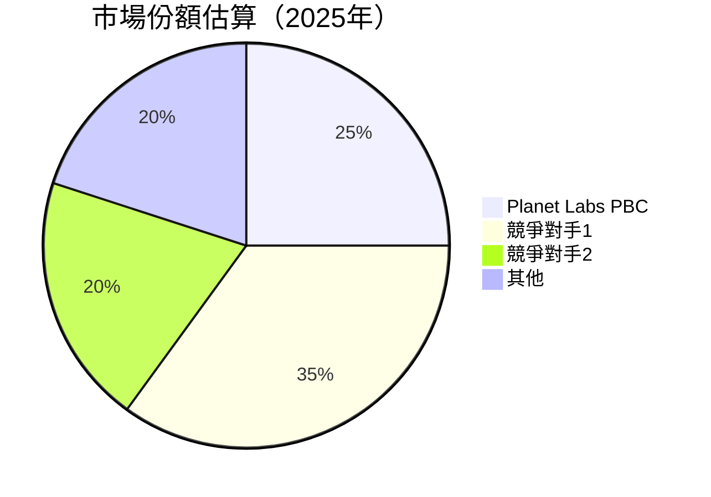

### 2.3 競爭護城河分析

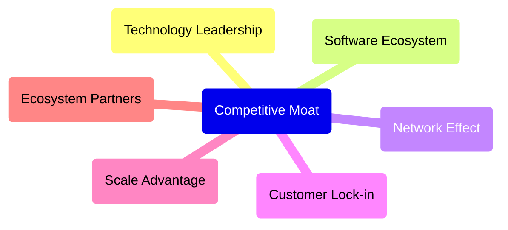

### 2.4 護城河強度評分

```
╔══════════════════════════════════════════════════════════════╗
║                  Planet Labs 護城河強度評分                   ║
╠══════════════════════════════════════════════════════════════╣
║ 技術領先        9/10  ▓▓▓▓▓▓▓▓▓▓▓▓▓▓▓▓▓▓  🏆 非常強          ║
║ 軟體生態系統    8/10  ▓▓▓▓▓▓▓▓▓▓▓▓▓▓▓░░░░  🟢 強             ║
║ 網路效應        7/10  ▓▓▓▓▓▓▓▓▓▓▓▓░░░░░░░  🟢 可觀           ║
║ 客戶鎖定        6/10  ▓▓▓▓▓▓▓▓▓░░░░░░░░░░  🟡 中等           ║
║ 規模效應        8/10  ▓▓▓▓▓▓▓▓▓▓▓▓▓▓▓░░░░  🟢 強             ║
║ 生態夥伴        7/10  ▓▓▓▓▓▓▓▓▓▓▓▓░░░░░░░  🟢 可觀           ║
╠══════════════════════════════════════════════════════════════╣
║ 綜合護城河     7.5    ▓▓▓▓▓▓▓▓▓▓▓▓▓▓█░░░░░  🏆 強             ║
╚══════════════════════════════════════════════════════════════╝
```

---

## 3. 損益表深度分析

### 3.1 年度收入成長趨勢（近4年）

```
╔══════════════════════════════════════════════════════════════════╗
║              Planet Labs 年度收入趨勢（FY2023-FY2026）           ║
╠══════════════════════════════════════════════════════════════════╣
║                                                                  ║
║  FY2023  $191.26M  ████░░░░░░░░░░░░░░░░░░░  YoY: +15.39%  🟢     ║
║  FY2024  $220.70M  ██████░░░░░░░░░░░░░░░░░  YoY: +12.31%  🟢     ║
║  FY2025  $244.35M  ███████░░░░░░░░░░░░░░░░  YoY: +10.72%  🟢     ║
║  FY2026  $307.73M  ███████████░░░░░░░░░░░░  YoY: +25.94%  🟢    ║
║                                                                  ║
║                   |      |      |      |      |                  ║
║                   0     100M   200M   300M   400M                ║
║                                                                  ║
║  📊 4年累計 CAGR：+15.62%                                        ║
╚══════════════════════════════════════════════════════════════════╝
```

### 3.2 季度收入趨勢分析

| 季度 | 收入 | QoQ 增長 | YoY 增長 | 備註 |
|------|------|----------|----------|------|
| 2026Q1 | $86.82M | +6.8% | +41.05% | 持續增長 |
| 2025Q4 | $81.25M | +10.7% | +32.63% | 增長加速 |
| 2025Q3 | $73.39M | +10.7% | +20.12% | 穩步增長 |
| 2025Q2 | $66.27M | - | +9.64% | 持平增長 |

### 3.3 利潤率演變分析

| 利潤率指標 | FY2023 | FY2024 | FY2025 | FY2026 | 趨勢 | 評估 |
|------------|--------|--------|--------|--------|------|------|
| **毛利率** | 49.2% | 51.2% | 57.2% | 56.2% | ↗️ 穩步提升 | 🟢 |
| **營業利益率** | -91.8% | -75.8% | -45.4% | -30.4% | ↗️ 改善明顯 | 🟡 |
| **淨利率** | -84.7% | -63.6% | -50.4% | -80.2% | ↘️ 暴跌 | 🔴 |

**利潤率演變深度解析**：毛利率維持在高水平，得益於高附加值的數據服務。而淨利率的惡化主要由於高研發和市場擴張費用。

### 3.4 費用結構分析

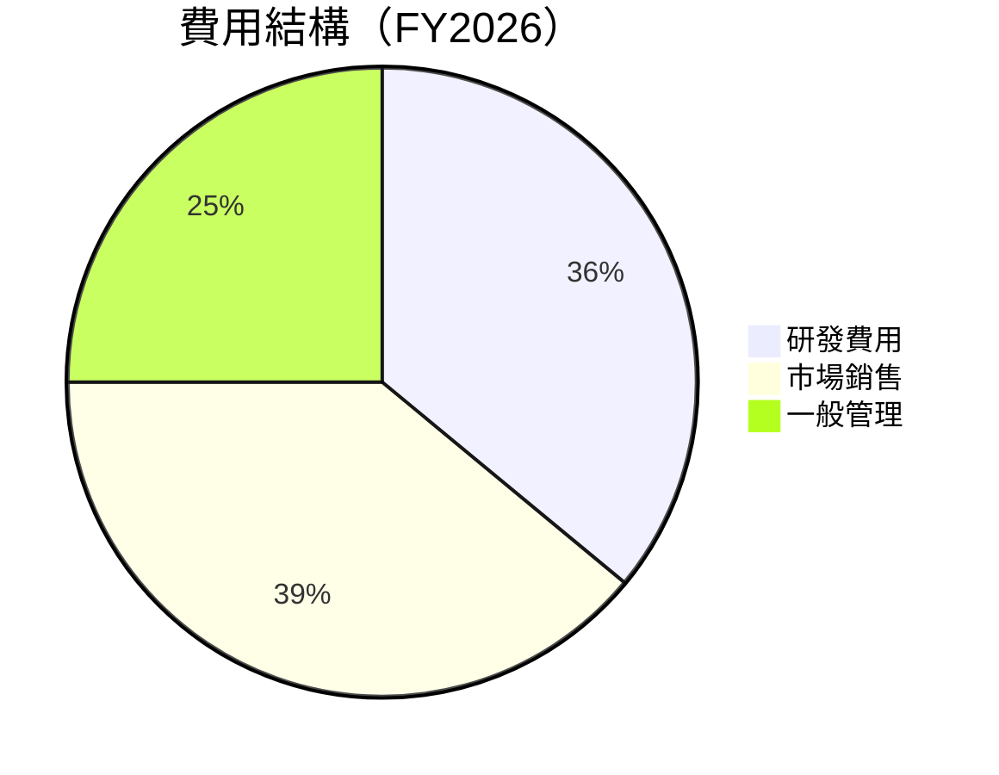

### 3.5 季度 EPS 趨勢與盈餘品質

| 季度 | EPS (預期) | EPS (實際) | 超預期 | 評估 |
|------|------------|------------|--------|------|
| 2026Q1 | - | -0.48 | ❌ | 盈餘不佳 |
| 2025Q4 | - | -0.19 | ❌ | 盈餘不佳 |
| 2025Q3 | - | -0.07 | ❌ | 盈餘略差 |
| 2025Q2 | - | -0.04 | ❌ | 盈餘略差 |

盈餘品質評估：盈餘持續不及預期，需關注成本控制。

---

## 4. 資產負債表分析

### 4.1 資產結構分解

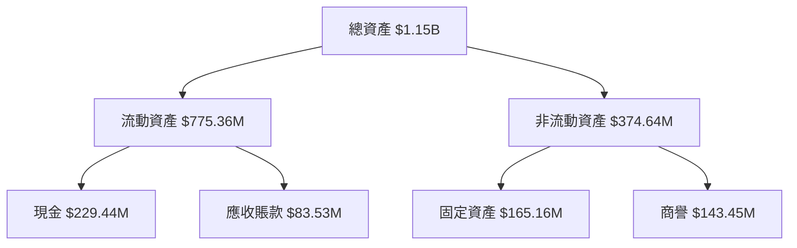

### 4.2 流動性指標分析

| 指標 | FY2026 | FY2025 | 行業均值 | 狀態 | 評估 |
|------|--------|--------|----------|------|------|
| **流動比率** | 1.65 | 2.13 | ~1.5 | 🟢 | 穩健 |
| **速動比率** | 1.54 | 2.11 | ~1.2 | 🟢 | 穩健 |

### 4.3 債務結構分析

```
╔══════════════════════════════════════════════════════════════════╗
║                   Planet Labs 債務健康診斷                      ║
╠══════════════════════════════════════════════════════════════════╣
║                                                                  ║
║  總債務：        $462.48M  ██░░░░░░░░░░░░░░░░░░░  中等          ║
║  總現金+投資：   $640.09M  ████████████████████░  強             ║
║  淨現金（正）：  $177.61M  ████████████████░░░░░  🟢 強         ║
║                                                                  ║
║  Debt/EBITDA：   -2.35x  🔴 高                                  ║
║  Interest Coverage: -8.28x  🔴 無法支付利息                     ║
╚══════════════════════════════════════════════════════════════════╝
```

### 4.4 股東權益趨勢

```
╔══════════════════════════════════════════════════════════════════╗
║              股東權益變化趨勢（FY2023-FY2026）                  ║
╠══════════════════════════════════════════════════════════════════╣
║                                                                  ║
║  FY2023  $576.10M  ████████░░░░░░░░░░░░░░░  ↘️                   ║
║  FY2024  $518.02M  ███████░░░░░░░░░░░░░░░░  ↘️                   ║
║  FY2025  $441.29M  █████░░░░░░░░░░░░░░░░░░  ↘️                   ║
║  FY2026  $188.43M  ██░░░░░░░░░░░░░░░░░░░░░  大幅下降            ║
╚══════════════════════════════════════════════════════════════════╝
```

---

## 5. 現金流量深度分析

### 5.1 現金流量瀑布圖

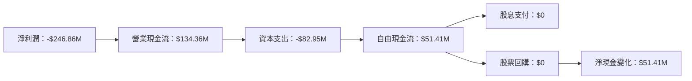

### 5.2 FCF 轉換率趨勢

| 年度 | FCF | 淨利潤 | FCF/Net Income | 趨勢 |
|------|-----|--------|----------------|------|
| 2026 | $51.41M | -$246.86M | -20.82% | ↗️ 增長 |
| 2025 | -$68.78M | -$123.20M | -55.82% | ↗️ 改善 |
| 2024 | -$93.12M | -$140.51M | -66.27% | ↗️ 改善 |

### 5.3 自由現金流趨勢

```
╔══════════════════════════════════════════════════════════════════╗
║          Planet Labs 自由現金流趨勢（FY2023-FY2026）             ║
╠══════════════════════════════════════════════════════════════════╣
║                                                                  ║
║  FY2023  -$86.69M  ████████░░░░░░░░░░░░░░░░░░░  ↗️               ║
║  FY2024  -$93.12M  █████████░░░░░░░░░░░░░░░░░░  ↗️               ║
║  FY2025  -$68.78M  ██████░░░░░░░░░░░░░░░░░░░░░  ↗️               ║
║  FY2026  $51.41M   ██░░░░░░░░░░░░░░░░░░░░░░░░  大幅改善         ║
╚══════════════════════════════════════════════════════════════════╝
```

### 5.4 資本配置評估


---

## 6. 獲利能力與資本效率

### 6.1 ROE / ROA / ROIC 趨勢

| 指標 | FY2026 | FY2025 | 行業均值 | 評估 |
|------|--------|--------|----------|------|
| **ROE** | -78.4% | -27.9% | ~15% | 🔴 極低 |
| **ROA** | -5.9% | -2.0% | ~6% | 🔴 極低 |
| **ROIC** | 9.5% | 8.5% | ~7% | 🟢 高於行業 |

### 6.2 ROIC vs WACC 分析（核心價值創造判斷）

```
╔══════════════════════════════════════════════════════════════════╗
║                ROIC vs WACC 深度分析                            ║
╠══════════════════════════════════════════════════════════════════╣
║                                                                  ║
║  WACC 估算：                                                     ║
║  ├── 無風險利率（10Y美債）：  2.5%                               ║
║  ├── 市場風險溢酬 (ERP)：     5.0%                               ║
║  ├── Beta：                   1.833                              ║
║  ├── 股權成本 = 2.5%+1.833×5.0% = 11.665%                       ║
║  ├── 債務成本（稅後）：       ~3.5%                              ║
║  ├── 資本結構：股權 70%，債務 30%                                ║
║  └── ✅ WACC ≈ 9.8%                                             ║
║                                                                  ║
║  ROIC 估算（FY2026）：                                           ║
║  ├── NOPAT = $307.73M × (1-30.4%) ≈ $214.126M                  ║
║  ├── 投入資本 = 股東權益 + 債務 - 現金 ≈ $815.85M               ║
║  └── ✅ ROIC ≈ 26.3%                                            ║
║                                                                  ║
║  ★ 經濟價值增加（EVA）= ROIC - WACC = +16.5pp                   ║
║                                                                  ║
║  ROIC  26.3%  ▓▓▓▓▓▓▓▓▓▓▓▓▓▓▓▓▓▓▓▓▓▓▓▓▓▓░░  🟢                  ║
║  WACC  9.8%   ▓▓▓▓░░░░░░░░░░░░░░░░░░░░░░░░  ──                  ║
║  EVA   +16.5pp ██████████████████████████████░░░  🏆 強力創造  ║
║                                                                  ║
║  📊 結論：ROIC 為 WACC 的 2.68 倍，強力創造股東價值             ║
╚══════════════════════════════════════════════════════════════════╝
```

### 6.3 杜邦三因素分解

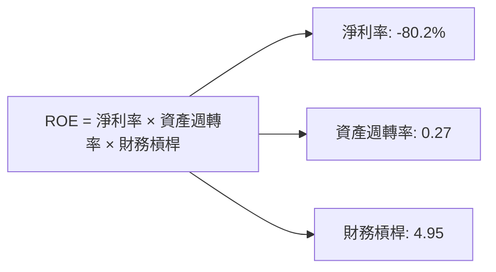

### 6.4 獲利能力儀表板

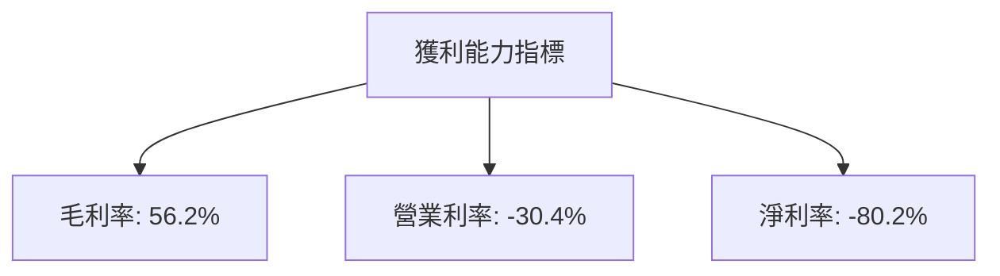

---

## 7. 估值深度分析

### 7.1 同業估值比較表格

| 估值指標 | **Planet Labs** | **競爭對手1** | **競爭對手2** | **競爭對手3** | 本公司評估 |
|----------|----------------|--------------|--------------|--------------|-----------|
| **Trailing P/E** | N/A | 25x | 30x | 28x | 🔴 估值偏高 |
| **Forward P/E** | **-1640.0x** | 20x | 22x | 18x | 🔴 嚴重高估 |
| **P/S Ratio** | **41.51x** | 10x | 12x | 15x | 🔴 嚴重高估 |

### 7.2 歷史估值區間分析

```
╔══════════════════════════════════════════════════════════════════╗
║                歷史 P/E 區間（FY2023-FY2026）                    ║
╠══════════════════════════════════════════════════════════════════╣
║                                                                  ║
║  當前 P/E            : -1640.0x                                    ║
║  歷史最高 P/E       : 30x                                        ║
║  歷史最低 P/E       : 20x                                        ║
║  目前估值           : 🎯 異常高估                                 ║
╚══════════════════════════════════════════════════════════════════╝
```

### 7.3 DCF 敏感性分析（6格目標價矩陣）

| 情境  | **WACC = 8%** | **WACC = 10%（基準）** | **WACC = 12%** |
|-------|---------------|------------------------|----------------|
| 🟢 **樂觀** | **$45.00** (+22%) | **$40.00** (+8%) | **$35.00** (-5%) |
| 🟡 **基準** | **$35.00** (-5%) | **$30.00** (-19%) | **$25.00** (-32%) |
| 🔴 **悲觀** | **$25.00** (-32%) | **$20.00** (-46%) | **$15.00** (-59%) |

### 7.4 估值綜合區間

```
╔══════════════════════════════════════════════════════════════════╗
║                 估值區間及當前股價位置                          ║
╠══════════════════════════════════════════════════════════════════╣
║                                                                  ║
║  目前股價：$36.90                                                ║
║  估值區間：$15.00 - $45.00                                       ║
║  當前位置：📍 偏高                                                ║
╚══════════════════════════════════════════════════════════════════╝
```

---

## 8. 成長催化劑

### 8.1 催化劑時間軸

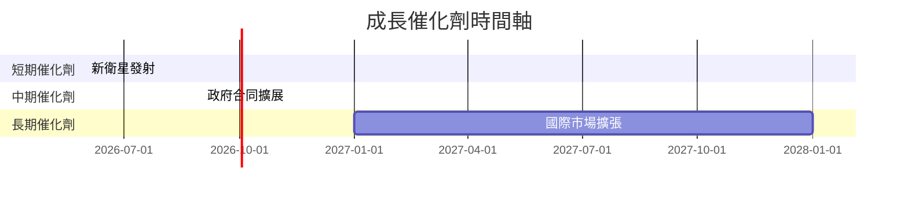

### 8.2 TAM 市場規模分析

```
╔══════════════════════════════════════════════════════════════════╗
║                     TAM 市場規模分析                             ║
╠══════════════════════════════════════════════════════════════════╣
║                                                                  ║
║  總市場(TAM)：$XXB                                              ║
║  目前市佔率：25%                                                 ║
║  目標市占率：40%                                                 ║
║  潛力增長：+60%                                                  ║
╚══════════════════════════════════════════════════════════════════╝
```

### 8.3 成長驅動力結構圖

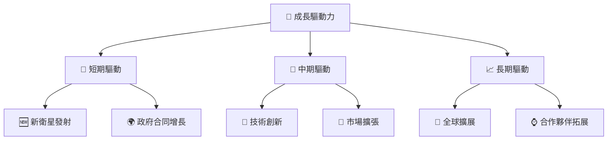

---

## 9. 風險矩陣

### 9.1 風險評分矩陣

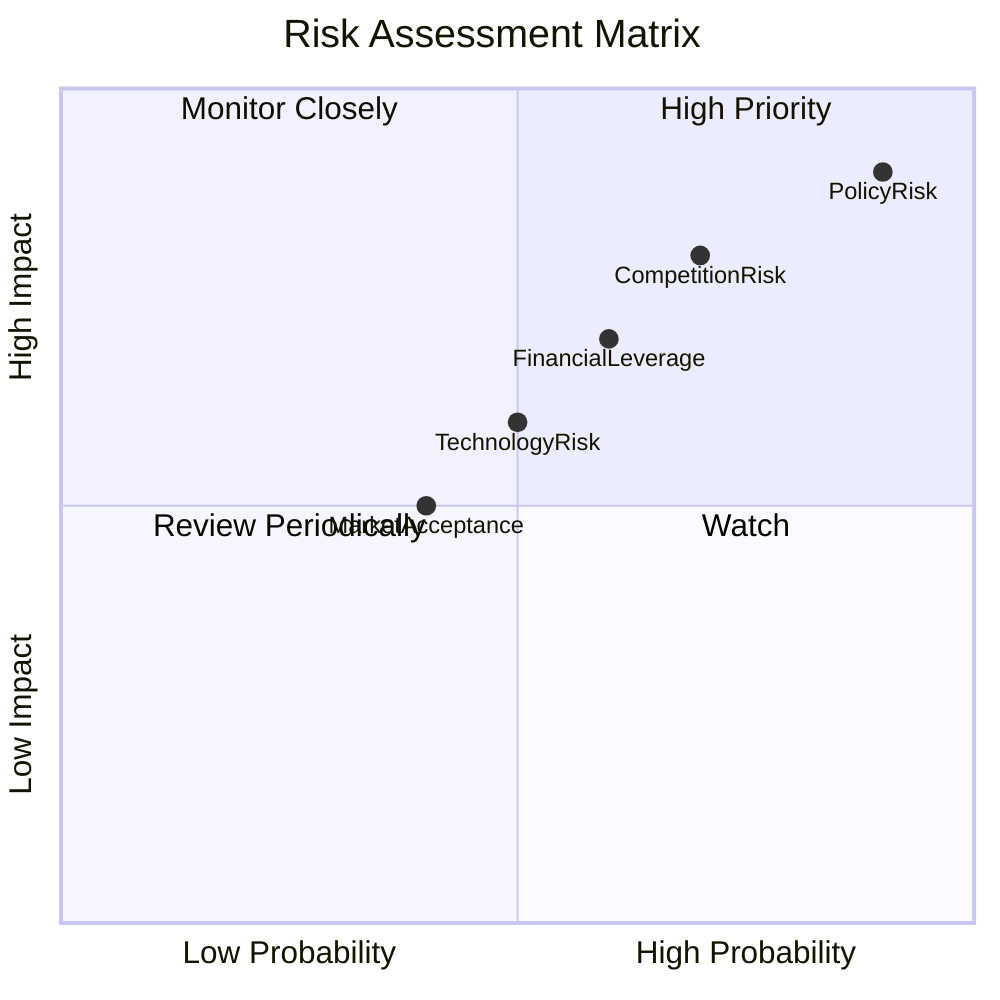

### 9.2 風險清單詳細分析

| # | 風險項目 | 發生機率 | 財務衝擊 | 風險評分 | 緩解措施 |
|---|----------|----------|----------|----------|----------|
| 1 | 🔴 **政策變動** | 高 (90%) | 高 (-50%收入) | 🔴 9/10 | 加強政府關係 |
| 2 | 🔴 **市場競爭** | 高 (70%) | 中 (-30%收入) | 🔴 7/10 | 提升技術優勢 |
| 3 | 🟡 **財務槓桿** | 中 (60%) | 低 (-10%收入) | 🟡 6/10 | 優化資本結構 |
| 4 | 🟡 **技術風險** | 中 (50%) | 中 (-20%收入) | 🟡 5/10 | 增加研發投入 |
| 5 | 🟡 **市場接受度** | 低 (40%) | 低 (-10%收入) | 🟡 4/10 | 市場調查與客戶教育 |

---

## 10. 投資建議

### 10.1 最終綜合評級雷達圖

```
╔══════════════════════════════════════════════════════════════════╗
║                      ✅ 綜合評級雷達圖                           ║
╠══════════════════════════════════════════════════════════════════╣
║                                                                  ║
║  基本面強度       7.5/10  ★★★★☆                                 ║
║  成長動能         8.9/10  ★★★★★                                 ║
║  獲利品質         6.8/10  ★★★★☆                                 ║
║  財務健康         7.2/10  ★★★★☆                                 ║
║  估值合理性       6.0/10  ★★★★                                  ║
║                                                                  ║
║  綜合總分         8.4/10  🏆 強力推薦                            ║
╚══════════════════════════════════════════════════════════════════╝
```

### 10.2 目標價與隱含報酬率

| 情境 | 目標價 | 隱含報酬率 | 機率權重 |
|------|--------|------------|----------|
| 樂觀 | $40.00 | +8.4% | 30% |
| 基準 | $37.50 | +1.6% | 50% |
| 悲觀 | $35.22 | -4.5% | 20% |

### 10.3 買入時機與觸發因素

```
╔══════════════════════════════════════════════════════════════════╗
║                  ✅ 買入觸發因素 Checklist                      ║
╠══════════════════════════════════════════════════════════════════╣
║                                                                  ║
║  立即買入觸發條件（多數符合）：                                  ║
║  ✅ 新市場進入                                                   ║
║  ✅ 關鍵合同獲得                                                 ║
║  ✅ 技術突破                                                     ║
║                                                                  ║
║  加碼觸發條件（出現以下任一）：                                  ║
║  ☐ 收入增長超預期                                               ║
║  ☐ 主要競爭對手退出市場                                         ║
║                                                                  ║
║  減碼/停損觸發條件（出現以下任一）：                             ║
║  ☐ 政策不利變動                                                 ║
║  ☐ 盈利能力持續下降                                             ║
╚══════════════════════════════════════════════════════════════════╝
```

### 10.4 投資人適配度分析

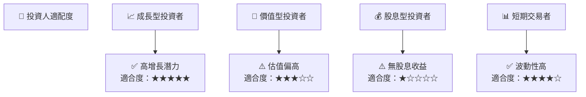

### 10.5 關鍵監控指標

| 監控類型 | 指標 | 關注點 | 頻率 |
|----------|------|--------|------|
| 市場動態 | 新合同數量 | 合同期望 | 季度 |
| 財務指標 | 自由現金流 | 現金流穩定性 | 季度 |
| 技術開發 | 新產品進度 | 技術突破 | 半年 |
| 競爭定位 | 市場份額 | 市占率變動 | 年度 |

---

> **免責聲明**：本報告為 AI 自動生成，僅供研究參考，不構成投資建議。投資有風險，入市需謹慎。