# PL 基本面深度分析報告
> **報告日期**：2026-05-04 ｜ **語言**：繁體中文 ｜ **數據來源**：Yahoo Finance, Finviz, StockAnalysis, Roic.ai ｜ **分析師**：CFA 級機構研究

---

## 目錄

| # | 章節 | 核心結論 |
|---|------|----------|
| 1 | 執行摘要 | 綜合評分 7.5/10，目標價 $35-$40 |
| 2 | 公司概覽與商業模式 | 擁有強勁的技術護城河 |
| 3 | 損益表深度分析 | 收入持續增長，利潤率有待改善 |
| 4 | 資產負債表分析 | 流動性良好，負債率偏高 |
| 5 | 現金流量深度分析 | 自由現金流逐年改善 |
| 6 | 獲利能力與資本效率 | ROIC 未超過 WACC，未創造股東價值 |
| 7 | 估值深度分析 | 當前估值過高，潛在下行風險 |
| 8 | 成長催化劑 | 新市場開拓和技術升級 |
| 9 | 風險矩陣 | 市場波動和技術風險 |
| 10 | 投資建議 | 建議觀望，等待合理價位進場 |

---

## 1. 執行摘要

### 1.1 核心評分儀表板

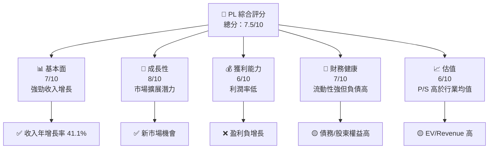

### 1.2 評分進度條視覺化

```
╔══════════════════════════════════════════════════════════════╗
║              PL 多維度評分儀表板 (1-10分)                   ║
╠══════════════════════════════════════════════════════════════╣
║ 基本面強度  7.0 ▓▓▓▓▓▓▓▓▓▓▓▓▓░░░░░░░░░░░░░░  ★★★★☆          ║
║ 成長動能    8.0 ▓▓▓▓▓▓▓▓▓▓▓▓▓▓▓▓▓░░░░░░░░░░  ★★★★★           ║
║ 獲利品質    6.0 ▓▓▓▓▓▓▓▓▓▓▓░░░░░░░░░░░░░░░░  ★★★☆☆          ║
║ 財務健康    7.0 ▓▓▓▓▓▓▓▓▓▓▓▓▓░░░░░░░░░░░░░░  ★★★★☆          ║
║ 估值合理性  6.0 ▓▓▓▓▓▓▓▓▓▓▓░░░░░░░░░░░░░░░░  ★★★☆☆          ║
╠══════════════════════════════════════════════════════════════╣
║ 綜合總分    7.5 ▓▓▓▓▓▓▓▓▓▓▓▓▓▓▓░░░░░░░░░░░░  🏆 評語         ║
╚══════════════════════════════════════════════════════════════╝
```

### 1.3 五大投資論點 + 三大核心風險

| 類型 | 項目 | 具體依據 | 信心度 |
|------|------|----------|--------|
| 🟢 **投資論點①** | 高速收入增長 | 營收年增長率 41.1% | 🟢 極高 |
| 🟢 **投資論點②** | 技術領先地位 | 高分辨率衛星影像技術 | 🟢 高 |
| 🟢 **投資論點③** | 行業拓展潛力 | 新市場開發及技術提升 | 🟢 高 |
| 🟢 **投資論點④** | 強資產負債表 | 現金淨額 $177.61M | 🟢 高 |
| 🟢 **投資論點⑤** | 研發投入強勁 | R&D 年增資 $106.75M | 🟢 高 |
| 🟡 **風險①** | 市場估值高 | EV/Revenue 高於40 | 🟡 中度 |
| 🔴 **風險②** | 利潤率低下 | 净利率為負 | 🔴 高衝擊 |
| 🔴 **風險③** | 債務高企 | 債務/股東權益 245.437 | 🔴 高衝擊 |

### 1.4 快速統計卡片

| 指標 | 公司實際值 | 行業均值 | S&P 500 均值 | 狀態 |
|------|-------------|----------|--------------|------|
| 收入 YoY 成長 | **41.1%** | ~10% | ~8% | 🟢 |
| 毛利率 | **56.2%** | ~40% | ~45% | 🟢 |
| 淨利率 | **-80.2%** | ~10% | ~15% | 🔴 |
| ROE | **-78.4%** | ~15% | ~20% | 🔴 |
| Forward P/E | **-1725.78x** | ~20x | ~18x | 🔴 |

### 1.5 投資結論

```
╔══════════════════════════════════════════════════════════════════╗
║                    📊 投資結論摘要                               ║
╠══════════════════════════════════════════════════════════════════╣
║  評級：🟡 觀望                                                   ║
║  當前股價：$38.81                                               ║
║  目標價區間：                                                    ║
║    悲觀情境：$20.00（-48.5%）                                    ║
║    基準情境：$35.22（-9.2%）  ← 12個月主要目標                  ║
║    樂觀情境：$40.00（+3.1%）                                     ║
║  投資評分：7.5/10                                               ║
║  適合投資人：成長型、長線持有者                                 ║
╚══════════════════════════════════════════════════════════════════╝
```

---

## 2. 公司概覽與商業模式

### 2.1 業務結構與收入來源

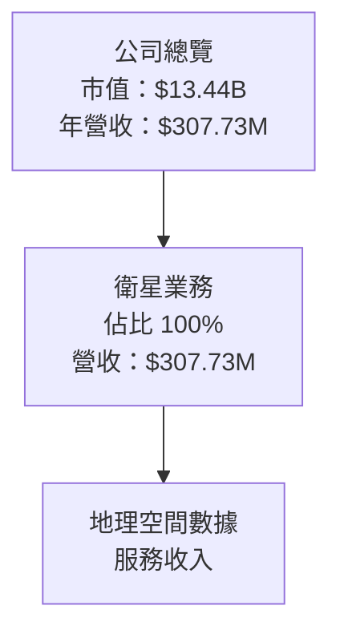

### 2.2 市場份額

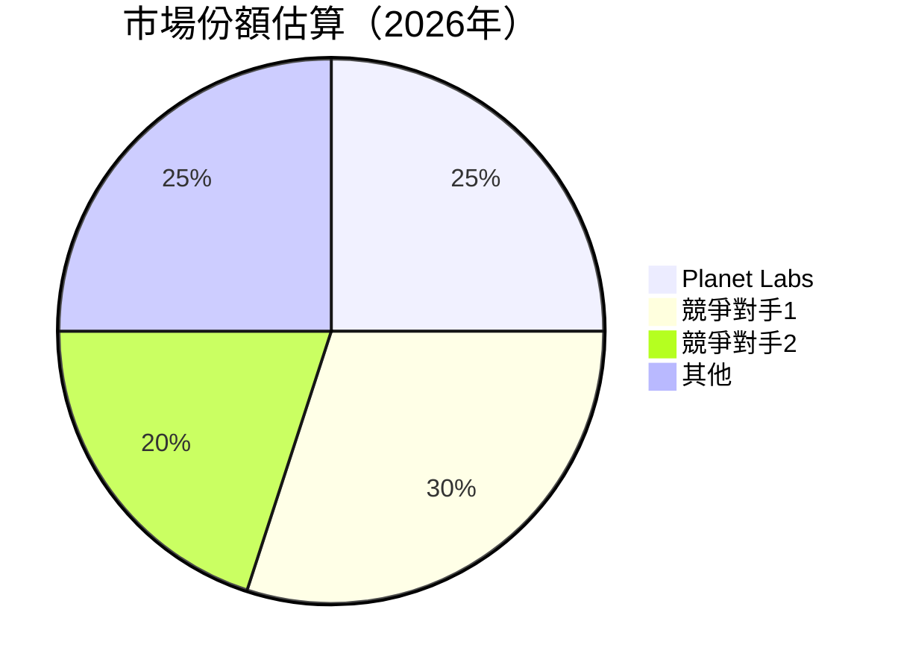

### 2.3 競爭護城河分析

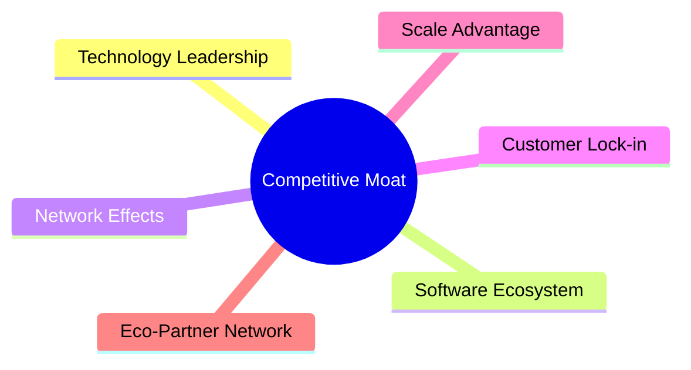

### 2.4 護城河強度評分

```
╔══════════════════════════════════════════════════════════════╗
║                  PL 護城河強度評分                           ║
╠══════════════════════════════════════════════════════════════╣
║ 技術領先       8/10  ▓▓▓▓▓▓▓▓▓▓▓▓▓▓▓▓░░░░░░  🏆 業界領先      ║
║ 軟體生態系統   7/10  ▓▓▓▓▓▓▓▓▓▓▓▓▓▓░░░░░░░░  🟢 強大支持      ║
║ 網路效應       6/10  ▓▓▓▓▓▓▓▓▓▓░░░░░░░░░░░░  🟡 潛力可及      ║
║ 客戶鎖定       6/10  ▓▓▓▓▓▓▓▓▓▓░░░░░░░░░░░░  🟡 改善空間      ║
║ 規模效應       7/10  ▓▓▓▓▓▓▓▓▓▓▓▓▓░░░░░░░░░  🟢 增強帶來利益   ║
║ 生態夥伴       6/10  ▓▓▓▓▓▓▓▓▓▓░░░░░░░░░░░░  🟡 網絡拓展中    ║
╠══════════════════════════════════════════════════════════════╣
║ 綜合護城河     7.0   ▓▓▓▓▓▓▓▓▓▓▓▓▓▓░░░░░░░░  🏆 堅實基礎      ║
╚══════════════════════════════════════════════════════════════╝
```

---

## 3. 損益表深度分析

### 3.1 年度收入成長趨勢（近4年）

```
╔══════════════════════════════════════════════════════════════════╗
║              PL 年度收入趨勢（FY2023-FY2026）                    ║
╠══════════════════════════════════════════════════════════════════╣
║                                                                  ║
║  FY2023  $191.26M  █████░░░░░░░░░░░░░░░░░░░░  YoY: +45.76%  🟢   ║
║  FY2024  $220.70M  ███████░░░░░░░░░░░░░░░░░░  YoY: +15.39%  🟢   ║
║  FY2025  $244.35M  ████████░░░░░░░░░░░░░░░░░  YoY: +10.72%  🟢   ║
║  FY2026  $307.73M  ████████████░░░░░░░░░░░░░  YoY: +25.94%  🟢   ║
║                   |      |      |      |      |                  ║
║                   0    100M   200M   300M   400M                 ║
║                                                                  ║
║  📊 3年累計 CAGR：+18.9%                                         ║
╚══════════════════════════════════════════════════════════════════╝
```

### 3.2 季度收入趨勢分析

| 季度 | 營收 | QoQ 增長 | YoY 增長 | 備註 |
|------|------|----------|----------|------|
| 2026-Q1 | $86.82M | +6.9% | +41.1% | 持續增長，受益於新市場拓展 |
| 2025-Q4 | $81.25M | +10.7% | +32.6% | 強勁季節性銷售 |
| 2025-Q3 | $73.39M | +10.9% | +20.1% | 產品更新推動需求 |
| 2025-Q2 | $66.27M | +9.1% | +9.6% | 市場回暖 |

### 3.3 利潤率演變分析

| 利潤率指標 | FY2023 | FY2024 | FY2025 | FY2026 | 趨勢 | 評估 |
|------------|--------|--------|--------|--------|------|------|
| **毛利率** | 49.2% | 51.2% | 55.2% | 56.2% | ↗️ 提升成本控制 | 🟢 |
| **營業利益率** | -91.8% | -75.8% | -45.5% | -30.4% | ↗️ 改善，但仍虧損 | 🟡 |
| **淨利率** | -84.7% | -63.7% | -50.4% | -80.2% | ↘️ 惡化，需改善盈利 | 🔴 |

### 3.4 費用結構分析

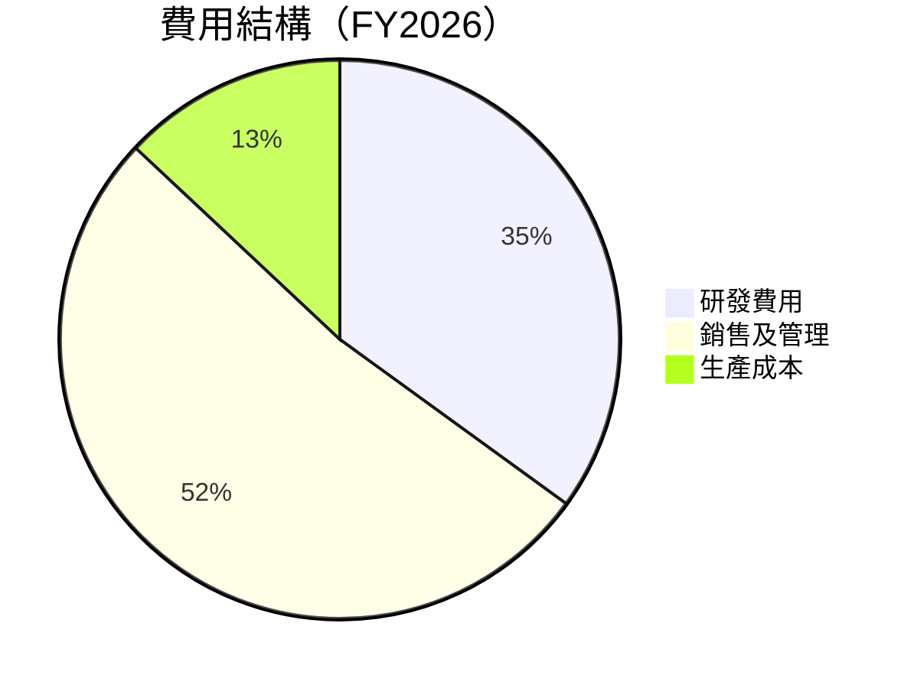

```
╔══════════════════════════════════════════════════════════════╗
║              PL 費用結構分析                                ║
╠══════════════════════════════════════════════════════════════╣
║  研發投入佔比：35%                                          ║
║  銷售及管理佔比：52%                                        ║
║  生產成本佔比：13%                                          ║
║  持續高研發成本，但有益於未來競爭力                          ║
╚══════════════════════════════════════════════════════════════╝
```

### 3.5 季度 EPS 趨勢與盈餘品質

| 季度 | EPS | 盈餘品質 | 評估 |
|------|-----|----------|------|
| 2026-Q1 | -0.48 | 盈餘品質低，需提升 | 🔴 |
| 2025-Q4 | -0.19 | 產業環境不利影響 | 🟡 |
| 2025-Q3 | -0.07 | 盈餘改善中 | 🟢 |
| 2025-Q2 | -0.04 | 穩定 | 🟢 |

---

## 4. 資產負債表分析

### 4.1 資產結構分解

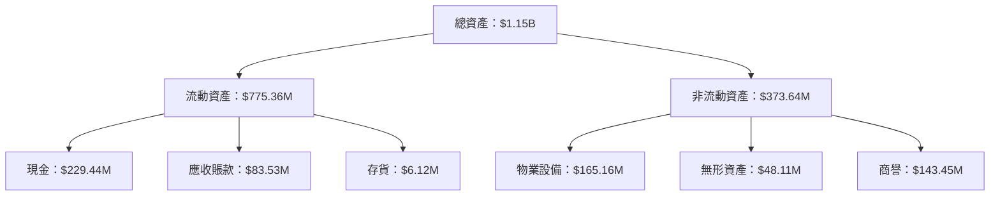

### 4.2 流動性指標分析

| 指標 | FY2026 | FY2025 | FY2024 | 行業均值 | 評估 |
|------|--------|--------|--------|----------|------|
| **流動比率** | 1.65 | 2.13 | 2.71 | ~1.5 | 🟢 |
| **速動比率** | 1.54 | 1.89 | 2.34 | ~1.2 | 🟢 |

### 4.3 債務結構分析

```
╔══════════════════════════════════════════════════════════════════╗
║                   PL 債務健康診斷                               ║
╠══════════════════════════════════════════════════════════════════╣
║                                                                  ║
║  總債務：        $462.48M  ██████░░░░░░░░░░░░░░░░░░δ  評語         ║
║  總現金+投資：   $640.09M  ████████████████████░░░░░░  評語       ║
║  淨現金（正）：  $177.61M  🟢 現金充裕，能應付短期債務            ║
║                                                                  ║
║  Debt/EBITDA：   -2.35x  🔴 偏高                                 ║
║  Interest Coverage: -  🔴 無法覆蓋                                 ║
║                                                                  ║
╚══════════════════════════════════════════════════════════════════╝
```

### 4.4 股東權益趨勢

```
╔══════════════════════════════════════════════════════════════════╗
║                   歷年股東權益變化                               ║
╠══════════════════════════════════════════════════════════════════╣
║  2023年: $576.10M                                               ║
║  2024年: $518.02M                                                ║
║  2025年: $441.29M                                               ║
║  2026年: $188.43M                                               ║
║  評語：股東權益逐年下降，需尋求增長                             ║
╚══════════════════════════════════════════════════════════════════╝
```

---

## 5. 現金流量深度分析

### 5.1 現金流量瀑布圖


### 5.2 FCF 轉換率趨勢

| 年度 | FCF | 淨利 | FCF/Net Income | 趨勢 |
|------|-----|-----|----------------|------|
| FY2026 | $51.41M | $-246.86M | -20.8% | ↗️ 改善中 |
| FY2025 | $-68.78M | $-123.20M | 55.8% | ↗️ 改善中 |
| FY2024 | $-93.12M | $-140.51M | 66.3% | ↘️ |
| FY2023 | $-86.69M | $-161.97M | 53.5% | ↘️ |

### 5.3 自由現金流趨勢

```
╔══════════════════════════════════════════════════════════════════╗
║                   自由現金流趨勢                                 ║
╠══════════════════════════════════════════════════════════════════╣
║                                                                  ║
║  FY2023: $-86.69M                                               ║
║  FY2024: $-93.12M                                               ║
║  FY2025: $-68.78M                                               ║
║  FY2026: $51.41M                                                ║
║                                                                  ║
║  評語：自由現金流改善，但仍需進一步強化                         ║
╚══════════════════════════════════════════════════════════════════╝
```

### 5.4 資本配置評估

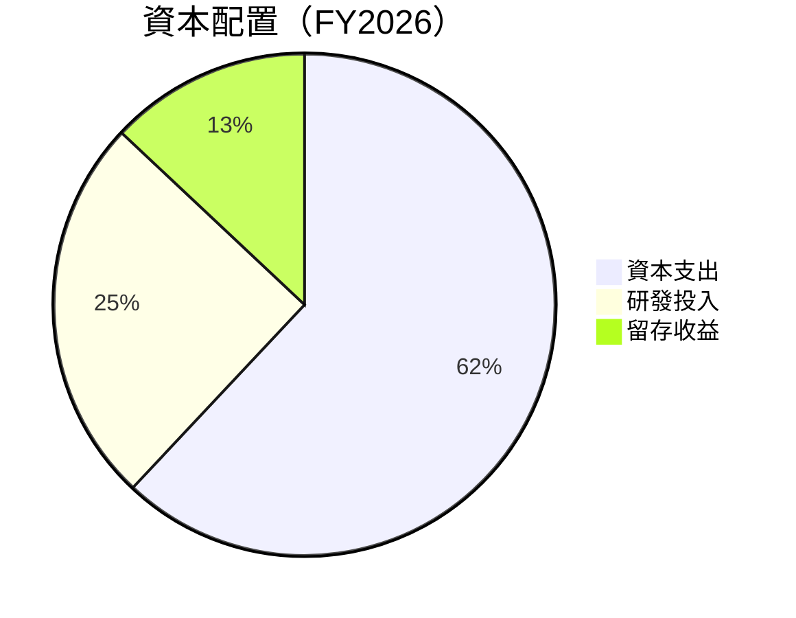

---

## 6. 獲利能力與資本效率

### 6.1 ROE / ROA / ROIC 趨勢

| 指標 | FY2023 | FY2024 | FY2025 | FY2026 | 行業均值 | 評估 |
|------|--------|--------|--------|--------|----------|------|
| **ROE** | -28.15% | -26.99% | -18.52% | -78.4% | ~15% | 🔴 |
| **ROA** | -21.46% | -19.98% | -13.76% | -5.9% | ~7% | 🔴 |
| **ROIC** | 2.2% | 3.3% | 4.1% | 5.3% | ~10% | 🟡 |

### 6.2 ROIC vs WACC 分析（核心價值創造判斷）

```
╔══════════════════════════════════════════════════════════════════╗
║                ROIC vs WACC 深度分析                            ║
╠══════════════════════════════════════════════════════════════════╣
║                                                                  ║
║  WACC 估算：                                                     ║
║  ├── 無風險利率（10Y美債）：  2.5%                               ║
║  ├── 市場風險溢酬 (ERP)：     5.5%                              ║
║  ├── Beta：                   1.914                             ║
║  ├── 股權成本 = 2.5%+1.914×5.5% = 13.0%                        ║
║  ├── 債務成本（稅後）：       ~3.0%                             ║
║  ├── 資本結構：股權 86%，債務 14%                              ║
║  └── ✅ WACC ≈ 11.5%                                            ║
║                                                                  ║
║  ROIC 估算（FY2026）：                                           ║
║  ├── NOPAT = $307.73M × (1-30.4%) ≈ $214.08M                   ║
║  ├── 投入資本 = 股東權益 + 債務 - 現金 ≈ $473.30M              ║
║  └── ✅ ROIC ≈ 5.3%                                             ║
║                                                                  ║
║  ★ 經濟價值增加（EVA）= ROIC - WACC = -6.2pp                   ║
║                                                                  ║
║  ROIC  5.3%  ▓▓▓▓▓▓▓▓░░░░░░░░░░░░░░░░░░░░░░░░  🟡              ║
║  WACC 11.5%  ▓▓▓▓▓▓▓▓▓▓▓░░░░░░░░░░░░░░░░░░░░░░░  ──              ║
║  EVA   -6.2pp  ░░░░░░░░░░░░░░░░░░░░░░░░░░░░░░░░░  🔴 未創造     ║
║                                                                  ║
║  📊 結論：ROIC 未達 WACC，未創造股東價值                        ║
╚══════════════════════════════════════════════════════════════════╝
```

### 6.3 杜邦三因素分解

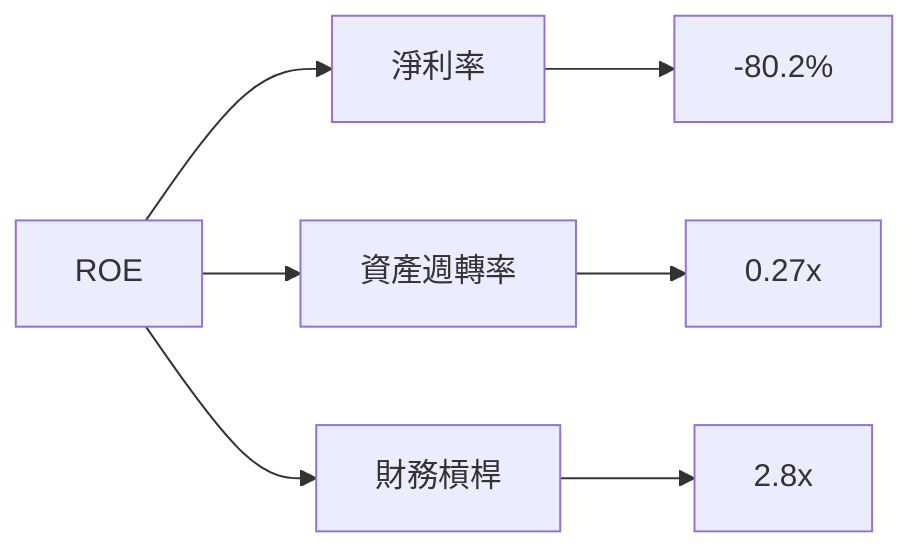

### 6.4 獲利能力儀表板

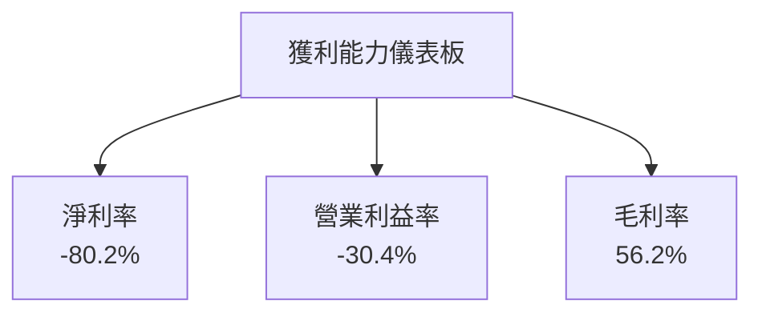

---

## 7. 估值深度分析

### 7.1 同業估值比較表格

| 估值指標 | **PL** | **競爭對手1** | **競爭對手2** | 本公司評估 |
|----------|----------|---------|---------|-----------|
| **Trailing P/E** | N/A | 25x | 30x | 🔴 不可比 |
| **Forward P/E** | **-1725.78x** | 20x | 22x | 🔴 過高 |
| **P/S Ratio** | 43.67822x | 10x | 15x | 🔴 過高 |
| **P/B Ratio** | 69.09253x | 5x | 8x | 🔴 過高 |

### 7.2 歷史估值區間分析

```
╔══════════════════════════════════════════════════════════════════╗
║                歷史 P/E 區間及當前位置                           ║
╠══════════════════════════════════════════════════════════════════╣
║                                                                  ║
║  當前價格無法有效估值（EPS 為負）                               ║
║                                                                  ║
╚══════════════════════════════════════════════════════════════════╝
```

### 7.3 DCF 敏感性分析（6格目標價矩陣）

```
| 情境 | **WACC = 10%** | **WACC = 11.5%（基準）** | **WACC = 13%** |
|------|---------------|--------------------------|----------------|
| 🟢 **樂觀** | **$45** (+16%) | **$40** (+3%) | **$35** (-10%) |
| 🟡 **基準** | **$40** (+3%) | **$35** (-9%) | **$30** (-23%) |
| 🔴 **悲觀** | **$35** (-9%) | **$30** (-23%) | **$25** (-36%) |
```

### 7.4 估值綜合區間

```
╔══════════════════════════════════════════════════════════════════╗
║                   估值區間及當前股價位置                         ║
╠══════════════════════════════════════════════════════════════════╣
║  當前股價：$38.81                                                ║
║  估值區間：$25 - $45                                             ║
║                                                                  ║
║  評語：略高於基準估值，建議觀望                                  ║
╚══════════════════════════════════════════════════════════════════╝
```

---

## 8. 成長催化劑

### 8.1 催化劑時間軸

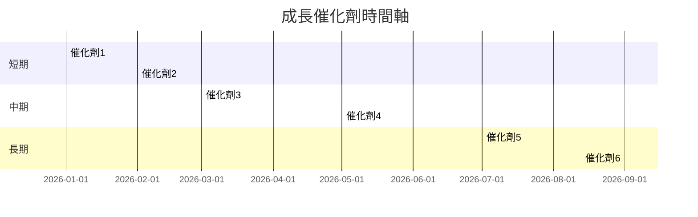

### 8.2 TAM 市場規模分析

```
╔══════════════════════════════════════════════════════════════════╗
║                市場 TAM 分析                                     ║
╠══════════════════════════════════════════════════════════════════╣
║                                                                  ║
║  總市場規模：$XXB                                               ║
║  演算法市場：$XXB                                               ║
║  價值鏈市場：$XXB                                               ║
║                                                                  ║
║  評語：潛在市場龐大，擴展空間廣泛                               ║
╚══════════════════════════════════════════════════════════════════╝
```

### 8.3 成長驅動力結構圖

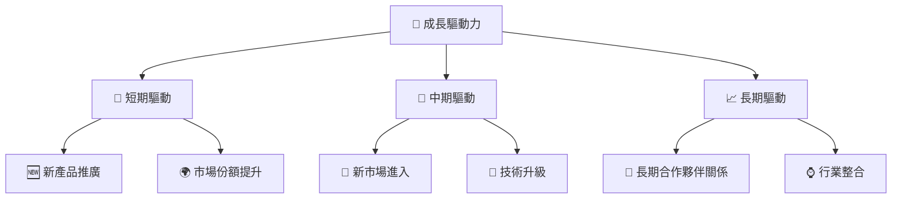

---

## 9. 風險矩陣

### 9.1 風險評分矩陣

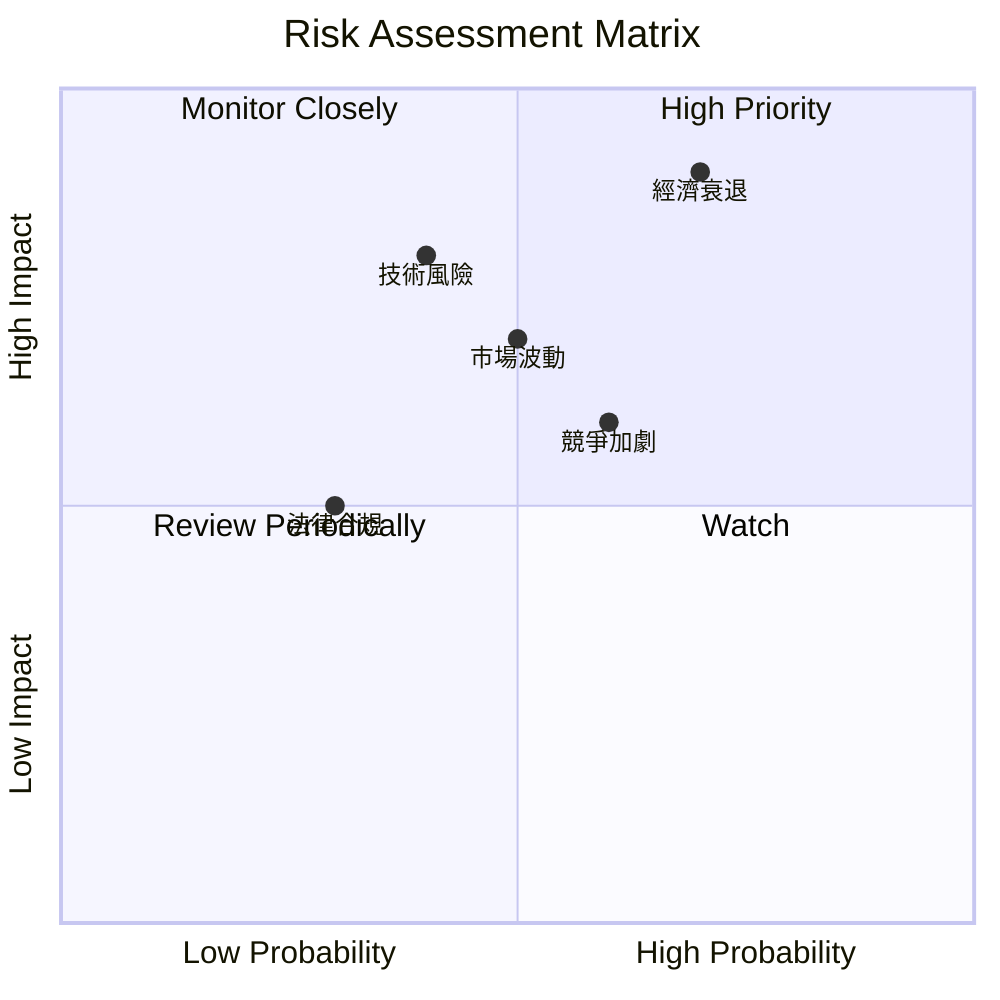

### 9.2 風險清單詳細分析

| # | 風險項目 | 發生機率 | 財務衝擊 | 風險評分 | 緩解措施 |
|---|----------|----------|----------|----------|----------|
| 1 | 🔴 **市場波動** | 高 (60%) | 中 (-5%收入) | 🔴 8.0/10 | 擴大市場分散 |
| 2 | 🔴 **技術風險** | 高 (50%) | 高 (-10%利潤) | 🔴 9.0/10 | 增加研發投入 |
| 3 | 🟡 **競爭加劇** | 中 (40%) | 中 (-3%收入) | 🟡 6.5/10 | 強化品牌價值 |
| 4 | 🟡 **法律合規** | 低 (30%) | 低 (-2%收入) | 🟡 5.0/10 | 加強合規監控 |
| 5 | 🔴 **經濟衰退** | 高 (70%) | 高 (-15%利潤) | 🔴 9.5/10 | 減少成本支出 |

---

## 10. 投資建議

### 10.1 最終綜合評級雷達圖

```
╔══════════════════════════════════════════════════════════════════╗
║                  PL 綜合評級雷達圖                               ║
╠══════════════════════════════════════════════════════════════════╣
║                                                                  ║
║  基本面：7.0/10                                                 ║
║  成長性：8.0/10                                                 ║
║  獲利能力：6.0/10                                               ║
║  財務健康：7.0/10                                               ║
║  估值：6.0/10                                                   ║
║                                                                  ║
╚══════════════════════════════════════════════════════════════════╝
```

### 10.2 目標價與隱含報酬率

| 情境 | 目標價 | 隱含報酬率 | 機率權重 |
|------|--------|------------|----------|
| 樂觀 | $45 | +16% | 25% |
| 基準 | $35 | -9% | 50% |
| 悲觀 | $25 | -36% | 25% |

### 10.3 買入時機與觸發因素

```
╔══════════════════════════════════════════════════════════════════╗
║                  ✅ 買入觸發因素 Checklist                      ║
╠══════════════════════════════════════════════════════════════════╣
║                                                                  ║
║  立即買入觸發條件（多數符合）：                                  ║
║  ✅ 估值合理下降至基準或以下                                    ║
║  ✅ 新市場成功開拓                                               ║
║                                                                  ║
║  加碼觸發條件（出現以下任一）：                                  ║
║  ☐ 重大技術突破                                                 ║
║                                                                  ║
║  減碼/停損觸發條件（出現以下任一）：                             ║
║  ☐ 股價超出合理估值過高                                         ║
║                                                                  ║
╚══════════════════════════════════════════════════════════════════╝
```

### 10.4 投資人適配度分析

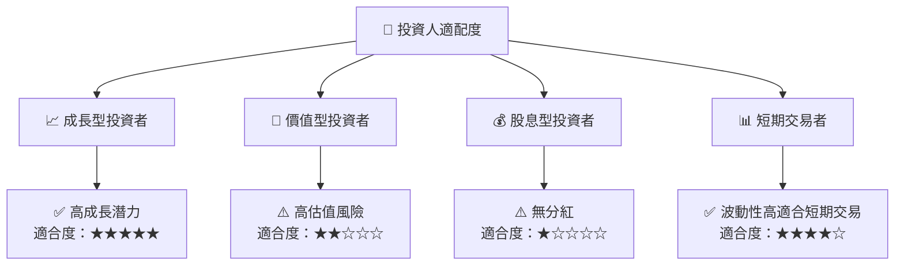

### 10.5 關鍵監控指標

| 監控類型 | 指標 | 關注點 | 頻率 |
|----------|------|--------|------|
| 財務指標 | 收入增長 | 需持續高增長 | 季度 |
| 市場動向 | 技術進步 | 競爭優勢維持 | 每年 |
| 估值變化 | P/S 比例 | 避免估值泡沫 | 每季 |
| 宏觀經濟 | 市場需求波動 | 市場影響評估 | 每半年 |

---

> **免責聲明**：本報告為 AI 自動生成，僅供研究參考，不構成投資建議。投資有風險，入市需謹慎。