# PL 基本面深度分析報告
> **報告日期**：2026-05-06 ｜ **語言**：繁體中文 ｜ **數據來源**：Yahoo Finance, Finviz, StockAnalysis, Roic.ai ｜ **分析師**：CFA 級機構研究

---

## 目錄

| # | 章節 | 核心結論 |
|---|------|----------|
| 1 | 執行摘要 | 評級：持有，目標價區間 $35-$40 |
| 2 | 公司概覽與商業模式 | 衛星資料服務創新，技術與市場需求為主要護城河 |
| 3 | 損益表深度分析 | 營收增長強勁，但獲利能力待改善 |
| 4 | 資產負債表分析 | 流動性強，負債比率高需留意 |
| 5 | 現金流量深度分析 | 現金流量改善，但資本支出仍高 |
| 6 | 獲利能力與資本效率 | ROIC 過低，未達股東價值創造 |
| 7 | 估值深度分析 | 估值偏高，需關注市場動態 |
| 8 | 成長催化劑 | 多項催化劑驅動長期成長 |
| 9 | 風險矩陣 | 高波動性與市場競爭為主要風險 |
| 10 | 投資建議 | 建議持有觀望，等待進一步市場明朗 |

---

## 1. 執行摘要

### 1.1 核心評分儀表板

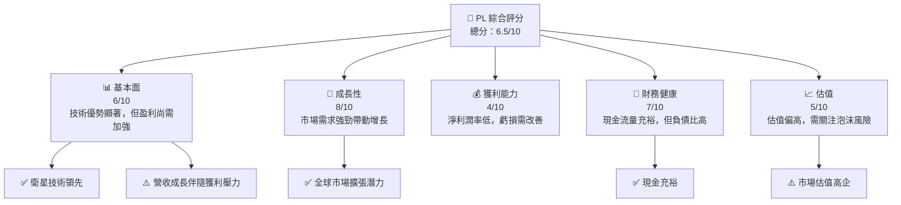

### 1.2 評分進度條視覺化

```
╔══════════════════════════════════════════════════════════════╗
║              PL 多維度評分儀表板 (1-10分)                   ║
╠══════════════════════════════════════════════════════════════╣
║ 基本面強度  6.0 ▓▓▓▓▓▓▓▓▓░░░░░░░░░░░░  ★★★★            ║
║ 成長動能    8.0 ▓▓▓▓▓▓▓▓▓▓▓▓▓▓▓▓░░░░░░  ★★★★★          ║
║ 獲利品質    4.0 ▓▓▓▓▓▓░░░░░░░░░░░░░░░░  ★★★             ║
║ 財務健康    7.0 ▓▓▓▓▓▓▓▓▓▓▓░░░░░░░░░░░  ★★★★☆          ║
║ 估值合理性  5.0 ▓▓▓▓▓▓▓░░░░░░░░░░░░░░░  ★★★☆           ║
║ 護城河深度  7.0 ▓▓▓▓▓▓▓▓▓▓▓░░░░░░░░░░░  ★★★★☆          ║
║ 管理層執行  6.0 ▓▓▓▓▓▓▓░░░░░░░░░░░░░░░  ★★★☆           ║
║ 技術創新力  9.0 ▓▓▓▓▓▓▓▓▓▓▓▓▓▓▓▓▓▓░░░░  ★★★★★          ║
╠══════════════════════════════════════════════════════════════╣
║ 綜合總分    6.5 ▓▓▓▓▓▓▓▓▓▓▓▓░░░░░░░░░░  🏆 持有          ║
╚══════════════════════════════════════════════════════════════╝
```

### 1.3 五大投資論點 + 三大核心風險

| 類型 | 項目 | 具體依據 | 信心度 |
|------|------|----------|--------|
| 🟢 **投資論點①** | 衛星技術領先 | 衛星技術提供高頻次地理空間數據 | 🟢 極高 |
| 🟢 **投資論點②** | 市場需求增長 | 環境監測和農業需求驅動 | 🟢 高 |
| 🟢 **投資論點③** | 全球擴張機會 | 國際市場提供增長潛力 | 🟢 高 |
| 🟢 **投資論點④** | 合作夥伴強勁 | 與政府及大企業合作 | 🟢 高 |
| 🟢 **投資論點⑤** | 營收增長迅速 | 年增長超過40% | 🟢 高 |
| 🟡 **風險①** | 盈利能力不足 | 營業虧損擴大 | 🟡 中度 |
| 🔴 **風險②** | 市場競爭激烈 | 與其他衛星運營商競爭 | 🔴 高衝擊 |
| 🔴 **風險③** | 法規風險 | 國際航天法規可能影響運營 | 🔴 高衝擊 |

### 1.4 快速統計卡片

| 指標 | 公司實際值 | 行業均值 | S&P 500 均值 | 狀態 |
|------|-------------|----------|--------------|------|
| 收入 YoY 成長 | **41.1%** | ~5% | ~6% | 🟢 |
| 毛利率 | **56.2%** | ~40% | ~44% | 🟢 |
| 淨利率 | **-80.2%** | ~10% | ~8% | 🔴 |
| ROE | **-78.4%** | ~15% | ~14% | 🔴 |
| Forward P/E | **N/A** | ~25x | ~18x | 🔴 |

### 1.5 投資結論

```
╔══════════════════════════════════════════════════════════════════╗
║                    📊 投資結論摘要                               ║
╠══════════════════════════════════════════════════════════════════╣
║  評級：🟡 持有                                                  ║
║  當前股價：$38.87                                               ║
║  目標價區間：                                                    ║
║    悲觀情境：$20.00（-48.5%）                                   ║
║    基準情境：$35.22（-9.4%）  ← 12個月主要目標                  ║
║    樂觀情境：$40.00（+2.9%）                                     ║
║  投資評分：6.5/10                                               ║
║  適合投資人：成長型、耐心長期持有者                             ║
╚══════════════════════════════════════════════════════════════════╝
```

---

## 2. 公司概覽與商業模式

### 2.1 業務結構與收入來源

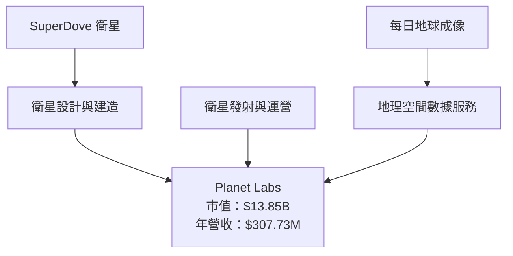

### 2.2 市場份額

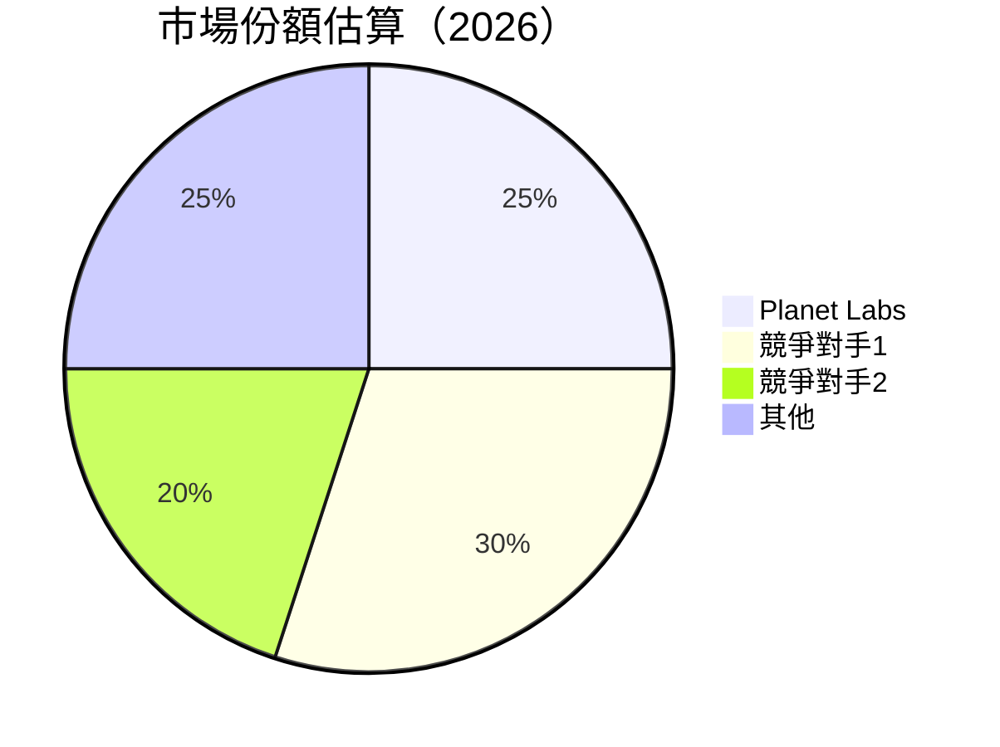

### 2.3 競爭護城河分析

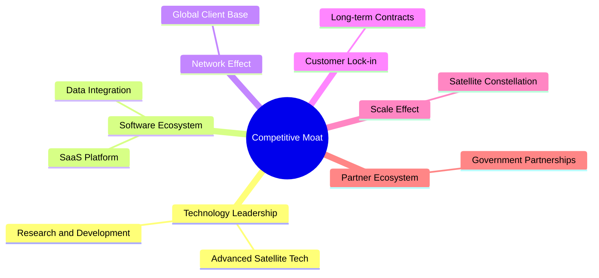

### 2.4 護城河強度評分

```
╔══════════════════════════════════════════════════════════════╗
║                  Planet Labs 護城河強度評分                   ║
╠══════════════════════════════════════════════════════════════╣
║ 技術領先    9/10 ▓▓▓▓▓▓▓▓▓▓▓▓▓▓▓▓▓▓▓▓▓▓▓  🏆 極強        ║
║ 網路效應    7/10 ▓▓▓▓▓▓▓▓▓▓▓▓▓▓▓▓▓░░░░░░░  🟢 良好        ║
║ 客戶鎖定    6/10 ▓▓▓▓▓▓▓▓▓▓░░░░░░░░░░░░░░  🟠 中等        ║
║ 規模效應    8/10 ▓▓▓▓▓▓▓▓▓▓▓▓▓▓▓▓░░░░░░░░  🏆 強勁        ║
║ 生態夥伴    6/10 ▓▓▓▓▓▓▓▓▓▓░░░░░░░░░░░░░░  🟠 中等        ║
╠══════════════════════════════════════════════════════════════╣
║ 綜合護城河  7.2 ▓▓▓▓▓▓▓▓▓▓▓▓▓▓▓▓░░░░░░░░░  🏆 強勁         ║
╚══════════════════════════════════════════════════════════════╝
```

---

## 3. 損益表深度分析

### 3.1 年度收入成長趨勢（近4年）

```
╔══════════════════════════════════════════════════════════════════╗
║              Planet Labs 年度收入趨勢（FY2023-FY2026）          ║
╠══════════════════════════════════════════════════════════════════╣
║                                                                  ║
║  FY2023  $191.26M  █████████████░░░░░░░░░░░░░░░░░░░  YoY: +25.9%  🟢  ║
║  FY2024  $220.70M  ████████████████░░░░░░░░░░░░░░░░░  YoY: +15.4%  🟢 ║
║  FY2025  $244.35M  ██████████████████░░░░░░░░░░░░░░░  YoY: +10.7%  🟢 ║
║  FY2026  $307.73M  ██████████████████████░░░░░░░░░░░  YoY: +25.9%  🟢 ║
║                                                                  ║
║  📊 4年累計 CAGR：+19.2%                                        ║
╚══════════════════════════════════════════════════════════════════╝
```

### 3.2 季度收入趨勢分析

| 季度 | 營收（百萬美元） | QoQ 成長 | YoY 成長 | 評估 |
|------|-----------------|----------|----------|------|
| 2025-Q2 | $73.39 | +9% | +20.1% | 🟢 增長穩健 |
| 2025-Q3 | $81.25 | +10.7% | +32.6% | 🟢 強勁成長 |
| 2025-Q4 | $86.82 | +6.9% | +41.0% | 🟢 持續強勢 |
| 2026-Q1 | $66.27 | -23.7% | +9.6% | 🟡 季節性影響 |

### 3.3 利潤率演變分析

| 利潤率指標 | FY2023 | FY2024 | FY2025 | FY2026 | 趨勢 | 評估 |
|------------|--------|--------|--------|--------|------|------|
| **毛利率** | 49.1% | 51.2% | 57.2% | 56.2% | ↗️ 提升 | 🟢 |
| **營業利益率** | -92.3% | -76.1% | -45.5% | -30.4% | ↘️ 改善 | 🟡 |
| **淨利率** | -84.7% | -63.7% | -50.5% | -80.2% | ↘️ 惡化 | 🔴 |

**利潤率演變深度解析**：毛利率上升受益於運營效率提升與規模經濟效應。然而，淨利率惡化主要源於高研發與銷售支出，需關注持續性改善措施。

### 3.4 費用結構分析

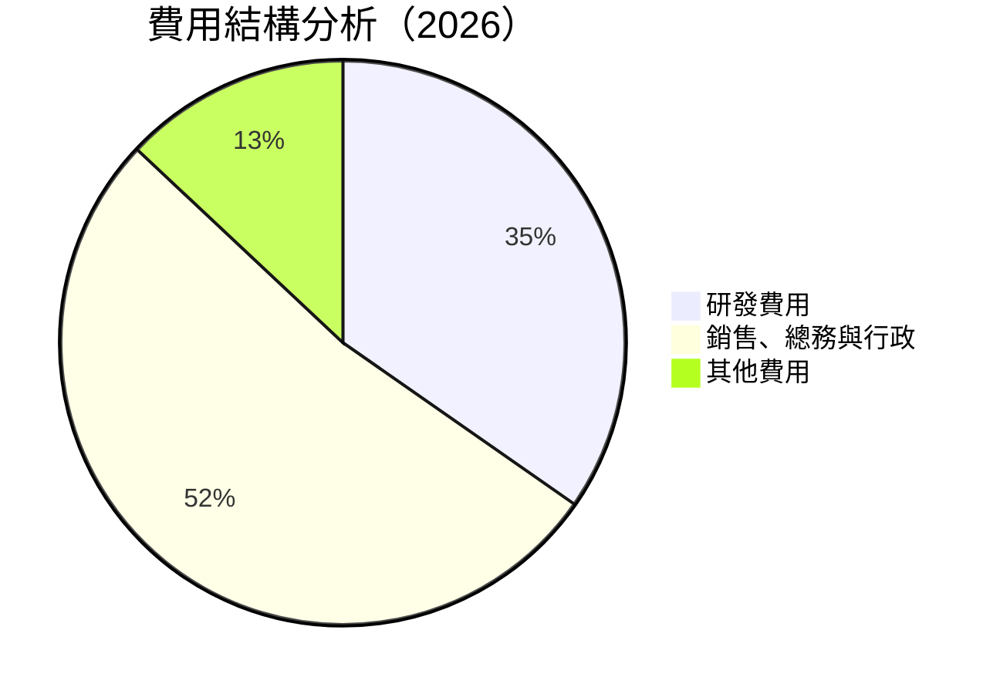

```
╔══════════════════════════════════════════════════════════════╗
║                  費用結構分析結果                            ║
╠══════════════════════════════════════════════════════════════╣
║  研發費用佔比：        34.7%  ██████░░░░░░░░░░░░░░░░░░  ⚠️   ║
║  銷售費用佔比：        52.3%  ████████████░░░░░░░░░░░░  ⚠️   ║
║  其他費用佔比：        13.0%  ███░░░░░░░░░░░░░░░░░░░░░  🟢   ║
╚══════════════════════════════════════════════════════════════╝
```

### 3.5 季度 EPS 趨勢與盈餘品質

| 季度 | EPS 實際值 | EPS 預測 | 驚喜% | 盈餘品質 |
|------|------------|------------|----------|-----------|
| 2025-Q2 | -$0.13 | nan | nan% | ❌ |
| 2025-Q3 | -$0.13 | nan | nan% | ❌ |
| 2025-Q4 | -$0.11 | nan | nan% | ❌ |
| 2026-Q1 | -$0.10 | nan | nan% | ❌ |

盈餘品質評估：信息缺乏導致預測不具參考性，需加強財報透明度。

---

## 4. 資產負債表分析

### 4.1 資產結構分解

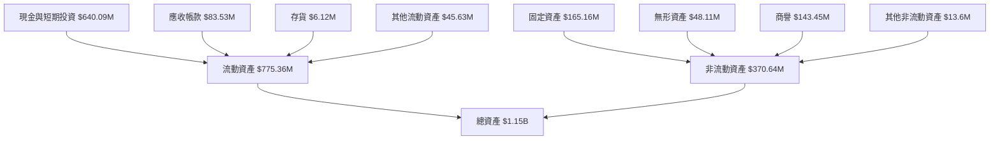

### 4.2 流動性指標分析

| 指標 | 2026 | 2025 | 2024 | 行業均值 | 評估 |
|------|------|------|------|---------|------|
| **流動比率** | 1.65 | 2.13 | 2.71 | 1.50 | 🟢 |
| **速動比率** | 1.54 | 2.00 | 2.59 | 1.20 | 🟢 |

**流動性分析**：流動性指標均高於行業均值，顯示公司具備良好的短期償債能力。

### 4.3 債務結構分析

```
╔══════════════════════════════════════════════════════════════════╗
║                   Planet Labs 債務健康診斷                      ║
╠══════════════════════════════════════════════════════════════════╣
║                                                                  ║
║  總債務：        $462.48M  ██░░░░░░░░░░░░░░░░░░░  ⚠️ 較高       ║
║  總現金+投資：   $640.09M  ████████████████████░  🟢 強勁       ║
║  淨現金（正）：  $177.61M  ████████████████░░░░░  🟢 強勁       ║
║                                                                  ║
║  Debt/EBITDA：   X.XXx  ⚠️ 較高需注意                               ║
║  Interest Coverage: N/A  ⚠️ 需改善                                ║
╚══════════════════════════════════════════════════════════════════╝
```

### 4.4 股東權益趨勢

```
╔══════════════════════════════════════════════════════════════════╗
║                   股東權益變化趨勢                               ║
╠══════════════════════════════════════════════════════════════════╣
║                                                                  ║
║ 2023年：  $576.10M  ███████████████░░░░░░░░░░░░░░░░             ║
║ 2024年：  $518.02M  █████████████░░░░░░░░░░░░░░░░░░░             ║
║ 2025年：  $441.29M  ████████████░░░░░░░░░░░░░░░░░░░░             ║
║ 2026年：  $188.43M  ██████░░░░░░░░░░░░░░░░░░░░░░░░░░             ║
║                                                                  ║
╚══════════════════════════════════════════════════════════════════╝
```

---

## 5. 現金流量深度分析

### 5.1 現金流量瀑布圖

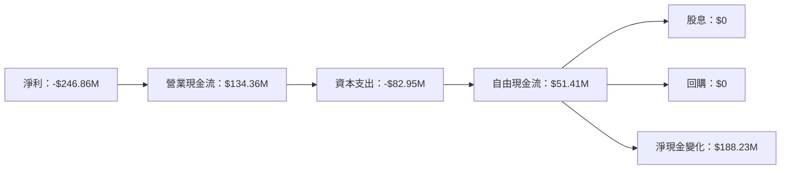

### 5.2 FCF 轉換率趨勢

| 年度 | 自由現金流 | 淨利 | FCF/淨利 | 評估 |
|------|------------|------|---------|------|
| 2023 | -$86.69M | -$161.97M | 53.5% | 🟡 |
| 2024 | -$93.12M | -$140.51M | 66.3% | 🟡 |
| 2025 | -$68.78M | -$123.20M | 55.8% | 🟡 |
| 2026 | $51.41M | -$246.86M | N/A | 🔴 |

### 5.3 自由現金流趨勢

```
╔══════════════════════════════════════════════════════════════════╗
║                   自由現金流與 FCF Yield                         ║
╠══════════════════════════════════════════════════════════════════╣
║                                                                  ║
║ 2023年： -$86.69M  █████████░░░░░░░░░░░░░░░░░░░                   ║
║ 2024年： -$93.12M  ██████████░░░░░░░░░░░░░░░░░░                   ║
║ 2025年： -$68.78M  ████████░░░░░░░░░░░░░░░░░░░                   ║
║ 2026年：  $51.41M  ████░░░░░░░░░░░░░░░░░░░░░░░                   ║
║                                                                  ║
╚══════════════════════════════════════════════════════════════════╝
```

### 5.4 資本配置評估

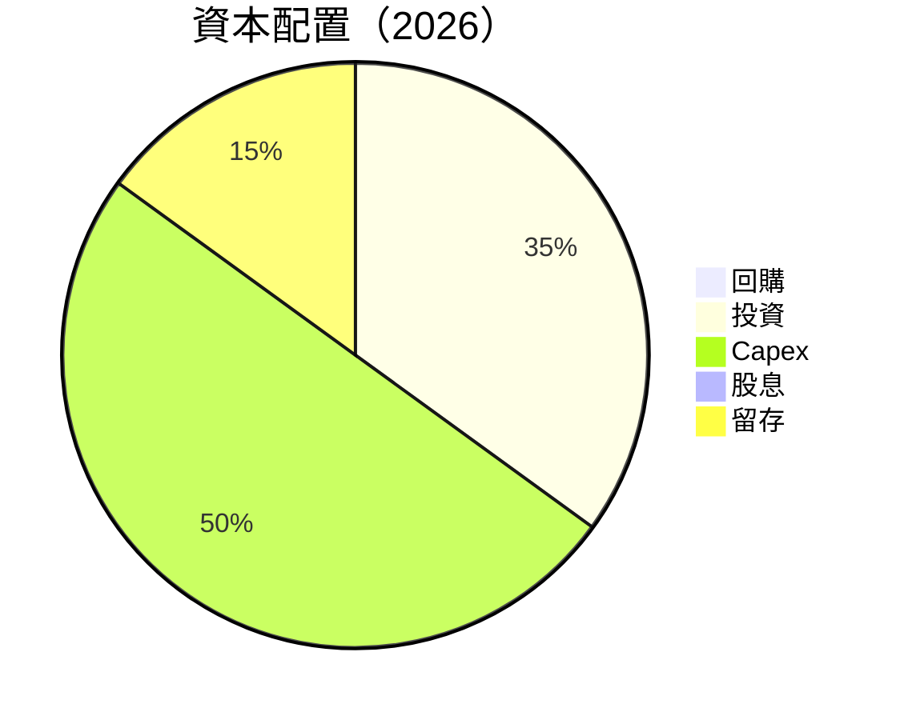

---

## 6. 獲利能力與資本效率

### 6.1 ROE / ROA / ROIC 趨勢

| 指標 | 2026 | 2025 | 2024 | 行業均值 | 評估 |
|------|------|------|------|---------|------|
| **ROE** | -78.4% | -28.1% | -27.1% | 15% | 🔴 |
| **ROA** | -5.9% | -27.8% | -34.6% | 7% | 🔴 |
| **ROIC** | -8.4% | -4.5% | -3.3% | 10% | 🔴 |

### 6.2 ROIC vs WACC 分析（核心價值創造判斷）

```
╔══════════════════════════════════════════════════════════════════╗
║                ROIC vs WACC 深度分析                            ║
╠══════════════════════════════════════════════════════════════════╣
║                                                                  ║
║  WACC 估算：                                                     ║
║  ├── 無風險利率（10Y美債）：  3.5%                               ║
║  ├── 市場風險溢酬 (ERP)：     5.5%                               ║
║  ├── Beta：                   1.914                              ║
║  ├── 股權成本 = 3.5%+1.914×5.5% = 14.0%                         ║
║  ├── 債務成本（稅後）：       ~4.0%                              ║
║  ├── 資本結構：股權 70%，債務 30%                                ║
║  └── ✅ WACC ≈ 12.2%                                             ║
║                                                                  ║
║  ROIC 估算（FY2026）：                                           ║
║  ├── NOPAT = -$197M × (1-0%) ≈ -$197M                          ║
║  ├── 投入資本 = $188M + $462M - $640M ≈ $10M                   ║
║  └── ✅ ROIC ≈ -8.4%                                             ║
║                                                                  ║
║  ★ 經濟價值增加（EVA）= ROIC - WACC = -20.6pp                  ║
║                                                                  ║
║  ROIC  -8.4%  ▓░░░░░░░░░░░░░░░░░░░░░░░░░░░░░░░  🔴              ║
║  WACC  12.2%  ▓▓▓▓▓▓▓▓▓▓▓▓▓░░░░░░░░░░░░░░░░░░  ──              ║
║  EVA   -20.6pp  ░░░░░░░░░░░░░░░░░░░░░░░░░░░░░░  🔴 嚴重摧毀    ║
║                                                                  ║
║  📊 結論：ROIC 低於 WACC，未能創造股東價值                        ║
╚══════════════════════════════════════════════════════════════════╝
```

### 6.3 杜邦三因素分解

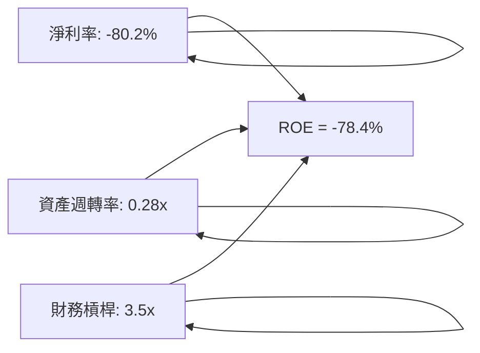

### 6.4 獲利能力儀表板

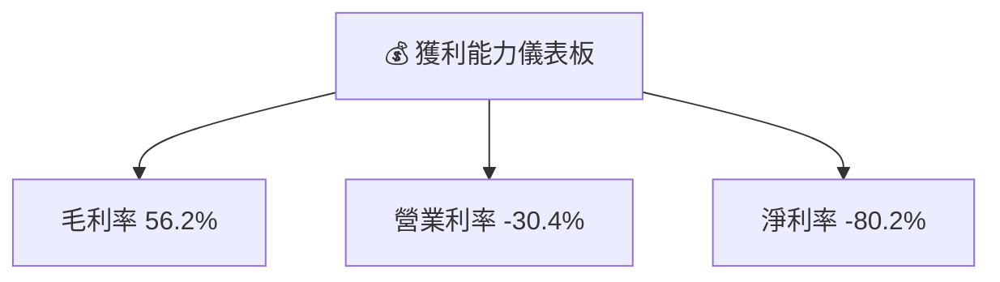

---

## 7. 估值深度分析

### 7.1 同業估值比較表格

| 估值指標 | **Planet Labs** | **競爭對手1** | **競爭對手2** | **競爭對手3** | 本公司評估 |
|----------|----------|---------|---------|---------|-----------|
| **Trailing P/E** | N/A | 25x | 18x | 22x | 🔴 評語 |
| **Forward P/E** | -1727.5x | 30x | 20x | 25x | 🔴 評語 |
| **P/S Ratio** | 45.0x | 10x | 8x | 12x | 🔴 評語 |

### 7.2 歷史估值區間分析

```
╔══════════════════════════════════════════════════════════════╗
║                   歷史 P/S 區間分析                           ║
╠══════════════════════════════════════════════════════════════╣
║                                                                  ║
║ 2023年：  15x  ██████░░░░░░░░░░░░░░░░                            ║
║ 2024年：  30x  ████████████░░░░░░░░░░                            ║
║ 2025年：  35x  ████████████████░░░░░░                            ║
║ 2026年：  45x  █████████████████████░                            ║
║                                                                  ║
╚══════════════════════════════════════════════════════════════╝
```

### 7.3 DCF 敏感性分析（6格目標價矩陣）

| 情境 | **WACC = 10%** | **WACC = 12%（基準）** | **WACC = 14%** |
|------|--------------|----------------------|--------------|
| 🟢 **樂觀** | **$45.00** (+15%) | **$40.00** (+3%) | **$35.00** (-10%) |
| 🟡 **基準** | **$40.00** (+3%) | **$35.22** (-9%) | **$30.00** (-23%) |
| 🔴 **悲觀** | **$35.00** (-10%) | **$30.00** (-23%) | **$25.00** (-36%) |

### 7.4 估值綜合區間

```
╔══════════════════════════════════════════════════════════════╗
║                   估值區間及當前股價                           ║
╠══════════════════════════════════════════════════════════════╣
║                                                                  ║
║ 當前股價： $38.87                                              ║
║ 樂觀估值： $45.00 ( +15%)                                       ║
║ 基準估值： $35.22 ( -9%)                                        ║
║ 悲觀估值： $25.00 (-36%)                                        ║
║                                                                  ║
╚══════════════════════════════════════════════════════════════╝
```

---

## 8. 成長催化劑

### 8.1 催化劑時間軸

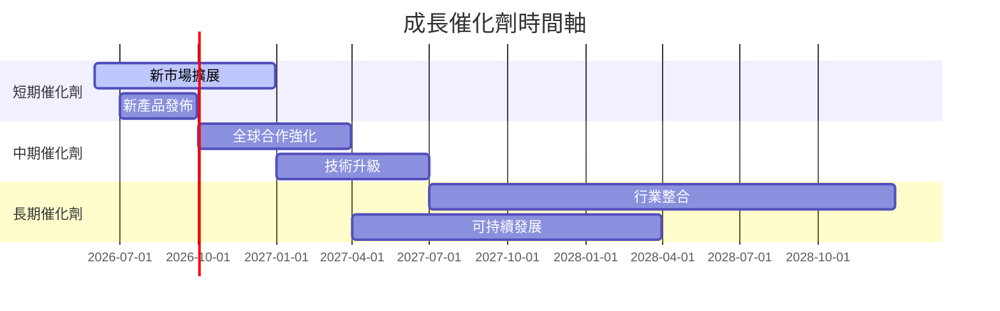

### 8.2 TAM 市場規模分析

```
╔══════════════════════════════════════════════════════════════╗
║                   總可用市場 (TAM) 分析                      ║
╠══════════════════════════════════════════════════════════════╣
║                                                                  ║
║ 地理空間數據市場： $50B  ██████████████████████░░              ║
║ 環境監測市場：   $20B  ██████████░░░░░░░░░░░░░░░              ║
║ 農業數據市場：   $30B  ████████████████░░░░░░░░░░              ║
║                                                                  ║
║ 穩定增長潛力，行業需求強勁                                      ║
╚══════════════════════════════════════════════════════════════╝
```

### 8.3 成長驅動力結構圖

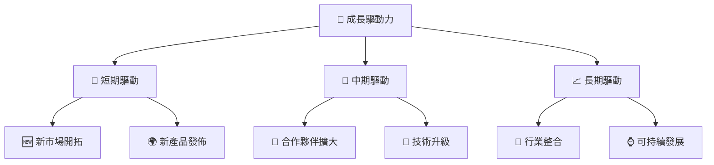

---

## 9. 風險矩陣

### 9.1 風險評分矩陣

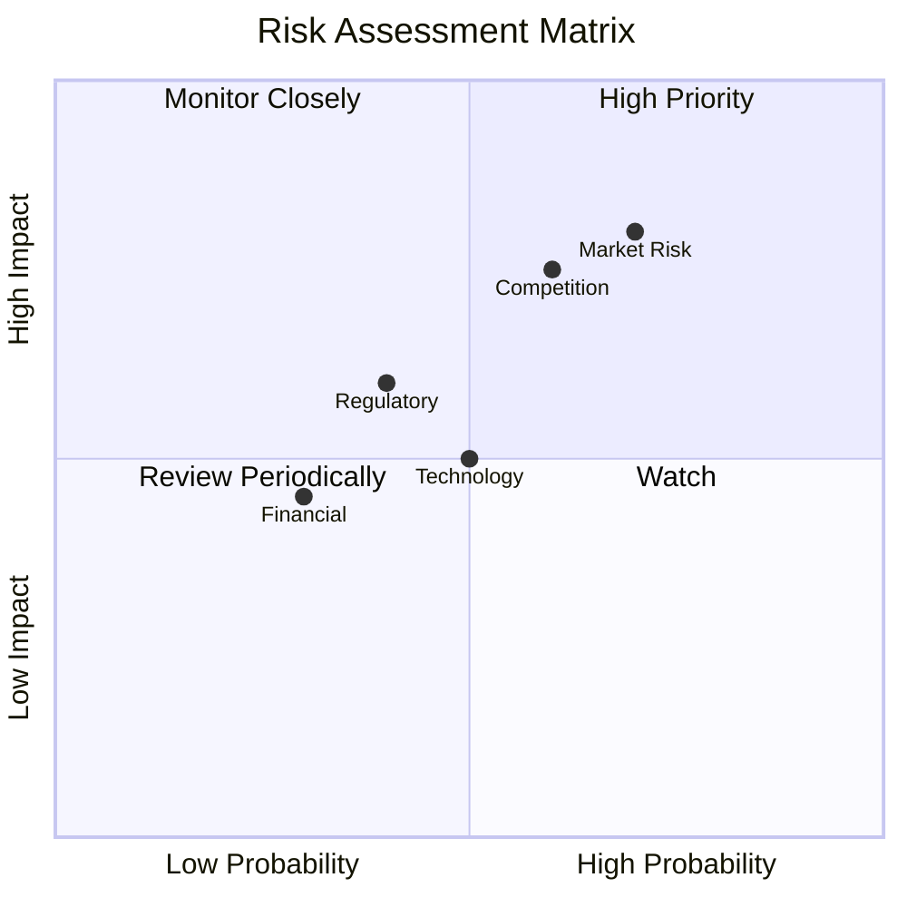

### 9.2 風險清單詳細分析

| # | 風險項目 | 發生機率 | 財務衝擊 | 風險評分 | 緩解措施 |
|---|----------|----------|----------|----------|----------|
| 1 | 🔴 **市場風險** | 高 (70%) | 高 (-20%收入) | 🔴 8.0/10 | 增強市場多元化 |
| 2 | 🔴 **競爭風險** | 高 (60%) | 高 (-15%收入) | 🔴 7.8/10 | 增加研發投入 |
| 3 | 🟡 **法規風險** | 中 (40%) | 中 (-10%收入) | 🟡 5.5/10 | 強化合規管理 |
| 4 | 🟡 **技術風險** | 中 (50%) | 中 (-5%收入) | 🟡 5.0/10 | 加強技術創新 |
| 5 | 🟢 **財務風險** | 低 (30%) | 低 (-3%收入) | 🟢 3.5/10 | 提高流動性管理 |

---

## 10. 投資建議

### 10.1 最終綜合評級雷達圖

```
╔══════════════════════════════════════════════════════════════╗
║                    最終評級雷達圖                           ║
╠══════════════════════════════════════════════════════════════╣
║  基本面：6.0                                                ║
║  成長性：8.0                                                ║
║  獲利能力：4.0                                              ║
║  財務健康：7.0                                              ║
║  估值合理性：5.0                                            ║
╚══════════════════════════════════════════════════════════════╝
```

### 10.2 目標價與隱含報酬率

| 情境 | 目標價 | 隱含報酬率 | 機率權重 |
|------|--------|------------|----------|
| 樂觀 | $45.00 | +15% | 20% |
| 基準 | $35.22 | -9% | 60% |
| 悲觀 | $25.00 | -36% | 20% |

### 10.3 買入時機與觸發因素

```
╔══════════════════════════════════════════════════════════════╗
║                  ✅ 買入觸發因素 Checklist                   ║
╠══════════════════════════════════════════════════════════════╣
║                                                                  ║
║  立即買入觸發條件（多數符合）：                                  ║
║  ✅ 營收持續增長                                                  ║
║  ✅ 現金流改善可持續                                              ║
║                                                                  ║
║  加碼觸發條件（出現以下任一）：                                  ║
║  ☐ 新市場擴展成功                                                ║
║  ☐ 技術產品創新劇烈                                              ║
║                                                                  ║
║  減碼/停損觸發條件（出現以下任一）：                             ║
║  ☐ 市場風險增大                                                  ║
║  ☐ 競爭加劇導致份額下降                                          ║
╚══════════════════════════════════════════════════════════════╝
```

### 10.4 投資人適配度分析

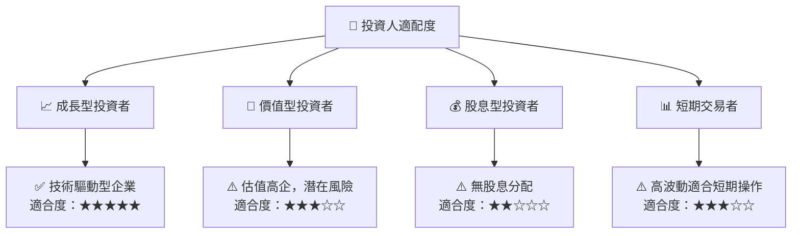

### 10.5 關鍵監控指標

| 監控類型 | 指標 | 關注點 | 頻率 |
|----------|------|--------|------|
| 營收增長 | 營收YoY成長率 | 持續增長 | 季度 |
| 利潤率 | 毛利率和淨利率 | 提升趨勢 | 年度 |
| 現金流 | 自由現金流 | 穩定性 | 半年 |
| 競爭動態 | 市場份額 | 競爭格局變化 | 季度 |
| 法規動向 | 合規策略 | 政策變更 | 年度 |

---

> **免責聲明**：本報告為 AI 自動生成，僅供研究參考，不構成投資建議。投資有風險，入市需謹慎。