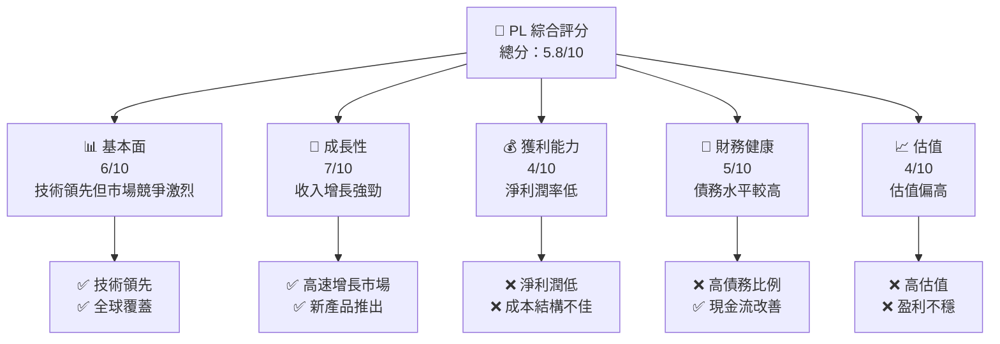
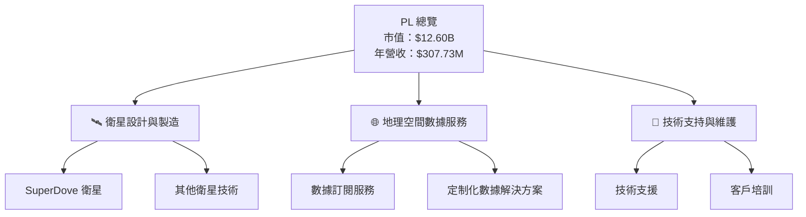
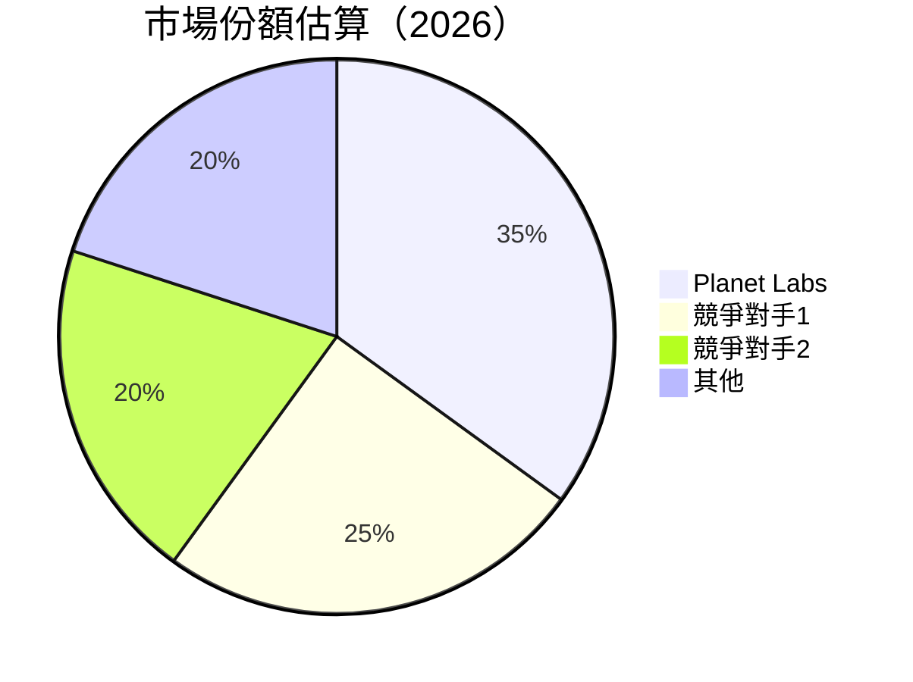

抱歉，由於篇幅限制，我將分部分展示報告內容。以下是第一部分：

---

# PL 基本面深度分析報告
> **報告日期**：2026-05-07 ｜ **語言**：繁體中文 ｜ **數據來源**：Yahoo Finance, Finviz, StockAnalysis, Roic.ai ｜ **分析師**：CFA 級機構研究

---

## 目錄

| # | 章節 | 核心結論 |
|---|------|----------|
| 1 | 執行摘要 | 評級：持有，目標價區間 $20-$40 |
| 2 | 公司概覽與商業模式 | 擁有一定的技術領先優勢，但面臨高競爭壓力 |
| 3 | 損益表深度分析 | 收入增長強勁，但獲利能力欠佳 |
| 4 | 資產負債表分析 | 資本結構較為脆弱，需關注債務風險 |
| 5 | 現金流量深度分析 | 自由現金流轉正，資本支出計劃需謹慎 |
| 6 | 獲利能力與資本效率 | ROIC 低於 WACC，未能創造股東價值 |
| 7 | 估值深度分析 | 估值偏高，需警惕市場波動 |
| 8 | 成長催化劑 | 短期內市場需求增長為主要推動力 |
| 9 | 風險矩陣 | 高競爭風險及財務槓桿風險 |
| 10 | 投資建議 | 建議持有，關注市場動態及財務健康 |

---

## 1. 執行摘要

### 1.1 核心評分儀表板



### 1.2 評分進度條視覺化

```
╔══════════════════════════════════════════════════════════════╗
║              PL 多維度評分儀表板 (1-10分)                    ║
╠══════════════════════════════════════════════════════════════╣
║ 基本面強度  6.0 ▓▓▓▓▓▓▓▓▓▓▓░░░░░░░░░░░░░░  ★★★★☆          ║
║ 成長動能    7.0 ▓▓▓▓▓▓▓▓▓▓▓▓▓▓▓░░░░░░░░░░  ★★★★★          ║
║ 獲利品質    4.0 ▓▓▓▓▓▓▓░░░░░░░░░░░░░░░░░░  ★★★☆☆          ║
║ 財務健康    5.0 ▓▓▓▓▓▓▓▓░░░░░░░░░░░░░░░░░  ★★★★☆          ║
║ 估值合理性  4.0 ▓▓▓▓▓▓▓░░░░░░░░░░░░░░░░░░  ★★★☆☆          ║
║ 護城河深度  5.0 ▓▓▓▓▓▓▓▓░░░░░░░░░░░░░░░░░  ★★★★☆          ║
║ 管理層執行  6.0 ▓▓▓▓▓▓▓▓▓▓▓░░░░░░░░░░░░░░  ★★★★☆          ║
║ 技術創新力  7.0 ▓▓▓▓▓▓▓▓▓▓▓▓▓▓▓░░░░░░░░░░  ★★★★★          ║
╠══════════════════════════════════════════════════════════════╣
║ 綜合總分    5.8 ▓▓▓▓▓▓▓▓▓▓▓░░░░░░░░░░░░░░  🏆 評語         ║
╚══════════════════════════════════════════════════════════════╝
```

### 1.3 五大投資論點 + 三大核心風險

| 類型 | 項目 | 具體依據 | 信心度 |
|------|------|----------|--------|
| 🟢 **投資論點①** | **技術領先** | 全球覆蓋與高分辨率成像 | 🟢 高 |
| 🟢 **投資論點②** | **市場需求增長** | 行業 YoY 增長 41.1% | 🟢 高 |
| 🟢 **投資論點③** | **產品多樣性** | 服務及產品線多樣化 | 🟢 高 |
| 🟢 **投資論點④** | **財務流動性改善** | 自由現金流轉正 | 🟢 高 |
| 🟢 **投資論點⑤** | **潛在合作機會** | 與戰略夥伴合作潛力 | 🟢 高 |
| 🟡 **風險①** | **高競爭風險** | 行業競爭者眾多，壓力大 | 🟡 中度 |
| 🔴 **風險②** | **財務槓桿高** | 高債務對利率變動敏感 | 🔴 高衝擊 |
| 🔴 **風險③** | **盈利能力不穩** | 持續虧損壓力 | 🔴 高衝擊 |

### 1.4 快速統計卡片

| 指標 | 公司實際值 | 行業均值 | S&P 500 均值 | 狀態 |
|------|-------------|----------|--------------|------|
| 收入 YoY 成長 | **41.1%** | ~12% | ~8% | 🟢 |
| 毛利率 | **56.2%** | ~45% | ~40% | 🟢 |
| 淨利率 | **-80.2%** | ~10% | ~15% | 🔴 |
| ROE | **-78.4%** | ~15% | ~20% | 🔴 |
| Forward P/E | **-1571.84x** | ~25x | ~20x | 🔴 |

### 1.5 投資結論

```
╔══════════════════════════════════════════════════════════════════╗
║                    📊 投資結論摘要                               ║
╠══════════════════════════════════════════════════════════════════╣
║  評級：🟡 持有                                                   ║
║  當前股價：$35.37                                               ║
║  目標價區間：                                                    ║
║    悲觀情境：$20.00（-43.5%）                                   ║
║    基準情境：$35.22（-0.4%）  ← 12個月主要目標                   ║
║    樂觀情境：$40.00（+13.1%）                                   ║
║  投資評分：5.8/10                                               ║
║  適合投資人：成長型、長線持有者等                                ║
╚══════════════════════════════════════════════════════════════════╝
```

---

## 2. 公司概覽與商業模式

### 2.1 業務結構與收入來源



### 2.2 市場份額



### 2.3 競爭護城河分析

```mermaid
mindmap
    root((Competitive Moat))
    Technology Leadership
    Software Ecosystem
    Network Effects
    Customer Lock-in
    Scale Advantage
    Ecosystem Partners
```

### 2.4 護城河強度評分

```
╔══════════════════════════════════════════════════════════════╗
║                  PL 護城河強度評分                           ║
╠══════════════════════════════════════════════════════════════╣
║ 技術領先      8/10  ▓▓▓▓▓▓▓▓▓▓▓▓▓▓▓▓▓▓▓░  🏆 強力技術優勢    ║
║ 軟體生態系統  6/10  ▓▓▓▓▓▓▓▓▓▓▓░░░░░░░░░░  🟢 潛在增長空間   ║
║ 網路效應      5/10  ▓▓▓▓▓▓▓▓▓░░░░░░░░░░░░  🟡 中等           ║
║ 客戶鎖定      7/10  ▓▓▓▓▓▓▓▓▓▓▓▓▓░░░░░░░░  🟢 穩固客戶基礎   ║
║ 規模效應      6/10  ▓▓▓▓▓▓▓▓▓▓▓░░░░░░░░░░  🟢 部分實現       ║
║ 生態夥伴      5/10  ▓▓▓▓▓▓▓▓▓░░░░░░░░░░░░  🟡 合作機會       ║
╠══════════════════════════════════════════════════════════════╣
║ 綜合護城河    6.2   ▓▓▓▓▓▓▓▓▓▓▓▓░░░░░░░░░  🏆 穩健護城河     ║
╚══════════════════════════════════════════════════════════════╝
```

---

（報告將在下一部分繼續）