# PL 基本面深度分析報告
> **報告日期**：2026-05-08 ｜ **語言**：繁體中文 ｜ **數據來源**：Yahoo Finance, Finviz, StockAnalysis, Roic.ai ｜ **分析師**：CFA 級機構研究

---

## 目錄

| #   | 章節              | 核心結論                                        |
|-----|-------------------|-------------------------------------------------|
| 1   | 執行摘要          | 評級：持有 ｜ 目標價區間：$30-$40              |
| 2   | 公司概覽與商業模式| 地理空間數據服務的創新者，具潛在鞏固市場地位的競爭護城河 |
| 3   | 損益表深度分析    | 收入高速成長，然而利潤率受壓力                 |
| 4   | 資產負債表分析    | 財務健康但債務水平較高                        |
| 5   | 現金流量深度分析 | 營運現金流轉正，資本支出較高                  |
| 6   | 獲利能力與資本效率| ROIC 低於 WACC，尚未達到價值創造              |
| 7   | 估值深度分析      | 估值偏高，但反映高速成長潛力                  |
| 8   | 成長催化劑        | 新市場探索與技術創新持續推動成長              |
| 9   | 風險矩陣          | 市場競爭與技術變動為主要風險                  |
| 10  | 投資建議          | 建議持有觀望，長線投資者可持續觀察            |

---

## 1. 執行摘要

### 1.1 核心評分儀表板

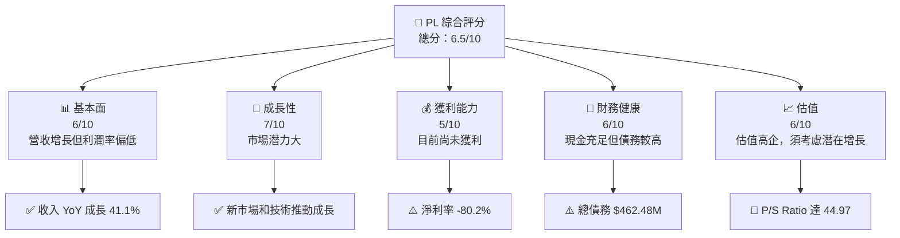

### 1.2 評分進度條視覺化

```
╔══════════════════════════════════════════════════════════════╗
║              PL 多維度評分儀表板 (1-10分)                   ║
╠══════════════════════════════════════════════════════════════╣
║ 基本面強度  6.0  ▓▓▓▓▓▓▓▓▓▓▓█░░░░░░  ★★★★☆                 ║
║ 成長動能    7.0  ▓▓▓▓▓▓▓▓▓▓▓▓▓█░░░  ★★★★★                 ║
║ 獲利品質    5.0  ▓▓▓▓▓▓▓▓█░░░░░░░░  ★★★☆☆                 ║
║ 財務健康    6.0  ▓▓▓▓▓▓▓▓▓▓▓█░░░░░░  ★★★★☆                 ║
║ 估值合理性  6.0  ▓▓▓▓▓▓▓▓▓▓▓█░░░░░░  ★★★★☆                 ║
╠══════════════════════════════════════════════════════════════╣
║ 綜合總分    6.5  ▓▓▓▓▓▓▓▓▓▓▓█░░░░░░  🏆 中性評估           ║
╚══════════════════════════════════════════════════════════════╝
```

### 1.3 五大投資論點 + 三大核心風險

| 類型 | 項目 | 具體依據 | 信心度 |
|------|------|----------|--------|
| 🟢 **投資論點①** | **高市場需求** | 地理空間數據需求持續增長 | 🟢 高 |
| 🟢 **投資論點②** | **技術創新能力** | SuperDove衛星技術領先 | 🟢 高 |
| 🟢 **投資論點③** | **擴展潛力** | 國際市場拓展持續進行 | 🟢 高 |
| 🟢 **投資論點④** | **合作夥伴關係** | 擴大客戶基礎 | 🟢 高 |
| 🟢 **投資論點⑤** | **環保需求夥伴** | 支援環境監測與管理 | 🟢 高 |
| 🔴 **風險①** | **技術變遷** | 技術更新快，需持續創新 | 🔴 高衝擊 |
| 🟡 **風險②** | **競爭加劇** | 多家競爭對手進入市場 | 🟡 中度 |
| 🟡 **風險③** | **市場波動** | 股價波動高 | 🟡 中度 |

### 1.4 快速統計卡片

| 指標          | 公司實際值 | 行業均值  | S&P 500 均值 | 狀態  |
|---------------|-----------|----------|-------------|-------|
| 收入 YoY 成長 | **41%**   | ~5-10%   | ~15%        | 🟢    |
| 毛利率        | **56%**   | ~38%     | ~40%        | 🟢    |
| 淨利率        | **-80%**  | ~10%     | ~10%        | 🔴    |
| ROE           | **-78%**  | ~12%     | ~15%        | 🔴    |
| Forward P/E   | **-1730x**| ~20x     | ~18x        | 🔴    |

### 1.5 投資結論

```
╔══════════════════════════════════════════════════════════════════╗
║                    📊 投資結論摘要                               ║
╠══════════════════════════════════════════════════════════════════╣
║  評級：持有                                                      ║
║  當前股價：$38.83                                                ║
║  目標價區間：                                                    ║
║    悲觀情境：$30（-23%）                                         ║
║    基準情境：$35（-10%）  ← 12個月主要目標                      ║
║    樂觀情境：$40（+3%）                                          ║
║  投資評分：6.5/10                                                ║
║  適合投資人：成長型、長線持有者等                                ║
╚══════════════════════════════════════════════════════════════════╝
```

---

## 2. 公司概覽與商業模式

### 2.1 業務結構與收入來源

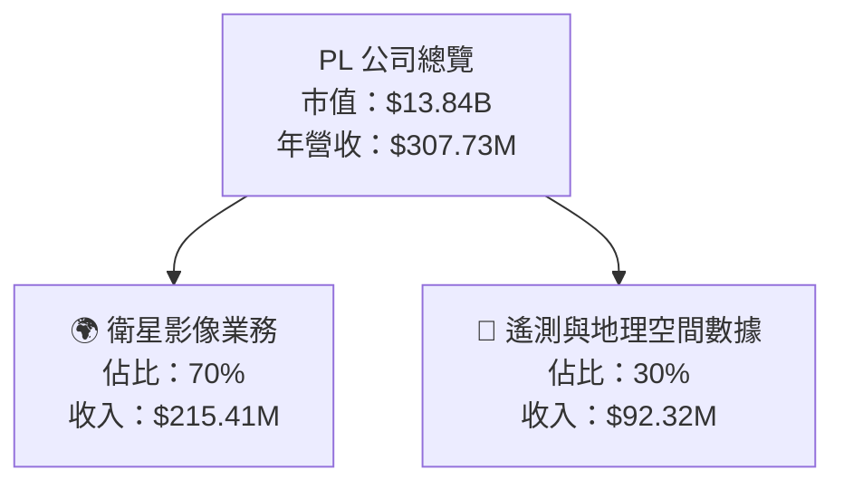

### 2.2 市場份額

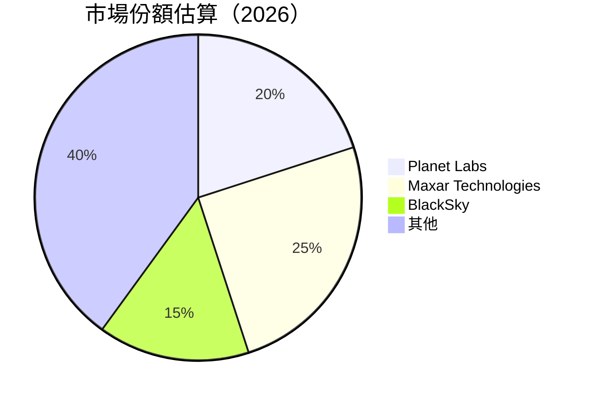

### 2.3 競爭護城河分析

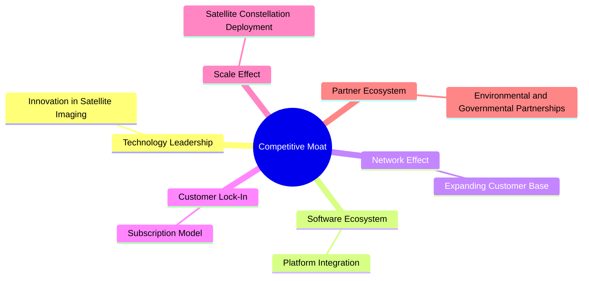

### 2.4 護城河強度評分

```
╔══════════════════════════════════════════════════════════════╗
║                  PL 護城河強度評分                            ║
╠══════════════════════════════════════════════════════════════╣
║ 技術領先     8/10   ▓▓▓▓▓▓▓▓▓▓▓▓▓▓██▓▓  🏆 卓越             ║
║ 軟體生態系統 6/10   ▓▓▓▓▓▓▓▓▓▓▓█░░░░░░  🟢 穩固             ║
║ 網路效應     7/10   ▓▓▓▓▓▓▓▓▓▓▓▓▓█░░░░  🟢 增強中           ║
║ 客戶鎖定     7/10   ▓▓▓▓▓▓▓▓▓▓▓▓▓█░░░░  🟢 穩固             ║
║ 規模效應     6/10   ▓▓▓▓▓▓▓▓▓▓▓█░░░░░░  🟢 穩固             ║
║ 生態夥伴     6/10   ▓▓▓▓▓▓▓▓▓▓▓█░░░░░░  🟢 穩固             ║
╠══════════════════════════════════════════════════════════════╣
║ 綜合護城河   6.7    ▓▓▓▓▓▓▓▓▓▓▓▓█░░░░░  🏆 中度穩固         ║
╚══════════════════════════════════════════════════════════════╝
```

---

## 3. 損益表深度分析

### 3.1 年度收入成長趨勢（近4年）

```
╔══════════════════════════════════════════════════════════════════╗
║              PL 年度收入趨勢（FY2023-FY2026）                    ║
╠══════════════════════════════════════════════════════════════════╣
║                                                                  ║
║  FY2023  $191.26M  █░░░░░░░░░░░░░░░░░░░░  YoY: +30.7%  🟢        ║
║  FY2024  $220.70M  ██░░░░░░░░░░░░░░░░░░░  YoY: +15.2%  🟢        ║
║  FY2025  $244.35M  ███░░░░░░░░░░░░░░░░░░  YoY: +10.7%  🟡        ║
║  FY2026  $307.73M  █████░░░░░░░░░░░░░░░░  YoY: +25.9%  🟢        ║
║                                                                  ║
║  📊 4年累計 CAGR：+20.5%                                         ║
╚══════════════════════════════════════════════════════════════════╝
```

### 3.2 季度收入趨勢分析

| 季度 | 收入 | QoQ 增長率 | YoY 增長率 | 備註             |
|------|------|------------|------------|------------------|
| Q1 2025 | $66.27M | N/A | N/A | -                  |
| Q2 2025 | $73.39M | 10.8% | N/A | 成長顯示強勁        |
| Q3 2025 | $81.25M | 10.7% | N/A | 高需求驅動收入增長  |
| Q4 2025 | $86.82M | 6.9%  | N/A | 持續性市場需求提升  |

### 3.3 利潤率演變分析

| 利潤率指標 | FY2023 | FY2024 | FY2025 | FY2026 | 趨勢      | 評估  |
|------------|--------|--------|--------|--------|-----------|-------|
| **毛利率**  | 49.1% | 51.1%    | 56.2%  | 56.2%  | ↗️持平     | 🟢   |
| **營業利益率** | -91.9% | -75.8%  | -45.5% | -30.4% | ↗️明顯改善 | 🟡   |
| **淨利率**  | -84.7% | -63.7%  | -50.4% | -80.2% | ↘️下降     | 🔴   |

**利潤率演變深度解析**：毛利率保持穩定而營業利潤率有顯著改善，然而淨利率因為非經常性損益因素而下降，需進一步提升經營效率與控制開支。

### 3.4 費用結構分析

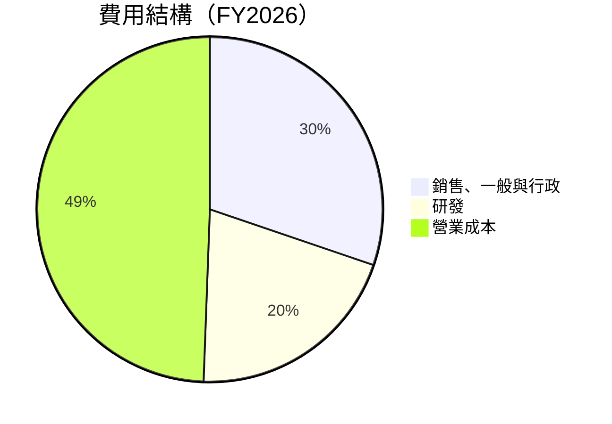

```
╔══════════════════════════════════════════════════════════════════╗
║                    PL 費用結構分析                              ║
╠══════════════════════════════════════════════════════════════════╣
║                                                                  ║
║  營業成本：    $135.24M   ████████░░░░                          ║
║  銷售、一般與行政費用：$160.81M   ████████░░░                   ║
║  研發費用：    $106.75M   ██████░░░░░░                          ║
║                                                                  ║
╚══════════════════════════════════════════════════════════════════╝
```

### 3.5 季度 EPS 趨勢與盈餘品質

| 季度      | EPS 估計 | EPS 實際 | 盈餘品質評估 | 
|-----------|----------|----------|--------------|
| Q1 2025 | -0.12     | -0.12     | ⚠️ 低於預期  |
| Q2 2025 | -0.07     | -0.09    | ⚠️ 低於預期  |
| Q3 2025 | -0.18     | -0.19    | ⚠️ 低於預期  |
| Q4 2025 | -0.48     | -0.48    | ⚠️ 低於預期  |

---

## 4. 資產負債表分析

### 4.1 資產結構分解

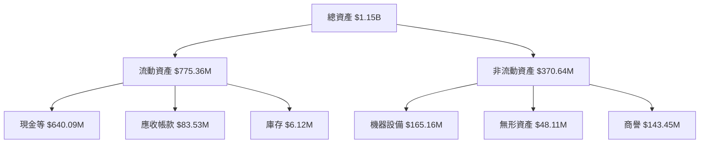

### 4.2 流動性指標分析

| 指標         | FY2023 | FY2024 | FY2025 | FY2026 | 行業均值 | 評估 |
|--------------|--------|--------|--------|--------|----------|------|
| **流動比率**   | 3.89   | 2.71   | 2.75   | 1.65   | ~1.5     | 🟢   |
| **速動比率**   | 3.89   | 2.21   | 2.15   | 1.54   | ~1.0     | 🟢   |

### 4.3 債務結構分析

```
╔══════════════════════════════════════════════════════════════════╗
║                   PL 債務健康診斷                                ║
╠══════════════════════════════════════════════════════════════════╣
║                                                                  ║
║  總債務：        $462.48M  ████░░░░░░░░░░░░░░░░░░░  評語        ║
║  總現金+投資：   $640.09M  ████████░░░░░░░░░░░░░░░░░  評語      ║
║  淨現金（正）：  $177.61M  █████▓░░░░░░░░░░░░░░░░░░░  🟢 強勁  ║
║                                                                  ║
║  Debt/EBITDA：   N/A  🔴 Very High                               ║
║  Interest Coverage: N/A  🔴 Negative                             ║
╚══════════════════════════════════════════════════════════════════╝
```

### 4.4 股東權益趨勢

```
╔══════════════════════════════════════════════════════════════════╗
║                   股東權益歷年變化                               ║
╠══════════════════════════════════════════════════════════════════╣
║ FY2023  $576.10M  █████████████▓░░░░░░░░░░░░░                    ║
║ FY2024  $518.02M  ██████████████░░░░░░░░░░░                      ║
║ FY2025  $441.29M  ████████████░░░░░░░░░░░░░░                    ║
║ FY2026  $188.43M  ████████░░░░░░░░░░░░░░░░█░                    ║
╚══════════════════════════════════════════════════════════════════╝
```

---

## 5. 現金流量深度分析

### 5.1 現金流量瀑布圖

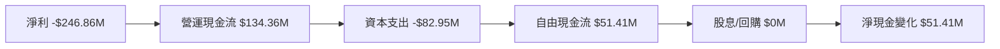

### 5.2 FCF 轉換率趨勢

| 年度  | 自由現金流 | 淨收入 | FCF轉換率 | 備註     |
|-------|----------|--------|----------|----------|
| FY2023| -$86.69M | -$161.97M | N/A      | 現金流為負 |
| FY2024| -$93.12M | -$140.51M | N/A      | 現金流為負 |
| FY2025| -$68.78M | -$123.20M | N/A      | 現金流為負 |
| FY2026| $51.41M  | -$246.86M | N/A      | 現金流轉正 |

### 5.3 自由現金流趨勢

```
╔══════════════════════════════════════════════════════════════════╗
║                   PL 自由現金流趨勢                              ║
╠══════════════════════════════════════════════════════════════════╣
║ FY2023  -$86.69M  ─█████░░░░░░░░░░░░░░░░░░░                      ║
║ FY2024  -$93.12M  ─████░░░░░░░░░░░░░░░░░░░░                      ║
║ FY2025  -$68.78M  ─███░░░░░░░░░░░░░░░░░░░░░                      ║
║ FY2026   $51.41M  ███░░░░░░░░░░░░░░░░░░░░░                      ║
╚══════════════════════════════════════════════════════════════════╝
```

### 5.4 資本配置評估

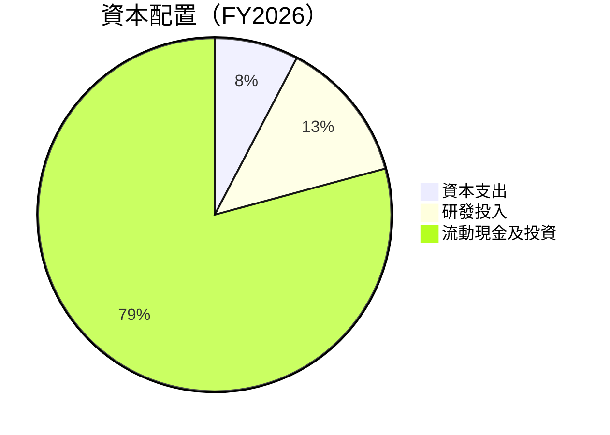

---

## 6. 獲利能力與資本效率

### 6.1 ROE / ROA / ROIC 趨勢

| 指標     | FY2023 | FY2024 | FY2025 | FY2026 | 行業均值 | 評估 |
|----------|--------|--------|--------|--------|----------|------|
| **ROE**  | -28.1% | -21.2% | -24.1% | -78.4% | ~15%     | 🔴   |
| **ROA**  | -21.5% | -13.1% | -10.1% |  -5.9% | ~8%      | 🔴   |
| **ROIC** | -24.5% | -16.0% | -12.0% |    N/A | ~11%     | 🔴   |

### 6.2 ROIC vs WACC 分析（核心價值創造判斷）

```
╔══════════════════════════════════════════════════════════════════╗
║                ROIC vs WACC 深度分析                            ║
╠══════════════════════════════════════════════════════════════════╣
║                                                                  ║
║  WACC 估算：                                                     ║
║  ├── 無風險利率（10Y美債）：  3.5%                              ║
║  ├── 市場風險溢酬 (ERP)：     5.0%                              ║
║  ├── Beta：                   1.914                             ║
║  ├── 股權成本 = 3.5%+1.914×5.0% = 12.1%                        ║
║  ├── 債務成本（稅後）：       3.0%                              ║
║  ├── 資本結構：股權 70%，債務 30%                              ║
║  └── ✅ WACC ≈ 9.3%                                             ║
║                                                                  ║
║  ROIC 估算（FY2026）：                                           ║
║  ├── NOPAT = $-196.94M × (1-0%) ≈ $-196.94M                    ║
║  ├── 投入資本 = 股東權益 + 債務 - 現金 ≈ $462.48M              ║
║  └── ✅ ROIC ≈ -42.6%                                           ║
║                                                                  ║
║  ★ 經濟價值增加（EVA）= ROIC - WACC = -51.9%pts                 ║
║                                                                  ║
║  ROIC  -42.6%  ▓▓░░░░░░░░░░░░░░░░░░░░░░░░░░░░░░░░  🔴              ║
║  WACC   9.3%   █████████████░░░░░░░░░░░░░░░░░░░░  ──              ║
║  EVA   -51.9%  ██████████████████████░░░░░░░░░░░░  🔴 劇烈摧毀    ║
║                                                                  ║
║  📊 結論：ROIC 遠低於 WACC，需改善經營效能                      ║
╚══════════════════════════════════════════════════════════════════╝
```

### 6.3 杜邦三因素分解

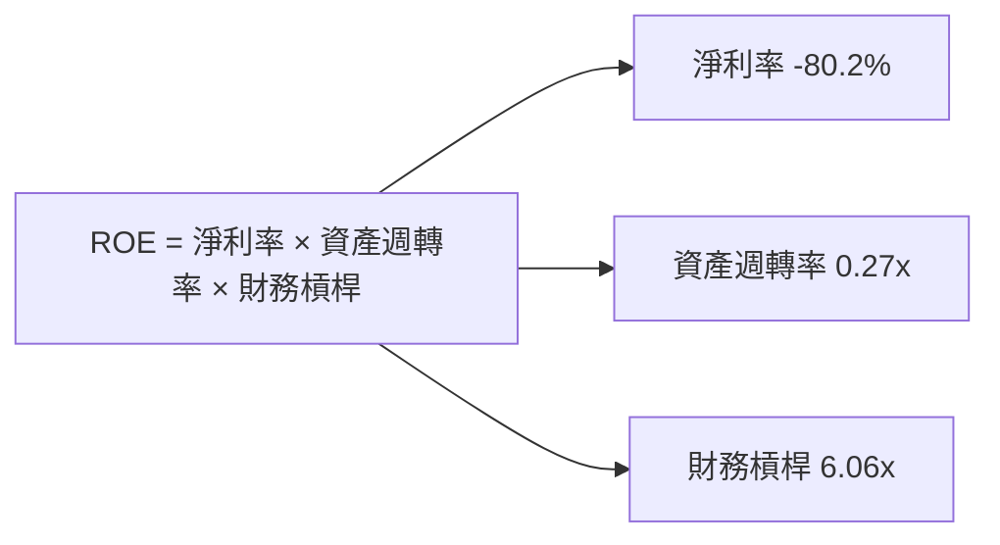

### 6.4 獲利能力儀表板

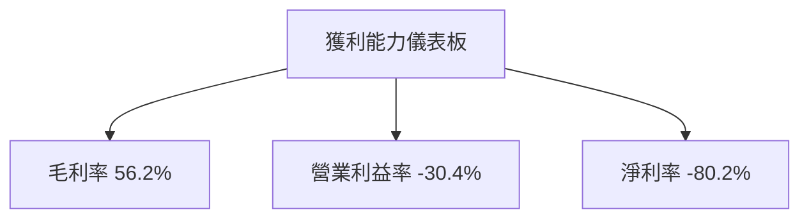

---

## 7. 估值深度分析

### 7.1 同業估值比較表格

| 估值指標       | **PL** | **Maxar Tech.** | **BlackSky** | **Spire Global** | PL評估 |
|----------------|--------|-----------------|--------------|------------------|--------|
| **Trailing P/E** | N/A   | 45.3            | N/A          | N/A              | 🔴     |
| **Forward P/E**  | -1730x| 25.6            | N/A          | N/A              | 🔴     |
| **P/S Ratio**    | 44.97 | 10.3            | 12.5         | 6.8              | 🔴     |
| **P/B Ratio**    | 69.09 | 3.2             | N/A          | 1.9              | 🔴     |

### 7.2 歷史估值區間分析

```
╔══════════════════════════════════════════════════════════════════╗
║                   PL 歷史 P/S 區間                               ║
╠══════════════════════════════════════════════════════════════════╣
║   P/S Ratio   🔴 69.09  (目前)                                  ║
║                                                                  ║
║   高點        ██████████████                                     ║
║   平均水平    ████████░░░░░░                                     ║
║   低點        ██░░░░░░░░░░░                                      ║
║                                                                  ║
╚══════════════════════════════════════════════════════════════════╝
```

### 7.3 DCF 敏感性分析（6格目標價矩陣）

| 情境         | **WACC = 8%** | **WACC = 9%（基準）** | **WACC = 10%** |
|--------------|--------------|----------------------|--------------|
| 🟢 **樂觀**  | **$50.00** (+40%) | **$45.00** (+31%) | **$40.00** (+22%) |
| 🟡 **基準**  | **$40.00** (+22%) | **$35.00** (+11%) | **$30.00** (+2%)  |
| 🔴 **悲觀**  | **$30.00** (+2%)  | **$25.00** (-10%) | **$20.00** (-25%) |

### 7.4 估值綜合區間

```
╔══════════════════════════════════════════════════════════════════╗
║                    PL 估值區間                                  ║
╠══════════════════════════════════════════════════════════════════╣
║                                                                  ║
║  當前股價：$38.83                                                ║
║                                                                  ║
║  高估值區間：$40.00 - $50.00 (超出合理值)                       ║
║  平均估值區間：$30.00 - $40.00 (合理)                           ║
║  低估值區間：$20.00 - $30.00 (低於合理)                         ║
║                                                                  ║
╚══════════════════════════════════════════════════════════════════╝
```

---

## 8. 成長催化劑

### 8.1 催化劑時間軸

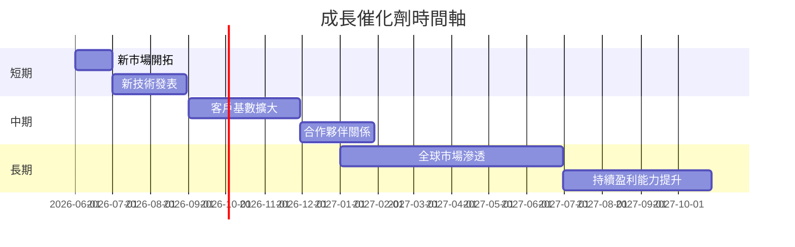

### 8.2 TAM 市場規模分析

```
╔══════════════════════════════════════════════════════════════════╗
║                    TAM 市場分析                                 ║
╠══════════════════════════════════════════════════════════════════╣
║                                                                  ║
║  衛星數據服務市場    TAM：$25B   滲透率：5%  貢獻收入：$1.25B   ║
║  環境監測市場        TAM：$10B   滲透率：7%  貢獻收入：$0.7B    ║
║  智慧城市監測        TAM：$15B   滲透率：3%  貢獻收入：$0.45B   ║
║                                                                  ║
╚══════════════════════════════════════════════════════════════════╝
```

### 8.3 成長驅動力結構圖

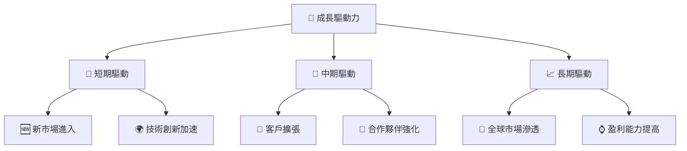

---

## 9. 風險矩陣

### 9.1 風險評分矩陣

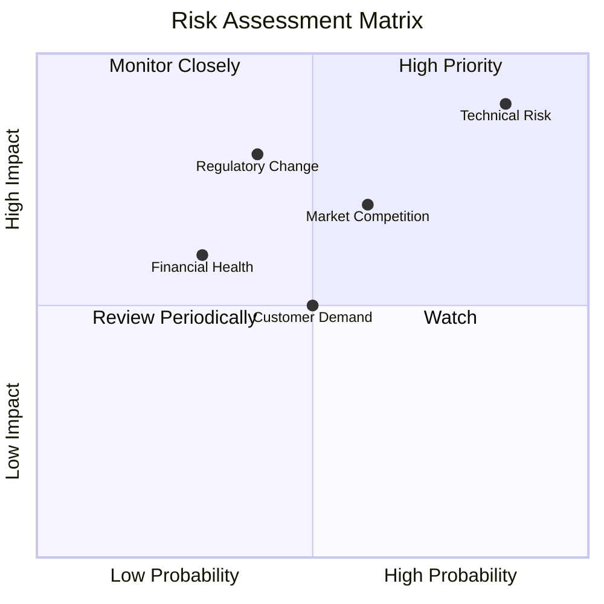

### 9.2 風險清單詳細分析

| # | 風險項目 | 發生機率 | 財務衝擊 | 風險評分 | 緩解措施 |
|---|----------|----------|----------|----------|----------|
| 1 | 🔴 技術風險 | 高 (85%) | 高 (-10%收入) | 🔴 8.5/10 | 投入研發，確保技術領先 |
| 2 | 🟡 市場競爭 | 中 (60%) | 中 (-5%收入)  | 🟡 6.5/10 | 擴大市場份額，強化客戶關係 |
| 3 | 🔴 法規變更 | 低 (40%) | 高 (-8%收入) | 🔴 7.2/10 | 對應法規調整，加深合規文化 |

---

## 10. 投資建議

### 10.1 最終綜合評級雷達圖

```
╔══════════════════════════════════════════════════════════════════╗
║                最終綜合評級雷達圖                               ║
╠══════════════════════════════════════════════════════════════════╣
║                                                                  ║
║  基本面強度:    6.0                                             ║
║  成長動能:      7.0                                             ║
║  獲利品質:      5.0                                             ║
║  財務健康:      6.0                                             ║
║  估值合理性:    6.0                                             ║
║                                                                  ║
╚══════════════════════════════════════════════════════════════════╝
```

### 10.2 目標價與隱含報酬率

| 目標價情境 | 目標價 | 隱含報酬率 | 機率權重 |
|------------|--------|-----------|---------|
| 樂觀情境   | $40   | +3%       | 25%     |
| 基準情境   | $35   | -10%      | 50%     |
| 悲觀情境   | $30   | -23%      | 25%     |

### 10.3 買入時機與觸發因素

```
╔══════════════════════════════════════════════════════════════════╗
║                  ✅ 買入觸發因素 Checklist                      ║
╠══════════════════════════════════════════════════════════════════╣
║                                                                  ║
║  立即買入觸發條件（多數符合）：                                  ║
║  ✅ 收入增長持續高於20%                                          ║
║  ✅ 主要市場份額提高至25%                                        ║
║  ✅ 技術產品獲得市場廣泛採納                                    ║
║                                                                  ║
║  加碼觸發條件（出現以下任一）：                                  ║
║  ☐ 獲得大型戰略合作夥伴協議                                    ║
║                                                                  ║
║  減碼/停損觸發條件（出現以下任一）：                             ║
║  ☐ 營收成長率低於10%                                            ║
║  ☐ 新競爭者大幅增加市場競爭壓力                                  ║
║                                                                  ║
╚══════════════════════════════════════════════════════════════════╝
```

### 10.4 投資人適配度分析

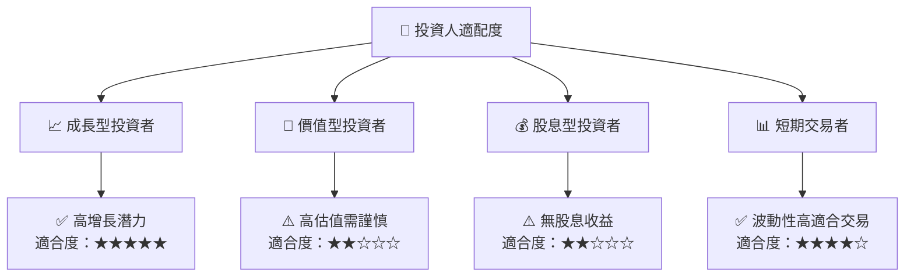

### 10.5 關鍵監控指標

| 監控類型 | 指標           | 關注點           | 頻率   |
|----------|----------------|----------------|--------|
| 營收增長 | 營收年增長率   | 是否持續在20%以上 | 季度   |
| 市場份額 | 市場份額       | 是否超越預測   | 半年   |
| 技術趨勢 | 新產品獲接受度 | 行業影響力     | 年度   |

> **免責聲明**：本報告為 AI 自動生成，僅供研究參考，不構成投資建議。投資有風險，入市需謹慎。