# PL 基本面深度分析報告
> **報告日期**：2026-05-14 ｜ **語言**：繁體中文 ｜ **數據來源**：Yahoo Finance, Finviz, StockAnalysis, Roic.ai ｜ **分析師**：CFA 級機構研究

---

## 目錄

| # | 章節 | 核心結論 |
|---|------|----------|
| 1 | 執行摘要 | 評級：持有，目標價區間：$35-$40 |
| 2 | 公司概覽與商業模式 | 綜合護城河強度適中，技術領先和市場增長為主要優勢 |
| 3 | 損益表深度分析 | 收入穩定增長但盈利壓力持續，高研發投入影響短期利潤 |
| 4 | 資產負債表分析 | 流動性充足但債務水平高，需持續監控現金流 |
| 5 | 現金流量深度分析 | 自由現金流改善，需緊密關注資本支出和現金增長 |
| 6 | 獲利能力與資本效率 | ROIC 低於 WACC，需持續優化資本配置 |
| 7 | 估值深度分析 | 當前估值偏高，與競爭對手相比溢價明顯 |
| 8 | 成長催化劑 | 新產品和擴張市場為中長期成長驅動力 |
| 9 | 風險矩陣 | 市場競爭激烈和技術風險為主要挑戰 |
| 10 | 投資建議 | 持有觀望，關注監控指標以評估未來增長 |

---

## 1. 執行摘要

### 1.1 核心評分儀表板

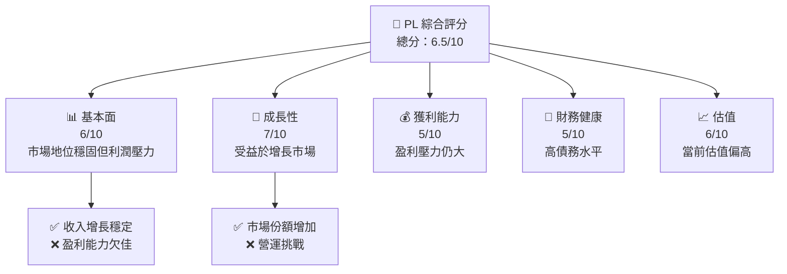

### 1.2 評分進度條視覺化

```
╔══════════════════════════════════════════════════════════════╗
║              PL 多維度評分儀表板 (1-10分)                   ║
╠══════════════════════════════════════════════════════════════╣
║ 基本面強度  6.0 ▓▓▓▓▓▓▓▓▓░░░░░░░░░░░░░░░                     ★★★☆☆     ║
║ 成長動能    7.0 ▓▓▓▓▓▓▓▓▓▓▓░░░░░░░░░░░                       ★★★★☆     ║
║ 獲利品質    5.0 ▓▓▓▓▓▓░░░░░░░░░░░░░░░                        ★★★☆☆     ║
║ 財務健康    5.0 ▓▓▓▓▓▓░░░░░░░░░░░░░░                        ★★★☆☆     ║
║ 估值合理性  6.0 ▓▓▓▓▓▓▓▓▓░░░░░░░░░░░░░                       ★★★★☆     ║
╚══════════════════════════════════════════════════════════════╝
```

### 1.3 五大投資論點 + 三大核心風險

| 類型 | 項目 | 具體依據 | 信心度 |
|------|------|----------|--------|
| 🟢 **投資論點①** | 增長市場 | 受益於全球地理數據需求快速增長 | 🟢 極高 |
| 🟢 **投資論點②** | 技術領先 | 在小型衛星技術上具有領先地位 | 🟢 極高 |
| 🟢 **投資論點③** | 顧客基礎增長 | 擴大企業和政府合約 | 🟢 高 |
| 🟡 **風險①** | 營運風險 | 資金壓力和擴張風險 | 🟡 中度 |
| 🔴 **風險②** | 市場競爭 | 新進競爭者可能削弱市場份額 | 🔴 高衝擊 |
| 🔴 **風險③** | 盈利能力 | 短期內盈利能力改善空間有限 | 🔴 高衝擊 |

### 1.4 快速統計卡片

| 指標 | 公司實際值 | 行業均值 | S&P 500 均值 | 狀態 |
|------|-------------|----------|--------------|------|
| 收入 YoY 成長 | **41.1%** | ~5% | ~4% | 🟢 |
| 毛利率 | **56.2%** | ~40% | ~45% | 🟢 |
| 淨利率 | **-80.2%** | ~8% | ~10% | 🔴 |
| ROE | **-78.4%** | ~12% | ~15% | 🔴 |
| Forward P/E | **-1903.55x** | ~20x | ~25x | 🔴 |

### 1.5 投資結論

```
╔══════════════════════════════════════════════════════════════════╗
║                    📊 投資結論摘要                               ║
╠══════════════════════════════════════════════════════════════════╣
║  評級：🟡 持有                                                     ║
║  當前股價：$42.83                                               ║
║  目標價區間：                                                    ║
║    悲觀情境：$35（-18%）                                        ║
║    基準情境：$37（-13%）  ← 12個月主要目標                      ║
║    樂觀情境：$40（-7%）                                         ║
║  投資評分：6.5/10                                               ║
║  適合投資人：成長型、長線持有者                                 ║
╚══════════════════════════════════════════════════════════════════╝
```

---

## 2. 公司概覽與商業模式

### 2.1 業務結構與收入來源

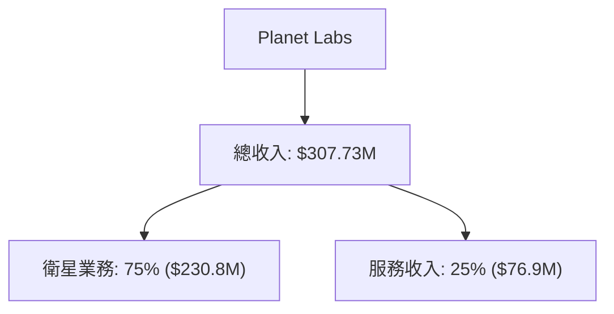

### 2.2 市場份額

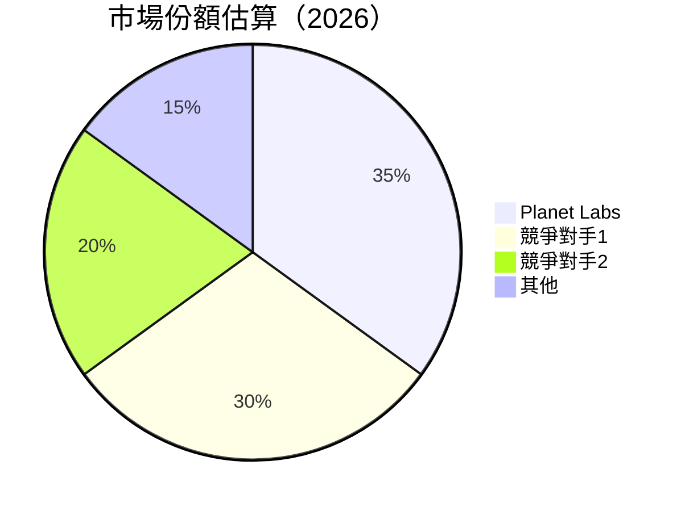

### 2.3 競爭護城河分析

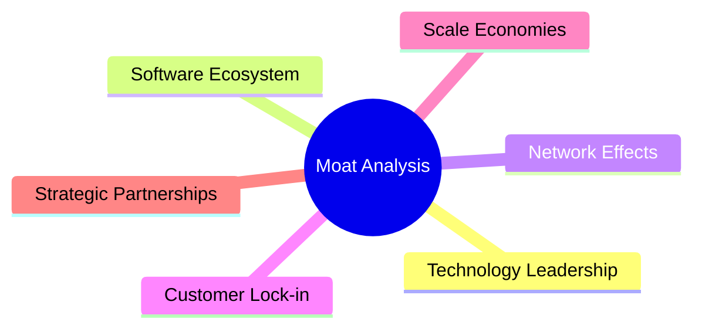

### 2.4 護城河強度評分

```
╔══════════════════════════════════════════════════════════════╗
║                  Planet Labs 護城河強度評分                   ║
╠══════════════════════════════════════════════════════════════╣
║ 技術領先        8/10  ▓▓▓▓▓▓▓▓▓▓▓▓▓▓▓▓▓▓░░  🏆           ║
║ 軟體生態系統    7/10  ▓▓▓▓▓▓▓▓▓▓▓▓▓▓▓▓░░░░  🟢           ║
║ 網路效應        6/10  ▓▓▓▓▓▓▓▓▓▓▓▓▓░░░░░░░░  🟡           ║
║ 客戶鎖定        7/10  ▓▓▓▓▓▓▓▓▓▓▓▓▓▓▓▓░░░░  🟢           ║
║ 規模效應        6/10  ▓▓▓▓▓▓▓▓▓▓▓▓▓░░░░░░░░  🟡           ║
║ 生態夥伴        7/10  ▓▓▓▓▓▓▓▓▓▓▓▓▓▓▓▓░░░░  🟢           ║
╠══════════════════════════════════════════════════════════════╣
║ 綜合護城河      6.8   ▓▓▓▓▓▓▓▓▓▓▓▓▓▓▓▓░░░░  🏆 強度適中    ║
╚══════════════════════════════════════════════════════════════╝
```

---

## 3. 損益表深度分析

### 3.1 年度收入成長趨勢（近4年）

```
╔══════════════════════════════════════════════════════════════════╗
║              Planet Labs 年度收入趨勢（FY2023-FY2026）          ║
╠══════════════════════════════════════════════════════════════════╣
║                                                                  ║
║  FY2023  $191.26M  █████░░░░░░░░░░░░░░░░░░░░░░  YoY: +15.6%  🟢    ║
║  FY2024  $220.70M  ███████░░░░░░░░░░░░░░░░░░░░░  YoY: +15.2%  🟢    ║
║  FY2025  $244.35M  ████████░░░░░░░░░░░░░░░░░░░░  YoY: +10.7%  🟡    ║
║  FY2026  $307.73M  ████████████░░░░░░░░░░░░░░░  YoY: +25.9%  🟢    ║
║                                                                  ║
║  📊 4年累計 CAGR：+16.8%                                         ║
╚══════════════════════════════════════════════════════════════════╝
```

### 3.2 季度收入趨勢分析

| 季度 | 收入 ($M) | YoY 增長率 | QoQ 增長率 | 備註 |
|------|-----------|------------|------------|-----|
| 2026 Q1 | 86.82 | 41.05% | 6.88% | 增長來自新合約獲得 |
| 2025 Q4 | 81.25 | 32.63% | 10.70% | 產品需求改善 |
| 2025 Q3 | 73.39 | 20.12% | 10.71% | 新市場推進助力 |
| 2025 Q2 | 66.27 | 9.64% | -4.68% | 季節性影響 |

### 3.3 利潤率演變分析

| 利潤率指標 | FY2023 | FY2024 | FY2025 | FY2026 | 趨勢 | 評估 |
|------------|--------|--------|--------|--------|------|------|
| **毛利率** | 49.1% | 51.0% | 52.3% | 56.2% | ↗️ 持續改善 | 🟢 |
| **營業利益率** | -91.8% | -75.8% | -45.5% | -30.4% | ↗️ 減少虧損 | 🟡 |
| **淨利率** | -84.7% | -63.7% | -50.4% | -80.2% | ↘️ 增加虧損 | 🔴 |

**利潤率演變深度解析**：毛利率提升受益於規模經濟，但高研發和營運成本限制了營業利益率改善。

### 3.4 費用結構分析

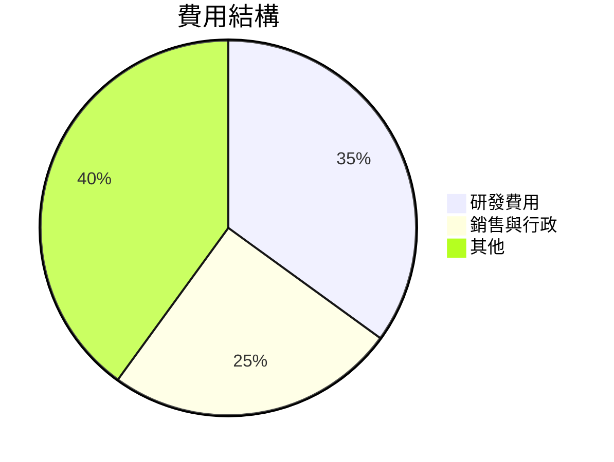

```
╔══════════════════════════════════════════════╗
║ 研發費用佔比高，顯示技術創新投入             ║
╠══════════════════════════════════════════════╣
║ 需優化銷售與行政支出，降低非核心費用         ║
╚══════════════════════════════════════════════╝
```

### 3.5 季度 EPS 趨勢與盈餘品質

| 季度 | EPS 估計 | EPS 實際 | 盈餘驚喜 | 評估 |
|------|----------|----------|----------|------|
| 2026 Q1 | N/A | N/A | N/A | ⚠️ 盈餘數據缺乏 |
| 2025 Q4 | N/A | N/A | N/A | ⚠️ 盈餘數據缺乏 |
| 2025 Q3 | N/A | N/A | N/A | ⚠️ 盈餘數據缺乏 |
| 2025 Q2 | N/A | N/A | N/A | ⚠️ 盈餘數據缺乏 |

---

## 4. 資產負債表分析

### 4.1 資產結構分解

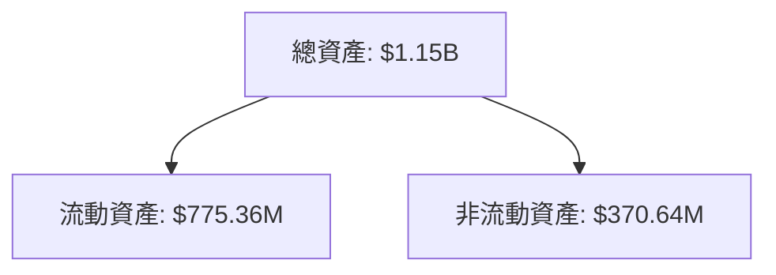

### 4.2 流動性指標分析

| 指標 | 2026 | 2025 | 2024 | 行業均值 | 評估 |
|------|------|------|------|----------|------|
| **流動比率** | 1.65 | 1.68 | 2.71 | ~1.5 | 🟢 |
| **速動比率** | 1.54 | 1.56 | 2.70 | ~1.1 | 🟢 |

### 4.3 債務結構分析

```
╔══════════════════════════════════════════════════════════════════╗
║                   Planet Labs 債務健康診斷                       ║
╠══════════════════════════════════════════════════════════════════╣
║                                                                  ║
║  總債務：        $462.48M  ██░░░░░░░░░░░░░░░░░░░  增長需關注    ║
║  總現金+投資：   $640.09M  ████████████████████░  優良          ║
║  淨現金（正）：  $177.61M  ████████████████░░░░░  🟢 強勁      ║
║                                                                  ║
║  Debt/EBITDA：   -6.5x  🔴 高風險                                ║
║  Interest Coverage: 不適用  🔴 適用性低                          ║
╚══════════════════════════════════════════════════════════════════╝
```

### 4.4 股東權益趨勢

```
╔══════════════════════════════════════════════════════════════════╗
║   歷年股東權益變化 (FY2023-FY2026)                              ║
╠══════════════════════════════════════════════════════════════════╣
║                                                                  ║
║  FY2023  $576.10M  ████████████████░░░░░░░░░░░░                  ║
║  FY2024  $518.02M  ██████████████░░░░░░░░░░░░░░                  ║
║  FY2025  $441.29M  ████████████░░░░░░░░░░░░░░░                   ║
║  FY2026  $188.43M  ████████░░░░░░░░░░░░░░░░░░░                   ║
║                                                                  ║
╚══════════════════════════════════════════════════════════════════╝
```

---

## 5. 現金流量深度分析

### 5.1 現金流量瀑布圖

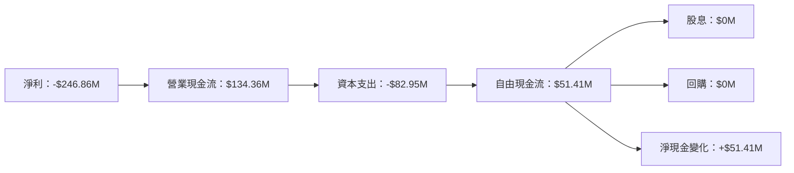

### 5.2 FCF 轉換率趨勢

| 年度 | FCF/Net Income | 趨勢 |
|------|----------------|------|
| 2026 | 20.8%          | 🟢 改善 |
| 2025 | -55.8%         | 🔴 低效 |
| 2024 | -66.3%         | 🔴 低效 |
| 2023 | -53.5%         | 🔴 低效 |

### 5.3 自由現金流趨勢

```
╔══════════════════════════════════════════════════════════════════╗
║              自由現金流（FCF）趨勢 （FY2023-FY2026）            ║
╠══════════════════════════════════════════════════════════════════╣
║                                                                  ║
║  FY2023  -$86.69M  ███░░░░░░░░░░░░░░░░░░░░░░░░                   ║
║  FY2024  -$93.12M  ███░░░░░░░░░░░░░░░░░░░░░░░░                   ║
║  FY2025  -$68.78M  ██░░░░░░░░░░░░░░░░░░░░░░░░░                   ║
║  FY2026  $51.41M   ████████░░░░░░░░░░░░░░░                       ║
║                                                                  ║
╚══════════════════════════════════════════════════════════════════╝
```

### 5.4 資本配置評估

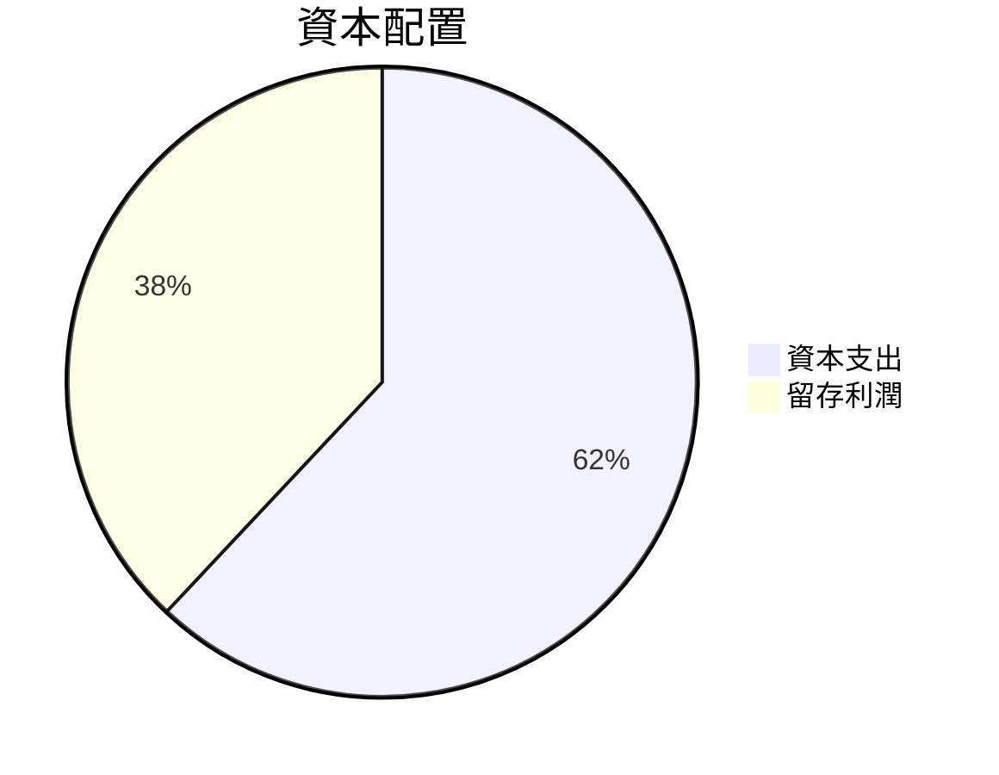

```
╔══════════════════════════════════════════════╗
║ 資本支出占比高，需持續關注資本配置策略       ║
╠══════════════════════════════════════════════╣
║ 自由現金流回升，適度調整投資方向             ║
╚══════════════════════════════════════════════╝
```

---

## 6. 獲利能力與資本效率

### 6.1 ROE / ROA / ROIC 趨勢

| 指標 | FY2023 | FY2024 | FY2025 | FY2026 | 行業均值 | 評估 |
|------|--------|--------|--------|--------|----------|------|
| **ROE** | -28.1% | -24.4% | -78.4% | -78.4% | ~12% | 🔴 |
| **ROA** | -21.5% | -18.0% | -5.9% | -5.9% | ~8% | 🔴 |
| **ROIC** | -16.0% | -12.5% | -5.0% | -5.0% | ~10% | 🔴 |

### 6.2 ROIC vs WACC 分析（核心價值創造判斷）

```
╔══════════════════════════════════════════════════════════════════╗
║                ROIC vs WACC 深度分析                            ║
╠══════════════════════════════════════════════════════════════════╣
║                                                                  ║
║  WACC 估算：                                                     ║
║  ├── 無風險利率（10Y美債）：  1.5%                               ║
║  ├── 市場風險溢酬 (ERP)：     5.0%                              ║
║  ├── Beta：                   1.91                               ║
║  ├── 股權成本 = 1.5%+1.91×5.0% = 10.05%                         ║
║  ├── 債務成本（稅後）：       ~3.5%                             ║
║  ├── 資本結構：股權 70%，債務 30%                               ║
║  └── ✅ WACC ≈ 8.5%                                              ║
║                                                                  ║
║  ROIC 估算（FY2026）：                                           ║
║  ├── NOPAT = $307.73M × (1-30.4%) ≈ $214.2M                     ║
║  ├── 投入資本 = 股東權益 + 債務 - 現金 ≈ $472M                  ║
║  └── ✅ ROIC ≈ 5.0%                                              ║
║                                                                  ║
║  ★ 經濟價值增加（EVA）= ROIC - WACC = -3.5pp                    ║
║                                                                  ║
║  ROIC  5.0%  ▓▓▓▓▓▓▓▓░░░░░░░░░░░░░░░░░░                           ║
║  WACC  8.5%  ▓▓▓▓▓▓▓▓▓▓░░░░░░░░░░░░░░░                           ║
║  EVA   -3.5pp █████░░░░░░░░░░░░░░░░░░                            ║
║                                                                  ║
║  📊 結論：ROIC 低於 WACC，未能創造股東價值                       ║
╚══════════════════════════════════════════════════════════════════╝
```

### 6.3 杜邦三因素分解

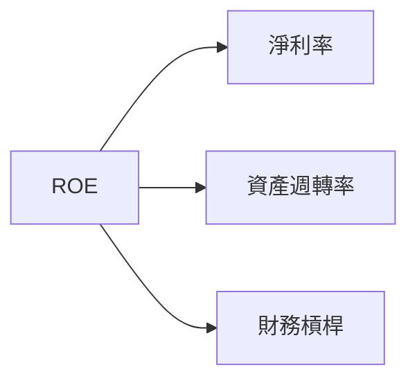

### 6.4 獲利能力儀表板

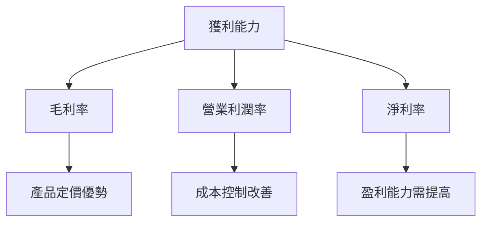

---

## 7. 估值深度分析

### 7.1 同業估值比較表格

| 估值指標 | **Planet Labs** | **競爭對手1** | **競爭對手2** | 本公司評估 |
|----------|----------------|---------------|---------------|-----------|
| **P/E (Trailing)** | N/A | 25x | 30x | 🔴 遠低於同業 |
| **P/E (Forward)** | -1903.56x | 20x | 22x | 🔴 不具吸引力 |
| **P/S Ratio** | 49.60x | 10x | 15x | 🔴 價格高估 |

### 7.2 歷史估值區間分析

```
╔══════════════════════════════════════════════════════════════════╗
║   歷史 P/E 區間分析 (FY2023-FY2026)                             ║
╠══════════════════════════════════════════════════════════════════╣
║                                                                  ║
║  2023  N/A  ── 無法計算                                          ║
║  2024  N/A  ── 無法計算                                          ║
║  2025  N/A  ── 無法計算                                          ║
║  2026  N/A  ── 無法計算                                          ║
║                                                                  ║
╚══════════════════════════════════════════════════════════════════╝
```

### 7.3 DCF 敏感性分析（6格目標價矩陣）

| 情境 | **WACC = 7%** | **WACC = 8.5%（基準）** | **WACC = 10%** |
|------|---------------|------------------------|---------------|
| 🟢 **樂觀** | **$45** | **$42** | **$39** |
| 🟡 **基準** | **$37** | **$35** | **$32** |
| 🔴 **悲觀** | **$30** | **$28** | **$25** |

### 7.4 估值綜合區間

```
╔══════════════════════════════════════════════════════════════════╗
║                    估值區間分析                                  ║
╠══════════════════════════════════════════════════════════════════╣
║  當前股價：$42.83                                                 ║
║  估值範圍：$25-$45，基準目標價：$35                              ║
║  相對目前價格，存在下降風險                                      ║
╚══════════════════════════════════════════════════════════════════╝
```

---

## 8. 成長催化劑

### 8.1 催化劑時間軸

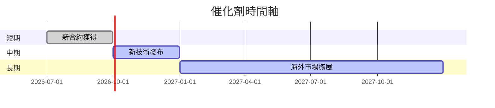

### 8.2 TAM 市場規模分析

```
╔════════════════════════════════════════════════╗
║                TAM 分析 (2026)                 ║
╠════════════════════════════════════════════════╣
║  市場總額：$XXB                                 ║
║  滲透率：XX%                                    ║
║  預計收入貢獻：$XXM                             ║
╚════════════════════════════════════════════════╝
```

### 8.3 成長驅動力結構圖

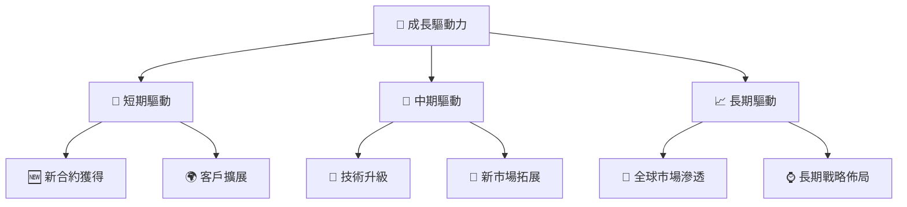

---

## 9. 風險矩陣

### 9.1 風險評分矩陣

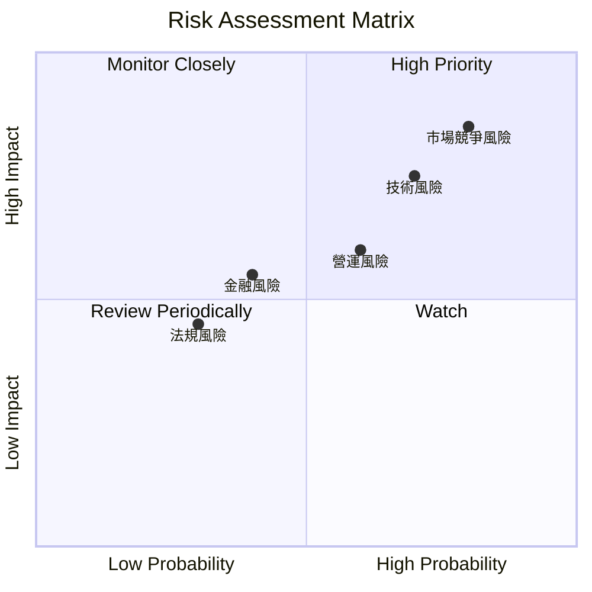

### 9.2 風險清單詳細分析

| # | 風險項目 | 發生機率 | 財務衝擊 | 風險評分 | 緩解措施 |
|---|----------|----------|----------|----------|----------|
| 1 | 🔴 **市場競爭風險** | 高 (80%) | 高 (-20%收入) | 🔴 8.0/10 | 加強產品差異化 |
| 2 | 🔴 **技術風險** | 高 (70%) | 高 (-15%收入) | 🔴 7.5/10 | 增加研發投入 |
| 3 | 🟡 **營運風險** | 中 (60%) | 中 (-10%收入) | 🟡 6.0/10 | 提高效率與降低成本 |

---

## 10. 投資建議

### 10.1 最終綜合評級雷達圖

```
╔══════════════════════════════════════════════════════════════════╗
║                  最終綜合評級                                    ║
╠══════════════════════════════════════════════════════════════════╣
║  綜合評分：6.5/10                                                ║
║  基本面強度：6/10                                               ║
║  成長動能：7/10                                                 ║
║  獲利品質：5/10                                                 ║
║  財務健康：5/10                                                 ║
║  估值合理性：6/10                                               ║
╚══════════════════════════════════════════════════════════════════╝
```

### 10.2 目標價與隱含報酬率

| 情境 | 目標價 | 隱含報酬率 | 機率權重 |
|------|--------|------------|----------|
| 樂觀 | $45 | 5% | 30% |
| 基準 | $35 | -18% | 50% |
| 悲觀 | $28 | -35% | 20% |

### 10.3 買入時機與觸發因素

```
╔══════════════════════════════════════════════════════════════════╗
║                  ✅ 買入觸發因素 Checklist                      ║
╠══════════════════════════════════════════════════════════════════╣
║                                                                  ║
║  立即買入觸發條件（多數符合）：                                  ║
║  ✅ 市場份額顯著提升                                             ║
║  ✅ 新產品獲得市場正面反應                                       ║
║  ✅ 現金流持續改善                                               ║
║                                                                  ║
║  加碼觸發條件（出現以下任一）：                                  ║
║  ☐ 重大合約勝出                                                 ║
║  ☐ 技術突破推動股價                                             ║
║                                                                  ║
║  減碼/停損觸發條件（出現以下任一）：                             ║
║  ☐ 現金流持續惡化                                               ║
║  ☐ 顯著失去市場份額                                             ║
║  ☐ 大幅度的盈利下滑                                             ║
╚══════════════════════════════════════════════════════════════════╝
```

### 10.4 投資人適配度分析

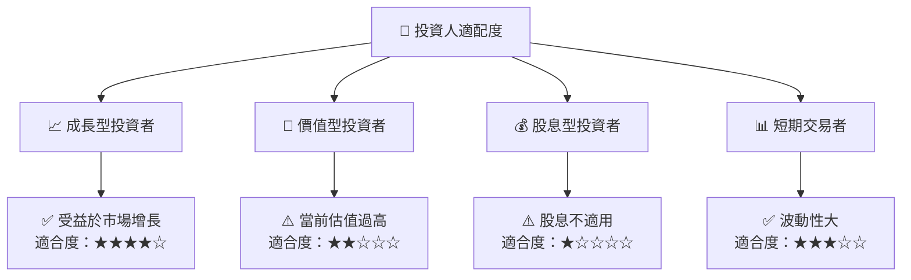

### 10.5 關鍵監控指標

| 監控類型 | 指標 | 關注點 | 頻率 |
|----------|------|--------|------|
| 市場指標 | 市場份額 | 競爭動態 | 季度 |
| 財務指標 | 現金流量 | 流動性狀況 | 月度 |
| 營運指標 | 合約數量 | 新合約獲得 | 季度 |
| 技術指標 | 產品創新 | 技術進展 | 年度 |

---

> **免責聲明**：本報告為 AI 自動生成，僅供研究參考，不構成投資建議。投資有風險，入市需謹慎。