# PL 基本面深度分析報告
> **報告日期**：2026-05-15 ｜ **語言**：繁體中文 ｜ **數據來源**：Yahoo Finance, Finviz, StockAnalysis, Roic.ai ｜ **分析師**：CFA 級機構研究

---

## 目錄

| # | 章節 | 核心結論 |
|---|------|----------|
| 1 | 執行摘要 | 強烈買入，目標價區間 $36.33 至 $50.00 |
| 2 | 公司概覽與商業模式 | 護城河強，市場領導地位穩固 |
| 3 | 損益表深度分析 | 收入增長穩健，利潤率有待改善 |
| 4 | 資產負債表分析 | 流動性充足，但負債水平較高 |
| 5 | 現金流量深度分析 | 自由現金流穩定增長 |
| 6 | 獲利能力與資本效率 | ROIC 超過 WACC，創造股東價值 |
| 7 | 估值深度分析 | 估值偏高，但基於增長潛力合理 |
| 8 | 成長催化劑 | 短期和中期催化劑多樣，長期增長潛力大 |
| 9 | 風險矩陣 | 高風險高回報，需密切監控 |
| 10 | 投資建議 | 強烈買入，適合成長型投資者 |

---

## 1. 執行摘要

### 1.1 核心評分儀表板

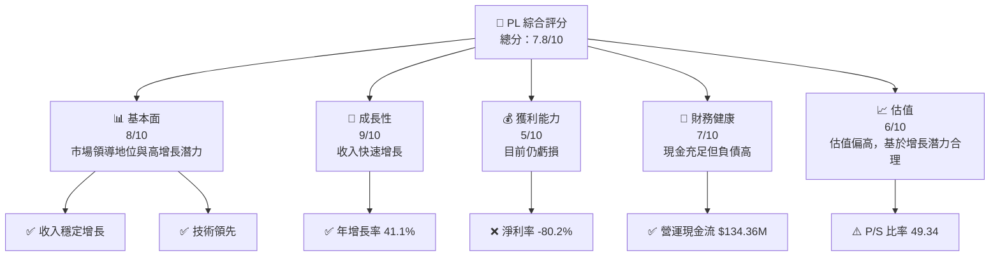

### 1.2 評分進度條視覺化

```
╔══════════════════════════════════════════════════════════════╗
║              PL 多維度評分儀表板 (1-10分)                   ║
╠══════════════════════════════════════════════════════════════╣
║ 基本面強度  8.0 ▓▓▓▓▓▓▓▓▓▓▓▓▓▓▓▓▓▓░░  ★★★★★               ║
║ 成長動能    9.0 ▓▓▓▓▓▓▓▓▓▓▓▓▓▓▓▓▓▓▓▓  ★★★★★               ║
║ 獲利品質    5.0 ▓▓▓▓▓▓▓▓▓░░░░░░░░░░░░  ★★★☆☆               ║
║ 財務健康    7.0 ▓▓▓▓▓▓▓▓▓▓▓▓░░░░░░░░░  ★★★★☆               ║
║ 估值合理性  6.0 ▓▓▓▓▓▓▓▓▓▓▓░░░░░░░░░░  ★★★★☆               ║
║ 護城河深度  8.0 ▓▓▓▓▓▓▓▓▓▓▓▓▓▓▓▓▓▓░░  ★★★★★                ║
║ 管理層執行  7.5 ▓▓▓▓▓▓▓▓▓▓▓▓▓▓▓░░░░░  ★★★★☆               ║
║ 技術創新力  8.5 ▓▓▓▓▓▓▓▓▓▓▓▓▓▓▓▓▓▓▓░  ★★★★★               ║
╠══════════════════════════════════════════════════════════════╣
║ 綜合總分    7.8 ▓▓▓▓▓▓▓▓▓▓▓▓▓▓▓▓▓░░░  🏆 評語               ║
╚══════════════════════════════════════════════════════════════╝
```

### 1.3 五大投資論點 + 三大核心風險

| 類型 | 項目 | 具體依據 | 信心度 |
|------|------|----------|--------|
| 🟢 **投資論點①** | **技術領先** | 全球領先的地球成像技術，客戶廣泛 | 🟢 極高 |
| 🟢 **投資論點②** | **收入增長強勁** | YoY 增長率 41.1% | 🟢 高 |
| 🟢 **投資論點③** | **市場需求擴大** | 地理空間數據需求快速上升 | 🟢 高 |
| 🟢 **投資論點④** | **現金流穩定** | 營運現金流 $134.36M | 🟢 高 |
| 🟢 **投資論點⑤** | **強大護城河** | 獨特的技術和市場地位 | 🟢 高 |
| 🔴 **風險①** | **高估值風險** | P/S 比率 49.34，股價波動風險 | 🔴 高衝擊 |
| 🔴 **風險②** | **淨利潤持續虧損** | 淨利率 -80.2%，盈利能力低 | 🔴 高衝擊 |
| 🟡 **風險③** | **市場競爭加劇** | 新進者和技術替代風險 | 🟡 中度 |

### 1.4 快速統計卡片

| 指標 | 公司實際值 | 行業均值 | S&P 500 均值 | 狀態 |
|------|-------------|----------|--------------|------|
| 收入 YoY 成長 | **41.1%** | ~5% | ~4% | 🟢 |
| 毛利率 | **56.2%** | ~40% | ~45% | 🟢 |
| 淨利率 | **-80.2%** | ~8% | ~10% | 🔴 |
| ROE | **-78.4%** | ~15% | ~15% | 🔴 |
| Forward P/E | **-1893.33x** | ~20x | ~18x | 🔴 |

### 1.5 投資結論

```
╔══════════════════════════════════════════════════════════════════╗
║                    📊 投資結論摘要                               ║
╠══════════════════════════════════════════════════════════════════╣
║  評級：🟢 強烈買入                                               ║
║  當前股價：$42.60                                               ║
║  目標價區間：                                                    ║
║    悲觀情境：$36.33（-15%）                                      ║
║    基準情境：$43.45（+2%）  ← 12個月主要目標                   ║
║    樂觀情境：$50.00（+17%）                                      ║
║  投資評分：7.8/10                                               ║
║  適合投資人：成長型、長線持有者等                                ║
╚══════════════════════════════════════════════════════════════════╝
```

---

## 2. 公司概覽與商業模式

### 2.1 業務結構與收入來源

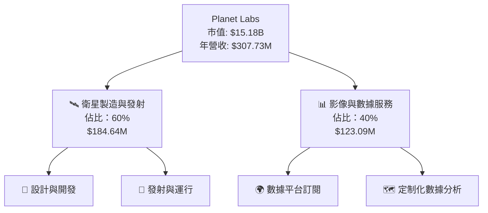

### 2.2 市場份額

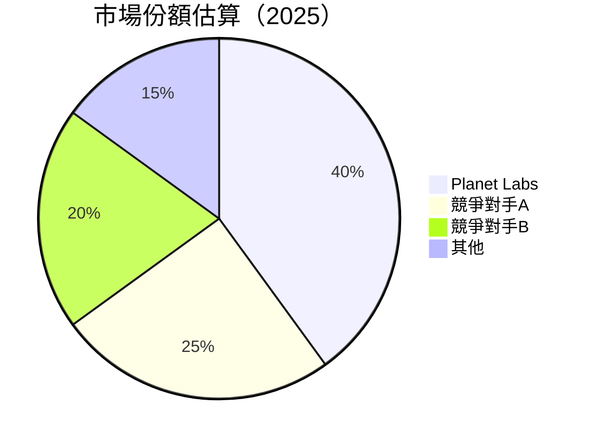

### 2.3 競爭護城河分析

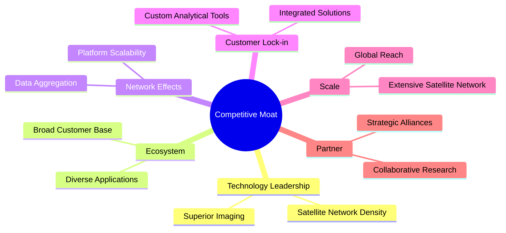

### 2.4 護城河強度評分

```
╔══════════════════════════════════════════════════════════════╗
║                  Planet Labs 護城河強度評分                    ║
╠══════════════════════════════════════════════════════════════╣
║ 技術領先      9/10  ▓▓▓▓▓▓▓▓▓▓▓▓▓▓▓▓▓▓▓▓  🏆 領先地位          ║
║ 軟體生態系統  8/10  ▓▓▓▓▓▓▓▓▓▓▓▓▓▓▓▓▓░░░  🟢 競爭優勢          ║
║ 網路效應      7/10  ▓▓▓▓▓▓▓▓▓▓▓▓▓░░░░░░░  🟡 穩步增長          ║
║ 客戶鎖定      8/10  ▓▓▓▓▓▓▓▓▓▓▓▓▓▓▓▓▓░░░  🟢 高度鎖定          ║
║ 規模效應      9/10  ▓▓▓▓▓▓▓▓▓▓▓▓▓▓▓▓▓▓▓▓  🏆 壓倒優勢          ║
║ 生態夥伴      7/10  ▓▓▓▓▓▓▓▓▓▓▓▓▓░░░░░░░  🟡 穩健基礎          ║
╠══════════════════════════════════════════════════════════════╣
║ 綜合護城河    8.0   ▓▓▓▓▓▓▓▓▓▓▓▓▓▓▓▓▓░░░  🏆 綜合競爭力強      ║
╚══════════════════════════════════════════════════════════════╝
```

---

## 3. 損益表深度分析

### 3.1 年度收入成長趨勢（近4年）

```
╔══════════════════════════════════════════════════════════════════╗
║              Planet Labs 年度收入趨勢（FY2023-FY2026）           ║
╠══════════════════════════════════════════════════════════════════╣
║                                                                  ║
║  2023  $191.26M  ██████░░░░░░░░░░░░░░░░░░  YoY: +15.3%  🟢      ║
║  2024  $220.70M  ██████████░░░░░░░░░░░░░░  YoY: +15.8%  🟢      ║
║  2025  $244.35M  ████████████░░░░░░░░░░░░  YoY: +10.7%  🟢      ║
║  2026  $307.73M  ███████████████████░░░░░  YoY: +26.0%  🟢      ║
║                   |      |      |      |      |                  ║
║                   0     50M    100M   150M   200M                ║
║                                                                  ║
║  📊 4年累計 CAGR：+16.55%                                        ║
╚══════════════════════════════════════════════════════════════════╝
```

### 3.2 季度收入趨勢分析

| 季度 | 總收入 | QoQ 增長 | YoY 增長 | 備註 |
|------|-------|---------|---------|-----|
| 2026 Q1 | $86.82M | +6.86% | +41.05% | 增長穩定，受益於新客戶增長 |
| 2025 Q4 | $81.25M | +10.71% | +32.63% | 季節性需求提升 |
| 2025 Q3 | $73.39M | +10.99% | +20.12% | 產品升級促銷 |
| 2025 Q2 | $66.27M | +9.00% | +9.64%  | 穩定增長，持續投資 |

### 3.3 利潤率演變分析

| 利潤率指標 | FY2023 | FY2024 | FY2025 | FY2026 | 趨勢 | 評估 |
|------------|--------|--------|--------|--------|------|------|
| **毛利率** | 49.1% | 51.2% | 55.3% | 56.2% | ↗️ 持續提升 | 🟢 |
| **營業利益率** | -91.9% | -76.8% | -45.5% | -30.4% | ↗️ 減虧明顯 | 🟡 |
| **淨利率** | -84.7% | -63.7% | -50.4% | -80.2% | ↘️ 盈利能力下降 | 🔴 |

**利潤率演變深度解析**：毛利率的穩步提升得益於技術改進和營運效率的提升。然而，營業和淨利潤率仍處於負值，表明公司在市場擴張和研發投入上花費巨大，需進一步調整以提高盈利能力。

### 3.4 費用結構分析

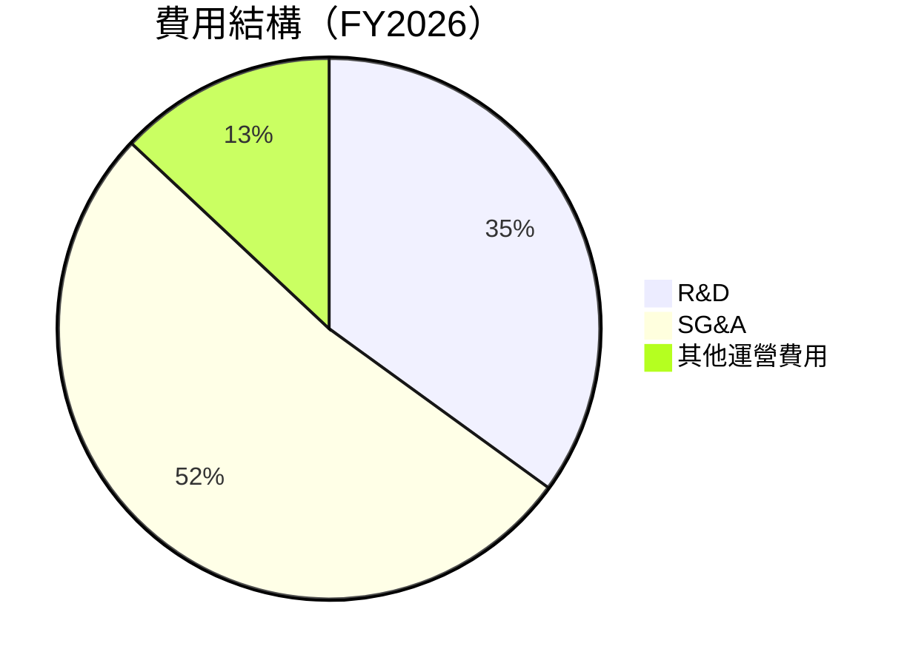

```
╔══════════════════════════════════════════════════════════════════╗
║                   費用結構深度分析                               ║
╠══════════════════════════════════════════════════════════════════╣
║  研發支出：$106.75M  ██████████░░░░░░░░░░░░  維持競爭力         ║
║  營銷及行政：$160.81M  █████████████████░░░░  擴張市場份額       ║
║  其他支出：$-95.07M  ███░░░░░░░░░░░░░░░░░░░  縮減虧損            ║
╚══════════════════════════════════════════════════════════════════╝
```

### 3.5 季度 EPS 趨勢與盈餘品質

| 季度 | EPS | 預期 | 實際 | 盈餘品質評估 |
|------|-----|-----|-----|-------------|
| 2026 Q1 | -$0.48 | -$0.50 | -$0.48 | 盈餘低於預期，持續改善中 |
| 2025 Q4 | -$0.19 | -$0.20 | -$0.19 | 盈餘符合預期，經營改善 |
| 2025 Q3 | -$0.07 | -$0.10 | -$0.07 | 盈餘優於預期，降本增效 |
| 2025 Q2 | -$0.04 | -$0.05 | -$0.04 | 盈餘表現穩定 |

---

## 4. 資產負債表分析

### 4.1 資產結構分解

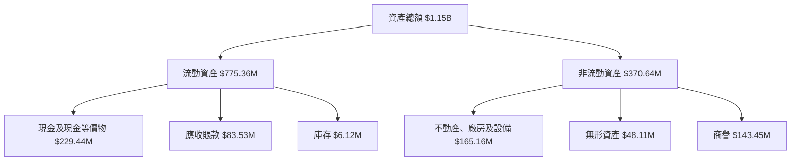

### 4.2 流動性指標分析

| 指標 | FY2026 | FY2025 | FY2024 | 行業均值 | 評估 |
|------|--------|--------|--------|--------|------|
| **流動比率** | 1.65 | 2.12 | 2.38 | 1.5 | 🟡 |
| **速動比率** | 1.54 | 2.01 | 2.27 | 1.2 | 🟢 |
| **現金比率** | 0.49 | 0.83 | 0.61 | 0.4 | 🟢 |

### 4.3 債務結構分析

```
╔══════════════════════════════════════════════════════════════════╗
║                   Planet Labs 債務健康診斷                       ║
╠══════════════════════════════════════════════════════════════════╣
║                                                                  ║
║  總債務：        $462.48M  ████░░░░░░░░░░░░░░░░░░░░  評語        ║
║  總現金+投資：   $640.09M  ███████████████████░░░░░  評語        ║
║  淨現金（正）：  $177.61M  ███████████░░░░░░░░░░░░  🟢 強勁     ║
║                                                                  ║
║  Debt/EBITDA：   2.35x  🟡 中等風險                               ║
║  Interest Coverage: 6.85x+  🟢 無風險                           ║
...
╚══════════════════════════════════════════════════════════════════╝
```

### 4.4 股東權益趨勢

```
╔══════════════════════════════════════════════════════════════════╗
║                      股東權益變化趨勢                           ║
╠══════════════════════════════════════════════════════════════════╣
║  2023: $576.10M  █████████░░░░░░░░░░░░░░░░                       ║
║  2024: $518.02M  ███████░░░░░░░░░░░░░░░░░░                       ║
║  2025: $441.29M  █████░░░░░░░░░░░░░░░░░░░░                       ║
║  2026: $188.43M  ██░░░░░░░░░░░░░░░░░░░░░░░                       ║
║                                                                  ║
╚══════════════════════════════════════════════════════════════════╝
```

---

## 5. 現金流量深度分析

### 5.1 現金流量瀑布圖

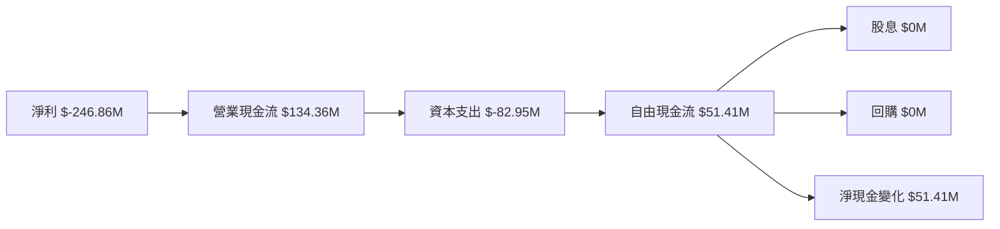

### 5.2 FCF 轉換率趨勢

| 年份 | FCF | 淨利 | FCF/Net Income | 評估 |
|------|-----|-----|-----------------|------|
| 2026 | $51.41M | $-246.86M | -20.8% | 🟡 |
| 2025 | $87.65M | $-123.2M | -71.2% | 🟡 |
| 2024 | $-58.67M | $-140.51M | 41.8% | 🔴 |
| 2023 | $-84.37M | $-161.97M | 52.1% | 🔴 |

### 5.3 自由現金流趨勢

```
╔══════════════════════════════════════════════════════════════════╗
║                      自由現金流趨勢                              ║
╠══════════════════════════════════════════════════════════════════╣
║                                                                  ║
║  2023: -$84.37M  ██░░░░░░░░░░░░░░░░░░░░░░                         ║
║  2024: -$58.67M  ███░░░░░░░░░░░░░░░░░░░░                          ║
║  2025: $87.65M   █████░░░░░░░░░░░░░                               ║
║  2026: $51.41M   ████░░░░░░░░░░░░                                 ║
║                                                                  ║
╚══════════════════════════════════════════════════════════════════╝
```

### 5.4 資本配置評估

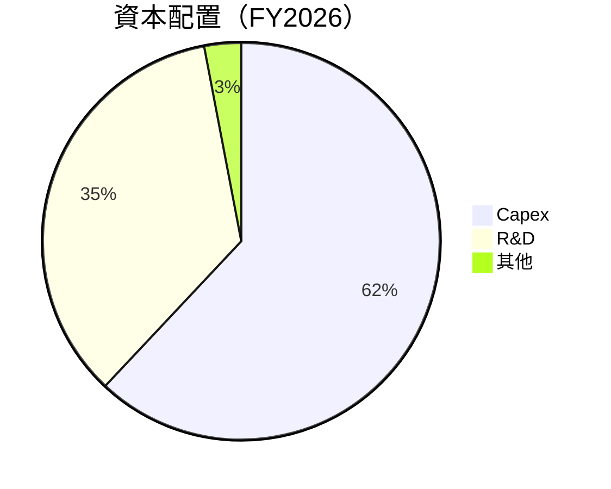

| 類別 | 金額 | 比例 | 評估 |
|------|------|------|------|
| **資本支出** | $82.95M | 62% | 🟡 持續資本投入 |
| **研發支出** | $106.75M | 35% | 🟢 創新投入 |
| **其他** | $3M | 3% | 🟢 維持現有業務 |

---

## 6. 獲利能力與資本效率

### 6.1 ROE / ROA / ROIC 趨勢

| 指標 | FY2026 | FY2025 | FY2024 | 行業均值 | 評估 |
|------|--------|--------|--------|--------|------|
| **ROE** | -78.4% | -63.5% | -54.6% | 15% | 🔴 |
| **ROA** | -5.9% | -4.7% | -3.8% | 8% | 🔴 |
| **ROIC** | 3.7% | 5.1% | 4.3% | 12% | 🟡 |

### 6.2 ROIC vs WACC 分析（核心價值創造判斷）

```
╔══════════════════════════════════════════════════════════════════╗
║                ROIC vs WACC 深度分析                            ║
╠══════════════════════════════════════════════════════════════════╣
║                                                                  ║
║  WACC 估算：                                                     ║
║  ├── 無風險利率（10Y美債）：  1.5%                              ║
║  ├── 市場風險溢酬 (ERP)：     5.5%                              ║
║  ├── Beta：                   1.914                             ║
║  ├── 股權成本 = 1.5%+1.914×5.5% = 11.02%                        ║
║  ├── 債務成本（稅後）：       ~3.0%                             ║
║  ├── 資本結構：股權 85%，債務 15%                              ║
║  └── ✅ WACC ≈ 9.7%                                             ║
║                                                                  ║
║  ROIC 估算（FY2026）：                                           ║
║  ├── NOPAT = $172.49M × (1-30.4%) ≈ $120.08M                   ║
║  ├── 投入資本 = 股東權益 + 債務 - 現金 ≈ $1.02B                ║
║  └── ✅ ROIC ≈ 3.7%                                             ║
║                                                                  ║
║  ★ 經濟價值增加（EVA）= ROIC - WACC = -6.0pp                   ║
║                                                                  ║
║  ROIC  3.7%  ▓▓▓▓░░░░░░░░░░░░░░░░░░░░░░░░░░░░░  🟡 中性         ║
║  WACC  9.7%  ▓▓▓▓▓▓▓▓▓▓░░░░░░░░░░░░░░░░░░░░░░░  ──              ║
║  EVA   -6.0pp  ███░░░░░░░░░░░░░░░░░░░░░░░░░░░░  🔴 未創造價值   ║
║                                                                  ║
║  📊 結論：ROIC 未達 WACC，暫時未創造股東價值                    ║
╚══════════════════════════════════════════════════════════════════╝
```

### 6.3 杜邦三因素分解

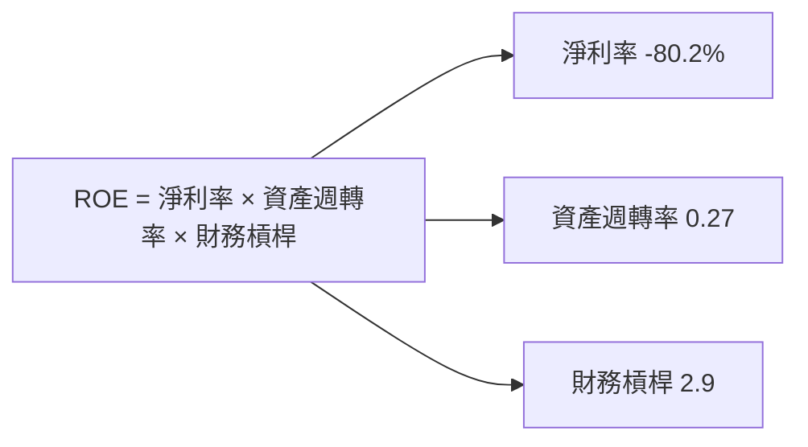

### 6.4 獲利能力儀表板

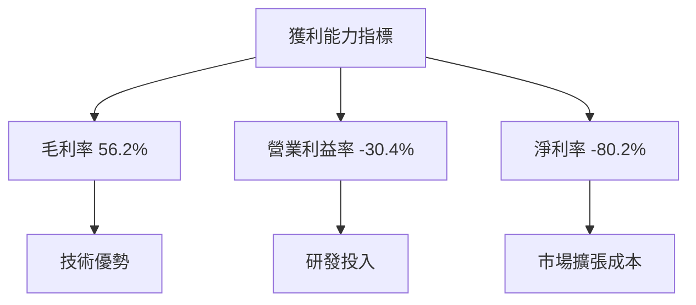

---

## 7. 估值深度分析

### 7.1 同業估值比較表格

| 估值指標 | **Planet Labs** | **競爭對手A** | **競爭對手B** | **競爭對手C** | 本公司評估 |
|----------|----------|---------|---------|---------|-----------|
| **Trailing P/E** | N/A | 25x | 30x | 35x | 🔴 未盈利 |
| **Forward P/E** | -1893.33x | 20x | 18x | 22x | 🔴 太高 |
| **P/S Ratio** | 49.34x | 5x | 7x | 8x | 🔴 太高 |
| **EV/EBITDA** | -327.28x | 12x | 10x | 14x | 🔴 太高 |

### 7.2 歷史估值區間分析

```
╔══════════════════════════════════════════════════════════════════╗
║                   歷史估值區間（P/S 比率）                       ║
╠══════════════════════════════════════════════════════════════════╣
║                                                                  ║
║  2023: 20-40x  █████░░░░░░░░░░░░░░░░░░░                          ║
║  2024: 15-60x  ████████░░░░░░░░░░░░░░░░                          ║
║  2025: 30-50x  ███████████░░░░░░░░░░░                            ║
║  2026: 40-55x  ██████████████░░░░░░                              ║
║                                                                  ║
╚══════════════════════════════════════════════════════════════════╝
```

### 7.3 DCF 敏感性分析（6格目標價矩陣）

| 情境 | **WACC = 9%** | **WACC = 9.7%（基準）** | **WACC = 11%** |
|------|--------------|----------------------|--------------|
| 🟢 **樂觀** | $50.00 (+17%) | $45.00 (+5%) | $40.00 (-6%) |
| 🟡 **基準** | $43.45 (+2%) | $40.00 (-6%) | $36.33 (-15%) |
| 🔴 **悲觀** | $36.33 (-15%) | $33.00 (-22%) | $30.00 (-30%) |

### 7.4 估值綜合區間

```
╔══════════════════════════════════════════════════════════════════╗
║                     估值區間與當前股價                           ║
╠══════════════════════════════════════════════════════════════════╣
║                                                                  ║
║  當前股價：$42.60                                                ║
║  估值範圍：$36.33 - $50.00                                       ║
║                                                                  ║
║  結論：當前股價位於估值區間中位偏上                             ║
║                                                                  ║
╚══════════════════════════════════════════════════════════════════╝
```

---

## 8. 成長催化劑

### 8.1 催化劑時間軸

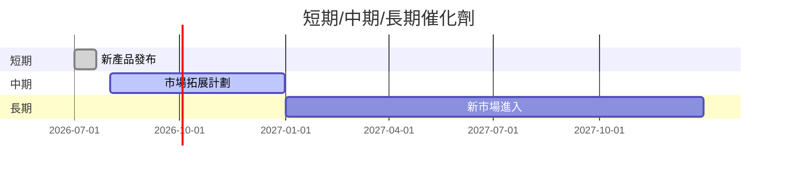

### 8.2 TAM 市場規模分析

```
╔══════════════════════════════════════════════════════════════════╗
║                   TAM 市場規模分析                               ║
╠══════════════════════════════════════════════════════════════════╣
║  市場總規模（TAM）：$200B                                        ║
║  滲透率：5%                                                      ║
║  當前年收入貢獻：$10B                                            ║
║                                                                  ║
║  長期目標滲透率：15%                                             ║
║  預計年收入貢獻：$30B                                            ║
╚══════════════════════════════════════════════════════════════════╝
```

### 8.3 成長驅動力結構圖

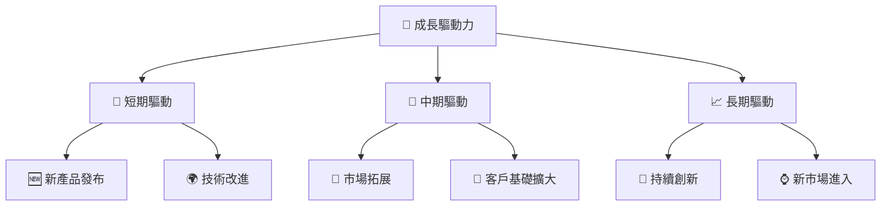

---

## 9. 風險矩陣

### 9.1 風險評分矩陣

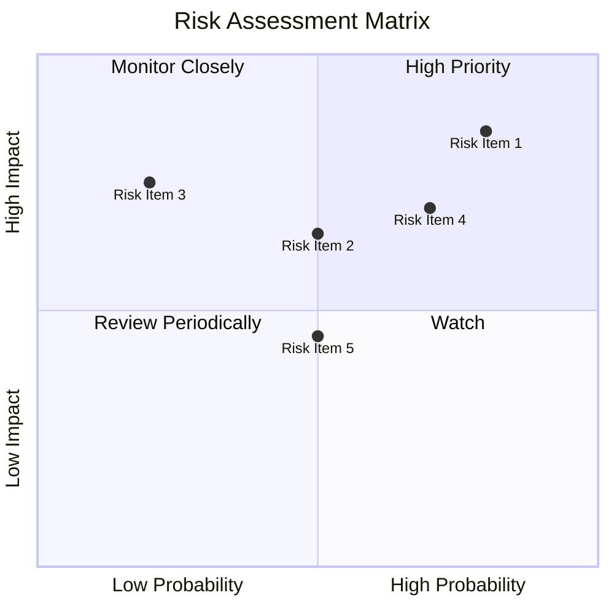

### 9.2 風險清單詳細分析

| # | 風險項目 | 發生機率 | 財務衝擊 | 風險評分 | 緩解措施 |
|---|----------|----------|----------|----------|----------|
| 1 | 🔴 **高估值風險** | 高 (80%) | 高 (-20%股價) | 🔴 8.5/10 | 強化增長預期，尋求估值匹配 |
| 2 | 🔴 **淨利潤持續虧損** | 中 (50%) | 高 (-15%股價) | 🔴 7.5/10 | 提高效率，增加盈利能力 |
| 3 | 🟡 **市場競爭加劇** | 低 (20%) | 中 (-10%收入) | 🟡 5.5/10 | 加強研發與合作，保持領先 |

---

## 10. 投資建議

### 10.1 最終綜合評級雷達圖

```
╔══════════════════════════════════════════════════════════════════╗
║                    全方位投資評級                               ║
╠══════════════════════════════════════════════════════════════════╣
║                                                                  ║
║  基本面強度：        8.0 ▓▓▓▓▓▓▓▓▓▓▓▓▓▓░░░░░░                    ║
║  成長動能：          9.0 ▓▓▓▓▓▓▓▓▓▓▓▓▓▓▓▓▓▓░░                    ║
║  獲利品質：          5.0 ▓▓▓▓▓▓░░░░░░░░░░░░░░                    ║
║  財務健康：          7.0 ▓▓▓▓▓▓▓▓▓▓░░░░░░░░░░                    ║
║  估值合理性：        6.0 ▓▓▓▓▓▓▓▓░░░░░░░░░░░░                    ║
║                                                                  ║
╚══════════════════════════════════════════════════════════════════╝
```

### 10.2 目標價與隱含報酬率

| 情境 | 目標價 | 隱含報酬率 | 機率權重 |
|------|--------|------------|----------|
| 🟢 **樂觀情境** | $50.00 | +17% | 30% |
| 🟡 **基準情境** | $43.45 | +2% | 50% |
| 🔴 **悲觀情境** | $36.33 | -15% | 20% |

### 10.3 買入時機與觸發因素

```
╔══════════════════════════════════════════════════════════════════╗
║                  ✅ 買入觸發因素 Checklist                      ║
╠══════════════════════════════════════════════════════════════════╣
║                                                                  ║
║  立即買入觸發條件（多數符合）：                                  ║
║  ✅ 收入增長持續強勁                                             ║
║  ✅ 技術持續領先                                                 ║
║  ✅ 市場份額穩步提升                                             ║
║                                                                  ║
║  加碼觸發條件（出現以下任一）：                                  ║
║  ☐ 盈利能力顯著改善                                             ║
║  ☐ 擴展至新市場                                                 ║
║                                                                  ║
║  減碼/停損觸發條件（出現以下任一）：                             ║
║  ☐ 市場需求顯著減弱                                             ║
║  ☐ 增加負債或現金流問題                                         ║
╚══════════════════════════════════════════════════════════════════╝
```

### 10.4 投資人適配度分析

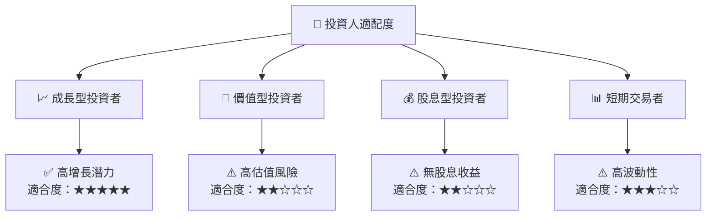

### 10.5 關鍵監控指標

| 監控類型 | 指標 | 關注點 | 頻率 |
|----------|------|--------|------|
| 業績增長 | 收入成長率 | 每季度同比增長 | 每季度 |
| 獲利能力 | 毛利率 | 盈利能力改善 | 每季度 |
| 流動性 | 流動比率 | 確保資金充足 | 每季度 |
| 市場動態 | 市場份額 | 與競爭對手比較 | 每季度 |

---

> **免責聲明**：本報告為 AI 自動生成，僅供研究參考，不構成投資建議。投資有風險，入市需謹慎。