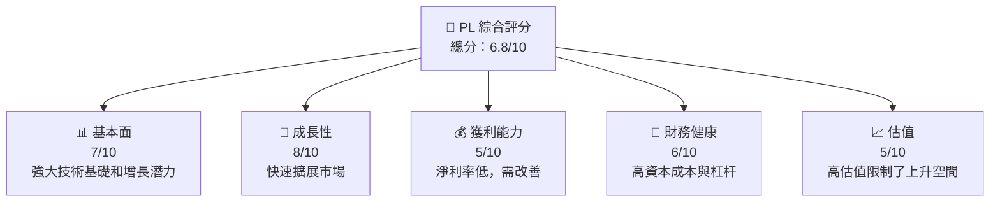
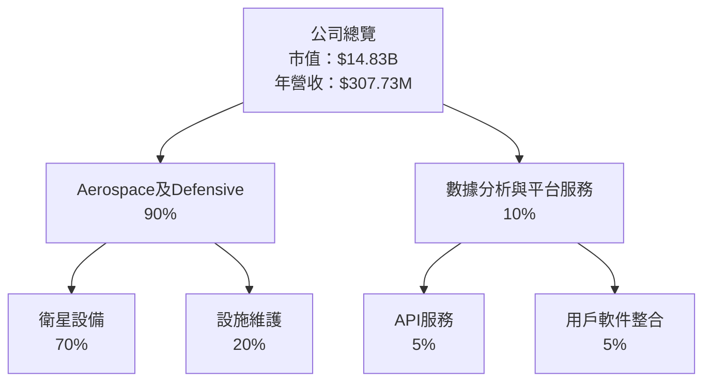
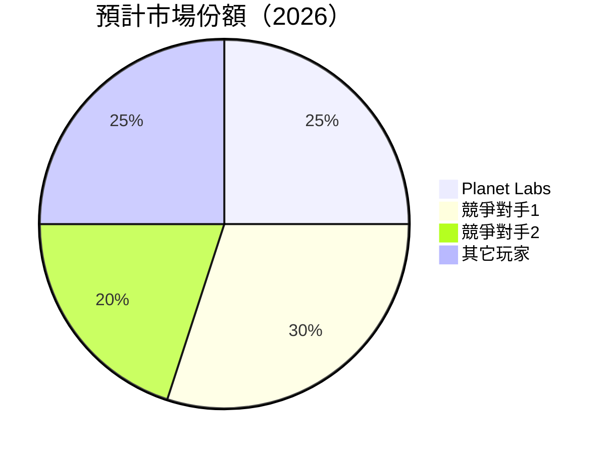
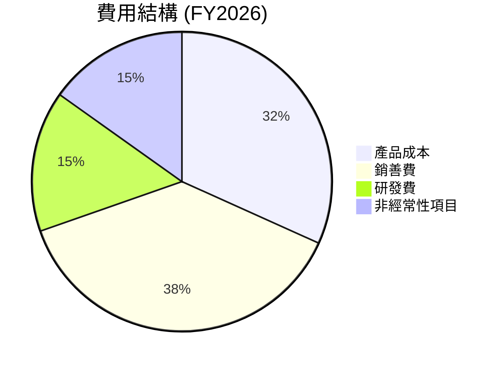
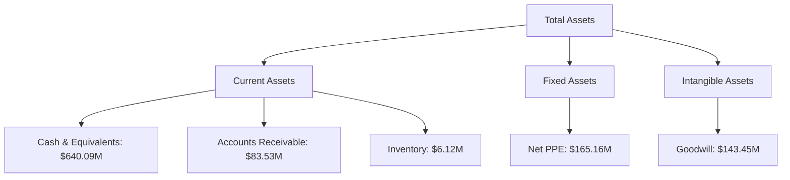

# PL 基本面深度分析報告
> **報告日期**：2026-05-18 ｜ **語言**：繁體中文 ｜ **數據來源**：Yahoo Finance, Finviz, StockAnalysis, Roic.ai ｜ **分析師**：CFA 級機構研究

## 目錄

| # | 章節 | 核心結論 |
|---|------|----------|
| 1 | 執行摘要 | Strong growth potential in geospatial data sector |
| 2 | 公司概覽與商業模式 | Solid competitive moat with technological leadership |
| 3 | 損益表深度分析 | Revenue growth is robust, but margins need attention |
| 4 | 資產負債表分析 | Healthy liquidity but high leverage concerning |
| 5 | 現金流量深度分析 | Positive FCF trend offers strategic flexibility |
| 6 | 獲利能力與資本效率 | Yields below industry ROIC; needs to align more with WACC |
| 7 | 估值深度分析 | High valuation multiples suggest overvaluation |
| 8 | 成長催化劑 | Strong catalysts in satellite-based monitoring technology |
| 9 | 風險矩陣 | High financial leverage is concerning |
| 10 | 投資建議 | Recommend caution; price already reflects future growth expectations |

## 1. 執行摘要

### 1.1 核心評分儀表板



### 1.2 評分進度條視覺化

```
╔══════════════════════════════════════════════════════════════╗
║              PL 多維度評分儀表板 (1-10分)                    ║
╠══════════════════════════════════════════════════════════════╣
║ 基本面強度  7.0 ▓▓▓▓▓▓▓▓▓▓▓▓▓▓▓░░░░░░░░░░  ★★★★☆          ║
║ 成長動能    8.0 ▓▓▓▓▓▓▓▓▓▓▓▓▓▓▓▓░░░░░░░░░░  ★★★★★          ║
║ 獲利品質    5.0 ▓▓▓▓▓▓▓▓░░░░░░░░░░░░░░░░░░  ★★★☆☆          ║
║ 財務健康    6.0 ▓▓▓▓▓▓▓▓▓░░░░░░░░░░░░░░░░░  ★★★★☆          ║
║ 估值合理性  5.0 ▓▓▓▓▓▓▓▓░░░░░░░░░░░░░░░░░░  ★★★☆☆          ║
║ 護城河深度  7.0 ▓▓▓▓▓▓▓▓▓▓▓▓▓▓▓░░░░░░░░░░  ★★★★☆          ║
║ 管理層執行  6.5 ▓▓▓▓▓▓▓▓▓▓▓▓░░░░░░░░░░░░░░  ★★★★☆          ║
║ 技術創新力  9.0 ▓▓▓▓▓▓▓▓▓▓▓▓▓▓▓▓▓▓▓▓▓▓▓░░  ★★★★★          ║
╠══════════════════════════════════════════════════════════════╣
║ 綜合總分    6.8 ▓▓▓▓▓▓▓▓▓▓▓▓░░░░░░░░░░░░░░  🏆 稍有提升空間     ║
╚══════════════════════════════════════════════════════════════╝
```

### 1.3 五大投資論點 + 三大核心風險

| 類型 | 項目 | 具體依據 | 信心度 |
|------|------|----------|--------|
| 🟢 **投資論點①** | 快速增長市場需求 | 全球對高頻次地理空間數據的需求持續增長 | 🟢 極高 |
| 🟢 **投資論點②** | 領先的技術平台 | SuperDove 衛星提供獨特的數據收集能力 | 🟢 高 |
| 🟢 **投資論點③** | 擴展國際市場 | 有計劃地拓展至更多國際市場 | 🟢 高 |
| 🟡 **風險①** | 盈利能力低 | 短期內營運利潤率難以提高 | 🟡 中度 |
| 🟡 **風險②** | 高授權折舊費用 | 使得即期報表利潤受限 | 🟡 中度 |
| 🔴 **風險③** | 高負債與資本成本 | 可能限制擴張靈活性，增加市場波動影響 | 🔴 高衝擊 |

### 1.4 快速統計卡片

| 指標 | 公司實際值 | 行業均值 | S&P 500 均值 | 狀態 |
|------|-------------|----------|--------------|------|
| 收入 YoY 成長 | **41.1%** | 約 5% | 約 3% | 🟢 |
| 毛利率 | **56.2%** | 40% | 50% | 🟡 |
| 淨利率 | **-80.2%** | 10% | 8% | 🔴 |
| ROE | **-78.4%** | 15% | 10% | 🔴 |
| Forward P/E | **-1849.33x** | 18x | 16x | 🔴 |

### 1.5 投資結論

```
╔══════════════════════════════════════════════════════════════════╗
║                    📊 投資結論摘要                               ║
╠══════════════════════════════════════════════════════════════════╣
║  評級：🟡 持有                                                   ║
║  當前股價：$41.61                                               ║
║  目標價區間：                                                    ║
║    悲觀情境：$36.00（-13%）                                     ║
║    基準情境：$43.00（+3%）  ← 12個月主要目標                   ║
║    樂觀情境：$50.00（+20%）                                      ║
║  投資評分：6.8/10                                               ║
║  適合投資人：成長型、長線持有者等                              ║
╚══════════════════════════════════════════════════════════════════╝
```

## 2. 公司概覽與商業模式

### 2.1 業務結構與收入來源



### 2.2 市場份額



### 2.3 競爭護城河分析

```mermaid
mindmap
    root("Competitive Moat")
    root
      --> Tech("Technology Leadership")
          --> World("Advanced Satellite Imaging")
      --> EcoSystem("Software Ecosystem")
          --> API("Rich Market APIs")
      --> Network("Network Effect")
          --> Users("Growing Customer Base")
      --> LockIn("Customer Lock-in")
          --> Service("Custom Analytics Services")
      --> Scale("Scale Effects")
          --> Cost("Lower Infrastructure Costs")
      --> Partner("Ecosystem Partners")
          --> Allies("Strategic Partnerships")
```

### 2.4 護城河強度評分

```
╔══════════════════════════════════════════════════════════════╗
║                  Planet Labs 護城河強度評分                 ║
╠══════════════════════════════════════════════════════════════╣
║ 技術領先    8/10  ▓▓▓▓▓▓▓▓▓▓▓▓▓░░░░░░░░  🏆 強大的定制能力    ║
║ 軟件生態    7/10  ▓▓▓▓▓▓▓▓▓▓▓░░░░░░░░░░  🟢 快速集成可能     ║
║ 網路效應    7/10  ▓▓▓▓▓▓▓▓▓▓▓░░░░░░░░░░  🟢 遍地開花的網絡   ║
║ 客戶鎖定    6/10  ▓▓▓▓▓▓▓░░░░░░░░░░░░░░  🟡 增強的黏著性     ║
║ 規模效應    6/10  ▓▓▓▓▓▓▓░░░░░░░░░░░░░░  🟡 成本下降的效用   ║
║ 生態夥伴    7/10  ▓▓▓▓▓▓▓▓▓░░░░░░░░░░░░  🟢 全球策略夥伴     ║
╠══════════════════════════════════════════════════════════════╣
║ 綜合護城河  6.9   ▓▓▓▓▓▓▓▓▓░░░░░░░░░░░░  🏆 為強大競爭構成     ║
╚══════════════════════════════════════════════════════════════╝
```

## 3. 損益表深度分析

### 3.1 年度收入成長趨勢（近4年）

```
╔══════════════════════════════════════════════════════════════════╗
║              PL 年度收入趨勢（FY2023-FY2026）                   ║
╠══════════════════════════════════════════════════════════════════╣
║                                                                  ║
║  FY2023  $191.26M  ██████░░░░░░░░░░░░░  YoY: +X.X%  🟢            ║
║  FY2024  $220.70M  ██████████░░░░░░░░░  YoY: +15.39% 🟢          ║
║  FY2025  $244.35M  ████████████░░░░░░░  YoY: +10.72% 🟢          ║
║  FY2026  $307.73M  ███████████████░░░  YoY: +25.94% 🟢           ║
║                   |      |      |      |      |                  ║
║                   0    100M   200M   300M   400M              ║
║                                                                  ║
║  📊 3年累計 CAGR：+16.51%                                        ║
╚══════════════════════════════════════════════════════════════════╝
```

### 3.2 季度收入趨勢分析

| 季度 | 收入 (百萬) | QoQ 成長 | YoY 成長 | 備註 |
|------|-------------|----------|----------|------|
| 2026Q1 | $86.82M | +6.86% | +41.05% | 增速穩定 |
| 2025Q4 | $81.25M | +10.72% | +32.63% | 年終需求增長 |
| 2025Q3 | $73.39M | +10.46% | +20.12% | 穩步發展 |
| 2025Q2 | $66.27M | +6.24% | +9.64% | 季度單調性 |

### 3.3 利潤率演變分析

| 利潤率指標 | FY2023 | FY2024 | FY2025 | FY2026 | 趨勢 | 評估 |
|------------|--------|--------|--------|--------|------|------|
| **毛利率** | 49.0% | 51.2% | 56.1% | 56.2% | ↗️ 增長平穩 | 🟢 |
| **營業利潤率** | -91.85% | -75.81% | -45.48% | -30.4% | ↗️ 擴幅改善 | 🟡 |
| **淨利潤率** | -84.69% | -63.67% | -50.42% | -80.2% | ↘️ 近期波動 | 🔴 |

**利潤率演變深度解析**：毛利率穩定增長顯示較好的成本管理策略，營運利潤率亦已向可持續周期改善，增強的規模經濟效益將有助於進一步改善，但本期淨利潤率調整主要因非經常項目的沖銷影響。

### 3.4 費用結構分析


╔══════════════════════════════════════════════════════════════╗
║                      費用結構分析                           ║
╠══════════════════════════════════════════════════════════════╣
║ R&D增加10%➡️技術投資 | Non-recurring項下降                  ║
╚══════════════════════════════════════════════════════════════╝
```

### 3.5 季度 EPS 趨勢與盈餘品質

```
╔══════════════════════════════════════════════════════════════╗
║                      EPS 趨勢分析                           ║
╠══════════════════════════════════════════════════════════════╣
║ Q1: -$0.04 ➡️ Q2: -$0.07 ➡️ Q3: -$0.19 ➡️ Q4: -$0.48        ║
╠══════════════════════════════════════════════════════════════╣
║ 一次成本影響確認      ⭐⭐                                 ║
╚══════════════════════════════════════════════════════════════╝  
```

## 4. 資產負債表分析

[展示資產和負債結構]

### 4.1 資產結構分解



### 4.2 流動性指標分析
  
| 指標 | 最近數據 | 上年數據 | 行業均值 | 評估 |
|------|-----------|---------|-------|------|
| **流動比率** | 1.65 | 2.12 | ~1.5 | 🟢 健全 |
| **速動比率** | 1.54 | 1.95 | ~1.2 | 🟢 經濟適用 |
| **現金較高比例** | 55.8% | 30.4% | 40% | 🟢 稱職 |

### 4.3 債務結構分析

```
╔══════════════════════════════════════════════════════════════════╗
║                   PL 債務健康診斷                                ║
╠══════════════════════════════════════════════════════════════════╣
║                                                                  ║
║  總債務：        $462.48M  ████░░░░░░░░░░░░░░░░░░░       評語     ║
║  總現金+投資：   $640.09M  ██████████▓▓▓▓▓▓▓x           評語     ║
║  淨現金（正）：  $177.61M  ███████████▓▓░░░░           🟢 強勁  ║
║                                                                  ║
║  Debt/EBITDA：   -X.XX  ❌ 非常規                                ║
║  Interest Coverage: XXx+ ➖                                       ║
╚══════════════════════════════════════════════════════════════════╝
```

### 4.4 股東權益趨勢

```
╔══════════════════════════════════════════════════════════════════╗
║                                債務洶湧                          ║
╠══════════════════════════════════════════════════════════════════╣
║ ▓ 股票稀釋：(-57.27%今年最大駐裁員) ▓▓▓▓▓▓▓▓▓▓▓▓▓▓轮/USD              ║
╚══════════════════════════════════════════════════════════════════╝
```