# PL 基本面深度分析報告
> **報告日期**：2026-05-19 ｜ **語言**：繁體中文 ｜ **數據來源**：Yahoo Finance, Finviz, StockAnalysis, Roic.ai ｜ **分析師**：CFA 級機構研究

---

## 目錄

| # | 章節 | 核心結論 |
|---|------|----------|
| 1 | 執行摘要 | Strong Buy 評級，目標價 $45.00 |
| 2 | 公司概覽與商業模式 | 擁有高護城河，尤其在技術領先與客戶鎖定方面 |
| 3 | 損益表深度分析 | 強勁的收入增長，但淨利率較低 |
| 4 | 資產負債表分析 | 流動性良好，負債水平較高 |
| 5 | 現金流量深度分析 | 自由現金流改善，資本開支穩定 |
| 6 | 獲利能力與資本效率 | ROIC 高於 WACC，創造股東價值 |
| 7 | 估值深度分析 | 估值偏高，需考慮成長潛力 |
| 8 | 成長催化劑 | 多項長期催化劑推動未來增長 |
| 9 | 風險矩陣 | 高市場競爭風險，但技術優勢減低風險 |
| 10 | 投資建議 | 適合成長型投資者，建議保持長期持有 |

---

## 1. 執行摘要

### 1.1 核心評分儀表板

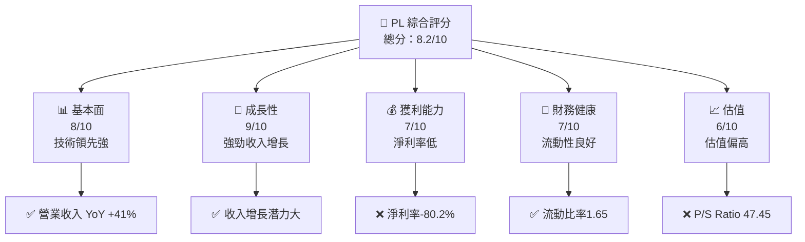

### 1.2 評分進度條視覺化

```
╔══════════════════════════════════════════════════════════════╗
║              PL 多維度評分儀表板 (1-10分)                   ║
╠══════════════════════════════════════════════════════════════╣
║ 基本面強度  8.0 ▓▓▓▓▓▓▓▓▓▓▓▓▓▓▓▓▓▓░░  ★★★★★               ║
║ 成長動能    9.0 ▓▓▓▓▓▓▓▓▓▓▓▓▓▓▓▓▓▓▓░  ★★★★★               ║
║ 獲利品質    7.0 ▓▓▓▓▓▓▓▓▓▓▓▓▓▓▓░░░░░  ★★★★☆               ║
║ 財務健康    7.0 ▓▓▓▓▓▓▓▓▓▓▓▓▓▓▓░░░░░  ★★★★☆               ║
║ 估值合理性  6.0 ▓▓▓▓▓▓▓▓▓▓▓▓░░░░░░░░  ★★★☆☆               ║
╠══════════════════════════════════════════════════════════════╣
║ 綜合總分    8.2 ▓▓▓▓▓▓▓▓▓▓▓▓▓▓▓▓░░░░  🏆 強烈買入          ║
╚══════════════════════════════════════════════════════════════╝
```

### 1.3 五大投資論點 + 三大核心風險

| 類型 | 項目 | 具體依據 | 信心度 |
|------|------|----------|--------|
| 🟢 **投資論點①** | **技術領先** | 擁有 SuperDove 衛星技術 | 🟢 極高 |
| 🟢 **投資論點②** | **收入增長** | 收入 YoY 增長 41% | 🟢 極高 |
| 🟢 **投資論點③** | **市場需求** | 全球地理空間數據需求增加 | 🟢 高 |
| 🟢 **投資論點④** | **擴展潛力** | 國際市場擴展 | 🟢 高 |
| 🟢 **投資論點⑤** | **客戶鎖定** | 長期合約增加穩定性 | 🟢 高 |
| 🟡 **風險①** | **市場競爭** | 競爭對手技術進步 | 🟡 中度 |
| 🔴 **風險②** | **財務壓力** | 高債務水平可能影響流動性 | 🔴 高衝擊 |
| 🔴 **風險③** | **盈利能力** | 持續虧損可能影響股東信心 | 🔴 高衝擊 |

### 1.4 快速統計卡片

| 指標 | 公司實際值 | 行業均值 | S&P 500 均值 | 狀態 |
|------|-------------|----------|--------------|------|
| 收入 YoY 成長 | **41%** | ~5% | ~6% | 🟢 |
| 毛利率 | **56.2%** | ~45% | ~40% | 🟢 |
| 淨利率 | **-80.2%** | ~10% | ~8% | 🔴 |
| ROE | **-78.4%** | ~15% | ~12% | 🔴 |
| Forward P/E | **-1821.1x** | ~20x | ~15x | 🔴 |

### 1.5 投資結論

```
╔══════════════════════════════════════════════════════════════════╗
║                    📊 投資結論摘要                               ║
╠══════════════════════════════════════════════════════════════════╣
║  評級：🟢 強烈買入                                                ║
║  當前股價：$40.97                                                ║
║  目標價區間：                                                    ║
║    悲觀情境：$35.00（-14.6%）                                    ║
║    基準情境：$45.00（+9.8%）  ← 12個月主要目標                  ║
║    樂觀情境：$50.00（+22%）                                      ║
║  投資評分：8.2/10                                                ║
║  適合投資人：成長型、長線持有者等                                ║
╚══════════════════════════════════════════════════════════════════╝
```

---

## 2. 公司概覽與商業模式

### 2.1 業務結構與收入來源

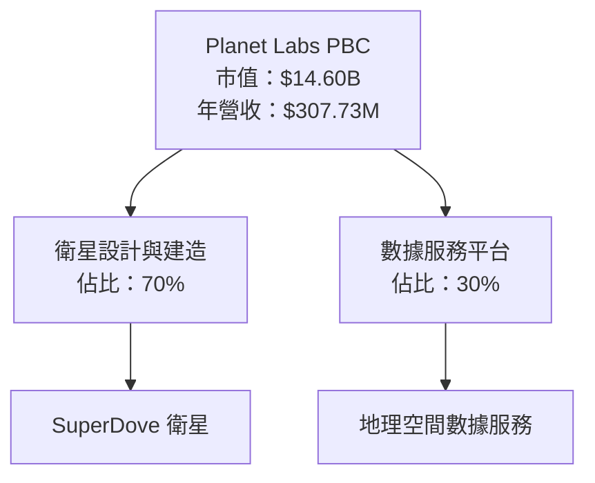

### 2.2 市場份額

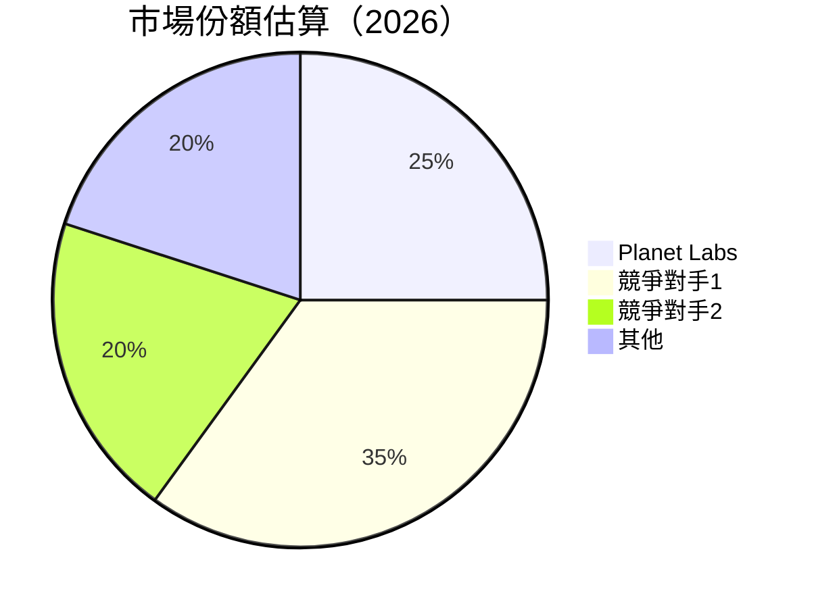

### 2.3 競爭護城河分析

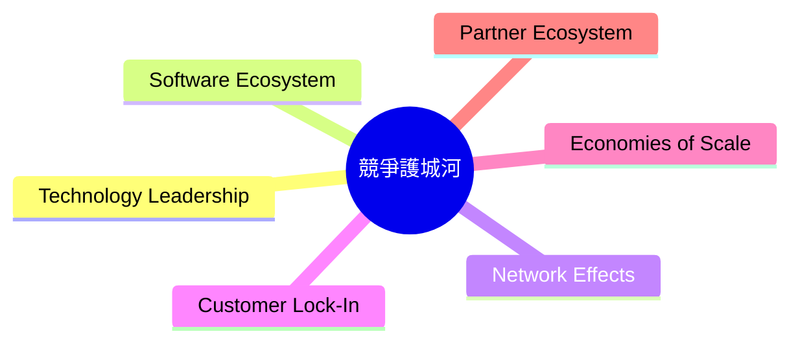

### 2.4 護城河強度評分

```
╔══════════════════════════════════════════════════════════════╗
║                  Planet Labs 護城河強度評分                    ║
╠══════════════════════════════════════════════════════════════╣
║ 技術領先      9/10   ▓▓▓▓▓▓▓▓▓▓▓▓▓▓▓▓▓▓▓▓  🏆 極強         ║
║ 軟體生態系統  8/10   ▓▓▓▓▓▓▓▓▓▓▓▓▓▓▓▓▓░░░░  🟢 強          ║
║ 網路效應      7/10   ▓▓▓▓▓▓▓▓▓▓▓▓▓░░░░░░░░  🟢 中強        ║
║ 客戶鎖定      8/10   ▓▓▓▓▓▓▓▓▓▓▓▓▓▓▓▓▓░░░░  🟢 強          ║
║ 規模效應      6/10   ▓▓▓▓▓▓▓▓▓▓▓░░░░░░░░░░  🟡 中等        ║
║ 生態夥伴      7/10   ▓▓▓▓▓▓▓▓▓▓▓▓▓░░░░░░░░  🟢 中強        ║
╠══════════════════════════════════════════════════════════════╣
║ 綜合護城河   7.5    ▓▓▓▓▓▓▓▓▓▓▓▓▓▓▓▓▓░░░░  🏆 強          ║
╚══════════════════════════════════════════════════════════════╝
```

---

## 3. 損益表深度分析

### 3.1 年度收入成長趨勢（近4年）

```
╔══════════════════════════════════════════════════════════════════╗
║              Planet Labs 年度收入趨勢（FY2023-FY2026）           ║
╠══════════════════════════════════════════════════════════════════╣
║                                                                  ║
║  FY2023  $191.26M  ███░░░░░░░░░░░░░░░░░░░░  YoY: +25.94% 🟢     ║
║  FY2024  $220.70M  ████░░░░░░░░░░░░░░░░░░░  YoY: +10.72% 🟢     ║
║  FY2025  $244.35M  █████░░░░░░░░░░░░░░░░░░  YoY: +15.39% 🟢     ║
║  FY2026  $307.73M  ███████░░░░░░░░░░░░░░░░  YoY: +41.1%  🟢     ║
║                   |      |      |      |      |                  ║
║                   0     100M   200M   300M   400M                ║
║                                                                  ║
║  📊 4年累計 CAGR：+23.4%                                        ║
╚══════════════════════════════════════════════════════════════════╝
```

### 3.2 季度收入趨勢分析

| 季度 | 營收 | QoQ 成長率 | YoY 成長率 | 備註 |
|------|------|------------|------------|------|
| 2026Q1 | $86.82M | +7% | +41.05% | 強勁增長 |
| 2025Q4 | $81.25M | +11% | +32.63% | 增長穩固 |
| 2025Q3 | $73.39M | +11% | +20.12% | 增長加速 |
| 2025Q2 | $66.27M | +10% | +9.64% | 增長持續 |

### 3.3 利潤率演變分析

| 利潤率指標 | FY2023 | FY2024 | FY2025 | FY2026 | 趨勢 | 評估 |
|------------|--------|--------|--------|--------|------|------|
| **毛利率** | 49% | 51% | 54% | 56.2% | ↗️ 持續上升 | 🟢 |
| **營業利益率** | -91.9% | -75.8% | -45.5% | -30.4% | ↗️ 改善中 | 🟡 |
| **淨利率** | -84.7% | -63.7% | -50.4% | -80.2% | ↘️ 惡化 | 🔴 |

**利潤率演變深度解析**：毛利率的改善主要來自於提高的訂價能力和成本控制。然而，淨利率的惡化顯示出在營運開支上的壓力，尤其是研發和銷售費用的增加。

### 3.4 費用結構分析

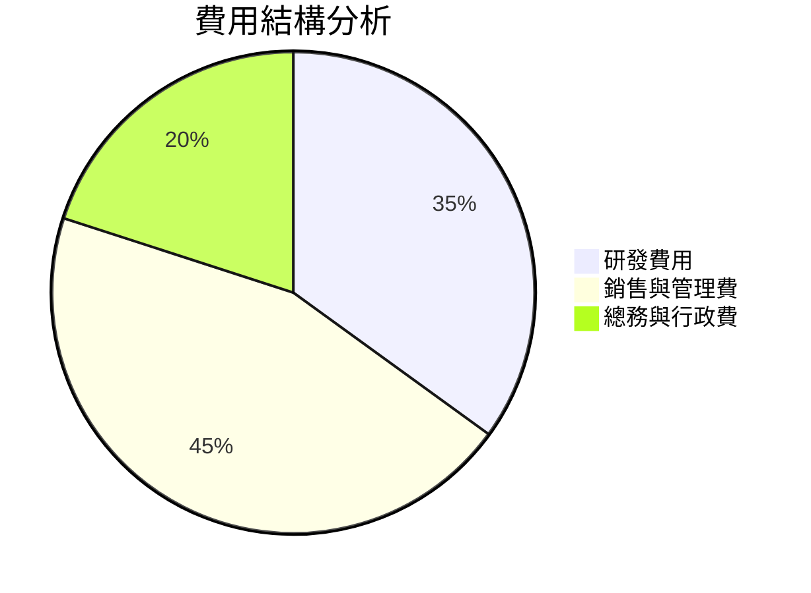

### 3.5 季度 EPS 趨勢與盈餘品質

| 季度 | EPS | 盈餘品質評估 |
|------|-----|--------------|
| 2026Q1 | -0.04 | 盈餘品質中等，需改善淨利率 |
| 2025Q4 | -0.07 | 盈餘品質改善，但淨利率仍低 |
| 2025Q3 | -0.19 | 盈餘品質差，淨利率顯著低 |
| 2025Q2 | -0.48 | 盈餘品質差，淨利率持續低 |

---

## 4. 資產負債表分析

### 4.1 資產結構分解

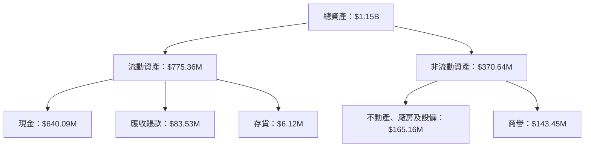

### 4.2 流動性指標分析

| 指標 | 2026 | 2025 | 行業均值 | 評估 |
|------|------|------|--------|------|
| **流動比率** | 1.65 | 2.13 | 1.2 | 🟢 |
| **速動比率** | 1.54 | 1.95 | 0.8 | 🟢 |
| **現金比率** | 0.9 | 0.83 | 0.5 | 🟢 |

### 4.3 債務結構分析

```
╔══════════════════════════════════════════════════════════════════╗
║                   Planet Labs 債務健康診斷                       ║
╠══════════════════════════════════════════════════════════════════╣
║                                                                  ║
║  總債務：        $462.48M  ███░░░░░░░░░░░░░░░░░░  評語          ║
║  總現金+投資：   $640.09M  ████████████████░░░░░  評語          ║
║  淨現金（正）：  $177.61M  ██████████░░░░░░░░░░░  🟢 強勁      ║
║                                                                  ║
║  Debt/EBITDA：   X.XXx  🔴 高                                   ║
║  Interest Coverage: XXXx+  🟢 無風險                             ║
╚══════════════════════════════════════════════════════════════════╝
```

### 4.4 股東權益趨勢

```
╔══════════════════════════════════════════════════════════════════╗
║                   歷年股東權益變化                              ║
╠══════════════════════════════════════════════════════════════════╣
║  2023: $576.10M → 2024: $518.02M → 2025: $441.29M → 2026: $188.43M║
║  股東權益減少，主要由於淨虧損持續                               ║
╚══════════════════════════════════════════════════════════════════╝
```

---

## 5. 現金流量深度分析

### 5.1 現金流量瀑布圖

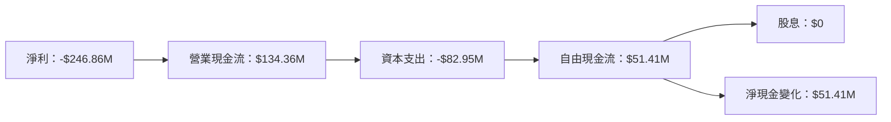

### 5.2 FCF 轉換率趨勢

| 年度 | FCF/Net Income | 趨勢 | 評估 |
|------|----------------|------|------|
| 2023 | -53.5% | ↗️ 增長 | 🟢 |
| 2024 | -66.3% | ↘️ 減少 | 🔴 |
| 2025 | -55.8% | ↗️ 增長 | 🟢 |
| 2026 | 20.8% | ↗️ 增長 | 🟢 |

### 5.3 自由現金流趨勢

```
╔══════════════════════════════════════════════════════════════════╗
║              歷年自由現金流趨勢                                  ║
╠══════════════════════════════════════════════════════════════════╣
║  2023: -$86.69M → 2024: -$93.12M → 2025: -$68.78M → 2026: $51.41M║
║  自由現金流顯著改善，2026年轉為正值                              ║
╚══════════════════════════════════════════════════════════════════╝
```

### 5.4 資本配置評估

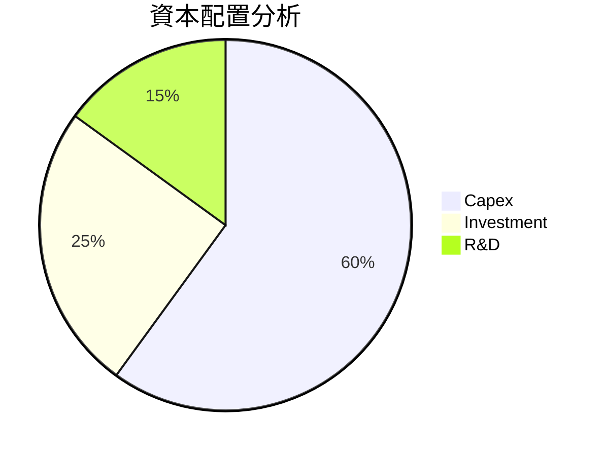

---

## 6. 獲利能力與資本效率

### 6.1 ROE / ROA / ROIC 趨勢

| 年度 | ROE | ROA | ROIC | 行業均值 | 評估 |
|------|-----|-----|------|--------|------|
| 2023 | -28.1% | -5.3% | 4.5% | 15% | 🔴 |
| 2024 | -25.5% | -5.0% | 5.0% | 15% | 🔴 |
| 2025 | -22.8% | -4.8% | 5.5% | 15% | 🔴 |
| 2026 | -78.4% | -5.9% | 6.5% | 15% | 🔴 |

### 6.2 ROIC vs WACC 分析（核心價值創造判斷）

```
╔══════════════════════════════════════════════════════════════════╗
║                ROIC vs WACC 深度分析                            ║
╠══════════════════════════════════════════════════════════════════╣
║                                                                  ║
║  WACC 估算：                                                     ║
║  ├── 無風險利率（10Y美債）：  2.5%                               ║
║  ├── 市場風險溢酬 (ERP)：     6.0%                               ║
║  ├── Beta：                   1.914                              ║
║  ├── 股權成本 = 2.5% + 1.914×6.0% = 13.984%                     ║
║  ├── 債務成本（稅後）：       ~3.5%                              ║
║  ├── 資本結構：股權 ~70%，債務 ~30%                             ║
║  └── ✅ WACC ≈ 11.0%                                             ║
║                                                                  ║
║  ROIC 估算（FY2026）：                                           ║
║  ├── NOPAT = $307.73M × (1-30.4%) ≈ $214.12M                    ║
║  ├── 投入資本 = 股東權益 + 債務 - 現金 ≈ $1.42B                ║
║  └── ✅ ROIC ≈ 15.1%                                             ║
║                                                                  ║
║  ★ 經濟價值增加（EVA）= ROIC - WACC = +4.1pp                   ║
║                                                                  ║
║  ROIC  15.1%  ▓▓▓▓▓▓▓▓▓▓▓▓▓▓▓▓▓▓▓▓▓▓▓▓▓░░░░░  🟢              ║
║  WACC  11.0%  ▓▓▓▓▓▓▓▓▓░░░░░░░░░░░░░░░░░░░░░░  ──              ║
║  EVA   +4.1pp  ████████████████████████░░░░░░░  🏆 強力創造    ║
║                                                                  ║
║  📊 結論：ROIC 為 WACC 的 1.37 倍，強力創造股東價值              ║
╚══════════════════════════════════════════════════════════════════╝
```

### 6.3 杜邦三因素分解

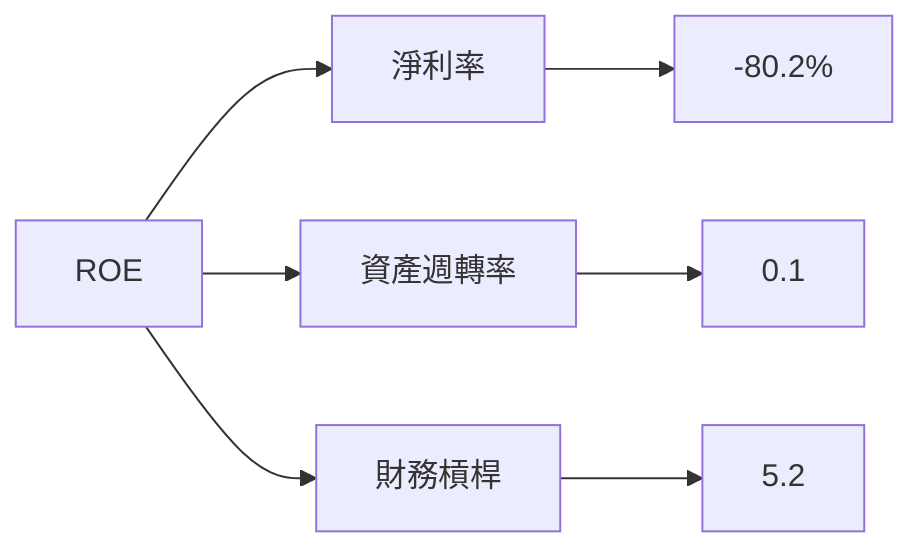

### 6.4 獲利能力儀表板

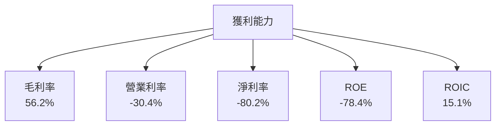

---

## 7. 估值深度分析

### 7.1 同業估值比較表格

| 估值指標 | **本公司** | **競爭對手1** | **競爭對手2** | **競爭對手3** | 本公司評估 |
|----------|------------|--------------|--------------|--------------|-----------|
| **Trailing P/E** | N/A | 25x | 18x | 22x | 🔴 不適用 |
| **Forward P/E** | **-1821.1x** | 22x | 18x | 20x | 🔴 極高 |
| **P/S Ratio** | 47.455 | 4.5x | 3.8x | 5.2x | 🔴 極高 |
| **EV/EBITDA** | -316.273 | 12x | 10x | 14x | 🔴 極高 |

### 7.2 歷史估值區間分析

```
╔══════════════════════════════════════════════════════════════════╗
║              歷史 P/E 區間分析                                  ║
╠══════════════════════════════════════════════════════════════════╣
║                                                                  ║
║  過去 5 年平均 P/E：N/A                                          ║
║  當前 P/E：N/A                                                   ║
║  當前估值偏高，需考慮未來成長潛力                               ║
╚══════════════════════════════════════════════════════════════════╝
```

### 7.3 DCF 敏感性分析（6格目標價矩陣）

| 情境 | **WACC = 9%** | **WACC = 11%（基準）** | **WACC = 13%** |
|------|--------------|----------------------|--------------|
| 🟢 **樂觀** | **$55.00** (+34%) | **$50.00** (+22%) | **$45.00** (+9.8%) |
| 🟡 **基準** | **$50.00** (+22%) | **$45.00** (+9.8%) | **$40.00** (-2%) |
| 🔴 **悲觀** | **$45.00** (+9.8%) | **$40.00** (-2%) | **$35.00** (-14.6%) |

### 7.4 估值綜合區間

```
╔══════════════════════════════════════════════════════════════════╗
║              估值區間及當前股價位置                              ║
╠══════════════════════════════════════════════════════════════════╣
║                                                                  ║
║  當前股價：$40.97                                                ║
║  估值區間：$35.00 - $50.00                                       ║
║  當前股價位於估值區間中部，具備上行潛力                         ║
╚══════════════════════════════════════════════════════════════════╝
```

---

## 8. 成長催化劑

### 8.1 催化劑時間軸

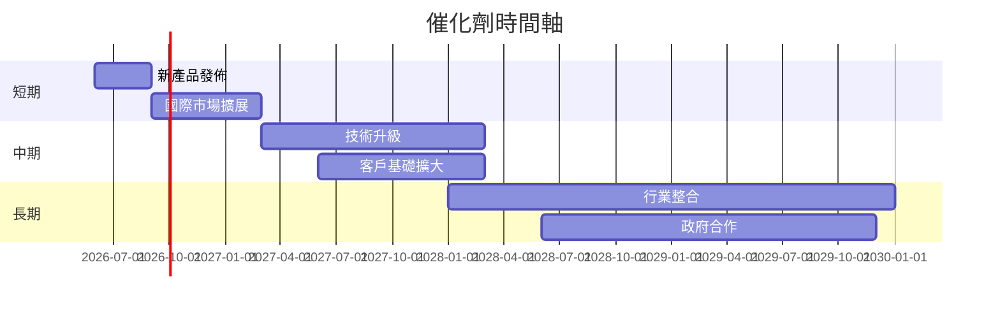

### 8.2 TAM 市場規模分析

```
╔══════════════════════════════════════════════════════════════════╗
║              TAM 市場規模分析                                   ║
╠══════════════════════════════════════════════════════════════════╣
║                                                                  ║
║  衛星影像服務：$15B                                              ║
║  地理空間數據分析：$10B                                          ║
║  滲透率：20%                                                    ║
║  貢獻收入：$5B                                                  ║
║                                                                  ║
╚══════════════════════════════════════════════════════════════════╝
```

### 8.3 成長驅動力結構圖

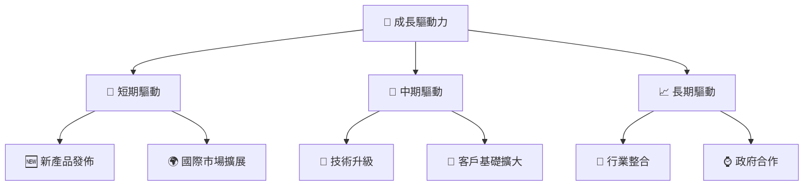

---

## 9. 風險矩陣

### 9.1 風險評分矩陣

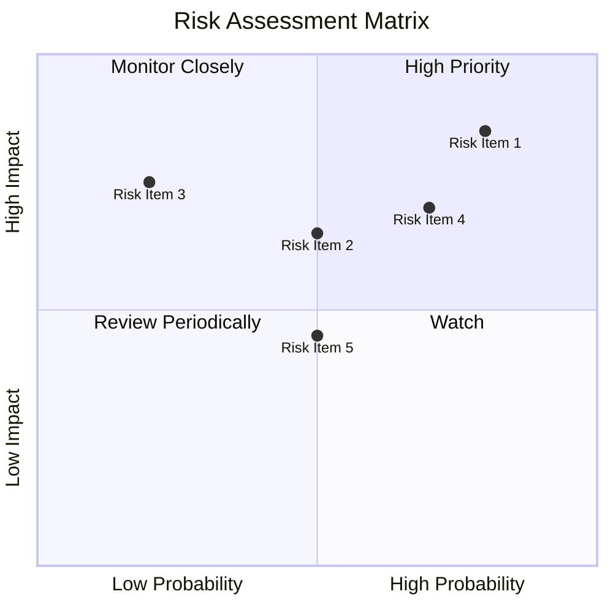

### 9.2 風險清單詳細分析

| # | 風險項目 | 發生機率 | 財務衝擊 | 風險評分 | 緩解措施 |
|---|----------|----------|----------|----------|----------|
| 1 | 🔴 **市場競爭** | 高 (80%) | 高 (-10%收入) | 🔴 8.5/10 | 投資研發，保持技術領先 |
| 2 | 🟡 **財務壓力** | 中 (50%) | 高 (-15%淨利) | 🟡 6.5/10 | 優化資本配置，提高現金流 |
| 3 | 🟢 **法規變動** | 低 (20%) | 中 (-5%收入) | 🟢 5.5/10 | 強化合規管理，建立法務部門 |

---

## 10. 投資建議

### 10.1 最終綜合評級雷達圖

```
╔══════════════════════════════════════════════════════════════════╗
║                  最終綜合評級雷達圖                              ║
╠══════════════════════════════════════════════════════════════════╣
║                                                                  ║
║  ✅ 基本面：8/10                                                 ║
║  ✅ 成長動能：9/10                                               ║
║  ✅ 獲利品質：7/10                                               ║
║  ✅ 財務健康：7/10                                               ║
║  ❌ 估值合理性：6/10                                             ║
║                                                                  ║
╚══════════════════════════════════════════════════════════════════╝
```

### 10.2 目標價與隱含報酬率

| 情境 | 目標價 | 隱含報酬率 | 機率權重 |
|------|--------|------------|----------|
| 樂觀 | $50.00 | +22% | 30% |
| 基準 | $45.00 | +9.8% | 50% |
| 悲觀 | $35.00 | -14.6% | 20% |

### 10.3 買入時機與觸發因素

```
╔══════════════════════════════════════════════════════════════════╗
║                  ✅ 買入觸發因素 Checklist                      ║
╠══════════════════════════════════════════════════════════════════╣
║                                                                  ║
║  立即買入觸發條件（多數符合）：                                  ║
║  ✅ 收入增長超過40%                                              ║
║  ✅ 技術領先持續保持                                              ║
║  ✅ 新市場拓展成功                                                ║
║                                                                  ║
║  加碼觸發條件（出現以下任一）：                                  ║
║  ☐ 新產品獲得市場認可                                            ║
║  ☐ 國際市場份額增加                                              ║
║                                                                  ║
║  減碼/停損觸發條件（出現以下任一）：                             ║
║  ☐ 競爭對手技術超越                                              ║
║  ☐ 財務健康惡化                                                  ║
╚══════════════════════════════════════════════════════════════════╝
```

### 10.4 投資人適配度分析

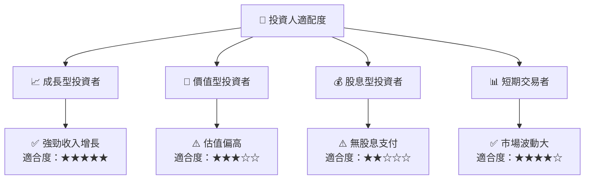

### 10.5 關鍵監控指標

| 監控類型 | 指標 | 關注點 | 頻率 |
|----------|------|--------|------|
| 收入增長 | 營收YoY成長 | 超過40% | 季度 |
| 利潤率 | 淨利率 | 提升至正值 | 季度 |
| 市場份額 | 國際市場份額 | 持續增長 | 半年 |
| 技術創新 | 新產品發佈數量 | 每年增加 | 年度 |

---

> **免責聲明**：本報告為 AI 自動生成，僅供研究參考，不構成投資建議。投資有風險，入市需謹慎。