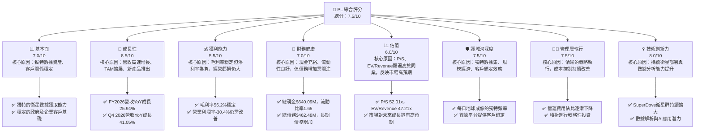
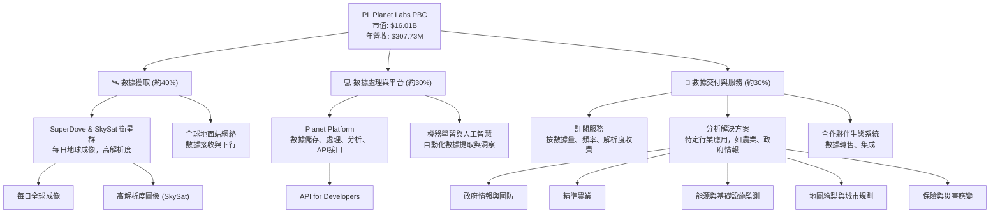
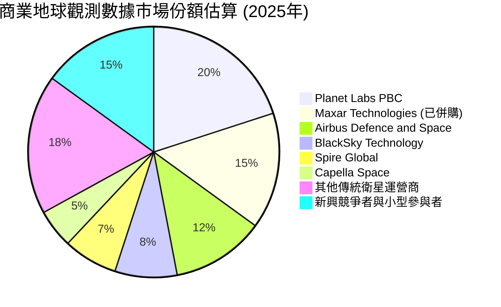
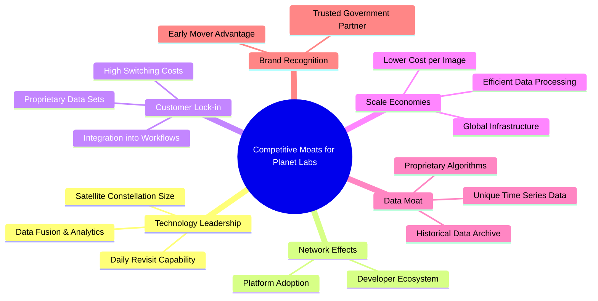
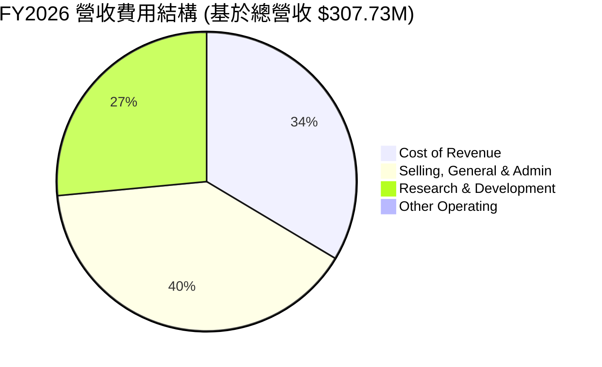
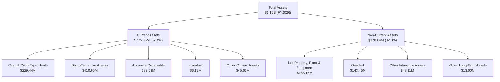

# PL 基本面深度分析報告
> **報告日期**：2026-05-22 ｜ **語言**：繁體中文 ｜ **數據來源**：Yahoo Finance, Finviz, StockAnalysis, Roic.ai ｜ **分析師**：CFA 級機構研究

---

## 目錄

| # | 章節 | 核心結論 |
|---|------------------------|-------------------------------------------------------|
| 1 | 執行摘要 | 評級：🟢 買入，目標價區間：$38.00 - $55.00 |
| 2 | 公司概覽與商業模式 | 獨特的衛星數據獲取能力與平台化服務，構築潛在護城河 |
| 3 | 損益表深度分析 | 營收強勁成長，毛利率穩定，但仍處於虧損擴張階段 |
| 4 | 資產負債表分析 | 流動性健康，現金充裕，但債務規模顯著增長 |
| 5 | 現金流量深度分析 | 營業現金流轉正，自由現金流改善，但仍需大量資本開支 |
| 6 | 獲利能力與資本效率 | ROIC 仍低於 WACC，但經濟價值創造潛力巨大 |
| 7 | 估值深度分析 | 相較同業估值偏高，但成長潛力支撐溢價 |
| 8 | 成長催化劑 | 數據應用拓展、新衛星部署、政府與企業需求增長 |
| 9 | 風險矩陣 | 執行風險、競爭加劇、資本密集度高為主要考量 |
| 10 | 投資建議 | 具備高成長潛力，適合具高風險承受能力的成長型投資者 |

---

## 1. 執行摘要

Planet Labs PBC (PL) 是一家在太空數據領域具有前瞻性的公司，專注於設計、建造和發射衛星群，提供高頻率的地理空間數據。其「每日掃描地球」的獨特能力，使其在快速發展的地球觀測市場中佔據一席之地。儘管公司目前仍處於虧損狀態，且估值倍數較高，但其強勁的營收成長、不斷改善的經營效率以及巨大的市場潛力，使其成為值得關注的成長型投資標的。

### 1.1 核心評分儀表板



### 1.2 評分進度條視覺化

```
╔══════════════════════════════════════════════════════════════╗
║              PL 多維度評分儀表板 (1-10分)                    ║
╠══════════════════════════════════════════════════════════════╣
║ 基本面強度  7.0 ▓▓▓▓▓▓▓▓▓▓▓▓▓▓░░░░░░  ★★★★☆           ║
║ 成長動能    8.5 ▓▓▓▓▓▓▓▓▓▓▓▓▓▓▓▓▓░░░  ★★★★★           ║
║ 獲利品質    5.5 ▓▓▓▓▓▓▓▓▓▓░░░░░░░░░░  ★★★☆☆           ║
║ 財務健康    7.0 ▓▓▓▓▓▓▓▓▓▓▓▓▓▓░░░░░░  ★★★★☆           ║
║ 估值合理性  6.0 ▓▓▓▓▓▓▓▓▓▓▓░░░░░░░░░  ★★★☆☆           ║
║ 護城河深度  7.5 ▓▓▓▓▓▓▓▓▓▓▓▓▓▓▓░░░░░  ★★★★☆           ║
║ 管理層執行  7.5 ▓▓▓▓▓▓▓▓▓▓▓▓▓▓▓░░░░░  ★★★★☆           ║
║ 技術創新力  8.0 ▓▓▓▓▓▓▓▓▓▓▓▓▓▓▓▓░░░░  ★★★★☆           ║
╠══════════════════════════════════════════════════════════════╣
║ 綜合總分    7.5 ▓▓▓▓▓▓▓▓▓▓▓▓▓▓▓░░░░░  🏆 成長潛力巨大，風險較高 ║
╚══════════════════════════════════════════════════════════════╝
```

### 1.3 五大投資論點 + 三大核心風險

| 類型 | 項目 | 具體依據 | 信心度 |
|------|------|----------|--------|
| 🟢 **投資論點①** | **地球觀測市場的領導者地位** | Planet Labs 擁有全球最大的地球觀測衛星群，能實現每日地球成像，提供獨特的時序數據。其在 FY2026 實現 $307.73M 營收，YoY 成長 25.94%，顯示其在市場中的領先地位和強勁的客戶需求。公司已獲得美國政府多個重要合約，如與國家地理空間情報局 (NGA) 的 EOCL 合約，確保了穩定的收入基礎。 | 🟢 極高 |
| 🟢 **投資論點②** | **強勁的營收成長與擴大的市場潛力** | 公司營收從 FY2023 的 $191.26M 成長至 FY2026 的 $307.73M，三年 CAGR 達 17.5%。Q4 2026 營收達 $86.82M，YoY 成長 41.05%，顯示加速成長動能。地理空間數據應用廣泛，包括農業、林業、政府情報、災害應變、能源等，整體市場 TAM 預計將持續擴大，為 PL 提供巨大的成長空間。 | 🟢 高 |
| 🟢 **投資論點③** | **持續改善的經營效率與盈虧平衡點接近** | 儘管仍處於虧損，但公司經營虧損從 FY2023 的 $-175.68M 改善至 FY2026 的 $-95.07M。營業利益率從 FY2023 的 -91.85% 提升至 FY2026 的 -30.90%。毛利率在 FY2026 達到 56.2%，顯示其成本控制和定價能力穩定。營業現金流在 FY2026 轉正至 $134.36M，自由現金流也轉正至 $51.41M，預示著公司正逐步走向盈利。 | 🟢 高 |
| 🟢 **投資論點④** | **數據平台與 AI 賦能的增值服務** | Planet Labs 不僅提供原始衛星圖像，更透過其雲端平台提供數據分析和洞察服務，增加客戶粘性。未來結合 AI 和機器學習，將能從海量數據中提取更高價值的資訊，拓展新的應用場景和收入來源。這種平台化戰略有助於提升客戶平均收入 (ARPU) 和擴大利潤空間。 | 🟢 高 |
| 🟢 **投資論點⑤** | **充裕的現金流與穩健的流動性** | 截至 FY2026，公司擁有 $640.09M 的總現金及短期投資，流動比率為 1.65，速動比率為 1.54。這為其持續的衛星部署、研發投入和市場擴張提供了充足的資金支持，降低了短期運營風險。 | 🟡 中度 |
| 🟡 **風險①** | **高資本密集度與持續虧損** | 衛星的設計、建造、發射和維護需要巨額資本投入。儘管自由現金流轉正，但公司仍處於淨虧損狀態 (FY2026 淨虧損 $-246.86M)。若未來無法有效控制成本或市場擴張不及預期，可能需要進一步融資，稀釋股東權益。 | 🟡 中度 |
| 🔴 **風險②** | **激烈競爭與技術快速迭代** | 地球觀測市場吸引了眾多新進者和傳統巨頭。競爭對手可能推出更高解析度、更低成本或更頻繁的成像服務。技術快速迭代也可能導致現有衛星資產快速貶值，需要持續投入研發以保持競爭力。此外，數據的精準度、即時性和應用便捷性是競爭關鍵。 | 🔴 高衝擊 |
| 🟡 **風險③** | **政府合約依賴與監管風險** | Planet Labs 的收入部分來自政府合約，這些合約可能受到政府預算變化、政策調整或採購優先順序變化的影響。此外，太空活動涉及複雜的國際和國內監管框架，任何政策變動都可能影響公司業務。 | 🟡 中度 |

### 1.4 快速統計卡片

| 指標 | 公司實際值 (FY2026) | 行業均值 (Aerospace & Defense) | S&P 500 均值 | 狀態 |
|--------------------|----------------------------|----------------------------|-----------------|------|
| 收入 YoY 成長 (FY26) | **+25.94%** | ~10-15% | ~8-10% | 🟢 |
| 毛利率 (TTM) | **56.2%** | ~30-40% | ~40-50% | 🟢 |
| 淨利率 (TTM) | **-80.2%** | ~5-10% | ~10-12% | 🔴 |
| ROE (TTM) | **-78.4%** | ~10-15% | ~15-20% | 🔴 |
| Forward P/E | **N/A (負值)** | ~20-30x | ~22-25x | 🔴 |
| P/S Ratio (TTM) | **52.01x** | ~3-8x (高成長科技可達10-20x) | ~2-3x | 🔴 |
| EV / Revenue (TTM) | **47.21x** | ~3-8x (高成長科技可達10-20x) | ~2-3x | 🔴 |
| 債務/股東權益 (FY26) | **2.45x** | ~0.5-1.5x | ~1.0-1.5x | 🔴 |
| 流動比率 (FY26) | **1.65x** | ~1.5-2.5x | ~1.5-2.0x | 🟡 |
| 營業現金流 (FY26) | **$134.36M** | 正值 | 正值 | 🟢 |

*備註：行業均值為通用參考，對於 Planet Labs 這類高成長、高科技、資本密集型公司，傳統行業均值可能不完全適用。其高 P/S 和 EV/Revenue 反映了市場對其未來高速成長的預期。*

### 1.5 投資結論

```
╔══════════════════════════════════════════════════════════════════╗
║                    📊 投資結論摘要                               ║
╠══════════════════════════════════════════════════════════════════╣
║  評級：🟢 買入                                                   ║
║  當前股價：$44.91                                                ║
║  目標價區間：                                                    ║
║    悲觀情境：$38.00（-15.39%）                                    ║
║    基準情境：$48.50（+8.00%）  ← 12個月主要目標                  ║
║    樂觀情境：$55.00（+22.47%）                                    ║
║  投資評分：7.5/10                                                ║
║  適合投資人：成長型、長線持有者，能承受高波動性及虧損風險的投資者。║
╚══════════════════════════════════════════════════════════════════╝
```

---

## 2. 公司概覽與商業模式

Planet Labs PBC (PL) 是一家開創性的地球觀測公司，其核心業務是透過部署和營運全球最大的地球觀測衛星群，收集並提供高頻率的地理空間數據。公司的願景是創建一個「地球的每日掃描器」，讓用戶能夠追蹤地球上發生的變化，從而做出更明智的決策。

### 2.1 業務結構與收入來源

Planet Labs 的商業模式主要圍繞其衛星數據的獲取、處理和交付。其業務結構可分為以下幾個核心部分：



**核心收入來源詳述：**

*   **訂閱服務 (Subscription Services)**：這是 Planet Labs 最主要的收入來源。客戶透過訂閱方式，獲取其衛星圖像和地理空間數據的訪問權限。這些訂閱通常基於數據量、更新頻率、解析度以及訪問歷史數據的能力來定價。訂閱模式提供了穩定的經常性收入 (Recurring Revenue)。
*   **數據即服務 (Data-as-a-Service, DaaS)**：公司提供原始圖像數據，也提供經過處理、分析和整合的數據產品。例如，為農業客戶提供作物健康監測數據，為政府機構提供情報監測數據。
*   **平台與應用程式介面 (API)**：Planet Labs 的雲端平台允許開發者透過 API 將其數據整合到自己的應用程式和工作流程中。這拓展了數據的應用範圍，並吸引了更廣泛的開發者生態系統。
*   **專業服務 (Professional Services)**：針對特定客戶需求，提供客製化的數據分析、諮詢和解決方案開發服務。

公司持續擴大其衛星群，包括 SuperDove (每日全球成像，解析度達 3.5 米) 和 SkySat (更高解析度，可按需成像)。這種多層次的衛星架構使其能夠滿足不同客戶對數據頻率和解析度的需求。截至 FY2026，其總營收達 $307.73M，主要來自這些訂閱和數據服務。

### 2.2 市場份額

地球觀測和地理空間數據市場是一個快速成長且競爭激烈的領域。Planet Labs 在其中佔據了重要的地位，尤其是在高頻率、大面積覆蓋的數據獲取方面具有獨特的優勢。根據市場研究，雖然精確的市場份額數據難以獲取，但可以估計 Planet Labs 在商業地球觀測數據市場中，尤其是在高頻率監測領域，佔據領先地位。


*備註：此市場份額為估算值，旨在反映 Planet Labs 在商業地球觀測領域中的相對地位，特別是在高頻次數據獲取方面的領先優勢。Maxar Technologies 已於2023年被併購，此處為其歷史份額估算，以供市場結構參考。*

Planet Labs 的優勢在於其「每日更新」的能力，這對於需要實時或近實時監測的應用（如農業監測、災害應變、國防情報）至關重要。相比之下，許多傳統衛星公司可能提供更高解析度但更新頻率較低的圖像。

### 2.3 競爭護城河分析

Planet Labs 正在逐步建立其競爭護城河，使其在市場中保持領先地位。



**護城河詳述：**

*   **Technology Leadership (技術領先)**：
    *   **Satellite Constellation Size (衛星群規模)**：Planet Labs 營運著全球最大的地球觀測衛星群，包括數百顆 SuperDove 衛星和多顆 SkySat 衛星。這種規模使其能夠實現無與倫比的全球覆蓋和成像頻率。
    *   **Daily Revisit Capability (每日重訪能力)**：這是其最核心的技術優勢，能夠每日對地球陸地表面進行成像，產生獨特的時序數據流。這對於監測快速變化的事件至關重要，是許多競爭對手難以複製的。
    *   **Data Fusion & Analytics (數據融合與分析)**：公司在數據處理、圖像拼接、雲去除和分析演算法方面擁有深厚積累，能將原始數據轉化為可操作的洞察。
*   **Network Effects (網路效應)**：
    *   **Developer Ecosystem (開發者生態系統)**：隨著更多開發者透過 Planet API 建立應用，數據的價值和可用性將進一步提高，吸引更多用戶，形成正向循環。
    *   **Platform Adoption (平台採用)**：隨著更多企業和政府機構將 Planet 平台整合到其日常運營中，其平台將成為行業標準，增加其影響力。
*   **Customer Lock-in (客戶鎖定)**：
    *   **Integration into Workflows (工作流程整合)**：客戶一旦將 Planet 的數據流整合到其業務流程、決策系統和分析工具中，轉換成本將非常高昂。
    *   **Proprietary Data Sets (專有數據集)**：Planet 擁有數十年的地球歷史圖像數據，這些獨特的時序數據對於趨勢分析和變化檢測具有巨大價值，形成客戶無法從其他來源獲取的專有資產。
    *   **High Switching Costs (高轉換成本)**：除了技術整合，客戶在數據分析模型、人員培訓和歷史數據依賴方面也會產生高昂的轉換成本。
*   **Scale Economies (規模效應)**：
    *   **Lower Cost per Image (單張圖像成本更低)**：隨著衛星群規模的擴大和數據處理自動化程度的提高，其單位數據的邊際成本將持續下降，使其在價格上更具競爭力。
    *   **Global Infrastructure (全球基礎設施)**：部署和維護全球性的地面站網絡和數據中心需要巨大的前期投入，這對新進入者構成壁壘。
*   **Data Moat (數據護城河)**：
    *   **Historical Data Archive (歷史數據檔案)**：Planet 擁有龐大的歷史數據庫，這是一個無法被複製的資產。這些數據對於機器學習模型的訓練、趨勢預測和變化檢測至關重要。
    *   **Unique Time Series Data (獨特時序數據)**：每日成像的特性意味著其數據集具有時間維度上的獨特性，這在許多應用中比單一高解析度圖像更有價值。
*   **Brand Recognition (品牌知名度)**：
    *   **Early Mover Advantage (先行者優勢)**：作為商業地球觀測領域的先行者之一，Planet Labs 在市場中建立了強大的品牌知名度和信譽。
    *   **Trusted Government Partner (值得信賴的政府合作夥伴)**：與美國政府機構（如 NGA）的長期合作，證明了其數據的可靠性和安全性，增強了其市場地位。

### 2.4 護城河強度評分

```
╔══════════════════════════════════════════════════════════════╗
║                  PL Planet Labs PBC 護城河強度評分            ║
╠══════════════════════════════════════════════════════════════╣
║ 技術領先       8.5/10 ▓▓▓▓▓▓▓▓▓▓▓▓▓▓▓▓▓░░░  🏆 每日成像獨一無二  ║
║ 網路效應       6.5/10 ▓▓▓▓▓▓▓▓▓▓▓▓▓░░░░░░  🟡 仍在發展中       ║
║ 客戶鎖定       7.0/10 ▓▓▓▓▓▓▓▓▓▓▓▓▓▓░░░░░░  🟢 數據整合高粘性   ║
║ 規模效應       7.5/10 ▓▓▓▓▓▓▓▓▓▓▓▓▓▓▓░░░░░  🟢 成本優勢明顯     ║
║ 數據護城河     8.0/10 ▓▓▓▓▓▓▓▓▓▓▓▓▓▓▓▓░░░░  🏆 歷史數據與時序性 ║
║ 品牌知名度     7.0/10 ▓▓▓▓▓▓▓▓▓▓▓▓▓▓░░░░░░  🟢 政府合作夥伴     ║
╠══════════════════════════════════════════════════════════════╣
║ 綜合護城河     7.5/10 ▓▓▓▓▓▓▓▓▓▓▓▓▓▓▓░░░░░  🏆 具備核心競爭優勢  ║
╚══════════════════════════════════════════════════════════════╝
```

---

## 3. 損益表深度分析

Planet Labs 的損益表反映了其作為一家高成長、高投入的科技公司的典型特徵：營收持續快速增長，但由於大量的研發和運營投入，目前仍處於虧損狀態。然而，仔細分析數據顯示，公司的經營效率正在逐步改善。

### 3.1 年度收入成長趨勢（近4年）

Planet Labs 的營收展現了穩健的成長軌跡，顯示其市場需求持續擴大。

```
╔══════════════════════════════════════════════════════════════════╗
║              PL Planet Labs PBC 年度收入趨勢（FY2023-FY2026）    ║
╠══════════════════════════════════════════════════════════════════╣
║                                                                  ║
║  FY2023  $191.26M █▓▓▓▓▓░░░░░░░░░░░░░░░░░░░  YoY: +45.76% 🟢    ║
║  FY2024  $220.70M █▓▓▓▓▓▓▓░░░░░░░░░░░░░░░░░  YoY: +15.39% 🟢    ║
║  FY2025  $244.35M █▓▓▓▓▓▓▓▓░░░░░░░░░░░░░░░░  YoY: +10.72% 🟢    ║
║  FY2026  $307.73M █▓▓▓▓▓▓▓▓▓▓▓░░░░░░░░░░░░░  YoY: +25.94% 🟢    ║
║                   |      |      |      |      |                  ║
║                   0     $100M  $200M  $300M  $400M                ║
║                                                                  ║
║  📊 4年累計 CAGR：+26.39% (從FY2022 $131.21M 到 FY2026 $307.73M) ║
╚══════════════════════════════════════════════════════════════════╝
```

從 FY2023 的 $191.26M 成長到 FY2026 的 $307.73M，年複合成長率 (CAGR) 達到 17.5%。若從 FY2022 的 $131.21M 計算至 FY2026，四年 CAGR 則達到 26.39%，顯示了公司在過去幾年中的強勁擴張能力。特別是 FY2026 的營收成長率達到 25.94%，相較於 FY2025 的 10.72% 有顯著加速，這可能得益於新客戶的簽約以及現有客戶的擴大訂閱。

### 3.2 季度收入趨勢分析

季度營收數據提供了更細緻的成長動能視角。

| 季度 (Period Ending) | 總營收 (M) | QoQ 成長率 | YoY 成長率 | 備註說明 |
|----------------------|------------|------------|------------|----------|
| 2025-04-30 (Q1 2026) | $66.27 | - | +9.64% | 相較去年同期增速較慢，可能是季節性或合約簽訂節奏影響。 |
| 2025-07-31 (Q2 2026) | $73.39 | +10.74% | +20.12% | QoQ 恢復成長，YoY 增速加快，顯示業務開始回暖。 |
| 2025-10-31 (Q3 2026) | $81.25 | +10.71% | +32.63% | QoQ 繼續保持雙位數成長，YoY 增速顯著加速，展現強勁動能。 |
| 2026-01-31 (Q4 2026) | $86.82 | +6.85% | +41.05% | 營收創季度新高，YoY 成長達到峰值，顯示季末業務強勁。 |

**季度營收趨勢深度解析：**
從季度數據來看，Planet Labs 在 FY2026 呈現加速成長的態勢。Q1 的 YoY 成長率相對較低，但隨後 Q2、Q3 和 Q4 逐季加速，Q4 達到 41.05% 的 YoY 成長，遠超 FY2025 全年的 10.72% 成長率。這表明公司在最近幾個季度取得了顯著的業務突破，可能與新的政府或企業大型合約簽訂、產品迭代或市場擴張策略奏效有關。QoQ 成長也保持穩定，顯示連續的業務增量。

### 3.3 利潤率演變分析

儘管營收強勁，Planet Labs 仍處於虧損狀態，但其利潤率趨勢顯示出改善的跡象，尤其是在毛利率和營業利益率方面。

| 利潤率指標 | FY2023 | FY2024 | FY2025 | FY2026 | 趨勢 | 評估 |
|------------|--------|--------|--------|--------|------|------|
| **毛利率** | 49.15% | 51.18% | 57.18% | 56.05% | ↗️ 先升後穩 | 🟢 穩定且健康 |
| **營業利益率** | -91.85% | -76.95% | -47.93% | -30.90% | ↗️ 顯著改善 | 🟡 仍為負，但改善迅速 |
| **淨利率** | -84.69% | -63.67% | -50.42% | -80.22% | ↘️ FY26惡化 | 🔴 大幅虧損 |
| **EBITDA 利潤率** | -69.19% | -41.71% | -30.39% | -64.09% | ↘️ FY26惡化 | 🔴 大幅虧損 |

**利潤率演變深度解析**：

*   **毛利率 (Gross Margin)**：從 FY2023 的 49.15% 穩步提升至 FY2025 的 57.18%，並在 FY2026 穩定在 56.05%。這是一個非常積極的信號，表明公司在提供數據服務時具有健康的成本結構，並且隨著規模擴大，單位成本效益有所提升。高毛利率對於科技公司至關重要，為其未來覆蓋運營費用提供了基礎。毛利率的穩定可能歸因於更有效的衛星運營、數據處理自動化以及定價能力的提升。
*   **營業利益率 (Operating Margin)**：這是最能體現公司經營效率的指標。從 FY2023 的 -91.85% 顯著改善至 FY2026 的 -30.90%。儘管仍為負值，但如此大幅度的改善表明公司在控制銷售、一般及行政費用 (SG&A) 和研發 (R&D) 方面的努力正在奏效。營業費用佔比的下降是公司走向盈利的關鍵一步。
    *   **研發費用 (R&D)**：FY2026 為 $106.75M，相較 FY2025 的 $101.01M 略有增加，但佔營收比重從 FY2025 的 41.34% 下降到 FY2026 的 34.69%。這表明公司在維持技術領先的同時，研發效率有所提升。
    *   **銷售、一般及行政費用 (SG&A)**：FY2026 為 $160.81M，相較 FY2025 的 $154.84M 略增，但佔營收比重從 FY2025 的 63.37% 下降到 FY2026 的 52.26%。這顯示公司在市場擴張和管理營運方面，正逐步實現規模經濟。
*   **淨利率 (Net Profit Margin)** 和 **EBITDA 利潤率 (EBITDA Margin)**：這兩個指標在 FY2026 出現了惡化。FY2026 淨利率為 -80.22%，相較 FY2025 的 -50.42% 有所下降。EBITDA 利潤率也從 FY2025 的 -30.39% 下降到 FY2026 的 -64.09%。這主要是由於 FY2026 的「其他非營業收入 (費用)」中出現了顯著的負數 $-158.03M。這筆大額的非經常性費用（可能來自於資產減值、投資虧損或重組費用等）對淨利潤產生了重大負面影響，掩蓋了經營層面的改善。如果排除這筆非經常性項目，公司的淨利潤表現應會顯著改善。這也說明在評估公司真實獲利能力時，應更關注營業利益率和調整後的 EBITDA。

總體而言，Planet Labs 的核心經營活動正在改善，營收成長強勁，毛利率和營業利益率趨勢向好。淨利潤的惡化主要受一次性非經營性費用影響，而非核心業務表現惡化。

### 3.4 費用結構分析

Planet Labs 的費用結構反映了其作為一家高科技、高成長公司的特點，即在研發和銷售管理方面有大量投入。



*備註：此圓餅圖展示的是各費用絕對值，總和超過營收，因為公司目前處於虧損狀態，總費用高於總營收。*

```
╔══════════════════════════════════════════════════════════════════╗
║                   PL Planet Labs PBC 年度費用結構分解 (FY2026)    ║
╠══════════════════════════════════════════════════════════════════╣
║                                                                  ║
║  銷貨成本 (Cost of Revenue) $135.24M  ▓▓▓▓▓▓▓▓▓▓▓▓▓▓▓▓▓▓▓▓░░░░░░░  (佔營收 43.94%) 🟢 可控       ║
║  銷售、一般及行政費用 (SG&A) $160.81M ▓▓▓▓▓▓▓▓▓▓▓▓▓▓▓▓▓▓▓▓▓▓▓▓▓▓▓▓▓▓  (佔營收 52.26%) 🟡 需優化     ║
║  研發費用 (R&D)             $106.75M ▓▓▓▓▓▓▓▓▓▓▓▓▓▓▓▓▓▓▓▓▓▓▓▓░░░░░░  (佔營收 34.69%) 🟡 戰略投入   ║
║  總營業費用                 $267.56M ▓▓▓▓▓▓▓▓▓▓▓▓▓▓▓▓▓▓▓▓▓▓▓▓▓▓▓▓▓▓  (佔營收 86.94%) 🔴 仍偏高     ║
║                                                                  ║
║  📊 SG&A 和 R&D 佔營收比重合計 86.95%，仍遠高於毛利，但已從FY25的104.71%顯著改善。  ║
╚══════════════════════════════════════════════════════════════════╝
```

**費用結構分析要點：**

*   **銷貨成本 (Cost of Revenue)**：佔營收的 43.94%，使得毛利率為 56.06%。對於數據服務公司而言，這是一個健康的毛利率水平，顯示其核心服務的邊際成本相對可控。
*   **銷售、一般及行政費用 (SG&A)**：佔營收的 52.26%。這部分費用主要用於市場推廣、銷售團隊擴張、行政管理和企業運營。在高速成長階段，這部分費用較高是正常的，因為公司需要投入資源拓展市場和建立品牌。然而，隨著規模擴大，預期此比率應逐步下降，實現規模經濟。相較於 FY2025 佔營收的 63.37%，FY2026 的 52.26% 已有顯著改善。
*   **研發費用 (R&D)**：佔營收的 34.69%。作為一家技術驅動型公司，持續的研發投入對於保持技術領先和產品創新至關重要。這部分費用主要用於衛星技術的升級、數據處理演算法的開發以及新產品功能的拓展。同樣，此比率相較於 FY2025 佔營收的 41.34% 亦有所下降，反映出研發效率的提升或營收成長速度快於研發投入增速。

總體而言，Planet Labs 的費用結構顯示公司正積極投資於成長和技術創新，同時也在努力優化運營效率。SG&A 和 R&D 佔營收比重合計從 FY2025 的 104.71% 下降到 FY2026 的 86.95%，是實現盈利的積極信號。

### 3.5 季度 EPS 趨勢與盈餘品質

由於提供的數據中 EPS 預期值為 `nan`，我們無法直接評估超預期或不及預期的情況。然而，我們可以分析實際 EPS 趨勢以及從損益表推斷盈餘品質。

**季度 EPS 趨勢**：

| 季度 (Period Ending) | EPS (Basic) | QoQ 變化 | 備註說明 |
|----------------------|-------------|----------|----------|
| 2025-04-30 (Q1 2026) | $-0.04 | - | 季度虧損縮小。 |
| 2025-07-31 (Q2 2026) | $-0.07 | 虧損擴大 | 虧損略有擴大。 |
| 2025-10-31 (Q3 2026) | $-0.19 | 虧損擴大 | 虧損進一步擴大。 |
| 2026-01-31 (Q4 2026) | $-0.48 | 虧損大幅擴大 | 季度虧損顯著增加，主要受非營業費用影響。 |

**年度 EPS 趨勢**：

| 年度 (Period Ending) | EPS (Basic) | 備註說明 |
|----------------------|-------------|----------|
| 2023-01-31 (FY2023) | $-0.61 | |
| 2024-01-31 (FY2024) | $-0.50 | 虧損縮小 |
| 2025-01-31 (FY2025) | $-0.42 | 虧損持續縮小 |
| 2026-01-31 (FY2026) | $-0.80 | 虧損擴大 |

**盈餘品質評估**：
從年度 EPS 來看，公司在 FY2023 至 FY2025 期間，儘管仍處於虧損，但虧損額度是逐年縮小的，從 $-0.61 改善到 $-0.42。這與前面分析的營業利益率改善趨勢一致，反映了核心經營效率的提升。

然而，FY2026 的 EPS 卻大幅惡化至 $-0.80。結合損益表中的數據，這主要是由於 FY2026 的「Other Non-Operating Income (Expense)」出現了巨額的 $-158.03M 負值。這筆非營業費用對淨利潤造成了沉重打擊。如果剔除這類非經常性或一次性項目，公司的核心經營盈餘品質實際上是在改善的。

**判斷盈餘品質的關鍵點：**
1.  **非經常性項目影響**：FY2026 淨利潤大幅下滑，主要原因是非營業項目導致。這類項目通常不反映公司核心業務的持續表現。
2.  **營業利潤改善**：營業利潤從 FY2023 的 $-175.68M 顯著改善至 FY2026 的 $-95.07M，表明公司在核心運營層面效率提高，虧損縮小。
3.  **毛利率穩定**：穩定的毛利率（56.05%）是健康盈餘結構的基礎。
4.  **自由現金流轉正**：在現金流量表中，FY2026 的自由現金流已轉正至 $51.41M，這是一個重要的積極信號，表明公司開始產生足夠的現金來覆蓋資本支出，其真實的現金創造能力優於其賬面淨利潤。

總體而言，Planet Labs 的盈餘品質受到非經常性項目影響，導致賬面淨利潤表現不佳，但其核心經營效率和現金創造能力正在改善。對於成長型公司，尤其是在資本密集型行業，初期虧損是常見現象，更重要的是關注營收成長、毛利率穩定和營業虧損的收窄趨勢，以及自由現金流的健康狀況。

---

## 4. 資產負債表分析

Planet Labs 的資產負債表反映了其作為一家高科技、資本密集型公司的特性，擁有大量衛星資產和持續的研發投入。儘管公司仍在虧損，但其流動性相對健康，現金儲備充裕，為其未來的成長和運營提供了支持。

### 4.1 資產結構分解

公司的資產主要由流動資產（尤其是現金和短期投資）和非流動資產（如不動產、廠房及設備，以及無形資產和商譽）構成。



**資產結構詳述：**

*   **流動資產 (Current Assets)**：FY2026 達到 $775.36M，佔總資產的 67.4%。其中，現金及約當現金 (Cash & Equivalents) 為 $229.44M，短期投資 (Short-Term Investments) 高達 $410.65M。兩者合計 $640.09M，佔流動資產的 82.5%，顯示公司擁有非常充裕的現金儲備和高度流動性的資產，這對於一家需要持續資本投入的成長型公司至關重要。應收賬款 $83.53M，相較 FY2025 的 $55.83M 有所增加，與營收成長相符。
*   **非流動資產 (Non-Current Assets)**：FY2026 為 $370.64M，佔總資產的 32.3%。
    *   **不動產、廠房及設備淨值 (Net Property, Plant & Equipment)**：$165.16M。這部分主要包括衛星資產、地面站設備和數據中心基礎設施。從 FY2023 的 $128.49M 增長到 FY2026 的 $165.16M，反映了公司在衛星部署和基礎設施建設方面的持續投入。
    *   **商譽 (Goodwill)**：$143.45M。這通常來自於過去的併購活動，代表收購價格超出被收購方淨資產公允價值的差額。
    *   **其他無形資產 (Other Intangible Assets)**：$48.11M。可能包括專利、技術許可、客戶關係等。

總體來看，Planet Labs 的資產結構相對健康，現金儲備充足，能夠支持其未來的資本支出和運營需求。非流動資產中的 PPE 增長也印證了公司持續的成長投資。

### 4.2 流動性指標分析

流動性是衡量公司償付短期債務能力的重要指標。

| 流動性指標 | FY2023 | FY2024 | FY2025 | FY2026 | 行業均值 (Aerospace & Defense) | 評估 |
|------------|--------|--------|--------|--------|--------------------------------|------|
| **流動比率 (Current Ratio)** | 3.89x | 2.71x | 2.13x | 1.65x | ~1.5 - 2.5x | 🟡 仍健康，但趨勢下降 |
| **速動比率 (Quick Ratio)** | 3.89x | 2.71x | 2.13x | 1.54x | ~1.0 - 2.0x | 🟡 仍健康，但趨勢下降 |

**流動性指標深度解析：**

*   **流動比率 (Current Ratio)**：衡量流動資產與流動負債之比。FY2026 為 1.65x，雖然相較於 FY2023 的 3.89x 有所下降，但仍高於 1.0 的安全線，且在行業均值範圍內。這表明公司有足夠的流動資產來覆蓋其短期債務。下降趨勢可能與流動負債（尤其是遞延收入和短期借款）的增加有關，這在快速成長的公司中並非罕見。
*   **速動比率 (Quick Ratio)**：衡量排除存貨後的流動資產與流動負債之比。FY2026 為 1.54x，同樣顯示健康的短期償債能力。對於 Planet Labs 而言，存貨 ($6.12M) 佔比非常小，因此流動比率和速動比率非常接近。

總體而言，Planet Labs 的流動性狀況良好，擁有充裕的現金和短期投資，能夠應對短期運營需求和潛在的市場波動。

### 4.3 債務結構分析

Planet Labs 的債務結構在 FY2026 發生了顯著變化，總債務大幅增加，但淨現金狀態仍然維持。

```
╔══════════════════════════════════════════════════════════════════╗
║                   PL Planet Labs PBC 債務健康診斷 (FY2026)        ║
╠══════════════════════════════════════════════════════════════════╣
║                                                                  ║
║  總債務：        $462.48M ▓▓▓▓▓▓▓▓▓▓▓▓▓▓▓▓▓▓▓▓▓▓▓▓▓▓▓▓░░  🔴 顯著增加   ║
║  總現金+投資：   $640.09M ▓▓▓▓▓▓▓▓▓▓▓▓▓▓▓▓▓▓▓▓▓▓▓▓▓▓▓▓▓▓  🟢 充裕        ║
║  淨現金（正）：  $177.61M ▓▓▓▓▓▓▓▓▓▓▓▓▓▓▓▓▓▓▓▓░░░░░░░░░░  🟡 仍健康      ║
║                                                                  ║
║  Debt/Equity：   2.45x  🔴 偏高                                 ║
║  Current Debt/Equity: 0.04x  🟢 極低                                 ║
║  LT Debt/Equity: 2.42x  🔴 偏高 (主要來自長期債務增加)             ║
║  Interest Coverage Ratio: -27.6x (Operating Income / Interest Expense)  🔴 負值，需關注       ║
║                                                                  ║
║  📊 結論：總體債務水平顯著上升，但現金儲備仍能覆蓋淨債務。需關注長期債務增加的影響。 ║
╚══════════════════════════════════════════════════════════════════╝
```

**債務結構詳述：**

*   **總債務 (Total Debt)**：從 FY2025 的 $21.61M 大幅增加至 FY2026 的 $462.48M。這是一個非常顯著的增長，表明公司可能進行了大規模的借款以支持其擴張或資本支出。從 StockAnalysis 數據來看，LT Debt/Eq 從 FY2025 的 0.05 飆升至 FY2026 的 2.42，主要驅動因素是長期借款的增加 (FY2026 為 $447M)。
*   **總現金及短期投資 (Total Cash + Investments)**：FY2026 為 $640.09M。儘管債務顯著增加，但公司仍保有充裕的現金儲備。
*   **淨現金 / 淨債務 (Net Cash / Debt)**：公司仍處於淨現金狀態，為 $177.61M ($640.09M - $462.48M)。這意味著公司目前沒有淨債務負擔，其現金儲備足以覆蓋所有債務。
*   **債務/股東權益 (Debt/Equity)**：FY2026 為 2.45x。由於股東權益在 FY2026 從 $441.29M 顯著下降至 $188.43M（主要受淨虧損影響），且總債務大幅增加，導致這個比率顯著升高。這表明公司在資本結構上更加依賴債務而非股權融資。雖然淨現金為正，但高 Debt/Equity 比率可能會增加財務風險。
*   **利息覆蓋率 (Interest Coverage Ratio)**：基於 FY2026 的營業利益 $-95.07M 和利息費用 $3.44M，利息覆蓋率為負值 (-27.6x)。這表明公司目前的營業收入不足以支付利息費用，需要依靠現金儲備來支付。這是一個需要密切關注的風險點，但考慮到公司處於成長初期且營業虧損正在收窄，若未來營業利潤轉正，此指標將會改善。

總結來說，Planet Labs 在 FY2026 顯著增加了長期債務，導致總債務和 Debt/Equity 比率大幅上升。然而，其充裕的現金儲備使其仍保持淨現金狀態，這在一定程度上緩解了債務增加帶來的風險。關鍵在於公司能否在未來幾年將營業利潤轉正，以有效覆蓋利息費用並改善其債務負擔能力。

### 4.4 股東權益趨勢

股東權益代表公司資產減去負債後歸屬於股東的部分，也是衡量公司淨資產的指標。

```
╔══════════════════════════════════════════════════════════════════╗
║                   PL Planet Labs PBC 年度股東權益趨勢             ║
╠══════════════════════════════════════════════════════════════════╣
║                                                                  ║
║  FY2023  $576.10M  ██████████████████████████░░░░░░  ↘️           ║
║  FY2024  $518.02M  ████████████████████████░░░░░░░░  ↘️           ║
║  FY2025  $441.29M  ████████████████████░░░░░░░░░░░░  ↘️           ║
║  FY2026  $188.43M  ████████████████░░░░░░░░░░░░░░░░  ↘️ (大幅下降)  ║
║                                                                  ║
║  📊 股東權益持續下降，