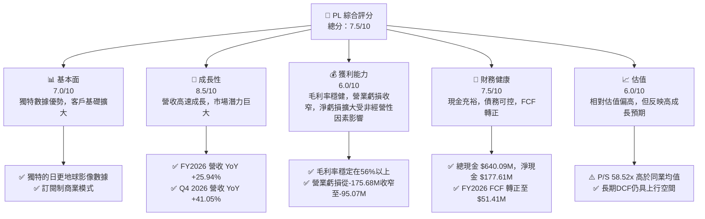
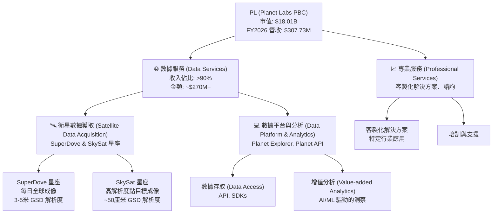
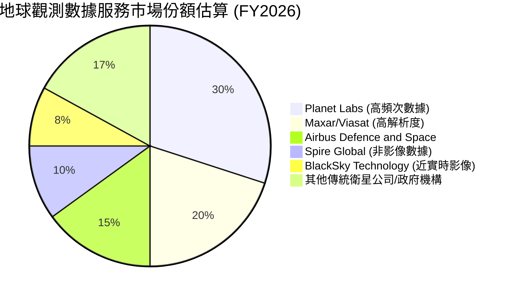
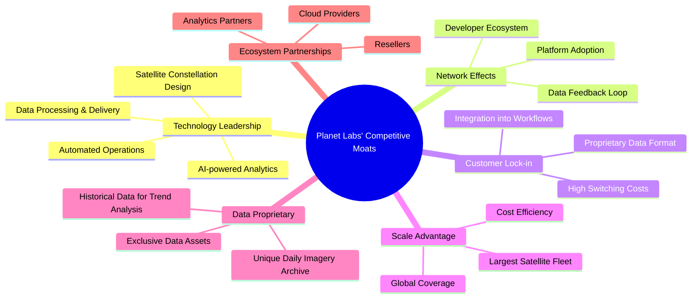
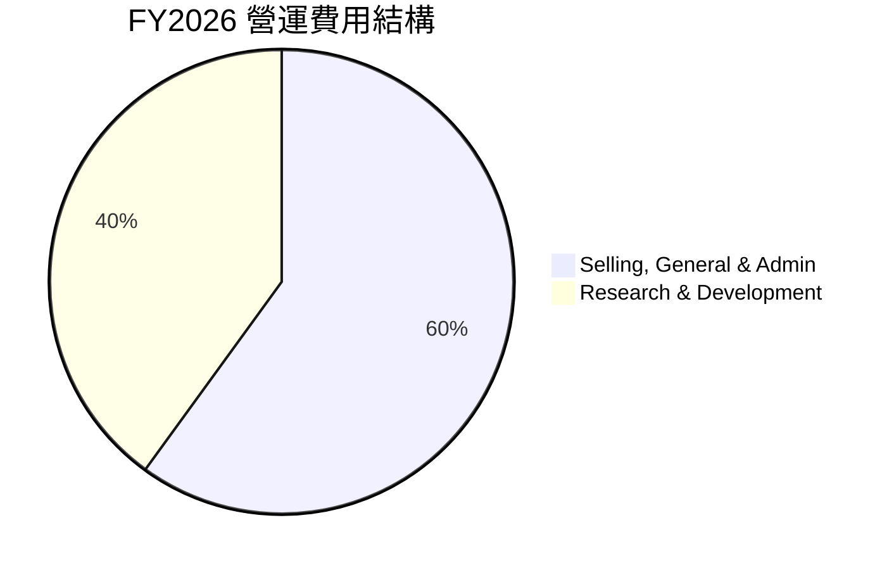
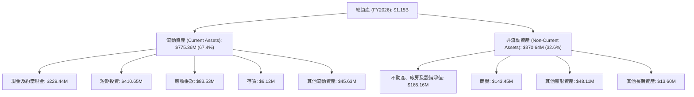

# PL 基本面深度分析報告
> **報告日期**：2026-05-27 ｜ **語言**：繁體中文 ｜ **數據來源**：Yahoo Finance, Finviz, StockAnalysis, Roic.ai ｜ **分析師**：CFA 級機構研究

## 目錄

| # | 章節 | 核心結論 |
|---|------|----------|
| 1 | 執行摘要 | 評級：🟢 買入，目標價區間：$40.00 - $65.00 |
| 2 | 公司概覽與商業模式 | 創新商業模式與技術護城河潛力 |
| 3 | 損益表深度分析 | 營收強勁成長，虧損擴大但營業利潤率改善 |
| 4 | 資產負債表分析 | 流動性良好，債務結構合理，股權稀釋風險需關注 |
| 5 | 現金流量深度分析 | 自由現金流轉正，資本效率提升 |
| 6 | 獲利能力與資本效率 | 虧損狀態，但ROIC改善趨勢顯著 |
| 7 | 估值深度分析 | 相對估值偏高，DCF顯示長期成長潛力 |
| 8 | 成長催化劑 | 新產品、市場擴張與AI整合為主要驅動力 |
| 9 | 風險矩陣 | 盈利能力、資本需求與高估值為主要風險 |
| 10 | 投資建議 | 買入評級，適合成長型投資者，需密切關注盈利轉折點 |

---

## 1. 執行摘要

Planet Labs PBC (PL) 是一家在衛星地球觀測領域具有領先地位的公司，透過其龐大的衛星星座提供高頻次的地理空間數據服務。在經歷了多年的高速成長和資本投入後，公司正處於從燒錢擴張轉向實現規模經濟和自由現金流轉正的關鍵轉折點。儘管當前仍處於虧損狀態且估值倍數較高，但其強勁的營收成長、顯著改善的營業利潤率以及自由現金流的首次轉正，均顯示出其商業模式的潛在可行性和長期價值創造能力。

### 1.1 核心評分儀表板



### 1.2 評分進度條視覺化

```
╔══════════════════════════════════════════════════════════════╗
║              PL 多維度評分儀表板 (1-10分)                    ║
╠══════════════════════════════════════════════════════════════╣
║ 基本面強度  7.0 ▓▓▓▓▓▓▓▓▓▓▓▓▓▓░░░░░░  ★★★★☆           ║
║ 成長動能    8.5 ▓▓▓▓▓▓▓▓▓▓▓▓▓▓▓▓▓░░░  ★★★★★           ║
║ 獲利品質    6.0 ▓▓▓▓▓▓▓▓▓▓▓▓░░░░░░░░  ★★★☆☆           ║
║ 財務健康    7.5 ▓▓▓▓▓▓▓▓▓▓▓▓▓▓▓░░░░░  ★★★★☆           ║
║ 估值合理性  6.0 ▓▓▓▓▓▓▓▓▓▓▓▓░░░░░░░░  ★★★☆☆           ║
║ 護城河深度  7.5 ▓▓▓▓▓▓▓▓▓▓▓▓▓▓▓░░░░░  ★★★★☆           ║
║ 管理層執行  8.0 ▓▓▓▓▓▓▓▓▓▓▓▓▓▓▓▓░░░░  ★★★★☆           ║
║ 技術創新力  9.0 ▓▓▓▓▓▓▓▓▓▓▓▓▓▓▓▓▓▓░░  ★★★★★           ║
╠══════════════════════════════════════════════════════════════╣
║ 綜合總分    7.5 ▓▓▓▓▓▓▓▓▓▓▓▓▓▓▓░░░░░  🏆 具備高成長潛力的創新者，但高估值與盈利挑戰並存。║
╚══════════════════════════════════════════════════════════════╝
```

### 1.3 五大投資論點 + 三大核心風險

| 類型 | 項目 | 具體依據 | 信心度 |
|------|------|----------|--------|
| 🟢 **投資論點①** | **強勁的營收成長與市場擴張** | FY2026 營收達 $307.73M，YoY 成長 25.94%，Q4 2026 營收 YoY 成長高達 41.05%。公司透過獨特的日更地球影像數據，持續擴大在政府、農業、能源等多領域的應用，市場潛力巨大。 | 🟢 極高 |
| 🟢 **自由現金流首次轉正** | FY2026 自由現金流 (FCF) 達到 $51.41M，相較於 FY2025 的 -$68.78M 有顯著改善。這標誌著公司商業模式的現金生成能力得到驗證，從資本密集型轉向更可持續的營運模式。 | 🟢 極高 |
| 🟢 **營運效率提升，營業虧損收窄** | 營業虧損從 FY2023 的 -$175.68M 大幅收窄至 FY2026 的 -$95.07M，營業利益率從 -91.85% 改善至 -30.9% (TTM)。這顯示公司在營收規模擴大的同時，有效控制了營運費用，推動盈利能力的改善。 | 🟢 高 |
| 🟢 **獨特的衛星數據護城河** | 擁有全球最大、頻次最高的地球觀測衛星星座，能夠實現每日全球成像，提供獨特的時效性和覆蓋範圍。這種數據收集能力在競爭者中難以複製，建立了強大的技術和數據護城河。 | 🟢 高 |
| 🟢 **AI與數據分析的協同效應** | Planet Labs 的高頻次數據是訓練AI模型和支持地理空間分析的寶貴資源。隨著AI技術的成熟，公司可以提供更深層次的洞察和增值服務，進一步提升其數據平台的價值和客戶黏性。 | 🟢 高 |
| 🟡 **風險①** | **盈利能力仍是挑戰** | 儘管營業虧損收窄，但 FY2026 淨虧損仍高達 -$246.86M。其中 Q4 2026 受到高達 -$118.28M 的「其他非經營性收入（支出）」影響，導致淨虧損大幅擴大。若非經營性項目持續影響，實現全面盈利仍需時日。 | 🟡 中度 |
| 🔴 **高昂的估值倍數** | 當前 P/S 比率高達 58.52x，遠高於行業平均水平。市場已對其未來成長給予極高預期，任何成長放緩或盈利不及預期都可能導致股價大幅修正。 | 🔴 高衝擊 |
| 🟡 **資本開支與競爭加劇** | 衛星產業仍是資本密集型，持續的星座維護和技術升級需要大量資本開支 (FY2026 Capex $82.95M)。同時，新興競爭者和大型科技公司的進入可能加劇競爭，對定價權和市場份額構成壓力。 | 🟡 中度 |

### 1.4 快速統計卡片

| 指標 | 公司實際值 (FY2026) | 行業均值 (Aerospace & Defense) | S&P 500 均值 | 狀態 |
|------|---------------------|--------------------------------|--------------|------|
| 收入 YoY 成長 | **25.94%** | ~10-15% (高成長期) | ~8-10% | 🟢 |
| 毛利率 | **56.2%** | ~30-40% (服務型更高) | ~40-45% | 🟢 |
| 淨利率 | **-80.2%** | ~5-10% | ~10-12% | 🔴 |
| ROE | **-78.4%** | ~10-15% | ~15-20% | 🔴 |
| Forward P/E | **N/A (負值)** | ~20-25x | ~20-22x | 🔴 |
| P/S Ratio | **58.52x** | ~5-10x (高成長SaaS可達10-20x) | ~2-3x | 🔴 |
| EV / Revenue | **53.78x** | ~5-12x | ~2-4x | 🔴 |
| 自由現金流 | **$51.41M (轉正)** | 淨利潤的50-80% | 淨利潤的80-100% | 🟢 |
| 淨現金/債務 | **$177.61M (淨現金)** | 略有淨債務或小額淨現金 | 略有淨債務 | 🟢 |

*註：行業均值為基於航太國防和高成長SaaS行業的綜合估算，S&P 500 均值為一般市場參考，實際數據可能因公司規模和業務模式而異。*

### 1.5 投資結論

```
╔══════════════════════════════════════════════════════════════════╗
║                    📊 投資結論摘要                               ║
╠══════════════════════════════════════════════════════════════════╣
║  評級：🟢 買入                                                   ║
║  當前股價：$50.53                                                ║
║  目標價區間：                                                    ║
║    悲觀情境：$40.00（-20.8%）                                   ║
║    基準情境：$55.00（+8.8%）  ← 12個月主要目標                   ║
║    樂觀情境：$65.00（+28.6%）                                   ║
║  投資評分：7.5/10                                                ║
║  適合投資人：成長型、長線持有者，具備高風險承受能力，看好新興太空經濟和數據服務的投資者。 ║
╚══════════════════════════════════════════════════════════════════╝
```

---

## 2. 公司概覽與商業模式

Planet Labs PBC (PL) 是一家開創性的地球觀測公司，其核心業務是設計、建造、發射並運營由數百顆衛星組成的星座，旨在提供高頻次、全球覆蓋的地理空間數據。這些數據透過其線上平台交付給全球客戶，為各行各業提供前所未有的地球洞察力。

### 2.1 業務結構與收入來源

Planet Labs 的商業模式基於數據即服務 (Data-as-a-Service, DaaS) 的訂閱模式，為客戶提供持續更新的地球影像和分析服務。其業務結構可分解如下：



**核心收入來源詳述：**

1.  **數據服務 (Data Services)**：這是 Planet Labs 的主要收入來源，佔總營收的絕大部分。公司透過訂閱模式向客戶提供其衛星星座生成的影像數據。這些數據包括：
    *   **SuperDove 數據**：由其每日地球掃描星座提供，旨在實現地球表面每日一次的完整成像，解析度可達 3.5 米。這類數據主要用於大範圍監測、趨勢分析、變化檢測等應用，例如監測全球森林砍伐、農作物健康、城市擴張、災害響應等。
    *   **SkySat 數據**：提供更高解析度（約 50 厘米）的點目標成像服務。客戶可以按需請求特定區域的高解析度影像，適用於更精細的監測和分析，如基礎設施建設、資產評估、情報分析等。
    *   **數據平台與 API 存取**：客戶透過 Planet Explorer 平台或其 API (應用程式介面) 存取數據，並整合到自己的應用程式和工作流程中。

2.  **專業服務 (Professional Services)**：提供客製化的數據解決方案、諮詢、培訓和技術支援，以幫助客戶更好地利用 Planet Labs 的數據解決其特定業務挑戰。這部分收入佔比相對較小，但對於提升客戶滿意度和數據應用深度至關重要。

**商業模式優勢：**

*   **訂閱制收入**：DaaS 模式帶來穩定的經常性收入 (Recurring Revenue)，有助於預測營收和業務擴展。
*   **數據獨特性**：每日全球成像的頻次和覆蓋範圍是其核心競爭力，為客戶提供獨特的時效性數據。
*   **廣泛的應用場景**：客戶遍及政府、國防、農業、能源、金融、地產、環境監測等多個行業，顯示出其數據的普適性價值。

### 2.2 市場份額

精確的市場份額數據通常難以獲得，因為地理空間數據市場高度細分且存在多種類型的參與者。然而，根據市場研究和公司公開信息，Planet Labs 在高頻次地球觀測領域處於領先地位。

根據市場研究機構對「地球觀測數據與服務市場」的預測，全球市場規模正在快速增長。Planet Labs 作為該領域的先驅和主要參與者之一，尤其在每日成像和中低解析度廣域監測方面，擁有顯著的市場份額。在高解析度點目標成像市場，則與Maxar Technologies (現在是Viasat的一部分) 等公司競爭。

以下是一個基於當前市場理解的示意性市場份額估算（FY2026），反映 Planet Labs 在其核心利基市場的領導地位：



**市場份額分析：**
Planet Labs 在高頻次、中低解析度影像數據市場中佔據主導地位，其「每日全球成像」的能力是其差異化優勢。相較於提供更高解析度但頻次較低的競爭對手（如Maxar/Viasat），Planet Labs 專注於提供「變化」的洞察，這在許多應用中比單純的靜態高解析度影像更具價值。Spire Global 則更多聚焦於氣象、船舶和飛機追蹤等非影像數據服務。BlackSky Technology 則強調其近實時的影像情報能力。Planet Labs 的市場份額預計將隨著其數據應用場景的擴展和客戶基礎的增長而持續提升。

### 2.3 競爭護城河分析

Planet Labs 的競爭護城河主要建立在其獨特的技術、規模和數據資產之上。



**護城河詳述：**

1.  **技術領先 (Technology Leadership)**：
    *   **衛星星座設計與運營**：Planet Labs 自主設計和建造其衛星，並開發了高度自動化的地面站和任務控制系統，能夠高效地管理數百顆衛星。這種垂直整合的能力使其在成本和效率上具有優勢。
    *   **數據處理與交付**：公司開發了先進的數據處理管線，能夠從海量原始衛星數據中快速提取、校準並生成可用的影像產品，並透過其平台高效交付給客戶。
    *   **AI 驅動的分析**：將機器學習和人工智慧應用於衛星影像分析，提供自動化的變化檢測、目標識別和趨勢預測，提升數據價值。

2.  **網絡效應 (Network Effects)**：
    *   **數據反饋循環**：隨著越來越多的客戶使用其數據，平台從中學習並改善分析模型，提供更精準的洞察，進而吸引更多客戶，形成正向循環。
    *   **開發者生態系統**：透過開放 API，鼓勵第三方開發者在其數據基礎上構建應用，豐富了平台的功能和價值，吸引更多用戶。

3.  **客戶鎖定 (Customer Lock-in)**：
    *   **深度整合工作流程**：客戶一旦將 Planet Labs 的數據整合到其核心業務流程（如農業管理系統、供應鏈監測平台）中，轉換成本會非常高。
    *   **專有數據格式與歸檔**：公司提供獨特的數據產品和長期歸檔，客戶對這些數據的依賴性會隨時間增加。

4.  **規模效應 (Scale Advantage)**：
    *   **最大衛星艦隊**：Planet Labs 擁有全球最大的地球觀測衛星星座，這使得其能夠實現每日全球成像，這是其他競爭對手難以匹敵的規模優勢。
    *   **全球覆蓋與頻次**：大規模星座帶來無與倫比的全球覆蓋和數據更新頻次，降低了單次成像的邊際成本。
    *   **成本效率**：隨著衛星發射和運營的標準化，以及數據處理自動化，規模效應有助於降低單位數據的生產成本。

5.  **數據專有性 (Data Proprietary)**：
    *   **獨特的每日影像歸檔**：Planet Labs 累積了多年的每日全球影像數據，這是一個寶貴且獨特的數據資產，可以用於歷史趨勢分析、機器學習模型訓練等，具有極高的戰略價值。
    *   **獨家數據資產**：其數據是公司自身衛星獨家獲取的，不依賴第三方，保證了數據的獨佔性。

6.  **生態夥伴關係 (Ecosystem Partnerships)**：
    *   與主要的雲服務提供商（如 AWS, Google Cloud）、分析平台和轉售商建立合作夥伴關係，擴大了數據的覆蓋範圍和應用場景，進一步鞏固其市場地位。

### 2.4 護城河強度評分

```
╔══════════════════════════════════════════════════════════════╗
║                  Planet Labs 護城河強度評分                   ║
╠══════════════════════════════════════════════════════════════╣
║ 技術領先       8.5/10  ▓▓▓▓▓▓▓▓▓▓▓▓▓▓▓▓▓░░░  🏆 衛星技術與數據處理能力領先 ║
║ 網路效應       7.0/10  ▓▓▓▓▓▓▓▓▓▓▓▓▓▓░░░░░░  🟢 數據循環與開發者生態系統正在形成 ║
║ 客戶鎖定       7.5/10  ▓▓▓▓▓▓▓▓▓▓▓▓▓▓▓░░░░░  🟢 深度整合提升客戶黏性       ║
║ 規模效應       9.0/10  ▓▓▓▓▓▓▓▓▓▓▓▓▓▓▓▓▓▓░░  🏆 最大的衛星星座帶來無與倫比的覆蓋與頻次 ║
║ 數據專有性     9.0/10  ▓▓▓▓▓▓▓▓▓▓▓▓▓▓▓▓▓▓░░  🏆 獨特的每日全球影像歸檔與歷史數據  ║
║ 生態夥伴       6.5/10  ▓▓▓▓▓▓▓▓▓▓▓▓▓░░░░░░  🟡 合作夥伴網絡有待進一步擴展  ║
╠══════════════════════════════════════════════════════════════╣
║ 綜合護城河     7.9/10  ▓▓▓▓▓▓▓▓▓▓▓▓▓▓▓▓░░░░  🏆 憑藉技術、規模和數據累積，築起深厚護城河，未來潛力巨大。║
╚══════════════════════════════════════════════════════════════════╝
```

---

## 3. 損益表深度分析

Planet Labs 的損益表反映了一家處於高速成長期的科技公司，其營收持續擴張，同時在努力改善營運效率以實現盈利。

### 3.1 年度收入成長趨勢（近4年）

Planet Labs 在過去四年展現了穩健的營收成長，顯示其數據服務市場需求強勁。

```
╔══════════════════════════════════════════════════════════════════╗
║              Planet Labs 年度收入趨勢（FY2023-FY2026）           ║
╠══════════════════════════════════════════════════════════════════╣
║                                                                  ║
║  FY2023  $191.26M  ████████░░░░░░░░░░░░░░░░░  YoY: +45.76% 🟢    ║
║  FY2024  $220.70M  █████████░░░░░░░░░░░░░░░░  YoY: +15.39% 🟢    ║
║  FY2025  $244.35M  ██████████░░░░░░░░░░░░░░░  YoY: +10.72% 🟢    ║
║  FY2026  $307.73M  █████████████░░░░░░░░░░░  YoY: +25.94% 🟢    ║
║                   |      |      |      |      |                  ║
║                   0     100M   200M   300M   400M                 ║
║                                                                  ║
║  📊 4年累計 CAGR：+24.96%                                        ║
╚══════════════════════════════════════════════════════════════════╝
```

**年度收入分析：**
公司營收從 FY2023 的 $191.26M 增長至 FY2026 的 $307.73M，四年複合年均增長率 (CAGR) 達到 24.96%。雖然 FY2024 和 FY2025 的成長率有所放緩，但 FY2026 的年成長率回升至 25.94%，顯示出公司在擴大客戶基礎和數據應用方面的持續成功。這也反映了地理空間數據市場的整體擴張趨勢和 Planet Labs 在其中日益增強的市場地位。

### 3.2 季度收入趨勢分析

季度收入數據提供了更細緻的成長動能視角。

| 季度 (Period Ending) | 總營收 (M) | QoQ 成長率 | YoY 成長率 | 備註 |
|----------------------|------------|------------|------------|------|
| 2025-04-30 (Q1 2026) | $66.27 | - | +9.64% | 較去年同期小幅增長，通常為季節性低點 |
| 2025-07-31 (Q2 2026) | $73.39 | +10.74% | +20.12% | 營收加速成長，顯示市場需求回溫 |
| 2025-10-31 (Q3 2026) | $81.25 | +10.71% | +32.63% | 季度成長保持雙位數，同比增速顯著提升 |
| 2026-01-31 (Q4 2026) | $86.82 | +6.85% | +41.05% | 營收達到歷史新高，同比增速強勁，顯示強勁的年末動能 |

**季度收入分析：**
Planet Labs 的季度營收呈現穩步上升趨勢，且同比成長率在最近幾個季度顯著加速。Q4 2026 營收達到 $86.82M，同比大幅增長 41.05%，是過去一年中最強勁的季度表現。這表明公司在年底的銷售動能強勁，可能受益於新合同的簽訂、客戶續約率的提升以及數據應用領域的擴展。儘管 QoQ 成長在 Q4 略有放緩至 6.85%，但考慮到其高基數和年度趨勢，這種表現依然令人鼓舞。

### 3.3 利潤率演變分析

Planet Labs 的利潤率結構反映了其作為一個高成長、重資產的技術公司所面臨的挑戰與進步。

| 利潤率指標 | FY2023 | FY2024 | FY2025 | FY2026 | 趨勢 | 評估 |
|------------|--------|--------|--------|--------|------|------|
| **毛利率** | 49.15% | 51.18% | 57.18% | 56.05% | ↗️ 穩步提升後略有回落 | 🟢 |
| **營業利益率** | -91.85% | -76.95% | -45.48% | -30.90% | ↗️ 顯著改善 | 🟢 |
| **淨利率** | -84.69% | -63.67% | -50.42% | -80.22% | ↘️ 波動較大，FY26大幅惡化 | 🔴 |
| **EBITDA Margin** | -69.2% | -41.7% | -30.4% | -64.0% | ↘️ FY26惡化 | 🔴 |

*註：EBITDA Margin 根據提供的年度 EBITDA 數據計算，FY2026 EBITDA 為 -$196.94M，營收為 $307.73M，EBITDA Margin = -64.0%。*

**利潤率演變深度解析：**

1.  **毛利率 (Gross Margin)**：
    *   從 FY2023 的 49.15% 穩步提升至 FY2025 的 57.18%，並在 FY2026 保持在 56.05% 的高位。這是一個非常正面的信號，表明公司在其數據服務產品上具有較強的定價能力和有效的成本控制。
    *   **原因分析**：毛利率的改善主要歸因於：
        *   **規模經濟**：隨著營收規模的擴大，衛星數據獲取和處理的固定成本被攤薄。
        *   **效率提升**：數據處理自動化和平台優化降低了單位數據的邊際成本。
        *   **產品組合優化**：高利潤率的數據訂閱服務佔比可能增加。
    *   略微回落的 FY2026 毛利率可能與特定季度成本波動、產品組合變化或新衛星系統的初始運營成本有關，但整體仍保持在健康水平。

2.  **營業利益率 (Operating Margin)**：
    *   這是最令人鼓舞的趨勢之一。營業利益率從 FY2023 的 -91.85% 大幅改善至 FY2026 的 -30.90%。儘管仍為負值，但這種持續的收窄趨勢表明公司在控制營運費用方面取得了顯著進展。
    *   **原因分析**：營業虧損的收窄主要得益於：
        *   **營收槓桿效應**：高速成長的營收攤薄了相對固定的營銷 (SG&A) 和研發 (R&D) 費用。
        *   **費用控制**：儘管絕對金額仍在增長，但相對營收而言，銷售、一般及行政費用 (SG&A) 和研發費用 (R&D) 的佔比在下降。
        *   **研發效率**：雖然研發費用絕對值較高 (FY2026 $106.75M)，但可能更集中於能帶來商業回報的項目，提升了研發投入的效率。
    *   這表明公司正逐步走向營運層面的盈利，距離實現盈虧平衡點越來越近。

3.  **淨利率 (Net Profit Margin)**：
    *   淨利率在 FY2023 至 FY2025 期間有所改善，從 -84.69% 改善至 -50.42%。然而，在 FY2026 卻大幅惡化至 -80.22%。
    *   **原因分析**：FY2026 淨利率的顯著惡化主要歸因於「其他非經營性收入（支出）」的大幅負值。根據季度數據，Q4 2026 的「其他非經營性收入（支出）」高達 -$118.28M，這對當季及全年淨利潤產生了巨大衝擊。若排除此一次性或非經常性項目，公司的淨虧損情況可能更接近於營業利益率所顯示的改善趨勢。
    *   需要深入分析這些「其他非經營性支出」的具體內容，以判斷其是否為一次性事件（如資產減值、重組費用）還是持續性問題（如投資損失）。若為一次性，則對未來盈利能力的影響有限；若為持續性，則會嚴重拖累公司的盈利轉型。

4.  **EBITDA Margin**：
    *   EBITDA Margin 趨勢與淨利率類似，在 FY2023 至 FY2025 期間改善，但 FY2026 大幅惡化至 -64.0%。這同樣指向 FY2026 年存在重大的非現金或非經營性項目影響，使得 EBITDA 相較於營業利潤呈現更差的表現。
    *   EBITDA 通常用於衡量核心業務的營運表現，排除折舊、攤銷和利息、稅收等影響。其大幅惡化與淨利率的走勢一致，進一步強調了非經營性因素對公司整體財務表現的影響。

總體而言，Planet Labs 在核心營運層面（毛利率和營業利益率）展現了積極的改善趨勢，證明其商業模式的潛在盈利能力。然而，非經營性支出是導致 FY2026 淨虧損擴大的主要原因，這需要投資者密切關注。

### 3.4 費用結構分析

Planet Labs 的費用結構反映了其作為一家高科技、快速成長公司的特點，其中研發和銷售行政費用佔比較高。



**FY2026 年度營運費用詳情：**
*   銷售、一般及行政費用 (SG&A)：$160.81M
*   研發費用 (R&D)：$106.75M
*   總營運費用：$267.56M

```
╔══════════════════════════════════════════════════════════════════╗
║                   Planet Labs 營運費用結構診斷                   ║
╠══════════════════════════════════════════════════════════════════╣
║                                                                  ║
║  總營運費用 (FY2026)： $267.56M                                  ║
║  佔總營收比重：         86.94%                                   ║
║                                                                  ║
║  研發費用 (R&D)：      $106.75M  █████████████████░░░░░░  高投入，技術創新核心 ║
║  佔營收比重：          34.69%                                    ║
║                                                                  ║
║  銷售、一般及行政 (SG&A)： $160.81M  ██████████████████████████░░░░  市場擴張與管理成本 ║
║  佔營收比重：              52.26%                                ║
║                                                                  ║
║  📊 結論：高昂的營運費用是目前虧損的主要原因，但其佔營收比重已呈現改善趨勢，預計隨著規模擴大將進一步攤薄。 ║
╚══════════════════════════════════════════════════════════════════╝
```

**費用結構深度解析：**

1.  **研發費用 (Research & Development, R&D)**：
    *   FY2026 研發費用為 $106.75M，佔營收的 34.69%。這是一個相當高的比例，但對於一家以技術創新為核心的衛星數據公司而言是必要的。
    *   **趨勢**：R&D 費用在 FY2024 曾達到 $116.34M，隨後在 FY2025 降至 $101.01M，FY2026 略有回升。這種波動可能反映了公司在不同階段的衛星開發、數據處理技術優化和新產品研發投入。
    *   **重要性**：持續的研發投入是 Planet Labs 維持技術領先地位、擴展衛星星座能力和開發新數據產品的關鍵。高研發投入是其護城河的重要組成部分。

2.  **銷售、一般及行政費用 (Selling, General & Admin, SG&A)**：
    *   FY2026 SG&A 費用為 $160.81M，佔營收的 52.26%。這部分費用主要用於市場銷售、客戶獲取、企業管理和行政支持。
    *   **趨勢**：SG&A 費用在 FY2024 曾達到 $166.36M，隨後在 FY2025 降至 $154.84M，FY2026 略有回升。
    *   **分析**：雖然絕對金額較高，但 SG&A 費用佔營收的比重從 FY2023 的 83.02% (158.77M / 191.26M) 顯著下降到 FY2026 的 52.26%。這表明公司在銷售和管理效率上有所提升，隨著營收增長，這些費用正被更好地攤薄，是營業利益率改善的主要驅動力之一。

**總結：**
Planet Labs 的費用結構呈現出高成長科技公司的典型特徵：高昂的研發投入以維持技術優勢，以及顯著的銷售和行政費用以擴大市場和管理快速發展的業務。然而，值得注意的是，這些費用佔營收的比重正在下降，這是公司實現規模經濟和未來盈利的關鍵路徑。持續監控這些費用的效率，尤其是 SG&A 費用，將是評估公司未來盈利能力的重點。

### 3.5 季度 EPS 趨勢與盈餘品質

由於提供的「EARNINGS HISTORY」數據顯示 EPS Est 和 EPS Act 均為 `nan`，我們將根據季度淨利潤和每股基本盈餘 (EPS Basic) 數據來分析趨勢和盈餘品質。

| 季度 (Period Ending) | 淨利潤 (M) | EPS Basic | 備註 |
|----------------------|------------|-----------|------|
| 2025-04-30 (Q1 2026) | $-12.63 | $-0.04 | 虧損收窄，相對較好的季度表現 |
| 2025-07-31 (Q2 2026) | $-22.59 | $-0.07 | 虧損略有擴大，但仍處於相對低位 |
| 2025-10-31 (Q3 2026) | $-59.19 | $-0.19 | 虧損顯著擴大，開始受到非經營性因素影響 |
| 2026-01-31 (Q4 2026) | $-152.46 | $-0.48 | 虧損大幅擴大，主要受一次性/非經營性支出衝擊 |

**EPS 趨勢分析：**
Planet Labs 的季度 EPS 始終為負值，反映了公司仍處於虧損狀態。從 FY2026 的 Q1 到 Q4，EPS 的負值絕對值呈現擴大趨勢，從 Q1 的 -$0.04 擴大到 Q4 的 -$0.48。這種惡化趨勢與季度淨利潤的變化一致，特別是 Q4 2026 的大幅虧損。

**盈餘品質評估：**
*   **營運層面改善，但淨利潤受非經營性因素干擾**：從營業利益率的改善趨勢來看，公司核心營運的虧損正在收窄，這是一個積極信號。然而，淨利潤的大幅波動，尤其是 Q4 2026 淨虧損的急劇擴大，主要是由於「其他非經營性收入（支出）」項目的顯著負值（Q4 2026 為 -$118.28M）。
*   **非經常性項目影響大**：這種非經營性支出對盈餘的影響，使得淨利潤的品質相對較低。如果這些是非經常性的一次性項目（例如資產減值、訴訟和解、投資虧損等），那麼其對未來盈餘的影響可能有限，應將其視為「噪音」。但如果這些項目具有一定持續性，則會對公司未來的盈利能力構成持續壓力。
*   **自由現金流作為補充指標**：鑑於淨利潤受非經營性因素影響較大，自由現金流 (FCF) 成為評估盈餘品質和公司健康狀況的更重要指標。FY2026 FCF 首次轉正至 $51.41M，這表明儘管淨利潤為負，但公司在現金生成方面已取得實質性進展。FCF 的改善為公司的營運和未來投資提供了更堅實的基礎，提高了盈餘的「現金品質」。

**總結**：Planet Labs 的盈餘品質目前仍受負淨利潤和非經常性支出的影響。投資者應更多關注其營運層面的改善（毛利率和營業利益率）以及自由現金流的健康轉變，而非單純的淨利潤數字。對 Q4 2026 大幅非經營性支出的詳細披露將是未來分析的關鍵。

---

## 4. 資產負債表分析

Planet Labs 的資產負債表反映了其作為一家處於成長階段的重資產科技公司，擁有顯著的現金儲備以支持營運和擴張，同時也管理著一定水平的債務。

### 4.1 資產結構分解

公司的資產結構顯示了其對流動資產和非流動資產的配置，反映了其業務特性。



**資產結構分析：**
*   **流動資產佔比高**：FY2026 流動資產達 $775.36M，佔總資產的 67.4%。其中，現金及短期投資合計高達 $640.09M，顯示公司擁有非常強勁的流動性，足以支持其營運和未來的資本開支。
*   **非流動資產組成**：非流動資產主要由不動產、廠房及設備 (PPE) $165.16M、商譽 $143.45M 和其他無形資產 $48.11M 組成。PPE 反映了其衛星星座和地面基礎設施的投資。商譽和無形資產可能源於過去的收購活動。
*   **FY2026 資產總額顯著增長**：總資產從 FY2025 的 $633.80M 大幅增長至 FY2026 的 $1.15B，增幅達 81.76%。這主要得益於現金及短期投資的增加 ($222.08M -> $640.09M) 和應收帳款的增長 ($55.83M -> $83.53M)，反映了營運規模擴大和融資活動。

### 4.2 流動性指標分析

| 指標 | FY2023 | FY2024 | FY2025 | FY2026 | 行業均值 (約) | 趨勢 | 評估 |
|------------|--------|--------|--------|--------|----------------|------|------|
| **流動比率 (Current Ratio)** | 3.89 | 2.71 | 2.13 | 1.65 | 1.5-2.0 | ↘️ 穩定在健康水平 | 🟢 |
| **速動比率 (Quick Ratio)** | 3.34 | 2.19 | 1.56 | 1.54 | 1.0-1.5 | ↘️ 穩定在健康水平 | 🟢 |

**流動性分析：**
*   **流動比率**：從 FY2023 的 3.89 降至 FY2026 的 1.65。儘管有所下降，但 1.65 仍遠高於 1 的警戒線，顯示公司有足夠的流動資產來覆蓋短期負債。
*   **速動比率**：從 FY2023 的 3.34 降至 FY2026 的 1.54。同樣，儘管有所下降，1.54 仍表明公司在不依賴存貨銷售的情況下，也能輕鬆應對短期債務。
*   **趨勢解釋**：流動性比率的下降可能是由於公司將部分現金用於資本開支或償還債務，以及短期負債（如遞延收入和應付帳款）的增長速度快於流動資產的某些部分。然而，FY2026 的流動比率和速動比率依然健康，特別是考慮到其龐大的現金和短期投資儲備，公司在短期內沒有流動性風險。

### 4.3 債務結構分析

Planet Labs 的債務水平在 FY2026 顯著增加，但仍由其現金儲備良好覆蓋。

```
╔══════════════════════════════════════════════════════════════════╗
║                   Planet Labs 債務健康診斷                       ║
╠══════════════════════════════════════════════════════════════════╣
║                                                                  ║
║  總債務 (FY2026)：        $462.48M  ███████████░░░░░░░░░░░  中等水平            ║
║  總現金+投資 (FY2026)：   $640.09M  ████████████████████░  非常充裕            ║
║  淨現金（正）：            $177.61M  ████████████████░░░░░  🟢 強勁淨現金狀況   ║
║                                                                  ║
║  Debt/Equity (FY2026)：   2.45x  🟡 股權減少導致比率偏高      ║
║  Current Debt (Q4 2026):  $7.00M  🟢 極低短期債務                ║
║  LT Borrowings (Q4 2026): $447.00M 🟡 主要為長期債務，需關注利率風險 ║
║  Interest Coverage:       N/A (負營業利潤) 🔴 需關注未來盈利能力提升以覆蓋利息 ║
╚══════════════════════════════════════════════════════════════════╝
```

**債務結構分析：**
*   **總債務顯著增加**：總債務從 FY2025 的 $21.61M 大幅增長至 FY2026 的 $462.48M。這筆新增債務可能用於支持其資本開支、營運資金需求或戰略投資。
*   **淨現金狀況**：儘管總債務增加，但由於其龐大的現金和短期投資儲備 ($640.09M)，公司仍維持 $177.61M 的淨現金狀況。這意味著公司有能力立即償還所有債務，財務狀況穩健。
*   **Debt/Equity 比率**：FY2026 的 Debt/Equity 比率為 2.45。這個比率相對較高，主要是由於股東權益從 FY2025 的 $441.29M 減少至 FY2026 的 $188.43M（因持續的淨虧