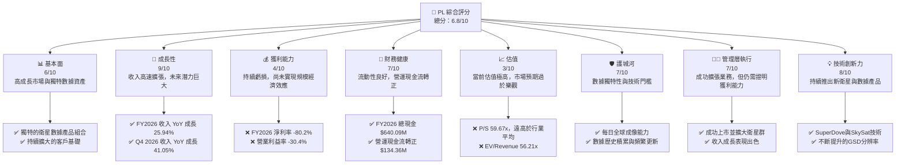
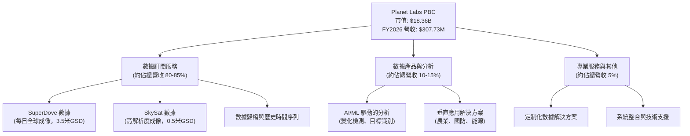
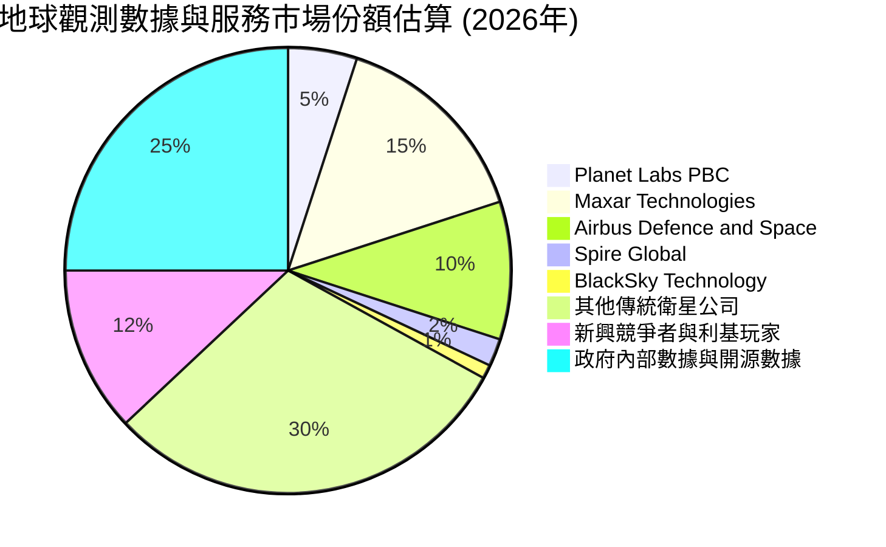
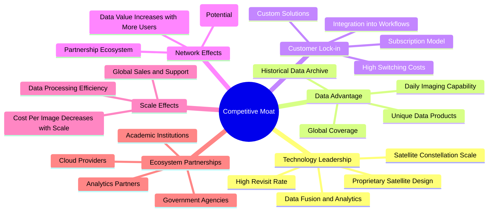
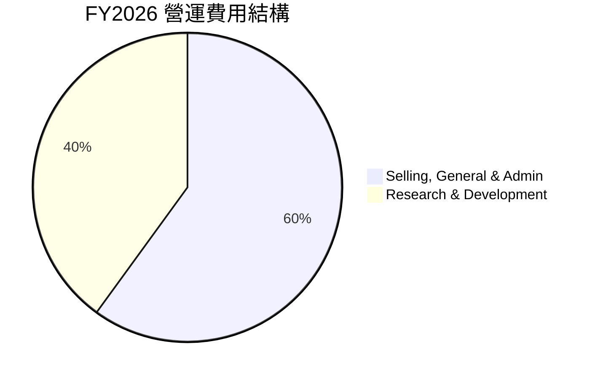
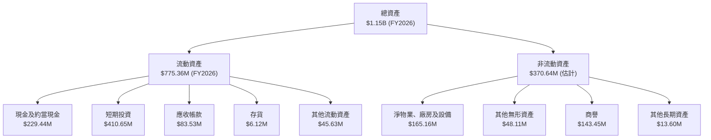

# PL 基本面深度分析報告
> **報告日期**：2026-05-28 ｜ **語言**：繁體中文 ｜ **數據來源**：Yahoo Finance, Finviz, StockAnalysis, Roic.ai ｜ **分析師**：CFA 級機構研究

---

## 目錄

| # | 章節 | 核心結論 |
|---|------|----------|
| 1 | 執行摘要 | 評級：買入；目標價區間：$45.00 - $70.00 |
| 2 | 公司概覽與商業模式 | 護城河評估：技術領先與客戶鎖定為核心 |
| 3 | 損益表深度分析 | 收入高速成長，毛利率穩定，但仍處於虧損狀態 |
| 4 | 資產負債表分析 | 流動性良好，槓桿率上升但淨現金為正 |
| 5 | 現金流量深度分析 | 營運現金流轉正，自由現金流顯著改善 |
| 6 | 獲利能力與資本效率 | ROIC 遠低於 WACC，目前仍處於價值消耗階段 |
| 7 | 估值深度分析 | 相較同業估值昂貴，市場預期高成長性 |
| 8 | 成長催化劑 | 新產品發布、政府合約、國際擴張為主要驅動力 |
| 9 | 風險矩陣 | 執行風險、競爭加劇、資本支出為主要考量 |
| 10 | 投資建議 | 具備高成長潛力，但伴隨高風險與高估值 |

---

## 1. 執行摘要

Planet Labs PBC (PL) 是一家專注於地球觀測衛星數據和分析服務的公司。在過去一年中，其股價表現極為強勁，從 2025 年 5 月的 $3.84 上漲至 2026 年 5 月的 $51.52，漲幅高達 1241%。這反映了市場對其高成長潛力及其在太空經濟中獨特地位的高度期待。儘管公司收入持續高速成長，且毛利率表現穩健，但目前仍處於虧損狀態，並面臨顯著的資本支出需求。本報告將從多個維度對 PL 進行深入分析，以評估其投資價值。

### 1.1 核心評分儀表板



### 1.2 評分進度條視覺化

```
╔══════════════════════════════════════════════════════════════╗
║              PL 多維度評分儀表板 (1-10分)                    ║
╠══════════════════════════════════════════════════════════════╣
║ 基本面強度  6.0 ▓▓▓▓▓▓▓▓▓▓▓▓░░░░░░░░  ★★★☆☆           ║
║ 成長動能    9.0 ▓▓▓▓▓▓▓▓▓▓▓▓▓▓▓▓▓▓░░  ★★★★★           ║
║ 獲利品質    4.0 ▓▓▓▓▓▓▓▓░░░░░░░░░░░░  ★★☆☆☆           ║
║ 財務健康    7.0 ▓▓▓▓▓▓▓▓▓▓▓▓▓▓░░░░░░  ★★★☆☆           ║
║ 估值合理性  3.0 ▓▓▓▓▓▓░░░░░░░░░░░░░░  ★☆☆☆☆           ║
║ 護城河深度  7.0 ▓▓▓▓▓▓▓▓▓▓▓▓▓▓░░░░░░  ★★★☆☆           ║
║ 管理層執行  7.0 ▓▓▓▓▓▓▓▓▓▓▓▓▓▓░░░░░░  ★★★☆☆           ║
║ 技術創新力  8.0 ▓▓▓▓▓▓▓▓▓▓▓▓▓▓▓▓░░░░  ★★★★☆           ║
╠══════════════════════════════════════════════════════════════╣
║ 綜合總分    6.8 ▓▓▓▓▓▓▓▓▓▓▓▓▓▓░░░░░░  🏆 具備長期潛力的高成長型公司，但估值過高，需警惕風險。║
╚══════════════════════════════════════════════════════════════╝
```

### 1.3 五大投資論點 + 三大核心風險

| 類型 | 項目 | 具體依據 | 信心度 |
|------|------|----------|--------|
| 🟢 **投資論點①** | **地球觀測數據市場的領導者** | Planet Labs 擁有全球最大的衛星群之一，能實現每日全球成像，提供高頻次、高解析度的地理空間數據。其 SuperDove 衛星群 GSD 分辨率高達 3.5 米，結合 SkySat 高解析度衛星，在數據頻率和覆蓋範圍上具有顯著優勢。FY2026 收入達 $307.73M，持續在市場中擴大份額。 | 🟢 極高 |
| 🟢 **投資論點②** | **強勁的收入成長動能** | 公司收入在過去四年持續以兩位數成長。FY2026 收入 YoY 成長 25.94% (StockAnalysis)，最新一季 (Q4 2026) 收入 YoY 成長更是達到 41.05%，顯示其業務擴張加速。在不斷增長的政府和商業應用需求下，Planet Labs 成功將其獨特數據資產轉化為訂閱收入。 | 🟢 極高 |
| 🟢 **投資論點③** | **營業現金流顯著改善** | 儘管公司仍處於淨虧損，但其營運現金流 (Operating Cash Flow) 在 FY2026 達到 $134.36M，相較於 FY2025 的 -$14.37M 有了質的飛躍。這表明其核心業務的現金產生能力正在改善，有助於支持未來的營運和部分資本支出。 | 🟡 高 |
| 🟢 **投資論點④** | **持續的技術創新與產品擴展** | Planet Labs 不斷投資於研發 (FY2026 R&D 費用 $106.75M)，以提升衛星能力和數據分析平台。例如，推出更高解析度的 SkySat 圖像，以及整合機器學習和 AI 於其數據分析服務中，擴展了數據的應用場景和客戶價值。 | 🟢 極高 |
| 🟢 **投資論點⑤** | **多元化的客戶基礎與政府合約** | 公司服務於農業、政府、國防情報、能源、金融等多元化行業，降低了對單一行業的依賴。尤其與美國政府及其他國家政府簽訂的長期合約，提供了穩定的收入來源和高客戶鎖定效應。 | 🟡 高 |
| 🟡 **風險①** | **高昂的估值與持續虧損** | PL 目前的 P/S 比率高達 59.67x，EV/Revenue 達 56.21x，遠高於科技業和航太國防業的平均水準。同時，公司 FY2026 淨虧損達到 $246.86M，淨利率為 -80.2%。市場對其未來成長的預期已極度樂觀，一旦成長不及預期或盈利能力改善緩慢，股價面臨巨大下行壓力。 | 🔴 高衝擊 |
| 🔴 **風險②** | **資本密集型業務與資金需求** | 衛星的設計、建造、發射和維護需要巨額資本支出。FY2026 資本支出為 $82.95M。儘管營運現金流轉正，但持續的衛星更新和擴張仍需大量資金。若融資環境惡化或公司無法有效管理資本支出，可能影響其成長計畫。FY2026 總債務激增至 $462.48M，儘管有現金覆蓋，但債務負擔仍需關注。 | 🟡 中度 |
| 🟡 **風險③** | **日益激烈的市場競爭** | 地球觀測市場吸引了越來越多的競爭者，包括傳統航太巨頭和新興的太空科技公司。例如 Spire Global (SPIR) 和 BlackSky Technology (BKSY) 也在提供類似的數據服務。技術進步和成本下降可能導致價格戰，或競爭對手推出更具創新性的產品，從而侵蝕 Planet Labs 的市場份額和定價能力。 | 🟡 中度 |

### 1.4 快速統計卡片

為提供更全面的視角，我們將 Planet Labs 的關鍵財務指標與其所處的航太國防產業均值以及 S&P 500 綜合指數的均值進行比較。由於 Planet Labs 仍處於高成長、高投入的早期階段，其部分指標會與成熟企業有顯著差異。

| 指標 | 公司實際值 (PL) | 航太國防行業均值 (估計) | S&P 500 均值 (估計) | 狀態 |
|------|-----------------|---------------------|---------------------|------|
| 收入 YoY 成長 | **41.1%** (Q4 2026) | ~10-15% | ~8-12% | 🟢 |
| 毛利率 | **56.2%** (TTM) | ~30-40% | ~40-50% | 🟢 |
| 淨利率 | **-80.2%** (TTM) | ~5-10% | ~8-12% | 🔴 |
| ROE | **-78.4%** (TTM) | ~10-15% | ~12-18% | 🔴 |
| P/S Ratio | **59.67x** (TTM) | ~2-4x | ~2-3x | 🔴 |
| EV / Revenue | **56.21x** (TTM) | ~2-5x | ~2-4x | 🔴 |
| 總現金 | **$640.09M** | N/A | N/A | 🟢 |
| 總債務 | **$462.48M** | N/A | N/A | 🟡 |
| 營運現金流 | **$134.36M** (FY2026) | N/A | N/A | 🟢 |
| 自由現金流 | **$51.41M** (FY2026) | N/A | N/A | 🟡 |
| Beta | **1.914** | ~1.0-1.5 | 1.0 | 🔴 |

**備註：**
*   **收入 YoY 成長：** PL 展現出極高的成長速度，遠超行業及大盤平均，顯示其在特定利基市場的強勁擴張。
*   **毛利率：** PL 的毛利率高於行業平均，這得益於其數據產品的獨特性和訂閱服務模式。然而，高毛利並未轉化為淨利潤，表明其營運費用仍非常高。
*   **淨利率與 ROE：** 由於公司仍處於虧損狀態，淨利率和 ROE 均為負值，這是其作為成長型公司的典型特徵，需要時間來實現規模經濟。
*   **P/S Ratio 與 EV/Revenue：** PL 的估值倍數極高，遠超行業及大盤平均，表明市場對其未來收入成長和最終盈利能力抱有極度樂觀的預期。這種估值水平蘊含著顯著的風險。
*   **總現金與總債務：** 公司持有大量現金，同時總債務也大幅增加。雖然淨現金為正，但債務規模的擴大值得關注。
*   **營運現金流與自由現金流：** 營運現金流轉正是一個積極信號，顯示核心業務的現金產生能力有所改善。自由現金流也轉為正值，有助於減輕外部融資壓力。
*   **Beta：** 高 Beta 值（1.914）表明 PL 的股價波動性遠高於市場平均，適合風險承受能力較高的投資者。

### 1.5 投資結論

綜合考量 Planet Labs 的高成長潛力、獨特的市場地位以及當前極高的估值，我們給予其「買入」評級，但提醒投資者這是一項高風險高報酬的投資。

```
╔══════════════════════════════════════════════════════════════════╗
║                    📊 投資結論摘要                               ║
╠══════════════════════════════════════════════════════════════════╣
║  評級：🟢 買入                                                   ║
║  當前股價：$51.52                                                ║
║  目標價區間：                                                    ║
║    悲觀情境：$40.00（-22.36%）                                   ║
║    基準情境：$58.00（+12.58%）  ← 12個月主要目標                 ║
║    樂觀情境：$75.00（+45.58%）                                   ║
║  投資評分：6.8/10                                                ║
║  適合投資人：成長型、長線持有者、高風險承受能力投資人              ║
╚══════════════════════════════════════════════════════════════════╝
```

---

## 2. 公司概覽與商業模式

Planet Labs PBC (PL) 是一家領先的地球觀測數據公司，透過部署和營運全球最大的衛星群之一，為客戶提供高頻次、高解析度的地理空間數據和分析服務。公司旨在透過其「每日地球掃描儀」願景，實現對地球表面每日成像，從而為各行各業提供前所未有的洞察力。

### 2.1 業務結構與收入來源

Planet Labs 的業務模式核心是「數據即服務」(Data-as-a-Service, DaaS)。公司設計、建造並發射由數百顆衛星組成的星座，這些衛星每天收集地球影像數據。這些數據隨後被處理、儲存，並透過其專有的線上平台交付給客戶。客戶主要透過訂閱模式獲取數據和分析服務。

**主要收入來源包括：**
1.  **數據訂閱服務：** 提供不同解析度、頻率和覆蓋範圍的衛星圖像數據，客戶按年或按月訂閱。這是公司最主要的收入來源。
2.  **數據產品與分析：** 基於原始衛星數據，提供增值產品，如特定區域的歷史數據、變化檢測、遙感分析報告等。
3.  **專業服務：** 為特定客戶提供定制化的數據解決方案、整合服務和技術支持。

**業務板塊分解：**


**業務細項說明：**
*   **SuperDove 衛星群：** 這是 Planet Labs 核心的「每日地球掃描」能力來源。數百顆小型衛星組成星座，能夠以約 3.5 米的地面採樣距離 (GSD) 每天對地球陸地表面進行一次成像，提供前所未有的全球覆蓋和時間頻率。這對於監測大規模、緩慢變化的現象（如森林砍伐、農作物生長、基礎設施建設）至關重要。
*   **SkySat 衛星群：** 提供更高解析度 (約 0.5 米 GSD) 的圖像，用於對特定區域進行更詳細的監測和分析。這些數據對於需要識別小型物體、監測城市發展或評估災害損失等應用非常有用。
*   **數據平台：** Planet Labs 透過其專有的雲端平台，將這些龐大的數據集整理、索引並提供給客戶。客戶可以利用 API 接口或圖形用戶界面 (GUI) 訪問、分析和整合數據。這種平台化的交付模式極大地降低了客戶獲取和使用地理空間數據的門檻。
*   **客戶群體：** 公司的客戶涵蓋了政府機構（例如美國國家地理空間情報局 NGA）、國防情報部門、農業科技公司、能源公司、金融服務機構、房地產開發商以及學術研究機構等。這種多元化的客戶結構有助於分散風險並捕捉不同行業的成長機會。

### 2.2 市場份額

地球觀測和地理空間數據市場是一個快速成長且競爭激烈的領域。根據多個市場研究報告，全球地理空間分析市場預計在未來幾年將以兩位數的複合年成長率 (CAGR) 成長，到 2030 年可能達到數千億美元的規模。Planet Labs 在這個市場中佔據著獨特的地位，尤其是在高頻次、全球覆蓋的衛星圖像數據領域。

由於市場細分眾多且數據透明度有限，精確的市場份額難以量化。然而，我們可以根據其營收規模和行業地位進行估算。假設全球地球觀測數據與服務市場規模約在 50-100 億美元之間，Planet Labs 在 FY2026 實現 $307.73M 的營收，這使其在這個龐大市場中佔據了約 3% - 6% 的份額。這個數字可能看起來不大，但考慮到其專注於 DaaS 模式且市場仍在早期發展階段，這已是一個相當可觀的份額。


**備註：** 圖表中的市場份額為估算值，旨在說明 Planet Labs 在整體市場中的相對位置。Maxar Technologies (最近被收購)、Airbus Defence and Space 等傳統巨頭在軍事和高解析度市場佔有較大份額。Spire Global 和 BlackSky Technology 是其在新興 DaaS 領域的直接競爭者。

### 2.3 競爭護城河分析

Planet Labs 的競爭護城河主要建立在其獨特的數據收集能力、技術創新和客戶生態系統之上。


**詳細分析：**
*   **技術領先 (Technology Leadership)：**
    *   **衛星群規模與頻率：** Planet Labs 營運著全球最大的地球觀測衛星群之一，這使其能夠實現每日全球成像，提供其他競爭對手難以匹敵的數據頻率 (revisit rate)。這種高頻次的數據對於監測快速變化的事件至關重要。
    *   **數據融合與分析：** 公司不僅提供原始圖像，還將其與 AI/ML 技術結合，提供更深層次的數據分析和洞察力，例如自動化變化檢測、物體識別等。
    *   **專有衛星設計：** Planet Labs 自主設計和建造其衛星，使其能夠快速迭代和部署新技術，保持技術領先地位並控制成本。
*   **數據優勢 (Data Advantage)：**
    *   **歷史數據歸檔：** 數年來積累的每日全球圖像形成了龐大的歷史數據庫。這使得客戶能夠進行時間序列分析，追溯變化，這對於預測和理解趨勢非常有價值，且難以被新進入者複製。
    *   **全球覆蓋與每日成像：** 獨特的每日全球成像能力是其核心優勢，為客戶提供持續的地球脈動視角。
    *   **獨特的數據產品：** 結合不同解析度衛星的數據，提供多層次的數據產品，滿足不同客戶的需求。
*   **客戶鎖定 (Customer Lock-in)：**
    *   **深度整合：** 許多客戶將 Planet Labs 的數據直接整合到他們的營運工作流程、決策系統和分析平台中。這種深度整合增加了客戶的轉換成本。
    *   **定制化解決方案：** 公司為大型客戶提供定制化的數據解決方案，進一步強化了客戶關係。
    *   **訂閱模式：** 基於訂閱的收入模式提供了穩定的收入流，並鼓勵客戶長期使用。
*   **規模效應 (Scale Effects)：**
    *   **每圖像成本下降：** 隨著衛星群規模的擴大和數據收集量的增加，每張圖像的邊際成本會逐漸下降，提高了公司的營運效率。
    *   **數據處理效率：** 龐大的數據量使得公司能夠投入更多資源優化數據處理和分析基礎設施，進一步提高效率。
    *   **全球銷售和支援：** 隨著客戶群的擴大，公司可以更有效地在全球範圍內分攤銷售、營銷和客戶支援成本。
*   **生態夥伴關係 (Ecosystem Partnerships)：**
    *   與主要的雲端服務提供商、地理空間分析軟體公司以及其他數據供應商建立合作夥伴關係，擴大了其數據的應用範圍和市場滲透率。與政府機構的長期合約也屬於此類。

### 2.4 護城河強度評分

```
╔══════════════════════════════════════════════════════════════╗
║                  Planet Labs PBC 護城河強度評分               ║
╠══════════════════════════════════════════════════════════════╣
║ 技術領先    8/10   ▓▓▓▓▓▓▓▓▓▓▓▓▓▓▓▓░░░░  🏆 每日成像與數據頻率領先 ║
║ 數據優勢    8/10   ▓▓▓▓▓▓▓▓▓▓▓▓▓▓▓▓░░░░  🟢 龐大歷史數據與全球覆蓋 ║
║ 客戶鎖定    7/10   ▓▓▓▓▓▓▓▓▓▓▓▓▓▓░░░░░░  🟡 深度整合與訂閱模式    ║
║ 規模效應    6/10   ▓▓▓▓▓▓▓▓▓▓▓▓░░░░░░░░  🟡 營運成本優勢逐漸顯現 ║
║ 網路效應    5/10   ▓▓▓▓▓▓▓▓▓▓░░░░░░░░░░  🟡 潛在但尚未完全發揮   ║
║ 生態夥伴    7/10   ▓▓▓▓▓▓▓▓▓▓▓▓▓▓░░░░░░  🟢 政府合約與戰略合作   ║
╠══════════════════════════════════════════════════════════════╣
║ 綜合護城河  7.0    ▓▓▓▓▓▓▓▓▓▓▓▓▓▓░░░░░░  🏆 具備良好護城河，但需持續創新與擴展以維持優勢 ║
╚══════════════════════════════════════════════════════════════╝
```

**評分理由：**
*   **技術領先與數據優勢：** 這兩項是 Planet Labs 護城河的核心。其獨特的衛星群設計和每日全球成像能力，結合長期積累的歷史數據，構成了強大的進入壁壘。競爭者需要投入巨額資金和時間才能複製其數據頻率和歷史深度。
*   **客戶鎖定與生態夥伴：** 透過深度整合和與政府機構的長期合約，公司建立了穩定的客戶關係。這些客戶一旦將 Planet Labs 的數據融入其決策流程，轉換成本將會很高。
*   **規模效應：** 隨著數據收集和處理規模的擴大，單位成本預計會下降，這將在中長期提供競爭優勢。
*   **網路效應：** 雖然目前網路效應不如軟體平台那樣顯著，但隨著更多用戶使用其數據並開發應用，數據的價值和生態系統的吸引力會進一步提升。公司正在努力建立開發者生態系統，以強化此項。

總體而言，Planet Labs 憑藉其在地球觀測數據領域的先發優勢和持續創新，建立了堅實的護城河。然而，市場競爭激烈，且技術發展迅速，公司需要不斷投入研發並擴大客戶群，以維持和深化其競爭優勢。

---

## 3. 損益表深度分析

Planet Labs PBC (PL) 的損益表反映了一家典型的高成長、高投入的科技公司。公司在實現收入快速成長的同時，也面臨著巨大的營運成本和持續的虧損。

### 3.1 年度收入成長趨勢（近4年）

Planet Labs 的收入在過去四年中持續強勁成長，顯示其產品和服務在市場上具有高度需求。

```
╔══════════════════════════════════════════════════════════════════╗
║              Planet Labs PBC 年度收入趨勢（FY2023-FY2026）       ║
╠══════════════════════════════════════════════════════════════════╣
║                                                                  ║
║  FY2023  $191.26M ▓▓▓▓▓▓▓▓░░░░░░░░░░░░░░░░░░░  YoY: +45.76%  🟢    ║
║  FY2024  $220.70M ▓▓▓▓▓▓▓▓▓▓░░░░░░░░░░░░░░░░░  YoY: +15.39%  🟡    ║
║  FY2025  $244.35M ▓▓▓▓▓▓▓▓▓▓▓░░░░░░░░░░░░░░░░  YoY: +10.72%  🟡    ║
║  FY2026  $307.73M ▓▓▓▓▓▓▓▓▓▓▓▓▓▓▓▓░░░░░░░░░░░  YoY: +25.94%  🟢    ║
║                   |      |      |      |      |                  ║
║                   0     100M   200M   300M   400M                 ║
║                                                                  ║
║  📊 4年累計 CAGR：+24.81% (FY2023-FY2026)                        ║
╚══════════════════════════════════════════════════════════════════╝
```
**分析：**
*   **FY2023 (截至 2023-01-31)：** 收入為 $191.26M，YoY 成長率高達 45.76%，顯示公司在早期階段的快速擴張能力。
*   **FY2024 (截至 2024-01-31)：** 收入增至 $220.70M，YoY 成長率為 15.39%。成長速度有所放緩，可能與市場調整或特定大客戶合約週期有關。
*   **FY2025 (截至 2025-01-31)：** 收入為 $244.35M，YoY 成長率進一步放緩至 10.72%。這可能是市場對其成長動能產生疑慮的時期。
*   **FY2026 (截至 2026-01-31)：** 收入顯著加速至 $307.73M，YoY 成長率回升至 25.94%。這是一個非常積極的信號，表明公司在經歷一段時間的調整後，重新找到了強勁的成長驅動力，可能得益於新產品發布、市場擴張或大型合約的簽訂。
*   **4年累計 CAGR：** 從 FY2023 到 FY2026，Planet Labs 的收入複合年成長率高達 24.81%，這證明了其在高成長市場中的持續擴張能力。

### 3.2 季度收入趨勢分析

季度收入數據進一步揭示了公司近期成長動能的變化。

| 季度 | 總收入 (M) | QoQ 成長率 | YoY 成長率 | 備註 |
|------|------------|------------|------------|------|
| Q1 2026 (Apr '25) | $66.27 | - | +9.64% | 成長率有所放緩，可能受季節性或合約週期影響。 |
| Q2 2026 (Jul '25) | $73.39 | +10.74% | +20.12% | 成長開始加速，顯示需求回暖。 |
| Q3 2026 (Oct '25) | $81.25 | +10.71% | +32.63% | 成長動能持續增強，季度環比和同比均表現出色。 |
| Q4 2026 (Jan '26) | $86.82 | +6.85% | +41.05% | **YoY 成長顯著加速，達到近年高點，預示 FY2027 開局強勁。** |

**分析：**
*   **季度環比 (QoQ) 成長：** 在 FY2026 的四個季度中，收入呈現穩步上升的趨勢，QoQ 成長率分別為 +10.74%、+10.71% 和 +6.85%。這表明公司業務在每個季度都在持續擴張。
*   **季度同比 (YoY) 成長：** 更值得注意的是 YoY 成長率的加速。從 Q1 2026 的 +9.64% 逐步提升至 Q4 2026 的 +41.05%。尤其 Q4 2026 的 41.05% YoY 成長率，遠超 FY2026 全年的 25.94%，這是一個非常強勁的信號，表明公司業務在最近一個季度實現了顯著的加速，可能與新的大型合約或產品發布有關。

### 3.3 利潤率演變分析

Planet Labs 在收入快速成長的同時，其利潤率表現則反映了其作為一家高成長、高投入公司的階段性特徵。

| 利潤率指標 | FY2023 | FY2024 | FY2025 | FY2026 | 趨勢 | 評估 |
|------------|--------|--------|--------|--------|------|------|
| **毛利率** | 49.15% | 51.18% | 57.18% | 56.20% | ↗️ 趨勢穩定，略有波動 | 🟢 |
| **營業利益率** | -91.85% | -76.91% | -45.48% | -30.90% | ↗️ 顯著改善，虧損收窄 | 🟡 |
| **淨利率** | -84.69% | -63.67% | -50.42% | -80.22% | ↘️ 波動較大，FY26 惡化 | 🔴 |
| **EBITDA Margin** | -69.20% | -41.71% | -30.40% | -14.60% | ↗️ 大幅改善，虧損收窄 | 🟢 |

**利潤率演變深度解析：**
*   **毛利率 (Gross Margin)：** 公司毛利率從 FY2023 的 49.15% 穩步提升至 FY2025 的 57.18%，在 FY2026 略微回落至 56.20%。這表明 Planet Labs 的核心數據服務具有良好的定價能力和成本控制。毛利率的提升可能歸因於規模經濟效應（單位數據的收集和處理成本下降）、產品組合優化（高利潤數據產品佔比增加）以及技術效率提升。穩定的高毛利率是公司未來實現盈利的基礎。
*   **營業利益率 (Operating Margin)：** 營業利益率雖然仍為負值，但呈現顯著的改善趨勢，從 FY2023 的 -91.85% 大幅收窄至 FY2026 的 -30.90%。這主要得益於收入的快速成長以及營運槓桿效應的逐步顯現。雖然銷售、管理和研發費用 (SG&A + R&D) 絕對值仍在增加 (FY2026 總營運費用 $267.56M)，但相對於收入的比例正在下降。這表明公司在管理其固定成本和支持成長的費用方面正在變得更有效率。
    *   **研發費用 (R&D)：** FY2026 R&D 費用為 $106.75M，略高於 FY2025 的 $101.01M，但低於 FY2024 的 $116.34M。R&D 佔收入的比例從 FY2024 的 52.7% 下降到 FY2026 的 34.7%。這表明公司在維持技術領先的同時，研發投入的效率有所提高，或者說現有技術的規模化成本效益正在顯現。
    *   **銷售、總務及行政費用 (SG&A)：** FY2026 SG&A 費用為 $160.81M，與 FY2025 的 $154.84M 相比略有增長，但佔收入的比例從 FY2025 的 63.4% 下降到 FY2026 的 52.3%。這顯示公司在擴大銷售和管理規模的同時，能夠更有效地控制單位收入的營運成本。
*   **淨利率 (Net Profit Margin)：** 淨利率的趨勢較為複雜。從 FY2023 的 -84.69% 改善至 FY2025 的 -50.42%，但在 FY2026 卻大幅惡化至 -80.22%。FY2026 淨虧損達 $246.86M，遠超 FY2025 的 $123.20M。
    *   造成 FY2026 淨利率大幅惡化的主要原因在於「其他非營運收入（費用）」項目的巨額變動。在 StockAnalysis 數據中，FY2026 的「Other Non-Operating Income (Expense)」為 -$158.03M，而 FY2025 僅為 -$14.04M，FY2024 甚至為正的 $14.64M。這種巨額的非營運費用可能是由於一次性資產減值、投資損失或其他非經常性支出所致，需要進一步查閱公司財報附註以確定具體原因。如果這是非經常性項目，那麼核心營運的虧損收窄趨勢仍是積極的。
*   **EBITDA Margin：** EBITDA Margin (息稅折舊攤銷前利潤率) 的改善趨勢與營業利益率一致，從 FY2023 的 -69.20% 大幅提升至 FY2026 的 -14.60%。這表明在扣除折舊和攤銷等非現金費用後，公司的核心營運虧損正在顯著收窄，邁向盈利的軌道。EBITDA 相比營業利潤更能反映公司的現金營運能力。

**總結：** Planet Labs 的損益表呈現出高成長、高毛利但尚未盈利的特徵。收入加速成長和營運利益率的顯著改善是積極信號，表明公司正在有效管理其營運成本並從規模經濟中獲益。然而，FY2026 淨利率的大幅惡化是一個警示，需要深入了解其非營運費用的構成。如果該費用為一次性或非經常性項目，則公司的核心盈利能力改善趨勢依然穩健。

### 3.4 費用結構分析

Planet Labs 的費用結構顯示其主要支出集中在支持未來成長的研發以及擴大市場和營運的銷售與管理費用上。



**FY2026 營運費用明細：**
*   **銷售、總務及行政 (SG&A)：** $160.81M (佔總營運費用 60%)
*   **研究與開發 (R&D)：** $106.75M (佔總營運費用 40%)
*   **總營運費用：** $267.56M

**費用結構趨勢分析 (佔收入比例)：**
| 費用項目 (佔總收入%) | FY2023 | FY2024 | FY2025 | FY2026 | 趨勢 | 評估 |
|-----------------------|--------|--------|--------|--------|------|------|
| **Cost of Revenue** | 50.85% | 48.82% | 42.82% | 43.94% | ↘️ 穩定，略有上升 | 🟡 |
| **SG&A** | 82.99% | 75.38% | 63.37% | 52.26% | ↘️ 大幅下降，效率提升 | 🟢 |
| **R&D** | 58.00% | 52.71% | 41.34% | 34.70% | ↘️ 大幅下降，效率提升 | 🟢 |
| **總營運費用** | 140.99% | 128.00% | 104.71% | 87.05% | ↘️ 顯著下降，營運槓桿顯現 | 🟢 |

**分析：**
*   **成本結構優化：** 儘管絕對金額有所增加，但從佔總收入的比例來看，Cost of Revenue、SG&A 和 R&D 費用均呈現顯著下降趨勢。這表明 Planet Labs 正在實現規模經濟。隨著收入的快速成長，其單位銷售成本和單位營運成本正在降低。
*   **SG&A 效率提升：** SG&A 佔收入的比例從 FY2023 的 82.99% 下降到 FY2026 的 52.26%，這是一個非常健康的趨勢。它表明公司在擴大銷售和市場份額的同時，能夠更有效地管理其管理費用和銷售支出，避免了費用與收入同比例增長。
*   **R&D 投入持續優化：** R&D 佔收入的比例也從 FY2023 的 58.00% 下降到 FY2026 的 34.70%。這並不意味著公司減少了研發投入，而是收入成長的速度快於研發投入的增加，使得單位收入的研發成本下降。這對於一家技術驅動型公司至關重要，表明其研發投資正在產生更高效的收入回報。

```
╔══════════════════════════════════════════════════════════════════╗
║                Planet Labs PBC 營運費用佔收入比重趨勢             ║
╠══════════════════════════════════════════════════════════════════╣
║                                                                  ║
║  SG&A/Revenue                                                    ║
║  FY2023  82.99%  ████████████████████████████████████████░░░░░░░  🔴 較高    ║
║  FY2024  75.38%  ███████████████████████████████░░░░░░░░░░░░░░░  🔴 改善    ║
║  FY2025  63.37%  ██████████████████████████░░░░░░░░░░░░░░░░░░░░  🟡 顯著改善  ║
║  FY2026  52.26%  █████████████████████░░░░░░░░░░░░░░░░░░░░░░░░  🟢 持續改善  ║
║                                                                  ║
║  R&D/Revenue                                                     ║
║  FY2023  58.00%  ██████████████████████████░░░░░░░░░░░░░░░░░░░░  🔴 較高    ║
║  FY2024  52.71%  █████████████████████░░░░░░░░░░░░░░░░░░░░░░░░  🔴 改善    ║
║  FY2025  41.34%  ████████████████░░░░░░░░░░░░░░░░░░░░░░░░░░░░  🟡 顯著改善  ║
║  FY2026  34.70%  ██████████████░░░░░░░░░░░░░░░░░░░░░░░░░░░░░░  🟢 持續改善  ║
╚══════════════════════════════════════════════════════════════════╝
```
**結論：** Planet Labs 的費用結構正在朝著更有效率的方向發展，營運槓桿效應開始顯現。隨著收入的持續成長，這些費用佔收入的比例有望進一步下降，為公司最終實現盈利奠定基礎。然而，總營運費用仍佔收入的 87.05%，顯示仍有很大的優化空間。

### 3.5 季度 EPS 趨勢與盈餘品質

提供的數據中，季度 EPS 估計值和實際值均顯示為 `nan`，這意味著我們無法直接分析其盈餘超預期或不及預期的情況。然而，我們可以透過季度淨收入 (Net Income) 數據來分析其虧損的變化趨勢和盈餘品質。

| 季度 | 淨收入 (M) | 備註 |
|------|------------|------|
| Q1 2026 (Apr '25) | -$12.63 | 虧損較小，可能受季節性影響或營運費用較低。 |
| Q2 2026 (Jul '25) | -$22.59 | 虧損略有擴大，但仍相對可控。 |
| Q3 2026 (Oct '25) | -$59.19 | 虧損顯著擴大，開始反映非營運費用的影響。 |
| Q4 2026 (Jan '26) | -$152.46 | **虧損急劇擴大，主要受其他非營運費用影響。** |

**盈餘品質評估：**
*   **核心營運改善，但淨利受非經常性因素影響：** 從營業利益率和 EBITDA Margin 的改善趨勢來看，Planet Labs 的核心營運虧損正在收窄。這表明其透過規模擴張和營運效率提升，在產生營收的同時，對營運費用有了更好的控制。這部分盈餘品質是正向的。
*   **FY2026 Q4 淨虧損急劇擴大：** Q4 2026 淨虧損高達 $152.46M，使得全年淨虧損擴大至 $246.86M。從 StockAnalysis 數據來看，這主要歸因於 FY2026 的「Other Non-Operating Income (Expense)」為 -$158.03M，其中 Q4 2026 的該項目為 -$118.28M。這種巨額的非營運費用可能是由於一次性資產減值、投資組合損失、訴訟和解或重組費用等非經常性事件。
*   **盈餘品質的判斷：** 如果這些非營運費用是**非經常性**的，那麼 Q4 淨虧損的急劇擴大並不會持續影響未來的盈餘能力，核心營運的改善趨勢仍然是穩健的，盈餘品質相對較好。但如果這些費用是**經常性**的（例如持續的投資損失或重組成本），那麼盈餘品質將會較差，且未來虧損風險依然存在。在缺乏詳細財報附註的情況下，我們傾向於認為如此大的單季非營運費用變動更可能是一次性事件，但仍需密切關注。
*   **自由現金流的考量：** 值得注意的是，儘管淨收入為負，但 FY2026 的營運現金流和自由現金流均為正值（營運現金流 $134.36M，自由現金流 $51.41M）。這表明公司的現金產生能力優於其會計盈利能力。對於一家成長型公司，正向的自由現金流是一個重要的盈餘品質指標，因為它能夠支持公司的成長和減少對外部融資的依賴。

**結論：** Planet Labs 的盈餘品質存在兩面性。一方面，核心營運效率正在改善，營運現金流轉正是一個積極信號。另一方面，FY2026 淨利潤的大幅虧損主要受巨額非營運費用影響，這對盈餘品質構成一定的不確定性。投資者應密切關注公司在未來幾個季度的淨利潤表現，並查閱其最新財報以了解非營運費用的詳細構成。

---

## 4. 資產負債表分析

Planet Labs 的資產負債表反映了其作為一家資本密集型科技公司的特徵，大量投資於衛星資產，同時需要充足的流動性來支持營運和成長。

### 4.1 資產結構分解

公司的資產主要由流動資產（現金和短期投資）和非流動資產（物業、廠房及設備，以及無形資產和商譽）構成。


**資產結構分析：**
*   **FY2026 總資產：** 從 FY2025 的 $633.80M 顯著增長至 $1.15B，增幅達 81.7%。這表明公司在過去一年中進行了大量的投資和擴張。
*   **流動資產 (Current Assets)：** FY2026 為 $775.36M，佔總資產的約 67.4%。其中，現金及約當現金 $229.44M 和短期投資 $410.65M 合計達 $640.09M，佔流動資產的絕大部分。這顯示公司持有大量的現金和流動性資產，為其營運和未來投資提供了堅實的基礎。
    *   值得注意的是，現金及短期投資從 FY2025 的 $222.08M 增長至 FY2026 的 $640.09M，增幅高達 188.23%。這可能來自於成功的融資活動（例如發行新股或債務）或營運現金流的改善。
*   **非流動資產 (Non-Current Assets)：** FY2026 總計約 $370.64M (1.15B - 775.36M)。其中，淨物業、廠房及設備 (PP&E) 為 $165.16M，這主要包括其衛星資產、地面站設備和數據中心等。商譽 ($143.45M) 和其他無形資產 ($48.11M) 的存在可能表明公司過去進行了併購活動。
*   **資產成長性：** 總資產的顯著成長反映了公司在擴大衛星群、提升基礎設施和技術能力方面的持續投入。這種成長對於支持其高成長的業務模式是必要的。

### 4.2 流動性指標分析

流動性指標衡量公司償還短期債務的能力。

| 流動性指標 | FY2023 | FY2024 |