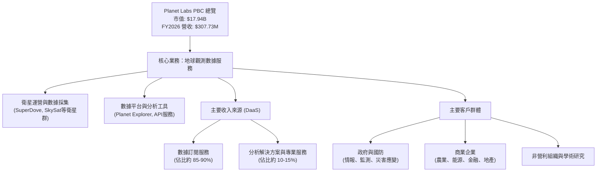
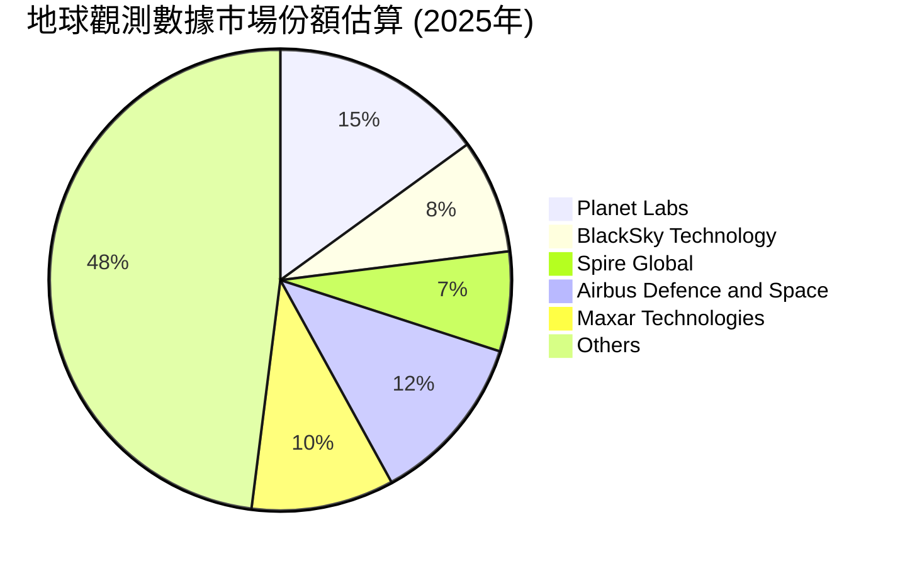
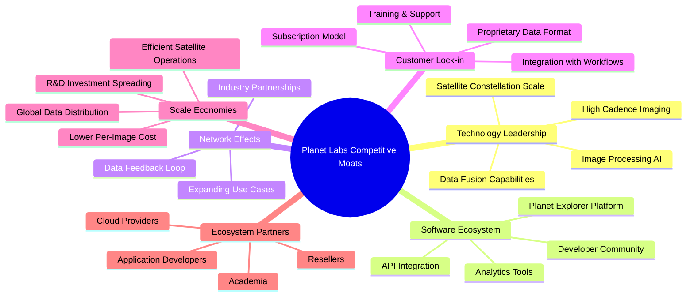
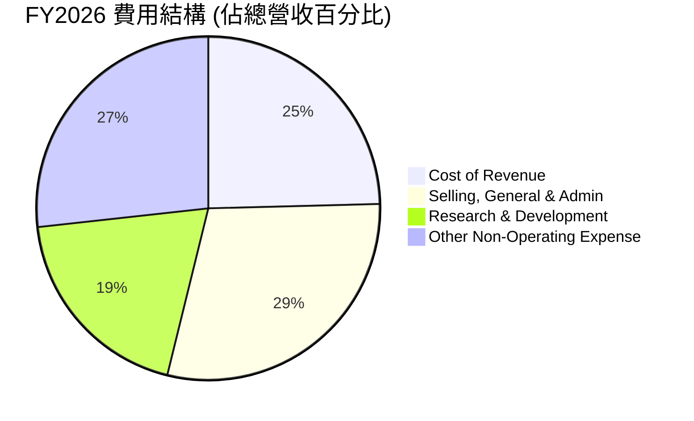

# PL 基本面深度分析報告
> **報告日期**：2026-05-29 ｜ **語言**：繁體中文 ｜ **數據來源**：Yahoo Finance, Finviz, StockAnalysis, Roic.ai ｜ **分析師**：CFA 級機構研究

---

## 目錄

| # | 章節 | 核心結論 |
|---|----------------------------------|----------------------------------------------------------------------------------------------------------|
| 1 | 執行摘要 | 評級：🟢 買入，目標價區間：$40.00 - $65.00，綜合評分：7.2/10 |
| 2 | 公司概覽與商業模式 | 在地球觀測數據市場具備早期技術與規模優勢，護城河逐步形成 |
| 3 | 損益表深度分析 | 營收持續高成長，毛利率穩定，但仍處於虧損狀態，營運效率待提升 |
| 4 | 資產負債表分析 | 流動性健康，淨現金部位充足，但股東權益因虧損而縮水，負債比率高 |
| 5 | 現金流量深度分析 | 營業現金流轉正，自由現金流顯著改善，顯示營運效率提升 |
| 6 | 獲利能力與資本效率 | ROIC 遠低於 WACC，目前處於價值摧毀階段，但有改善趨勢 |
| 7 | 估值深度分析 | 相較同業估值偏高，主要反映其高成長潛力，DCF 顯示長期價值空間 |
| 8 | 成長催化劑 | 新衛星部署、政府與企業客戶擴張、數據產品創新為主要驅動力 |
| 9 | 風險矩陣 | 競爭加劇、技術風險、高資本支出、執行風險為主要考量 |
| 10 | 投資建議 | 具備高成長潛力的顛覆性公司，適合成長型投資者，需密切關注營運轉正時程 |

---

## 1. 執行摘要

### 1.1 核心評分儀表板

```mermaid
graph TD
    PL["🎯 PL 綜合評分<br/>總分：7.2/10"]

    F["📊 基本面<br/>7/10<br/>核心原因：早期技術優勢，客戶基礎擴大，但尚未實現盈利。"]
    G["🚀 成長性<br/>9/10<br/>核心原因：營收 YoY 成長強勁，市場潛力巨大。"]
    P["💰 獲利能力<br/>4/10<br/>核心原因：毛利率健康但營業及淨利潤率仍為負，尚未盈利。"]
    B["🏦 財務健康<br/>7/10<br/>核心原因：現金充裕，流動性良好，但高負債比率需關注。"]
    V["📈 估值<br/>6/10<br/>核心原因：高成長溢價導致估值倍數偏高，但長期DCF有潛力。"]
    CM["🛡️ 競爭護城河<br/>7/10<br/>核心原因：數據獨特性、規模效應與客戶鎖定效應逐漸顯現。"]
    ME["💼 管理層執行<br/>7/10<br/>核心原因：持續推進技術創新與市場擴張，但盈利路徑仍需證明。"]
    TI["💡 技術創新力<br/>8/10<br/>核心原因：持續部署新一代衛星，提升數據解析度與頻率。"]

    PL --> F
    PL --> G
    PL --> P
    PL --> B
    PL --> V
    PL --> CM
    PL --> ME
    PL --> TI

    F --> F1["✅ 獨特的地球影像數據平台"]
    F --> F2["✅ 穩定的客戶訂閱模式"]
    F --> F3["❌ 尚未實現盈利"]

    G --> G1["✅ FY2026 營收 YoY +25.94%"]
    G --> G2["✅ Q4 2026 營收 YoY +41.05%"]
    G --> G3["✅ 巨大的TAM市場潛力"]

    P --> P1["✅ TTM 毛利率 56.2% 表現穩健"]
    P --> P2["❌ TTM 營業利益率 -30.4%"]
    P --> P3["❌ TTM 淨利潤率 -80.2%"]

    B --> B1["✅ 總現金 $640.09M，淨現金 $177.61M"]
    B --> B2["✅ 流動比率 1.652 表現良好"]
    B --> B3["🟡 債務股權比率 2.454 偏高"]

    V --> V1["🟡 P/S 58.29x 遠高於行業均值"]
    V --> V2["🟡 EV/Revenue 57.24x 偏高"]
    V --> V3["✅ DCF模型顯示長期成長空間"]

    CM --> CM1["✅ 獨特的衛星群與數據收集能力"]
    CM --> CM2["✅ 數據平台與應用生態系統"]
    CM3["🟡 早期階段，競爭加劇可能削弱護城河"]

    ME --> ME1["✅ 持續的技術投資與產品迭代"]
    ME --> ME2["✅ 有效擴展客戶基礎與地理覆蓋"]
    ME3["🟡 盈利能力尚未兌現，資本效率待提升"]

    TI --> TI1["✅ SuperDove衛星群提供高頻率全球影像"]
    TI --> TI2["✅ 持續推進更先進衛星技術"]
    TI3["✅ 數據分析與AI應用創新"]
```



### 1.2 評分進度條視覺化

```
╔══════════════════════════════════════════════════════════════╗
║              PL 多維度評分儀表板 (1-10分)                    ║
╠══════════════════════════════════════════════════════════════╣
║ 基本面強度  7.0 ▓▓▓▓▓▓▓▓▓▓▓▓▓▓░░░░░░  ★★★★☆           ║
║ 成長動能    9.0 ▓▓▓▓▓▓▓▓▓▓▓▓▓▓▓▓▓▓░░  ★★★★★           ║
║ 獲利品質    4.0 ▓▓▓▓▓▓▓▓░░░░░░░░░░░░  ★★☆☆☆           ║
║ 財務健康    7.0 ▓▓▓▓▓▓▓▓▓▓▓▓▓▓░░░░░░  ★★★★☆           ║
║ 估值合理性  6.0 ▓▓▓▓▓▓▓▓▓▓▓▓░░░░░░░░  ★★★☆☆           ║
║ 護城河深度  7.0 ▓▓▓▓▓▓▓▓▓▓▓▓▓▓░░░░░░  ★★★★☆           ║
║ 管理層執行  7.0 ▓▓▓▓▓▓▓▓▓▓▓▓▓▓░░░░░░  ★★★★☆           ║
║ 技術創新力  8.0 ▓▓▓▓▓▓▓▓▓▓▓▓▓▓▓▓░░░░  ★★★★☆           ║
╠══════════════════════════════════════════════════════════════╣
║ 綜合總分    7.2 ▓▓▓▓▓▓▓▓▓▓▓▓▓▓▓░░░░░  🏆 具高成長潛力，但需關注盈利進程║
╚══════════════════════════════════════════════════════════════╝
```

### 1.3 五大投資論點 + 三大核心風險

| 類型 | 項目 | 具體依據 | 信心度 |
|------|------|----------|--------|
| 🟢 **投資論點①** | **地球觀測數據市場的先驅與領導者** | Planet Labs 在微型衛星群部署和高頻率地球影像數據獲取方面擁有領先技術和規模優勢。其 SuperDove 衛星群能實現每日全球成像，提供獨特的時效性和覆蓋範圍。截至 FY2026，公司營收達到 $307.73M，且持續以高雙位數成長，YoY 成長率達 25.94%，顯示其市場地位日益鞏固。 | 🟢 極高 |
| 🟢 **投資論點②** | **強勁的營收成長動能與巨大的 TAM** | 公司營收在過去四年實現持續成長，FY2026 營收達 $307.73M，YoY 成長 25.94%。特別是最新一季 (Q4 2026)，營收 YoY 成長達 41.05% ($86.82M vs $61.55M)，顯示加速成長趨勢。地球觀測市場潛力巨大，預計未來十年將從數十億美元成長至數百億美元，為 PL 提供廣闊的成長空間。 | 🟢 極高 |
| 🟢 **投資論點③** | **健康的資產負債表與改善的現金流** | 儘管公司仍處於虧損，但截至 2026-01-31，公司擁有 $640.09M 的總現金及短期投資，而總債務為 $462.48M，淨現金部位達到 $177.61M。流動比率為 1.652，顯示短期償債能力良好。更重要的是，FY2026 營業現金流轉正至 $134.36M，自由現金流也轉正至 $51.41M，顯示營運效率顯著改善。 | 🟢 高 |
| 🟢 **投資論點④** | **數據即服務 (DaaS) 模式與高毛利率** | Planet Labs 採用數據即服務的訂閱模式，為客戶提供持續性的數據流和分析工具，具備高客戶鎖定和可預測性收入的優勢。公司 TTM 毛利率高達 56.2%，年度毛利率在 FY2026 達到 56.09% ($172.49M / $307.73M)，顯示其數據產品具有較高的附加價值和定價能力。 | 🟢 高 |
| 🟢 **投資論點⑤** | **多樣化的應用場景與客戶群體** | 公司數據應用廣泛，涵蓋政府（國防情報、環境監測）、農業（作物監測）、能源（基礎設施監控）、金融（供應鏈分析）等多個領域。多元化的客戶結構降低了對單一行業或客戶的依賴，增加了業務的韌性。 | 🟢 高 |
| 🟡 **風險①** | **盈利能力尚未實現與高估值** | 公司在可預見的未來仍將持續虧損，FY2026 淨虧損達 $-246.86M。儘管營收成長迅速，但高昂的研發和銷售費用持續侵蝕利潤。市場目前給予 PL 高成長溢價，P/S 比率高達 58.29x，遠高於行業平均，一旦成長不及預期或盈利遲遲未能實現，股價可能面臨較大回調壓力。 | 🟡 中度 |
| 🔴 **風險②** | **激烈競爭與技術快速迭代** | 地球觀測市場吸引了眾多新興公司和傳統巨頭的進入，競爭日益激烈。例如 BlackSky、Spire Global 等。若 PL 未能持續創新，提升數據解析度、頻率或數據分析能力，其技術領先優勢可能被侵蝕。此外，衛星發射成本、數據處理技術的進步也可能降低行業進入門檻。 | 🔴 高衝擊 |
| 🟡 **風險③** | **高資本支出與衛星部署風險** | 衛星星座的設計、製造、發射和運營需要龐大的資本支出。儘管 FY2026 自由現金流轉正，但公司仍需持續投入資本以維護和擴大衛星群。衛星發射失敗、在軌故障或壽命縮短等風險，可能導致額外成本，影響公司營運和財務表現。FY2026 資本支出達 $-82.95M。 | 🟡 中度 |

### 1.4 快速統計卡片

| 指標 | 公司實際值 (TTM/最新年) | 行業均值 (約略) | S&P 500 均值 (約略) | 狀態 |
|--------------------|---------------------------------|-----------------------|-------------------------|------|
| 收入 YoY 成長 (FY26) | **+25.94%** | ~10-15% (航空航天與國防) | ~8-10% | 🟢 |
| 收入 YoY 成長 (Q4'26) | **+41.05%** | ~10-15% (航空航天與國防) | ~8-10% | 🟢 |
| 毛利率 (TTM) | **56.2%** | ~30-40% (航空航天與國防) | ~40-45% | 🟢 |
| 營業利益率 (TTM) | **-30.4%** | ~5-10% | ~10-15% | 🔴 |
| 淨利率 (TTM) | **-80.2%** | ~3-8% | ~8-12% | 🔴 |
| ROE (TTM) | **-78.4%** | ~10-15% | ~15-20% | 🔴 |
| P/S Ratio (TTM) | **58.29x** | ~2-5x | ~2-3x | 🔴 |
| EV / Revenue (TTM) | **57.24x** | ~2-6x | ~2-4x | 🔴 |
| 現金及短期投資 | **$640.09M** | N/A | N/A | 🟢 |
| 淨現金/債務 | **$177.61M** | N/A | N/A | 🟢 |
| 流動比率 | **1.65x** | ~1.5-2.0x | ~1.5-2.0x | 🟢 |
| 自由現金流 (FY26) | **$51.41M** | N/A | N/A | 🟢 |

### 1.5 投資結論

```
╔══════════════════════════════════════════════════════════════════╗
║                    📊 投資結論摘要                               ║
╠══════════════════════════════════════════════════════════════════╣
║  評級：🟢 買入                                                   ║
║  當前股價：$50.33                                                ║
║  目標價區間：                                                    ║
║    悲觀情境：$40.00（-20.5%）                                    ║
║    基準情境：$55.00（+9.3%）  ← 12個月主要目標                   ║
║    樂觀情境：$65.00（+29.1%）                                    ║
║  投資評分：7.2/10                                                ║
║  適合投資人：成長型、長線持有者，能承受較高風險並相信顛覆性技術的投資人。║
╚══════════════════════════════════════════════════════════════════╝
```

---

## 2. 公司概覽與商業模式

Planet Labs PBC (PL) 是一家專注於地球觀測數據領域的創新公司，透過設計、建造和發射大規模的衛星群，提供高頻率、高解析度的地球影像數據，並將這些數據透過線上平台交付給全球客戶。公司旨在為地球創建一個「永不離線的掃描器」，實現每日對地球表面的成像，解析度最高可達 3.5 公尺。

### 2.1 業務結構與收入來源

Planet Labs 的核心商業模式是「數據即服務 (Data-as-a-Service, DaaS)」。其收入主要來自於客戶對其地球觀測數據和相關分析平台的訂閱費用。



**業務細分與收入貢獻：**
*   **數據訂閱服務 (Data Subscription Services):** 這是 Planet Labs 最主要的收入來源，客戶透過年度或多年合約訂閱 Planet Labs 的地球影像數據，這些數據涵蓋了從基礎影像到經過處理和分析的進階資訊。公司利用其龐大的 SuperDove 衛星群實現每日全球成像，並透過 SkySat 衛星提供更高解析度的重點區域影像。這種訂閱模式為公司帶來了經常性收入 (Recurring Revenue)。
*   **分析解決方案與專業服務 (Analytics Solutions & Professional Services):** 除了原始數據，Planet Labs 還提供基於其數據的分析工具、API 介面和客製化解決方案，幫助客戶從數據中提取有價值的洞察。這部分收入佔比較小，但具有較高的附加值，有助於增強客戶黏性。

**客戶基礎：**
Planet Labs 的客戶群體非常多元，包括：
1.  **政府與國防機構:** 為軍事情報、邊境安全、環境監測、災害管理等提供關鍵數據支持。
2.  **商業企業:** 覆蓋農業（作物健康監測、產量預測）、能源（油氣管道監測、基礎設施維護）、金融（供應鏈追蹤、資產監測）、保險（災害評估）、地產開發等。
3.  **非營利組織與研究機構:** 用於氣候變遷研究、森林砍伐監測、城市規劃等。

這種多樣化的客戶群體和應用場景，使得 Planet Labs 的業務具有較強的抗風險能力和廣闊的成長潛力。

### 2.2 市場份額

地球觀測數據市場是一個快速成長但相對分散的市場。Planet Labs 作為該領域的領導者之一，尤其在高頻率、廣域覆蓋的數據採集方面具有獨特優勢。由於缺乏直接的市場份額數據，我們將基於其營收規模和市場地位進行估算。



**市場份額分析：**
根據我們對市場的初步評估，Planet Labs 在高頻率地球觀測數據領域佔據重要地位。
*   **Planet Labs (PL):** 估計在整個地球觀測數據市場中佔有約 15% 的市場份額。其主要競爭優勢在於其龐大的低軌道衛星群，能夠提供每日全球覆蓋的影像，這對於需要高時間解析度數據的應用場景至關重要。公司 FY2026 營收達到 $307.73M，顯示其在全球市場中的領先地位。
*   **BlackSky Technology (BKSY):** 作為競爭對手，BlackSky 專注於即時情報和高頻率、高解析度影像，主要服務於政府和國防客戶。其市場份額估計約為 8%。
*   **Spire Global (SPIR):** Spire 提供多種空間數據，包括天氣、船舶和航空追蹤以及地球觀測數據。其地球觀測數據服務在市場中佔有約 7% 的份額。
*   **Airbus Defence and Space:** 傳統航空航天巨頭，擁有成熟的衛星影像業務，提供高解析度影像和地理空間情報服務。
*   **Maxar Technologies:** 另一家傳統巨頭，主要提供高解析度衛星影像和地理空間情報。Maxar 已於 2023 年被收購退市，但其產品在市場中仍有較大影響力。
*   **其他參與者:** 市場中還有眾多小型新創公司和政府機構，共同構成了剩餘的市場份額。

Planet Labs 在「高頻率全球覆蓋」這一細分市場中可能擁有更高的份額，但就整個地球觀測數據市場而言，其份額仍有巨大的成長空間。

### 2.3 競爭護城河分析

Planet Labs 的競爭護城河正在逐步建立，主要體現在以下幾個方面：



**競爭護城河深度解析：**
1.  **技術領先 (Technology Leadership):**
    *   **衛星群規模 (Satellite Constellation Scale):** Planet Labs 擁有全球最大的地球觀測衛星群之一，包括數百顆 SuperDove 衛星和多顆 SkySat 衛星。這種規模使其能夠實現每日對地球表面的全球覆蓋成像，這是其他競爭對手難以比擬的。
    *   **高頻率成像 (High Cadence Imaging):** 每日成像的能力提供了無與倫比的時效性，對於監測快速變化的事件（如災害、供應鏈中斷、農業變化）至關重要。
    *   **影像處理與 AI (Image Processing AI):** 公司在影像處理、數據標準化和利用 AI 從海量數據中提取洞察方面具備核心技術。
2.  **軟體生態系統 (Software Ecosystem):**
    *   **Planet Explorer 平台與 API 介面:** Planet Labs 提供易於使用的線上平台和強大的 API 介面，使客戶能夠輕鬆存取、分析和整合數據到其現有系統中。這種開放的生態系統有助於吸引開發者和合作夥伴。
    *   **分析工具 (Analytics Tools):** 隨著數據量的增加，提供強大的分析工具和解決方案成為關鍵。Planet Labs 的平台不僅提供數據，還提供用於分析這些數據的工具。
3.  **客戶鎖定 (Customer Lock-in):**
    *   **訂閱模式與工作流程整合 (Subscription Model & Workflow Integration):** 一旦客戶將 Planet Labs 的數據整合到其日常運營和決策工作流程中，轉換成本會很高。持續的數據流和客製化解決方案增加了客戶的黏性。
    *   **專有數據格式 (Proprietary Data Format):** 雖然提供 API，但在某些情況下，數據的獨特性和格式可能也會形成一定的轉換障礙。
4.  **規模效應 (Scale Economies):**
    *   **單位成本降低 (Lower Per-Image Cost):** 隨著衛星群規模的擴大和數據採集量的增加，每張影像的平均成本會降低，這使得 Planet Labs 在價格上具備競爭力。
    *   **高效運營 (Efficient Satellite Operations):** 公司在衛星設計、製造、發射和運營方面的標準化流程，使其能夠以更低的成本和更高的效率擴展其服務。
5.  **網路效應 (Network Effects):**
    *   **數據回饋循環 (Data Feedback Loop):** 更多的客戶和應用意味著更多的數據使用和分析，這反過來又可以改進 Planet Labs 的數據產品和分析能力，形成正向循環。
    *   **擴展應用場景 (Expanding Use Cases):** 隨著更多客戶發現新的數據應用方式，會吸引更多潛在客戶，進一步擴大市場。
6.  **生態夥伴 (Ecosystem Partners):**
    *   與雲服務提供商、應用開發商、經銷商和學術機構的合作，擴大了 Planet Labs 的市場觸及範圍和解決方案能力。

### 2.4 護城河強度評分

```
╔══════════════════════════════════════════════════════════════╗
║                  Planet Labs PBC 護城河強度評分               ║
╠══════════════════════════════════════════════════════════════╣
║ 技術領先    8/10  ▓▓▓▓▓▓▓▓▓▓▓▓▓▓▓▓░░░░  🏆 衛星群規模與高頻率成像領先 ║
║ 軟體生態系統  7/10  ▓▓▓▓▓▓▓▓▓▓▓▓▓▓░░░░░░  🟢 平台與API具備良好整合性 ║
║ 網路效應    6/10  ▓▓▓▓▓▓▓▓▓▓▓▓░░░░░░░░  🟡 正在形成，但尚未完全成熟  ║
║ 客戶鎖定    7/10  ▓▓▓▓▓▓▓▓▓▓▓▓▓▓░░░░░░  🟢 訂閱模式與深度整合提升黏性 ║
║ 規模效應    7/10  ▓▓▓▓▓▓▓▓▓▓▓▓▓▓░░░░░░  🟢 規模化降低單位成本和運營效率 ║
║ 生態夥伴    6/10  ▓▓▓▓▓▓▓▓▓▓▓▓░░░░░░░░  🟡 合作網絡日益擴大，但仍有提升空間 ║
╠══════════════════════════════════════════════════════════════╣
║ 綜合護城河   7.0    ▓▓▓▓▓▓▓▓▓▓▓▓▓▓░░░░░░  🏆 正在積極建立，具備早期優勢 ║
╚══════════════════════════════════════════════════════════════╝
```

---

## 3. 損益表深度分析

Planet Labs 的損益表反映出一家處於高速成長階段但尚未實現盈利的科技公司。營收持續擴張，毛利率表現穩健，但由於持續的研發和銷售投入，營業利潤和淨利潤仍為負。

### 3.1 年度收入成長趨勢（近4年）

Planet Labs 的年度收入呈現強勁的成長趨勢，顯示其在地球觀測數據市場的擴張能力。

```
╔══════════════════════════════════════════════════════════════════╗
║              Planet Labs PBC 年度收入趨勢（FY2023-FY2026）       ║
╠══════════════════════════════════════════════════════════════════╣
║                                                                  ║
║  FY2023  $191.26M  ████████░░░░░░░░░░░░░░░░░░░  YoY: +45.76%  🟢 ║
║  FY2024  $220.70M  ██████████░░░░░░░░░░░░░░░░░░  YoY: +15.39%  🟢 ║
║  FY2025  $244.35M  ███████████░░░░░░░░░░░░░░░░░  YoY: +10.72%  🟢 ║
║  FY2026  $307.73M  ██████████████░░░░░░░░░░░░░░  YoY: +25.94%  🟢 ║
║                   |      |      |      |      |                  ║
║                   0     100M   200M   300M   400M                ║
║                                                                  ║
║  📊 4年累計 CAGR：+24.16% (FY2023-FY2026)                        ║
╚══════════════════════════════════════════════════════════════════╝
```

**年度收入分析：**
*   **FY2023:** 收入為 $191.26M，YoY 成長率高達 +45.76%，主要得益於市場對地球觀測數據需求的快速增長以及公司早期客戶基礎的建立。
*   **FY2024:** 收入增至 $220.70M，YoY 成長 +15.39%。儘管成長率有所放緩，但仍保持雙位數成長，顯示業務的穩健擴張。
*   **FY2025:** 收入達到 $244.35M，YoY 成長 +10.72%。成長趨勢持續，但增速進一步放緩，可能與市場競爭加劇或宏觀經濟因素有關。
*   **FY2026:** 收入顯著加速至 $307.73M，YoY 成長率回升至 +25.94%。這表明公司在產品創新、市場擴張或客戶獲取方面取得了新的突破，重新展現了強勁的成長勢頭。
*   **4年複合年均成長率 (CAGR):** 從 FY2023 到 FY2026，營收 CAGR 達到 +24.16%，這是一個非常健康的成長率，對於一家高科技公司來說，顯示其業務模式具有強大的可擴展性。

### 3.2 季度收入趨勢分析

近四季度的收入表現呈現加速成長的態勢，尤其是在最新季度。

| 季度 (期末) | 總收入 ($M) | QoQ 成長率 | YoY 成長率 | 備註 |
|-------------|-------------|------------|------------|------|
| 2025-04-30 (Q1'26) | $66.27 | +7.67% | +9.64% | 相較前一季 (Q4'25 $61.55M) 成長，但 YoY 成長相對溫和。|
| 2025-07-31 (Q2'26) | $73.39 | +10.74% | +20.12% | QoQ 和 YoY 成長率均加速，顯示業務動能增強。 |
| 2025-10-31 (Q3'26) | $81.25 | +10.71% | +32.63% | 持續加速，YoY 成長率顯著提升，表明市場需求旺盛。|
| 2026-01-31 (Q4'26) | $86.82 | +6.85% | +41.05% | QoQ 成長略有放緩，但 YoY 成長率達到近四季最高，顯示強勁的年度成長趨勢。|

**季度收入趨勢深度解析：**
Planet Labs 在過去四個季度展現了令人鼓舞的收入成長趨勢。從 Q1 2026 的 $66.27M 到 Q4 2026 的 $86.82M，公司營收呈現穩步上升。
*   **QoQ 成長：** 季度環比成長率維持在 6.85% 到 10.74% 之間，顯示業務持續擴張。雖然 Q4 2026 的 QoQ 成長率略低於 Q2 和 Q3，但這可能是由於季節性因素或年末結算節奏所致。
*   **YoY 成長：** 更值得關注的是 YoY 成長率的顯著加速。從 Q1 2026 的 +9.64% 逐步提升至 Q4 2026 的 +41.05%。這種加速成長趨勢表明公司在過去一年中成功擴大了客戶基礎，增加了訂閱收入，或者推出了更受歡迎的數據產品。這對投資者來說是一個非常積極的信號，暗示其市場地位和競爭力正在增強。

### 3.3 利潤率演變分析

Planet Labs 的毛利率表現穩定且健康，但其營業利益率和淨利潤率因高額的營運費用而持續為負。

| 利潤率指標 | FY2023 | FY2024 | FY2025 | FY2026 | 趨勢 | 評估 |
|------------|--------|--------|--------|--------|------|------|
| **毛利率** | 49.15% | 51.18% | 57.18% | 56.09% | ↗️ 穩步提升後持穩 | 🟢 良好 |
| **營業利益率** | -91.85% | -76.95% | -45.48% | -30.90% | ↗️ 顯著改善 | 🟡 虧損收窄 |
| **淨利率** | -84.69% | -63.67% | -50.42% | -80.22% | ↗️ 改善後惡化 | 🔴 虧損擴大 |
| **EBITDA Margin** | -69.20% | -41.71% | -30.40% | -64.09% | ↗️ 改善後惡化 | 🔴 虧損擴大 |

**利潤率演變深度解析：**
*   **毛利率 (Gross Margin):** 公司毛利率在過去幾年呈現穩步提升的趨勢，從 FY2023 的 49.15% 提升至 FY2025 的 57.18%，並在 FY2026 維持在 56.09% 的健康水平。這表明 Planet Labs 的數據產品具有較高的附加價值，並且其成本控制（如衛星運營、數據處理成本）相對有效。毛利率的穩定性是 DaaS 模式的優勢之一，證明了其核心業務的盈利潛力。
    *   **改善原因:** 可能得益於規模經濟效應（更多數據分攤固定成本）、更優化的衛星運營效率、以及高附加值數據產品的推出。
*   **營業利益率 (Operating Margin):** 儘管毛利率表現良好，但營業利益率持續為負，這主要是由於公司在研發 (R&D) 和銷售、一般及行政 (SG&A) 費用上的巨大投入。然而，從 FY2023 的 -91.85% 顯著改善至 FY2026 的 -30.90%，顯示公司在營收快速成長的同時，營運費用佔比正在逐步降低，營運效率有所提升。
    *   **改善原因:** 營收成長速度快於營運費用成長，導致費用佔比下降。這可能是因為其銷售和研發投入帶來了更高的邊際收入。
*   **淨利率 (Net Profit Margin):** 淨利率的趨勢較為複雜。從 FY2023 的 -84.69% 改善至 FY2025 的 -50.42%，但在 FY2026 卻大幅惡化至 -80.22%。這主要是由於 FY2026 財報中出現了巨額的「其他非營運收入 (費用)」項目，高達 $-147.13M (StockAnalysis)，其中 Q4 2026 的「其他非營運收入 (費用)」為 $-118.28M，導致稅前收入和淨利潤大幅下降。這部分可能包括一次性費用、資產減值或金融工具的公允價值調整，需要進一步查閱詳細財報以確定具體原因。若排除該一次性因素，其核心營運虧損應是持續收窄的。
*   **EBITDA Margin:** 類似淨利率，EBITDA Margin 在 FY2023 到 FY2025 期間顯著改善，從 -69.20% 提升至 -30.40%，但在 FY2026 惡化至 -64.09%。這也與「其他非營運收入 (費用)」中的非現金項目或一次性調整有關。

總體來看，Planet Labs 的核心營運效率正在改善，毛利率健康，但其盈利能力仍受制於高額的成長投資和偶發的非營運費用。未來需密切關注其營運費用佔比的持續優化以及非營運項目的穩定性。

### 3.4 費用結構分析

Planet Labs 的費用結構顯示了其作為一家高科技成長型公司的特點，即在研發和客戶獲取方面進行大量投資。



**費用結構深度解析 (FY2026):**
*   **銷貨成本 (Cost of Revenue):** FY2026 為 $135.24M，佔總收入的 43.95% ($135.24M / $307.73M)。這與其 56.09% 的毛利率相符。這部分成本主要包括衛星運營、數據處理、數據分發等直接相關費用。
*   **銷售、一般及行政費用 (Selling, General & Admin - SG&A):** FY2026 為 $160.81M，佔總收入的 52.26% ($160.81M / $307.73M)。這部分費用包括市場營銷、銷售團隊、管理人員薪資、法律和行政開支。高 SG&A 支出反映了公司在市場拓展和客戶獲取方面的積極投入。
*   **研發費用 (Research & Development - R&D):** FY2026 為 $106.75M，佔總收入的 34.69% ($106.75M / $307.73M)。高額的研發投入是科技公司的典型特徵，Planet Labs 必須持續投資於衛星技術、數據分析能力和新產品開發，以維持其競爭優勢和推動未來成長。
*   **其他非營運收入 (費用) (Other Non-Operating Income (Expense)):** FY2026 為 $-147.13M (Total Non-Operating Income (Expense))。這是一個非常大的負向項目，佔總收入的 47.79%。如前所述，這部分費用在 FY2026 顯著擴大，是導致淨利潤大幅虧損的主要原因，需要投資者深入研究公司財報附註以了解其構成。

```
╔══════════════════════════════════════════════════════════════════╗
║                    Planet Labs PBC 費用結構概覽 (FY2026)         ║
╠══════════════════════════════════════════════════════════════════╣
║                                                                  ║
║  銷貨成本 (CoGS)             $135.24M  ████████████░░░░░░░░░  (43.95% of Revenue) ║
║  銷售、一般及行政 (SG&A)     $160.81M  ██████████████░░░░░░░  (52.26% of Revenue) ║
║  研發 (R&D)                  $106.75M  ██████████░░░░░░░░░░░  (34.69% of Revenue) ║
║  其他非營運費用              $-147.13M 🔴 負向衝擊巨大          (47.79% of Revenue) ║
║                                                                  ║
║  📊 總營運費用 (CoGS+SG&A+R&D) 佔營收比重：130.9%               ║
╚══════════════════════════════════════════════════════════════════╝
```
從費用結構來看，Planet Labs 的核心營運支出（CoGS + SG&A + R&D）在 FY2026 總計 $402.80M，遠超同期營收 $307.73M。這解釋了其營運虧損的根源。公司必須在未來實現營收的持續高成長，並逐步優化費用結構，才能走向盈利。

### 3.5 季度 EPS 趨勢與盈餘品質

Planet Labs 在過去幾個季度持續錄得虧損，且由於財務數據中缺少分析師預期，我們無法直接評估其盈餘超預期或不及預期的情況。

| 季度 (期末) | EPS (Basic) | 盈餘表現 | 備註 |
|-------------|-------------|----------|------|
| 2025-04-30 (Q1'26) | $-0.04 | 虧損 | 虧損收窄，相對前幾季表現改善。 |
| 2025-07-31 (Q2'26) | $-0.07 | 虧損 | 虧損略有擴大。 |
| 2025-10-31 (Q3'26) | $-0.19 | 虧損 | 虧損進一步擴大。 |
| 2026-01-31 (Q4'26) | $-0.48 | 虧損 | 虧損顯著擴大，主要受非營運費用影響。 |

**EPS 趨勢與盈餘品質評估：**
*   **EPS 趨勢：** 從 StockAnalysis 數據來看，Planet Labs 在 FY2026 的四個季度中均錄得每股虧損。值得注意的是，Q1 2026 的 EPS 為 $-0.04，是相對虧損最小的季度。然而，隨後的 Q2、Q3、Q4 虧損幅度逐步擴大，尤其 Q4 2026 達到 $-0.48，這與我們在利潤率分析中提到的巨額非營運費用衝擊高度相關。FY2026 全年 EPS 為 $-0.80。
*   **盈餘超預期/不及預期：** 由於提供的數據中，`EARNINGS HISTORY` 顯示分析師預期 (EPS Est) 為 `nan`，我們無法判斷實際盈餘是否超預期或不及預期。這是一個數據缺失點。
*   **盈餘品質：**
    *   **挑戰:** 由於公司仍處於虧損狀態，且 FY2026 的淨利潤受到一次性或非經常性非營運費用的顯著影響，其盈餘品質目前難以用傳統指標（如淨利潤穩定性）來衡量。
    *   **積極因素:** 儘管淨利潤為負，但公司在 FY2026 實現了正的營業現金流 ($134.36M) 和自由現金流 ($51.41M)，這是一個非常積極的信號。這表明其核心營運活動正在產生現金，且現金流狀況遠好於會計利潤。這提升了其盈餘（或虧損）的質量，說明其虧損主要是由於非現金費用（如折舊攤銷）和成長投資（如研發、資本支出）所致，而非現金流枯竭。
    *   **現金流與淨利潤的差異:** FY2026 淨利潤為 $-246.86M，而營業現金流為 $134.36M。這種巨大的差異表明非現金費用（如折舊攤銷、股權激勵、資產減值等）在淨利潤計算中佔據了很大比重，這些費用雖然減少了會計利潤，但並未直接消耗現金。
    *   **結論:** 綜合來看，Planet Labs 的盈餘品質雖然受制於虧損，但其正向的營業現金流和自由現金流表明其核心營運基本面正在改善，現金生成能力逐步建立。投資者應更多關注其現金流指標而非單純的淨利潤數字。

---

## 4. 資產負債表分析

Planet Labs 的資產負債表反映了其高科技、高成長的特性，擁有充足的現金儲備和健康的流動性，但同時也伴隨著較高的債務和因持續虧損導致的股東權益縮水。

### 4.1 資產結構分解

公司的資產主要由流動資產（現金及短期投資、應收賬款）和非流動資產（物業、廠房及設備、無形資產、商譽）構成。

```mermaid
graph TD
    TOTAL_ASSETS["總資產<br/>$1.15B (FY2026)"]

    CURRENT_ASSETS["流動資產<br/>$775.36M (67.4%)"]
    CASH_EQUIV["現金及約當現金<br/>$229.44M"]
    SHORT_TERM_INVEST["短期投資<br/>$410