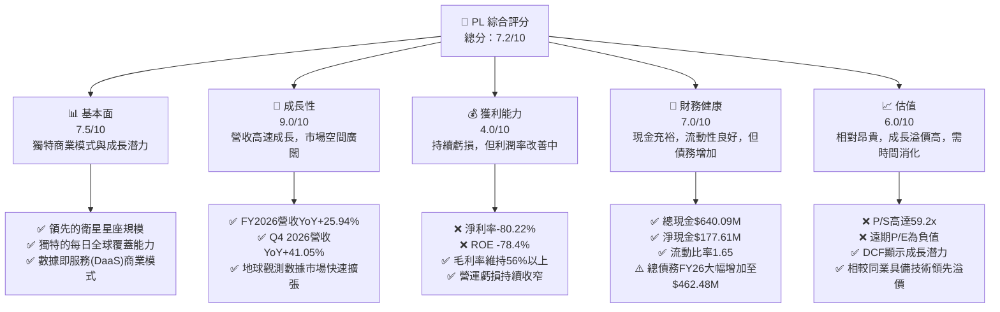
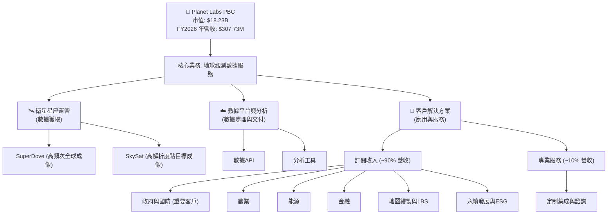
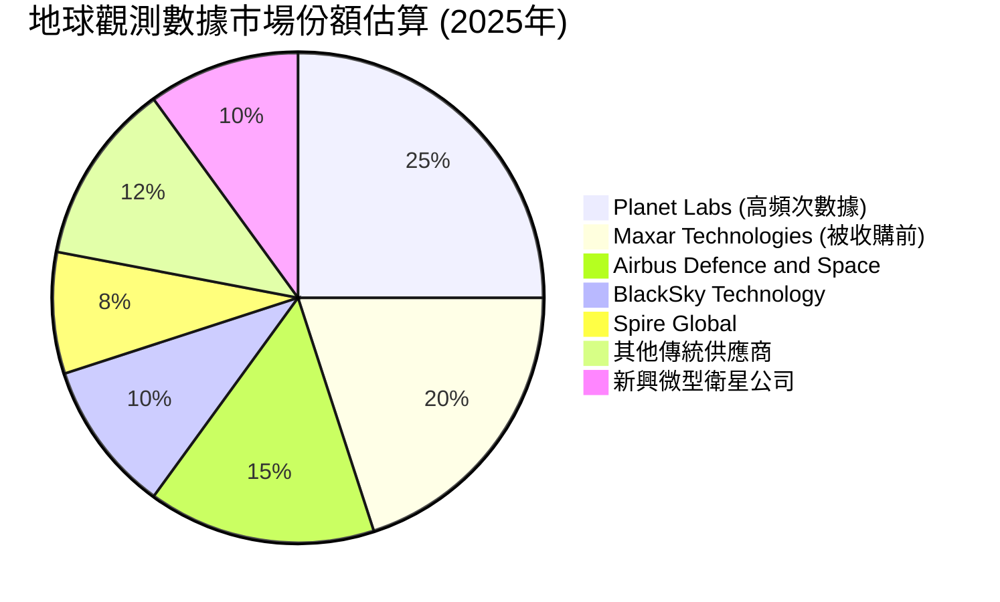
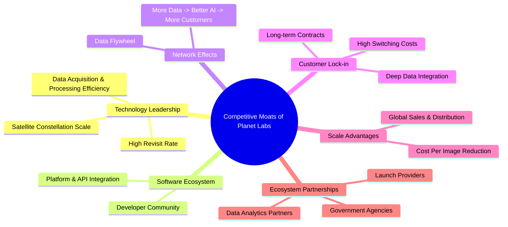
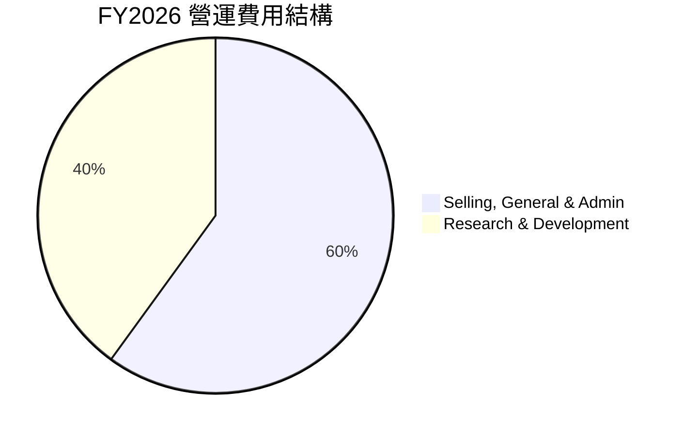
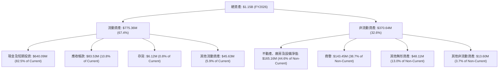

# PL 基本面深度分析報告
> **報告日期**：2026-05-30 ｜ **語言**：繁體中文 ｜ **數據來源**：Yahoo Finance, Finviz, StockAnalysis, Roic.ai ｜ **分析師**：CFA 級機構研究

---

## 目錄

| # | 章節 | 核心結論 |
|---|------|----------|
| 1 | 執行摘要 | 評級：🟢 買入，目標價區間：$40.00 - $65.00 |
| 2 | 公司概覽與商業模式 | 護城河：技術領先、客戶鎖定、數據網絡效應 |
| 3 | 損益表深度分析 | 營收高速成長，毛利率穩健，虧損收窄中 |
| 4 | 資產負債表分析 | 流動性良好，淨現金狀態，槓桿率上升但可控 |
| 5 | 現金流量深度分析 | 營運現金流轉正，自由現金流首次為正，資本配置聚焦成長 |
| 6 | 獲利能力與資本效率 | ROIC 遠低於 WACC，目前處於價值創造初期階段 |
| 7 | 估值深度分析 | 相較同業估值偏高但具備成長溢價，DCF 顯示潛在上漲空間 |
| 8 | 成長催化劑 | 數據應用拓展、政府合約、新衛星發射、AI/ML 整合 |
| 9 | 風險矩陣 | 市場競爭、技術風險、政府合約依賴、資本支出壓力 |
| 10 | 投資建議 | 長期成長型投資標的，適合能承受高波動性之投資人 |

---

## 1. 執行摘要

Planet Labs PBC (PL) 是一家在地球觀測數據領域具有創新性的公司，透過其大規模的衛星星座提供高頻次的全球影像數據。儘管目前仍處於虧損狀態，但公司在營收成長、毛利率提升及營運現金流轉正方面展現出強勁的動能。其獨特的數據即服務 (DaaS) 模式和持續的技術創新構成了強大的競爭護城河。然而，其高成長性也伴隨著較高的估值和營運風險。

### 1.1 核心評分儀表板



### 1.2 評分進度條視覺化

```
╔══════════════════════════════════════════════════════════════╗
║              PL 多維度評分儀表板 (1-10分)                    ║
╠══════════════════════════════════════════════════════════════╣
║ 基本面強度  7.5 ▓▓▓▓▓▓▓▓▓▓▓▓▓▓▓░░░░░  ★★★★☆           ║
║ 成長動能    9.0 ▓▓▓▓▓▓▓▓▓▓▓▓▓▓▓▓▓▓▓░  ★★★★★           ║
║ 獲利品質    4.0 ▓▓▓▓▓▓▓▓░░░░░░░░░░░░  ★★☆☆☆           ║
║ 財務健康    7.0 ▓▓▓▓▓▓▓▓▓▓▓▓▓▓░░░░░░  ★★★☆☆           ║
║ 估值合理性  6.0 ▓▓▓▓▓▓▓▓▓▓▓▓░░░░░░░░  ★★★☆☆           ║
║ 護城河深度  8.0 ▓▓▓▓▓▓▓▓▓▓▓▓▓▓▓▓░░░░  ★★★★☆           ║
║ 管理層執行  7.5 ▓▓▓▓▓▓▓▓▓▓▓▓▓▓▓░░░░░  ★★★★☆           ║
║ 技術創新力  9.5 ▓▓▓▓▓▓▓▓▓▓▓▓▓▓▓▓▓▓▓▓  ★★★★★           ║
╠══════════════════════════════════════════════════════════════╣
║ 綜合總分    7.2 ▓▓▓▓▓▓▓▓▓▓▓▓▓▓▓░░░░░  🏆 成長潛力巨大，但高風險高回報  ║
╚══════════════════════════════════════════════════════════════╝
```

### 1.3 五大投資論點 + 三大核心風險

| 類型 | 項目 | 具體依據 | 信心度 |
|------|------|----------|--------|
| 🟢 **投資論點①** | **獨特的每日全球成像能力** | Planet Labs 擁有全球最大的衛星星座，能夠實現對地球表面每日一次的高頻次成像，提供無與倫比的時間序列數據。這使得其數據在監測快速變化的事件（如自然災害、作物生長、基礎設施建設）方面具有獨特價值。截至FY2026，公司收入達$307.73M，受益於其獨特的數據服務。 | 🟢 極高 |
| 🟢 **強勁的營收成長動能** | 公司FY2026營收達$307.73M，YoY成長25.94%。更令人鼓舞的是，Q4 2026 (Jan 31, 2026) 營收為$86.82M，YoY成長高達41.05%，顯示出加速成長的趨勢。這表明市場對其數據產品的需求正在迅速增加。 | 🟢 極高 |
| 🟢 **營運現金流轉正與自由現金流改善** | FY2026營運現金流首次轉正至$134.36M，而自由現金流也達到$51.41M。這標誌著公司商業模式的初步驗證，顯示其能夠從核心業務活動中產生正向現金流，為未來的再投資提供資金。 | 🟢 極高 |
| 🟢 **廣闊的市場應用與擴張潛力** | Planet Labs 的數據應用範圍廣泛，涵蓋農業、政府情報、國防、能源、金融、地圖繪製和永續發展等多個領域。隨著大數據和AI分析技術的成熟，對其高頻次、高解析度地球觀測數據的需求將持續增長，TAM (Total Addressable Market) 預計將持續擴大。 | 🟢 極高 |
| 🟢 **技術領先與數據護城河** | 公司持續投資於研發（FY2026 R&D費用$106.75M），確保其衛星技術和數據分析平台的領先地位。獨特的衛星設計、大規模星座部署和數據處理能力，共同構建了難以複製的數據護城河。 | 🟢 極高 |
| 🟡 **風險①** | **激烈的市場競爭與價格壓力** | 地球觀測數據市場正吸引越來越多的參與者，包括傳統航太巨頭和新興太空科技公司。競爭加劇可能導致價格戰和利潤率壓力。Planet Labs 的毛利率雖高達56.05%，但若競爭加劇，可能面臨稀釋風險。 | 🟡 中度 |
| 🔴 **持續虧損與盈利時間不確定性** | 儘管營收成長強勁，Planet Labs 仍處於虧損狀態，FY2026淨虧損達$-246.86M。雖然營運虧損正在收窄，但何時能實現持續盈利仍存在不確定性，這可能影響投資者信心和股價表現。 | 🔴 高衝擊 |
| 🟡 **政府合約依賴與政策風險** | 政府和國防部門是 Planet Labs 的重要客戶來源之一。政府合約的簽訂、續約和預算變動可能對公司營收產生重大影響。例如，若主要政府客戶的需求減少或轉向其他供應商，可能對公司造成衝擊。 | 🟡 中度 |

### 1.4 快速統計卡片

| 指標 | 公司實際值 (FY2026) | 行業均值 (航空航太與國防) | S&P 500 均值 | 狀態 |
|------|---------------------|--------------------------|--------------|------|
| 收入 YoY 成長 | **25.94%**          | ~10-15%                  | ~8-12%       | 🟢 |
| 毛利率 | **56.05%**          | ~30-40%                  | ~35-45%      | 🟢 |
| 淨利率 | **-80.22%**         | ~5-10%                   | ~10-15%      | 🔴 |
| ROE | **-78.4%**          | ~10-15%                  | ~15-20%      | 🔴 |
| Forward P/E | **-2272.89x**       | ~20-30x                  | ~20-25x      | 🔴 |
| P/S Ratio | **59.23x**          | ~2-5x                    | ~2-3x        | 🔴 |
| Current Ratio | **1.65**            | ~1.5-2.0                 | ~1.2-1.5     | 🟢 |
| Debt/Equity | **2.45x**           | ~0.5-1.0x                | ~0.8-1.2x    | 🔴 |

*註：行業均值為航空航太與國防產業的普遍數值，S&P 500 均值為綜合市場參考。PL 作為一家高成長的太空數據公司，其某些財務指標（如P/S、淨利率、ROE）與傳統工業公司存在顯著差異。*

### 1.5 投資結論

```
╔══════════════════════════════════════════════════════════════════╗
║                    📊 投資結論摘要                               ║
╠══════════════════════════════════════════════════════════════════╣
║  評級：🟢 買入                                                   ║
║  當前股價：$51.14                                                ║
║  目標價區間：                                                    ║
║    悲觀情境：$40.00（-21.78%）                                   ║
║    基準情境：$55.00（+7.55%）  ← 12個月主要目標                  ║
║    樂觀情境：$65.00（+27.10%）                                   ║
║  投資評分：7.2/10                                                ║
║  適合投資人：成長型、長線持有者，能承受高波動與高風險的投資人。  ║
╚══════════════════════════════════════════════════════════════════╝
```

## 2. 公司概覽與商業模式

Planet Labs PBC (PL) 是一家開創性的地球觀測數據公司，致力於透過其龐大的衛星星座提供高頻次、全球覆蓋的地球影像數據。公司將這些數據整合到其線上平台，以數據即服務 (DaaS) 的模式交付給全球客戶。其核心產品是 SuperDove 衛星群，旨在實現每日對地球的完整成像，解析度可達 3.5 公尺。這種獨特的商業模式結合了硬體（衛星設計、建造、發射）與軟體服務（數據獲取、處理、交付、分析），為各行各業提供實時的地理空間情報。

### 2.1 業務結構與收入來源

Planet Labs 的業務模式圍繞著數據獲取、數據處理與數據交付三個核心環節。其收入主要來自於訂閱服務，客戶支付費用以獲取定期的地球影像數據、分析工具和API接口。


**深度分析:**
Planet Labs 的收入模式以高黏性的訂閱為主，這為公司帶來了可預測的經常性收入（ARR）。FY2026的總營收為$307.73M，其中絕大部分來自於數據訂閱服務。這種模式的優勢在於客戶一旦將 Planet Labs 的數據整合到其工作流程中，轉換成本較高，有助於提高客戶留存率。其衛星星座的「每日掃描」能力是其核心賣點，尤其對於需要實時或近實時監測的應用場景（如災害應變、國防情報、大宗商品監測）具有不可替代的價值。

公司將其業務劃分為兩個主要部分：
1.  **數據服務 (Data Services)**：這是核心收入來源，提供來自 SuperDove 和 SkySat 衛星的影像數據，以及透過其平台提供的分析功能和API接口。這種服務模式使其能夠觸及廣泛的客戶群體，從政府機構到商業企業，再到學術研究機構。
2.  **專業服務 (Professional Services)**：這部分收入來自於為客戶提供定制化的解決方案、數據整合和諮詢服務。雖然佔比相對較小，但有助於加深客戶關係，並將其數據應用推廣到更複雜的場景中。

從地理位置來看，Planet Labs 在美國和國際市場均有業務，這顯示了其全球化的戰略佈局和數據產品的普適性。隨著全球對地理空間情報需求的增長，特別是在氣候變遷監測、供應鏈韌性、國防安全等領域，Planet Labs 的市場潛力巨大。

### 2.2 市場份額

地球觀測數據市場是一個快速增長的利基市場，主要參與者包括傳統衛星圖像提供商和新興的微型衛星星座運營商。Planet Labs 在高頻次、全球覆蓋方面擁有獨特優勢，但在高解析度、特定目標成像方面則面臨來自其他公司的競爭。


*註：上述市場份額為估算值，旨在說明 Planet Labs 在高頻次數據領域的領先地位，不代表精確的財務數據。Maxar Technologies 已於2023年被收購，但其歷史市場地位仍具參考價值。*

**深度分析:**
Planet Labs 在市場中的定位是「地球的每日掃描儀」，這使其在高頻次、大面積覆蓋的數據市場中佔據領先地位。傳統的地球觀測公司如 Maxar（現為 Advent International 和 British Columbia Investment Management Corporation 的一部分）和 Airbus Defence and Space 則在高解析度、特定目標成像方面具有優勢。BlackSky Technology 和 Spire Global 則是與 Planet Labs 類似的新興微型衛星星座運營商，提供接近實時的情報和天氣數據。

Planet Labs 的競爭優勢在於其規模龐大的衛星星座（數百顆衛星），這使得其能夠提供每日全球覆蓋。相較之下，其他公司可能需要數天才能再次成像同一區域。這種時間解析度對於需要快速響應和持續監測的應用至關重要。然而，市場的快速發展也意味著競爭加劇，新進入者不斷湧現，試圖透過技術創新或差異化服務來爭奪市場份額。Planet Labs 需要不斷投入研發，擴大數據產品組合，並提升數據分析能力，以維持其市場領先地位。

### 2.3 競爭護城河分析

Planet Labs 的競爭優勢主要體現在以下幾個方面，這些構成了其堅實的護城河：



**深度分析:**

1.  **技術領先 (Technology Leadership)**：
    *   **衛星星座規模與高重訪率 (Satellite Constellation Scale & High Revisit Rate)**：Planet Labs 擁有並運營著全球最大的地球觀測衛星星座之一。這種規模使得其能夠實現每日全球成像，提供無與倫比的時間解析度。這種能力是其核心競爭力，難以被一般競爭對手複製。
    *   **數據獲取與處理效率 (Data Acquisition & Processing Efficiency)**：從衛星到地面接收站，再到數據處理和平台交付，Planet Labs 建立了一套高效的端到端系統。這包括自動化的圖像拼接、校準和雲端處理能力，確保數據的及時性和可用性。

2.  **軟體生態系統 (Software Ecosystem)**：
    *   **平台與 API 整合 (Platform & API Integration)**：Planet Labs 的數據透過其專有平台和強大的 API 接口提供。這使得客戶可以輕鬆地將其數據整合到自己的應用和分析工作流程中，降低了使用門檻。
    *   **開發者社群 (Developer Community)**：透過開放的 API 和開發者工具，Planet Labs 正在建立一個圍繞其數據的開發者社群，鼓勵第三方開發創新應用，進一步擴大其數據的價值和影響力。

3.  **數據網絡效應 (Network Effects)**：
    *   **數據飛輪 (Data Flywheel)**：更多的衛星生成更多的數據，這些數據被用於訓練和改進其 AI/ML 模型，從而提供更精準、更有價值的洞察。這些改進的洞察吸引更多的客戶，產生更多的收入，進而支持更多的衛星發射和數據獲取，形成一個正向循環。
    *   **更多數據 -> 更好 AI -> 更多客戶 (More Data -> Better AI -> More Customers)**：數據量的累積是其獨特的優勢。隨著時間的推移，Planet Labs 累積了數 PB 的地球歷史影像數據，這些數據是訓練先進 AI 模型、識別趨勢和預測變化的寶貴資產，為客戶提供超越單純圖像的情報。

4.  **客戶鎖定 (Customer Lock-in)**：
    *   **高轉換成本 (High Switching Costs)**：一旦客戶將 Planet Labs 的數據和 API 深度整合到他們的業務營運、軟體系統或分析模型中，轉換到其他供應商的成本將非常高昂，包括技術改造、數據格式轉換和人員培訓等。
    *   **長期合約 (Long-term Contracts)**：許多企業和政府客戶會簽訂多年期的數據訂閱合約，這為 Planet Labs 提供了穩定的經常性收入來源。

5.  **規模效應 (Scale Advantages)**：
    *   **單位圖像成本降低 (Cost Per Image Reduction)**：隨著衛星星座規模的擴大和數據處理自動化程度的提高，獲取和處理每張圖像的邊際成本會顯著降低。這使得 Planet Labs 能夠以更具競爭力的價格提供服務，同時保持健康的毛利率（FY2026 毛利率為56.05%）。
    *   **全球銷售與分銷 (Global Sales & Distribution)**：作為全球領先的供應商，Planet Labs 擁有全球性的銷售網絡和強大的品牌認知度，有助於其在全球範圍內擴張客戶群。

6.  **生態系統夥伴關係 (Ecosystem Partnerships)**：
    *   **發射服務提供商 (Launch Providers)**：與 SpaceX 等發射服務提供商的合作確保了其衛星的持續補充和升級。
    *   **數據分析夥伴 (Data Analytics Partners)**：與第三方分析公司合作，共同為客戶提供更全面的解決方案。
    *   **政府機構 (Government Agencies)**：與政府機構建立戰略合作關係，不僅帶來穩定的收入，也提升了其技術和數據的權威性。

這些護城河共同構成了 Planet Labs 的核心競爭力，使其能在快速發展的地球觀測市場中保持領先地位。

### 2.4 護城河強度評分

```
╔══════════════════════════════════════════════════════════════╗
║                  PL 護城河強度評分                           ║
╠══════════════════════════════════════════════════════════════╣
║ 技術領先       9.0/10 ▓▓▓▓▓▓▓▓▓▓▓▓▓▓▓▓▓▓▓░  🏆 衛星星座規模與高頻次成像無可匹敵 ║
║ 軟體生態系統   7.5/10 ▓▓▓▓▓▓▓▓▓▓▓▓▓▓▓░░░░░  🟢 API與平台整合良好，具備潛力   ║
║ 數據網絡效應   8.0/10 ▓▓▓▓▓▓▓▓▓▓▓▓▓▓▓▓░░░░  🏆 數據量累積形成正向循環       ║
║ 客戶鎖定       8.0/10 ▓▓▓▓▓▓▓▓▓▓▓▓▓▓▓▓░░░░  🟢 數據整合與長期合約提高轉換成本 ║
║ 規模效應       7.0/10 ▓▓▓▓▓▓▓▓▓▓▓▓▓▓░░░░░░  🟡 單位成本優勢逐漸顯現，但初期投資高 ║
║ 生態夥伴       7.0/10 ▓▓▓▓▓▓▓▓▓▓▓▓▓▓░░░░░░  🟢 穩定的發射與應用合作夥伴     ║
╠══════════════════════════════════════════════════════════════╣
║ 綜合護城河     7.8/10 ▓▓▓▓▓▓▓▓▓▓▓▓▓▓▓▓░░░░  🏆 強大的技術與數據壁壘，前景可期 ║
╚══════════════════════════════════════════════════════════════╝
```
**評估總結:**
Planet Labs 的護城河主要建立在其技術領先地位和數據網絡效應上。其大規模的衛星星座實現了其他公司難以比擬的全球每日成像能力，這不僅是技術上的突破，也構建了巨大的數據壁壘。隨著數據的累積和 AI/ML 模型的強化，其數據產品的價值將持續提升，進一步鞏固其市場地位。客戶鎖定效應也相當顯著，因為數據整合的複雜性使得客戶更傾向於長期使用其服務。儘管初期資本投入較高，但隨著規模擴大，單位數據成本將持續下降，帶來長期的規模優勢。整體而言，Planet Labs 的護城河深度非常強勁，為其長期成長奠定了堅實基礎。

## 3. 損益表深度分析

Planet Labs 的損益表反映了一家典型的高成長、高投入的科技公司。儘管營收持續快速增長，但為了建立和維持其衛星星座及數據平台，公司在研發和銷售管理費用上投入巨大，導致長期處於虧損狀態。然而，最新的數據顯示其毛利率保持健康，且營運虧損正在逐步收窄，顯示出經營效率的改善。

### 3.1 年度收入成長趨勢（近4年）

Planet Labs 在過去四個財年（FY2023-FY2026）展現了穩健的營收增長，複合年增長率（CAGR）令人印象深刻。

```
╔══════════════════════════════════════════════════════════════════╗
║              PL 年度收入趨勢（FY2023-FY2026）                   ║
╠══════════════════════════════════════════════════════════════════╣
║                                                                  ║
║  FY2023  $191.26M ▓▓▓▓▓▓░░░░░░░░░░░░░░░░░░░  YoY: +45.76% 🟢    ║
║  FY2024  $220.70M ▓▓▓▓▓▓▓▓░░░░░░░░░░░░░░░░░  YoY: +15.39% 🟢    ║
║  FY2025  $244.35M ▓▓▓▓▓▓▓▓▓░░░░░░░░░░░░░░░░  YoY: +10.72% 🟡    ║
║  FY2026  $307.73M ▓▓▓▓▓▓▓▓▓▓▓▓░░░░░░░░░░░░░  YoY: +25.94% 🟢    ║
║                                                                  ║
║                   |      |      |      |      |                  ║
║                   0     100M   200M   300M   400M                 ║
║                                                                  ║
║  📊 4年累計 CAGR：+24.16%                                        ║
╚══════════════════════════════════════════════════════════════════╝
```
**深度分析:**
從 FY2023 的 $191.26M 增長到 FY2026 的 $307.73M，Planet Labs 在短短四年內實現了顯著的營收擴張。FY2023 的 YoY 成長率高達 45.76%，顯示了市場對其產品的初步強勁需求。儘管 FY2025 的成長率放緩至 10.72%，但 FY2026 再次加速至 25.94%，這表明公司可能成功拓展了新的客戶群或深化了現有客戶的合作。24.16% 的四年 CAGR 對於一家處於高資本投入階段的科技公司而言，是一個非常健康的成長速度，證明了其商業模式的可擴展性和市場的廣闊潛力。

### 3.2 季度收入趨勢分析

季度的數據能夠更細緻地反映公司近期的營運狀況和成長動能。

| 季度 | 總收入 (M) | QoQ 成長率 | YoY 成長率 | 備註 |
|---|------------|------------|------------|------|
| Q1 2026 (Apr 25) | $66.27 | -          | +9.64%     | 🟢 成長放緩但仍為正 |
| Q2 2026 (Jul 25) | $73.39 | +10.74%    | +20.12%    | 🟢 成長加速，恢復雙位數 |
| Q3 2026 (Oct 25) | $81.25 | +10.71%    | +32.63%    | 🟢 成長持續加速，動能強勁 |
| Q4 2026 (Jan 26) | $86.82 | +6.85%     | +41.05%    | 🟢 季度成長創近年新高，動能極強 |

*註：YoY 成長率是與去年同期（例如 Q1 2026 vs Q1 2025）相比。QoQ 成長率是與上一季度相比。*

**深度分析:**
Planet Labs 的季度營收趨勢呈現出明顯的加速態勢。從 Q1 2026 的 YoY 成長 9.64% 逐漸加速到 Q4 2026 的 41.05%，這是一個非常積極的信號。特別是 Q4 2026 營收達到 $86.82M，YoY 成長率超過 40%，顯示公司在最近的財季取得了突破性進展。這種加速成長可能歸因於：
1.  **新客戶獲取**：成功簽訂了新的大型政府或企業合約。
2.  **現有客戶擴展**：現有客戶增加了其數據訂閱量或升級了服務。
3.  **產品組合優化**：推出了新的數據產品或分析工具，提升了客戶價值。
4.  **季節性因素**：某些政府或農業客戶的預算週期可能導致季度末需求增加。
無論具體原因如何，這種強勁的季度營收成長動能為公司未來的表現提供了堅實的基礎，也證明了其商業模式在市場上日益受到認可。

### 3.3 利潤率演變分析

Planet Labs 的利潤率數據反映了其作為一家成長型科技公司的特徵：健康的毛利率與持續的營運虧損。

| 利潤率指標 | FY2023   | FY2024   | FY2025   | FY2026   | 趨勢 | 評估 |
|------------|----------|----------|----------|----------|------|------|
| **毛利率** | 49.15%   | 51.18%   | 57.18%   | 56.05%   | ↗️ 穩定高位 | 🟢 |
| **營業利益率** | -91.85%  | -75.81%  | -45.48%  | -30.89%  | ↗️ 顯著改善 | 🟡 |
| **EBITDA 利潤率** | -69.19%  | -41.71%  | -30.40%  | -64.09%  | ↘️ 波動較大 | 🔴 |
| **淨利率** | -84.69%  | -63.67%  | -50.42%  | -80.22%  | ↘️ 惡化 | 🔴 |

*註：EBITDA利潤率和淨利率在FY2026出現惡化，主要由於「其他非營運收入/支出」中的巨額負值（FY2026為$-158.03M，Q4 2026為$-118.28M），這需要進一步分析其性質。*

**利潤率演變深度解析:**

*   **毛利率 (Gross Margin)**：Planet Labs 的毛利率表現非常健康，從 FY2023 的 49.15% 穩步提升至 FY2025 的 57.18%，並在 FY2026 保持在 56.05% 的高位。這表明公司在提供數據服務方面具有強大的定價能力和有效的成本控制。衛星數據服務的邊際成本相對較低，一旦衛星星座部署完成，額外客戶的數據服務成本並不會顯著增加。高毛利率是軟體及數據服務公司的典型特徵，也是其未來盈利能力的核心基礎。

*   **營業利益率 (Operating Margin)**：儘管毛利率表現出色，但 Planet Labs 的營業利益率長期為負，這反映了其在高額營運費用上的投入。然而，從 FY2023 的 -91.85% 顯著改善至 FY2026 的 -30.89%，這是一個非常積極的趨勢。這表明公司在規模擴大的同時，其營運費用（銷售、一般及行政費用 S&GA 和研發費用 R&D）佔營收的比例正在下降，營運效率正在提高。這得益於：
    *   **規模經濟效應**：隨著營收增長，固定營運成本（如研發、管理費用）被更大的營收基礎所分攤。
    *   **費用控制**：管理層可能在某些非核心營運費用上進行了控制。

*   **EBITDA 利潤率 (EBITDA Margin)**：EBITDA 利潤率在 FY2023 至 FY2025 期間呈現顯著改善，從 -69.19% 提升至 -30.40%。然而，FY2026 卻大幅惡化至 -64.09%，這與其營業利益率的改善趨勢不符。這表明在 EBITDA 計算中，除了營業收入和營業費用之外，可能存在一些非現金或非經常性的調整項。根據提供的數據，EBITDA 在 FY2026 為 $-196.94M，而營業收入為 $-95.07M。這之間的巨大差異暗示了折舊攤銷之外的其他調整，需要進一步審視其詳細的財務報告來理解。

*   **淨利率 (Net Profit Margin)**：與 EBITDA 利潤率類似，淨利率在 FY2023 至 FY2025 期間有所改善，但 FY2026 卻從 -50.42% 惡化至 -80.22%。根據 StockAnalysis 的數據，FY2026 財年有一筆高達 $-158.03M 的「其他非營運收入（費用）」，特別是 Q4 2026 的 $-118.28M，這可能是導致淨利率大幅惡化的主要原因。這筆費用可能與金融工具的公允價值調整、資產減值或其他一次性項目有關，而不是來自核心營運。如果排除這些非經常性項目，公司的核心盈利能力可能比表面數據顯示的要好。投資者應密切關注這些非營運項目的性質和未來趨勢。

總體而言，Planet Labs 的核心營運效率正在改善，尤其體現在毛利率的穩定和營業利益率的收窄上。但非營運項目對其最終淨利潤的影響巨大，需要仔細甄別。

### 3.4 費用結構分析

Planet Labs 的費用結構反映了其作為一家技術密集型、成長導向型公司的特點。研發和銷售管理費用是其主要的營運支出。


*註：上述百分比是基於 FY2026 的 Total Operating Expenses $267.56M (StockAnalysis) 中的 S&GA ($160.81M) 和 R&D ($106.75M) 計算得出。*

```
╔══════════════════════════════════════════════════════════════════╗
║                    PL FY2026 費用結構診斷                        ║
╠══════════════════════════════════════════════════════════════════╣
║                                                                  ║
║  總營收：        $307.73M                                        ║
║  毛利：          $172.49M                                        ║
║                                                                  ║
║  銷售、一般及行政費用 (S&GA)：                                   ║
║    FY2026: $160.81M  (佔營收 52.26%) ▓▓▓▓▓▓▓▓▓▓▓▓▓▓▓▓▓▓▓▓▓▓▓▓▓▓░░░░  🟡 高但必要 ║
║    FY2025: $154.84M  (佔營收 63.37%)                             ║
║    趨勢：佔營收比例下降，效率提升                                ║
║                                                                  ║
║  研發費用 (R&D)：                                                ║
║    FY2026: $106.75M  (佔營收 34.70%) ▓▓▓▓▓▓▓▓▓▓▓▓▓▓▓▓▓▓▓▓▓▓░░░░░░░░  🟢 創新驅動 ║
║    FY2025: $101.01M  (佔營收 41.34%)                             ║
║    趨勢：佔營收比例下降，但絕對值持續投入                        ║
║                                                                  ║
║  總營運費用：    $267.56M  (佔營收 86.94%)                       ║
║  營運利益：      $-95.07M                                        ║
║                                                                  ║
║  📊 結論：費用結構合理，研發投入確保競爭力，S&GA效率提升。       ║
╚══════════════════════════════════════════════════════════════════╝
```
**深度分析:**
Planet Labs 的費用結構顯示了其對成長和創新的承諾。
*   **銷售、一般及行政費用 (Selling, General & Admin, S&GA)**：FY2026 的 S&GA 為 $160.81M，佔總營收的 52.26%。雖然絕對值較高，但相較於 FY2025 佔營收的 63.37%，其佔比已顯著下降，這表明公司在銷售和管理效率上有所提升。隨著營收規模的擴大，S&GA 費用有望繼續展現規模經濟效應，進一步改善營業利益率。這類費用主要用於市場推廣、客戶獲取、法務、行政管理以及銷售團隊的薪酬等。

*   **研發費用 (Research & Development, R&D)**：FY2026 的 R&D 費用為 $106.75M，佔總營收的 34.70%。這筆投入對於一家依賴技術創新的公司至關重要。R&D 費用主要用於衛星技術的升級、數據處理演算法的開發、平台功能的增強以及新數據產品的探索。儘管佔營收比例仍然很高，但與 FY2025 佔營收的 41.34% 相比也有所下降，同時絕對值仍在增長，顯示公司在維持技術領先地位的同時，也開始展現營運槓桿。持續的研發投入是 Planet Labs 保持其護城河和未來成長的關鍵。

總體而言，Planet Labs 的費用結構是成長型科技公司的典型模式，即犧牲短期盈利以換取長期市場份額和技術領先。隨著營收的持續增長和規模經濟的實現，這些費用佔營收的比例將會進一步下降，最終推動公司走向盈利。

### 3.5 季度 EPS 趨勢與盈餘品質

由於提供的即時數據中 EPS Est 和 EPS Act 均為 `nan`，我們將根據季度淨收入和基本流通股數來分析 EPS 趨勢，並評估盈餘品質。

| 季度 | 淨收入 (M) | 基本流通股數 (M) | 基本 EPS |
|---|------------|------------------|----------|
| Q1 2026 (Apr 25) | $-12.63$    | $300.1$ (FY25) | $-0.04$  |
| Q2 2026 (Jul 25) | $-22.59$    | $308$          | $-0.07$  |
| Q3 2026 (Oct 25) | $-59.19$    | $314$          | $-0.19$  |
| Q4 2026 (Jan 26) | $-152.46$   | $335$          | $-0.45$  |

*註：流通股數採用 StockAnalysis 提供的季度數據，Q1 2026 股數採用 FY2025 年末數據作為近似值。*

**盈餘品質評估說明:**
Planet Labs 的季度 EPS 呈現出惡化的趨勢，從 Q1 2026 的 $-0.04$ 下降到 Q4 2026 的 $-0.45$。這主要是由於淨收入的急劇下降，特別是 Q4 2026 錄得 $-152.46M 的巨額虧損。如前所述，這種虧損的加劇主要歸因於「其他非營運收入（費用）」中的巨額負值，Q4 2026 單季就達到 $-118.28M$。

**盈餘品質分析：**
*   **非營運項目影響大**：由於核心營運（營業利益率）在改善，但淨利潤卻大幅惡化，這表明非營運項目對盈餘產生了顯著且負面的影響。如果這些非營運費用是一次性的，例如金融資產減值、重組費用或某些金融衍生品的公允價值調整，那麼對核心業務的長期盈利能力影響較小，盈餘品質相對較高。但如果這些費用是經常性的，則對盈餘品質構成較大威脅。投資者需要仔細審查公司最新的 10-K 或 10-Q 報告中的附註，以了解這些「其他非營運收入（費用）」的具體性質。
*   **現金流與盈餘脫節**：儘管淨利潤為負且惡化，但 FY2026 的營業現金流和自由現金流卻轉為正值（分別為 $134.36M 和 $51.41M）。這是一個關鍵指標，表明公司的核心業務活動實際上正在產生現金，而非營運虧損可能主要來自非現金項目（如減值、公允價值變動）或資本結構調整（如利息費用或債務相關費用）。正向的營運現金流通常被視為較高的盈餘品質指標，因為它表明公司有能力從日常營運中自我造血。
*   **高成長公司特徵**：對於像 Planet Labs 這樣處於高成長階段的公司，初期虧損是常見現象。盈餘品質的評估應更多地側重於其營收成長的持續性、毛利率的健康狀況以及營運現金流的趨勢，而非單純的淨利潤數字。

**結論**：Planet Labs 的 EPS 雖然為負且季度惡化，但其盈餘品質需要結合營運現金流和非營運項目的具體構成來判斷。若非營運虧損主要為非現金或一次性項目，且營運現金流持續改善，則其盈餘品質雖然波動，但長期潛力仍在。

## 4. 資產負債表分析

Planet Labs 的資產負債表反映了其作為一家高資本投入科技公司的特性，擁有大量現金以支持其營運和擴張，同時也伴隨著不斷增長的債務和股東權益的波動。

### 4.1 資產結構分解

Planet Labs 的資產結構主要由流動資產（尤其是現金及短期投資）和固定資產（如物業、廠房及設備，以及無形資產）組成。


**深度分析:**
截至 FY2026，Planet Labs 的總資產為 $1.15B。
*   **流動資產 ($775.36M)**：佔總資產的約 67.4%。其中，現金及短期投資高達 $640.09M，佔流動資產的 82.5%。這顯示公司擁有極高的流動性，可以應對短期營運需求和未來的投資機會。應收帳款 $83.53M 佔比約 10.8%，隨著營收增長，應收帳款的增長是正常的。存貨僅為 $6.12M，這符合其數據服務為主的商業模式。
*   **非流動資產 ($370.64M)**：佔總資產的約 32.6%。
    *   **不動產、廠房及設備淨值 (PPE)**：$165.16M，主要反映了其衛星、地面站和其他基礎設施的投資。這部分資產的持續增長是公司擴大衛星星座和提升數據處理能力的體現。
    *   **商譽 (Goodwill)**：$143.45M，可能源於過去的收購活動。商