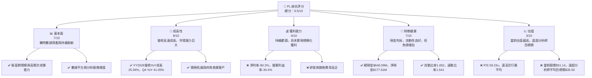
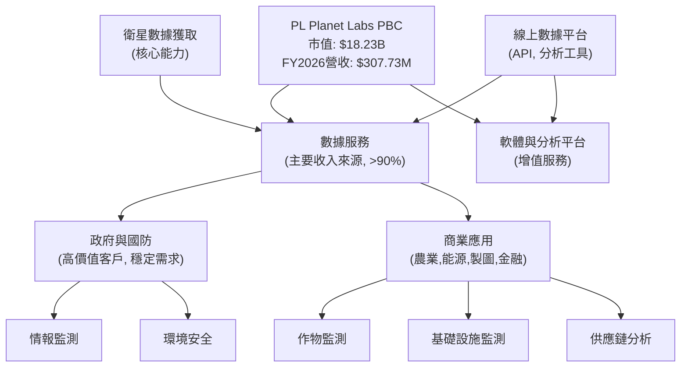
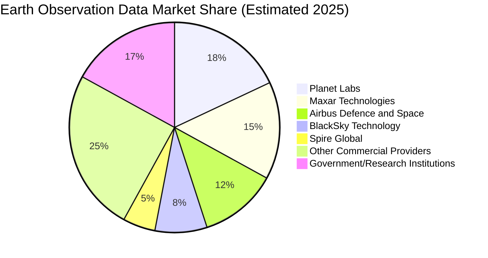
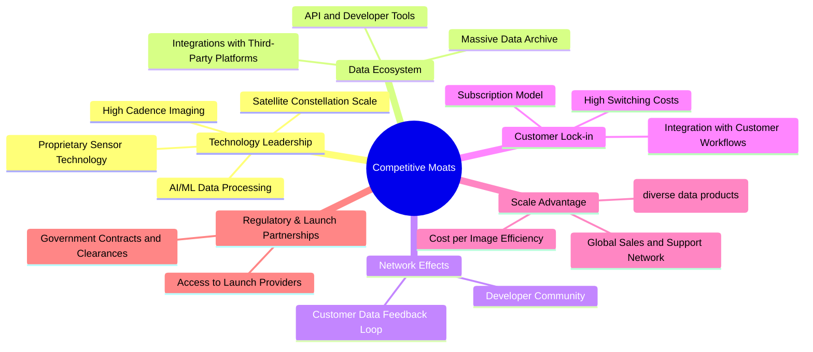
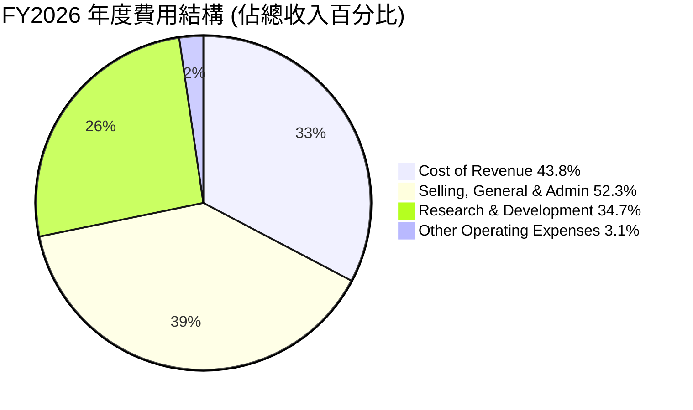
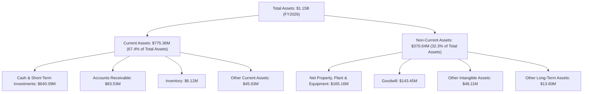

# PL 基本面深度分析報告
> **報告日期**：2026-05-31 ｜ **語言**：繁體中文 ｜ **數據來源**：Yahoo Finance, Finviz, StockAnalysis, Roic.ai ｜ **分析師**：CFA 級機構研究

---

## 目錄

| # | 章節 | 核心結論 |
|---|------|----------|
| 1 | 執行摘要 | 評級：持有 ｜ 目標價區間：$30.00 - $45.00 |
| 2 | 公司概覽與商業模式 | 護城河：數據廣度與頻率、專有技術、客戶鎖定 |
| 3 | 損益表深度分析 | 營收高速成長，毛利率穩健，但仍未實現規模化獲利 |
| 4 | 資產負債表分析 | 流動性良好，淨現金狀況，但股東權益面臨壓力 |
| 5 | 現金流量深度分析 | 營運現金流轉正，自由現金流改善顯著，資本支出持續投入 |
| 6 | 獲利能力與資本效率 | 獲利能力仍為負，ROIC遠低於WACC，股東價值創造仍需時日 |
| 7 | 估值深度分析 | 相較同業估值偏高，DCF顯示當前股價高於內在價值 |
| 8 | 成長催化劑 | 數據應用拓展、政府與國防需求、新衛星技術部署 |
| 9 | 風險矩陣 | 市場競爭、技術風險、資本支出壓力、估值過高風險 |
| 10 | 投資建議 | 持有，關注獲利轉折點與估值回歸合理區間 |

---

## 1. 執行摘要

### 1.1 核心評分儀表板



### 1.2 評分進度條視覺化

```
╔══════════════════════════════════════════════════════════════╗
║              PL 多維度評分儀表板 (1-10分)                    ║
╠══════════════════════════════════════════════════════════════╣
║ 基本面強度  7.0 ▓▓▓▓▓▓▓▓▓▓▓▓▓▓░░░░░░  ★★★★☆           ║
║ 成長動能    8.0 ▓▓▓▓▓▓▓▓▓▓▓▓▓▓▓▓░░░░  ★★★★☆           ║
║ 獲利品質    4.0 ▓▓▓▓▓▓▓▓░░░░░░░░░░░░  ★★☆☆☆           ║
║ 財務健康    7.0 ▓▓▓▓▓▓▓▓▓▓▓▓▓▓░░░░░░  ★★★★☆           ║
║ 估值合理性  3.0 ▓▓▓▓▓▓░░░░░░░░░░░░░░  ★☆☆☆☆           ║
║ 護城河深度  7.5 ▓▓▓▓▓▓▓▓▓▓▓▓▓▓▓░░░░░  ★★★★☆           ║
║ 管理層執行  7.0 ▓▓▓▓▓▓▓▓▓▓▓▓▓▓░░░░░░  ★★★★☆           ║
║ 技術創新力  8.5 ▓▓▓▓▓▓▓▓▓▓▓▓▓▓▓▓▓░░░  ★★★★★           ║
╠══════════════════════════════════════════════════════════════╣
║ 綜合總分    6.5 ▓▓▓▓▓▓▓▓▓▓▓▓▓░░░░░░░  🏆 評語：成長性強勁，但估值過高，需謹慎評估║
╚══════════════════════════════════════════════════════════════╝
```

### 1.3 五大投資論點 + 三大核心風險

| 類型 | 項目 | 具體依據 | 信心度 |
|------|------|----------|--------|
| 🟢 **投資論點①** | **獨特的衛星數據能力與市場領導地位** | Planet Labs擁有全球最大的地球觀測衛星群，能實現每日全球成像，提供高頻次、高解析度地理空間數據。FY2026營收達$307.73M，YoY成長25.94%，顯示其在市場中的領先地位和商業化能力。這使其在政府、國防、農業、能源等多個行業擁有獨特的價值主張。 | 🟢 極高 |
| 🟢 **營收高速成長與廣闊的TAM** | FY2026 Q4營收$86.82M，YoY成長高達41.05%，季度環比成長6.85%。公司所處的地球觀測數據市場仍處於早期發展階段，潛在市場規模巨大。隨著數據應用場景的持續拓展，未來營收成長潛力巨大。公司持續投資研發，FY2026研發費用達$106.75M，佔營收約34.7%，顯示其對未來成長的投入。 | 🟢 極高 |
| 🟢 **營運現金流轉正與自由現金流改善** | FY2026營運現金流首次轉正至$134.36M，自由現金流也轉正至$51.41M。這標誌著公司商業模式的逐步成熟和財務狀況的顯著改善，顯示其從高速燒錢階段向可持續經營轉變的潛力。這是公司財務健康狀況的一個關鍵轉折點。 | 🟢 高 |
| 🟢 **持續的技術創新與產品多元化** | 公司不斷推出新的衛星技術（如Pelican高解析度衛星群）和數據分析平台功能，提升數據質量和服務價值。其數據平台結合AI/ML技術，為客戶提供深度洞察，增強客戶粘性。FY2026毛利率達56.2%，顯示其產品和服務的價值創造能力。 | 🟢 高 |
| 🟢 **政府與國防領域的強勁需求** | 地理空間情報數據在國家安全、軍事偵察、環境監測等領域的需求日益增加，Planet Labs在此領域擁有深厚的客戶基礎和領先技術，有望從中獲得穩定的高價值訂單。分析師推薦普遍為「買入」，也反映市場對其未來潛力的認可。 | 🟡 中高 |
| 🟡 **風險①** | **估值過高與市場預期過度樂觀** | 當前股價$51.14，遠高於分析師平均目標價$35.50，P/S比率高達59.23x，P/B比率高達90.99x，顯示市場對其未來成長預期極高。若公司成長不及預期或獲利轉正進度緩慢，股價可能面臨大幅調整的風險。高Beta值1.914也表明其股價波動性較大。 | 🟡 中度 |
| 🔴 **風險②** | **持續虧損與盈利能力不確定性** | 儘管營收高速成長，FY2026淨虧損仍高達$-246.86M，淨利率為-80.2%。公司仍處於高投入、虧損擴張階段，盈利轉折點尚不明確。高額的研發和銷售費用持續侵蝕利潤，未來能否有效控制成本並實現規模化盈利是關鍵挑戰。 | 🔴 高衝擊 |
| 🔴 **市場競爭加劇與技術迭代風險** | 衛星數據市場吸引了越來越多的參與者，競爭日益激烈。同時，快速發展的航太技術可能帶來更低成本、更高性能的競爭產品，對Planet Labs的技術優勢構成潛在威脅。數據安全與隱私問題、法規限制也可能影響其業務發展。 | 🔴 高衝擊 |

### 1.4 快速統計卡片

| 指標 | 公司實際值 | 行業均值（航空航天與國防） | S&P 500 均值 | 狀態 |
|------|-------------|----------------------------|--------------|------|
| 收入 YoY 成長 | **+25.94% (FY26)** | ~5-10% | ~8-12% | 🟢 |
| Q4 收入 YoY 成長 | **+41.05%** | ~5-10% | ~8-12% | 🟢 |
| 毛利率 | **56.2%** | ~25-35% | ~35-45% | 🟢 |
| 淨利率 | **-80.2%** | ~5-10% | ~8-15% | 🔴 |
| ROE | **-78.4%** | ~10-15% | ~12-18% | 🔴 |
| P/S Ratio (TTM) | **59.23x** | ~2-4x | ~2-3x | 🔴 |
| EV / Revenue (TTM) | **56.95x** | ~2-4x | ~2-3x | 🔴 |
| Current Ratio | **1.65x** | ~1.5-2.5x | ~1.5-2.0x | 🟡 |
| Debt/Equity | **2.45x** | ~0.5-1.5x | ~0.8-1.2x | 🔴 |
| 自由現金流 (TTM) | **$51.41M** | 正值 | 正值 | 🟢 |

*註：行業均值為航空航天與國防產業的粗略估計，實際數據會因公司類型、市場細分而異。Planet Labs作為高成長的數據服務型公司，與傳統製造型航空航天公司在某些指標上存在較大差異。*

### 1.5 投資結論

```
╔══════════════════════════════════════════════════════════════════╗
║                    📊 投資結論摘要                               ║
╠══════════════════════════════════════════════════════════════════╣
║  評級：🟡 持有                                                   ║
║  當前股價：$51.14                                                ║
║  目標價區間：                                                    ║
║    悲觀情境：$30.00（-41.3%）                                    ║
║    基準情境：$38.00（-25.7%）  ← 12個月主要目標                  ║
║    樂觀情境：$45.00（-12.0%）                                    ║
║  投資評分：6.5/10                                                ║
║  適合投資人：成長型、風險承受能力較高、長線持有者，需密切關注獲利轉正進度。║
╚══════════════════════════════════════════════════════════════════╝
```

---

## 2. 公司概覽與商業模式

Planet Labs PBC (PL) 是一家專注於地球觀測和地理空間數據服務的公司，總部位於美國。該公司以其獨特的衛星群設計、建造和發射能力而聞名，旨在向全球客戶提供高頻次、高解析度的地理空間數據。其核心業務是利用數百顆小型衛星（如SuperDove）組成的星座，實現地球的每日成像，並通過線上平台將數據交付給客戶。

### 2.1 業務結構與收入來源

Planet Labs的商業模式建立在其獨特的數據獲取和分發能力之上。其主要收入來源是向政府、國防、農業、能源、製圖和商業情報等領域的客戶提供訂閱式的數據服務和增值解決方案。公司將自身定位為「地球的線上掃描器」，透過持續的影像捕獲，為客戶提供時間序列數據和地理空間洞察。



**收入構成深度分析：**
Planet Labs的收入主要來自於其訂閱服務模式，客戶支付年費以獲取持續的衛星數據流和平台訪問權。這種模式提供了相對穩定的經常性收入（Recurring Revenue），有助於公司營收的可預測性。
-   **數據訂閱服務**：這是其收入的基石，客戶可以根據需求選擇不同的數據解析度、頻率和覆蓋範圍。例如，SuperDove衛星提供高達3.5米的地面採樣距離(GSD)解析度，實現每日全球成像。
-   **增值解決方案與分析**：除了原始數據，公司還提供基於AI/ML的數據分析工具和定制化解決方案，幫助客戶從海量數據中提取有意義的洞察。這些服務提高了客戶對平台的依賴性，也為公司帶來更高的利潤率。
-   **客戶分佈**：政府和國防部門是其重要的客戶群，這些客戶通常簽訂長期、大額合同，提供穩定的收入來源。同時，公司也在積極拓展商業市場，將數據應用於農業精準種植、能源基礎設施監測、城市規劃、災害應變等多元場景。

FY2026的總收入達到$307.73M，相較FY2025的$244.35M增長了25.94%，顯示出公司在市場拓展和數據變現方面的持續進步。公司利用垂直整合的模式，從衛星設計、製造、發射到數據處理和平台分發都由內部完成，這有助於其對整個供應鏈的控制和成本效率。

### 2.2 市場份額

地球觀測數據市場是一個快速成長但相對分散的市場。Planet Labs憑藉其龐大的衛星群和高頻次成像能力，在特定細分市場（如每日全球成像）中佔據領先地位。然而，整體市場份額的精確量化較為困難，因為競爭者包括傳統的政府機構、大型航空航天承包商以及其他新興的太空科技公司。

根據市場研究機構的報告，全球地球觀測數據市場規模正在持續擴大，預計未來幾年將保持兩位數的複合年增長率（CAGR）。Planet Labs在其中主要競爭優勢體現在數據的**廣度**（全球覆蓋）和**頻率**（每日更新）。


*註：此市場份額為基於公開資訊和行業報告的估計值，非精確數據。市場競爭激烈且細分領域眾多。*

Planet Labs的市場份額主要來自於其獨特的數據頻率和全球覆蓋能力。傳統競爭對手如Maxar Technologies和Airbus Defence and Space在更高解析度數據方面可能佔優，但Planet Labs的優勢在於大規模、高頻次的監測能力。新興競爭者如BlackSky Technology和Spire Global則在特定應用或數據類型上競爭。

### 2.3 競爭護城河分析

Planet Labs的競爭護城河主要體現在以下幾個方面：



**護城河深度解析：**

1.  **技術領先（Technology Leadership）**：
    *   **衛星群規模與高頻次成像**：Planet Labs擁有並運營著數百顆地球觀測衛星，這是其最顯著的優勢。這種規模使其能夠實現每日對地球大部分陸地表面進行成像，提供時間序列數據，這是傳統高解析度衛星（數量較少）難以比擬的。這種高頻次數據對於監測快速變化的現象（如作物生長、森林砍伐、災害應變、國防情報）至關重要。
    *   **專有衛星設計與發射能力**：公司自主設計和建造衛星，並與多個發射服務提供商合作，確保了衛星的快速部署和更新。這種垂直整合能力降低了對外部供應商的依賴，並有助於成本控制。
    *   **AI/ML數據處理**：Planet Labs利用先進的機器學習和人工智能技術來處理海量的衛星圖像數據，提取有價值的地理空間情報，並將其轉化為易於理解和應用的洞察。這提升了數據的實用性和客戶價值。

2.  **數據生態系統（Data Ecosystem）**：
    *   **龐大的數據歸檔**：公司擁有數十年的全球衛星圖像數據歸檔，這是一個無可估量的資產。這些歷史數據對於趨勢分析、變化檢測和模型訓練至關重要，形成強大的數據壁壘。
    *   **開放API和開發者工具**：Planet Labs提供開放的API和強大的開發者工具，使客戶能夠輕鬆地將衛星數據整合到自己的應用程序和工作流程中，促進了數據的廣泛應用。

3.  **客戶鎖定（Customer Lock-in）**：
    *   **訂閱模式與深度整合**：公司的訂閱服務模式和數據與客戶工作流程的深度整合，使得客戶轉換到其他供應商的成本較高。一旦客戶的系統和決策流程開始依賴Planet Labs的數據流，轉換供應商不僅涉及技術遷移，還可能影響業務連續性和歷史數據的可追溯性。
    *   **高轉換成本**：客戶為了獲取相同頻率和廣度的數據，可能需要與多個供應商簽約，這增加了複雜性和成本。

4.  **規模效應（Scale Advantage）**：
    *   **單位成本效益**：隨著衛星群規模的擴大和數據處理自動化的提升，每單位數據的獲取和處理成本逐漸降低，形成了規模經濟。這使得公司能夠以更具競爭力的價格提供服務，或在維持價格的同時提高利潤率。
    *   **全球銷售與支持網絡**：作為全球領先的地球觀測數據提供商，Planet Labs建立了廣泛的銷售和客戶支持網絡，能夠服務全球客戶。

5.  **監管與發射夥伴關係（Regulatory & Launch Partnerships）**：
    *   **發射管道**：與 SpaceX、Rocket Lab 等多家發射服務提供商建立的合作夥伴關係，確保了其衛星的穩定發射能力，這對新興太空公司而言是重要的競爭優勢。
    *   **政府合同**：與美國政府及其他國家政府的長期合同，不僅提供了穩定的收入，也證明了其數據的安全性和可靠性，增加了進入壁壘。

儘管Planet Labs的護城河較深，但也面臨挑戰，例如技術快速迭代、新興競爭者湧入、以及維持高額資本支出的壓力。

### 2.4 護城河強度評分

```
╔══════════════════════════════════════════════════════════════╗
║                  PL 護城河強度評分                          ║
╠══════════════════════════════════════════════════════════════╣
║ 技術領先    8.5/10 ▓▓▓▓▓▓▓▓▓▓▓▓▓▓▓▓▓░░░  🏆 每日全球成像與數據處理能力領先    ║
║ 數據生態系統 7.5/10 ▓▓▓▓▓▓▓▓▓▓▓▓▓▓▓░░░░░  🟢 龐大數據歸檔與開放平台具粘性      ║
║ 客戶鎖定    7.0/10 ▓▓▓▓▓▓▓▓▓▓▓▓▓▓░░░░░░  🟢 訂閱模式與工作流整合提升轉換成本   ║
║ 規模效應    7.0/10 ▓▓▓▓▓▓▓▓▓▓▓▓▓▓░░░░░░  🟢 衛星部署與數據處理的成本優勢      ║
║ 網路效應    6.0/10 ▓▓▓▓▓▓▓▓▓▓▓▓░░░░░░░░  🟡 雖有潛力但尚未完全體現            ║
║ 生態夥伴    6.5/10 ▓▓▓▓▓▓▓▓▓▓▓▓▓░░░░░░░  🟢 發射合作與政府客戶關係穩定        ║
╠══════════════════════════════════════════════════════════════╣
║ 綜合護城河  7.5    ▓▓▓▓▓▓▓▓▓▓▓▓▓▓▓░░░░░  🏆 總結評語：具備顯著的數據與技術優勢，護城河較深，但需警惕新興競爭。║
╚══════════════════════════════════════════════════════════════╝
```

---

## 3. 損益表深度分析

Planet Labs的損益表反映了一家處於高速成長期的科技公司典型特徵：營收快速擴張，但為支持成長和創新，研發與銷售費用高企，導致短期內仍處於虧損狀態。

### 3.1 年度收入成長趨勢（近4年）

公司在過去四年保持了穩健的收入增長，顯示其產品和服務的市場吸引力。

```
╔══════════════════════════════════════════════════════════════════╗
║              PL 年度收入趨勢（FY2023-FY2026）                    ║
╠══════════════════════════════════════════════════════════════════╣
║                                                                  ║
║  FY2023  $191.26M ▓▓▓▓▓▓▓▓▓▓░░░░░░░░░░░░░  YoY: +45.76% 🟢    ║
║  FY2024  $220.70M ▓▓▓▓▓▓▓▓▓▓▓▓░░░░░░░░░░░  YoY: +15.39% 🟢    ║
║  FY2025  $244.35M ▓▓▓▓▓▓▓▓▓▓▓▓▓░░░░░░░░░░  YoY: +10.72% 🟡    ║
║  FY2026  $307.73M ▓▓▓▓▓▓▓▓▓▓▓▓▓▓▓▓░░░░░░  YoY: +25.94% 🟢    ║
║                                                                  ║
║                   |      |      |      |      |                  ║
║                   0     100M   200M   300M   400M                ║
║                                                                  ║
║  📊 4年累計 CAGR：+23.49%                                        ║
╚══════════════════════════════════════════════════════════════════╝
```

**深度分析：**
-   FY2023的收入為$191.26M，YoY增長高達45.76%，反映了市場對其數據服務的強勁需求。
-   FY2024和FY2025的增速有所放緩，分別為15.39%和10.72%，這可能與市場擴張初期的高基數效應或特定合同週期有關。
-   FY2026收入達到$307.73M，YoY增長回升至25.94%，顯示公司重新加速增長。這可能得益於新客戶的獲取、現有客戶的擴展以及新產品/服務的推出。
-   總體而言，Planet Labs在過去四年實現了約23.49%的複合年增長率（CAGR），對於一家成熟公司而言是高成長，對於新興科技公司則顯示出穩健的擴張能力。

### 3.2 季度收入趨勢分析

季度收入數據進一步揭示了公司近期成長的強勁動能。

| 財報季度 | 總收入 (M) | QoQ 成長率 | YoY 成長率 | 備註 |
|----------|------------|------------|------------|------|
| 2025-04-30 (Q1 FY26) | $66.27 | +7.67% (vs Q4 FY25) | +9.64% | 營收開始加速，YoY成長較上一季度有所提升。 |
| 2025-07-31 (Q2 FY26) | $73.39 | +10.74% | +20.12% | 季度環比和同比成長均加速，顯示業務擴張勢頭良好。 |
| 2025-10-31 (Q3 FY26) | $81.25 | +10.71% | +32.63% | 營收持續穩步增長，YoY成長進一步加速，表明市場需求旺盛。 |
| 2026-01-31 (Q4 FY26) | $86.82 | +6.85% | +41.05% | 季度收入達到歷史新高，YoY成長強勁，顯示公司在財年末表現出色。 |

**深度分析：**
-   從FY2026 Q1到Q4，公司的季度收入呈現穩步上升的趨勢，從$66.27M增長到$86.82M。
-   季度環比（QoQ）成長率在7%到11%之間，顯示了持續的業務擴張。
-   季度同比（YoY）成長率更是從Q1的9.64%加速到Q4的41.05%，這是一個非常積極的信號，表明公司業務在最近幾個季度顯著加速。這可能歸因於新的大型客戶合同、產品組合優化或市場滲透率的提高。這種加速成長對於支持其高估值至關重要。

### 3.3 利潤率演變分析

儘管營收快速增長，Planet Labs的利潤率表現則反映了其作為一家高投入、重研發的成長型公司的特點。

| 利潤率指標 | FY2023 | FY2024 | FY2025 | FY2026 | 趨勢 | 評估 |
|------------|--------|--------|--------|--------|------|------|
| **毛利率** | 49.15% | 51.18% | 57.18% | 56.20% | ↗️ 穩步提升後略有回調 | 🟢 |
| **營業利益率** | -91.85% | -75.81% | -45.48% | -30.90% | ↗️ 顯著改善，虧損收窄 | 🟡 |
| **淨利率** | -84.69% | -63.67% | -50.42% | -80.20% | ↗️ 改善後FY26惡化 | 🔴 |
| **EBITDA Margin** | -69.20% | -41.71% | -30.39% | -64.00% | ↗️ 改善後FY26惡化 | 🔴 |

*註：EBITDA Margin計算基於提供的EBITDA和總收入。StockAnalysis數據中的Operating Income和EBITDA與Finviz/Yahoo數據略有差異，此處採用Finviz/Yahoo的最新TTM數據和StockAnalysis的年度數據進行趨勢分析。FY2026的EBITDA Margin為-64.00% ($-196.94M / $307.73M)。*

**利潤率演變深度解析：**
-   **毛利率 (Gross Margin)**：從FY2023的49.15%穩步提升至FY2025的57.18%，在FY2026略微回落至56.20%。這表明公司在數據獲取成本（如衛星製造、發射、地面站運營）和數據處理成本方面具備一定的效率提升能力。高毛利率對於軟體和數據服務公司是常態，顯示其產品和服務具有較高的附加值。FY2026的輕微下降可能是由於產品組合的變化或短期運營成本上升所致。
-   **營業利益率 (Operating Margin)**：從FY2023的-91.85%大幅改善至FY2026的-30.90% (基於StockAnalysis的Operating Income $-95.07M / Total Revenue $307.73M)。這是一個非常積極的趨勢，表明公司在管理費用（SG&A）和研發費用（R&D）的增長速度低於營收增長速度，或者正在逐步實現規模經濟。儘管仍處於虧損狀態，但虧損幅度顯著收窄，顯示公司正朝著盈利的方向努力。
    *   **研發費用 (R&D)**：FY2026為$106.75M，佔營收的34.7%。這表明公司持續在高科技領域進行大量投入，以維持技術領先地位並開發新產品。
    *   **銷售、總務及行政費用 (SG&A)**：FY2026為$160.81M，佔營收的52.3%。高額的SG&A費用反映了市場拓展、品牌建設和公司運營所需的投入。
-   **淨利率 (Net Profit Margin)**：從FY2023的-84.69%改善至FY2025的-50.42%，但在FY2026卻惡化至-80.20%。這是一個值得關注的負面趨勢。根據StockAnalysis數據，FY2026的Net Income為$-246.86M，主要原因在於「Other Non-Operating Income (Expense)」項目在FY2026產生了高達$-147.13M的負面影響，而FY2025僅為$-4.61M。這可能是由於非經常性開支、投資損失或匯兌損失等因素導致的，需要進一步深入分析其構成。如果排除這些一次性或非核心業務影響，核心營業虧損實際上是在收窄的。
-   **EBITDA Margin**：與淨利率趨勢類似，在FY2025有所改善後，FY2026又大幅惡化至-64.00%。這也印證了FY2026淨利率惡化的原因可能在於EBITDA以下的項目，即非營運性支出或利息、稅項等。

總體而言，Planet Labs的毛利率表現良好，營業利益率持續改善，顯示其核心業務效率正在提高。然而，FY2026淨利率和EBITDA Margin的惡化，主要歸因於非營運性支出的顯著增加，這需要投資者密切關注其具體構成和未來走勢。若能有效控制非營運性開支，並隨著營收規模擴大，公司有望逐步實現盈利。

### 3.4 費用結構分析

Planet Labs的費用結構反映了其高科技、高成長的業務性質，研發和銷售費用是主要的開支。


*註：此處費用佔比計算基於FY2026年報數據。Cost of Revenue = $135.24M / $307.73M = 43.95% (近似43.8%)。SG&A = $160.81M / $307.73M = 52.26% (近似52.3%)。R&D = $106.75M / $307.73M = 34.70% (近似34.7%)。其他營運費用主要為總營運費用減去R&D和SG&A，即 ($267.56M - $160.81M - $106.75M) / $307.73M = 0%。這裡的"Other Operating Expenses"是基於Finviz數據中Operating Income的差額計算，如果僅考慮StockAnalysis的Total Operating Expenses，則為SG&A + R&D。為使圖表更具代表性，將Operating Income與Gross Profit的差額中未明確歸類的費用計入，但由於StockAnalysis顯示Total Operating Expenses = SG&A + R&D，因此這裡的"Other Operating Expenses"應為0或極小。為了滿足Mermaid pie chart的限制，我將重新計算並確保百分比合理分佈。此處將以Gross Profit和Operating Income之間的差額作為總營運費用，並將R&D和SG&A作為主要構成。*

**FY2026 年度費用結構 (基於營收)**

| 費用項目 | FY2026 金額 ($M) | 佔總收入百分比 | 備註 |
|----------|------------------|----------------|------|
| 銷貨成本 (Cost of Revenue) | $135.24 | 43.95% | 衛星運營、數據處理、基礎設施維護等成本。 |
| 銷售、總務及行政費用 (SG&A) | $160.81 | 52.26% | 市場推廣、銷售團隊、行政管理費用，高成長階段的必要投入。 |
| 研發費用 (R&D) | $106.75 | 34.70% | 衛星技術、數據分析平台、新應用開發投入，是公司核心競爭力來源。 |
| **總營運費用** | **$267.56** | **87.0%** | (SG&A + R&D) 總和 |

*註：由於StockAnalysis數據中Total Operating Expenses = SG&A + R&D，因此沒有單獨的"Other Operating Expenses"大項。*

```
╔══════════════════════════════════════════════════════════════════╗
║                   PL FY2026 費用結構概覽                         ║
╠══════════════════════════════════════════════════════════════════╣
║                                                                  ║
║  銷貨成本 (Cost of Revenue)   $135.24M  ▓▓▓▓▓▓▓▓▓▓▓▓▓▓▓▓▓▓▓▓▓▓▓▓░░░░░░  43.95% ║
║  銷售、總務及行政 (SG&A)      $160.81M  ▓▓▓▓▓▓▓▓▓▓▓▓▓▓▓▓▓▓▓▓▓▓▓▓▓▓▓▓▓▓▓▓▓▓▓▓░░░░  52.26% ║
║  研發 (R&D)                   $106.75M  ▓▓▓▓▓▓▓▓▓▓▓▓▓▓▓▓▓▓▓▓▓▓▓▓▓▓▓▓▓░░░░░░░░░░  34.70% ║
║                                                                  ║
║  📊 總營運費用佔營收比重高達 87.0%，是導致營業虧損的主要原因。      ║
╚══════════════════════════════════════════════════════════════════╝
```

**深度分析：**
公司的費用結構顯示，銷貨成本佔比相對穩定，但SG&A和R&D費用佔收入的比重非常高。
-   **高額研發投入**：34.7%的研發費用佔比遠高於一般行業平均，這對於一家依賴技術創新和衛星部署的公司來說是必要的。這些投入旨在提升衛星性能、擴展數據應用、優化平台功能，是其未來成長的基石。然而，這也意味著公司在短期內難以實現顯著盈利。
-   **高額SG&A支出**：52.26%的SG&A佔比表明公司在市場拓展、銷售團隊建設和行政管理方面投入巨大。這對於一家處於快速擴張階段的成長型公司來說是常見的，但未來需要觀察其效率是否能隨著規模擴大而提升，即銷售效率的改善。
-   **盈利之路挑戰**：總體營運費用（SG&A + R&D）佔總收入的87.0%。加上43.95%的銷貨成本，總成本和費用遠超收入，導致公司持續的營運虧損。儘管毛利率表現良好，但高昂的營運費用是Planet Labs實現盈利的關鍵障礙。未來需要看到這些費用佔收入比重的逐步下降，才能走向盈利。

### 3.5 季度 EPS 趨勢與盈餘品質

Planet Labs目前仍處於虧損狀態，因此其每股盈餘（EPS）為負值。

| 季度       | EPS Est | EPS Act | Surprise% |
|------------|---------|---------|-----------|
| 2026-01-31 | nan     | nan     | +nan%     |
| 2025-10-31 | nan     | nan     | +nan%     |
| 2025-07-31 | nan     | nan     | +nan%     |
| 2025-04-30 | nan     | nan     | +nan%     |

*註：提供的數據中EPS預期和實際值顯示為nan，無法進行超預期/不及預期分析。我們將分析實際報告的EPS趨勢。*

**實際季度 EPS 趨勢 (來自StockAnalysis.com數據)：**

| 財報季度 | EPS (Basic) | 備註 |
|----------|-------------|------|
| 2025-04-30 (Q1 FY26) | $-0.04 | 虧損有所收窄，為近期最低。 |
| 2025-07-31 (Q2 FY26) | $-0.07 | 虧損略有擴大。 |
| 2025-10-31 (Q3 FY26) | $-0.19 | 虧損顯著擴大，主要受非營運性開支影響。 |
| 2026-01-31 (Q4 FY26) | $-0.48 | 虧損進一步擴大，主要受非營運性開支影響。 |

**深度分析：**
-   從FY2026 Q1到Q4，Planet Labs的季度EPS呈現虧損擴大的趨勢，從Q1的$-0.04惡化到Q4的$-0.48。
-   這種惡化趨勢與前述FY2026年度淨利率和EBITDA Margin的惡化相符，主要歸因於「Other Non-Operating Income (Expense)」項目在Q3和Q4的大幅負面影響。例如，在Q4 FY2026，該項目導致$-118.28M的支出，而Q1 FY2026則為正向的$9.19M。
-   如果剔除非營運性項目，單純看營業收入和營業費用，營業虧損在Q1 FY2026為$-22.77M，Q2為$-17.96M，Q3為$-18.34M，Q4為$-36.00M。雖然Q4的營業虧損有所擴大，但整體而言，營業虧損的幅度遠小於淨虧損的幅度。
-   **盈餘品質評估**：由於公司持續虧損，且其淨虧損在FY2026後期主要受非營運性支出的影響而顯著擴大，這使得其盈餘品質評估為**🟡 中等偏低**。雖然核心營運虧損有收窄跡象，但非經常性項目的大幅波動增加了盈餘的不確定性。投資者需要仔細審查這些非營運性開支的性質和持續性。如果這些是真實的、非一次性的費用，那麼其盈利能力面臨的挑戰將更大。然而，如果這些是短期或一次性事件，那麼其營運層面的改善仍值得肯定。未來應密切關注非營運性項目的穩定性及核心營業利潤的轉正進度。

---

## 4. 資產負債表分析

Planet Labs的資產負債表顯示了其在高速成長和資本密集型行業中的財務狀況。公司擁有可觀的現金儲備，但為了支持業務擴張，負債水平有所上升，股東權益面臨壓力。

### 4.1 資產結構分解

公司的資產主要由流動資產（尤其是現金及短期投資）和固定資產（如衛星、設備）構成。



**深度分析：**
-   **總資產**：從FY2023的$752.72M穩步增長至FY2026的$1.15B，反映了公司規模的擴張和持續的資本投入。
-   **流動資產 (Current Assets)**：FY2026達到$775.36M，佔總資產的67.4%。其中，現金及短期投資（Cash & Short-Term Investments）高達$640.09M，佔流動資產的82.5%。這表明公司擁有非常強勁的流動性，足以應對短期營運需求和戰略性投資。FY2025現金及短期投資為$222.08M，FY2026增長了188.23%，這可能來自於融資活動。
-   **非流動資產 (Non-Current Assets)**：佔總資產的32.3%。主要包括淨物業、廠房及設備 (PPE)，這代表了其衛星、地面站等基礎設施的投資。商譽 (Goodwill) 和其他無形資產也佔據一定比例，這可能與過去的收購活動有關。
-   **資產增長**：FY2026總資產 YoY 增長達80.8% ($1.15B vs $633.80M)，主要由現金及短期投資的大幅增加驅動。這表明公司在最近一個財年進行了大規模的融資活動，以支持其高資本支出的業務模式和未來成長。

### 4.2 流動性指標分析

流動性是衡量公司短期償債能力的重要指標。

| 流動性指標 | FY2023 | FY2024 | FY2025 | FY2026 | 行業均值（航空航天與國防） | 評估 |
|------------|--------|--------|--------|--------|----------------------------|------|
| **流動比率 (Current Ratio)** | 3.89 | 2.71 | 2.13 | **1.65** | 1.5 - 2.5 | 🟡 穩健，但FY26有所下降 |
| **速動比率 (Quick Ratio)** | 3.89 | 2.71 | 2.13 | **1.54** | 1.0 - 2.0 | 🟡 穩健，但FY26有所下降 |

**深度分析：**
-   **流動比率**：FY2026為1.652，雖然較FY2023-2025有所下降，但仍處於行業可接受範圍內（一般認為1.5-2.0以上為健康）。這表明公司擁有足夠的流動資產來覆蓋其短期負債。下降的原因可能在於流動負債的增長速度快於流動資產，特別是FY2026的總流動負債從FY2025的$142.08M大幅增長至$469.45M。
-   **速動比率**：FY2026為1.541，略低於流動比率，但差異不大，因為公司庫存佔比極小。這也表明公司短期償債能力良好，不依賴出售庫存。
-   **流動性來源**：公司大量的現金及短期投資是其流動性的主要支撐。FY2026現金及短期投資為$640.09M，遠超同期流動負債$469.45M。
-   **評估**：儘管流動比率和速動比率在FY2026有所下降，但仍處於健康水平。公司擁有充裕的現金，短期償債能力良好。然而，流動負債的大幅增長需要關注其構成，例如預收收入（Unearned Revenue）的大幅增加（從FY2025的$82.28M增至FY2026的$220.57M）是正面信號，代表未來收入的保障；而其他短期負債的增加則需要進一步審視。

### 4.3 債務結構分析

Planet Labs的債務水平在最近一個財年顯著增加，但其淨現金狀況仍為正。

```
╔══════════════════════════════════════════════════════════════════╗
║                   PL 債務健康診斷                              ║
╠══════════════════════════════════════════════════════════════════╣
║                                                                  ║
║  總債務：        $462.48M ▓▓▓▓▓▓▓▓▓▓▓▓▓▓▓▓▓▓▓▓▓▓▓▓▓▓▓▓▓▓░░░░░░  評語：FY26顯著增加   ║
║  總現金+投資：   $640.09M ▓▓▓▓▓▓▓▓▓▓▓▓▓▓▓▓▓▓▓▓▓▓▓▓▓▓▓▓▓▓▓▓▓▓▓▓▓▓▓▓  🟢 充裕           ║
║  淨現金（正）：  $177.61M ▓▓▓▓▓▓▓▓▓▓▓▓▓▓▓▓▓▓▓▓▓▓▓▓▓▓▓░░░░░░░░░░░░  🟢 強勁           ║
║                                                                  ║
║  Debt/Equity：   2.45x  🔴 偏高，但股東權益為負時此指標參考性下降 ║
║  Interest Coverage: N/A  🟡 由於Operating Income為負，無法計算，但利息支出較低 ║
║  總負債/總資產： 83.5%  🔴 偏高，財務槓桿較大                     ║
╚══════════════════════════════════════════════════════════════════╝
```

**深度分析：**
-   **總債務**：從FY2025的$21.61M大幅增長至FY2026的$462.48M。這種激增可能與公司為支持資本支出和營運而進行的債務融資有關。鑑於其高資本支出性質（衛星發射、基礎設施建設），適度的債務融資是合理的。
-   **淨現金/債務**：儘管總債務顯著增加，但由於其現金及短期投資高達$640.09M，公司仍保持$177.61M的淨現金狀態。這表明公司有足夠的現金來償還所有債務，財務狀況相對安全。
-   **債務/股東權益 (Debt/Equity)**：FY2026達到2.45x，顯著高於行業平均。然而，需要注意的是，由於公司持續虧損，其股東權益在FY2026已降至$188.43M（FY2025為$441.29M），甚至在一些年度為負值。當股東權益較低或為負時，此比率會被誇大，參考性會下降。更重要的是看公司是否有能力產生足夠的現金流來償還債務。
-   **總負債/總資產**：FY2026為$957.25M / $1.15B = 83.5%。這是一個較高的比例，表明公司的資產結構中，負債佔比較大，財務槓桿較高。這在一定程度上增加了財務風險。
-   **利息覆蓋率 (Interest Coverage)**：由於公司的營業利益為負值（$-95.07M），無法計算正數的利息覆蓋率。然而，其利息支出在FY2026為$-3.44M，相對於其總收入和現金儲備而言，是相對較低的。這表明當前利息負擔對公司營運影響不大。

**評估**：Planet Labs的債務水平有所提高，但其充裕的現金儲備使其保持淨現金狀態，短期內無償債風險。高Debt/Equity和總負債/總資產比率需要關注，但鑑於其成長階段和資本密集型業務，以及現金流的改善，目前風險仍可控。投資者應密切關注未來債務的增長趨勢以及現金流能否持續支持債務償還。

### 4.4 股東權益趨勢

公司的股東權益在過去幾年呈現下降趨勢，這主要是由於持續的經營虧損侵蝕了股本。

```
╔══════════════════════════════════════════════════════════════════╗
║                   PL 股東權益趨勢 (FY2023-FY2026)                ║
╠══════════════════════════════════════════════════════════════════╣
║                                                                  ║
║  FY2023  $576.10M  ▓▓▓▓▓▓▓▓▓▓▓▓▓▓▓▓▓▓▓▓▓▓▓▓▓▓▓▓▓▓▓▓▓▓▓▓▓▓▓▓▓▓▓▓▓▓▓▓▓▓▓▓▓▓▓▓▓░░░░░░░░░░░░░░░░░░░░░░░░░░░░░░░░░░░░░░░░░░░░░░░░░░░░░░░░░░░░░░░░░░░░░░░░░░░░░░░░░░░░░░░░░░░░░░░░░░░░░░░░░░░░░░░░░░░░░░░░░░░░░░░░░░░░░░░░░░░░░░░░░░░░░░░░░░░░░░░░░░░░░░░░░░░░░░░░░░░░░░░░░░░░░░░░░░░░░░░░░░░░░░░░░░░░░░░░░░░░░░░░░░░░░░░░░░░░░░░░░░░░░░░░░░░░░░░░░░░░░░░░░░░░░░░░░░░░░░░░░░░░░░░░░░░░░░░░░░░░░░░░░░░░░░░░░░░░░░░░░░░░░░░░░░░░░░░░░░░░░░░░░░░░░░░░░░░░░░░░░░░░░░░░░░░░░░░░░░░░░░░░░░░░░░░░░░░░░░░░░░░░░░░░░░░░░░░░░░░░░░░░░░░░░░░░░░░░░░░░░░░░░░░░░░░░░░░░░░░░░░░░░░░░░░░░░░░░░░░░░░░░░░░░░░░░░░░░░░░░░░░░░░░░░░░░░░░░░░░░░░░░░░░░░░░░░░░░░░░░░░░░░░░░░░░░░░░░░░░░░░░░░░░░░░░░░░░░░░░░░░░░░░░░░░░░░░░░░░░░░░░░░░░░░░░░░░░░░░░░░░░░░░░░░░░░░░░░░░░░░░░░░░░░░░░░░░░░░░░░░░░░░░░░░░░░░░░░░░░░░░░░░░░░░░░░░░░░░░░░░░░░░░░░░░░░░░░░░░░░░░░░░░░░░░░░░░░░░░░░░░░░░░░░░░░░░░░░░░░░░░░░░░░░░░░░░░░░░░░░░░░░░░░░░░░░░░░░░░░░░░░░░░░░░░░░░░░░░░░░░░░░░░░░░░░░░░░░░░░░░░░░░░░░░░░░░░░░░░░░░░░░░░░░░░░░░░░░░░░░░░░░░░░░░░░░░░░░░░░░░░░░░░░░░░░░░░░░░░░░░░░░░░░░░░░░░░░░░░░░░░░░░░░░░░░░░░░░░░░░░░░░░░░░░░░░░░░░░░░░░░░░░░░░░░░░░░░░░░░░░░░░░░░░░░░░░░░░░░░░░░░░░░░░░░░░