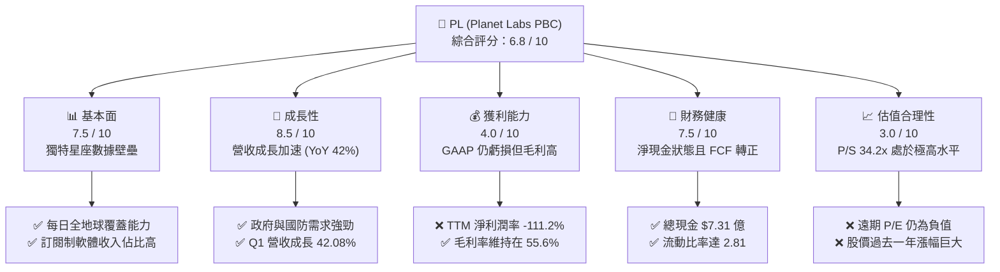

# PL 基本面深度分析報告

> **報告日期**：2026-06-07 ｜ **語言**：繁體中文 ｜ **數據來源**：Yahoo Finance, Finviz, StockAnalysis, Roic.ai ｜ **分析師**：CFA 級機構研究

---

## 目錄

| # | 章節 | 核心結論 |
|---|------|----------|
| 1 | 執行摘要 | 評級：**持有（Hold）**，目標價區間：**$20.00 - $53.00**（基準 $39.80），高估值伴隨高成長。 |
| 2 | 公司概覽與商業模式 | 全球唯一每日更新的地球觀測星座，具備強大數據壁壘，但面臨高資本支出壓力。 |
| 3 | 損益表深度分析 | 營收加速成長（YoY 42.1%），毛利率穩定，但非營業支出導致 GAAP 淨損擴大。 |
| 4 | 資產負債表分析 | 淨現金達 $2.43 億，流動比率 2.81，財務結構健康，但近期債務規模顯著上升。 |
| 5 | 現金流量深度分析 | 自由現金流（FCF）迎來拐點成功轉正，資本配置重心從建設期轉向商用變現期。 |
| 6 | 獲利能力與資本效率 | GAAP ROE 受非現金減值拖累，但 CROIC（現金投資回報率）達 11.1%，超越 WACC。 |
| 7 | 估值深度分析 | P/S 達 34.2x，顯著高於同業，溢價反映其獨特護城河與 FCF 轉正之利多。 |
| 8 | 成長催化劑 | 政府與國防合約（Pelican/Tanager 星座部署）及 AI 地理空間分析需求爆發。 |
| 9 | 風險矩陣 | 高估值修正風險、發射失敗與技術延遲風險、以及大客戶集中度風險。 |
| 10| 投資建議 | 建議於 **$24.00 - $28.00** 區間逢低佈局，適合高風險承受度的成長型投資人。 |

---

## 1. 執行摘要

### 1.1 核心評分儀表板



### 1.2 評分進度條視覺化

```
╔══════════════════════════════════════════════════════════════╗
║                PL 多維度評分儀表板 (1-10分)                 ║
╠══════════════════════════════════════════════════════════════╣
║ 基本面強度  7.5 ▓▓▓▓▓▓▓▓▓▓▓▓▓▓▓▓▓░░░░░  ★★★★☆           ║
║ 成長動能    8.5 ▓▓▓▓▓▓▓▓▓▓▓▓▓▓▓▓▓▓▓░░  ★★★★☆           ║
║ 獲利品質    4.0 ▓▓▓▓▓▓▓▓░░░░░░░░░░░░░░  ★★☆☆☆           ║
║ 財務健康    7.5 ▓▓▓▓▓▓▓▓▓▓▓▓▓▓▓▓▓░░░░░  ★★★★☆           ║
║ 估值合理性  3.0 ▓▓▓▓▓▓░░░░░░░░░░░░░░░░░  ★☆☆☆☆           ║
║ 護城河深度  8.0 ▓▓▓▓▓▓▓▓▓▓▓▓▓▓▓▓▓▓░░░  ★★★★☆           ║
║ 管理層執行  7.0 ▓▓▓▓▓▓▓▓▓▓▓▓▓▓░░░░░░░  ★★★☆☆           ║
║ 技術創新力  9.0 ▓▓▓▓▓▓▓▓▓▓▓▓▓▓▓▓▓▓▓▓░  ★★★★★           ║
╠══════════════════════════════════════════════════════════════╣
║ 綜合總分    6.8 ▓▓▓▓▓▓▓▓▓▓▓▓▓▓▓░░░░░░  🏆 成長型/高風險標的║
╚══════════════════════════════════════════════════════════════╝
```

### 1.3 五大投資論點 + 三大核心風險

| 類型 | 項目 | 具體依據 | 信心度 |
|------|------|----------|--------|
| 🟢 **投資論點①** | **營收成長顯著加速** | TTM 營收達 $3.36億，YoY 成長率自前期的 10.7% 飆升至 **42.1%**，Q1 FY27 營收更達 $9,415 萬。 | 🟢 極高 |
| 🟢 **投資論點②** | **自由現金流（FCF）拐點成真** | FY2026 FCF 成功轉正達 **$5,141 萬**（對比 FY25 的 -$6,878 萬），TTM FCF 達 **$8,485 萬**，大幅降低營運失血風險。 | 🟢 極高 |
| 🟢 **投資論點③** | **無可匹敵的星座壁壘** | 擁有超過 200 顆在軌衛星，實現每日 3.5 米解析度全球掃描，具備極高數據重置成本。 | 🟢 高 |
| 🟢 **投資論點④** | **資產負債表防禦力強