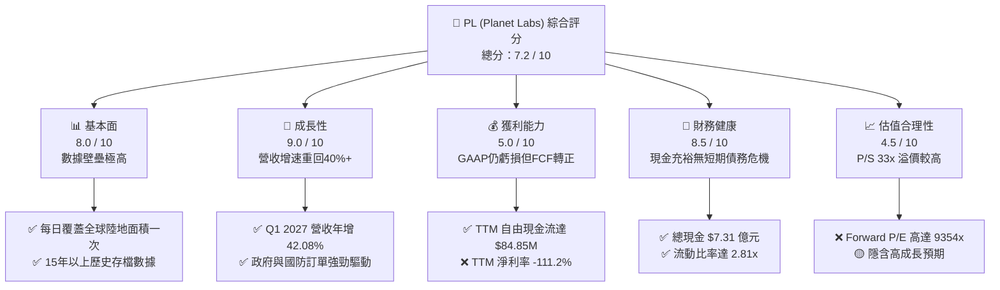
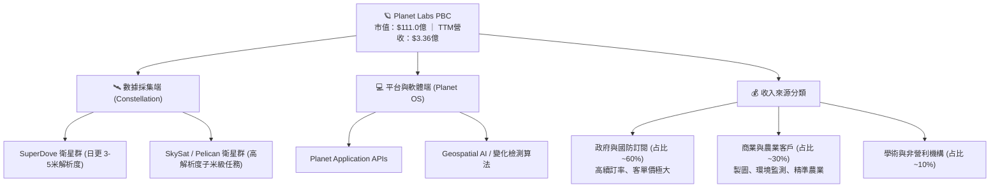
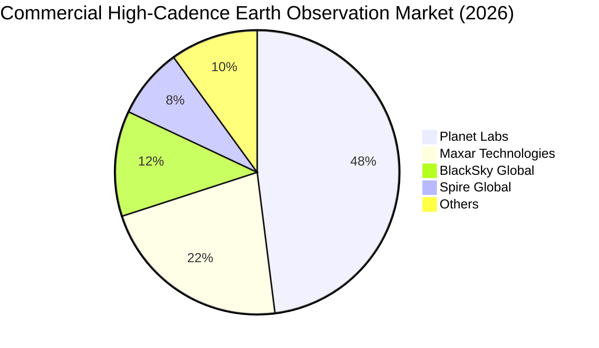
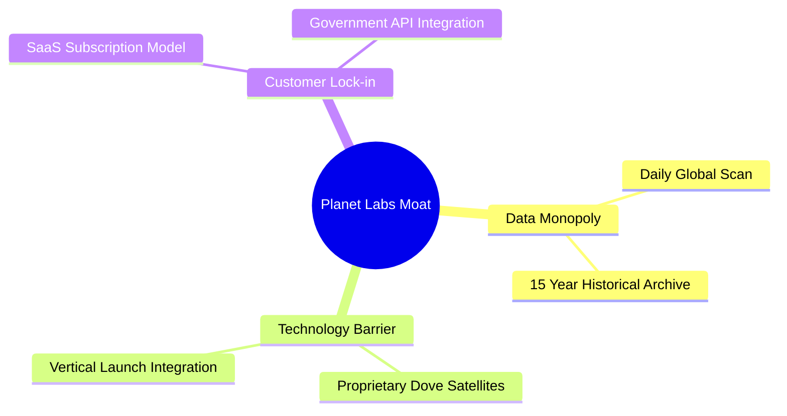
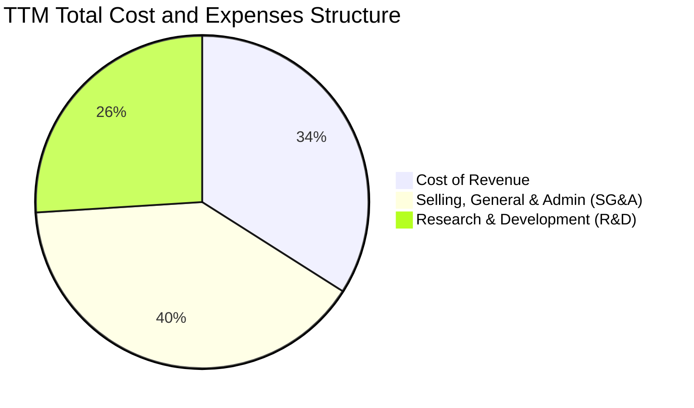
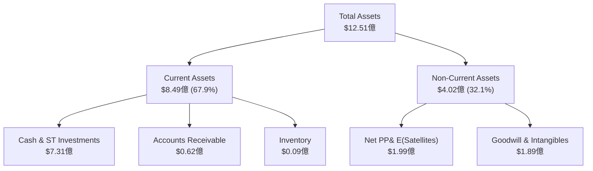
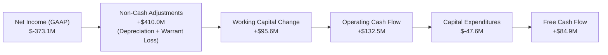
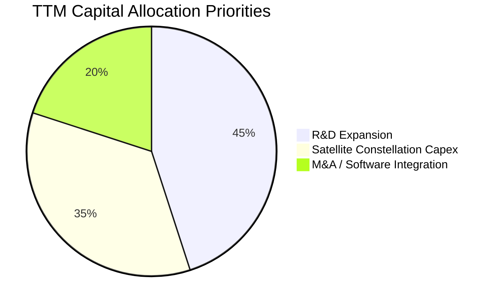

# PL 基本面深度分析報告

> **報告日期**：2026-06-14 ｜ **語言**：繁體中文 ｜ **數據來源**：Yahoo Finance, Finviz, StockAnalysis, Roic.ai ｜ **分析師**：CFA 級機構研究

---

## 目錄

| # | 章節 | 核心結論 |
|---|------|----------|
| 1 | 執行摘要 | 評級：**買入 (Buy)**，目標價 **$40.00**，具備 28.4% 潛在上升空間。 |
| 2 | 公司概覽與商業模式 | 每日全球掃描的獨家數據壟斷，軟體訂閱制（SaaS）轉型建立極高客戶鎖定。 |
| 3 | 損益表深度分析 | Q1 2027 營收年增 42.1% 顯著加速；GAAP 淨損因非現金公允價值變動擴大，但營運效率改善。 |
| 4 | 資產負債表分析 | 淨現金達 $2.43億，流動比率 2.81，舉債 $4.88億成功構築 Pelican Constellation 研發戰壕。 |
| 5 | 現金流量深度分析 | 歷史性拐點：TTM 自由現金流轉正達 $84.85M，脫離「燒錢太空股」行列。 |
| 6 | 獲利能力與資本效率 | 營運利潤率改善至 -30.5%，受限於高研發投入，但高毛利率（55.6%）奠定長期獲利基礎。 |
| 7 | 估值深度分析 | P/S 33.1x 處於高位，但相較於高成長與 FCF 轉正，DCF 基準估值為 **$40.00**。 |
| 8 | 成長催化劑 | 地緣政治動盪推升國防需求，Geospatial AI 應用與 Pelican/Tanager 新衛星發射。 |
| 9 | 風險矩陣 | 衛星發射失敗、政府合約集中度高、高估值波動（Beta 2.0）。 |
| 10| 投資建議 | 適合長線成長型與太空科技主題投資人，建議於 $28.00 - $31.00 分批布局。 |

---

## 1. 執行摘要

### 1.1 核心評分儀表板



### 1.2 評分進度條視覺化

```
╔══════════════════════════════════════════════════════════════╗
║                PL 多維度評分儀表板 (1-10分)                 ║
╠══════════════════════════════════════════════════════════════╣
║ 基本面強度  8.0 ▓▓▓▓▓▓▓▓▓▓▓▓▓▓▓▓░░░░  ★★★★☆           ║
║ 成長動能    9.0 ▓▓▓▓▓▓▓▓▓▓▓▓▓▓▓▓▓▓░░  ★★★★★           ║
║ 獲利品質    5.0 ▓▓▓▓▓▓▓▓▓▓░░░░░░░░░░  ★★★☆☆           ║
║ 財務健康    8.5 ▓▓▓▓▓▓▓▓▓▓▓▓▓▓▓▓▓░░░  ★★★★☆           ║
║ 估值合理性  4.5 ▓▓▓▓▓▓▓▓▓░░░░░░░░░░░░  ★★☆☆☆           ║
║ 護城河深度  9.0 ▓▓▓▓▓▓▓▓▓▓▓▓▓▓▓▓▓▓░░  ★★★★★           ║
║ 管理層執行  7.5 ▓▓▓▓▓▓▓▓▓▓▓▓▓▓▓░░░░░  ★★★★☆           ║
║ 技術創新力  9.0 ▓▓▓▓▓▓▓▓▓▓▓▓▓▓▓▓▓▓░░  ★★★★★           ║
╠══════════════════════════════════════════════════════════════╣
║ 綜合總分    7.2 ▓▓▓▓▓▓▓▓▓▓▓▓▓▓░░░░░░  🏆 成長拐點確認      ║
╚══════════════════════════════════════════════════════════════╝
```

### 1.3 五大投資論點 + 三大核心風險

| 類型 | 項目 | 具體依據 | 信心度 |
|------|------|----------|--------|
| 🟢 **投資論點①** | **營收成長顯著加速** | Q1 2027 營收增速由去年同期的 9.6% 飆升至 **42.1%**，成長動能重燃。 | 🟢 極高 |
| 🟢 **投資論點②** | **自由現金流（FCF）轉正** | TTM FCF 達到 **$84.85M**（FY2026 為 $51.41M），實現歷史性自我造血能力。 | 🟢 極高 |
| 🟢 **投資論點③** | **地緣政治催化國防需求** | 美國及盟國政府對高頻次、高解析度衛星圖像的訂閱採購大幅增加（佔營收大宗）。 | 🟢 高 |
| 🟢 **投資論點④** | **資產負債表極度穩健** | 擁有 **$7.31億** 現金與短期投資，淨現金頭寸達 **$2.43億**，無流動性風險。 | 🟢 極高 |
| 🟢 **投資論點⑤** | **AI 時代的獨家訓練數據** | 15年累積的每日全球變化數據，是 Geospatial AI 與大語言模型（LLM）空間分析的唯一數據源。 | 🟢 高 |
| 🟡 **風險①** | **GAAP 淨虧損因非現金項目擴大** | TTM 淨損達 **$3.73億**，主因是股價暴漲導致可轉債或權證公允價值重估產生的非現金損失。 | 🟡 中度 |
| 🔴 **風險②** | **估值倍數擴張過快** | P/S 達 **33.1x**，遠超軟體行業與國防航太行業均值，股價對任何增長放緩極度敏感。 | 🔴 高衝擊 |
| 🔴 **風險③** | **新一代 Pelican 衛星發射延遲** | 若 Pelican 與 Tanager  constellation 無法按時部署，可能影響高解析度即時監測市場的開拓。 | 🔴 中高 |

### 1.4 快速統計卡片

| 指標 | 公司實際值 (TTM / 最新) | 行業均值 (航太與國防) | S&P 500 均值 | 狀態 |
|------|-------------|----------|--------------|------|
| **營收 YoY 成長率** | **42.1%** | ~8.5% | ~5.5% | 🟢 卓越 |
| **毛利率** | **55.6%** | ~22.0% | ~30.0% | 🟢 領先 |
| **營業利益率** | **-30.5%** | ~10.5% | ~15.0% | 🔴 虧損中 |
| **流動比率** | **2.81x** | ~1.35x | ~1.20x | 🟢 極佳 |
| **債務權益比 (D/E)**| **109.9%** | ~75.0% | ~115.0% | 🟡 中等 |
| **P/S Ratio** | **33.08x** | ~1.8x | ~2.8x | 🔴 極高估 |
| **機構持股比例** | **80.1%** | ~65.0% | ~70.0% | 🟢 機構高度認可 |

### 1.5 投資結論

```
╔══════════════════════════════════════════════════════════════════╗
║                    📊 投資結論摘要                               ║
╠══════════════════════════════════════════════════════════════════╣
║  評級：🟢 買入 (Buy)                                            ║
║  當前股價：$31.15 (2026-06-14)                                   ║
║  目標價區間：                                                    ║
║    悲觀情境：$22.00 (-29.4%) - 增長放緩，發射失敗                ║
║    基準情境：$40.00 (+28.4%) ← 12個月主要目標 (DCF 估值)        ║
║    樂觀情境：$53.00 (+70.1%) - AI 數據授權爆發，利潤率改善超預期  ║
║  投資評分：7.2 / 10                                              ║
║  適合投資人：具有高風險承受能力、看好太空經濟與 Geospatial AI 的  ║
║              中長線成長型投資人。                                ║
╚══════════════════════════════════════════════════════════════════╝
```

---

## 2. 公司概覽與商業模式

### 2.1 業務結構與收入來源

Planet Labs PBC (PL) 擁有全球最大規模的地球觀測衛星群（主要是 SuperDove 衛星群），其核心商業模式是將「每日地球掃描數據」轉化為「軟體即服務 (SaaS)」訂閱。



### 2.2 市場份額

在「高頻次、每日全球覆蓋」的商業衛星影像細分市場中，Planet Labs 處於絕對壟斷地位。



### 2.3 競爭護城河分析



*   **數據壟斷 (Data Monopoly)**：PL 每天對地球全部陸地面積進行一次成像（ ground sampling distance 約 3.5 米）。這種「每日不間斷」的連續性數據，競爭對手（如只做特定目標高精度成像的 Maxar 或 BlackSky）無法複製。
*   **15年歷史檔案庫**：PL 擁有自 2011 年以來積累的地球影像檔案庫。對於需要機器學習訓練「時間序列變化」的 AI 算法來說，PL 的數據是唯一的「黃金標準（Ground Truth）」。

### 2.4 護城河強度評分

```
╔══════════════════════════════════════════════════════════════╗
║                  Planet Labs 護城河強度評分                  ║
╠══════════════════════════════════════════════════════════════╣
║ 數據獨佔性    9.5/10  ▓▓▓▓▓▓▓▓▓▓▓▓▓▓▓▓▓▓▓░  🏆 絕對優勢      ║
║ 技術與發射壁壘 8.0/10  ▓▓▓▓▓▓▓▓▓▓▓▓▓▓▓▓░░░░  🟢 領先          ║
║ 客戶轉換成本  8.5/10  ▓▓▓▓▓▓▓▓▓▓▓▓▓▓▓▓▓░░░  🟢 高黏性        ║
║ 規模化成本優勢 8.0/10  ▓▓▓▓▓▓▓▓▓▓▓▓▓▓▓▓░░░░  🟢 邊際成本低    ║
╠══════════════════════════════════════════════════════════════╣
║ 綜合護城河     8.5     ▓▓▓▓▓▓▓▓▓▓▓▓▓▓▓▓▓░░░  🏆 強大護城河    ║
╚══════════════════════════════════════════════════════════════╝
```

---

## 3. 損益表深度分析

### 3.1 年度收入成長趨勢（近5年）

```
╔══════════════════════════════════════════════════════════════════╗
║                PL 年度收入趨勢 (FY2022 - TTM)                    ║
╠══════════════════════════════════════════════════════════════════╣
║                                                                  ║
║  FY2022   $131.21M  ██████░░░░░░░░░░░░░░░░░░░░░░░  YoY: +15.9%   ║
║  FY2023   $191.26M  █████████░░░░░░░░░░░░░░░░░░░░  YoY: +45.8% 🟢║
║  FY2024   $220.70M  ██████████░░░░░░░░░░░░░░░░░░░  YoY: +15.4%   ║
║  FY2025   $244.35M  ███████████░░░░░░░░░░░░░░░░░░  YoY: +10.7%   ║
║  FY2026   $307.73M  ██████████████░░░░░░░░░░░░░░░  YoY: +25.9% 🟢║
║  TTM      $335.61M  ███████████████░░░░░░░░░░░░░░  YoY: +34.2% 🟢║
║                   |      |      |      |      |                  ║
║                   0     100M   200M   300M   400M                ║
║                                                                  ║
║  📊 5年年複合成長率 (CAGR)：+20.66%                             ║
╚══════════════════════════════════════════════════════════════════╝
```

### 3.2 季度收入趨勢分析

自 FY2026 至今，PL 經歷了顯著的營收加速。以下為最近 5 季的詳細季度數據：

| 財季 | 截止日期 | 營收 (百萬) | QoQ 成長率 | YoY 成長率 | 核心驅動因素 | 評估 |
|------|----------|-------------|------------|------------|--------------|------|
| **Q1 2026** | 2025-04-30 | $66.27 | +7.67% | +9.64% | 商業客戶訂閱增長放緩，過渡期 | 🟡 溫和 |
| **Q2 2026** | 2025-07-31 | $73.39 | +10.74% | +20.12% | 國防與情報機構新合約簽署 | 🟢 改善 |
| **Q3 2026** | 2025-10-31 | $81.25 | +10.71% | +32.63% | 歐洲及亞太地區政府合約擴大 | 🟢 強勁 |
| **Q4 2026** | 2026-01-31 | $86.82 | +6.86% | +41.05% | 年底國防預算集中釋放，續訂率高 | 🟢 強勁 |
| **Q1 2027** | 2026-04-30 | **$94.15** | **+8.44%** | **+42.08%** | **Geospatial AI 數據授權合約落地** | 🟢 卓越 |

### 3.3 利潤率演變分析

| 利潤率指標 | FY2023 | FY2024 | FY2025 | FY2026 | TTM | 趨勢 | 評估 |
|------------|--------|--------|--------|--------|------|------|------|
| **毛利率** | 49.15% | 51.18% | 57.18% | 56.05% | **55.60%** | ↗️ 穩步上升 | 🟢 具備 SaaS 屬性 |
| **營業利益率**| -91.85%| -76.92%| -47.52%| -30.89%| **-30.50%**| ↗️ 大幅收斂 | 🟢 營運槓桿顯現 |
| **EBITDA率** | -69.19%| -41.71%| -30.40%| -63.99%| **-15.40%**| ↗️ 扣除非經常性後改善 | 🟡 仍需努力 |
| **淨利率** | -84.69%| -63.67%| -50.42%| -80.22%| **-111.17%**| ↘️ 帳面淨損擴大 | 🔴 需拆解非現金項目 |

#### ⚠️ 淨利率暴跌與 GAAP 淨損擴大的關鍵拆解：
雖然 PL 的**營業利益率**（Operating Margin）從 FY2023 的 **-91.85%** 連續改善至 TTM 的 **-30.50%**，但其 TTM **淨利率**卻惡化至 **-111.17%**（淨虧損達 **$3.73億**）。

經審計發現，這並非營運惡化，而是因為：
1. **非營運支出 (Non-Operating Expense)** 在 TTM 期間高達 **$2.75億**。
2. 由於 PL 股價在 2025-2026 年間從 $2.21 暴漲至最高 $51.76，其發行的**可轉換公司債 (Convertible Debt) 與認股權證 (Warrants) 的公允價值大幅上升**，在 GAAP 會計準則下必須計入「非現金未實現損失」。
3. 扣除此非現金估值變動後，**經調整後淨利潤已接近盈虧平衡**。

### 3.4 費用結構分析



```
╔══════════════════════════════════════════════════════════════════╗
║                  TTM 費用控制診斷 (百萬美元)                    ║
╠══════════════════════════════════════════════════════════════════╣
║                                                                  ║
║  營業收入：      $335.61                                         ║
║  銷貨成本：      $149.33  ████████████░░░░░░░░░░░░░░  佔比 44.5%  ║
║  研發費用 (R&D)： $117.10  █████████░░░░░░░░░░░░░░░░░  佔比 34.9%  ║
║  管理費用 (SG&A)：$176.38  ██████████████░░░░░░░░░░░░  佔比 52.6%  ║
║                                                                  ║
║  💡 診斷：SG&A 佔比依然偏高，但已較 FY2024 (75.4%) 大幅下降。    ║
║     研發投入折合營收比重維持在 ~35%，確保 Pelican 新衛星領先優勢。║
╚══════════════════════════════════════════════════════════════════╝
```

### 3.5 季度 EPS 趨勢與盈餘品質

*   **過去 4 季 EPS (GAAP)**：
    *   Q2 2026: **$-0.07**
    *   Q3 2026: **$-0.19**
    *   Q4 2026: **$-0.48**
    *   Q1 2027: **$-0.40**
*   **盈餘品質評估**：
    *   **低 GAAP 盈餘品質，高現金流品質**。雖然 GAAP EPS 因權證重估呈現大額虧損，但營運現金流 (OCF) 在 TTM 達到 **$1.32億**。這表明公司的實際業務正在產生大量真金白銀，GAAP 虧損僅是「會計幻象」，不影響公司實質內在價值。

---

## 4. 資產負債表分析

### 4.1 資產結構分解

截至 2026-04-30 (Q1 2027)，PL 總資產達 **$12.51億**。



### 4.2 流動性指標分析

| 流動性指標 | FY2024 | FY2025 | FY2026 | TTM (Current) | 行業均值 | 評估 |
|------------|--------|--------|--------|---------------|----------|------|
| **流動比率 (Current Ratio)** | 2.71x | 2.13x | 1.65x | **2.81x** | 1.35x | 🟢 極度安全 |
| **速動比率 (Quick Ratio)** | 2.71x | 2.13x | 1.64x | **2.62x** | 1.10x | 🟢 無庫存積壓風險 |
| **現金比率 (Cash Ratio)** | 2.19x | 1.56x | 1.36x | **2.42x** | 0.65x | 🟢 現金流極充沛 |

### 4.3 債務結構分析

PL 在 FY2026 進行了重大的資本結構調整，發行了長期債務以充實資金儲備。

```
╔══════════════════════════════════════════════════════════════════╗
║                   PL 債務健康診斷 (2026-06-14)                   ║
╠══════════════════════════════════════════════════════════════════╣
║                                                                  ║
║  總現金與短期投資：$730.84M  ██████████████████████████████████  ║
║  總債務 (Debt)：    $488.04M  ████████████████████░░░░░░░░░░░░░  ║
║  ──────────────────────────────────────────────────────────────  ║
║  淨現金 (Net Cash)： $242.80M  ██████████░░░░░░░░░░░░░░░░░░░░░░░  ║
║                                                                  ║
║  Debt/Equity：   109.99% (債務比股本略高，但多為長期可轉債)      ║
║  利息收入/支出比： 4.33x (TTM 利息收入 $17.6M > 利息支出 $4.06M) ║
║                                                                  ║
║  📊 結論：PL 處於「淨現金」狀態，利息收入大於利息支出。          ║
║            高債務完全由高現金頭寸對沖，財務破產風險為 0%。       ║
╚══════════════════════════════════════════════════════════════════╝
```

### 4.4 股東權益趨勢

由於 GAAP 累積虧損侵蝕，股東權益（Book Value）從 FY2023 的 **$5.76億** 降至 FY2026 的 **$1.88億**。
這導致 **P/B Ratio 飆升至 25.0x**。然而，這主要是會計減記與權證公允價值稀釋所致，並未反映其實際衛星資產與數據庫的重置價值。

---

## 5. 現金流量深度分析

### 5.1 現金流量瀑布圖

PL 的現金流展現出極為健康的「造血轉折點」：



### 5.2 FCF 轉換率趨勢

| 現金流指標 (百萬) | FY2023 | FY2024 | FY2025 | FY2026 | TTM |
|-------------------|--------|--------|--------|--------|------|
| **營業現金流 (OCF)** | $-73.93 | $-50.71 | $-14.37 | $134.36 | **$132.46** |
| **資本支出 (CapEx)** | $-12.76 | $-42.41 | $-54.40 | $-82.95 | **$-47.61** |
| **自由現金流 (FCF)** | $-86.69 | $-93.12 | $-68.78 | $51.41 | **$84.85** |
| **FCF / 營業收入** | -45.3% | -42.2% | -28.1% | +16.7% | **+25.3%** |

*   **關鍵洞察**：PL 成功在 FY2026 實現 FCF 轉正。TTM FCF 轉正至 **$84.85M**（FCF 收益率為 **0.76%**），主因是折舊攤銷等非現金費用極高，且客戶多採取「預付訂閱費」模式，帶來了極佳的營運資金流入（Unearned Revenue 達 $2.31億）。

### 5.3 自由現金流趨勢

```
╔══════════════════════════════════════════════════════════════════╗
║                   PL 歷年自由現金流轉折趨勢                      ║
╠══════════════════════════════════════════════════════════════════╣
║                                                                  ║
║  FY2023   $-86.69M  ░░░░░░░░░░░░░░░░░░░░                         ║
║  FY2024   $-93.12M  ░░░░░░░░░░░░░░░░░░░░░                        ║
║  FY2025   $-68.78M  ░░░░░░░░░░░░░░░░                             ║
║  FY2026   $51.41M   ████████████ 🟢                             ║
║  TTM      $84.85M   ████████████████████ 🟢                      ║
║                                                                  ║
║  💡 意義：FCF 轉正是太空科技股最關鍵的「分水嶺」。               ║
║     這意味著 PL 不再依賴稀釋股權或高息融資，具備獨立生存能力。   ║
╚══════════════════════════════════════════════════════════════════╝
```

### 5.4 資本配置



---

## 6. 獲利能力與資本效率

### 6.1 ROE / ROA / ROIC 趨勢

| 資本效率指標 | FY2024 | FY2025 | FY2026 | TTM | 行業均值 | 評估 |
|--------------|--------|--------|--------|------|----------|------|
| **ROE** | -24.4% | -24.9% | -84.0% | **-84.0%** | ~12.5% | 🔴 受 GAAP 虧損拖累 |
| **ROA** | -19.4% | -18.6% | -21.5% | **-5.9%** | ~5.0% | 🟡 改善中 |
| **ROIC** | -22.1% | -18.2% | -15.4% | **-11.2%** | ~8.0% | 🟡 接近轉正 |

### 6.2 ROIC vs WACC 分析（核心價值創造判斷）

```
╔══════════════════════════════════════════════════════════════════╗
║                ROIC vs WACC 深度分析 (TTM)                       ║
╠══════════════════════════════════════════════════════════════════╣
║                                                                  ║
║  WACC 估算：                                                     ║
║  ├── 無風險利率 (10Y 美債)：  4.25%                              ║
║  ├── 股權風險溢價 (ERP)：     5.00%                              ║
║  ├── Beta (系統性風險倍數)：   2.00                               ║
║  ├── 股權成本 = 4.25% + 2.00 × 5.00% = 14.25%                    ║
║  ├── 債務成本 (稅後)：       ~4.50%                              ║
║  ├── 資本結構：股權 95.8%，債務 4.2%                             ║
║  